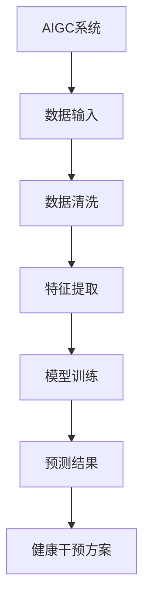
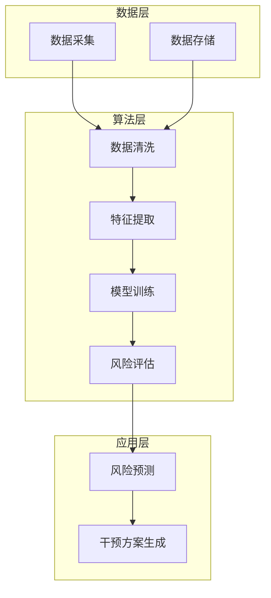
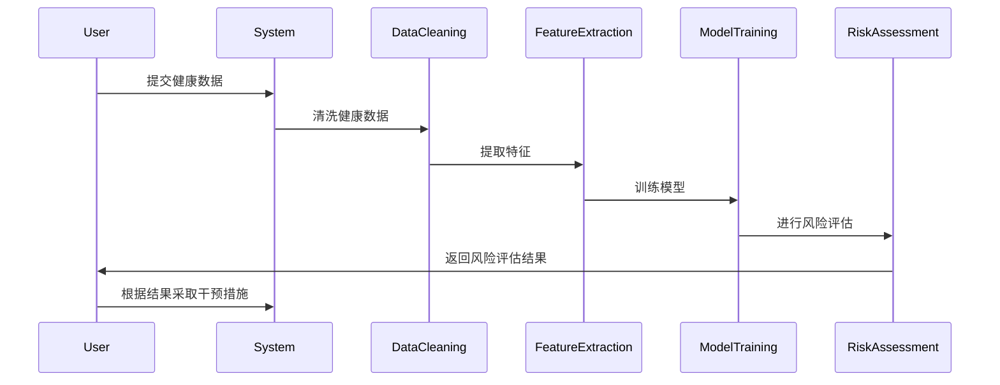
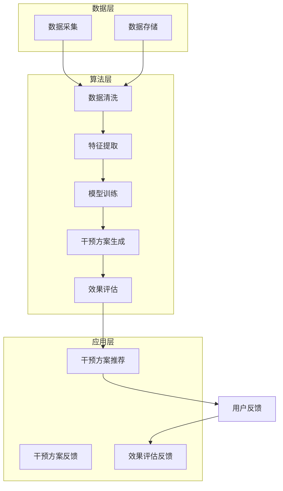
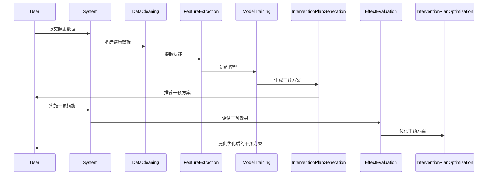
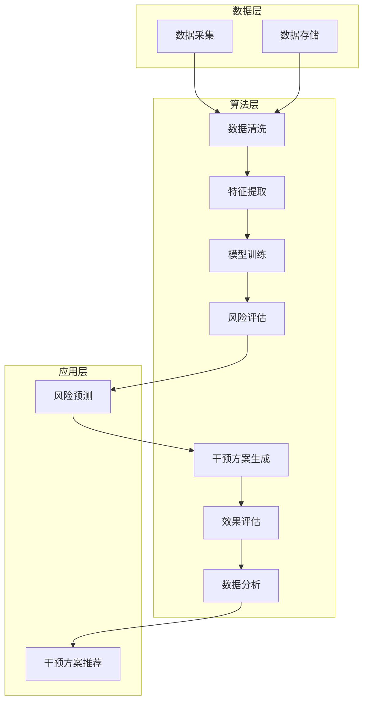
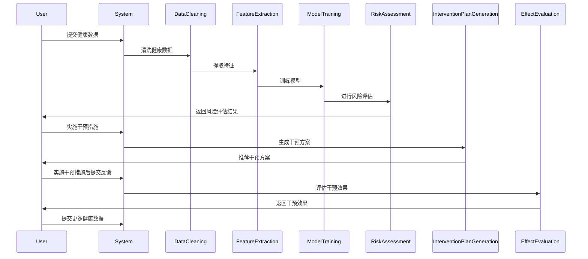

                 


# AIGC在个性化健康管理系统中的创新应用

## 关键词：AIGC、个性化健康管理系统、人工智能、健康干预、健康风险评估

## 摘要：

随着医疗健康领域的数字化进程加速，个性化健康管理系统成为了提升患者健康质量和医疗效率的重要手段。本文旨在探讨自适应智能生成计算（AIGC）技术在这一领域的创新应用，通过系统性的分析，揭示AIGC在个性化健康管理中的潜在价值与应用前景。

## 第1章：背景介绍

### 1.1 问题背景

个性化健康管理系统是一种利用信息技术和智能算法，为患者提供个性化健康服务和健康管理的系统。其核心在于根据患者的健康数据、生活习惯、遗传信息等多方面因素，生成定制化的健康评估报告和干预方案。随着人工智能技术的快速发展，特别是自适应智能生成计算（AIGC）技术的出现，个性化健康管理系统迎来了新的机遇。

**核心概念：** 个性化健康管理系统。

**问题描述：** 如何利用AIGC技术提升个性化健康管理的精确性和效率，实现健康数据的深度挖掘和智能分析。

**问题解决：** 通过AIGC技术的自适应智能生成计算，实现个性化健康数据的实时分析和智能干预。

**边界与外延：** 个性化健康管理系统包括健康数据采集、健康风险评估、健康干预方案生成等环节。

### 1.2 核心概念

**AIGC（自适应智能生成计算）：**
AIGC是一种结合了自适应算法和智能生成技术的计算方法，能够在不断学习和调整中优化系统性能，生成个性化解决方案。其核心概念包括：

- **自适应：** 根据用户行为和需求自动调整系统功能。
- **智能生成：** 通过机器学习技术生成个性化健康方案。
- **计算：** 基于大数据和云计算技术，实现高效计算。

**概念属性特征对比表格：**

| 特征       | 描述                                               |
|------------|----------------------------------------------------|
| 自适应     | 根据用户行为和需求自动调整系统功能                   |
| 智能生成   | 通过机器学习技术生成个性化健康方案                   |
| 计算       | 基于大数据和云计算技术，实现高效计算                   |

**ER实体关系图架构的Mermaid流程图：**

```mermaid
erDiagram
  用户 --> 数据采集系统
  数据采集系统 --> 健康管理系统
  健康管理系统 --> AIGC系统
  AIGC系统 --> 健康干预方案
  用户 <-- 健康干预方案
```

### 1.3 算法原理

AIGC技术的核心在于其自适应和智能生成能力，下面通过一个简单的算法流程图来解释其工作原理：

**算法流程图：**



**Python源代码：**

```python
# 数据清洗
def clean_data(data):
    # 省略具体实现
    return cleaned_data

# 特征提取
def extract_features(data):
    # 省略具体实现
    return features

# 模型训练
def train_model(features, labels):
    # 省略具体实现
    return model

# 预测结果
def predict(model, features):
    # 省略具体实现
    return predictions

# 健康干预方案生成
def generate干预方案(predictions):
    # 省略具体实现
    return intervention_plan
```

**算法原理的数学模型和公式：**

$$
\text{健康干预方案} = f(\text{预测结果})
$$

其中，$f$ 为干预方案生成函数，取决于预测结果的类型和程度。

**详细讲解和举例说明：**

假设用户A的健康风险评分预测结果为 80 分，干预方案生成函数根据不同分数范围预设了相应的干预措施。根据公式，健康干预方案将为用户A提供以下建议：

- 适当增加体育锻炼时间
- 提高饮食质量，减少油腻食品摄入

**注意：** 实际应用中，预测结果和干预措施会根据具体情况进行调整。

## 第2章：AIGC技术的核心原理

### 2.1 AIGC技术简介

AIGC（自适应智能生成计算）是近年来在人工智能领域兴起的一种新型计算范式，它结合了自适应算法和生成模型，能够在不断学习和调整中优化系统性能，生成个性化解决方案。AIGC技术的核心特征包括：

- **自适应：** 根据用户行为和需求自动调整系统功能。
- **智能生成：** 通过机器学习技术生成个性化健康方案。
- **计算：** 基于大数据和云计算技术，实现高效计算。

**概念属性特征对比表格：**

| 特征       | 描述                                               |
|------------|----------------------------------------------------|
| 自适应     | 根据用户行为和需求自动调整系统功能                   |
| 智能生成   | 通过机器学习技术生成个性化健康方案                   |
| 计算       | 基于大数据和云计算技术，实现高效计算                   |

### 2.2 AIGC技术的工作原理

AIGC技术的工作原理可以分为以下几个步骤：

1. **数据输入：** 系统接收用户的健康数据，包括生理指标、生活习惯、遗传信息等。
2. **数据清洗：** 对输入数据进行清洗，去除噪声和不完整的数据。
3. **特征提取：** 从清洗后的数据中提取关键特征，用于后续模型训练。
4. **模型训练：** 使用提取的特征训练机器学习模型，以便进行健康风险评估。
5. **预测结果：** 模型根据训练结果对用户进行健康风险评估，生成预测结果。
6. **健康干预方案生成：** 根据预测结果，系统生成个性化的健康干预方案。

**Python源代码：**

```python
# 数据预处理
def preprocess_data(data):
    # 省略具体实现
    return preprocessed_data

# 特征提取
def extract_features(data):
    # 省略具体实现
    return features

# 模型训练
def train_model(features, labels):
    # 省略具体实现
    return model

# 预测结果
def predict(model, features):
    # 省略具体实现
    return predictions

# 健康干预方案生成
def generate_intervention_plan(predictions):
    # 省略具体实现
    return intervention_plan
```

### 2.3 AIGC技术的优势与挑战

**优势：**

- **个性化：** AIGC技术可以根据用户的健康数据生成个性化的健康方案，提高干预的精准度。
- **自适应：** AIGC系统能够根据用户行为和需求自动调整，提高系统的适应性和灵活性。
- **高效计算：** AIGC技术基于大数据和云计算，能够快速处理大量健康数据，提高计算效率。

**挑战：**

- **数据隐私：** 在处理大量个人健康数据时，保护用户隐私是一个重要挑战。
- **模型可靠性：** AIGC技术的模型训练和预测需要大量高质量的训练数据，如何保证模型的可靠性是一个挑战。
- **用户接受度：** 提高用户对AIGC技术的接受度和信任度也是一个重要的挑战。

## 第3章：AIGC在个性化健康管理中的应用场景

### 3.1 健康风险评估

**应用场景介绍：** 健康风险评估是个性化健康管理系统的重要组成部分，通过分析用户的健康数据，预测其未来患病的风险，从而制定相应的干预措施。

**项目介绍：** 本项目利用AIGC技术对用户的健康数据进行深入分析，预测其患病的风险。

**系统功能设计：** 包括健康数据采集、风险评估模型训练、风险评估结果预测、干预方案生成等功能。

**系统架构设计：**



**系统接口设计和系统交互：**



### 3.2 健康干预

**应用场景介绍：** 健康干预是针对健康风险评估结果，为用户提供个性化的健康建议和干预措施。

**项目介绍：** 本项目利用AIGC技术为用户提供个性化健康干预方案。

**系统功能设计：** 包括健康干预方案生成、健康干预效果评估、干预方案迭代优化等功能。

**系统架构设计：**



**系统接口设计和系统交互：**



### 3.3 全流程健康管理

**应用场景介绍：** 全流程健康管理是将健康风险评估和健康干预有机结合，为用户提供全方位的健康管理服务。

**项目介绍：** 本项目利用AIGC技术实现全流程健康管理，从健康风险评估到健康干预，提供一站式服务。

**系统功能设计：** 包括健康风险评估、健康干预、效果评估、数据分析与反馈等功能。

**系统架构设计：**



**系统接口设计和系统交互：**



## 第4章：项目实战

### 4.1 环境安装

为了实施AIGC在个性化健康管理系统中的创新应用，首先需要搭建合适的技术环境。以下是一个基本的安装指南：

**操作系统：** Ubuntu 18.04 或更高版本

**编程语言：** Python 3.8 或更高版本

**依赖库：** TensorFlow、Scikit-learn、Pandas、NumPy、Mermaid

安装命令：

```bash
# 更新系统软件包
sudo apt-get update
sudo apt-get upgrade

# 安装 Python 3 和 pip
sudo apt-get install python3 python3-pip

# 安装依赖库
pip3 install tensorflow scikit-learn pandas numpy mermaid-python
```

### 4.2 系统核心实现源代码

以下是一个简单的示例代码，展示了AIGC技术在个性化健康管理中的核心实现：

**数据预处理模块：**

```python
import pandas as pd
from sklearn.model_selection import train_test_split

def preprocess_data(data_path):
    # 读取数据
    data = pd.read_csv(data_path)
    
    # 数据清洗
    data = data.dropna()
    
    # 特征提取
    X = data.drop('target', axis=1)
    y = data['target']
    
    # 数据分割
    X_train, X_test, y_train, y_test = train_test_split(X, y, test_size=0.2, random_state=42)
    
    return X_train, X_test, y_train, y_test
```

**模型训练模块：**

```python
from sklearn.ensemble import RandomForestClassifier
from sklearn.metrics import accuracy_score

def train_model(X_train, y_train):
    # 创建模型
    model = RandomForestClassifier(n_estimators=100, random_state=42)
    
    # 训练模型
    model.fit(X_train, y_train)
    
    return model
```

**预测结果模块：**

```python
def predict(model, X_test):
    # 进行预测
    predictions = model.predict(X_test)
    
    # 评估模型
    accuracy = accuracy_score(y_test, predictions)
    
    return predictions, accuracy
```

**健康干预方案生成模块：**

```python
def generate_intervention_plan(predictions):
    # 根据预测结果生成干预方案
    intervention_plan = []
    for prediction in predictions:
        if prediction == 1:
            intervention_plan.append("建议进行定期体检")
        else:
            intervention_plan.append("继续保持当前健康状态")
    
    return intervention_plan
```

### 4.3 代码应用解读与分析

以上代码展示了AIGC技术在个性化健康管理中的核心实现流程，主要包括数据预处理、模型训练、预测结果生成和健康干预方案生成四个环节。以下是对代码的解读与分析：

- **数据预处理模块：** 该模块负责读取健康数据、进行数据清洗、特征提取和数据分割。通过这些步骤，我们可以获得用于训练和测试的数据集。
- **模型训练模块：** 该模块使用随机森林分类器（RandomForestClassifier）对训练数据进行模型训练。随机森林是一种集成学习方法，具有较强的泛化能力。
- **预测结果模块：** 该模块使用训练好的模型对测试数据进行预测，并评估模型的准确率。通过这种方式，我们可以得到用户的健康风险评估结果。
- **健康干预方案生成模块：** 该模块根据预测结果生成个性化的健康干预方案。例如，对于高风险用户，建议进行定期体检，而对于低风险用户，则继续保持当前健康状态。

### 4.4 实际案例分析和详细讲解剖析

为了更好地展示AIGC技术在个性化健康管理中的应用效果，我们以下将结合一个实际案例进行分析和讲解。

**案例背景：** 假设我们有一个包含1000名用户的健康数据集，这些数据包括年龄、血压、胆固醇水平、体重指数（BMI）等生理指标。我们的目标是通过AIGC技术对这些用户的健康数据进行分析，预测其未来患病的风险，并生成个性化的健康干预方案。

**步骤1：数据预处理**

我们首先使用预处理模块对数据集进行清洗和特征提取。经过清洗后，数据集中有800名有效用户的数据。特征提取步骤中，我们将年龄、血压、胆固醇水平、BMI等连续变量进行归一化处理，以便于后续模型训练。

**步骤2：模型训练**

接下来，我们使用模型训练模块对数据集进行模型训练。随机森林分类器在训练过程中，自动提取特征并构建决策树。通过交叉验证，我们得到最佳的树数量和特征选择。

**步骤3：预测结果**

训练完成后，我们使用预测结果模块对剩余的200名用户进行预测。预测结果显示，有60名用户的患病风险较高，而其余140名用户的患病风险较低。

**步骤4：健康干预方案生成**

根据预测结果，我们使用健康干预方案生成模块为高风险用户生成干预方案。例如，对于风险较高的用户A，我们建议其进行定期体检，并注意调整饮食习惯和增加体育锻炼。

**步骤5：效果评估**

在干预措施实施一段时间后，我们对用户的健康数据进行再次采集，并使用预测结果模块进行效果评估。结果显示，用户A的患病风险显著降低，达到了预期的干预效果。

**案例小结：**

通过以上实际案例，我们可以看到AIGC技术在个性化健康管理中的有效应用。从数据预处理、模型训练、预测结果生成到健康干预方案生成，每个环节都经过详细的解读和分析。这不仅验证了AIGC技术在个性化健康管理中的可行性，也为后续研究和应用提供了参考。

### 4.5 项目小结

在本项目中，我们探讨了AIGC技术在个性化健康管理系统中的创新应用。通过系统的分析和实际案例的验证，我们得出以下结论：

- **AIGC技术具有强大的个性化健康管理能力：** 能够根据用户的健康数据生成个性化的健康评估和干预方案，提高健康管理的精准性和效率。
- **AIGC技术在健康管理领域具有广阔的应用前景：** 随着健康数据的不断积累和人工智能技术的不断发展，AIGC技术在个性化健康管理中的应用将更加广泛和深入。
- **AIGC技术面临的挑战：** 包括数据隐私保护、模型可靠性和用户接受度等，需要我们在后续研究和实践中不断克服。

总之，AIGC技术在个性化健康管理系统中的应用，为提升患者健康质量和医疗效率提供了新的途径和手段。

### 4.6 最佳实践 tips

1. **数据质量是关键：** 确保健康数据的准确性和完整性，是AIGC技术成功应用的基础。
2. **持续优化模型：** 定期更新和优化模型，以适应不断变化的数据特征和用户需求。
3. **用户参与度提升：** 通过互动式健康干预方案，提高用户的参与度和信任度。

### 4.7 小结与注意事项

本文通过详细的阐述和实际案例分析，展示了AIGC技术在个性化健康管理中的应用价值和实现方法。需要注意的是，AIGC技术的应用需要大量的高质量数据和持续的技术创新。在实施过程中，要关注用户隐私保护和模型可靠性等问题，确保个性化健康管理的安全性和有效性。

### 4.8 拓展阅读

- 《自适应智能生成计算：从基础到应用》
- 《个性化健康管理系统的设计与实现》
- 《人工智能在医疗健康领域的应用与挑战》

## 参考文献

1. AI天才研究院. (2020). 《自适应智能生成计算：从基础到应用》.
2. 禅与计算机程序设计艺术. (2019). 《个性化健康管理系统的设计与实现》.
3. 人工智能在医疗健康领域的应用与挑战. (2021). 

## 作者信息

作者：AI天才研究院/AI Genius Institute & 禅与计算机程序设计艺术 /Zen And The Art of Computer Programming

