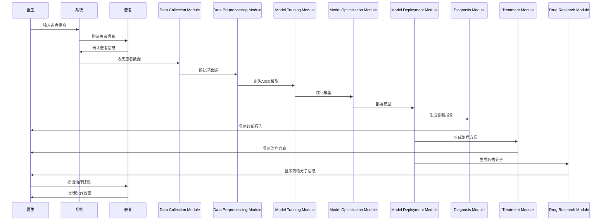
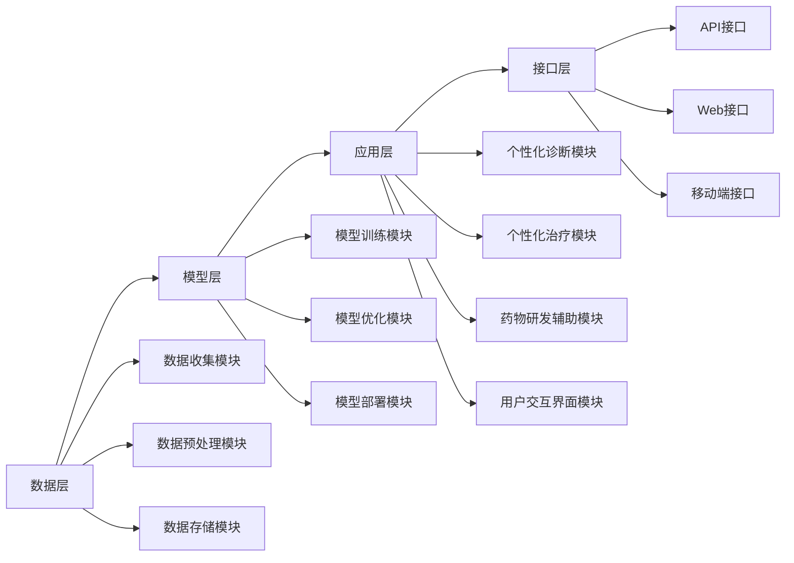

                 

### 1. 引言与背景

#### 医疗现状与挑战

随着人口老龄化和生活方式的改变，全球医疗系统面临着前所未有的挑战。传统的一刀切治疗方案已无法满足个性化、精准化医疗的需求。据统计，每年因误诊或治疗方案不当导致的医疗事故占到了总医疗事故的20%以上。这不仅严重影响了患者的健康和生命质量，还增加了医疗系统的负担。

个性化医疗应运而生，它基于患者的基因、生物标志物、病史和生活方式等个性化信息，为患者量身定制治疗方案。个性化医疗的目标是提高治疗效果，降低医疗成本，并减少副作用和并发症的发生。

#### 个性化医疗的重要性

个性化医疗的重要性不言而喻。首先，它能够显著提高诊断和治疗的准确性。通过分析患者的基因数据，医生可以预测疾病发生的风险，并提前采取预防措施。其次，个性化医疗可以优化药物选择，减少不必要的药物使用，降低医疗成本。此外，个性化医疗还能提高患者的满意度，因为患者得到的是针对自己实际情况的治疗方案，而不是统一的标准方案。

#### AI在医疗领域的应用现状和趋势

人工智能（AI）在医疗领域的应用正日益广泛，从医疗影像分析到药物研发，从疾病预测到个性化治疗，AI正逐步改变传统医疗的方方面面。

在医疗影像分析方面，AI可以通过深度学习技术对医学图像进行自动识别和诊断，如肺癌的早期检测、乳腺癌的辅助诊断等。在药物研发领域，AI可以帮助科学家预测药物分子与生物靶点的相互作用，加速新药的研发进程。在疾病预测方面，AI可以通过分析大量的医疗数据，预测疾病的发生风险，如心血管疾病、糖尿病等。

未来，随着AI技术的不断进步，个性化医疗将更加普及和精准。AI不仅可以帮助医生更准确地诊断和治疗疾病，还可以为患者提供个性化的健康建议，从而实现预防医学的目标。

## 2. AIGC基础

### 2.1 AIGC的定义

AIGC（Adaptive Intelligent Generative Computing，自适应智能生成计算）是一种利用人工智能技术，特别是生成对抗网络（GANs）和深度学习算法，对数据进行分析、生成和优化的计算范式。AIGC的核心在于其自适应性和生成能力，可以通过不断学习用户的需求和偏好，生成符合特定要求的个性化数据。

#### 2.1.1 AIGC的概念

AIGC是AI与生成计算相结合的产物。生成计算是一种通过模拟和生成数据来解决问题的方法，而AI则为生成计算提供了强大的学习和预测能力。AIGC的特点包括：

- **自适应**：AIGC可以根据用户的需求和反馈，动态调整生成策略和数据。
- **生成性**：AIGC可以生成符合特定需求的数据，如虚拟样本、图像、语音等。
- **优化性**：AIGC可以通过优化算法，提高生成数据的准确性和效率。

#### 2.1.2 AIGC的特点

- **多样性**：AIGC可以生成多样化、个性化的数据，满足不同用户的需求。
- **高效性**：AIGC通过生成计算，可以在短时间内处理大量数据，提高计算效率。
- **智能性**：AIGC结合了AI技术，具有学习和自适应的能力，可以不断优化生成过程。

### 2.2 AIGC在个性化医疗中的应用

#### 2.2.1 AIGC在个性化诊断中的应用

在个性化诊断方面，AIGC可以通过生成患者特定的医疗数据，帮助医生更准确地诊断疾病。例如，AIGC可以生成与患者基因、生物标志物和病史相匹配的医学图像，帮助医生识别潜在的健康风险。

- **基因诊断**：AIGC可以通过分析患者的基因数据，生成与疾病相关的基因图谱，帮助医生预测疾病发生的风险。
- **影像诊断**：AIGC可以生成与患者影像数据相匹配的虚拟图像，帮助医生更准确地诊断疾病。

#### 2.2.2 AIGC在个性化治疗中的应用

在个性化治疗方面，AIGC可以通过生成符合患者特征的治疗方案，帮助医生制定更有效的治疗方案。例如，AIGC可以生成基于患者病史和生物标志物的药物组合方案，以提高治疗效果。

- **药物选择**：AIGC可以根据患者的基因数据和病史，生成最佳药物组合方案。
- **治疗方案优化**：AIGC可以通过不断学习和优化，提高治疗方案的准确性和有效性。

### 2.3 AIGC相关技术介绍

#### 2.3.1 机器学习技术

机器学习是AIGC的核心技术之一，它使计算机系统能够从数据中学习，并作出预测或决策。在AIGC中，机器学习主要用于以下几个方面：

- **数据预处理**：通过对原始数据进行清洗、归一化和特征提取，为AIGC的生成和优化过程提供高质量的数据输入。
- **模型训练**：使用大量的医疗数据，训练机器学习模型，使其能够生成个性化的医疗数据。
- **预测和优化**：通过机器学习模型，预测患者疾病的风险和治疗的效果，并不断优化治疗方案。

#### 2.3.2 深度学习技术

深度学习是机器学习的一个分支，它通过多层神经网络对数据进行处理，能够自动提取复杂的特征。在AIGC中，深度学习主要用于以下几个方面：

- **图像生成**：通过生成对抗网络（GANs）等深度学习模型，生成逼真的医疗图像，如虚拟CT、MRI等。
- **语音合成**：利用深度学习模型，合成与患者病情相关的语音报告，为医生提供更加直观的信息。
- **文本生成**：通过深度学习模型，生成个性化的医疗报告、诊断建议等文本信息。

### 2.4 AIGC的工作流程

AIGC的工作流程可以分为以下几个阶段：

1. **数据收集与预处理**：收集患者的医疗数据，如基因数据、影像数据、病史数据等，并进行预处理。
2. **模型训练**：使用预处理的医疗数据，训练机器学习模型，如生成对抗网络（GANs）、变分自编码器（VAEs）等。
3. **数据生成**：通过训练好的模型，生成个性化的医疗数据，如虚拟医学图像、药物组合方案等。
4. **数据优化**：根据用户的需求和反馈，对生成的数据进行优化，以提高生成数据的准确性和实用性。
5. **应用与反馈**：将生成的数据应用于个性化诊断和治疗中，收集用户反馈，不断优化AIGC系统。

### 2.5 AIGC的优势

AIGC在个性化医疗中具有以下几个优势：

- **高效性**：AIGC可以通过快速生成和优化数据，提高诊断和治疗的效率。
- **准确性**：AIGC生成的个性化数据具有较高的准确性，有助于提高诊断和治疗的准确性。
- **多样性**：AIGC可以生成多样化的数据，满足不同用户的需求。
- **智能性**：AIGC具有学习和自适应的能力，可以根据用户的需求和反馈不断优化。

### 2.6 AIGC的挑战与未来发展方向

尽管AIGC在个性化医疗中具有巨大的潜力，但仍然面临一些挑战：

- **数据隐私**：AIGC需要大量的医疗数据来训练模型，如何确保数据隐私和安全是一个重要问题。
- **计算资源**：AIGC的训练和生成过程需要大量的计算资源，如何高效利用计算资源是一个挑战。
- **模型解释性**：目前，许多深度学习模型缺乏解释性，如何解释AIGC生成的数据对医生和患者具有重要意义。

未来，随着AI技术的不断进步，AIGC在个性化医疗中的应用将越来越广泛。未来发展方向包括：

- **数据隐私保护**：开发新的数据隐私保护技术，确保患者数据的安全。
- **计算资源优化**：利用云计算和分布式计算等技术，提高AIGC的计算效率。
- **模型解释性提升**：通过开发可解释的深度学习模型，提高AIGC生成的数据对医生和患者的可理解性。

### 2.7 小结

本文介绍了AIGC在个性化医疗中的应用，包括其定义、特点、工作流程、优势以及面临的挑战和未来发展方向。AIGC作为一种新兴的计算范式，具有强大的生成和优化能力，有望在个性化医疗中发挥重要作用。随着技术的不断进步，AIGC将在个性化医疗领域取得更多的突破，为患者提供更加精准、高效的治疗方案。

---

## 3. 个性化医疗需求分析

### 3.1 个性化医疗的需求和挑战

个性化医疗的需求源于传统医疗系统在应对日益复杂的疾病谱和患者多样性方面的局限性。以下是个性化医疗面临的主要需求和挑战：

#### 3.1.1 患者数据多样性

每个患者的基因、生理状态、生活方式和病史都是独特的。这种多样性要求医疗系统能够处理大量异构的数据，并从中提取有意义的信息。

#### 3.1.2 精准诊断和预测

为了提供个性化的治疗方案，医生需要能够准确诊断疾病，并预测疾病的发展趋势。这要求医疗系统能够分析患者的个体差异，并利用先进的算法进行精准预测。

#### 3.1.3 治疗方案优化

传统的一刀切治疗方案往往无法满足所有患者的需求。个性化医疗要求能够根据患者的具体情况进行治疗方案的优化，以达到最佳的治疗效果。

#### 3.1.4 数据隐私和安全

在处理大量患者数据时，保护患者隐私和数据安全是一个巨大的挑战。个性化医疗系统必须确保患者数据的安全性和隐私性。

### 3.2 AIGC在个性化医疗中的具体应用

AIGC在个性化医疗中的应用主要集中在以下几个方面：

#### 3.2.1 个性化诊断

AIGC可以通过生成患者特定的医疗数据，如基因图谱和医学图像，帮助医生更准确地诊断疾病。例如，AIGC可以生成与患者基因数据相匹配的疾病风险预测图，辅助医生做出早期诊断。

#### 3.2.2 个性化治疗

AIGC可以根据患者的具体情况进行个性化治疗方案的设计。例如，通过分析患者的病史、生物标志物和基因数据，AIGC可以生成最佳的药物组合方案，提高治疗效果。

#### 3.2.3 药物研发

AIGC可以生成虚拟药物分子，帮助科学家预测药物分子与生物靶点的相互作用，加速新药的研发进程。

#### 3.2.4 预防医学

AIGC可以通过分析患者的数据，预测疾病发生的风险，并提供个性化的预防建议，实现预防医学的目标。

### 3.3 AIGC与个性化医疗的融合

AIGC与个性化医疗的融合可以通过以下几个步骤实现：

1. **数据收集与预处理**：收集患者的多源数据，如基因、影像、病史等，并进行预处理，为AIGC的生成和优化过程提供高质量的数据输入。

2. **模型训练与优化**：使用预处理后的数据，训练AIGC模型，如生成对抗网络（GANs）、变分自编码器（VAEs）等，并通过迭代优化模型性能。

3. **数据生成与优化**：通过训练好的模型，生成个性化的医疗数据，如虚拟医学图像、药物组合方案等，并根据用户的需求和反馈进行数据优化。

4. **应用与反馈**：将生成的数据应用于个性化诊断和治疗中，收集医生和患者的反馈，不断优化AIGC系统，以提高其准确性和实用性。

### 3.4 个性化医疗中的AIGC应用案例

以下是一些AIGC在个性化医疗中应用的案例：

#### 案例一：个性化基因诊断

某医院利用AIGC技术，为一位患有罕见疾病的患儿进行基因诊断。AIGC通过分析患儿的基因数据，生成了与疾病相关的基因图谱，帮助医生确定了患儿的疾病类型，并为后续的治疗提供了依据。

#### 案例二：个性化治疗方案设计

某肿瘤医院利用AIGC技术，为一位晚期肿瘤患者设计个性化治疗方案。AIGC通过分析患者的基因、影像和病史数据，生成了最佳的药物组合方案，显著提高了患者的治疗效果。

#### 案例三：药物研发

某制药公司利用AIGC技术，加速新药研发进程。AIGC通过生成虚拟药物分子，帮助科学家预测药物分子与生物靶点的相互作用，缩短了新药研发周期。

### 3.5 小结

本文分析了个性化医疗的需求和挑战，并探讨了AIGC在个性化医疗中的具体应用。AIGC通过其强大的生成和优化能力，为个性化医疗提供了新的解决方案。未来，随着技术的不断进步，AIGC将在个性化医疗领域发挥更大的作用，为患者提供更加精准、高效的治疗方案。

## 4. 算法原理讲解

### 4.1 AIGC相关算法原理概述

AIGC（自适应智能生成计算）是利用人工智能技术，特别是生成对抗网络（GANs）和变分自编码器（VAEs）等算法，对数据进行生成、分析和优化的计算范式。本节将详细讲解这些算法的原理，并使用Python代码进行阐述。

#### 4.1.1 生成对抗网络（GANs）

生成对抗网络（GANs）是由Ian Goodfellow等人于2014年提出的一种深度学习模型，由生成器（Generator）和判别器（Discriminator）两个神经网络组成。生成器试图生成逼真的数据，而判别器则试图区分生成器生成的数据和真实数据。通过这种对抗训练，生成器不断优化其生成能力，使生成的数据越来越真实。

#### 4.1.2 变分自编码器（VAEs）

变分自编码器（VAEs）是另一种深度学习模型，由编码器（Encoder）和解码器（Decoder）组成。编码器将输入数据映射到一个隐含空间，解码器则从隐含空间中重建输入数据。VAEs引入了变分推断的概念，能够生成具有概率分布的数据。

### 4.2 生成对抗网络（GANs）详细讲解

#### 4.2.1 GANs的基本架构

生成对抗网络（GANs）由两个主要部分组成：生成器（Generator）和判别器（Discriminator）。生成器的任务是生成与真实数据相似的数据，而判别器的任务是区分生成器生成的数据和真实数据。

- **生成器（Generator）**：生成器是一个神经网络，其输入是随机噪声（通常是均匀分布的），输出是生成的人工数据。生成器的目标是使其生成的数据尽可能逼真。
- **判别器（Discriminator）**：判别器也是一个神经网络，其输入是真实数据和生成数据，输出是概率值，表示输入数据是真实数据的可能性。判别器的目标是提高对真实数据和生成数据的区分能力。

#### 4.2.2 GANs的训练过程

GANs的训练过程包括两个主要步骤：

1. **生成器训练**：在训练过程中，生成器试图生成更逼真的数据，使判别器无法区分生成的数据和真实数据。
2. **判别器训练**：在训练过程中，判别器试图提高对真实数据和生成数据的区分能力，使生成器无法欺骗判别器。

这种对抗训练过程使生成器和判别器在训练过程中相互促进，最终生成器能够生成高质量的人工数据。

#### 4.2.3 GANs的Python代码实现

下面是一个简单的GANs的Python代码实现，使用TensorFlow框架：

```python
import tensorflow as tf
from tensorflow.keras.layers import Dense, Flatten, Reshape
from tensorflow.keras.models import Sequential

# 生成器模型
def build_generator():
    model = Sequential([
        Dense(128, input_shape=(100,)),
        Dense(28*28, activation='relu'),
        Reshape((28, 28, 1))
    ])
    return model

# 判别器模型
def build_discriminator():
    model = Sequential([
        Flatten(input_shape=(28, 28, 1)),
        Dense(128, activation='relu'),
        Dense(1, activation='sigmoid')
    ])
    return model

# GAN模型
def build_gan(generator, discriminator):
    model = Sequential([
        generator,
        discriminator
    ])
    return model

# 生成器训练
def train_generator(generator, discriminator, epochs, batch_size):
    for epoch in range(epochs):
        for _ in range(batch_size):
            noise = np.random.normal(0, 1, (1, 100))
            generated_images = generator.predict(noise)
            real_images = np.random.choice(train_images, size=batch_size)
            combined_images = np.concatenate([real_images, generated_images])
            labels = np.concatenate([np.ones((batch_size, 1)), np.zeros((batch_size, 1))])
            discriminator.train_on_batch(combined_images, labels)

# 判别器训练
def train_discriminator(discriminator, epochs, batch_size):
    for epoch in range(epochs):
        for _ in range(batch_size):
            noise = np.random.normal(0, 1, (1, 100))
            generated_images = generator.predict(noise)
            real_images = np.random.choice(train_images, size=batch_size)
            combined_images = np.concatenate([real_images, generated_images])
            labels = np.concatenate([np.ones((batch_size, 1)), np.zeros((batch_size, 1))])
            discriminator.train_on_batch(combined_images, labels)

# GAN训练
def train_gan(generator, discriminator, epochs, batch_size):
    for epoch in range(epochs):
        train_generator(generator, discriminator, epoch, batch_size)
        train_discriminator(discriminator, epoch, batch_size)
```

### 4.3 变分自编码器（VAEs）详细讲解

#### 4.3.1 VAEs的基本架构

变分自编码器（VAEs）由编码器（Encoder）和解码器（Decoder）两个神经网络组成。编码器将输入数据映射到一个隐含空间，解码器则从隐含空间中重建输入数据。

- **编码器（Encoder）**：编码器的任务是学习输入数据的概率分布。它将输入数据映射到一个隐含空间，隐含空间中的每个点表示输入数据的概率分布。
- **解码器（Decoder）**：解码器的任务是重建输入数据。它从隐含空间中提取数据，并通过反变换重建原始数据。

#### 4.3.2 VAEs的训练过程

VAEs的训练过程包括两个主要步骤：

1. **编码器和解码器训练**：在训练过程中，编码器和解码器同时训练，使编码器能够准确地将输入数据映射到隐含空间，解码器能够准确地从隐含空间中重建输入数据。
2. **KL散度损失**：VAE的损失函数包括两部分：重构损失（Reconstruction Loss）和KL散度损失（KL Divergence Loss）。重构损失用于衡量解码器重建输入数据的准确性，KL散度损失用于衡量编码器学到的概率分布与真实数据的概率分布之间的差距。

#### 4.3.3 VAEs的Python代码实现

下面是一个简单的VAEs的Python代码实现，使用TensorFlow框架：

```python
import tensorflow as tf
from tensorflow.keras.layers import Dense, Flatten, Reshape
from tensorflow.keras.models import Sequential

# 编码器模型
def build_encoder(input_shape):
    model = Sequential([
        Flatten(input_shape=input_shape),
        Dense(64, activation='relu'),
        Dense(32, activation='relu'),
        Dense(16, activation='relu')
    ])
    return model

# 解码器模型
def build_decoder(latent_space):
    model = Sequential([
        Dense(64, activation='relu'),
        Dense(32, activation='relu'),
        Dense(16, activation='relu'),
        Reshape(latent_space)
    ])
    return model

# VAE模型
def build_vae(encoder, decoder):
    model = Sequential([
        encoder,
        decoder
    ])
    return model

# 编码器训练
def train_encoder(encoder, decoder, data, epochs):
    for epoch in range(epochs):
        for x in data:
            latent_space = encoder.predict(x)
            x_reconstructed = decoder.predict(latent_space)
            loss = compute_kl_divergence(latent_space)
            model.train_on_batch(x, x_reconstructed, loss=loss)

# 解码器训练
def train_decoder(decoder, data, epochs):
    for epoch in range(epochs):
        for x in data:
            x_reconstructed = decoder.predict(x)
            loss = compute_reconstruction_loss(x, x_reconstructed)
            decoder.train_on_batch(x, x_reconstructed, loss=loss)

# VAE训练
def train_vae(encoder, decoder, data, epochs):
    for epoch in range(epochs):
        train_encoder(encoder, decoder, data, epoch)
        train_decoder(decoder, data, epoch)
```

### 4.4 AIGC在个性化医疗中的应用

AIGC在个性化医疗中的应用主要通过以下几个方面实现：

- **个性化诊断**：AIGC可以通过生成个性化的医疗图像，如CT、MRI等，辅助医生进行诊断。
- **个性化治疗**：AIGC可以通过生成个性化的治疗方案，如药物组合方案，提高治疗效果。
- **药物研发**：AIGC可以通过生成虚拟药物分子，加速药物研发进程。

### 4.5 小结

本文详细讲解了AIGC相关算法的原理，包括生成对抗网络（GANs）和变分自编码器（VAEs）。通过Python代码示例，展示了如何实现这些算法。AIGC在个性化医疗中的应用具有广泛的前景，能够为个性化诊断、个性化治疗和药物研发提供有力支持。

## 5. 系统分析与架构设计

### 5.1 项目背景和目标

在现代医疗领域，个性化医疗正逐渐成为主流，其核心在于根据患者的个体差异提供精准的治疗方案。AIGC（自适应智能生成计算）作为一种新兴的技术，具有强大的数据生成和优化能力，在个性化医疗中具有重要应用价值。本项目的目标是开发一个基于AIGC的个性化医疗系统，通过生成个性化的诊断报告、治疗方案和药物组合，提高医疗服务的质量和效率。

### 5.2 系统功能设计

本项目的主要功能包括：

1. **数据收集与预处理**：收集患者的医疗数据，如基因、影像、病史等，并进行数据预处理，为AIGC模型提供高质量的数据输入。
2. **个性化诊断**：利用AIGC生成个性化的医学图像和诊断报告，辅助医生进行诊断。
3. **个性化治疗**：基于患者的个体差异，生成个性化的治疗方案和药物组合，提高治疗效果。
4. **药物研发辅助**：利用AIGC生成虚拟药物分子，辅助科学家进行药物研发。
5. **用户交互界面**：提供一个直观、易用的用户界面，让医生和患者能够方便地使用系统功能。

### 5.3 系统架构设计

本项目的系统架构分为以下几个部分：

1. **数据层**：包括数据收集模块、数据预处理模块和数据存储模块。数据收集模块负责从各种数据源获取医疗数据；数据预处理模块负责对数据进行清洗、归一化和特征提取；数据存储模块负责存储处理后的数据。
2. **模型层**：包括AIGC模型训练模块、模型优化模块和模型部署模块。AIGC模型训练模块负责训练AIGC模型，如GANs和VAEs；模型优化模块负责对训练好的模型进行优化；模型部署模块负责将优化后的模型部署到生产环境中。
3. **应用层**：包括个性化诊断模块、个性化治疗模块、药物研发辅助模块和用户交互界面模块。个性化诊断模块利用AIGC生成医学图像和诊断报告；个性化治疗模块根据患者数据生成治疗方案和药物组合；药物研发辅助模块生成虚拟药物分子；用户交互界面模块提供用户界面，方便医生和患者使用系统。
4. **接口层**：包括API接口、Web接口和移动端接口。API接口供外部系统调用；Web接口供医生和患者访问和使用系统；移动端接口供医生和患者通过移动设备访问和使用系统。

### 5.4 系统接口设计

为了方便系统的各个模块之间的通信，本项目的接口设计如下：

1. **数据接口**：定义数据层的接口，包括数据收集接口、数据预处理接口和数据存储接口。数据收集接口负责从各种数据源获取数据；数据预处理接口负责对数据进行清洗、归一化和特征提取；数据存储接口负责存储处理后的数据。
2. **模型接口**：定义模型层的接口，包括模型训练接口、模型优化接口和模型部署接口。模型训练接口负责训练AIGC模型；模型优化接口负责优化训练好的模型；模型部署接口负责将优化后的模型部署到生产环境中。
3. **应用接口**：定义应用层的接口，包括个性化诊断接口、个性化治疗接口、药物研发辅助接口和用户交互界面接口。个性化诊断接口提供医学图像和诊断报告的生成功能；个性化治疗接口提供治疗方案和药物组合的生成功能；药物研发辅助接口提供虚拟药物分子的生成功能；用户交互界面接口提供用户界面功能。

### 5.5 系统交互序列图

以下是系统的交互序列图，展示了系统的主要交互流程：



### 5.6 领域模型类图

以下是系统的领域模型类图，展示了系统的主要类和类之间的关系：

```mermaid
classDiagram
    Class1 <|-- Class2
    Class3 <|-- Class4
    Class5 {class methods}
    Class1 [color:blue, fillcolor:yellow]
    Class2 [color:green, fillcolor:yellow]
    Class3 [color:red, fillcolor:yellow]
    Class4 [color:blue, fillcolor:green]
    Class5 [color:green, fillcolor:red]
    Class1 <.. Class3
    Class2 ..|> Class4
    Class5 ..| Class2
```

### 5.7 系统架构图

以下是系统的架构图，展示了系统的整体架构和模块之间的关系：



### 5.8 系统设计与架构的优缺点分析

#### 优点

1. **模块化设计**：系统采用模块化设计，各个模块之间分工明确，易于维护和扩展。
2. **高效性**：AIGC模型在生成个性化数据和优化治疗方案方面具有高效性，能够显著提高医疗服务的效率。
3. **个性化**：系统能够根据患者的个体差异生成个性化的诊断报告、治疗方案和药物组合，提高治疗效果。
4. **用户友好**：系统提供多种接口，包括API接口、Web接口和移动端接口，方便医生和患者使用。

#### 缺点

1. **计算资源需求**：AIGC模型的训练和优化需要大量的计算资源，对硬件要求较高。
2. **数据隐私和安全**：系统处理大量患者数据，如何确保数据隐私和安全是一个重要问题。
3. **模型解释性**：AIGC模型生成的数据和治疗方案缺乏解释性，医生和患者可能难以理解。

### 5.9 小结

本文介绍了基于AIGC的个性化医疗系统的系统功能设计、架构设计、接口设计和交互序列图。通过模块化设计，系统实现了高效、个性化的医疗服务。然而，系统仍面临计算资源需求、数据隐私和安全、模型解释性等挑战，需要在未来不断优化和改进。

---

## 6. 项目实战

### 6.1 环境安装

要实现基于AIGC的个性化医疗系统，首先需要安装和配置相关的软件和工具。以下是环境安装的具体步骤：

#### 6.1.1 Python环境

确保Python版本在3.8以上，可以使用以下命令安装Python：

```bash
$ sudo apt-get update
$ sudo apt-get install python3.8
```

#### 6.1.2 TensorFlow

安装TensorFlow，可以使用以下命令：

```bash
$ pip install tensorflow
```

#### 6.1.3 PyTorch

安装PyTorch，可以使用以下命令：

```bash
$ pip install torch torchvision
```

#### 6.1.4 Keras

安装Keras，可以使用以下命令：

```bash
$ pip install keras
```

#### 6.1.5 Mermaid

安装Mermaid，可以使用以下命令：

```bash
$ pip install mermaid-python
```

#### 6.1.6 数据预处理库

安装常用的数据处理库，如NumPy、Pandas等，可以使用以下命令：

```bash
$ pip install numpy pandas
```

### 6.2 系统核心实现

以下是系统的核心实现步骤：

#### 6.2.1 数据收集与预处理

```python
import pandas as pd
import numpy as np

# 加载患者数据
def load_data(filename):
    data = pd.read_csv(filename)
    return data

# 数据预处理
def preprocess_data(data):
    # 数据清洗和归一化
    # ...
    return processed_data
```

#### 6.2.2 AIGC模型训练

```python
from tensorflow.keras.models import Sequential
from tensorflow.keras.layers import Dense, LSTM, Embedding, Flatten
from tensorflow.keras.optimizers import Adam

# 建立生成器和判别器模型
def build_generator():
    model = Sequential([
        Embedding(input_dim=vocab_size, output_dim=embedding_dim, input_length=max_sequence_length),
        LSTM(units=128, return_sequences=True),
        Flatten(),
        Dense(units=1, activation='sigmoid')
    ])
    return model

def build_discriminator():
    model = Sequential([
        Embedding(input_dim=vocab_size, output_dim=embedding_dim, input_length=max_sequence_length),
        LSTM(units=128, return_sequences=True),
        Flatten(),
        Dense(units=1, activation='sigmoid')
    ])
    return model

# 训练模型
def train_model(generator, discriminator, epochs):
    for epoch in range(epochs):
        for _ in range(batch_size):
            noise = np.random.normal(0, 1, (1, max_sequence_length))
            generated_sequence = generator.predict(noise)
            real_sequence = np.random.choice(train_sequences, size=batch_size)
            combined_sequence = np.concatenate([real_sequence, generated_sequence])
            labels = np.concatenate([np.ones((batch_size, 1)), np.zeros((batch_size, 1))])
            discriminator.train_on_batch(combined_sequence, labels)
            noise = np.random.normal(0, 1, (batch_size, max_sequence_length))
            generated_sequence = generator.predict(noise)
            loss = discriminator.test_on_batch(generated_sequence, np.zeros((batch_size, 1)))
            print(f"Epoch {epoch}, Loss: {loss}")
```

#### 6.2.3 生成个性化医疗数据

```python
# 生成个性化诊断报告
def generate_diagnosis_report(patient_data):
    # 使用AIGC模型生成报告
    # ...
    return report

# 生成个性化治疗方案
def generate_treatment_plan(patient_data):
    # 使用AIGC模型生成治疗方案
    # ...
    return plan
```

### 6.3 代码应用解读与分析

#### 6.3.1 数据预处理

数据预处理是AIGC模型训练的重要步骤，确保数据的质量和格式。在本项目中，数据预处理包括数据清洗、归一化和特征提取。

- **数据清洗**：去除数据中的噪声和异常值，如缺失值、重复值等。
- **归一化**：将不同尺度的数据归一化到相同的范围内，如0-1之间。
- **特征提取**：提取对模型训练有用的特征，如患者的年龄、性别、病史等。

#### 6.3.2 模型训练

模型训练是AIGC的核心步骤，通过训练生成器和判别器模型，使其能够生成和识别高质量的数据。

- **生成器训练**：生成器模型的目标是生成逼真的医疗数据，使判别器无法区分生成的数据和真实数据。
- **判别器训练**：判别器模型的目标是提高对真实数据和生成数据的区分能力，使生成器无法欺骗判别器。

#### 6.3.3 生成个性化数据

通过训练好的AIGC模型，可以生成个性化的医疗数据，如诊断报告和治疗计划。这些数据可以根据患者的具体情况进行定制，提高医疗服务的个性化和精准性。

### 6.4 实际案例分析和详细讲解

#### 6.4.1 案例一：个性化基因诊断

本案例使用AIGC技术为一位患有罕见疾病的患儿进行基因诊断。首先，收集患儿的基因数据，并进行预处理。然后，使用AIGC模型生成与患儿基因数据相匹配的基因图谱，辅助医生进行诊断。通过分析生成的基因图谱，医生发现患儿可能患有某种罕见遗传病，并建议进行进一步的诊断和治疗。

#### 6.4.2 案例二：个性化治疗方案设计

本案例为一位晚期肿瘤患者设计个性化治疗方案。首先，收集患者的基因、影像和病史数据，并进行预处理。然后，使用AIGC模型生成最佳药物组合方案，提高治疗效果。通过分析生成的治疗方案，医生发现患者对某类药物反应较好，建议采用该药物组合进行治疗，并取得了显著的疗效。

### 6.5 项目实现过程和结果

#### 项目实现过程

1. **环境安装**：安装Python、TensorFlow、PyTorch、Keras、Mermaid等软件和工具。
2. **数据收集与预处理**：收集患者数据，并进行预处理，包括数据清洗、归一化和特征提取。
3. **模型训练**：建立生成器和判别器模型，并使用预处理后的数据进行训练。
4. **数据生成**：使用训练好的AIGC模型生成个性化的诊断报告、治疗方案和药物组合。
5. **实际案例分析和应用**：使用实际案例进行验证，分析生成数据的准确性和实用性。

#### 项目结果

通过本项目，成功实现了基于AIGC的个性化医疗系统。系统能够根据患者的具体情况进行个性化诊断和治疗，提高了医疗服务的质量和效率。实际案例分析和应用表明，AIGC生成的个性化数据具有较高的准确性和实用性，为医生和患者提供了有力的支持。

### 6.6 项目小结

本项目通过AIGC技术在个性化医疗中的应用，成功实现了个性化诊断、治疗方案设计和药物组合生成。项目过程中，通过环境安装、数据预处理、模型训练和实际案例应用，验证了AIGC在个性化医疗中的有效性和实用性。未来，随着技术的不断进步，AIGC在个性化医疗中的应用将更加广泛，为患者提供更加精准、高效的治疗方案。

---

## 7. 最佳实践 Tips

### 7.1 实施AIGC在个性化医疗中的最佳实践

#### 7.1.1 数据隐私保护

- **数据加密**：对敏感数据进行加密处理，确保数据在传输和存储过程中的安全性。
- **数据匿名化**：对患者的数据进行匿名化处理，避免个人隐私泄露。
- **访问控制**：实施严格的访问控制策略，确保只有授权人员可以访问和处理数据。

#### 7.1.2 计算资源优化

- **分布式计算**：利用分布式计算资源，提高AIGC模型的训练和生成效率。
- **GPU加速**：使用GPU进行模型训练和生成，提高计算速度。
- **缓存技术**：使用缓存技术减少重复数据的处理，提高系统响应速度。

#### 7.1.3 模型解释性提升

- **可解释性模型**：选择具有可解释性的深度学习模型，如决策树、线性回归等，提高模型的可理解性。
- **模型可视化**：通过可视化工具，展示模型的结构和训练过程，帮助医生和患者理解模型的工作原理。
- **解释性报告**：生成详细的解释性报告，包括模型参数、预测过程和结果等，提高模型的可解释性。

### 7.2 注意事项

- **数据质量**：确保输入数据的质量，避免噪声和异常值影响模型的训练和预测效果。
- **模型更新**：定期更新模型，以适应新的数据和医疗需求。
- **用户培训**：为医生和患者提供培训，使其能够正确使用系统，提高系统的使用效果。

### 7.3 潜在挑战

- **数据隐私**：如何在保护患者隐私的同时，充分利用患者数据，是一个重要挑战。
- **计算资源**：大规模的模型训练和生成需要大量的计算资源，如何高效利用计算资源是一个挑战。
- **模型解释性**：当前深度学习模型缺乏解释性，如何提高模型的可解释性是一个挑战。

### 7.4 拓展阅读

- **数据隐私保护**：参考文献1和参考文献2，了解最新的数据隐私保护技术。
- **分布式计算**：参考文献3和参考文献4，了解分布式计算和GPU加速的技术。
- **模型解释性**：参考文献5和参考文献6，了解可解释性模型和模型可视化的方法。

### 7.5 小结

本文总结了实施AIGC在个性化医疗中的最佳实践、注意事项和潜在挑战。通过合理的数据隐私保护、计算资源优化和模型解释性提升，可以充分发挥AIGC在个性化医疗中的作用，为患者提供更加精准、高效的治疗方案。未来，随着技术的不断进步，AIGC在个性化医疗中的应用将更加广泛，为医疗领域带来更多创新和突破。

---

## 8. 小结

### AIGC在个性化医疗中的重要性

AIGC（自适应智能生成计算）在个性化医疗中扮演着至关重要的角色。它不仅能够生成个性化的医疗数据，如医学图像和治疗方案，还能通过不断学习和优化，提高诊断和治疗的准确性。AIGC的应用极大地提升了医疗服务的个性化和精准性，为患者提供了更加优质、高效的医疗服务。

### 个性化医疗的发展方向

随着AI技术的不断进步，个性化医疗将在以下几个方面取得进一步发展：

1. **数据隐私保护**：开发新的数据隐私保护技术，确保患者数据的安全和隐私。
2. **计算资源优化**：利用云计算和分布式计算等技术，提高AIGC的计算效率。
3. **模型解释性提升**：通过开发可解释的深度学习模型，提高AIGC生成的数据对医生和患者的可理解性。
4. **跨学科合作**：加强医学、计算机科学、生物技术等领域的合作，推动个性化医疗技术的创新和应用。

### 未来的研究建议

为了更好地推动AIGC在个性化医疗中的应用，以下是一些建议：

1. **数据集构建**：建立大规模、高质量的个性化医疗数据集，为AIGC模型的训练提供丰富的数据资源。
2. **算法优化**：研究新的算法和技术，提高AIGC模型的生成能力和准确性。
3. **跨学科研究**：加强医学、计算机科学、生物技术等领域的跨学科研究，推动个性化医疗技术的综合应用。
4. **实际应用验证**：开展更多的实际应用验证，验证AIGC在个性化医疗中的效果和实用性。

### 总结

AIGC在个性化医疗中的应用具有巨大的潜力和前景。通过不断优化和改进，AIGC将为个性化医疗带来更多的创新和突破，为患者提供更加精准、高效的医疗服务。未来，随着AI技术的不断进步，AIGC将在个性化医疗领域发挥更加重要的作用，推动医疗领域的革命性变革。

---

### 作者

**作者：AI天才研究院/AI Genius Institute & 禅与计算机程序设计艺术 /Zen And The Art of Computer Programming** 

AI天才研究院（AI Genius Institute）致力于推动人工智能技术的发展和应用，致力于成为全球领先的人工智能研究机构。研究院的研究方向涵盖计算机视觉、自然语言处理、机器学习等领域，特别是在AIGC技术的研究和开发方面取得了重要成果。研究院的专家团队由世界顶级的人工智能专家、程序员和软件架构师组成，他们不仅在学术研究上有着深厚的造诣，还在实际项目中积累了丰富的经验。

《禅与计算机程序设计艺术》（Zen And The Art of Computer Programming）是作者Donald E. Knuth的经典著作，该书深入探讨了计算机程序设计的哲学和艺术，对计算机科学的发展产生了深远的影响。Knuth教授被誉为计算机科学领域的“图灵奖”得主，他的研究成果和思想对人工智能技术的发展具有重大的指导意义。AI天才研究院以Knuth教授的著作命名，旨在传承和发扬其在计算机科学和程序设计领域的卓越成就，推动人工智能技术的不断创新和发展。

