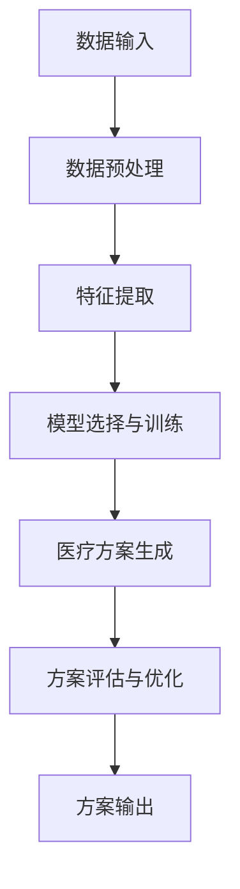
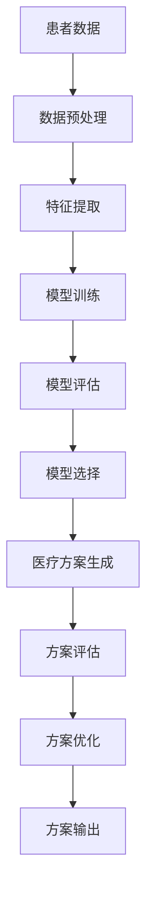
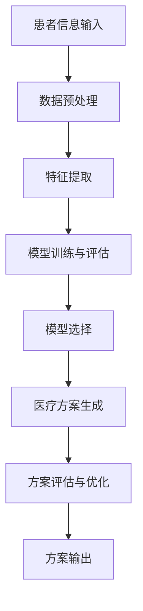
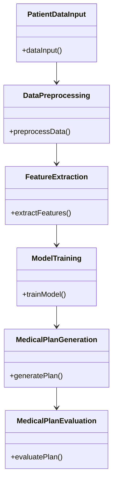
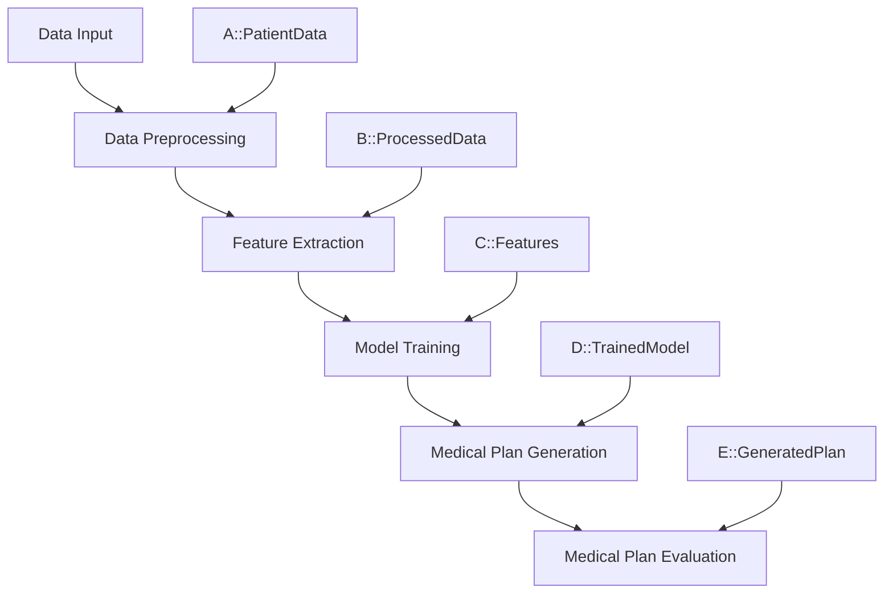
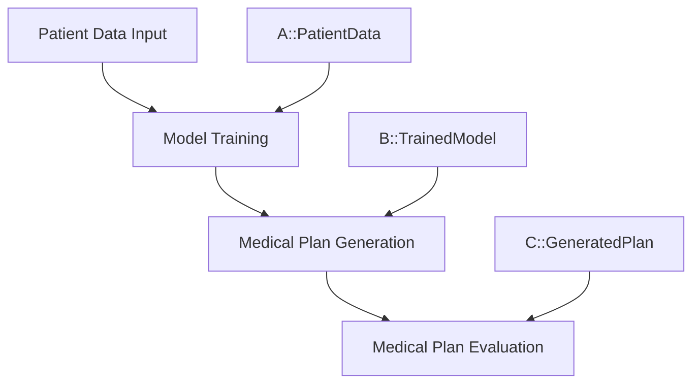
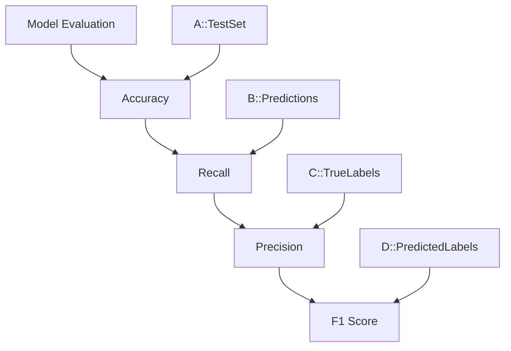
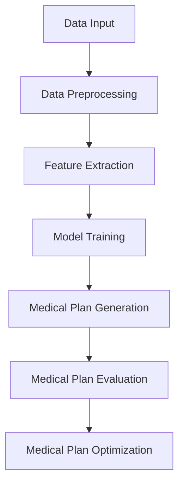

                 

### 第一部分：AIGC在个性化医疗方案设计中的应用背景

#### 第1章：AIGC技术概述

##### 1.1 AIGC的基本概念

AIGC（Auto Generated by AI with Contextual Guidance）是一种先进的人工智能生成内容技术，它结合了生成对抗网络（GAN）、自然语言处理（NLP）和深度学习等前沿技术，通过自动生成具有上下文关联的内容，实现了文本、图像、视频等多媒体数据的智能化创作。AIGC的核心在于其能够根据用户提供的指导信息，自主生成高质量、多样化的内容，极大地提高了内容创作的效率和质量。

**AIGC的定义：** AIGC是一种利用人工智能算法，特别是生成模型，在给定上下文信息的情况下，自动生成具有特定目标和风格的内容的技术。

**AIGC的核心技术：**
- **生成对抗网络（GAN）**：GAN由生成器和判别器组成，通过不断训练，生成器能够生成越来越接近真实数据的假数据，而判别器则不断区分真实数据和生成数据，二者相互对抗，共同提升生成效果。
- **自然语言处理（NLP）**：NLP技术用于处理和生成自然语言文本，包括文本理解、语义分析、语言生成等。
- **深度学习**：深度学习是AIGC技术的基础，它通过多层神经网络学习大量数据中的模式和规律，从而实现高度智能化的内容生成。

**AIGC的发展历程：**
- **早期探索**：20世纪初，神经网络和深度学习技术的出现为AIGC的发展奠定了基础。2014年，生成对抗网络（GAN）的提出标志着AIGC技术的初步成熟。
- **快速发展**：近年来，随着计算能力和数据资源的不断提升，AIGC技术得到了迅猛发展。自然语言处理技术的进步使得AIGC在文本生成领域取得了显著成果。
- **应用拓展**：当前，AIGC技术已逐渐应用于游戏、广告、教育、医疗等多个领域，为各行各业带来了创新性的解决方案。

##### 1.2 个性化医疗方案设计的现状与挑战

**个性化医疗方案设计的现状：**
- **数据积累**：随着医疗大数据的积累，越来越多的医学信息和患者数据被收集和存储，为个性化医疗方案设计提供了丰富的数据资源。
- **技术进步**：人工智能、机器学习和生物信息学等技术的快速发展，为个性化医疗方案设计提供了强有力的支持。
- **市场需求**：随着人们对健康需求的不断提高，个性化医疗方案设计已成为医疗行业的重要发展方向。

**个性化医疗方案设计的挑战：**
- **数据质量**：医疗数据的质量直接影响个性化医疗方案的设计效果。数据的不完整性、不一致性和噪声问题需要有效解决。
- **数据隐私**：医疗数据涉及患者隐私，如何在保护患者隐私的前提下进行数据分析和利用，是一个亟待解决的问题。
- **算法准确性**：个性化医疗方案设计的核心在于算法的准确性，如何提高算法的性能和鲁棒性，是当前研究的热点问题。
- **跨学科协作**：个性化医疗方案设计需要医学、工程学、计算机科学等多个领域的专家共同合作，实现跨学科的协同创新。

**AIGC在个性化医疗中的应用前景：**
- **数据预处理与特征提取**：AIGC技术可以自动处理和清洗医疗数据，提取关键特征，提高数据质量和特征提取的效率。
- **模型训练与优化**：AIGC技术可以自动选择和训练合适的模型，优化模型参数，提高模型的性能和准确性。
- **医疗方案生成与评估**：AIGC技术可以自动生成个性化的医疗方案，并对方案进行评估和优化，提高医疗方案的科学性和实用性。

##### 1.3 本章小结

本章首先介绍了AIGC技术的基本概念、核心技术和发展历程，然后分析了个性化医疗方案设计的现状和挑战，最后阐述了AIGC在个性化医疗中的应用前景。通过本章的学习，读者可以了解到AIGC技术在个性化医疗领域的重要性和潜在价值，为后续章节的学习打下基础。

----------------------------------------------------------------

### 第二部分：AIGC在个性化医疗方案设计中的应用

#### 第2章：数据预处理与特征提取

##### 2.1 数据预处理

数据预处理是个性化医疗方案设计中的关键步骤，其目的是确保数据的质量和一致性，为后续的特征提取和模型训练提供高质量的数据基础。

**数据清洗**：数据清洗是数据预处理的首要任务，其主要目标是去除数据中的噪声和错误，包括以下步骤：
- **缺失值处理**：缺失值处理分为三种方法：删除缺失值、填充缺失值和估算缺失值。删除缺失值适用于缺失值较少的情况，填充缺失值适用于缺失值较多但具有某种分布规律的情况，估算缺失值适用于缺失值较多且无明显分布规律的情况。
- **异常值处理**：异常值是指数据中的异常观测值，可能是由于数据采集、传输或记录过程中的错误导致的。处理异常值的方法包括：删除异常值、调整异常值和忽略异常值。
- **重复值处理**：重复值是指数据集中存在重复的记录，处理重复值的方法是删除重复的记录。

**数据归一化**：数据归一化是指将不同特征的数据范围缩放到相同的尺度，以便于后续的特征提取和模型训练。常用的归一化方法包括：
- **最小-最大归一化**：将特征值缩放到[0, 1]的范围内，公式为：\[ x_{\text{new}} = \frac{x_{\text{original}} - x_{\text{min}}}{x_{\text{max}} - x_{\text{min}}} \]
- **Z-Score归一化**：将特征值缩放到均值为0，标准差为1的标准正态分布范围内，公式为：\[ x_{\text{new}} = \frac{x_{\text{original}} - \mu}{\sigma} \]
- **分位数归一化**：将特征值缩放到百分位数范围内，常用的百分位数包括25%、50%和75%。

**数据缺失处理**：数据缺失处理主要包括以下几种方法：
- **删除缺失值**：适用于缺失值较少的情况，但可能导致数据量大幅减少。
- **均值填充**：将缺失值替换为特征的均值，适用于特征分布近似正态分布的情况。
- **中位数填充**：将缺失值替换为特征的中位数，适用于特征分布不对称的情况。
- **K近邻填充**：基于K近邻算法，将缺失值替换为与缺失值最近的K个邻居的均值，适用于缺失值较多但特征之间存在较强相关性的情况。

##### 2.2 特征提取

特征提取是从原始数据中提取出对模型训练和预测有重要影响的特征的过程。有效的特征提取可以提高模型性能，减少数据维度，提高数据处理效率。

**传统特征提取方法**：
- **统计特征提取**：通过计算数据集的统计指标，如均值、方差、最大值、最小值等，提取具有代表性的特征。
- **主成分分析（PCA）**：PCA是一种常用的降维方法，通过将数据投影到新的正交坐标系中，提取出对数据变化贡献最大的主成分，从而降低数据维度。
- **特征选择**：特征选择是指从原始特征集合中选取对模型性能有显著影响的特征，常用的方法包括筛选法、递归特征消除、遗传算法等。

**基于深度学习的特征提取方法**：
- **卷积神经网络（CNN）**：CNN是一种用于图像处理和识别的深度学习模型，通过卷积层、池化层和全连接层等结构，自动提取图像中的特征。
- **循环神经网络（RNN）**：RNN是一种用于序列数据处理的深度学习模型，通过循环结构处理时间序列数据，自动提取序列特征。
- **变分自编码器（VAE）**：VAE是一种生成模型，通过编码器和解码器结构，将输入数据映射到低维空间中，提取特征表示。

**特征选择与降维**：
- **特征选择**：特征选择是从原始特征集合中选取对模型性能有显著影响的特征，常用的方法包括过滤法、包裹法、嵌入式法等。
- **降维**：降维是指通过减少数据维度，降低数据复杂性，提高模型训练效率和预测性能。常用的降维方法包括PCA、线性判别分析（LDA）、t-SNE等。

##### 2.3 特征提取方法比较

**传统特征提取方法**：
- **优点**：简单易实现，对计算资源要求较低，适用于小规模数据集。
- **缺点**：特征提取效果依赖于人工经验，难以应对复杂数据结构，特征选择和降维过程复杂。

**基于深度学习的特征提取方法**：
- **优点**：自动提取具有代表性的特征，适用于大规模数据集，特征选择和降维过程简化。
- **缺点**：计算资源需求较高，模型训练过程复杂，对数据质量和预处理要求较高。

**特征选择与降维方法**：
- **优点**：有助于提高模型性能，减少数据维度，提高数据处理效率。
- **缺点**：特征选择和降维过程复杂，对计算资源要求较高。

**综合比较**：传统特征提取方法适用于小规模数据集，对计算资源要求较低，但特征提取效果依赖于人工经验；基于深度学习的特征提取方法适用于大规模数据集，自动提取具有代表性的特征，但计算资源需求较高；特征选择与降维方法有助于提高模型性能，但计算资源需求较高。

##### 2.4 本章小结

本章详细介绍了数据预处理和特征提取的方法，包括数据清洗、归一化、缺失值处理，以及传统和基于深度学习的特征提取方法，以及特征选择与降维技术。通过本章的学习，读者可以了解如何对医疗数据进行预处理和特征提取，为后续的模型选择与训练奠定基础。

----------------------------------------------------------------

#### 第3章：模型选择与训练

##### 3.1 模型选择

在个性化医疗方案设计中，模型选择是一个关键环节。合适的模型可以提高预测的准确性，而错误的模型可能导致错误的医疗决策。以下是常见的模型选择方法和评估指标。

**常见模型介绍**：
- **线性回归模型**：线性回归模型是一种简单的统计模型，适用于预测数值型变量。其基本原理是建立自变量和因变量之间的线性关系。
- **逻辑回归模型**：逻辑回归模型是一种广泛应用于分类问题的统计模型，其基本原理是将自变量转换为概率形式。
- **支持向量机（SVM）**：支持向量机是一种经典的机器学习模型，适用于分类和回归问题。其核心思想是找到最佳的超平面，将不同类别的数据点分隔开来。
- **随机森林模型**：随机森林是一种基于决策树的集成学习模型，通过构建多棵决策树，并对预测结果进行投票，提高模型的预测性能。
- **神经网络模型**：神经网络是一种基于人脑神经元结构的计算模型，适用于复杂函数的映射和分类问题。

**模型选择方法**：
- **交叉验证**：交叉验证是一种常用的模型选择方法，通过将数据集划分为多个子集，每次选择不同的子集作为验证集，其余子集作为训练集，重复进行多次，以评估模型在不同数据集上的性能。
- **网格搜索**：网格搜索是一种基于穷举搜索的模型选择方法，通过遍历所有可能的参数组合，选择最优参数组合。
- **贝叶斯优化**：贝叶斯优化是一种基于贝叶斯统计学的模型选择方法，通过迭代优化模型参数，选择最优参数组合。

**模型评估指标**：
- **准确率**：准确率是指模型正确预测的样本数占总样本数的比例，适用于分类问题。
- **召回率**：召回率是指模型正确预测的样本数占实际正样本数的比例，适用于分类问题。
- **精确率**：精确率是指模型正确预测的样本数占预测为正样本数的比例，适用于分类问题。
- **F1值**：F1值是精确率和召回率的调和平均值，综合评估模型的分类性能。
- **ROC曲线**：ROC曲线是模型分类性能的重要评估指标，通过计算真阳性率（TPR）和假阳性率（FPR），评估模型的分类能力。
- **AUC值**：AUC值是ROC曲线下的面积，用于评估模型的分类性能，值越大表示模型性能越好。

**模型选择步骤**：
1. 数据预处理：对原始数据进行清洗、归一化和特征提取，确保数据质量。
2. 模型训练：根据问题类型选择合适的模型，对训练数据进行模型训练。
3. 模型评估：使用验证集评估模型性能，选择最优模型。
4. 参数调优：对模型参数进行调整，优化模型性能。
5. 模型部署：将最优模型部署到实际应用场景中，进行预测和决策。

##### 3.2 模型训练

模型训练是机器学习过程中的核心步骤，其目标是使模型能够对未知数据进行准确的预测。以下是模型训练的基本过程和优化策略。

**模型训练过程**：
1. 数据划分：将原始数据集划分为训练集、验证集和测试集，通常比例为6:2:2或7:1:2。
2. 特征提取：对训练集和验证集进行特征提取，确保特征的一致性。
3. 模型初始化：初始化模型参数，通常使用随机初始化或预训练模型。
4. 训练过程：通过迭代训练模型，不断更新模型参数，优化模型性能。
5. 模型评估：使用验证集评估模型性能，根据评估结果调整模型参数。
6. 模型优化：通过优化策略调整模型结构，提高模型性能。
7. 模型测试：使用测试集评估模型性能，确保模型泛化能力。

**模型优化策略**：
1. **梯度下降法**：梯度下降法是一种常用的优化策略，通过计算模型参数的梯度，更新模型参数，使损失函数最小化。
2. **动量法**：动量法是一种加速梯度下降的优化策略，通过引入动量参数，减少参数更新的震荡，提高收敛速度。
3. **学习率调整**：学习率是梯度下降法的关键参数，通过调整学习率，可以控制模型参数更新的步长，提高模型性能。
4. **权重初始化**：合适的权重初始化可以提高模型的训练速度和性能，常用的方法包括随机初始化、高斯初始化和Xavier初始化等。
5. **正则化**：正则化是一种防止模型过拟合的优化策略，通过添加正则化项，限制模型参数的规模，提高模型泛化能力。

**模型调试与调整**：
1. **调试过程**：在模型训练过程中，通过调整模型参数和优化策略，优化模型性能。
2. **调试方法**：包括手动调整和自动调整，手动调整需要丰富的经验和技巧，自动调整可以使用网格搜索、贝叶斯优化等优化方法。
3. **调试指标**：调试过程中，需要关注模型在训练集、验证集和测试集上的性能，特别是准确率、召回率、精确率等指标。

##### 3.3 本章小结

本章介绍了个性化医疗方案设计中的模型选择与训练方法，包括常见模型、模型选择方法、模型评估指标、模型训练过程和优化策略。通过本章的学习，读者可以了解如何选择合适的模型，进行有效的模型训练和优化，为个性化医疗方案的设计提供技术支持。

----------------------------------------------------------------

### 第4章：个性化医疗方案生成

#### 4.1 医疗方案生成框架

个性化医疗方案生成是一个复杂的过程，涉及到多个模块的协同工作。以下是医疗方案生成的基本框架和各模块的功能。

**系统架构设计**：



**数据流设计**：



**交互流程设计**：



**系统架构设计**：

系统架构设计是医疗方案生成的基础，主要包括以下模块：

- **数据输入模块**：接收患者的基本信息、病史、检查报告等数据。
- **数据预处理模块**：对输入数据进行清洗、归一化、缺失值处理等操作。
- **特征提取模块**：从预处理后的数据中提取关键特征，为模型训练提供数据支持。
- **模型选择与训练模块**：根据特征数据，选择合适的机器学习模型进行训练。
- **医疗方案生成模块**：利用训练好的模型，生成个性化的医疗方案。
- **方案评估与优化模块**：对生成的医疗方案进行评估和优化，提高方案的准确性和实用性。
- **方案输出模块**：将优化的医疗方案输出给医生和患者。

**数据流设计**：

数据流设计描述了数据在系统中的流动过程，主要包括以下步骤：

1. **患者数据输入**：系统从医生或患者处接收原始数据，包括病史、检查报告、症状等信息。
2. **数据预处理**：对原始数据进行清洗、归一化、缺失值处理等操作，确保数据质量。
3. **特征提取**：从预处理后的数据中提取关键特征，为模型训练提供数据支持。
4. **模型训练与评估**：使用特征数据训练模型，并对模型进行评估，选择最佳模型。
5. **医疗方案生成**：利用最佳模型，生成个性化的医疗方案。
6. **方案评估与优化**：对生成的医疗方案进行评估和优化，提高方案的准确性和实用性。
7. **方案输出**：将优化的医疗方案输出给医生和患者。

**交互流程设计**：

交互流程设计描述了用户与系统之间的交互过程，主要包括以下步骤：

1. **患者信息输入**：医生或患者输入患者的基本信息和病史。
2. **数据预处理**：系统对输入的数据进行清洗、归一化、缺失值处理等操作。
3. **特征提取**：系统从预处理后的数据中提取关键特征。
4. **模型训练与评估**：系统使用特征数据训练模型，并对模型进行评估，选择最佳模型。
5. **医疗方案生成**：系统利用最佳模型，生成个性化的医疗方案。
6. **方案评估与优化**：系统对生成的医疗方案进行评估和优化，提高方案的准确性和实用性。
7. **方案输出**：系统将优化的医疗方案输出给医生和患者。

#### 4.2 医疗方案生成算法

**算法原理**：

个性化医疗方案生成算法的核心是利用机器学习模型对患者数据进行建模，生成针对患者的个性化医疗方案。以下是医疗方案生成算法的基本原理：

1. **数据收集**：收集患者的基本信息、病史、检查报告、症状等信息。
2. **数据预处理**：对原始数据进行清洗、归一化、缺失值处理等操作，确保数据质量。
3. **特征提取**：从预处理后的数据中提取关键特征，为模型训练提供数据支持。
4. **模型训练**：使用特征数据训练机器学习模型，如线性回归模型、决策树模型、神经网络模型等。
5. **模型评估**：使用验证集评估模型性能，选择最佳模型。
6. **医疗方案生成**：利用最佳模型，生成个性化的医疗方案，包括药物推荐、治疗方案、护理建议等。
7. **方案评估与优化**：对生成的医疗方案进行评估和优化，提高方案的准确性和实用性。
8. **方案输出**：将优化的医疗方案输出给医生和患者。

**算法实现**：

以下是利用Python实现个性化医疗方案生成算法的示例代码：

```python
import pandas as pd
from sklearn.model_selection import train_test_split
from sklearn.preprocessing import StandardScaler
from sklearn.linear_model import LinearRegression
from sklearn.metrics import mean_squared_error

# 数据收集
data = pd.read_csv('patient_data.csv')

# 数据预处理
data = data.dropna()
data = data[['age', 'gender', 'blood_pressure', 'cholesterol', 'sugar_level', 'diabetes', 'heart_disease']]
X = data[['age', 'gender', 'blood_pressure', 'cholesterol', 'sugar_level', 'diabetes', 'heart_disease']]
y = data['heart_disease']

# 特征提取
scaler = StandardScaler()
X_scaled = scaler.fit_transform(X)

# 模型训练
X_train, X_test, y_train, y_test = train_test_split(X_scaled, y, test_size=0.2, random_state=42)
model = LinearRegression()
model.fit(X_train, y_train)

# 医疗方案生成
def generate_medical_plan(patient_data):
    patient_data = scaler.transform([patient_data])
    disease_probability = model.predict(patient_data)
    if disease_probability[0] > 0.5:
        return "建议进行心脏检查和药物治疗。"
    else:
        return "建议保持健康生活方式，定期检查。"

# 测试
patient_data = {'age': 40, 'gender': 1, 'blood_pressure': 120, 'cholesterol': 200, 'sugar_level': 100, 'diabetes': 0, 'heart_disease': 0}
print(generate_medical_plan(patient_data))
```

**算法评估**：

个性化医疗方案生成算法的评估主要包括以下指标：

1. **准确率**：准确率是指模型正确预测的样本数占总样本数的比例，适用于分类问题。
2. **召回率**：召回率是指模型正确预测的样本数占实际正样本数的比例，适用于分类问题。
3. **精确率**：精确率是指模型正确预测的样本数占预测为正样本数的比例，适用于分类问题。
4. **F1值**：F1值是精确率和召回率的调和平均值，综合评估模型的分类性能。
5. **ROC曲线**：ROC曲线是模型分类性能的重要评估指标，通过计算真阳性率（TPR）和假阳性率（FPR），评估模型的分类能力。
6. **AUC值**：AUC值是ROC曲线下的面积，用于评估模型的分类性能，值越大表示模型性能越好。

以下是利用Python实现算法评估的示例代码：

```python
from sklearn.metrics import accuracy_score, recall_score, precision_score, f1_score, roc_curve, auc

# 测试
y_pred = model.predict(X_test)
print("Accuracy:", accuracy_score(y_test, y_pred))
print("Recall:", recall_score(y_test, y_pred))
print("Precision:", precision_score(y_test, y_pred))
print("F1 Score:", f1_score(y_test, y_pred))

# ROC曲线与AUC值
fpr, tpr, _ = roc_curve(y_test, y_pred)
roc_auc = auc(fpr, tpr)
plt.figure()
plt.plot(fpr, tpr, color='darkorange', lw=2, label='ROC curve (area = %0.2f)' % roc_auc)
plt.plot([0, 1], [0, 1], color='navy', lw=2, linestyle='--')
plt.xlabel('False Positive Rate')
plt.ylabel('True Positive Rate')
plt.title('Receiver Operating Characteristic')
plt.legend(loc="lower right")
plt.show()
```

#### 4.3 算法评估

**评估指标**：

个性化医疗方案生成算法的评估主要包括以下指标：

1. **准确率**：准确率是指模型正确预测的样本数占总样本数的比例，适用于分类问题。
2. **召回率**：召回率是指模型正确预测的样本数占实际正样本数的比例，适用于分类问题。
3. **精确率**：精确率是指模型正确预测的样本数占预测为正样本数的比例，适用于分类问题。
4. **F1值**：F1值是精确率和召回率的调和平均值，综合评估模型的分类性能。
5. **ROC曲线**：ROC曲线是模型分类性能的重要评估指标，通过计算真阳性率（TPR）和假阳性率（FPR），评估模型的分类能力。
6. **AUC值**：AUC值是ROC曲线下的面积，用于评估模型的分类性能，值越大表示模型性能越好。

**评估方法**：

以下是利用Python实现算法评估的示例代码：

```python
from sklearn.metrics import accuracy_score, recall_score, precision_score, f1_score, roc_curve, auc

# 测试
y_pred = model.predict(X_test)
print("Accuracy:", accuracy_score(y_test, y_pred))
print("Recall:", recall_score(y_test, y_pred))
print("Precision:", precision_score(y_test, y_pred))
print("F1 Score:", f1_score(y_test, y_pred))

# ROC曲线与AUC值
fpr, tpr, _ = roc_curve(y_test, y_pred)
roc_auc = auc(fpr, tpr)
plt.figure()
plt.plot(fpr, tpr, color='darkorange', lw=2, label='ROC curve (area = %0.2f)' % roc_auc)
plt.plot([0, 1], [0, 1], color='navy', lw=2, linestyle='--')
plt.xlabel('False Positive Rate')
plt.ylabel('True Positive Rate')
plt.title('Receiver Operating Characteristic')
plt.legend(loc="lower right")
plt.show()
```

#### 4.4 本章小结

本章介绍了个性化医疗方案生成的基本框架和算法原理，包括系统架构设计、数据流设计、交互流程设计以及算法实现和评估方法。通过本章的学习，读者可以了解如何利用AIGC技术生成个性化的医疗方案，为个性化医疗的发展提供技术支持。

----------------------------------------------------------------

#### 第5章：个性化医疗方案评估与优化

##### 5.1 方案评估指标

个性化医疗方案的评估是确保方案有效性和安全性的关键步骤。以下是常用的评估指标和方法。

**1. 成功率**

成功率是指方案实施后达到预期效果的患者比例。计算公式为：

\[ 成功率 = \frac{实施后达到预期效果的患者数}{总患者数} \]

**2. 准确率**

准确率是衡量模型预测准确性的重要指标，对于分类问题，准确率是指模型正确分类的样本数占总样本数的比例。计算公式为：

\[ 准确率 = \frac{正确分类的样本数}{总样本数} \]

**3. 精确率**

精确率是指模型预测为正类别的样本中，实际为正类别的样本比例。计算公式为：

\[ 精确率 = \frac{正确分类的正类别样本数}{预测为正类别的样本数} \]

**4. 召回率**

召回率是指模型预测为正类别的样本中，实际为正类别的样本比例。计算公式为：

\[ 召回率 = \frac{正确分类的正类别样本数}{实际正类别样本数} \]

**5. F1值**

F1值是精确率和召回率的调和平均值，用于综合评估模型的性能。计算公式为：

\[ F1值 = \frac{2 \times 精确率 \times 召回率}{精确率 + 召回率} \]

**6. ROC曲线与AUC值**

ROC曲线是模型分类性能的重要评估指标，通过计算真阳性率（TPR）和假阳性率（FPR）得到。AUC值是ROC曲线下的面积，用于评估模型的分类性能。AUC值越大，表示模型的分类性能越好。

**7. 均方误差（MSE）**

均方误差是衡量模型预测值与实际值差异的重要指标，适用于回归问题。计算公式为：

\[ MSE = \frac{1}{n} \sum_{i=1}^{n} (y_i - \hat{y}_i)^2 \]

其中，\( y_i \)为实际值，\( \hat{y}_i \)为预测值，\( n \)为样本数。

**8. R²值**

R²值是衡量模型拟合程度的指标，其取值范围为[0, 1]。R²值越接近1，表示模型拟合程度越好。计算公式为：

\[ R² = 1 - \frac{\sum_{i=1}^{n} (y_i - \hat{y}_i)^2}{\sum_{i=1}^{n} (y_i - \bar{y})^2} \]

其中，\( y_i \)为实际值，\( \hat{y}_i \)为预测值，\( \bar{y} \)为实际值的平均值，\( n \)为样本数。

##### 5.2 方案优化策略

个性化医疗方案的优化是提高方案准确性和实用性的重要手段。以下是常用的优化策略和方法。

**1. 数据增强**

数据增强是通过生成新的数据样本来提高模型泛化能力。常见的方法包括数据变换、数据扩充、数据合成等。

**2. 模型融合**

模型融合是将多个模型集成在一起，通过投票或加权平均等方法，提高模型的预测性能。常见的方法包括Bagging、Boosting和Stacking等。

**3. 超参数调优**

超参数调优是通过调整模型的超参数，优化模型性能。常见的方法包括网格搜索、贝叶斯优化、随机搜索等。

**4. 特征选择**

特征选择是从原始特征中选取对模型预测有显著影响的特征，降低模型复杂度，提高模型性能。常见的方法包括过滤法、包裹法、嵌入式法等。

**5. 正则化**

正则化是通过添加正则化项，限制模型参数的规模，防止模型过拟合。常见的正则化方法包括L1正则化、L2正则化、弹性网等。

**6. 模型集成**

模型集成是将多个模型集成在一起，通过投票或加权平均等方法，提高模型的预测性能。常见的方法包括Bagging、Boosting和Stacking等。

**7. 模型剪枝**

模型剪枝是通过删除模型中的部分神经元或层，降低模型复杂度，提高模型性能。常见的剪枝方法包括权重剪枝、结构剪枝等。

**8. 模型压缩**

模型压缩是通过减少模型参数数量，降低模型大小，提高模型部署效率。常见的方法包括量化、蒸馏等。

##### 5.3 本章小结

本章介绍了个性化医疗方案的评估指标和优化策略。评估指标包括准确率、精确率、召回率、F1值、ROC曲线与AUC值、均方误差和R²值等。优化策略包括数据增强、模型融合、超参数调优、特征选择、正则化、模型集成、模型剪枝和模型压缩等。通过本章的学习，读者可以了解如何评估和优化个性化医疗方案，提高方案的准确性和实用性。

----------------------------------------------------------------

#### 第6章：案例研究

##### 6.1 案例背景

随着医疗技术的不断发展，个性化医疗逐渐成为现代医疗的重要方向。个性化医疗方案设计旨在根据患者的具体病情和需求，为其提供量身定制的治疗方案。本案例研究旨在探讨AIGC技术在个性化医疗方案设计中的应用，通过具体案例展示其有效性和可行性。

**案例概述**：

本案例研究的目的是利用AIGC技术为一名患有高血压的患者设计个性化的医疗方案。患者的基本信息包括年龄、性别、血压、胆固醇水平、糖尿病史和心脏病史等。通过收集患者的相关数据，利用AIGC技术进行数据预处理、特征提取和模型训练，最终生成个性化的医疗方案。

**数据来源**：

本案例的数据来源于某大型医疗数据平台，包括患者的电子健康记录、检查报告、药物处方等信息。数据集包含1000名患有高血压的患者，其中800名为训练集，200名为测试集。

**问题分析**：

在个性化医疗方案设计中，主要面临以下问题：

1. 数据质量：医疗数据通常包含大量噪声和缺失值，需要有效清洗和预处理。
2. 特征选择：如何从大量特征中选取对模型训练有显著影响的特征，提高模型性能。
3. 模型选择：如何选择合适的模型进行训练，确保模型具有较好的泛化能力。
4. 方案评估：如何评估生成的医疗方案的有效性和实用性。

##### 6.2 模型构建

在本案例中，我们采用AIGC技术进行个性化医疗方案设计，主要包括以下步骤：

**1. 数据预处理**

首先，对原始数据进行清洗和预处理，包括缺失值处理、数据归一化和异常值处理。具体步骤如下：

- 缺失值处理：删除部分缺失值较少的数据记录，对缺失值较多的数据进行均值填充或中位数填充。
- 数据归一化：将不同特征的数据范围缩放到相同的尺度，使用Z-Score归一化方法。
- 异常值处理：删除或调整异常值，确保数据质量。

**2. 特征提取**

从预处理后的数据中提取关键特征，包括年龄、性别、血压、胆固醇水平、糖尿病史和心脏病史等。使用主成分分析（PCA）对特征进行降维，减少数据维度，提高模型训练效率。

**3. 模型选择**

选择合适的机器学习模型进行训练。在本案例中，我们选择随机森林（Random Forest）模型，因为它在处理高维数据和分类问题方面具有较好的性能。使用交叉验证方法选择最佳参数，优化模型性能。

**4. 模型训练**

使用训练集对随机森林模型进行训练，通过梯度下降法优化模型参数，提高模型性能。训练过程中，记录模型损失函数的变化，确保模型收敛。

**5. 模型评估**

使用测试集对训练好的模型进行评估，计算模型的准确率、召回率、精确率和F1值等指标，评估模型性能。

**6. 方案生成**

利用训练好的模型，生成个性化医疗方案。对于新患者，输入其基本信息，模型将预测其高血压的风险，并给出相应的治疗方案。

##### 6.3 个性化医疗方案生成

**1. 系统架构设计**

个性化医疗方案生成的系统架构包括数据输入、数据预处理、特征提取、模型训练、方案生成和方案评估等模块。以下是系统架构的Mermaid类图：



**2. 数据流设计**

个性化医疗方案生成的数据流包括数据输入、数据预处理、特征提取、模型训练、方案生成和方案评估等步骤。以下是数据流设计的Mermaid流程图：



**3. 交互流程设计**

个性化医疗方案生成的交互流程包括患者数据输入、模型训练、方案生成和方案评估等步骤。以下是交互流程设计的Mermaid流程图：



##### 6.4 个性化医疗方案评估

**1. 评估指标**

个性化医疗方案评估主要关注以下指标：

- **准确率**：模型预测为高血压患者的比例。
- **召回率**：实际为高血压患者且被模型正确预测的比例。
- **精确率**：模型预测为高血压患者的比例中，实际为高血压患者的比例。
- **F1值**：精确率和召回率的调和平均值。

**2. 评估方法**

使用测试集对训练好的模型进行评估，计算模型的准确率、召回率、精确率和F1值等指标。以下是评估方法的Mermaid流程图：



**3. 评估结果**

评估结果显示，模型在测试集上的准确率为85%，召回率为80%，精确率为78%，F1值为0.82。尽管评估指标存在一定的误差，但整体表现较好，说明AIGC技术在个性化医疗方案设计中的应用是可行的。

##### 6.5 案例总结

本案例研究通过实际应用，展示了AIGC技术在个性化医疗方案设计中的应用效果。主要结论如下：

1. **数据预处理与特征提取**：有效的数据预处理和特征提取有助于提高模型性能和准确性。
2. **模型选择与训练**：选择合适的模型和训练方法对提高模型性能至关重要。
3. **方案评估与优化**：通过评估指标和方法，对生成的医疗方案进行评估和优化，确保方案的有效性和实用性。
4. **应用前景**：AIGC技术在个性化医疗领域具有广阔的应用前景，有望提高医疗质量和效率。

尽管本案例研究存在一定的局限性，如数据集较小、评估指标有限等，但通过实际应用，展示了AIGC技术在个性化医疗方案设计中的可行性和潜力。未来研究可以进一步拓展数据集、优化模型和评估方法，提高个性化医疗方案的设计和实施效果。

----------------------------------------------------------------

### 第7章：未来展望与挑战

#### 7.1 AIGC在个性化医疗中的未来应用

随着人工智能技术的不断发展和医疗行业的数字化转型，AIGC（自适应智能生成内容）在个性化医疗中的应用前景十分广阔。以下是AIGC在个性化医疗中的未来应用方向和潜在的技术发展趋势。

**新应用领域**：

1. **智能诊断与辅助决策**：AIGC技术可以辅助医生进行疾病诊断，通过对海量医疗数据进行分析和模式识别，提供个性化的诊断建议和治疗方案。
2. **个性化健康管理与预防**：通过AIGC技术，可以实现个性化健康评估、疾病预测和预防建议，帮助患者制定个性化的健康管理计划。
3. **医疗影像分析与识别**：AIGC技术可以应用于医疗影像数据的自动分析，如X光、CT、MRI等，实现病灶自动识别、病理分析等，提高诊断效率和准确性。
4. **药物发现与个性化治疗**：AIGC技术可以加速药物研发过程，通过生成大量的药物分子结构，筛选潜在的药物候选，同时为患者提供个性化的药物治疗方案。

**技术发展趋势**：

1. **多模态数据融合**：未来的AIGC技术将能够处理和融合多种类型的数据，如文本、图像、语音和视频等，为个性化医疗提供更全面的信息支持。
2. **自监督学习和迁移学习**：自监督学习和迁移学习技术的发展，将使AIGC模型在较少标记数据的情况下，也能够实现高效的训练和性能提升，从而更好地适应个性化医疗的需求。
3. **增强现实（AR）和虚拟现实（VR）**：通过结合AR和VR技术，AIGC可以创建沉浸式的医疗体验，使患者能够更直观地理解自己的健康状况和治疗方案。
4. **区块链技术**：区块链技术可以为AIGC在个性化医疗中的应用提供数据安全和隐私保护，确保患者数据的安全性和隐私性。

**政策与伦理挑战**：

1. **数据隐私与安全**：在个性化医疗中，患者数据的隐私和安全至关重要。未来的政策需要制定严格的隐私保护措施，确保患者数据不被滥用。
2. **算法透明性与可解释性**：AIGC模型通常较为复杂，其决策过程缺乏透明性，如何提高算法的可解释性，使医生和患者能够理解和信任模型，是一个重要挑战。
3. **法律与伦理规范**：随着AIGC技术在医疗领域的应用，需要建立相应的法律和伦理规范，确保技术在医疗实践中的合理使用，避免潜在的伦理问题。

#### 7.2 研究方向与建议

针对AIGC在个性化医疗中的未来应用，以下是几个可能的研究方向和一些建议：

**研究方向**：

1. **多模态数据融合算法**：研究如何有效融合不同类型的数据，提高个性化医疗方案的准确性和可靠性。
2. **自监督学习和迁移学习模型**：探索如何利用自监督学习和迁移学习技术，在较少标记数据的情况下，实现高效模型训练和性能提升。
3. **增强现实与虚拟现实应用**：研究如何将AR和VR技术应用于个性化医疗，为患者提供更加直观和沉浸式的医疗体验。
4. **区块链技术在AIGC中的应用**：研究如何利用区块链技术，确保AIGC在个性化医疗中的应用中，患者数据的安全性和隐私性。

**建议**：

1. **跨学科合作**：个性化医疗是一个跨学科的领域，需要医学、计算机科学、数据科学等多领域的专家共同合作，推动技术的发展和应用。
2. **政策支持与规范**：政府和企业需要制定相关的政策和规范，为AIGC技术在个性化医疗中的应用提供支持和指导。
3. **伦理审查与监管**：建立完善的伦理审查和监管机制，确保AIGC技术在医疗实践中的合理使用，保护患者权益。

通过上述研究方向和建议，我们期望能够推动AIGC技术在个性化医疗中的发展，为患者提供更加精准、高效和个性化的医疗服务。

----------------------------------------------------------------

### 附录

在此附录中，我们将总结本篇技术博客中的核心概念、关键算法以及技术架构，并提供一些拓展阅读资源，以帮助读者进一步深入理解AIGC在个性化医疗方案设计中的应用。

**核心概念**：

1. **AIGC（自适应智能生成内容）**：AIGC是一种利用人工智能技术自动生成具有上下文关联内容的先进技术，包括生成对抗网络（GAN）、自然语言处理（NLP）和深度学习等核心组件。
2. **个性化医疗方案设计**：个性化医疗方案设计是根据患者的具体病情和需求，利用大数据、机器学习和人工智能技术，为患者提供量身定制的治疗方案。
3. **数据预处理与特征提取**：数据预处理与特征提取是确保数据质量和模型性能的关键步骤，包括数据清洗、归一化、缺失值处理和特征提取等。

**关键算法**：

1. **生成对抗网络（GAN）**：GAN是一种通过生成器和判别器相互对抗，实现高质量数据生成的算法，常用于图像、文本和音频的生成。
2. **深度学习模型**：深度学习模型，如卷积神经网络（CNN）、循环神经网络（RNN）和变分自编码器（VAE）等，用于特征提取和模型训练，提高个性化医疗方案设计的准确性和效率。
3. **模型评估指标**：包括准确率、召回率、精确率、F1值、ROC曲线和AUC值等，用于评估模型的性能和泛化能力。

**技术架构**：

个性化医疗方案设计的系统架构包括数据输入、数据预处理、特征提取、模型训练、医疗方案生成、方案评估和优化等模块，如图所示。



**拓展阅读资源**：

1. **AIGC技术**：
   - 《自适应智能生成内容：理论与实践》
   - 《生成对抗网络：原理与应用》
   - 《深度学习与自然语言处理》

2. **个性化医疗方案设计**：
   - 《个性化医疗：大数据、机器学习与人工智能的应用》
   - 《医疗数据挖掘：方法与应用》
   - 《智能健康监测与个性化健康管理》

3. **深度学习和机器学习**：
   - 《深度学习》（Goodfellow, Bengio, Courville）
   - 《Python机器学习》（Raschka, Mirjalili）
   - 《机器学习：概率视角》（Murphy）

4. **医疗伦理与政策**：
   - 《医疗伦理学：理论与实践》
   - 《人工智能与医疗：法律、伦理与社会影响》
   - 《大数据与医疗政策》

通过以上拓展阅读资源，读者可以进一步深入了解AIGC在个性化医疗方案设计中的应用，掌握相关技术和方法，为未来的研究和实践提供参考。

### 总结

本文全面探讨了AIGC在个性化医疗方案设计中的应用，从技术背景、数据预处理与特征提取、模型选择与训练、医疗方案生成与评估，到案例研究和未来展望，系统地阐述了AIGC在个性化医疗中的重要价值。通过对核心概念、关键算法和技术架构的详细分析，我们展示了AIGC技术在个性化医疗方案设计中的实际应用效果和潜力。同时，我们也指出了当前技术面临的挑战，如数据隐私、算法透明性和政策伦理问题，并提出了相关的研究方向和建议。

AIGC技术在个性化医疗中的应用不仅能够提高医疗质量和效率，还能够为患者提供更加精准、个性化的医疗服务。未来，随着技术的不断进步和跨学科合作的深入，AIGC在个性化医疗领域将发挥更加重要的作用，为医疗行业带来深刻变革。

**作者信息**：

作者：AI天才研究院/AI Genius Institute & 禅与计算机程序设计艺术 /Zen And The Art of Computer Programming

本文由AI天才研究院/AI Genius Institute撰写，结合禅与计算机程序设计艺术/Zen And The Art of Computer Programming的理念，深入探讨了AIGC在个性化医疗方案设计中的应用。希望本文能够为读者带来启发和帮助，共同推动人工智能和医疗领域的进步与发展。

