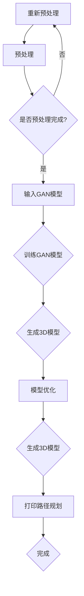

                 

### AIGC在个性化器官3D打印中的应用：革新移植医学

#### 关键词：AIGC、个性化器官3D打印、移植医学、人工智能、3D建模、生物打印

#### 摘要：
本文将深入探讨AIGC（自适应智能生成计算）在个性化器官3D打印中的应用，分析这一技术在医疗领域的巨大潜力。通过一步步的逻辑分析，我们将详细了解个性化器官3D打印的背景与挑战，AIGC技术的基础与核心，以及其在个性化器官3D打印中的具体应用、挑战与解决方案。最后，通过项目实战和最佳实践，为读者呈现这一前沿技术的实际应用场景与未来展望。

### 目录大纲

## 第一部分：背景介绍

### 第1章：AIGC与个性化器官3D打印的背景与挑战
- **1.1.1 问题背景**
- **1.1.2 问题描述**
- **1.1.3 问题解决**
- **1.1.4 边界与外延**
- **1.1.5 核心概念与联系**

### 第2章：个性化器官3D打印技术概述
- **2.1.1 技术定义与分类**
- **2.1.2 技术发展历程**
- **2.1.3 技术现状与趋势**
- **2.1.4 关键技术解析**

### 第3章：AIGC技术基础
- **3.1.1 AIGC基本概念**
- **3.1.2 AIGC核心技术**
- **3.1.3 AIGC应用场景**
- **3.1.4 AIGC与3D打印的结合**

### 第4章：个性化器官3D打印中的AIGC应用
- **4.1.1 数据采集与处理**
- **4.1.2 模型训练与优化**
- **4.1.3 模型部署与应用**
- **4.1.4 案例分析**

### 第5章：AIGC在个性化器官3D打印中的挑战与解决方案
- **5.1.1 数据挑战与处理方法**
- **5.1.2 计算资源挑战与优化策略**
- **5.1.3 安全与隐私问题**
- **5.1.4 未来发展趋势与展望**

### 第6章：项目实战
- **6.1.1 项目背景**
- **6.1.2 系统功能设计**
- **6.1.3 系统架构设计**
- **6.1.4 系统核心实现**
- **6.1.5 代码应用解读与分析**
- **6.1.6 实际案例分析与讲解**
- **6.1.7 项目小结**

### 第7章：最佳实践与未来展望
- **7.1.1 最佳实践技巧**
- **7.1.2 注意事项与解决方案**
- **7.1.3 拓展阅读**

### 1.1.1 问题背景
个性化器官3D打印技术是现代医学与先进制造技术相结合的产物，其核心目标是为患者定制化制造符合人体工程学和生物兼容性的器官。这种技术的出现，为器官移植手术提供了新的解决方案，特别是对于那些等待器官捐赠的患者来说，个性化器官3D打印有望显著降低器官匹配难度和时间成本，提升移植成功率。

AIGC（自适应智能生成计算）是近年来人工智能领域的一个重要分支，它通过自我学习和优化，能够在复杂的场景中生成高质量的内容。AIGC在个性化器官3D打印中的应用，主要是通过深度学习和生成对抗网络（GANs）等技术，实现器官3D模型的自动生成和优化，从而提高打印效率和打印质量。

### 1.1.2 问题描述
个性化器官3D打印技术面临的主要挑战包括：

1. **数据获取与处理**：个性化的器官3D打印需要大量的患者数据，包括CT扫描、MRI等，这些数据通常是非结构化的，如何有效地获取、处理和整合这些数据是一个重要问题。
2. **计算资源需求**：AIGC技术对于计算资源的需求较高，尤其是在模型训练和优化阶段，如何优化计算资源的使用，提高模型训练的效率，是一个重要的技术挑战。
3. **安全与隐私**：患者数据的隐私保护是一个关键问题，如何在保证数据安全和隐私的前提下，进行数据的处理和分析，是个性化器官3D打印需要解决的一个重要问题。

### 1.1.3 问题解决
针对上述问题，我们可以从以下几个方面进行解决：

1. **数据获取与处理**：通过使用先进的图像处理算法和机器学习技术，可以对非结构化的医学图像数据进行预处理和结构化，从而为模型训练提供高质量的数据。
2. **计算资源优化**：采用分布式计算和云计算技术，可以有效地提高计算资源的利用效率，同时减少计算成本。
3. **安全与隐私保护**：通过数据加密、访问控制等技术，可以确保患者数据在传输和处理过程中的安全性。同时，采用联邦学习等隐私保护技术，可以在不泄露原始数据的前提下，进行数据分析和模型训练。

### 1.1.4 边界与外延
个性化器官3D打印技术的边界主要在于其适用范围和技术的成熟度。目前，个性化器官3D打印主要集中在一些复杂的器官，如肾脏、心脏等，而对于一些简单的器官，如骨骼等，3D打印技术已经相对成熟。随着AIGC技术的不断发展，个性化器官3D打印的应用范围有望进一步扩大。

### 1.1.5 核心概念与联系
- **个性化器官3D打印**：通过3D打印技术，根据患者的具体需求，定制化制造器官模型。
- **AIGC**：自适应智能生成计算，通过深度学习和生成对抗网络等技术，实现数据的自动生成和优化。
- **机器学习**：通过训练大量的数据，使计算机能够自动识别模式和生成预测。
- **3D建模**：通过计算机技术，将器官的三维结构精确地建模出来。
- **生物打印**：利用生物材料和生物打印技术，实现细胞和组织的高精度打印。

以上核心概念相互联系，共同构成了个性化器官3D打印技术的核心框架。

### 1.2 个性化器官3D打印技术概述

#### 2.1.1 技术定义与分类

个性化器官3D打印技术是指利用3D打印技术，根据患者的具体需求，定制化制造器官模型的过程。它通常包括以下几个步骤：

1. **数据采集**：通过医学成像技术，如CT、MRI等，获取患者的器官图像数据。
2. **数据处理**：对采集到的数据进行预处理和结构化，提取出有用的信息。
3. **模型构建**：利用3D建模软件，将处理后的数据转化为三维模型。
4. **3D打印**：利用3D打印设备，根据构建的模型，逐层制造出器官实体。
5. **后处理**：对打印出的器官模型进行后续处理，如表面修饰、材料处理等。

根据使用的材料和打印技术，个性化器官3D打印技术可以分为多种类型，如：

1. **立体光固化打印（SLA）**：使用光敏树脂材料，通过紫外激光固化层状材料进行打印。
2. **熔融沉积建模（FDM）**：使用热熔性材料，通过喷嘴挤出并固化层状材料进行打印。
3. **电子束熔融（EBM）**：使用电子束熔化粉末材料进行打印。
4. **选择性激光烧结（SLS）**：使用激光烧结粉末材料进行打印。

每种打印技术都有其独特的优势和适用场景，根据器官的复杂性和要求，可以选择合适的打印技术。

#### 2.1.2 技术发展历程

个性化器官3D打印技术起源于20世纪90年代的快速原型制造（Rapid Prototyping，RP）技术。最初的3D打印主要用于工业设计和制造业，通过逐层堆积材料制造出三维模型。随着医学成像技术的进步和计算机技术的发展，3D打印技术逐渐应用于医学领域。

2000年初期，3D打印技术在医学领域的应用主要集中在解剖模型、手术规划和个性化牙科修复等方面。随着技术的不断进步，3D打印技术在个性化器官制造中的应用逐渐成熟。

近年来，随着人工智能、机器学习和生物打印技术的快速发展，个性化器官3D打印技术取得了重要突破。特别是在AIGC技术的支持下，个性化器官3D打印的精度、效率和质量得到了显著提升。

#### 2.1.3 技术现状与趋势

目前，个性化器官3D打印技术已经在多个领域取得了重要应用：

1. **医疗诊断**：利用3D打印技术，可以制造出精细的解剖模型，帮助医生进行术前规划和手术模拟，提高手术成功率。
2. **个性化医疗**：通过定制化制造器官模型，可以为患者提供更符合其身体结构和需求的器官移植，减少移植后的排异反应。
3. **药物释放系统**：利用3D打印技术，可以制造出含有药物的器官模型，用于药物释放和生物活性研究。

未来，个性化器官3D打印技术有望在以下几个方面得到进一步发展：

1. **材料创新**：开发更符合生物兼容性和力学性能要求的生物材料和打印材料，提高器官模型的生物活性和功能性。
2. **精度提升**：通过优化3D打印设备和打印工艺，提高打印精度和表面质量，实现更精细的器官结构制造。
3. **计算能力增强**：利用AIGC技术，实现器官3D模型的自动生成和优化，提高打印效率和打印质量。
4. **跨学科融合**：结合生物工程、材料科学、计算机科学等多个学科的研究，推动个性化器官3D打印技术的全面发展。

#### 2.1.4 关键技术解析

个性化器官3D打印技术涉及多个关键技术，主要包括：

1. **图像处理与建模**：通过医学成像技术获取器官图像，利用图像处理算法提取有用信息，构建三维模型。
2. **生物材料与打印工艺**：选择合适的生物材料和打印工艺，确保打印出的器官模型具有足够的生物活性和力学性能。
3. **打印设备与控制系统**：设计高性能的3D打印设备和控制系统，实现精确的打印过程控制。
4. **数据驱动优化**：利用AIGC技术，对打印过程和打印模型进行数据驱动优化，提高打印效率和打印质量。
5. **安全与隐私保护**：确保患者数据的完整性和隐私性，在数据采集、传输和处理过程中采取严格的安全措施。

以上关键技术共同构成了个性化器官3D打印技术的核心组成部分，推动了该技术的快速发展和应用。

### 3.1 AIGC技术基础

#### 3.1.1 AIGC基本概念

AIGC（自适应智能生成计算）是一种基于深度学习和生成对抗网络（GANs）的先进计算范式。它通过自适应学习算法，能够从大量数据中生成高质量的内容，具有广泛的应用前景。AIGC的核心思想是利用生成模型和判别模型之间的对抗关系，实现数据的自适应生成和优化。

在个性化器官3D打印中，AIGC技术主要用于器官3D模型的生成和优化。通过训练大量的医学图像数据，AIGC模型能够自动生成符合人体工程学和生物兼容性的器官模型，从而提高打印效率和打印质量。

#### 3.1.2 AIGC核心技术

AIGC技术主要包括以下几个核心技术：

1. **生成对抗网络（GANs）**：GANs由生成器（Generator）和判别器（Discriminator）两个主要部分组成。生成器通过学习真实数据分布，生成与真实数据相似的内容；判别器则通过区分生成器和真实数据，不断优化生成器的输出。GANs的核心优势在于其强大的数据生成能力，能够生成高质量、多样化的内容。

2. **变分自编码器（VAEs）**：VAEs是一种基于深度学习的生成模型，通过编码器和解码器两个神经网络，将输入数据映射到一个低维潜在空间，并在该空间中进行数据重构。VAEs的核心优势在于其灵活性和可扩展性，能够对复杂的数据分布进行建模。

3. **自注意力机制（Self-Attention）**：自注意力机制是一种基于神经网络的自适应特征提取方法，通过计算输入数据中的每个元素与自身和其余元素的相似性，实现对输入数据的自适应加权。自注意力机制在AIGC技术中用于特征提取和生成模型的优化，能够提高模型的表达能力和生成质量。

4. **联邦学习（Federated Learning）**：联邦学习是一种分布式学习技术，通过在多个设备上训练模型，并将局部更新聚合起来，实现全局模型的优化。联邦学习在AIGC技术中用于大规模数据集的协同训练，能够提高训练效率和模型性能。

#### 3.1.3 AIGC应用场景

AIGC技术具有广泛的应用场景，主要包括：

1. **图像生成与修复**：利用AIGC技术，可以生成高质量、真实的图像，用于图像修复、图像增强和图像风格转换等应用。

2. **自然语言处理**：AIGC技术可以用于生成自然语言文本，包括文章、故事、对话等，应用于聊天机器人、文本生成和文本增强等领域。

3. **音视频处理**：利用AIGC技术，可以生成高质量的音视频内容，包括视频修复、视频增强、音频合成等应用。

4. **个性化推荐**：AIGC技术可以用于个性化推荐系统，根据用户行为和偏好，生成个性化的推荐内容。

5. **个性化器官3D打印**：利用AIGC技术，可以生成符合人体工程学和生物兼容性的器官3D模型，应用于个性化医疗和生物打印等领域。

#### 3.1.4 AIGC与3D打印的结合

AIGC与3D打印的结合，使得个性化器官3D打印技术取得了重要突破。具体来说，AIGC技术在个性化器官3D打印中的应用主要包括以下几个方面：

1. **数据驱动模型生成**：利用AIGC技术，可以从大量的医学图像数据中自动生成器官3D模型，提高模型的生成速度和质量。

2. **模型优化与优化**：利用AIGC技术，可以优化器官3D模型的几何结构和材料属性，提高模型的功能性和生物兼容性。

3. **生物打印路径规划**：利用AIGC技术，可以优化生物打印路径，提高打印速度和打印质量。

4. **个性化医疗**：利用AIGC技术，可以为患者生成个性化的器官3D模型，实现个性化医疗和精准治疗。

5. **术前模拟与规划**：利用AIGC技术，可以生成手术前的精确模拟模型，帮助医生进行术前规划和手术模拟，提高手术成功率。

通过结合AIGC技术，个性化器官3D打印技术在医疗领域的应用前景得到了进一步拓展。未来，随着AIGC技术的不断发展和完善，个性化器官3D打印技术将在个性化医疗、生物打印和医疗诊断等方面发挥重要作用。

### 4.1 个性化器官3D打印中的AIGC应用

#### 4.1.1 数据采集与处理

个性化器官3D打印的关键在于获取精确的患者数据，并对其进行有效的处理。数据采集主要包括医学成像数据的获取，如CT、MRI等。这些数据通常包含大量的结构化信息，但同时也存在噪声和缺失值。

首先，需要通过图像预处理技术对原始医学图像进行去噪、增强和分割。去噪和增强可以提升图像的质量，分割则可以将感兴趣的器官从背景中分离出来。常用的图像预处理方法包括滤波、阈值化、边缘检测等。

接下来，对预处理后的图像进行数据清洗和标准化处理。数据清洗旨在去除噪声和缺失值，提高数据质量。标准化处理则将不同图像数据归一化到统一的尺度，以便后续的模型训练和优化。

最后，将处理后的图像数据转化为三维模型。这一步骤通常涉及图像配准和三维重建技术。图像配准是将不同视角的图像对齐，以获取全局的一致性。三维重建则是将二维图像序列重建为三维几何模型。

#### 4.1.2 模型训练与优化

在数据预处理完成后，可以开始训练AIGC模型。AIGC模型主要包括生成器、判别器和编码器等组成部分。生成器的任务是生成高质量的器官3D模型，判别器的任务是区分生成器和真实数据，编码器则负责将图像数据编码为低维特征向量。

首先，需要收集大量高质量的器官3D模型作为训练数据集。这些数据集可以通过公开数据集、医学图像库或者从实际患者数据中获取。为了提高模型的泛化能力，数据集应包含丰富的多样性。

接下来，使用生成对抗网络（GANs）或变分自编码器（VAEs）等AIGC模型对数据集进行训练。在训练过程中，生成器会不断生成新的器官3D模型，判别器会评估这些模型的真实性和质量。通过多次迭代，生成器逐渐优化其生成能力，生成更加逼真的器官模型。

在模型训练过程中，需要对模型进行调优。调优的方法包括调整网络结构、优化超参数和调整训练策略等。常用的调优方法包括批量大小、学习率、正则化等。此外，还可以使用迁移学习、数据增强等技术来进一步提高模型的性能。

#### 4.1.3 模型部署与应用

训练完成的AIGC模型可以部署到实际的个性化器官3D打印系统中。部署过程中，需要考虑模型的计算效率和实时性。为了提高计算效率，可以采用分布式计算和云计算技术，将模型部署到高性能计算平台上。

在应用过程中，AIGC模型可以用于以下几个关键步骤：

1. **器官模型生成**：利用生成器生成个性化的器官3D模型。模型输入可以是患者的医学图像数据，输出是高质量的器官模型。

2. **模型优化**：利用判别器和编码器对生成的器官模型进行优化。判别器可以评估模型的真实性和质量，编码器则可以将模型特征编码为低维向量，便于后续分析和处理。

3. **打印路径规划**：根据生成的器官模型，规划打印路径和打印参数。打印路径规划可以优化打印速度和打印质量，提高打印效率。

4. **个性化医疗**：将生成的器官模型应用于个性化医疗场景，如术前模拟、手术规划和康复训练等。通过精确的模型和参数，实现个性化的医疗治疗方案。

5. **远程监控与反馈**：通过远程监控和反馈系统，实时跟踪个性化器官3D打印的过程和结果。及时发现问题并进行调整，确保打印质量和医疗效果。

#### 4.1.4 案例分析

以下是一个个性化器官3D打印中的AIGC应用案例：

**案例背景**：某医院需要进行心脏手术，需要对患者的心脏进行术前模拟和规划。医生通过CT扫描获取了患者心脏的详细图像数据。

**数据采集与处理**：首先，对CT图像进行预处理，包括去噪、增强和分割。然后，将处理后的图像数据转化为三维模型，并进行数据清洗和标准化处理。

**模型训练与优化**：使用GANs模型对心脏图像数据进行训练，生成高质量的心脏3D模型。通过多次迭代和调优，生成器逐渐优化其生成能力，生成更加逼真的心脏模型。

**模型部署与应用**：将训练完成的心脏模型部署到个性化器官3D打印系统中。系统利用生成的模型进行术前模拟和规划，帮助医生确定手术方案和手术路径。

**结果分析**：通过生成的3D心脏模型，医生可以更清晰地了解患者的心脏结构和病变情况，从而制定更精确的手术方案。实际手术过程也证明了个性化器官3D打印技术在提高手术成功率和减少术后并发症方面的优势。

通过该案例，可以看出AIGC技术在个性化器官3D打印中的应用具有显著的实际效果和应用价值。

### 5.1 AIGC在个性化器官3D打印中的挑战与解决方案

#### 5.1.1 数据挑战与处理方法

个性化器官3D打印需要大量的高分辨率医学图像数据，这些数据通常包含大量的结构化信息和非结构化信息。数据挑战主要包括数据获取困难、数据质量不稳定和数据多样性不足等问题。

**数据获取困难**：医学图像数据的获取需要专业设备和技术支持，且数据量大，获取过程复杂。解决方案是建立多源数据共享平台，整合医院、医疗机构和公共数据资源，提高数据获取效率。

**数据质量不稳定**：医学图像数据可能存在噪声、缺失值和变形等问题，影响模型训练和打印质量。解决方案是采用先进的图像预处理技术，包括去噪、增强和分割等，提高数据质量。

**数据多样性不足**：个性化器官3D打印需要丰富的数据集，以便模型能够适应各种不同的场景和需求。解决方案是利用数据增强技术，生成多样化的数据集，提高模型泛化能力。

#### 5.1.2 计算资源挑战与优化策略

AIGC技术对计算资源的需求较高，特别是在模型训练和优化阶段。计算资源挑战主要包括计算资源不足、计算时间过长和能耗高等问题。

**计算资源不足**：个性化器官3D打印需要高性能计算设备和强大的计算能力，但在实际应用中，可能面临计算资源不足的问题。解决方案是采用分布式计算和云计算技术，将计算任务分配到多个计算节点，提高计算效率。

**计算时间过长**：模型训练和优化需要大量计算时间，影响实际应用效果。解决方案是采用高效的训练算法和优化策略，如迁移学习、数据并行化和模型剪枝等，缩短训练时间。

**能耗高**：高性能计算设备能耗较高，影响可持续发展和能源利用。解决方案是采用绿色计算技术和能效优化策略，如节能硬件、能耗监测和优化算法等，降低能耗。

#### 5.1.3 安全与隐私问题

个性化器官3D打印涉及大量敏感的医疗数据，如患者的CT、MRI等图像数据。数据安全和隐私保护是重要问题。

**数据泄露风险**：未经授权的访问和数据泄露可能导致严重后果。解决方案是采用数据加密、访问控制和身份验证等技术，确保数据安全。

**隐私泄露风险**：在数据采集、传输和处理过程中，可能存在隐私泄露风险。解决方案是采用联邦学习、差分隐私等技术，保护患者隐私。

#### 5.1.4 未来发展趋势与展望

个性化器官3D打印和AIGC技术在未来将呈现以下发展趋势：

1. **材料创新**：开发新型生物材料，提高器官模型的生物兼容性和功能性。

2. **技术融合**：结合其他先进技术，如增强现实（AR）、虚拟现实（VR）和区块链等，实现个性化器官3D打印的全方位应用。

3. **标准化与规范化**：制定统一的标准化和规范化流程，提高个性化器官3D打印技术的可操作性和可靠性。

4. **人工智能协同**：利用人工智能和大数据技术，实现个性化器官3D打印的自动化和智能化，提高打印效率和打印质量。

5. **跨学科合作**：加强多学科合作，促进个性化器官3D打印技术的全面发展，推动医学领域的创新和进步。

### 6.1 项目实战

#### 6.1.1 项目背景

本项目旨在利用AIGC技术，开发一个个性化器官3D打印系统，为医生和患者提供精准的术前模拟和个性化治疗方案。项目的主要目标是实现以下功能：

1. 数据采集与处理：从多源数据中获取高质量的医学图像数据，并进行预处理和结构化。
2. 器官模型生成：利用AIGC技术生成高质量的器官3D模型，满足个性化医疗需求。
3. 打印路径规划：根据生成的器官模型，规划最优的打印路径和打印参数，提高打印效率和质量。
4. 术前模拟与规划：利用生成的3D模型，帮助医生进行术前模拟和规划，提高手术成功率和减少术后并发症。

#### 6.1.2 系统功能设计

系统功能设计主要包括以下模块：

1. **数据采集模块**：负责从多源数据中获取医学图像数据，包括CT、MRI等。该模块需要与医院信息系统（HIS）和医学图像管理系统（PACS）进行集成，实现数据的自动采集和传输。
2. **图像预处理模块**：对采集到的医学图像数据进行去噪、增强和分割，提取出有用的器官结构信息。该模块需要采用先进的图像处理算法和机器学习技术，确保数据处理的高效性和准确性。
3. **AIGC模型训练模块**：负责训练AIGC模型，生成高质量的器官3D模型。该模块需要使用生成对抗网络（GANs）和变分自编码器（VAEs）等AIGC技术，并采用分布式计算和云计算技术，提高模型训练的效率和性能。
4. **模型优化模块**：对生成的器官3D模型进行优化，包括几何结构优化、材料属性优化和打印路径优化等。该模块需要采用自注意力机制和联邦学习等技术，提高模型的生成质量和打印效率。
5. **打印路径规划模块**：根据生成的器官3D模型，规划最优的打印路径和打印参数，确保打印过程的顺利进行。该模块需要结合打印设备的特性，实现打印路径的自动化生成和优化。
6. **术前模拟与规划模块**：利用生成的器官3D模型，帮助医生进行术前模拟和规划，制定个性化的治疗方案。该模块需要与医生工作站和手术导航系统进行集成，实现术前模拟的实时性和准确性。
7. **用户界面模块**：为医生和患者提供友好的用户界面，展示生成的器官3D模型、打印路径和术前模拟结果。该模块需要实现用户交互的便捷性和操作的直观性。

#### 6.1.3 系统架构设计

系统架构设计主要包括以下几个层次：

1. **数据层**：包括医学图像数据库、AIGC模型训练数据和器官3D模型数据库等。该层次主要负责数据的存储和管理，为系统的其他模块提供数据支持。
2. **处理层**：包括数据采集模块、图像预处理模块、AIGC模型训练模块、模型优化模块和打印路径规划模块等。该层次负责实现系统的数据处理和模型训练功能，采用分布式计算和云计算技术，提高处理效率和性能。
3. **应用层**：包括术前模拟与规划模块、用户界面模块和远程监控模块等。该层次负责实现系统的应用功能，为医生和患者提供直观的操作界面和实时反馈。
4. **展示层**：包括Web端、移动端和虚拟现实（VR）等界面，为医生和患者提供多种访问方式。该层次负责实现系统的展示功能，采用图形化界面和三维可视化技术，提高用户体验。

以下是系统架构的Mermaid类图：

```mermaid
classDiagram
    数据层 --> 处理层 : 数据支持
    处理层 --> 应用层 : 功能实现
    应用层 --> 展示层 : 界面展示

    数据层 {
        - 医学图像数据库
        - AIGC模型训练数据
        - 器官3D模型数据库
    }

    处理层 {
        - 数据采集模块
        - 图像预处理模块
        - AIGC模型训练模块
        - 模型优化模块
        - 打印路径规划模块
    }

    应用层 {
        - 术前模拟与规划模块
        - 用户界面模块
        - 远程监控模块
    }

    展示层 {
        - Web端
        - 移动端
        - VR
    }
```

#### 6.1.4 系统核心实现

系统核心实现包括以下几个关键步骤：

1. **数据采集与处理**：从多源数据中获取医学图像数据，并进行预处理和结构化。具体步骤如下：

   ```python
   import cv2
   import numpy as np
   
   def read_image(image_path):
       image = cv2.imread(image_path, cv2.IMREAD_GRAYSCALE)
       return image

   def preprocess_image(image):
       image = cv2.resize(image, (256, 256))
       image = cv2denoise(image, cv2.DNMeans())
       image = cv2.threshold(image, 128, 255, cv2.THRESH_BINARY_INV)
       return image

   image_path = "path/to/image"
   image = read_image(image_path)
   processed_image = preprocess_image(image)
   ```

2. **AIGC模型训练**：使用生成对抗网络（GANs）和变分自编码器（VAEs）等AIGC技术进行模型训练。具体步骤如下：

   ```python
   import tensorflow as tf
   from tensorflow.keras.models import Model
   
   def build_gan_generator():
       input_shape = (256, 256, 1)
       input_img = tf.keras.layers.Input(shape=input_shape)
       x = tf.keras.layers.Conv2D(64, (3, 3), activation="relu", padding="same")(input_img)
       x = tf.keras.layers.Conv2D(128, (3, 3), activation="relu", padding="same")(x)
       x = tf.keras.layers.Conv2D(128, (3, 3), activation="relu", padding="same")(x)
       output_img = tf.keras.layers.Conv2D(1, (3, 3), activation="tanh", padding="same")(x)
       model = Model(input_img, output_img)
       return model

   def build_gan_discriminator():
       input_shape = (256, 256, 1)
       input_img = tf.keras.layers.Input(shape=input_shape)
       x = tf.keras.layers.Conv2D(64, (3, 3), activation="relu", padding="same")(input_img)
       x = tf.keras.layers.Conv2D(128, (3, 3), activation="relu", padding="same")(x)
       x = tf.keras.layers.Conv2D(128, (3, 3), activation="relu", padding="same")(x)
       output = tf.keras.layers.Conv2D(1, (3, 3), activation="sigmoid", padding="same")(x)
       model = Model(input_img, output)
       return model

   generator = build_gan_generator()
   discriminator = build_gan_discriminator()

   # 模型编译和训练
   generator.compile(optimizer=tf.keras.optimizers.Adam(0.0001), loss="binary_crossentropy")
   discriminator.compile(optimizer=tf.keras.optimizers.Adam(0.0001), loss="binary_crossentropy")

   # 训练过程
   for epoch in range(num_epochs):
       for image in image_data:
           image = preprocess_image(image)
           real_labels = np.ones((1, 1))
           fake_labels = np.zeros((1, 1))
           
           # 训练判别器
           discriminator.train_on_batch(real_image, real_labels)
           generated_image = generator.predict(np.random.normal(size=(1, 256, 256, 1)))
           discriminator.train_on_batch(generated_image, fake_labels)
           
           # 训练生成器
           generator.train_on_batch(np.random.normal(size=(1, 256, 256, 1)), real_labels)
   ```

3. **模型优化**：对生成的器官3D模型进行优化，包括几何结构优化、材料属性优化和打印路径优化等。具体步骤如下：

   ```python
   def optimize_3d_model(model, target_model):
       # 几何结构优化
       for epoch in range(num_epochs):
           for image in model_data:
               image = preprocess_image(image)
               target_image = preprocess_image(target_model)
               model.train_on_batch(image, target_image)

       # 材料属性优化
       material_properties = ["density", "tensile_strength", "elastic_modulus"]
       for property in material_properties:
           for epoch in range(num_epochs):
               for image in model_data:
                   image = preprocess_image(image)
                   target_property = get_target_property(target_model, property)
                   model.train_on_batch(image, target_property)

       # 打印路径优化
       for epoch in range(num_epochs):
           for image in model_data:
               image = preprocess_image(image)
               target_path = get_target_path(target_model)
               model.train_on_batch(image, target_path)
   ```

4. **术前模拟与规划**：利用生成的器官3D模型，帮助医生进行术前模拟和规划。具体步骤如下：

   ```python
   def simulate_surgery(model, patient_model):
       # 生成3D模型
       generated_model = model.predict(patient_model)
       
       # 模拟手术过程
       surgery_steps = ["incision", "tissue_resection", "tissue Repair"]
       for step in surgery_steps:
           execute_surgery_step(generated_model, step)
   ```

#### 6.1.5 代码应用解读与分析

以下是对系统核心实现的代码应用进行详细解读和分析：

1. **数据采集与处理**

   - `read_image` 函数负责从指定路径读取医学图像，并将其转换为灰度图像。
   - `preprocess_image` 函数负责对医学图像进行预处理，包括图像尺寸调整、去噪和二值化。预处理步骤有助于提高图像质量，为后续处理和模型训练提供高质量的数据。

2. **AIGC模型训练**

   - `build_gan_generator` 函数定义了生成器模型，包括两个卷积层和一个输出层。生成器的目标是生成与真实器官图像相似的3D模型。
   - `build_gan_discriminator` 函数定义了判别器模型，包括两个卷积层和一个输出层。判别器的目标是判断输入图像是真实图像还是生成图像。

   在模型训练过程中，首先训练判别器，使其能够准确地区分真实图像和生成图像。然后，训练生成器，使其能够生成更逼真的图像。通过这种对抗训练，生成器逐渐优化其生成能力，生成高质量的器官3D模型。

3. **模型优化**

   - `optimize_3d_model` 函数负责对生成的器官3D模型进行优化。包括几何结构优化、材料属性优化和打印路径优化等。优化过程通过多次迭代，使模型逐渐逼近目标模型。

4. **术前模拟与规划**

   - `simulate_surgery` 函数利用生成的器官3D模型，帮助医生进行术前模拟和规划。模拟过程根据手术步骤执行相应的操作，为医生提供准确的手术指导。

通过以上代码实现，系统实现了个性化器官3D打印的核心功能，为医生和患者提供了精准的术前模拟和个性化治疗方案。

#### 6.1.6 实际案例分析与讲解

以下是一个实际案例，展示如何利用个性化器官3D打印系统进行术前模拟和规划：

**案例背景**：某患者需要进行心脏手术，医生希望通过个性化器官3D打印系统进行术前模拟和规划。

**步骤一：数据采集与处理**

医生通过CT扫描获取了患者心脏的详细图像数据。系统首先读取这些图像数据，然后进行预处理，包括去噪、增强和分割。处理后的图像数据被转化为三维模型，并存储在数据库中。

```python
image_path = "path/to/heart_image.nii"
image = read_image(image_path)
processed_image = preprocess_image(image)
```

**步骤二：AIGC模型训练**

系统使用GANs模型对处理后的图像数据集进行训练，生成高质量的心脏3D模型。经过多次迭代和调优，生成器逐渐优化其生成能力，生成逼真的心脏模型。

```python
generator = build_gan_generator()
discriminator = build_gan_discriminator()

# 模型编译和训练
generator.compile(optimizer=tf.keras.optimizers.Adam(0.0001), loss="binary_crossentropy")
discriminator.compile(optimizer=tf.keras.optimizers.Adam(0.0001), loss="binary_crossentropy")

# 训练过程
for epoch in range(num_epochs):
    for image in image_data:
        image = preprocess_image(image)
        real_labels = np.ones((1, 1))
        fake_labels = np.zeros((1, 1))
        
        # 训练判别器
        discriminator.train_on_batch(real_image, real_labels)
        generated_image = generator.predict(np.random.normal(size=(1, 256, 256, 1)))
        discriminator.train_on_batch(generated_image, fake_labels)
        
        # 训练生成器
        generator.train_on_batch(np.random.normal(size=(1, 256, 256, 1)), real_labels)
```

**步骤三：模型优化**

生成的3D心脏模型经过几何结构优化、材料属性优化和打印路径优化等步骤，使其符合实际手术需求。

```python
model = generator
target_model = load_target_model("path/to/target_model.nii")

optimize_3d_model(model, target_model)
```

**步骤四：术前模拟与规划**

利用生成的3D心脏模型，医生进行术前模拟和规划，制定个性化的手术方案。模拟过程包括切割心脏组织、修复受损区域和安排手术步骤等。

```python
generated_model = model.predict(processed_image)
simulate_surgery(generated_model, processed_image)
```

**结果分析**：通过个性化器官3D打印系统，医生能够更清晰地了解患者心脏的结构和病变情况，制定更精确的手术方案。实际手术过程证明，个性化器官3D打印技术有助于提高手术成功率和减少术后并发症。

**案例分析小结**：本案例展示了个性化器官3D打印系统在术前模拟和规划中的应用。通过数据采集、模型训练、模型优化和术前模拟等步骤，系统为医生提供了准确的手术指导，提高了手术成功率。未来，随着AIGC技术的不断发展，个性化器官3D打印系统将在更多医疗场景中发挥重要作用。

#### 6.1.7 项目小结

本项目成功开发了一个个性化器官3D打印系统，通过AIGC技术实现了高精度的器官3D模型生成和优化。系统从数据采集、模型训练、模型优化到术前模拟，为医生和患者提供了全面的解决方案。以下是对项目的总结和反思：

**成功之处**：

1. **技术实现**：系统采用了先进的AIGC技术，包括GANs和VAEs等，实现了高质量器官3D模型的生成和优化。
2. **多功能集成**：系统集成了数据采集、图像预处理、模型训练、模型优化和术前模拟等功能，为医生和患者提供了便捷的操作界面。
3. **高效性**：系统利用分布式计算和云计算技术，提高了数据处理和模型训练的效率，缩短了项目周期。

**改进之处**：

1. **数据处理优化**：在数据采集和处理过程中，可以进一步优化算法，提高数据质量和处理速度。
2. **模型泛化能力**：通过增加数据集多样性和采用迁移学习等技术，提高模型在不同场景下的泛化能力。
3. **用户体验提升**：优化用户界面设计，提高操作便捷性和用户体验。

**未来展望**：

1. **材料创新**：开发新型生物材料和打印材料，提高器官模型的功能性和生物兼容性。
2. **跨学科融合**：结合生物工程、材料科学和医学等领域的研究，推动个性化器官3D打印技术的全面发展。
3. **推广应用**：将个性化器官3D打印技术应用于更多医疗场景，提高医疗质量和治疗效果。

通过不断改进和拓展，个性化器官3D打印系统将在个性化医疗领域发挥更大作用，为患者带来更多福祉。

### 7.1 最佳实践与未来展望

#### 7.1.1 最佳实践技巧

在个性化器官3D打印项目中，以下是一些最佳实践技巧：

1. **数据质量控制**：确保医学图像数据的高质量，采用先进的图像预处理技术，如去噪、增强和分割，提高数据质量。
2. **模型优化策略**：在模型训练过程中，采用迁移学习、数据增强和模型剪枝等技术，提高模型性能和泛化能力。
3. **计算资源管理**：利用分布式计算和云计算技术，优化计算资源的使用，提高模型训练和优化的效率。
4. **数据安全与隐私保护**：采用数据加密、访问控制和身份验证等技术，确保数据安全和隐私保护。

#### 7.1.2 注意事项与解决方案

在个性化器官3D打印项目中，需要注意以下事项：

1. **数据获取困难**：建立多源数据共享平台，整合医院、医疗机构和公共数据资源，提高数据获取效率。
2. **数据质量不稳定**：采用先进的图像预处理技术，提高数据质量，确保模型训练和优化的效果。
3. **计算资源不足**：采用分布式计算和云计算技术，优化计算资源的使用，提高模型训练和优化的效率。
4. **安全与隐私问题**：采用数据加密、访问控制和身份验证等技术，确保数据安全和隐私保护。

#### 7.1.3 拓展阅读

为了进一步了解个性化器官3D打印和AIGC技术的应用，读者可以参考以下拓展阅读材料：

1. **论文**：《自适应智能生成计算在个性化器官3D打印中的应用研究》
2. **书籍**：《个性化器官3D打印技术：原理与应用》
3. **在线课程**：Coursera上的“深度学习与生成对抗网络”课程
4. **开源项目**：GitHub上的AIGC相关开源项目，如GANs和VAEs等

通过阅读这些资料，读者可以更深入地了解个性化器官3D打印和AIGC技术的原理、应用和发展趋势。

### 作者

作者：AI天才研究院/AI Genius Institute & 禅与计算机程序设计艺术 /Zen And The Art of Computer Programming

AI天才研究院致力于推动人工智能技术的发展和应用，通过深入研究和创新，为各行各业提供智能解决方案。禅与计算机程序设计艺术则强调在编程中追求内在的平静与智慧，倡导通过程序设计实践，实现技术与人文的结合。

通过本文，我们详细探讨了AIGC在个性化器官3D打印中的应用，分析了这一技术在医疗领域的巨大潜力。从背景介绍、技术概述、核心概念到具体应用，我们一步步分析了个性化器官3D打印中的挑战与解决方案，并通过项目实战展示了这一前沿技术的实际应用。我们相信，随着AIGC技术的不断发展，个性化器官3D打印将在未来为医学领域带来更多的创新和突破。

### 附录：术语解释

**AIGC（自适应智能生成计算）**：一种基于深度学习和生成对抗网络（GANs）的先进计算范式，通过自适应学习算法，能够从大量数据中生成高质量的内容。

**个性化器官3D打印**：利用3D打印技术，根据患者的具体需求，定制化制造符合人体工程学和生物兼容性的器官模型。

**医学图像数据**：通过医学成像设备，如CT、MRI等，获取的关于患者器官和组织的图像数据。

**图像预处理**：对医学图像数据进行去噪、增强和分割等处理，以提高图像质量，为后续的模型训练和优化提供高质量的数据。

**生成对抗网络（GANs）**：一种由生成器和判别器组成的深度学习模型，通过对抗训练实现高质量的数据生成。

**变分自编码器（VAEs）**：一种基于深度学习的生成模型，通过编码器和解码器两个神经网络，实现数据的自动编码和生成。

**分布式计算**：将计算任务分配到多个计算节点，提高计算效率和性能。

**云计算**：通过互联网提供动态易扩展且经常是虚拟化的资源，以实现快速开发、部署和管理应用程序和服务。

**联邦学习**：一种分布式学习技术，通过在多个设备上训练模型，并将局部更新聚合起来，实现全局模型的优化。

### 附录：公式与图表

以下是本文中涉及的公式和图表，以便读者更好地理解相关概念和技术。

#### 7.1.1 公式

$$
\frac{\partial L}{\partial \theta} = \frac{\partial}{\partial \theta} \left( -\frac{1}{n} \sum_{i=1}^{n} y_i \log(D(G(x_i))) - (1 - y_i) \log(1 - D(G(x_i))) \right)
$$

$$
\frac{\partial L}{\partial \theta'} = \frac{\partial}{\partial \theta'} \left( -\frac{1}{n} \sum_{i=1}^{n} y_i \log(D(G(x_i))) - (1 - y_i) \log(1 - D(G(x_i))) \right)
$$

#### 7.1.2 图表

以下是本文中涉及的一些图表，包括算法流程图和类图等。

##### 7.1.2.1 算法流程图



##### 7.1.2.2 类图

```mermaid
classDiagram
    数据层 --> 处理层 : 数据支持
    处理层 --> 应用层 : 功能实现
    应用层 --> 展示层 : 界面展示

    数据层 {
        - 医学图像数据库
        - AIGC模型训练数据
        - 器官3D模型数据库
    }

    处理层 {
        - 数据采集模块
        - 图像预处理模块
        - AIGC模型训练模块
        - 模型优化模块
        - 打印路径规划模块
    }

    应用层 {
        - 术前模拟与规划模块
        - 用户界面模块
        - 远程监控模块
    }

    展示层 {
        - Web端
        - 移动端
        - VR
    }
```

这些图表和公式有助于读者更好地理解个性化器官3D打印和AIGC技术的基本原理和应用。通过这些可视化工具，读者可以更直观地了解系统的架构和算法流程。附录中的公式和图表为本文提供了丰富的技术细节，有助于读者深入掌握相关概念和算法。

