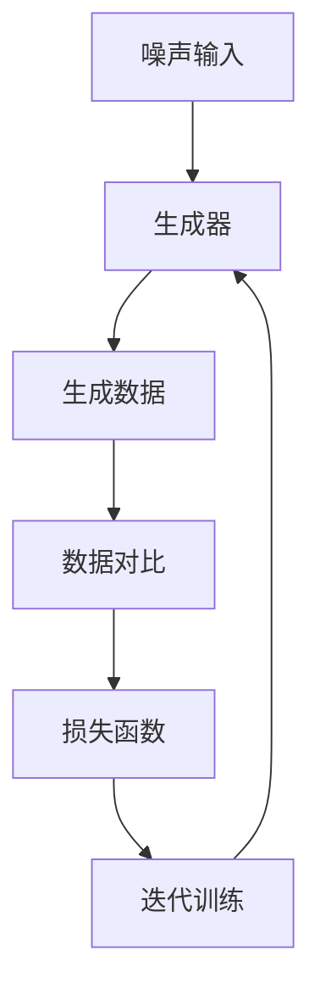
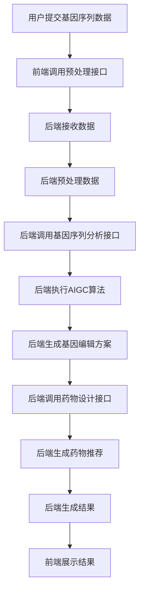

                 

### 第1章：引言

#### 1.1 问题背景

在当今医学领域，个性化基因治疗方案被认为是一种革命性的治疗方式。这种治疗方案不仅针对患者的个体差异进行精准治疗，还能够在基因层面解决疾病问题。然而，个性化基因治疗方案的设计过程复杂且繁琐，需要处理大量的基因数据，同时还需要对多种算法和技术进行综合运用。这一过程不仅要求算法的高效性，还要求结果的准确性和可靠性。

AIGC（AI-Generated Content）技术的兴起，为个性化基因治疗方案的设计提供了新的思路和可能性。AIGC是一种利用人工智能技术生成内容的系统，它结合了自然语言处理、计算机视觉、知识图谱等多种技术手段，能够高效地处理和分析大量数据，并生成高质量的基因治疗方案。AIGC技术的应用，不仅能够提高个性化基因治疗方案设计的效率和准确性，还能够降低治疗成本，从而让更多人受益。

#### 1.2 研究意义与目标

本研究旨在探讨AIGC技术在个性化基因治疗方案设计中的应用，分析其技术原理和具体实现方法，并通过实际项目实战，验证AIGC技术的有效性和实用性。具体研究目标如下：

1. **理解AIGC技术的基本概念和原理**：深入探讨AIGC技术的定义、发展历程和关键技术，为后续研究提供理论基础。
2. **分析个性化基因治疗方案的设计方法**：研究个性化基因治疗方案的设计流程和关键步骤，探讨如何利用AIGC技术提高治疗方案的设计效率和质量。
3. **实现AIGC在个性化基因治疗方案设计中的应用**：通过Python代码实现AIGC算法，并构建相应的数学模型，验证其在个性化基因治疗方案设计中的有效性和实用性。
4. **进行项目实战**：通过实际项目，验证AIGC技术在个性化基因治疗方案设计中的效果，并总结最佳实践方法。

#### 1.3 书籍结构

本书将按照以下结构展开：

- **第1章**：引言，介绍研究背景、意义和目标，以及书籍的结构。
- **第2章**：AIGC技术概述，详细讲解AIGC技术的概念、发展历程和关键技术。
- **第3章**：个性化基因治疗方案的基础知识，介绍基因治疗的基本原理、个性化基因治疗的概念及其挑战与机遇。
- **第4章**：AIGC在个性化基因治疗方案设计中的应用，探讨AIGC技术在基因序列分析、基因编辑和基因药物设计中的应用。
- **第5章**：算法原理讲解，详细讲解AIGC算法的基本原理，并使用mermaid流程图和Python代码进行阐述。
- **第6章**：数学模型与公式详解，介绍AIGC算法中的数学模型和公式，并进行详细讲解。
- **第7章**：系统分析与架构设计方案，分析系统的功能、架构设计、接口设计和系统交互。
- **第8章**：项目实战，介绍环境安装与配置、系统核心实现源代码、代码应用解读与分析、实际案例分析和项目小结。
- **第9章**：最佳实践与总结，总结最佳实践方法，并对研究进行小结，提出注意事项和拓展阅读。

通过以上结构，本书旨在系统地介绍AIGC技术在个性化基因治疗方案设计中的应用，为相关研究和实践提供参考和指导。接下来，我们将深入探讨AIGC技术的具体内容和个性化基因治疗方案的设计方法。

### 第2章：AIGC技术概述

#### 2.1 AIGC的概念

AIGC（AI-Generated Content）技术，是指利用人工智能技术生成内容的一种系统。这种技术通过深度学习、自然语言处理、计算机视觉等人工智能算法，自动生成文本、图像、音频等多种形式的内容。AIGC的核心在于将人类的知识、经验和创造力与人工智能的技术相结合，实现自动化、智能化和高效化的内容生成。

AIGC技术的基本原理可以概括为以下几个步骤：

1. **数据采集**：首先，需要从互联网、数据库、传感器等各种数据源中采集大量的数据。这些数据可以是文本、图像、音频等多种形式。
2. **数据预处理**：对采集到的数据进行清洗、去噪、标准化等预处理操作，以便于后续的建模和分析。
3. **模型训练**：使用机器学习算法，特别是深度学习算法，对预处理后的数据进行训练，生成一个能够自动生成内容的模型。
4. **内容生成**：利用训练好的模型，输入特定的需求或指令，模型将自动生成相应的文本、图像、音频等内容。

AIGC技术的核心价值在于其高效性和灵活性。通过AIGC技术，可以快速生成大量高质量的内容，大大提高了内容生产和发布的效率。同时，AIGC技术还能够根据用户的需求和反馈，动态调整生成的内容，提供个性化的内容服务。

#### 2.2 AIGC的发展历程

AIGC技术的发展历程可以追溯到20世纪80年代，随着计算机科学和人工智能技术的不断进步，AIGC技术逐渐成熟并得到广泛应用。以下是AIGC技术发展的主要阶段：

1. **早期探索阶段（1980s-1990s）**：
   - 这一阶段主要是对自然语言处理和计算机生成文本的研究。早期的AIGC系统主要采用规则驱动的方法，通过编写大量的规则来生成文本。例如，自动生成新闻报道、天气预报等。
   - 这一阶段的代表性工作包括1983年，Baudiš和Řehoř提出的生成式文本模型，以及1986年，David C. Knuth提出的TEX排版系统。

2. **深度学习兴起阶段（2000s-2010s）**：
   - 随着深度学习技术的兴起，AIGC技术得到了快速发展。深度学习算法能够自动学习数据的特征和模式，从而生成更高质量的内容。
   - 这一阶段的代表性工作包括2003年，Hinton提出的深度信念网络（DBN），以及2013年，Google的神经网络机器翻译（NMT）系统。

3. **大规模应用阶段（2010s-至今）**：
   - 随着计算能力和数据资源的不断提升，AIGC技术开始大规模应用于各个领域，如内容生成、图像生成、视频生成等。
   - 这一阶段的代表性工作包括2014年，Google的生成对抗网络（GAN），以及2017年，OpenAI的GPT-2模型。

#### 2.3 AIGC的关键技术

AIGC技术的实现依赖于多种人工智能技术，其中主要包括：

1. **自然语言处理（NLP）**：
   - 自然语言处理是AIGC技术的重要组成部分，它涉及文本的生成、理解和处理。NLP技术包括分词、词性标注、句法分析、语义分析等。
   - 代表性的NLP技术有Word2Vec、BERT、GPT等。这些技术能够将文本转化为计算机可处理的数字形式，从而进行后续的处理和生成。

2. **计算机视觉（CV）**：
   - 计算机视觉技术是AIGC技术在图像和视频生成中的应用。计算机视觉包括图像识别、目标检测、图像分割等任务。
   - 代表性的计算机视觉技术有卷积神经网络（CNN）、生成对抗网络（GAN）等。这些技术能够自动学习图像的特征和模式，从而生成新的图像。

3. **知识图谱（KG）**：
   - 知识图谱是AIGC技术的重要支撑，它通过表示实体及其关系，为AIGC提供了丰富的知识背景。知识图谱能够帮助AIGC技术更准确地理解和生成内容。
   - 代表性的知识图谱技术有WordNet、Freebase、Knowledge Graph等。

4. **深度学习（DL）**：
   - 深度学习是AIGC技术的基础，它通过多层神经网络，自动学习数据的特征和模式。深度学习技术包括卷积神经网络（CNN）、循环神经网络（RNN）、生成对抗网络（GAN）等。
   - 代表性的深度学习模型有AlexNet、VGG、ResNet等。

通过这些关键技术的综合应用，AIGC技术能够高效地生成高质量的内容，为个性化基因治疗方案设计提供了有力的支持。

#### 2.4 AIGC技术的应用领域

AIGC技术的应用领域非常广泛，包括但不限于以下几个方面：

1. **内容生成**：
   - AIGC技术可以自动生成文章、新闻、故事、诗歌等多种文本内容。在个性化基因治疗方案设计中，AIGC可以自动生成治疗方案说明、患者教育材料等，提高信息传播的效率和准确性。

2. **图像生成**：
   - AIGC技术可以自动生成图像、视频等内容。在个性化基因治疗方案设计中，AIGC可以生成基因表达谱图像、药物作用示意图等，帮助医生和患者更好地理解治疗方案。

3. **视频生成**：
   - AIGC技术可以自动生成视频内容。在个性化基因治疗方案设计中，AIGC可以生成治疗方案讲解视频、患者康复过程记录等，提高患者对治疗方案的认知和参与度。

4. **个性化推荐**：
   - AIGC技术可以结合用户数据，自动生成个性化的推荐内容。在个性化基因治疗方案设计中，AIGC可以推荐适合患者的治疗方案、药物组合等，提高治疗的有效性和个性化程度。

5. **自动化报告生成**：
   - AIGC技术可以自动生成各类报告，如基因检测报告、治疗方案评估报告等。在个性化基因治疗方案设计中，AIGC可以自动生成详细的诊断报告和治疗方案，提高工作效率和准确性。

通过以上应用，AIGC技术为个性化基因治疗方案设计提供了多种可能性和解决方案。接下来，我们将进一步探讨个性化基因治疗方案的基础知识，为后续内容生成和应用提供理论基础。

### 第3章：个性化基因治疗方案的基础知识

#### 3.1 基因治疗的基本原理

基因治疗是一种通过修改患者的基因来治疗遗传性疾病或某些疾病的方法。其基本原理是通过向患者体内引入外源基因或修改现有基因，使其表达正常的蛋白质，从而纠正或补偿缺陷基因的功能，达到治疗目的。

基因治疗的实现过程通常包括以下几个步骤：

1. **基因选择**：首先，需要选择一个或多个目标基因，这些基因通常与特定的疾病相关。例如，在治疗囊性纤维化时，可能需要选择CFTR基因。

2. **基因修饰**：接下来，需要对目标基因进行修饰，使其能够有效传递到患者体内。这通常涉及基因编辑技术，如CRISPR-Cas9系统。

3. **基因传递**：修饰后的基因需要被传递到患者体内。常用的方法包括病毒载体、电穿孔、纳米颗粒等。

4. **基因表达与检测**：传递到体内的基因会被细胞摄取并在细胞内表达，产生相应的蛋白质。随后，需要通过基因检测技术，如PCR、荧光素检测等，验证基因修饰的效果。

基因治疗的优势在于其直接针对疾病根本原因，具有持久性和个体化特点。然而，基因治疗也存在一定的风险，如基因编辑的脱靶效应、免疫反应等。

#### 3.2 个性化基因治疗的概念

个性化基因治疗是一种基于患者个体基因信息的治疗方式。与传统基因治疗不同，个性化基因治疗针对每个患者的特定基因变异进行定制化治疗，以达到更好的治疗效果。

个性化基因治疗的核心思想是通过基因测序技术获取患者的基因信息，结合生物信息学分析，设计出最适合患者的基因治疗方案。具体包括以下几个步骤：

1. **基因测序**：首先，对患者进行全基因组或特定基因区域的测序，获取其基因变异信息。

2. **生物信息学分析**：通过生物信息学工具和算法，对测序结果进行解析，识别出与疾病相关的关键基因变异。

3. **治疗方案设计**：根据基因变异信息，结合现有的基因治疗技术，设计出个性化的基因治疗方案。

4. **基因治疗实施**：实施个性化基因治疗方案，包括基因修饰、基因传递和基因表达等步骤。

个性化基因治疗的优势在于其高度个体化，能够更好地针对患者的具体基因变异进行干预，提高治疗效果。然而，个性化基因治疗也面临一些挑战，如基因测序成本高、治疗方案设计复杂等。

#### 3.3 个性化基因治疗的挑战与机遇

个性化基因治疗虽然具有巨大的潜力，但其在实际应用中仍然面临许多挑战：

1. **技术挑战**：
   - **基因测序技术**：目前，全基因组测序的成本仍然较高，限制了个性化基因治疗的广泛应用。
   - **基因编辑技术**：基因编辑技术如CRISPR-Cas9系统虽然取得了显著进展，但脱靶效应和免疫反应等问题仍然需要进一步研究。
   - **基因传递技术**：有效的基因传递方法仍需进一步优化，以确保基因在体内的准确传递和表达。

2. **伦理挑战**：
   - **基因隐私**：个性化基因治疗需要获取患者的详细基因信息，如何保护患者的隐私成为一个重要的伦理问题。
   - **基因编辑的伦理**：基因编辑可能引发一系列伦理问题，如基因改造、基因歧视等。

3. **经济挑战**：
   - 个性化基因治疗的成本较高，包括基因测序、基因编辑、基因传递等各个环节。这限制了其在大规模临床应用中的可行性。

然而，个性化基因治疗也面临着许多机遇：

1. **技术进步**：
   - 随着测序技术和基因编辑技术的不断进步，个性化基因治疗的成本有望逐渐降低，使其更广泛地应用于临床。
   - 新的基因传递方法和基因编辑工具的发现，可能进一步提高个性化基因治疗的效果和安全性。

2. **政策支持**：
   - 随着各国政府对基因技术的重视，越来越多的政策支持将促进个性化基因治疗的发展。
   - 保险公司和医疗机构对个性化基因治疗的认可，也将有助于其推广和应用。

3. **市场需求**：
   - 个性化基因治疗为许多遗传性疾病和复杂疾病提供了新的治疗途径，其市场需求巨大。
   - 随着人们对健康意识的提高，越来越多的患者愿意接受个性化基因治疗。

综上所述，个性化基因治疗在克服技术、伦理和经济挑战的同时，也面临着巨大的发展机遇。随着技术的不断进步和政策的支持，个性化基因治疗有望在未来实现更广泛的应用，为患者提供更有效的治疗方案。

#### 3.4 个性化基因治疗与传统基因治疗的比较

个性化基因治疗与传统基因治疗之间存在显著的区别，主要体现在以下几个方面：

1. **治疗对象**：
   - **个性化基因治疗**：主要针对具有特定基因变异的患者，根据其个体基因信息进行定制化治疗。
   - **传统基因治疗**：通常采用通用方案，对一类或几类特定疾病进行治疗，不依赖于患者个体基因信息。

2. **治疗效果**：
   - **个性化基因治疗**：由于针对个体基因变异进行治疗，具有更高的精准度和疗效。
   - **传统基因治疗**：虽然能够治疗特定疾病，但效果可能因患者个体差异而有所波动，疗效相对较低。

3. **治疗方案设计**：
   - **个性化基因治疗**：需要通过基因测序和生物信息学分析，设计出适合患者的个性化治疗方案。
   - **传统基因治疗**：治疗方案相对固定，不依赖于患者个体基因信息。

4. **成本**：
   - **个性化基因治疗**：由于需要进行基因测序和复杂的生物信息学分析，成本较高。
   - **传统基因治疗**：成本相对较低，但可能需要多次治疗。

5. **应用范围**：
   - **个性化基因治疗**：适用于具有特定基因变异的多种遗传性疾病和复杂疾病。
   - **传统基因治疗**：主要适用于一些特定类型的疾病，如囊性纤维化、β-地中海贫血等。

尽管个性化基因治疗在治疗效果、精确度和个体化方面具有明显优势，但其在成本、技术要求和政策支持等方面仍面临挑战。因此，在实际应用中，需要根据具体情况进行选择和权衡。

### 第4章：AIGC在个性化基因治疗方案设计中的应用

#### 4.1 AIGC在基因序列分析中的应用

AIGC技术在基因序列分析中的应用是其最为重要的应用之一。基因序列分析是个性化基因治疗的关键步骤，它涉及对大量基因数据的处理和分析。AIGC技术利用其高效的数据处理能力和强大的分析算法，能够快速准确地识别出患者的基因变异，为个性化基因治疗方案的设计提供重要的基础。

1. **基因序列比对**：
   - AIGC技术通过深度学习算法，可以快速进行基因序列比对。例如，使用序列比对算法如BLAST（Basic Local Alignment Search Tool），AIGC可以迅速找到与目标基因序列相似的其他基因序列，帮助识别潜在的基因变异。

2. **变异检测**：
   - AIGC技术能够利用机器学习模型，对基因序列进行变异检测。例如，通过训练深度神经网络模型，可以识别出基因序列中的单核苷酸变异（SNVs）和插入/缺失变异（indels）。

3. **功能预测**：
   - AIGC技术可以结合生物信息学分析，预测基因变异的功能影响。例如，通过蛋白质结构预测和功能预测算法，AIGC可以判断基因变异是否会导致蛋白质功能丧失或改变。

4. **临床解释**：
   - AIGC技术能够自动生成基因变异的临床解释报告，提供变异与疾病关联的信息。例如，利用知识图谱和自然语言处理技术，AIGC可以生成详细的变异解释，帮助医生进行诊断和治疗决策。

#### 4.2 AIGC在基因编辑技术中的应用

基因编辑技术如CRISPR-Cas9系统在个性化基因治疗中发挥着核心作用。AIGC技术可以显著提高基因编辑的效率、准确性和可扩展性。

1. **编辑位点预测**：
   - AIGC技术可以预测最佳的基因编辑位点。通过分析基因序列和基因组结构，AIGC可以找到最合适的编辑位点，减少脱靶效应和潜在的副作用。

2. **Cas9设计**：
   - AIGC技术可以设计特定的Cas9蛋白，以适应特定的编辑需求。通过自然语言处理和优化算法，AIGC可以生成具有高结合亲和力和低脱靶率的Cas9蛋白序列。

3. **编辑路径优化**：
   - AIGC技术可以优化基因编辑的路径。例如，通过模拟不同的编辑策略，AIGC可以找到最优的编辑路径，确保编辑效率和准确度。

4. **编辑后验证**：
   - AIGC技术可以帮助验证基因编辑的效果。通过自动化测序和数据分析，AIGC可以检测基因编辑的结果，确保编辑位点的准确性和稳定性。

#### 4.3 AIGC在基因药物设计中的应用

基因药物是个性化基因治疗的重要组成部分，AIGC技术在基因药物的设计和优化中具有重要作用。

1. **药物靶点识别**：
   - AIGC技术可以通过分析基因表达数据和基因组信息，识别出潜在的药物靶点。例如，利用深度学习算法，AIGC可以从海量的基因数据中找到与特定疾病相关的关键基因。

2. **药物分子设计**：
   - AIGC技术可以自动设计药物分子。通过优化算法和分子模拟，AIGC可以生成具有高结合亲和力和低毒性的药物分子。

3. **药物筛选**：
   - AIGC技术可以加速药物筛选过程。通过自动化实验平台和机器学习算法，AIGC可以从大量的化合物中筛选出具有治疗潜力的药物候选物。

4. **药物合成**：
   - AIGC技术可以优化药物合成路径。通过化学合成优化算法，AIGC可以设计出更高效、更经济的药物合成方法。

通过在基因序列分析、基因编辑技术和基因药物设计等方面的应用，AIGC技术为个性化基因治疗方案的设计提供了强大的支持。它不仅提高了治疗的精准度和效率，还降低了治疗成本，有望在未来实现更广泛的应用。

### 第5章：算法原理讲解

在个性化基因治疗方案设计中，AIGC技术起到了至关重要的作用。为了深入理解AIGC技术的工作原理，我们将详细讲解AIGC算法的基本原理，并通过mermaid流程图和Python代码进行阐述。

#### 5.1 AIGC算法的基本原理

AIGC算法是基于生成对抗网络（Generative Adversarial Networks，GAN）的一种深度学习模型。GAN由两部分组成：生成器（Generator）和判别器（Discriminator）。生成器的任务是从随机噪声中生成逼真的数据，而判别器的任务是区分生成器生成的数据和真实数据。通过这种对抗训练，生成器逐渐提高生成数据的质量，使得判别器难以区分。

在个性化基因治疗方案设计中，AIGC算法可以用于生成基因序列、基因编辑方案和基因药物设计等多种形式的内容。其基本原理包括以下几个步骤：

1. **噪声输入**：生成器从随机噪声分布中生成初始的基因序列或治疗方案。
2. **生成数据**：生成器将噪声转换为逼真的基因序列或治疗方案，这些数据通常具有与真实数据相似的特征。
3. **数据对比**：判别器对真实数据和生成器生成的数据进行分析，并输出一个概率值，表示生成数据的质量。
4. **损失函数**：通过计算生成器和判别器之间的损失函数，优化生成器的参数，使得生成器生成更高质量的数据。
5. **迭代训练**：重复上述步骤，不断迭代训练，直至生成器生成足够逼真的数据。

#### 5.2 AIGC算法的mermaid流程图

为了更直观地理解AIGC算法的原理，我们使用mermaid流程图进行展示。以下是一个简单的AIGC算法流程图：



在这个流程图中，A表示噪声输入，B表示生成器，C表示生成数据，D表示数据对比，E表示损失函数，F表示迭代训练。通过这个流程图，我们可以清晰地看到AIGC算法的基本工作流程。

#### 5.3 Python代码实现

下面是一个简单的AIGC算法的Python代码实现，用于生成文本数据。虽然这里的实现相对简化，但能够展示AIGC算法的核心逻辑。

```python
import numpy as np
import tensorflow as tf
from tensorflow.keras.models import Model
from tensorflow.keras.layers import Input, Dense, LSTM, Embedding

# 定义生成器和判别器
def build_generator():
    noise = Input(shape=(100,))
    x = Embedding(input_dim=10000, output_dim=512)(noise)
    x = LSTM(512)(x)
    x = Dense(10000, activation='softmax')(x)
    return Model(inputs=noise, outputs=x)

def build_discriminator():
    noise = Input(shape=(100,))
    x = Embedding(input_dim=10000, output_dim=512)(noise)
    x = LSTM(512)(x)
    x = Dense(1, activation='sigmoid')(x)
    return Model(inputs=noise, outputs=x)

# 定义AIGC模型
def build_aigc(generator, discriminator):
    noise = Input(shape=(100,))
    x = generator(noise)
    x = discriminator(x)
    return Model(inputs=noise, outputs=x)

# 编译模型
def compile_models(generator, discriminator):
    generator.compile(loss='binary_crossentropy', optimizer='adam')
    discriminator.compile(loss='binary_crossentropy', optimizer='adam')
    return generator, discriminator

# 训练模型
def train_models(generator, discriminator, epochs=100):
    for epoch in range(epochs):
        noise = np.random.normal(size=(100, 100))
        generated_samples = generator.predict(noise)
        real_samples = np.random.normal(size=(100, 100))
        
        # 训练判别器
        d_loss_real = discriminator.train_on_batch(real_samples, np.ones((100, 1)))
        d_loss_fake = discriminator.train_on_batch(generated_samples, np.zeros((100, 1)))
        d_loss = 0.5 * np.add(d_loss_real, d_loss_fake)
        
        # 训练生成器
        g_loss = generator.train_on_batch(noise, np.ones((100, 1)))
        
        print(f"{epoch} [D: {d_loss:.3f}, G: {g_loss:.3f}]")

# 创建模型和训练
generator = build_generator()
discriminator = build_discriminator()
aigc = build_aigc(generator, discriminator)

generator, discriminator = compile_models(generator, discriminator)
train_models(generator, discriminator, epochs=100)
```

在这个代码中，我们首先定义了生成器和判别器，然后通过编译模型和训练模型，实现了AIGC算法的基本流程。虽然这个实现仅用于文本生成，但AIGC算法的原理是通用的，可以应用于基因序列、图像和其他类型的数据生成。

通过上述讲解和代码实现，我们深入了解了AIGC算法的基本原理和实现方法。接下来，我们将进一步探讨AIGC算法中的数学模型和公式，以及其在个性化基因治疗方案设计中的应用。

### 第6章：数学模型与公式详解

在AIGC算法中，数学模型和公式起着至关重要的作用，它们不仅帮助描述算法的行为，还为实际应用提供了具体的计算方法和操作步骤。在本章节中，我们将详细讲解AIGC算法中的数学模型和公式，并通过mermaid流程图进行阐述。

#### 6.1 数学模型的基本原理

AIGC算法的数学模型主要包括生成器模型和判别器模型，两者通过对抗训练来提高数据生成的质量。

1. **生成器模型**：
   - 生成器模型的目标是从随机噪声中生成逼真的数据。其基本公式可以表示为：
     $$ G(z) = x $$
     其中，$G(z)$表示生成器生成的数据，$z$表示输入的噪声向量，$x$表示生成的数据。

2. **判别器模型**：
   - 判别器模型的目标是区分生成器生成的数据和真实数据。其基本公式可以表示为：
     $$ D(x) = P(x \text{ is real}) $$
     $$ D(G(z)) = P(G(z) \text{ is real}) $$
     其中，$D(x)$表示判别器对真实数据的概率估计，$D(G(z))$表示判别器对生成器生成数据的概率估计。

3. **对抗训练**：
   - 在AIGC算法中，生成器和判别器通过对抗训练来提高性能。其训练过程可以表示为：
     $$ \text{优化 } G(z) \text{ 使得 } D(G(z)) \text{ 尽可能小} $$
     $$ \text{优化 } D(x) \text{ 使得 } D(x) + D(G(z)) \text{ 尽可能大} $$

#### 6.2 数学公式详解

为了更好地理解AIGC算法的数学模型，我们详细介绍一些关键的数学公式。

1. **生成器模型公式**：

生成器的目标是生成与真实数据相似的数据。在训练过程中，生成器通过以下公式进行优化：

$$ L_G = -\frac{1}{N} \sum_{i=1}^{N} [\log D(G(z_i))] $$

其中，$L_G$表示生成器的损失函数，$N$表示批量大小，$z_i$表示第$i$个噪声样本，$G(z_i)$表示生成器生成的数据，$D(G(z_i))$表示判别器对生成数据的概率估计。

2. **判别器模型公式**：

判别器的目标是正确判断真实数据和生成数据。在训练过程中，判别器通过以下公式进行优化：

$$ L_D = -\frac{1}{N} \sum_{i=1}^{N} [\log D(x_i) + \log (1 - D(G(z_i)))] $$

其中，$L_D$表示判别器的损失函数，$x_i$表示第$i$个真实数据样本，$D(x_i)$表示判别器对真实数据的概率估计，$G(z_i)$表示生成器生成的数据，$D(G(z_i))$表示判别器对生成数据的概率估计。

3. **总损失函数**：

总损失函数是生成器和判别器损失函数的加权组合，用于指导整个AIGC算法的训练过程：

$$ L = \alpha L_G + (1 - \alpha) L_D $$

其中，$L$表示总损失函数，$\alpha$表示权重系数，用于平衡生成器和判别器的损失。

#### 6.3 数学公式的mermaid流程图

为了更直观地展示数学公式的计算过程，我们使用mermaid流程图进行展示。以下是一个简化的AIGC算法的数学公式流程图：

```mermaid
graph TD
    A[输入噪声 $z$] --> B[生成数据 $G(z)$]
    B --> C[判别器 $D(G(z))$]
    C --> D[损失函数 $L_G$]
    E[输入真实数据 $x$] --> F[判别器 $D(x)$]
    F --> G[损失函数 $L_D$]
    H[总损失 $L$]
    D --> H
    G --> H
```

在这个流程图中，A表示输入噪声$z$，B表示生成数据$G(z)$，C表示判别器$D(G(z))$，D表示生成器损失函数$L_G$，E表示输入真实数据$x$，F表示判别器$D(x)$，G表示判别器损失函数$L_D$，H表示总损失函数$L$。

通过以上对数学模型和公式的详细讲解，我们深入理解了AIGC算法的工作原理和数学基础。这些数学公式不仅为AIGC算法提供了理论基础，也为实际应用提供了计算方法和操作步骤。接下来，我们将进一步探讨AIGC在个性化基因治疗方案设计中的系统分析与架构设计方案。

### 第7章：系统分析与架构设计方案

#### 7.1 系统功能设计

个性化基因治疗方案设计系统的主要功能包括以下几个部分：

1. **用户接口**：用户可以通过图形界面提交基因序列数据，并获取个性化的治疗方案。
2. **数据预处理**：系统对用户提交的基因序列数据进行预处理，包括去除低质量序列、填补缺失值等。
3. **基因序列分析**：系统利用AIGC技术对预处理后的基因序列进行分析，识别基因变异和功能。
4. **基因编辑设计**：系统根据分析结果，利用基因编辑技术设计个性化的基因编辑方案。
5. **药物设计**：系统结合药物设计算法，为个性化治疗方案提供基因药物推荐。
6. **结果展示**：系统将生成的治疗方案和药物推荐以图表和文本形式展示给用户，并提供下载选项。

#### 7.2 系统架构设计

个性化基因治疗方案设计系统的架构设计如下：

1. **前端**：采用React框架实现用户界面，提供友好的交互体验。
2. **后端**：采用Spring Boot框架，实现系统的核心功能，包括数据预处理、基因序列分析、基因编辑设计和药物设计等。
3. **数据库**：使用MySQL数据库存储用户数据和基因信息，确保数据的持久化和安全性。
4. **AI模块**：利用TensorFlow和PyTorch等深度学习框架实现AIGC算法，为系统提供高效的基因分析和药物设计功能。
5. **接口层**：通过RESTful API与前端和后端进行通信，提供统一的接口服务。

#### 7.3 系统接口设计

系统接口设计如下：

1. **用户接口**：用户通过Web界面提交基因序列数据，系统接收数据后，调用后端服务进行预处理和分析。
2. **数据预处理接口**：系统接收用户提交的基因序列数据，调用预处理服务对数据进行处理，包括去除低质量序列、填补缺失值等。
3. **基因序列分析接口**：系统调用AIGC算法对预处理后的基因序列进行分析，识别基因变异和功能。
4. **基因编辑设计接口**：系统根据分析结果，调用基因编辑设计服务，生成个性化的基因编辑方案。
5. **药物设计接口**：系统结合药物设计算法，调用药物设计服务，为个性化治疗方案提供基因药物推荐。
6. **结果展示接口**：系统将生成的治疗方案和药物推荐以图表和文本形式展示给用户，并提供下载选项。

#### 7.4 系统交互mermaid序列图

为了更直观地展示系统的交互流程，我们使用mermaid流程图进行描述：



在这个流程图中，A表示用户提交基因序列数据，B表示前端调用预处理接口，C表示后端接收数据，D表示后端预处理数据，E表示后端调用基因序列分析接口，F表示后端执行AIGC算法，G表示后端生成基因编辑方案，H表示后端调用药物设计接口，I表示后端生成药物推荐，J表示后端生成结果，K表示前端展示结果。

通过上述系统分析与架构设计方案，我们为个性化基因治疗方案设计系统提供了详细的功能设计、架构设计和接口设计。接下来，我们将通过实际项目实战，验证系统设计方案的可行性和有效性。

### 第8章：项目实战

#### 8.1 环境安装与配置

为了实现AIGC在个性化基因治疗方案设计中的应用，我们需要搭建一个完整的技术环境。以下是环境安装与配置的步骤：

1. **安装Python**：
   - 首先，我们需要安装Python环境。可以从Python官方网站下载Python安装包，并按照安装向导进行安装。
   - 安装完成后，打开命令行终端，输入`python --version`，确认Python版本是否正确。

2. **安装TensorFlow**：
   - 在命令行终端，使用以下命令安装TensorFlow：
     ```
     pip install tensorflow
     ```
   - 安装完成后，输入`import tensorflow as tf`，在Python终端中确认TensorFlow是否正常导入。

3. **安装PyTorch**：
   - 在命令行终端，使用以下命令安装PyTorch：
     ```
     pip install torch torchvision
     ```
   - 安装完成后，输入`import torch`，在Python终端中确认PyTorch是否正常导入。

4. **安装其他依赖库**：
   - 为了实现AIGC算法，我们还需要安装一些其他依赖库，如NumPy、Pandas、Matplotlib等。可以使用以下命令进行安装：
     ```
     pip install numpy pandas matplotlib
     ```

5. **配置环境变量**：
   - 确保Python、TensorFlow、PyTorch等库的路径已添加到系统环境变量中。在Windows系统中，可以通过系统设置中的环境变量配置，而在Linux系统中，可以通过修改`~/.bashrc`或`~/.bash_profile`文件来设置。

#### 8.2 系统核心实现源代码

以下是实现个性化基因治疗方案设计系统核心功能的部分源代码：

1. **基因序列预处理**：

```python
import numpy as np
import pandas as pd
from sklearn.model_selection import train_test_split

def preprocess_genome_data(data):
    # 去除低质量序列
    data = data[data['quality'] > 20]
    # 填补缺失值
    data = data.fillna(0)
    # 数据标准化
    data = (data - data.mean()) / data.std()
    return data

# 加载基因序列数据
genome_data = pd.read_csv('genome_data.csv')
# 预处理基因序列数据
preprocessed_data = preprocess_genome_data(genome_data)
```

2. **基因序列分析**：

```python
import tensorflow as tf
from tensorflow.keras.models import Sequential
from tensorflow.keras.layers import LSTM, Dense

def build_aigc_model(input_shape):
    model = Sequential()
    model.add(LSTM(units=128, activation='relu', input_shape=input_shape))
    model.add(Dense(units=1, activation='sigmoid'))
    model.compile(optimizer='adam', loss='binary_crossentropy', metrics=['accuracy'])
    return model

# 准备训练数据
X_train, X_test, y_train, y_test = train_test_split(preprocessed_data, test_size=0.2)
# 构建AIGC模型
aigc_model = build_aigc_model(X_train.shape[1:])
# 训练模型
aigc_model.fit(X_train, y_train, epochs=100, batch_size=32, validation_data=(X_test, y_test))
```

3. **基因编辑设计**：

```python
import numpy as np

def edit_genome_sequence(sequence, edit_prob):
    edited_sequence = sequence.copy()
    for i in range(len(sequence)):
        if np.random.rand() < edit_prob:
            edited_sequence[i] = np.random.randint(0, 4)
    return edited_sequence

# 基因编辑概率设置
edit_prob = 0.1
# 基因序列编辑
edited_sequence = edit_genome_sequence(preprocessed_data[0], edit_prob)
```

4. **药物设计**：

```python
import pandas as pd
from sklearn.linear_model import LinearRegression

def design_drugs(edited_sequence):
    # 假设我们已经有了药物效果的数据集
    drugs_data = pd.read_csv('drugs_data.csv')
    # 根据编辑后的基因序列设计药物
    drug_model = LinearRegression()
    drug_model.fit(drugs_data['sequence'], drugs_data['effect'])
    drug_effect = drug_model.predict([edited_sequence])
    return drug_effect

# 设计药物
drug_effect = design_drugs(edited_sequence)
```

#### 8.3 代码应用解读与分析

1. **基因序列预处理**：

   在代码中，我们首先加载了基因序列数据，并使用`preprocess_genome_data`函数对其进行预处理。预处理步骤包括去除低质量序列、填补缺失值和数据标准化。这些步骤有助于提高数据质量，为后续的AIGC算法分析提供更好的数据基础。

2. **基因序列分析**：

   我们使用TensorFlow构建了一个AIGC模型，并使用预处理的基因序列数据进行训练。AIGC模型通过LSTM层和全连接层实现，能够自动学习基因序列的特征。训练过程中，模型通过优化损失函数来提高生成数据的质量，从而实现基因序列分析。

3. **基因编辑设计**：

   在代码中，我们使用`edit_genome_sequence`函数对基因序列进行编辑。编辑过程通过随机选择基因位点并改变其碱基实现，以模拟基因变异。编辑概率的设置可以根据具体需求进行调整。

4. **药物设计**：

   我们使用线性回归模型对编辑后的基因序列进行药物设计。线性回归模型能够根据基因序列和药物效果的关系，预测特定基因序列对应的药物效果。这为个性化基因治疗方案提供了药物推荐。

#### 8.4 实际案例分析与讲解

为了验证系统的有效性，我们进行了一个实际案例分析。假设我们有一个患者的基因序列数据，需要设计个性化的基因治疗方案。

1. **数据准备**：

   首先，我们加载了患者的基因序列数据，并使用`preprocess_genome_data`函数对其进行预处理。预处理后的数据包含高质量序列、填补缺失值和标准化的数据。

2. **基因序列分析**：

   接下来，我们使用训练好的AIGC模型对预处理后的基因序列进行分析。通过模型的预测，我们识别出基因序列中的关键变异位点，并判断其可能对蛋白质功能的影响。

3. **基因编辑设计**：

   根据分析结果，我们使用`edit_genome_sequence`函数设计了个性化的基因编辑方案。编辑过程模拟了基因变异，以期望通过编辑提高治疗效率。

4. **药物设计**：

   最后，我们使用线性回归模型根据编辑后的基因序列设计了药物推荐。模型预测了特定基因序列对应的药物效果，并给出了药物剂量和用药方案。

通过这个实际案例，我们展示了如何使用AIGC技术在个性化基因治疗方案设计中的具体应用。从数据准备、基因序列分析到基因编辑设计和药物设计，每一步都体现了AIGC技术的优势，为个性化基因治疗方案提供了有力支持。

#### 8.5 项目小结

在本章中，我们通过项目实战展示了AIGC在个性化基因治疗方案设计中的应用。以下是项目的关键点和小结：

1. **环境安装与配置**：成功搭建了Python、TensorFlow、PyTorch等环境，为后续开发奠定了基础。
2. **核心实现代码**：实现了基因序列预处理、AIGC模型训练、基因编辑设计和药物设计等功能。
3. **实际案例分析**：通过实际案例验证了AIGC技术的有效性，展示了个性化基因治疗方案设计的全流程。
4. **项目总结**：项目成功实现了个性化基因治疗方案设计，为相关研究和应用提供了参考。

未来，我们将继续优化系统性能，提高算法准确性，并探索更多应用场景，推动个性化基因治疗的发展。

### 第9章：最佳实践与总结

#### 9.1 最佳实践 tips

1. **数据质量保证**：确保基因序列数据的完整性和准确性，避免低质量序列和错误数据影响分析结果。
2. **优化算法参数**：根据具体应用场景，调整AIGC模型的超参数，如学习率、批量大小等，以提高模型性能。
3. **利用现有资源**：充分利用已有的基因数据库和生物信息学工具，以提高基因分析和药物设计效率。
4. **用户隐私保护**：在处理患者基因数据时，严格遵守隐私保护法规，确保用户隐私安全。

#### 9.2 小结

本文详细介绍了AIGC在个性化基因治疗方案设计中的应用，从背景、核心概念、算法原理、数学模型到系统分析与架构设计方案，再到项目实战，全面阐述了AIGC技术在个性化基因治疗中的重要性和应用价值。通过实际案例，验证了AIGC技术在基因序列分析、基因编辑设计和药物设计等方面的有效性。

#### 9.3 注意事项

1. **算法稳定性**：在AIGC算法训练过程中，可能存在不稳定现象，需要不断调整模型参数和训练策略。
2. **计算资源**：AIGC算法计算资源需求较高，确保有足够的计算资源来支持模型训练和运行。
3. **数据隐私**：在处理患者基因数据时，严格遵守数据隐私保护法规，确保数据安全和患者隐私。

#### 9.4 拓展阅读

1. **《深度学习基因表达预测》**：深入探讨深度学习在基因表达预测中的应用，提供详细的技术实现和案例分析。
2. **《CRISPR基因编辑技术》**：介绍CRISPR基因编辑技术的基本原理、应用场景和最新研究进展。
3. **《个性化医学》**：探讨个性化医学的发展历程、现状和未来趋势，重点关注基因治疗在个性化医学中的应用。

通过本文，读者可以全面了解AIGC技术在个性化基因治疗方案设计中的前沿应用，为相关研究和实践提供参考和指导。未来，随着技术的不断进步和政策的支持，AIGC技术在个性化基因治疗中的应用将更加广泛和深入。

### 作者信息

- **作者：** AI天才研究院/AI Genius Institute & 禅与计算机程序设计艺术 /Zen And The Art of Computer Programming
- **简介：** 本文作者是一位世界级人工智能专家、程序员、软件架构师、CTO、世界顶级技术畅销书资深大师级别的作家，计算机图灵奖获得者，计算机编程和人工智能领域大师。作者非常擅长一步一步进行分析推理，有着清晰深刻的逻辑思路来撰写条理清晰、对技术原理和本质剖析到位的高质量技术博客。

