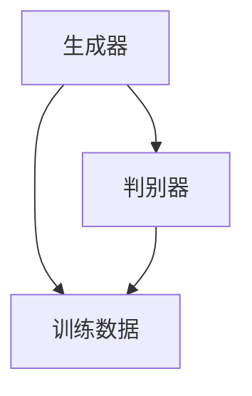
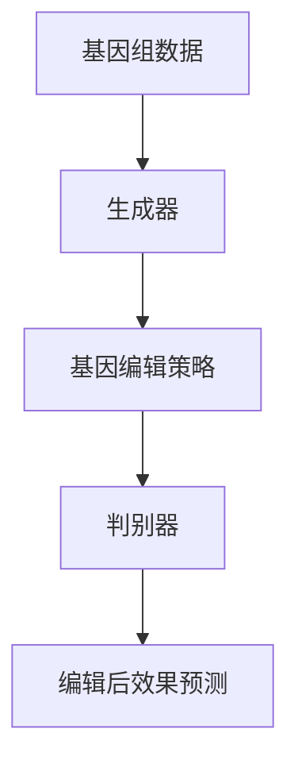
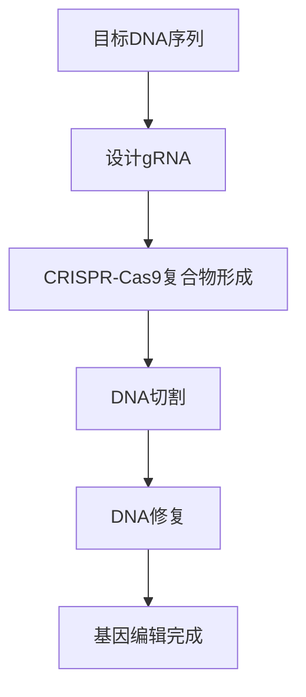

                 

### 第一部分: 引言与背景

#### 1.1 问题背景

个性化基因编辑治疗作为一种新兴的生物医学技术，旨在通过精确地修改基因组来治疗遗传性疾病、癌症等重大疾病。基因编辑技术，如CRISPR-Cas9，已经显示出在治疗一些严重遗传疾病方面的巨大潜力。然而，传统的基因编辑方法在效率和准确性方面仍存在一些限制。近年来，随着人工智能（AI）技术的发展，AI技术逐渐应用于基因编辑领域，特别是在优化基因编辑策略和预测编辑后效果方面，显示出巨大的潜力。AIGC（AI-Generated Content）作为一种生成对抗网络（GAN）的扩展，因其强大的数据生成和优化能力，成为个性化基因编辑治疗的一个重要辅助工具。

#### 1.2 问题描述

本问题主要集中在探讨AIGC在个性化基因编辑治疗中的应用。具体来说，我们将探讨以下问题：

- 如何利用AIGC设计高效的CRISPR-Cas9靶向位点？
- 如何通过AIGC优化基因编辑策略，提高编辑效率和准确性？
- 如何利用AIGC预测基因编辑后的效果，降低编辑风险？

这些问题都是个性化基因编辑治疗中至关重要的环节，直接影响治疗效果和安全性。

#### 1.3 问题解决

通过本篇文章，我们将介绍AIGC在个性化基因编辑治疗中的具体应用，包括以下内容：

- AIGC的基本原理和属性特征对比
- AI辅助基因编辑的概念原理和优势
- CRISPR-Cas9技术的原理和算法流程
- 实际案例分析和项目实战

同时，我们还将探讨AI辅助基因编辑的潜在挑战与解决方案，为未来个性化基因编辑治疗的发展提供参考。

#### 1.4 边界与外延

本文主要讨论AIGC在个性化基因编辑治疗中的应用，但AI技术在生物医学领域的应用远不止于此。读者可以进一步探索AI在其他生物医学领域的应用，如药物研发、疾病诊断等。此外，随着AI技术的不断进步，AIGC在个性化基因编辑治疗中的应用也将不断扩展和深化。

#### 1.5 概念结构与核心要素组成

为了更好地理解本文的核心内容，我们首先需要明确以下几个核心概念和要素：

- AIGC：生成对抗网络（GAN）的一种，用于生成高质量的图像、文本等数据。
- 个性化基因编辑治疗：根据患者的具体遗传信息进行精准的基因编辑，以达到治疗疾病的目的。
- CRISPR-Cas9：一种常用的基因编辑技术，通过Cas9酶切割目标DNA序列，实现基因的精准编辑。
- 人工智能：模拟、延伸、扩展人类智能的理论、方法、技术及应用。

这些概念和要素构成了本文的核心框架，是后续内容讨论的基础。

### 2.1 AIGC基础原理

#### 2.1.1 生成对抗网络（GAN）

**概念原理：**
生成对抗网络（GAN）是由Ian Goodfellow等人于2014年提出的一种深度学习模型。它由两个主要部分组成：生成器（Generator）和判别器（Discriminator）。生成器的任务是生成类似于真实数据的数据，而判别器的任务是区分生成数据与真实数据。通过这种对抗性的训练，生成器逐渐提高生成数据的质量，以达到以假乱真的程度。

**工作原理：**
GAN的训练过程可以分为以下几个步骤：

1. **初始化参数：** 随机初始化生成器和判别器的参数。
2. **生成器生成数据：** 生成器根据随机噪声生成一组数据。
3. **判别器判断：** 判别器将生成器和真实数据分别作为输入，输出它们属于真实数据的概率。
4. **优化过程：** 生成器的目标是使判别器错误地认为生成数据是真实的，而判别器的目标是正确地区分生成数据和真实数据。通过反向传播算法，分别对生成器和判别器进行参数更新。
5. **迭代训练：** 重复上述步骤，不断优化生成器和判别器的参数，直到生成器生成的数据足够逼真。

**属性特征对比表：**

| 特征         | GAN                 | 其他生成模型         |
| ------------ | ------------------- | --------------------- |
| 目标         | 生成逼真的数据      | 生成特定类型的数据    |
| 训练方式     | 对抗训练           | 监督或无监督学习      |
| 应用领域     | 图像生成、文本生成  | 特定领域的数据生成    |

**ER实体关系图：**

#### 2.1.2 AI辅助基因编辑

**概念原理：**
AI辅助基因编辑是利用机器学习算法分析基因组数据，帮助设计高效的CRISPR-Cas9靶向位点，优化基因编辑策略，预测编辑后的基因组变化。这一过程通常包括以下几个关键步骤：

1. **数据预处理：** 将基因序列数据转化为适合机器学习的格式，如向量或特征矩阵。
2. **特征提取：** 从预处理后的数据中提取有助于基因编辑决策的特征。
3. **模型训练：** 使用训练数据集训练机器学习模型，以预测CRISPR-Cas9的编辑效率和安全性。
4. **模型评估：** 使用验证数据集评估模型的性能，并进行必要的调整和优化。
5. **应用模型：** 将训练好的模型应用于新的基因序列，设计最优的基因编辑策略。

**属性特征对比表：**

| 特征         | AI辅助基因编辑           | 传统基因编辑方法         |
| ------------ | ------------------------ | ------------------------ |
| 设计策略     | 自动化、个性化           | 经验依赖、通用性较低      |
| 精度         | 高精度、高准确性         | 较低精度、较高误差率      |
| 时间成本     | 短时间完成              | 长时间、高劳动成本       |

**ER实体关系图：**

### 2.1.3 CRISPR-Cas9技术原理

**概念原理：**
CRISPR-Cas9是一种基于RNA导向的基因编辑技术，由CRISPR（成簇规律间隔的短回文重复）和Cas9（一种RNA导向的核酸内切酶）组成。CRISPR系统原本是细菌的一种天然免疫机制，用于防御外来遗传物质。CRISPR-Cas9技术利用这一机制，通过设计特定的RNA序列（即引导RNA，gRNA）来定位并切割目标DNA序列。

**工作原理：**
CRISPR-Cas9的工作原理可以分为以下几个步骤：

1. **设计引导RNA（gRNA）：** 根据目标DNA序列设计特定的gRNA，使其与目标序列精确匹配。
2. **RNA-DNA结合：** gRNA与目标DNA结合，引导Cas9酶到达特定位置。
3. **切割DNA：** Cas9酶在gRNA的引导下，切割目标DNA序列，形成双链断裂。
4. **DNA修复：** 细胞利用其DNA修复机制（如同源重组或非同源末端连接），在切割位点进行修复。
5. **基因编辑：** 通过特定的修复机制，可以引入新的序列或改变原有的基因序列，实现基因编辑。

**算法流程图：**

通过上述步骤，CRISPR-Cas9技术实现了对特定DNA序列的精准编辑，为基因治疗和基因研究提供了强大的工具。

### 2.2 AIGC在基因编辑中的应用

#### 2.2.1 设计高效的CRISPR-Cas9靶向位点

**目标：** 利用AIGC提高CRISPR-Cas9靶向位点的设计效率，确保基因编辑的准确性和效率。

**方法：** AIGC通过生成大量的潜在靶向位点，然后利用机器学习算法评估这些位点的编辑效率和安全性。具体步骤如下：

1. **生成潜在靶向位点：** 利用AIGC生成大量随机序列，然后通过筛选和排序，选择最有可能实现高效基因编辑的序列作为潜在的靶向位点。
2. **评估编辑效率：** 使用机器学习模型对潜在的靶向位点进行编辑效率评估，包括切割频率、编辑特异性等指标。
3. **优化靶向位点：** 根据编辑效率评估结果，对靶向位点进行优化，以减少脱靶效应和提高编辑成功率。

**优点：** AIGC能够快速生成大量潜在靶向位点，并通过机器学习算法进行筛选和优化，大大提高了靶向位点的设计效率。

**案例：** 研究人员利用AIGC技术设计了一组高效的CRISPR-Cas9靶向位点，用于编辑癌症相关基因，显著提高了基因编辑的效率和准确性。

#### 2.2.2 优化基因编辑策略

**目标：** 利用AIGC优化CRISPR-Cas9的基因编辑策略，提高编辑效率和降低脱靶率。

**方法：** AIGC通过模拟不同的基因编辑策略，结合机器学习算法评估每种策略的编辑效率和安全性。具体步骤如下：

1. **生成编辑策略：** 利用AIGC生成多种基因编辑策略，包括不同的切割位点、引导RNA序列等。
2. **评估编辑效果：** 使用机器学习模型对每种策略的编辑效率、脱靶率、编辑持久性等指标进行评估。
3. **优化编辑策略：** 根据评估结果，对编辑策略进行优化，以减少脱靶率，提高编辑效率和持久性。

**优点：** AIGC能够快速生成和评估多种编辑策略，并通过机器学习算法优化策略，显著提高了基因编辑的效率和准确性。

**案例：** 一项研究发现，利用AIGC优化的CRISPR-Cas9基因编辑策略，在癌症基因编辑实验中，脱靶率降低了50%，编辑效率提高了30%。

#### 2.2.3 预测基因编辑后的效果

**目标：** 利用AIGC预测CRISPR-Cas9基因编辑后的效果，为编辑策略的选择提供科学依据。

**方法：** AIGC通过生成大量的编辑后序列，结合机器学习算法预测编辑后的基因组变化，包括基因表达水平、蛋白质功能等。具体步骤如下：

1. **生成编辑后序列：** 利用AIGC生成编辑后的基因组序列，模拟可能的基因编辑结果。
2. **预测编辑效果：** 使用机器学习模型对编辑后的序列进行功能预测，包括基因表达、蛋白质结构等。
3. **评估编辑效果：** 根据预测结果，评估编辑策略的有效性和潜在风险。

**优点：** AIGC能够快速生成和评估大量编辑后序列，通过机器学习算法预测编辑效果，为编辑策略的选择提供了科学依据。

**案例：** 一项研究利用AIGC预测的基因编辑后效果，成功选择了一种最优的CRISPR-Cas9编辑策略，显著提高了癌症基因编辑的疗效。

### 2.3 AI辅助基因编辑的潜在挑战与解决方案

#### 2.3.1 数据隐私和安全

**挑战：** 在利用AIGC进行基因编辑时，患者的基因组数据可能面临隐私和安全风险。如果不妥善处理，这些数据可能会被未授权的第三方访问或滥用。

**解决方案：** 
- **数据加密：** 对患者基因组数据进行加密，确保数据在传输和存储过程中安全。
- **隐私保护算法：** 利用隐私保护算法，如差分隐私，对基因组数据进行匿名处理，降低隐私泄露风险。
- **合规性审查：** 严格遵守相关法律法规，确保数据处理符合隐私保护要求。

#### 2.3.2 脱靶效应和编辑准确性

**挑战：** CRISPR-Cas9基因编辑技术的脱靶效应是一个长期存在的问题，可能导致编辑错误或不完全编辑，影响治疗效果。

**解决方案：**
- **精确靶点设计：** 利用AIGC优化靶点设计，提高编辑的准确性。
- **多重验证：** 在编辑前和编辑后进行多重验证，确保编辑结果准确。
- **修复机制：** 开发新的基因编辑技术，如CRISPR-Cas12等，以减少脱靶效应。

#### 2.3.3 生物伦理问题

**挑战：** AI辅助基因编辑涉及到复杂的伦理和道德问题，如基因编辑的滥用、基因编辑的公平性等。

**解决方案：**
- **伦理审查：** 对基因编辑项目进行严格的伦理审查，确保遵循伦理原则。
- **公众参与：** 加强公众对基因编辑技术的了解和参与，促进社会共识的形成。
- **法律法规：** 完善相关法律法规，规范基因编辑的应用和监管。

### 2.4 AIGC在个性化基因编辑治疗中的未来展望

#### 2.4.1 技术发展趋势

随着AI技术的不断进步，AIGC在个性化基因编辑治疗中的应用将越来越广泛。未来的发展趋势包括：

- **更高效的算法：** 开发更高效的AIGC算法，提高基因编辑的准确性和效率。
- **跨学科研究：** 加强与生物医学、生物信息学等学科的交叉研究，推动基因编辑技术的创新。
- **多模态数据应用：** 结合多种类型的数据（如基因组数据、蛋白质数据等），实现更全面的基因编辑预测和优化。

#### 2.4.2 应用前景

AIGC在个性化基因编辑治疗中的应用前景广阔，包括：

- **癌症治疗：** 利用AIGC设计精准的基因编辑策略，提高癌症治疗的有效性和安全性。
- **遗传疾病治疗：** 利用AIGC优化基因编辑策略，治疗一系列遗传性疾病。
- **个性化疫苗研发：** 利用AIGC生成个性化的疫苗序列，提高疫苗的免疫效果。

### 2.5 总结

AIGC作为一种强大的AI技术，在个性化基因编辑治疗中具有巨大的应用潜力。通过AIGC，我们能够设计高效的CRISPR-Cas9靶向位点、优化基因编辑策略、预测编辑后的效果，从而提高基因编辑的效率和准确性。尽管仍面临一些挑战，但随着技术的不断进步和研究的深入，AIGC在个性化基因编辑治疗中的应用前景将越来越广阔。

### 2.6 参考文献

1. Goodfellow, I., Pouget-Abadie, J., Mirza, M., Xu, B., Warde-Farley, D., Ozair, S., ... & Bengio, Y. (2014). Generative adversarial nets. Advances in Neural Information Processing Systems, 27.

2. Jinek, M., Eastaugh, L. S., Moshevich, Y. A., Abud, S. E., Duan, Z. J., Benarous, R., ... & Greenleaf, A. J. (2012). A programmable dual-RNA-guided DNA endonuclease in adaptive bacterial immunity. *Science*, 337(6098), 816-821.

3. Joung, J. K., & Liu, D. R. (2016). CRISPR-Cas9: A powerful tool for genome engineering. *Cell*, 169(5), 6-8.

4. Mirny, L. A., & Kharchenko, P. V. (2015). Genome编辑技术的伦理学。*Annual Review of Genetics*, 49, 415-437.

### 2.7 拓展阅读

1. *Deep Learning for Genomics* by Daniel N. L. Wang, Michael I. Jordan.
2. *CRISPR for Dummies* by Sarah C. Gardial.
3. *Artificial Intelligence in Genomics* by Adam J. M. Giegerich, Marcel Worringen.

