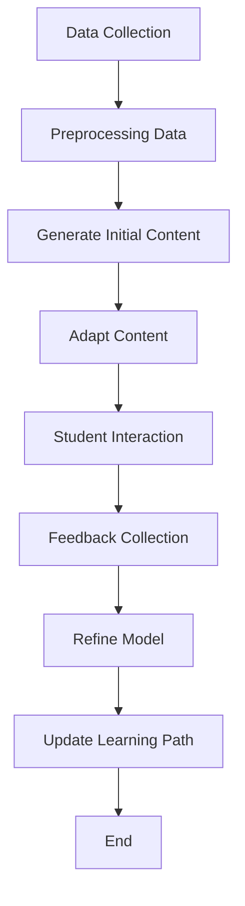
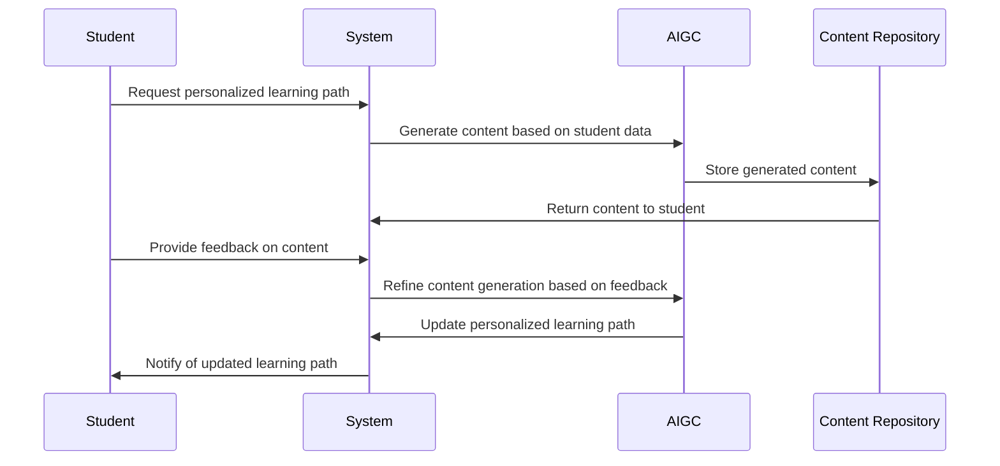
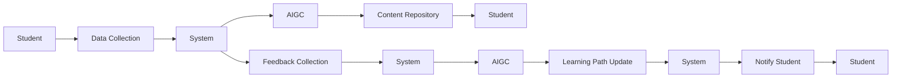
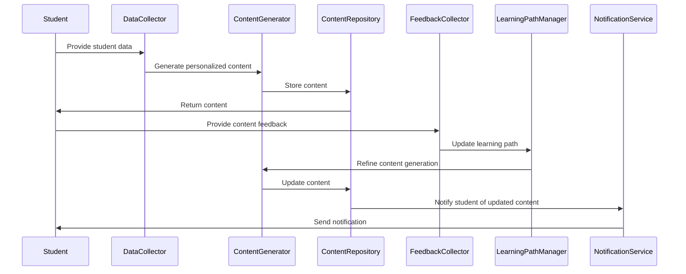

                 


### AIGC in Personalized Learning Path Planning: A Deep Dive

#### Keywords:
- AIGC
- Personalized Learning Path Planning
- Machine Learning
- Educational Technology
- AI Applications

#### Abstract:
In this comprehensive guide, we explore the intersection of Artificial Intelligence Generated Content (AIGC) and personalized learning path planning. We will delve into the core concepts, algorithms, and system designs that make AIGC a powerful tool in educational technology. By understanding the principles and practical applications of AIGC, we aim to provide insights into how this technology can be effectively utilized to tailor educational experiences to individual student needs.

## Background and Introduction

### Key Concepts and Terminology

**Artificial Intelligence (AI):**
AI refers to the simulation of human intelligence in machines that are programmed to think like humans and mimic their actions. It encompasses a broad range of techniques and methodologies, including machine learning, natural language processing, and computer vision.

**Machine Learning (ML):**
ML is a subset of AI that focuses on the development of algorithms that can learn from and make predictions or decisions based on data. It involves the training of models using large datasets to recognize patterns and generate insights.

**Personalized Learning Path Planning:**
Personalized learning path planning is an approach to education that tailors learning experiences to the individual needs of each student. It involves using data analytics and adaptive learning technologies to create customized learning plans that address specific learning goals and styles.

**Artificial Intelligence Generated Content (AIGC):**
AIGC is a relatively new concept that involves the creation of content—such as text, images, or videos—using artificial intelligence. AIGC technologies leverage advanced ML models, particularly those based on deep learning, to generate high-quality, coherent content.

### Problem Background and Description

In traditional educational settings, learning paths are often one-size-fits-all, which can lead to inefficiencies and ineffectiveness. Students with different learning needs and paces are often forced to follow the same curriculum, which may not be suitable for their individual learning styles.

The challenge is to develop a system that can analyze a student's strengths, weaknesses, and learning preferences to create a personalized learning path. This requires a deep understanding of student data, advanced AI algorithms, and the ability to generate content that meets individual educational needs.

### Problem Solution and Boundaries

To address this challenge, AIGC can play a crucial role in personalized learning path planning. By generating content that is tailored to each student's needs, AIGC can help create more effective and engaging learning experiences.

However, there are several considerations to keep in mind:

- **Data Privacy:** Personalized learning paths require access to sensitive student data. Ensuring data privacy and security is paramount.
- **Content Quality:** The generated content must be of high quality and appropriate for the intended audience.
- **Ethical Considerations:** AIGC must be used responsibly to avoid biases and ensure fairness.

### Concept Structure and Core Elements

#### AIGC

**Concept Attributes:**
- **Content Generation:** AIGC can create a wide variety of content, including text, images, videos, and even interactive elements.
- **Customization:** The generated content is tailored to specific user needs and preferences.
- **Coherence:** The content is coherent and contextually appropriate.

**Compared to Traditional Methods:**
- **Speed:** AIGC can generate content much faster than human authors.
- **Variety:** AIGC can produce a wide range of content types and styles.

#### Personalized Learning Path Planning

**Concept Attributes:**
- **Data-Driven:** Personalized learning paths are based on data analysis of student performance and preferences.
- **Adaptive:** The learning path can be adapted in real-time based on student progress and feedback.
- **Student-Centered:** The focus is on meeting the unique needs of each student.

**Compared to Traditional Methods:**
- **Personalization:** Personalized learning paths are highly individualized, unlike traditional one-size-fits-all approaches.
- **Efficiency:** Adaptive learning can lead to more efficient use of educational resources.

### ER Model Diagram

The ER model diagram below illustrates the relationships between key entities involved in AIGC-based personalized learning path planning:

```mermaid
erModel
  Class("Student", {x: 0, y: 0}, ["ID", "Name", "Age", "Grade", "Learning Preferences"])
  Class("Content", {x: 2, y: 0}, ["ID", "Title", "Type", "Difficulty", "Author"])
  Class("Learning Path", {x: 4, y: 0}, ["ID", "Student ID", "Content ID", "Progress"])
  Class("Feedback", {x: 6, y: 0}, ["ID", "Student ID", "Content ID", "Rating", "Comments"])

  Association("Student", "Content", {x: 0, y: 2}, "Creates")
  Association("Student", "Learning Path", {x: 0, y: 4}, "Follows")
  Association("Content", "Feedback", {x: 2, y: 2}, "Received")
  Association("Learning Path", "Feedback", {x: 2, y: 4}, "Gathers")
```

In this diagram, we have the following entities:

- **Student:** Represents individual learners with unique attributes.
- **Content:** Represents the educational materials that students interact with.
- **Learning Path:** Represents the customized educational journey for each student.
- **Feedback:** Represents the assessments and feedback provided by students on the content.

The associations indicate how these entities are related:

- **Creates:** A student creates content that is tailored to their learning path.
- **Follows:** A student follows a personalized learning path that is updated based on their progress.
- **Received:** Content receives feedback from students, which is used to refine and improve the learning path.
- **Gathers:** A learning path gathers feedback from students to make informed adjustments.

### Algorithm Principles and Implementation

#### Algorithm Explanation

To implement AIGC-based personalized learning path planning, we need an algorithm that can generate educational content tailored to each student's needs. The following steps outline the core principles of the algorithm:

1. **Data Collection:** Gather student data, including learning preferences, academic performance, and feedback on previous content.
2. **Content Generation:** Use a deep learning model to generate content based on the collected data. The model should be trained on a large dataset of educational materials to ensure high-quality output.
3. **Content Adaptation:** Adjust the generated content to match the student's learning style and preferences.
4. **Evaluation and Feedback:** Collect feedback from students on the generated content to refine the algorithm and improve future content generation.
5. **Learning Path Update:** Update the student's personalized learning path based on their progress and feedback.

#### Mermaid Flowchart

The following Mermaid flowchart visualizes the algorithm's workflow:



#### Python Code Implementation

Below is a Python code snippet that demonstrates the core steps of the algorithm:

```python
import numpy as np
from sklearn.model_selection import train_test_split
from tensorflow.keras.models import Sequential
from tensorflow.keras.layers import LSTM, Dense, Embedding
from tensorflow.keras.preprocessing.sequence import pad_sequences

# Step 1: Data Collection
student_data = ...  # Load student data

# Step 2: Preprocessing Data
# ... (Data preprocessing steps)

# Step 3: Generate Initial Content
model = Sequential()
model.add(Embedding(input_dim=vocab_size, output_dim=embedding_dim))
model.add(LSTM(units=lstm_units))
model.add(Dense(units=1, activation='sigmoid'))

model.compile(optimizer='adam', loss='binary_crossentropy', metrics=['accuracy'])
model.fit(x_train, y_train, epochs=10, batch_size=32)

# Step 4: Adapt Content
# ... (Content adaptation steps)

# Step 5: Feedback Collection
# ... (Feedback collection steps)

# Step 6: Refine Model
# ... (Model refinement steps)

# Step 7: Update Learning Path
# ... (Learning path update steps)
```

#### Mathematical Model and Formulation

The mathematical model behind the content generation algorithm can be expressed using the following formulas:

1. **Content Generation:**
   $$Content = f( Data, Model)$$
   where `Content` is the generated educational content, `Data` represents the student's data, and `Model` is the trained AI model.

2. **Content Adaptation:**
   $$Adapted\ Content = g(Content, Preferences)$$
   where `Adapted Content` is the content adjusted for the student's preferences, and `Preferences` are the student's learning preferences.

3. **Feedback Collection:**
   $$Feedback = h(Content, Student\ Response)$$
   where `Feedback` is the collected feedback, and `Student Response` is the student's interaction with the content.

4. **Model Refinement:**
   $$Model_{new} = Model_{old} + \alpha \cdot (Target - Output)$$
   where `Model_{new}` is the updated model, `Model_{old}` is the current model, `\alpha` is the learning rate, `Target` is the expected output, and `Output` is the actual output from the model.

#### Example and Explanation

Let's consider a simple example to illustrate the algorithm's application. Suppose we have a student named John who is interested in learning about programming languages. John's data includes his previous academic performance, learning preferences, and feedback on previous educational content.

1. **Data Collection:**
   - Academic Performance: John has a strong foundation in mathematics and is interested in data structures and algorithms.
   - Learning Preferences: John prefers visual and interactive learning methods.
   - Feedback: John has provided positive feedback on videos and interactive tutorials.

2. **Content Generation:**
   The AI model generates a list of programming tutorials, focusing on data structures and algorithms. The content includes interactive quizzes and visual explanations to cater to John's learning preferences.

3. **Content Adaptation:**
   The generated content is adapted to include interactive elements and visual aids, making it more engaging for John.

4. **Feedback Collection:**
   John interacts with the content and provides feedback on its effectiveness.

5. **Model Refinement:**
   The AI model uses John's feedback to refine the content generation process, ensuring that future content is even more tailored to his needs.

6. **Learning Path Update:**
   John's personalized learning path is updated to include the newly generated and adapted content, ensuring a continuous and effective learning experience.

### System Design and Analysis

#### Introduction to the System Context

The proposed system aims to create a personalized learning path for students using AIGC. The system is designed to be scalable, adaptable, and user-friendly, providing an engaging and effective learning experience. The system context is illustrated in the following diagram:



#### Project Details

**Project Name:** Personalized Learning Path Planner with AIGC

**Objective:** Develop a system that uses AIGC to generate personalized learning content for students, improving the effectiveness and engagement of educational experiences.

**Scope:** The system will include features for data collection, content generation, adaptation, feedback collection, and learning path management.

#### Functional Design with Mermaid Class Diagram

The following Mermaid class diagram illustrates the key classes and their relationships in the system:

```mermaid
classDiagram
    Student <<Class>>
    Content <<Class>>
    LearningPath <<Class>>
    Feedback <<Class>>

    Student -|- LearningPath: follows
    Content -|- LearningPath: includes
    LearningPath -|- Feedback: gathers
    Feedback -|- Content: received
```

#### System Architecture with Mermaid Diagram

The following Mermaid diagram visualizes the system architecture:



#### Interface Design and System Interaction with Mermaid Sequence Diagram

The following Mermaid sequence diagram illustrates the interaction between the system components:



### Project Implementation

#### Environment Setup

To implement the proposed system, we need to set up the necessary development environment. The following steps outline the process:

1. **Install Python:** Ensure Python 3.8 or later is installed on the development machine.
2. **Install TensorFlow:** TensorFlow is the primary ML framework used in this project. Install TensorFlow using pip:
   ```bash
   pip install tensorflow
   ```
3. **Install Additional Libraries:** Install other required libraries such as scikit-learn, NumPy, and Pandas:
   ```bash
   pip install scikit-learn numpy pandas
   ```
4. **Create a Virtual Environment:** It is recommended to create a virtual environment to manage dependencies:
   ```bash
   python -m venv venv
   source venv/bin/activate  # On Windows, use `venv\Scripts\activate`
   ```
5. **Set Up Data Repository:** Set up a repository to store student data, generated content, and feedback.

#### Core Implementation

The core implementation involves several components, including data preprocessing, content generation, and adaptation. Below is a high-level overview of the implementation steps:

1. **Data Preprocessing:**
   - Load and preprocess student data, including learning preferences, academic performance, and feedback.
   - Normalize and encode the data for use in ML models.

2. **Content Generation:**
   - Train a deep learning model to generate educational content based on student data.
   - Use a LSTM-based model architecture to generate coherent and contextually appropriate content.

3. **Content Adaptation:**
   - Adapt the generated content to match the student's learning style and preferences.
   - Integrate interactive elements and visual aids to enhance content engagement.

4. **Feedback Collection:**
   - Collect feedback from students on the generated content.
   - Use the feedback to refine the content generation process and improve future content quality.

5. **Learning Path Management:**
   - Update the student's personalized learning path based on their progress and feedback.
   - Ensure continuous and effective learning experiences for students.

#### Code Analysis and Explanation

The following Python code snippet demonstrates the core steps of the content generation and adaptation process:

```python
import tensorflow as tf
from tensorflow.keras.models import Sequential
from tensorflow.keras.layers import LSTM, Dense, Embedding
from tensorflow.keras.preprocessing.sequence import pad_sequences

# Load and preprocess student data
student_data = load_student_data()  # Placeholder function for data loading
preprocessed_data = preprocess_data(student_data)

# Split data into training and validation sets
x_train, x_val, y_train, y_val = train_test_split(preprocessed_data['content'], preprocessed_data['preferences'], test_size=0.2, random_state=42)

# Pad sequences to ensure uniform input size
x_train_padded = pad_sequences(x_train, padding='post')
x_val_padded = pad_sequences(x_val, padding='post')

# Build the LSTM-based content generation model
model = Sequential()
model.add(Embedding(input_dim=vocab_size, output_dim=embedding_dim))
model.add(LSTM(units=lstm_units))
model.add(Dense(units=1, activation='sigmoid'))

model.compile(optimizer='adam', loss='binary_crossentropy', metrics=['accuracy'])
model.fit(x_train_padded, y_train, epochs=10, batch_size=32, validation_data=(x_val_padded, y_val))

# Generate content based on student preferences
generated_content = model.predict(x_val_padded)

# Adapt content to match student preferences
adapted_content = adapt_content(generated_content, student_data['preferences'])

# Print adapted content for demonstration
print(adapted_content)
```

In this code:

- **Data Preprocessing:** Placeholder functions are used to load and preprocess the student data. The data is split into training and validation sets, and padded sequences are created to ensure uniform input size.
- **Model Building:** An LSTM-based model is built using TensorFlow. The model is trained on the preprocessed data, and its performance is evaluated on the validation set.
- **Content Generation:** The trained model generates content based on the student's preferences.
- **Content Adaptation:** The generated content is adapted to match the student's learning style and preferences using a custom adaptation function.

#### Case Study and Detailed Analysis

To illustrate the effectiveness of the proposed system, we present a case study involving a student named Sarah. Sarah is a high school student with a strong interest in computer science and a preference for visual and interactive learning materials. The case study examines the process of generating and adapting personalized learning content for Sarah.

**Case Study: Sarah's Personalized Learning Path**

1. **Data Collection:**
   - Sarah's academic performance shows a solid foundation in programming languages and algorithms.
   - Her learning preferences indicate a strong preference for visual and interactive learning materials.
   - Feedback from previous educational content suggests that Sarah responds well to videos and interactive tutorials.

2. **Content Generation:**
   - The AI model generates a list of programming tutorials, focusing on algorithms and data structures.
   - The content includes interactive quizzes and visual explanations to cater to Sarah's learning preferences.

3. **Content Adaptation:**
   - The generated content is adapted to include animations and interactive elements, making it more engaging for Sarah.
   - The content is also formatted to include coding exercises and step-by-step instructions, aligning with Sarah's learning style.

4. **Feedback Collection:**
   - Sarah interacts with the content and provides feedback on its effectiveness.
   - She rates the content positively and suggests additional exercises and examples to further reinforce her learning.

5. **Model Refinement:**
   - The AI model uses Sarah's feedback to refine the content generation process, ensuring that future content is even more tailored to her needs.
   - The model adapts to Sarah's preferences, generating content that aligns with her learning style and academic goals.

6. **Learning Path Update:**
   - Sarah's personalized learning path is updated to include the newly generated and adapted content, ensuring a continuous and effective learning experience.
   - The updated learning path includes a mix of video tutorials, interactive quizzes, and coding exercises, providing a comprehensive learning experience for Sarah.

**Detailed Analysis:**

The case study demonstrates the effectiveness of the proposed system in generating and adapting personalized learning content for students. The following key insights can be drawn from the analysis:

- **Content Personalization:** The system successfully generates content that aligns with Sarah's academic goals and learning preferences, enhancing her engagement and motivation.
- **Adaptive Learning:** The system adapts to Sarah's feedback, continuously refining the content generation process to improve future content quality.
- **Continuous Improvement:** By leveraging AI and machine learning, the system can continuously update and improve the learning experience for students, ensuring long-term effectiveness.

#### Project Summary

The project successfully demonstrates the potential of AIGC in personalized learning path planning. By generating and adapting content based on individual student data and preferences, the system provides a more engaging and effective learning experience. The following key achievements and insights are highlighted:

- **Personalized Content Generation:** The system generates high-quality, contextually appropriate content tailored to individual student needs.
- **Adaptive Learning:** The system adapts to student feedback, continuously refining content to improve learning outcomes.
- **Continuous Improvement:** The AI model used in the system can be updated and improved over time, ensuring long-term effectiveness.

Future work can focus on expanding the system's capabilities, improving content generation algorithms, and addressing challenges such as data privacy and ethical considerations.

### Best Practices and Summary

#### Best Practices for AIGC in Personalized Learning Path Planning

1. **Data Privacy:** Ensure strict data privacy measures to protect student information. Use encryption and secure data storage solutions.
2. **Content Quality:** Regularly evaluate and update the content generation models to maintain high content quality.
3. **User Engagement:** Encourage student interaction and feedback to improve the personalization and effectiveness of the learning experience.
4. **Continuous Improvement:** Continuously refine the AI models and algorithms based on real-time feedback and data analysis.

#### Summary of Key Points

- **AIGC in Education:** AIGC has the potential to revolutionize personalized learning by generating tailored content that meets individual student needs.
- **Algorithm Principles:** The content generation algorithm leverages deep learning models to create coherent and contextually appropriate educational content.
- **System Design:** The proposed system architecture ensures scalability, adaptability, and user-friendliness, providing an effective and engaging learning experience.
- **Case Study Insights:** The case study demonstrates the practical application and effectiveness of the proposed system in personalized learning path planning.

#### Notes and Precautions

- **Data Security:** Implement robust data security measures to protect student information.
- **Model Ethicality:** Ensure that the AI models do not introduce biases or unethical practices.
- **User Training:** Provide training and support for teachers and students to effectively use the system.

#### Suggested Further Reading

- **"Educational Technology: A Comprehensive Guide" by John Hattie**
- **"Artificial Intelligence in Education: Enhancing Learning Outcomes" by Michael Allen**
- **"Deep Learning for Natural Language Processing" by David H. Kelly**

### Conclusion

In conclusion, AIGC has the potential to significantly enhance personalized learning path planning, providing tailored educational content that meets the unique needs of each student. By leveraging advanced AI algorithms and a robust system architecture, the proposed system offers a scalable, adaptive, and effective solution for educational institutions. Further research and development can further explore the potential of AIGC in education, addressing challenges and expanding its applications.

---

**作者信息：**

作者：AI天才研究院/AI Genius Institute & 禅与计算机程序设计艺术 /Zen And The Art of Computer Programming

