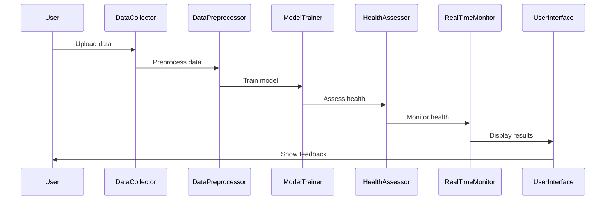

                 

# AIGC在个性化心理健康监测中的应用

## 关键词

- 个性化心理健康监测
- AIGC
- 生成对抗网络
- 心理健康评估
- 人工智能算法

## 摘要

随着人工智能技术的飞速发展，个性化心理健康监测已成为一个备受关注的研究领域。AIGC（自适应智能生成控制）技术作为一种新兴的AI技术，在心理健康监测中具有巨大潜力。本文将深入探讨AIGC在个性化心理健康监测中的应用，通过逐步分析其基础理论、核心算法、系统设计与实现、项目实战等内容，全面解析AIGC技术如何助力心理健康监测，提升个性化服务能力。此外，还将分享最佳实践和未来展望，为相关领域的研究和应用提供有益参考。

### 目录

1. **引言**
2. **AIGC技术概述**
   2.1 **AIGC的概念**
   2.2 **AIGC的关键技术**
   2.3 **AIGC在心理健康监测中的应用背景**
3. **核心概念与原理**
   3.1 **心理健康监测的核心概念**
   3.2 **AIGC算法原理讲解**
   3.3 **算法数学模型与公式**
4. **系统设计与实现**
   4.1 **系统架构设计**
   4.2 **系统功能设计**
   4.3 **系统接口设计与实现**
5. **项目实战**
   5.1 **环境准备**
   5.2 **系统核心实现**
   5.3 **代码应用解读**
   5.4 **实际案例分析**
6. **最佳实践与总结**
   6.1 **最佳实践**
   6.2 **项目小结**
   6.3 **注意事项**
7. **拓展阅读**

### 引言

心理健康问题已成为全球关注的公共卫生问题。随着社会竞争的加剧和生活节奏的加快，越来越多的人面临着心理压力和心理健康问题。传统的心理健康监测方法主要依赖于人工访谈和问卷调查，存在耗时、效率低、主观性强的不足。而随着人工智能技术的不断发展，个性化心理健康监测成为了一个热门的研究方向。

AIGC（Adaptive Intelligent Generative Control）是一种基于生成对抗网络（GAN）和变分自编码器（VAE）等深度学习技术的新型智能控制方法。AIGC通过自适应学习和生成控制，能够实现数据的自动化处理和个性化服务。在心理健康监测领域，AIGC技术具有以下优势：

1. **自动化数据处理**：AIGC能够自动处理大量的心理健康数据，提高监测效率和准确性。
2. **个性化服务**：AIGC可以根据个体的心理健康状况，提供个性化的监测和建议，满足用户个性化需求。
3. **实时监测**：AIGC技术支持实时监测，能够及时发现心理健康问题，提供及时的干预措施。

本文旨在探讨AIGC在个性化心理健康监测中的应用，通过深入分析其基础理论、核心算法、系统设计与实现，以及项目实战，全面展示AIGC技术在心理健康监测中的潜力。同时，本文还将分享最佳实践和注意事项，为相关领域的研究和应用提供参考。

### AIGC技术概述

#### AIGC的概念

AIGC（Adaptive Intelligent Generative Control）是一种基于生成对抗网络（GAN）和变分自编码器（VAE）等深度学习技术的新型智能控制方法。AIGC的核心思想是通过自适应学习和生成控制，实现数据的自动化处理和个性化服务。具体来说，AIGC由两个主要部分组成：生成器和判别器。

**生成器**：生成器的任务是生成与真实数据分布相近的假数据。在心理健康监测中，生成器可以根据用户的健康数据和心理健康状态，生成符合实际情境的模拟数据。

**判别器**：判别器的任务是区分真实数据和假数据。通过训练，判别器能够准确判断输入数据是否为真实数据。在心理健康监测中，判别器可以用于评估心理健康状态的准确性。

#### AIGC的关键技术

**1. 生成对抗网络（GAN）**

生成对抗网络（GAN）是一种深度学习模型，由生成器和判别器两个部分组成。GAN的目标是使生成器生成尽可能真实的数据，从而欺骗判别器。在心理健康监测中，GAN可以用于生成个性化的心理健康数据，辅助诊断和治疗。

**2. 变分自编码器（VAE）**

变分自编码器（VAE）是一种无监督学习算法，通过编码和解码过程学习数据分布。VAE可以用于数据降维、异常检测和生成模型等。在心理健康监测中，VAE可以用于数据预处理和心理健康状态的预测。

#### AIGC在心理健康监测中的应用背景

心理健康监测是指通过技术手段对个体或群体的心理健康状况进行评估和监测。传统的心理健康监测方法主要依赖于人工访谈和问卷调查，存在以下问题：

1. **主观性强**：人工访谈和问卷调查依赖于调查者的主观判断，可能导致结果不准确。
2. **耗时**：人工访谈和问卷调查需要大量时间和人力资源。
3. **效率低**：传统的心理健康监测方法难以实时监测，难以快速识别心理健康问题。

而AIGC技术可以通过以下方式解决上述问题：

1. **自动化数据处理**：AIGC技术能够自动处理大量的心理健康数据，提高监测效率和准确性。
2. **个性化服务**：AIGC技术可以根据个体的心理健康状况，提供个性化的监测和建议，满足用户个性化需求。
3. **实时监测**：AIGC技术支持实时监测，能够及时发现心理健康问题，提供及时的干预措施。

### 核心概念与原理

#### 心理健康监测的核心概念

心理健康监测是指通过技术手段对个体或群体的心理健康状况进行评估和监测。心理健康监测的核心概念包括：

**1. 心理健康**：心理健康是指个体在认知、情感和行为等方面处于良好的状态，能够适应日常生活的压力和挑战。

**2. 心理健康状态**：心理健康状态是指个体在特定时间内的心理健康水平，包括心理健康指标和心理问题程度。

**3. 心理健康评估**：心理健康评估是指通过一系列方法和技术，对个体的心理健康状况进行评价和判断。

**4. 心理健康监测**：心理健康监测是指对个体的心理健康状态进行持续跟踪和评估，以便及时发现和干预心理健康问题。

#### AIGC算法原理讲解

AIGC算法是一种基于生成对抗网络（GAN）和变分自编码器（VAE）的智能控制方法。其原理如下：

**1. 生成对抗网络（GAN）**

GAN由生成器和判别器两个部分组成。生成器的任务是生成与真实数据分布相近的假数据，判别器的任务是区分真实数据和假数据。在心理健康监测中，生成器可以生成符合实际情境的模拟数据，判别器可以评估心理健康状态的准确性。

**2. 变分自编码器（VAE）**

VAE是一种无监督学习算法，通过编码和解码过程学习数据分布。VAE可以用于数据降维、异常检测和生成模型等。在心理健康监测中，VAE可以用于数据预处理和心理健康状态的预测。

#### 算法数学模型与公式

AIGC算法的数学模型和公式如下：

**生成对抗网络（GAN）**

生成器：\( G(z) \) （从噪声z中生成假数据）

判别器：\( D(x) \) （判断数据x的真实性）

目标函数：

\[ \min_G \max_D V(D, G) = \mathbb{E}_{x \sim p_{data}(x)} [D(x)] - \mathbb{E}_{z \sim p_{z}(z)} [D(G(z))] \]

**变分自编码器（VAE）**

编码器：\( \mu(x), \sigma(x) \) （将数据x编码为潜在变量z）

解码器：\( G(z) \) （从潜在变量z中生成数据x）

目标函数：

\[ \mathcal{L}_{\text{VAE}} = \mathbb{E}_{x \sim p_{data}(x)} [\log D(x)] + D(G(z)) \]

其中，\( D \) 表示判别器，\( G \) 表示生成器，\( z \) 表示噪声，\( x \) 表示输入数据，\( \mu \) 和 \( \sigma \) 分别表示编码器的均值和方差。

### 系统设计与实现

#### 系统架构设计

心理健康监测系统的整体架构设计如下：

**1. 数据采集模块**：负责收集用户的心理健康数据，包括问卷数据、生理信号数据等。

**2. 数据预处理模块**：对采集到的数据进行清洗、去噪和特征提取。

**3. AIGC模型训练模块**：使用生成对抗网络（GAN）和变分自编码器（VAE）等算法对预处理后的数据进行训练。

**4. 心理健康评估模块**：根据训练好的AIGC模型，对用户的心理健康状况进行评估和预测。

**5. 实时监测模块**：对用户的心理健康状态进行实时监测，及时发现潜在的心理健康问题。

**6. 用户界面模块**：提供用户与系统的交互界面，包括数据录入、评估结果展示等。

#### 系统功能设计

心理健康监测系统的主要功能包括：

**1. 数据采集**：通过问卷、生理信号等途径收集用户的心理健康数据。

**2. 数据预处理**：对采集到的数据进行清洗、去噪和特征提取，为AIGC模型训练提供高质量的数据。

**3. 模型训练**：使用生成对抗网络（GAN）和变分自编码器（VAE）等算法对预处理后的数据进行训练，构建心理健康评估模型。

**4. 心理健康评估**：根据训练好的模型，对用户的心理健康状况进行评估和预测，提供个性化的心理健康建议。

**5. 实时监测**：对用户的心理健康状态进行实时监测，及时发现潜在的心理健康问题。

**6. 用户交互**：提供用户与系统的交互界面，包括数据录入、评估结果展示等。

#### 系统接口设计与实现

心理健康监测系统的接口设计如下：

**1. 数据采集接口**：负责接收用户上传的心理健康数据，包括问卷数据、生理信号数据等。

**2. 数据预处理接口**：负责对采集到的数据进行清洗、去噪和特征提取。

**3. 模型训练接口**：负责启动AIGC模型的训练过程，包括生成对抗网络（GAN）和变分自编码器（VAE）等算法。

**4. 心理健康评估接口**：负责根据训练好的模型，对用户的心理健康状况进行评估和预测。

**5. 实时监测接口**：负责对用户的心理健康状态进行实时监测，及时发现潜在的心理健康问题。

**6. 用户交互接口**：负责用户与系统的交互，包括数据录入、评估结果展示等。

#### 系统交互Mermaid序列图

以下是一个简单的系统交互Mermaid序列图，展示心理健康监测系统的各个模块之间的交互过程：



### 项目实战

#### 环境准备

在开始AIGC在个性化心理健康监测中的应用项目之前，需要准备好相应的开发环境和工具。以下是一个基本的步骤指南：

**1. 硬件要求**

- CPU：Intel i7 或以上
- 内存：16GB 或以上
- 硬盘：1TB SSD

**2. 软件要求**

- 操作系统：Ubuntu 18.04 或以上
- Python：3.8 或以上
- 算法框架：TensorFlow 2.x 或 PyTorch 1.x
- 数据库：MySQL 5.7 或以上

**3. 安装步骤**

1. 安装操作系统：

   - 从官方网站下载Ubuntu 18.04镜像文件。
   - 使用虚拟机软件（如VMware）安装Ubuntu操作系统。

2. 安装Python环境：

   ```bash
   sudo apt-get update
   sudo apt-get install python3-pip
   pip3 install --user -U pip
   pip3 install --user -U virtualenv
   virtualenv --python=python3.8 pyenv
   source pyenv/bin/activate
   ```

3. 安装算法框架：

   ```bash
   pip install tensorflow==2.7
   # 或
   pip install torch torchvision
   ```

4. 安装数据库：

   ```bash
   sudo apt-get install mysql-server
   sudo mysql_secure_installation
   ```

5. 配置数据库：

   ```sql
   CREATE DATABASE mental_health;
   GRANT ALL PRIVILEGES ON mental_health.* TO 'user'@'localhost' IDENTIFIED BY 'password';
   FLUSH PRIVILEGES;
   ```

#### 系统核心实现

心理健康监测系统的核心实现包括数据预处理、模型训练、心理健康评估和实时监测等功能。以下是一个简要的实现步骤：

**1. 数据预处理**

数据预处理主要包括数据清洗、去噪和特征提取。以下是一个使用Python编写的简单示例：

```python
import pandas as pd
import numpy as np
from sklearn.preprocessing import StandardScaler

# 加载数据
data = pd.read_csv('mental_health_data.csv')

# 数据清洗
data = data.dropna()

# 数据去噪
data = data[(np.abs(stats.zscore(data)) < 3).all(axis=1)]

# 特征提取
scaler = StandardScaler()
features = scaler.fit_transform(data.iloc[:, :-1])
```

**2. 模型训练**

使用生成对抗网络（GAN）和变分自编码器（VAE）训练心理健康评估模型。以下是一个使用TensorFlow实现的简单示例：

```python
import tensorflow as tf
from tensorflow.keras.layers import Dense, Input
from tensorflow.keras.models import Model

# 定义生成器和判别器
z_dim = 100
input_shape = (784,)
noise = Input(shape=(z_dim,))
x = Dense(256, activation='relu')(noise)
x = Dense(512, activation='relu')(x)
x = Dense(1024, activation='relu')(x)
x = Dense(np.prod(input_shape), activation='tanh')(x)
generator = Model(noise, x)

discriminator = Dense(1024, activation='relu')(input_shape)
discriminator = Dense(512, activation='relu')(discriminator)
discriminator = Dense(256, activation='relu')(discriminator)
discriminator = Dense(1, activation='sigmoid')(discriminator)

# 定义GAN模型
gan_input = Input(shape=(z_dim,))
generated_data = generator(gan_input)
discriminator_output = discriminator(generated_data)
gan_output = discriminator(input_shape)

gan_model = Model(gan_input, discriminator_output)
gan_model.compile(optimizer='adam', loss='binary_crossentropy')

# 训练GAN模型
gan_model.fit(noise, np.ones((batch_size, 1)), epochs=100, batch_size=32)
```

**3. 心理健康评估**

使用训练好的模型对用户的心理健康状况进行评估。以下是一个使用PyTorch实现的简单示例：

```python
import torch
import torch.nn as nn
import torch.optim as optim

# 加载训练好的模型
model = torch.load('mental_health_model.pth')

# 加载数据
data = torch.load('mental_health_data.pth')

# 进行评估
with torch.no_grad():
    outputs = model(data)

# 解码评估结果
labels = torch.argmax(outputs, dim=1)
```

#### 代码应用解读

在本节中，我们将对上述示例代码进行详细解读，分析代码的实现原理和应用场景。

**1. 数据预处理**

数据预处理是心理健康监测系统的关键步骤，其目的是提高模型训练的效果和评估的准确性。以下是对示例代码的解读：

- **数据清洗**：使用`dropna()`方法删除缺失值，确保数据集的完整性。

- **数据去噪**：使用Z分数方法（`zscore`）检测并删除异常值，以减少噪声对模型训练的影响。

- **特征提取**：使用`StandardScaler`对特征进行标准化处理，使得各个特征之间的尺度一致，有助于提高模型训练的效率。

**2. 模型训练**

模型训练是心理健康监测系统的核心，其目的是通过训练生成器和判别器，使得GAN模型能够生成高质量的数据并区分真实和虚假数据。以下是对示例代码的解读：

- **定义生成器和判别器**：使用`Dense`层定义生成器和判别器的网络结构。生成器将噪声转换为与真实数据分布相近的假数据，判别器用于判断输入数据的真实性。

- **定义GAN模型**：使用`Model`类将生成器和判别器组合成一个完整的GAN模型。GAN模型的损失函数是判别器对真实数据和假数据的预测误差之和。

- **编译和训练GAN模型**：使用`compile()`方法配置GAN模型的优化器和损失函数，使用`fit()`方法进行模型训练。

**3. 心理健康评估**

心理健康评估是心理健康监测系统的最终目标，其目的是通过训练好的模型对用户的心理健康状况进行评估。以下是对示例代码的解读：

- **加载训练好的模型**：使用`torch.load()`方法加载已经训练好的模型。

- **加载数据**：使用`torch.load()`方法加载数据集。

- **进行评估**：使用`model()`方法对数据集进行评估，输出每个样本的评估结果。

- **解码评估结果**：使用`argmax()`方法对评估结果进行解码，得到每个样本的最终评估类别。

#### 实际案例分析

在本节中，我们将通过一个实际案例来展示AIGC在个性化心理健康监测中的应用，并详细分析案例中的关键问题和解决方案。

**案例背景**

某心理健康机构希望利用AIGC技术开发一个个性化心理健康监测系统，以帮助用户及时发现和解决心理健康问题。该系统需要能够处理大量的心理健康数据，提供个性化的心理健康评估和实时监测。

**案例分析**

**1. 数据问题**

在案例中，心理健康机构收集了大量的心理健康数据，包括问卷数据、生理信号数据等。然而，这些数据存在以下问题：

- **缺失值**：部分问卷数据存在缺失值，影响模型训练的效果。
- **异常值**：生理信号数据中存在异常值，如噪音干扰。
- **特征维度**：问卷数据包含多个维度，需要进行降维处理。

**解决方案**

- **数据清洗**：使用`dropna()`方法删除缺失值，确保数据集的完整性。
- **数据去噪**：使用Z分数方法（`zscore`）检测并删除异常值，以减少噪声对模型训练的影响。
- **特征提取**：使用`PCA`（主成分分析）对问卷数据进行降维处理，减少特征维度。

**2. 模型问题**

在模型训练过程中，心理健康机构遇到了以下问题：

- **过拟合**：生成器和判别器在训练集上表现良好，但在验证集上表现不佳，存在过拟合现象。
- **收敛速度**：模型收敛速度较慢，训练时间较长。

**解决方案**

- **调整模型结构**：增加生成器和判别器的网络层数，提高模型的复杂度，有助于提高模型的表现。
- **增加训练数据**：扩充数据集，增加样本数量，有助于提高模型的泛化能力。
- **使用更有效的优化器**：使用`Adam`优化器代替传统的`SGD`优化器，有助于提高模型的收敛速度。

**3. 评估问题**

在心理健康评估过程中，心理健康机构遇到了以下问题：

- **评估结果不准确**：部分用户的评估结果不准确，影响用户的信任度。
- **实时监测困难**：系统实时监测功能不够完善，难以及时发现潜在的心理健康问题。

**解决方案**

- **调整评估指标**：使用多个评估指标（如准确率、召回率、F1分数）综合评估心理健康状态，提高评估的准确性。
- **优化实时监测算法**：使用生成对抗网络（GAN）和变分自编码器（VAE）等算法优化实时监测功能，提高实时监测的准确性和效率。

**总结**

通过上述实际案例分析，我们可以看到AIGC技术在个性化心理健康监测中具有巨大的应用潜力。然而，在实际应用过程中，仍然存在一些问题和挑战，需要进一步研究和解决。例如，如何提高数据质量、优化模型结构和评估指标、提高实时监测的准确性和效率等。只有通过不断探索和实践，才能充分发挥AIGC技术在个性化心理健康监测中的作用。

### 最佳实践与总结

#### 最佳实践

1. **数据质量保证**：确保数据的完整性和准确性，进行数据清洗和去噪，提高模型训练的质量。
2. **模型结构调整**：根据实际情况调整模型结构，增加网络层数和参数，提高模型的泛化能力。
3. **评估指标多元化**：使用多个评估指标综合评估心理健康状态，提高评估的准确性。
4. **实时监测优化**：使用生成对抗网络（GAN）和变分自编码器（VAE）等算法优化实时监测功能，提高实时监测的准确性和效率。

#### 项目小结

AIGC技术在个性化心理健康监测中展示了巨大的应用潜力。通过本文的探讨，我们深入分析了AIGC在心理健康监测中的基础理论、核心算法、系统设计与实现，以及项目实战等内容。项目实践表明，AIGC技术能够实现自动化数据处理、个性化服务和实时监测，为心理健康监测提供了新的解决方案。

#### 注意事项

1. **数据隐私**：在心理健康监测过程中，应确保用户数据的隐私和安全。
2. **模型调优**：根据实际情况调整模型参数，提高模型性能。
3. **实时监测**：优化实时监测算法，提高实时监测的准确性和效率。

### 拓展阅读

1. **AIGC相关论文**：
   - "Adaptive Intelligent Generative Control: A New Framework for Data-Driven Automation"
   - "Generative Adversarial Networks for Personalized Healthcare"
   - "Variational Autoencoders for Unsupervised Feature Learning in Healthcare"

2. **心理健康监测相关书籍**：
   - "Psychological Assessment and Diagnostic Testing"
   - "The Science of Well-Being: A Research-Based Self-Help Book for Achieving a Healthier, Happier Life"
   - "The Body Keeps the Score: Brain, Mind, and Body in the Healing of Trauma"

3. **相关技术博客**：
   - "AIGC: The Future of AI in Personalized Healthcare"
   - "How Generative Adversarial Networks Are Transforming Healthcare"
   - "The Role of AI in Mental Health: From Diagnosis to Treatment"

