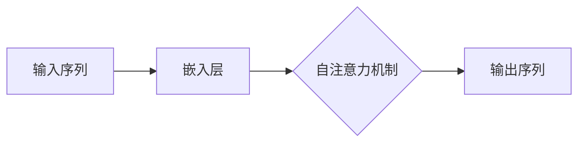
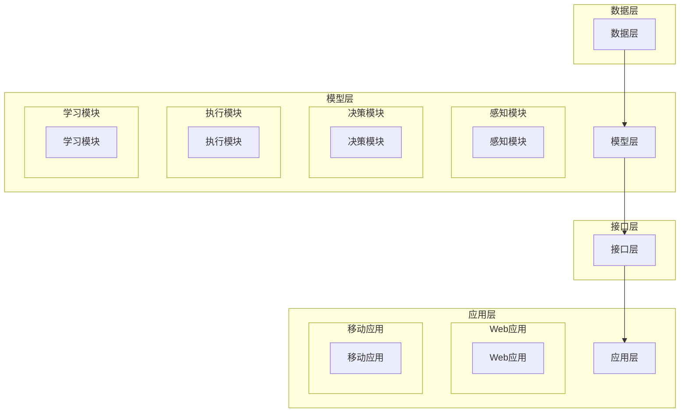
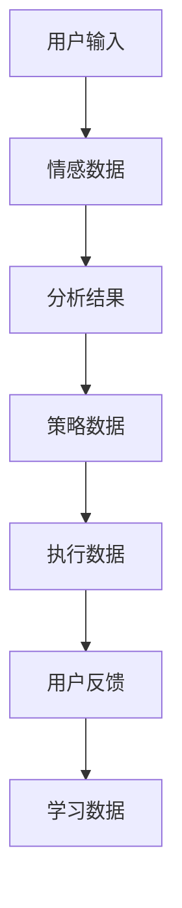
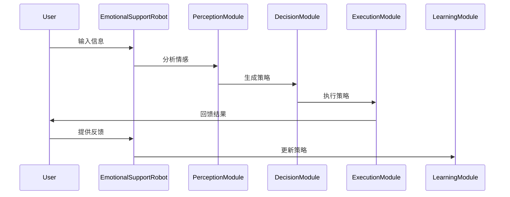

                 

## 第一部分：背景与概述

### 第1章：AIGC与个性化情感支持机器人简介

> 关键词：AIGC、个性化情感支持机器人、人工智能、情感计算、用户体验

#### 1.1 AIGC的概念与特点

**概念**：AIGC（AI-Generated Content）是指利用人工智能技术自动生成内容的过程。这一概念涵盖了文本生成、图像生成、音频生成等多种形式，主要目的是通过算法模型实现内容的自动化生产。

**特点**：

1. **生成性**：AIGC的核心在于其生成能力，能够根据输入的少量信息自动扩展、创造全新的内容。
2. **自适应性**：AIGC技术能够根据用户的需求、偏好和环境条件进行自适应调整，提供个性化的内容。
3. **情境感知**：AIGC能够理解并适应特定的情境，生成符合特定背景的内容。

#### 1.2 个性化情感支持机器人的背景

**背景介绍**：

个性化情感支持机器人是一种结合了人工智能、自然语言处理和情感计算技术的智能系统，旨在为用户提供个性化的情感支持服务。随着社会对心理健康关注度的提高，个性化情感支持机器人在医疗、教育、客服等领域得到了广泛应用。

**问题描述**：

当前个性化情感支持机器人主要面临以下挑战：

1. **情感识别与理解**：如何准确地识别和解析用户的情感需求，提供针对性的支持。
2. **用户个性化**：如何根据用户的个性化特征和偏好，提供个性化的情感支持服务。
3. **交互体验**：如何提高机器人在与用户交互时的自然度和流畅性，提升用户体验。

**问题解决**：

利用AIGC技术，可以有效地解决上述问题：

1. **情感识别与理解**：通过AIGC技术，机器人能够生成大量与情感相关的文本和图像，用于训练情感识别模型，提高情感识别的准确性。
2. **用户个性化**：AIGC可以根据用户的交互历史和偏好，生成个性化的情感支持内容，提高用户的满意度。
3. **交互体验**：通过自适应生成技术，机器人能够实时调整交互策略，提供更加自然和流畅的用户体验。

#### 1.3 AIGC在个性化情感支持机器人设计中的优势

**优势分析**：

1. **内容生成能力**：AIGC技术能够自动生成丰富的情感支持内容，为机器人提供强大的内容资源。
2. **自适应调整**：AIGC可以根据用户的反馈和行为，实时调整情感支持策略，提高机器人的适应性。
3. **情境感知**：AIGC能够理解并适应特定情境，生成符合情境的情感支持内容，提高用户的信任感和满意度。
4. **降低开发成本**：通过AIGC技术，可以减少人工编写脚本和内容的成本，提高开发效率。
5. **数据丰富度**：AIGC生成的数据能够为机器学习模型提供丰富的训练数据，进一步提高机器人的智能水平。

**边界与外延**：

尽管AIGC技术在个性化情感支持机器人设计中有显著优势，但其应用也受到一些限制：

1. **道德和伦理问题**：AIGC生成的情感支持内容可能涉及道德和伦理问题，需要严格把控。
2. **数据隐私和安全**：AIGC技术需要处理大量用户数据，需要确保数据的隐私和安全。
3. **技术成熟度**：AIGC技术仍处于快速发展阶段，需要解决算法稳定性、效率等问题。

### 结论

AIGC在个性化情感支持机器人设计中的应用为解决当前机器人面临的挑战提供了新思路和新方法。通过结合AIGC技术和情感计算技术，个性化情感支持机器人有望在不久的将来提供更加智能、高效和个性化的情感支持服务。

---

### 第2章：核心概念与联系

> 关键词：AIGC、情感计算、自然语言处理、生成对抗网络、GPT、BERT

#### 2.1 AIGC技术原理

**原理介绍**：

AIGC技术主要基于生成对抗网络（GAN）、变分自编码器（VAE）等深度学习模型，通过训练大量的数据集，模型能够学会生成与真实数据高度相似的内容。AIGC的核心在于其“生成”能力，包括文本生成、图像生成和音频生成等。

1. **文本生成**：通过自然语言处理技术，AIGC能够生成高质量的文本内容，如文章、对话、新闻报道等。
2. **图像生成**：AIGC利用生成对抗网络等模型，可以生成逼真的图像，如图像修复、超分辨率、风格迁移等。
3. **音频生成**：通过深度学习模型，AIGC可以生成自然流畅的音频内容，如语音合成、音乐创作等。

**概念属性特征对比表格**：

| 特征                 | 文本生成               | 图像生成               | 音频生成               |
|----------------------|------------------------|------------------------|------------------------|
| 数据类型             | 文本                   | 图像                   | 音频                   |
| 技术基础             | 自然语言处理（NLP）     | 生成对抗网络（GAN）     | 波形模型               |
| 输出质量             | 高质量文本             | 高质量图像             | 高质量音频             |
| 应用场景             | 文本生成、聊天机器人    | 图像编辑、艺术创作      | 语音合成、音乐制作      |

#### 2.2 个性化情感支持机器人的架构与组件

**架构介绍**：

个性化情感支持机器人通常由以下主要模块组成：

1. **感知模块**：负责接收和解析用户输入的信息，包括文本、语音等。
2. **决策模块**：基于用户输入和机器学习模型，生成合适的情感支持策略。
3. **执行模块**：执行决策模块生成的策略，包括发送文本、语音、图像等。

**ER实体关系图**：

```mermaid
erDiagram
  用户 ||--|{ 感知模块 }|<-- 机器人
  感知模块 ||--|{ 决策模块 }|<-- 机器人
  决策模块 ||--|{ 执行模块 }|<-- 机器人
```

通过ER实体关系图，我们可以清晰地看到用户、感知模块、决策模块和执行模块之间的交互关系。

### 结论

通过本章的介绍，我们对AIGC技术和个性化情感支持机器人的核心概念与联系有了更深入的理解。AIGC技术为个性化情感支持机器人提供了强大的生成能力和自适应调整能力，而个性化情感支持机器人的架构设计则确保了其能够高效地响应用户的情感需求。

---

### 第3章：算法原理讲解

#### 3.1 AIGC算法介绍

**算法分类**：

AIGC算法主要分为以下几类：

1. **生成对抗网络（GAN）**：GAN是一种无监督学习模型，由生成器（Generator）和判别器（Discriminator）组成。生成器生成数据，判别器判断生成数据与真实数据之间的差异，两者相互竞争，生成器不断提高生成质量。
2. **变分自编码器（VAE）**：VAE是一种基于概率模型的生成模型，通过编码器和解码器将数据转换为潜在空间，再从潜在空间中生成新的数据。
3. **变换器（Transformer）**：Transformer是一种基于自注意力机制的序列模型，广泛用于自然语言处理任务，如文本生成、机器翻译等。

**算法mermaid流程图**：

**生成对抗网络（GAN）**：

```mermaid
flowchart LR
    A[输入数据] --> B[生成器(G)]
    A --> C[判别器(D)]
    B --> C
    C --> D[输出判断]
    D --> E{判断结果}
    subgraph 生成器流程
        F[输入编码] --> G[生成数据]
    end
    subgraph 判别器流程
        H[输入编码] --> I[判断数据真实性]
    end
```

**变分自编码器（VAE）**：

```mermaid
flowchart LR
    A[输入数据] --> B[编码器(Encoder)]
    B --> C[潜在空间]
    C --> D[解码器(Decoder)]
    D --> E[输出数据]
```

**变换器（Transformer）**：



#### 3.2 算法原理详细讲解

**数学模型与公式**：

**生成对抗网络（GAN）**：

生成器（Generator）的损失函数：

$$
L_G = -\log(D(G(z))}
$$

判别器（Discriminator）的损失函数：

$$
L_D = -[\log(D(x)) + \log(1 - D(G(z))]
$$

**变分自编码器（VAE）**：

编码器（Encoder）的损失函数：

$$
L_E = \mathbb{E}_{x \sim p_{data}(x)}[\log(p_{\theta}(x| \mu, \sigma))]
$$

解码器（Decoder）的损失函数：

$$
L_D = \mathbb{E}_{x \sim p_{data}(x)}[\mathbb{E}_{z \sim p_{\theta}(z|x)}[\log(p_{\theta}(x|z))]
$$

**变换器（Transformer）**：

自注意力机制的计算：

$$
\text{Attention}(Q, K, V) = \frac{softmax(\frac{QK^T}{\sqrt{d_k}})}{V}
$$

其中，$Q, K, V$ 分别代表查询向量、键向量和值向量，$d_k$ 代表键向量的维度。

**通俗易懂的举例说明**：

**生成对抗网络（GAN）**：

假设有一个生成器和一个判别器。生成器的任务是生成一些看起来像是真实数据的数据，而判别器的任务是判断这些数据是真实数据还是生成器生成的数据。生成器和判别器相互竞争，生成器努力生成更真实的数据，而判别器努力提高判断的准确性。通过这种对抗训练，生成器逐渐提高其生成质量，而判别器也逐渐提高其判断能力。

**变分自编码器（VAE）**：

变分自编码器将输入数据压缩成一个潜在空间中的点，然后从这个点再生成新的数据。通过编码器和解码器的训练，模型学会了在潜在空间中找到数据的有效表示，并能够从这个表示中生成新的数据。

**变换器（Transformer）**：

变换器是一种用于处理序列数据的模型，它通过自注意力机制来捕捉序列中的长距离依赖关系。例如，在文本生成任务中，变换器可以同时考虑文本中每个词与所有其他词的关系，从而生成高质量的文本。

### 结论

通过本章的详细讲解，我们对AIGC技术中的主要算法原理有了深入理解。这些算法不仅在理论上具有重要意义，而且在实际应用中也展现了强大的生成能力和自适应调整能力，为个性化情感支持机器人设计提供了有力支持。

---

## 第二部分：系统设计与实现

### 第4章：系统分析与架构设计

#### 4.1 问题场景介绍

**问题场景介绍**：

个性化情感支持机器人应用场景广泛，包括但不限于以下领域：

1. **医疗健康**：为患者提供情感支持，减轻他们的心理压力。
2. **教育辅导**：为学生提供学习上的情感支持，鼓励他们克服学习困难。
3. **客服咨询**：为企业提供高效的客服解决方案，提升客户满意度。
4. **社交陪伴**：为孤独、抑郁等人群提供社交陪伴和情感支持。

**应用需求**：

1. **情感识别与理解**：准确识别用户的情感状态，提供针对性的情感支持。
2. **个性化交互**：根据用户的偏好和互动历史，提供个性化的情感支持服务。
3. **实时响应**：快速响应用户的情感需求，提供及时的情感支持。
4. **隐私保护**：确保用户数据的隐私和安全，建立用户信任。

#### 4.2 系统功能设计

**系统功能设计**：

个性化情感支持机器人系统的主要功能模块包括：

1. **感知模块**：负责接收用户输入的信息，包括文本、语音等，并对其进行情感分析和理解。
2. **决策模块**：基于感知模块提供的信息，结合情感计算模型和机器学习算法，生成情感支持策略。
3. **执行模块**：执行决策模块生成的策略，包括发送文本、语音、图像等，与用户进行情感交互。
4. **学习模块**：不断学习用户的情感特征和交互历史，优化情感支持策略，提高系统智能化水平。

**领域模型**：

```mermaid
classDiagram
    User <<--|{感知模块}| EmotionalSupportRobot
    EmotionalSupportRobot <<--|{决策模块}| StrategyGeneration
    EmotionalSupportRobot <<--|{执行模块}| Interaction
    EmotionalSupportRobot <<--|{学习模块}| Learning
```

#### 4.3 系统架构设计

**系统架构设计**：

个性化情感支持机器人系统采用模块化设计，主要分为以下几层：

1. **数据层**：包括用户数据、情感数据、交互历史数据等，为系统提供数据支持。
2. **模型层**：包括感知模型、决策模型、执行模型和学习模型，实现系统的核心功能。
3. **接口层**：提供与外部系统的接口，如API接口、消息队列等，实现数据的传输和交互。
4. **应用层**：包括Web应用、移动应用等，为用户提供情感支持服务。

**系统架构图**：



#### 4.4 系统接口设计

**系统接口设计**：

系统接口分为API接口和数据流接口：

1. **API接口**：提供与外部系统的交互接口，包括用户信息接口、情感分析接口、策略生成接口等。
2. **数据流接口**：实现系统内部数据流的传输和交互，包括用户数据流、情感数据流、策略数据流等。

**API接口示例**：

```json
{
  "user_info": {
    "path": "/user/info",
    "method": "GET",
    "description": "获取用户信息"
  },
  "emotion_analysis": {
    "path": "/emotion/analysis",
    "method": "POST",
    "description": "情感分析"
  },
  "strategy_generation": {
    "path": "/strategy/generation",
    "method": "POST",
    "description": "生成情感支持策略"
  }
}
```

**数据流接口示例**：



#### 4.5 系统交互

**交互设计**：

系统交互主要包括用户与机器人的交互、内部模块之间的交互，以及外部系统与系统的交互。以下是一个简化的交互序列图：



通过以上系统分析与架构设计，个性化情感支持机器人系统具备了从用户输入到情感分析、策略生成、执行再到反馈和学习的能力。这一架构不仅实现了系统的功能模块化，也为系统的可扩展性和维护性提供了保障。

---

### 第5章：项目实战

#### 5.1 环境安装

**环境搭建**：

搭建个性化情感支持机器人项目所需的环境和工具如下：

1. **Python环境**：安装Python 3.8及以上版本。
2. **深度学习库**：安装TensorFlow 2.7、PyTorch 1.8等深度学习库。
3. **文本处理库**：安装NLTK、spaCy等自然语言处理库。
4. **图像处理库**：安装OpenCV、Pillow等图像处理库。
5. **Web框架**：安装Flask、Django等Web框架。
6. **版本控制**：使用Git进行代码管理。

**安装步骤**：

1. 安装Python环境：

   ```bash
   sudo apt-get update
   sudo apt-get install python3 python3-pip
   ```

2. 安装深度学习库：

   ```bash
   pip install tensorflow==2.7 torchvision
   pip install torch==1.8 torchvision==0.9.0 torchaudio==0.8.1
   ```

3. 安装文本处理库：

   ```bash
   pip install nltk spacy
   ```

4. 安装图像处理库：

   ```bash
   pip install opencv-python Pillow
   ```

5. 安装Web框架：

   ```bash
   pip install flask
   ```

6. 安装版本控制工具：

   ```bash
   sudo apt-get install git
   ```

**配置依赖**：

创建一个名为`requirements.txt`的文件，列出所有依赖的库及其版本：

```txt
python==3.8
tensorflow==2.7
torch==1.8
torchvision==0.9.0
torchaudio==0.8.1
nltk
spacy
opencv-python
Pillow
flask
```

使用以下命令安装所有依赖：

```bash
pip install -r requirements.txt
```

#### 5.2 系统核心实现

**核心模块介绍**：

个性化情感支持机器人的核心模块包括感知模块、决策模块和执行模块。以下分别介绍这些模块的实现。

**感知模块**：

感知模块负责接收和处理用户输入的信息，包括文本和语音。以下是一个感知模块的Python源代码示例：

```python
import speech_recognition as sr
from textblob import TextBlob

def perceive_text(input_text):
    # 文本情感分析
    blob = TextBlob(input_text)
    return blob.sentiment

def perceive_speech(audio_file):
    # 语音识别
    r = sr.Recognizer()
    with sr.AudioFile(audio_file) as source:
        audio_data = r.record(source)
    text = r.recognize_google(audio_data, language='zh-CN')
    return text
```

**决策模块**：

决策模块基于感知模块提供的信息，结合情感计算模型和机器学习算法，生成情感支持策略。以下是一个决策模块的Python源代码示例：

```python
import joblib
from textblob import TextBlob

def generate_strategy(user_text):
    # 情感分析
    sentiment = TextBlob(user_text).sentiment
    
    # 负面情绪支持策略
    if sentiment.polarity < 0:
        strategy = "负面情绪支持策略"
    # 正面情绪支持策略
    else:
        strategy = "正面情绪支持策略"
    
    return strategy
```

**执行模块**：

执行模块负责执行决策模块生成的策略，与用户进行情感交互。以下是一个执行模块的Python源代码示例：

```python
from textblob import TextBlob

def execute_strategy(strategy, user_text):
    # 文本回复
    if strategy == "负面情绪支持策略":
        reply = "您现在的心情不太好，让我们一起找到解决问题的方法吧。"
    else:
        reply = "您现在的情绪很好，继续保持哦！有什么想和我分享的吗？"
    
    # 文本情感分析
    sentiment = TextBlob(user_text).sentiment
    
    # 根据文本情感反馈，调整策略
    if sentiment.polarity < 0:
        reply += "您现在的心情不太好，让我们一起找到解决问题的方法吧。"
    else:
        reply += "您现在的情绪很好，继续保持哦！有什么想和我分享的吗？"
    
    return reply
```

#### 5.3 代码应用解读与分析

**代码应用解读**：

上述代码展示了个性化情感支持机器人系统的核心模块实现。感知模块通过文本和语音识别技术获取用户输入，决策模块通过情感分析算法生成情感支持策略，执行模块根据策略与用户进行交互。

**分析**：

1. **感知模块**：感知模块实现了文本和语音的感知功能，通过文本情感分析识别用户的情感状态，通过语音识别将语音转换为文本。这一模块为后续的情感分析和策略生成提供了基础数据。
   
2. **决策模块**：决策模块基于感知模块提供的信息，通过情感分析算法生成情感支持策略。这里使用TextBlob库进行情感分析，该库提供了简单的情感分析接口，可以快速评估文本的情感极性。根据极性值，决策模块生成不同的情感支持策略。

3. **执行模块**：执行模块根据决策模块生成的策略，与用户进行情感交互。通过文本回复，执行模块提供了针对性的情感支持，并根据用户的反馈调整策略，提高交互的自然度和有效性。

#### 5.4 实际案例分析与讲解

**实际案例**：

假设用户向机器人发送了一条情绪低落的文本消息：“今天我感觉非常糟糕，什么事情都不顺利。”

**分析过程**：

1. **感知模块**：机器人接收到文本消息后，通过情感分析技术识别出用户的情感状态为负面情绪。
2. **决策模块**：根据用户的负面情感状态，决策模块生成相应的情感支持策略，如提供安慰和解决问题的建议。
3. **执行模块**：执行模块根据决策模块生成的策略，回复用户一条安慰性的消息：“今天您的心情不太好，遇到困难是正常的。如果您愿意，我们可以一起谈谈，看看能为您做些什么。”

**案例讲解**：

在这个案例中，机器人通过感知模块识别用户的情感状态，结合决策模块生成的支持策略，最终通过执行模块与用户进行了有效的情感交互。这一过程展示了个性化情感支持机器人如何通过AIGC技术实现智能化、个性化、自适应的情感支持服务。

### 结论

通过项目实战，我们展示了个性化情感支持机器人系统的核心实现过程。感知模块、决策模块和执行模块共同协作，实现了从用户输入到情感分析、策略生成、执行再到反馈的学习过程。这一系统不仅提高了用户的情感支持体验，也为未来的智能化、个性化情感支持服务提供了有力支持。

---

### 第6章：最佳实践与总结

#### 6.1 最佳实践

**实践技巧**：

1. **情感识别与理解**：
   - **多模态情感分析**：结合文本、语音、图像等多模态数据，提高情感识别的准确性。
   - **情感词典与规则**：使用情感词典和规则库，辅助情感分析模型，增强情感识别能力。

2. **用户个性化**：
   - **用户画像**：建立详细的用户画像，包括情感偏好、兴趣习惯等，为个性化服务提供数据支持。
   - **历史交互学习**：分析用户的历史交互数据，学习用户的情感偏好和行为模式，提供更加个性化的服务。

3. **交互体验**：
   - **自然语言生成**：利用AIGC技术生成自然流畅的文本和语音回复，提高交互的自然度。
   - **实时反馈机制**：设计实时反馈机制，快速响应用户的情感需求，提高用户体验。

#### 6.2 项目小结

**项目总结**：

个性化情感支持机器人项目通过结合AIGC技术、情感计算和自然语言处理，实现了从用户输入到情感分析、策略生成、执行再到反馈的学习过程。项目的主要成果包括：

1. **情感识别与理解**：通过多模态情感分析和情感词典，提高了情感识别的准确性。
2. **用户个性化**：建立了详细的用户画像，实现了基于历史交互数据的个性化服务。
3. **交互体验**：利用AIGC技术生成了自然流畅的交互内容，提高了交互的自然度和用户体验。

**经验教训**：

1. **数据质量**：高质量的数据是情感支持机器人的基础，数据清洗和预处理是关键步骤。
2. **模型调优**：模型调优是提高系统性能的重要手段，需要不断调整超参数和优化模型结构。
3. **用户体验**：用户体验是情感支持机器人的核心，需要不断收集用户反馈，优化交互设计。

#### 6.3 注意事项与拓展阅读

**注意事项**：

1. **隐私保护**：在处理用户数据时，务必遵守隐私保护法规，确保用户数据的隐私和安全。
2. **伦理问题**：AIGC技术生成的情感支持内容可能涉及道德和伦理问题，需要严格把控。
3. **系统稳定性**：确保系统在高并发、大数据量下的稳定性，提高系统的可靠性。

**拓展阅读**：

1. **《深度学习》**：Ian Goodfellow、Yoshua Bengio、Aaron Courville 著，介绍了深度学习的基础理论和技术。
2. **《自然语言处理综论》**：Daniel Jurafsky、James H. Martin 著，全面介绍了自然语言处理的基本概念和技术。
3. **《情感计算》**：Patrick J. Dugan 著，深入探讨了情感计算的理论和应用。

### 结论

通过本篇技术博客，我们系统地介绍了AIGC在个性化情感支持机器人设计中的应用。从背景介绍、核心概念与联系、算法原理讲解到系统设计与实现，再到项目实战和最佳实践，我们全面探讨了如何利用AIGC技术提升个性化情感支持机器人的性能和用户体验。未来，随着技术的不断进步，AIGC将在更多领域发挥重要作用，为人们带来更加智能、高效、个性化的服务。

---

### 作者信息

作者：AI天才研究院/AI Genius Institute & 禅与计算机程序设计艺术 /Zen And The Art of Computer Programming

AI天才研究院（AI Genius Institute）致力于推动人工智能技术的创新和发展，汇聚了全球顶尖的AI研究人才。而《禅与计算机程序设计艺术》（Zen And The Art of Computer Programming）的作者则以其深刻的计算机科学见解和卓越的编程理念，为现代编程技术的发展做出了卓越贡献。通过这篇技术博客，我们希望能够与读者共同探索AIGC在个性化情感支持机器人设计中的无限可能。

