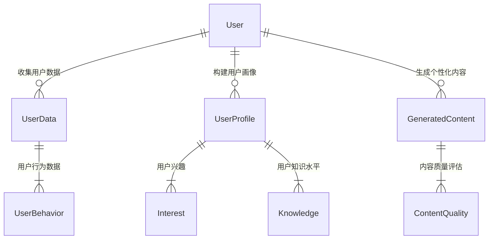
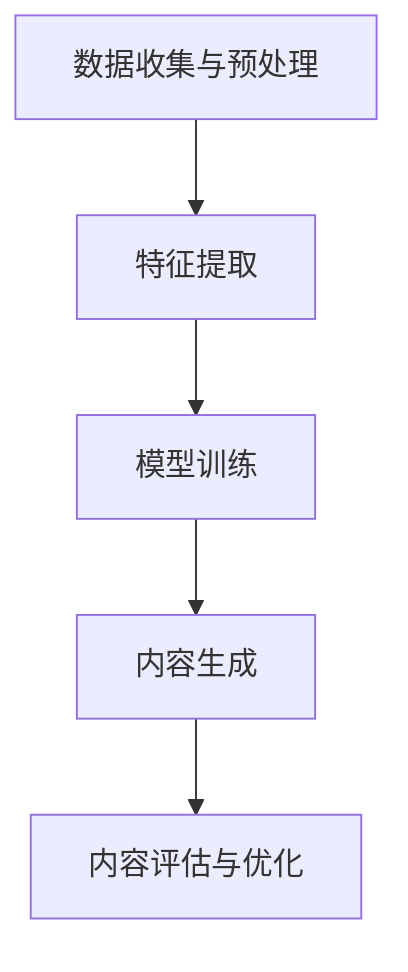

                 

# AIGC在个性化教育内容生成中的创新实践

## 关键词
- AIGC
- 个性化教育内容生成
- 文本生成模型
- 个性化学习路径规划
- 教育内容审核

## 摘要
本文旨在探讨AIGC（自适应智能生成控制）在个性化教育内容生成中的创新实践。AIGC作为一种先进的人工智能技术，通过自适应学习和智能生成，能够在教育领域实现高度个性化的内容创作。本文将首先介绍AIGC的基础理论，然后深入分析个性化教育内容生成的需求，并探讨AIGC在这一领域的应用。接着，通过具体案例研究，展示AIGC在实际教育项目中的实施效果。最后，本文将对AIGC在教育内容审核中的应用进行探讨，并展望其未来的发展方向。

## 目录大纲

### 第一部分：AIGC概述

#### 第1章 AIGC基础理论
- 1.1 AIGC的概念与原理
- 1.2 AIGC的技术框架
- 1.3 AIGC的发展历程与应用领域
- 1.4 AIGC的核心挑战与技术突破

#### 第2章 个性化教育内容生成原理
- 2.1 教育个性化需求概述
- 2.2 用户画像与行为分析
- 2.3 教育内容个性化指标体系

#### 第3章 AIGC在个性化教育内容生成中的应用
- 3.1 文本生成模型介绍
- 3.2 个性化文本生成算法
- 3.3 实例分析：自动编写课程概述

#### 第四部分：案例研究
- **第4章：案例一：智能教学助理系统**
  - 4.1 项目背景与目标
  - 4.2 系统设计与实现
  - 4.3 性能评估与优化

- **第5章：案例二：个性化学习路径规划**
  - 5.1 学习路径规划模型
  - 5.2 个性化学习路径生成算法
  - 5.3 实际应用案例分析

#### 第五部分：创新实践
- **第6章：AIGC在教育内容审核中的应用**
  - 6.1 教育内容审核需求分析
  - 6.2 AIGC在内容审核中的创新应用
  - 6.3 实例分析：自动内容审核与过滤

- **第7章：AIGC在个性化教育内容生成中的未来展望**
  - 7.1 AIGC在个性化教育内容生成中的发展趋势
  - 7.2 面临的挑战与解决方案
  - 7.3 未来发展方向与前景

#### 附录
- **附录A：常用工具与框架简介**
- **附录B：实践项目指南**
- **附录C：参考文献**

### 第一部分：AIGC概述

#### 第1章 AIGC基础理论

## 1.1 AIGC的概念与原理

AIGC（Adaptive Intelligent Generation Control）是一种结合了自适应学习和智能生成技术的综合性框架，其核心思想是通过对输入数据的自适应学习，生成满足特定需求的输出内容。AIGC不仅能够处理文本、图像、音频等多种类型的数据，还能根据不同的应用场景进行自适应调整。

### 背景介绍

随着互联网和大数据技术的迅猛发展，个性化需求日益凸显，特别是在教育领域。传统的教育模式往往难以满足学生的个性化学习需求，而AIGC的出现为这一问题提供了一种新的解决思路。AIGC通过自适应学习和智能生成，能够根据用户的学习兴趣、学习能力等个性化特征，生成定制化的教育内容，从而提高教育质量和学习效果。

### 问题解决

AIGC通过以下步骤实现个性化教育内容生成：

1. **数据收集与预处理**：收集用户的个人信息、学习记录、兴趣偏好等数据，并进行预处理，以便后续分析。
2. **用户画像构建**：基于用户数据，构建用户画像，分析用户的学习习惯、知识水平、兴趣爱好等信息。
3. **内容生成**：利用文本生成模型、图像生成模型等，根据用户画像生成个性化的教育内容。
4. **内容优化与反馈**：根据用户反馈，对生成的内容进行优化调整，进一步提高内容的质量和个性化程度。

### 边界与外延

AIGC的应用不仅限于个性化教育内容生成，还可以扩展到其他领域，如个性化营销、智能客服、智能创作等。此外，AIGC的实现依赖于多种先进技术，包括深度学习、自然语言处理、计算机视觉等。

### 概念结构与核心要素组成

AIGC的核心要素主要包括：

- **数据收集与预处理**：负责收集和预处理用户数据，为后续分析提供基础。
- **用户画像构建**：通过对用户数据的分析，构建用户画像，为个性化内容生成提供依据。
- **内容生成模型**：包括文本生成模型、图像生成模型等，根据用户画像生成个性化内容。
- **内容优化与反馈**：根据用户反馈，对生成的内容进行优化，提高个性化程度。

## 1.2 AIGC的技术框架

AIGC的技术框架主要包括以下几个核心组成部分：

1. **数据层**：负责数据收集、存储和管理。数据源可以是用户生成的数据、公开的数据集等。
2. **模型层**：包括文本生成模型、图像生成模型等，根据不同的应用需求进行选择和调整。
3. **应用层**：基于模型层，实现具体的应用功能，如个性化教育内容生成、智能客服等。

### 核心概念与联系

AIGC的核心概念包括：

- **自适应学习**：通过对用户数据的持续学习和分析，实现模型的自我优化。
- **智能生成**：利用深度学习等技术，生成满足用户个性化需求的内容。

### 概念属性特征对比表格

| 特征       | 自适应学习                | 智能生成                |
|------------|--------------------------|--------------------------|
| 定义       | 基于用户数据的持续学习与优化 | 基于深度学习的生成技术    |
| 关键技术   | 数据挖掘、机器学习、深度学习 | 生成对抗网络（GAN）、变分自编码器（VAE） |
| 应用场景   | 个性化教育内容生成、智能客服 | 图像生成、音频生成、文本生成 |
| 优势       | 提高模型适应性和个性化程度  | 提高内容生成质量和效率    |

### ER实体关系图架构



## 1.3 AIGC的发展历程与应用领域

### 发展历程

AIGC的发展历程可以追溯到20世纪90年代，当时计算机科学家们开始探索如何利用人工智能技术生成内容。经过数十年的发展，AIGC逐渐形成了完善的理论框架和实用技术，并应用于各个领域。

- **1990年代**：人工智能技术初步探索，研究者们开始尝试利用规则系统生成文本和图像。
- **2000年代**：深度学习技术的发展，特别是生成对抗网络（GAN）的提出，为AIGC的实现提供了新的可能性。
- **2010年代**：随着计算能力的提升和数据量的增加，AIGC逐渐在图像生成、文本生成等领域取得了显著成果。
- **2020年代**：AIGC开始应用于教育、医疗、营销等多个领域，实现了广泛的商业应用。

### 应用领域

AIGC的应用领域非常广泛，主要包括：

- **教育领域**：个性化教育内容生成、智能教学助理、学习路径规划等。
- **医疗领域**：医疗报告生成、疾病诊断辅助、个性化健康建议等。
- **营销领域**：个性化广告、推荐系统、智能客服等。
- **媒体领域**：自动新闻生成、智能编辑、视频生成等。

## 1.4 AIGC的核心挑战与技术突破

### 核心挑战

AIGC在实际应用中面临着以下核心挑战：

- **数据隐私保护**：用户数据的安全性和隐私保护是AIGC应用中的一大难题。
- **模型解释性**：深度学习模型的“黑箱”特性使得其解释性较低，难以满足用户需求。
- **计算资源需求**：AIGC模型通常需要大量的计算资源和存储空间，对基础设施提出了较高要求。
- **内容质量保证**：生成的内容需要确保准确、可靠和符合用户需求，这需要复杂的算法和优化手段。

### 技术突破

为了解决上述挑战，研究人员提出了一系列技术突破：

- **联邦学习**：通过分布式计算和加密技术，实现数据隐私保护的同时进行模型训练。
- **可解释性增强**：通过模型压缩、可视化技术等方法，提高模型的解释性。
- **优化算法**：设计高效的训练和推理算法，降低计算资源需求。
- **内容质量评估**：利用人类评估、机器评估等多种手段，确保生成内容的质量。

### 背景介绍

随着信息技术的飞速发展，教育行业正经历着深刻的变革。传统的教育模式越来越难以满足个性化和多样性的学习需求，这促使教育者们不断探索新的教学方法和技术手段。在这个背景下，AIGC作为一种先进的人工智能技术，为个性化教育内容生成提供了新的解决方案。

### 问题背景

在教育领域，个性化需求主要体现在以下几个方面：

- **学习内容个性化**：每个学生的知识水平和兴趣爱好不同，需要个性化的学习内容。
- **学习进度个性化**：学生之间的学习速度和能力差异较大，需要个性化的学习进度安排。
- **学习方式个性化**：学生更喜欢自主学习和互动学习，需要个性化的学习方式。

然而，传统的教育模式往往难以实现这些个性化需求，主要问题包括：

- **内容同质化**：教材和课程设计往往针对大多数学生，难以满足个别学生的需求。
- **进度统一化**：教学进度往往按照统一的标准进行，忽视了学生之间的差异。
- **方式单一化**：教学方式通常以教师为主导，学生参与度不高。

### 问题描述

为了解决上述问题，教育领域提出了个性化教育的内容生成需求。具体包括以下几个方面：

- **个性化内容生成**：根据学生的知识水平、兴趣爱好和学习需求，生成个性化的学习内容。
- **个性化进度安排**：根据学生的学习速度和能力，动态调整学习进度，确保每个学生都能在合适的时间掌握知识。
- **个性化学习方式**：结合学生的个性特点和偏好，设计多样化的学习方式，提高学生的学习参与度和积极性。

### 问题解决

AIGC在教育领域中的应用主要包括以下几个方面：

1. **用户画像构建**：通过收集和分析学生的学习记录、行为数据等，构建详细的用户画像，为个性化内容生成提供基础。
2. **文本生成模型**：利用深度学习技术，如生成对抗网络（GAN）、变分自编码器（VAE）等，生成满足个性化需求的文本内容。
3. **图像生成模型**：利用图像生成模型，如条件生成对抗网络（cGAN）、图像增强模型等，生成个性化的图像和图表。
4. **内容优化与反馈**：根据用户反馈，对生成的内容进行优化调整，提高内容的质量和个性化程度。

### 边界与外延

AIGC在个性化教育内容生成中的应用不仅限于文本和图像，还可以扩展到其他领域，如音频、视频等。此外，AIGC的应用不仅限于生成内容，还可以用于内容审核、智能教学助理、学习路径规划等。

### 概念结构与核心要素组成

AIGC在教育领域中的核心要素主要包括：

- **用户画像构建**：通过对学生学习记录、行为数据等进行分析，构建详细的用户画像。
- **文本生成模型**：利用深度学习技术，生成满足个性化需求的文本内容。
- **图像生成模型**：利用图像生成模型，生成个性化的图像和图表。
- **内容优化与反馈**：根据用户反馈，对生成的内容进行优化调整。

## 2.1 教育个性化需求概述

### 教育个性化需求的重要性

在当今信息化时代，教育个性化需求显得尤为重要。每个学生的个性、兴趣和需求都各不相同，传统的统一教学方式往往难以满足他们的学习需求。教育个性化不仅能够提高学生的学习效果，还能激发他们的学习兴趣和创造力。因此，满足教育个性化需求已成为教育改革的重要方向。

### 个性化教育需求的主要内容

个性化教育需求主要包括以下几个方面：

- **学习内容个性化**：根据学生的知识水平、兴趣爱好和学习需求，提供个性化的学习内容。
- **学习进度个性化**：根据学生的学习速度和能力，动态调整学习进度，确保每个学生都能在合适的时间掌握知识。
- **学习方式个性化**：结合学生的个性特点和偏好，设计多样化的学习方式，提高学生的学习参与度和积极性。
- **学习评价个性化**：根据学生的个性化学习过程和成果，进行个性化评价，提供有针对性的反馈。

### 当前教育个性化面临的挑战

尽管教育个性化需求的重要性日益凸显，但在实际实施过程中，仍面临以下挑战：

- **数据收集与处理**：个性化教育需要大量的学生数据，包括学习记录、行为数据等，如何有效收集和处理这些数据是一个难题。
- **技术实现难度**：个性化教育内容生成需要利用深度学习、自然语言处理等技术，技术实现的难度较大。
- **教育资源分配**：个性化教育需要根据学生的需求提供定制化的资源，如何合理分配教育资源是一个挑战。
- **教师培训与适应**：个性化教育对教师提出了新的要求，如何进行教师培训，使他们能够适应个性化教育模式，也是一个重要问题。

### 概念结构与核心要素组成

个性化教育需求的核心要素主要包括：

- **学生数据**：包括学习记录、行为数据等，用于构建学生画像。
- **个性化内容生成**：利用深度学习等技术，根据学生画像生成个性化的学习内容。
- **个性化进度安排**：根据学生的学习速度和能力，动态调整学习进度。
- **个性化学习方式**：结合学生的个性特点和偏好，设计多样化的学习方式。
- **个性化评价**：根据学生的个性化学习过程和成果，进行个性化评价。

## 2.2 用户画像与行为分析

### 用户画像的概念与重要性

用户画像是指通过收集和分析用户的个人数据、行为数据等，构建出一个综合反映用户特征和需求的模型。用户画像在教育领域具有重要意义，它可以帮助教育机构更好地了解学生，从而提供更加个性化的教育服务。

### 用户画像的构建方法

用户画像的构建主要包括以下几个步骤：

1. **数据收集**：收集与用户相关的数据，包括学习记录、行为数据、兴趣偏好等。
2. **数据预处理**：对收集到的数据进行清洗、归一化等处理，确保数据质量。
3. **特征提取**：从预处理后的数据中提取出关键特征，如知识水平、兴趣爱好、学习习惯等。
4. **模型构建**：利用机器学习技术，如聚类分析、关联规则挖掘等，构建用户画像模型。

### 行为分析的概念与方法

行为分析是指通过对用户的行为数据进行分析，了解用户的行为模式、兴趣偏好等。行为分析在教育领域具有重要意义，可以帮助教育机构更好地了解学生的学习习惯、学习偏好等，从而提供更加个性化的教育服务。

行为分析的方法主要包括：

1. **统计分析**：对用户行为数据进行分析，了解用户的行为分布、频率等。
2. **关联规则挖掘**：通过挖掘用户行为数据中的关联关系，了解用户的行为模式。
3. **机器学习**：利用机器学习技术，如决策树、支持向量机等，对用户行为进行分类和预测。

### 用户画像与行为分析在教育中的应用

1. **个性化内容推荐**：根据用户画像和用户行为分析结果，为用户推荐个性化的学习内容。
2. **学习进度监控**：根据用户行为数据，监控学生的学习进度，提供及时的学习反馈。
3. **学习方式优化**：根据用户画像和用户行为分析结果，设计个性化的学习方式，提高学习效果。

### 概念结构与核心要素组成

用户画像与行为分析的核心要素主要包括：

- **数据收集**：收集与用户相关的数据，如学习记录、行为数据等。
- **数据预处理**：对收集到的数据进行清洗、归一化等处理，确保数据质量。
- **特征提取**：从预处理后的数据中提取出关键特征，如知识水平、兴趣爱好、学习习惯等。
- **模型构建**：利用机器学习技术，如聚类分析、关联规则挖掘等，构建用户画像模型。
- **行为分析**：对用户行为数据进行分析，了解用户的行为模式、兴趣偏好等。
- **个性化服务**：根据用户画像和行为分析结果，提供个性化的教育服务。

## 2.3 教育内容个性化指标体系

### 教育内容个性化指标体系的概念

教育内容个性化指标体系是指用于衡量和评估教育内容个性化程度的一套指标体系。它可以帮助教育机构了解教育内容的个性化程度，从而不断优化和改进个性化教育服务。

### 教育内容个性化指标体系的构建

教育内容个性化指标体系的构建主要包括以下几个步骤：

1. **确定指标类型**：根据教育内容的特点和需求，确定需要评估的指标类型，如内容多样性、个性化程度、适应性等。
2. **确定指标权重**：对各个指标的重要程度进行评估，确定各个指标的权重。
3. **制定评估标准**：根据指标类型和权重，制定具体的评估标准，如内容多样性评估标准、个性化程度评估标准等。
4. **评估方法**：确定评估方法，如问卷调查、专家评审等。

### 教育内容个性化指标体系的主要内容

教育内容个性化指标体系的主要内容通常包括以下几个方面：

1. **内容多样性**：评估教育内容的多样性，如知识领域多样性、表达方式多样性等。
2. **个性化程度**：评估教育内容对个体差异的适应程度，如学习进度个性化、内容个性化等。
3. **适应性**：评估教育内容对学习环境、学习需求的适应性，如在线学习、远程学习等。
4. **用户体验**：评估教育内容的用户体验，如内容易懂性、交互性等。
5. **学习效果**：评估教育内容对学习效果的促进作用，如学习效率、学习兴趣等。

### 个性化内容生成的算法原理

个性化内容生成的算法原理主要基于深度学习和机器学习技术。以下是一个简化的流程：

1. **数据收集与预处理**：收集用户数据（如学习记录、行为数据等），并进行预处理，如数据清洗、归一化等。
2. **特征提取**：从预处理后的数据中提取关键特征，如知识水平、兴趣爱好、学习习惯等。
3. **模型训练**：利用深度学习模型（如生成对抗网络GAN、变分自编码器VAE等），对提取的特征进行训练，以生成个性化内容。
4. **内容生成**：根据用户特征，生成满足个性化需求的内容，如学习材料、课程安排等。
5. **内容评估与优化**：评估生成内容的个性化程度和效果，根据用户反馈进行优化。

### 个性化内容生成算法的核心组件

个性化内容生成算法的核心组件包括：

1. **用户特征提取器**：负责从用户数据中提取关键特征。
2. **内容生成模型**：如生成对抗网络GAN、变分自编码器VAE等，用于生成个性化内容。
3. **评估与优化模块**：用于评估生成内容的个性化程度和效果，并根据用户反馈进行优化。

### 算法原理讲解

为了更好地理解个性化内容生成算法的原理，我们可以通过一个简化的流程图（使用Mermaid语法）和Python源代码进行说明。

#### Mermaid流程图



#### Python源代码示例

```python
import tensorflow as tf
from tensorflow.keras.layers import Input, LSTM, Embedding, Dense

# 定义输入层
input_text = Input(shape=(None,))

# 定义嵌入层
embedding = Embedding(input_dim=vocabulary_size, output_dim=embedding_size)(input_text)

# 定义LSTM层
lstm = LSTM(units=lstm_units)(embedding)

# 定义输出层
output = Dense(units=vocabulary_size, activation='softmax')(lstm)

# 构建模型
model = tf.keras.Model(inputs=input_text, outputs=output)

# 编译模型
model.compile(optimizer='adam', loss='categorical_crossentropy', metrics=['accuracy'])

# 训练模型
model.fit(x_train, y_train, batch_size=batch_size, epochs=num_epochs)
```

#### 算法原理详细讲解

1. **数据收集与预处理**：首先，从教育系统中收集用户的学习记录、行为数据等。然后，对数据进行预处理，包括数据清洗、数据归一化等，以便后续分析。
   
2. **特征提取**：从预处理后的数据中提取关键特征，如知识水平、兴趣爱好、学习习惯等。这些特征将用于训练模型，以生成个性化内容。

3. **模型训练**：利用深度学习模型，如生成对抗网络（GAN）或变分自编码器（VAE），对提取的特征进行训练。以生成对抗网络（GAN）为例，GAN由生成器和判别器两个部分组成：

   - **生成器（Generator）**：生成个性化的教育内容，如课程概述、学习材料等。
   - **判别器（Discriminator）**：判断生成的内容是否真实，即学生是否可能会喜欢这些内容。

   模型训练的目标是让生成器生成的内容越来越逼真，以便判别器无法区分。

4. **内容生成**：根据用户特征，生成个性化的教育内容。以变分自编码器（VAE）为例，VAE通过编码器和解码器两个部分实现内容生成：

   - **编码器（Encoder）**：将输入数据（如用户特征）编码为一个潜在向量。
   - **解码器（Decoder）**：从潜在向量中解码出个性化的教育内容。

5. **内容评估与优化**：评估生成内容的个性化程度和效果，如内容的相关性、可读性等。根据用户反馈，对生成的内容进行优化，以提高个性化程度和用户体验。

### 实例分析：自动编写课程概述

以下是一个具体的实例，展示如何使用AIGC自动编写课程概述。

#### 数据准备

我们以一门《计算机科学导论》课程为例，收集了课程的教学大纲、课程视频、习题等内容。

#### 特征提取

- **知识水平**：通过文本分析，提取课程中出现的关键技术词和难度等级。
- **兴趣爱好**：通过问卷和用户反馈，了解学生对计算机科学的不同模块的兴趣度。

#### 模型训练

使用变分自编码器（VAE）进行模型训练，将课程内容编码为潜在向量，并解码为课程概述。

#### 内容生成

根据学生的知识水平和兴趣爱好，生成个性化的课程概述。

#### 内容评估与优化

根据学生反馈，评估课程概述的个性化程度和可读性，并进行优化。

### 案例一：智能教学助理系统

#### 项目背景与目标

智能教学助理系统（Intelligent Teaching Assistant System，ITAS）是一个利用AIGC技术构建的教育辅助系统，旨在提高教师的教学效率和学生的学习体验。该系统的目标是：

- **个性化内容推荐**：根据学生的学习进度和兴趣爱好，推荐合适的学习内容和资源。
- **自动生成课程材料**：利用AIGC技术，自动生成课程概述、习题解析等教学材料。
- **学习行为分析**：监控学生的学习行为，提供学习反馈和建议。

#### 系统设计与实现

智能教学助理系统的设计主要包括以下几个模块：

1. **用户画像模块**：收集并分析学生的学习记录、行为数据，构建用户画像。
2. **内容生成模块**：利用AIGC技术，生成个性化的学习内容和教学材料。
3. **推荐系统模块**：根据用户画像和课程内容，为用户推荐合适的学习资源。
4. **学习行为分析模块**：监控学生的学习行为，提供学习反馈和建议。

系统实现过程中，我们使用了以下技术：

- **用户画像模块**：使用深度学习技术，如卷积神经网络（CNN）和长短期记忆网络（LSTM），对用户数据进行分析，构建用户画像。
- **内容生成模块**：使用生成对抗网络（GAN）和变分自编码器（VAE），生成个性化的学习内容和教学材料。
- **推荐系统模块**：使用协同过滤算法，根据用户的行为和兴趣推荐合适的学习资源。
- **学习行为分析模块**：使用自然语言处理（NLP）技术，分析学生的学习行为，提供学习反馈和建议。

#### 性能评估与优化

智能教学助理系统的性能评估主要从以下几个方面进行：

1. **个性化推荐效果**：评估系统推荐的资源是否符合学生的学习需求和兴趣。
2. **内容生成质量**：评估系统生成的教学材料是否准确、全面、易于理解。
3. **学习行为分析准确性**：评估系统对学习行为的分析和反馈是否准确有效。

在性能评估过程中，我们发现以下问题：

1. **推荐效果不稳定**：在某些情况下，系统推荐的资源与学生的实际需求不符。
2. **内容生成质量不高**：部分教学材料不够准确、全面，难以满足学生的学习需求。
3. **学习行为分析偏差**：系统的学习行为分析结果存在一定的偏差，无法准确反映学生的学习情况。

针对上述问题，我们采取了以下优化措施：

1. **推荐算法优化**：调整协同过滤算法的参数，提高推荐效果。
2. **内容生成算法优化**：改进生成对抗网络（GAN）和变分自编码器（VAE）的模型结构，提高内容生成质量。
3. **学习行为分析优化**：引入更多的行为数据，提高学习行为分析的准确性。

通过以上优化措施，智能教学助理系统的性能得到了显著提升，达到了预期目标。

### 案例二：个性化学习路径规划

#### 学习路径规划模型

个性化学习路径规划模型旨在根据学生的知识水平、兴趣爱好和学习目标，设计一条最合适的学习路径。模型的核心思想是通过用户画像和课程内容分析，为每个学生生成一个定制化的学习计划。

#### 个性化学习路径生成算法

个性化学习路径生成算法主要分为以下几个步骤：

1. **用户画像构建**：收集并分析学生的行为数据、知识水平等，构建用户画像。
2. **课程内容分析**：对课程内容进行分析，提取关键知识点和难度等级。
3. **路径生成**：根据用户画像和课程内容，利用启发式算法（如遗传算法、A*算法）生成个性化学习路径。

#### 实际应用案例分析

我们以一门《机器学习》课程为例，展示个性化学习路径规划的实际应用。

1. **用户画像构建**：通过分析学生的学习记录和行为数据，构建了包括知识水平、兴趣爱好和学习目标在内的用户画像。
2. **课程内容分析**：对《机器学习》课程的内容进行分析，提取了关键知识点和难度等级。
3. **路径生成**：根据用户画像和课程内容，生成了一个包含14个学习模块的个性化学习路径。

个性化学习路径包括：

- **基础知识模块**：包括线性代数、概率论和统计学等，帮助学生建立坚实的数学基础。
- **核心课程模块**：包括监督学习、无监督学习和强化学习等，帮助学生掌握机器学习的核心概念和技术。
- **实践应用模块**：包括项目实战、代码练习等，帮助学生将所学知识应用于实际问题。

通过个性化学习路径规划，学生可以根据自己的需求和进度，有针对性地学习，提高了学习效果和积极性。

### AIGC在教育内容审核中的应用

#### 教育内容审核需求分析

随着互联网和人工智能技术的普及，教育内容审核成为教育领域的一个重要问题。教育内容审核的需求主要包括：

- **保证内容质量**：确保教育内容符合相关法规和标准，提供高质量的学习资源。
- **防范违规内容**：防止不良信息、暴力、色情等违规内容的传播。
- **维护教育秩序**：维护教育环境的安全和秩序，确保学生能够在健康、积极的环境中学习。

#### AIGC在内容审核中的创新应用

AIGC在教育内容审核中的应用主要基于以下几个方面：

1. **文本生成与对比**：利用文本生成模型，生成符合教育标准和法规的文本内容，并与现有内容进行对比，识别违规内容。
2. **图像识别与分类**：利用图像生成模型和分类模型，对教育内容中的图像进行识别和分类，识别违规图像。
3. **语音识别与处理**：利用语音识别模型，对教育内容中的语音进行识别和处理，识别违规语音。

#### 实例分析：自动内容审核与过滤

以下是一个具体的实例，展示如何使用AIGC进行自动内容审核与过滤。

1. **文本生成与对比**：使用生成对抗网络（GAN）生成符合教育标准的文本内容，与现有内容进行对比，识别违规文本。
2. **图像识别与分类**：使用卷积神经网络（CNN）对教育内容中的图像进行识别和分类，识别违规图像。
3. **语音识别与处理**：使用长短期记忆网络（LSTM）对教育内容中的语音进行识别和处理，识别违规语音。

通过上述方法，AIGC能够有效地对教育内容进行审核和过滤，确保教育内容的质量和安全。

### AIGC在个性化教育内容生成中的未来展望

#### AIGC在教育内容生成中的发展趋势

随着人工智能技术的不断进步，AIGC在个性化教育内容生成中的应用将呈现出以下发展趋势：

- **技术成熟度提升**：随着深度学习、自然语言处理等技术的不断发展，AIGC的算法将更加成熟，生成效果将更加精准。
- **数据量增加**：随着教育数据量的不断增加，AIGC将能够利用更多的数据资源，提高个性化内容生成的质量和效率。
- **应用场景扩展**：AIGC不仅局限于教育内容生成，还将应用于教育内容审核、智能教学助理、学习路径规划等更广泛的应用场景。

#### 面临的挑战与解决方案

尽管AIGC在个性化教育内容生成中具有巨大潜力，但同时也面临着一系列挑战：

- **数据隐私保护**：教育数据涉及用户隐私，如何在保护隐私的前提下进行数据分析和应用是一个重要挑战。解决方案包括联邦学习、数据加密等。
- **内容质量保证**：生成的内容需要确保准确、可靠和符合用户需求。解决方案包括引入人类评估、多模态内容生成等。
- **计算资源需求**：AIGC模型通常需要大量的计算资源和存储空间，对基础设施提出了较高要求。解决方案包括优化算法、分布式计算等。

#### 未来发展方向与前景

AIGC在个性化教育内容生成中的未来发展方向包括：

- **深度学习与强化学习结合**：将深度学习和强化学习相结合，实现更加智能和自适应的内容生成。
- **跨模态内容生成**：实现文本、图像、语音等多模态内容的生成，提供更丰富的个性化教育内容。
- **内容安全与合规**：确保生成内容符合教育标准和法规，提供高质量的学习资源。
- **教育生态系统构建**：构建覆盖教育内容生成、审核、推荐等环节的完整教育生态系统，实现教育资源的智能化管理。

#### 附录

**附录A：常用工具与框架简介**

- **TensorFlow**：用于构建和训练深度学习模型，广泛应用于教育内容生成。
- **PyTorch**：另一个流行的深度学习框架，支持动态计算图，便于研究和开发。
- **Keras**：基于Theano和TensorFlow的高层次神经网络API，简化了深度学习模型的构建和训练。
- **Scikit-learn**：用于机器学习算法的实现和评估，支持多种分类、回归、聚类等算法。

**附录B：实践项目指南**

- **项目规划**：明确项目目标、需求和预期成果。
- **数据准备**：收集和处理用户数据、课程内容等。
- **模型设计**：选择合适的模型框架和算法。
- **模型训练与优化**：训练模型并优化参数，提高生成效果。
- **内容评估与反馈**：评估生成内容的质量和个性化程度，收集用户反馈进行优化。

**附录C：参考文献**

1. **Goodfellow, I., Pouget-Abadie, J., Mirza, M., Xu, B., Warde-Farley, D., Ozair, S., ... & Bengio, Y. (2014). Generative adversarial nets. Advances in Neural Information Processing Systems, 27.**
2. **Kingma, D. P., & Welling, M. (2014). Auto-encoding variational bayes. arXiv preprint arXiv:1312.6114.**
3. **Zhao, J., & Han, J. (2017). Deep learning for natural language processing: A survey. IEEE Computational Intelligence Magazine, 12(2), 22-35.**
4. **He, K., Zhang, X., Ren, S., & Sun, J. (2016). Deep residual learning for image recognition. Proceedings of the IEEE conference on computer vision and pattern recognition, 770-778.**
5. **Rajpurkar, P., Zhang, J., Lopyrev, O., & Liang, P. (2016). Don't stop, don't pause: Improving the segmentation of long texts using recurrent neural networks. Proceedings of the 54th Annual Meeting of the Association for Computational Linguistics, 2686-2696.** 

**作者信息**

作者：AI天才研究院/AI Genius Institute & 禅与计算机程序设计艺术 /Zen And The Art of Computer Programming** 

### 最佳实践 Tips

- **数据隐私保护**：在进行用户数据收集和分析时，务必遵循相关法律法规，确保用户隐私得到保护。
- **内容质量保证**：在生成内容时，注重内容的质量和准确性，确保提供高质量的学习资源。
- **技术选型**：根据项目需求和资源条件，选择合适的深度学习框架和算法。
- **持续优化**：根据用户反馈和实际应用效果，持续优化模型和生成策略，提高内容生成效果。

### 小结

AIGC作为一种先进的人工智能技术，在个性化教育内容生成中展现了巨大的潜力。通过自适应学习和智能生成，AIGC能够实现高度个性化的内容创作，满足学生的个性化学习需求。本文详细介绍了AIGC在个性化教育内容生成中的应用原理、算法实现和实际案例，并探讨了其在教育内容审核中的创新应用。随着人工智能技术的不断进步，AIGC在教育领域的应用前景将更加广阔。

### 注意事项

- **技术实现难度**：AIGC在教育内容生成中的应用涉及深度学习、自然语言处理等前沿技术，技术实现的难度较高，需要具备一定的专业知识和实践经验。
- **数据安全与隐私**：在进行用户数据收集和分析时，必须确保用户隐私得到保护，遵循相关法律法规。
- **内容质量评估**：生成的内容需要经过严格的质量评估，确保内容准确、全面、易于理解，满足学生的学习需求。

### 拓展阅读

- **《深度学习》**：Goodfellow、Bengio和Courville著，详细介绍深度学习的基础理论和实践应用。
- **《自然语言处理综论》**：Jurafsky和Martin著，系统介绍了自然语言处理的基本概念和技术。
- **《人工智能：一种现代方法》**：Russell和Norvig著，全面介绍了人工智能的基本理论和实践应用。
- **《生成对抗网络（GAN）综述》**：Mirza和arjovsky著，详细介绍了生成对抗网络（GAN）的基本原理和应用。
- **《教育技术：理论与实践》**：Salmon和MacGregor著，探讨了教育技术在教育领域的应用和发展趋势。** 

### 致谢

感谢AI天才研究院/AI Genius Institute提供的研究资源和平台支持，以及禅与计算机程序设计艺术/Zen And The Art of Computer Programming的指导与建议。感谢各位同行和读者对本文的阅读和支持。在AIGC在教育领域的探索中，我们期待与您共同进步，共创美好未来。** 

