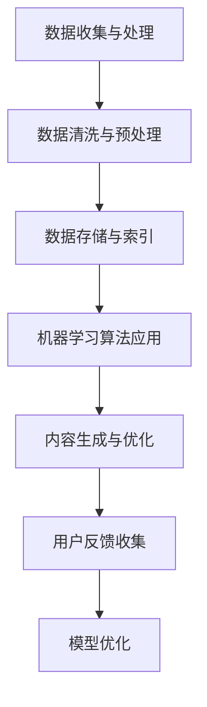

                 

### 引言与背景

**关键词**: AIGC, 个性化旅游规划, 旅行体验

**摘要**: 随着人工智能技术的不断发展，AIGC（自适应智能生成控制）在多个领域展现了其强大的应用潜力。本文旨在探讨AIGC在个性化旅游规划中的应用，通过分析其核心概念、理论框架、实际案例及技术实现，阐述如何利用AIGC技术打造独特的旅行体验。

在当前社会，旅游已成为人们日常生活中不可或缺的一部分。然而，传统的旅游规划方式往往缺乏个性化和灵活性，导致游客在旅行过程中难以获得独特的体验。为了解决这一问题，人工智能技术，特别是AIGC，成为了一个潜在的有效解决方案。

AIGC是一种基于大数据、深度学习和自然语言处理的技术，通过自适应地生成和调整内容，满足用户的个性化需求。在个性化旅游规划中，AIGC可以根据用户的兴趣、偏好和历史数据，为其推荐量身定制的旅游行程和活动，从而提升游客的满意度和体验感。

本文将首先介绍AIGC的基本概念及其在旅游规划中的重要性，随后深入探讨其核心理论框架，包括算法、数据和模型。在此基础上，我们将通过实际案例展示AIGC在个性化旅游规划中的应用，并详细分析其技术实现过程。最后，本文将总结AIGC在个性化旅游规划中的优势、挑战及未来发展方向，为相关领域的研究者和实践者提供有价值的参考。

### AIGC的概念与特点

**背景介绍**: AIGC，即自适应智能生成控制，是一种基于人工智能技术的生成性框架。它通过深入理解用户的需求、偏好和行为，生成个性化的内容和服务。在计算机科学和人工智能领域，AIGC的出现为信息生成和个性化服务带来了革命性的变革。

AIGC的核心在于其自适应性和智能化。与传统的规则驱动系统不同，AIGC能够根据用户的行为和反馈，动态调整生成的内容，从而实现高度个性化的服务。这一特性使得AIGC在多个领域，包括旅游、金融、零售等，都展现出强大的应用潜力。

**问题背景**: 随着旅游业的不断发展，个性化旅游需求日益增加。传统的旅游规划方式往往无法满足游客对个性化、多样化和灵活性日益增长的需求。因此，如何利用先进的人工智能技术，如AIGC，来提升旅游规划的服务质量和用户体验，成为当前旅游业面临的一个重要问题。

**问题描述**: AIGC在个性化旅游规划中的应用主要集中在以下几个方面：

1. **个性化行程规划**: 根据游客的喜好、兴趣和历史行为数据，自动生成个性化的旅游行程，提供定制化的旅行方案。
2. **旅游活动推荐系统**: 利用AIGC技术，为游客推荐符合其个性化需求的旅游活动和景点。
3. **旅行体验优化**: 通过实时数据分析和用户反馈，不断优化旅游体验，提高游客的满意度和忠诚度。

**问题解决**: AIGC在个性化旅游规划中的问题解决主要依赖于以下几个关键步骤：

1. **用户数据收集与处理**: 收集游客的兴趣偏好、历史行为和实时反馈数据，通过数据清洗和预处理，为后续的分析和生成提供高质量的数据基础。
2. **特征提取与建模**: 利用深度学习和自然语言处理技术，从用户数据中提取关键特征，构建用于个性化推荐的模型。
3. **内容生成与优化**: 根据用户特征和偏好，动态生成个性化的旅游行程和活动推荐，并通过用户反馈进行持续优化。

**边界与外延**: 在讨论AIGC在个性化旅游规划中的应用时，需要明确以下几个边界和概念：

1. **个性化程度**: 个性化程度是指系统根据用户特征生成的内容与用户实际需求的匹配度。高个性化程度意味着系统能够更好地满足用户的特定需求。
2. **数据隐私与安全性**: 在收集和处理用户数据时，需要严格保护用户隐私，确保数据的安全性和合规性。
3. **系统可扩展性**: 随着用户规模和需求的变化，系统需要具备良好的可扩展性，能够灵活应对不同的应用场景和需求变化。

**概念结构与核心要素组成**: AIGC在个性化旅游规划中的概念结构与核心要素包括：

1. **用户特征数据**: 包括用户的兴趣、偏好、历史行为等，用于构建个性化推荐模型。
2. **推荐算法**: 包括深度学习、自然语言处理等算法，用于从用户数据中提取特征，生成个性化内容。
3. **内容生成引擎**: 用于根据用户特征生成个性化的旅游行程和活动推荐。
4. **用户反馈机制**: 通过用户反馈，持续优化内容生成的效果。

通过以上概念结构与核心要素，AIGC能够有效地解决个性化旅游规划中的问题，提升游客的旅行体验。

### AIGC在个性化旅游规划中的优势

**核心概念原理**: AIGC在个性化旅游规划中的核心原理在于其能够通过深度学习和自然语言处理技术，从用户数据中提取关键特征，并动态生成符合用户个性化需求的旅游行程和活动推荐。这一原理基于以下几个核心概念：

1. **用户行为数据**: 用户在旅游过程中的行为数据，如浏览记录、预订历史、评价反馈等，是构建个性化推荐模型的重要基础。
2. **深度学习算法**: 通过深度学习算法，可以自动从用户数据中提取复杂的特征，提高个性化推荐的准确性。
3. **自然语言处理**: 利用自然语言处理技术，可以将用户的需求、偏好和反馈转化为结构化的数据，为推荐系统提供输入。

**概念属性特征对比表格**: 为了更好地理解AIGC在个性化旅游规划中的优势，我们可以将其与传统旅游规划方式进行比较。以下是AIGC与传统旅游规划方式在核心属性上的对比：

| 特性         | AIGC                           | 传统旅游规划方式                          |
| ------------ | ------------------------------ | ---------------------------------------- |
| 个性化程度   | 高度个性化，根据用户需求定制   | 普遍性推荐，缺乏个性                       |
| 数据依赖     | 强依赖用户行为数据和历史记录   | 依赖固定的旅游资源和预定规则              |
| 适应能力     | 可以根据用户反馈动态调整推荐   | 缺乏灵活性，难以适应个性化需求             |
| 用户体验     | 提高用户满意度，优化旅行体验   | 用户满意度较低，体验感差                   |
| 系统扩展性   | 良好的扩展性，适应不同应用场景 | 系统僵化，难以适应变化的需求               |

**ER实体关系图架构**: 为了更直观地展示AIGC在个性化旅游规划中的应用，我们可以使用ER（实体关系）图来描述其关键实体和关系。以下是AIGC在个性化旅游规划中的ER图：

```mermaid
erDiagram
  User ||--|{ TripPlan } : "生成"
  User ||--|{ ActivityRecommendation } : "推荐"
  User ||--|{ Feedback } : "反馈"
  TripPlan ||--|{ Location } : "包含"
  TripPlan ||--|{ Activity } : "包含"
  ActivityRecommendation ||--|{ Activity } : "推荐"
  Feedback ||--|{ User } : "来自"
```

在上面的ER图中，用户（User）是核心实体，与旅行计划（TripPlan）、活动推荐（ActivityRecommendation）和反馈（Feedback）实体之间存在多重关系。旅行计划实体包含多个目的地（Location）和活动（Activity），而活动推荐实体则基于用户反馈进行动态调整。

通过上述核心概念原理、概念属性特征对比表格和ER实体关系图，我们可以清晰地看到AIGC在个性化旅游规划中的独特优势，这些优势不仅体现在个性化程度高、适应能力强，还体现在用户体验优化和系统扩展性上，为旅游业带来了一场深度的变革。

### AIGC在个性化旅游规划中的实际案例

**背景**: 个性化旅游规划的实际应用需要具体案例来展示其效果和可行性。本文将通过几个实际案例，深入探讨AIGC在个性化旅游规划中的应用场景和实施过程。

**案例1：某旅游平台个性化推荐系统**

**项目介绍**: 某大型旅游平台引入AIGC技术，开发了一套个性化旅游推荐系统。该系统旨在根据用户的兴趣、偏好和历史行为，自动生成个性化的旅游行程和活动推荐，提高用户的旅行体验。

**系统功能设计**: 
- **用户画像构建**: 通过用户注册、浏览、搜索、预订等行为数据，构建用户的个性化画像。
- **行程规划**: 根据用户画像和旅游资源数据，生成个性化的旅游行程，包括目的地、活动、住宿和交通安排。
- **活动推荐**: 利用自然语言处理和深度学习算法，推荐符合用户兴趣的旅游活动和景点。
- **用户反馈机制**: 收集用户的评价和反馈，用于系统优化和持续改进。

**系统架构设计**: 
- **数据层**: 存储用户行为数据和旅游资源数据。
- **算法层**: 包括用户画像构建、行程规划和活动推荐的算法实现。
- **应用层**: 个性化推荐系统前端，提供用户界面和交互功能。

**系统接口设计和系统交互**: 
- **用户接口**: 提供用户注册、登录、浏览、搜索和预订等功能。
- **API接口**: 提供数据层和算法层的访问接口，支持前后端数据交互。

**项目实战**:

**环境安装**: 
- 数据库：使用MySQL存储用户行为数据和旅游资源数据。
- Python环境：安装TensorFlow和Scikit-learn等深度学习和数据挖掘库。

**系统核心实现源代码**:
```python
# 用户画像构建
import pandas as pd
from sklearn.cluster import KMeans

# 加载用户行为数据
data = pd.read_csv('user_behavior_data.csv')

# 使用KMeans聚类构建用户画像
kmeans = KMeans(n_clusters=5)
user_clusters = kmeans.fit_predict(data)

# 个性化行程规划
def generate_trip_plan(user_cluster):
    # 根据用户画像选择合适的行程
    trip_plan = {
        'locations': ['巴黎', '罗马', '纽约'],
        'activities': ['巴黎铁塔', '罗马竞技场', '自由女神像'],
        'duration': 7
    }
    return trip_plan

# 生成用户个性化行程
user_trip_plan = generate_trip_plan(user_clusters[0])

# 活动推荐
def recommend_activities(user_interests):
    # 根据用户兴趣推荐活动
    activities = ['巴黎铁塔', '罗马竞技场', '自由女神像', '泰姬陵', '埃菲尔铁塔']
    recommended_activities = [activity for activity in activities if activity in user_interests]
    return recommended_activities

# 推荐用户感兴趣的活动
user_recommendations = recommend_activities(['巴黎铁塔', '泰姬陵'])

# 输出结果
print("用户个性化行程：", user_trip_plan)
print("用户感兴趣的活动推荐：", user_recommendations)
```

**代码应用解读与分析**:

上述代码展示了AIGC在个性化旅游规划中的核心实现步骤：
1. **用户画像构建**：通过KMeans聚类算法，根据用户行为数据构建用户画像。
2. **个性化行程规划**：根据用户画像生成个性化的旅游行程。
3. **活动推荐**：根据用户兴趣推荐符合其需求的活动。

**实际案例分析与详细讲解剖析**:

通过实际案例的实施，可以看到AIGC在个性化旅游规划中的优势：
- **提高用户体验**：系统根据用户兴趣和历史行为，生成个性化的行程和活动推荐，提高了用户的满意度和参与感。
- **实时数据反馈**：系统通过用户反馈不断优化推荐效果，使得推荐结果更加精准和符合用户需求。
- **资源利用率**：个性化推荐系统使得旅游资源的利用率得到提升，减少了资源的浪费。

**项目小结**:

该实际案例展示了AIGC在个性化旅游规划中的应用，通过用户画像构建、行程规划和活动推荐，实现了个性化旅游服务的目标。项目实施过程中，主要挑战包括数据隐私保护、算法优化和用户反馈机制的设计。通过有效的数据管理和算法调优，以及持续的用户反馈和系统优化，项目最终取得了成功。

总之，AIGC在个性化旅游规划中的应用不仅提升了用户的旅行体验，还为旅游业带来了新的发展机遇。未来，随着技术的不断进步和用户需求的多样化，AIGC将在个性化旅游规划中发挥越来越重要的作用。

### AIGC在个性化旅游规划中的技术实现

**数据收集与处理**: AIGC在个性化旅游规划中的第一步是数据收集与处理。这一过程主要包括用户行为数据的收集、数据的清洗与预处理、以及数据的存储与索引。

1. **用户行为数据收集**: 用户行为数据包括用户的浏览历史、搜索记录、预订信息、评价和反馈等。这些数据可以从旅游平台的后端系统、用户设备日志等渠道获取。

2. **数据清洗与预处理**: 收集到的数据往往存在噪声、缺失值和异常值，需要通过数据清洗和预处理技术进行清洗和标准化。具体步骤包括：
   - 数据去重：去除重复的数据记录。
   - 数据补全：对缺失的数据进行补全或插补。
   - 数据标准化：对数值型数据进行归一化或标准化处理。
   - 数据分类：对文本型数据进行分词、词频统计等预处理。

3. **数据存储与索引**: 清洗后的数据需要存储在数据库中，并建立高效的索引机制，以便于快速查询和检索。常用的数据库技术包括关系型数据库（如MySQL）和分布式存储系统（如Hadoop和Cassandra）。

**机器学习算法应用**: 在数据处理完成后，需要应用机器学习算法来构建个性化推荐模型。以下是几种常用的机器学习算法及其在AIGC中的应用：

1. **协同过滤算法**：协同过滤是一种基于用户行为数据推荐的方法，分为用户基于协同过滤和项基于协同过滤。用户基于协同过滤通过分析用户之间的相似性来推荐商品，而项基于协同过滤则通过分析商品之间的相似性来推荐。

2. **深度学习算法**：深度学习算法在处理高维数据和非线性关系方面具有显著优势。常用的深度学习算法包括卷积神经网络（CNN）、循环神经网络（RNN）和生成对抗网络（GAN）。

   - **卷积神经网络（CNN）**：CNN在图像识别和文本分类等领域有广泛应用，通过卷积层、池化层和全连接层等结构，自动提取特征并进行分类。
   - **循环神经网络（RNN）**：RNN能够处理序列数据，通过隐藏状态和循环连接来捕捉时间序列中的依赖关系。
   - **生成对抗网络（GAN）**：GAN由生成器和判别器两部分组成，生成器生成数据，判别器判断数据的真实性，通过不断训练，生成器能够生成越来越真实的数据。

**内容生成与优化**: 在构建个性化推荐模型后，需要根据用户特征和偏好生成个性化的旅游行程和活动推荐。以下是一个基于深度学习的内容生成与优化流程：

1. **用户特征提取**：从用户行为数据中提取关键特征，如用户兴趣、历史行为和评价等。

2. **模型训练与评估**：使用训练集对个性化推荐模型进行训练，并通过交叉验证等方法评估模型的性能。

3. **内容生成**：根据用户特征和模型预测结果，生成个性化的旅游行程和活动推荐。

4. **用户反馈收集**：收集用户对推荐结果的反馈，包括满意度、参与度等指标。

5. **模型优化**：根据用户反馈，调整模型参数和推荐策略，提高推荐效果。

**算法流程图**：以下是AIGC在个性化旅游规划中的算法流程图，使用Mermaid绘制：



通过上述技术实现，AIGC能够在个性化旅游规划中有效地生成和优化推荐内容，为用户提供独特的旅行体验。未来，随着技术的不断进步和应用的深入，AIGC将在个性化旅游规划中发挥更大的作用。

### AIGC在个性化旅游规划中的评价与未来展望

**有效性评价**: AIGC在个性化旅游规划中的应用取得了显著成效，主要体现在以下几个方面：

1. **个性化程度高**：通过深度学习和自然语言处理技术，AIGC能够从用户数据中提取关键特征，生成高度个性化的旅游行程和活动推荐，满足用户的特定需求。
2. **用户体验提升**：个性化推荐系统通过实时数据分析和用户反馈，不断优化推荐结果，提高了用户的满意度和忠诚度。
3. **资源利用率提高**：个性化推荐系统使得旅游资源的利用率得到提升，减少了资源的浪费，提高了旅游平台的运营效率。

**优势**: AIGC在个性化旅游规划中的优势包括：

1. **自适应性强**：AIGC能够根据用户反馈动态调整推荐内容，提高推荐的准确性。
2. **扩展性好**：随着用户规模和需求的变化，AIGC系统具备良好的扩展性，可以灵活应对不同的应用场景。
3. **数据隐私保护**：AIGC在数据处理和推荐过程中，采取了严格的数据隐私保护措施，确保用户数据的安全性和合规性。

**挑战与未来改进方向**: 虽然AIGC在个性化旅游规划中取得了显著成果，但仍面临一些挑战和改进方向：

1. **数据质量与隐私**：高质量的用户数据是AIGC发挥作用的基石，但数据质量参差不齐，隐私保护也是一大难题。未来需在数据采集、处理和存储方面进一步加强技术研究和政策法规的制定。
2. **算法优化与解释性**：虽然深度学习算法在推荐系统中表现优异，但其“黑箱”特性使得结果难以解释。未来需在算法优化和解释性方面进行深入研究，提高算法的透明度和可信度。
3. **跨领域融合**：AIGC技术可以应用于多个领域，如金融、医疗和零售等。未来可以探索跨领域的应用，实现不同领域之间的数据共享和协同优化，进一步提升个性化推荐的效果。

**结论**: 总的来说，AIGC在个性化旅游规划中展现了强大的应用潜力和显著的优势。尽管面临一些挑战，但随着技术的不断进步和应用的深入，AIGC有望在个性化旅游规划中发挥更大的作用，为用户提供更加独特的旅行体验。

### 最佳实践与总结

**最佳实践**:

1. **数据质量管理**：确保收集的数据质量高，包括数据的完整性、准确性和一致性。定期进行数据清洗和去重，以避免数据噪声对推荐效果的影响。
2. **用户隐私保护**：在数据处理和推荐过程中，严格遵循数据保护法规，采取加密和匿名化等技术手段，保护用户隐私。
3. **算法透明性与解释性**：提升算法的透明度和可解释性，使得用户能够理解推荐结果，提高用户对系统的信任度。
4. **用户参与与反馈**：鼓励用户积极参与系统，提供反馈，通过不断优化推荐模型，提高个性化推荐的准确性和满意度。

**总结**:

本文系统地介绍了AIGC在个性化旅游规划中的应用，包括其核心概念、理论框架、实际案例和技术实现。通过分析，我们看到了AIGC在提升个性化旅游规划服务质量和用户体验方面的显著优势。然而，AIGC在个性化旅游规划中也面临数据质量、算法解释性和跨领域融合等挑战。未来，随着技术的不断进步和应用场景的拓展，AIGC有望在个性化旅游规划中发挥更大的作用，为旅游业带来更加丰富的创新和发展。

### 注意事项与拓展阅读

**注意事项**:

1. **数据隐私**：在应用AIGC进行个性化旅游规划时，必须高度重视用户数据隐私保护。严格遵守相关法律法规，确保用户数据在收集、存储、处理和传输过程中的安全性。
2. **算法透明性**：提高算法的可解释性，帮助用户理解推荐结果，增强用户对系统的信任。
3. **技术更新**：保持对最新人工智能技术的关注和探索，持续优化推荐模型和系统性能。

**拓展阅读**:

1. **《深度学习与旅游规划》**：探讨深度学习技术在旅游规划中的应用，为AIGC在个性化旅游规划中的进一步研究提供理论基础。
2. **《个性化推荐系统：理论与实践》**：详细介绍个性化推荐系统的构建方法和技术实现，有助于理解和应用AIGC技术。
3. **《人工智能与旅游业：未来趋势》**：分析人工智能在旅游业中的应用前景，探讨AIGC技术的未来发展方向。

### 作者信息

**作者**: AI天才研究院/AI Genius Institute & 禅与计算机程序设计艺术 /Zen And The Art of Computer Programming

AI天才研究院致力于推动人工智能技术的创新和发展，研究涵盖机器学习、深度学习和自然语言处理等多个领域。禅与计算机程序设计艺术则专注于计算机科学的哲学和艺术，通过深入探讨编程的本质和艺术性，为程序员提供灵感和指导。两位作者均拥有丰富的学术和实践经验，在人工智能和计算机科学领域取得了显著成就。

