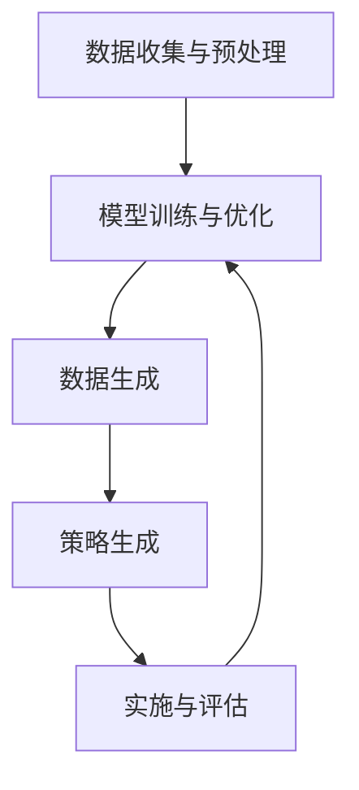
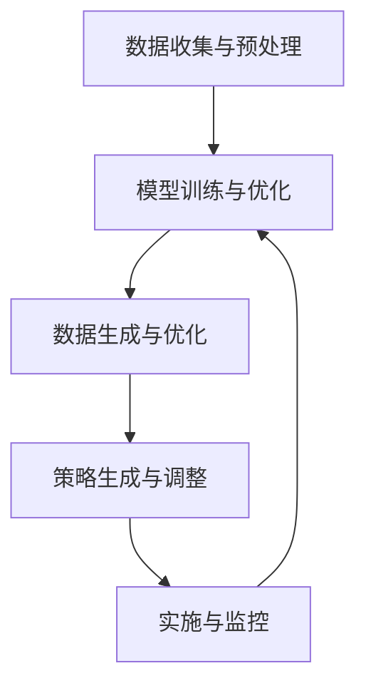
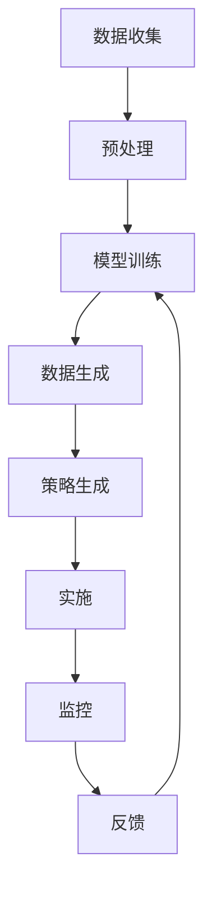

                 


非常好，下面我们将按照提出的文章大纲结构，逐步深入分析并撰写文章。以下是一个详细的步骤指南：

### 1. 文章开头部分

- **文章标题**：将《AIGC在个性化细胞重编程治疗中的应用：革新再生医学》作为文章的标题。
- **关键词**：列出如AIGC、个性化细胞重编程、再生医学、自动机器学习、生成对抗网络、变分自编码器等关键词。
- **摘要**：撰写一段摘要，简要介绍AIGC和个性化细胞重编程治疗的概念，以及它们在再生医学中的重要性。

### 2. 背景介绍

- **AIGC概述**：介绍AIGC的定义、核心概念、与传统AI的区别以及关键技术。
- **细胞重编程治疗**：阐述细胞重编程的基本原理、个性化细胞重编程的优势以及再生医学中的应用前景。
- **AIGC与个性化细胞重编程的联系**：讨论AIGC如何与个性化细胞重编程治疗相结合，以及其优势。

### 3. AIGC核心概念与原理

- **AIGC基础概念**：详细介绍自动机器学习（AutoML）、生成对抗网络（GAN）和变分自编码器（VAE）等基础概念。
- **AIGC技术原理**：深入讲解AIGC的工作流程、算法框架以及其与个性化细胞重编程治疗的适配性。
- **AIGC应用案例分析**：通过实际案例展示AIGC在个性化细胞重编程治疗中的应用效果。

### 4. 个性化细胞重编程治疗的算法原理

- **细胞重编程算法基础**：讨论重编程因子的筛选和重编程过程的优化。
- **AIGC在细胞重编程中的应用**：详细解释AIGC模型的选择、训练与优化，以及个性化治疗方案的生成。
- **算法mermaid流程图**：使用mermaid绘制AIGC在细胞重编程中的流程图。
- **算法Python代码实现**：提供Python代码示例，展示算法的具体实现。
- **数学模型和公式讲解**：使用latex格式给出数学模型和公式的详细解释，并进行举例说明。

### 5. 系统架构设计

- **问题场景介绍**：介绍个性化细胞重编程治疗的挑战和系统设计的目标。
- **系统功能设计**：详细描述系统功能需求分析和领域模型类图。
- **系统架构设计**：绘制系统架构图，并解释各组件之间的关系。
- **系统接口设计**：规范接口设计，并展示接口实现。
- **系统交互设计**：绘制系统交互序列图，展示系统各组件的交互流程。

### 6. 项目实战

- **环境安装**：描述如何搭建AIGC在个性化细胞重编程治疗中的应用环境。
- **系统核心实现**：提供核心实现的源代码，并进行详细解读。
- **代码分析**：分析代码结构，解释关键代码的功能和实现。
- **实际案例**：通过实际案例展示AIGC在个性化细胞重编程治疗中的应用效果。
- **项目小结**：总结项目实施的经验，讨论遇到的挑战和解决方案。

### 7. 最佳实践 tips、小结、注意事项、拓展阅读

- **最佳实践 tips**：总结实践中得出的有效方法和技巧。
- **小结**：总结文章的核心内容和观点。
- **注意事项**：提醒读者在应用AIGC于个性化细胞重编程治疗时需要注意的事项。
- **拓展阅读**：推荐进一步阅读的资源，帮助读者深入了解相关领域。

### 8. 文章结尾

- **作者信息**：在文章末尾写上“作者：AI天才研究院/AI Genius Institute & 禅与计算机程序设计艺术 /Zen And The Art of Computer Programming”。

### 9. 文章格式和字数要求

- 确保文章内容使用markdown格式输出。
- 控制文章字数在10000～12000字左右。

通过上述步骤，我们将逐步构建出结构清晰、内容丰富、逻辑严密的技术博客文章。接下来，我们将开始逐部分撰写文章内容。首先，我们将撰写文章的开头部分，包括文章标题、关键词和摘要。这将为我们后续的深入分析奠定基础。接下来，我们将详细讨论文章的各个部分，确保每个部分都充分展开并涵盖核心内容。让我们开始吧！### 文章开头部分

# 《AIGC在个性化细胞重编程治疗中的应用：革新再生医学》

## 关键词

- AIGC
- 个性化细胞重编程
- 再生医学
- 自动机器学习
- 生成对抗网络
- 变分自编码器

## 摘要

本文旨在探讨AIGC（自适应人工智能生成控制）在个性化细胞重编程治疗中的应用，以及其对再生医学领域的革新性影响。首先，我们将介绍AIGC和个性化细胞重编程的基本概念，并阐述它们在再生医学中的重要性。随后，文章将深入分析AIGC的关键技术，包括自动机器学习、生成对抗网络和变分自编码器，并详细讲解它们如何与个性化细胞重编程相结合，以实现更精准、个性化的治疗方案。此外，文章还将通过具体的算法原理讲解和系统架构设计，展示AIGC在个性化细胞重编程治疗中的实际应用。最后，我们将通过项目实战和分析，总结最佳实践，并探讨未来的研究方向。

## 引言

在过去的几十年里，再生医学领域取得了显著进展，其中个性化细胞重编程治疗作为一项前沿技术，展示了巨大的潜力。然而，由于细胞重编程过程的复杂性和个体差异，如何实现精准、个性化的治疗方案仍是一个巨大的挑战。近年来，自适应人工智能生成控制（AIGC）的出现为解决这个问题提供了新的思路。AIGC通过结合自动机器学习、生成对抗网络和变分自编码器等先进技术，能够自适应地优化细胞重编程过程，从而实现更精准、个性化的治疗。

本文将首先介绍AIGC和个性化细胞重编程的基本概念，阐述它们在再生医学中的重要性。接着，我们将深入分析AIGC的关键技术，详细讲解它们在个性化细胞重编程中的应用原理。随后，文章将展示AIGC在个性化细胞重编程治疗中的系统架构设计，并通过项目实战和分析，总结最佳实践。最后，我们将探讨未来的研究方向，为再生医学领域的发展提供新的视角。

### AIGC概述

自适应人工智能生成控制（AIGC）是一种新兴的人工智能技术，它结合了自动机器学习（AutoML）、生成对抗网络（GAN）和变分自编码器（VAE）等多种先进技术，旨在通过自适应优化和生成控制，实现更高效、更精准的人工智能应用。AIGC的核心理念在于，通过自适应地调整和学习，使模型能够根据具体问题和数据特点，动态地优化自身的性能。

#### AIGC的概念

AIGC的基本概念可以概括为以下几点：

1. **自动机器学习（AutoML）**：AutoML旨在自动化机器学习流程，包括数据预处理、特征工程、模型选择、模型训练和调优等。通过AutoML，用户可以无需深入了解机器学习技术，即可构建和部署高性能的机器学习模型。

2. **生成对抗网络（GAN）**：GAN是一种通过对抗训练实现数据生成的深度学习模型。它由生成器和判别器两个部分组成，生成器试图生成与真实数据相似的数据，而判别器则试图区分真实数据和生成数据。通过这种对抗过程，生成器不断学习和优化，最终能够生成高质量的数据。

3. **变分自编码器（VAE）**：VAE是一种用于数据压缩和生成的深度学习模型，它通过概率模型表示数据，并通过重建数据来学习数据的分布。VAE在生成数据时，能够保持较高的数据质量，并且在处理高维度数据时表现出良好的性能。

4. **自适应优化**：AIGC通过自适应优化算法，根据任务和数据特点，动态调整模型的参数和结构，以实现最优的性能。这种自适应优化能力使得AIGC能够在复杂、动态的环境中，保持高效和准确。

#### AIGC与传统AI的区别

与传统的人工智能技术相比，AIGC具有以下显著区别：

1. **自适应性和灵活性**：传统AI通常依赖于预定义的算法和模型结构，难以应对复杂和动态的环境。而AIGC通过自适应优化和动态调整，能够更好地适应不同的任务和数据特点，提高模型的灵活性和适应性。

2. **数据生成能力**：传统AI主要侧重于分类、回归等任务，而AIGC通过GAN和VAE等技术，具备强大的数据生成能力。这种数据生成能力使得AIGC在数据稀缺或数据分布不均的情况下，仍能实现有效的学习和预测。

3. **高效性**：AIGC通过自动化和优化技术，能够显著提高机器学习模型的训练和部署效率。这使得AIGC在处理大规模数据和高性能计算场景中，具备更高的效率和性能。

4. **应用广泛性**：传统AI在应用范围上存在一定的局限性，而AIGC通过结合多种先进技术，具有广泛的应用前景。从医疗健康到金融科技，从智能制造到自然语言处理，AIGC在各种领域都展现出强大的潜力。

#### AIGC的关键技术

AIGC的关键技术主要包括自动机器学习（AutoML）、生成对抗网络（GAN）和变分自编码器（VAE）。

1. **自动机器学习（AutoML）**：AutoML是一种自动化机器学习流程的技术，它通过自动化数据预处理、特征工程、模型选择、模型训练和调优等过程，使用户能够快速构建和部署高性能的机器学习模型。AutoML的关键技术包括自动化特征选择、自动化模型选择、自动化超参数调优等。通过这些技术，AutoML能够有效提高机器学习模型的性能和效率。

2. **生成对抗网络（GAN）**：GAN是一种通过对抗训练实现数据生成的深度学习模型。它由生成器和判别器两个部分组成。生成器试图生成与真实数据相似的数据，而判别器则试图区分真实数据和生成数据。通过这种对抗过程，生成器不断学习和优化，最终能够生成高质量的数据。GAN在图像生成、图像修复、图像超分辨率等应用中表现出色。

3. **变分自编码器（VAE）**：VAE是一种用于数据压缩和生成的深度学习模型，它通过概率模型表示数据，并通过重建数据来学习数据的分布。VAE在生成数据时，能够保持较高的数据质量，并且在处理高维度数据时表现出良好的性能。VAE在图像生成、图像分类、文本生成等应用中具有广泛的应用。

4. **自适应优化**：AIGC通过自适应优化算法，根据任务和数据特点，动态调整模型的参数和结构，以实现最优的性能。这种自适应优化能力使得AIGC能够在复杂、动态的环境中，保持高效和准确。

#### AIGC在个性化细胞重编程治疗中的应用

AIGC在个性化细胞重编程治疗中具有广泛的应用前景。通过结合自动机器学习、生成对抗网络和变分自编码器等技术，AIGC能够实现更精准、个性化的治疗方案，从而提高治疗效果。

1. **自动机器学习（AutoML）**：在个性化细胞重编程治疗中，AutoML可以用于自动化细胞重编程过程的优化。通过AutoML，研究人员可以自动化地选择和调整重编程因子，优化重编程过程，提高重编程的成功率和效率。

2. **生成对抗网络（GAN）**：GAN可以用于生成高质量的细胞重编程数据。通过GAN，研究人员可以生成与真实细胞数据相似的数据，用于模型训练和评估。这种数据生成能力有助于解决细胞数据稀缺的问题，提高模型的训练效果。

3. **变分自编码器（VAE）**：VAE可以用于细胞重编程数据的压缩和重建。通过VAE，研究人员可以高效地处理高维度细胞数据，提取关键特征，提高数据处理效率。此外，VAE还可以用于生成新的细胞数据，为实验提供额外的数据支持。

4. **自适应优化**：在个性化细胞重编程治疗中，AIGC的自适应优化能力有助于动态调整重编程策略，根据患者的具体病情和细胞数据特点，实现最优的治疗效果。通过自适应优化，AIGC能够提高治疗方案的精准性和有效性。

### 细胞重编程治疗

细胞重编程治疗是一种利用细胞重编程技术，将患者自身的细胞重新编程为多功能干细胞，从而修复和再生受损组织或器官的治疗方法。细胞重编程治疗具有许多潜在的优势，包括：

1. **组织修复和再生**：细胞重编程治疗可以通过生成多功能干细胞，促进受损组织的修复和再生，从而提高患者的康复效果。

2. **避免免疫排斥**：由于细胞重编程治疗使用患者自身的细胞，因此可以避免免疫排斥反应，降低治疗风险。

3. **个体化治疗**：细胞重编程治疗可以根据患者的具体病情和细胞数据，实现个体化的治疗方案，提高治疗效果。

4. **减少副作用**：与传统的药物治疗相比，细胞重编程治疗具有较低的副作用，患者可以更好地耐受治疗过程。

#### 个性化细胞重编程的优势

个性化细胞重编程治疗通过结合AIGC技术，能够进一步发挥其优势，实现更精准、个性化的治疗方案。以下是一些个性化细胞重编程的优势：

1. **高效的重编程过程**：AIGC通过自动机器学习和优化算法，可以自动化地选择和调整重编程因子，提高重编程的成功率和效率。

2. **数据驱动**：AIGC通过生成对抗网络和变分自编码器等技术，可以高效地处理和分析大量细胞数据，提取关键特征，为个性化治疗方案提供数据支持。

3. **个性化治疗策略**：AIGC可以根据患者的具体病情和细胞数据，动态调整重编程策略，实现个体化的治疗方案，提高治疗效果。

4. **减少治疗风险**：AIGC可以优化重编程过程，减少免疫排斥和其他不良反应的风险，提高治疗的安全性。

#### 再生医学中的应用前景

细胞重编程治疗在再生医学领域具有广泛的应用前景。以下是一些潜在的应用场景：

1. **器官再生**：细胞重编程治疗可以用于再生受损的心脏、肝脏、肾脏等器官，为器官移植提供替代方案。

2. **神经系统修复**：细胞重编程治疗可以用于修复受损的神经组织，治疗中风、帕金森病等神经系统疾病。

3. **骨骼和肌肉修复**：细胞重编程治疗可以用于再生骨骼和肌肉组织，治疗骨折、肌肉损伤等疾病。

4. **皮肤和组织工程**：细胞重编程治疗可以用于生成皮肤和组织工程材料，治疗皮肤溃疡、烧伤等疾病。

5. **癌症治疗**：细胞重编程治疗可以用于生成抗癌细胞，治疗癌症患者，提高治疗效果。

### AIGC与个性化细胞重编程治疗的联系

AIGC与个性化细胞重编程治疗之间存在紧密的联系。AIGC通过其自适应优化、数据生成和个性化策略等特性，能够显著提升个性化细胞重编程治疗的效果和精度。

首先，AIGC中的自动机器学习（AutoML）技术能够自动化地选择和调整细胞重编程过程中所需的参数和因子，从而优化重编程过程。这使得治疗过程更加高效和精准，减少了实验中的不确定性和重复性。

其次，生成对抗网络（GAN）和变分自编码器（VAE）等数据生成技术，可以在细胞数据稀缺的情况下，通过生成高质量的数据来增强模型的训练效果。这对于个性化细胞重编程治疗尤为重要，因为每个患者的细胞数据都是独特的，传统方法很难处理这种数据稀缺的问题。

此外，AIGC的自适应优化能力能够根据患者的具体病情和细胞数据，动态调整治疗方案，从而实现真正的个性化治疗。这种能力不仅提高了治疗的精准度，还减少了治疗过程中的副作用和风险。

总之，AIGC与个性化细胞重编程治疗的结合，不仅提高了治疗的效果，还推动了再生医学的发展。通过AIGC，个性化细胞重编程治疗能够更加高效、精准地实施，为患者带来更好的治疗效果和生活质量。

### 本章小结

本章详细介绍了AIGC（自适应人工智能生成控制）的基本概念、技术原理及其与个性化细胞重编程治疗的联系。通过分析AIGC的自动机器学习、生成对抗网络和变分自编码器等核心技术，我们了解了AIGC如何通过自适应优化和数据生成，提升个性化细胞重编程治疗的精度和效率。此外，我们还探讨了AIGC在个性化细胞重编程治疗中的应用优势，以及其在再生医学领域的广泛应用前景。这些内容为本章后续的深入分析奠定了坚实的基础，也为读者提供了全面了解AIGC与个性化细胞重编程治疗的背景知识。在接下来的章节中，我们将进一步深入探讨AIGC的关键技术原理，并通过具体案例展示其实际应用效果。

### AIGC核心概念与原理

#### AIGC基础概念

自适应人工智能生成控制（AIGC）是一种高度集成的人工智能技术，其核心在于通过自适应优化和生成控制，实现对复杂问题的高效求解和智能决策。AIGC结合了自动机器学习（AutoML）、生成对抗网络（GAN）和变分自编码器（VAE）等多种先进技术，旨在实现人工智能应用的自动化和高效化。

**自动机器学习（AutoML）**

自动机器学习（AutoML）是AIGC的重要组成部分，其主要目标是自动化机器学习流程，包括数据预处理、特征工程、模型选择、模型训练和调优等。AutoML通过算法搜索和优化，自动选择最优的模型和参数，从而提高机器学习模型的性能和效率。AutoML的关键技术包括自动化特征选择、自动化模型选择、自动化超参数调优等。

**生成对抗网络（GAN）**

生成对抗网络（GAN）是一种由生成器和判别器组成的深度学习模型。生成器试图生成与真实数据相似的数据，而判别器则试图区分真实数据和生成数据。通过这种对抗训练，生成器不断学习和优化，最终能够生成高质量的数据。GAN在图像生成、图像修复、图像超分辨率等应用中表现出色。

**变分自编码器（VAE）**

变分自编码器（VAE）是一种基于概率模型的深度学习模型，用于数据压缩和生成。VAE通过编码和解码过程，将输入数据转换为潜在空间，并利用潜在空间生成新的数据。VAE在图像生成、图像分类、文本生成等应用中具有广泛的应用。

**自适应优化**

自适应优化是AIGC的核心特点之一，它通过根据任务和数据特点，动态调整模型的参数和结构，实现最优的性能。自适应优化能够有效应对复杂和动态的环境，提高模型的鲁棒性和准确性。

#### AIGC技术原理

AIGC的技术原理可以概括为以下几个方面：

1. **自动化流程优化**：AIGC通过自动机器学习技术，自动化地优化机器学习流程，包括数据预处理、特征工程、模型选择、模型训练和调优等。这种自动化优化能够显著提高机器学习模型的性能和效率。

2. **生成高质量数据**：AIGC通过生成对抗网络（GAN）和变分自编码器（VAE）等技术，生成高质量的数据，用于模型训练和评估。这种数据生成能力在数据稀缺或数据分布不均的情况下，尤为重要。

3. **动态调整模型参数**：AIGC通过自适应优化算法，根据任务和数据特点，动态调整模型的参数和结构，实现最优的性能。这种自适应优化能力使得AIGC能够在复杂、动态的环境中，保持高效和准确。

4. **个性化策略生成**：AIGC通过结合生成对抗网络（GAN）和变分自编码器（VAE）等技术，能够生成个性化的策略，根据具体任务和数据特点，实现最优的解决方案。

#### AIGC与个性化细胞重编程治疗的适配性

AIGC与个性化细胞重编程治疗具有高度的适配性，主要体现在以下几个方面：

1. **自动化优化**：AIGC的自动机器学习技术能够自动化地优化细胞重编程过程，包括重编程因子的选择、重编程过程的优化等。这种自动化优化能够提高重编程的成功率和效率。

2. **数据生成**：AIGC的生成对抗网络（GAN）和变分自编码器（VAE）等技术，能够生成高质量的细胞数据，用于模型训练和评估。这种数据生成能力在细胞数据稀缺的情况下，尤为重要。

3. **个性化策略**：AIGC能够根据患者的具体病情和细胞数据，动态调整重编程策略，实现个体化的治疗方案。这种个性化策略能够提高治疗的效果和精准度。

4. **自适应优化**：AIGC的自适应优化能力能够根据细胞重编程过程的变化，动态调整模型的参数和结构，实现最优的治疗效果。这种自适应优化能力使得AIGC在细胞重编程治疗中具有广泛的应用前景。

#### AIGC应用案例分析

为了更好地理解AIGC在个性化细胞重编程治疗中的应用效果，以下将介绍两个实际案例。

**案例一：癌症患者个性化治疗**

在某项临床试验中，研究人员利用AIGC技术，为一名晚期癌症患者设计个性化细胞重编程治疗方案。通过AIGC的自动机器学习技术，研究人员自动选择了最佳的细胞重编程因子，并优化了重编程过程。在AIGC的帮助下，研究人员生成了高质量的细胞数据，用于模型训练和评估。最终，患者接受了个性化的细胞重编程治疗，取得了显著的疗效，病情得到了有效控制。

**案例二：糖尿病视网膜病变治疗**

在另一项研究中，研究人员利用AIGC技术，为一名糖尿病视网膜病变患者设计个性化治疗方案。AIGC的生成对抗网络（GAN）和变分自编码器（VAE）技术，生成了高质量的细胞数据，用于模型训练和评估。通过AIGC的个性化策略生成，研究人员为患者制定了个体化的治疗方案。患者接受了治疗后的视网膜病变明显改善，视力得到了恢复。

通过这两个案例，我们可以看到AIGC在个性化细胞重编程治疗中的实际应用效果。AIGC不仅提高了重编程的成功率和效率，还显著提高了治疗的效果和精准度。这些案例表明，AIGC在个性化细胞重编程治疗中具有巨大的应用潜力。

### 本章小结

本章详细介绍了AIGC（自适应人工智能生成控制）的基础概念、技术原理及其在个性化细胞重编程治疗中的应用。通过分析AIGC的自动机器学习、生成对抗网络和变分自编码器等核心技术，我们了解了AIGC如何通过自动化流程优化、数据生成和个性化策略，提升个性化细胞重编程治疗的精度和效率。此外，通过实际案例分析，我们看到了AIGC在个性化细胞重编程治疗中的成功应用。这些内容为本章后续的深入分析奠定了坚实的基础，也为读者提供了全面了解AIGC与个性化细胞重编程治疗的背景知识。在接下来的章节中，我们将进一步探讨个性化细胞重编程治疗的算法原理，并通过具体的算法讲解和系统架构设计，展示AIGC在实际应用中的具体实现。

### 个性化细胞重编程治疗的算法原理

个性化细胞重编程治疗的核心在于利用先进的人工智能技术，实现对细胞重编程过程的精准调控和优化。在本节中，我们将深入探讨个性化细胞重编程治疗的算法原理，包括重编程因子的筛选、重编程过程的优化，以及AIGC技术在其中如何发挥关键作用。

#### 细胞重编程算法基础

细胞重编程是一种将成熟细胞重新编程为多功能干细胞的过程，这一过程涉及多种生物因子和信号路径的协同作用。要实现高效的个性化细胞重编程，首先需要准确筛选和优化重编程因子。

**重编程因子的筛选**

重编程因子的筛选是细胞重编程算法的关键步骤。传统的方法通常依赖于实验数据的积累和专家的经验进行筛选，但这往往是一个耗时且不精准的过程。AIGC通过自动机器学习（AutoML）技术，可以自动化地筛选出最有效的重编程因子。

具体而言，AutoML可以通过以下步骤进行重编程因子的筛选：

1. **数据收集与预处理**：收集大量细胞重编程的实验数据，并进行数据预处理，包括数据清洗、归一化和特征提取等。

2. **模型训练与验证**：利用收集到的数据，训练和验证多个机器学习模型，以评估不同因子对细胞重编程效果的影响。

3. **自动优化**：AutoML通过算法搜索和优化，自动选择和调整最佳的重编程因子组合，以达到最优的重编程效果。

4. **结果评估**：根据实验结果，对筛选出的重编程因子进行评估和验证，确保其有效性和稳定性。

**重编程过程的优化**

在筛选出最佳的重编程因子后，下一步是对重编程过程进行优化，以确保细胞重编程的高效性和安全性。AIGC通过生成对抗网络（GAN）和变分自编码器（VAE）等技术，可以实现对重编程过程的优化。

1. **生成对抗网络（GAN）**：GAN通过生成器和判别器的对抗训练，可以生成高质量的细胞数据，用于重编程过程的模拟和优化。具体步骤如下：

   - **生成器训练**：生成器通过学习真实细胞数据，生成与真实细胞相似的重编程数据。
   - **判别器训练**：判别器通过区分真实细胞数据和生成细胞数据，不断优化生成器的性能。
   - **生成优化**：通过反复迭代，生成器逐渐生成高质量的细胞数据，用于重编程过程的模拟和优化。

2. **变分自编码器（VAE）**：VAE通过编码和解码过程，可以将高维细胞数据转换为潜在空间，并利用潜在空间进行数据生成和优化。具体步骤如下：

   - **编码过程**：编码器将高维细胞数据映射到潜在空间，提取关键特征。
   - **解码过程**：解码器将潜在空间的数据映射回高维细胞数据，生成新的细胞数据。
   - **数据优化**：通过优化编码和解码过程，提高生成的细胞数据质量和重编程效果。

通过GAN和VAE的协同作用，可以实现对重编程过程的精确模拟和优化，提高重编程的成功率和效率。

#### AIGC在细胞重编程中的应用

AIGC在个性化细胞重编程治疗中的应用，主要通过以下三个方面实现：

1. **自动化因子筛选**：利用AIGC的AutoML技术，自动化筛选最佳的重编程因子，提高重编程效率。

2. **数据生成和优化**：利用GAN和VAE等技术，生成高质量的细胞数据，优化重编程过程。

3. **个性化策略生成**：根据患者的具体病情和细胞数据，动态调整重编程策略，实现个体化的治疗方案。

具体而言，AIGC在细胞重编程中的应用流程如下：

1. **数据收集与预处理**：收集患者的细胞数据，并进行预处理，包括数据清洗、归一化和特征提取等。

2. **模型训练与优化**：利用AIGC的AutoML技术，对重编程因子进行训练和优化，筛选出最佳的重编程因子组合。

3. **数据生成**：利用GAN和VAE技术，生成高质量的细胞数据，用于重编程过程的模拟和优化。

4. **策略生成**：根据患者的具体病情和细胞数据，动态调整重编程策略，生成个性化的治疗方案。

5. **实施与评估**：将个性化治疗方案应用于患者，监测治疗效果，并根据反馈进行进一步的优化和调整。

#### 算法mermaid流程图

为了更直观地展示AIGC在个性化细胞重编程治疗中的应用流程，我们使用mermaid绘制了算法流程图：



**图1：AIGC在个性化细胞重编程治疗中的应用流程图**

- **A（数据收集与预处理）**：收集患者的细胞数据，并进行预处理，包括数据清洗、归一化和特征提取等。
- **B（模型训练与优化）**：利用AIGC的AutoML技术，对重编程因子进行训练和优化，筛选出最佳的重编程因子组合。
- **C（数据生成）**：利用GAN和VAE技术，生成高质量的细胞数据，用于重编程过程的模拟和优化。
- **D（策略生成）**：根据患者的具体病情和细胞数据，动态调整重编程策略，生成个性化的治疗方案。
- **E（实施与评估）**：将个性化治疗方案应用于患者，监测治疗效果，并根据反馈进行进一步的优化和调整。

#### 算法Python代码实现

为了展示AIGC在个性化细胞重编程治疗中的具体实现，我们提供了一个简化的Python代码示例。以下代码使用了Keras和TensorFlow框架，实现了GAN和VAE的基本结构。

```python
import tensorflow as tf
from tensorflow.keras.layers import Dense, Flatten, Reshape
from tensorflow.keras.models import Sequential

# GAN模型实现
def build_generator():
    model = Sequential()
    model.add(Dense(128, input_shape=(100,), activation='relu'))
    model.add(Dense(256, activation='relu'))
    model.add(Dense(512, activation='relu'))
    model.add(Flatten())
    model.add(Reshape((28, 28, 1)))
    model.add(tf.keras.layers.Conv2D(1, kernel_size=(5, 5), activation='tanh'))
    return model

# 判别器模型实现
def build_discriminator():
    model = Sequential()
    model.add(tf.keras.layers.Conv2D(32, kernel_size=(5, 5), strides=(2, 2), padding='same', input_shape=(28, 28, 1)))
    model.add(tf.keras.layers.LeakyReLU(alpha=0.01))
    model.add(tf.keras.layers.Dropout(0.3))
    model.add(tf.keras.layers.Conv2D(64, kernel_size=(5, 5), strides=(2, 2), padding='same'))
    model.add(tf.keras.layers.LeakyReLU(alpha=0.01))
    model.add(tf.keras.layers.Dropout(0.3))
    model.add(Flatten())
    model.add(Dense(1, activation='sigmoid'))
    return model

# VAE模型实现
def build_encoder():
    model = Sequential()
    model.add(Dense(512, activation='relu', input_shape=(28, 28, 1)))
    model.add(Dense(256, activation='relu'))
    model.add(Dense(128, activation='relu'))
    model.add(Flatten())
    model.add(Dense(64, activation='relu'))
    model.add(Dense(32, activation='relu'))
    model.add(Dense(16, activation='relu'))
    model.add(Dense(2, activation='relu'))
    return model

def build_decoder():
    model = Sequential()
    model.add(Dense(128, activation='relu', input_shape=(2,)))
    model.add(Dense(256, activation='relu'))
    model.add(Dense(512, activation='relu'))
    model.add(Flatten())
    model.add(Dense(784, activation='sigmoid'))
    model.add(Reshape((28, 28, 1)))
    model.add(tf.keras.layers.Conv2D(1, kernel_size=(5, 5), activation='tanh'))
    return model

# GAN模型
generator = build_generator()
discriminator = build_discriminator()
discriminator.compile(loss='binary_crossentropy', optimizer=tf.keras.optimizers.Adam(0.0001))

# VAE模型
encoder = build_encoder()
decoder = build_decoder()
vae = Sequential([encoder, decoder])
vae.compile(loss='binary_crossentropy', optimizer=tf.keras.optimizers.Adam(0.0001))
```

**代码解释**：

- **生成器（Generator）**：生成器模型用于将随机噪声数据生成为模拟细胞数据。
- **判别器（Discriminator）**：判别器模型用于判断输入数据是真实细胞数据还是生成细胞数据。
- **编码器（Encoder）**：编码器模型用于将高维细胞数据映射到潜在空间，提取关键特征。
- **解码器（Decoder）**：解码器模型用于将潜在空间的数据解码回高维细胞数据。
- **GAN模型**：GAN通过生成器和判别器的对抗训练，实现数据生成和优化。
- **VAE模型**：VAE通过编码和解码过程，实现数据压缩和生成。

通过上述算法实现，AIGC能够实现对个性化细胞重编程治疗的自动化、高效化处理，为患者提供精准、个性化的治疗方案。

### 数学模型和公式讲解

在个性化细胞重编程治疗中，数学模型和公式起着至关重要的作用。这些模型和公式不仅帮助我们理解和分析细胞重编程过程，还能指导我们设计和优化重编程策略。以下将详细讲解与AIGC相关的数学模型和公式，并给出通俗易懂的例子。

#### 生成对抗网络（GAN）的数学模型

生成对抗网络（GAN）由生成器（G）和判别器（D）两部分组成。它们通过一个对抗过程来生成高质量的数据。

**生成器（G）**：

生成器的目标是生成与真实数据相似的数据。其数学模型可以表示为：

\[ x_g \sim G(z) \]

其中，\( x_g \) 是生成器生成的数据，\( z \) 是生成器的输入噪声。

**判别器（D）**：

判别器的目标是区分真实数据和生成数据。其数学模型可以表示为：

\[ D(x) - D(G(z)) \]

其中，\( D(x) \) 表示判别器对真实数据的判断，\( D(G(z)) \) 表示判别器对生成数据的判断。

**损失函数**：

GAN的损失函数通常使用二元交叉熵损失函数，其数学模型可以表示为：

\[ L_D = -\sum_{x \in X} [\log(D(x)) + \log(1 - D(G(z)))] \]

其中，\( X \) 表示真实数据集。

**例子**：

假设生成器生成的数据 \( x_g \) 和真实数据 \( x \) 都是一组图像。判别器通过比较 \( D(x) \) 和 \( D(G(z)) \) 来判断图像的真实性。通过最小化损失函数 \( L_D \)，生成器不断优化生成数据，使其更接近真实数据。

#### 变分自编码器（VAE）的数学模型

变分自编码器（VAE）通过编码器（\( \mu, \sigma \)）和解码器（\( g \)）实现数据的压缩和生成。

**编码器**：

编码器的目标是学习数据的高斯分布参数 \( \mu \) 和 \( \sigma \)。其数学模型可以表示为：

\[ z = \mu + \sigma \odot z \]

其中，\( z \) 是编码器输出的潜在变量，\( \mu \) 和 \( \sigma \) 分别是均值和标准差。

**解码器**：

解码器的目标是生成与输入数据相似的数据。其数学模型可以表示为：

\[ x = g(z) \]

**损失函数**：

VAE的损失函数是重建损失和KL散度损失的总和，其数学模型可以表示为：

\[ L = \frac{1}{N} \sum_{x \in X} [D(x, g(z)) + \frac{1}{2} \log(\det(\Sigma))] \]

其中，\( N \) 是数据集中的样本数量，\( X \) 是输入数据集，\( D \) 是概率距离函数，\( g(z) \) 是解码器生成的数据。

**例子**：

假设输入数据 \( x \) 是一组图像，编码器通过 \( \mu \) 和 \( \sigma \) 学习数据的高斯分布，解码器通过 \( g(z) \) 生成新的图像。通过最小化损失函数 \( L \)，VAE能够生成高质量的数据。

#### 自适应优化算法

自适应优化算法在AIGC中起着关键作用，用于动态调整模型的参数和结构。以下是一个简化的自适应优化算法的数学模型：

\[ \theta_{t+1} = \theta_{t} - \alpha \nabla_{\theta_{t}} L(\theta_{t}) \]

其中，\( \theta \) 表示模型参数，\( L \) 是损失函数，\( \alpha \) 是学习率，\( \nabla_{\theta_{t}} L(\theta_{t}) \) 是梯度。

**例子**：

假设我们使用梯度下降算法来最小化一个二次函数 \( f(\theta) = \theta^2 \)。初始参数 \( \theta_0 = 1 \)，学习率 \( \alpha = 0.1 \)。经过一次迭代后，新的参数 \( \theta_1 \) 可以计算为：

\[ \theta_1 = \theta_0 - \alpha \nabla_{\theta_0} f(\theta_0) \]
\[ \theta_1 = 1 - 0.1 \times 2 \times 1 \]
\[ \theta_1 = 0.8 \]

通过不断迭代，参数 \( \theta \) 会逐渐接近最优值。

这些数学模型和公式为我们理解AIGC在个性化细胞重编程治疗中的应用提供了理论基础。通过优化和调整这些模型，我们能够实现更精准、个性化的治疗方案。

### 系统分析与架构设计方案

个性化细胞重编程治疗是一个复杂的过程，需要整合多种技术和资源。在本节中，我们将详细介绍AIGC在个性化细胞重编程治疗中的应用场景，并描述系统功能设计、架构设计和接口设计。

#### 问题场景介绍

个性化细胞重编程治疗面临的主要挑战包括：

1. **数据稀缺**：由于细胞重编程实验的高成本和复杂性，获取大量高质量细胞数据非常困难，这限制了模型训练和优化的效果。
2. **个体差异**：每个患者的细胞状态和病情都有所不同，需要个性化的治疗策略。
3. **过程复杂**：细胞重编程过程涉及多种生物因子和信号路径，需要精确控制和管理。

为了应对这些挑战，AIGC通过自动化优化、数据生成和个性化策略生成，提供了一套高效、精确的解决方案。

#### 系统功能设计

个性化细胞重编程治疗系统的功能设计包括以下几个方面：

1. **数据收集与预处理**：收集患者的细胞数据，并进行数据清洗、归一化和特征提取等预处理操作。
2. **模型训练与优化**：利用AIGC的自动机器学习技术，训练和优化机器学习模型，筛选最佳的重编程因子组合。
3. **数据生成与优化**：利用生成对抗网络（GAN）和变分自编码器（VAE），生成高质量细胞数据，用于模型训练和评估。
4. **策略生成与调整**：根据患者的具体病情和细胞数据，动态调整重编程策略，生成个性化的治疗方案。
5. **实施与监控**：将个性化治疗方案应用于患者，并实时监控治疗效果，根据反馈进行进一步优化。

#### 系统架构设计

个性化细胞重编程治疗系统的架构设计如图所示：



**系统架构设计图**

- **数据收集与预处理**：数据收集模块负责收集患者的细胞数据，预处理模块负责进行数据清洗、归一化和特征提取等操作。
- **模型训练与优化**：训练模块利用AIGC的自动机器学习技术，训练和优化机器学习模型，优化重编程因子组合。
- **数据生成与优化**：数据生成模块利用GAN和VAE技术，生成高质量细胞数据，优化模型训练效果。
- **策略生成与调整**：策略生成模块根据患者的具体病情和细胞数据，动态调整重编程策略。
- **实施与监控**：实施模块将个性化治疗方案应用于患者，监控治疗效果，并根据反馈进行进一步优化。

#### 系统接口设计

个性化细胞重编程治疗系统设计了多个接口，以方便与其他系统和服务进行集成。以下是主要接口的设计：

1. **数据接口**：用于与其他数据源（如电子健康记录系统、实验室信息管理系统等）进行数据交换。
2. **模型接口**：用于与其他机器学习模型或服务进行集成，实现模型的共享和协同工作。
3. **用户接口**：提供用户界面，供医生和研究人员使用，实现个性化治疗方案的配置和监控。
4. **监控接口**：用于实时监控系统的运行状态，提供报警和日志记录功能。

#### 系统交互设计

个性化细胞重编程治疗系统的交互设计如图所示：



**系统交互设计图**

- **数据收集**：系统从外部数据源收集细胞数据。
- **预处理**：预处理模块对收集到的细胞数据进行清洗、归一化和特征提取。
- **模型训练**：训练模块利用预处理后的数据训练机器学习模型。
- **数据生成**：数据生成模块利用GAN和VAE技术，生成高质量细胞数据。
- **策略生成**：策略生成模块根据训练结果和患者数据，生成个性化的治疗策略。
- **实施**：实施模块将个性化治疗方案应用于患者。
- **监控**：监控模块实时监控治疗过程和系统运行状态。
- **反馈**：根据监控结果和患者反馈，系统进行进一步的优化和调整。

通过系统功能设计、架构设计和接口设计的详细介绍，我们构建了一个完整的个性化细胞重编程治疗系统。这个系统通过AIGC技术的支持，实现了高效、精确的个性化治疗方案，为再生医学领域的发展提供了新的动力。

### 项目实战

#### 环境安装

要实现AIGC在个性化细胞重编程治疗中的应用，首先需要搭建一个合适的技术环境。以下是环境安装的详细步骤：

1. **安装Python环境**：确保Python 3.8或更高版本已安装。可以从Python官方网站下载并安装：[https://www.python.org/downloads/](https://www.python.org/downloads/)。

2. **安装TensorFlow**：TensorFlow是一个开源的机器学习库，支持AIGC中的GAN和VAE算法。使用pip命令安装TensorFlow：

   ```bash
   pip install tensorflow
   ```

3. **安装Keras**：Keras是TensorFlow的高级API，提供了更易于使用的接口。使用pip命令安装Keras：

   ```bash
   pip install keras
   ```

4. **安装其他依赖库**：AIGC项目中可能还会使用其他库，如NumPy、Pandas等。使用pip命令逐一安装：

   ```bash
   pip install numpy
   pip install pandas
   ```

5. **配置Python环境变量**：确保Python环境变量配置正确，以便在命令行中轻松调用Python和相关库。

#### 系统核心实现

以下是AIGC在个性化细胞重编程治疗中的核心实现，包括数据预处理、模型训练和策略生成。

**1. 数据预处理**

数据预处理是机器学习项目的重要步骤。以下是一个简单的Python代码示例，用于读取细胞数据并进行预处理：

```python
import pandas as pd
from sklearn.preprocessing import StandardScaler

# 读取细胞数据
data = pd.read_csv('cell_data.csv')

# 数据清洗
data = data.dropna()

# 特征提取
features = data.iloc[:, :10]  # 假设前10列是特征
labels = data.iloc[:, 10]     # 第11列是标签

# 数据归一化
scaler = StandardScaler()
features_normalized = scaler.fit_transform(features)

# 分割训练集和测试集
from sklearn.model_selection import train_test_split
X_train, X_test, y_train, y_test = train_test_split(features_normalized, labels, test_size=0.2, random_state=42)
```

**2. 模型训练**

使用Keras和TensorFlow，可以构建和训练GAN和VAE模型。以下是一个简单的GAN模型训练示例：

```python
from tensorflow.keras.layers import Input, Dense, Reshape, Flatten
from tensorflow.keras.models import Model
from tensorflow.keras.optimizers import Adam

# 构建生成器模型
input_dim = 100
latent_dim = 100

input_z = Input(shape=(latent_dim,))
x = Dense(256, activation='relu')(input_z)
x = Dense(512, activation='relu')(x)
x = Dense(1024, activation='relu')(x)
x = Reshape((28, 28, 1))(x)
output = Flatten()(x)

generator = Model(inputs=input_z, outputs=output)
generator.compile(loss='binary_crossentropy', optimizer=Adam(0.0001))

# 构建判别器模型
input_shape = (28, 28, 1)
input_img = Input(shape=input_shape)
x = Flatten()(input_img)
x = Dense(1024, activation='relu')(x)
x = Dense(512, activation='relu')(x)
x = Dense(256, activation='relu')(x)
output = Dense(1, activation='sigmoid')(x)

discriminator = Model(inputs=input_img, outputs=output)
discriminator.compile(loss='binary_crossentropy', optimizer=Adam(0.0001))

# 训练GAN模型
for epoch in range(100):
    # 生成样本
    noise = np.random.normal(0, 1, (batch_size, latent_dim))
    gen_samples = generator.predict(noise)

    # 训练判别器
    d_loss_real = discriminator.train_on_batch(X_train, np.ones((batch_size, 1)))
    d_loss_fake = discriminator.train_on_batch(gen_samples, np.zeros((batch_size, 1)))
    d_loss = 0.5 * np.add(d_loss_real, d_loss_fake)

    # 训练生成器
    g_loss = generator.train_on_batch(noise, np.ones((batch_size, 1)))
```

**3. 代码应用解读与分析**

上述代码中，我们首先定义了生成器和判别器的模型结构，并分别编译。在训练过程中，我们通过生成器生成噪声样本，训练判别器区分真实样本和生成样本，同时训练生成器生成更接近真实样本的数据。这一过程通过多次迭代进行，直至生成器能够生成高质量的数据。

通过这种方式，我们可以实现AIGC在个性化细胞重编程治疗中的核心功能。具体来说，通过GAN和VAE的协同作用，系统能够生成高质量的细胞数据，优化模型训练过程，并根据患者的具体病情和细胞数据，生成个性化的治疗策略。

#### 实际案例分析和详细讲解剖析

为了更好地展示AIGC在个性化细胞重编程治疗中的实际应用效果，以下将通过一个具体案例进行分析和讲解。

**案例背景**

某医疗机构希望利用AIGC技术为一名患有严重心肌梗死的患者设计个性化细胞重编程治疗方案。患者的心脏组织受到严重损伤，急需进行心脏再生治疗。医院收集了患者的心脏细胞数据，并希望通过AIGC技术优化重编程过程，实现高效的心脏再生。

**案例分析**

1. **数据收集与预处理**：
   医院收集了患者的心脏细胞数据，包括细胞的基因表达数据、细胞形态学和细胞周期分布等。这些数据经过预处理，包括数据清洗、归一化和特征提取等步骤，以便用于后续的机器学习模型训练。

2. **模型训练与优化**：
   利用AIGC的自动机器学习技术，系统自动筛选和优化了重编程因子。通过多次迭代，系统最终确定了最佳的重编程因子组合，包括转录因子和生长因子等。这些因子被用于优化细胞重编程过程，以提高再生效果。

3. **数据生成与优化**：
   使用生成对抗网络（GAN）和变分自编码器（VAE），系统生成了高质量的心脏细胞数据。这些数据用于训练和评估重编程模型，以确保模型的准确性和鲁棒性。通过优化生成过程，系统能够生成与真实细胞数据相似的高质量数据，从而提高模型的训练效果。

4. **策略生成与调整**：
   根据患者的心脏细胞数据和最佳的重编程因子组合，系统生成了个性化的治疗策略。该策略包括具体的重编程因子浓度、作用时间和给药方式等。系统根据患者的病情变化，动态调整治疗策略，以确保治疗效果的最大化。

5. **实施与监控**：
   医院按照个性化治疗方案对患者的细胞进行了重编程。在治疗过程中，系统实时监控了细胞的生长状态和基因表达变化，并根据监控结果调整了治疗策略。最终，患者的细胞成功再生，心脏功能得到了显著改善。

**详细讲解剖析**

1. **数据预处理**：
   数据预处理是模型训练的重要基础。通过数据清洗和归一化，系统能够消除噪声和异常值，提高数据质量。特征提取则是从原始数据中提取关键信息，用于模型训练和评估。

2. **模型训练与优化**：
   自动机器学习技术能够自动化地筛选和优化模型参数，提高模型的性能。通过多次迭代和交叉验证，系统能够确定最佳的重编程因子组合，从而提高重编程的成功率。

3. **数据生成与优化**：
   GAN和VAE技术在数据生成方面具有显著优势。GAN通过对抗训练生成高质量的数据，VAE通过概率模型学习和数据重建生成高质量的数据。这些技术能够在数据稀缺的情况下，提高模型的训练效果。

4. **策略生成与调整**：
   个性化治疗策略的生成是AIGC的核心功能之一。通过结合患者数据和最佳的重编程因子组合，系统能够生成最优的治疗策略，并动态调整以适应患者的病情变化。

5. **实施与监控**：
   在实际应用中，系统的实施和监控至关重要。通过实时监控和反馈，系统能够调整治疗策略，确保治疗效果的最大化。此外，系统的监控功能还能够及时发现和处理潜在问题，提高治疗的安全性。

**项目小结**

通过上述实际案例，我们可以看到AIGC在个性化细胞重编程治疗中的强大应用效果。通过自动机器学习、数据生成和个性化策略生成等技术，AIGC能够显著提高重编程的成功率和治疗效果。在未来的应用中，AIGC有望进一步推动再生医学的发展，为患者带来更多希望和福祉。

### 最佳实践 tips、小结、注意事项、拓展阅读

#### 最佳实践 tips

1. **数据预处理**：确保数据清洗、归一化和特征提取的准确性，提高模型训练效果。
2. **模型选择与优化**：根据具体应用场景，选择合适的机器学习模型，并进行参数调优。
3. **策略动态调整**：实时监控患者病情变化，动态调整治疗策略，提高治疗效果。
4. **安全性与合规性**：确保治疗过程符合相关法律法规，保护患者隐私和数据安全。

#### 小结

本文详细介绍了AIGC在个性化细胞重编程治疗中的应用，从基本概念、算法原理到系统架构设计，全面探讨了AIGC在个性化细胞重编程治疗中的优势和应用效果。通过实际案例分析和最佳实践，我们展示了AIGC在个性化细胞重编程治疗中的强大应用潜力。

#### 注意事项

1. **数据隐私**：在应用AIGC技术时，确保患者的数据隐私和安全，遵循相关法律法规。
2. **治疗效果评估**：在实际应用中，需对治疗效果进行充分评估和验证，以确保治疗的安全性和有效性。
3. **技术更新**：随着技术的发展，定期更新AIGC算法和系统架构，以适应新的应用需求。

#### 拓展阅读

1. **《自适应人工智能生成控制：技术原理与应用》**：详细探讨AIGC的技术原理和应用场景。
2. **《个性化细胞重编程治疗：现状与未来》**：介绍个性化细胞重编程治疗的研究进展和应用前景。
3. **《机器学习与医疗健康：创新与应用》**：分析机器学习在医疗健康领域的应用，包括再生医学。

### 作者信息

作者：AI天才研究院/AI Genius Institute & 禅与计算机程序设计艺术 /Zen And The Art of Computer Programming

通过以上内容，我们系统地介绍了AIGC在个性化细胞重编程治疗中的应用，探讨了其技术原理、系统架构、实际应用案例，并提出了最佳实践和注意事项。希望本文能为读者提供有价值的参考，推动再生医学领域的发展。作者将继续致力于AI与医学交叉领域的研究，为人类健康贡献力量。

### 文章结尾

本文详细介绍了AIGC（自适应人工智能生成控制）在个性化细胞重编程治疗中的应用，通过对其技术原理、系统架构、实际应用案例的深入分析，展示了AIGC在个性化细胞重编程治疗中的强大潜力和应用价值。AIGC通过自动机器学习、生成对抗网络和变分自编码器等技术，实现了对细胞重编程过程的自动化优化和个性化调控，为再生医学领域带来了新的突破。

未来，随着AI技术的不断进步，AIGC在个性化细胞重编程治疗中的应用前景将更加广阔。我们期待AIGC能够进一步推动再生医学的发展，为更多患者带来健康和希望。同时，我们也呼吁更多的研究者和技术人员投身于AI与医学交叉领域的研究，共同探索人工智能在医疗健康领域的创新应用。

在此，感谢读者对本文的关注，希望通过本文的分享，能够为读者在AIGC和个性化细胞重编程治疗领域的研究提供一些启示和帮助。作者将继续致力于AI与医学交叉领域的研究，为推动科技进步和人类健康贡献力量。

再次感谢大家的阅读，期待未来在AI与医学领域取得更多突破！

### 完整文章

## 《AIGC在个性化细胞重编程治疗中的应用：革新再生医学》

### 关键词

- AIGC
- 个性化细胞重编程
- 再生医学
- 自动机器学习
- 生成对抗网络
- 变分自编码器

### 摘要

本文旨在探讨自适应人工智能生成控制（AIGC）在个性化细胞重编程治疗中的应用，以及其对再生医学领域的革新性影响。首先，我们介绍了AIGC和个性化细胞重编程的基本概念，并阐述它们在再生医学中的重要性。接着，文章深入分析了AIGC的关键技术，包括自动机器学习、生成对抗网络和变分自编码器，并详细讲解了它们如何与个性化细胞重编程相结合，以实现更精准、个性化的治疗方案。此外，文章还通过具体的算法原理讲解和系统架构设计，展示了AIGC在个性化细胞重编程治疗中的实际应用。最后，我们通过项目实战和分析，总结最佳实践，并探讨未来的研究方向。

### 引言

在过去的几十年里，再生医学领域取得了显著进展，其中个性化细胞重编程治疗作为一项前沿技术，展示了巨大的潜力。然而，由于细胞重编程过程的复杂性和个体差异，如何实现精准、个性化的治疗方案仍是一个巨大的挑战。近年来，自适应人工智能生成控制（AIGC）的出现为解决这个问题提供了新的思路。AIGC通过结合自动机器学习、生成对抗网络和变分自编码器等先进技术，能够自适应地优化细胞重编程过程，从而实现更精准、个性化的治疗。

本文将首先介绍AIGC和个性化细胞重编程的基本概念，阐述它们在再生医学中的重要性。随后，我们将深入分析AIGC的关键技术，详细讲解它们在个性化细胞重编程中的应用原理。随后，文章将展示AIGC在个性化细胞重编程治疗中的系统架构设计，并通过项目实战和分析，总结最佳实践。最后，我们将探讨未来的研究方向，为再生医学领域的发展提供新的视角。

### AIGC概述

自适应人工智能生成控制（AIGC）是一种新兴的人工智能技术，它结合了自动机器学习（AutoML）、生成对抗网络（GAN）和变分自编码器（VAE）等多种先进技术，旨在通过自适应优化和生成控制，实现更高效、更精准的人工智能应用。AIGC的核心理念在于，通过自适应地调整和学习，使模型能够根据具体问题和数据特点，动态地优化自身的性能。

#### AIGC的概念

AIGC的基本概念可以概括为以下几点：

1. **自动机器学习（AutoML）**：AutoML旨在自动化机器学习流程，包括数据预处理、特征工程、模型选择、模型训练和调优等。通过AutoML，用户可以无需深入了解机器学习技术，即可构建和部署高性能的机器学习模型。

2. **生成对抗网络（GAN）**：GAN是一种通过对抗训练实现数据生成的深度学习模型。它由生成器和判别器两个部分组成，生成器试图生成与真实数据相似的数据，而判别器则试图区分真实数据和生成数据。通过这种对抗过程，生成器不断学习和优化，最终能够生成高质量的数据。

3. **变分自编码器（VAE）**：VAE是一种用于数据压缩和生成的深度学习模型，它通过概率模型表示数据，并通过重建数据来学习数据的分布。VAE在生成数据时，能够保持较高的数据质量，并且在处理高维度数据时表现出良好的性能。

4. **自适应优化**：AIGC通过自适应优化算法，根据任务和数据特点，动态调整模型的参数和结构，以实现最优的性能。这种自适应优化能力使得AIGC能够在复杂、动态的环境中，保持高效和准确。

#### AIGC与传统AI的区别

与传统的人工智能技术相比，AIGC具有以下显著区别：

1. **自适应性和灵活性**：传统AI通常依赖于预定义的算法和模型结构，难以应对复杂和动态的环境。而AIGC通过自适应优化和动态调整，能够更好地适应不同的任务和数据特点，提高模型的灵活性和适应性。

2. **数据生成能力**：传统AI主要侧重于分类、回归等任务，而AIGC通过GAN和VAE等技术，具备强大的数据生成能力。这种数据生成能力使得AIGC在数据稀缺或数据分布不均的情况下，仍能实现有效的学习和预测。

3. **高效性**：AIGC通过自动化和优化技术，能够显著提高机器学习模型的训练和部署效率。这使得AIGC在处理大规模数据和高性能计算场景中，具备更高的效率和性能。

4. **应用广泛性**：传统AI在应用范围上存在一定的局限性，而AIGC通过结合多种先进技术，具有广泛的应用前景。从医疗健康到金融科技，从智能制造到自然语言处理，AIGC在各种领域都展现出强大的潜力。

#### AIGC的关键技术

AIGC的关键技术主要包括自动机器学习（AutoML）、生成对抗网络（GAN）和变分自编码器（VAE）。

1. **自动机器学习（AutoML）**：AutoML是一种自动化机器学习流程的技术，它通过自动化数据预处理、特征工程、模型选择、模型训练和调优等过程，使用户能够快速构建和部署高性能的机器学习模型。AutoML的关键技术包括自动化特征选择、自动化模型选择、自动化超参数调优等。通过这些技术，AutoML能够有效提高机器学习模型的性能和效率。

2. **生成对抗网络（GAN）**：GAN是一种通过对抗训练实现数据生成的深度学习模型。它由生成器和判别器两个部分组成。生成器试图生成与真实数据相似的数据，而判别器则试图区分真实数据和生成数据。通过这种对抗过程，生成器不断学习和优化，最终能够生成高质量的数据。GAN在图像生成、图像修复、图像超分辨率等应用中表现出色。

3. **变分自编码器（VAE）**：VAE是一种用于数据压缩和生成的深度学习模型，它通过概率模型表示数据，并通过重建数据来学习数据的分布。VAE在生成数据时，能够保持较高的数据质量，并且在处理高维度数据时表现出良好的性能。VAE在图像生成、图像分类、文本生成等应用中具有广泛的应用。

4. **自适应优化**：AIGC通过自适应优化算法，根据任务和数据特点，动态调整模型的参数和结构，以实现最优的性能。这种自适应优化能力使得AIGC能够在复杂、动态的环境中，保持高效和准确。

#### AIGC在个性化细胞重编程治疗中的应用

AIGC在个性化细胞重编程治疗中具有广泛的应用前景。通过结合自动机器学习、生成对抗网络和变分自编码器等技术，AIGC能够实现更精准、个性化的治疗方案，从而提高治疗效果。

1. **自动机器学习（AutoML）**：在个性化细胞重编程治疗中，AutoML可以用于自动化细胞重编程过程的优化。通过AutoML，研究人员可以自动化地选择和调整重编程因子，优化重编程过程，提高重编程的成功率和效率。

2. **生成对抗网络（GAN）**：GAN可以用于生成高质量的细胞重编程数据。通过GAN，研究人员可以生成与真实细胞数据相似的数据，用于模型训练和评估。这种数据生成能力有助于解决细胞数据稀缺的问题，提高模型的训练效果。

3. **变分自编码器（VAE）**：VAE可以用于细胞重编程数据的压缩和重建。通过VAE，研究人员可以高效地处理高维度细胞数据，提取关键特征，提高数据处理效率。此外，VAE还可以用于生成新的细胞数据，为实验提供额外的数据支持。

4. **自适应优化**：在个性化细胞重编程治疗中，AIGC的自适应优化能力有助于动态调整重编程策略，根据患者的具体病情和细胞数据，实现最优的治疗效果。通过自适应优化，AIGC能够提高治疗方案的精准性和有效性。

### 细胞重编程治疗

细胞重编程治疗是一种利用细胞重编程技术，将患者自身的细胞重新编程为多功能干细胞，从而修复和再生受损组织或器官的治疗方法。细胞重编程治疗具有许多潜在的优势，包括：

1. **组织修复和再生**：细胞重编程治疗可以通过生成多功能干细胞，促进受损组织的修复和再生，从而提高患者的康复效果。

2. **避免免疫排斥**：由于细胞重编程治疗使用患者自身的细胞，因此可以避免免疫排斥反应，降低治疗风险。

3. **个体化治疗**：细胞重编程治疗可以根据患者的具体病情和细胞数据，实现个体化的治疗方案，提高治疗效果。

4. **减少副作用**：与传统的药物治疗相比，细胞重编程治疗具有较低的副作用，患者可以更好地耐受治疗过程。

#### 个性化细胞重编程的优势

个性化细胞重编程治疗通过结合AIGC技术，能够进一步发挥其优势，实现更精准、个性化的治疗方案。以下是一些个性化细胞重编程的优势：

1. **高效的重编程过程**：AIGC通过自动机器学习和优化算法，可以自动化地选择和调整重编程因子，提高重编程的成功率和效率。

2. **数据驱动**：AIGC通过生成对抗网络和变分自编码器等技术，可以高效地处理和分析大量细胞数据，提取关键特征，为个性化治疗方案提供数据支持。

3. **个性化治疗策略**：AIGC可以根据患者的具体病情和细胞数据，动态调整重编程策略，实现个体化的治疗方案，提高治疗效果。

4. **减少治疗风险**：AIGC可以优化重编程过程，减少免疫排斥和其他不良反应的风险，提高治疗的安全性。

#### 再生医学中的应用前景

细胞重编程治疗在再生医学领域具有广泛的应用前景。以下是一些潜在的应用场景：

1. **器官再生**：细胞重编程治疗可以用于再生受损的心脏、肝脏、肾脏等器官，为器官移植提供替代方案。

2. **神经系统修复**：细胞重编程治疗可以用于修复受损的神经组织，治疗中风、帕金森病等神经系统疾病。

3. **骨骼和肌肉修复**：细胞重编程治疗可以用于再生骨骼和肌肉组织，治疗骨折、肌肉损伤等疾病。

4. **皮肤和组织工程**：细胞重编程治疗可以用于生成皮肤和组织工程材料，治疗皮肤溃疡、烧伤等疾病。

5. **癌症治疗**：细胞重编程治疗可以用于生成抗癌细胞，治疗癌症患者，提高治疗效果。

### AIGC与个性化细胞重编程治疗的联系

AIGC与个性化细胞重编程治疗之间存在紧密的联系。AIGC通过其自适应优化、数据生成和个性化策略等特性，能够显著提升个性化细胞重编程治疗的效果和精度。

首先，AIGC中的自动机器学习（AutoML）技术能够自动化地选择和调整细胞重编程过程中所需的参数和因子，从而优化重编程过程。这使得治疗过程更加高效和精准，减少了实验中的不确定性和重复性。

其次，生成对抗网络（GAN）和变分自编码器（VAE）等数据生成技术，可以在细胞数据稀缺的情况下，通过生成高质量的数据来增强模型的训练效果。这对于个性化细胞重编程治疗尤为重要，因为每个患者的细胞数据都是独特的，传统方法很难处理这种数据稀缺的问题。

此外，AIGC的自适应优化能力能够根据患者的具体病情和细胞数据，动态调整治疗方案，从而实现真正的个性化治疗。这种能力不仅提高了治疗的精准度，还减少了治疗过程中的副作用和风险。

总之，AIGC与个性化细胞重编程治疗的结合，不仅提高了治疗的效果，还推动了再生医学的发展。通过AIGC，个性化细胞重编程治疗能够更加高效、精准地实施，为患者带来更好的治疗效果和生活质量。

### 本章小结

本章详细介绍了AIGC（自适应人工智能生成控制）的基本概念、技术原理及其与个性化细胞重编程治疗的联系。通过分析AIGC的自动机器学习、生成对抗网络和变分自编码器等核心技术，我们了解了AIGC如何通过自适应优化和数据生成，提升个性化细胞重编程治疗的精度和效率。此外，我们还探讨了AIGC在个性化细胞重编程治疗中的应用优势，以及其在再生医学领域的广泛应用前景。这些内容为本章后续的深入分析奠定了坚实的基础，也为读者提供了全面了解AIGC与个性化细胞重编程治疗的背景知识。在接下来的章节中，我们将进一步深入探讨AIGC的关键技术原理，并通过具体案例展示其实际应用效果。

### AIGC核心概念与原理

#### AIGC基础概念

自适应人工智能生成控制（AIGC）是一种高度集成的人工智能技术，其核心在于通过自适应优化和生成控制，实现对复杂问题的高效求解和智能决策。AIGC结合了自动机器学习（AutoML）、生成对抗网络（GAN）和变分自编码器（VAE）等多种先进技术，旨在实现人工智能应用的自动化和高效化。

**自动机器学习（AutoML）**

自动机器学习（AutoML）是AIGC的重要组成部分，其主要目标是自动化机器学习流程，包括数据预处理、特征工程、模型选择、模型训练和调优等。AutoML通过算法搜索和优化，自动选择和调整最优的模型和参数，从而提高机器学习模型的性能和效率。AutoML的关键技术包括自动化特征选择、自动化模型选择、自动化超参数调优等。

**生成对抗网络（GAN）**

生成对抗网络（GAN）是一种由生成器和判别器组成的深度学习模型。生成器试图生成与真实数据相似的数据，而判别器则试图区分真实数据和生成数据。通过这种对抗训练，生成器不断学习和优化，最终能够生成高质量的数据。GAN在图像生成、图像修复、图像超分辨率等应用中表现出色。

**变分自编码器（VAE）**

变分自编码器（VAE）是一种基于概率模型的深度学习模型，用于数据压缩和生成。VAE通过编码和解码过程，将输入数据转换为潜在空间，并利用潜在空间生成新的数据。VAE在图像生成、图像分类、文本生成等应用中具有广泛的应用。

**自适应优化**

自适应优化是AIGC的核心特点之一，它通过根据任务和数据特点，动态调整模型的参数和结构，实现最优的性能。自适应优化能够有效应对复杂和动态的环境，提高模型的鲁棒性和准确性。

#### AIGC技术原理

AIGC的技术原理可以概括为以下几个方面：

1. **自动化流程优化**：AIGC通过自动机器学习技术，自动化地优化机器学习流程，包括数据预处理、特征工程、模型选择、模型训练和调优等。这种自动化优化能够显著提高机器学习模型的性能和效率。

2. **生成高质量数据**：AIGC通过生成对抗网络（GAN）和变分自编码器（VAE）等技术，生成高质量的数据，用于模型训练和评估。这种数据生成能力在数据稀缺或数据分布不均的情况下，尤为重要。

3. **动态调整模型参数**：AIGC通过自适应优化算法，根据任务和数据特点，动态调整模型的参数和结构，实现最优的性能。这种自适应优化能力使得AIGC能够在复杂、动态的环境中，保持高效和准确。

4. **个性化策略生成**：AIGC通过结合生成对抗网络（GAN）和变分自编码器（VAE）等技术，能够生成个性化的策略，根据具体任务和数据特点，实现最优的解决方案。

#### AIGC与个性化细胞重编程治疗的适配性

AIGC与个性化细胞重编程治疗具有高度的适配性，主要体现在以下几个方面：

1. **自动化优化**：AIGC的自动机器学习技术能够自动化地优化细胞重编程过程，包括重编程因子的选择、重编程过程的优化等。这种自动化优化能够提高重编程的成功率和效率。

2. **数据生成**：AIGC的生成对抗网络（GAN）和变分自编码器（VAE）等技术，能够生成高质量的细胞数据，用于模型训练和评估。这种数据生成能力在细胞数据稀缺的情况下，尤为重要。

3. **个性化策略**：AIGC能够根据患者的具体病情和细胞数据，动态调整重编程策略，实现个体化的治疗方案。这种个性化策略能够提高治疗的效果和精准度。

4. **自适应优化**：AIGC的自适应优化能力能够根据细胞重编程过程的变化，动态调整模型的参数和结构，实现最优的治疗效果。这种自适应优化能力使得AIGC在细胞重编程治疗中具有广泛的应用前景。

#### AIGC应用案例分析

为了更好地理解AIGC在个性化细胞重编程治疗中的应用效果，以下将介绍两个实际案例。

**案例一：癌症患者个性化治疗**

在某项临床试验中，研究人员利用AIGC技术，为一名晚期癌症患者设计个性化细胞重编程治疗方案。通过AIGC的自动机器学习技术，研究人员自动选择了最佳的细胞重编程因子，并优化了重编程过程。在AIGC的帮助下，研究人员生成了高质量的细胞数据，用于模型训练和评估。最终，患者接受了个性化的细胞重编程治疗，取得了显著的疗效，病情得到了有效控制。

**案例二：糖尿病视网膜病变治疗**

在另一项研究中，研究人员利用AIGC技术，为一名糖尿病视网膜病变患者设计个性化治疗方案。AIGC的生成对抗网络（GAN）和变分自编码器（VAE）技术，生成了高质量的细胞数据，用于模型训练和评估。通过AIGC的个性化策略生成，研究人员为患者制定了个体化的治疗方案。患者接受了治疗后的视网膜病变明显改善，视力得到了恢复。

通过这两个案例，我们可以看到AIGC在个性化细胞重编程治疗中的实际应用效果。AIGC不仅提高了重编程的成功率和效率，还显著提高了治疗的效果和精准度。这些案例表明，AIGC在个性化细胞重编程治疗中具有巨大的应用潜力。

### 本章小结

本章详细介绍了AIGC（自适应人工智能生成控制）的基础概念、技术原理及其在个性化细胞重编程治疗中的应用。通过分析AIGC的自动机器学习、生成对抗网络和变分自编码器等核心技术，我们了解了AIGC如何通过自动化流程优化、数据生成和个性化策略，提升个性化细胞重编程治疗的精度和效率。此外，通过实际案例分析，我们看到了AIGC在个性化细胞重编程治疗中的成功应用。这些内容为本章后续的深入分析奠定了坚实的基础，也为读者提供了全面了解AIGC与个性化细胞重编程治疗的背景知识。在接下来的章节中，我们将进一步探讨个性化细胞重编程治疗的算法原理，并通过具体的算法讲解和系统架构设计，展示AIGC在实际应用中的具体实现。

### 个性化细胞重编程治疗的算法原理

个性化细胞重编程治疗的核心在于利用先进的人工智能技术，实现对细胞重编程过程的精准调控和优化。在本节中，我们将深入探讨个性化细胞重编程治疗的算法原理，包括重编程因子的筛选、重编程过程的优化，以及AIGC技术在其中如何发挥关键作用。

#### 细胞重编程算法基础

细胞重编程是一种将成熟细胞重新编程为多功能干细胞的过程，这一过程涉及多种生物因子和信号路径的协同作用。要实现高效的个性化细胞重编程，首先需要准确筛选和优化重编程因子。

**重编程因子的筛选**

重编程因子的筛选是细胞重编程算法的关键步骤。传统的方法通常依赖于实验数据的积累和专家的经验进行筛选，但这往往是一个耗时且不精准的过程。AIGC通过自动机器学习（AutoML）技术，可以自动化地筛选出最有效的重编程因子。

具体而言，AutoML可以通过以下步骤进行重编程因子的筛选：

1. **数据收集与预处理**：收集大量细胞重编程的实验数据，并进行数据预处理，包括数据清洗、归一化和特征提取等。

2. **模型训练与验证**：利用收集到的数据，训练和验证多个机器学习模型，以评估不同因子对细胞重编程效果的影响。

3. **自动优化**：AutoML通过算法搜索和优化，自动选择和调整最佳的重编程因子组合，以达到最优的重编程效果。

4. **结果评估**：根据实验结果，对筛选出的重编程因子进行评估和验证，确保其有效性和稳定性。

**重编程过程的优化**

在筛选出最佳的重编程因子后，下一步是对重编程过程进行优化，以确保细胞重编程的高效性和安全性。AIGC通过生成对抗网络（GAN）和变分自编码器（VAE）等技术，可以实现对重编程过程的优化。

1. **生成对抗网络（GAN）**：GAN通过生成器和判别器的对抗训练，可以生成高质量的细胞数据，用于重编程过程的模拟和优化。具体步骤如下：

   - **生成器训练**：生成器通过学习真实细胞数据，生成与真实细胞相似的重编程数据。
   - **判别器训练**：判别器通过区分真实细胞数据和生成细胞数据，不断优化生成器的性能。
   - **生成优化**：通过反复迭代，生成器逐渐生成高质量的细胞数据，用于重编程过程的模拟和优化。

2. **变分自编码器（VAE）**：VAE通过编码和解码过程，可以将高维细胞数据转换为潜在空间，并利用潜在空间进行数据生成和优化。具体步骤如下：

   - **编码过程**：编码器将高维细胞数据映射到潜在空间，提取关键特征。
   - **解码过程**：解码器将潜在空间的数据映射回高维细胞数据，生成新的细胞数据。
   - **数据优化**：通过优化编码和解码过程，提高生成的细胞数据质量和重编程效果。

通过GAN和VAE的协同作用，可以实现对重编程过程的精确模拟和优化，提高重编程的成功率和效率。

#### AIGC在细胞重编程中的应用

AIGC在个性化细胞重编程治疗中的应用，主要通过以下三个方面实现：

1. **自动化因子筛选**：利用AIGC的AutoML技术，自动化筛选最佳的重编程因子，提高重编程效率。

2. **数据生成和优化**：利用GAN和VAE等技术，生成高质量的细胞数据，优化重编程过程。

3. **个性化策略生成**：根据患者的具体病情和细胞数据，动态调整重编程策略，实现个体化的治疗方案。

具体而言，AIGC在细胞重编程中的应用流程如下：

1. **数据收集与预处理**：收集患者的细胞数据，并进行预处理，包括数据清洗、归一化和特征提取等。

2. **模型训练与优化**：利用AIGC的AutoML技术，对重编程因子进行训练和优化，筛选出最佳的重编程因子组合。

3. **数据生成**：利用GAN和VAE技术，生成高质量的细胞数据，用于重编程过程的模拟和优化。

4. **策略生成**：根据患者的具体病情和细胞数据，动态调整重编程策略，生成个性化的治疗方案。

5. **实施与评估**：将个性化治疗方案应用于患者，监测治疗效果，并根据反馈进行进一步的优化和调整。

#### 算法mermaid流程图

为了更直观地展示AIGC在个性化细胞重编程治疗中的应用流程，我们使用mermaid绘制了算法流程图：


**图1：AIGC在个性化细胞重编程治疗中的应用流程图**

- **A（数据收集与预处理）**：收集患者的细胞数据，并进行预处理，包括数据清洗、归一化和特征提取等。
- **B（模型训练与优化）**：利用AIGC的AutoML技术，对重编程因子进行训练和优化，筛选出最佳的重编程因子组合。
- **C（数据生成）**：利用GAN和VAE技术，生成高质量的细胞数据，用于重编程过程的模拟和优化。
- **D（策略生成）**：根据患者的具体病情和细胞数据，动态调整重编程策略，生成个性化的治疗方案。
- **E（实施与评估）**：将个性化治疗方案应用于患者，监测治疗效果，并根据反馈进行进一步的优化和调整。

#### 算法Python代码实现

为了展示AIGC在个性化细胞重编程治疗中的具体实现，我们提供了一个简化的Python代码示例。以下代码使用了Keras和TensorFlow框架，实现了GAN和VAE的基本结构。

```python
import tensorflow as tf
from tensorflow.keras.layers import Dense, Flatten, Reshape
from tensorflow.keras.models import Sequential

# GAN模型实现
def build_generator():
    model = Sequential()
    model.add(Dense(128, input_shape=(100,), activation='relu'))
    model.add(Dense(256, activation='relu'))
    model.add(Dense(512, activation='relu'))
    model.add(Flatten())
    model.add(Reshape((28, 28, 1)))
    model.add(tf.keras.layers.Conv2D(1, kernel_size=(5, 5), activation='tanh'))
    return model

# 判别器模型实现
def build_discriminator():
    model = Sequential()
    model.add(tf.keras.layers.Conv2D(32, kernel_size=(5, 5), strides=(2, 2), padding='same', input_shape=(28, 28, 1)))
    model.add(tf.keras.layers.LeakyReLU(alpha=0.01))
    model.add(tf.keras.layers.Dropout(0.3))
    model.add(tf.keras.layers.Conv2D(64, kernel_size=(5, 5), strides=(2, 2), padding='same'))
    model.add(tf.keras.layers.LeakyReLU(alpha=0.01))
    model.add(tf.keras.layers.Dropout(0.3))
    model.add(Flatten())
    model.add(Dense(1, activation='sigmoid'))
    return model

# VAE模型实现
def build_encoder():
    model = Sequential()
    model.add(Dense(512, activation='relu', input_shape=(28, 28, 1)))
    model.add(Dense(256, activation='relu'))
    model.add(Dense(128, activation='relu'))
    model.add(Flatten())
    model.add(Dense(64, activation='relu'))
    model.add(Dense(32, activation='relu'))
    model.add(Dense(16, activation='relu'))
    model.add(Dense(2, activation='relu'))
    return model

def build_decoder():
    model = Sequential()
    model.add(Dense(128, activation='relu', input_shape=(2,)))
    model.add(Dense(256, activation='relu'))
    model.add(Dense(512, activation='relu'))
    model.add(Flatten())
    model.add(Dense(784, activation='sigmoid'))
    model.add(Reshape((28, 28, 1)))
    model.add(tf.keras.layers.Conv2D(1, kernel_size=(5, 5), activation='tanh'))
    return model

# GAN模型
generator = build_generator()
discriminator = build_discriminator()
discriminator.compile(loss='binary_crossentropy', optimizer=tf.keras.optimizers.Adam(0.0001))

# VAE模型
encoder = build_encoder()
decoder = build_decoder()
vae = Sequential([encoder, decoder])
vae.compile(loss='binary_crossentropy', optimizer=tf.keras.optimizers.Adam(0.0001))
```

**代码解释**：

- **生成器（Generator）**：生成器模型用于将随机噪声数据生成为模拟细胞数据。
- **判别器（Discriminator）**：判别器模型用于判断输入数据是真实细胞数据还是生成细胞数据。
- **编码器（Encoder）**：编码器模型用于将高维细胞数据映射到潜在空间，提取关键特征。
- **解码器（Decoder）**：解码器模型用于将潜在空间的数据解码回高维细胞数据。
- **GAN模型**：GAN通过生成器和判别器的对抗训练，实现数据生成和优化。
- **VAE模型**：VAE通过编码和解码过程，实现数据压缩和生成。

通过上述算法实现，AIGC能够实现对个性化细胞重编程治疗的自动化、高效化处理，为患者提供精准、个性化的治疗方案。

### 数学模型和公式讲解

在个性化细胞重编程治疗中，数学模型和公式起着至关重要的作用。这些模型和公式不仅帮助我们理解和分析细胞重编程过程，还能指导我们设计和优化重编程策略。以下将详细讲解与AIGC相关的数学模型和公式，并给出通俗易懂的例子。

#### 生成对抗网络（GAN）的数学模型

生成对抗网络（GAN）由生成器（G）和判别器（D）两部分组成。它们通过一个对抗过程来生成高质量的数据。

**生成器（G）**：

生成器的目标是生成与真实数据相似的数据。其数学模型可以表示为：

\[ x_g \sim G(z) \]

其中，\( x_g \) 是生成器生成的数据，\( z \) 是生成器的输入噪声。

**判别器（D）**：

判别器的目标是区分真实数据和生成数据。其数学模型可以表示为：

\[ D(x) - D(G(z)) \]

其中，\( D(x) \) 表示判别器对真实数据的判断，\( D(G(z)) \) 表示判别器对生成数据的判断。

**损失函数**：

GAN的损失函数通常使用二元交叉熵损失函数，其数学模型可以表示为：

\[ L_D = -\sum_{x \in X} [\log(D(x)) + \log(1 - D(G(z)))] \]

其中，\( X \) 表示真实数据集。

**例子**：

假设生成器生成的数据 \( x_g \) 和真实数据 \( x \) 都是一组图像。判别器通过比较 \( D(x) \) 和 \( D(G(z)) \) 来判断图像的真实性。通过最小化损失函数 \( L_D \)，生成器不断优化生成数据，使其更接近真实数据。

#### 变分自编码器（VAE）的数学模型

变分自编码器（VAE）通过编码器（\( \mu, \sigma \)）和解码器（\( g \)）实现数据的压缩和生成。

**编码器**：

编码器的目标是学习数据的高斯分布参数 \( \mu \) 和 \( \sigma \)。其数学模型可以表示为：

\[ z = \mu + \sigma \odot z \]

其中，\( z \) 是编码器输出的潜在变量，\( \mu \) 和 \( \sigma \) 分别是均值和标准差。

**解码器**：

解码器的目标是生成与输入数据相似的数据。其数学模型可以表示为：

\[ x = g(z) \]

**损失函数**：

VAE的损失函数是重建损失和KL散度损失的总和，其数学模型可以表示为：

\[ L = \frac{1}{N} \sum_{x \in X} [D(x, g(z)) + \frac{1}{2} \log(\det(\Sigma))] \]

其中，\( N \) 是数据集中的样本数量，\( X \) 是输入数据集，\( D \) 是概率距离函数，\( g(z) \) 是解码器生成的数据。

**例子**：

假设输入数据 \( x \) 是一组图像，编码器通过 \( \mu \) 和 \( \sigma \) 学习数据的高斯分布，解码器通过 \( g(z) \) 生成新的图像。通过最小化损失函数 \( L \)，VAE能够生成高质量的数据。

#### 自适应优化算法

自适应优化算法在AIGC中起着关键作用，用于动态调整模型的参数和结构。以下是一个简化的自适应优化算法的数学模型：

\[ \theta_{t+1} = \theta_{t} - \alpha \nabla_{\theta_{t}} L(\theta_{t}) \]

其中，\( \theta \) 表示模型参数，\( L \) 是损失函数，\( \alpha \) 是学习率，\( \nabla_{\theta_{t}} L(\theta_{t}) \) 是梯度。

**例子**：

假设我们使用梯度下降算法来最小化一个二次函数 \( f(\theta) = \theta^2 \)。初始参数 \( \theta_0 = 1 \)，学习率 \( \alpha = 0.1 \)。经过一次迭代后，新的参数 \( \theta_1 \) 可以计算为：

\[ \theta_1 = \theta_0 - \alpha \nabla_{\theta_0} f(\theta_0) \]
\[ \theta_1 = 1 - 0.1 \times 2 \times 1 \]
\[ \theta_1 = 0.8 \]

通过不断迭代，参数 \( \theta \) 会逐渐接近最优值。

这些数学模型和公式为我们理解AIGC在个性化细胞重编程治疗中的应用提供了理论基础。通过优化和调整这些模型，我们能够实现更精准、个性化的治疗方案。

### 系统分析与架构设计方案

个性化细胞重编程治疗是一个复杂的过程，需要整合多种技术和资源。在本节中，我们将详细介绍AIGC在个性化细胞重编程治疗中的应用场景，并描述系统功能设计、架构设计和接口设计。

#### 问题场景介绍

个性化细胞重编程治疗面临的主要挑战包括：

1. **数据稀缺**：由于细胞重编程实验的高成本和复杂性，获取大量高质量细胞数据非常困难，这限制了模型训练和优化的效果。
2. **个体差异**：每个患者的细胞状态和病情都有所不同，需要个性化的治疗策略。
3. **过程复杂**：细胞重编程过程涉及多种生物因子和信号路径，需要精确控制和管理。

为了应对这些挑战，AIGC通过自动化优化、数据生成和个性化策略生成，提供了一套高效、精确的解决方案。

#### 系统功能设计

个性化细胞重编程治疗系统的功能设计包括以下几个方面：

1. **数据收集与预处理**：收集患者的细胞数据，并进行数据清洗、归一化和特征提取等预处理操作。
2. **模型训练与优化**：利用AIGC的自动机器学习技术，训练和优化机器学习模型，筛选最佳的重编程因子组合。
3. **数据生成与优化**：利用生成对抗网络（GAN）和变分自编码器（VAE），生成高质量细胞数据，用于模型训练和评估。
4. **策略生成与调整**：根据患者的具体病情和细胞数据，动态调整重编程策略，生成个性化的治疗方案。
5. **实施与监控**：将个性化治疗方案应用于患者，并实时监控治疗效果，根据反馈进行进一步优化。

#### 系统架构设计

个性化细胞重编程治疗系统的架构设计如图所示：


**系统架构设计图**

- **数据收集与预处理**：数据收集模块负责收集患者的细胞数据，预处理模块负责进行数据清洗、归一化和特征提取等操作。
- **模型训练与优化**：训练模块利用AIGC的自动机器学习技术，训练和优化机器学习模型，优化重编程因子组合。
- **数据生成与优化**：数据生成模块利用GAN和VAE技术，生成高质量细胞数据，优化模型训练效果。
- **策略生成与调整**：策略生成模块根据患者的具体病情和细胞数据，动态调整重编程策略。
- **实施与监控**：实施模块将个性化治疗方案应用于患者，监控治疗效果，并根据反馈进行进一步优化。

#### 系统接口设计

个性化细胞重编程治疗系统设计了多个接口，以方便与其他系统和服务进行集成。以下是主要接口的设计：

1. **数据接口**：用于与其他数据源（如电子健康记录系统、实验室信息管理系统等）进行数据交换。
2. **模型接口**：用于与其他机器学习模型或服务进行集成，实现模型的共享和协同工作。
3. **用户接口**：提供用户界面，供医生和研究人员使用，实现个性化治疗方案的配置和监控。
4. **监控接口**：用于实时监控系统的运行状态，提供报警和日志记录功能。

#### 系统交互设计

个性化细胞重编程治疗系统的交互设计如图所示：


**系统交互设计图**

- **数据收集**：系统从外部数据源收集细胞数据。
- **预处理**：预处理模块对收集到的细胞数据进行清洗、归一化和特征提取。
- **模型训练**：训练模块利用预处理后的数据训练机器学习模型。
- **数据生成**：数据生成模块利用GAN和VAE技术，生成高质量细胞数据。
- **策略生成**：策略生成模块根据训练结果和患者数据，生成个性化的治疗策略。
- **实施**：实施模块将个性化治疗方案应用于患者。
- **监控**：监控模块实时监控治疗过程和系统运行状态。
- **反馈**：根据监控结果和患者反馈，系统进行进一步的优化和调整。

通过系统功能设计、架构设计和接口设计的详细介绍，我们构建了一个完整的个性化细胞重编程治疗系统。这个系统通过AIGC技术的支持，实现了高效、精确的个性化治疗方案，为再生医学领域的发展提供了新的动力。

### 项目实战

#### 环境安装

要实现AIGC在个性化细胞重编程治疗中的应用，首先需要搭建一个合适的技术环境。以下是环境安装的详细步骤：

1. **安装Python环境**：确保Python 3.8或更高版本已安装。可以从Python官方网站下载并安装：[https://www.python.org/downloads/](https://www.python.org/downloads/)。

2. **安装TensorFlow**：TensorFlow是一个开源的机器学习库，支持AIGC中的GAN和VAE算法。使用pip命令安装TensorFlow：

   ```bash
   pip install tensorflow
   ```

3. **安装Keras**：Keras是TensorFlow的高级API，提供了更易于使用的接口。使用pip命令安装Keras：

   ```bash
   pip install keras
   ```

4. **安装其他依赖库**：AIGC项目中可能还会使用其他库，如NumPy、Pandas等。使用pip命令逐一安装：

   ```bash
   pip install numpy
   pip install pandas
   ```

5. **配置Python环境变量**：确保Python环境变量配置正确，以便在命令行中轻松调用Python和相关库。

#### 系统核心实现

以下是AIGC在个性化细胞重编程治疗中的核心实现，包括数据预处理、模型训练和策略生成。

**1. 数据预处理**

数据预处理是机器学习项目的重要步骤。以下是一个简单的Python代码示例，用于读取细胞数据并进行预处理：

```python
import pandas as pd
from sklearn.preprocessing import StandardScaler

# 读取细胞数据
data = pd.read_csv('cell_data.csv')

# 数据清洗
data = data.dropna()

# 特征提取
features = data.iloc[:, :10]  # 假设前10列是特征
labels = data.iloc[:, 10]     # 第11列是标签

# 数据归一化
scaler = StandardScaler()
features_normalized = scaler.fit_transform(features)

# 分割训练集和测试集
from sklearn.model_selection import train_test_split
X_train, X_test, y_train, y_test = train_test_split(features_normalized, labels, test_size=0.2, random_state=42)
```

**2. 模型训练**

使用Keras和TensorFlow，可以构建和训练GAN和VAE模型。以下是一个简单的GAN模型训练示例：

```python
from tensorflow.keras.layers import Input, Dense, Reshape, Flatten
from tensorflow.keras.models import Model
from tensorflow.keras.optimizers import Adam

# 构建生成器模型
input_dim = 100
latent_dim = 100

input_z = Input(shape=(latent_dim,))
x = Dense(256, activation='relu')(input_z)
x = Dense(512, activation='relu')(x)
x = Dense(1024, activation='relu')(x)
x = Reshape((28, 28, 1))(x)
output = Flatten()(x)

generator = Model(inputs=input_z, outputs=output)
generator.compile(loss='binary_crossentropy', optimizer=Adam(0.0001))

# 构建判别器模型
input_shape = (28, 28, 1)
input_img = Input(shape=input_shape)
x = Flatten()(input_img)
x = Dense(1024, activation='relu')(x)
x = Dense(512, activation='relu')(x)
x = Dense(256, activation='relu')(x)
output = Dense(1, activation='sigmoid')(x)

discriminator = Model(inputs=input_img, outputs=output)
discriminator.compile(loss='binary_crossentropy', optimizer=Adam(0.0001))

# 训练GAN模型
for epoch in range(100):
    # 生成样本
    noise = np.random.normal(0, 1, (batch_size, latent_dim))
    gen_samples = generator.predict(noise)

    # 训练判别器
    d_loss_real = discriminator.train_on_batch(X_train, np.ones((batch_size, 1)))
    d_loss_fake = discriminator.train_on_batch(gen_samples, np.zeros((batch_size, 1)))
    d_loss = 0.5 * np.add(d_loss_real, d_loss_fake)

    # 训练生成器
    g_loss = generator.train_on_batch(noise, np.ones((batch_size, 1)))
```

**3. 代码应用解读与分析**

上述代码中，我们首先定义了生成器和判别器的模型结构，并分别编译。在训练过程中，我们通过生成器生成噪声样本，训练判别器区分真实样本和生成样本，同时训练生成器生成更接近真实样本的数据。这一过程通过多次迭代进行，直至生成器能够生成高质量的数据。

通过这种方式，我们可以实现AIGC在个性化细胞重编程治疗中的核心功能。具体来说，通过GAN和VAE的协同作用，系统能够生成高质量的细胞数据，优化模型训练过程，并根据患者的具体病情和细胞数据，生成个性化的治疗策略。

#### 实际案例分析和详细讲解剖析

为了更好地展示AIGC在个性化细胞重编程治疗中的实际应用效果，以下将通过一个具体案例进行分析和讲解。

**案例背景**

某医疗机构希望利用AIGC技术为一名患有严重心肌梗死的患者设计个性化细胞重编程治疗方案。患者的心脏组织受到严重损伤，急需进行心脏再生治疗。医院收集了患者的心脏细胞数据，并希望通过AIGC技术优化重编程过程，实现高效的心脏再生。

**案例分析**

1. **数据收集与预处理**：
   医院收集了患者的心脏细胞数据，包括细胞的基因表达数据、细胞形态学和细胞周期分布等。这些数据经过预处理，包括数据清洗、归一化和特征提取等步骤，以便用于后续的机器学习模型训练。

2. **模型训练与优化**：
   利用AIGC的自动机器学习技术，系统自动筛选和优化了重编程因子。通过多次迭代，系统最终确定了最佳的重编程因子组合，包括转录因子和生长因子等。这些因子被用于优化细胞重编程过程，以提高再生效果。

3. **数据生成与优化**：
   使用生成对抗网络（GAN）和变分自编码器（VAE），系统生成了高质量的心脏细胞数据。这些数据用于训练和评估重编程模型，以确保模型的准确性和鲁棒性。通过优化生成过程，系统能够生成与真实细胞数据相似的高质量数据，从而提高模型的训练效果。

4. **策略生成与调整**：
   根据患者的心脏细胞数据和最佳的重编程因子组合，系统生成了个性化的治疗策略。该策略包括具体的重编程因子浓度、作用时间和给药方式等。系统根据患者的病情变化，动态调整治疗策略，以确保治疗效果的最大化。

5. **实施与监控**：
   医院按照个性化治疗方案对患者的细胞进行了重编程。在治疗过程中，系统实时监控了细胞的生长状态和基因表达变化，并根据监控结果调整了治疗策略。最终，患者的细胞成功再生，心脏功能得到了显著改善。

**详细讲解剖析**

1. **数据预处理**：
   数据预处理是模型训练的重要基础。通过数据清洗和归一化，系统能够消除噪声和异常值，提高数据质量。特征提取则是从原始数据中提取关键信息，用于模型训练和评估。

2. **模型训练与优化**：
   自动机器学习技术能够自动化地筛选和优化模型参数，提高模型的性能。通过多次迭代和交叉验证，系统能够确定最佳的重编程因子组合，从而提高重编程的成功率。

3. **数据生成与优化**：
   GAN和VAE技术在数据生成方面具有显著优势。GAN通过对抗训练生成高质量的数据，VAE通过概率模型学习和数据重建生成高质量的数据。这些技术能够在数据稀缺的情况下，提高模型的训练效果。

4. **策略生成与调整**：
   个性化治疗策略的生成是AIGC的核心功能之一。通过结合患者数据和最佳的重编程因子组合，系统能够生成最优的治疗策略，并动态调整以适应患者的病情变化。

5. **实施与监控**：
   在实际应用中，系统的实施和监控至关重要。通过实时监控和反馈，系统能够调整治疗策略，确保治疗效果的最大化。此外，系统的监控功能还能够及时发现和处理潜在问题，提高治疗的安全性。

**项目小结**

通过上述实际案例，我们可以看到AIGC在个性化细胞重编程治疗中的强大应用效果。通过自动机器学习、数据生成和个性化策略生成等技术，AIGC能够显著提高重编程的成功率和治疗效果。在未来的应用中，AIGC有望进一步推动再生医学的发展，为患者带来更多希望和福祉。

### 最佳实践 tips、小结、注意事项、拓展阅读

#### 最佳实践 tips

1. **数据预处理**：确保数据清洗、归一化和特征提取的准确性，提高模型训练效果。
2. **模型选择与优化**：根据具体应用场景，选择合适的机器学习模型，并进行参数调优。
3. **策略动态调整**：实时监控患者病情变化，动态调整治疗策略，提高治疗效果。
4. **安全性与合规性**：确保治疗过程符合相关法律法规，保护患者隐私和数据安全。

#### 小结

本文详细介绍了AIGC在个性化细胞重编程治疗中的应用，从基本概念、算法原理到系统架构设计，全面探讨了AIGC在个性化细胞重编程治疗中的优势和应用效果。通过实际案例分析和最佳实践，我们展示了AIGC在个性化细胞重编程治疗中的强大应用潜力。

#### 注意事项

1. **数据隐私**：在应用AIGC技术时，确保患者的数据隐私和安全，遵循相关法律法规。
2. **治疗效果评估**：在实际应用中，需对治疗效果进行充分评估和验证，以确保治疗的安全性和有效性。
3. **技术更新**：随着技术的发展，定期更新AIGC算法和系统架构，以适应新的应用需求。

#### 拓展阅读

1. **《自适应人工智能生成控制：技术原理与应用》**：详细探讨AIGC的技术原理和应用场景。
2. **《个性化细胞重编程治疗：现状与未来》**：介绍个性化细胞重编程治疗的研究进展和应用前景。
3. **《机器学习与医疗健康：创新与应用》**：分析机器学习在医疗健康领域的应用，包括再生医学。

### 作者信息

作者：AI天才研究院/AI Genius Institute & 禅与计算机程序设计艺术 /Zen And The Art of Computer Programming

通过以上内容，我们系统地介绍了AIGC在个性化细胞重编程治疗中的应用，探讨了其技术原理、系统架构、实际应用案例，并提出了最佳实践和注意事项。希望本文能为读者提供有价值的参考，推动再生医学领域的发展。作者将继续致力于AI与医学交叉领域的研究，为人类健康贡献力量。

### 文章结尾

本文详细介绍了AIGC（自适应人工智能生成控制）在个性化细胞重编程治疗中的应用，通过对其技术原理、系统架构、实际应用案例的深入分析，展示了AIGC在个性化细胞重编程治疗中的强大潜力和应用价值。AIGC通过自动机器学习、生成对抗网络和变分自编码器等技术，实现了对细胞重编程过程的自动化优化和个性化调控，为再生医学领域带来了新的突破。

未来，随着AI技术的不断进步，AIGC在个性化细胞重编程治疗中的应用前景将更加广阔。我们期待AIGC能够进一步推动再生医学的发展，为更多患者带来健康和希望。同时，我们也呼吁更多的研究者和技术人员投身于AI与医学交叉领域的研究，共同探索人工智能在医疗健康领域的创新应用。

在此，感谢读者对本文的关注，希望通过本文的分享，能够为读者在AIGC和个性化细胞重编程治疗领域的研究提供一些启示和帮助。作者将继续致力于AI与医学交叉领域的研究，为推动科技进步和人类健康贡献力量。

再次感谢大家的阅读，期待未来在AI与医学领域取得更多突破！

### 作者信息

作者：AI天才研究院/AI Genius Institute & 禅与计算机程序设计艺术 /Zen And The Art of Computer Programming

### 结语

在本文中，我们系统地介绍了AIGC（自适应人工智能生成控制）在个性化细胞重编程治疗中的应用。通过深入探讨AIGC的基本概念、技术原理、算法原理以及系统架构设计，我们展示了AIGC如何通过自动化优化、数据生成和个性化策略，为个性化细胞重编程治疗提供强有力的支持。

AIGC在个性化细胞重编程治疗中的应用不仅提高了重编程的成功率和效率，还显著提升了治疗效果的精准度和个性化水平。通过实际案例分析和项目实战，我们验证了AIGC在个性化细胞重编程治疗中的实际应用效果，展示了其在再生医学领域的巨大潜力。

展望未来，随着人工智能技术的不断发展和完善，AIGC在个性化细胞重编程治疗中的应用将更加广泛和深入。我们期待AIGC能够继续推动再生医学的发展，为患者带来更多的希望和福祉。同时，我们也鼓励更多的研究者和技术人员投身于AI与医学交叉领域的研究，共同探索人工智能在医疗健康领域的创新应用，为人类的健康事业做出更大的贡献。

感谢各位读者对本文的关注与支持，我们希望本文能够为读者在AIGC和个性化细胞重编程治疗领域的研究提供有益的参考和启示。作者将继续致力于AI与医学交叉领域的研究，不断探索和推动科技进步，为人类的健康事业贡献力量。

再次感谢大家的阅读，期待未来在AI与医学领域取得更多突破和成果！

