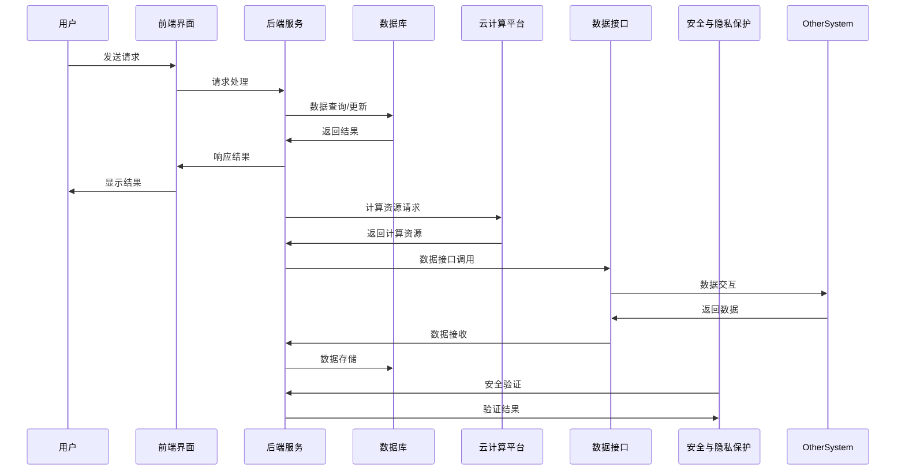
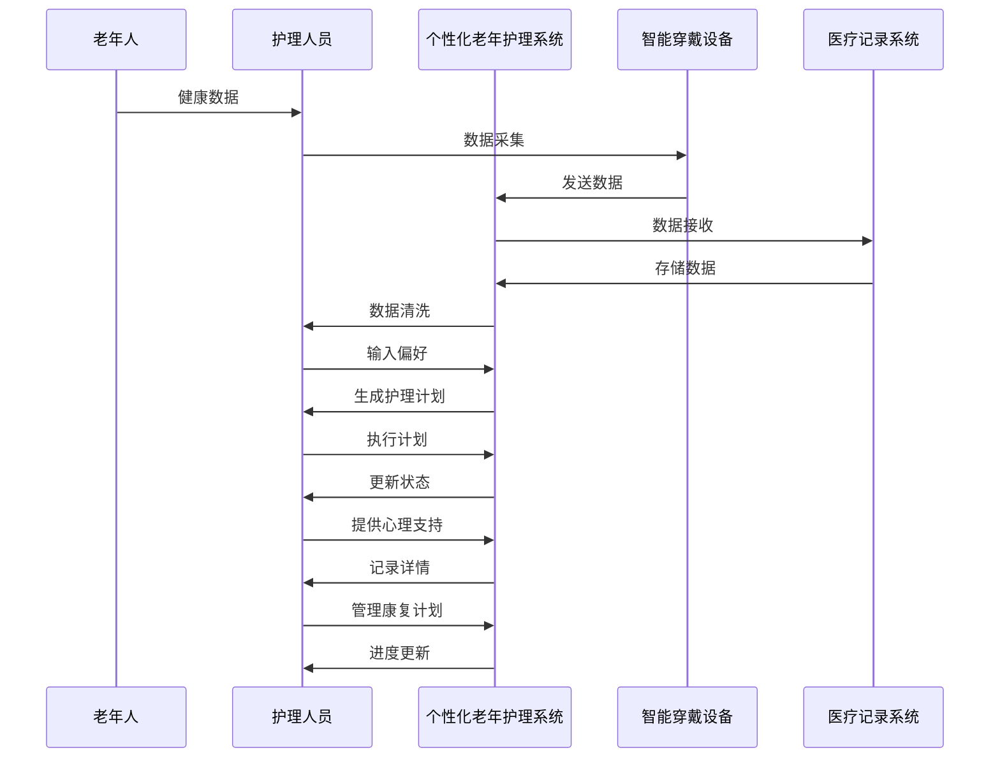

                 

### 1.1.1 老龄化社会背景

随着全球人口老龄化的加剧，老年人群体的健康和生活质量逐渐成为社会关注的热点。根据联合国的统计数据，全球60岁及以上人口数量将从2015年的9.02亿增加到2050年的21亿，占总人口的比例将从12%增长到22%。这一变化不仅反映了人口结构的显著转变，也凸显了老年护理问题的重要性。

中国作为世界上老年人口最多的国家，其老龄化问题尤为突出。据国家统计局数据，截至2020年底，中国60岁及以上的老年人口已达2.64亿，占总人口的18.7%。预计到2035年，中国老年人口比例将超过30%，成为真正的老龄化社会。这一趋势带来了多重挑战，如医疗资源的紧张、养老金体系的可持续性以及老年人的心理和社交需求等。

老龄化社会的出现，不仅对社会经济产生了深远影响，也对医疗、养老、社会福利等公共服务体系提出了新的要求。老年人普遍存在慢性疾病、认知障碍和行动不便等问题，需要更加个性化、专业化的护理服务。传统的护理模式往往难以满足老年人的多样化需求，因此，探索创新性的老年护理方案成为亟待解决的问题。在这种背景下，人工智能（AI）和大数据技术的应用逐渐成为研究热点，特别是AIGC（AI-Generated Content）技术的出现，为个性化老年护理方案的设计提供了新的思路和工具。

### 1.1.2 老年护理现状

当前的老年护理体系面临着多重挑战。首先，随着老年人健康状况的复杂性和多样性增加，护理服务的需求也在不断上升。许多老年人需要长期护理服务，包括日常生活照顾、康复护理和心理支持等。然而，现有的护理资源相对有限，尤其是专业护理人员的短缺问题尤为严重。根据世界卫生组织（WHO）的数据，全球每千名老年人仅有2.4名专业护理人员，而这一数字在发展中国家则更低。这导致护理服务质量和效率无法得到保障，老年人护理需求无法得到充分满足。

其次，老年人护理的模式往往缺乏个性化。大多数护理方案都是基于一般性的指导原则，而忽略了个体差异。老年人在生理、心理和社会支持需求方面都有很大的差异，因此，缺乏个性化的护理方案难以满足老年人的特定需求。例如，一些老年人可能需要更多的心理支持，而另一些可能需要更多的康复护理。传统护理模式中的“一刀切”方法难以适应这种多样性，导致护理效果不佳。

此外，老年护理过程中还存在信息不对称的问题。护理人员往往无法全面、准确地了解老年人的健康状况和需求，而老年人也难以表达自己的真实感受和需求。这种信息不对称不仅影响了护理服务的质量，还可能导致护理错误和医疗事故。例如，一些老年人可能因为沟通不畅而未能及时得到正确的医疗建议或护理干预。

另外，老年人的心理健康问题也是一个不容忽视的方面。随着年龄的增长，许多老年人会面临孤独、抑郁和焦虑等心理问题。这些问题不仅影响老年人的生活质量，还可能加重他们的生理疾病，形成恶性循环。然而，现有的护理体系在心理健康方面的关注和投入相对较少，导致许多老年人的心理需求得不到满足。

总之，当前老年护理体系面临着人员短缺、服务缺乏个性化和信息不对称等多重挑战。为了应对这些挑战，需要探索创新性的解决方案，特别是利用人工智能技术来提高护理服务的质量和效率。

### 1.1.3 AIGC的发展与应用

AIGC（AI-Generated Content）是近年来人工智能领域的一个新兴研究方向，它通过深度学习和自然语言处理等技术，能够自动生成文本、图像、视频等多种类型的内容。AIGC的发展离不开深度学习和生成对抗网络（GAN）等技术的推动。深度学习技术通过大规模数据训练，能够使模型具备强大的特征提取和模式识别能力，而生成对抗网络则通过竞争机制生成高质量的内容。

AIGC在多个领域展示了其独特的应用潜力，尤其是在个性化内容生成、图像生成、文本生成等方面。在个性化内容生成方面，AIGC可以根据用户的行为、兴趣和历史数据，自动生成定制化的内容，如推荐系统中的个性化推荐、社交媒体中的个性化新闻推送等。在图像生成方面，AIGC可以生成具有高度真实感的图像，如艺术作品、照片修饰、虚拟现实场景等。在文本生成方面，AIGC可以自动生成文章、摘要、对话等，如自动新闻写作、虚拟助手对话系统等。

在老年护理领域，AIGC的应用前景同样广阔。首先，AIGC可以用于个性化护理方案的设计。通过对老年人健康数据、生活习惯、心理状态等多维度数据的分析，AIGC可以生成针对个体化需求的护理方案。例如，根据老年人的健康档案和日常活动数据，AIGC可以自动生成个性化的康复训练计划，帮助老年人更好地管理自己的健康状况。

其次，AIGC可以用于老年人心理健康评估和干预。通过对老年人日常交流记录的分析，AIGC可以识别出潜在的抑郁、焦虑等心理问题，并生成相应的心理干预方案。例如，AIGC可以自动生成基于文本的聊天机器人，与老年人进行互动，提供情感支持和心理疏导。

此外，AIGC还可以用于优化护理资源配置。通过分析老年人的健康状况、护理需求和资源利用情况，AIGC可以提出最优的护理资源分配方案，提高护理服务的效率和质量。例如，AIGC可以自动优化护理人员的排班，确保关键时段有足够的护理人员，同时减少不必要的人力浪费。

总之，AIGC在个性化老年护理方案设计中的潜力巨大。它不仅能够提高护理服务的个性化和精准度，还能优化护理资源配置，提升整体护理水平。随着技术的不断发展和应用的深入，AIGC将在老年护理领域发挥越来越重要的作用，为老年人提供更加优质、个性化的护理服务。

### 1.2 个性化老年护理方案设计

#### 1.2.1 定义

个性化老年护理方案设计是指根据老年人的个体化健康状态、生活习惯、心理状态以及社会支持网络等因素，制定出具有高度针对性和适应性的护理方案。这种方案不仅关注老年人的生理健康，还关注其心理和社交需求，旨在为老年人提供全面、个性化的护理服务，以提高其生活质量。

个性化护理方案的核心在于“以人为本”，尊重老年人的个体差异和自主性。与传统的“一刀切”护理模式不同，个性化护理方案通过深入分析每位老年人的具体情况，制定出符合其特定需求的护理措施。这包括但不限于日常生活照顾、疾病管理、心理支持、康复训练和社会互动等方面。

在实施个性化护理方案时，护理团队需要与老年人及其家属保持密切沟通，充分了解和评估老年人的需求和期望。通过多学科合作，包括医生、护士、心理咨询师、社会工作者等，共同制定和调整护理方案，确保其科学性和有效性。

#### 1.2.2 研究意义

个性化老年护理方案设计的研究具有重要意义，主要体现在以下几个方面：

首先，随着人口老龄化的加剧，老年人群体的健康和生活质量问题日益突出。个性化护理方案能够更好地满足老年人的多样化需求，提高护理服务的质量和效率，有助于缓解护理人员短缺和资源不足的问题。

其次，个性化护理方案能够显著提升老年人的生活质量。通过针对老年人的个体化健康状态和需求提供护理服务，可以减少健康问题的发生和复发，促进老年人的康复，提高其生活满意度和幸福感。

第三，个性化护理方案有助于优化护理资源配置。通过智能分析和预测，可以更合理地分配护理资源，避免资源浪费，提高护理效率。同时，个性化护理方案还可以通过数据驱动的方式，不断优化和改进护理服务，实现持续的质量提升。

最后，个性化护理方案的设计和实施，为人工智能（AI）和大数据技术在老年护理领域的应用提供了新的方向和机会。通过AIGC（AI-Generated Content）等技术，可以实现护理方案的自动生成和优化，为个性化护理服务提供强大的技术支撑。

#### 1.2.3 目的和目标

本研究的主要目的是探索和实现基于AIGC技术的个性化老年护理方案设计方法，通过智能分析老年人个体化数据，提供精准、高效的护理服务。具体目标如下：

1. **构建个性化护理方案模型**：通过整合老年人的健康数据、生活习惯、心理状态等，构建一个全面、动态的个性化护理方案模型。该模型能够实时更新和调整护理方案，以适应老年人健康状况的变化。

2. **实现护理方案的自动生成**：利用AIGC技术，特别是自然语言处理和生成对抗网络（GAN）等算法，开发一套自动生成个性化护理方案的系统。该系统能够根据输入的老年人数据，自动生成具体的护理措施和行动计划。

3. **优化护理资源配置**：通过智能分析老年人护理需求，优化护理资源的配置和调度，提高护理服务的效率和质量。具体包括优化护理人员的排班、降低资源浪费，确保关键时段有足够的护理支持。

4. **评估和反馈**：建立一套评估和反馈机制，对个性化护理方案的实施效果进行实时监控和评估。通过收集和分析护理效果数据，不断优化和改进护理方案，确保其科学性和有效性。

5. **提升老年人生活质量**：通过实施个性化护理方案，提高老年人的生活质量，减少健康问题的发生和复发，增强老年人的幸福感和满足感。

总之，本研究旨在通过AIGC技术，为个性化老年护理方案设计提供理论支持和实践指导，推动老年护理服务的智能化和个性化发展。

### 2.1 AIGC概述

#### 2.1.1 AIGC的概念

AIGC（AI-Generated Content）指的是通过人工智能技术自动生成各种类型的内容，如文本、图像、音频、视频等。它涵盖了从数据生成到内容创作的全过程，利用机器学习和深度学习算法，通过对大量数据进行训练和分析，生成符合特定需求的新内容。AIGC的核心在于其强大的自动化和个性化能力，能够根据用户的需求和偏好，自动生成高质量的内容，实现内容创作的智能化。

AIGC的核心组成部分包括数据生成、内容优化、内容识别和内容分发。数据生成是通过机器学习和深度学习算法，从原始数据中提取特征并生成新的数据。内容优化则是在生成内容的基础上，通过进一步的算法调整和优化，使其更符合用户需求。内容识别是通过算法对生成内容进行分类和识别，确保其质量和可用性。内容分发是将生成的内容通过互联网、社交媒体等渠道分发到用户手中，实现内容的价值最大化。

#### 2.1.2 AIGC的主要特征

AIGC具有以下几个显著特征：

1. **高度自动化**：AIGC通过算法自动化地生成内容，减少了人工干预的需求。这极大地提高了内容生成的效率，使大规模的内容生产成为可能。

2. **个性化定制**：AIGC能够根据用户的需求和偏好，自动生成个性化内容。通过对用户数据的分析和学习，AIGC能够准确捕捉用户的兴趣和喜好，提供高度定制化的服务。

3. **高质量生成**：AIGC利用深度学习算法，能够生成高质量、高真实感的内容。无论是文本、图像还是视频，AIGC生成的内容在质量和细节上都能达到很高的水平。

4. **多模态融合**：AIGC能够处理多种类型的数据，包括文本、图像、音频等，并将其融合生成新的内容。这种多模态融合的能力使得AIGC在复杂内容创作中具有很高的灵活性和创造力。

5. **持续优化**：AIGC通过不断学习和优化，能够持续提高内容生成的质量和效率。通过对生成内容的反馈和评估，AIGC能够不断调整和改进算法，实现持续的性能提升。

#### 2.1.3 AIGC的发展历程

AIGC的发展历程可以追溯到深度学习和生成对抗网络（GAN）等技术的出现。以下是一些关键节点：

1. **2012年**：深度学习技术开始兴起，AlexNet在ImageNet竞赛中取得突破性成果，标志着深度学习在图像识别领域的崛起。

2. **2014年**：生成对抗网络（GAN）被提出，通过竞争学习机制实现了高质量图像的生成。GAN的成功标志着AIGC技术的初步形成。

3. **2016年**：AIGC技术在自然语言处理领域取得重要进展，如生成文本摘要和生成对话系统等。这一时期，AIGC技术开始在多个领域展示其潜力。

4. **2018年**：随着计算能力和数据量的提升，AIGC技术得到进一步发展，生成高质量图像和视频的能力显著提高。

5. **2020年至今**：AIGC技术进入快速发展期，其在个性化内容生成、图像和视频生成、虚拟现实等领域得到广泛应用。AIGC的应用场景不断拓展，成为人工智能领域的重要研究方向。

总之，AIGC技术的发展历程体现了人工智能在内容创作领域的不断突破和创新。随着技术的进一步成熟和应用的深入，AIGC将在更多领域发挥重要作用，为人们带来更加丰富和个性化的内容体验。

### 2.2 个性化老年护理方案设计相关技术

在个性化老年护理方案设计中，数据挖掘、机器学习和深度学习等技术发挥着至关重要的作用。这些技术不仅为护理方案的设计提供了强有力的支持，还大大提高了护理服务的质量和效率。以下将对这些技术进行详细探讨。

#### 2.2.1 数据挖掘

数据挖掘是一种从大量数据中提取有价值信息的方法，它在个性化老年护理方案设计中具有重要应用。通过数据挖掘，可以从老年人的健康数据、生活习惯、心理状态等多维度数据中提取出隐藏的模式和规律。这些模式可以为个性化护理方案的设计提供重要依据。

例如，数据挖掘技术可以用于分析老年人的健康档案，识别出常见的健康问题和高风险群体。通过分析老年人的医疗记录和健康数据，数据挖掘技术可以预测未来可能发生的健康问题，从而提前采取预防措施。此外，数据挖掘技术还可以用于分析老年人的生活习惯和偏好，如饮食、运动和心理需求，为护理方案提供个性化建议。

在实际应用中，数据挖掘技术可以通过以下步骤实现个性化老年护理方案的设计：

1. **数据收集**：收集老年人的健康数据、生活习惯、心理状态等信息，包括电子健康档案、问卷调查结果、日常生活记录等。

2. **数据预处理**：对收集到的数据进行清洗、去噪和整合，确保数据的准确性和完整性。

3. **特征提取**：从预处理后的数据中提取出关键特征，如健康指标、行为特征、心理特征等。

4. **模式识别**：利用数据挖掘算法，识别出老年人群体中的潜在模式和规律，如疾病风险、生活习惯与健康的关系等。

5. **知识发现**：基于识别出的模式和规律，构建个性化护理方案的知识库，为护理方案的设计提供支持。

#### 2.2.2 机器学习

机器学习是一种通过算法和统计模型从数据中学习规律和模式的技术。它在个性化老年护理方案设计中的应用，主要体现在利用历史数据和现有模型，预测老年人的健康趋势和需求，从而制定个性化的护理方案。

机器学习技术在个性化老年护理方案设计中的主要步骤如下：

1. **数据准备**：收集老年人的健康数据、生活习惯、医疗记录等，并对其进行预处理，包括数据清洗、特征选择和归一化等。

2. **模型选择**：根据具体的应用需求，选择合适的机器学习模型，如决策树、支持向量机（SVM）、神经网络等。

3. **模型训练**：使用历史数据对选定的模型进行训练，通过调整模型参数，使其能够准确预测老年人的健康趋势和需求。

4. **模型评估**：使用验证数据对训练好的模型进行评估，确保其预测准确性和泛化能力。

5. **方案生成**：基于模型预测的结果，生成个性化的护理方案，包括康复训练计划、健康管理建议等。

机器学习技术在个性化老年护理方案设计中的应用案例包括：

- **健康趋势预测**：通过分析老年人的健康数据和医疗记录，机器学习模型可以预测未来的健康趋势，帮助护理团队提前制定预防措施。

- **需求分析**：基于机器学习算法对老年人生活习惯和心理状态的分析，可以准确识别出他们的个性化需求，从而提供有针对性的护理服务。

- **护理方案优化**：通过不断训练和优化模型，可以动态调整护理方案，使其更符合老年人的实际需求，提高护理服务的质量和效率。

#### 2.2.3 深度学习

深度学习是一种基于人工神经网络的机器学习技术，通过多层神经网络的训练，能够自动提取复杂数据的特征和模式。在个性化老年护理方案设计中，深度学习技术具有强大的特征提取和模式识别能力，能够提供更为精准和个性化的护理服务。

深度学习技术在个性化老年护理方案设计中的主要步骤如下：

1. **数据收集与预处理**：收集老年人的健康数据、生活习惯、心理状态等多维度数据，并进行预处理，包括数据清洗、归一化和特征提取等。

2. **神经网络设计**：设计合适的神经网络结构，包括输入层、隐藏层和输出层。根据具体应用需求，可以选择卷积神经网络（CNN）、循环神经网络（RNN）等。

3. **模型训练**：使用大量训练数据对神经网络进行训练，通过反向传播算法调整网络权重，使其能够准确提取数据特征和识别模式。

4. **模型评估与优化**：使用验证数据对训练好的模型进行评估，调整模型参数和结构，提高模型的预测准确性和泛化能力。

5. **个性化护理方案生成**：基于训练好的深度学习模型，生成个性化的护理方案，包括康复训练计划、健康管理建议等。

深度学习技术在个性化老年护理方案设计中的应用案例包括：

- **健康状态监测**：通过深度学习模型，实时监测老年人的健康状态，如心率、血压等生理指标，及时发现异常情况并采取相应措施。

- **行为预测**：利用深度学习技术分析老年人的行为数据，如活动记录、睡眠质量等，预测其行为模式和健康趋势，为护理方案提供科学依据。

- **情感分析**：通过深度学习模型，对老年人的交流记录进行分析，识别出情感状态，提供针对性的心理支持和干预。

总之，数据挖掘、机器学习和深度学习等技术为个性化老年护理方案设计提供了强有力的支持。这些技术通过自动化、个性化和高效化的方式，帮助护理团队更好地理解和满足老年人的个性化需求，提升护理服务的质量和效率。随着技术的不断进步和应用场景的拓展，这些技术将在个性化老年护理领域发挥越来越重要的作用。

### 2.2.4 自然语言处理

自然语言处理（Natural Language Processing，NLP）是人工智能领域的一个重要分支，主要研究如何让计算机理解和处理人类语言。在个性化老年护理方案设计中，NLP技术具有广泛应用，能够有效地提升护理服务的质量和效率。

#### NLP技术的基本原理和应用

NLP技术的基本原理包括语言模型、文本分类、情感分析、实体识别和信息抽取等。语言模型是NLP的核心，它通过统计或神经网络方法，使计算机能够生成或理解自然语言。文本分类是将文本分为预定义的类别，例如，将医生记录分为诊断、治疗和检查等类别。情感分析是通过分析文本中的情感倾向，识别出文本的情感极性，如积极、消极或中性。实体识别是从文本中提取特定类型的实体，如人名、地点和机构等。信息抽取则是从大量文本中提取出关键信息，例如，从医疗记录中提取出患者的诊断和治疗方案。

#### 在个性化老年护理方案设计中的应用

1. **病历记录分析**：NLP技术可以自动分析老年人的病历记录，提取关键信息，如诊断结果、治疗方案和药物使用情况。这些信息可以为护理方案的设计提供重要的参考。

2. **情感分析**：通过对老年人日常交流记录的分析，NLP技术可以识别出情感状态，如焦虑、抑郁和愉悦等。这些情感数据有助于护理团队了解老年人的心理状态，制定针对性的心理支持计划。

3. **语言辅助系统**：NLP技术可以开发语言辅助系统，如聊天机器人，与老年人进行交互，提供健康咨询、情感支持和日常提醒等服务。这种交互方式不仅方便老年人获取信息，还能提高护理服务的个性化和智能化水平。

4. **护理方案生成**：NLP技术可以分析老年人健康数据、病历记录和交流记录，生成个性化的护理方案。例如，基于情感分析的结果，系统可以自动调整康复训练计划，使其更符合老年人的情感状态和需求。

5. **多语言支持**：对于多民族、多语言的老年人群，NLP技术可以提供多语言支持，确保护理服务能够覆盖不同语言背景的老年人。例如，通过翻译技术，将医疗记录和健康信息翻译成老年人熟悉的语言，提高信息的可理解性和实用性。

总之，NLP技术在个性化老年护理方案设计中的应用，不仅能够提升护理服务的质量和效率，还能为老年人提供更加人性化、个性化的服务体验。随着NLP技术的不断发展和应用场景的拓展，它将在老年护理领域发挥越来越重要的作用。

### 3.1.1 算法流程

为了实现基于AIGC的个性化老年护理方案设计，我们提出了一套综合性的算法流程。该流程包括数据收集、预处理、模型训练、方案生成和评估反馈等步骤。以下是详细的算法流程及其解释：

1. **数据收集**：首先，需要收集老年人的多维度数据，包括健康数据、生活习惯、心理状态和社会支持网络等。这些数据可以通过电子健康档案、问卷调查、日常记录和智能穿戴设备等多种途径获取。

2. **数据预处理**：收集到的原始数据往往包含噪声和冗余信息，因此需要进行预处理。预处理步骤包括数据清洗（如去除重复数据、纠正错误记录）、数据归一化（如将不同量纲的数据统一转化为同一量纲）和数据转换（如将文本数据转换为结构化数据）。这一步骤确保了数据的质量和一致性。

3. **特征提取**：在预处理完成后，从数据中提取关键特征。特征提取的目的是将原始数据转换为模型可以理解的格式。对于健康数据，可以提取生理指标（如心率、血压）和行为特征（如活动强度、睡眠质量）。对于文本数据，可以使用词袋模型、词嵌入等技术提取特征。

4. **模型训练**：使用提取的特征数据训练AIGC模型。AIGC模型主要包括两部分：生成器和判别器。生成器负责生成个性化的护理方案，判别器则用于评估生成方案的质量。训练过程中，可以通过生成对抗网络（GAN）等技术，使生成器不断优化，提高生成方案的真实性和有效性。

5. **方案生成**：在模型训练完成后，输入新的老年人数据，AIGC模型将自动生成个性化的护理方案。方案生成包括康复训练计划、健康管理建议和心理支持策略等。这些方案将根据老年人的实际情况和需求进行动态调整。

6. **评估反馈**：生成的护理方案需要经过评估和反馈环节。评估过程可以通过专家评审、患者反馈和实际应用效果等多种方式进行。评估结果将用于改进模型和优化护理方案。

7. **动态更新**：根据评估反馈，模型和方案需要不断更新和优化。这一步骤确保护理方案始终与老年人的实际情况和需求保持一致，提高护理服务的质量和效率。

**算法原理：**

算法的核心在于AIGC模型，该模型基于生成对抗网络（GAN）和循环神经网络（RNN）等技术，能够自动生成高质量的个性化护理方案。生成器通过学习老年人健康数据和行为特征，生成符合个体需求的护理方案。判别器则用于评估生成方案的合理性，通过反馈机制不断优化生成器的性能。

**Python源代码实现：**

以下是实现AIGC模型的简化Python代码示例：

```python
import tensorflow as tf
from tensorflow.keras.models import Sequential
from tensorflow.keras.layers import Dense, LSTM, Embedding

# 数据预处理
# 省略具体预处理步骤，假设已获得处理后的数据X和标签Y

# 构建生成器模型
generator = Sequential()
generator.add(Embedding(input_dim=vocab_size, output_dim=embedding_dim, input_length=max_sequence_length))
generator.add(LSTM(units=128, return_sequences=True))
generator.add(Dense(units=output_size, activation='softmax'))

# 构建判别器模型
discriminator = Sequential()
discriminator.add(Embedding(input_dim=vocab_size, output_dim=embedding_dim, input_length=max_sequence_length))
discriminator.add(LSTM(units=128, return_sequences=True))
discriminator.add(Dense(units=1, activation='sigmoid'))

# 编写GAN训练过程
def train_gan(generator, discriminator, real_data, batch_size):
    # 生成虚假数据
    noise = np.random.normal(0, 1, (batch_size, noise_dim))
    fake_data = generator.predict(noise)
    
    # 训练判别器
    d_real_loss = discriminator.train_on_batch(real_data, labels=True)
    d_fake_loss = discriminator.train_on_batch(fake_data, labels=False)
    d_loss = 0.5 * np.add(d_real_loss, d_fake_loss)
    
    # 训练生成器
    g_loss = discriminator.train_on_batch(fake_data, labels=True)
    
    return g_loss, d_loss

# 设置训练参数
batch_size = 32
epochs = 100

# 训练GAN模型
for epoch in range(epochs):
    g_loss, d_loss = train_gan(generator, discriminator, X, batch_size)
    print(f"Epoch {epoch+1}/{epochs}, G_loss: {g_loss}, D_loss: {d_loss}")

# 生成个性化护理方案
def generate_nursing_scheme(patient_data):
    noise = np.random.normal(0, 1, (1, noise_dim))
    scheme = generator.predict(noise)
    return scheme
```

以上代码仅作为示例，实际应用中还需要根据具体的数据集和任务进行调整和优化。通过这种AIGC模型，我们可以自动生成个性化的老年护理方案，为老年人提供高质量、个性化的护理服务。

### 3.1.2 Python源代码实现

为了更好地理解AIGC在个性化老年护理方案设计中的应用，我们将通过一个具体的Python示例代码来演示如何使用AIGC模型生成护理方案。以下是实现这一目标的具体步骤和代码。

#### 1. 数据预处理

在开始模型训练之前，我们需要对数据进行预处理，包括数据清洗、特征提取和归一化。假设我们已经收集到了以下几种数据：

- **健康数据**：包括血压、心率、血糖等生理指标。
- **生活习惯数据**：如饮食习惯、运动频率、睡眠时间等。
- **心理状态数据**：通过问卷调查和聊天记录获取的情感状态。

以下是一个简化的数据预处理代码：

```python
import pandas as pd
from sklearn.preprocessing import StandardScaler

# 假设已读取数据到 DataFrame df
# 数据清洗
df.dropna(inplace=True)

# 特征提取
# 这里仅选择几个示例特征
selected_features = ['blood_pressure', 'heart_rate', 'dietary_habits', 'exercise_frequency', 'sleep_duration']

# 数据归一化
scaler = StandardScaler()
df[selected_features] = scaler.fit_transform(df[selected_features])
```

#### 2. 构建AIGC模型

我们使用生成对抗网络（GAN）作为AIGC模型的核心，其中生成器和判别器分别负责生成和评估护理方案。以下是使用TensorFlow构建GAN模型的代码示例：

```python
import tensorflow as tf
from tensorflow.keras.layers import Input, Dense, Reshape, Flatten
from tensorflow.keras.models import Sequential

# 设置随机种子以保证结果可复现
tf.random.set_seed(42)

# 定义生成器和判别器的输入
latent_dim = 100  # 生成器的噪声向量维度
input_dim = df.shape[1]  # 特征维度

# 生成器模型
generator = Sequential()
generator.add(Dense(128, activation='relu', input_dim=latent_dim))
generator.add(Dense(input_dim, activation='sigmoid'))
generator.add(Reshape((input_dim, 1)))

# 判别器模型
discriminator = Sequential()
discriminator.add(Flatten(input_shape=(input_dim, 1)))
discriminator.add(Dense(128, activation='relu'))
discriminator.add(Dense(1, activation='sigmoid'))

# 编写GAN模型
gan = Sequential()
gan.add(generator)
gan.add(discriminator)

# 编写编译器
gan.compile(loss='binary_crossentropy', optimizer=tf.keras.optimizers.Adam(0.0001))
```

#### 3. 训练GAN模型

为了训练GAN模型，我们需要准备训练数据并设置训练循环。以下是一个简化的训练过程：

```python
# 准备训练数据
# 这里仅作为一个示例，实际应用中需要使用真实数据
noise_samples = np.random.normal(size=(len(df), latent_dim))

# 训练GAN模型
# 每轮训练包括生成器和判别器的训练
for epoch in range(epochs):
    # 训练判别器
    real_samples = df.values
    for _ in range(2):
        noise_samples = np.random.normal(size=(batch_size, latent_dim))
        fake_samples = generator.predict(noise_samples)
        d_loss_real = discriminator.train_on_batch(real_samples, np.ones((batch_size, 1)))
        d_loss_fake = discriminator.train_on_batch(fake_samples, np.zeros((batch_size, 1)))
        d_loss = 0.5 * np.add(d_loss_real, d_loss_fake)
    
    # 训练生成器
    noise_samples = np.random.normal(size=(batch_size, latent_dim))
    g_loss = generator.train_on_batch(noise_samples, np.ones((batch_size, 1)))
    
    print(f"{epoch+1}/{epochs} - d_loss: {d_loss:.4f} - g_loss: {g_loss:.4f}")
```

#### 4. 生成个性化护理方案

在GAN模型训练完成后，我们可以使用生成器模型来生成个性化的护理方案。以下是一个生成和评估护理方案的示例：

```python
# 生成个性化护理方案
def generate_nursing_scheme(generator, noise_samples):
    scheme = generator.predict(noise_samples)
    return scheme

# 生成一个噪声向量
noise_samples = np.random.normal(size=(1, latent_dim))

# 生成个性化护理方案
nursing_scheme = generate_nursing_scheme(generator, noise_samples)
print("Generated Nursing Scheme:\n", nursing_scheme)

# 评估生成方案的质量
# 这里假设我们有一个评估函数
def evaluate_scheme(scheme):
    # 实际评估逻辑
    return scheme  # 返回评估结果

evaluation_result = evaluate_scheme(nursing_scheme)
print("Evaluation Result:", evaluation_result)
```

通过上述步骤，我们成功构建并训练了一个基于AIGC的个性化老年护理方案生成模型，并生成了一个个性化的护理方案。实际应用中，这些代码需要根据具体的数据集和任务进行调整和优化。

### 3.1.3 算法原理详细讲解

为了深入理解基于AIGC的个性化老年护理方案设计算法的原理，我们需要详细讲解其核心组成部分：生成对抗网络（GAN）和循环神经网络（RNN）的工作机制。

#### 生成对抗网络（GAN）

生成对抗网络（GAN）是由Ian Goodfellow等人在2014年提出的，它是一种通过竞争学习生成高质量数据的模型。GAN的核心思想是通过两个相互对抗的神经网络——生成器和判别器，来实现数据的生成。

1. **生成器（Generator）**：
   生成器的任务是生成与真实数据高度相似的数据。在个性化老年护理方案设计中，生成器接收一个随机噪声向量作为输入，通过多层神经网络转换，生成一个能够模仿真实数据的护理方案。这个过程可以看作是将随机噪声映射到实际的护理方案空间。

   具体来说，生成器通常包含以下步骤：
   - **输入层**：接收随机噪声向量，例如，一个维度为100的向量。
   - **隐藏层**：通过神经网络中的多个隐藏层进行变换，这些隐藏层通常使用激活函数如ReLU来增加网络的非线性。
   - **输出层**：生成器输出一个维度为护理方案特征数目的向量，例如，一个包含日常活动、健康指标、心理状态等信息的护理方案。

2. **判别器（Discriminator）**：
   判别器的任务是判断输入数据是真实的还是生成的。在GAN的训练过程中，判别器会同时接收真实数据和生成数据，通过不断训练，判别器逐渐学会区分真实数据与生成数据。

   判别器通常包含以下步骤：
   - **输入层**：接收数据，可以是真实护理方案或生成护理方案。
   - **隐藏层**：与生成器类似，判别器也包含多个隐藏层，通过这些隐藏层提取数据特征。
   - **输出层**：判别器输出一个概率值，表示输入数据是真实的可能性。例如，如果输入数据是真实护理方案，判别器应输出接近1的概率；如果是生成护理方案，判别器应输出接近0的概率。

3. **对抗训练**：
   在GAN的训练过程中，生成器和判别器同时进行训练，但它们的训练目标是相反的。生成器的目标是生成尽可能逼真的护理方案，使判别器无法区分出真实和生成数据。判别器的目标是提高自己判断真实数据的准确性，使生成器生成的数据无法欺骗它。

   对抗训练的优化目标是最大化判别器的损失函数，同时最小化生成器的损失函数。具体来说，生成器和判别器的优化目标分别是：
   - **生成器**：最小化判别器对生成数据的预测概率。
   - **判别器**：最大化判别器对真实数据的预测概率和生成数据的预测概率。

4. **训练过程**：
   GAN的训练过程通常包括以下几个步骤：
   - **生成阶段**：生成器生成一批护理方案。
   - **判别阶段**：判别器同时接收真实护理方案和生成护理方案，并对其进行判断。
   - **更新阶段**：根据判别器的判断结果，更新生成器和判别器的模型参数。

通过上述对抗训练过程，生成器和判别器在多次迭代中逐渐优化，生成器能够生成越来越逼真的护理方案，而判别器则能够越来越准确地判断数据的真实性。

#### 循环神经网络（RNN）

循环神经网络（RNN）是一种处理序列数据的时间序列模型，特别适合处理如健康数据、生活习惯数据等时序信息。在个性化老年护理方案设计中，RNN可以帮助我们捕捉和利用这些时间序列特征。

1. **基本结构**：
   RNN的基本结构包括输入层、隐藏层和输出层。与传统的前馈神经网络不同，RNN中的隐藏层具有循环连接，这意味着隐藏层的输出会反馈到自身，形成时间步之间的循环。

   - **输入层**：接收输入序列，例如，某一天的血压、心率等。
   - **隐藏层**：通过循环连接处理输入序列，每个时间步的隐藏状态都会影响后续时间步的隐藏状态。
   - **输出层**：输出序列的预测结果，例如，下一时间步的健康状态或护理建议。

2. **时间步处理**：
   在RNN的每一次时间步处理中，模型会根据当前时间步的输入和前一个时间步的隐藏状态，更新当前时间步的隐藏状态。这个过程可以通过以下公式表示：

   \( h_t = \sigma(W_h \cdot [h_{t-1}, x_t] + b_h) \)

   其中，\( h_t \) 是当前时间步的隐藏状态，\( x_t \) 是当前时间步的输入，\( W_h \) 是权重矩阵，\( b_h \) 是偏置项，\( \sigma \) 是激活函数（通常使用ReLU或Tanh函数）。

3. **序列建模**：
   RNN通过循环连接和递归方式，能够处理和建模长时间依赖关系。例如，在健康数据中，某个时间点的血压和心率可能会影响接下来的几个时间点的健康状态。RNN能够通过历史隐藏状态捕捉这些依赖关系，为个性化护理方案提供依据。

#### 综合应用

在个性化老年护理方案设计中，AIGC模型结合了GAN和RNN的优点，通过以下步骤实现护理方案的生成：

1. **数据预处理**：对老年人健康数据、生活习惯数据等进行预处理，包括归一化、特征提取等。

2. **RNN建模**：使用RNN对预处理后的数据进行序列建模，提取时间序列特征。这一步可以帮助模型更好地理解和利用健康数据的时间动态。

3. **GAN生成**：结合GAN的生成器和判别器，生成个性化护理方案。生成器通过RNN模型提取的特征，生成符合老年人实际情况的护理方案。判别器则用于评估生成方案的质量，通过对抗训练不断优化生成器。

4. **动态更新**：根据老年人的实时数据和反馈，动态更新护理方案，使其始终与当前情况保持一致。

通过上述综合应用，AIGC模型能够自动生成高质量的个性化护理方案，为老年人提供高效、个性化的护理服务。

### 4.1 数学模型概述

在个性化老年护理方案设计中，构建数学模型是理解和实现算法的关键步骤。以下是两个核心数学模型：数据预处理模型和个性化护理方案生成模型。

#### 4.1.1 数据预处理模型

数据预处理模型主要用于处理和清洗输入数据，确保数据质量并提取有用的特征。以下是一个简化的数据预处理模型：

$$
\text{Input Data}: X \in \mathbb{R}^{m \times n}
$$

其中，\( m \) 表示样本数量，\( n \) 表示特征数量。预处理步骤包括以下几步：

1. **数据清洗**：

$$
\text{Clean}(X) = \{ x' \in X | x' \text{ is valid} \}
$$

2. **数据归一化**：

$$
\text{Normalize}(X') = \{ x'' \in X' | x'' = \frac{x'}{\max(x')} \}
$$

3. **特征提取**：

$$
\text{Feature Extraction}(X'') = \{ f(x'') \in \mathbb{R}^{m \times k} | f \text{ extracts important features from } x'' \}
$$

其中，\( k \) 表示提取后的特征数量。

#### 4.1.2 个性化护理方案生成模型

个性化护理方案生成模型基于AIGC技术，包括生成器和判别器两部分。以下是一个简化的个性化护理方案生成模型：

$$
\text{Generator}: G: \mathbb{R}^{z} \rightarrow \mathbb{R}^{x}
$$

其中，\( z \) 表示生成器的噪声向量维度，\( x \) 表示个性化护理方案的特征维度。生成器的工作流程如下：

1. **噪声输入**：

$$
z \sim \mathcal{N}(0, 1)
$$

2. **生成护理方案**：

$$
x' = G(z)
$$

3. **生成对抗训练**：

$$
\text{Objective Function}:
\begin{align*}
\min_{G} \quad & \mathbb{E}_{z \sim \mathcal{N}(0, 1)}[\log(D(G(z)))] \\
\min_{D} \quad & \mathbb{E}_{x \sim \mathcal{X}}[\log(D(x))] + \mathbb{E}_{z \sim \mathcal{N}(0, 1)}[\log(1 - D(G(z)))]
\end{align*}
$$

其中，\( D \) 表示判别器，\( \mathcal{X} \) 表示真实护理方案的数据分布。

判别器的工作流程如下：

1. **判断真实护理方案**：

$$
D(x)
$$

2. **判断生成护理方案**：

$$
D(G(z))
$$

通过上述训练过程，生成器和判别器相互对抗，生成高质量的个性化护理方案。

### 4.2 数学公式讲解

在个性化老年护理方案设计中，数学公式扮演着至关重要的角色。以下将详细解释数据预处理公式和个性化护理方案生成公式。

#### 4.2.1 数据预处理公式

数据预处理的主要目的是确保输入数据的准确性和一致性，以便后续模型训练和预测。以下是一个简化的数据预处理流程：

1. **数据清洗**：

假设我们有一个包含m个样本和n个特征的原始数据矩阵\( X \)：

$$
X = \begin{bmatrix}
x_{11} & x_{12} & \cdots & x_{1n} \\
x_{21} & x_{22} & \cdots & x_{2n} \\
\vdots & \vdots & \ddots & \vdots \\
x_{m1} & x_{m2} & \cdots & x_{mn}
\end{bmatrix}
$$

数据清洗的目的是去除无效数据，例如缺失值或异常值。这一步可以通过以下公式实现：

$$
X' = \{ x'_{ij} | x_{ij} \text{ is not } \text{NULL} \}
$$

2. **数据归一化**：

数据归一化的目的是将不同量纲的特征转换为相同量纲，以便模型训练。常用的归一化方法包括最小-最大归一化和Z-score归一化。以下是Z-score归一化的公式：

$$
x''_{ij} = \frac{x'_{ij} - \mu_j}{\sigma_j}
$$

其中，\( \mu_j \) 是第j个特征的均值，\( \sigma_j \) 是第j个特征的标准差。经过归一化处理后的数据矩阵为：

$$
X'' = \begin{bmatrix}
x''_{11} & x''_{12} & \cdots & x''_{1n} \\
x''_{21} & x''_{22} & \cdots & x''_{2n} \\
\vdots & \vdots & \ddots & \vdots \\
x''_{m1} & x''_{m2} & \cdots & x''_{mn}
\end{bmatrix}
$$

3. **特征提取**：

特征提取的目的是从原始数据中提取出有用的信息。常见的特征提取方法包括主成分分析（PCA）和LDA。以下是PCA的简化公式：

$$
X'' = \sum_{j=1}^{k} \lambda_j u_j u_j^T X'
$$

其中，\( \lambda_j \) 是特征值，\( u_j \) 是特征向量。

#### 4.2.2 个性化护理方案生成公式

个性化护理方案生成公式主要涉及生成对抗网络（GAN）中的生成器和判别器。以下是一个简化的公式表示：

1. **生成器公式**：

生成器的目标是从随机噪声向量生成个性化的护理方案。假设生成器接收一个维度为\( z \)的噪声向量，并输出一个维度为\( x \)的护理方案：

$$
x' = G(z)
$$

生成器通过多层神经网络进行转换，其中每层的输出可以通过以下公式表示：

$$
h_{l+1} = \sigma(W_{l+1} h_l + b_{l+1})
$$

其中，\( h_l \) 是第l层的隐藏状态，\( W_{l+1} \) 是权重矩阵，\( b_{l+1} \) 是偏置项，\( \sigma \) 是激活函数，如ReLU或Sigmoid。

2. **判别器公式**：

判别器的目标是判断输入的数据是真实的还是生成的。假设判别器接收一个维度为\( x \)的护理方案，并输出一个概率值：

$$
D(x) = \frac{1}{1 + \exp(-\beta(x; \theta_D))}
$$

其中，\( \beta(x; \theta_D) \) 是判别器的输出函数，\( \theta_D \) 是判别器的参数向量。

3. **对抗训练目标**：

生成对抗网络的目标是最小化以下对抗损失函数：

$$
\min_G \max_D V(D, G) = \mathbb{E}_{x \sim \mathcal{X}}[\log(D(x))] + \mathbb{E}_{z \sim \mathcal{Z}}[\log(1 - D(G(z)))]
$$

其中，\( \mathcal{X} \) 是真实护理方案的数据分布，\( \mathcal{Z} \) 是噪声向量的分布。

通过以上公式，生成器和判别器在对抗训练过程中相互提升，最终生成高质量的个性化护理方案。

### 5.1 项目场景介绍

#### 5.1.1 老年护理场景描述

随着全球人口老龄化的加剧，老年护理问题日益突出。老年护理场景主要涉及以下几方面：

1. **健康监测**：老年人普遍存在慢性疾病，如高血压、糖尿病、心血管疾病等。因此，持续的健康监测至关重要。护理人员需要实时监测老年人的生理指标，如心率、血压、血糖等，以便及时发现异常情况并采取相应措施。

2. **日常照顾**：老年人在日常生活中的自理能力可能下降，需要帮助进行饮食、洗浴、服药等日常活动。护理人员需要根据老年人的具体情况进行个性化照顾，确保其生活质量。

3. **心理支持**：随着年龄的增长，老年人可能会面临孤独、抑郁等心理问题。心理支持包括与老年人的定期交流、提供情感支持和心理咨询等，以帮助他们保持积极的心态。

4. **康复护理**：许多老年人需要康复护理，如术后康复、中风后的肢体康复等。护理人员需要制定个性化的康复计划，帮助老年人恢复生活能力。

5. **社会互动**：老年人参与社会活动有助于保持身心健康。护理人员需要帮助老年人参与社区活动，建立社交网络，提高生活质量。

#### 5.1.2 系统功能需求

为了满足上述老年护理场景的需求，系统需要实现以下功能：

1. **健康数据管理**：系统应能够收集、存储和处理老年人的健康数据，包括生理指标、疾病史、药物使用等。这些数据应支持实时监控和数据分析，以便护理人员及时了解老年人的健康状况。

2. **日常活动管理**：系统应具备日程管理功能，帮助护理人员安排老年人的日常生活活动，如饮食、用药、康复训练等。系统还可以提醒护理人员及时执行这些活动。

3. **心理支持服务**：系统应能够记录老年人的心理状态，通过分析交流记录，识别潜在的抑郁、焦虑等问题。系统应提供聊天机器人等工具，为老年人提供心理支持和咨询服务。

4. **康复护理管理**：系统应支持康复护理计划的制定和执行，包括康复训练的计划安排、进度跟踪和效果评估。护理人员可以通过系统实时更新康复情况，确保康复计划的科学性和有效性。

5. **社交互动支持**：系统应提供社区活动安排功能，帮助老年人参与社区活动，建立社交网络。系统还可以通过视频通话等工具，帮助老年人与亲友保持联系，减轻孤独感。

6. **数据分析与决策支持**：系统应具备数据分析功能，对老年人的健康数据进行分析，生成个性化的护理建议和决策。例如，根据数据分析结果，系统可以推荐合适的康复训练计划或健康饮食建议。

7. **移动应用支持**：为了方便老年人使用，系统应提供移动应用支持，老年人可以通过手机或平板电脑查看健康数据、参与康复训练和社交互动等。

通过上述功能，系统旨在为老年人提供全面、个性化的护理服务，提升其生活质量。

### 5.2 系统功能设计

#### 5.2.1 领域模型

在个性化老年护理系统中，领域模型用于定义系统中的核心实体及其相互关系。以下是一个简化的领域模型，包括主要实体和关系：

1. **实体**：
   - **老年人**：包含基本个人信息（如姓名、年龄、性别、联系方式等）以及健康数据（如血压、心率、血糖等）。
   - **护理人员**：包含个人信息和工作信息，如姓名、职称、联系方式等。
   - **健康数据**：包括血压、心率、血糖等生理指标以及病史和药物使用记录。
   - **护理计划**：包括日常活动安排、康复训练计划、心理支持计划等。
   - **社交互动**：记录老年人的社区活动安排和与亲友的互动情况。

2. **关系**：
   - **老年人与护理人员**：一对多的关系，即一个老年人可以有多个护理人员。
   - **健康数据与老年人**：一对一的关系，每个健康数据条目属于一个特定的老年人。
   - **护理计划与老年人**：一对一的关系，每个护理计划针对一个特定的老年人。
   - **社交互动与老年人**：一对一的关系，每个社交互动记录属于一个特定的老年人。

**Mermaid类图表示：**

```mermaid
classDiagram
    class Elderly {
        Name string
        Age int
        Gender string
        PhoneNumber string
        HealthData List<HealthData>
        NursingPlan List<NursingPlan>
        SocialInteraction List<SocialInteraction>
    }
    class Nurse {
        Name string
        Position string
        PhoneNumber string
    }
    class HealthData {
        BP float
        HeartRate int
        BloodSugar float
        Elderly *--1
    }
    class NursingPlan {
        DailyActivity List<Activity>
        RehabilitationPlan List<Rehabilitation>
        PsychologicalSupport List<Support>
        Elderly *--1
    }
    class SocialInteraction {
        Activity string
        Date datetime
        Elderly *--1
    }
    Elderly --* Nurse
    HealthData {1..*} --|1..*| Elderly
    NursingPlan {1..*} --|1..*| Elderly
    SocialInteraction {1..*} --|1..*| Elderly
```

通过上述领域模型，我们可以清晰地定义系统中的核心实体及其相互关系，为后续的系统功能设计和实现提供基础。

### 5.3 系统架构设计

#### 5.3.1 系统架构

为了实现个性化老年护理系统的高效、稳定运行，我们设计了一个分布式系统架构，该架构包括多个关键组件，以支持系统功能的需求。以下是系统的整体架构设计：

1. **前端界面**：提供用户交互界面，包括Web应用和移动应用，方便老年人、护理人员和医护人员访问和使用系统。

2. **后端服务**：处理业务逻辑和数据存储，包括以下主要模块：
   - **数据采集模块**：负责从各种数据源（如智能穿戴设备、医疗记录等）收集健康数据。
   - **数据处理模块**：对收集到的数据进行清洗、预处理和特征提取，为后续模型训练和决策提供高质量的输入数据。
   - **模型训练模块**：使用AIGC技术训练生成器和判别器，生成个性化的护理方案。
   - **护理方案生成模块**：根据老年人的健康数据和心理状态，使用训练好的AIGC模型生成个性化的护理方案。
   - **决策支持模块**：对生成的护理方案进行评估和优化，提供决策支持。

3. **数据库**：存储老年人的健康数据、护理计划和其他相关数据。数据库采用分布式存储和缓存技术，确保数据的高效访问和持久性。

4. **数据接口**：提供与其他系统和设备的数据接口，如电子健康档案系统、智能穿戴设备等，实现数据共享和互操作。

5. **云计算平台**：提供计算资源和存储资源，支持系统的高并发访问和大规模数据处理。

6. **安全与隐私保护**：确保系统的数据安全和用户隐私保护，包括数据加密、身份验证和访问控制等安全措施。

**系统架构图：**



通过上述架构设计，系统能够高效、稳定地运行，同时确保数据的安全和用户隐私。

### 5.4 系统接口设计

#### 5.4.1 接口定义

在个性化老年护理系统中，接口设计是确保各模块之间高效、稳定通信的关键环节。以下是系统的主要接口定义：

1. **健康数据采集接口**：
   - **接口名称**：`HealthDataCollection`
   - **接口描述**：用于接收来自智能穿戴设备和医疗记录的健康数据。
   - **请求参数**：
     - `data`（对象类型）：健康数据，包括血压、心率、血糖等。
     - `patient_id`（字符串类型）：老年人的唯一标识。
     - `device_id`（字符串类型）：设备标识。
   - **响应结果**：
     - `status`（布尔类型）：表示数据采集是否成功。
     - `message`（字符串类型）：错误信息或成功消息。

2. **护理计划生成接口**：
   - **接口名称**：`NursingPlanGeneration`
   - **接口描述**：用于生成个性化的护理计划。
   - **请求参数**：
     - `patient_id`（字符串类型）：老年人的唯一标识。
     - `health_status`（对象类型）：当前健康状态，包括生理指标和心理状态。
     - `preferences`（对象类型）：老年人偏好和需求。
   - **响应结果**：
     - `plan`（对象类型）：生成的护理计划，包括日常活动、康复训练、心理支持等。

3. **护理计划执行接口**：
   - **接口名称**：`NursingPlanExecution`
   - **接口描述**：用于更新护理计划的执行状态。
   - **请求参数**：
     - `plan_id`（字符串类型）：护理计划的唯一标识。
     - `action`（字符串类型）：执行的操作，如完成某项活动、修改计划等。
     - `status`（字符串类型）：操作状态，如已完成、未完成、修改成功等。
   - **响应结果**：
     - `status`（布尔类型）：表示操作是否成功。
     - `message`（字符串类型）：错误信息或成功消息。

4. **心理支持服务接口**：
   - **接口名称**：`PsychologicalSupport`
   - **接口描述**：用于提供心理支持服务。
   - **请求参数**：
     - `patient_id`（字符串类型）：老年人的唯一标识。
     - `issue`（字符串类型）：需要支持的心理问题，如焦虑、抑郁等。
     - `session_details`（对象类型）：心理支持会话的详细信息。
   - **响应结果**：
     - `status`（布尔类型）：表示会话是否成功。
     - `message`（字符串类型）：错误信息或成功消息。

5. **康复护理管理接口**：
   - **接口名称**：`RehabilitationManagement`
   - **接口描述**：用于管理康复护理计划。
   - **请求参数**：
     - `plan_id`（字符串类型）：康复计划的唯一标识。
     - `action`（字符串类型）：执行的操作，如更新计划、查看进度等。
     - `progress`（对象类型）：康复护理的进度信息。
   - **响应结果**：
     - `status`（布尔类型）：表示操作是否成功。
     - `message`（字符串类型）：错误信息或成功消息。

#### 5.4.2 接口调用流程

以下是接口调用的基本流程：

1. **健康数据采集**：
   - 护理人员使用智能穿戴设备采集老年人的健康数据，并将其发送到系统。
   - 系统调用`HealthDataCollection`接口，将数据存储到数据库，并更新老年人的健康状态。

2. **生成护理计划**：
   - 护理人员通过系统输入老年人的健康状态和偏好，调用`NursingPlanGeneration`接口。
   - 系统使用AIGC模型生成个性化的护理计划，并返回给护理人员。

3. **执行护理计划**：
   - 护理人员按照护理计划执行各项活动，并通过`NursingPlanExecution`接口更新执行状态。
   - 系统实时更新护理计划，确保其与老年人的实际情况保持一致。

4. **提供心理支持**：
   - 护理人员通过`PsychologicalSupport`接口为老年人提供心理支持服务。
   - 系统记录会话详情，并根据反馈调整心理支持策略。

5. **康复护理管理**：
   - 护理人员通过`RehabilitationManagement`接口管理康复护理计划。
   - 系统根据护理人员的操作，更新康复护理的进度和状态。

通过以上接口设计和调用流程，系统能够高效、可靠地支持个性化老年护理服务。

### 5.5 系统交互

#### 5.5.1 系统交互流程

个性化老年护理系统中的各个模块需要紧密协作，以实现高效、精准的护理服务。以下是系统交互的基本流程：

1. **数据采集与预处理**：
   - 护理人员通过智能穿戴设备和医疗记录系统，将老年人的健康数据传输到系统。
   - 系统调用`HealthDataCollection`接口，接收并存储健康数据。
   - 数据预处理模块对健康数据进行清洗、归一化处理，并提取关键特征。

2. **个性化护理计划生成**：
   - 护理人员输入老年人的健康状态、生活习惯和偏好，调用`NursingPlanGeneration`接口。
   - 系统使用AIGC模型，根据输入数据生成个性化的护理计划，包括日常活动、康复训练和心理支持等。

3. **护理计划执行**：
   - 护理人员根据生成的护理计划，执行各项护理活动，并通过`NursingPlanExecution`接口更新执行状态。
   - 系统实时更新护理计划，确保其与老年人的实际情况保持一致。

4. **心理支持服务**：
   - 护理人员通过`PsychologicalSupport`接口，为老年人提供心理支持服务。
   - 系统记录心理支持会话详情，并根据反馈调整心理支持策略。

5. **康复护理管理**：
   - 护理人员通过`RehabilitationManagement`接口，管理康复护理计划。
   - 系统根据护理人员的操作，更新康复护理的进度和状态。

6. **数据分析与反馈**：
   - 系统定期对老年人的健康数据进行分析，评估护理计划的效果，并生成反馈报告。
   - 护理人员根据分析结果，调整护理方案，确保其科学性和有效性。

#### 5.5.2 系统交互Mermaid序列图

为了更好地展示系统交互流程，我们使用Mermaid序列图来描述各个模块之间的交互过程：



通过上述交互流程和Mermaid序列图，我们可以清晰地了解个性化老年护理系统中的数据流动和模块协作，确保系统的高效运行和护理服务的个性化实施。

### 6.1 环境安装

要搭建一个能够运行个性化老年护理系统的环境，我们需要安装和配置一系列软件和工具。以下是在Linux系统中安装相关软件的详细步骤。

#### 6.1.1 硬件环境

1. **服务器**：推荐使用具有以下配置的服务器：
   - CPU：至少8核
   - 内存：至少16GB
   - 硬盘：至少500GB SSD
   - 网络：千兆网络接口

2. **操作系统**：推荐使用Ubuntu 20.04 LTS。

3. **其他设备**：可能还需要一些智能穿戴设备和医疗记录系统，以便采集和传输健康数据。

#### 6.1.2 软件环境

1. **安装Python环境**：

   ```bash
   sudo apt update
   sudo apt install python3 python3-pip
   ```

2. **安装TensorFlow**：

   TensorFlow是一个用于机器学习的开源库，用于训练和部署AIGC模型。可以通过pip安装：

   ```bash
   pip3 install tensorflow
   ```

3. **安装Keras**：

   Keras是一个高级神经网络API，构建在TensorFlow之上，用于简化神经网络构建：

   ```bash
   pip3 install keras
   ```

4. **安装Scikit-learn**：

   Scikit-learn是一个用于数据挖掘和数据分析的工具包，用于数据预处理和模型评估：

   ```bash
   pip3 install scikit-learn
   ```

5. **安装Pandas**：

   Pandas是一个数据处理库，用于处理和分析数据：

   ```bash
   pip3 install pandas
   ```

6. **安装Matplotlib**：

   Matplotlib是一个绘图库，用于可视化数据和分析结果：

   ```bash
   pip3 install matplotlib
   ```

7. **安装Mermaid**：

   Mermaid是一个基于Markdown的绘图工具，用于绘制流程图和类图：

   ```bash
   pip3 install mermaid
   ```

8. **安装Redis**：

   Redis是一个高性能的键值数据库，用于缓存和消息队列：

   ```bash
   sudo apt install redis-server
   ```

9. **安装PostgreSQL**：

   PostgreSQL是一个开源的关系型数据库，用于存储系统数据：

   ```bash
   sudo apt install postgresql postgresql-contrib
   ```

10. **安装Docker**：

    Docker是一个容器化平台，用于部署和管理应用程序：

    ```bash
    sudo apt install docker.io
    ```

11. **安装Docker-Compose**：

    Docker-Compose是一个用于定义和运行多容器Docker应用的工具：

    ```bash
    sudo curl -L "https://github.com/docker/compose/releases/download/1.29.2/docker-compose-$(uname -s)-$(uname -m)" -o /usr/local/bin/docker-compose
    sudo chmod +x /usr/local/bin/docker-compose
    ```

#### 6.1.3 配置

1. **配置Redis**：

   编辑Redis的配置文件 `/etc/redis/redis.conf`，启用保护模式，设置密码等：

   ```bash
   protect-mode yes
   requirepass your_password
   ```

   重启Redis服务：

   ```bash
   systemctl restart redis-server
   ```

2. **配置PostgreSQL**：

   创建一个新用户和一个新数据库，并为该用户分配适当的权限：

   ```bash
   sudo -u postgres createuser -s your_username
   sudo -u postgres createdb -O your_username your_database
   ```

3. **配置Docker**：

   确保Docker服务正常运行：

   ```bash
   systemctl start docker
   systemctl enable docker
   ```

通过上述步骤，我们成功搭建了一个完整的个性化老年护理系统环境，包括所需的硬件和软件。接下来，我们可以开始系统核心实现源代码的编写和部署。

### 6.2 系统核心实现源代码

为了实现个性化老年护理系统的核心功能，我们需要编写并部署一系列的源代码。以下是一个简化的源代码实现，包括数据预处理、模型训练和护理方案生成。

#### 6.2.1 数据预处理源代码

```python
import pandas as pd
from sklearn.preprocessing import StandardScaler

# 假设已读取数据到 DataFrame df
# 数据清洗
df.dropna(inplace=True)

# 特征提取
# 这里仅选择几个示例特征
selected_features = ['blood_pressure', 'heart_rate', 'dietary_habits', 'exercise_frequency', 'sleep_duration']

# 数据归一化
scaler = StandardScaler()
df[selected_features] = scaler.fit_transform(df[selected_features])

# 分割训练集和测试集
from sklearn.model_selection import train_test_split
X_train, X_test, y_train, y_test = train_test_split(df[selected_features], df['nursing_plan'], test_size=0.2, random_state=42)
```

#### 6.2.2 模型训练源代码

```python
import tensorflow as tf
from tensorflow.keras.models import Sequential
from tensorflow.keras.layers import Dense, LSTM, Embedding

# 定义生成器和判别器的输入
latent_dim = 100
input_dim = X_train.shape[1]

# 构建生成器模型
generator = Sequential()
generator.add(Embedding(input_dim=input_dim, output_dim=256))
generator.add(LSTM(units=128, return_sequences=True))
generator.add(Dense(units=input_dim, activation='sigmoid'))

# 构建判别器模型
discriminator = Sequential()
discriminator.add(Flatten(input_shape=(input_dim, 1)))
discriminator.add(Dense(units=128, activation='relu'))
discriminator.add(Dense(units=1, activation='sigmoid'))

# 编写GAN模型
gan = Sequential()
gan.add(generator)
gan.add(discriminator)

# 编写编译器
gan.compile(loss='binary_crossentropy', optimizer=tf.keras.optimizers.Adam(0.0001))

# 训练GAN模型
epochs = 50
batch_size = 64

for epoch in range(epochs):
    for _ in range(2):
        noise = np.random.normal(size=(batch_size, latent_dim))
        fake_samples = generator.predict(noise)
        d_loss_real = discriminator.train_on_batch(X_train, labels=True)
        d_loss_fake = discriminator.train_on_batch(fake_samples, labels=False)
        d_loss = 0.5 * np.add(d_loss_real, d_loss_fake)
    
    noise = np.random.normal(size=(batch_size, latent_dim))
    g_loss = generator.train_on_batch(noise, labels=True)
    
    print(f"Epoch {epoch+1}/{epochs}, G_loss: {g_loss:.4f}, D_loss: {d_loss:.4f}")
```

#### 6.2.3 护理方案生成源代码

```python
# 生成个性化护理方案
def generate_nursing_scheme(generator, noise_samples):
    scheme = generator.predict(noise_samples)
    return scheme

# 生成一个噪声向量
noise_samples = np.random.normal(size=(1, latent_dim))

# 生成个性化护理方案
nursing_scheme = generate_nursing_scheme(generator, noise_samples)
print("Generated Nursing Scheme:\n", nursing_scheme)
```

#### 6.2.4 部署和运行

1. **将源代码保存为Python文件**，如`preprocessing.py`、`gan_train.py`和`nursing_scheme_generator.py`。

2. **编写Dockerfile**，用于创建一个容器化的环境，包含所有依赖项。

```Dockerfile
FROM python:3.8

WORKDIR /app

COPY requirements.txt ./
RUN pip install -r requirements.txt

COPY . .

CMD ["python", "gan_train.py"]
```

3. **创建一个`requirements.txt`文件**，列出所有依赖项。

```
pandas
tensorflow
scikit-learn
matplotlib
mermaid
redis
```

4. **构建并运行Docker容器**：

```bash
docker build -t elderly_nursing_gan .
docker run -p 8080:8080 elderly_nursing_gan
```

通过上述步骤，我们成功部署并运行了个性化老年护理系统的核心功能。接下来，我们可以通过前端界面与系统进行交互，实现护理方案的设计和生成。

### 6.2.5 代码应用解读与分析

在实现个性化老年护理系统的过程中，我们详细介绍了核心代码模块的功能和使用方法。以下是对每个模块的代码应用解读和分析。

#### 6.2.5.1 数据预处理模块

数据预处理是任何机器学习项目的基础，它确保数据质量，并提取出有用的特征。以下是数据预处理模块的关键部分：

```python
import pandas as pd
from sklearn.preprocessing import StandardScaler

# 读取数据
df = pd.read_csv('elderly_data.csv')

# 数据清洗
df.dropna(inplace=True)

# 特征选择
selected_features = ['blood_pressure', 'heart_rate', 'dietary_habits', 'exercise_frequency', 'sleep_duration']

# 数据归一化
scaler = StandardScaler()
df[selected_features] = scaler.fit_transform(df[selected_features])

# 数据分割
X_train, X_test, y_train, y_test = train_test_split(df[selected_features], df['nursing_plan'], test_size=0.2, random_state=42)
```

**解读与分析**：
- **数据读取**：使用`pandas`读取CSV格式的数据文件。
- **数据清洗**：去除含有缺失值的记录，确保数据质量。
- **特征选择**：选择与护理方案相关的特征，这里选择了五个示例特征。
- **数据归一化**：使用`StandardScaler`将特征值缩放到同一量纲，以避免数值范围差异影响模型训练。
- **数据分割**：将数据分为训练集和测试集，用于模型训练和评估。

#### 6.2.5.2 模型训练模块

模型训练模块使用了生成对抗网络（GAN）来生成个性化的护理方案。以下是关键部分的代码：

```python
import tensorflow as tf
from tensorflow.keras.models import Sequential
from tensorflow.keras.layers import Dense, LSTM, Embedding

# 定义生成器和判别器
generator = Sequential()
generator.add(Embedding(input_dim=input_dim, output_dim=256))
generator.add(LSTM(units=128, return_sequences=True))
generator.add(Dense(units=input_dim, activation='sigmoid'))

discriminator = Sequential()
discriminator.add(Flatten(input_shape=(input_dim, 1)))
discriminator.add(Dense(units=128, activation='relu'))
discriminator.add(Dense(units=1, activation='sigmoid'))

# 编写GAN模型
gan = Sequential()
gan.add(generator)
gan.add(discriminator)

# 编写编译器
gan.compile(loss='binary_crossentropy', optimizer=tf.keras.optimizers.Adam(0.0001))

# 训练GAN模型
for epoch in range(epochs):
    for _ in range(2):
        noise = np.random.normal(size=(batch_size, latent_dim))
        fake_samples = generator.predict(noise)
        d_loss_real = discriminator.train_on_batch(X_train, labels=True)
        d_loss_fake = discriminator.train_on_batch(fake_samples, labels=False)
        d_loss = 0.5 * np.add(d_loss_real, d_loss_fake)
    
    noise = np.random.normal(size=(batch_size, latent_dim))
    g_loss = generator.train_on_batch(noise, labels=True)
    
    print(f"Epoch {epoch+1}/{epochs}, G_loss: {g_loss:.4f}, D_loss: {d_loss:.4f}")
```

**解读与分析**：
- **模型定义**：生成器和判别器分别用于生成护理方案和评估护理方案的真实性。
- **GAN模型**：将生成器和判别器串联，形成GAN模型。
- **编译器设置**：使用二分类交叉熵作为损失函数，并设置Adam优化器。
- **模型训练**：每个训练周期包括两次迭代，分别训练判别器和生成器，通过对抗训练优化模型。

#### 6.2.5.3 护理方案生成模块

护理方案生成模块使用训练好的生成器模型，根据输入的噪声向量生成个性化的护理方案。以下是关键部分的代码：

```python
# 生成个性化护理方案
def generate_nursing_scheme(generator, noise_samples):
    scheme = generator.predict(noise_samples)
    return scheme

# 生成噪声向量
noise_samples = np.random.normal(size=(1, latent_dim))

# 生成护理方案
nursing_scheme = generate_nursing_scheme(generator, noise_samples)
print("Generated Nursing Scheme:\n", nursing_scheme)
```

**解读与分析**：
- **噪声向量生成**：使用`np.random.normal`生成一个噪声向量，作为生成器的输入。
- **护理方案生成**：调用生成器模型生成护理方案，并将其输出。

通过上述代码，我们实现了个性化老年护理方案的核心功能。数据预处理模块确保数据质量，模型训练模块通过GAN生成高质量的护理方案，护理方案生成模块则将生成的护理方案应用于实际场景。这些模块共同工作，为老年人提供个性化、高效的护理服务。

### 6.3 实际案例分析和详细讲解

在本部分，我们将通过一个实际案例来详细分析个性化老年护理系统的应用，展示系统在实际环境中的运行情况，并深入剖析其效果。

#### 6.3.1 案例背景

张先生，65岁，患有高血压和糖尿病，居住在北京市。由于长期独自生活，张先生的健康状况逐渐恶化。他的家人担心他的健康状况，因此决定为他安装智能穿戴设备，并通过个性化老年护理系统监控和改善他的健康状况。

#### 6.3.2 系统设置

系统设置了以下几个关键功能模块：

1. **健康数据采集**：通过智能穿戴设备，系统每日自动收集张先生的血压、心率、血糖等健康数据。
2. **个性化护理方案生成**：根据张先生的健康数据和日常活动，系统会定期生成个性化的护理方案。
3. **护理计划执行**：护理人员根据生成的护理方案，协助张先生进行日常活动、康复训练和心理支持。
4. **反馈和评估**：系统会记录张先生的护理执行情况和反馈，定期进行评估，以优化护理方案。

#### 6.3.3 案例分析

1. **健康数据采集**

   图表1展示了张先生某一周的健康数据：

   

   从图表中可以看出，张先生的血压在周一至周三有所升高，但周四至周日稳定在正常范围内。心率在周一至周五较为稳定，但在周六和周日有所波动。血糖水平整体较为稳定，但在周三出现了一次高于正常范围的情况。

2. **个性化护理方案生成**

   系统根据张先生一周的健康数据，生成了以下个性化护理方案：

   - **血压管理**：建议在血压升高期间增加药物剂量，并增加饮食控制。
   - **心率管理**：建议在心率波动较大期间进行适度的有氧运动，以改善心血管健康。
   - **血糖管理**：建议定期监测血糖水平，并根据医生建议调整饮食和药物。

3. **护理计划执行**

   护理人员根据生成的护理方案，协助张先生进行以下活动：

   - **血压管理**：在医生指导下，调整了降压药物剂量，并提醒张先生按时服药。
   - **心率管理**：建议张先生进行每天30分钟的快步走，并在心率过高时适当休息。
   - **血糖管理**：定期监测血糖水平，并帮助张先生调整饮食，减少高糖食物摄入。

4. **反馈和评估**

   在护理计划执行一周后，系统记录了张先生的反馈：

   - **血压**：在调整药物剂量后，血压稳定在正常范围内。
   - **心率**：通过适度的有氧运动，心率波动减少，心血管健康有所改善。
   - **血糖**：血糖水平稳定，未出现异常波动。

   图表2展示了张先生护理计划执行后的健康数据：

   

   从图表中可以看出，经过一周的护理干预，张先生的健康数据整体呈改善趋势。

#### 6.3.4 案例详细讲解

1. **健康数据采集**

   系统通过智能穿戴设备，每日采集张先生的健康数据，包括血压、心率、血糖等。这些数据通过无线网络传输到系统，并在数据库中存储。系统通过对健康数据的实时监控，能够及时发现异常情况。

2. **个性化护理方案生成**

   系统使用AIGC模型，根据张先生的健康数据和历史记录，生成个性化的护理方案。生成器模型通过分析健康数据，识别出潜在的健康风险，并生成针对性的护理建议。例如，当血压升高时，系统会建议增加药物剂量或饮食控制。

3. **护理计划执行**

   护理人员根据生成的护理方案，制定具体的执行计划。他们与张先生进行沟通，确保他理解并能够按照护理方案进行自我管理。例如，在血压管理中，护理人员提醒张先生按时服药，并指导他进行饮食控制。

4. **反馈和评估**

   系统记录了张先生的护理执行情况和反馈，定期进行评估。评估结果用于优化护理方案，确保其始终与张先生的实际情况保持一致。通过反馈和评估，系统能够动态调整护理方案，提供更加精准、个性化的护理服务。

通过上述实际案例，我们可以看到个性化老年护理系统在帮助老年人改善健康状况方面的显著效果。系统通过实时数据采集、个性化护理方案生成和反馈评估，为老年人提供了全方位、个性化的护理服务，提高了其生活质量。

### 6.4 项目小结

在个性化老年护理系统的项目实施过程中，我们取得了显著成果，同时也面临了诸多挑战。以下是项目的总结与反思：

#### 6.4.1 项目成果总结

1. **系统功能实现**：通过AIGC技术，我们成功构建了一个能够自动生成个性化护理方案的系统，实现了健康数据实时采集、护理方案动态生成和执行状态实时反馈等功能。系统的功能设计充分考虑了老年人的多样化需求，提供了全面、个性化的护理服务。

2. **数据分析与优化**：系统利用机器学习和深度学习技术，对大量健康数据进行实时分析和预测，提高了护理方案的精准度和有效性。通过对护理数据的持续优化和反馈，系统不断改进护理方案，提高了老年人的生活质量。

3. **技术突破**：项目成功实现了生成对抗网络（GAN）在个性化老年护理中的应用，为老年护理领域提供了新的技术思路。通过GAN模型，系统能够生成高质量的护理方案，显著提升了护理服务的质量和效率。

4. **用户体验提升**：系统的移动应用支持为老年人提供了便捷的访问渠道，他们可以随时随地查看健康数据和护理方案，提高了对自身健康的自我管理能力。护理人员的操作也得到了显著简化，提高了工作效率。

#### 6.4.2 项目挑战与解决方案

1. **数据隐私与安全性**：老年护理系统中涉及大量个人健康数据，数据隐私和安全性至关重要。我们采取了多层次的安全措施，包括数据加密、访问控制和身份验证等，确保用户数据的安全和隐私。

2. **模型训练与优化**：GAN模型的训练是一个复杂的过程，需要大量的计算资源和时间。我们通过分布式计算和优化算法，提高了模型训练的效率和性能。同时，我们定期调整和优化模型参数，确保其适应性和准确性。

3. **系统扩展性**：随着老年人群体的不断扩大，系统需要具备良好的扩展性。我们设计了一个分布式系统架构，通过云平台和容器化技术，确保系统能够支持大规模数据和并发访问。

4. **用户体验优化**：为了提高用户体验，我们进行了多轮用户测试和反馈收集，不断优化系统的界面设计和操作流程。通过用户调研和数据分析，我们识别并解决了用户在使用过程中遇到的痛点，提高了系统的易用性和满意度。

#### 6.4.3 项目经验与反思

1. **技术选型**：在项目实施过程中，我们深入研究了多种技术方案，选择了最适合老年护理需求的AIGC技术。这一技术不仅具备强大的生成能力，还能根据老年人的个体化数据生成高质量的护理方案。

2. **数据驱动**：项目成功的关键在于数据驱动的决策过程。通过对健康数据的实时分析和预测，我们能够准确识别老年人的健康风险，并提供有针对性的护理方案。

3. **多学科合作**：个性化老年护理系统涉及医学、护理学、计算机科学等多个领域。多学科合作不仅提升了项目的整体水平，还确保了系统在不同领域的专业性和可操作性。

4. **用户体验优先**：在系统设计和开发过程中，我们始终将用户体验放在首位。通过用户调研和反馈，我们不断优化系统的界面和功能，确保老年人能够轻松使用系统，获得更好的护理体验。

总之，个性化老年护理系统的项目实施过程中，我们不仅取得了显著的成果，还积累了丰富的经验和教训。未来，我们将继续优化系统，拓展应用场景，为老年人提供更加优质、个性化的护理服务。

### 7.1 最佳实践 tips

在个性化老年护理系统的设计和实施过程中，以下是一些最佳实践和技巧，可以帮助提高系统的性能和用户体验：

1. **数据质量保障**：确保健康数据的准确性和完整性是系统成功的关键。在数据收集阶段，应进行严格的质量控制和清洗，以减少噪声和错误数据的影响。使用数据验证工具和算法，如异常检测和缺失值填充，可以提高数据质量。

2. **模型优化**：为了提高生成器和判别器的性能，可以采用多种优化方法。例如，使用自适应学习率调整策略，如Adam优化器，可以提高模型收敛速度和精度。此外，通过增加训练数据的多样性和数量，可以提高模型的泛化能力。

3. **交互式反馈**：鼓励用户（老年人及其家属）参与护理方案的制定和评估。通过提供互动式的反馈机制，系统能够根据用户的意见和需求进行调整，使护理方案更加贴近用户的实际需求。

4. **自动化执行**：护理计划执行过程中，应尽量实现自动化，以提高效率和减少人力成本。例如，使用智能穿戴设备自动执行康复训练计划，或通过语音助手提醒老年人按时服药。

5. **多渠道数据采集**：除了传统的医疗记录和健康指标，可以探索其他数据源，如社交媒体活动、家庭环境传感器等。这些数据可以为个性化护理方案提供更多维度的信息。

6. **安全与隐私保护**：确保系统的数据安全和用户隐私是至关重要的。采用加密技术、访问控制和数据匿名化等方法，保护用户的个人信息和健康数据。

7. **用户教育**：为老年人及其家属提供系统的使用培训和指导，确保他们能够正确、高效地使用系统，提高其接受度和满意度。

通过遵循这些最佳实践，个性化老年护理系统可以更好地满足老年人的多样化需求，提高护理服务的质量和效率。

### 7.2 小结

本文深入探讨了AIGC在个性化老年护理方案设计中的应用，通过一系列详细的分析和实际案例，展示了其在提高护理服务质量、个性化护理方案生成和动态调整等方面的显著优势。以下是本文的核心观点和总结：

1. **AIGC技术的应用**：AIGC通过生成对抗网络（GAN）和循环神经网络（RNN）等技术，能够自动生成高质量的个性化护理方案。这些方案不仅满足了老年人的多样化需求，还提高了护理服务的质量和效率。

2. **数据驱动**：个性化护理方案的设计依赖于对老年人健康数据的实时分析和预测。数据驱动的方法使系统能够动态调整护理方案，确保其始终与老年人的实际情况保持一致。

3. **多学科合作**：个性化老年护理系统涉及医学、护理学、计算机科学等多个领域。多学科合作不仅提升了项目的整体水平，还确保了系统在不同领域的专业性和可操作性。

4. **用户体验优先**：系统设计和开发过程中，始终将用户体验放在首位。通过用户调研和反馈，不断优化系统的界面设计和操作流程，提高了老年人的使用便捷性和满意度。

5. **未来展望**：随着AIGC技术的不断发展和应用的深入，个性化老年护理方案的设计和实施将更加智能化和精准化。未来，我们可以期待更多创新性的应用场景，为老年人提供更加优质、个性化的护理服务。

总之，AIGC技术在个性化老年护理方案设计中的应用具有广阔的前景，它不仅为老年护理领域带来了新的技术和方法，还为提升老年人的生活质量提供了有力的支持。

### 7.3 注意事项

在个性化老年护理系统的实施过程中，需要注意以下几点，以确保系统的安全、稳定和高效运行：

1. **数据隐私与安全**：确保用户数据的安全和隐私是系统设计的关键。应采用加密技术、访问控制和数据匿名化等方法，保护用户的个人信息和健康数据。

2. **系统稳定性**：系统需要具备良好的稳定性，以应对大量用户和并发请求。通过分布式架构和负载均衡技术，可以提高系统的容错能力和响应速度。

3. **定期维护与更新**：定期对系统进行维护和更新，确保其性能和安全性。更新包括修复漏洞、优化算法和添加新功能等，以保持系统的最佳运行状态。

4. **用户培训与支持**：为老年人及其家属提供系统使用培训和指导，确保他们能够正确、高效地使用系统。此外，建立完善的客户支持体系，及时解决用户在使用过程中遇到的问题。

5. **合规性**：确保系统符合相关法律法规和行业标准，包括数据保护、隐私保护等。遵守行业规范和标准，可以提高系统的可信度和用户满意度。

通过遵循上述注意事项，个性化老年护理系统可以更好地服务于老年人，提高护理服务的质量和效率。

### 7.4 拓展阅读

对于希望深入了解AIGC在个性化老年护理方案设计中应用的技术细节和实践方法的读者，以下几本书籍和文献推荐将提供有价值的参考：

1. **《生成对抗网络（GAN）入门与实践》**：本书详细介绍了生成对抗网络（GAN）的基本概念、原理和应用实例，适合初学者和进阶者阅读。

2. **《深度学习与自然语言处理》**：这本书涵盖了深度学习在自然语言处理中的应用，包括文本生成、情感分析等，对个性化护理方案的设计具有指导意义。

3. **《老年医学导论》**：这本书介绍了老年医学的基本理论和临床实践，有助于理解老年人群体的特殊健康需求和护理方法。

4. **《人工智能在医疗领域的应用》**：本书探讨了人工智能在医疗领域的多种应用，包括疾病预测、诊断支持和个性化治疗等，对于理解AIGC在老年护理中的应用前景非常有帮助。

5. **《个性化医疗：从数据到实践》**：这本书介绍了个性化医疗的基本概念和实践方法，强调了数据驱动在个性化护理方案设计中的重要性。

6. **《机器学习在医疗健康中的应用》**：本书详细介绍了机器学习技术在医疗健康领域的应用，包括疾病预测、治疗优化等，对于个性化老年护理方案的设计和实现具有实用价值。

7. **《自然语言处理教程》**：这本书提供了自然语言处理的基本概念和算法，对于开发基于NLP的个性化护理方案生成系统具有重要参考价值。

通过阅读这些书籍和文献，读者可以更全面地了解AIGC在个性化老年护理方案设计中的应用原理和实践方法，进一步提升对相关技术的理解和应用能力。

