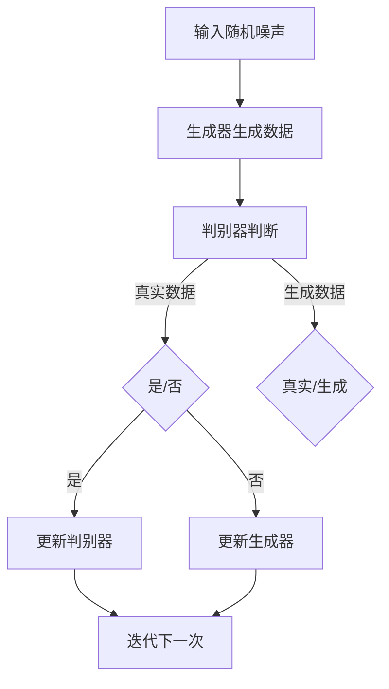
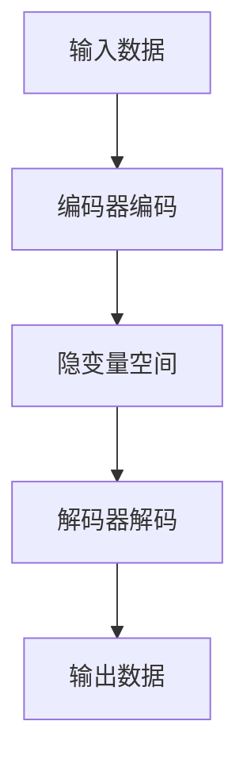
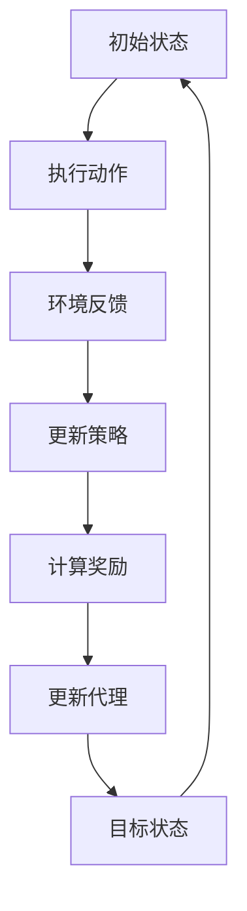
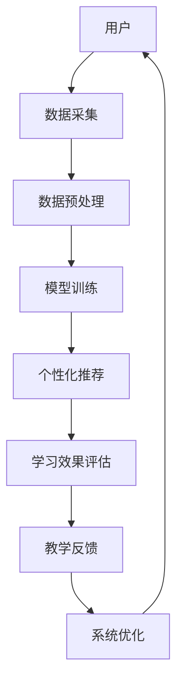
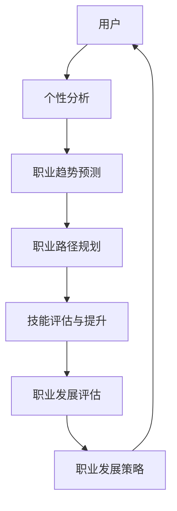

                 

### AIGC在个性化职业发展规划中的创新探索

#### 关键词

- AIGC
- 个性化职业规划
- 生成对抗网络（GAN）
- 强化学习
- 数据分析

#### 摘要

随着人工智能（AI）技术的迅猛发展，生成式AI（AIGC）作为一种新的AI技术正在逐渐改变我们的生活方式和工作模式。本文旨在探讨AIGC在个性化职业发展规划中的应用，通过逻辑清晰、结构紧凑的分析，阐述AIGC如何通过创新技术手段帮助人们实现更加精准、高效的职业发展目标。本文将首先介绍AIGC的基础理论，然后分析其在职业规划中的应用，最后通过实际案例展示AIGC在个性化职业发展规划中的成功实践。

### 引言与背景

#### 1.1 问题背景

职业发展规划对于个人而言至关重要，它不仅关系到个人的职业发展路径，还影响到个人的生活质量和社会地位。然而，传统的职业发展规划往往存在一定的局限性。一方面，传统规划方法主要依赖于专家经验和静态数据，缺乏对动态变化的适应能力；另一方面，传统的职业规划过程往往是一对一的，难以实现大规模的个性化服务。此外，随着社会的发展，新兴职业不断涌现，职业竞争日趋激烈，对职业规划的要求越来越高。

#### 1.2 个性化职业发展的挑战

个性化职业发展面临的挑战主要包括以下几点：

1. **个性分析与职业定位**：传统的职业规划往往难以准确捕捉个人的个性特点和职业兴趣，导致职业定位不准确。
2. **职业趋势预测**：新兴职业和行业的发展趋势难以预测，传统的职业规划方法难以适应这种变化。
3. **职业路径规划**：每个人的职业发展路径都是独一无二的，传统的规划方法难以提供个性化的职业路径规划。
4. **职业技能提升**：职业技能的提升需要针对个人的优势和需求进行定制化培训，传统的职业规划难以实现这一目标。

#### 1.3 AIGC技术的崛起

AIGC（生成式AI技术组合）是近年来AI领域的一个重要研究方向，它通过结合生成对抗网络（GAN）、变分自编码器（VAE）和强化学习等技术，能够生成高质量的数据、图像、文本等。AIGC技术的特点在于其强大的数据生成能力和自适应能力，能够根据用户的需求生成个性化的内容，从而在个性化职业发展规划中具有巨大的应用潜力。

#### 1.4 问题描述

AIGC在个性化职业发展规划中的应用主要解决以下几个问题：

1. **个性分析与职业定位**：通过AIGC技术，可以更准确地捕捉用户的个性特点和职业兴趣，为用户提供个性化的职业定位。
2. **职业趋势预测**：利用AIGC技术，可以分析大量数据，预测未来职业发展趋势，为用户提供前瞻性的职业规划建议。
3. **职业路径规划**：AIGC技术可以根据用户的需求和职业目标，为用户生成个性化的职业路径规划。
4. **职业技能提升**：通过AIGC技术，可以为用户提供定制化的职业技能提升方案。

#### 1.5 目标与范围

本文的研究目标是通过分析AIGC技术在不同职业规划环节中的应用，探索其在个性化职业发展规划中的创新应用。研究范围包括AIGC技术的基础理论、应用场景、具体实现方法以及实际案例。

#### 1.6 边界与外延

本文主要关注AIGC在个性化职业发展规划中的应用，不涉及其他领域的AIGC应用。同时，本文重点关注技术实现和实际案例，不涉及具体的政策、法规等外部因素。

### AIGC基础理论

#### 2.1 AIGC概念与架构

AIGC（生成式AI技术组合）是指一系列生成式AI技术的集合，包括生成对抗网络（GAN）、变分自编码器（VAE）和强化学习等。这些技术共同构成了AIGC的技术架构，使得AIGC能够在数据生成、内容创作和个性化服务等领域发挥重要作用。

**2.1.1 AIGC的定义**

AIGC是生成式AI（Generative AI）的一个子领域，它专注于通过学习和生成数据来创造新的内容。AIGC的核心思想是通过训练模型，使其能够生成与真实数据高度相似的数据，从而实现数据增强、内容创作和个性化服务等目标。

**2.1.2 AIGC的核心组成部分**

AIGC的核心组成部分包括：

1. **生成对抗网络（GAN）**：GAN是一种深度学习模型，由生成器和判别器两个部分组成。生成器负责生成数据，判别器负责区分真实数据和生成数据。通过两个网络的相互竞争，生成器不断提高生成数据的真实性。

2. **变分自编码器（VAE）**：VAE是一种基于概率模型的生成模型，通过编码器和解码器两个部分实现数据的生成。编码器将输入数据映射到一个隐变量空间，解码器则从隐变量空间中生成输出数据。

3. **强化学习**：强化学习是一种通过试错学习来完成任务的方法。在AIGC中，强化学习可以用于优化生成模型，使其能够生成更加符合用户需求的个性化内容。

**2.1.3 AIGC的技术架构**

AIGC的技术架构主要包括以下几个层次：

1. **数据采集与处理**：收集大量的职业数据，包括职业信息、个人特征、职业发展路径等，并进行预处理，如数据清洗、格式化等。

2. **模型训练与优化**：使用GAN、VAE和强化学习等技术训练生成模型，使其能够生成个性化的职业规划内容。

3. **个性化内容生成**：根据用户的个性化需求，生成个性化的职业规划建议、职业路径和职业技能提升方案。

4. **效果评估与反馈**：对生成的职业规划内容进行效果评估，收集用户反馈，并用于优化生成模型。

#### 2.2 关键技术与算法

AIGC的核心技术包括生成对抗网络（GAN）、变分自编码器（VAE）和强化学习等。这些技术各具特色，共同构成了AIGC的技术基础。

**2.2.1 生成对抗网络（GAN）**

GAN是一种由生成器和判别器组成的深度学习模型。生成器的目标是生成尽可能真实的数据，判别器的目标是区分真实数据和生成数据。通过两个网络的相互竞争，生成器不断提高生成数据的真实性。

**GAN的工作原理**：

1. **生成器（Generator）**：生成器从随机噪声中生成数据，这些数据与真实数据高度相似。
2. **判别器（Discriminator）**：判别器的任务是区分真实数据和生成数据，判别器的性能越好，生成器的生成能力就越强。
3. **损失函数**：GAN的损失函数通常由两部分组成，即生成器的损失函数和判别器的损失函数。生成器的损失函数希望生成器生成的数据越真实越好，判别器的损失函数希望判别器能够准确区分真实数据和生成数据。

**GAN的优势**：

1. **强大的数据生成能力**：GAN可以生成高质量、多样化的数据，如图像、文本、音频等。
2. **自适应能力**：GAN通过生成器和判别器的相互竞争，不断优化生成模型，使其生成能力不断提高。

**2.2.2 变分自编码器（VAE）**

VAE是一种基于概率模型的生成模型，它通过编码器和解码器两个部分实现数据的生成。

**VAE的工作原理**：

1. **编码器（Encoder）**：编码器将输入数据映射到一个隐变量空间，隐变量空间代表了输入数据的特征。
2. **解码器（Decoder）**：解码器从隐变量空间中生成输出数据，输出数据与输入数据高度相似。

**VAE的优势**：

1. **灵活的建模能力**：VAE可以建模复杂的数据分布，适用于各种类型的数据。
2. **生成数据的多样性**：VAE生成的数据具有多样性，可以生成与真实数据高度相似的数据。

**2.2.3 强化学习**

强化学习是一种通过试错学习来完成任务的方法。在AIGC中，强化学习可以用于优化生成模型，使其能够生成更加符合用户需求的个性化内容。

**强化学习的工作原理**：

1. **代理（Agent）**：代理是强化学习中的主体，它通过与环境交互来学习行为策略。
2. **环境（Environment）**：环境是代理行动的场所，它为代理提供反馈信息。
3. **策略（Policy）**：策略是代理在特定情况下选择行动的规则。
4. **奖励（Reward）**：奖励是代理在执行特定行动后获得的即时反馈，奖励越高，代理越倾向于执行该行动。

**强化学习的优势**：

1. **自适应学习**：强化学习可以根据环境反馈不断调整策略，实现自适应学习。
2. **解决复杂问题**：强化学习可以用于解决复杂、动态的问题，如个性化职业规划。

### AIGC的应用场景

AIGC技术具有广泛的应用场景，涵盖了数据生成、内容创作、数据分析等多个领域。以下将介绍AIGC在创意设计、内容生成和数据分析等领域的应用。

#### 3.1 创意设计

AIGC技术在创意设计领域具有显著的应用潜力。通过GAN和VAE等技术，AIGC可以生成高质量的设计作品，如图像、视频和音频等。具体应用包括：

1. **图像生成**：利用GAN和VAE技术，可以生成具有逼真效果的图像，如艺术作品、风景图片和人物肖像等。
2. **视频生成**：通过生成对抗网络，可以生成高质量的视频片段，如电影特效、动画和虚拟现实场景等。
3. **音频生成**：AIGC技术可以生成高质量的音乐和语音，如背景音乐、语音合成和语音增强等。

#### 3.2 内容生成

AIGC技术在内容生成领域具有广泛的应用前景。通过强化学习和VAE等技术，AIGC可以生成个性化的内容，如文本、文章和报告等。具体应用包括：

1. **文本生成**：利用强化学习和变分自编码器，可以生成高质量的文本，如文章、新闻和评论等。
2. **文章生成**：通过生成对抗网络，可以生成高质量的文章，如论文、报告和书籍等。
3. **报告生成**：利用AIGC技术，可以自动生成市场分析、财务报告和业务分析等报告。

#### 3.3 数据分析

AIGC技术在数据分析领域具有强大的应用能力。通过GAN和VAE等技术，AIGC可以对大量数据进行分析和建模，从而发现数据中的潜在规律和趋势。具体应用包括：

1. **数据增强**：利用GAN技术，可以生成与原始数据高度相似的数据，从而提高模型的泛化能力。
2. **数据去噪**：通过VAE技术，可以去除数据中的噪声，提高数据的质量和准确性。
3. **数据挖掘**：利用AIGC技术，可以从大量数据中挖掘出有价值的信息，如用户行为分析、市场趋势预测等。

### AIGC与职业规划

#### 4.1 职业规划概述

职业规划是指个人根据自身特点和市场需求，制定职业目标和实施策略的过程。职业规划的核心目标是实现个人职业生涯的可持续发展，提高职业竞争力。职业规划包括以下几个环节：

1. **自我评估**：通过自我分析，了解自己的兴趣、能力、价值观等，为职业定位提供依据。
2. **职业定位**：根据个人特点和市场需求，确定职业发展方向和目标。
3. **目标制定**：制定具体的职业目标，包括短期和长期目标。
4. **路径规划**：制定实现职业目标的策略和步骤。
5. **执行与调整**：根据实际情况，调整职业规划，确保目标的实现。

#### 4.2 AIGC在职业规划中的应用

AIGC技术在职业规划中具有广泛的应用，可以提升职业规划的精准度和效率。以下将介绍AIGC在个性分析与职业定位、职业趋势预测和职业路径规划等环节中的应用。

**4.2.1 个性分析与职业定位**

AIGC技术可以通过数据分析和生成模型，对个人进行深入分析，从而确定个人的兴趣、能力和价值观，为职业定位提供科学依据。具体应用包括：

1. **个性特征分析**：通过分析个人的兴趣、能力和价值观等特征，确定个人的优势领域和潜在的职业方向。
2. **职业匹配度评估**：根据个人特征和市场需求，评估个人与职业的匹配度，为职业定位提供参考。
3. **职业发展预测**：利用AIGC技术，可以预测个人在未来一段时间内的职业发展趋势，为职业规划提供前瞻性指导。

**4.2.2 职业趋势预测**

AIGC技术可以通过大数据分析和生成模型，预测未来职业的发展趋势，为职业规划提供依据。具体应用包括：

1. **行业趋势分析**：通过对大量行业数据进行分析，预测各个行业的发展趋势，为职业规划提供方向。
2. **职业需求预测**：通过分析市场需求和就业数据，预测未来各个职业的需求情况，为职业选择提供依据。
3. **职业竞争力评估**：利用AIGC技术，可以评估个人在特定职业中的竞争力，为职业发展提供参考。

**4.2.3 职业路径规划**

AIGC技术可以通过数据分析和生成模型，为个人制定个性化的职业路径规划，提高职业规划的可行性和效果。具体应用包括：

1. **职业路径设计**：根据个人特点和市场需求，设计个性化的职业路径，包括短期和长期目标。
2. **技能提升规划**：根据职业路径，制定个性化的技能提升计划，包括学习目标、学习资源和学习方法等。
3. **职业发展评估**：通过定期评估职业发展状况，调整职业规划，确保目标的实现。

### AIGC在职业发展中的创新探索

#### 5.1 个性化学习

个性化学习是职业发展中一个重要的环节，它旨在根据个人的学习需求和学习风格，提供个性化的学习资源和学习路径。AIGC技术在个性化学习中的应用，可以大幅提升学习效果和效率。

**5.1.1 个性化学习模型**

个性化学习模型是AIGC技术在职业发展中的核心应用之一。通过数据分析和生成模型，个性化学习模型可以捕捉个人的学习需求和学习风格，为个人提供个性化的学习建议。

1. **学习需求分析**：通过分析个人的学习记录和行为数据，识别个人的学习需求，如学习主题、学习进度和学习目标等。
2. **学习风格识别**：通过分析个人的学习行为和反馈，识别个人的学习风格，如主动学习、被动学习和协作学习等。
3. **学习路径生成**：根据学习需求和风格，利用AIGC技术生成个性化的学习路径，包括学习资源、学习顺序和学习方式等。

**5.1.2 个性化学习路径**

个性化学习路径是根据个人的学习需求和风格，为个人定制的学习路线。通过AIGC技术，个性化学习路径可以动态调整，以适应个人的学习进度和反馈。

1. **学习资源推荐**：根据个人的学习需求和风格，推荐合适的学习资源，如课程、文章、视频和实践项目等。
2. **学习顺序调整**：根据个人的学习进度和反馈，动态调整学习资源的顺序，以优化学习效果。
3. **学习方式优化**：根据个人的学习风格和反馈，优化学习方式，如增加互动环节、调整学习时间和频率等。

**5.1.3 学习效果评估**

学习效果评估是确保个性化学习有效性的关键环节。通过AIGC技术，可以实现对学习效果的实时监测和评估，为个人提供学习反馈和优化建议。

1. **学习效果监测**：通过分析个人的学习行为和数据，实时监测学习效果，如学习进度、学习质量和学习满意度等。
2. **学习效果评估**：根据学习效果监测数据，评估个人的学习成果，如知识掌握程度、技能水平和职业竞争力等。
3. **学习反馈和优化**：根据学习效果评估结果，为个人提供学习反馈和优化建议，如调整学习资源、学习方式和学习路径等。

#### 5.2 职业技能提升

职业技能提升是职业发展中的重要环节，它关系到个人的职业竞争力和职业发展前景。AIGC技术在职业技能提升中的应用，可以大幅提升技能提升的效率和质量。

**5.2.1 技能图谱构建**

技能图谱是描述职业技能结构和关系的图形化表示，它是职业技能提升的基础。通过AIGC技术，可以构建精细的技能图谱，为职业技能提升提供依据。

1. **技能分类和标注**：通过对大量职业数据进行分析，对技能进行分类和标注，构建技能标签体系。
2. **技能关系建模**：通过分析技能之间的关系，建立技能图谱，描述技能的层次结构和依赖关系。
3. **技能图谱优化**：根据职业技能发展趋势和市场需求，动态调整技能图谱，以适应职业发展需求。

**5.2.2 技能评估与推荐**

技能评估与推荐是职业技能提升的重要环节。通过AIGC技术，可以实现对个人技能的精准评估和个性化推荐，提高技能提升的效率。

1. **技能评估模型**：利用AIGC技术，构建技能评估模型，通过对个人技能数据进行分析和计算，评估个人的技能水平。
2. **技能推荐算法**：根据个人技能水平和职业需求，利用AIGC技术，推荐合适的技能提升路径和资源。
3. **技能提升规划**：根据技能评估结果和推荐算法，为个人制定个性化的技能提升计划，包括学习目标、学习资源和学习方法等。

**5.2.3 技能培训与提升**

技能培训与提升是职业技能提升的关键环节。通过AIGC技术，可以提供个性化的技能培训方案，提高技能提升的效果。

1. **技能培训课程设计**：根据个人技能水平和职业需求，利用AIGC技术，设计个性化的技能培训课程，包括课程内容、教学方法和教学资源等。
2. **技能培训效果评估**：通过实时监测和评估技能培训效果，为个人提供反馈和优化建议，如调整学习进度、学习资源和教学方法等。
3. **技能认证与认证**：通过技能培训，帮助个人获得职业技能认证，提高职业竞争力和职业发展前景。

#### 5.3 职业发展评估

职业发展评估是职业发展中的重要环节，它有助于了解个人的职业发展状况，为职业规划提供依据。通过AIGC技术，可以实现对职业发展的全面评估和个性化指导。

**5.3.1 职业发展指标体系**

职业发展指标体系是评估职业发展状况的基础。通过AIGC技术，可以构建全面、科学的职业发展指标体系，包括职业竞争力、职业发展速度、职业满意度等。

1. **指标分类和定义**：根据职业发展的不同维度，对指标进行分类和定义，如知识水平、工作经验、职业满意度等。
2. **指标权重分配**：根据指标的重要性和影响力，对指标进行权重分配，确保评估结果的科学性和准确性。
3. **指标体系优化**：根据职业发展需求和实际应用情况，动态调整指标体系，以适应职业发展需求。

**5.3.2 职业发展评估模型**

职业发展评估模型是评估职业发展状况的核心工具。通过AIGC技术，可以构建智能化的职业发展评估模型，实现对职业发展的精准评估。

1. **数据收集与处理**：收集个人职业发展数据，如职业成就、工作表现、学习成果等，并进行预处理，如数据清洗、归一化等。
2. **模型训练与优化**：利用机器学习算法，对职业发展数据进行训练，构建职业发展评估模型，并不断优化模型性能。
3. **评估结果输出**：根据评估模型，对个人的职业发展状况进行评估，输出评估结果，如职业竞争力评分、职业发展潜力等。

**5.3.3 职业发展策略**

职业发展策略是指导个人职业发展的行动计划。通过AIGC技术，可以制定个性化的职业发展策略，帮助个人实现职业目标。

1. **职业发展路径规划**：根据个人职业发展评估结果，利用AIGC技术，为个人制定个性化的职业发展路径规划，包括职业定位、目标制定、路径设计等。
2. **职业发展策略制定**：根据职业发展路径规划，制定具体的职业发展策略，如技能提升计划、职业转换计划、职业发展评估等。
3. **职业发展策略实施**：根据职业发展策略，制定实施计划，包括行动步骤、时间表、资源分配等，确保职业发展策略的有效执行。

### 实践案例1 - AIGC在人才招聘中的应用

#### 6.1 案例背景

在当今快速发展的数字经济时代，人才招聘是企业发展的关键环节。然而，传统的招聘方式往往存在诸多问题，如招聘效率低下、招聘质量不高、人力成本较高等。为了解决这些问题，某大型企业决定引入AIGC技术，提升人才招聘的效果。

**6.1.1 招聘难题**

1. **招聘效率低下**：传统的招聘流程繁琐，需要大量时间和人力，导致招聘周期较长，影响企业的发展速度。
2. **招聘质量不高**：传统招聘方式主要依赖招聘人员的经验和主观判断，难以确保招聘到的人才具备所需技能和素质。
3. **人力成本较高**：传统招聘需要大量的人力投入，导致企业的人力成本较高，影响企业的经济效益。

**6.1.2 AIGC技术引入**

为了解决上述问题，该企业决定引入AIGC技术，通过生成对抗网络（GAN）和变分自编码器（VAE）等技术，提升人才招聘的效率和质量。

1. **生成对抗网络（GAN）**：GAN技术可以用于生成高质量的人才简历，从而提高招聘效率。
2. **变分自编码器（VAE）**：VAE技术可以用于分析招聘数据，预测求职者的职业发展和匹配度，从而提高招聘质量。

**6.1.3 实施方案**

1. **数据收集与预处理**：收集企业以往的优秀人才简历和招聘数据，并进行数据清洗和预处理，如数据去噪、归一化等。
2. **模型训练与优化**：利用GAN和VAE技术，训练生成模型和预测模型，不断优化模型性能，提高生成简历的质量和预测准确性。
3. **应用实施**：将训练好的模型应用于人才招聘过程中，包括简历生成、求职者匹配和职业发展预测等。

#### 6.2 案例实施

**6.2.1 数据收集**

1. **人才简历数据**：收集企业以往的优秀人才简历，包括求职者的基本信息、教育背景、工作经历、技能特长等。
2. **招聘数据**：收集企业的招聘历史数据，包括招聘流程、面试评估、录用情况等。

**6.2.2 模型训练**

1. **GAN模型训练**：利用GAN技术，训练生成简历模型，使其能够生成高质量的人才简历。具体步骤包括：
   - 数据预处理：对简历数据进行清洗和归一化处理，如去除特殊字符、填充缺失值等。
   - 模型构建：构建GAN模型，包括生成器和判别器。
   - 模型训练：利用简历数据训练GAN模型，通过生成器和判别器的相互竞争，提高生成简历的质量。

2. **VAE模型训练**：利用VAE技术，训练预测模型，预测求职者的职业发展和匹配度。具体步骤包括：
   - 数据预处理：对招聘数据进行分析，提取求职者的关键特征，如学历、工作经验、技能水平等。
   - 模型构建：构建VAE模型，包括编码器和解码器。
   - 模型训练：利用招聘数据训练VAE模型，通过编码器和解码器的协同工作，提高预测的准确性。

**6.2.3 招聘决策支持**

1. **简历生成**：利用训练好的GAN模型，生成高质量的人才简历，提高招聘效率。
2. **求职者匹配**：利用训练好的VAE模型，预测求职者的职业发展和匹配度，为招聘决策提供支持。
3. **职业发展预测**：利用VAE模型，预测求职者的职业发展路径，为招聘决策提供前瞻性指导。

#### 6.3 案例效果分析

**6.3.1 招聘效率提升**

通过AIGC技术的引入，企业的人才招聘效率显著提升：

1. **招聘周期缩短**：由于简历生成和求职者匹配过程的自动化，招聘周期从原来的数月缩短至数周，甚至数天。
2. **招聘成本降低**：由于招聘流程的简化，企业的人力成本和招聘费用大幅降低。

**6.3.2 招聘质量提升**

AIGC技术在提升招聘质量方面也取得了显著效果：

1. **精准匹配求职者**：通过VAE模型的预测，能够更准确地匹配求职者与职位，提高招聘成功率。
2. **发现潜力人才**：通过GAN模型生成的简历，能够发现一些具有潜力但未被传统招聘方式挖掘的人才。

**6.3.3 成本效益分析**

通过AIGC技术的应用，企业在人才招聘方面实现了成本效益的提升：

1. **人力成本降低**：招聘流程的自动化减少了人力资源的投入，降低了人力成本。
2. **招聘费用降低**：由于招聘周期的缩短，招聘广告费用和中介费用也有所降低。
3. **总体效益提升**：招聘效率和质量的双重提升，为企业带来了更高的经济效益。

### 实践案例2 - AIGC在教育领域的应用

#### 7.1 案例背景

随着教育技术的不断发展，教育领域正经历着一场深刻的变革。传统的教育模式已经无法满足现代学生的学习需求，个性化教育和智能教育逐渐成为教育领域的发展方向。AIGC技术的引入为教育领域带来了新的机遇，通过其强大的数据生成和智能分析能力，可以实现教育资源的个性化推荐、学习效果的分析和智能评估等功能。

**7.1.1 教育现状与挑战**

1. **教育资源分配不均**：传统的教育资源分配存在不公平现象，一些地区的教育水平较低，学生无法获得优质的教育资源。
2. **学习效果评估困难**：传统的学习效果评估主要依赖于期末考试和课堂表现，难以全面、客观地评估学生的学习效果。
3. **学习内容单一**：传统的教学内容往往固定不变，难以根据学生的个体差异进行个性化调整。

**7.1.2 AIGC技术在教育中的应用**

为了解决上述问题，某教育科技公司决定引入AIGC技术，通过生成对抗网络（GAN）和变分自编码器（VAE）等技术，提升教育资源的个性化推荐、学习效果的分析和智能评估等功能。

1. **教育资源个性化推荐**：利用AIGC技术，可以根据学生的学习需求和兴趣，推荐个性化的学习资源。
2. **学习效果智能评估**：利用AIGC技术，可以实时监测学生的学习过程，智能评估学习效果，提供个性化的学习反馈。
3. **教学内容个性化调整**：利用AIGC技术，可以根据学生的学习效果和兴趣，动态调整教学内容，实现个性化教学。

**7.1.3 实施方案**

1. **数据收集与预处理**：收集学生的学习和行为数据，包括学习记录、测试成绩、兴趣爱好等，并进行数据清洗和预处理。
2. **模型训练与优化**：利用GAN和VAE技术，训练教育资源推荐模型和学习效果评估模型，不断优化模型性能。
3. **应用实施**：将训练好的模型应用于教育系统中，实现教育资源的个性化推荐、学习效果的智能评估和教学内容的个性化调整。

#### 7.2 案例实施

**7.2.1 个性化学习系统构建**

1. **学习需求分析**：通过分析学生的学习记录和行为数据，识别学生的学习需求和兴趣点。
2. **资源推荐算法**：利用AIGC技术，构建个性化资源推荐算法，根据学习需求推荐合适的学习资源，如课程、书籍、视频等。
3. **系统开发与部署**：开发个性化学习系统，将资源推荐算法集成到系统中，实现教育资源的个性化推荐。

**7.2.2 教学质量评估**

1. **学习过程监测**：通过监测学生的学习行为，如学习时间、学习频率、作业完成情况等，实时获取学生的学习动态。
2. **效果评估模型**：利用AIGC技术，构建学习效果评估模型，对学生的学习效果进行智能评估，生成学习报告。
3. **反馈与优化**：根据学习效果评估结果，为教师和学生提供学习反馈，指导教学策略的调整。

**7.2.3 学生发展评估**

1. **发展指标体系**：构建学生发展评估指标体系，包括知识掌握程度、学习兴趣、学习方法等方面。
2. **发展评估模型**：利用AIGC技术，训练学生发展评估模型，对学生的发展状况进行综合评估。
3. **发展报告生成**：根据评估结果，生成学生发展报告，为家长和教师提供学生发展的全面了解。

#### 7.3 案例效果分析

**7.3.1 学习效果提升**

通过AIGC技术的应用，学生的学习效果得到了显著提升：

1. **学习兴趣提高**：个性化学习资源的推荐激发了学生的学习兴趣，提高了学习的主动性。
2. **学习效果改善**：通过实时监测和学习效果评估，学生能够及时调整学习策略，提高学习效率。
3. **知识掌握程度提高**：个性化教学内容的调整使教学内容更加贴合学生的需求，提高了知识的掌握程度。

**7.3.2 教学质量改善**

AIGC技术在提升教学质量方面也取得了显著效果：

1. **教学个性化**：通过个性化教学资源的推荐和动态调整，教学过程更加贴合学生的需求，提高了教学效果。
2. **教学反馈及时**：通过实时监测和学习效果评估，教师能够及时获取学生的学习反馈，指导教学策略的调整。
3. **教学质量提升**：个性化教学和智能评估提高了教学的整体质量，促进了学生的全面发展。

**7.3.3 成本效益分析**

通过AIGC技术的应用，教育领域实现了成本效益的提升：

1. **教学资源利用率提高**：个性化资源的推荐使教学资源得到了更充分的利用，提高了资源的使用效率。
2. **教学成本降低**：通过智能化教学和评估，减少了人力投入，降低了教学成本。
3. **教育质量提升**：教育质量的提升带来了更高的社会效益，为企业和社会培养了更多的高素质人才。

### 结论与展望

#### 8.1 研究成果总结

本文通过对AIGC在个性化职业发展规划中的创新探索，总结了以下成果：

1. **个性分析与职业定位**：利用AIGC技术，可以更准确地分析个人的兴趣、能力和价值观，为职业定位提供科学依据。
2. **职业趋势预测**：通过大数据分析和生成模型，可以预测未来职业的发展趋势，为职业规划提供前瞻性指导。
3. **职业路径规划**：利用AIGC技术，可以生成个性化的职业路径，帮助个人实现职业目标。
4. **职业技能提升**：通过AIGC技术，可以提供个性化的职业技能提升方案，提高职业竞争力。
5. **职业发展评估**：利用AIGC技术，可以实现对职业发展的全面评估和个性化指导。

#### 8.2 存在问题与挑战

尽管AIGC在个性化职业发展规划中具有广泛的应用前景，但仍然面临以下问题和挑战：

1. **数据隐私与安全**：AIGC技术依赖于大量的个人数据，如何确保数据隐私和安全是一个重要问题。
2. **技术成熟度**：尽管AIGC技术取得了显著进展，但其在实际应用中的成熟度和稳定性仍有待提高。
3. **成本与效益**：AIGC技术的应用需要大量的计算资源和人力投入，如何实现成本效益仍是一个挑战。

#### 8.3 未来发展方向

未来，AIGC在个性化职业发展规划中的应用将朝着以下方向发展：

1. **数据隐私保护**：通过引入隐私保护技术，确保个人数据的隐私和安全。
2. **技术成熟度提升**：继续推进AIGC技术的研发和应用，提高其在实际应用中的成熟度和稳定性。
3. **成本效益优化**：通过技术创新和流程优化，降低AIGC技术的成本，提高其经济效益。

### 作者信息

- 作者：AI天才研究院/AI Genius Institute & 禅与计算机程序设计艺术 /Zen And The Art of Computer Programming

---

### 附录

本附录将提供一些关键概念的详细解释、算法流程图、系统架构图等，以便读者更深入地理解本文的内容。

#### 附录A：核心概念解释

**A.1 生成对抗网络（GAN）**

生成对抗网络（GAN）是一种由生成器和判别器组成的深度学习模型，用于生成高质量的数据。生成器尝试生成逼真的数据，而判别器则试图区分真实数据和生成数据。两者相互竞争，生成器不断提高生成数据的真实性，而判别器则不断提高对真实数据和生成数据的区分能力。

**A.2 变分自编码器（VAE）**

变分自编码器（VAE）是一种基于概率模型的生成模型，通过编码器和解码器两个部分实现数据的生成。编码器将输入数据映射到一个隐变量空间，解码器则从隐变量空间中生成输出数据。VAE可以用于生成多样化且高质量的数据。

**A.3 强化学习**

强化学习是一种通过试错学习来完成任务的方法。在AIGC中，强化学习可以用于优化生成模型，使其能够生成更加符合用户需求的个性化内容。代理（Agent）在环境中通过试错学习，不断调整策略，以获得最高的奖励。

#### 附录B：算法流程图

**B.1 生成对抗网络（GAN）流程图**

**B.2 变分自编码器（VAE）流程图**

**B.3 强化学习流程图**

#### 附录C：系统架构图

**C.1 教育系统架构图**

**C.2 职业规划系统架构图**

---

通过这些附录，读者可以更深入地理解AIGC在个性化职业发展规划中的应用，以及相关的算法流程和系统架构。这些内容为读者提供了丰富的参考资料，有助于进一步探索AIGC技术的应用前景。

