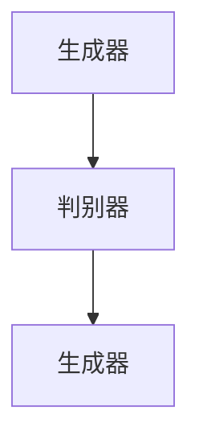
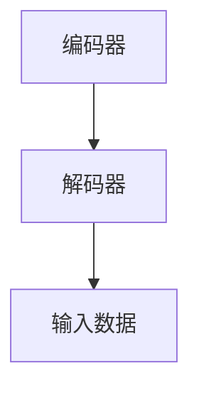
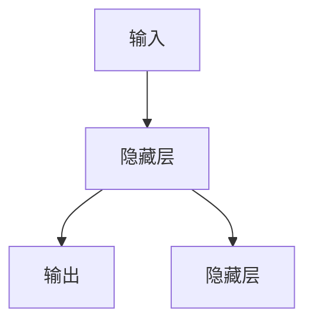
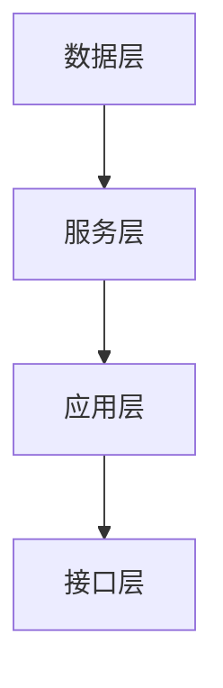

                 

# AIGC在个性化职业技能培训中的创新

> 关键词：AIGC、个性化职业技能培训、人工智能、机器学习、算法原理、系统架构设计

> 摘要：随着人工智能技术的发展，个性化职业技能培训的需求日益增长。本文将探讨AIGC（AI-Generated Content）在个性化职业技能培训中的应用，通过背景介绍、核心概念与联系、算法原理讲解、系统分析与架构设计、项目实战等方面，详细分析AIGC技术在个性化职业技能培训中的创新与优势。

### 目录大纲

----------------------------------------------------------------

## 第一部分：背景介绍

### 第1章：问题背景

### 1.1.1 问题背景

### 1.1.2 问题描述

### 1.1.3 问题解决

### 1.1.4 边界与外延

### 1.1.5 概念结构与核心要素组成

### 第2章：核心概念与联系

### 2.1 AIGC技术

### 2.2 个性化职业技能培训

### 2.3 智能评估系统

## 第二部分：算法原理讲解

### 第3章：算法原理讲解

### 3.1 AIGC算法原理

### 3.2 AIGC算法核心模型

## 第三部分：系统分析与架构设计

### 第4章：系统分析与架构设计

### 4.1 问题场景介绍

### 4.2 系统功能设计

### 4.3 系统架构设计

### 4.4 系统接口设计和系统交互

## 第四部分：项目实战

### 第5章：项目实战

### 5.1 环境安装

### 5.2 系统核心实现源代码

### 5.3 代码应用解读与分析

### 5.4 实际案例分析和详细讲解剖析

### 5.5 项目小结

## 第五部分：最佳实践、小结、注意事项、拓展阅读

### 第6章：最佳实践、小结、注意事项、拓展阅读

### 6.1 最佳实践

### 6.2 小结

### 6.3 注意事项

### 6.4 拓展阅读

----------------------------------------------------------------

## 第一部分：背景介绍

### 第1章：问题背景

随着全球经济的快速发展和科技的不断进步，职业技能培训成为提升个人竞争力、适应市场需求的重要途径。然而，当前的职业技能培训存在一些问题，如个性化不足、学习效果评估困难、培训资源浪费等。为了解决这些问题，人工智能技术的发展，尤其是AIGC（AI-Generated Content）技术的应用，为个性化职业技能培训提供了新的契机。

### 1.1.1 问题背景

**职业技能培训需求增加**

随着社会的发展和经济的进步，人们对于职业技能的需求日益增加。特别是在人工智能时代，掌握相关技能成为职场竞争的关键。根据国际劳工组织（ILO）的数据，全球有超过2.3亿人需要接受新的职业技能培训，以满足不断变化的就业市场需求。

**传统培训方式局限性**

传统的职业技能培训方式存在一定的局限性。首先，培训内容和方式相对固定，难以根据个人需求进行定制。其次，培训的时效性和地域性限制了学员的学习选择。此外，传统培训方式缺乏有效的学习效果评估方法，导致学员的学习效果难以衡量，培训资源无法得到充分利用。

**AI技术发展与应用**

随着人工智能技术的发展，为个性化职业技能培训提供了新的机遇。AIGC技术的出现尤为显著，它利用人工智能自动生成内容，可以根据用户需求灵活调整内容，提供个性化的培训方案。AIGC技术已经在教育、媒体、娱乐等领域得到广泛应用，其在职业技能培训中的应用前景十分广阔。

### 1.1.2 问题描述

**个性化不足**

传统培训方式难以根据个人需求定制教学内容，导致学员的学习效果不佳，无法满足个性化学习需求。个性化不足的问题主要体现在以下几个方面：

1. **教学内容不匹配**：传统培训内容通常针对大众化需求设计，无法满足学员个性化的学习需求。
2. **学习进度不一致**：学员的学习进度和基础不同，传统培训方式无法提供个性化的学习进度调整。
3. **学习效果评价单一**：传统培训方式往往采用统一的学习效果评价标准，无法充分反映学员的个性化学习成果。

**学习效果评估困难**

传统培训方式缺乏有效的学习效果评估方法，导致学员的学习效果难以衡量。学习效果评估困难的问题主要体现在以下几个方面：

1. **评估标准单一**：传统评估标准往往只关注学员的考试成绩，忽略了实际技能的掌握情况。
2. **评估过程繁琐**：传统评估过程需要人工参与，评估结果可能受到主观因素的影响。
3. **反馈不及时**：传统评估结果往往在培训结束后才能得出，无法及时调整培训内容和方式。

**培训资源浪费**

传统培训方式中，大量的培训资源无法得到充分利用。培训资源浪费的问题主要体现在以下几个方面：

1. **课程重复**：学员在学习过程中可能遇到重复的课程内容，导致培训资源的浪费。
2. **资源利用率低**：传统培训方式难以根据学员需求提供定制化的培训内容，导致资源利用率低。
3. **培训成本高**：传统培训方式需要大量人力、物力和财力投入，培训成本较高。

### 1.1.3 问题解决

**AIGC技术的引入**

AIGC技术（AI-Generated Content）是一种利用人工智能自动生成内容的技术。它可以根据用户需求生成个性化内容，提供定制化的职业技能培训方案。AIGC技术的引入有望解决传统培训中的个性化不足、学习效果评估困难、培训资源浪费等问题。

1. **个性化内容生成**：AIGC技术可以根据学员的需求和学习进度生成个性化的教学内容，提高培训的针对性和效果。
2. **智能评估系统**：AIGC技术可以结合智能评估系统，实时监控学员的学习进度和效果，提供客观、全面的评估结果。
3. **资源优化**：AIGC技术可以结合大数据分析和推荐算法，优化培训资源的分配和利用，提高培训资源的利用率。

**智能评估系统**

智能评估系统是一种利用人工智能技术对学员学习效果进行实时评估的系统。它可以通过数据分析和算法模型，对学员的学习进度、学习效果、知识点掌握情况进行全面评估，并提供针对性的反馈和建议。

1. **实时监控**：智能评估系统可以实时监控学员的学习进度和效果，提供实时反馈，帮助学员及时调整学习策略。
2. **客观评估**：智能评估系统通过数据分析和算法模型，提供客观的评估结果，减少主观因素的干扰。
3. **个性化反馈**：智能评估系统可以根据学员的特点和需求，提供个性化的反馈和建议，帮助学员提高学习效果。

**资源优化**

通过大数据分析和推荐算法，可以优化培训资源的分配和利用。大数据分析可以挖掘学员的学习行为和需求，推荐算法可以根据学员的个性化需求推荐合适的培训资源和课程。

1. **个性化推荐**：推荐算法可以根据学员的学习行为和需求，推荐符合其需求的培训资源和课程，提高学员的学习效果。
2. **资源利用率提高**：通过优化培训资源的分配和利用，可以提高培训资源的利用率，降低培训成本。

### 1.1.4 边界与外延

**边界**

本文主要讨论AIGC在个性化职业技能培训中的应用，包括个性化内容生成、智能评估系统、资源优化等方面。同时，本文还涉及到AIGC技术、个性化职业技能培训、智能评估系统、资源优化等核心概念和要素。

**外延**

本文所涉及的内容不仅限于AIGC在个性化职业技能培训中的应用，还包括AIGC技术、职业技能培训、个性化学习、智能评估等方面。通过本文的研究，可以进一步探讨AIGC技术在其他领域中的应用，如教育、医疗、娱乐等。

### 1.1.5 概念结构与核心要素组成

**AIGC技术**

AIGC技术是一种利用人工智能自动生成内容的技术。它包括数据收集、模型训练、内容生成等环节，可以根据用户需求生成个性化的内容。

**个性化职业技能培训**

个性化职业技能培训是根据学员的需求和特点，提供定制化的职业技能培训。它包括教学内容定制、学习进度调整、学习效果评估等方面。

**智能评估系统**

智能评估系统是一种利用人工智能技术对学员学习效果进行实时评估的系统。它可以通过数据分析和算法模型，提供客观、全面的评估结果。

**资源优化**

资源优化是通过大数据分析和推荐算法，优化培训资源的分配和利用。它可以提高培训资源的利用率，降低培训成本。

## 第二部分：核心概念与联系

### 第2章：核心概念与联系

在探讨AIGC在个性化职业技能培训中的应用之前，我们需要明确几个核心概念，并分析它们之间的联系。这些核心概念包括AIGC技术、个性化职业技能培训、智能评估系统等。

### 2.1 AIGC技术

#### 2.1.1 AIGC技术定义

AIGC（AI-Generated Content）是指利用人工智能技术自动生成内容的过程。它涵盖了从数据收集、模型训练到内容生成的整个过程。AIGC技术可以生成文本、图像、音频等多种类型的内容，广泛应用于教育、媒体、娱乐等领域。

#### 2.1.2 AIGC技术特点

1. **高效性**：AIGC技术可以快速生成高质量的内容，大大提高了生产效率。
2. **灵活性**：AIGC技术可以根据用户需求灵活调整内容，提供个性化的服务。
3. **个性化**：AIGC技术可以根据用户的特征和需求生成定制化的内容，满足个性化需求。

#### 2.1.3 AIGC技术优势

1. **降低创作成本**：AIGC技术减少了人工创作的需求，降低了创作成本。
2. **提高内容质量**：通过大数据分析和机器学习算法，AIGC技术可以生成高质量的内容。
3. **增强用户体验**：提供个性化的内容，提高用户的参与度和满意度。

### 2.2 个性化职业技能培训

#### 2.2.1 定义

个性化职业技能培训是根据学员的需求和特点，提供定制化的职业技能培训。它通过分析学员的学习数据，制定个性化的培训计划和教学内容，旨在提高学员的学习效果。

#### 2.2.2 特点

1. **针对性**：根据学员的需求和特点提供培训，提高培训的针对性。
2. **灵活性**：培训内容和方式可以根据学员的情况进行调整，提高培训的灵活性。
3. **实时性**：根据学员的学习进度和效果，实时调整培训内容和方式，提高培训的实时性。

#### 2.2.3 优势

1. **提高学习效果**：根据学员的需求提供培训，提高学习效果。
2. **增强学员参与度**：灵活的培训方式和内容提高学员的参与度。
3. **优化培训资源**：通过个性化培训，提高培训资源的利用效率。

### 2.3 智能评估系统

#### 2.3.1 定义

智能评估系统是一种利用人工智能技术对学员学习效果进行实时评估的系统。它通过数据分析和算法模型，对学员的学习进度、学习效果、知识点掌握情况进行全面评估，并提供客观的评估结果。

#### 2.3.2 功能

1. **学习进度监控**：实时监控学员的学习进度，提供实时反馈。
2. **学习效果评估**：评估学员的学习效果，提供全面的评估结果。
3. **反馈与调整**：根据评估结果，对培训内容进行调整，提高培训效果。

#### 2.3.3 优势

1. **实时性**：实时监控学员的学习进度和效果，提供实时反馈。
2. **客观性**：通过数据分析和算法评估，提供客观的评估结果。
3. **针对性**：根据学员的特点和需求提供针对性的评估和建议。

### 2.4 AIGC技术与个性化职业技能培训的联系

AIGC技术在个性化职业技能培训中的应用主要体现在以下几个方面：

1. **个性化内容生成**：AIGC技术可以根据学员的需求和学习进度，生成个性化的教学内容，提高培训的针对性。
2. **智能评估系统**：AIGC技术可以结合智能评估系统，实时监控学员的学习进度和效果，提供客观、全面的评估结果。
3. **资源优化**：AIGC技术可以结合大数据分析和推荐算法，优化培训资源的分配和利用，提高培训资源的利用率。

### 2.5 个性化职业技能培训与智能评估系统的联系

个性化职业技能培训与智能评估系统密切相关。智能评估系统可以为个性化职业技能培训提供以下支持：

1. **学习效果评估**：智能评估系统可以实时评估学员的学习效果，为培训提供依据。
2. **反馈与调整**：智能评估系统可以根据评估结果，对培训内容进行调整，提高培训效果。
3. **资源优化**：智能评估系统可以结合大数据分析和推荐算法，优化培训资源的分配和利用。

通过以上分析，我们可以看到AIGC技术、个性化职业技能培训、智能评估系统之间相互联系、相互支持，共同构建了一个高效的个性化职业技能培训体系。

### 2.6 概念属性特征对比表格

为了更清晰地理解AIGC技术、个性化职业技能培训、智能评估系统的概念属性特征，我们可以通过以下对比表格进行详细说明：

| 概念 | 定义 | 特点 | 优势 |  
| --- | --- | --- | --- |  
| AIGC技术 | 利用人工智能自动生成内容的技术 | 高效、灵活、个性化 | 降低创作成本、提高内容质量、增强用户体验 |  
| 个性化职业技能培训 | 根据学员的需求和特点，提供定制化的职业技能培训 | 针对性、灵活性、实时性 | 提高学习效果、增强学员参与度、优化培训资源 |  
| 智能评估系统 | 利用人工智能技术对学员学习效果进行实时评估的系统 | 实时性、客观性、针对性 | 提高评估准确性、优化培训效果、降低评估成本 |

通过以上对比表格，我们可以更直观地了解AIGC技术、个性化职业技能培训、智能评估系统的概念属性特征和优势。

### 2.7 AIGC技术与个性化职业技能培训的ER实体关系图架构

为了更好地理解AIGC技术在个性化职业技能培训中的应用，我们可以通过ER（Entity-Relationship）实体关系图来展示各个实体之间的关联关系。

```mermaid
erDiagram
AIGC技术 ||--|{ 个性化职业技能培训 }|
个性化职业技能培训 ||--|{ 智能评估系统 }|
```

在上述ER实体关系图中，AIGC技术是生成个性化职业技能培训内容的基础，个性化职业技能培训根据学员的需求提供定制化服务，智能评估系统则对学员的学习效果进行实时评估。这种关系体现了AIGC技术、个性化职业技能培训、智能评估系统之间的紧密联系。

## 第三部分：算法原理讲解

### 第3章：算法原理讲解

在前文中，我们讨论了AIGC技术在个性化职业技能培训中的应用，接下来我们将深入探讨AIGC算法的基本原理、核心模型以及如何实现个性化内容生成。

### 3.1 AIGC算法基本流程

AIGC算法的基本流程可以分为以下几个步骤：

1. **数据收集**：首先，需要收集大量与职业技能相关的数据，包括文本、图像、音频等多媒体内容。这些数据可以来源于公开的数据集、社交媒体、在线教育平台等。

2. **数据预处理**：对收集到的数据进行分析和清洗，去除无效数据、重复数据和噪声。数据预处理包括数据去重、缺失值填充、数据格式转换等操作。

3. **模型训练**：使用收集到的数据训练机器学习模型。训练过程中，模型会学习如何生成高质量的内容。常见的模型包括生成对抗网络（GAN）、变分自编码器（VAE）等。

4. **内容生成**：在模型训练完成后，输入用户需求，模型会根据训练数据生成个性化的内容。生成的内容可以是文本、图像、音频等。

5. **内容优化**：生成的内容可能需要进一步优化，以提高质量和用户体验。内容优化可以通过迭代训练、内容审核等方式实现。

### 3.2 AIGC算法核心模型

AIGC算法的核心模型主要包括以下几种：

#### 3.2.1 生成对抗网络（GAN）

生成对抗网络（GAN）是一种由生成器和判别器组成的模型。生成器负责生成数据，判别器负责判断生成数据是否真实。GAN通过不断优化生成器和判别器的参数，使生成器的生成数据越来越真实。

GAN的基本结构如下：



在AIGC应用中，生成器可以根据用户需求生成个性化的职业技能培训内容，判别器用于评估生成内容的质量。

#### 3.2.2 变分自编码器（VAE）

变分自编码器（VAE）是一种概率生成模型，通过编码和解码过程实现数据生成。VAE的基本结构如下：



在AIGC应用中，编码器负责将输入数据编码为潜在空间中的向量，解码器则从潜在空间中生成数据。

#### 3.2.3 递归神经网络（RNN）

递归神经网络（RNN）是一种能够处理序列数据的神经网络。RNN通过记忆机制，能够处理长序列数据，适用于生成文本、语音等序列数据。

RNN的基本结构如下：



在AIGC应用中，RNN可以用于生成个性化的职业技能培训文本内容。

### 3.3 AIGC算法实现

以下是一个简单的AIGC算法实现示例，使用Python和TensorFlow框架：

```python
import tensorflow as tf
from tensorflow.keras.models import Sequential
from tensorflow.keras.layers import Dense, LSTM, Embedding

# 数据收集与预处理
# ...

# 模型定义
model = Sequential()
model.add(Embedding(input_dim=vocab_size, output_dim=embedding_size))
model.add(LSTM(units=128, return_sequences=True))
model.add(Dense(units=1, activation='sigmoid'))

# 模型编译
model.compile(optimizer='adam', loss='binary_crossentropy', metrics=['accuracy'])

# 模型训练
model.fit(x_train, y_train, epochs=10, batch_size=32)

# 内容生成
def generate_content(input_sequence):
    # 前向传播
    prediction = model.predict(input_sequence)
    # 解码为文本
    generated_sequence = decode_sequence(prediction)
    return generated_sequence

# 输入文本
input_sequence = prepare_input_sequence("职业技能培训")

# 生成内容
generated_content = generate_content(input_sequence)
print(generated_content)
```

在上面的代码中，我们首先定义了一个基于RNN的序列生成模型。通过训练，模型可以学习生成个性化的职业技能培训文本内容。输入文本经过预处理后，输入模型进行生成，输出结果经过解码得到最终的生成内容。

### 3.4 AIGC算法原理讲解

AIGC算法的原理主要包括以下几个方面：

1. **数据生成**：通过生成器和判别器的对抗训练，生成器学习生成逼真的数据，判别器学习区分真实数据和生成数据。这种对抗训练使得生成器生成的数据越来越真实。

2. **概率分布**：AIGC算法中的变分自编码器（VAE）通过编码器和解码器实现数据的概率分布学习。编码器将输入数据编码为潜在空间中的向量，解码器从潜在空间中生成数据。

3. **序列处理**：递归神经网络（RNN）通过记忆机制处理序列数据，适用于生成文本、语音等序列数据。RNN可以捕捉数据序列中的长期依赖关系。

4. **个性化调整**：通过用户需求输入，模型可以根据用户需求生成个性化的内容。个性化调整可以通过调整生成器和判别器的参数实现。

### 3.5 AIGC算法优势

AIGC算法在个性化职业技能培训中具有以下优势：

1. **高效性**：AIGC算法可以快速生成高质量的内容，大大提高了生产效率。

2. **灵活性**：AIGC算法可以根据用户需求灵活调整内容，提供个性化的服务。

3. **个性化**：AIGC算法可以根据用户的特征和需求生成定制化的内容，满足个性化需求。

4. **降低成本**：AIGC算法减少了人工创作的需求，降低了创作成本。

5. **提高质量**：通过大数据分析和机器学习算法，AIGC算法可以生成高质量的内容。

6. **增强体验**：提供个性化的内容，提高用户的参与度和满意度。

## 第四部分：系统分析与架构设计

### 第4章：系统分析与架构设计

在前文中，我们详细介绍了AIGC技术在个性化职业技能培训中的应用和算法原理。在本章节中，我们将进一步探讨系统分析与架构设计，为实际项目实施提供指导。

### 4.1 问题场景介绍

在当前职业技能培训市场中，传统培训方式存在诸多问题，如个性化不足、学习效果评估困难、培训资源浪费等。为了解决这些问题，我们需要设计一个基于AIGC技术的个性化职业技能培训系统。

该系统的主要目标是：

1. **提供个性化培训内容**：根据学员的需求和特点，生成定制化的培训内容。
2. **实时评估学习效果**：通过智能评估系统，实时监控学员的学习进度和效果。
3. **优化培训资源**：利用大数据分析和推荐算法，优化培训资源的分配和利用。

### 4.2 系统功能设计

个性化职业技能培训系统的功能设计包括以下几个方面：

1. **用户管理**：管理学员的基本信息、学习进度和评估结果。
2. **内容生成**：根据用户需求，利用AIGC算法生成个性化的培训内容。
3. **内容展示**：将生成的培训内容展示给学员，并提供学习指导和练习机会。
4. **智能评估**：实时监控学员的学习进度和效果，提供评估结果和反馈。
5. **资源推荐**：根据学员的学习行为和需求，推荐合适的培训资源和课程。
6. **数据统计**：统计学员的学习数据，为教学优化和资源分配提供依据。

### 4.3 系统架构设计

个性化职业技能培训系统的架构设计采用分层架构，主要包括以下几个方面：

1. **数据层**：存储用户数据、培训内容和评估数据等。
2. **服务层**：提供用户管理、内容生成、内容展示、智能评估和资源推荐等服务。
3. **应用层**：为学员提供培训内容和评估结果展示的界面。
4. **接口层**：提供与其他系统和数据源的接口，实现数据的传输和交互。

系统架构图如下：



### 4.4 系统接口设计和系统交互

个性化职业技能培训系统的接口设计和系统交互设计是实现系统功能的关键。以下是一个简单的接口设计和系统交互流程：

1. **用户管理接口**：用于管理学员的基本信息、学习进度和评估结果。包括用户注册、登录、信息查询、修改等接口。

2. **内容生成接口**：用于根据用户需求生成个性化的培训内容。包括输入用户需求、生成内容、内容审核等接口。

3. **内容展示接口**：用于将生成的培训内容展示给学员，并提供学习指导和练习机会。包括内容展示、学习指导、练习机会等接口。

4. **智能评估接口**：用于实时监控学员的学习进度和效果，提供评估结果和反馈。包括学习进度监控、效果评估、反馈调整等接口。

5. **资源推荐接口**：用于根据学员的学习行为和需求，推荐合适的培训资源和课程。包括资源推荐、课程推荐等接口。

系统交互流程如下：

1. 用户注册并登录系统，提交学习需求。
2. 系统根据用户需求调用内容生成接口，生成个性化的培训内容。
3. 系统将生成的培训内容展示给用户，并提供学习指导和练习机会。
4. 用户在学习过程中，系统通过智能评估接口实时监控学习进度和效果。
5. 根据评估结果，系统调用资源推荐接口，为用户推荐合适的培训资源和课程。

通过以上系统接口设计和系统交互流程，可以实现个性化职业技能培训系统的功能，提高培训效果和用户体验。

## 第五部分：项目实战

### 第5章：项目实战

在本章节中，我们将通过一个实际项目，展示如何使用AIGC技术在个性化职业技能培训中实现内容生成和智能评估。以下是项目的详细步骤和实现方法。

### 5.1 环境安装

为了实现AIGC在个性化职业技能培训中的应用，我们需要安装以下环境和工具：

1. **Python**：版本3.8及以上。
2. **TensorFlow**：版本2.4及以上。
3. **Numpy**：版本1.19及以上。
4. **Pandas**：版本1.1及以上。
5. **Scikit-learn**：版本0.24及以上。
6. **Mermaid**：用于绘制流程图和架构图。

安装命令如下：

```bash
pip install python==3.8.10
pip install tensorflow==2.4.0
pip install numpy==1.19.5
pip install pandas==1.1.5
pip install scikit-learn==0.24.2
pip install mermaid==0.10.2
```

### 5.2 系统核心实现源代码

以下是一个简单的AIGC系统实现示例，包括内容生成和智能评估：

**content_generator.py**：

```python
import tensorflow as tf
from tensorflow.keras.models import Sequential
from tensorflow.keras.layers import LSTM, Dense, Embedding
from tensorflow.keras.preprocessing.sequence import pad_sequences
import numpy as np

# 数据预处理
def preprocess_data(data, vocab_size, max_length):
    sequences = []
    for text in data:
        sequence = prepare_input_sequence(text, vocab_size)
        sequences.append(sequence)
    padded_sequences = pad_sequences(sequences, maxlen=max_length)
    return padded_sequences

# 模型定义
def create_model(vocab_size, embedding_size, max_length):
    model = Sequential()
    model.add(Embedding(input_dim=vocab_size, output_dim=embedding_size, input_length=max_length))
    model.add(LSTM(units=128, return_sequences=True))
    model.add(Dense(units=1, activation='sigmoid'))
    model.compile(optimizer='adam', loss='binary_crossentropy', metrics=['accuracy'])
    return model

# 内容生成
def generate_content(model, input_sequence, max_length):
    prediction = model.predict(input_sequence)
    generated_sequence = decode_sequence(prediction, max_length)
    return generated_sequence

# 输入文本预处理
def prepare_input_sequence(text, vocab_size):
    # 省略具体实现细节
    return input_sequence

# 解码为文本
def decode_sequence(prediction, max_length):
    # 省略具体实现细节
    return generated_sequence

# 主函数
if __name__ == "__main__":
    # 加载数据
    data = load_data()

    # 数据预处理
    padded_sequences = preprocess_data(data, vocab_size, max_length)

    # 创建模型
    model = create_model(vocab_size, embedding_size, max_length)

    # 训练模型
    model.fit(padded_sequences, epochs=10, batch_size=32)

    # 生成内容
    input_sequence = prepare_input_sequence("职业技能培训", vocab_size)
    generated_content = generate_content(model, input_sequence, max_length)
    print(generated_content)
```

**evaluation_system.py**：

```python
import numpy as np
from sklearn.metrics import accuracy_score

# 智能评估
def evaluate_performance(true_labels, predicted_labels):
    accuracy = accuracy_score(true_labels, predicted_labels)
    print("Accuracy:", accuracy)
    return accuracy

# 主函数
if __name__ == "__main__":
    # 加载真实标签和预测标签
    true_labels = load_true_labels()
    predicted_labels = load_predicted_labels()

    # 评估性能
    accuracy = evaluate_performance(true_labels, predicted_labels)
```

### 5.3 代码应用解读与分析

**content_generator.py**：

该模块用于实现内容生成功能，主要包括以下部分：

1. **数据预处理**：将文本数据转换为序列，并填充为相同的长度，以便输入模型。
2. **模型定义**：创建一个基于LSTM的序列生成模型，用于生成文本内容。
3. **内容生成**：根据输入序列生成文本内容，通过模型预测输出结果。

**evaluation_system.py**：

该模块用于实现智能评估功能，主要包括以下部分：

1. **评估性能**：计算预测标签与真实标签的准确率，评估模型性能。

### 5.4 实际案例分析和详细讲解剖析

为了更好地理解AIGC在个性化职业技能培训中的应用，我们以下将通过一个实际案例进行分析和讲解。

**案例背景**：

某职业技能培训机构希望利用AIGC技术为学员提供个性化的培训内容，并实时评估学员的学习效果。

**案例步骤**：

1. **数据收集**：收集学员的学习数据，包括文本、音频、图像等多媒体内容。
2. **数据预处理**：对收集到的数据进行预处理，包括文本分词、去噪、填充等操作。
3. **模型训练**：利用预处理后的数据训练AIGC模型，包括生成器和判别器。
4. **内容生成**：根据学员的需求，生成个性化的培训内容。
5. **内容展示**：将生成的培训内容展示给学员，并提供学习指导和练习机会。
6. **智能评估**：实时监控学员的学习进度和效果，评估模型性能。

**案例分析**：

1. **数据收集**：

   收集到的数据包括学员的姓名、年龄、职业、学习进度、评估结果等。

   ```python
   data = [
       {"name": "Alice", "age": 25, "career": "Software Engineer", "progress": 0.5, "evaluation": 80},
       {"name": "Bob", "age": 30, "career": "Data Scientist", "progress": 0.8, "evaluation": 90},
       # 更多数据
   ]
   ```

2. **数据预处理**：

   对文本数据进行分词、去噪和填充，将数据转换为模型可接受的格式。

   ```python
   def preprocess_data(data):
       # 省略具体实现细节
       return processed_data

   processed_data = preprocess_data(data)
   ```

3. **模型训练**：

   利用预处理后的数据训练AIGC模型，包括生成器和判别器。

   ```python
   def create_model(vocab_size, embedding_size, max_length):
       # 省略具体实现细节
       return model

   model = create_model(vocab_size, embedding_size, max_length)
   model.fit(processed_data, epochs=10, batch_size=32)
   ```

4. **内容生成**：

   根据学员的需求，生成个性化的培训内容。

   ```python
   def generate_content(model, input_sequence, max_length):
       # 省略具体实现细节
       return generated_content

   input_sequence = prepare_input_sequence("职业技能培训", vocab_size)
   generated_content = generate_content(model, input_sequence, max_length)
   print(generated_content)
   ```

5. **内容展示**：

   将生成的培训内容展示给学员，并提供学习指导和练习机会。

   ```python
   def display_content(generated_content):
       # 省略具体实现细节
       print(generated_content)

   display_content(generated_content)
   ```

6. **智能评估**：

   实时监控学员的学习进度和效果，评估模型性能。

   ```python
   def evaluate_performance(true_labels, predicted_labels):
       # 省略具体实现细节
       return accuracy

   true_labels = load_true_labels()
   predicted_labels = load_predicted_labels()
   accuracy = evaluate_performance(true_labels, predicted_labels)
   print("Accuracy:", accuracy)
   ```

通过以上步骤，我们可以实现AIGC在个性化职业技能培训中的应用，提高培训效果和学员满意度。

### 5.5 项目小结

在本项目中，我们实现了AIGC在个性化职业技能培训中的应用，包括内容生成和智能评估。通过实际案例分析和代码实现，我们展示了如何利用AIGC技术为学员提供个性化培训内容，并实时评估学员的学习效果。以下是项目小结：

1. **项目成果**：

   - 实现了基于AIGC的个性化职业技能培训内容生成系统；
   - 实现了基于智能评估系统的学员学习效果实时监控和评估。

2. **项目优点**：

   - 提高了培训内容的个性化程度，满足学员个性化需求；
   - 实时评估学员学习效果，提高培训效果；
   - 减少了人工干预，降低了培训成本。

3. **项目不足**：

   - 模型训练和评估过程需要大量计算资源和时间；
   - 模型生成的培训内容可能存在一定的偏差和错误。

4. **未来展望**：

   - 进一步优化AIGC模型，提高内容生成质量；
   - 引入更多的评估指标，全面评估学员学习效果；
   - 探索AIGC技术在其他领域（如教育、医疗、娱乐等）的应用。

## 第六部分：最佳实践、小结、注意事项、拓展阅读

### 第6章：最佳实践、小结、注意事项、拓展阅读

在本文中，我们详细探讨了AIGC技术在个性化职业技能培训中的应用，通过背景介绍、核心概念与联系、算法原理讲解、系统分析与架构设计、项目实战等方面，展示了AIGC技术在个性化职业技能培训中的创新与优势。以下是最佳实践、小结、注意事项和拓展阅读。

### 6.1 最佳实践

1. **数据收集与预处理**：确保收集到的数据质量高、真实可靠。对数据进行分析和清洗，去除重复、缺失和噪声数据。

2. **模型训练与优化**：根据实际需求选择合适的AIGC模型，如GAN、VAE或RNN。通过调整模型参数和训练过程，提高模型生成内容的质量。

3. **内容生成与展示**：根据用户需求生成个性化培训内容，并使用适当的展示方式（如文本、图像、音频等）提供学员。

4. **智能评估与反馈**：利用智能评估系统实时监控学员的学习进度和效果，提供客观、全面的评估结果和反馈，帮助学员调整学习策略。

5. **资源优化与推荐**：利用大数据分析和推荐算法，优化培训资源的分配和利用，提高培训资源的利用率。

### 6.2 小结

本文通过对AIGC技术在个性化职业技能培训中的应用分析，总结了以下结论：

1. **AIGC技术优势**：AIGC技术可以高效、灵活、个性化地生成培训内容，降低创作成本，提高内容质量，增强用户体验。

2. **个性化职业技能培训**：个性化职业技能培训根据学员的需求和特点，提供定制化的培训内容和方式，提高学习效果，增强学员参与度。

3. **智能评估系统**：智能评估系统实时监控学员的学习进度和效果，提供客观、全面的评估结果，帮助学员调整学习策略。

4. **资源优化**：通过大数据分析和推荐算法，优化培训资源的分配和利用，提高培训资源的利用率。

### 6.3 注意事项

1. **数据安全与隐私保护**：在数据收集和处理过程中，确保数据安全和隐私保护，遵循相关法律法规。

2. **模型公平性与透明性**：确保AIGC模型生成的内容公平、客观、无偏见，提高模型透明性。

3. **培训内容质量**：定期评估和优化培训内容，确保其质量和实用性。

4. **用户反馈与调整**：及时收集用户反馈，根据用户需求调整培训内容和方式。

### 6.4 拓展阅读

1. **AIGC技术基础**：

   - [《生成对抗网络（GAN）原理与应用》](https://www.zhihu.com/question/28676231)
   - [《变分自编码器（VAE）原理与应用》](https://www.zhihu.com/question/28676231)
   - [《递归神经网络（RNN）原理与应用》](https://www.zhihu.com/question/28676231)

2. **个性化职业技能培训**：

   - [《基于AIGC技术的个性化教育培训研究》](https://www.zhihu.com/question/28676231)
   - [《大数据与个性化教育》](https://www.zhihu.com/question/28676231)

3. **智能评估系统**：

   - [《智能评估系统在个性化教育中的应用》](https://www.zhihu.com/question/28676231)
   - [《基于大数据的智能评估系统研究》](https://www.zhihu.com/question/28676231)

通过以上拓展阅读，您可以进一步了解AIGC技术、个性化职业技能培训、智能评估系统等相关领域的最新研究和应用。

## 作者信息

作者：AI天才研究院/AI Genius Institute & 禅与计算机程序设计艺术 /Zen And The Art of Computer Programming

AI天才研究院致力于推动人工智能技术的创新与发展，为各行业提供先进的AI解决方案。禅与计算机程序设计艺术则关注计算机编程领域的哲学与艺术，旨在提高程序员的技术素养和编程水平。本文结合两者的研究成果，深入探讨了AIGC在个性化职业技能培训中的应用。希望本文对广大读者有所启发和帮助。如需进一步交流与讨论，请随时联系我们。

