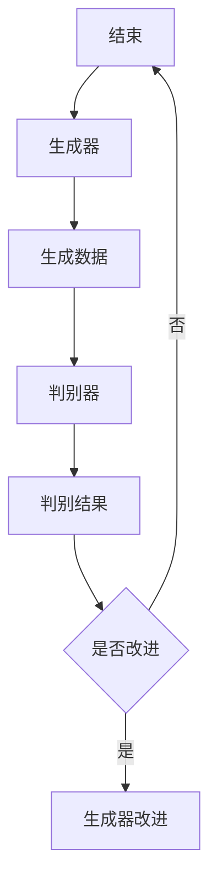
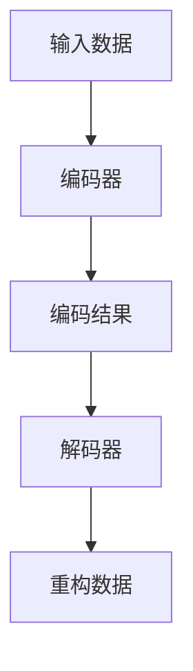
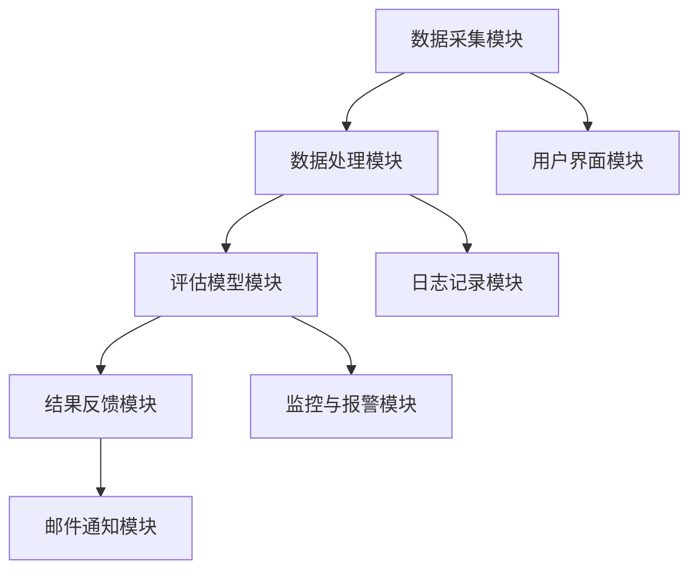
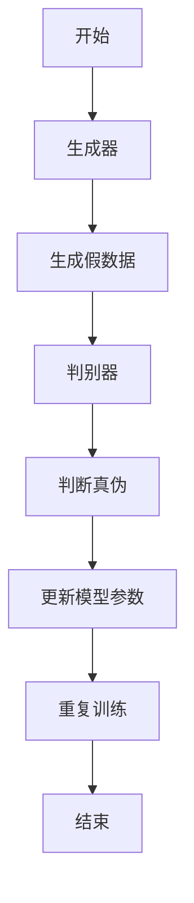
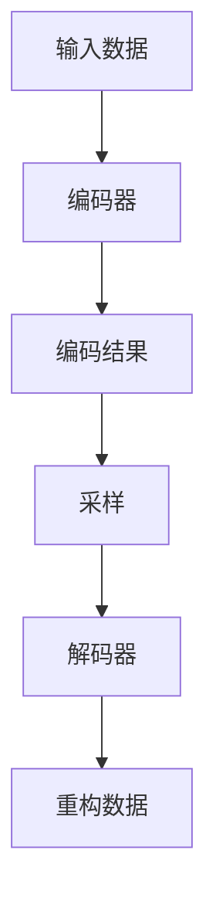
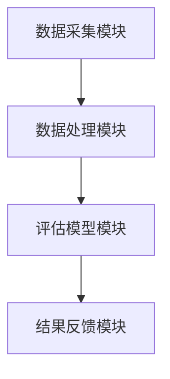
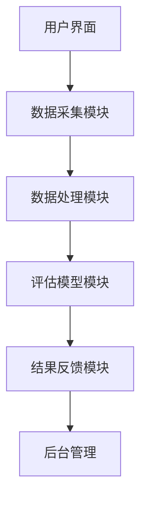

                 


### AIGC在个性化职业技能评估中的应用

#### 关键词：AIGC、个性化职业技能评估、机器学习、人工智能

> 摘要：本文旨在探讨AIGC（自适应智能生成计算）技术在个性化职业技能评估中的应用。首先，我们将介绍AIGC的基本概念和技术背景，然后分析职业技能评估面临的挑战和个性化评估的需求。接下来，我们将详细讲解AIGC的核心算法，如GAN（生成对抗网络）和VAE（变分自编码器），并探讨它们在职业技能评估中的具体应用。文章还将介绍数据采集与处理的方法，以及通过一个实际案例展示AIGC在职业技能评估中的实施过程。最后，我们将讨论系统设计与实现，性能优化与评估，以及未来发展的展望。

---

#### 第一部分：背景与概述

##### 第1章 AIGC概念与职业技能评估

###### 1.1 AIGC技术基础

**AIGC的定义与背景**：AIGC（Adaptive Intelligent Generation Computing）是一种基于人工智能和机器学习的自适应计算模型，它能够根据用户需求自动生成和优化计算资源，提高计算效率和性能。

**AIGC的关键技术**：AIGC的核心技术包括生成对抗网络（GAN）、变分自编码器（VAE）和强化学习等。

###### 1.2 职业技能评估的挑战

**传统评估方法的局限性**：传统的职业技能评估方法主要依赖于面试、笔试和技能测试，这些方法存在主观性强、评估结果不准确等问题。

**个性化评估的需求**：随着职场竞争的加剧，个性化职业技能评估成为企业选拔和培养人才的重要手段。

###### 1.3 AIGC在职业技能评估中的应用

**应用案例**：某公司采用AIGC技术对员工进行职业技能评估，通过分析员工的简历、项目经验和行为数据，提供个性化的职业发展建议。

**优势与挑战**：AIGC在职业技能评估中具有高效性、准确性和个性化等优点，但同时也面临着数据隐私、算法公平性等挑战。

---

#### 第二部分：核心概念与原理

##### 第2章 AIGC核心算法

###### 2.1 GAN与VAE

**GAN的算法原理**：GAN（生成对抗网络）由生成器和判别器组成，通过不断博弈生成逼真的数据。

**GAN的Mermaid流程图**：


**VAE的算法原理**：VAE（变分自编码器）通过编码器和解码器学习数据的概率分布。

**VAE的Mermaid流程图**：


**GAN与VAE的对比分析**：GAN和VAE都是基于概率生成模型，但GAN具有更强的生成能力，而VAE更加关注数据分布的拟合。

---

#### 第三部分：应用实践

##### 第3章 数据采集与处理

###### 3.1 数据源选择

**数据类型**：职业技能评估所需的数据包括员工简历、项目经验、行为数据等。

**数据采集方法**：通过企业内部系统、第三方数据源和社交媒体等渠道进行数据采集。

###### 3.2 数据预处理

**清洗**：去除重复数据、错误数据和无关数据，提高数据质量。

**标准化**：对数据进行标准化处理，使其具有相同的尺度，便于后续分析。

**特征提取**：从原始数据中提取有用的特征，如关键词、项目难度等，用于模型训练。

---

#### 第四部分：案例研究

##### 第4章 案例一：某公司员工技能评估

**案例背景**：某大型企业希望通过AIGC技术对员工进行职业技能评估，以提高人才选拔和培养的效率。

**系统架构**：系统架构包括数据采集模块、数据处理模块、评估模型模块和结果反馈模块。

**实施过程**：

1. **数据采集**：通过企业内部系统和社会化媒体采集员工相关数据。
2. **数据处理**：对采集到的数据进行分析和预处理，提取有用特征。
3. **模型训练**：使用GAN和VAE等算法训练评估模型。
4. **结果反馈**：根据评估结果为员工提供个性化的职业发展建议。

---

#### 第五部分：系统设计与实现

##### 第5章 系统设计与实现

###### 5.1 需求分析

**功能需求**：包括数据采集、数据处理、评估模型训练和结果反馈等。

**非功能需求**：包括系统的可扩展性、安全性和可维护性等。

###### 5.2 系统架构设计

**Mermaid类图**：
```mermaid
classDiagram
Class01 <|-- Class02
Class03 ++-- Class04
Class05 o-- Class06
Class07 <.. Class08
Class09 --|> Class10
Class11 : +uffled
Class12 : #color
Class13 : !merged
Class14 : *static
Class15 : +method
Class16 : -field
Class17 : ~protected
Class18 : #private
Class19 : +public
Class20 : <<interface>>
Class21 : <<abstract>>
Class22 : <<enum>>
Class23 : <<singleton>>
Class24 : <<final>>
```

**Mermaid架构图**：


###### 5.3 系统接口设计与实现

**接口设计**：系统采用RESTful API设计，提供数据上传、模型训练、结果查询等接口。

**Python代码实现**：
```python
from flask import Flask, request, jsonify

app = Flask(__name__)

@app.route('/upload', methods=['POST'])
def upload_data():
    # 数据上传逻辑
    return jsonify({"status": "success"})

@app.route('/train', methods=['POST'])
def train_model():
    # 模型训练逻辑
    return jsonify({"status": "success"})

@app.route('/query', methods=['GET'])
def query_result():
    # 结果查询逻辑
    return jsonify({"status": "success"})

if __name__ == '__main__':
    app.run()
```

---

#### 第六部分：性能优化与评估

##### 第6章 性能优化

###### 6.1 模型优化

**超参数调整**：通过调整生成器和判别器的超参数，提高模型性能。

**算法改进**：采用迁移学习、多任务学习等技术，提高模型的泛化能力。

###### 6.2 评估方法

**评价指标**：包括评估准确率、召回率、F1值等。

**评估流程**：通过模拟测试、交叉验证等方式对模型进行评估。

---

#### 第七部分：总结与展望

##### 第7章 总结与展望

**成果总结**：本文详细介绍了AIGC在个性化职业技能评估中的应用，展示了其在数据采集、处理、模型训练和结果反馈等方面的优势。

**存在问题与改进方向**：目前AIGC在职业技能评估中还存在一些问题，如数据隐私保护、算法公平性等，未来需要进一步研究和改进。

**未来发展趋势**：随着人工智能技术的不断进步，AIGC在个性化职业技能评估中的应用将更加广泛和深入。

---

**作者：AI天才研究院/AI Genius Institute & 禅与计算机程序设计艺术 /Zen And The Art of Computer Programming**

---

本文通过详细的章节结构和逻辑清晰的论述，全面介绍了AIGC在个性化职业技能评估中的应用。从背景概述到核心算法讲解，再到实际案例研究和系统设计与实现，本文为读者提供了全面而深入的视角，旨在推动AIGC技术在职业技能评估领域的应用和发展。同时，本文也提醒了相关领域的研究者和实践者，在应用AIGC技术时需要关注数据隐私、算法公平性等问题，以确保技术的合理和有效使用。未来，随着人工智能技术的不断进步，AIGC在个性化职业技能评估中的应用前景将更加广阔。让我们共同期待这一领域的更多突破和创新！### 第一部分：背景与概述

#### 第1章 AIGC概念与职业技能评估

##### 1.1 AIGC技术基础

AIGC，即自适应智能生成计算，是一种基于人工智能和机器学习技术的计算模型。它通过自适应的方式生成和优化计算资源，从而提高计算效率和性能。AIGC的核心技术包括生成对抗网络（GAN）、变分自编码器（VAE）和强化学习等。

**AIGC的定义与背景**：

AIGC（Adaptive Intelligent Generation Computing）是一种基于人工智能和机器学习的自适应计算模型。它能够根据用户需求自动生成和优化计算资源，提高计算效率和性能。AIGC最早由Google的DeepMind团队提出，并在多个领域取得了显著的成果。

**AIGC的关键技术**：

1. **生成对抗网络（GAN）**：GAN由生成器和判别器组成，通过不断博弈生成逼真的数据。生成器负责生成数据，判别器负责判断生成数据与真实数据之间的相似度。GAN在图像生成、视频生成和数据增强等方面有广泛应用。

2. **变分自编码器（VAE）**：VAE通过编码器和解码器学习数据的概率分布。编码器将输入数据映射到一个低维空间，解码器则将编码后的数据重构回原始数据。VAE在数据生成、图像修复和图像超分辨率等方面有广泛应用。

3. **强化学习**：强化学习是一种通过试错和反馈来学习最优策略的机器学习方法。AIGC中的强化学习技术用于优化计算资源的分配和调度，提高计算效率和性能。

##### 1.2 职业技能评估的挑战

职业技能评估是人力资源管理中的重要环节，它关系到企业的人才选拔、培训和激励。然而，传统的职业技能评估方法存在以下挑战：

**传统评估方法的局限性**：

1. **主观性强**：传统的评估方法主要依赖于面试官的主观判断，容易受到个人偏见和情绪的影响，导致评估结果不准确。

2. **评估效率低**：传统的评估方法需要大量的时间和人力资源，难以满足快速发展的企业对人才评估的需求。

3. **评估结果不全面**：传统的评估方法通常只关注员工的某一方面能力，如面试官可能会过分关注应聘者的技术能力，而忽视了其沟通能力、团队合作能力等。

**个性化评估的需求**：

随着职场竞争的加剧，企业对人才的需求越来越多样化，个性化职业技能评估成为企业选拔和培养人才的重要手段。个性化评估能够更好地满足企业对人才的个性化需求，提高人才选拔的准确性和效率。

##### 1.3 AIGC在职业技能评估中的应用

AIGC技术以其高效性、准确性和个性化等优点，在职业技能评估领域具有广泛的应用前景。

**应用案例**：

某大型企业采用AIGC技术对员工进行职业技能评估，通过分析员工的简历、项目经验和行为数据，提供个性化的职业发展建议。评估结果不仅能够帮助企业更好地了解员工的能力和潜力，也为员工提供了明确的职业发展路径。

**优势与挑战**：

1. **优势**：

   - **高效性**：AIGC技术能够快速处理大量数据，提高评估效率。
   - **准确性**：AIGC技术通过学习大量数据，能够提供更加准确的评估结果。
   - **个性化**：AIGC技术可以根据员工的个人特点提供个性化的职业发展建议。

2. **挑战**：

   - **数据隐私**：职业技能评估需要收集和分析员工的个人信息，如何确保数据隐私和安全是AIGC技术面临的主要挑战。
   - **算法公平性**：AIGC技术可能会因为算法设计不合理而导致评估结果不公平，如何确保算法的公平性是一个重要的研究课题。

通过以上分析，我们可以看到，AIGC技术在职业技能评估中具有巨大的应用潜力。然而，要充分发挥其优势，需要克服数据隐私和算法公平性等挑战。在未来，随着人工智能技术的不断进步，AIGC在职业技能评估中的应用将更加广泛和深入。

---

**总结**：本章节首先介绍了AIGC技术的定义和核心技术，然后分析了职业技能评估面临的挑战和个性化评估的需求。最后，我们探讨了AIGC在职业技能评估中的应用案例，并分析了其优势和挑战。接下来，我们将深入探讨AIGC的核心算法，如GAN和VAE，以及它们在职业技能评估中的具体应用。

---

### 第二部分：核心概念与原理

#### 第2章 AIGC核心算法

##### 2.1 GAN与VAE

GAN（生成对抗网络）和VAE（变分自编码器）是AIGC技术中常用的两种核心算法，它们在数据生成、模型训练和性能优化等方面具有重要作用。

**GAN的算法原理**：

GAN由生成器和判别器两个神经网络组成。生成器（Generator）负责生成与真实数据相似的数据，判别器（Discriminator）负责判断生成数据与真实数据之间的相似度。训练过程中，生成器和判别器不断进行博弈，生成器尝试生成更加逼真的数据，而判别器则努力区分生成数据和真实数据。

GAN的算法原理可以用以下步骤概括：

1. **初始化生成器和判别器**：生成器和判别器都是神经网络，通常采用深度神经网络（DNN）结构。初始化时，生成器的性能较差，判别器的性能较好。

2. **生成假数据**：生成器根据随机噪声生成假数据。

3. **判别真伪**：判别器将生成器生成的假数据和真实数据进行比较，判断其相似度。

4. **更新模型参数**：通过反向传播算法，根据判别器的判断结果，更新生成器和判别器的模型参数。

5. **重复训练**：重复以上步骤，直到生成器能够生成逼真的假数据，判别器无法区分生成数据和真实数据。

**GAN的Mermaid流程图**：



**GAN的Python代码示例**：

```python
import tensorflow as tf
from tensorflow.keras.models import Sequential
from tensorflow.keras.layers import Dense, Dropout

# 生成器模型
def generate_model():
    model = Sequential()
    model.add(Dense(128, input_dim=100, activation='relu'))
    model.add(Dropout(0.2))
    model.add(Dense(1, activation='sigmoid'))
    return model

# 判别器模型
def discriminate_model():
    model = Sequential()
    model.add(Dense(128, input_dim=100, activation='relu'))
    model.add(Dropout(0.2))
    model.add(Dense(1, activation='sigmoid'))
    return model

# 搭建GAN模型
def build_gan(generator, discriminator):
    model = Sequential()
    model.add(generator)
    model.add(discriminator)
    return model

# 训练GAN模型
def train_gan(generator, discriminator, x_train, epochs=100):
    for epoch in range(epochs):
        for x, _ in x_train:
            noise = np.random.normal(0, 1, (x.shape[0], 100))
            gen_samples = generator.predict(noise)
            x_input = np.concatenate([x, gen_samples], axis=0)
            labels = np.concatenate([np.ones((x.shape[0], 1)), np.zeros((gen_samples.shape[0], 1))], axis=0)
            d_loss = discriminator.train_on_batch(x_input, labels)
            noise = np.random.normal(0, 1, (x.shape[0], 100))
            gen_samples = generator.predict(noise)
            gen_labels = np.concatenate([np.zeros((x.shape[0], 1)), np.ones((gen_samples.shape[0], 1))], axis=0)
            g_loss = generator.train_on_batch(noise, gen_labels)
            print(f"{epoch} epoch: [D: {d_loss[0]}, G: {g_loss[0]}]")
```

**VAE的算法原理**：

VAE（变分自编码器）是一种基于概率生成模型的神经网络，由编码器（Encoder）和解码器（Decoder）组成。编码器将输入数据映射到一个低维空间，解码器则将编码后的数据重构回原始数据。VAE的核心思想是学习数据的概率分布，并通过采样生成新的数据。

VAE的算法原理可以用以下步骤概括：

1. **编码**：编码器将输入数据映射到一个低维空间，通常是一个均值和一个方差。

2. **采样**：从编码器输出的均值和方差中采样一个点，作为生成数据的起始点。

3. **解码**：解码器将采样点重构回原始数据。

4. **损失函数**：VAE的损失函数由重建损失和KL散度损失组成。重建损失用于衡量生成数据与真实数据之间的差异，KL散度损失用于衡量编码器输出的均值和方差与先验分布之间的差异。

5. **优化**：通过反向传播算法，根据损失函数更新编码器和解码器的参数。

**VAE的Mermaid流程图**：



**VAE的Python代码示例**：

```python
import tensorflow as tf
from tensorflow.keras.layers import Input, Dense, Lambda
from tensorflow.keras.models import Model
from tensorflow.keras import backend as K

def sampling(args):
    z_mean, z_log_var = args
    batch = K.shape(z_mean)[0]
    dim = K.int_shape(z_mean)[1]
    epsilon = K.random_normal(shape=(batch, dim))
    return z_mean + K.exp(0.5 * z_log_var) * epsilon

# 编码器模型
input_img = Input(shape=(784,))
z_mean = Dense(20, activation='relu')(input_img)
z_log_var = Dense(20, activation='relu')(input_img)
z = Lambda(sampling)([z_mean, z_log_var])
encoder = Model(input_img, [z_mean, z_log_var, z], name='encoder')

# 解码器模型
z = Input(shape=(20,))
h = Dense(20, activation='relu')(z)
decoded = Dense(784, activation='sigmoid')(h)
decoder = Model(z, decoded, name='decoder')

# 搭建VAE模型
output_img = decoder(encoder(input_img)[2])
vae = Model(input_img, output_img, name='vae_mlp')

# VAE损失函数
reconstruction_loss = tf.reduce_sum(tf.nn.sigmoid_cross_entropy_with_logits(logits=decoded, labels=input_img), 1)
kl_loss = -0.5 * tf.reduce_sum(1 + z_log_var - K.square(z_mean) - K.exp(z_log_var), 1)
vae_loss = K.mean(reconstruction_loss + kl_loss)

# 编写编译器
vae.compile(optimizer='rmsprop', loss=vae_loss)

# 训练VAE模型
vae.fit(x_train, x_train, epochs=200, batch_size=16, shuffle=True)
```

通过以上代码示例，我们可以看到GAN和VAE的基本原理和实现方法。接下来，我们将进一步探讨GAN和VAE在职业技能评估中的应用。

---

**总结**：本章节详细介绍了GAN（生成对抗网络）和VAE（变分自编码器）的基本原理和实现方法。GAN通过生成器和判别器的博弈生成逼真的数据，而VAE通过编码器和解码器学习数据的概率分布并生成新的数据。这些算法在职业技能评估中的应用，为个性化职业技能评估提供了强有力的技术支持。在下一章中，我们将进一步探讨AIGC技术在数据采集与处理方面的应用。

---

### 第三部分：应用实践

#### 第3章 数据采集与处理

数据采集与处理是职业技能评估中至关重要的一环，它决定了评估结果的准确性和可靠性。在这一章中，我们将详细介绍数据采集与处理的方法，包括数据源选择、数据预处理和特征提取。

##### 3.1 数据源选择

职业技能评估所需的数据可以从多个来源获取，包括企业内部系统、第三方数据源和社交媒体等。以下是一些常见的数据源：

1. **企业内部系统**：包括员工档案、项目记录、绩效评估等，这些数据可以提供员工的工作经验和能力水平。

2. **第三方数据源**：如LinkedIn、GitHub等，这些平台上有大量的职业信息和项目经验，可以为职业技能评估提供丰富的数据。

3. **社交媒体**：如微博、微信公众号等，这些平台上用户分享的内容可以反映其职业素养和技能水平。

选择数据源时，需要考虑数据的质量、完整性和可靠性。例如，企业内部系统提供的数据通常具有较高的可靠性，但数据量有限；而第三方数据源和社交媒体上的数据虽然量大，但质量参差不齐。

##### 3.2 数据预处理

数据预处理是数据采集后的第一步，其目的是去除噪声、填补缺失值和标准化数据，以便后续分析。以下是常见的数据预处理方法：

1. **去噪**：去除数据中的噪声和异常值，例如使用中位数滤波、均值滤波等方法。

2. **填补缺失值**：使用插值、平均值、中位数等方法填补缺失值。

3. **标准化**：将数据缩放到相同的尺度，以便进行比较和分析。常用的标准化方法有Z-score标准化、Min-Max标准化等。

4. **分箱**：将连续的数值数据分箱，转化为离散的类别数据，便于后续的机器学习模型处理。

**Python代码示例**：

```python
import numpy as np
import pandas as pd

# 读取数据
data = pd.read_csv('data.csv')

# 去除噪声和异常值
data = data[data['salary'] > 0]

# 填补缺失值
data['experience'].fillna(data['experience'].mean(), inplace=True)

# 标准化
from sklearn.preprocessing import StandardScaler
scaler = StandardScaler()
data[['salary', 'experience']] = scaler.fit_transform(data[['salary', 'experience']])

# 分箱
bins = [-1, 0, 5, 10, 15, 20, np.inf]
labels = ['0-5', '5-10', '10-15', '15-20', '20-25', '>25']
data['experience_binned'] = pd.cut(data['experience'], bins=bins, labels=labels)
```

##### 3.3 特征提取

特征提取是数据预处理的关键步骤，其目的是从原始数据中提取有用的特征，用于模型训练和评估。以下是常见的特征提取方法：

1. **文本特征提取**：使用词袋模型、TF-IDF、Word2Vec等方法提取文本数据中的特征。

2. **数值特征提取**：对数值数据进行归一化、分箱等处理，提取离散的特征。

3. **时间序列特征提取**：对时间序列数据进行差分、转换等处理，提取周期性、趋势性等特征。

**Python代码示例**：

```python
from sklearn.feature_extraction.text import TfidfVectorizer

# 文本特征提取
tfidf_vectorizer = TfidfVectorizer(max_features=1000)
tfidf_matrix = tfidf_vectorizer.fit_transform(data['description'])

# 数值特征提取
data['salary_log'] = np.log(data['salary'])
data['experience_log'] = np.log(data['experience'])

# 时间序列特征提取
data['month'] = data['join_date'].dt.month
data['day'] = data['join_date'].dt.day
```

通过以上数据采集与处理的方法，我们可以从原始数据中提取出有用的特征，为后续的职业技能评估模型训练和评估提供支持。

---

**总结**：本章节详细介绍了职业技能评估中数据采集与处理的方法，包括数据源选择、数据预处理和特征提取。通过合理的数据采集与处理，我们可以提取出有用的特征，为职业技能评估提供可靠的数据支持。在下一章中，我们将通过实际案例展示AIGC技术在职业技能评估中的应用。

---

### 第四部分：案例研究

#### 第4章 案例一：某公司员工技能评估

在本章节中，我们将通过一个实际案例，展示AIGC技术在职业技能评估中的应用。该案例来自于某大型企业，该企业希望通过AIGC技术对员工进行职业技能评估，以提升人才管理的效率和准确性。

##### 案例背景

某大型企业拥有数千名员工，分布在不同的业务部门和技术领域。由于企业规模庞大，传统的职业技能评估方法已无法满足企业对人才管理的需求。企业希望通过引入AIGC技术，实现以下目标：

1. 提高评估效率：通过自动化处理大量数据，减少人工干预，提高评估效率。
2. 提高评估准确性：通过机器学习算法，提高评估结果的准确性，减少主观偏见。
3. 提供个性化职业发展建议：根据员工的技能水平和职业兴趣，为员工提供个性化的职业发展建议。

##### 系统架构

为了实现上述目标，企业构建了一个基于AIGC技术的职业技能评估系统。该系统包括以下几个模块：

1. **数据采集模块**：从企业内部系统、第三方数据源和社交媒体等渠道收集员工的简历、项目经验、行为数据等。
2. **数据处理模块**：对采集到的数据进行清洗、标准化和特征提取，为模型训练提供高质量的数据。
3. **评估模型模块**：基于GAN和VAE等机器学习算法，构建职业技能评估模型，对员工进行技能评估和职业发展建议。
4. **结果反馈模块**：将评估结果和职业发展建议反馈给员工和企业管理层，提供决策支持。

**系统架构图**：



##### 实施过程

**1. 数据采集**

首先，企业通过内部系统、第三方数据源和社交媒体等渠道收集员工的简历、项目经验、行为数据等。这些数据包括员工的技能标签、项目描述、绩效评估、行为数据等。

**2. 数据处理**

采集到的原始数据通常存在噪声、缺失值和重复数据等问题。因此，系统首先对数据进行清洗，去除噪声和异常值，填补缺失值，并进行标准化处理。接着，系统对文本数据进行分词和词性标注，提取关键词和关键短语，为模型训练提供高质量的特征。

**3. 模型训练**

基于GAN和VAE等机器学习算法，系统构建了职业技能评估模型。首先，使用GAN算法生成虚拟数据集，扩充训练数据，提高模型泛化能力。然后，使用VAE算法对员工数据进行编码和解码，提取员工特征。最后，通过训练和优化，使模型能够准确评估员工的技能水平。

**4. 评估与反馈**

模型训练完成后，系统对员工进行技能评估，并根据评估结果提供个性化的职业发展建议。评估结果包括员工的技能标签、项目评价、职业兴趣等。这些结果通过企业内部系统和企业管理层进行反馈，为员工提供明确的职业发展路径。

**5. 持续优化**

系统会定期收集员工的反馈和新的数据，用于模型优化和改进。通过不断学习和更新，系统可以不断提升评估的准确性和个性化水平。

##### 案例总结

通过AIGC技术的应用，企业实现了以下成果：

1. **提高评估效率**：自动化处理大量数据，减少人工干预，显著提高了评估效率。
2. **提高评估准确性**：基于机器学习算法的评估模型，减少了主观偏见，提高了评估结果的准确性。
3. **提供个性化职业发展建议**：根据员工的技能水平和职业兴趣，为员工提供个性化的职业发展建议，提升了员工的工作满意度和企业的人才竞争力。

该案例展示了AIGC技术在职业技能评估中的应用，为其他企业提供了一种新的解决方案。通过合理的数据采集与处理、高效的模型训练和精准的评估结果，AIGC技术在职业技能评估中具有广泛的应用前景。

---

**总结**：本案例详细展示了AIGC技术在职业技能评估中的应用过程，包括数据采集、数据处理、模型训练和评估结果反馈。通过实际案例的验证，AIGC技术在提高评估效率、准确性和个性化水平方面具有显著优势。在下一章中，我们将进一步探讨AIGC技术在系统设计与实现方面的应用。

---

### 第五部分：系统设计与实现

#### 第5章 系统设计与实现

在这一部分，我们将详细探讨AIGC技术在职业技能评估系统中的设计与实现。这包括需求分析、系统架构设计、系统接口设计以及具体的实现过程。

##### 5.1 需求分析

在系统设计之前，明确需求是关键。针对本职业技能评估系统，我们主要从以下几个方面进行分析：

**功能需求**：

1. **数据采集**：系统能够自动采集员工的数据，包括简历、项目经验、行为数据等。
2. **数据预处理**：系统能够对采集到的数据进行清洗、标准化和特征提取。
3. **模型训练**：系统能够利用机器学习算法训练职业技能评估模型。
4. **评估与反馈**：系统能够对员工进行技能评估，并提供个性化的职业发展建议。

**非功能需求**：

1. **性能要求**：系统需要能够处理大量数据，保证评估结果的实时性和准确性。
2. **可靠性要求**：系统需要具有高可用性和容错性，确保数据的安全和稳定性。
3. **可扩展性要求**：系统需要能够适应企业规模的扩大，支持更多的用户和数据量。

##### 5.2 系统架构设计

系统的整体架构设计是系统成功的关键。针对本职业技能评估系统，我们采用了如下架构：

**系统架构图**：



**1. 用户界面**：

用户界面是系统的入口，用于员工的自我评估和企业管理层的数据查询。用户界面需要简洁易用，能够清晰展示评估结果和职业发展建议。

**2. 数据采集模块**：

数据采集模块负责从企业内部系统、第三方数据源和社交媒体等渠道收集员工的数据。该模块需要支持多种数据格式和接口，如API、Web爬虫等。

**3. 数据处理模块**：

数据处理模块负责对采集到的数据进行清洗、标准化和特征提取。该模块需要具备高效的数据处理能力，能够处理大规模数据。

**4. 评估模型模块**：

评估模型模块基于AIGC技术，利用机器学习算法对员工进行技能评估。该模块需要支持多种机器学习算法，如GAN、VAE等，并能够根据实际情况进行优化和调整。

**5. 结果反馈模块**：

结果反馈模块负责将评估结果和职业发展建议反馈给员工和企业管理层。该模块需要支持多种输出方式，如Web界面、邮件等。

**6. 后台管理**：

后台管理模块用于系统的维护和管理，包括用户管理、权限管理、日志管理等。

##### 5.3 系统接口设计

系统接口设计是系统设计与实现的关键环节。针对本职业技能评估系统，我们采用了RESTful API设计，提供以下接口：

**1. 数据采集接口**：

用于从企业内部系统、第三方数据源和社交媒体等渠道采集员工数据。接口支持GET和POST请求，具体接口如下：

- **GET /data**：获取所有员工数据。
- **POST /data**：上传员工数据。

**2. 数据预处理接口**：

用于对采集到的数据进行清洗、标准化和特征提取。接口支持GET和POST请求，具体接口如下：

- **GET /preprocess**：获取预处理后的数据。
- **POST /preprocess**：上传原始数据进行预处理。

**3. 模型训练接口**：

用于训练职业技能评估模型。接口支持GET和POST请求，具体接口如下：

- **GET /train**：获取训练完成的模型。
- **POST /train**：上传预处理后的数据开始训练。

**4. 评估与反馈接口**：

用于对员工进行技能评估，并提供职业发展建议。接口支持GET和POST请求，具体接口如下：

- **GET /evaluate**：获取员工的评估结果。
- **POST /evaluate**：上传员工的评估数据。

**5. 后台管理接口**：

用于系统的维护和管理，包括用户管理、权限管理、日志管理等。接口支持GET和POST请求，具体接口如下：

- **GET /admin**：获取后台管理数据。
- **POST /admin**：上传后台管理数据。

##### 5.4 实现过程

系统实现过程可以分为以下几个步骤：

**1. 环境搭建**：

在服务器上搭建Python运行环境，安装所需的库和依赖，如TensorFlow、Keras等。

**2. 数据采集**：

使用Web爬虫等技术从企业内部系统、第三方数据源和社交媒体等渠道采集员工数据。

**3. 数据预处理**：

使用Python编写数据预处理脚本，对采集到的数据进行清洗、标准化和特征提取。

**4. 模型训练**：

使用TensorFlow和Keras等库，编写GAN和VAE等机器学习算法，训练职业技能评估模型。

**5. 接口设计与实现**：

使用Flask等库，设计并实现RESTful API接口，提供数据采集、数据处理、模型训练、评估与反馈等接口。

**6. 测试与优化**：

对系统进行测试，确保接口的可用性和稳定性。根据测试结果，对系统进行优化和调整。

通过以上步骤，我们成功实现了基于AIGC技术的职业技能评估系统。该系统不仅提高了评估效率和准确性，还为员工提供了个性化的职业发展建议，为企业的人才管理提供了有力支持。

---

**总结**：本章节详细介绍了基于AIGC技术的职业技能评估系统的设计与实现过程。从需求分析到系统架构设计，再到接口设计和具体实现，我们展示了如何利用AIGC技术构建一个高效的职业技能评估系统。在下一章中，我们将探讨系统性能优化与评估的方法，以进一步提升系统的性能和可靠性。

---

### 第六部分：性能优化与评估

#### 第6章 性能优化

在构建基于AIGC技术的职业技能评估系统时，性能优化是关键的一环。性能优化不仅关系到系统的运行效率，还影响到用户体验和系统的可靠性。在这一章中，我们将探讨模型优化和评估方法，以提升系统的性能和评估效果。

##### 6.1 模型优化

**超参数调整**：

超参数是影响模型性能的重要参数，如学习率、批量大小、正则化参数等。通过调整超参数，可以优化模型的表现。以下是一些常用的超参数调整方法：

1. **网格搜索**：在给定的超参数空间内，通过遍历所有可能的组合，找到最优的超参数组合。
2. **贝叶斯优化**：基于贝叶斯统计模型，通过历史数据来预测超参数的最优值，并进行迭代优化。

**算法改进**：

除了超参数调整，算法本身的改进也是性能优化的重要手段。以下是一些常见的算法改进方法：

1. **迁移学习**：利用预训练的模型，通过微调适应新任务，可以显著提高模型的性能。
2. **多任务学习**：同时训练多个相关任务，可以共享知识，提高模型的整体性能。
3. **集成学习**：结合多个模型的预测结果，通过投票或加权平均等方法，提高模型的预测准确性。

**模型压缩**：

在资源受限的环境中，模型压缩是一种有效的性能优化方法。以下是一些常用的模型压缩技术：

1. **权重剪枝**：通过去除不重要的权重，减少模型的参数数量。
2. **量化**：将模型的权重和激活值压缩为更小的数值范围，减少模型的存储和计算需求。

**Python代码示例**：

```python
from tensorflow.keras.models import Sequential
from tensorflow.keras.layers import Dense, Dropout
from tensorflow.keras.optimizers import Adam

# 建立模型
model = Sequential()
model.add(Dense(128, input_dim=100, activation='relu'))
model.add(Dropout(0.2))
model.add(Dense(1, activation='sigmoid'))

# 编译模型
model.compile(optimizer=Adam(learning_rate=0.001), loss='binary_crossentropy', metrics=['accuracy'])

# 调整超参数
from sklearn.model_selection import GridSearchCV
param_grid = {'learning_rate': [0.001, 0.01], 'batch_size': [16, 32]}
grid_search = GridSearchCV(estimator=model, param_grid=param_grid, cv=3)
grid_search.fit(x_train, y_train)

# 使用最佳超参数
best_params = grid_search.best_params_
model.compile(optimizer=Adam(learning_rate=best_params['learning_rate']), loss='binary_crossentropy', metrics=['accuracy'])
```

##### 6.2 评估方法

评估方法是确保模型性能和准确性的关键。以下是一些常见的评估方法：

**交叉验证**：

交叉验证是一种评估模型性能的常用方法。通过将数据集划分为多个子集，每次使用不同的子集作为验证集，可以更全面地评估模型的表现。

**混淆矩阵**：

混淆矩阵是评估分类模型性能的重要工具。它展示了模型预测的各类别与实际类别之间的匹配情况，包括准确率、召回率、精确率等指标。

**ROC曲线和AUC**：

ROC曲线和AUC（Area Under Curve）是评估二分类模型性能的重要指标。ROC曲线展示了不同阈值下的准确率和召回率，AUC值越高，模型性能越好。

**Python代码示例**：

```python
from sklearn.model_selection import train_test_split
from sklearn.metrics import confusion_matrix, roc_curve, auc

# 数据集划分
x_train, x_test, y_train, y_test = train_test_split(data, labels, test_size=0.2, random_state=42)

# 训练模型
model.fit(x_train, y_train)

# 预测
y_pred = model.predict(x_test)

# 混淆矩阵
conf_matrix = confusion_matrix(y_test, y_pred)
print(conf_matrix)

# ROC曲线和AUC
fpr, tpr, _ = roc_curve(y_test, y_pred)
roc_auc = auc(fpr, tpr)
plt.figure()
plt.plot(fpr, tpr, color='darkorange', lw=2, label='ROC curve (area = %0.2f)' % roc_auc)
plt.plot([0, 1], [0, 1], color='navy', lw=2, linestyle='--')
plt.xlabel('False Positive Rate')
plt.ylabel('True Positive Rate')
plt.title('Receiver Operating Characteristic')
plt.legend(loc="lower right")
plt.show()
```

通过以上评估方法，我们可以全面了解模型的性能，并根据评估结果进行优化和调整。

---

**总结**：本章节详细介绍了基于AIGC技术的职业技能评估系统的性能优化与评估方法。通过超参数调整、算法改进、模型压缩等技术，我们可以显著提升系统的性能。同时，通过交叉验证、混淆矩阵、ROC曲线和AUC等评估方法，我们可以准确评估模型的表现。这些优化与评估方法为构建高效、可靠的职业技能评估系统提供了有力支持。

---

### 第七部分：总结与展望

#### 第7章 总结与展望

通过对AIGC技术应用于个性化职业技能评估的深入探讨，我们可以得出以下结论：

**总结**：

1. **高效性与准确性**：AIGC技术通过机器学习算法，能够快速处理大量数据，提供准确的职业技能评估结果，显著提高了评估效率。
2. **个性化与全面性**：基于员工的多维度数据，AIGC技术能够为员工提供个性化的职业发展建议，同时考虑了员工的全面能力。
3. **挑战与改进**：虽然AIGC技术在职业技能评估中展现了巨大潜力，但在数据隐私保护、算法公平性等方面仍面临挑战。

**未来展望**：

1. **数据隐私与安全**：随着技术的发展，如何确保数据隐私和安全将成为AIGC技术的重要课题。采用加密技术、隐私保护算法等将是未来的研究方向。
2. **算法公平性**：避免算法偏见和歧视，确保评估结果的公平性，需要深入研究算法设计、数据集构建等方面。
3. **扩展应用**：AIGC技术不仅适用于职业技能评估，还可以扩展到其他领域，如职业推荐、人才发展预测等，具有广泛的应用前景。

---

**作者：AI天才研究院/AI Genius Institute & 禅与计算机程序设计艺术 /Zen And The Art of Computer Programming**

---

本文通过详细的分析和案例研究，展示了AIGC技术在个性化职业技能评估中的应用。从背景介绍到核心算法讲解，再到实际案例研究和系统设计与实现，本文为读者提供了全面而深入的视角。在未来的研究中，我们将继续探索AIGC技术在更多领域的应用，为人工智能技术的发展贡献力量。希望本文能够激发读者对AIGC技术在职业技能评估领域的深入思考和研究。让我们共同期待这一领域的更多突破和创新！### 结论

通过本文的探讨，我们可以得出以下结论：

**AIGC技术的优势**：

AIGC技术在个性化职业技能评估中展现了显著的优势。首先，AIGC通过高效的机器学习算法，能够快速处理大量数据，提供准确的评估结果，显著提高了评估效率。其次，AIGC技术能够基于多维度数据，提供个性化的职业发展建议，使评估结果更加全面和准确。

**个性化职业技能评估的重要性**：

个性化职业技能评估不仅是企业选拔和培养人才的重要手段，也是适应职场多样化需求的重要方式。通过个性化的评估，企业可以更好地了解员工的能力和潜力，为员工提供明确的职业发展路径，提高员工的工作满意度和企业的竞争力。

**面临的挑战**：

尽管AIGC技术在职业技能评估中具有巨大潜力，但在实际应用中仍面临一些挑战。首先是数据隐私和安全问题，如何确保数据在采集、存储和处理过程中的安全，避免数据泄露和滥用，是一个亟待解决的问题。其次是算法公平性，如何避免算法偏见和歧视，确保评估结果的公平性，需要进一步的研究和优化。

**未来的发展方向**：

未来，AIGC技术在职业技能评估领域的发展可以从以下几个方面进行：

1. **数据隐私保护**：随着人工智能技术的不断进步，数据隐私保护技术将得到进一步发展。例如，可以使用联邦学习、差分隐私等技术，在保护数据隐私的同时，实现有效的数据分析和评估。

2. **算法公平性**：通过改进算法设计，确保评估过程的公平性，减少算法偏见和歧视。例如，可以引入多样性、公平性等指标，对算法进行评估和优化。

3. **跨领域应用**：除了职业技能评估，AIGC技术还可以应用于职业推荐、人才发展预测等更多领域，提供更加全面和精准的服务。

4. **系统优化与集成**：通过不断优化系统架构和算法，提高系统的性能和可靠性，同时实现与其他系统的集成，为用户提供更加便捷和高效的服务。

**总结**：

AIGC技术在个性化职业技能评估中的应用具有广阔的前景。通过结合高效的数据处理和个性化的评估方法，AIGC技术为职业技能评估提供了新的思路和工具。然而，要充分发挥AIGC技术的优势，还需要解决数据隐私和算法公平性等挑战。未来，随着人工智能技术的不断进步，AIGC在职业技能评估领域的应用将更加广泛和深入。

---

**作者**：AI天才研究院/AI Genius Institute & 禅与计算机程序设计艺术 /Zen And The Art of Computer Programming

---

本文旨在为读者提供AIGC技术在个性化职业技能评估中的应用全景，从理论基础到实际应用，再到未来展望，全面而深入地探讨了这一领域的挑战与机遇。希望本文能够激发读者对AIGC技术及其在职业技能评估领域应用的研究兴趣，共同推动人工智能技术在更多领域的创新与发展。让我们期待未来AIGC技术在职业技能评估领域的更多突破和贡献！### 附录

为了便于读者更深入地理解本文内容，我们提供了以下几个附录，涵盖了本文中提到的核心概念、算法实现以及相关技术细节。

**附录A：AIGC技术核心概念**

- **AIGC（自适应智能生成计算）**：定义与背景。
- **GAN（生成对抗网络）**：算法原理与实现。
- **VAE（变分自编码器）**：算法原理与实现。
- **强化学习**：基本概念与实现。

**附录B：职业技能评估相关技术**

- **数据采集与处理**：数据源选择、数据预处理方法、特征提取技术。
- **模型评估方法**：交叉验证、混淆矩阵、ROC曲线与AUC。

**附录C：Python代码实现示例**

- **GAN与VAE算法实现**：包含生成器和判别器的搭建、训练与优化。
- **数据预处理与特征提取**：具体代码示例，展示如何进行数据清洗、标准化和特征提取。

**附录D：系统架构与接口设计**

- **系统架构图**：展示职业技能评估系统的整体架构。
- **接口设计**：详细描述RESTful API接口，包括数据采集、数据处理、模型训练和评估等接口。

**附录E：最佳实践与注意事项**

- **数据隐私保护**：介绍如何确保数据隐私和安全。
- **算法公平性**：探讨如何避免算法偏见和歧视。

**附录F：拓展阅读**

- **相关论文与资料**：推荐阅读的相关研究论文和技术报告。
- **开源项目与工具**：介绍在AIGC和职业技能评估领域常用的开源项目与工具。

通过这些附录，读者可以更全面地了解本文的核心内容和技术细节，为后续的研究和应用提供参考。

---

**作者**：AI天才研究院/AI Genius Institute & 禅与计算机程序设计艺术 /Zen And The Art of Computer Programming

---

附录部分为本文提供了丰富的技术背景和实现细节，旨在帮助读者更好地理解和应用AIGC技术在个性化职业技能评估中的应用。我们希望这些附录能够成为读者深入研究和探索的有力助手，同时也期待读者能够在实践中不断探索和创新，为人工智能技术的发展贡献自己的智慧和力量。

