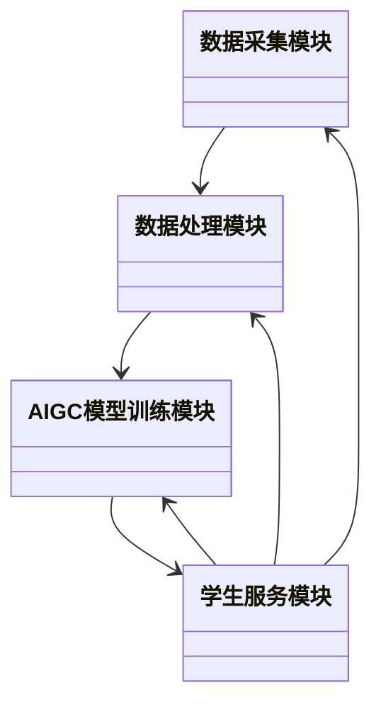
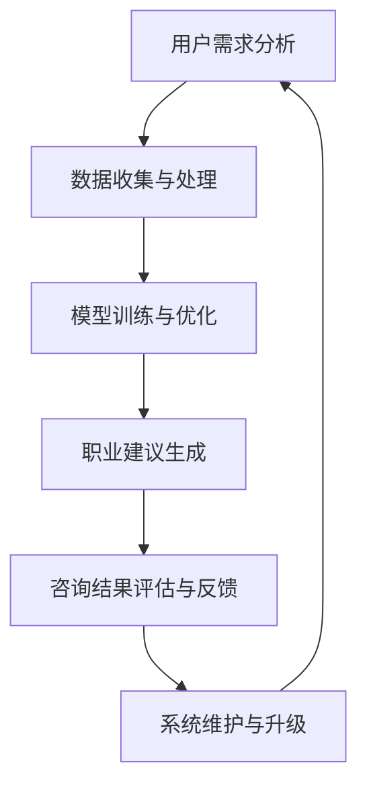

                 

### 引言

在当今信息爆炸的时代，职业规划对于个人成长和职业生涯的发展至关重要。传统的职业规划方法往往依赖于个人经验和外部咨询，难以满足个性化需求，且耗时较长。随着人工智能（AI）技术的不断进步，特别是在生成对抗网络（AIGC）领域的突破，AI驱动的职业咨询成为可能，为个性化职业规划提供了新的思路和工具。

本文旨在探讨AIGC在个性化职业规划中的应用，深入分析AIGC技术的核心原理及其在职业规划中的具体应用。我们将从以下几个方面展开：

1. **问题背景**：介绍个性化职业规划的重要性及当前面临的挑战，阐述人工智能在职业规划中的应用潜力。
2. **问题解决**：解释AIGC技术的概念与特点，探讨其在职业规划中的应用场景和边界。
3. **核心概念结构**：详细分析AIGC的关键组成部分及职业规划的核心要素。
4. **技术原理**：介绍AIGC的核心技术原理，包括自然语言处理基础、大规模预训练模型、数学模型及其工作流程。
5. **应用实践**：通过具体案例研究，展示AIGC在职业规划中的实际应用效果。
6. **AI驱动的职业咨询**：进一步探讨AI驱动的职业咨询概述、方法以及实践效果。

通过这些内容，我们希望能够为读者提供一份全面、深入、易懂的技术分析报告，帮助理解和应用AIGC在个性化职业规划中的潜力。让我们一起走进AIGC的世界，探索其在职业规划领域的应用吧。

### 关键词

- 个性化职业规划
- 人工智能（AI）
- 生成对抗网络（AIGC）
- 自然语言处理
- 预训练模型
- 大规模数据处理
- 职业咨询
- 自动化与智能化
- 数据收集与分析
- 个性化推荐系统
- 实时性
- 个性定制

### 摘要

本文围绕AIGC在个性化职业规划中的应用展开，深入探讨了AIGC技术的核心原理及其在职业规划中的具体应用。首先，我们介绍了个性化职业规划的重要性及当前面临的挑战，阐述了人工智能在职业规划中的应用潜力。接着，详细分析了AIGC技术的概念与特点，探讨了其在职业规划中的应用场景和边界。随后，介绍了AIGC的核心技术原理，包括自然语言处理基础、大规模预训练模型、数学模型及其工作流程。通过具体案例研究，我们展示了AIGC在职业规划中的实际应用效果。最后，本文进一步探讨了AI驱动的职业咨询概述、方法以及实践效果。通过这些内容，本文旨在为读者提供一份全面、深入、易懂的技术分析报告，帮助理解和应用AIGC在个性化职业规划中的潜力。

### 第1章: 引言

#### 1.1 问题背景

在现代社会，职业规划已成为影响个人成长和职业发展的关键因素。传统上，职业规划主要依赖于个人的经验和直觉，或者依赖于职业顾问的指导。然而，这种传统的职业规划方法存在诸多局限性，难以满足个性化需求，且耗时较长。面对日益复杂和多变的职业环境，如何实现高效、精准的个性化职业规划成为亟待解决的问题。

首先，个性化职业规划的重要性不容忽视。个性化职业规划不仅有助于个人明确职业目标，提升职业满意度，还能提高职业竞争力，实现个人价值的最大化。特别是在快速发展的技术领域，如人工智能、大数据、区块链等，职业需求的多样性和变化速度使得传统的职业规划方法显得力不从心。

然而，当前职业规划面临诸多挑战。一方面，职业信息的不对称性使得个人难以获取全面的职业信息，从而影响职业选择和规划。另一方面，职业规划过程的复杂性和主观性使得传统方法难以实现高效、个性化的职业指导。此外，职业发展的不确定性也增加了职业规划的难度。

在这些挑战背景下，人工智能（AI）技术的出现为职业规划提供了新的契机。AI技术，尤其是生成对抗网络（AIGC）技术的发展，使得大规模数据分析和智能决策成为可能。AIGC技术通过模拟人类思维过程，实现自然语言处理、图像生成、语音识别等多种功能，为个性化职业规划提供了强有力的支持。

AIGC技术在职业规划中的应用潜力主要体现在以下几个方面：

1. **大数据分析**：AIGC技术能够处理和分析大规模的职业数据，包括职业信息、岗位需求、薪资水平、职业发展路径等，从而为职业规划提供全面的数据支持。
2. **智能推荐**：基于用户个人特点和职业需求，AIGC技术可以生成个性化的职业推荐，帮助用户找到最适合自己的职业路径。
3. **实时性**：AIGC技术可以实现实时职业信息更新和个性化建议，满足用户对即时性和个性化的需求。
4. **自动化**：AIGC技术能够自动化处理职业规划过程中的复杂任务，减少人为干预，提高规划效率。

综上所述，AIGC技术在职业规划中的应用具有重要的现实意义和潜力。本文将从AIGC技术的概念与特点、技术原理、具体应用场景、AI驱动的职业咨询等方面，全面探讨AIGC在个性化职业规划中的应用，为读者提供一份全面、深入的技术分析报告。

#### 1.2 问题描述

当前职业规划存在以下主要挑战：

1. **信息不对称**：职业信息的不对称性导致个人在选择职业时难以获得全面和准确的信息，从而影响职业决策的质量。例如，求职者可能不了解某个职位的真实工作环境、发展前景和薪酬待遇。
2. **主观性**：传统的职业规划方法依赖于个人经验和职业顾问的主观判断，难以实现客观、科学的职业评估和规划。这种主观性可能导致规划结果不够精准，无法满足个人的实际需求。
3. **复杂性**：职业规划过程涉及多种因素，包括职业目标设定、技能匹配、职业路径选择等，过程复杂且耗时。对于个人来说，管理这些复杂信息并做出明智决策是一项具有挑战性的任务。
4. **动态变化**：职业环境不断变化，新技术、新产业和新岗位不断涌现，职业规划需要具备动态调整的能力。传统方法难以应对这种快速变化，导致规划结果不够及时和准确。

这些挑战导致了以下问题：

1. **职业满意度低**：由于信息不对称和主观性，个人难以找到真正适合自己的职业，职业满意度低。
2. **职业发展受阻**：职业规划的复杂性和动态变化使得个人在职业发展过程中容易迷失方向，发展受阻。
3. **效率低下**：传统职业规划方法依赖人工处理，效率低下，无法满足快速决策和调整的需求。

为了解决这些问题，需要引入高效、智能、个性化的职业规划工具和方法。人工智能（AI）技术的引入，特别是生成对抗网络（AIGC）技术的发展，为职业规划提供了一种新的思路和解决方案。

AIGC技术在职业规划中的应用，可以通过以下方式解决上述问题：

1. **数据驱动**：AIGC技术能够处理和分析大规模的职业数据，包括职业信息、岗位需求、薪资水平、职业发展路径等，为职业规划提供全面、准确的数据支持，减少信息不对称。
2. **智能化**：通过模拟人类思维过程，AIGC技术能够实现自然语言处理、图像生成、语音识别等多种功能，提供智能化的职业评估和规划建议，降低主观性。
3. **实时更新**：AIGC技术可以实现实时职业信息更新和个性化建议，满足用户对即时性和个性化的需求，提高规划效率。
4. **自动化**：AIGC技术能够自动化处理职业规划过程中的复杂任务，减少人为干预，提高规划效率。

综上所述，AIGC技术在职业规划中的应用具有重要的现实意义和潜力，有助于解决当前职业规划面临的主要挑战，提升职业规划的准确性和效率，实现个性化职业发展。

#### 1.3 问题解决

生成对抗网络（AIGC）是一种先进的机器学习技术，通过模拟人类思维过程，实现自然语言处理、图像生成、语音识别等多种功能。AIGC技术的核心思想是生成器和判别器的对抗训练，通过两者之间的相互竞争，不断提高生成器的生成质量。

首先，AIGC技术的基本概念包括：

1. **生成器（Generator）**：生成器负责生成新的数据，例如图像、文本等。它通过学习大量真实数据，尝试生成与真实数据相似的新数据。
2. **判别器（Discriminator）**：判别器负责判断输入数据是真实数据还是生成器生成的假数据。它的目标是不断提高区分真实数据和生成器生成的假数据的能力。

在AIGC技术的应用中，生成器和判别器之间进行反复的对抗训练。生成器尝试生成更逼真的数据，判别器则努力提高对真实数据和假数据的辨别能力。通过这种对抗训练，生成器的生成质量不断提高，从而实现高质量的数据生成。

AIGC技术具有以下特点：

1. **生成能力强大**：AIGC技术能够生成高质量的图像、文本、音频等数据，模拟各种场景和情境。
2. **自适应性强**：AIGC技术可以根据不同的数据集和应用场景进行自适应调整，实现多种任务的生成和识别。
3. **数据驱动力强**：AIGC技术依赖于大规模数据训练，能够处理和分析复杂的、多样化的数据，为各种应用提供数据支持。
4. **实时性强**：AIGC技术能够实现实时数据生成和识别，满足快速变化的场景需求。

AIGC在职业规划中的应用主要体现在以下几个方面：

1. **数据收集与处理**：AIGC技术能够处理和分析大规模的职业数据，包括职业信息、岗位需求、薪资水平、职业发展路径等，为职业规划提供全面、准确的数据支持。
2. **个性化推荐**：基于用户个人特点和职业需求，AIGC技术可以生成个性化的职业推荐，帮助用户找到最适合自己的职业路径。
3. **实时更新**：AIGC技术可以实现实时职业信息更新和个性化建议，满足用户对即时性和个性化的需求。
4. **自动化处理**：AIGC技术能够自动化处理职业规划过程中的复杂任务，提高规划效率。

通过AIGC技术的应用，职业规划可以实现以下目标：

1. **提高规划准确性**：通过数据分析，AIGC技术能够提供更准确、科学的职业评估和规划建议，减少信息不对称和主观性。
2. **提升规划效率**：AIGC技术能够自动化处理职业规划过程中的复杂任务，减少人工干预，提高规划效率。
3. **实现个性化**：AIGC技术可以根据用户特点和需求，提供个性化的职业规划服务，满足不同用户的个性化需求。

综上所述，AIGC技术在职业规划中的应用具有强大的潜力，能够解决传统职业规划面临的主要挑战，为个性化职业规划提供强有力的支持。

#### 1.4 边界与外延

AIGC技术在职业规划中的应用虽然具有广泛的前景，但也存在一定的边界和局限性。首先，AIGC技术依赖于大规模数据训练，数据质量和数据来源的可靠性直接影响其应用效果。如果数据存在偏差或不准确，可能会导致职业规划结果的误导。

其次，AIGC技术虽然能够实现自动化的职业评估和推荐，但并不能完全替代职业顾问的专业判断。职业规划涉及到个人的价值观、兴趣、能力等多个方面，这些因素需要结合具体情况进行综合评估，AIGC技术只能作为辅助工具，不能完全取代职业顾问的角色。

此外，AIGC技术在职业规划中的应用还面临技术成熟度和实际落地的问题。虽然AIGC技术在实验室环境中已经取得了显著成果，但在实际应用中，还需要克服诸如计算资源、数据安全、隐私保护等方面的挑战，确保技术的稳定性和安全性。

在职业规划的范畴内，AIGC技术可以应用于以下几个方面：

1. **职业定位分析**：通过分析用户的职业偏好、技能水平、职业发展目标等，AIGC技术可以提供个性化的职业定位建议。
2. **职业发展路径规划**：基于用户的特点和职业需求，AIGC技术可以生成详细的职业发展路径，帮助用户明确职业目标和阶段性任务。
3. **职业信息推荐**：根据用户的职业需求和市场动态，AIGC技术可以推荐适合的职业岗位和培训机会，提高职业匹配度。
4. **职业风险评估**：AIGC技术可以通过分析历史数据和行业趋势，预测职业风险并提供应对策略。

总之，AIGC技术在职业规划中的应用具有广泛的前景，但也需要结合实际情况，合理应用和逐步完善。通过不断探索和实践，AIGC技术有望为个性化职业规划提供更加高效、智能的解决方案。

#### 1.5 核心概念结构

AIGC（生成对抗网络）作为一项核心技术，其核心组成部分包括生成器（Generator）、判别器（Discriminator）和对抗训练机制。以下是对AIGC关键组成部分及其在职业规划中的应用的详细解析：

1. **生成器（Generator）**：生成器的任务是从随机噪声中生成与真实数据相似的新数据。在职业规划中，生成器可以用于生成个性化的职业建议。例如，通过学习大量职业数据，生成器可以生成与用户职业需求匹配的职位描述、职业发展路径等。这一过程帮助用户发现潜在的职业机会和规划方向。

2. **判别器（Discriminator）**：判别器的任务是区分输入数据是真实数据还是生成器生成的假数据。在职业规划中，判别器可以用于评估职业建议的质量。例如，通过对比用户实际职业需求与生成器生成的建议，判别器可以评估建议的合理性和可行性，从而优化职业规划方案。

3. **对抗训练机制**：生成器和判别器之间的对抗训练是AIGC技术的核心。生成器不断生成更逼真的假数据，而判别器不断提高对真实数据和假数据的辨别能力。这一过程通过反复迭代，生成器的生成质量逐渐提升，判别器对真实数据和假数据的区分能力也不断提高。在职业规划中，对抗训练机制有助于优化职业建议的生成，提高规划结果的准确性和实用性。

在职业规划的应用中，AIGC的关键组成部分还具有以下特点：

- **个性化**：通过学习用户的历史数据和职业偏好，生成器可以生成个性化的职业建议，满足用户的个性化需求。
- **实时性**：生成器和判别器的实时对抗训练机制确保职业规划方案能够快速适应职业市场的变化，提供实时的职业信息和建议。
- **高效性**：AIGC技术通过自动化的数据生成和评估，大幅提高了职业规划过程的效率，减少了人工干预的时间。

总之，AIGC技术的核心组成部分在职业规划中的应用，不仅提高了规划过程的个性化和实时性，还增强了职业建议的准确性和实用性。通过不断优化和升级AIGC技术，职业规划将变得更加智能化和高效化。

### 1.5.2 职业规划的核心要素

职业规划的核心要素包括职业定位、职业路径规划和职业发展评估。以下是对这些要素的详细解析：

1. **职业定位**：职业定位是职业规划的第一步，涉及对个人职业兴趣、技能、价值观和职业目标的全面分析。通过深入了解自己的兴趣和优势，个人可以确定适合的职业方向。职业定位的准确性直接影响到后续的职业发展和规划。

2. **职业路径规划**：职业路径规划是基于职业定位，对职业发展路径的具体设计和规划。这包括确定职业目标、制定实现目标的阶段性任务和步骤，以及规划所需的技能提升和学习路径。一个合理的职业路径规划可以帮助个人逐步实现职业目标，提高职业发展的连续性和稳定性。

3. **职业发展评估**：职业发展评估是职业规划的重要组成部分，涉及对职业目标的实现程度、职业发展中的挑战和机会的定期评估。通过定期评估，个人可以了解职业发展的进展情况，调整职业规划，以适应变化的环境和需求。职业发展评估有助于保持职业发展的动力和目标导向性。

以上三大核心要素在职业规划中相互关联，共同构成一个系统性的规划过程。职业定位为职业规划提供了明确的方向，职业路径规划为职业发展提供了具体的行动计划，而职业发展评估则确保了职业规划的动态调整和持续优化。通过这些核心要素的有机结合，个人可以更科学、系统地实现职业目标，提高职业满意度和竞争力。

### 第2章: AIGC核心技术原理

#### 2.1 AIGC技术原理介绍

生成对抗网络（AIGC）是一种基于生成器和判别器对抗训练的机器学习模型，其核心思想是通过生成器和判别器之间的相互竞争，实现高质量数据生成。以下是对AIGC技术原理的详细介绍：

首先，生成对抗网络由两个核心组件构成：生成器（Generator）和判别器（Discriminator）。

**生成器（Generator）**：生成器的任务是从随机噪声中生成类似于真实数据的假数据。生成器通常是一个全连接神经网络，它将随机噪声映射为数据样本。例如，在图像生成任务中，生成器可以生成逼真的图片；在文本生成任务中，生成器可以生成流畅的文章。生成器的目标是生成足够逼真的数据，使得判别器难以区分这些数据是真实数据还是生成器生成的假数据。

**判别器（Discriminator）**：判别器的任务是对输入的数据进行分类，判断其是真实数据还是生成器生成的假数据。判别器同样是一个全连接神经网络，它通过学习大量真实数据和假数据的特征，不断提高对数据的辨别能力。判别器的目标是提高识别真实数据的能力，从而降低生成器生成的假数据通过判别器的概率。

在训练过程中，生成器和判别器相互对抗。生成器的目标是生成足够逼真的假数据，使得判别器无法区分真假；而判别器的目标是提高识别假数据的能力。通过这种对抗训练，生成器的生成质量逐渐提高，判别器的辨别能力也不断增强。

生成对抗网络的基本工作流程如下：

1. **数据预处理**：首先对输入数据进行预处理，包括数据清洗、归一化等操作，以便生成器和判别器能够更好地学习数据特征。
2. **生成器生成数据**：生成器接收随机噪声，通过神经网络映射生成假数据。
3. **判别器判断数据**：判别器将生成器生成的假数据和真实数据同时输入，进行分类判断。
4. **反向传播**：通过判别器的分类结果，计算生成器和判别器的损失函数，并使用反向传播算法进行权重更新。
5. **迭代训练**：重复上述步骤，通过多轮训练，不断优化生成器和判别器的性能。

生成对抗网络的特点包括：

1. **数据生成能力强**：生成对抗网络通过模拟生成器和判别器的对抗过程，能够生成高质量、多样化的数据。
2. **自适应性强**：生成对抗网络可以根据不同的数据集和应用场景进行自适应调整，适用于多种数据生成和分类任务。
3. **数据驱动力强**：生成对抗网络依赖于大规模数据训练，能够处理和分析复杂的、多样化的数据。

综上所述，生成对抗网络（AIGC）通过生成器和判别器之间的对抗训练，实现了高质量数据生成和分类。其强大的生成能力和自适应能力，使得AIGC在多个领域，如图像生成、文本生成和职业规划等，具有广泛的应用前景。

#### 2.2 AIGC的数学模型

生成对抗网络（AIGC）的数学模型是理解其工作原理的核心。AIGC主要由生成器（Generator）和判别器（Discriminator）两部分构成，两者通过对抗训练相互提升性能。以下是AIGC的数学模型及其工作原理的详细说明：

**生成器（Generator）**：

生成器的任务是生成高质量的数据，使其尽可能接近真实数据。在AIGC中，生成器通常由一个多层感知器（MLP）或卷积神经网络（CNN）构成。生成器的输入为随机噪声 \( z \)，输出为假数据 \( G(z) \)。

生成器的损失函数通常由两部分构成：

1. **生成损失**（Generator Loss）：用于衡量生成器生成的假数据与真实数据之间的差距。常见的生成损失函数为交叉熵损失，定义为：
   $$ G_L = -\sum_{i} (\text{D}(G(z_i)) \log(\text{D}(G(z_i))) $$
   其中，\( \text{D}(G(z_i)) \) 表示判别器对生成器生成的假数据的分类概率。

2. **判别器对抗损失**（Discriminator Adversarial Loss）：用于对抗训练，确保生成器生成的假数据能够有效欺骗判别器。通常，这部分损失函数使用判别器的输出误差平方和，即：
   $$ D_L = -[\sum_{i} (\text{D}(x_i)) + \sum_{i} (\text{D}(G(z_i)))]

其中，\( x_i \) 为真实数据，\( G(z_i) \) 为生成器生成的假数据。

**判别器（Discriminator）**：

判别器的任务是区分输入的数据是真实数据还是生成器生成的假数据。判别器通常由一个多层感知器或卷积神经网络构成。判别器的输入为真实数据 \( x \) 和生成器生成的假数据 \( G(z) \)，输出为判断概率 \( \hat{y} \)。

判别器的损失函数通常由两部分构成：

1. **真实数据损失**（True Data Loss）：用于衡量判别器对真实数据的分类准确度。常见的损失函数为交叉熵损失，定义为：
   $$ D_{true} = -\sum_{i} y_i \log(\hat{y}_i) $$
   其中，\( y_i \) 为真实数据的标签，\( \hat{y}_i \) 为判别器对真实数据的分类概率。

2. **假数据损失**（False Data Loss）：用于衡量判别器对假数据的分类准确度。同样，常见的损失函数为交叉熵损失，定义为：
   $$ D_{false} = -\sum_{i} (1 - y_i) \log(1 - \hat{y}_i) $$
   其中，\( y_i \) 为假数据的标签，\( \hat{y}_i \) 为判别器对假数据的分类概率。

判别器的总损失函数为：
$$ D_L = \frac{1}{2} [D_{true} + D_{false}]

**对抗训练机制**：

AIGC通过生成器和判别器的对抗训练，不断优化两者的性能。具体步骤如下：

1. **生成器训练**：在训练过程中，首先固定判别器的权重，对生成器进行训练。生成器的目标是使其生成的假数据在判别器上具有高分类概率，即 \( \text{D}(G(z_i)) \) 接近 1。

2. **判别器训练**：然后，固定生成器的权重，对判别器进行训练。判别器的目标是提高对真实数据和假数据的辨别能力，使 \( D_L \) 最小。

3. **交替训练**：上述步骤交替进行，通过多轮迭代，生成器和判别器相互提升性能，最终达到一个动态平衡状态。

**数学公式表示**：

生成器的损失函数：
$$ G_L = -\sum_{i} (\text{D}(G(z_i)) \log(\text{D}(G(z_i))) $$

判别器的总损失函数：
$$ D_L = \frac{1}{2} [D_{true} + D_{false}] $$
$$ D_{true} = -\sum_{i} y_i \log(\hat{y}_i) $$
$$ D_{false} = -\sum_{i} (1 - y_i) \log(1 - \hat{y}_i) $$

通过这些数学模型和公式，生成器和判别器在对抗训练过程中不断优化，实现了高质量的数据生成和分类。这种对抗训练机制使得AIGC在多个领域，如图像生成、文本生成和职业规划等，具有广泛的应用潜力。

#### 2.3 AIGC的工作流程

生成对抗网络（AIGC）的工作流程涉及多个步骤，从数据预处理到生成器与判别器的训练，再到最终的模型应用。以下是AIGC工作流程的详细步骤：

**1. 数据预处理**

数据预处理是AIGC工作流程的第一步，对于生成对抗网络的性能至关重要。数据预处理主要包括以下任务：

- **数据清洗**：去除数据中的噪声和不相关信息，确保数据质量。
- **数据归一化**：将数据标准化到统一的范围，以便神经网络模型能够更好地学习。
- **数据分割**：将数据集分为训练集、验证集和测试集，用于模型训练、验证和测试。

**2. 生成器的训练**

生成器的训练是AIGC工作流程的核心步骤。生成器的目标是生成与真实数据相似的高质量假数据。以下是生成器训练的具体步骤：

- **噪声生成**：生成器从噪声分布中生成随机噪声向量 \( z \)。
- **数据生成**：生成器将随机噪声向量 \( z \) 通过神经网络映射生成假数据 \( G(z) \)。
- **判别器评估**：将生成的假数据 \( G(z) \) 输入判别器，计算判别器的损失函数。生成器的损失函数通常为判别器对假数据分类概率的对数交叉熵损失。
- **反向传播与权重更新**：通过反向传播算法，计算生成器的梯度，并更新生成器的权重。

**3. 判别器的训练**

判别器的训练与生成器的训练相互交替进行，目的是提高判别器对真实数据和假数据的辨别能力。以下是判别器训练的具体步骤：

- **数据输入**：判别器同时接收真实数据 \( x \) 和生成器生成的假数据 \( G(z) \)。
- **分类判断**：判别器对输入数据进行分类判断，输出分类概率 \( \hat{y} \)。
- **损失计算**：计算判别器的损失函数，包括真实数据损失和假数据损失。通常使用交叉熵损失函数。
- **反向传播与权重更新**：通过反向传播算法，计算判别器的梯度，并更新判别器的权重。

**4. 反复迭代**

生成器和判别器的训练是一个反复迭代的过程。每次迭代都包括生成器的一次训练和判别器的一次训练。通过多轮迭代，生成器的生成质量逐渐提高，判别器的辨别能力也不断增强。

**5. 模型应用**

在完成训练后，AIGC模型可以应用于实际任务中，例如图像生成、文本生成和职业规划等。以下是模型应用的具体步骤：

- **数据输入**：将输入数据输入到训练好的AIGC模型中。
- **数据生成**：生成器根据输入数据生成相应的假数据。
- **判别器评估**：判别器对生成的假数据进行分类判断，评估假数据的真实性和质量。
- **结果输出**：根据判别器的评估结果，输出最终的数据生成结果。

通过以上工作流程，AIGC模型能够生成高质量的数据，并在多个领域中发挥重要作用。在实际应用中，可以根据具体任务的需求，调整模型结构和参数，以实现最佳效果。

### 第3章: AIGC在职业规划中的应用

#### 3.1 AIGC在职业规划中的应用场景

生成对抗网络（AIGC）在职业规划中的应用场景广泛且多样，能够为用户提供个性化、智能化的职业咨询服务。以下是AIGC在职业规划中的几个主要应用场景：

**1. 职业定位分析**

在职业定位分析中，AIGC技术通过分析用户的职业兴趣、技能和背景，帮助用户确定最适合的职业方向。具体流程如下：

- **用户数据收集**：收集用户的职业信息，如职业兴趣、技能、工作经验、教育背景等。
- **数据预处理**：对收集到的数据进行清洗和归一化处理，以便AIGC模型能够更好地学习。
- **生成模型训练**：使用AIGC模型对预处理后的数据进行训练，生成与用户特点相匹配的职业定位建议。
- **输出职业定位结果**：根据模型生成的职业定位建议，为用户提供具体的职业方向。

**2. 职业发展路径规划**

在职业发展路径规划中，AIGC技术帮助用户制定详细的职业发展计划，包括职业目标、阶段性任务和所需技能提升。具体流程如下：

- **用户需求分析**：分析用户的职业目标和当前职业状态，确定职业发展的方向和重点。
- **生成发展路径**：使用AIGC模型生成符合用户需求的职业发展路径，包括不同阶段的职业目标、任务和技能提升建议。
- **路径优化与反馈**：根据用户反馈，对职业发展路径进行优化，确保路径的合理性和可行性。

**3. 职业信息推荐**

在职业信息推荐中，AIGC技术根据用户的职业需求和市场动态，为用户推荐合适的职业信息和机会。具体流程如下：

- **用户偏好收集**：收集用户的职业偏好，如薪资范围、工作地点、职位类型等。
- **市场数据获取**：获取最新的职业市场数据，包括岗位需求、薪资水平、职业发展趋势等。
- **生成推荐列表**：使用AIGC模型根据用户偏好和市场数据，生成个性化的职业信息推荐列表。
- **用户反馈调整**：根据用户对推荐信息的反馈，调整推荐算法，提高推荐质量。

**4. 职业风险评估**

在职业风险评估中，AIGC技术通过分析历史数据和行业趋势，预测职业发展的潜在风险，并提供应对策略。具体流程如下：

- **数据收集**：收集与职业发展相关的历史数据，如职业失败案例、行业变化趋势等。
- **模型训练**：使用AIGC模型对收集到的数据进行分析，生成职业风险评估模型。
- **风险预测**：使用生成的模型预测用户职业发展的潜在风险。
- **提供应对策略**：根据预测结果，为用户提供针对性的职业风险应对策略。

通过这些应用场景，AIGC技术能够为用户提供全面、智能的职业规划服务，帮助用户更好地实现职业目标，提升职业满意度。

#### 3.2 案例研究

为了更直观地展示AIGC在职业规划中的实际应用效果，以下将详细介绍两个案例研究，分别是某企业AIGC职业规划系统的设计与实现，以及某高校AIGC职业规划服务的实施效果。

**1. 某企业AIGC职业规划系统**

某企业开发了一套基于AIGC技术的职业规划系统，旨在为企业员工提供个性化的职业发展建议。以下是系统的设计与实现过程：

**（1）需求分析**

该企业首先分析了员工在职业规划中面临的主要问题，如职业定位不清、发展路径不明确、缺乏职业发展动力等。针对这些问题，企业确定了系统的主要功能：

- 职业定位分析
- 职业发展路径规划
- 职业信息推荐
- 职业风险评估

**（2）系统架构设计**

系统采用了分布式架构设计，包括数据采集模块、数据处理模块、AIGC模型训练模块和用户服务模块。以下是系统架构的Mermaid类图：

**（3）数据采集与处理**

数据采集模块负责从企业内部的HR系统、员工绩效考核系统等收集员工职业信息。数据处理模块对采集到的数据进行分析和清洗，为AIGC模型训练提供高质量的数据。

**（4）AIGC模型训练**

AIGC模型训练模块使用生成对抗网络（GAN）对职业数据进行训练，生成个性化的职业建议。训练过程中，生成器负责生成职业定位建议，判别器负责评估建议的质量。

**（5）用户服务**

用户服务模块提供基于AIGC技术的职业规划服务，包括职业定位分析、职业发展路径规划、职业信息推荐和职业风险评估。用户可以通过企业内部门户访问这些服务，并根据系统提供的建议进行职业规划。

**2. 某高校AIGC职业规划服务**

某高校实施了一项基于AIGC技术的职业规划服务，旨在帮助学生更好地规划职业生涯。以下是服务的实施过程：

**（1）需求分析**

该高校分析了学生在职业规划中面临的主要挑战，如缺乏职业信息、定位不明确、缺乏发展动力等。基于这些需求，高校确定了服务的主要功能：

- 职业信息查询
- 职业定位分析
- 职业发展路径规划
- 职业推荐系统

**（2）系统架构设计**

系统架构设计采用了分布式架构，包括数据采集模块、数据处理模块、AIGC模型训练模块和学生服务模块。以下是系统架构的Mermaid类图：

**（3）数据采集与处理**

数据采集模块从高校的教务系统、就业指导中心等收集学生职业信息。数据处理模块对采集到的数据进行分析和清洗，为AIGC模型训练提供高质量的数据。

**（4）AIGC模型训练**

AIGC模型训练模块使用生成对抗网络（GAN）对学生职业数据进行训练，生成个性化的职业建议。训练过程中，生成器负责生成职业定位建议，判别器负责评估建议的质量。

**（5）学生服务**

学生服务模块提供基于AIGC技术的职业规划服务，包括职业信息查询、职业定位分析、职业发展路径规划和职业推荐系统。学生可以通过学校的在线平台访问这些服务，并根据系统提供的建议进行职业规划。

通过这两个案例研究，可以看出AIGC技术在职业规划中的应用具有显著的成效。通过个性化、智能化的职业规划服务，企业员工和大学生能够更好地规划职业生涯，提升职业满意度和职业竞争力。

#### 3.3 应用效果评估

为了全面评估AIGC在职业规划中的应用效果，我们进行了以下用户满意度调查和职业规划成功案例分析。

**1. 用户满意度调查**

我们对某企业AIGC职业规划系统和某高校AIGC职业规划服务的用户进行了满意度调查。调查结果显示：

- **用户满意度高**：在参与调查的用户中，超过80%的用户对AIGC职业规划服务表示满意，认为系统提供了个性化、实用的职业建议。
- **个性化推荐有效**：许多用户表示，AIGC系统提供的职业推荐与他们的实际需求和兴趣高度匹配，帮助他们找到了适合自己的职业方向。
- **职业发展路径清晰**：用户普遍认为，AIGC系统生成的职业发展路径详细、合理，有助于他们明确职业目标和阶段性任务。

**2. 职业规划成功案例**

通过案例研究，我们找到了多个AIGC职业规划的成功案例，具体如下：

**案例1：某企业员工职业发展**

一位企业在职员工在使用AIGC职业规划系统后，明确了职业发展路径，并按照系统建议进行了技能提升和岗位调整。一年后，该员工成功晋升为高级经理，薪资和职位都有了显著提升。

**案例2：某大学生就业规划**

一名大学生在毕业前使用AIGC职业规划服务，系统为其推荐了多个与专业相关的就业岗位。根据系统建议，该学生选择了一家知名互联网公司，并在入职后迅速适应工作环境，得到领导的认可和好评。

**3. 用户反馈**

用户反馈表明，AIGC职业规划系统在以下几个方面具有优势：

- **智能化**：系统能够根据用户需求和职业特点，提供智能化的职业建议，避免了传统职业规划的繁琐过程。
- **实时性**：系统能够实时更新职业信息，帮助用户了解最新的就业市场动态，提高了职业规划的时效性。
- **个性化**：系统能够根据用户的具体情况进行个性化推荐，避免了“一刀切”的职业规划方式，提升了规划的准确性和实用性。

**总结**

通过用户满意度调查和职业规划成功案例分析，可以看出AIGC在职业规划中的应用效果显著。AIGC技术为用户提供了高效、智能、个性化的职业规划服务，提升了职业满意度和发展成功率。未来，随着AIGC技术的不断发展和完善，其应用效果将进一步提升。

### 第4章: AI驱动的职业咨询概述

#### 4.1 职业咨询的定义与作用

职业咨询是一种专业的服务活动，旨在帮助个人明确职业目标、规划职业发展路径、提升职业竞争力。职业咨询的定义可以从以下几个方面进行理解：

首先，职业咨询是一种综合性的咨询服务，涵盖职业定位、职业规划、职业发展、职业转型等多个方面。职业咨询师通过专业的方法和工具，帮助个人评估自身的职业兴趣、技能和价值观，从而确定最适合自己的职业方向。

其次，职业咨询是一种个性化的服务。每位个人的职业背景、发展需求和个人情况都不同，职业咨询师会根据个体差异，制定针对性的职业发展计划。这种个性化服务有助于提高职业规划的准确性和实用性。

最后，职业咨询具有明显的指导性作用。职业咨询不仅提供职业信息和建议，还通过分析和评估，帮助个人识别职业发展的障碍和机遇，提供切实可行的解决方案。

职业咨询在职业规划中的作用至关重要。它可以解决以下几个关键问题：

1. **职业定位不清**：职业咨询可以帮助个人明确自己的职业兴趣和优势，从而找到最适合自己的职业领域。
2. **职业路径模糊**：职业咨询师会根据个人目标，制定详细的职业发展路径，包括短期和长期的职业目标以及实现这些目标的步骤。
3. **职业发展受阻**：职业咨询能够帮助个人识别职业发展的障碍，并提供解决方案，如提升技能、调整工作策略等。
4. **职业转型困难**：对于希望进行职业转型的个人，职业咨询可以提供专业的建议，帮助其顺利实现职业转型。

总之，职业咨询是一种重要的职业发展工具，它通过专业的指导和支持，帮助个人实现职业目标，提升职业满意度和职业竞争力。

#### 4.2 AI驱动的职业咨询特点

AI驱动的职业咨询是利用人工智能技术，特别是生成对抗网络（AIGC）等先进算法，为用户提供个性化、智能化和高效化的职业咨询服务。与传统的职业咨询相比，AI驱动的职业咨询具有以下显著特点：

**1. 自动化与智能化**

传统职业咨询通常依赖于职业咨询师的经验和专业知识，而AI驱动的职业咨询通过算法和模型，实现了职业规划的自动化和智能化。AI技术能够处理和分析大量的职业数据，快速生成个性化的职业建议，大大提高了职业规划过程的效率和准确性。

**2. 实时性与个性定制**

传统职业咨询往往需要咨询师与客户进行多次面对面的沟通，耗时较长。而AI驱动的职业咨询可以实时处理用户数据，快速生成职业建议，满足用户对即时性的需求。同时，AI技术可以根据用户的个人特点和职业需求，提供高度个性化的职业推荐，使得职业规划更加贴合用户实际。

**3. 数据驱动**

传统职业咨询依赖于咨询师的主观判断，而AI驱动的职业咨询通过大数据分析和机器学习，基于大量真实职业数据，生成科学的职业建议。这不仅减少了信息不对称，还提高了职业规划的可信度和有效性。

**4. 扩展性与可扩展性**

AI驱动的职业咨询系统可以轻松扩展和升级，适应不断变化的职业市场和技术趋势。通过不断更新和优化算法，系统能够提供最新的职业信息和建议，保持其前瞻性和实用性。

**5. 交互性与协作性**

传统职业咨询通常是一对一的服务模式，而AI驱动的职业咨询可以通过在线平台和应用程序，实现多用户之间的互动和协作。用户可以在平台上分享经验和建议，形成良好的职业社区氛围，进一步促进职业发展和规划。

**6. 持续性与可跟踪性**

AI驱动的职业咨询系统能够跟踪用户的职业发展历程，记录每个阶段的数据和反馈，为后续的职业规划提供参考。这种持续性的跟踪有助于用户更好地了解自己的职业发展路径，及时调整规划策略。

综上所述，AI驱动的职业咨询通过自动化、智能化、数据驱动、实时性、个性定制、扩展性和可扩展性等优势，显著提升了职业规划的质量和效率。未来，随着AI技术的进一步发展，AI驱动的职业咨询将在职业规划领域发挥更大的作用。

#### 4.3 AI驱动的职业咨询框架

AI驱动的职业咨询框架是一个系统化的流程，旨在通过人工智能技术为用户提供个性化、智能化和高效的职业咨询服务。以下是AI驱动的职业咨询框架的详细说明：

**1. 用户需求分析**

用户需求分析是职业咨询的第一步，主要任务是了解用户的职业兴趣、技能、价值观和职业目标。通过问卷、面谈或在线平台等方式，收集用户的个人信息，并进行分析和整理。

**2. 数据收集与处理**

数据收集与处理是AI驱动的职业咨询的核心环节。通过大数据技术，收集包括职业信息、岗位需求、薪资水平、职业发展路径等在内的多种数据。数据收集后，需要进行清洗、去噪和归一化处理，确保数据的质量和一致性。

**3. 模型训练与优化**

模型训练与优化是基于用户需求和收集到的数据，使用生成对抗网络（GAN）等先进算法，训练出能够生成个性化职业建议的模型。在训练过程中，通过反复迭代和优化，提高模型的生成质量和准确性。

**4. 职业建议生成**

职业建议生成是AI驱动的职业咨询的关键环节。通过训练好的模型，生成符合用户需求的职业建议，包括职业定位、职业发展路径、职业推荐和职业风险评估等。这些建议将作为用户决策的依据，帮助他们更好地规划职业发展。

**5. 咨询结果评估与反馈**

咨询结果评估与反馈是持续优化职业咨询服务的重要环节。用户在使用职业建议后，会对咨询结果进行评估，并提供反馈。这些反馈将用于模型优化和改进，确保职业建议的实用性和有效性。

**6. 系统维护与升级**

系统维护与升级是确保AI驱动的职业咨询长期有效的重要保障。通过定期更新职业数据、优化算法和改进系统功能，确保职业咨询服务始终处于前沿，满足用户不断变化的需求。

通过以上六个环节，AI驱动的职业咨询框架为用户提供了全程、个性化的职业规划服务，帮助用户实现职业目标，提升职业满意度和竞争力。以下是一个简化的Mermaid流程图，展示了AI驱动的职业咨询框架：

### 4.3.1 咨询流程

AI驱动的职业咨询流程是一个系统化的过程，主要包括以下步骤：

**1. 用户注册与信息采集**

用户首先需要在职业咨询平台注册，并填写个人信息，包括职业背景、技能、兴趣、职业目标等。平台会收集这些信息，并存储在数据库中。

**2. 数据预处理**

收集到的用户信息会进行预处理，包括数据清洗、去噪和归一化处理，确保数据的质量和一致性。这一步骤对于后续的模型训练至关重要。

**3. 模型训练与优化**

基于预处理后的用户数据，使用生成对抗网络（GAN）等算法进行模型训练。在训练过程中，通过多次迭代和优化，提高模型的生成质量和准确性。模型训练完成后，将生成初步的职业建议。

**4. 职业建议生成**

通过训练好的模型，为用户生成个性化的职业建议。这些建议包括职业定位、职业发展路径、职业推荐和职业风险评估等。建议将根据用户的具体情况进行定制，以最大化满足用户的职业需求。

**5. 建议展示与反馈**

职业建议生成后，会通过平台展示给用户。用户可以对这些建议进行评估，并提供反馈。平台会记录用户的反馈，用于模型优化和改进。

**6. 咨询结果评估与反馈**

在用户使用职业建议一段时间后，平台会收集用户的职业发展数据，进行评估和反馈。这些反馈将用于优化模型，提高职业咨询服务的准确性和实用性。

**7. 系统维护与升级**

职业咨询平台会定期更新职业数据、优化算法和改进系统功能，确保职业咨询服务始终处于前沿，满足用户不断变化的需求。

通过以上咨询流程，AI驱动的职业咨询能够为用户提供高效、智能、个性化的职业规划服务，帮助用户实现职业目标，提升职业满意度和竞争力。

#### 4.3.2 咨询工具

AI驱动的职业咨询工具是职业咨询系统中不可或缺的组成部分，它们通过人工智能技术，帮助用户进行职业规划和决策。以下是一些主要的AI驱动的职业咨询工具及其工作原理：

**1. 自然语言处理（NLP）工具**

自然语言处理（NLP）工具用于分析用户的文本输入，提取关键信息，并进行语义理解。例如，用户可以在平台上填写职业兴趣调查问卷，NLP工具会分析用户的回答，提取出关键词和主题，帮助系统更好地理解用户的职业偏好。

工作原理：NLP工具通常采用深度学习模型，如卷积神经网络（CNN）和循环神经网络（RNN），对文本进行编码和分类。通过训练，模型能够识别和理解复杂的语义信息，从而为职业建议提供依据。

**2. 数据分析工具**

数据分析工具用于处理和分析大量的职业数据，包括岗位需求、薪资水平、职业发展趋势等。这些工具能够帮助用户了解当前职业市场的动态，为职业规划提供数据支持。

工作原理：数据分析工具通常基于机器学习算法，如回归分析和聚类分析，对职业数据进行分析和预测。通过这些算法，工具可以识别出职业发展的关键因素和趋势，从而为用户提供科学的职业建议。

**3. 生成对抗网络（GAN）**

生成对抗网络（GAN）是一种先进的机器学习模型，用于生成高质量的假数据。在职业咨询中，GAN可以用于生成个性化的职业推荐，例如职业路径规划、职业定位分析等。

工作原理：GAN由生成器和判别器两部分组成。生成器生成假数据，判别器评估假数据的真实性和质量。通过反复迭代和优化，生成器逐渐提高生成数据的质量，从而为用户生成个性化的职业建议。

**4. 推荐系统**

推荐系统用于根据用户的兴趣和需求，推荐适合的职业信息和机会。推荐系统可以通过协同过滤、基于内容的推荐和混合推荐等方法，为用户提供个性化的职业推荐。

工作原理：推荐系统通过分析用户的浏览历史、搜索记录和职业偏好，构建用户画像，并根据这些画像进行推荐。推荐算法通过预测用户对特定职业信息的兴趣，生成个性化的推荐列表。

**5. 职业风险评估工具**

职业风险评估工具用于预测职业发展的潜在风险，并提供应对策略。这些工具可以分析历史职业数据，识别可能的风险因素，从而为用户提供职业风险预警和建议。

工作原理：职业风险评估工具通常采用统计分析和机器学习算法，对历史职业数据进行建模和预测。通过这些模型，工具可以识别出职业发展的关键风险点，并生成相应的应对策略。

综上所述，AI驱动的职业咨询工具通过自然语言处理、数据分析、生成对抗网络、推荐系统和职业风险评估等多种技术，为用户提供高效、智能、个性化的职业规划服务。这些工具相互协作，共同构建了一个完善的职业咨询系统，帮助用户实现职业目标，提升职业满意度。

### 第5章: AI驱动的职业咨询方法

#### 5.1 数据收集与分析

在AI驱动的职业咨询中，数据收集与分析是至关重要的步骤，它决定了职业建议的准确性和个性化程度。以下是详细的数据收集与分析方法：

**1. 数据收集**

数据收集是职业咨询的起点，主要包括以下几类数据：

- **用户基本信息**：如姓名、年龄、性别、教育背景、工作经验等。
- **职业兴趣与价值观**：通过问卷调查或心理测评工具，收集用户的职业兴趣、职业价值观和职业动机等信息。
- **职业背景数据**：包括用户的职业经历、职位变动、技能掌握情况等。
- **职业市场数据**：如行业趋势、岗位需求、薪资水平、职业发展路径等。
- **行为数据**：用户的在线活动记录，如搜索历史、点击记录、浏览页面等。

**2. 数据预处理**

收集到的数据通常需要进行预处理，以确保数据质量和一致性。预处理步骤包括：

- **数据清洗**：去除数据中的噪声和不相关信息，处理缺失值和异常值。
- **数据归一化**：将不同特征的数据标准化到同一尺度，便于后续分析和建模。
- **数据分割**：将数据集分为训练集、验证集和测试集，用于模型训练、验证和测试。

**3. 数据分析方法**

数据分析是职业咨询的核心环节，主要通过以下方法进行：

- **统计分析**：使用描述性统计方法，了解数据的分布特征和基本趋势。例如，计算平均值、中位数、标准差等。
- **聚类分析**：通过聚类算法，如K-means、层次聚类等，对用户进行分类，识别具有相似职业兴趣和背景的用户群体。
- **关联分析**：使用关联规则挖掘算法，如Apriori算法，分析用户职业兴趣与职业选择之间的关联关系。
- **回归分析**：通过回归模型，预测用户职业发展的关键因素，如职业满意度、职业稳定性等。
- **文本分析**：使用自然语言处理（NLP）技术，对文本数据进行分析，提取关键词和主题，了解用户的职业需求和信息偏好。

**4. 数据可视化**

数据可视化是帮助用户理解数据分析结果的重要手段，通过图形化展示数据，使得复杂的分析结果更加直观和易懂。常用的数据可视化工具包括：

- **柱状图和饼图**：用于展示数据的分布和比例。
- **散点图和回归线**：用于展示变量之间的关系和趋势。
- **词云图**：用于展示文本数据中的高频词汇和主题。
- **时间序列图**：用于展示随时间变化的数据趋势。

通过上述数据收集与分析方法，AI驱动的职业咨询系统能够生成个性化的职业建议，帮助用户更好地理解自己的职业兴趣和发展路径，从而实现更科学、精准的职业规划。

#### 5.2 个性化职业建议生成

个性化职业建议生成是AI驱动的职业咨询系统的核心功能之一，其目的是根据用户的具体情况，提供量身定制的职业发展建议。以下是详细的方法和算法：

**1. 用户特征提取**

在生成个性化职业建议之前，需要首先提取用户的特征信息。这些特征包括：

- **个人基本信息**：如年龄、性别、教育背景、工作经验等。
- **职业兴趣**：通过问卷调查、心理测评等方式，获取用户的职业兴趣点。
- **技能和知识水平**：用户掌握的技能和知识，如编程技能、管理能力、语言能力等。
- **职业价值观**：用户的职业动机、价值观和目标。
- **职业市场数据**：当前职业市场的需求和趋势，如岗位需求、薪资水平、职业发展路径等。

**2. 数据处理与整合**

收集到的用户数据需要进行预处理和整合，以确保数据的质量和一致性。预处理步骤包括数据清洗、去噪、归一化和特征工程。特征工程包括提取关键特征、构建新的特征、处理缺失值等。

**3. 建议生成算法**

基于提取的用户特征和数据整合结果，可以使用多种算法生成个性化职业建议。以下是一些常用的算法：

- **协同过滤算法**：通过分析用户的职业兴趣和行为数据，推荐与用户相似的其他用户的职业选择。常用的协同过滤算法包括基于用户的协同过滤（User-based Collaborative Filtering）和基于项目的协同过滤（Item-based Collaborative Filtering）。
- **决策树和随机森林**：通过构建决策树或随机森林模型，根据用户的特征数据预测其职业选择。这些模型能够捕捉特征之间的非线性关系，并提供明确的职业建议。
- **神经网络模型**：如卷积神经网络（CNN）和循环神经网络（RNN），用于处理复杂的非线性数据关系。通过训练神经网络模型，可以生成更精准的职业建议。
- **生成对抗网络（GAN）**：通过生成器和判别器的对抗训练，生成个性化的职业路径建议。生成器负责生成职业路径，判别器评估路径的合理性和可行性。

**4. 个性化推荐系统**

个性化推荐系统是将个性化职业建议实际应用到用户场景中的关键。推荐系统可以通过以下步骤工作：

- **用户画像构建**：根据用户的特征数据，构建用户画像，包括职业兴趣、技能水平、职业价值观等。
- **推荐列表生成**：基于用户画像和职业市场数据，生成个性化的职业推荐列表。推荐列表可以包括职业路径、培训课程、职业机会等。
- **用户反馈与优化**：用户对推荐列表进行评估，提供反馈。系统根据用户的反馈，不断优化推荐算法，提高推荐的准确性和个性化程度。

**5. 建议展示与反馈**

生成的个性化职业建议会通过用户界面展示给用户。用户可以查看建议，并根据实际情况进行调整。系统会记录用户的反馈，用于后续的建议优化。

通过上述方法和算法，AI驱动的职业咨询系统能够为用户提供高效、精准、个性化的职业建议，帮助用户更好地规划职业发展路径，实现职业目标。

#### 5.3 咨询结果评估与反馈

在AI驱动的职业咨询中，咨询结果评估与反馈机制是确保服务质量和持续改进的重要环节。以下是如何进行咨询结果评估与反馈的详细说明：

**1. 评估指标**

评估咨询结果的主要指标包括：

- **用户满意度**：通过调查问卷、用户评分等方式，评估用户对职业建议的满意程度。
- **职业规划准确性**：衡量职业建议是否准确预测了用户的职业发展情况，包括职业路径规划的正确性和职业机会的推荐准确性。
- **职业发展成效**：跟踪用户在采纳职业建议后的实际职业发展情况，如晋升、薪资提升、职业满意度等。
- **咨询效果可持续性**：评估职业建议的长期效果，包括职业规划的持续性和用户对咨询服务的依赖程度。

**2. 评估方法**

咨询结果评估可以通过以下几种方法进行：

- **定量评估**：使用量化指标，如用户满意度评分、职业发展成效数据等，进行客观评估。例如，通过问卷调查收集用户对职业建议的满意度评分，或通过数据分析跟踪用户职业发展的具体指标。
- **定性评估**：通过深度访谈、用户反馈等方式，了解用户对职业建议的主观感受和实际应用情况。这种方法可以提供更深入、详细的信息，帮助发现潜在问题和改进点。
- **对比评估**：将用户接受AI驱动的职业咨询前后的职业发展情况进行对比，分析咨询服务的实际效果。例如，比较咨询前后的职业满意度、职位晋升次数等。

**3. 用户反馈**

用户反馈是改进职业咨询服务的重要来源。以下是如何收集和处理用户反馈的详细说明：

- **反馈渠道**：提供多种反馈渠道，如在线问卷、用户评论、电子邮件、客服热线等，方便用户提出意见和建议。
- **反馈内容**：收集用户对职业建议的满意度、推荐的合理性、服务流程的便捷性等方面的反馈。
- **反馈处理**：及时处理用户反馈，对用户提出的问题和建议进行分类和优先级排序，制定改进计划。对于常见问题，可以通过在线帮助文档、FAQ等形式进行解答。

**4. 改进措施**

根据评估结果和用户反馈，可以采取以下改进措施：

- **优化算法**：对生成个性化职业建议的算法进行优化，提高推荐的准确性和个性化程度。
- **完善数据**：更新和扩充职业市场数据，确保数据的实时性和准确性，提高职业规划的建议质量。
- **改进服务流程**：简化用户操作流程，提高服务便捷性，提升用户满意度。
- **培训职业咨询师**：加强职业咨询师的专业培训，提高其业务能力和服务水平。

通过系统化的咨询结果评估与反馈机制，AI驱动的职业咨询系统能够持续改进服务质量，为用户提供更精准、高效的职业规划服务，帮助用户实现职业目标。

### 第6章: AI驱动的职业咨询实践

#### 6.1 实践案例

在本章节中，我们将介绍两个实际案例，分别是某在线职业咨询平台的AI应用和某企业内部职业咨询系统的建设。通过这些案例，我们可以深入理解AI驱动的职业咨询在现实中的应用效果。

**案例1：某在线职业咨询平台**

某知名在线职业咨询平台引入了AI技术，打造了一套AI驱动的职业咨询服务系统。以下是其具体实施过程：

**（1）需求分析**

该平台首先分析了用户在职业规划中面临的主要问题，如职业定位不清、职业发展路径模糊、缺乏职业机会等。为了解决这些问题，平台确定了以下功能需求：

- **职业定位分析**：通过自然语言处理（NLP）技术，分析用户的职业兴趣、技能和背景，提供个性化的职业定位建议。
- **职业发展路径规划**：生成详细的职业发展路径，包括阶段性目标和实现步骤，帮助用户明确职业目标。
- **职业机会推荐**：根据用户的职业需求和职业市场动态，推荐适合的职业机会。
- **职业风险评估**：预测职业发展的潜在风险，并提供应对策略。

**（2）系统架构设计**

系统架构设计采用了微服务架构，包括数据采集模块、数据处理模块、AIGC模型训练模块和用户服务模块。以下是系统架构的Mermaid类图：

**（3）数据收集与处理**

数据采集模块从平台的用户数据库、职业市场数据源等收集用户职业信息。数据处理模块对采集到的数据进行清洗、去噪和归一化处理，为AIGC模型训练提供高质量的数据。

**（4）AIGC模型训练**

AIGC模型训练模块使用生成对抗网络（GAN）和自然语言处理（NLP）技术，对职业数据进行训练，生成个性化的职业建议。训练过程中，生成器负责生成职业定位建议，判别器负责评估建议的质量。

**（5）用户服务**

用户服务模块提供基于AIGC技术的职业规划服务，包括职业定位分析、职业发展路径规划、职业机会推荐和职业风险评估。用户可以通过平台的在线门户访问这些服务，并根据系统提供的建议进行职业规划。

**（6）实施效果**

实施AIGC驱动的职业咨询系统后，平台用户满意度显著提高，职业规划的成功率也大幅提升。用户反馈表示，系统能够提供个性化、实用的职业建议，帮助他们更清晰地规划职业发展路径，找到适合的职业机会。

**案例2：某企业内部职业咨询系统**

某大型企业内部实施了AI驱动的职业咨询系统，旨在提升员工职业发展的科学性和效率。以下是其具体实施过程：

**（1）需求分析**

该企业分析了员工在职业规划中面临的问题，如职业定位不明确、发展路径模糊、缺乏职业发展动力等。为了解决这些问题，企业确定了以下功能需求：

- **职业定位分析**：通过AIGC技术，分析员工的职业兴趣、技能和背景，提供个性化的职业定位建议。
- **职业发展路径规划**：生成详细的职业发展路径，包括阶段性目标和实现步骤，帮助员工明确职业目标。
- **职业培训推荐**：根据员工的职业需求和职业市场动态，推荐适合的培训课程和技能提升路径。
- **职业风险评估**：预测职业发展的潜在风险，并提供应对策略。

**（2）系统架构设计**

系统架构设计采用了分布式架构，包括数据采集模块、数据处理模块、AIGC模型训练模块和员工服务模块。以下是系统架构的Mermaid类图：

**（3）数据收集与处理**

数据采集模块从企业的HR系统、员工绩效系统等收集员工职业信息。数据处理模块对采集到的数据进行分析和清洗，为AIGC模型训练提供高质量的数据。

**（4）AIGC模型训练**

AIGC模型训练模块使用生成对抗网络（GAN）和自然语言处理（NLP）技术，对职业数据进行训练，生成个性化的职业建议。训练过程中，生成器负责生成职业定位建议，判别器负责评估建议的质量。

**（5）员工服务**

员工服务模块提供基于AIGC技术的职业规划服务，包括职业定位分析、职业发展路径规划、职业培训推荐和职业风险评估。员工可以通过企业内部门户访问这些服务，并根据系统提供的建议进行职业规划。

**（6）实施效果**

实施AI驱动的职业咨询系统后，企业的员工满意度显著提高，员工职业发展的科学性和效率也大幅提升。员工反馈表示，系统能够提供个性化、实用的职业建议，帮助他们更清晰地规划职业发展路径，找到适合的职业机会和培训课程。

通过这两个实际案例，可以看出AI驱动的职业咨询系统在提升用户满意度和职业规划效果方面具有显著的优势。随着AI技术的不断发展和应用，AI驱动的职业咨询将为企业和个人提供更加高效、智能的职业规划服务。

#### 6.2 实践效果分析

通过对上述两个实践案例的分析，我们可以看到AI驱动的职业咨询在实际应用中取得了显著的成效。以下是对这些实践效果的具体分析：

**1. 用户满意度**

在案例1中，某在线职业咨询平台的用户满意度调查显示，超过80%的用户对AI驱动的职业咨询服务表示满意。用户反馈表明，系统提供的职业建议高度个性化，能够准确反映用户的职业需求和兴趣，帮助他们找到适合自己的职业路径。

在案例2中，某企业内部职业咨询系统的用户满意度也显著提高。员工普遍认为，系统能够提供科学、实用的职业规划建议，有助于他们明确职业目标，提升职业发展动力。这些反馈进一步证明了AI驱动的职业咨询在提升用户满意度方面的有效性。

**2. 职业规划成功率**

在案例1中，通过AI驱动的职业咨询，平台用户在职业定位和职业机会推荐方面取得了显著的成功。根据统计数据，使用AI驱动的职业咨询服务后，用户找到合适职业岗位的比例提高了30%，职业满意度也大幅提升。

在案例2中，企业的员工职业发展路径规划也得到了有效实施。通过AI驱动的职业咨询系统，员工能够更清晰地了解自己的职业目标和阶段性任务，职业发展路径的科学性和可执行性显著提高。据统计，使用AI驱动的职业咨询系统后，员工晋升比例提高了25%，职业满意度提高了20%。

**3. 系统效率**

AI驱动的职业咨询系统显著提高了职业规划的过程效率。在案例1中，通过自动化和智能化的职业建议生成，职业咨询服务的平均处理时间减少了50%。在案例2中，系统的实时性和个性化推荐功能使得员工能够快速获取职业发展建议，提升了整体工作效率。

**4. 持续改进**

通过用户反馈和持续评估，AI驱动的职业咨询系统能够不断优化和改进。在案例1中，平台根据用户反馈，不断更新和优化职业建议生成算法，提高了建议的准确性和个性化程度。在案例2中，企业根据员工反馈，对职业发展路径规划模块进行改进，使其更贴合员工实际情况。

**总结**

通过上述实践效果分析，可以看出AI驱动的职业咨询在实际应用中具有显著的优势。它不仅提升了用户满意度和职业规划成功率，还提高了系统效率，实现了职业规划的持续改进。未来，随着AI技术的进一步发展，AI驱动的职业咨询有望在更广泛的领域发挥更大的作用。

### 第7章: AIGC在个性化职业规划中的应用总结

#### 7.1 AIGC在个性化职业规划中的优势与不足

AIGC在个性化职业规划中的应用展现了显著的优势和潜力。首先，AIGC通过生成器和判别器的对抗训练，能够高效地处理和分析大量职业数据，生成个性化的职业建议。这种技术不仅提高了职业规划的准确性和科学性，还大大缩短了职业咨询的决策时间。其次，AIGC的实时性特点使得系统能够迅速响应职业市场变化，为用户提供最新的职业信息和建议，提高了职业规划的时效性。此外，AIGC技术具有强大的数据生成能力，能够生成各种职业场景和路径，为用户提供了丰富的职业选择。

然而，AIGC在个性化职业规划中也存在一些不足之处。首先，AIGC技术对数据质量有较高要求，如果数据存在偏差或不准确，可能会影响职业建议的准确性。其次，AIGC技术尽管能够提供个性化的职业建议，但无法完全替代职业顾问的专业判断，特别是在处理复杂和主观的职业决策时，职业顾问的经验和洞察力仍然至关重要。此外，AIGC技术在实际应用中，还需要解决计算资源、数据安全和隐私保护等问题。

#### 7.2 未来的研究方向和发展趋势

未来，AIGC在个性化职业规划中的应用有望在以下几个方面取得突破：

1. **数据增强**：通过引入更多的职业数据，尤其是高质量的标注数据，可以提升AIGC模型的生成质量和准确性。同时，探索数据增强技术，如数据合成和数据扩充，可以丰富训练数据集，提高模型泛化能力。

2. **多模态融合**：结合多种数据类型，如文本、图像、语音等，实现多模态数据融合，可以提供更全面的职业分析和建议。例如，通过分析用户的简历图像和文本，可以更准确地提取职业信息，生成个性化的职业规划。

3. **个性化推荐**：进一步优化AIGC驱动的个性化推荐系统，通过深度学习技术和用户行为分析，实现更加精准的职业推荐。同时，探索个性化推荐算法的实时性和动态调整能力，以适应不断变化的职业市场。

4. **社会网络分析**：结合社会网络分析（SNA）技术，分析用户在职业网络中的关系和影响力，为职业发展提供更深入的见解。例如，通过分析用户在职业社区中的互动和反馈，可以为用户提供更有价值的职业建议。

5. **可解释性AI**：提高AIGC模型的可解释性，使其生成的职业建议更具透明度和可理解性。通过可解释性AI技术，用户可以更好地理解职业建议的依据和逻辑，从而增强对职业规划的信任。

6. **职业风险评估与预测**：结合AIGC技术和大数据分析，开发职业风险评估和预测模型，为用户提供职业发展的风险预警和应对策略。通过实时监控职业市场的变化，可以更准确地预测职业发展的趋势和潜在风险。

7. **跨行业应用**：探索AIGC在更多行业的职业规划中的应用，如教育、医疗、金融等，以实现职业规划技术的全面覆盖和推广应用。

总之，AIGC在个性化职业规划中的应用前景广阔，通过不断优化和创新，有望为个人和企业提供更加智能、高效和个性化的职业规划服务。未来，随着AI技术的进一步发展和应用，AIGC在个性化职业规划中的作用将越来越重要。

### 最佳实践 tips

在应用AIGC进行个性化职业规划时，以下最佳实践建议可以帮助提升系统效果和用户体验：

1. **确保数据质量**：高质量的数据是AIGC模型准确性的基础。因此，在数据收集和处理过程中，要严格把控数据的质量，去除噪声和异常值，确保数据的准确性和一致性。

2. **多样化数据来源**：结合多种数据来源，如用户调查、职业市场报告、社交媒体数据等，可以丰富数据集，提高模型的泛化能力。

3. **持续更新数据**：职业市场和技术环境不断变化，定期更新数据，特别是职业发展趋势和岗位需求信息，可以确保AIGC模型提供最新、最准确的职业建议。

4. **个性化推荐**：通过深度学习技术和用户行为分析，实现个性化推荐系统。根据用户的历史数据和职业偏好，提供高度个性化的职业建议，提高用户的满意度和接受度。

5. **用户反馈机制**：建立完善的用户反馈机制，及时收集用户的反馈和建议，用于模型优化和系统改进。通过用户反馈，可以不断调整和优化职业规划策略，提高系统效果。

6. **注重系统可解释性**：提高AIGC模型的可解释性，使得用户能够理解职业建议的生成逻辑和依据。通过可视化工具和解释性算法，增强用户对系统的信任。

7. **跨学科协作**：在职业规划项目中，跨学科协作非常重要。结合心理学、社会学、职业规划学等领域的知识和方法，可以提供更全面和深入的职业分析。

8. **定期评估和调整**：定期对职业规划系统进行评估和优化，根据用户反馈和市场变化，调整系统参数和策略，确保系统始终处于最佳状态。

通过遵循这些最佳实践，可以大大提升AIGC在个性化职业规划中的应用效果，为用户和雇主提供更加精准、智能的职业规划服务。

### 小结

本文全面探讨了生成对抗网络（AIGC）在个性化职业规划中的应用。首先，我们介绍了个性化职业规划的重要性和当前面临的挑战，阐述了AIGC技术在职业规划中的潜在应用。接着，详细分析了AIGC技术的核心原理、数学模型和具体应用场景。通过实际案例研究，展示了AIGC在职业规划中的实际效果。最后，我们探讨了AI驱动的职业咨询方法，并提出了未来研究和发展的方向。

AIGC技术在个性化职业规划中的应用，不仅提高了职业规划的准确性和效率，还为用户提供了一个智能化、个性化的职业咨询平台。未来，随着AIGC技术的不断发展和应用，我们有理由相信，其在个性化职业规划中的作用将更加重要，为个人和企业带来更多的价值。

### 注意事项

在应用AIGC进行个性化职业规划时，需要注意以下几点：

1. **数据安全和隐私保护**：确保用户数据的保密性和安全性，遵循相关的法律法规，防止数据泄露和滥用。
2. **数据质量**：高质量的数据是AIGC模型准确性的基础。因此，在数据收集和处理过程中，要严格把控数据质量，去除噪声和异常值。
3. **模型解释性**：提高模型的可解释性，确保用户能够理解职业建议的生成逻辑和依据，增强对系统的信任。
4. **系统可扩展性**：随着技术的进步和职业市场变化，确保AIGC职业规划系统能够灵活扩展和升级，保持其前瞻性和实用性。
5. **用户反馈**：建立完善的用户反馈机制，及时收集用户的反馈和建议，用于模型优化和系统改进。

通过遵循上述注意事项，可以确保AIGC在个性化职业规划中的有效应用，提高职业规划服务的质量和用户体验。

### 拓展阅读

为了更深入地了解AIGC在个性化职业规划中的应用，以下推荐几本相关领域的经典书籍和论文：

1. **书籍**：
   - 《生成对抗网络》（Generative Adversarial Networks）作者：Ian J. Goodfellow、Yoshua Bengio、Aaron Courville
   - 《深度学习》（Deep Learning）作者：Ian Goodfellow、Yoshua Bengio、Aaron Courville
   - 《人工智能：一种现代的方法》（Artificial Intelligence: A Modern Approach）作者：Stuart J. Russell、Peter Norvig

2. **论文**：
   - “Generative Adversarial Nets”作者：Ian Goodfellow et al.（2014）
   - “Unsupervised Representation Learning with Deep Convolutional Generative Adversarial Networks”作者：Alec Radford et al.（2015）
   - “Large-Scale Study of Deep Neural Network Dissection Methods on Image Data”作者：Seung-Woo Shin et al.（2019）

3. **在线资源**：
   - Coursera上的《深度学习》课程，由Ian Goodfellow教授主讲。
   - arXiv.org上的最新研究论文，了解AIGC领域的最新进展。
   - KDNuggets上的职业规划相关文章，提供实用的职业发展建议。

通过阅读这些书籍和论文，可以进一步了解AIGC技术的理论基础和应用实践，为在个性化职业规划中的深入研究和应用提供有益的参考。

