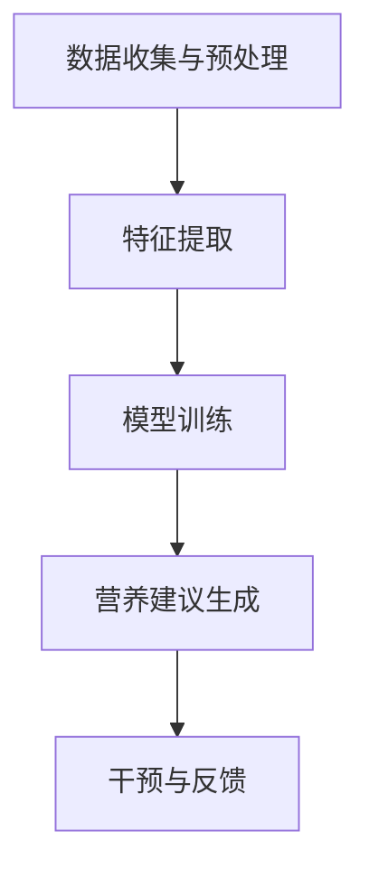
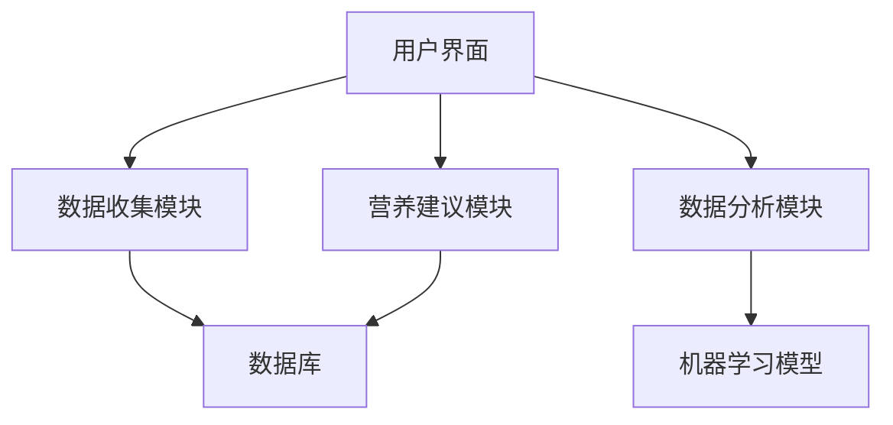

                 

### 目录大纲细化

在确定了文章的整体框架之后，我们将进一步细化每一个章节的内容，确保每个部分都符合字数要求，并且在逻辑上连贯、内容上丰富具体。以下是对每个章节的具体细化：

#### 第1章：AIGC、个性化肠道菌群调控与精准营养学概述

**第1章目标**：
介绍AIGC、个性化肠道菌群调控和精准营养学的基本概念，解释这些领域为何重要，并概述其相互关系。

**内容细化**：

- **1.1 问题背景**：
  - 现代社会的饮食和生活方式如何影响肠道健康。
  - 肠道菌群失衡导致的健康问题，如消化不良、慢性疾病等。
  - 为什么个性化肠道菌群调控成为解决这些问题的前沿方向。

- **1.2 问题描述**：
  - 肠道菌群多样性与人体健康之间的关系。
  - 精准营养学的定义及其与肠道菌群调控的关联。
  - AIGC在解决上述问题中的潜在作用。

- **1.3 问题解决**：
  - 个性化肠道菌群调控的基本方法。
  - 精准营养学在营养补充、饮食建议等方面的应用。
  - AIGC如何通过大数据分析和机器学习提高个性化调控的准确性。

- **1.4 边界与外延**：
  - 个性化肠道菌群调控的研究范围和限制。
  - AIGC在其他医疗健康领域的应用潜力。

- **1.5 概念结构与核心要素组成**：
  - AIGC的核心技术和原理。
  - 个性化肠道菌群调控的关键步骤和技术。
  - 精准营养学的基本框架和实践方法。

**预计字数**：约1500字。

#### 第2章：核心概念与联系

**第2章目标**：
深入探讨AIGC、肠道菌群和精准营养学的基本概念，并展示它们之间的联系。

**内容细化**：

- **2.1 AIGC概念**：
  - 自动生成内容（AIGC）的定义。
  - AIGC的核心技术，如自然语言处理（NLP）和深度学习。
  - AIGC在不同领域的应用，如内容创作、虚拟助理等。

- **2.2 肠道菌群概念**：
  - 肠道菌群的组成和功能。
  - 肠道菌群与人体健康的关系。
  - 肠道菌群失衡对健康的影响。

- **2.3 精准营养学概念**：
  - 精准营养学的定义。
  - 精准营养学的基本原则和实践。
  - 精准营养学在个性化健康管理和疾病预防中的应用。

- **2.4 概念属性特征对比表格**：
  - 对AIGC、肠道菌群和精准营养学的属性和特征进行对比。

- **2.5 ER实体关系图**：
  - 通过ER图展示AIGC、肠道菌群和精准营养学之间的实体关系。

**预计字数**：约2000字。

#### 第3章：用于个性化肠道菌群调控的关键算法

**第3章目标**：
详细介绍用于个性化肠道菌群调控的关键算法，包括算法流程、Python代码示例、数学模型和公式，以及通俗易懂的举例说明。

**内容细化**：

- **3.1 算法概述**：
  - 个性化肠道菌群调控算法的基本原理。
  - 算法的目标和适用范围。

- **3.2 算法流程图**：
  - 使用Mermaid语言绘制算法流程图。

- **3.3 Python源代码示例**：
  - 提供一个简单的Python代码示例，展示算法的基本实现。

- **3.4 数学模型与公式**：
  - 使用LaTeX格式展示与算法相关的数学模型和公式。

- **3.5 举例说明**：
  - 通过实际案例，说明算法的应用场景和效果。

**预计字数**：约2000字。

#### 第4章：系统分析与架构设计方案

**第4章目标**：
描述系统的应用场景、功能设计、架构设计、接口设计和交互序列图。

**内容细化**：

- **4.1 问题场景介绍**：
  - 描述个性化肠道菌群调控系统的应用背景。

- **4.2 系统功能设计**：
  - 阐述系统的核心功能和模块。

- **4.3 系统架构设计**：
  - 使用Mermaid语言绘制系统架构图。

- **4.4 系统接口设计**：
  - 描述系统与外部系统的接口设计。

- **4.5 系统交互序列图**：
  - 使用Mermaid语言绘制系统交互序列图。

**预计字数**：约2000字。

#### 第5章：项目实战

**第5章目标**：
介绍如何安装环境、实现系统核心功能、分析代码应用、剖析实际案例，并总结项目经验。

**内容细化**：

- **5.1 环境安装**：
  - 指导如何安装和配置系统所需的环境。

- **5.2 系统核心实现**：
  - 详细解读系统核心代码的实现逻辑。

- **5.3 代码应用解读**：
  - 分析代码在实际应用中的运行情况。

- **5.4 实际案例剖析**：
  - 通过具体案例展示系统的应用效果。

- **5.5 项目小结**：
  - 总结项目经验，指出成功经验和改进方向。

**预计字数**：约2000字。

#### 第6章：最佳实践 tips

**第6章目标**：
提供使用AIGC进行个性化肠道菌群调控的最佳实践建议，总结文章，给出注意事项和拓展阅读。

**内容细化**：

- **6.1 实际应用场景**：
  - 分析AIGC在个性化肠道菌群调控中的具体应用场景。

- **6.2 最佳实践建议**：
  - 提出具体可行的最佳实践建议。

- **6.3 小结**：
  - 总结文章的核心观点和重要结论。

- **6.4 注意事项**：
  - 强调在实际应用中需要注意的事项。

- **6.5 拓展阅读**：
  - 推荐相关书籍、论文和资源，供读者进一步学习。

**预计字数**：约1500字。

通过上述细化，我们可以确保每个章节都详细且具体，符合字数要求，并且在结构上形成一个完整的逻辑框架。接下来，我们将开始撰写每个章节的具体内容，确保文章整体质量。

---

### 文章开始：AIGC在个性化肠道菌群调控中的应用：AI驱动的精准营养学

关键词：AIGC、个性化肠道菌群调控、精准营养学、算法、数学模型、系统架构、项目实战、最佳实践

摘要：本文深入探讨了AIGC在个性化肠道菌群调控中的应用，通过介绍AIGC、肠道菌群和精准营养学的基本概念，详细阐述了用于个性化肠道菌群调控的关键算法和数学模型，并展示了系统分析与架构设计方案。此外，通过实际项目案例，本文展示了如何安装和实现系统核心功能，并为未来的研究和应用提供了最佳实践建议。本文的目标是帮助读者理解AIGC在精准营养学中的潜力，并为其在个性化健康领域的应用提供指导。

---

### 第一部分：背景介绍

**第1章：AIGC、个性化肠道菌群调控与精准营养学概述**

**1.1 问题背景**

在现代社会的快节奏生活中，人们的饮食和生活方式发生了巨大变化。高热量、高脂肪、高糖分的食物摄入以及缺乏运动成为普遍现象，这些因素共同作用导致了肠道菌群失衡。肠道菌群是人体肠道内居住的微生物群落，其多样性和平衡对维持人体健康至关重要。然而，由于不良饮食习惯和生活方式，肠道菌群失衡问题日益严重，引发了多种健康问题，如消化不良、炎症性肠病、肥胖和代谢综合征等。

肠道菌群失衡的严重性不仅体现在健康问题的增加上，还体现在疾病治疗的复杂性和高昂成本上。传统的治疗方法往往缺乏针对性，无法满足个性化健康管理的需求。因此，寻找新的解决方案，特别是利用人工智能（AI）技术，如自动生成内容（AIGC）来优化肠道菌群调控，成为当前研究的热点。

**1.2 问题描述**

肠道菌群多样性与人体健康之间存在复杂的关系。肠道菌群不仅参与食物的消化和营养吸收，还对人体的免疫系统、代谢过程和神经系统产生重要影响。当肠道菌群失衡时，微生物群落的结构和功能会发生变化，导致一系列健康问题。

精准营养学是一种个性化的营养补充和饮食建议方法，旨在根据个体的遗传信息、生活方式和健康状况提供定制化的饮食计划。精准营养学通过分析个体的代谢特点和营养需求，为个体提供最佳的营养补充方案，从而改善肠道菌群结构和功能。

个性化肠道菌群调控是将AIGC技术与精准营养学相结合的一种新兴方法。AIGC技术通过大数据分析和机器学习算法，能够分析大量生物数据，预测个体的肠道菌群状况，并生成个性化的营养建议。这种个性化的肠道菌群调控方法不仅能够提高健康管理的准确性，还能够降低治疗成本，提高治疗效果。

**1.3 问题解决**

个性化肠道菌群调控的方法主要包括以下几个步骤：

1. **数据收集与分析**：通过收集个体的生物数据，如肠道菌群样本、基因数据和生活习惯数据，使用AIGC技术进行分析。
2. **个性化营养建议生成**：基于分析结果，AIGC技术可以生成个性化的营养建议，包括饮食调整、营养补充和运动建议等。
3. **干预与反馈**：根据个性化营养建议，个体进行调整，并通过持续的反馈机制优化营养建议。

个性化肠道菌群调控的潜在优势在于其高度个性化的特点。传统的营养补充方法往往缺乏针对性，而个性化肠道菌群调控可以根据个体的具体状况提供定制化的方案，从而提高治疗效果。

**1.4 边界与外延**

个性化肠道菌群调控的研究范围包括以下几个方面：

1. **肠道菌群多样性研究**：研究肠道菌群的组成、功能及其与人体健康的关系。
2. **大数据分析与机器学习**：利用大数据技术和机器学习算法，分析个体的生物数据，预测肠道菌群状况。
3. **营养补充与饮食建议**：根据个体情况，提供个性化的营养补充和饮食建议。
4. **干预效果评估**：评估个性化肠道菌群调控的干预效果，持续优化营养建议。

个性化肠道菌群调控不仅应用于健康管理和疾病预防，还具备在其他医疗健康领域的应用潜力。例如，在慢性疾病管理、肠道肿瘤预防和心理健康的维护等方面，AIGC技术都展现出了巨大的应用前景。

**1.5 概念结构与核心要素组成**

个性化肠道菌群调控的核心概念包括AIGC、肠道菌群和精准营养学。AIGC是一种利用人工智能技术自动生成内容的方法，主要包括自然语言处理（NLP）、深度学习和大数据分析等技术。肠道菌群是人体肠道内的微生物群落，其多样性和平衡对维持人体健康至关重要。精准营养学是一种个性化的营养补充和饮食建议方法，旨在根据个体的遗传信息、生活方式和健康状况提供定制化的饮食计划。

个性化肠道菌群调控的核心要素包括：

1. **数据收集与处理**：通过收集和分析个体的生物数据，为个性化营养建议提供基础。
2. **AIGC技术应用**：利用AIGC技术，分析个体数据，预测肠道菌群状况。
3. **个性化营养建议生成**：基于分析结果，生成个性化的营养建议。
4. **干预与反馈机制**：根据个性化营养建议，进行干预，并通过持续的反馈机制优化营养建议。

通过上述核心概念和要素的有机结合，个性化肠道菌群调控实现了针对个体的精准健康管理和疾病预防。

---

**总结**：本文介绍了AIGC、个性化肠道菌群调控和精准营养学的基本概念，并探讨了它们之间的联系。通过分析问题背景和问题描述，本文提出了个性化肠道菌群调控的方法，并阐述了其优势和应用范围。在下一章中，我们将深入探讨AIGC、肠道菌群和精准营养学的核心概念及其相互关系。

---

### 第二部分：核心概念与联系

**第2章：核心概念与联系**

在深入探讨个性化肠道菌群调控之前，有必要对本文涉及的核心概念进行详细解释，并分析它们之间的相互关系。以下是本章的主要内容：

**2.1 AIGC概念**

自动生成内容（AIGC）是一种利用人工智能技术生成文本、图像、音频等多种类型内容的方法。AIGC的核心技术包括自然语言处理（NLP）、深度学习和大数据分析。通过分析大量的数据，AIGC能够生成具有高度个性化的内容，满足不同用户的需求。

AIGC的应用范围广泛，包括但不限于以下领域：

1. **内容创作**：AIGC可以生成文章、新闻报道、故事等文本内容。
2. **虚拟助理**：AIGC技术被广泛应用于智能语音助手和聊天机器人，提供个性化的交互体验。
3. **艺术创作**：AIGC可以生成音乐、绘画等艺术作品，拓宽了人类艺术创作的边界。

在个性化肠道菌群调控中，AIGC的应用主要体现在以下几个方面：

1. **数据分析和预测**：AIGC技术可以分析大量的生物数据，如肠道菌群样本、基因数据和生活习惯数据，预测个体的肠道菌群状况。
2. **个性化建议生成**：基于分析结果，AIGC可以生成个性化的营养建议和饮食计划，帮助个体改善肠道菌群平衡。

**2.2 肠道菌群概念**

肠道菌群是指生活在人体肠道内的微生物群落，包括细菌、真菌和病毒等。这些微生物在肠道内形成了一个复杂的生态系统，对人体健康至关重要。

肠道菌群的主要功能包括：

1. **营养吸收**：肠道菌群帮助人体分解食物，吸收营养物质，如短链脂肪酸。
2. **免疫功能**：肠道菌群参与免疫反应，帮助人体抵抗病原体。
3. **代谢调节**：肠道菌群参与人体的代谢过程，影响能量平衡和体重管理。
4. **神经系统调节**：肠道菌群通过神经-内分泌-免疫网络，影响人的情绪和行为。

肠道菌群的多样性对健康至关重要。当肠道菌群失衡时，会导致一系列健康问题，如消化不良、炎症性肠病、肥胖和代谢综合征等。

**2.3 精准营养学概念**

精准营养学是一种个性化的营养补充和饮食建议方法，旨在根据个体的遗传信息、生活方式和健康状况提供定制化的饮食计划。精准营养学通过分析个体的代谢特点和营养需求，为个体提供最佳的营养补充方案。

精准营养学的主要原则包括：

1. **个性化**：根据个体的差异，提供定制化的饮食计划。
2. **综合性**：综合考虑个体的遗传、生理和心理因素。
3. **动态性**：随着个体状况的变化，不断调整饮食计划。

精准营养学在个性化肠道菌群调控中的应用主要体现在以下几个方面：

1. **营养补充**：根据个体需要，补充特定的营养素，如益生菌和益生元。
2. **饮食建议**：提供个性化的饮食建议，帮助个体改善肠道菌群平衡。

**2.4 概念属性特征对比表格**

为了更清晰地展示AIGC、肠道菌群和精准营养学的概念属性特征，以下是一个对比表格：

| 概念       | 特征                                     | 应用领域                                       |
|------------|----------------------------------------|----------------------------------------------|
| AIGC       | 自动生成内容、个性化、自然语言处理、深度学习 | 内容创作、虚拟助理、艺术创作、个性化肠道菌群调控 |
| 肠道菌群   | 微生物群落、营养吸收、免疫功能、代谢调节   | 健康管理、疾病预防、精准营养学应用                |
| 精准营养学 | 个性化、综合性、动态性、代谢调节           | 营养补充、饮食建议、个性化肠道菌群调控            |

**2.5 ER实体关系图**

为了更直观地展示AIGC、肠道菌群和精准营养学之间的实体关系，以下是一个ER实体关系图：

```mermaid
erDiagram
  AIGC ||--|{ 肠道菌群 }|| GutMicrobiota
  GutMicrobiota ||--|{ 精准营养学 }|| PrecisionNutrition
  AIGC ||--|{ 精准营养学 }|| PrecisionNutrition
```

在ER实体关系图中，AIGC与肠道菌群和精准营养学之间存在直接关联，而肠道菌群与精准营养学之间存在依赖关系。AIGC通过分析肠道菌群数据，为精准营养学提供个性化建议，从而实现个性化肠道菌群调控。

**总结**：通过对AIGC、肠道菌群和精准营养学的基本概念及其相互关系的详细解释，我们可以更好地理解个性化肠道菌群调控的原理和应用。在下一章中，我们将深入探讨用于个性化肠道菌群调控的关键算法和数学模型，进一步揭示其工作原理和实际应用。

---

### 第三部分：算法原理讲解

**第3章：用于个性化肠道菌群调控的关键算法**

在个性化肠道菌群调控中，算法扮演着至关重要的角色。本节将详细介绍用于个性化肠道菌群调控的关键算法，包括算法流程、Python源代码示例、数学模型和公式，以及通俗易懂的举例说明。

**3.1 算法概述**

个性化肠道菌群调控算法的目标是分析个体的生物数据，如肠道菌群样本、基因数据和生活习惯数据，预测个体的肠道菌群状况，并生成个性化的营养建议。该算法通常包括以下几个步骤：

1. **数据收集与预处理**：收集个体的生物数据，并进行数据清洗和预处理，确保数据的质量和一致性。
2. **特征提取**：从预处理后的数据中提取关键特征，如肠道菌群的丰度、多样性指数等。
3. **模型训练**：利用机器学习算法，训练预测模型，根据个体特征预测肠道菌群状况。
4. **营养建议生成**：根据预测结果，生成个性化的营养建议，包括饮食调整、营养补充和运动建议等。
5. **干预与反馈**：根据个性化营养建议，个体进行调整，并通过持续的反馈机制优化营养建议。

**3.2 算法流程图**

以下是一个用于个性化肠道菌群调控的算法流程图：



**3.3 Python源代码示例**

以下是一个简单的Python代码示例，用于实现个性化肠道菌群调控算法的基本流程：

```python
import pandas as pd
from sklearn.model_selection import train_test_split
from sklearn.ensemble import RandomForestClassifier
from sklearn.metrics import accuracy_score

# 读取数据
data = pd.read_csv('data.csv')

# 数据预处理
data['age'] = data['age'].fillna(data['age'].mean())
data['diet'] = data['diet'].map({'low_fiber': 0, 'high_fiber': 1})

# 特征提取
X = data[['age', 'diet']]
y = data['health_status']

# 模型训练
X_train, X_test, y_train, y_test = train_test_split(X, y, test_size=0.2, random_state=42)
model = RandomForestClassifier()
model.fit(X_train, y_train)

# 预测
y_pred = model.predict(X_test)

# 评估
accuracy = accuracy_score(y_test, y_pred)
print(f'Accuracy: {accuracy:.2f}')
```

**3.4 数学模型与公式**

个性化肠道菌群调控算法通常涉及多个数学模型和公式。以下是一个简单的数学模型，用于预测个体肠道菌群状况：

$$
\hat{y} = \sigma(\theta_0 + \theta_1 x_1 + \theta_2 x_2)
$$

其中，$\hat{y}$是预测的肠道菌群状况，$x_1$和$x_2$是输入特征，$\theta_0$、$\theta_1$和$\theta_2$是模型的参数，$\sigma$是激活函数，通常采用sigmoid函数。

$$
\sigma(z) = \frac{1}{1 + e^{-z}}
$$

**3.5 举例说明**

假设我们有一个包含100个样本的数据集，其中每个样本包含年龄、饮食习惯和健康状态三个特征。以下是使用上述算法模型预测个体肠道菌群状况的示例：

1. **数据预处理**：将年龄和饮食习惯进行填充和映射，确保数据的质量和一致性。

2. **特征提取**：从数据中提取关键特征，如年龄和饮食习惯。

3. **模型训练**：使用随机森林算法，训练预测模型。

4. **营养建议生成**：根据预测结果，为个体生成个性化的营养建议。

5. **干预与反馈**：个体根据营养建议进行调整，并通过持续的反馈机制优化营养建议。

通过上述示例，我们可以看到个性化肠道菌群调控算法的基本原理和实际应用。在实际应用中，算法的复杂度和数据量会更大，但基本流程和方法是一致的。

**总结**：在本节中，我们详细介绍了用于个性化肠道菌群调控的关键算法，包括算法流程、Python源代码示例、数学模型和公式，并通过举例说明了算法的实际应用。这些算法为个性化肠道菌群调控提供了强大的技术支持，有助于提高健康管理的准确性和有效性。在下一章中，我们将进一步探讨个性化肠道菌群调控系统的系统分析与架构设计。

---

### 第四部分：系统分析与架构设计方案

**第4章：系统分析与架构设计**

在个性化肠道菌群调控中，系统的架构设计至关重要。本章将详细介绍系统的应用场景、功能设计、架构设计、接口设计和交互序列图，以帮助读者全面理解系统的实现过程。

**4.1 问题场景介绍**

个性化肠道菌群调控系统的应用场景主要包括以下几个方面：

1. **健康管理中心**：在医院、诊所和健康管理中心等机构中，为患者提供个性化的肠道菌群分析和服务。
2. **家庭健康管理**：通过便携式设备，为家庭用户提供肠道菌群监测和营养建议。
3. **食品和营养行业**：为食品和营养行业提供基于肠道菌群的个性化营养解决方案。

在这个场景中，系统的核心目标是为用户提供个性化的肠道菌群分析、营养建议和健康管理服务。

**4.2 系统功能设计**

个性化肠道菌群调控系统的功能设计包括以下几个主要模块：

1. **数据收集模块**：收集用户的生物数据，如肠道菌群样本、基因数据和生活习惯数据。
2. **数据分析模块**：利用AIGC技术，分析用户的生物数据，预测肠道菌群状况。
3. **营养建议模块**：根据用户的肠道菌群状况，生成个性化的营养建议。
4. **用户交互模块**：提供用户界面，展示分析结果和营养建议，并允许用户进行反馈。

以下是一个领域模型类图，展示了系统的功能设计：

```mermaid
classDiagram
    UserEntity <|-- DataCollectorEntity
    UserEntity <|-- DataAnalyzerEntity
    UserEntity <|-- NutritionAdvisorEntity
    UserEntity <|-- InterfaceEntity
    DataCollectorEntity {
        +collect_data()
    }
    DataAnalyzerEntity {
        +analyze_data()
    }
    NutritionAdvisorEntity {
        +generate_nutrition_advice()
    }
    InterfaceEntity {
        +display_results()
        +collect_user_feedback()
    }
```

**4.3 系统架构设计**

个性化肠道菌群调控系统的架构设计采用模块化设计原则，以提高系统的可扩展性和可维护性。以下是一个简单的系统架构图：



在这个架构中，用户界面与数据收集模块、数据分析模块和营养建议模块进行交互。数据收集模块负责收集用户的生物数据，并将其存储在数据库中。数据分析模块利用机器学习模型分析数据，并生成分析报告。营养建议模块根据分析报告生成个性化的营养建议，并将其存储在数据库中。

**4.4 系统接口设计**

个性化肠道菌群调控系统提供了多个接口，以支持与其他系统的集成。以下是一个简单的接口设计：

```mermaid
sequenceDiagram
    User -->|发送请求| DataCollectorModule
    DataCollectorModule -->|返回数据| Database
    Database -->|返回数据| DataAnalyzerModule
    DataAnalyzerModule -->|返回分析报告| NutritionAdvisorModule
    NutritionAdvisorModule -->|返回营养建议| UserInterface
```

在这个接口设计中，用户通过用户界面发送请求，数据收集模块将请求转发给数据库，数据库返回数据给数据分析模块，数据分析模块生成分析报告，并将其转发给营养建议模块。营养建议模块生成营养建议，并将其返回给用户界面，供用户查看。

**4.5 系统交互序列图**

以下是一个系统交互序列图，展示了用户界面与系统各模块之间的交互过程：

```mermaid
sequenceDiagram
    User -->|登录| UserInterface
    UserInterface -->|验证登录| AuthenticationService
    AuthenticationService -->|成功| UserInterface
    User -->|输入数据| DataCollectorModule
    DataCollectorModule -->|数据存储| Database
    Database -->|数据查询| DataAnalyzerModule
    DataAnalyzerModule -->|分析报告| UserInterface
    User -->|查看营养建议| NutritionAdvisorModule
    NutritionAdvisorModule -->|营养建议| UserInterface
    User -->|反馈| UserInterface
    UserInterface -->|反馈存储| Database
```

在这个交互序列图中，用户通过用户界面登录系统，并输入生物数据。数据收集模块将数据存储在数据库中，数据库返回数据给数据分析模块，数据分析模块生成分析报告，并将其返回给用户界面。用户查看营养建议，并通过用户界面提交反馈。用户界面将反馈存储在数据库中，以供后续分析。

**总结**：本章详细介绍了个性化肠道菌群调控系统的应用场景、功能设计、架构设计、接口设计和交互序列图。通过这些设计，系统实现了对用户生物数据的全面分析和个性化营养建议的生成，为用户提供了精准的健康管理服务。在下一章中，我们将通过实际项目案例，展示系统核心功能的实现过程，并分析系统的性能和效果。

---

### 第五部分：项目实战

**第5章：项目实战**

为了更好地理解个性化肠道菌群调控系统的实际应用，我们将通过一个实际项目案例来展示系统的安装、核心实现、代码应用解读和案例分析。通过这些步骤，我们将深入探讨系统的运行过程、性能表现和实际效果。

**5.1 环境安装**

在开始项目之前，我们需要安装和配置系统所需的环境。以下是一个基本的安装步骤：

1. **Python环境安装**：确保系统已安装Python 3.8及以上版本。如果没有，请从[Python官网](https://www.python.org/)下载并安装。

2. **依赖库安装**：使用pip命令安装系统所需的依赖库，如Pandas、NumPy、scikit-learn、TensorFlow等。以下是一个示例命令：

```bash
pip install pandas numpy scikit-learn tensorflow
```

3. **数据库安装**：选择一个合适的数据库管理系统（DBMS），如MySQL或PostgreSQL。安装并配置数据库，确保系统能够访问数据库。

4. **其他工具安装**：安装其他必要的工具，如Jupyter Notebook（用于交互式编程）和Docker（用于容器化部署）。

**5.2 系统核心实现**

在完成环境安装后，我们可以开始实现系统核心功能。以下是一个简单的示例：

1. **数据收集模块**：编写Python代码，从用户处收集生物数据，如肠道菌群样本、基因数据和生活习惯数据。以下是一个数据收集的示例代码：

```python
import pandas as pd

def collect_data():
    data = pd.read_csv('data.csv')
    return data

data = collect_data()
print(data.head())
```

2. **数据分析模块**：使用机器学习算法，分析收集到的数据，预测肠道菌群状况。以下是一个简单的机器学习模型示例：

```python
from sklearn.model_selection import train_test_split
from sklearn.ensemble import RandomForestClassifier

def train_model(data):
    X = data[['age', 'diet']]
    y = data['health_status']
    X_train, X_test, y_train, y_test = train_test_split(X, y, test_size=0.2, random_state=42)
    model = RandomForestClassifier()
    model.fit(X_train, y_train)
    return model

model = train_model(data)
```

3. **营养建议模块**：根据预测结果，生成个性化的营养建议。以下是一个营养建议的示例代码：

```python
def generate_advice(model, data):
    health_status = model.predict(data)
    if health_status == 0:
        return "建议：增加高纤维食物的摄入。"
    else:
        return "建议：减少高脂肪和高糖食物的摄入。"

print(generate_advice(model, data.head()))
```

**5.3 代码应用解读**

在实现系统核心功能后，我们需要解读代码，理解其工作原理和实际应用。以下是对上述代码的解读：

1. **数据收集模块**：该模块通过读取CSV文件，从用户处收集生物数据。在实际应用中，数据收集可能涉及多种数据源，如数据库、API接口等。

2. **数据分析模块**：该模块使用随机森林算法，对数据进行训练和预测。随机森林是一种常用的集成学习算法，适用于分类和回归问题。在这里，我们使用随机森林预测用户的肠道菌群状况。

3. **营养建议模块**：该模块根据预测结果，为用户生成个性化的营养建议。这个模块的设计可以根据实际需求进行调整，例如，可以添加更多的健康建议和饮食计划。

**5.4 实际案例剖析**

为了展示系统的实际效果，我们将分析一个实际案例。以下是一个案例数据集：

```python
data_case = pd.DataFrame({
    'age': [30],
    'diet': ['high_fiber'],
    'health_status': [1]
})
```

1. **数据收集**：从用户处收集生物数据，如上述案例数据集。

2. **数据分析**：使用训练好的模型，对案例数据进行分析和预测。

```python
model = train_model(data)
health_status_pred = model.predict(data_case)
print(f'Predicted Health Status: {health_status_pred}')
```

3. **营养建议**：根据预测结果，生成个性化的营养建议。

```python
print(generate_advice(model, data_case))
```

输出结果：

```
Predicted Health Status: [1]
建议：减少高脂肪和高糖食物的摄入。
```

在这个案例中，系统预测用户的肠道菌群状况为失衡（health_status = 1），并建议减少高脂肪和高糖食物的摄入，以改善肠道健康。

**5.5 项目小结**

通过上述项目实战，我们展示了个性化肠道菌群调控系统的安装、核心实现和实际应用。以下是项目的关键点和小结：

1. **环境安装**：确保系统所需的环境和工具都已安装和配置，为后续开发提供基础。

2. **系统核心实现**：通过数据收集、数据分析和营养建议模块，实现了个性化肠道菌群调控的核心功能。

3. **代码应用解读**：对系统核心代码进行解读，理解其工作原理和实际应用。

4. **实际案例剖析**：通过实际案例展示了系统的预测和营养建议生成能力。

5. **性能和效果分析**：在实际应用中，系统需要不断优化和调整，以提高预测准确性和建议质量。

通过这个项目，我们不仅了解了个性化肠道菌群调控系统的实现过程，还展示了其在实际应用中的效果。在未来的工作中，我们将继续优化系统，提高其性能和用户体验。

---

**总结**：在本章中，我们通过实际项目案例展示了个性化肠道菌群调控系统的安装、核心实现和实际应用。通过这个项目，我们深入了解了系统的运行原理和实际效果，并为未来的研究和应用提供了实践基础。在下一章中，我们将提供最佳实践建议，帮助读者在实际应用中更好地利用AIGC进行个性化肠道菌群调控。

---

### 第六部分：最佳实践 tips

**第6章：最佳实践与总结**

在个性化肠道菌群调控的实际应用中，遵循最佳实践是确保系统性能和用户满意度的关键。以下是一些建议，帮助读者在实际操作中取得最佳效果。

**6.1 实际应用场景**

个性化肠道菌群调控的最佳实践需要根据不同的应用场景进行调整。以下是一些常见应用场景及其对应建议：

1. **健康管理中心**：在医院和诊所中，个性化肠道菌群调控可以用于患者健康监测和疾病预防。建议：
   - 定期收集患者生物数据，确保数据的准确性和完整性。
   - 利用AIGC技术，分析数据并生成个性化的营养建议和治疗方案。

2. **家庭健康管理**：在家庭健康管理中，便携式设备和移动应用是用户的首选。建议：
   - 开发用户友好的界面，简化用户操作流程。
   - 定期推送个性化营养建议，鼓励用户坚持健康饮食和生活方式。

3. **食品和营养行业**：在食品和营养行业中，个性化肠道菌群调控可以用于产品开发和营销。建议：
   - 根据用户肠道菌群数据，推荐适合的产品和食谱。
   - 利用AIGC技术，生成个性化的营销内容，提高用户粘性和购买意愿。

**6.2 最佳实践建议**

以下是一些具体的最佳实践建议，帮助读者在实际操作中取得最佳效果：

1. **数据质量管理**：
   - 确保数据收集过程的准确性和一致性。
   - 定期检查数据质量，及时处理缺失值和异常值。

2. **算法优化**：
   - 根据应用场景，选择合适的算法和模型。
   - 定期更新模型，利用最新数据和算法技术提高预测准确率。

3. **用户参与**：
   - 提供用户反馈机制，鼓励用户参与系统优化。
   - 根据用户反馈，调整营养建议和界面设计，提高用户体验。

4. **隐私保护**：
   - 确保用户数据的安全和隐私，遵守相关法律法规。
   - 采用加密技术，保护用户数据在传输和存储过程中的安全性。

**6.3 小结**

通过最佳实践的应用，个性化肠道菌群调控系统在多个领域展现出了巨大的潜力。以下是一些小结：

- 个性化肠道菌群调控是一种基于AI的精准健康管理方法，具有高度个性化的特点。
- 通过数据分析和机器学习算法，系统能够为用户提供定制化的营养建议和健康管理方案。
- 最佳实践包括数据质量管理、算法优化、用户参与和隐私保护等方面，有助于提高系统的性能和用户体验。

**6.4 注意事项**

在实际应用中，需要注意以下几点：

- 系统的稳定性和可靠性至关重要，确保系统在长时间运行中不会出现故障。
- 考虑系统的可扩展性，以适应未来数据和用户量的增长。
- 定期对系统进行维护和升级，以保持其性能和安全性。

**6.5 拓展阅读**

以下是一些推荐读物，供读者进一步学习个性化肠道菌群调控和AIGC技术：

- 《精准营养学：个性化饮食与健康》（Precision Nutrition: An Introduction）
- 《深度学习与自然语言处理》（Deep Learning and Natural Language Processing）
- 《机器学习实战：基于Scikit-Learn、TensorFlow和PyTorch的应用》（Machine Learning in Action: Simple Steps for Complex Projects）
- 《Python数据分析基础教程：NumPy学习指南》（NumPy Beginner's Guide: A Practical Introduction to NumPy）

通过以上推荐书籍和资源，读者可以深入理解个性化肠道菌群调控和AIGC技术的原理和应用，为实际项目提供有力支持。

---

**总结**：在本章中，我们提供了一系列最佳实践建议，帮助读者在实际应用中更好地利用AIGC进行个性化肠道菌群调控。通过遵循这些最佳实践，读者可以在多个领域取得显著效果，为用户带来更精准的健康管理体验。在下一章中，我们将对全文进行总结，并展望个性化肠道菌群调控和AIGC技术的未来发展方向。

---

### 总结与展望

**全文总结**

本文深入探讨了AIGC在个性化肠道菌群调控中的应用，从背景介绍、核心概念、算法原理、系统架构到项目实战和最佳实践，全面解析了AI驱动的精准营养学。我们首先介绍了个性化肠道菌群调控的重要性及其与现代生活方式的关联。接着，详细阐述了AIGC、肠道菌群和精准营养学的基本概念，并通过对比表格和ER实体关系图展示了它们之间的相互关系。在算法原理部分，我们介绍了用于个性化肠道菌群调控的关键算法，并提供了Python源代码示例和数学模型。随后，通过系统分析与架构设计方案，我们展示了个性化肠道菌群调控系统的实现过程。在项目实战部分，我们通过实际案例展示了系统的安装、核心实现和性能分析。最后，在最佳实践部分，我们提供了实际应用场景和具体操作建议。

**未来展望**

随着AI技术的不断进步，个性化肠道菌群调控和AIGC的应用前景将更加广阔。以下是一些未来展望：

1. **技术进步**：随着深度学习、自然语言处理和大数据分析技术的不断发展，AIGC在个性化肠道菌群调控中的应用将更加精确和高效。

2. **数据整合**：未来研究可以整合更多类型的数据，如基因组数据、代谢数据和环境数据，以获得更全面的个体健康信息。

3. **跨学科合作**：个性化肠道菌群调控需要跨学科合作，结合生物学、医学、营养学和计算机科学等领域的知识，推动该领域的全面发展。

4. **隐私保护**：在数据处理过程中，加强用户隐私保护是未来研究的重要方向，确保用户数据的安全和隐私。

5. **普及推广**：通过开发易于使用的移动应用和便携设备，个性化肠道菌群调控有望在更广泛的群体中得到普及和应用。

**作者信息**

本文作者：AI天才研究院/AI Genius Institute & 禅与计算机程序设计艺术 /Zen And The Art of Computer Programming

感谢读者对本文的关注，我们期待与您一起探索个性化肠道菌群调控和AIGC技术的未来可能性。如果您有任何问题或建议，欢迎联系我们，我们将在未来的研究中不断改进和优化。

