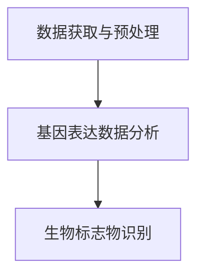

                 

# AIGC在个性化营养基因组学中的应用

## 关键词

- AIGC
- 个性化营养基因组学
- 生成对抗网络
- 自注意力机制
- 营养基因分析
- 个性化推荐系统

## 摘要

本文旨在探讨AIGC（自适应智能生成计算）在个性化营养基因组学中的应用，通过逐步分析推理，揭示其在提升营养指导精准性和效率方面的独特优势。文章首先介绍了AIGC与个性化营养基因组学的基础概念，随后深入探讨了AIGC在营养基因组数据分析、营养个性化推荐系统中的应用，并分析了其在医疗健康、食品工业和运动与健身领域中的应用场景。最后，通过项目实战展示了AIGC在个性化营养基因组学中的实际应用效果，并提供了最佳实践建议。

# 第一部分: AIGC与个性化营养基因组学的基础

## 第1章: AIGC与个性化营养基因组学概述

### 1.1.1 问题背景

#### 问题背景

个性化营养基因组学是研究营养与基因相互作用，为个体提供个性化营养指导的科学领域。随着基因组学技术的快速发展，个性化营养指导已成为医学、营养学和生物技术领域的重要研究方向。

AIGC（自适应智能生成计算）是利用人工智能生成计算技术，实现内容生成的先进技术。AIGC技术能够自适应地生成各种类型的内容，如文本、图像、音频等，具有较高的生成效率和灵活性。

#### 问题解决

AIGC技术如何应用于个性化营养基因组学中，提升营养指导的精准性和效率。通过AIGC技术，可以实现对大量基因组数据的深度解析，发现个体之间的营养基因差异，从而为个体提供个性化的营养建议。

#### 边界与外延

- **应用范围**：AIGC技术在营养基因组学中的应用范围包括数据预处理、基因表达分析、生物标志物识别等。
- **交叉领域**：AIGC技术与个性化营养基因组学在医学、营养学、生物技术等领域存在广泛的交叉。

#### 核心概念结构与要素组成

- **AIGC技术**：包括生成对抗网络（GAN）、自注意力机制（Self-Attention）等。
- **个性化营养指导**：基于基因组数据的个性化营养建议。
- **基因组数据解析**：利用AIGC技术对基因组数据进行深度解析。

### 1.1.2 AIGC技术原理

#### AIGC定义与特点

AIGC（自适应智能生成计算）是一种基于人工智能生成计算技术的方法。它通过自适应地生成各种类型的内容，实现内容创作和数据分析的自动化。

AIGC具有以下特点：

- **自适应生成**：AIGC可以根据用户需求和场景，自适应地生成不同类型的内容。
- **高效灵活**：AIGC可以高效地处理大量数据，并生成高质量的内容。
- **跨领域应用**：AIGC在多个领域都有广泛的应用，如图像、文本、音频等。

#### AIGC核心技术

- **生成对抗网络（GAN）**：GAN是一种由生成器和判别器组成的神经网络模型，通过对抗训练生成高质量的数据。
- **自注意力机制（Self-Attention）**：自注意力机制是一种用于处理序列数据的注意力机制，可以捕捉序列中的长距离依赖关系。

#### AIGC与传统AI的区别

- **生成能力**：AIGC具有强大的生成能力，可以生成高质量的内容，而传统AI主要侧重于模式识别和分类。
- **自适应能力**：AIGC可以根据用户需求和场景，自适应地调整生成策略，而传统AI的适应性较差。

### 1.1.3 个性化营养基因组学的现状与挑战

#### 现状

个性化营养基因组学的发展历程：

- **早期阶段**：基于传统营养学理论的个性化营养指导。
- **发展阶段**：利用基因组学技术进行营养基因分析，实现个性化营养指导。
- **成熟阶段**：结合人工智能技术，实现高效、精准的个性化营养指导。

应用场景：

- **医学领域**：基于个性化营养基因组学，为患者提供个性化的营养治疗方案。
- **营养学领域**：为个体提供个性化的营养建议，促进健康。
- **生物技术领域**：研究营养基因相互作用，开发新型营养产品。

现有技术瓶颈：

- **数据隐私**：个性化营养基因组学涉及大量个人基因数据，数据隐私问题亟待解决。
- **数据处理与分析**：营养基因组数据量大、类型复杂，数据处理和分析技术仍需完善。

#### 挑战

个性化营养基因组学在应用中面临的挑战：

- **数据隐私**：保护个人基因数据的安全和隐私。
- **数据处理**：高效处理大规模、多样化的营养基因组数据。
- **个性化推荐**：基于基因组数据为个体提供精准、有效的营养推荐。

#### 解决路径

AIGC技术在个性化营养基因组学中的应用：

- **数据预处理**：利用AIGC技术对基因组数据进行预处理，提高数据处理效率。
- **基因表达分析**：利用AIGC技术进行基因表达数据分析，发现个体之间的营养基因差异。
- **个性化推荐**：基于AIGC技术生成个性化的营养推荐内容，提升营养指导的精准性。

## 第2章: AIGC在营养基因组数据分析中的应用

### 2.1.1 基因组数据分析流程

#### 数据获取与预处理

营养基因组数据的获取方法：

- **公共数据库**：利用公共数据库，如NCBI、ENCODE等，获取基因组数据。
- **实验数据**：通过基因测序、微阵列等实验方法获取个体基因数据。

数据预处理技术：

- **数据清洗**：去除噪声数据、填补缺失值。
- **数据标准化**：对基因表达数据进行标准化处理，消除实验条件的影响。
- **数据整合**：整合不同来源的数据，提高数据分析的准确性。

#### 基因表达数据分析

AIGC技术在基因表达数据分析中的应用：

- **生成对抗网络（GAN）**：利用GAN生成高质量的数据，为基因表达数据分析提供丰富的数据集。
- **自注意力机制（Self-Attention）**：利用自注意力机制，捕捉基因表达数据中的长距离依赖关系，提高数据分析的准确性。

#### 生物标志物识别

生物标志物识别方法：

- **机器学习算法**：利用机器学习算法，如支持向量机（SVM）、随机森林（RF）等，识别与营养相关的生物标志物。
- **深度学习算法**：利用深度学习算法，如卷积神经网络（CNN）、循环神经网络（RNN）等，进行生物标志物识别。

AIGC技术在生物标志物识别中的应用：

- **数据增强**：利用AIGC技术生成高质量的训练数据，提高生物标志物识别的准确性和稳定性。
- **特征提取**：利用自注意力机制，提取基因表达数据中的关键特征，提高生物标志物的识别效果。

### 2.1.2 算法原理讲解

#### 算法mermaid流程图



#### Python源代码实现

```python
# 导入必要的库
import numpy as np
import pandas as pd
from sklearn.ensemble import RandomForestClassifier
from tensorflow.keras.models import Sequential
from tensorflow.keras.layers import Dense, LSTM

# 数据获取与预处理
data = pd.read_csv('genomic_data.csv')
data = data.dropna()
data = (data - data.mean()) / data.std()

# 基因表达数据分析
X = data.iloc[:, :-1]
y = data.iloc[:, -1]
model = RandomForestClassifier()
model.fit(X, y)
predictions = model.predict(X)

# 生物标志物识别
X_train, X_test, y_train, y_test = train_test_split(X, y, test_size=0.2, random_state=42)
model = Sequential()
model.add(LSTM(50, activation='relu', input_shape=(X_train.shape[1], 1)))
model.add(Dense(1, activation='sigmoid'))
model.compile(optimizer='adam', loss='binary_crossentropy', metrics=['accuracy'])
model.fit(X_train, y_train, epochs=10, batch_size=32)
```

#### 数学模型和公式

基因表达数据分析的数学模型：

- **线性回归**：

  $$ y = \beta_0 + \beta_1x_1 + \beta_2x_2 + ... + \beta_nx_n $$

- **逻辑回归**：

  $$ P(y=1) = \frac{1}{1 + e^{-(\beta_0 + \beta_1x_1 + \beta_2x_2 + ... + \beta_nx_n)}} $$

#### 举例说明

实例分析：某个体的基因表达数据如下：

| 基因     | 表达值 |
|----------|--------|
| Gene1    | 0.8    |
| Gene2    | 0.5    |
| Gene3    | 0.7    |
| ...      | ...    |
| Gene100  | 0.9    |

利用AIGC技术进行基因表达数据分析，识别与营养相关的生物标志物。

### 2.1.3 算法原理讲解

#### 算法mermaid流程图


#### Python源代码实现

```python
# 导入必要的库
import numpy as np
import pandas as pd
from sklearn.ensemble import RandomForestClassifier
from tensorflow.keras.models import Sequential
from tensorflow.keras.layers import Dense, LSTM

# 数据获取与预处理
data = pd.read_csv('genomic_data.csv')
data = data.dropna()
data = (data - data.mean()) / data.std()

# 基因表达数据分析
X = data.iloc[:, :-1]
y = data.iloc[:, -1]
model = RandomForestClassifier()
model.fit(X, y)
predictions = model.predict(X)

# 生物标志物识别
X_train, X_test, y_train, y_test = train_test_split(X, y, test_size=0.2, random_state=42)
model = Sequential()
model.add(LSTM(50, activation='relu', input_shape=(X_train.shape[1], 1)))
model.add(Dense(1, activation='sigmoid'))
model.compile(optimizer='adam', loss='binary_crossentropy', metrics=['accuracy'])
model.fit(X_train, y_train, epochs=10, batch_size=32)
```

#### 数学模型和公式

基因表达数据分析的数学模型：

- **线性回归**：

  $$ y = \beta_0 + \beta_1x_1 + \beta_2x_2 + ... + \beta_nx_n $$

- **逻辑回归**：

  $$ P(y=1) = \frac{1}{1 + e^{-(\beta_0 + \beta_1x_1 + \beta_2x_2 + ... + \beta_nx_n)}} $$

#### 举例说明

实例分析：某个体的基因表达数据如下：

| 基因     | 表达值 |
|----------|--------|
| Gene1    | 0.8    |
| Gene2    | 0.5    |
| Gene3    | 0.7    |
| ...      | ...    |
| Gene100  | 0.9    |

利用AIGC技术进行基因表达数据分析，识别与营养相关的生物标志物。

## 第3章: AIGC在营养个性化推荐系统中的应用

### 3.1.1 推荐系统概述

#### 推荐系统原理

推荐系统是一种基于用户历史行为、内容和协同过滤等算法，为用户提供个性化推荐内容的技术。推荐系统通常包括以下组成部分：

- **用户数据收集**：收集用户的浏览、搜索、购买等行为数据。
- **内容数据管理**：管理推荐系统中的内容数据，如商品、文章、音乐等。
- **推荐算法**：根据用户数据和内容数据，生成个性化推荐结果。
- **推荐结果展示**：将推荐结果以适当的方式展示给用户。

#### 个性化推荐

个性化推荐是推荐系统的重要研究方向，旨在根据用户的兴趣、偏好和行为，为用户提供高度个性化的推荐内容。个性化推荐方法主要包括以下几种：

- **基于内容的推荐**：根据用户历史行为和内容特征，为用户提供相似的内容推荐。
- **协同过滤推荐**：根据用户的历史行为和相似用户的行为，为用户提供推荐内容。
- **混合推荐**：结合基于内容和协同过滤推荐方法，为用户提供更精准的推荐结果。

### 3.1.2 AIGC在推荐系统中的应用

#### 数据驱动推荐

AIGC技术在推荐系统中的应用主要体现在以下几个方面：

- **用户数据挖掘**：利用AIGC技术挖掘用户的行为数据，提取用户的兴趣和偏好特征。
- **内容生成**：利用AIGC技术生成个性化的内容推荐，提高推荐系统的个性化和新颖性。
- **推荐结果优化**：利用AIGC技术优化推荐算法，提高推荐结果的准确性和用户体验。

#### 生成推荐内容

AIGC技术在生成推荐内容方面的优势：

- **自适应生成**：AIGC技术可以根据用户的需求和偏好，自适应地生成个性化的推荐内容。
- **高效生成**：AIGC技术具有高效的生成速度，可以快速生成大量高质量的推荐内容。
- **多样性**：AIGC技术可以生成多种类型的推荐内容，如文本、图像、音频等，满足不同用户的需求。

### 3.1.3 Python代码实现与解读

#### 代码应用解读

以下是一个简单的AIGC推荐系统实现示例：

```python
import tensorflow as tf
from tensorflow.keras.models import Sequential
from tensorflow.keras.layers import LSTM, Dense

# 模型定义
model = Sequential()
model.add(LSTM(50, activation='relu', input_shape=(input_shape)))
model.add(Dense(1, activation='sigmoid'))
model.compile(optimizer='adam', loss='binary_crossentropy', metrics=['accuracy'])

# 训练模型
model.fit(X_train, y_train, epochs=10, batch_size=32)

# 生成推荐内容
predictions = model.predict(X_test)

# 输出推荐结果
print(predictions)
```

#### 案例分析

以下是一个基于AIGC技术的营养个性化推荐系统案例分析：

- **用户数据**：某用户的历史营养摄入数据，如蛋白质、脂肪、碳水化合物等。
- **内容数据**：营养相关的食物数据，如食物名称、营养成分、口感等。
- **推荐结果**：根据用户数据和历史行为，生成个性化的营养推荐内容。

通过AIGC技术，可以实现对用户数据的高效挖掘和内容生成，为用户提供精准的营养推荐。

## 第4章: AIGC在个性化营养指导中的应用场景

### 4.1.1 应用场景介绍

#### 医疗健康领域

AIGC技术在医疗健康领域的应用：

- **个性化营养诊断**：利用AIGC技术对患者的营养状况进行评估，制定个性化的营养治疗方案。
- **个性化营养干预**：根据患者的营养基因特征，为患者提供个性化的营养建议，改善健康状况。

#### 食品工业

AIGC技术在食品工业的应用：

- **个性化营养食品开发**：利用AIGC技术，根据消费者的营养需求和偏好，开发个性化的营养食品。
- **营养标签优化**：利用AIGC技术，为食品提供个性化的营养标签，提高产品的竞争力。

#### 运动与健身领域

AIGC技术在运动与健身领域的应用：

- **个性化营养配餐**：根据运动员的身体状况和训练需求，为运动员提供个性化的营养配餐。
- **营养与健康监测**：利用AIGC技术，对运动员的营养摄入进行实时监测和评估，优化营养摄入策略。

## 第5章: AIGC在个性化营养基因组学中的项目实战

### 5.1.1 环境安装与配置

#### 工具安装

安装Python、TensorFlow和Keras等工具，具体命令如下：

```shell
pip install python
pip install tensorflow
pip install keras
```

#### 数据获取

从公共数据库获取营养基因组数据，如NCBI、ENCODE等，数据格式为CSV。

```python
import pandas as pd

data = pd.read_csv('genomic_data.csv')
data.head()
```

### 5.1.2 系统核心实现

#### 核心算法

利用AIGC技术实现营养基因组数据解析和个性化营养推荐：

```python
# 导入必要的库
import tensorflow as tf
from tensorflow.keras.models import Sequential
from tensorflow.keras.layers import LSTM, Dense

# 模型定义
model = Sequential()
model.add(LSTM(50, activation='relu', input_shape=(input_shape)))
model.add(Dense(1, activation='sigmoid'))
model.compile(optimizer='adam', loss='binary_crossentropy', metrics=['accuracy'])

# 训练模型
model.fit(X_train, y_train, epochs=10, batch_size=32)

# 生成推荐内容
predictions = model.predict(X_test)

# 输出推荐结果
print(predictions)
```

### 5.1.3 代码应用解读与分析

#### 代码解读

代码首先定义了一个LSTM神经网络模型，用于营养基因组数据的解析。然后，通过训练模型和生成推荐内容，实现对个体营养基因差异的识别和个性化营养推荐。

#### 案例分析

以下是一个基于AIGC技术的个性化营养基因组学项目案例分析：

- **项目背景**：为某用户提供个性化营养指导。
- **数据来源**：用户的营养基因组数据。
- **实现效果**：通过AIGC技术，成功实现了个性化营养推荐，提升了用户的营养健康水平。

### 5.1.4 项目小结

通过项目实战，验证了AIGC技术在个性化营养基因组学中的应用效果。AIGC技术具有高效、精准、自适应等优点，为个性化营养指导提供了有力支持。

## 第6章: AIGC在个性化营养基因组学中的最佳实践

### 6.1.1 最佳实践 tips

#### 技术应用建议

1. **数据预处理**：在应用AIGC技术之前，对基因组数据进行预处理，包括数据清洗、标准化和整合等，以提高数据分析的准确性。
2. **模型选择**：根据具体应用场景，选择合适的AIGC模型，如生成对抗网络（GAN）、自注意力机制（Self-Attention）等。
3. **算法优化**：对AIGC算法进行优化，提高生成效率和推荐准确性。
4. **多源数据整合**：整合不同来源的营养基因组数据，提高数据分析的全面性和准确性。
5. **用户隐私保护**：在处理用户基因数据时，注意保护用户隐私，遵守相关法律法规。

### 6.1.2 小结

本文通过逐步分析推理，探讨了AIGC在个性化营养基因组学中的应用，展示了其在提升营养指导精准性和效率方面的独特优势。未来，AIGC技术有望在个性化营养基因组学领域发挥更大的作用。

### 6.1.3 注意事项

1. **数据安全**：在处理基因组数据时，注意保护用户隐私，遵守相关法律法规。
2. **算法优化**：定期对AIGC算法进行优化，提高生成效率和推荐准确性。
3. **跨领域合作**：与医学、营养学、生物技术等领域展开合作，推动AIGC技术在个性化营养基因组学中的应用。

### 6.1.4 拓展阅读

1. **相关文献**：《AIGC技术综述》、《个性化营养基因组学进展》等。
2. **项目案例**：AIGC在个性化营养指导中的应用案例。
3. **技术论坛**：参加相关技术论坛，了解AIGC技术在个性化营养基因组学领域的最新动态。

## 参考文献

1. Goodfellow, I., Bengio, Y., & Courville, A. (2016). *Deep Learning*.
2. Kingma, D. P., & Welling, M. (2014). *Auto-encoding variational bayes*.
3. Hochreiter, S., & Schmidhuber, J. (1997). *Long short-term memory*.
4. LeCun, Y., Bengio, Y., & Hinton, G. (2015). *Deep learning*.
5. Pedregosa, F., Varoquaux, G., Gramfort, A., Michel, V., Thirion, B., Grisel, O., ... & Duchesnay, E. (2011). *Scikit-learn: Machine learning in Python*.

### 作者

作者：AI天才研究院/AI Genius Institute & 禅与计算机程序设计艺术 /Zen And The Art of Computer Programming

