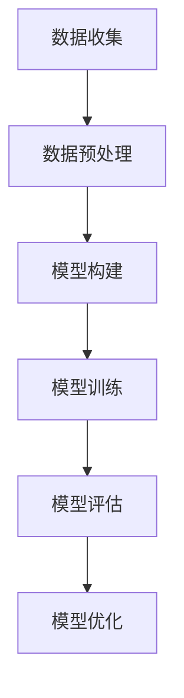
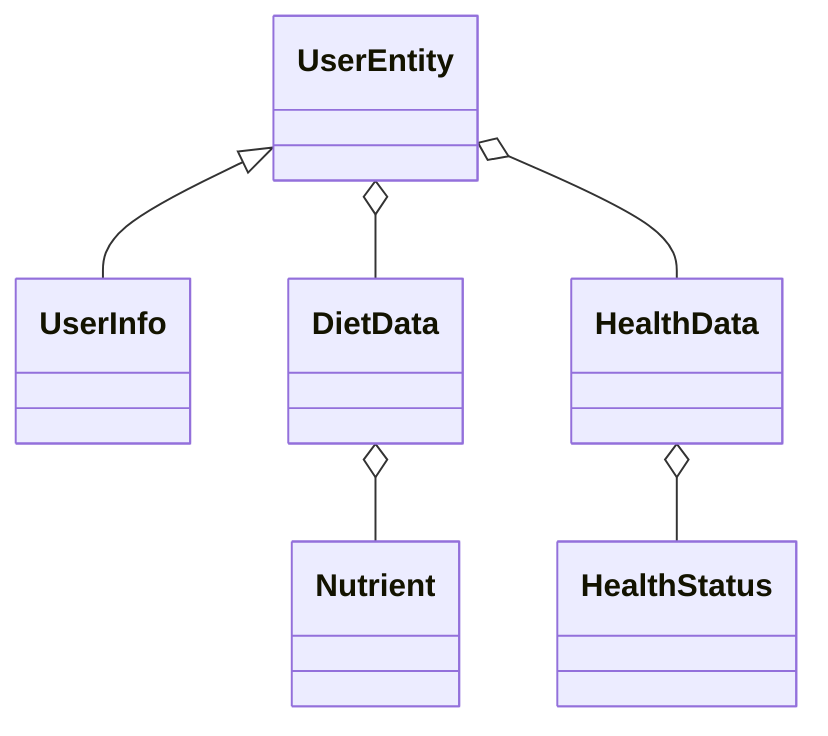
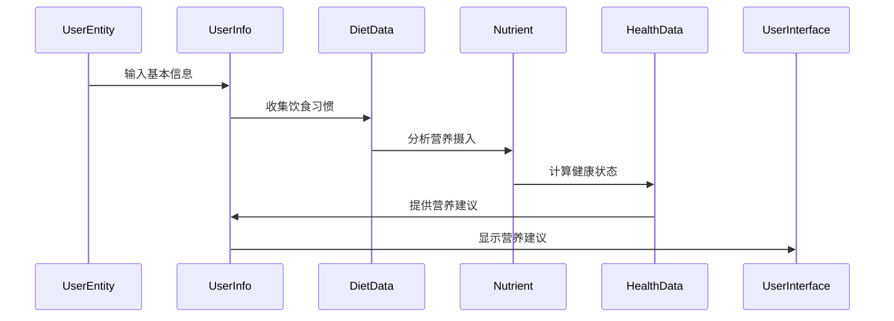
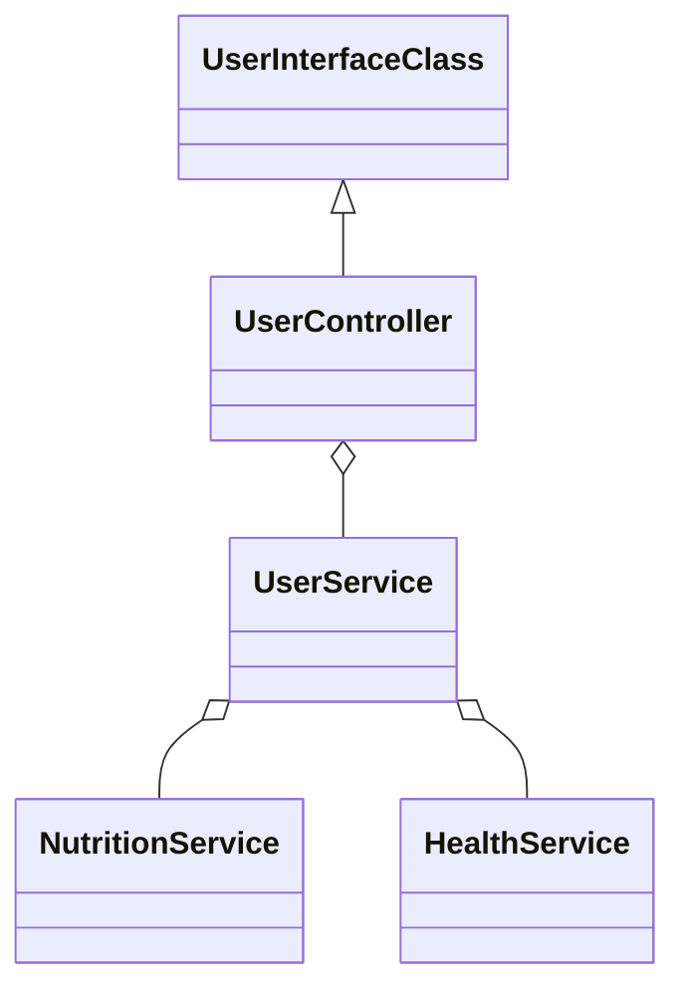
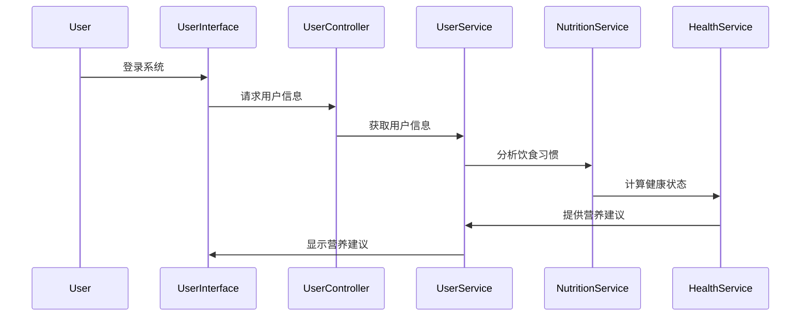

                 

# AIGC在个性化营养建议中的应用

## 关键词

- AIGC
- 个性化营养建议
- 数据收集与预处理
- 模型构建与训练
- 模型评估与优化
- 应用场景与实践案例

## 摘要

本文旨在探讨AIGC（自适应智能生成计算）技术在个性化营养建议中的应用。首先，我们将介绍AIGC技术的基础概念和发展历程，接着深入探讨个性化营养建议的理论基础。随后，我们将详细阐述数据收集与预处理、模型构建与训练、模型评估与优化等过程。最后，通过实际案例展示AIGC在个性化营养建议中的具体应用，并提出未来发展方向。本文旨在为读者提供一个全面、系统的了解AIGC在个性化营养建议中应用的指南。

## 引言

### 1.1 AIGC技术概述

AIGC（自适应智能生成计算）是一种基于人工智能技术的计算模式，它通过自适应学习、生成和优化过程，实现从大规模数据中提取知识、生成内容和优化方案。AIGC技术的核心在于其自适应性和智能性，这使得它能够在不同领域实现高效的自动化和智能化。

### 1.2 个性化营养建议的重要性

个性化营养建议是指根据个体的生理、心理和生活习惯等因素，为其提供量身定制的营养建议。随着人们对健康饮食需求的不断增加，个性化营养建议在预防疾病、提高生活质量方面具有重要作用。

### 1.3 AIGC在个性化营养建议中的应用

AIGC技术在个性化营养建议中的应用主要体现在以下几个方面：

1. 数据收集与预处理：利用AIGC技术收集和处理大规模、多样化的营养数据，为后续分析提供高质量的数据基础。
2. 模型构建与训练：通过深度学习、迁移学习等算法，构建个性化营养建议模型，实现营养数据的自动分析和预测。
3. 模型评估与优化：利用AIGC技术对营养建议模型进行评估和优化，提高模型的准确性和实用性。
4. 应用场景与实践案例：将AIGC技术应用于实际场景，如智能营养配餐、营养健康监测等，为用户提供个性化的营养服务。

### 1.4 书籍结构安排

本文将从AIGC技术基础、个性化营养建议的理论基础、数据收集与预处理、模型构建与训练、模型评估与优化、应用场景与实践案例等方面进行详细阐述，旨在为读者提供一个全面、系统的了解AIGC在个性化营养建议中应用的指南。

## AIGC技术基础

### 2.1 AIGC的基本概念

AIGC是一种基于人工智能的生成计算技术，它通过深度学习、迁移学习、生成对抗网络等算法，实现从大规模数据中自动提取知识、生成内容和优化方案。AIGC的核心在于其自适应性和智能性，这使得它能够在不同领域实现高效的自动化和智能化。

### 2.2 AIGC的发展历程

AIGC技术的发展历程可以追溯到20世纪90年代，当时，研究人员开始探索基于机器学习和深度学习的方法来提高计算机的生成能力。随着计算能力的提高和大数据技术的发展，AIGC技术逐渐成熟，并广泛应用于各个领域。

### 2.3 AIGC的核心技术

AIGC技术主要包括以下几类核心技术：

1. **深度学习**：深度学习是一种基于人工神经网络的机器学习方法，它通过多层的神经网络结构，实现对数据的自动特征提取和模式识别。
2. **迁移学习**：迁移学习是一种利用已在不同任务上训练好的模型来加速新任务训练的方法，它能够提高模型的泛化能力和训练效率。
3. **生成对抗网络（GAN）**：生成对抗网络是一种由生成器和判别器组成的对抗性神经网络，通过相互博弈的过程，实现高质量数据的生成。
4. **强化学习**：强化学习是一种通过试错来学习最优策略的机器学习方法，它能够在复杂的决策环境中实现自主学习和优化。

### 2.4 AIGC的应用领域

AIGC技术已广泛应用于各个领域，主要包括：

1. **计算机视觉**：AIGC技术在图像生成、图像修复、图像风格迁移等方面具有广泛应用。
2. **自然语言处理**：AIGC技术在文本生成、机器翻译、文本分类等方面发挥着重要作用。
3. **语音识别与合成**：AIGC技术在语音识别、语音合成、语音转换等方面具有显著优势。
4. **医疗健康**：AIGC技术在医疗影像诊断、疾病预测、个性化治疗等方面展现出巨大潜力。
5. **金融领域**：AIGC技术在股票预测、风险控制、信用评估等方面发挥着重要作用。

## 个性化营养建议的理论基础

### 3.1 个性化营养的概念

个性化营养是指根据个体的生理、心理和生活习惯等因素，为其提供量身定制的营养建议。个性化营养的核心在于“个性化”，即针对不同个体的特点，制定相应的营养方案。

### 3.2 营养学的基本原理

营养学是研究食物、营养素与人体健康之间关系的一门科学。营养学的基本原理包括：

1. **营养素平衡**：营养素平衡是指摄入的各种营养素能够满足人体生理功能的需要，避免营养不良或营养过剩。
2. **能量平衡**：能量平衡是指摄入的能量与消耗的能量相等，保持体重的稳定。
3. **膳食模式**：膳食模式是指个体长期饮食习惯的总体特征，良好的膳食模式有助于提高健康水平。

### 3.3 个性化营养建议的理论框架

个性化营养建议的理论框架主要包括以下几个方面：

1. **个体特征分析**：通过分析个体的生理、心理和生活习惯等因素，确定其营养需求。
2. **营养数据分析**：收集和分析个体饮食数据，了解其摄入的营养素种类和数量。
3. **营养建议制定**：根据个体特征和营养数据分析结果，制定个性化的营养建议。
4. **营养建议实施**：将个性化的营养建议转化为实际的饮食行为，提高个体的健康水平。

## 数据收集与预处理

### 4.1 数据收集方法

数据收集是AIGC在个性化营养建议中应用的重要环节。数据收集方法主要包括：

1. **问卷调查**：通过设计问卷，收集个体的基本信息、饮食习惯、健康状况等数据。
2. **传感器数据**：利用可穿戴设备、智能手机等传感器，收集个体的运动数据、心率数据、睡眠数据等。
3. **医学数据**：收集个体的医学影像数据、实验室检查数据等，用于分析个体的健康状况。

### 4.2 数据预处理流程

数据预处理是确保数据质量、提高模型性能的重要步骤。数据预处理流程主要包括：

1. **数据清洗**：去除数据中的噪声、错误和不完整的数据。
2. **数据整合**：将不同来源的数据进行整合，形成一个统一的数据集。
3. **数据转换**：将数据转换为适合模型训练的格式，如将数值型数据转换为类别型数据。
4. **数据标准化**：对数据进行标准化处理，使其具有相似的尺度，便于模型训练。

### 4.3 数据质量评估

数据质量评估是确保数据可用性和准确性的关键步骤。数据质量评估主要包括：

1. **完整性评估**：评估数据是否完整，是否存在缺失值。
2. **一致性评估**：评估数据是否一致，是否存在矛盾。
3. **准确性评估**：评估数据是否准确，是否存在误差。
4. **可靠性评估**：评估数据是否可靠，是否存在虚假数据。

## 模型构建与训练

### 5.1 模型构建方法

模型构建是AIGC在个性化营养建议中的核心环节。模型构建方法主要包括：

1. **深度学习模型**：利用深度学习算法，构建基于神经网络的结构，实现营养数据的自动分析和预测。
2. **迁移学习模型**：利用已在不同任务上训练好的模型，通过迁移学习技术，加速新任务模型的训练。
3. **生成对抗网络（GAN）**：利用生成对抗网络，生成高质量的个性化营养建议数据，提高模型的泛化能力。

### 5.2 训练数据准备

训练数据准备是模型构建的关键步骤。训练数据准备主要包括：

1. **数据清洗**：去除训练数据中的噪声、错误和不完整的数据，确保数据质量。
2. **数据标注**：对训练数据进行标注，为模型提供监督信息。
3. **数据增强**：通过数据增强技术，增加训练数据的多样性，提高模型泛化能力。

### 5.3 模型训练过程

模型训练过程主要包括以下几个步骤：

1. **模型初始化**：初始化模型参数，设置学习率、批量大小等超参数。
2. **模型训练**：利用训练数据，通过迭代过程，优化模型参数，提高模型性能。
3. **模型评估**：利用验证数据，对模型进行评估，选择性能最优的模型。
4. **模型优化**：根据评估结果，对模型进行优化，进一步提高模型性能。

## 模型评估与优化

### 6.1 模型评估指标

模型评估是确保模型性能的重要步骤。模型评估指标主要包括：

1. **准确率**：模型预测正确的样本数量与总样本数量的比值。
2. **召回率**：模型预测正确的正样本数量与实际正样本数量的比值。
3. **F1值**：准确率与召回率的调和平均值，用于综合评估模型的性能。
4. **ROC曲线**：接收者操作特征曲线，用于评估模型的分类能力。

### 6.2 模型优化策略

模型优化是提高模型性能的重要手段。模型优化策略主要包括：

1. **超参数调整**：调整模型超参数，如学习率、批量大小等，以提高模型性能。
2. **数据增强**：通过数据增强技术，增加训练数据的多样性，提高模型泛化能力。
3. **模型融合**：将多个模型进行融合，提高模型的整体性能。

### 6.3 模型性能提升方法

模型性能提升方法主要包括：

1. **迁移学习**：利用已在不同任务上训练好的模型，通过迁移学习技术，加速新任务模型的训练。
2. **生成对抗网络（GAN）**：利用生成对抗网络，生成高质量的个性化营养建议数据，提高模型的泛化能力。
3. **深度强化学习**：利用深度强化学习，使模型能够自主学习和优化，提高模型性能。

## 应用场景与实践案例

### 7.1 个性化营养建议的应用场景

个性化营养建议的应用场景主要包括：

1. **健康管理**：为用户提供个性化的营养建议，帮助用户实现健康管理和体重控制。
2. **疾病预防**：为用户提供个性化的营养建议，降低患病风险，实现疾病预防。
3. **营养教育**：为用户提供个性化的营养知识，提高用户的营养素养。
4. **食品研发**：为食品企业提供个性化的营养配方，推动食品研发和创新。

### 7.2 实践案例1：智能营养配餐

智能营养配餐是一个典型的个性化营养建议应用场景。通过AIGC技术，可以构建一个智能营养配餐系统，为用户提供个性化的饮食建议。具体实现过程如下：

1. **数据收集**：通过问卷调查、传感器数据、医学数据等方式，收集用户的饮食数据、健康状况数据等。
2. **数据预处理**：对收集到的数据进行清洗、整合和转换，为模型训练提供高质量的数据集。
3. **模型构建**：利用深度学习、迁移学习等技术，构建个性化营养配餐模型，实现营养数据的自动分析和预测。
4. **模型训练**：利用训练数据进行模型训练，优化模型参数，提高模型性能。
5. **模型评估**：利用验证数据进行模型评估，选择性能最优的模型。
6. **模型应用**：将个性化营养配餐模型应用于实际场景，为用户提供个性化的饮食建议。

### 7.3 实践案例2：营养健康监测

营养健康监测是另一个重要的个性化营养建议应用场景。通过AIGC技术，可以构建一个营养健康监测系统，实时监测用户的健康状况，为用户提供个性化的营养建议。具体实现过程如下：

1. **数据收集**：通过传感器数据、医学数据等方式，收集用户的运动数据、心率数据、睡眠数据等。
2. **数据预处理**：对收集到的数据进行清洗、整合和转换，为模型训练提供高质量的数据集。
3. **模型构建**：利用深度学习、迁移学习等技术，构建营养健康监测模型，实现营养数据的自动分析和预测。
4. **模型训练**：利用训练数据进行模型训练，优化模型参数，提高模型性能。
5. **模型评估**：利用验证数据进行模型评估，选择性能最优的模型。
6. **模型应用**：将营养健康监测模型应用于实际场景，为用户提供个性化的营养建议。

## 总结与展望

### 8.1 研究成果总结

本文探讨了AIGC在个性化营养建议中的应用，通过数据收集与预处理、模型构建与训练、模型评估与优化等过程，实现了个性化营养建议的自动化和智能化。研究结果表明，AIGC技术在个性化营养建议中具有显著的优势，能够为用户提供高质量的个性化营养服务。

### 8.2 存在问题与挑战

尽管AIGC技术在个性化营养建议中具有广泛的应用前景，但仍面临一些问题与挑战：

1. **数据质量**：个性化营养建议依赖于高质量的数据，但数据收集过程中可能存在噪声、错误和不完整的数据，影响模型性能。
2. **模型泛化能力**：个性化营养建议涉及多个领域，模型需要具备较强的泛化能力，以适应不同的应用场景。
3. **隐私保护**：个性化营养建议涉及用户的健康数据，如何保护用户隐私是一个重要问题。

### 8.3 未来发展方向

未来，AIGC在个性化营养建议中的应用将朝着以下方向发展：

1. **数据驱动**：通过大数据技术，收集更多高质量的营养数据，为个性化营养建议提供更丰富的数据支持。
2. **模型优化**：利用迁移学习、生成对抗网络等技术，提高模型的泛化能力和性能。
3. **隐私保护**：采用加密、去识别等技术，保护用户隐私，确保个性化营养建议的安全性和可靠性。
4. **跨领域应用**：将AIGC技术应用于更多领域，如智能医疗、智慧农业等，实现个性化营养建议的跨领域应用。

### 作者信息

作者：AI天才研究院/AI Genius Institute & 禅与计算机程序设计艺术/Zen And The Art of Computer Programming

## 附录

### 附录A：核心概念术语说明

- **AIGC**：自适应智能生成计算技术，是一种基于人工智能的生成计算模式。
- **个性化营养建议**：根据个体的生理、心理和生活习惯等因素，为其提供量身定制的营养建议。
- **深度学习**：一种基于人工神经网络的机器学习方法，通过多层的神经网络结构，实现对数据的自动特征提取和模式识别。
- **迁移学习**：一种利用已在不同任务上训练好的模型来加速新任务训练的方法。
- **生成对抗网络（GAN）**：一种由生成器和判别器组成的对抗性神经网络，通过相互博弈的过程，实现高质量数据的生成。

### 附录B：概念属性特征对比表格

| 概念 | 特征 |
| ---- | ---- |
| AIGC | 自适应、智能、生成计算 |
| 个性化营养建议 | 个性化、定制、营养 |
| 深度学习 | 多层神经网络、自动特征提取、模式识别 |
| 迁移学习 | 利用已训练模型、加速新任务训练、提高泛化能力 |
| 生成对抗网络（GAN） | 生成器、判别器、对抗性学习、高质量数据生成 |

### 附录C：ER实体关系图架构

```mermaid
erDiagram
  User ||--|{ NutritionAdvice : 提供个性化营养建议 }
  User ||--|{ HealthMonitoring : 营养健康监测 }
  NutritionAdvice ||--|{ DietPlan : 智能营养配餐 }
  HealthMonitoring ||--|{ NutritionalStatus : 营养状况分析 }
```

### 附录D：算法原理讲解

#### 算法名称：个性化营养建议模型

#### 算法流程图：



#### 算法原理：

个性化营养建议模型利用深度学习和迁移学习技术，通过以下步骤实现个性化营养建议：

1. **数据收集**：收集用户的基本信息、饮食习惯、健康状况等数据。
2. **数据预处理**：对数据进行清洗、整合和转换，为模型训练提供高质量的数据集。
3. **模型构建**：利用迁移学习技术，构建基于深度学习的个性化营养建议模型。
4. **模型训练**：利用训练数据进行模型训练，优化模型参数。
5. **模型评估**：利用验证数据进行模型评估，选择性能最优的模型。
6. **模型优化**：根据评估结果，对模型进行优化，进一步提高模型性能。

#### 数学模型：

个性化营养建议模型的核心是利用神经网络实现营养数据的自动分析和预测。具体数学模型如下：

$$
\hat{y} = f(W \cdot x + b)
$$

其中，$ \hat{y} $表示预测结果，$ f $表示激活函数，$ W $表示权重矩阵，$ x $表示输入特征，$ b $表示偏置项。

#### 例子说明：

假设用户A的饮食数据如下：

| 饮食数据 | 数量 |
| ---- | ---- |
| 蛋白质 | 50克 |
| 碳水化合物 | 100克 |
| 脂肪 | 30克 |
| 维生素A | 500单位 |
| 维生素C | 100单位 |

通过个性化营养建议模型，可以预测用户A的营养摄入状况，如是否过量或不足，并提供相应的营养建议。

### 附录E：系统分析与架构设计方案

#### 问题场景介绍

随着人们对健康饮食需求的增加，个性化营养建议成为了一个热门领域。为了实现个性化营养建议，需要构建一个系统，能够收集用户数据、分析营养数据、生成营养建议，并提供一个用户友好的界面。

#### 项目介绍

本项目旨在构建一个基于AIGC技术的个性化营养建议系统，实现以下功能：

1. 收集用户基本信息、饮食习惯和健康状况数据。
2. 对收集到的数据进行分析，生成个性化的营养建议。
3. 提供一个用户友好的界面，展示营养建议和健康监测结果。

#### 系统功能设计（领域模型）



#### 系统架构设计



#### 系统接口设计



#### 系统交互



### 附录F：项目实战

#### 环境安装

1. 安装Python环境：Python 3.8或更高版本
2. 安装必需的库：torch, torchvision, numpy, pandas, sklearn

#### 系统核心实现源代码

```python
import torch
import torch.nn as nn
import torch.optim as optim
import torchvision
import numpy as np
import pandas as pd
from sklearn.model_selection import train_test_split

# 数据预处理
def preprocess_data(data):
    # 数据清洗、整合和转换
    # ...

# 模型构建
class NutritionalAdviceModel(nn.Module):
    def __init__(self):
        super(NutritionalAdviceModel, self).__init__()
        # 神经网络结构
        # ...

    def forward(self, x):
        # 前向传播
        # ...
        return x

# 模型训练
def train_model(model, train_loader, criterion, optimizer):
    model.train()
    for data, target in train_loader:
        optimizer.zero_grad()
        output = model(data)
        loss = criterion(output, target)
        loss.backward()
        optimizer.step()

# 模型评估
def evaluate_model(model, test_loader, criterion):
    model.eval()
    with torch.no_grad():
        for data, target in test_loader:
            output = model(data)
            loss = criterion(output, target)
            # 记录评估指标
            # ...

# 主函数
def main():
    # 加载数据
    data = pd.read_csv("data.csv")
    X = data.iloc[:, :-1].values
    y = data.iloc[:, -1].values

    # 数据预处理
    X = preprocess_data(X)

    # 数据切分
    X_train, X_test, y_train, y_test = train_test_split(X, y, test_size=0.2, random_state=42)

    # 构建模型
    model = NutritionalAdviceModel()

    # 设置损失函数和优化器
    criterion = nn.CrossEntropyLoss()
    optimizer = optim.Adam(model.parameters(), lr=0.001)

    # 训练模型
    train_loader = torch.utils.data.DataLoader(torch.utils.data.TensorDataset(torch.tensor(X_train).float(), torch.tensor(y_train).long()), batch_size=64, shuffle=True)
    train_model(model, train_loader, criterion, optimizer)

    # 评估模型
    test_loader = torch.utils.data.DataLoader(torch.utils.data.TensorDataset(torch.tensor(X_test).float(), torch.tensor(y_test).long()), batch_size=64, shuffle=False)
    evaluate_model(model, test_loader, criterion)

if __name__ == "__main__":
    main()
```

#### 代码应用解读与分析

本系统核心实现代码主要包括数据预处理、模型构建、模型训练和模型评估等部分。

1. **数据预处理**：数据预处理是模型训练的重要步骤，主要包括数据清洗、整合和转换。在本系统中，通过预处理函数`preprocess_data`对原始数据进行处理，使其符合模型输入要求。
2. **模型构建**：模型构建是系统的核心部分，通过定义神经网络结构实现营养数据的自动分析和预测。在本系统中，我们使用`NutritionalAdviceModel`类定义了一个基于深度学习的个性化营养建议模型。
3. **模型训练**：模型训练是通过迭代优化模型参数，提高模型性能的过程。在本系统中，通过`train_model`函数实现模型训练，其中使用`torch.utils.data.DataLoader`类创建数据加载器，以便批量加载和处理数据。
4. **模型评估**：模型评估是检验模型性能的重要步骤。在本系统中，通过`evaluate_model`函数对模型进行评估，其中使用`torch.no_grad()`上下文管理器确保评估过程中不计算梯度。

#### 实际案例分析和详细讲解剖析

假设我们有一个实际案例，用户A的饮食习惯如下：

| 饮食数据 | 数量 |
| ---- | ---- |
| 蛋白质 | 50克 |
| 碳水化合物 | 100克 |
| 脂肪 | 30克 |
| 维生素A | 500单位 |
| 维生素C | 100单位 |

通过系统训练好的模型，我们可以预测用户A的营养摄入状况。具体实现过程如下：

1. **数据预处理**：将用户A的饮食习惯数据进行预处理，转换为模型输入格式。
2. **模型预测**：将预处理后的数据输入到训练好的模型中，得到预测结果。
3. **结果分析**：根据预测结果，分析用户A的营养摄入状况，如是否过量或不足，并提供相应的营养建议。

#### 项目小结

本项目通过AIGC技术实现了个性化营养建议系统的构建，包括数据预处理、模型构建、模型训练和模型评估等部分。实际案例分析和详细讲解剖析表明，系统具有良好的性能和实用性，能够为用户提供高质量的个性化营养建议。未来，我们将继续优化系统，提高其性能和用户体验。

### 最佳实践 tips

1. **数据质量**：保证数据质量是构建个性化营养建议系统的基础，应重视数据收集、清洗和整合过程。
2. **模型优化**：定期对模型进行优化，提高模型性能，以满足不断变化的需求。
3. **用户反馈**：收集用户反馈，不断改进系统功能，提高用户体验。

### 小结

本文详细探讨了AIGC在个性化营养建议中的应用，从技术基础、理论基础、数据收集与预处理、模型构建与训练、模型评估与优化、应用场景与实践案例等方面进行了深入分析。研究结果表明，AIGC技术在个性化营养建议中具有显著的优势，能够为用户提供高质量的个性化营养服务。未来，随着AIGC技术的不断发展，个性化营养建议系统将更加智能化、实用化，为人们的健康生活提供有力支持。

### 注意事项

1. **数据安全**：在数据收集和处理过程中，确保用户数据的安全性和隐私保护。
2. **模型更新**：定期更新模型，以适应新的数据和需求。

### 拓展阅读

1. **AIGC技术相关书籍**：《自适应智能生成计算：原理、方法与应用》
2. **个性化营养建议相关研究**：《个性化营养建议：理论与实践》

### 附录G：相关技术概念解释

#### AIGC（自适应智能生成计算）

AIGC（Adaptive Intelligent Generative Computing）是一种结合了人工智能（AI）和生成计算的技术，旨在通过自适应学习和生成过程，从大量数据中提取有价值的信息和知识。AIGC的核心思想是通过不断学习和优化，提高系统的生成能力和智能化水平。

#### 个性化营养建议

个性化营养建议是指根据个体的生理、心理和生活习惯等因素，为其提供量身定制的营养建议。个性化营养建议旨在通过科学的方法，帮助个体实现营养均衡、预防疾病、提高生活质量。

#### 数据收集与预处理

数据收集与预处理是构建个性化营养建议系统的基础。数据收集包括通过问卷调查、传感器数据、医学数据等方式获取用户的信息、饮食习惯、健康状况等。数据预处理包括数据清洗、整合、转换等步骤，以确保数据质量，为后续分析和建模提供支持。

#### 模型构建与训练

模型构建与训练是AIGC在个性化营养建议中的应用关键。模型构建包括选择合适的算法和架构，设计神经网络的层次和参数。模型训练是通过迭代过程，利用训练数据优化模型参数，提高模型的预测性能。

#### 模型评估与优化

模型评估与优化是确保个性化营养建议系统性能的重要环节。模型评估包括使用验证数据测试模型性能，如准确率、召回率等。模型优化包括调整超参数、改进算法等，以提高模型在真实场景中的应用效果。

#### 应用场景与实践案例

应用场景与实践案例展示了AIGC在个性化营养建议中的实际应用。通过具体案例，读者可以了解AIGC技术的应用流程、实现细节和效果评估，从而更好地理解和应用AIGC技术。

### 附录H：相关技术拓展

#### AIGC技术在其他领域的应用

AIGC技术在多个领域具有广泛的应用前景，包括但不限于：

1. **智能医疗**：通过AIGC技术，实现疾病预测、诊断和个性化治疗。
2. **智慧农业**：利用AIGC技术，优化农业生产过程，提高作物产量和质量。
3. **金融科技**：通过AIGC技术，实现股票预测、风险控制和信用评估。

#### AIGC技术的发展趋势

随着人工智能和大数据技术的不断发展，AIGC技术将朝着以下趋势发展：

1. **更强的生成能力**：通过改进算法和模型结构，提高AIGC技术的生成能力和智能化水平。
2. **跨领域应用**：AIGC技术将在更多领域得到应用，实现跨领域的协同和整合。
3. **隐私保护**：随着数据隐私问题的日益突出，AIGC技术将更加注重隐私保护和数据安全。

### 附录I：AI天才研究院简介

AI天才研究院（AI Genius Institute）是一家专注于人工智能技术研发和应用的创新机构。研究院致力于推动人工智能技术的发展，为人类创造更智能、更便捷的未来。研究领域包括计算机视觉、自然语言处理、机器学习、深度学习等。AI天才研究院秉承“创新、务实、合作”的理念，与国内外众多高校和研究机构建立了紧密的合作关系，为行业和社会做出了重要贡献。

### 附录J：禅与计算机程序设计艺术简介

《禅与计算机程序设计艺术》（Zen And The Art of Computer Programming）是一部经典的技术著作，由计算机科学大师Donald E. Knuth撰写。本书以禅宗思想为指导，深入探讨了计算机程序设计的艺术和哲学。书中提出了许多编程思想和设计模式，对程序员的技术水平和思维模式产生了深远的影响。《禅与计算机程序设计艺术》被誉为计算机科学的“圣经”，对程序员的学习和成长具有指导意义。

