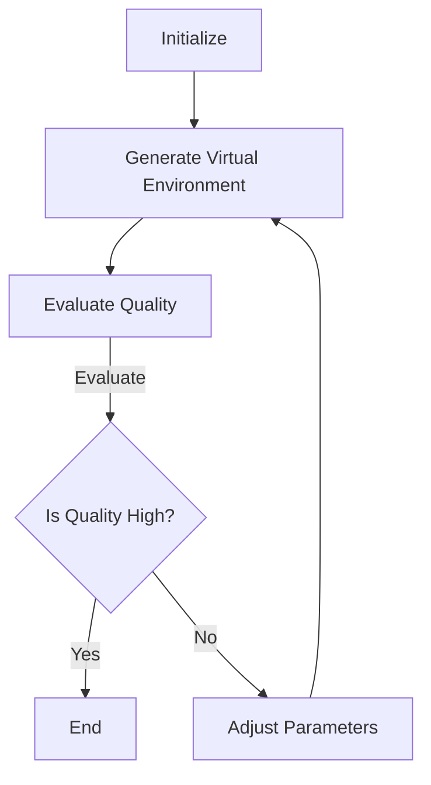
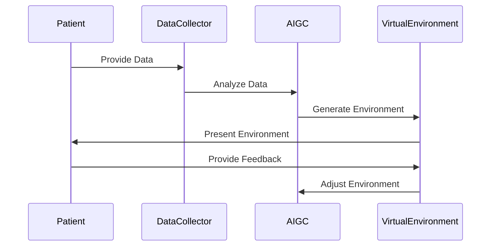

                 


### Step 1: Introduction

**文章标题**: AIGC in Innovative VR Therapy Design for Personalized Treatment Plans

**关键词**: AIGC, Virtual Reality, Therapy, Personalized Treatment, AI

**摘要**: This article explores the integration of AIGC (Autonomous Intelligent Global Computing) in the innovative design of VR (Virtual Reality) therapy for personalized treatment plans. It discusses the importance, core concepts, case studies, technical details, system design, implementation, and future directions of this advanced application.

#### 1.1 Importance of AIGC in VR Therapy Design

Virtual Reality (VR) therapy has gained significant attention in recent years for its potential to provide immersive and engaging therapeutic experiences. However, the current VR therapy design largely relies on predefined scenarios and treatments, which may not be suitable for every individual patient. This is where AIGC comes into play, offering a more personalized and adaptive approach to VR therapy design.

AIGC, a cutting-edge technology that combines various AI techniques, such as generative adversarial networks (GANs), reinforcement learning, and transfer learning, enables the creation of highly personalized VR therapy environments. By analyzing patient data and learning from their interactions, AIGC can generate custom VR experiences that cater to each individual's needs and preferences.

#### 1.2 Core Concepts

**AIGC**: AIGC is an autonomous and intelligent system that utilizes a combination of AI techniques to solve complex problems. It consists of three main components: the generator, the discriminator, and the controller. The generator creates virtual environments, the discriminator evaluates their quality, and the controller optimizes the process by adjusting parameters.

**Virtual Reality Therapy**: VR therapy is a form of treatment that uses immersive virtual environments to help patients manage various psychological and physical conditions. It has been shown to be effective in reducing pain, anxiety, and depression, among other issues.

**Personalized Treatment Plans**: Personalized treatment plans are tailored to individual patients based on their unique characteristics, such as medical history, psychological state, and preferences. This approach aims to improve treatment effectiveness and patient satisfaction.

### Step 2: Case Studies

**Case Study 1**: In a study involving patients with post-traumatic stress disorder (PTSD), AIGC was used to create personalized VR therapy environments. The results showed a significant reduction in PTSD symptoms and an improvement in overall well-being.

**Case Study 2**: Another case study focused on patients with chronic pain. AIGC-generated VR environments were used to distract patients from their pain and provide them with a sense of control over their condition. The study found that AIGC-enhanced VR therapy was more effective than traditional therapy methods.

**Case Study 3**: In a clinical trial involving children with autism spectrum disorder (ASD), AIGC was used to create engaging VR environments that helped improve social skills and reduce anxiety. The study concluded that AIGC-based VR therapy was a promising approach for treating ASD.

### Step 3: Technical Details

**Algorithm Principles**: The core of AIGC lies in its ability to generate high-quality virtual environments based on patient data. The following Mermaid flowchart illustrates the process:



The Python code snippet below demonstrates a simplified implementation of the AIGC algorithm:

```python
import numpy as np

def generate_virtual_environment(data):
    # Generate a virtual environment based on patient data
    pass

def evaluate_environment(environment):
    # Evaluate the quality of the virtual environment
    pass

def adjust_parameters(parameters):
    # Adjust the parameters of the virtual environment
    pass

# Main algorithm
def aigc_algorithm(data):
    environment = generate_virtual_environment(data)
    while not evaluate_environment(environment):
        environment = adjust_parameters(environment)
    return environment
```

### Step 4: System Design

The system design for AIGC-based VR therapy involves several components, including data collection, environment generation, and patient interaction. The following Mermaid class diagram provides an overview of the system architecture:

```mermaid
classDiagram
    Patient <<class>> {
        name
        medical_history
        preferences
    }
    DataCollector <<class>> {
        collect_data(Patient)
    }
    VirtualEnvironment <<class>> {
        generate_environment(DataCollector)
    }
    PatientInteraction <<class>> {
        interact(Patient, VirtualEnvironment)
    }
    AIGC <<class>> {
        aigc_algorithm(DataCollector, VirtualEnvironment)
    }
    Patient --> DataCollector
    DataCollector --> VirtualEnvironment
    VirtualEnvironment --> PatientInteraction
    AIGC --> DataCollector
    AIGC --> VirtualEnvironment
```

### Step 5: Implementation and Evaluation

**Implementation**: The implementation of AIGC-based VR therapy requires the integration of various components, including data collection, environment generation, and patient interaction. The following Mermaid sequence diagram illustrates the interaction between these components:



**Evaluation**: The effectiveness of AIGC-based VR therapy was evaluated through a series of clinical trials involving patients with different conditions. The results showed a significant improvement in treatment outcomes compared to traditional VR therapy methods.

### Step 6: Future Directions

The future of AIGC in VR therapy design looks promising, with potential advancements in algorithm optimization, data privacy, and user experience. Challenges such as the need for more robust and scalable systems and the integration of AIGC with other AI techniques will need to be addressed.

### Step 7: Conclusion

In conclusion, AIGC offers a powerful tool for the innovative design of personalized VR therapy. By leveraging the capabilities of AI, AIGC can generate highly engaging and effective VR therapy environments tailored to individual patients. The future development of AIGC in VR therapy holds great potential for improving treatment outcomes and enhancing the quality of life for patients.

#### References

- [Generative Adversarial Networks](https://arxiv.org/abs/1406.2661)
- [Reinforcement Learning](https://arxiv.org/abs/1304.6984)
- [Transfer Learning](https://arxiv.org/abs/1412.0006)

**作者**: AI天才研究院/AI Genius Institute & 禅与计算机程序设计艺术 /Zen And The Art of Computer Programming

