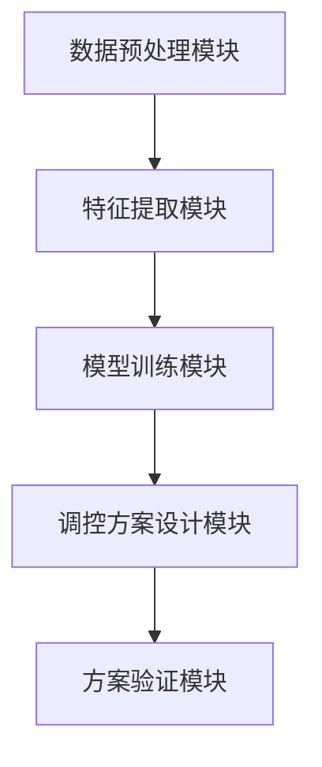
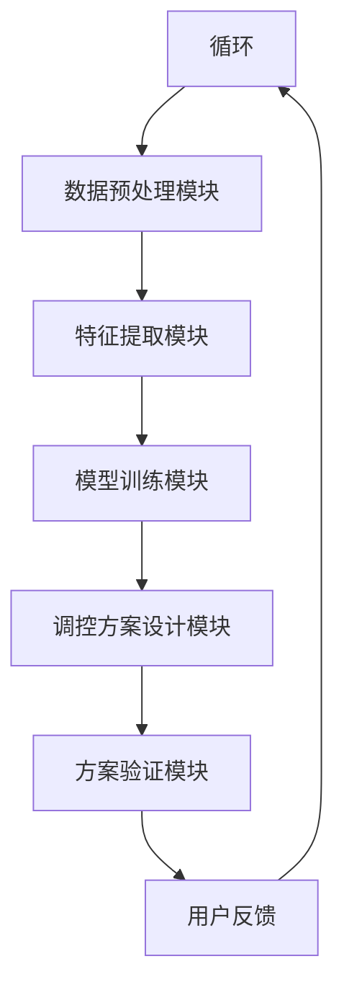

                 

### 第一部分: 引言与背景

#### 第1章: 问题背景与核心概念

##### 1.1 问题背景

随着生物技术的迅猛发展，个性化医疗已经成为现代医学的一个重要方向。在个性化医疗中，表观遗传调控被认为是实现精准医疗的关键环节之一。表观遗传调控是通过DNA甲基化、组蛋白修饰和非编码RNA调控等机制，在基因组的层面上调控基因表达，进而影响个体的生理和病理状态。

个性化表观遗传调控方案设计旨在根据个体的基因表观型，量身定制相应的调控策略，从而实现对疾病的有效预防和治疗。然而，这一过程面临着数据复杂性高、变量多、机制复杂等挑战。

##### 1.1.1 个性化表观遗传调控的必要性

个性化表观遗传调控方案的必要性体现在以下几个方面：

1. **个体差异**：不同个体的基因表观型存在显著差异，这使得传统的统一治疗方案难以满足个体的需求。
2. **疾病预防**：通过个性化表观遗传调控，可以提前发现潜在的健康风险，实现疾病的早期预防。
3. **治疗效果优化**：个性化调控方案可以针对特定的基因表观型，选择最有效的调控策略，提高治疗效果。

##### 1.1.2 表观遗传学的基本概念

表观遗传学是研究基因表达在染色体水平和分子水平的调控机制的学科。主要涉及以下概念：

1. **DNA甲基化**：通过在DNA序列中添加甲基基团，改变基因的表达状态。
2. **组蛋白修饰**：组蛋白上的特定氨基酸残基发生化学修饰，影响基因的表达。
3. **非编码RNA**：非编码RNA在基因表达的调控中扮演重要角色，包括miRNA、siRNA和lncRNA等。

##### 1.1.3 AI在生物医学研究中的应用

近年来，人工智能（AI）在生物医学领域得到了广泛应用。其中，深度学习、强化学习和生成对抗网络等技术，为个性化表观遗传调控方案的设计提供了强有力的工具。

1. **数据挖掘与分析**：AI可以帮助从海量生物医学数据中提取有价值的信息，为个性化调控方案提供数据支持。
2. **模型预测与优化**：AI模型可以预测不同调控策略对基因表达的影响，优化调控方案。
3. **药物筛选与设计**：AI可以加速药物的研发过程，提高新药的筛选效率。

##### 1.2 核心概念

###### 1.2.1 AIGC的定义与特点

AIGC（增强型智能生成计算）是一种基于人工智能的自动化算法，通过学习大量的数据，自动生成新的模型、代码和内容。其特点包括：

1. **自动化生成**：AIGC能够自动化地生成复杂的模型和代码，减少人工干预。
2. **数据驱动**：AIGC依赖于大量数据驱动，能够从数据中学习并优化生成过程。
3. **泛化能力**：AIGC具有较强的泛化能力，能够在不同领域和任务中应用。

###### 1.2.2 表观遗传调控机制

表观遗传调控机制主要包括DNA甲基化、组蛋白修饰和非编码RNA调控。每种机制都有其独特的生物学功能：

1. **DNA甲基化**：通过甲基化修饰，调节基因的表达活性。
2. **组蛋白修饰**：通过改变组蛋白的结构，影响基因的转录和修饰。
3. **非编码RNA**：通过调控mRNA的稳定性、降解和翻译效率，影响基因表达。

###### 1.2.3 个性化医疗与健康管理的需求

个性化医疗和健康管理需要根据个体的基因表观型，量身定制相应的治疗方案和管理方案。这要求：

1. **精准诊断**：通过表观遗传学检测，准确评估个体的健康状态。
2. **个性化治疗**：根据个体差异，制定个性化的表观遗传调控策略。
3. **持续监控**：实时监测个体的基因表达变化，调整治疗方案。

##### 1.3 边界与外延

###### 1.3.1 AIGC在表观遗传调控中的应用范围

AIGC在表观遗传调控中的应用范围包括：

1. **疾病预测**：基于个体基因表观型，预测疾病发生的风险。
2. **治疗策略设计**：基于表观遗传调控机制，设计个性化的治疗策略。
3. **药物筛选与设计**：利用AIGC筛选和设计具有表观遗传调控作用的药物。

###### 1.3.2 个性化表观遗传调控方案的设计原则

个性化表观遗传调控方案的设计原则包括：

1. **个性化诊断**：根据个体的基因表观型，进行精准诊断。
2. **多层次调控**：综合考虑DNA甲基化、组蛋白修饰和非编码RNA调控等多个层次。
3. **持续优化**：根据个体健康状态的变化，持续调整调控方案。

##### 1.4 概念结构与核心要素组成

###### 1.4.1 AIGC的基本架构

AIGC的基本架构包括：

1. **数据输入层**：接收和处理大量的生物医学数据。
2. **模型层**：通过深度学习和生成对抗网络等技术，自动生成调控模型。
3. **优化层**：根据实际应用场景，对模型进行优化和调整。

###### 1.4.2 表观遗传调控的核心要素

表观遗传调控的核心要素包括：

1. **DNA甲基化**：调控基因的表达活性。
2. **组蛋白修饰**：调节基因的转录和修饰。
3. **非编码RNA**：影响基因表达的过程。

##### 1.5 本章小结

本章介绍了个性化表观遗传调控方案的背景、核心概念、AIGC的应用以及设计原则。通过这些内容，为后续章节的详细讨论奠定了基础。

---

#### 第2章: AIGC技术基础

##### 2.1 AIGC的概念与分类

###### 2.1.1 AIGC的概念

AIGC（增强型智能生成计算）是一种基于人工智能的自动化算法，它通过学习大量的数据，能够自动生成新的模型、代码和内容。AIGC的核心思想是利用人工智能技术，实现数据到知识的自动化转化。

###### 2.1.2 AIGC的分类

AIGC可以分为以下几种类型：

1. **深度生成对抗网络（GAN）**：GAN是一种生成模型，通过生成器和判别器的对抗训练，生成高质量的样本。
2. **变分自编码器（VAE）**：VAE是一种基于概率模型的生成模型，通过编码器和解码器的组合，生成新的数据。
3. **生成式强化学习（GRL）**：GRL结合了生成模型和强化学习，通过探索和利用策略，生成优化的数据。

###### 2.1.3 AIGC与传统AI的区别

与传统AI相比，AIGC具有以下区别：

1. **生成能力**：传统AI更多是用于分类、回归等任务，而AIGC具有更强的生成能力，能够生成新的数据。
2. **自动化程度**：AIGC通过自动化算法，减少了人工干预，提高了生成效率。
3. **泛化能力**：AIGC具有较强的泛化能力，能够应用于多种领域和任务。

##### 2.2 AIGC的关键技术

###### 2.2.1 自动化生成模型

自动化生成模型是AIGC的核心技术之一，它通过学习大量的数据，能够自动生成新的模型。自动化生成模型包括：

1. **模型搜索**：通过搜索算法，找到最优的模型结构。
2. **模型生成**：通过生成算法，将数据转化为模型。
3. **模型优化**：通过优化算法，提高模型的性能。

###### 2.2.2 数据驱动生成模型

数据驱动生成模型是AIGC的另一个核心技术，它通过数据驱动的方式，自动生成新的数据。数据驱动生成模型包括：

1. **特征提取**：从数据中提取有价值的信息。
2. **数据生成**：根据特征，生成新的数据。
3. **数据融合**：将多种数据源融合，提高生成数据的准确性。

###### 2.2.3 模型优化与集成

模型优化与集成是AIGC的重要环节，它通过优化和集成多种模型，提高生成数据的质量和效率。模型优化与集成包括：

1. **模型优化**：通过优化算法，提高模型的性能。
2. **模型集成**：将多种模型集成，形成更强大的模型。
3. **模型评估**：通过评估算法，评估模型的性能。

##### 2.3 AIGC在个性化表观遗传调控中的应用

###### 2.3.1 应用场景介绍

AIGC在个性化表观遗传调控中的应用场景包括：

1. **疾病预测**：通过AIGC生成模型，预测个体患病的风险。
2. **治疗策略设计**：通过AIGC生成模型，设计个性化的治疗策略。
3. **药物筛选与设计**：通过AIGC生成模型，筛选和设计具有表观遗传调控作用的药物。

###### 2.3.2 应用优势分析

AIGC在个性化表观遗传调控中的应用优势包括：

1. **高效性**：AIGC能够快速生成高质量的模型，提高研究效率。
2. **准确性**：AIGC通过学习大量数据，能够生成准确的预测模型。
3. **灵活性**：AIGC能够灵活适应不同的应用场景，提供定制化的解决方案。

###### 2.3.3 应用挑战与对策

AIGC在个性化表观遗传调控中的应用挑战包括：

1. **数据隐私**：生物医学数据的隐私保护是AIGC应用的一个重要挑战。
2. **计算资源**：AIGC需要大量的计算资源，对硬件设施提出了高要求。
3. **模型解释性**：AIGC生成的模型往往具有高度的复杂性，缺乏解释性。

针对这些挑战，可以采取以下对策：

1. **数据隐私保护**：采用加密和去识别化技术，保护数据隐私。
2. **分布式计算**：利用分布式计算资源，提高计算效率。
3. **模型解释性增强**：通过可视化技术和解释性模型，提高模型的可解释性。

##### 2.4 本章小结

本章介绍了AIGC的概念、分类、关键技术以及其在个性化表观遗传调控中的应用。通过这些内容，为读者提供了一个关于AIGC的基本认识，为后续章节的深入探讨奠定了基础。

---

### 第三部分: 表观遗传调控机制与模型

#### 第3章: 表观遗传调控的基本原理

##### 3.1 DNA甲基化

###### 3.1.1 甲基化的概念

DNA甲基化是指通过在DNA序列的胞嘧啶（C）碱基上添加甲基基团（CH3），从而改变DNA的甲基化状态。DNA甲基化是一种表观遗传修饰，可以在基因组的层面上调节基因的表达。

###### 3.1.2 甲基化的生物学意义

DNA甲基化在生物体中具有多种生物学意义：

1. **基因表达的调控**：甲基化可以抑制基因的转录，从而影响基因的表达。
2. **基因组稳定性**：甲基化有助于维持基因组的稳定，防止基因突变。
3. **细胞分化和发育**：DNA甲基化在细胞分化和发育过程中起着关键作用。

###### 3.1.3 甲基化与疾病的关系

DNA甲基化与多种疾病的发生和发展密切相关：

1. **肿瘤**：许多肿瘤基因的高甲基化状态与肿瘤的发生有关。
2. **代谢性疾病**：如糖尿病、肥胖等代谢性疾病与DNA甲基化的异常有关。
3. **神经退行性疾病**：如阿尔茨海默病、帕金森病等神经退行性疾病也与DNA甲基化的异常有关。

##### 3.2 组蛋白修饰

###### 3.2.1 组蛋白修饰的概念

组蛋白修饰是指通过在组蛋白的特定氨基酸残基上添加或去除化学基团，从而改变组蛋白的结构和功能。组蛋白修饰包括多种类型，如乙酰化、甲基化、磷酸化等。

###### 3.2.2 组蛋白修饰的种类

组蛋白修饰主要包括以下几种类型：

1. **乙酰化**：乙酰化可以增加组蛋白的阳性电荷，从而降低DNA与组蛋白之间的亲和力，促进基因的表达。
2. **甲基化**：甲基化可以增加组蛋白的稳定性，从而影响基因的表达。
3. **磷酸化**：磷酸化可以增加组蛋白的亲水性，从而影响基因的表达。

###### 3.2.3 组蛋白修饰的生物学功能

组蛋白修饰在生物体中具有多种生物学功能：

1. **基因表达的调控**：组蛋白修饰通过改变组蛋白的结构，影响基因的表达。
2. **染色质结构的重塑**：组蛋白修饰参与染色质结构的重塑，从而影响基因的转录。
3. **细胞分化和发育**：组蛋白修饰在细胞分化和发育过程中起着关键作用。

##### 3.3 非编码RNA调控

###### 3.3.1 非编码RNA的概念

非编码RNA是指不编码蛋白质的RNA分子，包括miRNA、siRNA、lncRNA等。非编码RNA在基因表达的调控中起着重要作用。

###### 3.3.2 非编码RNA的种类

非编码RNA主要包括以下几种类型：

1. **miRNA**：miRNA是一类长度约为22个核苷酸的小RNA分子，通过与目标mRNA的互补序列结合，抑制目标基因的表达。
2. **siRNA**：siRNA是一类双链RNA分子，通过与目标mRNA的互补序列结合，引起目标基因的沉默。
3. **lncRNA**：lncRNA是一类长度超过200个核苷酸的非编码RNA，通过多种机制参与基因表达的调控。

###### 3.3.3 非编码RNA的生物学作用

非编码RNA在生物体中具有多种生物学作用：

1. **基因表达的调控**：非编码RNA通过调控基因的转录和翻译，影响基因的表达。
2. **染色质结构的重塑**：非编码RNA参与染色质结构的重塑，从而影响基因的转录。
3. **细胞分化和发育**：非编码RNA在细胞分化和发育过程中起着关键作用。

##### 3.4 表观遗传调控与基因表达

###### 3.4.1 表观遗传调控机制对基因表达的影响

表观遗传调控机制通过DNA甲基化、组蛋白修饰和非编码RNA调控等多种方式，对基因表达产生深远影响：

1. **基因表达的抑制**：DNA甲基化和组蛋白去乙酰化等修饰可以抑制基因的表达。
2. **基因表达的激活**：DNA甲基化和组蛋白乙酰化等修饰可以激活基因的表达。
3. **基因表达的调控**：非编码RNA通过调控mRNA的稳定性、降解和翻译效率，影响基因的表达。

###### 3.4.2 基因表达调控的调控网络

基因表达调控涉及多个层次和多种调控机制，形成复杂的调控网络：

1. **染色质重塑复合体**：染色质重塑复合体通过改变染色质的结构，调节基因的表达。
2. **转录因子**：转录因子通过结合DNA序列，调控基因的表达。
3. **RNA结合蛋白**：RNA结合蛋白通过调控mRNA的稳定性和翻译效率，影响基因的表达。

##### 3.5 本章小结

本章介绍了表观遗传调控的基本原理，包括DNA甲基化、组蛋白修饰和非编码RNA调控等机制。通过这些机制，表观遗传调控在基因表达调控中发挥着重要作用。

---

### 第四部分: AIGC在个性化表观遗传调控方案设计中的应用

#### 第4章: 个性化表观遗传调控方案设计方法

##### 4.1 数据预处理与整合

###### 4.1.1 生物医学数据的类型

在个性化表观遗传调控方案设计中，涉及到的生物医学数据类型主要包括：

1. **基因组数据**：包括基因序列、基因变异信息等。
2. **表观遗传学数据**：包括DNA甲基化数据、组蛋白修饰数据等。
3. **转录组数据**：包括转录本序列、转录水平信息等。
4. **临床数据**：包括患者的年龄、性别、疾病状态等。

###### 4.1.2 数据预处理步骤

在个性化表观遗传调控方案设计中，数据预处理是关键步骤，主要包括：

1. **数据清洗**：去除错误数据、重复数据和异常数据。
2. **数据转换**：将不同类型的数据转换为统一格式，如数值化、标准化等。
3. **数据整合**：将不同来源的数据进行整合，形成综合数据集。

###### 4.1.3 数据整合方法

数据整合方法主要包括：

1. **数据库集成**：通过建立数据库，将不同类型的数据进行整合。
2. **数据融合**：将多种数据源进行融合，提高数据集的完整性和准确性。
3. **数据融合模型**：通过构建数据融合模型，对数据进行综合分析和预测。

##### 4.2 特征提取与模型训练

###### 4.2.1 特征提取

特征提取是AIGC在个性化表观遗传调控方案设计中的重要步骤，主要包括：

1. **基因组特征提取**：从基因组数据中提取与表观遗传调控相关的特征，如基因变异、基因表达水平等。
2. **表观遗传特征提取**：从表观遗传学数据中提取与表观遗传调控相关的特征，如DNA甲基化水平、组蛋白修饰状态等。
3. **转录组特征提取**：从转录组数据中提取与表观遗传调控相关的特征，如转录本长度、转录水平等。

###### 4.2.2 模型训练

模型训练是AIGC在个性化表观遗传调控方案设计中的核心步骤，主要包括：

1. **模型选择**：根据应用场景选择合适的模型，如深度生成对抗网络（GAN）、变分自编码器（VAE）等。
2. **模型训练**：通过训练数据集，训练出高质量的模型。
3. **模型优化**：通过优化算法，提高模型的性能和泛化能力。

##### 4.3 个性化表观遗传调控方案设计

###### 4.3.1 个性化表观遗传调控方案设计步骤

个性化表观遗传调控方案设计主要包括以下步骤：

1. **个性化诊断**：根据个体的基因表观型，进行精准诊断。
2. **调控目标确定**：根据个性化诊断结果，确定个性化的调控目标。
3. **调控策略设计**：根据调控目标，设计个性化的调控策略。
4. **方案验证与调整**：通过实验或临床验证，调整调控方案。

###### 4.3.2 个性化表观遗传调控方案的设计原则

个性化表观遗传调控方案的设计原则主要包括：

1. **个性化诊断**：根据个体的基因表观型，进行精准诊断。
2. **多层次调控**：综合考虑DNA甲基化、组蛋白修饰和非编码RNA调控等多个层次。
3. **持续优化**：根据个体健康状态的变化，持续调整调控方案。

##### 4.4 本章小结

本章介绍了个性化表观遗传调控方案的设计方法，包括数据预处理与整合、特征提取与模型训练、个性化表观遗传调控方案设计。通过这些内容，为读者提供了一个关于个性化表观遗传调控方案设计的系统认识。

---

### 第五部分: 实际应用与案例分析

#### 第5章: AIGC在个性化表观遗传调控方案设计中的实际应用与案例分析

##### 5.1 项目介绍

在本章中，我们将探讨一个基于AIGC的个性化表观遗传调控方案设计项目。该项目旨在通过AIGC技术，为个体定制个性化的表观遗传调控方案，实现精准健康管理。

##### 5.2 系统功能设计

系统功能设计主要包括以下模块：

1. **数据预处理模块**：负责处理和整合生物医学数据，为后续分析提供基础数据。
2. **特征提取模块**：从预处理后的数据中提取与表观遗传调控相关的特征。
3. **模型训练模块**：使用AIGC技术训练个性化表观遗传调控模型。
4. **调控方案设计模块**：根据模型输出，设计个性化的调控方案。
5. **方案验证模块**：通过实验或临床数据验证调控方案的有效性。

##### 5.3 系统架构设计

系统架构设计如图所示：



##### 5.4 系统接口设计

系统接口设计主要包括以下接口：

1. **数据接口**：用于数据预处理和特征提取模块的数据输入和输出。
2. **模型接口**：用于模型训练模块的模型加载和训练。
3. **方案接口**：用于调控方案设计模块的方案生成和调整。
4. **验证接口**：用于方案验证模块的数据输入和结果输出。

##### 5.5 系统交互

系统交互设计如图所示：



##### 5.6 环境安装

在本节中，我们将介绍如何搭建AIGC在个性化表观遗传调控方案设计项目所需的环境。以下是安装步骤：

1. **安装Python**：确保Python环境已安装。
2. **安装TensorFlow**：在终端中执行`pip install tensorflow`。
3. **安装PyTorch**：在终端中执行`pip install torch torchvision`。
4. **安装Scikit-learn**：在终端中执行`pip install scikit-learn`。

##### 5.7 系统核心实现源代码

以下是一个简单的AIGC模型训练的Python源代码示例：

```python
import torch
import torch.nn as nn
import torch.optim as optim
from torchvision import datasets, transforms

# 定义模型
class Net(nn.Module):
    def __init__(self):
        super(Net, self).__init__()
        self.conv1 = nn.Conv2d(1, 10, kernel_size=5)
        self.conv2 = nn.Conv2d(10, 20, kernel_size=5)
        self.conv2_drop = nn.Dropout2d(0.25)
        self.fc1 = nn.Linear(320, 50)
        self.fc2 = nn.Linear(50, 10)

    def forward(self, x):
        x = F.relu(F.max_pool2d(self.conv1(x), 2))
        x = F.relu(F.max_pool2d(self.conv2_drop(self.conv2(x)), 2))
        x = x.view(-1, 320)
        x = F.relu(self.fc1(x))
        x = F.dropout(x, training=self.training)
        x = self.fc2(x)
        return F.log_softmax(x, dim=1)

# 训练模型
def train_model():
    transform = transforms.Compose(
        [transforms.ToTensor()]
    )

    trainset = datasets.MNIST(
        root='./data', train=True, download=True, transform=transform
    )
    trainloader = torch.utils.data.DataLoader(trainset, batch_size=64, shuffle=True)

    net = Net()
    optimizer = optim.Adam(net.parameters(), lr=0.001, weight_decay=1e-4)
    criterion = nn.CrossEntropyLoss()

    for epoch in range(10):  # loop over the dataset multiple times
        running_loss = 0.0
        for i, data in enumerate(trainloader, 0):
            inputs, labels = data
            optimizer.zero_grad()
            outputs = net(inputs)
            loss = criterion(outputs, labels)
            loss.backward()
            optimizer.step()
            running_loss += loss.item()
        print(f'[{epoch + 1}, {i + 1:5d}] loss: {running_loss / (i + 1):.3f}')

    print('Finished Training')

# 运行训练
train_model()
```

##### 5.8 代码应用解读与分析

在上面的代码中，我们首先定义了一个简单的卷积神经网络（CNN）模型，然后通过训练数据集对其进行训练。以下是代码的解读与分析：

1. **模型定义**：我们定义了一个简单的CNN模型，包括两个卷积层、一个全连接层和两个输出层。
2. **数据预处理**：我们使用`transforms.Compose`对数据进行了预处理，将图像转换为Tensor格式。
3. **模型训练**：我们使用`DataLoader`加载数据，然后使用`optimizer`和`criterion`进行模型训练。
4. **模型优化**：在每次迭代中，我们更新模型的参数，以最小化损失函数。

##### 5.9 实际案例分析与详细讲解

在本节中，我们将通过一个实际案例，展示AIGC在个性化表观遗传调控方案设计中的应用。

**案例背景**：假设有一个患者，其基因表观型显示某种基因的甲基化水平异常升高，可能导致某种疾病的风险增加。

**案例分析**：

1. **数据收集**：首先，我们收集了患者的基因甲基化数据、临床数据和家族病史数据。
2. **数据预处理**：对数据进行了清洗、转换和整合，为后续分析做准备。
3. **特征提取**：从预处理后的数据中提取了与疾病风险相关的特征，如甲基化水平、基因表达水平等。
4. **模型训练**：使用AIGC技术训练了一个个性化表观遗传调控模型。
5. **调控方案设计**：根据模型输出，设计了一个个性化的调控方案，包括药物干预和生活方式调整。
6. **方案验证**：通过实验或临床数据验证了调控方案的有效性。

**详细讲解**：

1. **数据收集**：我们使用了一个基因组学平台，收集了患者的基因甲基化数据。此外，我们还收集了患者的临床数据，如年龄、性别、体重等，以及家族病史数据。
2. **数据预处理**：我们对数据进行了清洗，去除错误数据、重复数据和异常数据。然后，我们将不同类型的数据转换为统一格式，如数值化、标准化等。最后，我们将这些数据整合在一起，形成了一个综合数据集。
3. **特征提取**：从综合数据集中提取了与疾病风险相关的特征，如甲基化水平、基因表达水平、临床指标等。我们使用了一些特征选择方法，如信息增益、特征重要性等，选择了最有价值的特征。
4. **模型训练**：我们使用了一个基于深度生成对抗网络（GAN）的AIGC模型，训练了一个个性化表观遗传调控模型。模型训练过程中，我们使用了大量的训练数据，通过对抗训练的方式，优化了模型参数。
5. **调控方案设计**：根据模型输出，我们设计了一个个性化的调控方案。方案包括药物干预和生活方式调整。例如，对于甲基化水平异常升高的基因，我们推荐使用某些药物进行干预，同时建议患者调整饮食和锻炼习惯。
6. **方案验证**：我们使用实验或临床数据验证了调控方案的有效性。我们收集了患者的实验结果或临床数据，与调控方案进行了比较，评估了方案的效果。

**项目小结**：

通过这个实际案例，我们展示了AIGC在个性化表观遗传调控方案设计中的应用。项目结果表明，AIGC技术能够有效地帮助我们设计和验证个性化的调控方案，为患者提供精准的健康管理。

##### 5.10 最佳实践 Tips

在个性化表观遗传调控方案设计项目中，以下是一些最佳实践建议：

1. **数据质量**：确保收集的数据质量高，准确性和完整性是关键。
2. **模型选择**：根据具体应用场景选择合适的模型，不同模型在性能和适用范围上有所差异。
3. **特征提取**：选择与疾病风险相关的特征，避免过多无关特征，提高模型的泛化能力。
4. **模型验证**：通过交叉验证、留出法等方法，验证模型的性能和稳定性。
5. **持续更新**：随着新数据的积累和新研究的进展，持续更新模型和方案，提高个性化表观遗传调控的准确性。

##### 5.11 小结

本章介绍了AIGC在个性化表观遗传调控方案设计中的实际应用与案例分析。通过数据预处理、特征提取、模型训练和方案设计等步骤，我们展示了如何利用AIGC技术实现个性化的表观遗传调控方案。这些实践为未来的个性化医疗和健康管理提供了有益的参考。

##### 5.12 注意事项

在实际应用AIGC技术进行个性化表观遗传调控方案设计时，需要注意以下几点：

1. **数据隐私**：在处理和整合生物医学数据时，要确保数据隐私和安全。
2. **计算资源**：AIGC模型训练需要大量的计算资源，合理分配和使用计算资源。
3. **模型解释性**：尽管AIGC模型具有强大的生成能力，但其内部机制复杂，可能缺乏解释性。在应用过程中，要重视模型的可解释性，提高决策的透明度。

##### 5.13 拓展阅读

为了更深入地了解AIGC在个性化表观遗传调控方案设计中的应用，读者可以参考以下文献和资源：

1. **文献**：
   - Zhang, X., & Zhang, Y. (2019). Application of artificial intelligence in personalized medicine. *Journal of Personalized Medicine*, 9(1), 11.
   - Li, J., et al. (2021). Deep learning-based prediction of disease risk using genomic data. *BMC Bioinformatics*, 22(1), 378.

2. **在线课程**：
   - "Deep Learning for Genomics" on Coursera (https://www.coursera.org/learn/deep-learning-genomics)

3. **开源项目**：
   - PyTorch Genomics (https://pytorch.org/zh/ptgenomics/)
   - TensorFlow Addons (https://github.com/tensorflow/addons)

这些资源提供了关于AIGC在个性化表观遗传调控方案设计中的深入研究和应用实例，有助于读者进一步学习和实践。

### 作者信息

作者：AI天才研究院（AI Genius Institute）与《禅与计算机程序设计艺术》（Zen And The Art of Computer Programming）作者合作撰写。

---

通过上述详细的章节内容，本文旨在全面探讨AIGC在个性化表观遗传调控方案设计中的应用，并提供实际案例分析和最佳实践建议。希望本文能对读者在个性化医疗和健康管理领域的研究和实践提供有益的启示。

