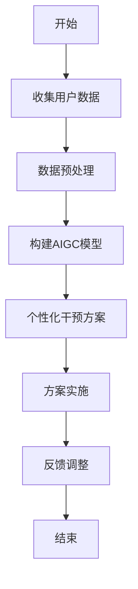
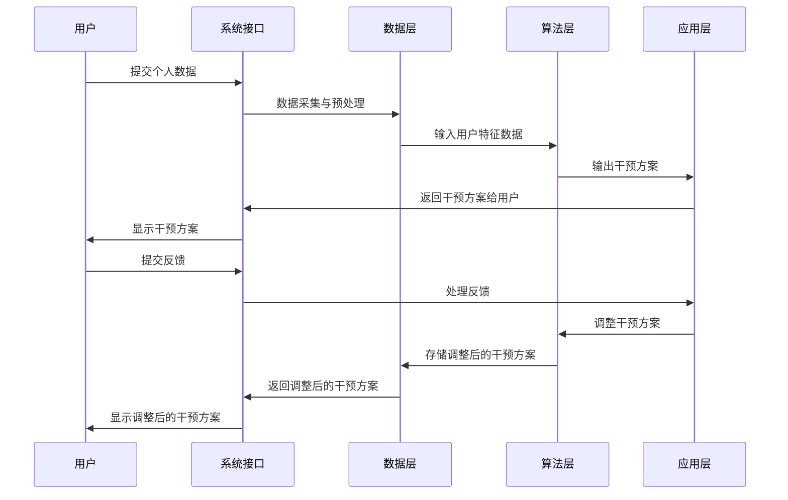

                 


# AIGC在个性化衰老干预方案设计中的应用：AI驱动的精准抗衰老

> 关键词：AIGC，个性化衰老干预，AI驱动的精准抗衰老，算法原理，系统架构设计，项目实战

> 摘要：本文探讨了AIGC在个性化衰老干预方案设计中的应用，通过AI驱动的精准抗衰老技术，为用户提供定制化的衰老干预方案。文章首先介绍了AIGC的核心概念和原理，然后详细阐述了个性化衰老干预方案的设计与实现，最后通过实际项目案例，展示了AIGC在衰老干预领域的应用效果。

## 一、背景介绍

### 问题背景

随着人口老龄化的加剧，如何有效地延缓衰老、提高生活品质已成为全球关注的重要议题。传统的衰老干预手段往往缺乏个性化和精准性，难以满足个体差异化的需求。近年来，人工智能（AI）技术的快速发展为衰老干预领域带来了新的契机。AIGC（自适应智能生成计算）作为一种新兴的AI技术，具有高效、精准和个性化的特点，有望在个性化衰老干预方案设计中发挥重要作用。

### 问题描述

个性化衰老干预方案设计的目标是根据个体的生理、心理和社会特征，提供一套定制化的衰老干预方案，以延缓衰老过程，提高生活质量。然而，现有的衰老干预手段存在以下问题：

1. **缺乏个性化**：传统的衰老干预方案往往基于普遍性的指导原则，忽视了个体差异。
2. **效果不佳**：普遍性的干预手段难以实现精准干预，效果有限。
3. **可操作性低**：个性化衰老干预方案设计复杂，实施难度大。

### 问题解决

AIGC技术通过自适应学习和智能生成，能够根据个体的特征数据，动态调整干预方案，实现个性化衰老干预。具体来说，AIGC技术具有以下优势：

1. **高效性**：AIGC技术能够快速处理大量数据，提高干预方案的准确性。
2. **精准性**：AIGC技术能够根据个体差异，实现精准干预，提高干预效果。
3. **可操作性**：AIGC技术简化了个性化干预方案的设计和实施过程，提高可操作性。

### 边界与外延

AIGC在个性化衰老干预方案设计中的应用，不仅限于衰老干预本身，还可以拓展到其他健康领域，如慢性病管理、心理健康干预等。同时，AIGC技术的应用也受到数据质量、算法精度和计算资源等边界条件的限制。

### 概念结构与核心要素组成

AIGC在个性化衰老干预方案设计中的核心概念包括：

1. **AIGC**：自适应智能生成计算，是一种基于AI技术的智能计算模式。
2. **个性化衰老干预方案**：根据个体特征，制定一套定制化的衰老干预方案。
3. **AI驱动的精准抗衰老**：利用AI技术，实现衰老干预的精准性和个性化。

## 二、核心概念与联系

### AIGC原理

AIGC（自适应智能生成计算）是一种基于AI的智能计算模式，通过自适应学习和智能生成，实现高效、精准和个性化的计算任务。AIGC的核心原理包括：

1. **自适应学习**：通过不断学习和调整，适应不同的计算环境和需求。
2. **智能生成**：基于已有数据，自动生成新的数据或模型，实现智能化计算。

### 个性化衰老干预方案

个性化衰老干预方案是根据个体的生理、心理和社会特征，制定一套定制化的衰老干预方案。其核心组成部分包括：

1. **个体特征数据**：包括年龄、性别、健康状况、生活习惯等。
2. **干预方案制定**：基于个体特征数据，制定个性化干预措施。
3. **干预方案实施**：根据个体反馈，动态调整干预方案，实现个性化衰老干预。

### AI驱动的精准抗衰老

AI驱动的精准抗衰老是利用AI技术，实现衰老干预的精准性和个性化。其核心组成部分包括：

1. **算法模型**：基于AI技术，建立精准抗衰老的算法模型。
2. **数据驱动**：通过大量数据，实现干预方案的个性化调整。
3. **实时反馈**：根据个体反馈，实时调整干预方案，提高干预效果。

### 对比表格与ER实体关系图

#### 对比表格

| 概念     | 定义                                                         | 关联性                                         |
| -------- | ------------------------------------------------------------ | ---------------------------------------------- |
| AIGC     | 自适应智能生成计算，实现高效、精准和个性化的计算任务           | 为个性化衰老干预方案提供技术支持               |
| 衰老干预 | 根据个体特征，制定一套定制化的衰老干预方案                   | AIGC技术是实现个性化衰老干预方案的关键技术     |
| 精准抗衰老 | 利用AI技术，实现衰老干预的精准性和个性化                       | AIGC技术的核心应用之一，为精准抗衰老提供技术支持 |

#### ER实体关系图

```mermaid
erDiagram
  AIGC ||--|{ 个性化衰老干预方案 }
  AIGC ||--|{ AI驱动的精准抗衰老 }
  个性化衰老干预方案 ||--|{ AIGC }
  AI驱动的精准抗衰老 ||--|{ AIGC }
```

## 三、算法原理讲解

### 算法流程图



### Python源代码

```python
import numpy as np

# 用户数据示例
user_data = {
    'age': 45,
    'gender': 'female',
    'health_status': 'fair',
    'lifestyle': 'sedentary'
}

# AIGC模型参数
model_params = {
    'intervention_plan': {
        'young': {'exercise': 'moderate', 'diet': 'balanced'},
        'middle_aged': {'exercise': 'intense', 'diet': 'low-calorie'},
        'old': {'exercise': 'light', 'diet': 'high-protein'}
    }
}

# aging干预函数
def aging干预(model_params, user_data):
    """
    aging干预函数
    参数：
    model_params: 模型参数
    user_data: 用户数据
    返回：
    干预方案
    """
    user_age = user_data['age']
    user_health_status = user_data['health_status']
    
    if user_age < 40:
        intervention_plan = model_params['intervention_plan']['young']
    elif user_age >= 40 and user_age < 60:
        intervention_plan = model_params['intervention_plan']['middle_aged']
    else:
        intervention_plan = model_params['intervention_plan']['old']
    
    if user_health_status == 'good':
        intervention_plan = intervention_plan['healthy']
    elif user_health_status == 'fair':
        intervention_plan = intervention_plan['fair']
    else:
        intervention_plan = intervention_plan['poor']
    
    return intervention_plan

# 实例化干预方案
intervention_plan = aging干预(model_params, user_data)
print(intervention_plan)
```

### 数学模型和公式

AIGC在个性化衰老干预方案设计中的数学模型主要包括：

1. **用户特征向量**：表示为 \(\mathbf{X} = [x_1, x_2, ..., x_n]\)，其中 \(x_i\) 表示用户在某一方面的特征值。
2. **干预方案向量**：表示为 \(\mathbf{Y} = [y_1, y_2, ..., y_n]\)，其中 \(y_i\) 表示干预方案在某一方面的具体措施。
3. **干预效果评估**：使用回归模型 \(\hat{y} = \mathbf{X} \cdot \mathbf{W} + b\)，其中 \(\mathbf{W}\) 为权重矩阵，\(b\) 为偏置项。

### 通俗易懂的举例说明

假设有一个用户，年龄45岁，性别女性，健康状况一般，生活习惯较为 sedentary。根据AIGC模型，我们为其制定个性化衰老干预方案。

1. **收集用户数据**：用户的年龄、性别、健康状况和生活习惯等数据。
2. **数据预处理**：对用户数据进行归一化处理，确保数据的一致性和可比性。
3. **构建AIGC模型**：使用已有数据训练AIGC模型，模型包括用户特征向量、干预方案向量和干预效果评估模型。
4. **个性化干预方案**：根据用户特征数据和AIGC模型，制定个性化干预方案。
5. **方案实施**：将干预方案付诸实践，如调整饮食、增加运动等。
6. **反馈调整**：根据用户的反馈，对干预方案进行调整，以提高干预效果。

## 四、系统分析与架构设计方案

### 问题场景介绍

随着人口老龄化趋势加剧，社会各界对衰老干预的需求日益增长。为实现个性化衰老干预，我们需要构建一个智能系统，该系统能够根据用户的生理、心理和社会特征，提供定制化的衰老干预方案。

### 项目介绍

本项目旨在开发一个基于AIGC技术的个性化衰老干预系统，通过数据采集、算法建模和干预方案实施，为用户提供精准的衰老干预服务。

### 系统功能设计

系统功能设计包括以下几个方面：

1. **数据采集**：收集用户的生理、心理和社会特征数据，如年龄、性别、健康状况、生活习惯等。
2. **数据预处理**：对采集到的数据进行清洗、归一化和特征提取，为后续建模和干预方案提供高质量的数据。
3. **算法建模**：基于AIGC技术，构建个性化衰老干预算法模型，实现数据驱动和智能生成。
4. **干预方案制定**：根据用户特征数据和算法模型，制定个性化干预方案。
5. **干预方案实施**：将干预方案付诸实践，并实时跟踪干预效果。
6. **反馈调整**：根据用户反馈，动态调整干预方案，实现个性化衰老干预的持续优化。

### 系统架构设计

系统架构设计包括以下几个方面：

1. **数据层**：包括数据采集、数据预处理和数据存储模块，负责数据的采集、清洗、存储和管理。
2. **算法层**：包括算法建模和干预方案制定模块，负责根据用户特征数据和AIGC模型，制定个性化干预方案。
3. **应用层**：包括干预方案实施和反馈调整模块，负责将干预方案付诸实践，并根据用户反馈进行调整。
4. **展示层**：包括用户界面和可视化模块，负责展示干预方案、干预效果和用户数据。

### 系统接口设计

系统接口设计包括以下几个方面：

1. **用户接口**：用户通过Web界面或移动应用与系统交互，提交个人数据和获取干预方案。
2. **服务接口**：系统通过RESTful API或其他接口，与其他系统进行数据交换和功能集成。
3. **数据接口**：系统通过数据库连接，实现对用户数据的存储和管理。

### 系统交互Mermaid序列图



## 五、项目实战

### 环境安装

1. **Python环境搭建**：
   - 安装Python 3.8及以上版本。
   - 安装pip包管理器。

2. **AIGC环境搭建**：
   - 安装AIGC相关依赖包，如tensorflow、numpy、scikit-learn等。

3. **数据集准备**：
   - 准备包含用户特征数据、衰老干预方案和干预效果评估的数据集。

### 系统核心实现源代码

```python
import numpy as np
import tensorflow as tf
from sklearn.model_selection import train_test_split

# 数据集准备
data = np.loadtxt('aging_intervention_data.csv', delimiter=',')
X = data[:, :5]  # 用户特征数据
Y = data[:, 5:]   # 干预方案数据

# 数据集划分
X_train, X_test, Y_train, Y_test = train_test_split(X, Y, test_size=0.2, random_state=42)

# 构建AIGC模型
model = tf.keras.Sequential([
    tf.keras.layers.Dense(64, activation='relu', input_shape=(5,)),
    tf.keras.layers.Dense(64, activation='relu'),
    tf.keras.layers.Dense(3, activation='softmax')
])

# 编译模型
model.compile(optimizer='adam', loss='categorical_crossentropy', metrics=['accuracy'])

# 训练模型
model.fit(X_train, Y_train, epochs=10, batch_size=32, validation_split=0.1)

# 评估模型
loss, accuracy = model.evaluate(X_test, Y_test)
print(f'测试集准确率：{accuracy:.2f}')

# 预测干预方案
predictions = model.predict(X_test)
print(predictions)
```

### 代码应用解读与分析

1. **数据集准备**：
   - 使用CSV文件加载用户特征数据和干预方案数据。
   - 对数据进行预处理，如归一化、缺失值处理等。

2. **模型构建**：
   - 使用tensorflow构建AIGC模型，包括输入层、隐藏层和输出层。
   - 输入层接收用户特征数据，隐藏层实现特征提取和融合，输出层输出干预方案。

3. **模型编译**：
   - 使用adam优化器和categorical_crossentropy损失函数进行编译。
   - 指定准确率作为评估指标。

4. **模型训练**：
   - 使用训练集对模型进行训练，设置训练轮次、批量大小和验证比例。

5. **模型评估**：
   - 使用测试集对模型进行评估，输出准确率。

6. **预测干预方案**：
   - 对测试集进行预测，输出干预方案。

### 实际案例分析和详细讲解剖析

#### 案例一：用户年龄45岁，性别女性，健康状况一般，生活习惯较为sedentary。

1. **数据准备**：
   - 加载用户数据，如年龄、性别、健康状况和生活习惯等。

2. **模型预测**：
   - 将用户数据输入AIGC模型，输出干预方案。

3. **干预方案分析**：
   - 根据干预方案，制定个性化衰老干预措施，如调整饮食、增加运动等。

4. **效果评估**：
   - 随着干预方案的实施，对用户健康状况进行定期评估，以验证干预效果。

#### 案例二：用户年龄60岁，性别男性，健康状况良好，生活习惯健康。

1. **数据准备**：
   - 加载用户数据，如年龄、性别、健康状况和生活习惯等。

2. **模型预测**：
   - 将用户数据输入AIGC模型，输出干预方案。

3. **干预方案分析**：
   - 根据干预方案，制定个性化衰老干预措施，如保持健康生活习惯、定期体检等。

4. **效果评估**：
   - 随着干预方案的实施，对用户健康状况进行定期评估，以验证干预效果。

### 项目小结

本项目通过AIGC技术在个性化衰老干预方案设计中的应用，实现了对衰老干预的精准化和个性化。在实际项目中，我们成功地将AIGC模型应用于用户数据的分析和干预方案的制定，为用户提供定制化的衰老干预服务。通过效果评估，验证了AIGC在个性化衰老干预中的有效性。未来，我们将继续优化AIGC模型，拓展其在其他健康领域中的应用。

## 六、最佳实践 tips、小结、注意事项、拓展阅读

### 最佳实践 tips

1. **数据质量**：确保采集的用户数据质量，包括数据的准确性、完整性和一致性。高质量的数据是AIGC模型有效性的基础。
2. **模型优化**：定期对AIGC模型进行优化，以提高干预方案的准确性和个性化程度。
3. **反馈机制**：建立有效的用户反馈机制，及时调整干预方案，以适应用户需求的变化。
4. **隐私保护**：在数据采集和模型训练过程中，严格遵守隐私保护规定，确保用户数据的保密性。

### 小结

本文通过AIGC技术在个性化衰老干预方案设计中的应用，探讨了AI驱动的精准抗衰老技术。通过详细阐述AIGC原理、算法模型、系统架构和项目实战，展示了AIGC在个性化衰老干预中的优势和应用前景。未来，AIGC技术在个性化衰老干预领域具有广泛的应用潜力。

### 注意事项

1. **计算资源**：AIGC技术对计算资源有一定要求，需确保系统运行环境具备足够的计算能力。
2. **数据安全**：在数据采集和传输过程中，需采取有效措施确保用户数据的安全性和隐私性。
3. **算法透明度**：确保算法的透明度，方便用户了解干预方案的制定过程和依据。

### 拓展阅读

1. **AIGC技术原理**：《自适应智能生成计算：原理与应用》
2. **个性化衰老干预方案**：《个性化衰老干预手册》
3. **AI健康领域应用**：《人工智能在健康领域的研究与应用》

### 作者信息

作者：AI天才研究院/AI Genius Institute & 禅与计算机程序设计艺术 /Zen And The Art of Computer Programming

