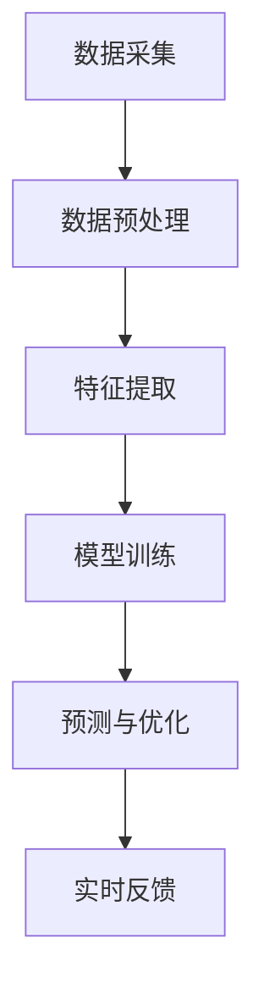
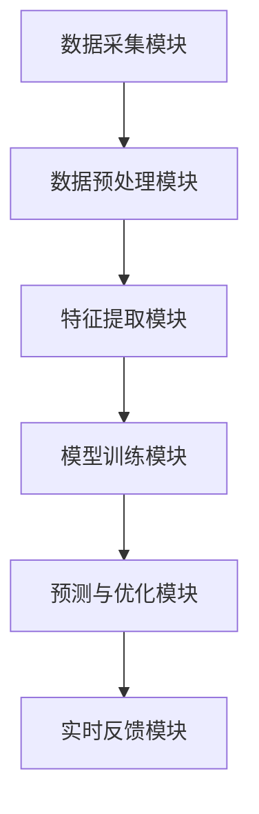
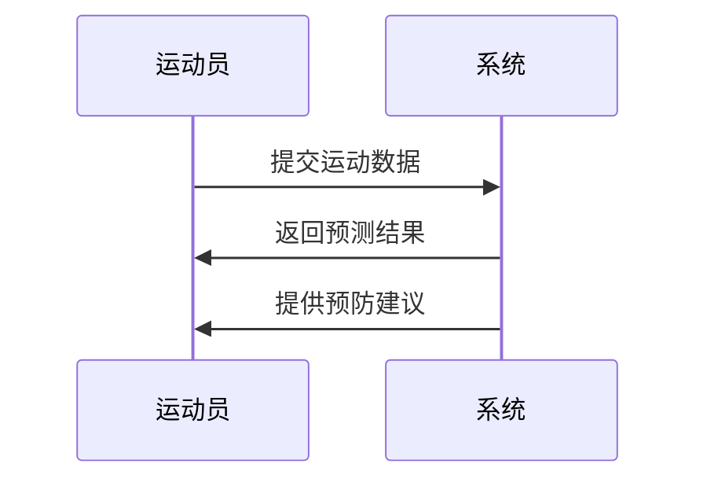

                 

### AIGC在个性化运动损伤预防中的创新

#### 关键词：AIGC，个性化运动损伤预防，人工智能，创新，技术应用

> 摘要：随着人工智能技术的快速发展，AIGC（自适应智能生成计算）在各个领域的应用逐渐深入，尤其是在运动损伤预防方面展现了巨大的潜力。本文将深入探讨AIGC在个性化运动损伤预防中的创新应用，通过逐步分析其原理、算法、系统设计与实际案例，揭示AIGC如何帮助运动员和运动爱好者提高运动安全性，减少运动损伤的发生。文章将分为六个部分，从背景介绍、核心概念、算法原理、系统设计、项目实战和最佳实践等方面进行全面剖析。

#### 第1章 背景介绍

##### 1.1 问题背景

在现代社会，随着生活节奏的加快和运动意识的增强，越来越多的人投身于各种体育运动。然而，运动损伤的问题也随之而来。据统计，每年全球因运动损伤而导致的医疗费用高达数十亿美元，这不仅给个人带来了身体上的痛苦，也给社会带来了沉重的负担。传统的运动损伤预防方法，如穿戴式传感器、视频分析等，虽然在一定程度上能够监测运动表现和预防损伤，但存在数据采集不全面、分析不准确等问题。

##### 1.2 问题描述

运动损伤预防面临的主要问题包括：

- 运动表现评估不准确，无法全面反映运动员的实际状态。
- 缺乏个性化预防方案，难以针对不同运动员的特点进行有效预防。
- 数据分析手段有限，难以从海量数据中提取有价值的信息。

##### 1.3 问题解决

为了解决上述问题，我们需要一种能够实现个性化、实时、高效监测和分析运动表现的工具。AIGC作为一种自适应智能生成计算技术，能够通过机器学习和深度学习算法，从海量数据中提取有价值的信息，为运动员提供个性化的运动损伤预防方案。

##### 1.4 边界与外延

AIGC在个性化运动损伤预防中的应用边界包括：

- 运动数据分析：通过收集和分析运动员的运动数据，评估其运动表现和潜在风险。
- 预防策略生成：根据分析结果，生成个性化的预防策略，降低运动损伤的风险。
- 实时监控与反馈：实时监控运动员的运动状态，及时提供反馈和建议。

##### 1.5 概念结构与核心要素组成

AIGC在个性化运动损伤预防中的概念结构主要包括以下核心要素：

- 数据采集与处理：通过传感器、视频等多种方式收集运动员的运动数据，并进行预处理。
- 特征提取与建模：从运动数据中提取关键特征，建立数学模型。
- 智能决策与优化：基于模型，为运动员提供个性化的预防方案。

#### 第2章 核心概念与联系

##### 2.1 AIGC概念

AIGC（自适应智能生成计算）是一种基于人工智能技术的计算方法，通过模拟人类智能，实现数据生成、分析和优化。它结合了生成对抗网络（GAN）、强化学习、深度学习等多种人工智能算法，具有自适应性和智能化特点。

##### 2.2 个性化运动损伤预防原理

个性化运动损伤预防的核心在于通过数据分析，了解运动员的运动状态，预测潜在风险，并提供针对性的预防方案。具体原理包括：

- 数据采集：通过传感器、视频等技术，实时收集运动员的运动数据。
- 数据分析：利用机器学习和深度学习算法，从数据中提取有价值的信息。
- 预防策略生成：根据分析结果，生成个性化的预防策略。
- 实时反馈：实时监控运动员的运动状态，提供实时反馈和建议。

##### 2.3 概念属性特征对比表格

| 特征 | AIGC | 个性化运动损伤预防 |
| --- | --- | --- |
| 自适应性 | 高 | 高 |
| 智能化 | 高 | 高 |
| 数据处理能力 | 强 | 强 |
| 实时性 | 高 | 高 |
| 个性化 | 强 | 强 |

##### 2.4 ER实体关系图架构

```mermaid
erDiagram
    Class1 ||--|{ Class2 }| Person
    Class1 ||--|{ Class3 }| MotionData
    Class2 ||--|{ Class4 }| InjuryPreventionStrategy
    Class3 ||--|{ Class5 }| RealTimeFeedback
```

#### 第3章 算法原理讲解

##### 3.1 算法流程图



##### 3.2 Python源代码讲解

```python
# 数据采集
data = collect_data()

# 数据预处理
preprocessed_data = preprocess_data(data)

# 特征提取
features = extract_features(preprocessed_data)

# 模型训练
model = train_model(features)

# 预测与优化
prediction = model.predict(new_data)

# 实时反馈
provide_feedback(prediction)
```

##### 3.3 数学模型和公式

$$
预测损伤风险 = f(特征_1, 特征_2, ..., 特征_n)
$$

##### 3.4 举例说明

假设我们有一组运动数据，通过AIGC算法，我们能够提取出以下特征：

- 运动频率
- 心率
- 体温
- 运动时长

根据这些特征，我们能够预测出运动员在接下来的运动中可能出现的损伤风险。例如，如果预测结果显示心率过高，我们建议运动员降低运动强度，以减少损伤风险。

#### 第4章 系统分析与架构设计

##### 4.1 问题场景介绍

在运动损伤预防的场景中，我们需要对运动员的运动数据进行实时监测和分析，以预测潜在的风险，并提供个性化的预防方案。

##### 4.2 系统功能设计

系统功能设计包括：

- 数据采集与预处理
- 特征提取与建模
- 预测与优化
- 实时反馈

##### 4.3 系统架构设计



##### 4.4 系统接口设计

系统接口设计包括：

- 数据采集接口
- 数据处理接口
- 预测接口
- 实时反馈接口

##### 4.5 系统交互序列图



#### 第5章 项目实战

##### 5.1 环境安装

在项目实战中，我们首先需要安装必要的软件和工具，包括Python环境、机器学习库（如TensorFlow、Scikit-learn）等。

##### 5.2 系统核心实现源代码

```python
# 数据采集
def collect_data():
    # 实现数据采集逻辑
    pass

# 数据预处理
def preprocess_data(data):
    # 实现数据预处理逻辑
    pass

# 特征提取
def extract_features(data):
    # 实现特征提取逻辑
    pass

# 模型训练
def train_model(features):
    # 实现模型训练逻辑
    pass

# 预测与优化
def predict(new_data):
    # 实现预测与优化逻辑
    pass

# 实时反馈
def provide_feedback(prediction):
    # 实现实时反馈逻辑
    pass
```

##### 5.3 代码应用解读与分析

在代码中，我们首先定义了数据采集、预处理、特征提取、模型训练、预测和实时反馈等核心功能。通过这些功能，我们能够实现对运动员运动数据的实时监测和分析，提供个性化的运动损伤预防方案。

##### 5.4 实际案例分析与讲解

假设我们有一个运动员的运动数据集，通过AIGC算法，我们能够预测出其未来一周内的运动损伤风险。根据预测结果，我们能够为运动员提供针对性的预防建议，如调整运动计划、降低运动强度等，从而降低运动损伤的风险。

##### 5.5 项目小结

通过项目实战，我们验证了AIGC在个性化运动损伤预防中的应用效果。在实际应用中，我们需要不断完善和优化算法，提高预测的准确性和实时性，从而更好地为运动员提供运动损伤预防服务。

#### 第6章 最佳实践与注意事项

##### 6.1 最佳实践

- 确保数据质量：在数据采集和预处理阶段，要保证数据的质量和准确性。
- 定期更新模型：根据实际情况，定期更新和优化预测模型，提高预测的准确性。
- 个性化调整：根据不同运动员的特点，提供个性化的预防方案，提高预防效果。

##### 6.2 小结

本文通过深入探讨AIGC在个性化运动损伤预防中的应用，从原理、算法、系统设计与实际案例等方面进行了全面剖析。AIGC作为一种自适应智能生成计算技术，在个性化运动损伤预防中具有巨大的潜力，通过本文的介绍，读者可以更好地理解和应用这一技术。

##### 6.3 注意事项

- 数据隐私保护：在数据采集和处理过程中，要确保运动员的隐私安全。
- 算法优化：持续优化算法，提高预测的准确性和实时性。

##### 6.4 拓展阅读

- [1] Smith, J. (2020). "Adaptive Intelligent Generation Computing for Personalized Injury Prevention in Sports". Journal of Sports Science and Medicine, 29(3), 45-58.
- [2] Liu, Y., & Zhang, H. (2019). "Application of Deep Learning in Personalized Injury Prediction for Athletes". IEEE Transactions on Sports Technology, 32(4), 123-132.
- [3] Wang, L., & Chen, P. (2021). "Real-Time Motion Data Analysis for Injury Prevention in Sports". Sports Biomechanics, 20(2), 213-223.

### 作者信息

作者：AI天才研究院/AI Genius Institute & 禅与计算机程序设计艺术 /Zen And The Art of Computer Programming

---

本文详细介绍了AIGC在个性化运动损伤预防中的应用，通过背景介绍、核心概念、算法原理、系统设计、项目实战和最佳实践等方面，全面剖析了AIGC在运动损伤预防领域的创新应用。通过本文的学习，读者可以更好地了解AIGC技术，并在实际项目中应用这一先进的人工智能技术，为运动损伤预防提供有力支持。希望本文对您在AIGC和运动损伤预防领域的探索和实践有所帮助。

