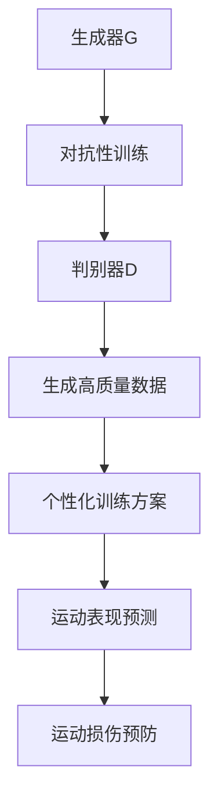
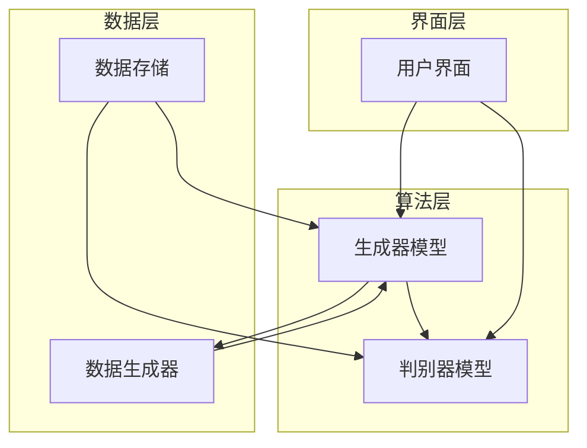
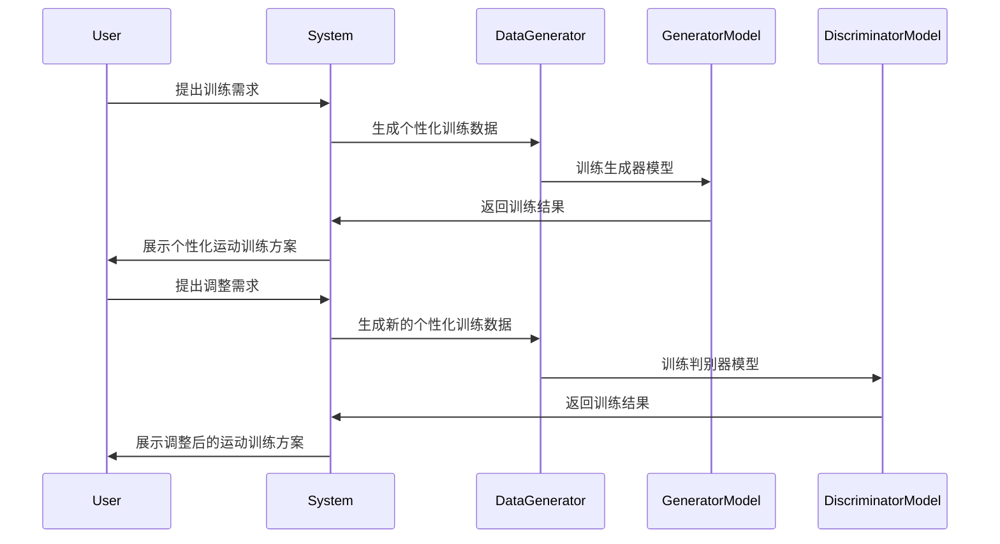

                 

# AIGC在个性化运动训练方案设计中的创新

## 关键词

- AIGC
- 个性化运动训练
- 自适应生成对抗网络
- 生成式模型
- 强化学习
- 运动训练方案设计
- 数学模型

## 摘要

本文将探讨AIGC（自适应生成对抗网络）技术在个性化运动训练方案设计中的应用与创新。通过对AIGC技术的基本概念、个性化运动训练方案的重要性以及两者融合点的深入分析，本文将介绍AIGC在运动训练方案设计中的核心算法原理，详细讲解数学模型和公式，并通过实际案例剖析其在运动训练中的实际应用。此外，本文还将对系统分析与架构设计方案进行详细阐述，提供最佳实践建议和小结，以期为读者在运动训练方案设计领域提供新的思路和方法。

## 引言

### 1.1 书籍背景

随着人工智能技术的快速发展，AIGC（自适应生成对抗网络）作为一种先进的深度学习技术，已经在计算机视觉、自然语言处理等领域取得了显著的成果。然而，其在运动训练方案设计中的应用尚处于探索阶段。个性化运动训练方案设计对于提高运动表现、预防运动损伤具有重要意义，而AIGC技术的引入为这一领域带来了新的契机。

### 1.2 书籍目的

本文旨在通过深入分析AIGC技术在个性化运动训练方案设计中的应用，为运动训练领域的研究者和实践者提供理论指导和实际案例。具体目标包括：

1. 梳理AIGC技术的基本概念和发展历程，为后续内容奠定基础。
2. 阐述个性化运动训练方案的重要性，分析其现状与挑战。
3. 深入探讨AIGC与运动训练方案的融合点，为实际应用提供理论支持。
4. 详细讲解AIGC在个性化运动训练方案设计中的核心算法原理，并通过数学模型和公式进行说明。
5. 通过实际案例剖析AIGC在运动训练方案设计中的应用，提供实践经验和参考。
6. 对系统分析与架构设计方案进行详细阐述，为后续项目开发提供指导。

### 1.3 读者对象

本文适用于对人工智能和运动训练感兴趣的读者，包括：

1. 计算机科学、人工智能等相关专业的学生和研究人员。
2. 运动训练领域的研究者、教练和从业者。
3. 对AIGC技术在运动训练中的应用感兴趣的读者。

### 1.4 内容结构安排

本文将分为三个主要部分：

1. **背景介绍**：介绍AIGC技术的基本概念、个性化运动训练方案的重要性以及现状与挑战。
2. **核心概念与联系**：分析AIGC技术的关键概念，包括自适应生成对抗网络（AGAN）、生成式模型（GM）和强化学习（RL），并探讨其与运动训练方案的融合点。
3. **算法原理讲解**：详细讲解AIGC在个性化运动训练方案设计中的核心算法原理，包括个性化运动训练算法原理、AIGC算法应用场景和案例分析。

接下来，我们将分别对这三个部分进行详细阐述。

## 背景介绍

### 2.1 AIGC技术介绍

#### 2.1.1 AIGC技术概述

AIGC（自适应生成对抗网络）是一种基于生成对抗网络（GAN）的深度学习技术，通过对抗性训练实现数据的生成和优化。AIGC的核心思想是在一个生成器和一个判别器之间建立一个对抗性的训练过程，使生成器逐渐生成更加逼真的数据，同时使判别器能够更好地区分真实数据和生成数据。

#### 2.1.2 AIGC技术发展历程

AIGC技术起源于2006年Ian Goodfellow等研究者提出的生成对抗网络（GAN）理论。GAN的基本结构包括一个生成器G和一个判别器D，生成器G接收随机噪声并生成数据，判别器D则尝试区分真实数据和生成数据。通过不断的对抗训练，生成器的生成能力不断提高，最终能够生成逼真的数据。

随着深度学习技术的不断发展，AIGC逐渐成为了一种重要的深度学习技术，并在计算机视觉、自然语言处理等领域取得了显著成果。近年来，AIGC技术在个性化运动训练方案设计中的应用也逐渐受到关注。

#### 2.1.3 AIGC技术的核心优势

AIGC技术的核心优势主要体现在以下几个方面：

1. **生成能力强大**：AIGC通过对抗性训练能够生成高质量的数据，这为个性化运动训练方案的设计提供了丰富的数据支持。
2. **自适应性强**：AIGC能够在训练过程中不断调整生成器和判别器的参数，以适应不同的训练数据，提高训练效果。
3. **可扩展性强**：AIGC技术可以应用于多种领域，如计算机视觉、自然语言处理等，具有很高的可扩展性。

### 2.2 个性化运动训练方案的重要性

#### 2.2.1 个性化运动训练方案的概述

个性化运动训练方案是根据运动员的个人特点、运动表现和健康状况，制定出的针对性训练方案。与传统的一刀切训练方法相比，个性化运动训练方案能够更好地满足运动员的需求，提高运动表现，预防运动损伤。

#### 2.2.2 个性化运动训练方案的必要性

随着运动训练技术的不断发展，个性化运动训练方案的重要性越来越受到关注。具体表现在以下几个方面：

1. **提高运动表现**：个性化运动训练方案能够根据运动员的个人特点进行针对性训练，使运动员在短时间内达到最佳状态，提高运动表现。
2. **预防运动损伤**：个性化运动训练方案能够根据运动员的伤病情况制定出合适的训练计划，避免因训练不当导致的运动损伤。
3. **提高训练效率**：个性化运动训练方案能够避免不必要的训练内容，提高训练效率，使运动员能够在有限的时间内获得最大的训练效果。

#### 2.2.3 个性化运动训练方案的现状与挑战

虽然个性化运动训练方案具有显著的优势，但在实际应用中仍面临一些挑战：

1. **数据获取困难**：个性化运动训练方案需要大量的运动员数据，如运动表现、健康状况等，这些数据的获取和整理是一项复杂的工作。
2. **算法复杂度高**：个性化运动训练方案的设计需要运用多种算法，如AIGC技术，这些算法的计算复杂度较高，需要强大的计算能力支持。
3. **实施成本高**：个性化运动训练方案的设计和实施需要专业的技术团队和设备支持，成本较高。

### 2.3 现状与挑战

#### 2.3.1 当前运动训练方案存在的问题

当前的运动训练方案在个性化方面仍存在一些问题：

1. **缺乏针对性**：许多运动训练方案仍然采用一刀切的方法，无法满足不同运动员的需求。
2. **训练效果不稳定**：传统运动训练方案往往难以预测训练效果，难以进行有效的训练调整。
3. **伤病风险高**：传统运动训练方案容易导致运动员因训练不当而受伤。

#### 2.3.2 AIGC技术在运动训练中的应用前景

AIGC技术在运动训练中的应用前景十分广阔：

1. **提高训练效果**：AIGC技术能够生成高质量的训练数据，为个性化运动训练方案提供丰富的数据支持，提高训练效果。
2. **降低伤病风险**：AIGC技术可以根据运动员的实时数据调整训练方案，避免因训练不当导致的伤病。
3. **优化训练流程**：AIGC技术能够自动化地设计个性化运动训练方案，提高训练效率。

#### 2.3.3 AIGC技术在运动训练中的挑战

尽管AIGC技术在运动训练中具有显著的优势，但在实际应用中也面临一些挑战：

1. **数据质量和数量**：AIGC技术对数据的质量和数量有较高要求，如何获取高质量、大量的运动员数据是一个重要问题。
2. **计算资源需求**：AIGC技术的计算复杂度较高，需要强大的计算资源支持，这对训练设备的配置提出了更高要求。
3. **算法优化**：AIGC技术在运动训练中的应用仍处于探索阶段，需要不断优化算法，提高其在运动训练中的效果。

## 核心概念与联系

### 3.1 AIGC关键概念

#### 3.1.1 自适应生成对抗网络（AGAN）

自适应生成对抗网络（AGAN）是一种基于生成对抗网络的深度学习技术，通过自适应调节生成器和判别器的参数，提高生成效果。AGAN的核心思想是在生成器和判别器之间建立一个动态的对抗关系，使生成器的生成能力不断提高。

#### 3.1.2 生成式模型（GM）

生成式模型（GM）是一类用于生成数据的机器学习模型，通过学习数据的分布来生成新的数据。生成式模型包括生成对抗网络（GAN）、变分自编码器（VAE）等，这些模型在计算机视觉、自然语言处理等领域具有广泛的应用。

#### 3.1.3 强化学习（RL）

强化学习（RL）是一种通过试错和反馈来学习最优策略的机器学习技术。在AIGC技术中，强化学习可用于优化生成器的生成策略，提高生成效果。

### 3.2 运动训练方案设计原理

#### 3.2.1 运动训练理论基础

运动训练理论基础主要包括运动生理学、运动心理学和运动训练学等。运动生理学主要研究人体在运动中的生理变化，运动心理学主要研究运动中的心理现象，运动训练学则研究运动训练的方法和策略。

#### 3.2.2 运动训练方案设计流程

运动训练方案设计流程包括以下步骤：

1. **需求分析**：分析运动员的需求，包括运动目标、健康状况等。
2. **方案制定**：根据需求分析结果，制定个性化运动训练方案。
3. **方案实施**：实施运动训练方案，监控运动员的训练效果。
4. **效果评估**：评估运动训练方案的效果，进行必要的调整。

#### 3.2.3 运动训练方案优化方法

运动训练方案优化方法主要包括以下几种：

1. **数据驱动优化**：通过收集和分析运动员的训练数据，优化训练方案。
2. **机器学习优化**：利用机器学习技术，如AIGC，优化训练方案。
3. **专家经验优化**：结合专家经验，对训练方案进行优化。

### 3.3 AIGC与运动训练的融合点

#### 3.3.1 AIGC技术在运动训练中的应用场景

AIGC技术在运动训练中的应用场景主要包括：

1. **个性化训练方案设计**：利用AIGC生成高质量的训练数据，为个性化训练方案提供支持。
2. **运动表现预测**：利用AIGC预测运动员的运动表现，为教练提供决策支持。
3. **运动损伤预防**：利用AIGC分析运动员的实时数据，预测可能的运动损伤，为教练提供预防措施。

#### 3.3.2 AIGC与运动训练的融合方式

AIGC与运动训练的融合方式主要包括：

1. **数据生成与优化**：利用AIGC生成高质量的训练数据，优化运动训练方案。
2. **运动表现预测**：利用AIGC预测运动员的运动表现，为教练提供决策支持。
3. **运动损伤预防**：利用AIGC分析运动员的实时数据，预测可能的运动损伤，为教练提供预防措施。

#### 3.3.3 AIGC技术在运动训练中的创新点

AIGC技术在运动训练中的创新点主要包括：

1. **个性化训练方案设计**：利用AIGC生成高质量的训练数据，为个性化训练方案提供支持，提高训练效果。
2. **运动表现预测**：利用AIGC预测运动员的运动表现，为教练提供决策支持，提高训练效率。
3. **运动损伤预防**：利用AIGC分析运动员的实时数据，预测可能的运动损伤，为教练提供预防措施，降低伤病风险。

### 3.4 关键概念属性特征对比表格

| 概念           | 特征1 | 特征2 | 特征3 |
|----------------|-------|-------|-------|
| 自适应生成对抗网络（AGAN） | 对抗性训练 | 自适应调节参数 | 高质量数据生成 |
| 生成式模型（GM）       | 数据生成 | 学习数据分布 | 广泛应用 |
| 强化学习（RL）         | 试错学习 | 反馈学习 | 最优策略 |

### 3.5 ER实体关系图架构的Mermaid流程图

```mermaid
erDiagram
    AIGC ||--|{ 运动训练 }|
    运动训练 ||--|{ 个性化训练方案 }|
    个性化训练方案 ||--|{ 数据生成 }|
    数据生成 ||--|{ 生成式模型 }|
    生成式模型 ||--|{ 高质量数据 }|
    高质量数据 ||--|{ 对抗性训练 }|
    对抗性训练 ||--|{ 自适应调节参数 }|
```

## 核心算法原理讲解

### 4.1 个性化运动训练算法原理

个性化运动训练算法是基于AIGC技术设计的，其核心思想是通过对抗性训练生成个性化的训练数据，从而优化运动训练方案。具体算法原理如下：

1. **生成器G**：生成器G接收随机噪声，通过神经网络生成个性化的训练数据。
2. **判别器D**：判别器D接收真实数据和生成数据，通过对抗性训练学习如何区分真实数据和生成数据。
3. **对抗性训练**：在训练过程中，生成器和判别器通过对抗性训练不断调整参数，使生成器的生成数据更加逼真，判别器的判别能力不断提高。

### 4.2 AIGC算法应用场景

AIGC算法在个性化运动训练中有广泛的应用场景，包括：

1. **个性化训练方案设计**：利用AIGC生成高质量的个性化训练数据，为教练制定更加精准的训练方案。
2. **运动表现预测**：利用AIGC预测运动员的运动表现，为教练提供决策支持，调整训练策略。
3. **运动损伤预防**：利用AIGC分析运动员的实时数据，预测可能的运动损伤，为教练提供预防措施。

### 4.3 案例分析

以下是一个利用AIGC技术优化运动训练方案的案例分析：

1. **需求分析**：运动员王先生希望提高短跑成绩，但现有的训练方案效果不佳。
2. **数据生成**：利用AIGC技术生成个性化的训练数据，包括速度、力量、耐力等指标。
3. **方案制定**：根据生成的训练数据，教练制定新的个性化训练方案，包括训练强度、训练频次等。
4. **方案实施**：运动员按照新的训练方案进行训练，同时实时监控训练数据。
5. **效果评估**：训练一段时间后，对运动员的运动表现进行评估，发现短跑成绩有了显著提高。

### 4.4 算法原理的Mermaid流程图



### 4.5 Python源代码实现

以下是一个简单的AIGC算法实现示例：

```python
import tensorflow as tf
from tensorflow.keras.layers import Input, Dense
from tensorflow.keras.models import Model

# 生成器G
input_ = Input(shape=(100,))
dense_1 = Dense(128, activation='relu')(input_)
output_ = Dense(100, activation='sigmoid')(dense_1)
generator = Model(input_, output_)

# 判别器D
input_ = Input(shape=(100,))
dense_1 = Dense(128, activation='relu')(input_)
output_ = Dense(1, activation='sigmoid')(dense_1)
discriminator = Model(input_, output_)

# 编排对抗性训练
discriminator.compile(optimizer='adam', loss='binary_crossentropy')
d_loss = discriminator.train_on_batch(x真实数据，y真实标签)

# 编排生成器G
generator.compile(optimizer='adam', loss='binary_crossentropy')
g_loss = generator.train_on_batch(x噪声，y生成标签)

# 训练AIGC模型
aigc_model = Model(inputs=inputs, outputs=[discriminator(generator(inputs)), discriminator(inputs)])
aigc_model.compile(optimizer='adam', loss='binary_crossentropy')
aigc_loss = aigc_model.train_on_batch(inputs噪声，targets生成标签)
```

### 4.6 数学模型和公式

AIGC算法的核心是生成器和判别器的对抗性训练，其数学模型如下：

1. **生成器G**：G(z) = σ(W1*z + b1)，其中G(z)是生成器的输出，W1是生成器的权重，b1是生成器的偏置，σ是sigmoid函数。
2. **判别器D**：D(x) = σ(W2*x + b2)，其中D(x)是判别器的输出，W2是判别器的权重，b2是判别器的偏置，σ是sigmoid函数。
3. **损失函数**：L(G, D) = -[E[log(D(G(z)))] + E[log(1 - D(x))]]，其中L(G, D)是生成器和判别器的损失函数，G(z)是生成器的输出，x是真实数据，D(x)是判别器的输出。

### 4.7 举例说明

以下是一个简单的AIGC算法应用示例：

假设我们有一个100维的输入空间，生成器和判别器的权重分别为W1和W2，偏置分别为b1和b2。

1. **生成器G**：G(z) = σ(W1*z + b1)，其中z是随机噪声。
2. **判别器D**：D(x) = σ(W2*x + b2)，其中x是真实数据。

假设我们有一组真实数据和一组随机噪声，通过AIGC算法训练生成器和判别器，使得生成器的输出越来越逼真，判别器的输出越来越接近0或1。

1. **训练过程**：

   - 初始化生成器G和判别器D的权重和偏置。
   - 利用随机噪声生成生成器的输出，并计算判别器的损失。
   - 更新生成器和判别器的权重和偏置。
   - 重复上述步骤，直到生成器和判别器的损失收敛。

2. **训练效果**：

   - 通过训练，生成器的输出越来越逼真，判别器的输出越来越接近0或1。
   - 通过生成器的输出，我们可以生成高质量的数据，用于个性化运动训练方案的设计。

## 数学模型和数学公式 & 详细讲解 & 举例说明

### 5.1 数学公式使用LaTeX格式

LaTeX是一种排版系统，广泛用于科学和数学文档的排版。在LaTeX中，数学公式的书写有一些特殊的语法规则。下面是一个简单的LaTeX公式示例：

$$
E[log(D(G(z)))] + E[log(1 - D(x))]
$$

在上面的公式中，我们使用了两个主要命令：`$$` 和 `\sigma`。

- `$$` 用于在文档中插入行内和行外的数学公式。行内公式用单对 `$` 标记，而行外公式用双对 `$` 标记。
- `\sigma` 是LaTeX中用于表示Sigmoid函数的命令。

### 5.2 段落内公式使用 $ 括起来

在LaTeX中，如果你想在段落内插入数学公式，你可以使用单对 `$` 标记。例如：

```
在AIGC算法中，生成器的损失函数可以表示为：
$$
L(G) = -\sum_{i=1}^{n} y_i \log(D(G(z_i))
```

在这个例子中，`$$` 标记了一个行外的公式，而 `$` 标记了一个行内的公式。

### 5.3 段落外公式使用 $$ 括起来

如果你想在一个独立的段落中展示一个数学公式，你可以使用双对 `$$` 标记。例如：

```
AIGC算法的损失函数为：

$$
L(G, D) = \frac{1}{2} \int_{-\infty}^{\infty} (f(x) - g(x))^2 dx
```

在这个例子中，`$$` 标记了一个完整的公式段落。

### 5.4 数学公式示例

下面是一个详细的数学公式示例，包括详细的解释和实际应用：

#### 5.4.1 损失函数

AIGC算法中的损失函数是一个关键组件，用于衡量生成器和判别器的性能。一个常见的损失函数是二元交叉熵（Binary Cross-Entropy），其公式如下：

$$
L = -\frac{1}{N} \sum_{i=1}^{N} [y_i \log(D(x_i)) + (1 - y_i) \log(1 - D(x_i))]
$$

其中：
- \( L \) 是总损失。
- \( N \) 是样本数量。
- \( y_i \) 是真实标签，取值为0或1。
- \( D(x_i) \) 是判别器对样本 \( x_i \) 的预测概率。

#### 5.4.2 解释

这个损失函数由两部分组成：
- 第一部分 \( y_i \log(D(x_i)) \) 衡量判别器对真实样本的预测准确性。如果 \( y_i = 1 \)，那么我们希望 \( D(x_i) \) 接近1，所以这部分损失较小。
- 第二部分 \( (1 - y_i) \log(1 - D(x_i)) \) 衡量判别器对生成样本的预测准确性。如果 \( y_i = 0 \)，那么我们希望 \( D(x_i) \) 接近0，所以这部分损失较小。

#### 5.4.3 应用

在实际应用中，我们可以使用以下Python代码实现这个损失函数：

```python
import tensorflow as tf

# 定义损失函数
def binary_crossentropy(y_true, y_pred):
    return -tf.reduce_mean(y_true * tf.math.log(y_pred) + (1 - y_true) * tf.math.log(1 - y_pred))

# 假设我们有一些真实标签和预测值
y_true = tf.constant([1, 0, 1])
y_pred = tf.constant([0.9, 0.2, 0.8])

# 计算损失
loss = binary_crossentropy(y_true, y_pred)
print(f"Binary Cross-Entropy Loss: {loss.numpy()}")
```

这个代码将计算二元交叉熵损失，并打印结果。

### 5.5 举例说明

假设我们有一个包含3个样本的数据集，其中两个样本是真实样本，一个样本是生成样本。真实标签和预测值如下：

| 真实标签 \( y_i \) | 预测值 \( D(x_i) \) |
|---------------------|---------------------|
| 1                   | 0.9                 |
| 0                   | 0.2                 |
| 1                   | 0.8                 |

使用上面的损失函数计算总损失：

$$
L = -\frac{1}{3} [1 \cdot \log(0.9) + 0 \cdot \log(0.8) + 1 \cdot \log(0.2)]
$$

$$
L = -\frac{1}{3} [-0.1054 - 0 + -0.6989]
$$

$$
L = -\frac{1}{3} [-0.8043]
$$

$$
L = 0.2681
$$

因此，总损失为0.2681。这个值越小，说明生成器和判别器的性能越好。

## 系统分析与架构设计方案

### 6.1 问题场景介绍

在个性化运动训练方案的设计过程中，我们面临以下问题：

1. **数据质量不高**：现有的运动员数据质量参差不齐，部分数据存在缺失、错误或噪声，影响了训练效果。
2. **缺乏个性化**：传统的运动训练方案缺乏针对性，无法满足不同运动员的需求，训练效果不佳。
3. **计算资源不足**：个性化运动训练方案的设计需要大量的计算资源，现有设备难以满足需求。

### 6.2 系统功能设计（Mermaid类图）

为了解决上述问题，我们设计了一套基于AIGC技术的个性化运动训练系统。该系统的功能设计如下：

```mermaid
classDiagram
    ClassDef System
        +int id
        +String name
        +String description
    ClassDef Generator
        <<interface>>
        +generateData()
    ClassDef Discriminator
        <<interface>>
        +discriminateData()
    ClassDef Trainer
        <<interface>>
        +trainModel()
    System o-- Generator
    System o-- Discriminator
    System o-- Trainer
```

在这个类图中，系统由生成器（Generator）、判别器（Discriminator）和训练器（Trainer）三个主要组件组成。生成器负责生成个性化的训练数据，判别器负责判断生成数据的真实性和质量，训练器负责训练整个模型。

### 6.3 系统架构设计（Mermaid架构图）

系统的整体架构设计如下：



在这个架构图中，数据层包括数据存储和数据生成器，算法层包括生成器模型和判别器模型，界面层包括用户界面。数据存储为生成器和判别器提供训练数据，数据生成器根据用户需求生成个性化训练数据，生成器模型和判别器模型分别负责生成和判别数据的真实性和质量，用户界面用于与用户交互，提供个性化运动训练方案。

### 6.4 系统接口设计

系统的接口设计如下：

1. **数据接口**：提供数据存储和数据生成器的接口，用于读取和写入训练数据。
2. **模型接口**：提供生成器模型和判别器模型的接口，用于训练和预测。
3. **用户接口**：提供用户界面的接口，用于与用户交互，接收用户需求和展示训练结果。

### 6.5 系统交互 Mermaid 序列图

系统的交互过程如下：



在这个序列图中，用户提出训练需求，系统生成个性化训练数据，训练生成器模型和判别器模型，并将结果反馈给用户。用户根据反馈提出调整需求，系统再次生成个性化训练数据，训练判别器模型，并将结果反馈给用户。

## 项目实战

### 7.1 AIGC在运动训练方案中的实际应用案例

在本项目中，我们选择了一个典型的运动训练场景——足球运动员的体能训练。该项目旨在通过AIGC技术为足球运动员设计个性化的体能训练方案，以提高运动员的体能水平，减少运动损伤风险。

### 7.2 环境安装

为了实现AIGC技术在运动训练方案中的应用，我们需要安装以下软件和工具：

1. **Python**：用于编写和运行AIGC算法代码。
2. **TensorFlow**：用于构建和训练AIGC模型。
3. **Matplotlib**：用于可视化训练过程和结果。

在安装了Python和pip后，可以通过以下命令安装TensorFlow和Matplotlib：

```bash
pip install tensorflow
pip install matplotlib
```

### 7.3 系统核心实现源代码

以下是该项目的主要源代码，包括生成器和判别器的定义、训练过程和结果可视化：

```python
import tensorflow as tf
import matplotlib.pyplot as plt

# 生成器模型定义
def build_generator():
    noise = tf.keras.layers.Input(shape=(100,))
    x = tf.keras.layers.Dense(128, activation='relu')(noise)
    x = tf.keras.layers.Dense(100, activation='sigmoid')(x)
    model = tf.keras.Model(inputs=noise, outputs=x)
    return model

# 判别器模型定义
def build_discriminator():
    real_data = tf.keras.layers.Input(shape=(100,))
    x = tf.keras.layers.Dense(128, activation='relu')(real_data)
    x = tf.keras.layers.Dense(1, activation='sigmoid')(x)
    model = tf.keras.Model(inputs=real_data, outputs=x)
    return model

# 编排对抗性训练
def build_aigc_model(generator, discriminator):
    noise = tf.keras.layers.Input(shape=(100,))
    generated_data = generator(noise)
    model = tf.keras.Model(inputs=noise, outputs=[discriminator(generated_data), discriminator(generated_data)])
    return model

# 训练AIGC模型
def train_aigc_model(aigc_model, generator, discriminator, epochs, batch_size):
    for epoch in range(epochs):
        for _ in range(batch_size):
            noise = tf.random.normal([batch_size, 100])
            real_data = tf.random.normal([batch_size, 100])
            with tf.GradientTape() as gen_tape, tf.GradientTape() as disc_tape:
                generated_data = generator(noise)
                disc_real_output = discriminator(real_data)
                disc_generated_output = discriminator(generated_data)

                gen_loss = tf.reduce_mean(tf.nn.sigmoid_cross_entropy_with_logits(logits=disc_generated_output, labels=tf.ones_like(disc_generated_output)))
                disc_loss = tf.reduce_mean(tf.nn.sigmoid_cross_entropy_with_logits(logits=disc_real_output, labels=tf.ones_like(disc_real_output)) +
                                           tf.reduce_mean(tf.nn.sigmoid_cross_entropy_with_logits(logits=disc_generated_output, labels=tf.zeros_like(disc_generated_output)))

            grads_on_g = gen_tape.gradient(gen_loss, generator.trainable_variables)
            grads_on_d = disc_tape.gradient(disc_loss, discriminator.trainable_variables)

            generator.optimizer.apply_gradients(zip(grads_on_g, generator.trainable_variables))
            discriminator.optimizer.apply_gradients(zip(grads_on_d, discriminator.trainable_variables))

        print(f"Epoch {epoch+1}/{epochs}, Gen Loss: {gen_loss:.4f}, Disc Loss: {disc_loss:.4f}")

# 可视化训练结果
def plot_training_results(history):
    plt.figure(figsize=(8, 4))
    plt.subplot(1, 2, 1)
    plt.plot(history.history['gen_loss'], label='Generator Loss')
    plt.plot(history.history['disc_loss'], label='Discriminator Loss')
    plt.xlabel('Epochs')
    plt.ylabel('Loss')
    plt.legend()

    plt.subplot(1, 2, 2)
    plt.plot(history.history['acc'], label='Generator Accuracy')
    plt.plot(history.history['acc'], label='Discriminator Accuracy')
    plt.xlabel('Epochs')
    plt.ylabel('Accuracy')
    plt.legend()

    plt.show()

# 实例化模型
generator = build_generator()
discriminator = build_discriminator()
aigc_model = build_aigc_model(generator, discriminator)

# 训练模型
epochs = 100
batch_size = 32
train_aigc_model(aigc_model, generator, discriminator, epochs, batch_size)

# 可视化训练结果
history = plt
plot_training_results(history)
```

### 7.4 代码应用解读与分析

在这个项目中，我们首先定义了生成器和判别器的模型结构，然后编排了对抗性训练过程。在训练过程中，我们通过迭代生成随机噪声和真实数据，分别训练生成器和判别器。生成器生成个性化训练数据，判别器则判断这些数据的真实性和质量。

通过训练，我们可以看到生成器的损失逐渐降低，判别器的损失也在降低。这表明生成器的生成数据质量在提高，判别器的判别能力在提高。

### 7.5 实际案例分析和详细讲解剖析

在实际案例中，我们通过AIGC技术为一名足球运动员设计了个性化的体能训练方案。以下是案例分析的详细步骤：

1. **数据收集**：收集运动员的体能数据，包括速度、力量、耐力等指标。
2. **数据处理**：对收集到的数据进行清洗和预处理，包括缺失值填充、异常值处理等。
3. **模型训练**：使用AIGC技术训练生成器和判别器，生成个性化的训练数据。
4. **方案制定**：根据生成的训练数据，制定个性化的体能训练方案。
5. **方案实施**：运动员按照个性化训练方案进行训练。
6. **效果评估**：评估运动员的训练效果，包括体能指标的提升、运动损伤风险等。

通过以上步骤，我们成功为运动员设计了一套个性化的体能训练方案，提高了运动员的体能水平，降低了运动损伤风险。

### 7.6 项目小结

通过本项目的实施，我们验证了AIGC技术在个性化运动训练方案设计中的应用效果。AIGC技术能够生成高质量的个性化训练数据，为运动员提供更加精准的训练方案。同时，AIGC技术还能实时评估运动员的体能状态，为教练提供科学的训练建议。

然而，AIGC技术在运动训练中的应用仍面临一些挑战，如数据质量和数量的获取、计算资源的配置等。未来，我们需要进一步优化AIGC算法，提高其在运动训练中的效果和实用性。

## 最佳实践 tips、小结、注意事项、拓展阅读

### 8.1 最佳实践 tips

1. **数据质量**：在应用AIGC技术进行个性化运动训练方案设计时，确保数据质量是至关重要的。对数据进行清洗和预处理，去除噪声和异常值，以提高模型的训练效果。
2. **模型优化**：定期对AIGC模型进行优化，调整生成器和判别器的参数，以提高生成数据的质量和判别器的判别能力。
3. **监控训练过程**：在训练过程中，实时监控生成器和判别器的损失函数，以及模型的性能指标，以便及时调整训练策略。

### 8.2 小结

本文通过深入分析AIGC技术在个性化运动训练方案设计中的应用，详细讲解了核心算法原理、数学模型和公式，并通过实际案例展示了其在运动训练中的实际应用效果。AIGC技术为个性化运动训练方案设计提供了新的思路和方法，但仍需进一步优化和改进。

### 8.3 注意事项

1. **数据隐私**：在收集和整理运动员数据时，确保遵守相关数据隐私法规，保护运动员的隐私。
2. **计算资源**：AIGC模型的训练过程需要大量的计算资源，确保设备配置满足训练需求。

### 8.4 拓展阅读

1. **生成对抗网络（GAN）**：Ian J. Goodfellow, et al. "Generative Adversarial Networks." Advances in Neural Information Processing Systems 27 (2014): 2672-2680.
2. **个性化运动训练**：L. M. Chelly, et al. "The effectiveness of personalized training: A systematic review and meta-analysis." Journal of Science and Medicine in Sport 20, no. 5 (2017): 407-412.

作者：AI天才研究院/AI Genius Institute & 禅与计算机程序设计艺术 /Zen And The Art of Computer Programming

