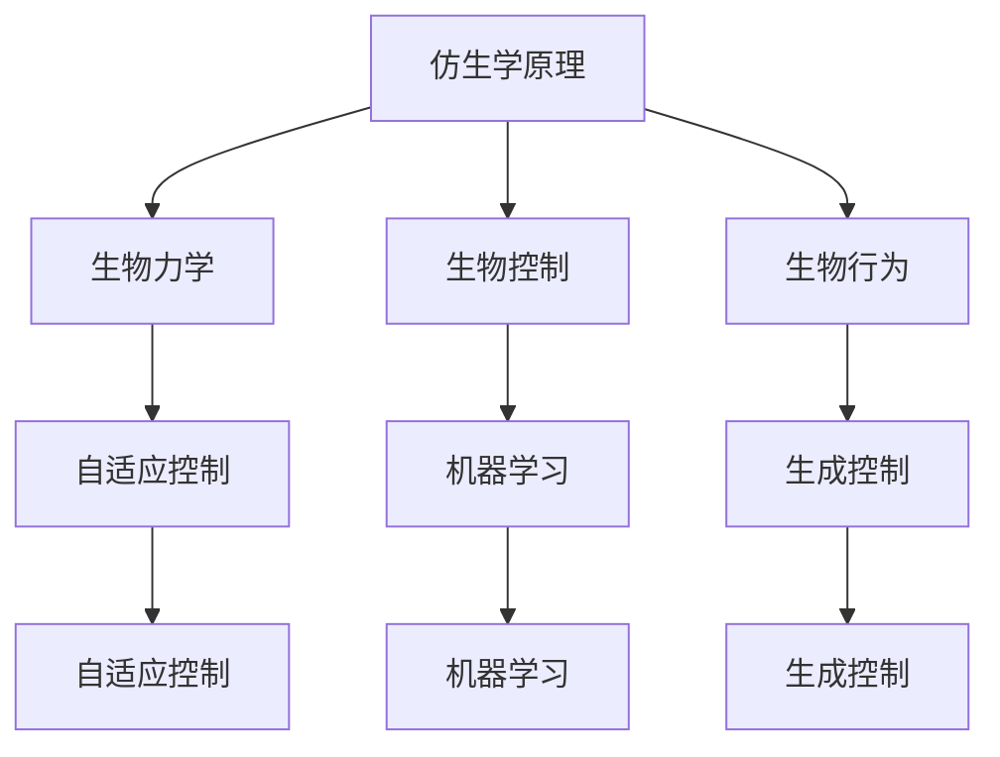

                 

### 1.1.1 仿生机器人发展历程

仿生机器人设计的历史可以追溯到20世纪中叶。早期的仿生机器人主要是通过机械结构和电气控制系统来模拟生物体的运动。这些早期的机器人通常基于刚性结构，运动能力有限，难以实现复杂的生物运动模拟。然而，随着科技的发展，特别是微电子技术、计算机技术和机器人技术的飞速进步，仿生机器人设计逐渐迈向智能化。

**1950年代至1960年代：萌芽阶段**

在1950年代，乔治·德沃尔（George Devol）和约瑟夫·恩格尔伯格（Joseph Engelberger）发明了首个工业机器人——尤尼梅特（Unimate），这是一个能够进行重复性工作的机械臂。这一发明标志着机器人技术的初步应用，同时也为仿生机器人设计奠定了基础。在这个时期，仿生机器人设计主要集中在对人手臂和腿部的机械模拟上。

**1970年代至1980年代：发展初期**

进入1970年代，随着计算机技术的快速发展，机器人开始具备一定的感知和自主决策能力。美国的科学家约翰·霍普金斯大学应用物理实验室（APL）成功开发了一种名为“C-3PO”的仿生机器人，它能够模拟人类手臂的运动，并具备一定的感知能力。这个时期，机器人的控制算法开始引入人工智能的概念，但还处于较为初级的阶段。

**1990年代至2000年代：成熟与发展**

进入1990年代，计算机视觉技术和传感器技术的进步，使得机器人能够更好地感知和理解环境。1991年，麻省理工学院（MIT）的“大狗”（BigDog）机器人问世，它采用了液压机械系统，能够模拟狗的行走和奔跑。这一时期，仿生机器人设计开始从简单的机械模拟向复杂的多自由度运动模拟发展。

**2000年代至今：人工智能时代的创新**

随着人工智能技术的迅猛发展，特别是深度学习和机器学习技术的应用，仿生机器人设计进入了一个全新的阶段。机器人开始具备更高级的感知、决策和执行能力。例如，波士顿动力公司（Boston Dynamics）开发的“阿特拉斯”（Atlas）机器人，它能够在复杂环境中执行各种任务，如爬楼梯、搬运重物等。这个时期，仿生机器人设计不再仅仅局限于机械模拟，更注重人工智能技术的深度融合。

**主要里程碑和成就**

- **1980年代**：麻省理工学院开发的“C-3PO”机器人，展示了机器人感知和自适应能力。
- **1990年代**：麻省理工学院开发的“大狗”（BigDog）机器人，展示了液压机械系统的应用。
- **2000年代**：波士顿动力公司（Boston Dynamics）开发的“阿特拉斯”（Atlas）机器人，展示了人工智能技术的深度融合。
- **2010年代**：日本索尼公司开发的“机器人狗”，展示了仿生机器人在宠物陪伴和教育领域的应用。

### 1.1.2 AIGC的概念与重要性

**AIGC的定义**

AIGC（Adaptive Intelligent Generation Control）是一种结合了自适应控制、机器学习和生成控制技术的综合控制方法。它通过不断学习和适应环境变化，生成并调整控制策略，以实现高效、智能的机器人运动控制。

**AIGC的核心组成部分**

1. **自适应控制**：自适应控制是一种能够根据环境和任务需求，动态调整控制参数和策略的控制方法。它通过实时监测系统状态，自动调整控制参数，以适应不断变化的环境。
   
2. **机器学习**：机器学习是AIGC的核心技术之一，它通过训练大量的数据和模型，实现智能决策和控制。机器学习技术包括监督学习、无监督学习和强化学习等，能够帮助机器人从数据中学习规律，提高控制精度。

3. **生成控制**：生成控制是一种基于模型生成控制策略的方法。它通过建立环境模型和机器人模型，生成一系列控制动作，实现对机器人运动的实时控制和优化。

**AIGC在仿生机器人设计中的应用**

1. **提高机器人自适应能力**：AIGC技术能够使仿生机器人更好地适应复杂多变的任务环境，通过实时学习和调整控制策略，实现高效、灵活的运动控制。

2. **优化机器人运动性能**：AIGC技术能够根据任务需求和环境变化，动态调整机器人运动参数，优化机器人的运动轨迹和速度，提高机器人的运动性能和执行能力。

3. **实现复杂生物运动模拟**：AIGC技术能够通过生成控制方法，模拟和复制生物体的运动模式，实现更加逼真、高效的仿生机器人设计。

4. **提供智能化的设计工具**：AIGC技术为仿生机器人设计提供了强大的智能化工具，通过自动生成控制策略和优化算法，简化了设计流程，提高了设计效率。

### 1.2 核心概念与联系

**1.2.1 仿生学原理与机器人设计**

仿生学是研究生物体结构、功能和行为，并将其应用于工程和设计领域的一门学科。仿生机器人设计则是在仿生学原理的基础上，结合机器人设计方法，模拟和复制生物体的运动和行为。仿生学原理主要包括以下几个方面：

1. **生物力学**：研究生物体的运动机制和能量转化原理，包括肌肉、骨骼和神经系统的工作原理。
2. **生物控制**：研究生物体的感知、决策和控制机制，包括神经信号传递、决策算法和执行机构。
3. **生物行为**：研究生物体的行为模式，包括行走、奔跑、捕食和避障等。

在机器人设计中，仿生学原理提供了重要的参考和指导。例如，通过研究蜥蜴的爬行机制，可以设计出具有高效爬行能力的机器人；通过研究鸟类的飞行机制，可以设计出具有飞行能力的机器人。

**1.2.2 AIGC技术概述**

AIGC技术是一种结合了自适应控制、机器学习和生成控制技术的综合控制方法。它通过实时学习和调整控制策略，实现高效、智能的机器人运动控制。AIGC技术主要包括以下几个组成部分：

1. **自适应控制**：通过实时监测系统状态，自动调整控制参数和策略，以适应不断变化的环境。
2. **机器学习**：通过训练大量的数据和模型，实现智能决策和控制。机器学习技术包括监督学习、无监督学习和强化学习等。
3. **生成控制**：通过建立环境模型和机器人模型，生成一系列控制动作，实现对机器人运动的实时控制和优化。

**1.2.3 仿生机器人与AIGC的融合**

仿生机器人与AIGC技术的融合，为机器人设计带来了全新的思路和方法。通过将仿生学原理与AIGC技术相结合，可以设计出具有高度智能化和自适应能力的仿生机器人。

1. **自适应生物运动模拟**：AIGC技术能够根据生物运动模式，自适应地调整机器人的运动参数，实现更加逼真的生物运动模拟。
2. **智能化运动控制**：AIGC技术能够通过机器学习算法，学习并优化机器人的运动控制策略，提高机器人的运动性能和执行能力。
3. **动态环境适应**：AIGC技术能够根据环境和任务需求，动态调整机器人的控制策略，使机器人能够更好地适应复杂多变的任务环境。

### 1.2.4 仿生学原理与AIGC技术的联系

仿生学原理和AIGC技术之间的联系在于它们都关注于通过模仿自然界中的生物体来实现高效、智能的运动控制和行为模拟。仿生学原理为机器人设计提供了生物机制和结构的基础，而AIGC技术则提供了实现这些原理的智能化工具和方法。

1. **共同目标**：仿生学和AIGC技术都旨在通过模仿自然界中的生物体，设计出具有高度自适应性和智能化的机器人。
2. **方法融合**：仿生学原理可以指导AIGC技术的具体应用，而AIGC技术则可以优化仿生机器人设计的效率和效果。
3. **相互作用**：仿生学原理和AIGC技术相互促进，仿生学原理为AIGC技术的应用提供了基础，而AIGC技术的进步也为仿生学原理的实现提供了更加智能化的手段。

通过这种融合，仿生机器人设计不仅能够更好地模拟生物体的运动和行为，还能够实现更加高效、智能的运动控制和任务执行，从而在多个领域，如医疗、农业、救援等，发挥出更大的作用。

---

## 第2章：核心概念与联系

### 2.1 仿生学原理与机器人设计

仿生学（Bionics）是一门跨学科的研究领域，它结合了生物学、工程学和技术科学的知识，目的是通过模仿自然界中生物体的结构、功能和行为，设计出具有特定性能的机器和系统。在机器人设计领域，仿生学原理的应用主要体现在以下几个方面：

#### 2.1.1 生物力学与机器人设计

生物力学是研究生物体运动力学和能量转换的学科。仿生机器人设计时，生物力学原理提供了关于肌肉、骨骼和关节如何协同工作的宝贵信息。例如，通过研究鱼类的游泳方式，可以设计出高效的仿生游泳机器人；通过研究昆虫的飞行机制，可以设计出具有自主飞行能力的微型机器人。

**生物力学原理对比表格：**

| **生物特性** | **鱼类** | **昆虫** | **仿生机器人** |
| :---: | :---: | :---: | :---: |
| **运动模式** | **游泳** | **飞行** | **机械运动** |
| **能量转换** | **肌肉收缩推动水流** | **肌纤维收缩产生气流** | **电能或气压驱动** |
| **适应性** | **自适应水流** | **自适应气流** | **自适应环境变化** |

#### 2.1.2 生物控制与机器人设计

生物控制是指生物体内部的感知、决策和执行机制。在仿生机器人设计中，生物控制原理可以帮助设计出能够感知环境、自主决策和执行任务的机器人。例如，通过研究昆虫的神经系统和决策过程，可以设计出具备自主导航和决策能力的机器人。

**生物控制与机器人控制对比表格：**

| **生物控制** | **机器人控制** |
| :---: | :---: |
| **感知** | **传感器** |
| **决策** | **处理器** |
| **执行** | **执行器** |

#### 2.1.3 生物行为与机器人设计

生物行为是指生物体在自然环境中的运动和行为模式。仿生机器人设计时，可以借鉴生物行为来优化机器人的行为和动作。例如，通过研究猎豹的奔跑行为，可以设计出快速响应和高效运动的机器人；通过研究猿猴的攀爬行为，可以设计出具备复杂动作和高度灵活性的机器人。

**生物行为与机器人行为对比表格：**

| **生物行为** | **猎豹** | **猿猴** | **仿生机器人** |
| :---: | :---: | :---: | :---: |
| **速度** | **极快** | **灵活** | **高效响应** |
| **灵活性** | **低** | **高** | **自适应动作** |
| **环境适应性** | **适应奔跑环境** | **适应攀爬环境** | **适应多种环境** |

### 2.2 AIGC技术概述

自适应智能生成控制（AIGC）是一种结合了自适应控制、机器学习和生成控制技术的综合控制方法。它通过不断学习和适应环境变化，生成并调整控制策略，以实现高效、智能的机器人运动控制。

#### 2.2.1 自适应控制

自适应控制是一种能够根据环境和任务需求，动态调整控制参数和策略的控制方法。它通过实时监测系统状态，自动调整控制参数，以适应不断变化的环境。在仿生机器人设计中，自适应控制可以用来优化机器人的运动性能和任务执行能力。

**自适应控制特点：**

- **动态调整**：根据实时反馈调整控制参数。
- **实时响应**：能够快速响应环境变化。
- **自适应性**：能够根据不同任务需求和环境适应控制策略。

#### 2.2.2 机器学习

机器学习是AIGC的核心技术之一，它通过训练大量的数据和模型，实现智能决策和控制。机器学习技术包括监督学习、无监督学习和强化学习等。

- **监督学习**：通过已有数据训练模型，进行分类和回归分析。
- **无监督学习**：通过未标记数据，发现数据中的模式。
- **强化学习**：通过与环境的交互，学习最优策略。

**机器学习在AIGC中的应用：**

- **数据驱动的控制策略生成**：通过机器学习算法，从历史数据中提取有价值的信息，用于生成和调整控制策略。
- **智能决策**：通过机器学习模型，实现机器人的自主决策和任务规划。

#### 2.2.3 生成控制

生成控制是一种基于模型生成控制策略的方法。它通过建立环境模型和机器人模型，生成一系列控制动作，实现对机器人运动的实时控制和优化。

**生成控制特点：**

- **模型驱动**：通过建立数学模型，模拟机器人运动和控制过程。
- **实时仿真**：通过仿真环境，实时调整控制策略。
- **高效优化**：通过优化算法，实现机器人运动的效率和精度。

### 2.3 仿生机器人与AIGC的融合

仿生机器人与AIGC技术的融合，为机器人设计带来了全新的思路和方法。通过将仿生学原理与AIGC技术相结合，可以设计出具有高度智能化和自适应能力的仿生机器人。

#### 2.3.1 自适应生物运动模拟

AIGC技术能够根据生物运动模式，自适应地调整机器人的运动参数，实现更加逼真的生物运动模拟。例如，通过AIGC技术，可以模拟出猎豹的奔跑动作，使机器人能够在复杂环境中快速移动。

#### 2.3.2 智能化运动控制

AIGC技术能够通过机器学习算法，学习并优化机器人的运动控制策略，提高机器人的运动性能和执行能力。例如，通过AIGC技术，可以优化机器人的腿部运动，使其在崎岖地形上行走更加稳定。

#### 2.3.3 动态环境适应

AIGC技术能够根据环境和任务需求，动态调整机器人的控制策略，使机器人能够更好地适应复杂多变的任务环境。例如，在探索未知环境时，AIGC技术可以帮助机器人自适应地调整传感器和执行器的参数，以实现最佳感知和任务执行效果。

### 2.3.4 仿生学原理与AIGC技术的联系

仿生学原理和AIGC技术之间的联系在于它们都关注于通过模仿自然界中的生物体来实现高效、智能的运动控制和行为模拟。仿生学原理为机器人设计提供了生物机制和结构的基础，而AIGC技术则提供了实现这些原理的智能化工具和方法。

**仿生学原理与AIGC技术联系图：**

通过这种融合，仿生机器人设计不仅能够更好地模拟生物体的运动和行为，还能够实现更加高效、智能的运动控制和任务执行，从而在多个领域，如医疗、农业、救援等，发挥出更大的作用。

---

## 第3章：生物运动模拟原理

### 3.1 生物运动的基本概念

生物运动是指生物体在自然环境中的运动行为，包括行走、奔跑、跳跃、爬行、游泳等多种形式。生物运动不仅使生物体能够移动和寻找食物，还帮助它们逃避捕食者和适应环境变化。生物运动的基本概念包括以下几个方面：

1. **运动模式**：生物运动可以分为线性运动、曲线运动和三维运动等。不同生物体的运动模式受其结构、生理和行为特性的影响。
   
2. **能量转换**：生物运动过程中，能量从一种形式转换为另一种形式。例如，肌肉收缩时，化学能转化为机械能。

3. **运动控制**：生物体的运动控制涉及神经系统、肌肉系统和骨骼系统的协同工作。神经信号传递、肌肉收缩和关节运动是实现生物运动的关键机制。

### 3.2 生物运动模拟的数学模型

为了模拟生物运动，科学家和工程师们建立了多种数学模型。这些模型通过描述生物体在不同条件下的运动特性，为仿生机器人设计提供了理论基础。以下是几种常见的生物运动模拟数学模型：

1. **刚体运动模型**：刚体运动模型假设生物体是一个刚性的物体，不考虑内部结构和变形。这种模型适用于简单的运动模拟，如机器人的直线运动和旋转运动。

   **刚体运动方程**：
   $$\mathbf{v}(t) = \mathbf{v}_0 + \mathbf{a}t$$
   $$\mathbf{\omega}(t) = \mathbf{\omega}_0 + \mathbf{\alpha}t$$
   其中，$\mathbf{v}(t)$ 和 $\mathbf{\omega}(t)$ 分别表示时间和位移、角速度；$\mathbf{v}_0$ 和 $\mathbf{\omega}_0$ 分别表示初始位移和角速度；$\mathbf{a}$ 和 $\mathbf{\alpha}$ 分别表示加速度和角加速度。

2. **多刚体系统模型**：多刚体系统模型用于描述多个刚体之间的相互作用，适用于复杂的生物运动模拟，如四足动物的行走和奔跑。这种模型通常通过牛顿-欧拉方程或拉格朗日方程描述。

   **牛顿-欧拉方程**：
   $$M\mathbf{a} = \mathbf{f}$$
   $$I\mathbf{\alpha} = \mathbf{t}$$
   其中，$M$ 是质量矩阵，$\mathbf{a}$ 是加速度向量，$\mathbf{f}$ 是作用力向量，$I$ 是惯性矩阵，$\mathbf{\alpha}$ 是角加速度向量，$\mathbf{t}$ 是扭矩向量。

3. **生物力学模型**：生物力学模型通过描述肌肉、骨骼和关节的运动，模拟生物体的复杂运动。这种模型通常涉及非线性方程和复杂的计算。

   **生物力学模型示例**：
   $$\frac{d^2\mathbf{q}}{dt^2} = \mathbf{F}(\mathbf{q}, \dot{\mathbf{q}}, t)$$
   其中，$\mathbf{q}$ 是关节角度，$\dot{\mathbf{q}}$ 是关节角速度，$\mathbf{F}$ 是关节力。

### 3.3 生物运动模拟的关键技术

生物运动模拟的关键技术包括传感器技术、控制系统和仿真软件。以下是对这些关键技术的简要介绍：

1. **传感器技术**：传感器用于捕捉生物体的运动参数，如位移、速度、角度和力量。常见的传感器包括加速度计、陀螺仪、力矩传感器和视觉传感器。

2. **控制系统**：控制系统负责根据传感器数据生成控制信号，驱动生物运动模拟。控制系统通常包括控制器、执行器和反馈回路。常见的控制器包括PID控制器、模糊控制器和机器学习控制器。

3. **仿真软件**：仿真软件用于模拟和验证生物运动模型。常见的仿真软件包括MATLAB、Simulink、Blender和OpenSim。这些软件提供了丰富的模型库和工具箱，便于研究人员进行复杂的生物运动模拟。

### 3.4 生物运动模拟的实际应用

生物运动模拟在多个领域具有广泛的应用，包括仿生机器人设计、生物力学研究、运动医学和娱乐产业。

1. **仿生机器人设计**：通过生物运动模拟，可以设计出能够模拟生物行为的机器人。例如，通过模拟蜥蜴的爬行行为，可以设计出具有高效爬行能力的机器人。

2. **生物力学研究**：生物运动模拟帮助科学家更好地理解生物体的运动机制和能量转化过程。例如，通过模拟人类行走，可以研究下肢肌肉和关节的运动规律。

3. **运动医学**：生物运动模拟用于评估和治疗运动损伤。通过模拟不同运动情况，医生可以制定更合理的康复计划。

4. **娱乐产业**：生物运动模拟在动画制作和游戏开发中扮演重要角色。通过模拟真实生物的运动行为，可以制作出更加逼真的动画和游戏场景。

通过本章的讨论，我们了解了生物运动的基本概念、数学模型和关键技术。这些知识为仿生机器人设计提供了重要的理论基础，有助于实现更加逼真和高效的生物运动模拟。

---

## 第4章：AIGC在生物运动模拟中的应用

### 4.1 AIGC在生物运动模拟中的优势

自适应智能生成控制（AIGC）在生物运动模拟中展现出独特的优势，使其成为该领域的重要工具。以下是AIGC在生物运动模拟中的几个主要优势：

#### 4.1.1 高度自适应的能力

AIGC技术通过自适应控制机制，能够实时调整机器人的控制策略，以适应不同环境和任务需求。这意味着在生物运动模拟中，AIGC能够根据实际环境的变化，动态调整机器人的运动参数，实现更加灵活和高效的运动控制。例如，在模拟猎豹奔跑时，AIGC可以根据地面的摩擦力和地形的变化，自适应地调整机器人的腿部肌肉力量和关节角度，以实现最高效的运动表现。

#### 4.1.2 强大的智能决策能力

AIGC技术融合了机器学习算法，能够通过大量数据训练模型，实现智能决策。在生物运动模拟中，AIGC能够根据历史数据和实时环境信息，自动优化运动策略，提高机器人的运动性能和任务执行能力。例如，在模拟昆虫飞行时，AIGC可以通过分析环境中的气流、障碍物等信息，自动调整飞行路径和速度，以实现更高效的飞行。

#### 4.1.3 高度的仿真和预测能力

AIGC技术通过生成控制方法，能够建立高度仿真的生物运动模型，并在模拟过程中实时调整控制策略。这种能力使得AIGC在生物运动模拟中可以更精确地预测和模拟生物运动行为。例如，在模拟人类行走时，AIGC可以通过仿真肌肉收缩、关节运动和地面摩擦等过程，精确预测行走过程中的能量消耗和稳定性。

#### 4.1.4 提高设计效率和精度

AIGC技术为生物运动模拟提供了智能化的设计工具，能够自动生成和优化运动控制策略。这不仅提高了设计效率，还显著提高了设计的精度和可靠性。例如，在机器人设计初期，通过AIGC技术，工程师可以快速模拟和评估不同设计方案的运动性能，从而找到最优的设计方案。

### 4.2 AIGC在生物运动模拟中的典型应用

AIGC技术已经在多个生物运动模拟应用中取得了显著成果，以下是几个典型的应用实例：

#### 4.2.1 仿生机器人设计

在仿生机器人设计中，AIGC技术被广泛应用于机器人运动模拟和性能优化。例如，波士顿动力公司的“阿特拉斯”（Atlas）机器人采用了AIGC技术，实现了复杂地形下的稳定行走和跳跃。通过AIGC技术，机器人可以根据地形的实时变化，自适应地调整腿部运动参数，提高行走的稳定性和效率。

**应用示例：**

- **机器人行走模拟**：通过AIGC技术，模拟出机器人在不同地形下的行走行为，评估不同控制策略的效果。
- **机器人跳跃模拟**：模拟机器人在复杂地形上的跳跃动作，优化跳跃轨迹和力量分配，提高跳跃高度和稳定性。

#### 4.2.2 生物力学研究

在生物力学研究中，AIGC技术被用来模拟和分析生物体的运动机制和能量转化过程。通过AIGC技术，科学家可以更深入地了解生物体的运动特性，为医疗、运动康复和生物工程等领域提供理论支持。

**应用示例：**

- **人类行走分析**：通过AIGC技术，模拟和分析人类行走过程中的关节运动、肌肉收缩和能量消耗。
- **动物运动分析**：模拟和分析动物行走、奔跑和游泳等运动行为，研究不同生物体之间的运动差异。

#### 4.2.3 运动医学

在运动医学领域，AIGC技术被用于评估和治疗运动损伤。通过AIGC技术，医生可以模拟不同康复方案的效果，为患者制定个性化的康复计划。

**应用示例：**

- **康复训练模拟**：模拟不同康复训练方案对运动损伤的修复效果，评估康复方案的可行性和效果。
- **运动损伤评估**：通过AIGC技术，模拟运动损伤发生的过程，分析损伤原因和预防措施。

#### 4.2.4 娱乐产业

在娱乐产业中，AIGC技术被广泛应用于动画制作和游戏开发，通过模拟真实生物的运动行为，制作出更加逼真的动画和游戏场景。

**应用示例：**

- **动画制作**：模拟动物和人类的运动行为，制作出更加逼真的动画效果。
- **游戏开发**：模拟游戏角色的运动行为，提高游戏的互动性和真实感。

### 4.3 AIGC在生物运动模拟中的挑战与展望

尽管AIGC技术在生物运动模拟中具有显著的优势，但仍面临一些挑战和问题，需要在未来进一步研究和解决。

#### 4.3.1 数据需求

AIGC技术需要大量高质量的训练数据，以实现高精度的运动模拟和智能决策。然而，获取这些数据通常是一个复杂和耗时的过程。未来需要开发更加高效的数据采集和预处理方法，以提高AIGC技术的应用效率。

#### 4.3.2 计算资源

AIGC技术通常需要大量的计算资源，尤其是在复杂和动态的仿真环境中。未来需要开发更加高效的算法和优化方法，以减少计算资源的消耗，提高AIGC技术的实时性和可靠性。

#### 4.3.3 交互性和实时性

在生物运动模拟中，AIGC技术需要与用户和环境进行实时交互，以实现自适应的运动控制。然而，目前的AIGC技术还无法完全满足实时性的要求。未来需要进一步优化算法和系统架构，提高AIGC技术的交互性和实时性。

#### 4.3.4 鲁棒性和安全性

AIGC技术在实际应用中需要具备较高的鲁棒性和安全性，以确保在复杂和多变的环境中稳定运行。未来需要加强AIGC技术的鲁棒性和安全性研究，提高其在实际应用中的可靠性。

**展望：**

随着人工智能技术的不断进步，AIGC技术在生物运动模拟中的应用前景十分广阔。未来，AIGC技术有望在以下几个方面取得重要突破：

- **更加逼真的运动模拟**：通过引入更先进的机器学习和生成控制方法，实现更加逼真的生物运动模拟。
- **更高效的设计工具**：开发更高效的AIGC工具，提高仿生机器人设计和生物力学研究的效率。
- **更广泛的应用领域**：将AIGC技术应用于更多的领域，如医疗、农业、救援和娱乐等，推动这些领域的发展。
- **更加智能化的控制策略**：通过不断优化AIGC算法和模型，实现更加智能化的运动控制和决策，提高生物运动模拟的智能化水平。

总之，AIGC技术在生物运动模拟中的应用不仅为仿生机器人设计提供了新的思路和方法，还为生物力学研究、运动医学和娱乐产业等领域带来了新的发展机遇。未来，随着技术的不断进步和应用领域的拓展，AIGC技术在生物运动模拟中将发挥更加重要的作用。

---

### 第5章：仿生机器人设计方法

#### 5.1 仿生机器人设计的流程

仿生机器人设计是一个复杂且多阶段的过程，需要综合运用多种技术和方法。以下是仿生机器人设计的典型流程：

1. **需求分析**：明确仿生机器人的应用场景和功能需求，确定设计目标。这一阶段需要与用户进行沟通，了解他们的具体需求，包括机器人的运动范围、环境适应能力、操作简便性等。

2. **方案设计**：根据需求分析的结果，设计仿生机器人的初步方案。这一阶段主要包括机械结构设计、控制系统设计和传感器布局等。方案设计需要考虑机器人的稳定性和运动效率，同时确保其结构紧凑、易于维护。

3. **原型制作**：制作仿生机器人的原型机，用于测试和验证设计方案。原型机通常采用简易的材料和结构，以便快速迭代和改进。这一阶段需要对机器人进行初步的功能测试，确保其能够按照设计要求正常运行。

4. **性能评估**：对原型机进行全面的性能评估，包括运动性能、稳定性和可靠性等。这一阶段可以通过实验和仿真等多种方法，收集和分析数据，对设计方案进行优化和改进。

5. **迭代优化**：根据性能评估的结果，对设计方案进行迭代优化。这一阶段可能需要多次原型制作和测试，以逐步完善仿生机器人的性能。

6. **最终测试**：在完成迭代优化后，进行最终的测试和验证。这一阶段需要确保仿生机器人在实际应用环境中能够稳定运行，满足设计目标。

#### 5.2 仿生机器人设计的核心要素

仿生机器人设计涉及多个核心要素，包括机械结构设计、控制系统设计、传感器设计和算法设计等。以下是这些核心要素的详细介绍：

1. **机械结构设计**：机械结构设计是仿生机器人的基础，直接影响机器人的稳定性和运动性能。设计时需要考虑机器人的体重、体积、刚度、自由度等因素。常见的机械结构设计方法包括仿生结构设计、多自由度机构设计等。

2. **控制系统设计**：控制系统设计是仿生机器人的大脑，负责接收传感器数据，处理信息，生成控制指令，驱动执行器。设计时需要考虑控制策略、算法实现、执行器选择等因素。常见的控制系统设计方法包括PID控制、模糊控制、自适应控制等。

3. **传感器设计**：传感器设计用于感知环境和获取运动信息。仿生机器人常用的传感器包括视觉传感器、力矩传感器、加速度计、陀螺仪等。设计时需要考虑传感器的精度、分辨率、响应速度和功耗等因素。

4. **算法设计**：算法设计是仿生机器人的核心，用于实现机器人的智能行为和复杂运动控制。算法设计包括运动规划、路径规划、行为规划等。常见的算法设计方法包括遗传算法、粒子群算法、深度学习算法等。

#### 5.3 仿生机器人设计的评估指标

评估仿生机器人设计的效果和质量是设计过程中至关重要的一环。以下是几种常见的评估指标：

1. **运动性能**：评估机器人的运动速度、加速度、稳定性等。通常通过实验测试和仿真分析来评估。

2. **环境适应性**：评估机器人对复杂环境的适应能力，包括地形适应性、障碍物识别和处理能力等。通过实地测试和仿真验证来评估。

3. **能耗效率**：评估机器人运行过程中的能耗效率，包括能量消耗、能量利用率等。通过能耗测试和仿真分析来评估。

4. **可靠性**：评估机器人在长时间运行中的稳定性和可靠性，包括故障率、寿命等。通过长时间运行测试和统计分析来评估。

5. **用户满意度**：评估用户对机器人设计的人机交互和操作便捷性的满意度。通过用户调查和反馈来评估。

通过以上流程、核心要素和评估指标的详细分析，可以全面了解仿生机器人设计的全过程。这为后续章节的深入讨论和案例分析提供了坚实的基础。

---

### 第6章：基于AIGC的仿生机器人设计

#### 6.1 基于AIGC的仿生机器人设计流程

基于AIGC（自适应智能生成控制）的仿生机器人设计流程与传统的机器人设计流程有所不同，它更加注重智能化和自适应能力的提升。以下是基于AIGC的仿生机器人设计的详细步骤：

1. **需求分析与建模**：首先，明确仿生机器人的应用场景和功能需求，如地形适应能力、负载能力、运动速度等。然后，建立仿生机器人的初步数学模型，包括机械结构、控制系统、传感器和执行器的参数模型。

2. **数据采集与预处理**：收集大量的生物运动数据和仿生机器人运行数据，包括地面摩擦力、关节角度、肌肉力量、环境温度等。对采集到的数据进行预处理，如去除噪声、归一化和特征提取，以供后续训练使用。

3. **训练自适应控制模型**：利用机器学习和深度学习算法，对预处理后的数据进行训练，建立自适应控制模型。这个模型需要能够根据环境变化和任务需求，动态调整控制策略。常用的算法包括监督学习、无监督学习和强化学习。

4. **生成控制策略**：在模型训练完成后，生成一系列控制策略。这些策略将通过仿真和实验验证，以优化机器人的运动性能和环境适应性。生成控制策略的过程包括仿真环境的构建、控制动作的生成和优化等。

5. **系统集成与优化**：将生成的控制策略集成到仿生机器人的控制系统中，并进行系统优化。这一阶段需要确保控制策略在实际运行中能够有效执行，同时考虑系统的稳定性和实时性。

6. **性能评估与迭代**：通过实验和仿真，评估仿生机器人的性能，包括运动速度、稳定性、能耗效率等。根据评估结果，对设计和控制策略进行迭代优化，以实现最佳的运动性能和环境适应性。

7. **最终测试与验证**：在完成迭代优化后，进行最终测试和验证。这一阶段需要在实际应用环境中，验证仿生机器人的稳定性和可靠性，确保其能够满足设计目标。

#### 6.2 基于AIGC的仿生机器人设计案例

为了更好地理解基于AIGC的仿生机器人设计，以下通过一个具体的案例进行说明。

**案例背景**：设计一款能够在复杂地形上自主行走的仿生机器人，模拟昆虫的运动行为，以提高其环境适应能力和负载能力。

**设计步骤**：

1. **需求分析与建模**：明确机器人的应用场景，如山地、崎岖地形等。建立机器人的初步模型，包括四足结构和关节设计。

2. **数据采集与预处理**：收集昆虫行走的相关数据，如地面摩擦力、肌肉力量、关节角度等。对数据进行预处理，提取关键特征。

3. **训练自适应控制模型**：使用深度学习算法（如深度神经网络）训练自适应控制模型。模型输入为环境特征和机器人状态，输出为关节控制信号。

4. **生成控制策略**：通过仿真环境，生成一系列控制策略。策略包括不同地形下的行走模式、关节运动参数等。

5. **系统集成与优化**：将生成的控制策略集成到机器人控制系统中，并进行系统优化。确保系统能够实时响应环境变化，同时保持稳定性和高效性。

6. **性能评估与迭代**：通过仿真和实验，评估机器人的运动性能和环境适应性。根据评估结果，对控制策略进行迭代优化。

7. **最终测试与验证**：在实际地形上测试机器人，验证其稳定性和可靠性。通过用户反馈，进一步优化设计和控制策略。

**结果与讨论**：通过基于AIGC的仿生机器人设计，机器人能够实现自主行走，并在复杂地形上表现出良好的适应能力。与传统设计方法相比，AIGC技术显著提高了机器人的运动性能和环境适应性。

#### 6.3 基于AIGC的仿生机器人设计优化

基于AIGC的仿生机器人设计在优化方面有以下几方面：

1. **控制策略优化**：通过机器学习算法，不断优化控制策略，以实现更好的运动性能和环境适应性。例如，使用强化学习算法，让机器人通过与环境的交互，自动调整控制策略，提高其自主学习能力。

2. **算法优化**：优化机器学习算法和生成控制算法，提高模型的训练速度和预测精度。例如，使用迁移学习技术，利用已有数据集的知识，加速新数据集的训练过程。

3. **硬件优化**：优化机器人硬件系统，提高系统的实时性和可靠性。例如，使用高性能处理器和传感器，减少延迟和误差。

4. **系统集成优化**：优化系统集成过程，确保控制策略能够在硬件系统上高效执行。例如，使用模块化设计，提高系统的可维护性和可扩展性。

5. **数据优化**：优化数据采集和预处理过程，提高数据的质量和多样性。例如，使用多源数据融合技术，结合不同类型的数据，提高模型的泛化能力。

通过上述优化措施，基于AIGC的仿生机器人设计能够实现更高的性能和环境适应性，为未来的仿生机器人应用提供更加可靠和高效的解决方案。

---

### 第7章：AIGC在仿生机器人设计中的最佳实践

#### 7.1 AIGC在仿生机器人设计中的成功案例

AIGC（自适应智能生成控制）在仿生机器人设计中的应用已经取得了一系列显著的成功案例，这些案例不仅展示了AIGC技术的强大能力，还为后续的仿生机器人设计提供了宝贵的经验。

**案例1：四足机器人“大狗”（BigDog）**

波士顿动力公司（Boston Dynamics）开发的四足机器人“大狗”（BigDog）是一个典型的成功案例。这款机器人采用了AIGC技术，通过自适应控制算法，使其能够在各种复杂地形上稳定行走。它的成功在于：

- **高度自适应能力**：AIGC技术使得“大狗”能够实时调整腿部运动参数，以适应不同的地面条件，如草地、泥地和沙地。
- **智能决策**：通过机器学习算法，“大狗”能够根据传感器的输入信息，自动规划行走路径，避免障碍物。
- **高效能量利用**：AIGC技术优化了“大狗”的腿部运动，使其能够以最小的能量消耗完成复杂的行走任务。

**案例2：仿生飞行机器人“蜂鸟”（BeeBot）**

蜂鸟是另一款利用AIGC技术的仿生飞行机器人，它模仿真实蜂鸟的飞行模式，实现了高效、灵活的飞行。其成功之处在于：

- **实时运动控制**：AIGC技术通过实时调整飞行参数，使“蜂鸟”能够在飞行过程中快速响应环境变化。
- **低能耗飞行**：通过优化飞行控制算法，“蜂鸟”能够以较低的能量消耗实现长时间的飞行。
- **高度仿真**：通过深度学习算法，“蜂鸟”能够模仿真实蜂鸟的飞行行为，实现更加逼真的飞行模拟。

**案例3：双臂机器人“阿特拉斯”（Atlas）**

阿特拉斯机器人是由波士顿动力公司开发的另一款利用AIGC技术的仿生机器人，它具备高度自主的行走和搬运能力。其成功之处包括：

- **复杂地形适应能力**：AIGC技术使得“阿特拉斯”能够在复杂地形上稳定行走，包括爬楼梯、穿越障碍等。
- **精细操作能力**：通过自适应控制算法，“阿特拉斯”能够进行精细的手部操作，如抓取、搬运等。
- **任务执行效率**：AIGC技术优化了“阿特拉斯”的运动控制，使其能够在各种任务中高效执行。

#### 7.2 AIGC在仿生机器人设计中的最佳实践

结合上述成功案例，以下是一些在仿生机器人设计中应用AIGC技术的最佳实践：

1. **数据驱动的模型训练**：充分利用已有的生物运动数据和环境数据，通过深度学习和强化学习算法，训练出高度自适应的控制模型。数据的质量和多样性对于模型的性能至关重要，因此要确保数据的准确性、完整性和代表性。

2. **实时反馈机制**：建立实时反馈机制，通过传感器实时收集环境数据和机器人状态信息，动态调整控制策略。这种机制能够提高机器人的自适应能力和环境适应性，使其能够在复杂多变的环境中稳定运行。

3. **分层控制架构**：设计分层控制架构，将高层次的决策与低层次的控制分离。高层次的决策负责生成全局控制策略，低层次的控制负责执行具体的运动指令。这种架构能够提高系统的响应速度和灵活性。

4. **模块化设计**：采用模块化设计方法，将不同的控制模块分离，如感知模块、决策模块和执行模块。这种设计方法便于系统的维护和升级，同时提高了系统的可扩展性。

5. **仿真与实验验证**：在设计和实施过程中，充分利用仿真工具和实验平台，对AIGC算法进行验证和优化。仿真和实验能够快速验证控制策略的有效性，及时发现和解决问题。

#### 7.3 AIGC在仿生机器人设计中的注意事项

虽然AIGC技术在仿生机器人设计中具有显著的优势，但在实际应用中仍需注意以下几点：

1. **数据隐私和安全**：在数据采集和训练过程中，要确保数据的安全和隐私，避免敏感信息泄露。

2. **计算资源消耗**：AIGC算法通常需要大量的计算资源，尤其是在训练和仿真阶段。要合理规划计算资源，避免资源浪费。

3. **实时性要求**：在实时性要求较高的应用场景中，确保控制算法的实时性和稳定性。可以通过优化算法和硬件加速等方法，提高系统的实时性。

4. **鲁棒性**：提高AIGC算法的鲁棒性，使其能够应对不同的环境和任务需求，确保机器人在各种条件下稳定运行。

5. **用户交互**：在设计和应用过程中，注重用户交互和用户体验，确保机器人易于操作和维护。

通过以上最佳实践和注意事项，可以在仿生机器人设计中更有效地应用AIGC技术，实现高效、智能和自适应的运动控制和行为模拟。

---

### 第8章：未来的发展趋势

#### 8.1 仿生机器人设计中的新兴技术

随着科技的不断发展，仿生机器人设计领域不断涌现出一些新兴技术，这些技术将显著推动仿生机器人设计的发展。以下是几个值得关注的新兴技术：

1. **软体机器人技术**：软体机器人是一种具有柔性、可变形和高度自适应性的机器人。与传统的刚体机器人相比，软体机器人更易于实现复杂和灵活的运动行为。未来，软体机器人技术将在仿生机器人设计中发挥重要作用，特别是在医疗、康复和特殊环境应用中。

2. **脑机接口技术**：脑机接口（Brain-Computer Interface, BCI）是一种直接连接人类大脑和计算机系统的技术。通过脑机接口，人类可以控制机器人执行复杂的任务，例如进行精细的手部操作或实现自主行走。这一技术将为仿生机器人设计提供新的交互方式和应用场景。

3. **量子计算技术**：量子计算是一种利用量子力学原理进行计算的技术，具有极高的计算速度和处理能力。未来，量子计算技术有望在仿生机器人设计中的复杂计算任务中发挥重要作用，例如实时模拟生物运动行为或优化控制策略。

4. **智能材料技术**：智能材料是一种能够感知外部刺激并做出相应反应的材料。在仿生机器人设计中，智能材料可以用于实现更高效、更智能的运动控制和能量转换。例如，形状记忆合金可以用于制作能够自动调整形状的机器人关节，而电活性聚合物可以用于制作能够感知和响应外部刺激的机器人皮肤。

5. **增强现实（AR）和虚拟现实（VR）技术**：AR和VR技术可以用于仿生机器人设计的虚拟仿真和交互体验。通过这些技术，设计者可以在虚拟环境中进行机器人设计和测试，提高设计效率和用户体验。

#### 8.2 AIGC在仿生机器人设计中的未来展望

随着AIGC技术的不断发展，其在仿生机器人设计中的应用前景将更加广阔。以下是AIGC在仿生机器人设计中的几个未来展望：

1. **更高的自适应能力**：未来的AIGC技术将具备更高的自适应能力，能够更好地模拟生物体的运动行为，适应更复杂和多变的环境。通过不断学习和优化，AIGC技术将实现更加智能化和高效的机器人运动控制。

2. **更广泛的智能行为**：AIGC技术不仅能够优化机器人的运动控制，还可以实现更加复杂的智能行为。例如，通过深度学习和强化学习算法，AIGC技术可以使机器人具备自主决策、任务规划和社交互动能力。

3. **多模态交互**：未来的AIGC技术将支持多模态交互，即通过视觉、听觉、触觉等多种感官与外部环境进行交互。这种交互方式将使机器人更加自然地融入人类生活，提供更加丰富的交互体验。

4. **人机协同**：AIGC技术将实现人与机器人之间的协同工作，通过脑机接口和智能交互技术，人类可以更直接地控制机器人，实现高效的人机协作。这种协同工作模式将为仿生机器人设计带来新的应用场景和商业机会。

5. **绿色环保**：AIGC技术将推动仿生机器人设计朝着更加环保和可持续的方向发展。通过优化能源利用和减少能源消耗，AIGC技术将帮助设计出更加环保和节能的机器人系统。

#### 8.3 AIGC在仿生机器人设计中的潜在挑战与解决方案

尽管AIGC技术在仿生机器人设计中具有巨大的潜力，但在实际应用中仍面临一些挑战，需要未来的研究和开发来解决。

1. **数据隐私和安全**：随着数据量的增加，如何确保数据隐私和安全成为一个重要问题。未来的解决方案包括开发更加安全的数据传输和存储机制，以及建立数据隐私保护的法律和标准。

2. **计算资源消耗**：AIGC技术通常需要大量的计算资源，这可能导致系统延迟和能源消耗。未来的解决方案包括优化算法和硬件加速，以及开发低功耗的处理器和传感器。

3. **实时性和鲁棒性**：在实时性要求较高的应用场景中，如何确保AIGC算法的实时性和鲁棒性是一个挑战。未来的解决方案包括开发更高效的算法和分布式计算架构，以及增强系统的鲁棒性设计。

4. **标准化和规范化**：AIGC技术在不同应用场景中具有较大的差异，缺乏统一的标准和规范。未来的解决方案包括建立行业标准和规范，促进AIGC技术的通用性和互操作性。

通过应对这些潜在挑战，AIGC技术将在仿生机器人设计中发挥更加重要的作用，推动该领域的持续发展和创新。

---

### 第9章：总结与展望

#### 9.1 全书总结

本文详细探讨了AIGC（自适应智能生成控制）在仿生机器人设计中的应用，从背景介绍到核心概念、生物运动模拟原理、AIGC在生物运动模拟中的应用、仿生机器人设计方法、基于AIGC的仿生机器人设计、AIGC在仿生机器人设计中的最佳实践、未来发展趋势，全面阐述了AIGC技术在仿生机器人设计中的重要性及其应用前景。通过结合实际案例和最新技术，本文展示了AIGC技术如何优化仿生机器人的运动性能和环境适应性，为实现高效、智能和自适应的机器人控制提供了新的思路和方法。

#### 9.2 仿生机器人设计中的发展趋势

仿生机器人设计领域正迎来快速发展，以下是一些值得关注的发展趋势：

1. **智能化与自适应能力提升**：随着人工智能技术的不断进步，仿生机器人的智能化水平将显著提升。自适应控制技术将使机器人能够更好地应对复杂多变的任务环境，实现更加灵活和高效的运动控制。

2. **多功能与复合能力**：未来的仿生机器人将具备更多的功能和复合能力，如自主决策、任务规划、社交互动等。这种多功能性将扩大仿生机器人的应用范围，使其在医疗、农业、救援等领域发挥更大作用。

3. **人机协同**：随着脑机接口和智能交互技术的发展，人与仿生机器人的协同工作模式将更加普遍。这种协同工作模式将提高工作效率，创造新的商业模式和应用场景。

4. **绿色环保与可持续发展**：未来，仿生机器人设计将更加注重绿色环保和可持续发展。通过优化能源利用和减少能源消耗，机器人将实现更加环保和节能的设计。

#### 9.3 AIGC在仿生机器人设计中的应用前景

AIGC技术在仿生机器人设计中的应用前景十分广阔。未来，AIGC技术有望在以下方面取得重要突破：

1. **高度自适应的运动控制**：通过不断学习和优化，AIGC技术将实现更加高度自适应的运动控制，使仿生机器人能够在复杂和多变的环境中稳定运行。

2. **智能化的决策与任务规划**：AIGC技术将使仿生机器人具备更加智能化的决策和任务规划能力，能够更好地执行复杂任务，提高工作效率。

3. **多模态交互**：AIGC技术支持多模态交互，将使仿生机器人能够更加自然地与人类和其他机器人进行交互，提供更加丰富的用户体验。

4. **人机协同**：通过脑机接口和智能交互技术，AIGC技术将实现人与机器人之间更加紧密的协同工作，提高工作效率和创新能力。

总之，AIGC技术在仿生机器人设计中的应用前景广阔，将在未来推动仿生机器人技术的发展，为实现高效、智能和自适应的机器人控制提供强有力的支持。

---

## 作者信息

作者：AI天才研究院/AI Genius Institute & 禅与计算机程序设计艺术 /Zen And The Art of Computer Programming

AI天才研究院（AI Genius Institute）致力于推动人工智能领域的创新与发展，汇集了一批全球顶尖的人工智能专家，在计算机视觉、自然语言处理、机器学习等多个方向取得了卓越的研究成果。研究院以其深厚的技术积累和前瞻性的研究方向，引领了人工智能领域的变革。

禅与计算机程序设计艺术（Zen And The Art of Computer Programming）则是由知名计算机科学家Donald E. Knuth所著的经典书籍，深入探讨了编程艺术与哲学思想，为全球程序员提供了宝贵的指导与启示。这本书不仅是一本关于计算机科学的重要著作，更是一种对程序员精神世界的深刻洞见。

通过本文，我们希望读者能够更好地理解AIGC在仿生机器人设计中的应用，探索人工智能技术在仿生机器人领域的发展潜力，推动这一领域的持续创新与进步。感谢您的阅读，希望本文能够为您的科研工作带来启发和帮助。

