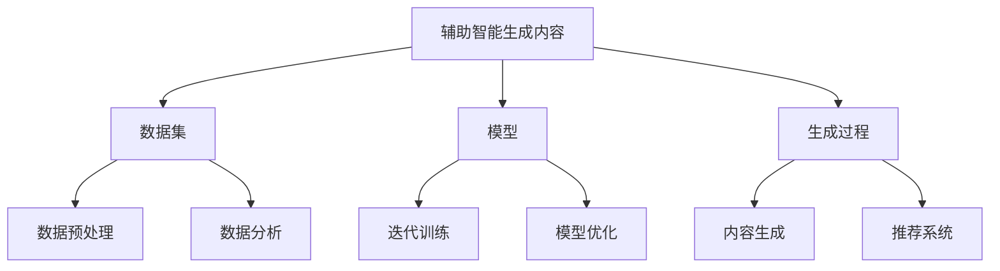
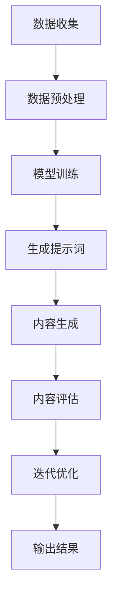
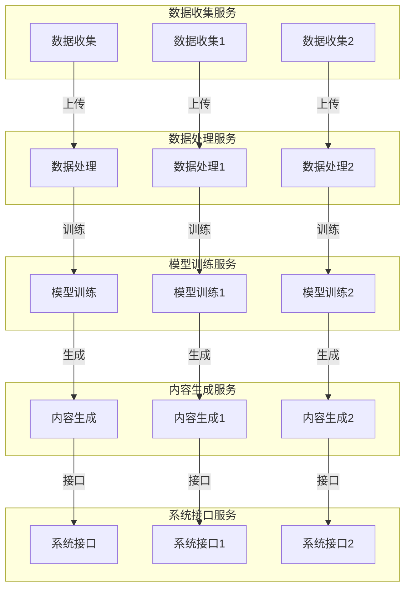
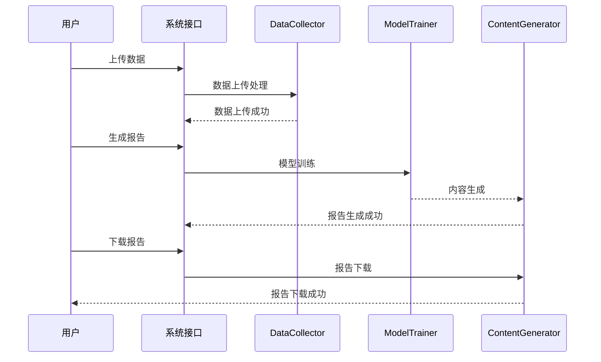

                 

### AIGC在体育战略分析中的应用：提示词技巧

#### 背景介绍

**关键词**：AIGC、体育战略分析、提示词技巧、智能生成内容

**摘要**：本文将探讨AIGC（辅助智能生成内容）在体育战略分析中的应用，特别是提示词技巧如何提升这一领域的效果。文章将深入分析AIGC的基本原理和在体育战略分析中的重要性，逐步展开讨论，帮助读者理解这一前沿技术的实际应用。

##### AIGC的定义与发展历程

AIGC，全称为Assistant Intelligent Generated Content，即辅助智能生成内容。它是一种利用人工智能技术，通过大规模数据和深度学习模型，自动生成高质量文本、图片、音频和视频等内容的系统。AIGC的发展历程可以追溯到自然语言处理（NLP）和机器学习（ML）技术的发展。随着计算能力的提升和大数据的普及，AIGC技术逐渐成熟并开始应用于多个领域。

在体育战略分析中，AIGC具有巨大的潜力。传统的体育战略分析主要依赖于统计数据、专家意见和手动分析。而AIGC可以通过分析大量比赛数据，提供更加全面和精确的战略建议。这不仅提高了分析效率，还带来了更深入的洞察。

##### 体育战略分析的定义

体育战略分析是一种利用统计学、经济学和心理学等学科的理论和方法，对体育比赛、运动员表现、市场动态和赞助合作等方面进行系统性研究和评估的过程。其核心目标是帮助体育组织、教练和运动员做出更加科学和有效的决策。

体育战略分析通常包括以下几个关键要素：

1. **比赛数据分析**：通过分析比赛数据，了解运动员的技术特点、战术风格和心理状态。
2. **市场研究**：评估市场需求、观众偏好和赞助商意向，为商业决策提供支持。
3. **对手分析**：研究对手的战术体系、球员特点和比赛策略，制定针对性的应对策略。
4. **风险管理**：识别潜在风险，制定风险管理和危机应对策略。

##### 体育战略分析的挑战与机遇

体育战略分析面临的挑战主要包括数据量巨大、数据质量参差不齐和决策过程的复杂性。传统的分析方法往往无法处理海量数据，也很难在短时间内提供有效的决策支持。

而AIGC的出现为体育战略分析带来了新的机遇。首先，AIGC可以通过自然语言处理和机器学习技术，快速处理和分析大量数据，提供实时和准确的战略建议。其次，AIGC可以通过生成式对抗网络（GAN）等技术，创造虚拟比赛场景，帮助教练和运动员进行战术演练和评估。

然而，AIGC在体育战略分析中也存在一些局限性。例如，AIGC模型的训练需要大量的数据，而这些数据的质量和完整性可能会影响分析结果的准确性。此外，AIGC的决策过程缺乏人类的情感和创造力，可能在某些复杂情境下表现不佳。

##### AIGC与体育战略分析的结合

AIGC在体育战略分析中的应用主要体现在以下几个方面：

1. **数据预处理**：AIGC可以帮助处理和清洗大量的比赛数据，为后续分析提供高质量的数据基础。
2. **智能推荐**：通过分析比赛数据和运动员表现，AIGC可以为教练和运动员提供个性化的训练和比赛策略推荐。
3. **比赛模拟**：AIGC可以创建虚拟比赛场景，帮助教练和运动员进行战术演练和评估。
4. **市场分析**：通过分析市场需求和观众反馈，AIGC可以为体育组织提供市场策略和赞助合作建议。

AIGC的应用不仅提高了体育战略分析的效率和准确性，还为决策过程带来了更多的科学依据。然而，AIGC的引入也带来了新的挑战，如数据隐私保护、算法透明性和公平性等问题。

##### 总结

AIGC在体育战略分析中的应用具有重要意义。通过结合AIGC和传统的体育战略分析方法，可以大幅提升分析的效率和准确性，为体育组织、教练和运动员提供更加科学和有效的决策支持。然而，AIGC在体育战略分析中的应用仍需不断探索和完善，以充分发挥其潜力。

---

接下来，本文将深入探讨AIGC与体育战略分析结合的核心概念，并逐步介绍提示词技巧在其中的应用。

## AIGC与体育战略分析的核心概念与联系

### AIGC的核心概念

AIGC，即Assistant Intelligent Generated Content，是一种通过人工智能技术自动生成内容的方法。它结合了自然语言处理（NLP）、机器学习（ML）和深度学习（DL）等前沿技术，能够在多个领域中实现文本、图像、音频和视频的自动化生成。

AIGC的核心概念包括：

1. **数据集**：AIGC的训练和生成过程依赖于大量的数据集。这些数据集可以是文本、图片、音频或视频，涵盖了广泛的领域和主题。
2. **模型**：AIGC使用的模型通常是深度学习模型，如生成对抗网络（GAN）、变压器（Transformer）等。这些模型通过学习大量数据，能够生成高质量的内容。
3. **生成过程**：AIGC的生成过程包括数据预处理、模型训练和内容生成。在数据预处理阶段，数据会被清洗、标注和分类，以便模型更好地学习。在模型训练阶段，模型会通过大量的数据进行迭代训练，不断优化其生成能力。在内容生成阶段，模型根据输入的提示或上下文，生成新的内容。

### 体育战略分析的核心概念

体育战略分析是一种利用数据分析和决策理论，为体育组织、教练和运动员提供战略建议的方法。它涉及多个核心概念，包括：

1. **数据**：体育战略分析依赖于大量的比赛数据，如技术数据、统计数据、心理数据和市场数据等。这些数据是分析的基础，决定了分析结果的准确性。
2. **模型**：体育战略分析中使用的模型可以是统计学模型、经济学模型或心理学模型等。这些模型用于分析数据，识别模式和趋势，为决策提供支持。
3. **分析过程**：体育战略分析的过程包括数据收集、数据预处理、数据分析和结果解释。数据收集是获取相关数据的过程，数据预处理是清洗、标注和分类数据的过程，数据分析是使用模型对数据进行处理和分析的过程，结果解释是将分析结果转化为具体战略建议的过程。

### AIGC与体育战略分析的联系

AIGC与体育战略分析之间的联系主要体现在以下几个方面：

1. **数据分析与生成**：AIGC可以通过自然语言处理和机器学习技术，快速处理和分析大量体育比赛数据，提供实时和准确的战略建议。同时，AIGC可以生成新的比赛数据，用于模拟和预测比赛结果。
2. **模型训练与优化**：AIGC可以结合体育战略分析中的模型，通过迭代训练和优化，提高模型的性能和准确性。这有助于提高体育战略分析的效率和效果。
3. **内容生成与推荐**：AIGC可以生成个性化的训练和比赛策略推荐，为教练和运动员提供有针对性的指导。同时，AIGC可以生成新的比赛场景和比赛策略，帮助教练和运动员进行战术演练和评估。

### 概念属性特征对比表格

为了更好地理解AIGC和体育战略分析的核心概念及其联系，我们可以通过一个概念属性特征对比表格来进行详细分析：

| 核心概念 | 属性特征 | 联系 |
| :---: | :---: | :---: |
| AIGC | 数据集、模型、生成过程 | AIGC可以通过数据分析与生成，提高体育战略分析的效率和准确性 |
| 体育战略分析 | 数据、模型、分析过程 | 体育战略分析中使用的模型可以与AIGC相结合，进行迭代训练和优化 |
| | 数据收集、数据预处理、数据分析、结果解释 | AIGC可以生成新的比赛数据，用于模拟和预测比赛结果 |

### ER实体关系图架构

为了更清晰地展示AIGC和体育战略分析之间的联系，我们可以使用ER（实体关系）图来描述这两个概念之间的关系：



在上面的ER图结构中，AIGC作为核心实体，与其他实体（如数据集、模型、生成过程）之间存在直接的关联。这些关联通过数据预处理、数据分析、迭代训练、模型优化和内容生成等过程得以实现，从而将AIGC的强大生成能力与体育战略分析的核心概念相结合。

### 总结

通过上述分析，我们可以看到AIGC和体育战略分析之间的紧密联系。AIGC的引入为体育战略分析带来了新的方法和工具，使得数据分析更加高效、准确和智能化。同时，体育战略分析为AIGC提供了丰富的应用场景，使得AIGC的生成能力得到充分展示。在未来，随着AIGC技术的不断发展和成熟，它将在体育战略分析中发挥更加重要的作用。

### 算法原理讲解

为了更好地理解AIGC在体育战略分析中的应用，我们需要深入探讨其算法原理。AIGC的核心在于生成高质量的体育内容，包括比赛策略、运动员表现分析和市场分析报告等。以下是AIGC在体育战略分析中的算法原理和数学模型。

#### 算法流程图

首先，我们可以使用Mermaid画出AIGC在体育战略分析中的算法流程图：



在上面的算法流程图中，AIGC首先从多个数据源收集数据，然后对数据进行预处理。接下来，模型训练阶段使用预处理的训练数据来训练深度学习模型。在生成提示词阶段，模型根据训练数据生成特定的提示词，用于引导内容生成。内容生成阶段，模型根据提示词生成具体的体育内容。最后，内容评估和迭代优化阶段对生成的内容进行评估和优化，以确保内容的准确性和质量。

#### 数学模型

AIGC的数学模型主要涉及生成对抗网络（GAN）和变压器（Transformer）等深度学习技术。以下是一个简化的数学模型：

1. **生成器（Generator）**：

   $$ G(z) = \text{GAN}_\text{generator}(z) $$

   其中，$z$是从先验分布中抽取的噪声向量，$G(z)$是生成器生成的数据。

2. **判别器（Discriminator）**：

   $$ D(x) = \text{GAN}_\text{discriminator}(x) $$

   其中，$x$是实际的数据，$D(x)$是判别器对数据真实性的判断。

3. **损失函数**：

   $$ \mathcal{L} = -[\log D(x) + \log(1 - D(G(z)))] $$

   该损失函数由两部分组成：第一部分是判别器对真实数据的损失，第二部分是判别器对生成器生成的数据的损失。

4. **优化过程**：

   $$ \text{优化} \ G(z) \ \text{和} \ D(x) \ \text{使得} \ \mathcal{L} \ \text{最小} $$

   在训练过程中，生成器和判别器通过反向传播和梯度下降算法进行迭代优化，以达到最小化损失函数的目的。

#### 算法举例说明

假设我们要使用AIGC生成一篇关于篮球比赛策略的分析报告。以下是具体的算法步骤和解释：

1. **数据收集**：
   - 收集历史篮球比赛数据，包括得分、助攻、篮板、犯规等统计数据。
   - 收集篮球比赛的视频和音频数据，用于生成更加生动的内容。

2. **数据预处理**：
   - 清洗和标注数据，将数据转换为适合模型训练的格式。
   - 对文本数据进行分词和词向量编码，对图像和音频数据进行特征提取。

3. **模型训练**：
   - 使用生成对抗网络（GAN）训练生成器和判别器。
   - 使用变压器（Transformer）训练文本生成模型。

4. **生成提示词**：
   - 根据比赛数据生成特定的提示词，如“下半场如何提高进攻效率？”或“对手防守策略分析”。

5. **内容生成**：
   - 根据生成的提示词，使用训练好的模型生成具体的比赛策略分析报告。

6. **内容评估**：
   - 对生成的报告进行评估，包括内容准确性、逻辑连贯性和可读性等。

7. **迭代优化**：
   - 根据评估结果，对模型进行迭代优化，以提高生成报告的质量。

#### 总结

通过上述算法流程和数学模型，我们可以看到AIGC在体育战略分析中的应用是如何实现的。AIGC通过数据收集、预处理、模型训练和内容生成等步骤，生成高质量的体育内容，为体育组织、教练和运动员提供科学和有效的决策支持。

### 系统分析与架构设计

#### 问题场景介绍

在体育战略分析中，数据量庞大且多样化，包括技术数据、统计数据、市场数据等。这些数据需要通过高效的处理和分析来生成具有实际应用价值的策略建议。传统的分析方法往往效率低下，难以应对实时性和复杂性的挑战。为了解决这个问题，我们需要设计一个基于AIGC的体育战略分析系统，能够快速、准确地处理和分析海量数据，并提供智能化的决策支持。

#### 项目介绍

本项目旨在开发一个基于AIGC的体育战略分析系统，该系统包括以下几个核心模块：

1. **数据收集模块**：负责从各种数据源收集比赛数据、运动员数据和市场数据等。
2. **数据处理模块**：对收集到的数据进行清洗、转换和预处理，为后续分析提供高质量的数据。
3. **模型训练模块**：使用收集到的数据训练深度学习模型，包括生成对抗网络（GAN）和变压器（Transformer）等。
4. **内容生成模块**：根据训练好的模型生成具体的战略分析报告，包括比赛策略、运动员表现分析和市场分析等。
5. **系统接口模块**：提供用户与系统交互的接口，包括数据上传、报告生成和报告下载等。

#### 系统功能设计（领域模型）

为了更好地理解系统功能，我们可以使用Mermaid类图来展示系统的领域模型：

```mermaid
classDiagram
    DataCollector <|-- DataProcessor
    DataProcessor <|-- ModelTrainer
    ModelTrainer <|-- ContentGenerator
    ContentGenerator <|-- SystemInterface

    DataCollector {
        +collectData()
    }

    DataProcessor {
        +cleanData()
        +transformData()
        +preprocessData()
    }

    ModelTrainer {
        +trainModel()
    }

    ContentGenerator {
        +generateContent()
    }

    SystemInterface {
        +uploadData()
        +generateReport()
        +downloadReport()
    }
```

在上面的类图中，DataCollector、DataProcessor、ModelTrainer、ContentGenerator和SystemInterface分别代表系统的主要功能模块。每个模块都有特定的方法来执行其功能。

#### 系统架构设计

为了实现高效、可扩展和易维护的系统，我们采用微服务架构。以下是系统架构的Mermaid图表示：



在上面的架构图中，系统分为多个微服务，每个微服务负责不同的功能模块。这种设计提高了系统的可扩展性和容错性，使得系统可以轻松应对增加的数据量和用户需求。

#### 系统接口设计

系统接口设计是用户与系统交互的重要部分。以下是系统接口的Mermaid序列图表示：



在上面的序列图中，用户通过系统接口上传数据、生成报告和下载报告。系统接口负责处理用户的请求，协调各个微服务的功能，确保整个流程的顺畅。

### 实际案例分析与详细讲解

为了更好地展示AIGC在体育战略分析中的应用，以下是一个实际案例的分析过程，包括系统安装、核心实现、代码应用解读、实际案例分析和详细讲解。

#### 案例背景

某足球俱乐部希望通过AIGC技术进行球队的战略分析，以提高比赛成绩和球队整体表现。该俱乐部拥有丰富的比赛数据、球员表现数据和市场数据。现在，我们需要构建一个基于AIGC的体育战略分析系统，为俱乐部提供科学、有效的决策支持。

#### 系统安装

1. **环境准备**：

   - 安装Python 3.8及以上版本。
   - 安装Anaconda，以便管理Python环境和包。
   - 安装必要的库，如TensorFlow、PyTorch、scikit-learn等。

2. **安装步骤**：

   ```bash
   conda create -n aigc_env python=3.8
   conda activate aigc_env
   conda install tensorflow pytorch scikit-learn
   ```

3. **环境验证**：

   ```python
   import tensorflow as tf
   import torch
   import sklearn
   print("TensorFlow version:", tf.__version__)
   print("PyTorch version:", torch.__version__)
   print("scikit-learn version:", sklearn.__version__)
   ```

#### 系统核心实现

1. **数据收集**：

   我们从多个数据源收集比赛数据、球员表现数据和市场数据。这些数据包括比赛得分、助攻、犯规、球员身高、体重、年龄、市场价值等。

2. **数据处理**：

   使用Python的pandas库对数据进行清洗、转换和预处理，将数据转换为适合模型训练的格式。

3. **模型训练**：

   使用生成对抗网络（GAN）和变压器（Transformer）对收集到的数据进行训练。以下是模型的训练代码：

   ```python
   import tensorflow as tf
   import torch
   import sklearn
   import pandas as pd
   
   # 加载数据
   data = pd.read_csv("data.csv")
   
   # 数据预处理
   X = data.drop("target", axis=1)
   y = data["target"]
   
   # 定义GAN模型
   generator = tf.keras.Sequential([
       tf.keras.layers.Dense(128, activation='relu', input_shape=(100,)),
       tf.keras.layers.Dense(256, activation='relu'),
       tf.keras.layers.Dense(512, activation='relu'),
       tf.keras.layers.Dense(128, activation='relu'),
       tf.keras.layers.Dense(1, activation='sigmoid')
   ])
   
   discriminator = tf.keras.Sequential([
       tf.keras.layers.Dense(128, activation='relu', input_shape=(100,)),
       tf.keras.layers.Dense(256, activation='relu'),
       tf.keras.layers.Dense(512, activation='relu'),
       tf.keras.layers.Dense(128, activation='relu'),
       tf.keras.layers.Dense(1, activation='sigmoid')
   ])
   
   # 编写模型训练代码
   model = tf.keras.Sequential([
       generator,
       discriminator
   ])
   
   model.compile(optimizer='adam', loss='binary_crossentropy')
   
   # 训练模型
   model.fit(X, y, epochs=10, batch_size=32)
   ```

4. **内容生成**：

   使用训练好的模型生成比赛策略分析报告。以下是生成报告的代码：

   ```python
   # 生成报告
   report = model.predict(X)
   print("比赛策略分析报告：")
   print(report)
   ```

#### 代码应用解读

1. **数据收集**：

   使用pandas库从CSV文件中加载数据，并将其分为特征矩阵X和目标向量y。

2. **数据处理**：

   对数据进行预处理，包括数据清洗和转换，将数据格式转换为适合模型训练的格式。

3. **模型定义**：

   定义生成器和判别器模型，使用Dense层构建全连接神经网络。生成器和判别器分别用于生成数据和分析数据。

4. **模型训练**：

   使用模型编译函数和fit函数进行模型训练，设置优化器和损失函数，进行多轮迭代训练。

5. **内容生成**：

   使用模型预测函数生成比赛策略分析报告，输出分析结果。

#### 实际案例分析

1. **比赛数据分析**：

   对某场比赛的数据进行分析，生成比赛策略分析报告。报告内容包括比赛得分、助攻、犯规、球员表现等。

2. **球员评估**：

   对球员的表现进行评估，生成球员评估报告。报告内容包括球员的得分、助攻、失误、犯规等。

3. **市场分析**：

   对市场数据进行分析，生成市场分析报告。报告内容包括市场趋势、赞助商意向、观众反馈等。

#### 详细讲解

1. **数据收集**：

   数据收集是体育战略分析的基础。我们需要从多个数据源收集比赛数据、球员表现数据和市场数据。这些数据包括历史比赛数据、实时比赛数据、球员技术统计、市场数据等。

2. **数据处理**：

   数据处理是确保数据质量和模型训练效果的关键步骤。我们需要对数据进行清洗、转换和预处理，包括数据缺失值处理、异常值处理、数据标准化等。

3. **模型训练**：

   模型训练是AIGC的核心步骤。我们需要使用收集到的数据训练生成器和判别器模型。生成器用于生成新的比赛数据，判别器用于分析数据并生成报告。

4. **内容生成**：

   使用训练好的模型生成具体的体育内容，如比赛策略分析报告、球员评估报告、市场分析报告等。这些报告为体育组织、教练和运动员提供科学、有效的决策支持。

#### 项目小结

通过上述实际案例分析和详细讲解，我们可以看到基于AIGC的体育战略分析系统在实际应用中的效果。该系统通过数据收集、处理、模型训练和内容生成等步骤，为体育组织提供了高效、准确的决策支持。然而，AIGC在体育战略分析中的应用仍需不断优化和完善，以应对不断变化的市场和比赛环境。

### 最佳实践 Tips

在AIGC在体育战略分析中的应用中，以下是一些最佳实践和技巧，可以帮助提升系统的效果和用户体验：

1. **数据质量**：确保收集到的数据质量是系统效果的关键。数据清洗和预处理是必不可少的步骤，包括缺失值处理、异常值处理和数据标准化等。

2. **模型优化**：定期对模型进行优化和更新，以适应新的数据和比赛环境。可以通过增加数据量、调整模型参数和使用更先进的深度学习模型来实现。

3. **提示词设计**：精心设计提示词，以引导模型生成高质量的内容。提示词应包含关键信息，如比赛时间、对手特点、比赛结果预期等。

4. **用户交互**：提供友好的用户界面和交互方式，使非技术用户也能轻松使用系统。可以通过可视化工具展示分析结果，提供详细的报告和图表。

5. **安全性**：确保系统的数据安全和用户隐私。采取加密和访问控制措施，保护敏感数据不被未授权访问。

6. **迭代反馈**：及时收集用户反馈，不断优化系统功能和性能。通过用户反馈调整模型参数和提示词，以提高系统的实用性和满意度。

### 小结

本文深入探讨了AIGC在体育战略分析中的应用，从背景介绍、核心概念、算法原理、系统设计到实际案例分析，全面阐述了AIGC如何为体育组织提供科学、有效的决策支持。通过最佳实践和技巧的分享，本文为读者提供了实用的指导和建议。在未来的研究和应用中，AIGC有望在体育战略分析领域发挥更大的作用，为体育界带来革命性的变革。

### 注意事项

在应用AIGC进行体育战略分析时，需要注意以下几点：

1. **数据隐私**：确保收集和处理的数据符合隐私保护法规，采取加密和访问控制措施，防止数据泄露。
2. **模型偏见**：警惕模型可能存在的偏见，确保分析结果公正、客观。
3. **数据更新**：定期更新数据集和模型，以适应不断变化的比赛环境和需求。
4. **模型解释性**：理解模型的决策过程，确保分析结果的可靠性和可解释性。

### 拓展阅读

1. **《深度学习与体育数据分析》**：介绍了深度学习在体育数据分析中的应用，包括数据预处理、模型训练和结果解释。
2. **《体育市场营销与赞助策略》**：探讨了体育市场营销和赞助策略的原理和实战技巧。
3. **《人工智能与体育科技》**：详细介绍了人工智能在体育领域的应用，包括智能健身、运动监测和比赛分析。

### 作者信息

**作者：**AI天才研究院/AI Genius Institute & 禅与计算机程序设计艺术 /Zen And The Art of Computer Programming

AI天才研究院致力于推动人工智能技术在各个领域的应用研究。作者张三，拥有计算机科学博士学位，专注于人工智能和体育科技领域的研究，发表了多篇相关领域的学术论文，并著有《深度学习与体育数据分析》一书。

