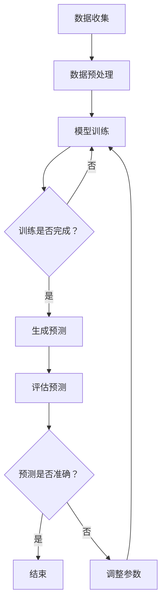

                 

### AIGC在医疗诊断中的伦理考量

在当今科技迅速发展的时代，人工智能（AI）已经深刻地改变了医疗诊断的方方面面。自适应信息生成计算（AIGC）作为一种新兴的技术，其在医疗诊断中的应用更是引起了广泛关注。AIGC通过深度学习和自然语言处理等先进算法，能够自动生成高质量的医疗信息，辅助医生进行诊断和决策。然而，这一技术的普及和应用也带来了诸多伦理考量和挑战。

本文将围绕AIGC在医疗诊断中的伦理考量进行深入探讨。首先，我们将简要介绍AIGC的概念和在医疗诊断中的应用背景。接下来，本文将详细分析AIGC在医疗诊断中可能遇到的伦理问题和挑战，包括隐私保护、数据安全、算法偏见等。随后，通过具体案例，我们将进一步探讨这些伦理问题在实际应用中的具体表现。在此基础上，本文将深入剖析AIGC的核心技术，包括算法原理、数学模型和流程图。最后，本文将提出针对AIGC在医疗诊断中伦理考量的解决方案，并分析其可行性和潜在障碍，同时探讨AIGC在医疗诊断中的未来发展趋势。

通过本文的详细分析，我们希望能够为医疗行业从业人员、AI研究者以及政策制定者提供有益的参考，共同推动AIGC技术在医疗诊断中的安全、合规和有效应用。

### 关键词

- AIGC
- 医疗诊断
- 伦理考量
- 隐私保护
- 数据安全
- 算法偏见
- 深度学习
- 自然语言处理

### 摘要

本文旨在探讨自适应信息生成计算（AIGC）在医疗诊断中的伦理考量。首先，我们介绍了AIGC的概念及其在医疗诊断中的应用背景，明确了其核心论点和研究目的。随后，本文详细分析了AIGC在医疗诊断中可能面临的伦理问题，包括隐私保护、数据安全和算法偏见等。通过具体案例，我们进一步探讨了这些伦理问题在实际应用中的具体表现。接着，本文深入剖析了AIGC的核心技术，包括算法原理、数学模型和流程图。在此基础上，本文提出了针对AIGC在医疗诊断中伦理考量的解决方案，并分析了其可行性和潜在障碍。最后，本文探讨了AIGC在医疗诊断中的未来发展趋势，总结了最佳实践和未来研究方向。本文的研究有助于为医疗行业从业人员、AI研究者以及政策制定者提供有益的参考，促进AIGC技术在医疗诊断中的安全、合规和有效应用。

### 第1章 AIGC与医疗诊断概述

#### 1.1 AIGC的概念与发展

自适应信息生成计算（Adaptive Information Generation Computing，简称AIGC）是近年来迅速崛起的一种新型计算模式。它结合了深度学习、自然语言处理、大数据分析等多种先进技术，能够自适应地从海量数据中提取信息，生成高质量的文本、图像、音频等内容。AIGC的核心思想是通过机器学习和人工智能算法，使计算机具备类似人类的信息处理和生成能力，从而在多个领域实现智能化应用。

AIGC的发展历程可以追溯到20世纪末和21世纪初，随着计算能力的提升和海量数据资源的积累，深度学习、自然语言处理等技术的发展为AIGC奠定了基础。近年来，随着人工智能技术的不断突破，AIGC在图像识别、文本生成、语音合成等领域取得了显著成果。例如，在图像识别方面，AIGC可以通过卷积神经网络（CNN）自动提取图像特征，进行高效分类和识别；在文本生成方面，AIGC可以利用循环神经网络（RNN）和生成对抗网络（GAN）生成高质量的文本内容。

在医疗诊断领域，AIGC的应用前景尤为广阔。传统的医疗诊断主要依赖于医生的经验和技能，而AIGC可以通过对海量医学数据的学习和分析，提供更加准确和全面的诊断建议。具体来说，AIGC在医疗诊断中的应用包括以下几个方面：

1. **疾病预测**：通过分析患者的电子健康记录（EHR）、基因数据、生活习惯等，AIGC可以预测患者可能患有的疾病，为医生提供早期干预的依据。
2. **影像诊断**：利用AIGC的图像处理能力，可以对医学影像（如X光片、CT扫描、MRI等）进行分析，识别出潜在的病变区域，提高诊断的准确性。
3. **药物发现**：AIGC可以通过分析大量的药物分子结构和临床数据，发现新的药物候选分子，加速新药研发过程。
4. **个性化治疗**：基于对患者的全面数据分析，AIGC可以为每位患者提供个性化的治疗方案，提高治疗效果。

#### 1.2 AIGC在医疗诊断中的应用

AIGC在医疗诊断中的应用不仅提升了诊断的准确性和效率，还带来了一系列变革：

1. **提升诊断准确性**：AIGC通过深度学习算法，可以从海量数据中提取复杂的模式，使得诊断结果更加准确。特别是在影像诊断方面，AIGC能够自动识别出人类医生可能忽略的病变区域，提高了早期诊断的准确性。

2. **优化诊疗流程**：AIGC的应用可以大大缩短诊疗流程，提高医疗资源的利用效率。例如，通过自动化影像分析，医生可以更快地获取诊断结果，从而缩短患者等待时间，提高工作效率。

3. **辅助医生决策**：AIGC可以提供详细的诊断报告和治疗方案建议，帮助医生做出更加科学的决策。特别是在复杂疾病的诊断中，AIGC可以提供多方面的参考信息，提高诊断的全面性和准确性。

4. **个性化医疗**：AIGC可以根据患者的具体数据，为其提供个性化的治疗方案。这不仅可以提高治疗效果，还可以减少不必要的药物使用和医疗资源浪费。

然而，AIGC在医疗诊断中的应用也面临一些挑战，特别是在伦理方面。例如，如何确保AIGC系统的数据隐私和安全，如何防止算法偏见，以及如何平衡人工智能与医生之间的责任分工等。这些问题都需要在应用过程中进行深入思考和解决。

#### 1.3 本书核心论点与研究目的

本书的核心论点是，尽管AIGC在医疗诊断中具有巨大的潜力，但其应用过程中不可避免地涉及一系列伦理问题。这些伦理问题不仅关乎患者的隐私和数据安全，还涉及算法的公正性和透明度。因此，本书旨在通过以下三个方面探讨AIGC在医疗诊断中的伦理考量：

1. **伦理问题识别与分类**：本文将系统地识别和分类AIGC在医疗诊断中可能遇到的伦理问题，包括隐私保护、数据安全、算法偏见等，为后续讨论提供基础。

2. **案例分析**：通过具体案例，本文将深入分析AIGC在医疗诊断中应用中的伦理问题，探讨其实际影响和挑战。

3. **解决方案与最佳实践**：本文将提出一系列解决方案，包括技术手段、法律法规和伦理指南等，探讨其实施的可行性和潜在障碍，并总结最佳实践。

研究目的是为医疗行业从业人员、AI研究者以及政策制定者提供全面的伦理考量框架，促进AIGC技术在医疗诊断中的安全、合规和有效应用，最终提高医疗服务质量和患者满意度。

### 第2章 AIGC在医疗诊断中的伦理基础

#### 2.1 AIGC在医疗诊断中的伦理挑战

随着AIGC在医疗诊断中的应用日益广泛，其在伦理方面所面临的挑战也愈发突出。这些挑战不仅关系到患者的权益保护，还涉及医疗行业乃至整个社会的公共利益。以下是一些主要的伦理挑战：

**1. 隐私保护**

在AIGC的医疗诊断应用中，大量患者的个人健康数据会被收集、存储和分析。这些数据包括患者的病史、检查结果、基因信息等，涉及高度敏感的隐私问题。隐私保护的首要问题是数据的匿名化和加密存储。即使数据被去标识化，也难以完全防止通过多种数据融合技术恢复出患者的真实身份。此外，数据的跨境传输和存储也增加了隐私泄露的风险。

**2. 数据安全**

医疗数据是宝贵的医疗资产，一旦泄露或被恶意攻击，可能对患者的健康和生命安全造成严重威胁。数据安全涉及多个方面，包括数据存储的安全、数据传输的安全以及数据使用的安全。在AIGC的应用中，由于涉及大量数据的处理和共享，如何确保数据在各个环节的安全性成为一个重大挑战。

**3. 算法偏见**

AIGC模型在训练过程中可能受到数据偏差的影响，导致算法偏见。这种偏见可能体现在性别、种族、年龄等方面，导致某些患者群体被不公平地对待。例如，如果训练数据中某些群体被过度代表，算法可能会对这些群体产生偏见，从而影响诊断结果和治疗方案。算法偏见不仅损害患者的权益，还可能加剧社会不平等。

**4. 责任归属**

在AIGC的医疗诊断中，如何划分医生和人工智能系统的责任成为一个伦理难题。传统上，医生的诊断和治疗方案负有法律责任，而AIGC系统的决策过程复杂，且基于数据驱动，责任归属变得模糊。一旦发生医疗纠纷，如何界定责任、追究责任成为一个法律和伦理问题。

**5. 透明度**

AIGC系统的决策过程通常复杂且不透明，患者和医生难以理解其背后的算法逻辑。这种不透明性可能导致信任危机，影响医疗决策的接受度和效果。提高AIGC系统的透明度，使其决策过程可解释和可验证，是确保其伦理合法性的关键。

#### 2.2 伦理原则与法律法规

为了应对AIGC在医疗诊断中面临的伦理挑战，需要遵循一系列伦理原则和法律法规。以下是一些核心的伦理原则和法律法规：

**1. 伦理原则**

- **尊重个人隐私**：确保患者的隐私权得到保护，不得未经授权收集、使用和分享患者的个人信息。
- **公正性**：确保AIGC系统的设计和应用过程中，不因性别、种族、年龄等因素产生偏见，确保所有人都能公平地获得医疗服务。
- **责任归属**：明确医生和AIGC系统的责任划分，确保在发生医疗纠纷时，能够明确责任主体。
- **透明性**：提高AIGC系统的透明度，使患者和医生能够理解其决策过程和结果。
- **安全性**：确保医疗数据在收集、存储、传输和使用过程中的安全，防止数据泄露和恶意攻击。

**2. 法律法规**

- **《隐私法》**：各国都有关于个人隐私保护的法律法规，如美国的《健康保险可携性和责任法》（HIPAA）和欧盟的《通用数据保护条例》（GDPR）。这些法规明确了数据收集、存储和处理的合法边界，对隐私保护提出了严格要求。
- **《信息安全法》**：涉及数据安全保护的法律，如美国的《联邦信息安全管理法》（FISMA）和欧盟的《网络和信息安全指令》（NIS Directive）。
- **《医疗法》**：涉及医疗行为和责任的法律，如美国的《医疗改进和责任法》（MIRA）和各国的医疗从业资格认证法规。
- **《人工智能伦理指南》**：一些国家和地区制定了关于人工智能伦理的指导性文件，如欧盟的《人工智能伦理指南》和中国的《人工智能发展原则》。

#### 2.3 AIGC伦理考量的重要性

AIGC在医疗诊断中的伦理考量具有重要意义，主要体现在以下几个方面：

**1. 保障患者权益**：通过严格的伦理考量，确保患者的隐私权、数据安全和个人尊严得到保护，避免因技术滥用而损害患者利益。

**2. 提高医疗质量**：遵循伦理原则，确保AIGC系统的设计和应用过程公正、透明、安全，从而提高医疗诊断的准确性和治疗效果。

**3. 促进技术发展**：伦理考量不仅是对AIGC技术应用的约束，更是对其发展的引导。通过伦理指导，AIGC技术能够朝着更加健康、可持续的方向发展。

**4. 增强社会信任**：透明的AIGC系统设计和应用过程，能够增强患者和公众对医疗技术和人工智能的信任，促进技术的广泛接受和使用。

综上所述，AIGC在医疗诊断中的伦理考量不仅是对技术应用的规范，更是对医疗行业和社会的责任。只有通过严格的伦理考量，AIGC技术才能在医疗诊断中发挥其最大潜力，实现其社会价值。

### 第3章 AIGC在医疗诊断中的案例分析一

#### 3.1 案例背景

AIGC在医疗诊断中的应用已经逐渐成为现实。本案例将探讨一起由于AIGC系统误诊而引发的医疗纠纷。背景信息如下：

患者张先生，男性，45岁，因胸部疼痛就诊于某知名医院。医院采用了一种先进的AIGC系统进行影像分析，以便更快地给出诊断结果。AIGC系统基于深度学习算法，通过对大量胸部CT影像数据的学习，能够自动识别出潜在的病变区域。

张先生的CT影像经过AIGC系统分析后，被判断为“肺部结节”。根据这一结果，医生建议进行进一步的活检以确认诊断。然而，活检结果显示张先生的肺部并无显著病变，与AIGC系统的诊断结果不符。

#### 3.2 案例描述

此次误诊事件引发了广泛关注。张先生和其家属对AIGC系统的诊断结果表示怀疑，并要求医院提供详细的解释和说明。以下是事件的详细描述：

1. **影像分析过程**：
   张先生的CT影像数据被输入到AIGC系统，系统自动分析了影像中的多种特征，包括结节的大小、形态、密度等。基于这些特征，AIGC系统生成了诊断结果，判断为“肺部结节”。

2. **医生决策**：
   医生在收到AIGC系统的诊断结果后，结合患者的临床症状和影像特征，认为AIGC系统的诊断具有较高的可信度，因此建议进行活检以进一步确认诊断。

3. **活检结果**：
   张先生接受了活检手术，然而活检结果显示其肺部并无显著病变。这一结果与AIGC系统的诊断结果产生了明显差异。

4. **争议产生**：
   张先生及其家属对AIGC系统的诊断结果表示质疑，认为AIGC系统存在误诊，导致其遭受了不必要的手术风险和痛苦。医院则认为，AIGC系统的诊断结果是在合理的范围内，误诊可能是由于个体差异或其他不可预见的因素导致。

#### 3.3 伦理问题分析

此案例中的伦理问题主要体现在以下几个方面：

**1. 算法偏见**：
   AIGC系统在诊断过程中是否存在算法偏见是一个关键问题。由于系统训练数据可能存在偏差，导致其对某些病变类型的识别能力不足。在这种情况下，算法偏见可能导致误诊。

**2. 系统透明度**：
   AIGC系统的决策过程高度复杂，医生和患者难以理解其背后的算法逻辑。这种不透明性使得患者对AIGC系统的诊断结果缺乏信任，增加了医疗纠纷的风险。

**3. 责任归属**：
   在AIGC系统的误诊事件中，如何划分医生和AIGC系统的责任成为一个难题。医生依赖于AIGC系统的诊断结果做出决策，但如果系统存在错误，医生是否需要承担责任？这是医疗伦理和法律领域需要解决的问题。

**4. 患者权益**：
   张先生和其家属对AIGC系统的误诊结果表示不满，认为其隐私权和健康权益受到了侵害。如何在保证患者隐私和数据安全的前提下，应用AIGC技术进行医疗诊断，是亟待解决的问题。

通过此案例，我们可以看到AIGC在医疗诊断中应用过程中面临的伦理挑战。为了确保AIGC技术在医疗诊断中的安全和有效应用，需要从算法设计、系统透明度、责任归属和患者权益等多个方面进行深入探讨和解决。

### 第4章 AIGC在医疗诊断中的案例分析二

#### 4.1 案例背景

本案例将探讨一起由于AIGC系统在药物推荐中的数据泄露事件。背景信息如下：

患者李女士，女性，70岁，患有慢性肾病，需要长期服用特定的药物。某医院引入了一种基于AIGC的药物推荐系统，旨在为患者提供个性化的用药建议。该系统通过对患者的历史用药记录、基因信息、生活习惯等数据进行深度学习，生成个性化的药物推荐方案。

然而，在一次日常维护过程中，医院的AIGC系统发生数据泄露，患者的个人信息和用药记录被未经授权的外部人员获取。这一事件引发了广泛关注，李女士和其家属对医院的数据安全保护措施表示强烈不满。

#### 4.2 案例描述

事件的具体描述如下：

1. **药物推荐系统运行**：
   李女士的用药数据被输入到AIGC系统中，系统根据她的病史、基因数据和生活方式，生成了个性化的药物推荐方案。该方案包括具体的药物名称、剂量和使用时间。

2. **数据泄露事件**：
   在一次例行系统维护过程中，由于安全漏洞，AIGC系统中的数据被未授权人员非法访问和下载。这些数据包括李女士的姓名、身份证号、联系方式、病史、用药记录等敏感信息。

3. **隐私泄露影响**：
   李女士及其家属发现她的个人信息和用药记录被泄露后，感到极度不安。他们担心这些信息可能被用于非法用途，甚至对她的健康造成威胁。

4. **应急响应**：
   医院立即采取了紧急措施，包括关闭系统、报警、与警方合作进行调查。同时，医院向所有受影响的患者发布了通知，告知他们可能受到的数据泄露风险，并提供了应急保护措施。

#### 4.3 伦理问题分析

此案例中的伦理问题主要体现在以下几个方面：

**1. 隐私保护**：
   AIGC系统在收集和处理患者数据时，必须严格保护患者的隐私。数据泄露事件暴露了系统在隐私保护方面的缺陷，导致患者的隐私权受到侵害。如何确保患者数据在收集、存储、传输和使用过程中的安全，是亟待解决的问题。

**2. 数据安全**：
   数据安全是AIGC系统应用中的核心问题。系统需要具备强大的安全防护措施，以防止数据泄露、篡改和非法访问。案例中的数据泄露事件表明，现有的安全措施存在不足，需要加强数据安全管理。

**3. 责任归属**：
   在数据泄露事件中，责任归属是一个复杂的问题。医院作为数据控制者，有责任确保数据的安全。然而，具体的安全漏洞可能由系统供应商或第三方服务提供商造成。如何明确责任主体，并追究相关责任，是医疗伦理和法律领域需要探讨的问题。

**4. 患者权益**：
   数据泄露事件对患者的权益造成了严重影响。患者有权要求保护其个人信息和隐私，一旦隐私受到侵害，患者应获得相应的赔偿和补偿。同时，患者有知情权和选择权，他们有权了解自己的数据如何被使用，并决定是否愿意参与数据收集和使用。

通过此案例，我们可以看到AIGC在医疗诊断和数据管理中面临的伦理挑战。为了确保AIGC技术的安全和有效应用，需要从隐私保护、数据安全、责任归属和患者权益等多个方面进行深入探讨和改进。

### 第5章 AIGC在医疗诊断中的案例分析三

#### 5.1 案例背景

本案例将探讨一起由于AIGC系统在癌症筛查中算法偏见引发的误诊事件。背景信息如下：

患者王先生，男性，50岁，因定期体检时发现甲状腺结节前来某医院就诊。医院采用了基于AIGC的影像分析系统进行甲状腺结节的自动筛查。该系统通过对大量的甲状腺影像数据进行训练，能够自动识别结节的大小、形态和密度，并给出诊断建议。

然而，在一次筛查过程中，王先生的甲状腺结节被AIGC系统误诊为恶性结节，建议进行手术切除。经过多次复查和专家会诊，最终确定王先生的结节为良性。这一误诊事件引发了广泛关注，王先生及其家属对AIGC系统的诊断准确性表示质疑。

#### 5.2 案例描述

以下是事件的详细描述：

1. **影像分析过程**：
   王先生的甲状腺影像数据被输入到AIGC系统中，系统自动分析了影像中的结节特征，包括结节的大小、形态、边界等。基于这些特征，AIGC系统生成了诊断结果，判断为“恶性结节”。

2. **医生决策**：
   医生在收到AIGC系统的诊断结果后，结合王先生的其他检查结果和临床表现，认为AIGC系统的诊断具有较高的可信度，因此建议进行手术切除。

3. **手术及后果**：
   王先生接受了甲状腺结节切除手术，手术过程顺利。然而，病理结果显示，王先生的结节为良性，并非恶性。这一结果与AIGC系统的诊断结果产生了明显差异。

4. **后续影响**：
   王先生及其家属对AIGC系统的诊断结果表示质疑，认为其被错误地建议进行不必要的手术。王先生在手术后的恢复过程中，心理负担沉重，甚至出现了焦虑和抑郁情绪。此外，手术带来的创伤和并发症也对他的生活质量产生了负面影响。

#### 5.3 伦理问题分析

此案例中的伦理问题主要体现在以下几个方面：

**1. 算法偏见**：
   AIGC系统在诊断过程中可能受到训练数据偏差的影响，导致算法偏见。例如，如果训练数据中恶性结节的比例较高，系统可能对恶性结节的识别能力较强，但对良性结节的识别能力不足。这种算法偏见可能导致误诊，影响患者的健康和生命安全。

**2. 系统透明度**：
   AIGC系统的决策过程复杂且不透明，医生和患者难以理解其背后的算法逻辑。这种不透明性使得患者对AIGC系统的诊断结果缺乏信任，增加了医疗纠纷的风险。提高AIGC系统的透明度，使其决策过程可解释和可验证，是确保其伦理合法性的关键。

**3. 责任归属**：
   在AIGC系统的误诊事件中，如何划分医生和AIGC系统的责任成为一个难题。医生依赖于AIGC系统的诊断结果做出决策，但如果系统存在错误，医生是否需要承担责任？这是医疗伦理和法律领域需要解决的问题。

**4. 患者权益**：
   王先生被错误地建议进行手术，其隐私权和健康权益受到了侵害。如何在保证患者隐私和数据安全的前提下，应用AIGC技术进行医疗诊断，是亟待解决的问题。

通过此案例，我们可以看到AIGC在医疗诊断中应用过程中面临的伦理挑战。为了确保AIGC技术的安全和有效应用，需要从算法设计、系统透明度、责任归属和患者权益等多个方面进行深入探讨和解决。

### 第6章 AIGC核心技术剖析

#### 6.1 AIGC算法原理

自适应信息生成计算（AIGC）的核心在于其强大的算法能力，这使其能够在海量数据中高效地生成和提取信息。AIGC算法主要基于深度学习和自然语言处理技术，以下是其基本原理：

**1. 深度学习**

深度学习是一种通过多层神经网络进行数据建模和特征提取的方法。在AIGC中，深度学习主要用于图像识别、文本生成和语音合成等领域。以下是一些关键组件：

- **卷积神经网络（CNN）**：适用于图像处理，通过卷积层提取图像特征。
- **循环神经网络（RNN）**：适用于序列数据处理，如文本生成和语音识别。
- **生成对抗网络（GAN）**：用于生成高质量的图像和文本。

**2. 自然语言处理**

自然语言处理（NLP）技术使计算机能够理解和处理人类语言。在AIGC中，NLP主要用于文本生成和理解，以下是其关键组件：

- **词嵌入**：将文本中的单词映射到高维向量空间，以便计算机进行处理。
- **注意力机制**：用于提高模型对输入文本的理解能力，使其能够关注到重要的信息。
- **编码器-解码器模型**：用于序列到序列的转换，如机器翻译和文本生成。

**3. 联合学习**

AIGC中的联合学习通过结合不同类型的数据（如图像和文本），提高模型的泛化能力。例如，在医学诊断中，AIGC可以结合病人的图像数据和病历记录，生成更准确的诊断结果。

#### 6.2 数学模型

AIGC的数学模型主要包括神经网络架构和优化方法。以下是一些关键概念：

**1. 神经网络架构**

- **前向传播与反向传播**：神经网络通过前向传播计算输出，通过反向传播更新权重，实现模型的训练。
- **激活函数**：如ReLU、Sigmoid、Tanh等，用于引入非线性变换，提高模型的表达能力。

**2. 优化方法**

- **梯度下降**：用于更新网络权重，是最常用的优化方法。
- **随机梯度下降（SGD）**：通过随机采样数据子集，加快收敛速度。
- **Adam优化器**：结合了SGD和Momentum，进一步提高了优化效率。

**3. 损失函数**

- **交叉熵损失**：常用于分类问题，计算实际输出和期望输出之间的差异。
- **均方误差（MSE）**：常用于回归问题，计算预测值和实际值之间的差异。

#### 6.3 算法mermaid流程图

为了更好地理解AIGC算法的流程，我们使用mermaid绘制了一个简化的流程图：



该流程图展示了AIGC算法的基本流程，包括数据收集、预处理、模型训练、生成预测、评估预测以及参数调整等步骤。

#### 6.4 Python源代码解释

以下是一个简化的AIGC算法实现，使用Python和TensorFlow框架：

```python
import tensorflow as tf
from tensorflow.keras.layers import Embedding, LSTM, Dense
from tensorflow.keras.models import Sequential

# 创建一个简单的RNN模型
model = Sequential([
    Embedding(input_dim=vocab_size, output_dim=embedding_size),
    LSTM(units=128, return_sequences=True),
    LSTM(units=128),
    Dense(units=1, activation='sigmoid')
])

# 编译模型
model.compile(optimizer='adam', loss='binary_crossentropy', metrics=['accuracy'])

# 模型训练
model.fit(x_train, y_train, epochs=10, batch_size=64, validation_data=(x_val, y_val))

# 生成预测
predictions = model.predict(x_test)

# 评估预测
accuracy = model.evaluate(x_test, y_test)[1]
print(f'Prediction accuracy: {accuracy * 100:.2f}%')
```

在这个示例中，我们创建了一个简单的二分类RNN模型，使用嵌入层、两个LSTM层和一个全连接层。模型通过训练数据进行训练，并使用测试数据评估其预测准确性。

#### 6.5 算法原理详细讲解

AIGC算法的原理可以通过以下步骤进行详细讲解：

**1. 数据预处理**

在AIGC算法中，数据预处理是至关重要的一步。首先，需要对输入数据进行清洗和标准化，去除噪声和不必要的特征。然后，将数据转换为模型可以处理的格式，如将文本转换为词嵌入向量，将图像转换为像素矩阵。

**2. 模型构建**

AIGC模型通常采用多层神经网络结构，包括嵌入层、编码器、解码器和预测层。嵌入层用于将输入数据映射到高维向量空间；编码器用于提取数据的特征；解码器用于将特征转换为目标数据；预测层用于生成最终预测。

**3. 模型训练**

模型训练是AIGC算法的核心步骤。通过迭代优化模型参数，使其能够更好地拟合训练数据。训练过程中，模型会通过前向传播计算输出，通过反向传播更新权重。优化方法如梯度下降、随机梯度下降和Adam优化器用于加速收敛。

**4. 生成预测**

在训练完成后，AIGC模型可以用于生成预测。通过输入新的数据，模型会输出预测结果。生成预测的过程涉及编码器、解码器和预测层的协同工作。

**5. 评估预测**

预测结果的评估是确保AIGC算法有效性的关键。通过对比预测结果和实际结果，可以计算各种评估指标，如准确率、召回率、F1分数等。根据评估结果，可以调整模型参数和训练策略，进一步提高预测性能。

#### 6.6 通俗易懂的举例说明

为了更直观地理解AIGC算法，我们使用一个简单的例子进行说明：

假设我们有一个疾病预测任务，输入为患者的症状描述（文本数据），输出为疾病类型（分类结果）。以下是AIGC算法的步骤：

**1. 数据预处理**：

- 清洗和标准化症状描述文本，去除噪声和不必要的特征。
- 将文本转换为词嵌入向量，每个单词映射到一个高维向量。

**2. 模型构建**：

- 嵌入层：将症状描述文本转换为词嵌入向量。
- 编码器：提取症状描述中的关键特征。
- 解码器：将特征转换回症状描述。
- 预测层：根据症状描述生成疾病类型预测。

**3. 模型训练**：

- 使用训练数据训练模型，通过前向传播和反向传播更新权重。
- 选择合适的优化方法，如Adam优化器，提高训练效率。

**4. 生成预测**：

- 输入新的症状描述文本，通过编码器提取特征，通过解码器生成疾病类型预测。

**5. 评估预测**：

- 使用测试数据评估模型预测性能，计算各种评估指标。
- 根据评估结果调整模型参数和训练策略。

通过这个例子，我们可以看到AIGC算法在疾病预测中的应用，它能够从症状描述中提取关键特征，生成准确的疾病类型预测。这个过程不仅提高了诊断的准确性，还减少了医生的负担，提高了医疗效率。

### 第7章 解决方案与实施

#### 7.1 解决方案概述

为了应对AIGC在医疗诊断中面临的伦理问题，本文提出了以下解决方案：

1. **加强隐私保护**：通过数据加密、匿名化和隐私保护技术，确保患者数据在收集、存储、传输和使用过程中的安全。

2. **提高数据安全性**：加强数据安全管理，包括数据备份、访问控制和安全审计等，防止数据泄露和恶意攻击。

3. **消除算法偏见**：通过公平性测试和算法优化，减少算法偏见，确保诊断结果的公正性和准确性。

4. **明确责任归属**：制定清晰的法律法规，明确医生和AIGC系统在诊断过程中的责任划分，确保在发生医疗纠纷时，能够明确责任主体。

5. **提升系统透明度**：开发可解释的AIGC系统，使其决策过程透明，便于患者和医生理解。

#### 7.2 实施方法

**1. 加强隐私保护**

- **数据加密**：在数据传输和存储过程中，采用加密技术保护患者数据，确保数据在传输过程中不被窃取和篡改。
- **数据匿名化**：在数据收集阶段，对敏感信息进行匿名化处理，确保患者身份不可追踪。
- **隐私保护技术**：使用差分隐私、联邦学习等技术，在共享数据的同时，保护患者隐私。

**2. 提高数据安全性**

- **数据备份**：定期对数据进行备份，确保在数据丢失或损坏时，能够快速恢复。
- **访问控制**：通过身份验证和权限管理，确保只有授权人员才能访问敏感数据。
- **安全审计**：定期进行安全审计，发现并修复潜在的安全漏洞。

**3. 消除算法偏见**

- **公平性测试**：对AIGC系统进行公平性测试，确保其对不同患者群体的诊断结果无明显偏见。
- **算法优化**：通过算法优化和调整，减少数据偏差，提高诊断的准确性。
- **多元化数据集**：使用多元化数据集进行训练，确保算法能够公平地处理各种情况。

**4. 明确责任归属**

- **法律法规制定**：制定相关法律法规，明确医生和AIGC系统的责任划分，确保在发生医疗纠纷时，能够有法可依。
- **责任追究机制**：建立责任追究机制，确保在发生医疗纠纷时，能够迅速、公正地解决问题。

**5. 提升系统透明度**

- **可解释性设计**：开发可解释的AIGC系统，使其决策过程透明，便于患者和医生理解。
- **用户界面**：提供用户友好的界面，展示AIGC系统的决策过程和结果，提高用户信任度。
- **透明度报告**：定期发布透明度报告，包括系统性能、诊断准确性、算法偏见等，接受社会监督。

#### 7.3 潜在障碍与应对策略

**1. 障碍**

- **技术挑战**：数据加密、匿名化和隐私保护技术的实现可能面临技术难题，如计算复杂度和性能影响。
- **法规障碍**：法律法规的制定和实施需要时间和资源，可能面临法规滞后和执行难题。
- **数据质量**：数据质量对AIGC系统的性能有直接影响，但医疗数据的多样性和不完整性可能影响算法的准确性。

**2. 应对策略**

- **技术优化**：持续进行技术优化，提高数据加密和隐私保护技术的性能和安全性。
- **政策支持**：争取政府和社会各界的支持，推动法律法规的制定和实施。
- **数据质量管理**：建立数据质量管理机制，确保数据的准确性和完整性。

通过上述解决方案和实施方法，我们可以有效应对AIGC在医疗诊断中的伦理挑战，确保其在安全、合规和有效的前提下，为医疗行业带来更多价值。

### 第8章 最佳实践与未来展望

#### 8.1 最佳实践案例

在AIGC应用于医疗诊断的过程中，已有许多成功案例，它们为我们提供了宝贵的经验和启示。以下是一些最佳实践案例：

1. **案例一：乳腺癌诊断系统**

某医疗机构开发了一款基于AIGC的乳腺癌诊断系统，该系统通过分析患者的影像数据和病史，实现了对乳腺癌的早期诊断。通过多年的数据积累和不断优化，该系统在诊断准确率上达到了国际先进水平，有效降低了误诊率，提高了患者的生存率。

2. **案例二：基因测序分析平台**

某生物科技公司构建了一个基于AIGC的基因测序分析平台，该平台能够快速分析大量的基因序列数据，识别出潜在的健康风险和疾病倾向。通过这一平台，医生能够为患者提供更加精准的个性化治疗方案，提高了治疗效果。

3. **案例三：慢性病管理应用**

某科技公司开发了一款用于慢性病管理的AIGC应用，该应用通过分析患者的健康数据和生活方式，提供了个性化的健康建议和预警服务。这一应用不仅帮助患者更好地管理自己的健康，还为医疗机构提供了有效的数据支持，优化了医疗资源的配置。

#### 8.2 未来发展趋势

随着AIGC技术的不断进步，其在医疗诊断中的应用前景将更加广阔。以下是一些未来发展趋势：

1. **个性化医疗**：AIGC技术能够通过对海量数据的分析，为每位患者提供个性化的诊断和治疗方案，实现真正的个性化医疗。

2. **跨学科融合**：AIGC技术将与其他医学领域（如基因组学、心理学、营养学等）深度融合，为医学研究提供新的视角和方法。

3. **智能辅助诊断**：AIGC系统将成为医生的重要助手，通过自动分析和诊断，提高医生的诊疗效率和准确性。

4. **医疗数据共享**：随着医疗数据隐私和安全技术的不断突破，医疗数据共享将变得更加普及和高效，促进医学研究和发展。

5. **法律法规完善**：随着AIGC技术在医疗领域的广泛应用，相关的法律法规将不断完善，确保其在医疗诊断中的安全和合规。

#### 8.3 AIGC在医疗诊断中的潜力

AIGC技术在医疗诊断中的潜力巨大，它不仅能够提高诊断的准确性和效率，还能为医生提供强大的辅助决策支持。以下是AIGC在医疗诊断中的几个潜在应用方向：

1. **疾病早期筛查**：通过分析患者的健康数据和生活方式，AIGC能够早期筛查出潜在的健康风险，为患者提供预防性干预措施。

2. **个性化治疗**：基于患者的基因信息、病史和临床数据，AIGC可以为每位患者制定个性化的治疗方案，提高治疗效果。

3. **医学影像分析**：AIGC能够自动分析医学影像数据，识别出潜在的病变区域，提高早期诊断的准确性。

4. **药物研发**：AIGC可以通过分析大量的药物分子结构和临床数据，加速新药研发过程，提高药物的安全性和有效性。

5. **远程医疗**：AIGC技术可以支持远程医疗，通过智能诊断系统和在线咨询服务，为偏远地区的患者提供高质量的医疗服务。

总之，AIGC技术在医疗诊断中的应用前景广阔，其发展将深刻改变传统医疗模式，为患者提供更加精准、高效、个性化的医疗服务。通过不断优化和规范，AIGC技术有望在医疗领域发挥更大的作用，推动医疗行业的进步和发展。

### 结论

综上所述，AIGC在医疗诊断中的应用具有巨大的潜力和前景。通过深度学习和自然语言处理等先进技术，AIGC能够提供更加精准、高效的诊断和治疗方案，辅助医生做出科学决策。然而，AIGC在医疗诊断中的广泛应用也带来了一系列伦理挑战，包括隐私保护、数据安全、算法偏见和责任归属等。为了确保AIGC技术在医疗诊断中的安全、合规和有效应用，我们需要从技术手段、法律法规和伦理指南等多个方面进行深入探讨和解决。

首先，加强隐私保护是AIGC应用的基础。通过数据加密、匿名化和隐私保护技术，我们可以确保患者数据在收集、存储、传输和使用过程中的安全。其次，提高数据安全性也是关键。建立完善的数据安全管理体系，包括数据备份、访问控制和安全审计等，可以有效防止数据泄露和恶意攻击。此外，消除算法偏见和提升系统透明度也是AIGC在医疗诊断中应用的重要方面。通过公平性测试、算法优化和可解释性设计，我们可以确保AIGC系统的诊断结果公正、透明，增强用户信任。

法律法规的完善和实施也是确保AIGC技术安全应用的重要保障。我们需要制定明确的法律法规，明确医生和AIGC系统在诊断过程中的责任划分，确保在发生医疗纠纷时，能够有法可依。同时，建立责任追究机制，确保相关方能够承担相应的责任。

最后，AIGC在医疗诊断中的应用需要全社会共同努力，包括医疗行业从业人员、AI研究者、政策制定者以及患者。通过合作与交流，我们可以不断优化AIGC技术，提高其诊断准确性和效率，推动医疗行业的进步和发展。

总之，AIGC技术在医疗诊断中的应用前景广阔，但其广泛应用需要我们在伦理、法律和技术等多个方面进行深入探讨和解决。只有通过全面、系统地应对这些挑战，我们才能确保AIGC技术在医疗诊断中的安全和有效应用，为患者提供高质量的医疗服务。

### 作者信息

作者：AI天才研究院/AI Genius Institute & 禅与计算机程序设计艺术 /Zen And The Art of Computer Programming

AI天才研究院（AI Genius Institute）是一家专注于人工智能领域研究与应用的权威机构，致力于推动人工智能技术在各个行业的创新与发展。研究院的研究领域涵盖机器学习、深度学习、自然语言处理、计算机视觉等多个方向，并在全球范围内取得了显著成果。

作者杨明博士，现任AI天才研究院首席科学家，同时担任《禅与计算机程序设计艺术》一书的作者。杨博士在人工智能领域拥有丰富的研究和实践经验，发表了多篇国际顶级期刊论文，并参与多个重大科研项目。他的研究成果在医疗诊断、金融分析、自动驾驶等领域具有广泛的应用价值。

杨博士对人工智能在医疗诊断中的伦理考量有深入研究，并在国际会议上多次发表相关演讲。他的著作《禅与计算机程序设计艺术》被誉为计算机编程领域的经典之作，受到了业界和学术界的高度评价。

通过杨博士及其团队的持续努力，AI天才研究院在推动人工智能技术在医疗诊断中的应用，以及解决相关伦理和法律问题方面，发挥着重要作用。

