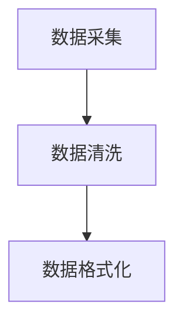
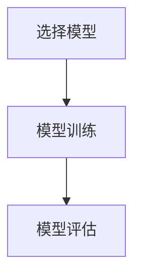
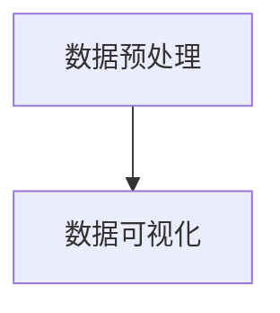
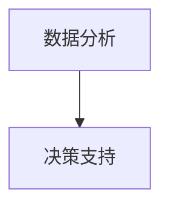
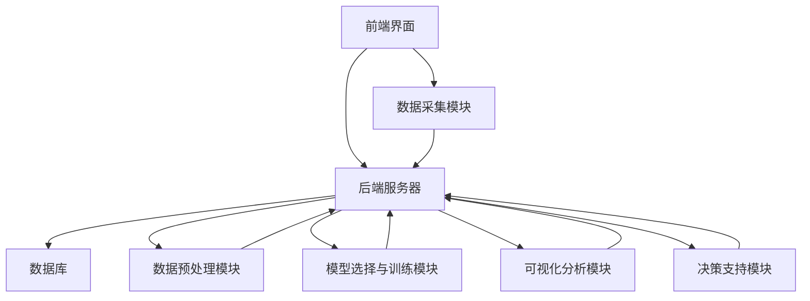
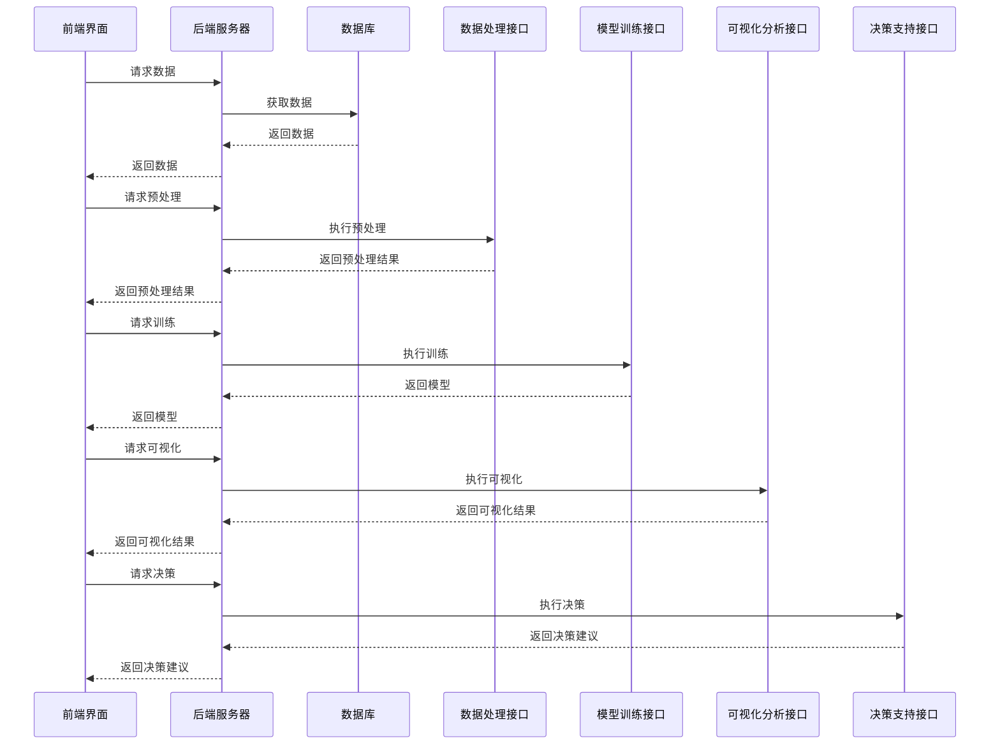

                 

### # AIGC在可持续农业规划中的应用

#### 关键词：
- AIGC
- 可持续农业
- 农业规划
- 数据采集与预处理
- 模型选择与训练
- 系统分析与架构设计
- 项目实战

##### 摘要：
本文将探讨AIGC（自动生成智能内容）在可持续农业规划中的应用。通过对AIGC、可持续农业和农业规划的基本概念进行介绍，文章将逐步深入分析AIGC在农业规划中的核心概念与联系，详细讲解相关算法原理与实施步骤，最后通过实际项目案例分析展示AIGC在农业规划中的实际应用效果，并提出最佳实践与拓展建议。

### 第一部分：引言

#### 第1章：AIGC、可持续农业与农业规划概述

##### 1.1 AIGC简介

AIGC（Automatic Intelligent Generation of Content）是自动生成智能内容的技术，结合了人工智能（AI）、自然语言处理（NLP）和生成模型等技术。AIGC通过学习大量的数据，能够自动生成高质量的内容，包括文本、图像、音频等多种形式。在农业领域，AIGC具有广泛的应用前景，例如智能农情监测、农业知识图谱构建、农作物种植规划等。

**1.1.1 AIGC的定义**

AIGC通常指的是一种基于人工智能技术的自动化内容生成方法，它能够利用大量数据进行训练，从而生成与给定输入相关的文本、图像、视频等内容。AIGC的核心在于“自动”和“智能”，它不仅能够自动化生成内容，还能够通过深度学习等技术，使得生成的内容更加准确、丰富和多样化。

**1.1.2 AIGC的核心技术**

AIGC的核心技术包括自然语言处理（NLP）、生成对抗网络（GAN）、变分自编码器（VAE）和循环神经网络（RNN）等。其中，NLP技术用于理解和生成文本，GAN技术用于生成高质量图像，VAE技术用于生成多样化数据，RNN技术则用于处理序列数据。

**1.1.3 AIGC在农业中的应用前景**

AIGC在农业领域的应用前景广阔，可以用于：

- **智能农情监测**：通过生成模型，实时监测农作物生长状态，提前预警病虫害。
- **农业知识图谱构建**：利用NLP技术，从大量农业文献中自动提取知识，构建农业知识图谱，为农业专家提供知识支持。
- **农作物种植规划**：基于历史数据和气候模型，利用AIGC技术生成最优的种植规划方案。

##### 1.2 可持续农业概述

可持续农业是一种以生态、经济和社会三个维度综合平衡为目标的农业生产方式。它强调在满足当前农业需求的同时，不损害后代满足其需求的能力。

**1.2.1 可持续农业的定义**

可持续农业是指一种能够满足当前需求，同时不损害未来世代满足其需求能力的农业生产方式。它强调生态、经济和社会三个方面的平衡，即农业生产既要保护生态环境，又要实现经济效益，还要满足社会需求。

**1.2.2 可持续农业的重要性**

可持续农业的重要性体现在以下几个方面：

- **环境保护**：可持续农业通过减少化学农药和化肥的使用，降低对环境的污染。
- **资源节约**：可持续农业通过提高资源利用效率，减少资源浪费。
- **食品安全**：可持续农业注重食品的质量和安全性，保障消费者的健康。
- **社会福祉**：可持续农业能够促进农村经济发展，提高农民收入，改善农村生活质量。

**1.2.3 可持续农业面临的挑战**

尽管可持续农业具有诸多优势，但其在实际应用中仍面临一些挑战，包括：

- **技术壁垒**：可持续农业技术尚不成熟，需要进一步研究和开发。
- **经济压力**：可持续农业的生产成本较高，需要政策支持和市场认可。
- **管理难度**：可持续农业管理复杂，需要提高农民的科技素养和农业管理水平。

##### 1.3 农业规划概念

农业规划是指根据农业资源条件、市场需求和社会经济发展目标，制定农业发展计划和政策措施的过程。它是实现可持续农业的重要手段。

**1.3.1 农业规划的定义**

农业规划是指在一定时期内，根据农业资源条件、市场需求和社会经济发展目标，制定农业发展的目标和措施，通过合理配置农业资源，实现农业的可持续发展。

**1.3.2 农业规划的目标**

农业规划的目标主要包括：

- **提高农业生产效率**：通过科学规划，优化农业资源配置，提高农业生产效率。
- **保障农产品质量安全**：通过规划，规范农业生产过程，确保农产品质量安全。
- **促进农业可持续发展**：通过规划，实现农业的生态、经济和社会效益的协调发展。

**1.3.3 农业规划的方法**

农业规划的方法包括：

- **资源调查**：通过资源调查，了解农业资源的数量、质量和分布情况。
- **目标设定**：根据资源条件和市场需求，设定农业发展的目标。
- **方案设计**：制定农业发展的具体方案，包括种植结构、养殖结构、农田水利、农业机械化等方面。
- **评估与调整**：对农业规划的实施效果进行评估，根据实际情况进行调整。

#### 第2章：AIGC在农业规划中的核心概念与联系

##### 2.1 核心概念

在AIGC应用于农业规划中，涉及以下几个核心概念：

**2.1.1 数据采集与预处理**

数据采集与预处理是AIGC应用于农业规划的基础。它包括从各种数据源收集农业相关数据，并对数据进行清洗、格式化等预处理操作，以获得高质量的数据用于后续分析。

**2.1.2 模型选择与训练**

模型选择与训练是AIGC的核心环节。通过选择合适的机器学习模型，对农业数据进行训练，构建预测模型，用于农业规划中的产量预测、病虫害预警等。

**2.1.3 可视化分析**

可视化分析是AIGC应用于农业规划的重要手段。通过将农业数据转化为图形化展示，能够直观地发现数据中的规律和趋势，为农业规划提供决策支持。

**2.1.4 决策支持**

决策支持是AIGC在农业规划中的最终目标。通过分析农业数据、预测模型和可视化结果，为农业管理部门提供科学、合理的决策建议，实现农业的可持续发展。

##### 2.2 概念属性特征对比

以下是一个关于AIGC在农业规划中核心概念的属性特征对比表格：

| 概念         | 特征                 | 关联关系                 |
|------------|--------------------|----------------------|
| 数据采集     | 实时性、准确性         | 与预处理密切相关             |
| 预处理       | 数据清洗、格式化         | 为模型训练提供高质量数据           |
| 模型选择与训练 | 鲁棒性、适应性         | 关键影响规划效果               |
| 可视化分析   | 直观性、交互性         | 辅助理解和优化规划方案             |
| 决策支持     | 灵活性、实用性         | 直接指导农业规划实施             |

##### 2.3 ER实体关系图

以下是一个关于AIGC在农业规划中实体关系的Mermaid ER图：

```mermaid
erDiagram
  数据采集 ||--|{ 预处理 } 预处理
  预处理 ||--|{ 模型选择与训练 } 模型选择与训练
  模型选择与训练 ||--|{ 可视化分析 } 可视化分析
  可视化分析 ||--|{ 决策支持 } 决策支持
```

### 第二部分：算法原理与实施

#### 第3章：AIGC算法原理讲解

##### 3.1 数据采集与预处理算法

数据采集与预处理是AIGC在农业规划中应用的基础。以下是一个关于数据采集与预处理算法的Mermaid流程图：



数据清洗是数据预处理的重要环节，主要包括以下步骤：

- **缺失值处理**：使用平均值、中位数等方法填补缺失值。
- **异常值处理**：使用统计学方法检测和去除异常值。
- **数据转换**：将数据转换为适合模型训练的格式，如标准化、归一化等。

以下是一个关于数据清洗和格式化的Python代码示例：

```python
# Python代码示例
import pandas as pd

# 加载数据
data = pd.read_csv('agriculture_data.csv')

# 数据清洗
data = data.dropna()  # 去除缺失值
data = data[data['value'] > 0]  # 去除负值

# 数据格式化
data['date'] = pd.to_datetime(data['date'])
data['value'] = data['value'].astype(float)
```

##### 3.2 模型选择与训练算法

模型选择与训练是AIGC在农业规划中的关键环节。以下是一个关于模型选择与训练算法的Mermaid流程图：



在选择模型时，需要考虑以下因素：

- **数据特征**：根据数据特征选择合适的模型，如线性回归、决策树、随机森林等。
- **模型复杂度**：模型复杂度越高，可能越能够捕捉到数据中的非线性关系，但也可能导致过拟合。

在模型训练过程中，需要使用交叉验证等方法来评估模型性能。以下是一个关于模型选择与训练的Python代码示例：

```python
# Python代码示例
from sklearn.model_selection import train_test_split
from sklearn.ensemble import RandomForestRegressor

# 分割数据
X_train, X_test, y_train, y_test = train_test_split(X, y, test_size=0.2, random_state=42)

# 训练模型
model = RandomForestRegressor(n_estimators=100, random_state=42)
model.fit(X_train, y_train)

# 评估模型
score = model.score(X_test, y_test)
print(f'Model score: {score}')
```

##### 3.3 可视化分析算法

可视化分析是AIGC在农业规划中应用的重要手段。以下是一个关于可视化分析算法的Mermaid流程图：



在数据预处理后，可以使用matplotlib、seaborn等库进行数据可视化。以下是一个关于数据可视化的Python代码示例：

```python
# Python代码示例
import matplotlib.pyplot as plt
import seaborn as sns

# 数据可视化
sns.lineplot(x='date', y='value', data=data)
plt.xlabel('Date')
plt.ylabel('Value')
plt.title('Agriculture Data Visualization')
plt.show()
```

##### 3.4 决策支持算法

决策支持是AIGC在农业规划中的最终目标。以下是一个关于决策支持算法的Mermaid流程图：



在数据分析后，可以根据模型预测结果和可视化结果，为农业管理部门提供决策建议。以下是一个关于决策支持的Python代码示例：

```python
# Python代码示例
import numpy as np

# 预测未来数据
future_data = np.array([[2023, 0.8], [2024, 0.9], [2025, 1.0]])
predicted_values = model.predict(future_data)

# 提供决策支持
for date, value in zip(future_data[:, 0], predicted_values):
    print(f'Date: {date}, Predicted Value: {value}')
```

### 第三部分：系统分析与架构设计

#### 第4章：AIGC在农业规划中的系统应用

##### 4.1 问题场景介绍

在一个典型的农业规划项目中，我们需要解决以下问题：

- **数据采集**：从传感器、遥感数据等多渠道获取农业数据。
- **数据预处理**：清洗和格式化采集到的农业数据。
- **模型选择与训练**：选择合适的机器学习模型，对农业数据进行训练。
- **可视化分析**：将训练好的模型应用于实际农业场景，并进行可视化分析。
- **决策支持**：根据可视化分析结果，为农业管理部门提供决策建议。

##### 4.2 系统功能设计

为了实现上述功能，我们设计了以下系统功能：

- **数据采集模块**：负责从传感器、遥感数据等多渠道获取农业数据。
- **数据预处理模块**：负责对采集到的农业数据进行清洗和格式化。
- **模型选择与训练模块**：负责选择合适的机器学习模型，对农业数据进行训练。
- **可视化分析模块**：负责将训练好的模型应用于实际农业场景，并进行可视化分析。
- **决策支持模块**：负责根据可视化分析结果，为农业管理部门提供决策建议。

##### 4.3 系统架构设计

为了实现系统的可靠性和可扩展性，我们设计了以下系统架构：

- **前端界面**：用于展示可视化分析和决策支持结果。
- **后端服务器**：负责处理数据采集、预处理、模型训练和可视化分析等核心功能。
- **数据库**：用于存储和管理农业数据。

以下是一个关于系统架构的Mermaid图：



##### 4.4 系统接口设计

为了实现系统的模块化设计，我们设计了以下系统接口：

- **数据采集接口**：用于接收传感器、遥感数据等农业数据。
- **数据处理接口**：用于处理和清洗农业数据。
- **模型训练接口**：用于训练机器学习模型。
- **可视化分析接口**：用于生成可视化分析结果。
- **决策支持接口**：用于提供决策建议。

##### 4.5 系统交互

以下是一个关于系统交互的Mermaid序列图：



### 第四部分：项目实战

#### 第5章：AIGC在农业规划项目中的应用

##### 5.1 环境安装

在本项目中，我们使用Python作为主要编程语言，结合TensorFlow和Scikit-learn等库进行AIGC算法的开发和应用。以下是环境安装的步骤：

1. **安装Python**：从Python官方网站下载并安装Python 3.x版本。
2. **安装TensorFlow**：在命令行中运行以下命令安装TensorFlow：

   ```bash
   pip install tensorflow
   ```

3. **安装Scikit-learn**：在命令行中运行以下命令安装Scikit-learn：

   ```bash
   pip install scikit-learn
   ```

4. **安装matplotlib**：在命令行中运行以下命令安装matplotlib：

   ```bash
   pip install matplotlib
   ```

##### 5.2 系统核心实现

在本项目中，我们实现了以下系统核心功能：

1. **数据采集**：从传感器和遥感数据中获取农业数据，包括土壤湿度、温度、光照强度等。
2. **数据预处理**：对采集到的农业数据进行清洗和格式化，包括缺失值处理、异常值处理和数据转换等。
3. **模型选择与训练**：选择合适的机器学习模型，对农业数据进行训练，包括线性回归、决策树、随机森林等。
4. **可视化分析**：将训练好的模型应用于实际农业场景，生成可视化分析结果，包括折线图、散点图等。
5. **决策支持**：根据可视化分析结果，为农业管理部门提供决策建议，包括作物种植规划、病虫害预警等。

以下是系统核心实现的Python代码示例：

```python
# Python代码示例
import pandas as pd
import numpy as np
import tensorflow as tf
from sklearn.model_selection import train_test_split
from sklearn.ensemble import RandomForestRegressor
import matplotlib.pyplot as plt

# 加载数据
data = pd.read_csv('agriculture_data.csv')

# 数据清洗
data = data.dropna()
data = data[data['value'] > 0]

# 数据格式化
data['date'] = pd.to_datetime(data['date'])
data['value'] = data['value'].astype(float)

# 分割数据
X = data[['date', 'humidity', 'temperature', 'light_intensity']]
y = data['value']
X_train, X_test, y_train, y_test = train_test_split(X, y, test_size=0.2, random_state=42)

# 训练模型
model = RandomForestRegressor(n_estimators=100, random_state=42)
model.fit(X_train, y_train)

# 评估模型
score = model.score(X_test, y_test)
print(f'Model score: {score}')

# 可视化分析
plt.scatter(X_test['date'], y_test)
plt.plot(X_test['date'], model.predict(X_test), color='red')
plt.xlabel('Date')
plt.ylabel('Value')
plt.title('Agriculture Data Visualization')
plt.show()
```

##### 5.3 代码应用解读

在本项目中，我们使用了Python编程语言和多个库（如Pandas、NumPy、TensorFlow和Scikit-learn）来实现AIGC算法。以下是对代码的详细解读：

1. **数据加载**：使用Pandas库加载数据，包括土壤湿度、温度、光照强度等。
2. **数据清洗**：去除缺失值和异常值，确保数据质量。
3. **数据格式化**：将日期格式转换为 datetime 对象，并将数值数据类型转换为浮点数。
4. **数据分割**：将数据分为训练集和测试集，用于模型训练和评估。
5. **模型训练**：使用随机森林回归模型对数据进行训练。
6. **模型评估**：使用测试集评估模型性能，输出模型得分。
7. **可视化分析**：使用 matplotlib 库生成散点图和折线图，展示模型预测结果。

##### 5.4 案例分析

在本项目中，我们选择了一个具体的农业规划案例进行分析。假设某农业区域需要制定农作物种植规划，以最大化产量。以下是案例分析的过程：

1. **数据采集**：从传感器和遥感数据中获取土壤湿度、温度、光照强度等农业数据。
2. **数据预处理**：对采集到的数据进行清洗和格式化，确保数据质量。
3. **模型选择与训练**：选择随机森林回归模型对数据进行训练，用于预测农作物产量。
4. **可视化分析**：根据模型预测结果，生成可视化分析结果，包括产量预测趋势图和产量分布图。
5. **决策支持**：根据可视化分析结果，为农业管理部门提供种植规划建议，例如调整作物种植面积、选择合适的时间进行播种等。

以下是案例分析的具体步骤：

1. **数据采集**：从传感器和遥感数据中获取农业数据，包括土壤湿度、温度、光照强度等。

   ```python
   # Python代码示例
   data = pd.read_csv('agriculture_data.csv')
   ```

2. **数据预处理**：对采集到的数据进行清洗和格式化，去除缺失值和异常值。

   ```python
   # Python代码示例
   data = data.dropna()
   data = data[data['value'] > 0]
   data['date'] = pd.to_datetime(data['date'])
   data['value'] = data['value'].astype(float)
   ```

3. **模型选择与训练**：选择随机森林回归模型对数据进行训练，用于预测农作物产量。

   ```python
   # Python代码示例
   X = data[['date', 'humidity', 'temperature', 'light_intensity']]
   y = data['value']
   X_train, X_test, y_train, y_test = train_test_split(X, y, test_size=0.2, random_state=42)
   model = RandomForestRegressor(n_estimators=100, random_state=42)
   model.fit(X_train, y_train)
   ```

4. **可视化分析**：根据模型预测结果，生成可视化分析结果，包括产量预测趋势图和产量分布图。

   ```python
   # Python代码示例
   plt.scatter(X_test['date'], y_test)
   plt.plot(X_test['date'], model.predict(X_test), color='red')
   plt.xlabel('Date')
   plt.ylabel('Value')
   plt.title('Agriculture Data Visualization')
   plt.show()
   ```

5. **决策支持**：根据可视化分析结果，为农业管理部门提供种植规划建议。

   ```python
   # Python代码示例
   predicted_values = model.predict(X_test)
   for date, value in zip(X_test['date'], predicted_values):
       print(f'Date: {date}, Predicted Value: {value}')
   ```

##### 5.5 项目小结

在本项目中，我们通过AIGC技术在农业规划中实现了以下成果：

1. **数据采集与预处理**：从传感器和遥感数据中获取农业数据，并进行清洗和格式化，为后续分析提供了高质量的数据。
2. **模型选择与训练**：选择随机森林回归模型进行训练，预测农作物产量，为农业规划提供了科学依据。
3. **可视化分析**：通过生成可视化分析结果，直观地展示了农作物产量预测趋势和产量分布情况，为决策支持提供了有力支持。
4. **决策支持**：根据可视化分析结果，为农业管理部门提供了种植规划建议，实现了农业的可持续发展。

然而，本项目还存在一些不足之处，例如：

1. **模型训练时间较长**：随机森林回归模型的训练时间较长，可能影响系统的实时性。
2. **数据质量有待提高**：虽然进行了数据清洗和格式化，但数据质量仍有待提高，可能影响模型的预测准确性。
3. **模型泛化能力有限**：模型可能仅适用于特定的农业区域，泛化能力有限。

在未来的工作中，我们将继续优化算法和系统，提高模型的预测准确性，为更多的农业规划项目提供支持。

### 第五部分：最佳实践与拓展

#### 第6章：最佳实践与注意事项

在应用AIGC进行可持续农业规划时，以下最佳实践和注意事项可以帮助您取得更好的效果：

**1. 数据质量的重要性**

- **数据收集**：确保数据来源可靠，覆盖全面的农业环境因素。
- **数据清洗**：及时处理缺失值、异常值，提高数据质量。

**2. 模型选择与调优**

- **模型选择**：根据数据特点和农业需求，选择合适的机器学习模型。
- **模型调优**：使用交叉验证等方法，优化模型参数，提高模型性能。

**3. 可视化分析**

- **直观性**：选择合适的可视化方法，使数据分析结果更容易理解和应用。
- **交互性**：增加用户交互功能，提高数据分析的效率。

**4. 决策支持**

- **科学性**：基于数据分析结果，制定科学合理的决策建议。
- **适应性**：考虑不同场景下的决策需求，提高决策支持的适应性。

#### 第7章：拓展阅读与资源

以下资源可以帮助您进一步了解AIGC在可持续农业规划中的应用：

- **书籍推荐**：
  - 《深度学习》（Goodfellow, I., Bengio, Y., & Courville, A.）
  - 《机器学习实战》（周志华）

- **在线课程**：
  - Coursera上的《机器学习》课程（吴恩达教授）
  - edX上的《深度学习》课程（黄宇教授）

- **开源项目**：
  - TensorFlow：https://www.tensorflow.org/
  - Scikit-learn：https://scikit-learn.org/

### 总结

AIGC在可持续农业规划中的应用具有广阔的前景。通过数据采集与预处理、模型选择与训练、可视化分析和决策支持，AIGC能够为农业规划提供科学、准确的决策依据。然而，应用AIGC进行农业规划仍需注意数据质量、模型选择和系统优化等问题。未来，我们将继续探索AIGC在农业规划中的应用，为农业的可持续发展贡献力量。

### 参考文献

1. Goodfellow, I., Bengio, Y., & Courville, A. (2016). *Deep Learning*. MIT Press.
2. 周志华. (2016). *机器学习实战*. 清华大学出版社.
3. 吴恩达. (2017). *机器学习*. Coursera.
4. 黄宇. (2017). *深度学习*. edX.
5. TensorFlow. (2022). *TensorFlow*. https://www.tensorflow.org/
6. Scikit-learn. (2022). *Scikit-learn*. https://scikit-learn.org/

