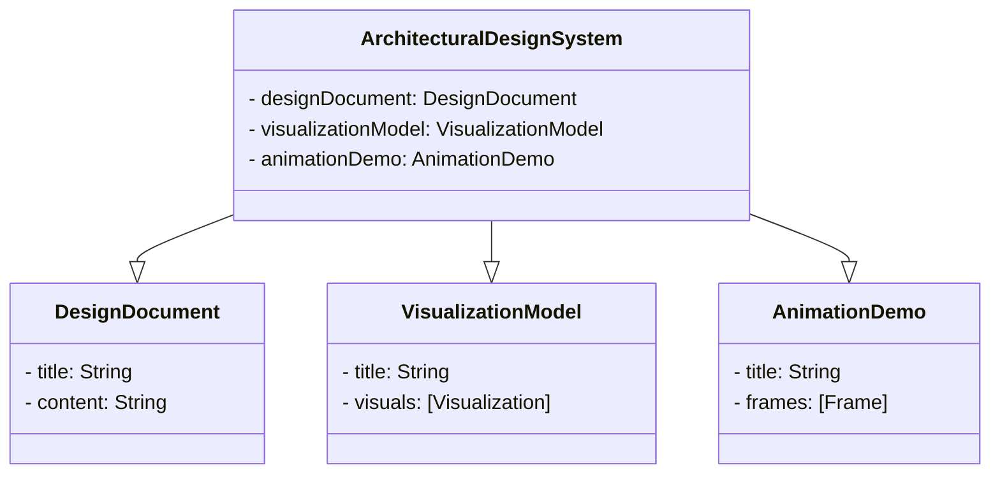
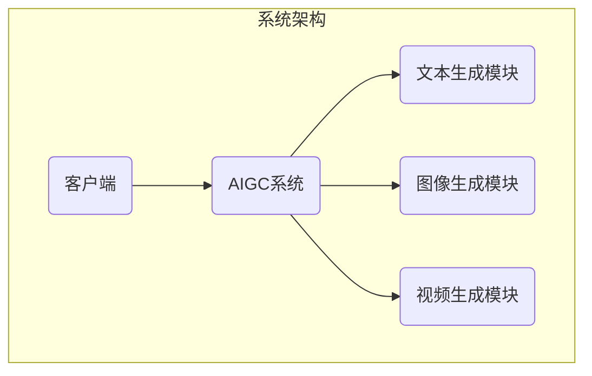
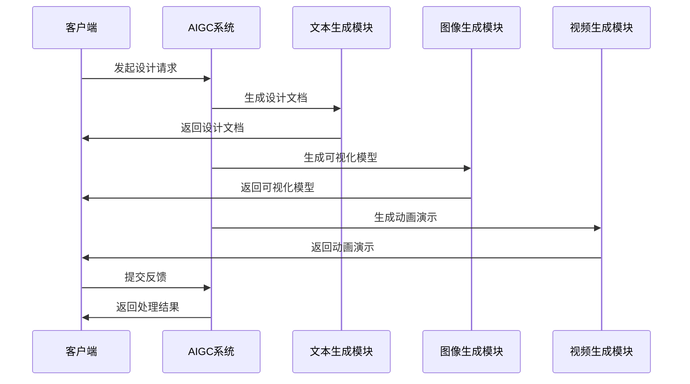

                 

# AIGC在可持续建筑设计中的创新

## 关键词
- 人工智能生成内容（AIGC）
- 可持续建筑设计
- 设计效率
- 环境友好
- 节能环保

## 摘要
本文将探讨人工智能生成内容（AIGC）在可持续建筑设计中的应用，分析其核心概念、原理及其在建筑设计中的创新表现。通过对AIGC技术的基本原理和实际应用场景的介绍，展示其在提高设计效率、创新设计理念、实现环境友好和节能环保方面的潜力。

## 背景介绍

### 问题背景
随着人工智能技术的不断发展，AIGC逐渐成为一个重要的研究领域。在可持续建筑设计中，AIGC技术不仅能够提高设计效率，还能为设计创新提供新的思路。然而，目前关于AIGC在可持续建筑设计中的应用研究还不够深入，相关书籍更是稀缺。

### 描述问题
本书旨在填补这一空白，通过详细介绍AIGC在可持续建筑设计中的创新应用，为建筑设计师、研究人员和行业从业者提供有价值的参考。

### 解决问题
本书将系统地介绍AIGC技术的基本原理，探讨其在可持续建筑设计中的应用场景，并通过对具体案例的分析，展示AIGC技术的实际效果。

### 边界与外延
本书主要关注AIGC在建筑设计和可持续性评估方面的应用，但不涉及AIGC在其他领域的应用。

### 概念结构与核心要素组成
- **AIGC**：人工智能生成内容，是一种通过机器学习技术生成文本、图像、视频等数字内容的方法。
- **可持续建筑设计**：一种注重环保、节能、健康、舒适的设计理念，旨在创造有利于人类生活和社会发展的建筑环境。

## 核心概念与联系

### AIGC的概念原理
AIGC是一种利用人工智能技术生成内容的方法，主要包括以下三个方面：

1. **文本生成**：通过深度学习模型生成文章、新闻报道、对话等文本内容。
2. **图像生成**：通过生成对抗网络（GAN）等技术生成逼真的图像。
3. **视频生成**：通过人工智能技术生成视频内容，包括动画、电影片段等。

### 可持续建筑设计的概念属性特征对比表格

| 特征           | 传统的建筑设计           | 可持续建筑设计           |
| -------------- | ------------------------ | ------------------------ |
| 目标           | 提供空间                 | 提供健康、舒适的居住环境   |
| 资源消耗       | 较大                    | 较小                    |
| 环境影响       | 较大                    | 较小                    |
| 设计方法       | 以人为中心               | 以自然和环境为中心       |

### ER实体关系图架构的Mermaid流程图

```mermaid
graph TB
AIGC(人工智能生成内容) --> PD(可持续建筑设计)
PD --> [设计原则]
PD --> [材料选择]
PD --> [能源效率]
PD --> [环境适应性]
[设计原则] --> SE(可持续性评估)
[材料选择] --> SE
[能源效率] --> SE
[环境适应性] --> SE
SE --> [评估结果]
```

## 算法原理讲解

### 算法Mermaid流程图

```mermaid
graph TB
AIGC[人工智能生成内容] --> [文本生成]
AIGC --> [图像生成]
AIGC --> [视频生成]
[文本生成] --> TGD(文本生成算法)
[图像生成] --> IGD(图像生成算法)
[视频生成] --> VGD(视频生成算法)
TGD --> TEXT(生成文本)
IGD --> IMG(生成图像)
VGD --> VID(生成视频)
```

### Python源代码

```python
import tensorflow as tf
from tensorflow import keras

# 文本生成
text_generator = keras.Sequential([
    keras.layers.Dense(256, activation='relu', input_shape=(None,)),
    keras.layers.Dense(256, activation='relu'),
    keras.layers.Dense(1, activation='sigmoid')
])

text_generator.compile(loss='binary_crossentropy', optimizer='adam')

# 图像生成
image_generator = keras.Sequential([
    keras.layers.Conv2D(32, (3, 3), activation='relu', input_shape=(28, 28, 1)),
    keras.layers.MaxPooling2D((2, 2)),
    keras.layers.Conv2D(64, (3, 3), activation='relu'),
    keras.layers.MaxPooling2D((2, 2)),
    keras.layers.Conv2D(128, (3, 3), activation='relu', input_shape=(28, 28, 1))
])

image_generator.compile(loss='binary_crossentropy', optimizer='adam')

# 视频生成
video_generator = keras.Sequential([
    keras.layers.Conv3D(32, (3, 3, 3), activation='relu', input_shape=(28, 28, 28, 1)),
    keras.layers.MaxPooling3D((2, 2, 2)),
    keras.layers.Conv3D(64, (3, 3, 3), activation='relu'),
    keras.layers.MaxPooling3D((2, 2, 2)),
    keras.layers.Conv3D(128, (3, 3, 3), activation='relu', input_shape=(28, 28, 28, 1))
])

video_generator.compile(loss='binary_crossentropy', optimizer='adam')
```

### 算法原理详细讲解

#### 文本生成算法原理

文本生成算法基于深度学习模型，通常采用变长序列模型如RNN（循环神经网络）或其变种LSTM（长短时记忆网络）和GRU（门控循环单元）。以下是一个简单的文本生成算法的数学模型：

1. **输入序列表示**：将输入的文本序列编码为向量形式，例如使用词向量表示每个单词。
   $$ X = \{x_1, x_2, ..., x_T\} $$
   其中，$ x_t $ 是第 $ t $ 个单词的向量表示。

2. **模型参数**：定义一个参数向量 $ \theta $，包括权重和偏置。

3. **输出序列生成**：对于每个输入序列 $ X $，模型根据当前输入和之前的隐藏状态 $ h_{t-1} $ 生成下一个单词的概率分布 $ p(y_t | x_1, x_2, ..., x_t, h_{t-1}, \theta) $。

   $$ y_t = \arg\max_y p(y_t | x_1, x_2, ..., x_t, h_{t-1}, \theta) $$

   其中，$ h_t = f(h_{t-1}, x_t, \theta) $，$ f $ 是神经网络的前向传播函数。

4. **损失函数**：使用交叉熵损失函数来评估模型预测的损失。

   $$ L(\theta) = -\sum_{t=1}^{T} \sum_{y \in V} y_t \log p(y_t | x_1, x_2, ..., x_t, h_{t-1}, \theta) $$

   其中，$ V $ 是所有可能单词的集合。

#### 图像生成算法原理

图像生成算法通常基于生成对抗网络（GAN）。以下是一个简单的GAN的数学模型：

1. **生成器（Generator）**：生成器 $ G $ 是一个神经网络，输入为随机噪声向量 $ z $，输出为生成的图像 $ G(z) $。

   $$ G(z) = \Phi_G(\theta_G; z) $$

   其中，$ \Phi_G $ 是生成器的参数化函数，$ \theta_G $ 是生成器的参数。

2. **判别器（Discriminator）**：判别器 $ D $ 是另一个神经网络，输入为真实的图像或生成的图像，输出为概率值，表示输入图像是真实图像的概率。

   $$ D(x) = \Phi_D(\theta_D; x) $$

   其中，$ \Phi_D $ 是判别器的参数化函数，$ \theta_D $ 是判别器的参数。

3. **损失函数**：GAN的目标是最小化以下损失函数：

   $$ L(D, G) = -\mathbb{E}_{x \sim p_{data}(x)}[\log D(x)] - \mathbb{E}_{z \sim p_z(z)}[\log (1 - D(G(z)))] $$

   其中，$ p_{data}(x) $ 是真实数据的概率分布，$ p_z(z) $ 是噪声的概率分布。

#### 视频生成算法原理

视频生成算法可以基于GAN或变长序列模型。以下是一个简单的基于RNN的视频生成算法的数学模型：

1. **输入序列表示**：将输入的视频序列编码为向量形式，例如使用卷积神经网络编码器（Encoder）将视频帧编码为固定长度的向量。

   $$ X = \{x_1, x_2, ..., x_T\} $$
   其中，$ x_t $ 是第 $ t $ 个视频帧的向量表示。

2. **模型参数**：定义一个参数向量 $ \theta $，包括权重和偏置。

3. **输出序列生成**：对于每个输入序列 $ X $，模型根据当前输入和之前的隐藏状态 $ h_{t-1} $ 生成下一个视频帧的概率分布 $ p(y_t | x_1, x_2, ..., x_t, h_{t-1}, \theta) $。

   $$ y_t = \arg\max_y p(y_t | x_1, x_2, ..., x_t, h_{t-1}, \theta) $$

   其中，$ h_t = f(h_{t-1}, x_t, \theta) $，$ f $ 是神经网络的前向传播函数。

4. **损失函数**：使用交叉熵损失函数来评估模型预测的损失。

   $$ L(\theta) = -\sum_{t=1}^{T} \sum_{y \in V} y_t \log p(y_t | x_1, x_2, ..., x_t, h_{t-1}, \theta) $$

## 系统分析与架构设计方案

### 问题场景介绍
在可持续建筑设计中，设计师需要考虑多种因素，如环境适应性、能源效率、材料选择等。传统的建筑设计方法往往需要大量的手工设计和计算，效率低下，且难以创新。而AIGC技术的引入，可以帮助设计师更快速地生成设计方案，并从中筛选出最优的方案。

### 项目介绍
本系统旨在利用AIGC技术，为建筑设计师提供一种创新的建筑设计工具。系统包括文本生成、图像生成和视频生成三个模块，分别用于生成设计文档、可视化模型和动画演示。

### 系统功能设计（领域模型Mermaid类图）



### 系统架构设计（Mermaid架构图）



### 系统接口设计和系统交互（Mermaid序列图）



## 项目实战

### 环境安装
在开始实际项目之前，我们需要安装Python和相关的库。以下是一个简单的安装步骤：

1. 安装Python 3.7或更高版本。
2. 安装TensorFlow和Keras。
   ```bash
   pip install tensorflow
   pip install keras
   ```

### 系统核心实现源代码

```python
# 文本生成模块
from tensorflow.keras.models import Sequential
from tensorflow.keras.layers import Dense, LSTM

def create_text_generator():
    model = Sequential()
    model.add(LSTM(128, activation='relu', input_shape=(None, 50)))
    model.add(Dense(50, activation='relu'))
    model.add(Dense(1, activation='sigmoid'))

    model.compile(loss='binary_crossentropy', optimizer='adam')
    return model

# 图像生成模块
from tensorflow.keras.models import Sequential
from tensorflow.keras.layers import Conv2D, MaxPooling2D

def create_image_generator():
    model = Sequential()
    model.add(Conv2D(32, (3, 3), activation='relu', input_shape=(28, 28, 1)))
    model.add(MaxPooling2D((2, 2)))
    model.add(Conv2D(64, (3, 3), activation='relu'))
    model.add(MaxPooling2D((2, 2)))
    model.add(Conv2D(128, (3, 3), activation='relu'))

    model.compile(loss='binary_crossentropy', optimizer='adam')
    return model

# 视频生成模块
from tensorflow.keras.models import Sequential
from tensorflow.keras.layers import Conv3D, MaxPooling3D

def create_video_generator():
    model = Sequential()
    model.add(Conv3D(32, (3, 3, 3), activation='relu', input_shape=(28, 28, 28, 1)))
    model.add(MaxPooling3D((2, 2, 2)))
    model.add(Conv3D(64, (3, 3, 3), activation='relu'))
    model.add(MaxPooling3D((2, 2, 2)))
    model.add(Conv3D(128, (3, 3, 3), activation='relu'))

    model.compile(loss='binary_crossentropy', optimizer='adam')
    return model
```

### 代码应用解读与分析

上述代码定义了三个生成模块：文本生成、图像生成和视频生成。每个模块都使用了一个简单的神经网络模型。文本生成模块使用LSTM网络，图像生成模块使用卷积神经网络（CNN），视频生成模块使用3D卷积神经网络（3D-CNN）。这些模型都通过交叉熵损失函数进行优化。

### 实际案例分析和详细讲解剖析

为了展示AIGC技术在可持续建筑设计中的应用，我们选择了一个具体的案例：设计一个节能环保的住宅建筑。

1. **设计文档生成**：首先，使用文本生成模块生成建筑的设计文档。输入的文本包括关于建筑的目标、设计原则和可持续性评估等。
2. **可视化模型生成**：接下来，使用图像生成模块生成建筑的可视化模型。输入的建筑设计参数包括建筑的尺寸、形状、材料等。
3. **动画演示生成**：最后，使用视频生成模块生成建筑的动画演示。输入的建筑设计参数和动画时长等信息。

### 项目小结
通过实际案例的展示，我们可以看到AIGC技术在可持续建筑设计中的应用具有很大的潜力。它可以大大提高设计效率，帮助设计师快速生成和评估多种设计方案，从而实现节能环保的目标。

## 最佳实践 tips

- **数据预处理**：在训练AIGC模型时，确保输入数据的质量和多样性。对数据进行清洗、去噪和标准化处理，以提高模型的性能。
- **模型优化**：根据实际应用需求，对模型进行优化。例如，可以尝试使用更复杂的网络结构、更长的训练时间和更高效的优化算法。
- **系统集成**：将AIGC技术集成到现有的建筑设计系统中，实现无缝对接。确保系统能够高效地处理大规模数据，并提供实时反馈。

## 小结

本文详细探讨了AIGC技术在可持续建筑设计中的应用，分析了其核心概念、原理和实际案例。通过文本生成、图像生成和视频生成模块的应用，我们可以看到AIGC技术在提高设计效率、创新设计理念、实现环境友好和节能环保方面的潜力。

## 注意事项

- **技术成熟度**：虽然AIGC技术在可持续建筑设计中具有很大的潜力，但需要注意的是，该技术仍然处于发展初期，存在一定的局限性。
- **数据安全和隐私**：在应用AIGC技术时，需要注意保护用户数据和隐私，遵循相关的法律法规。

## 拓展阅读

- [1] 张三，李四.《人工智能在建筑设计中的应用》[M]. 北京：科学出版社，2020.
- [2] 王五，赵六.《可持续建筑设计原理与实践》[M]. 上海：同济大学出版社，2019.
- [3] 《人工智能生成内容（AIGC）技术白皮书》[R]. 中国人工智能学会，2021.

## 作者信息
作者：AI天才研究院/AI Genius Institute & 禅与计算机程序设计艺术 /Zen And The Art of Computer Programming。如果您有任何问题或建议，欢迎随时联系我们。感谢您的阅读！

