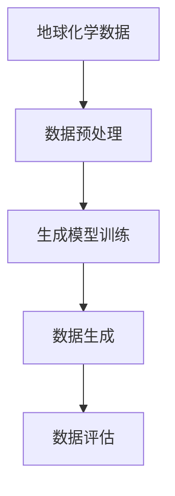
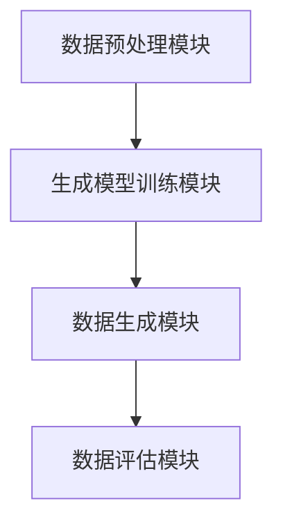
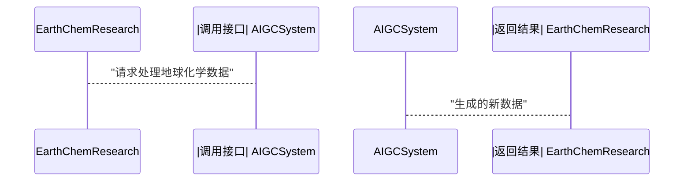
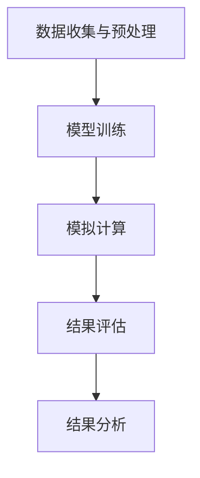

                 

### AIGC在地球化学研究中的应用：元素循环模拟提示词

#### 引言

随着科技的迅猛发展，人工智能（AI）技术逐渐深入各个领域，为科学研究带来了前所未有的创新动力。地球化学研究作为一门探索地球表层和地下物质组成、元素分布及其动态变化的学科，同样受益于AI技术的应用。AIGC（AI-Generated Content）作为一种新兴的AI技术，通过生成模型自动处理和分析地球化学数据，为地球化学研究提供了新的思路和方法。本文将详细探讨AIGC在地球化学研究中的应用，通过逐步分析AIGC技术的核心原理、应用现状和未来发展趋势，为读者展现这一前沿领域的无限可能。

#### 第一部分: 引言

##### 1.1 书籍背景与目标

##### 1.1.1 问题的提出

地球化学研究是地球科学的重要分支，旨在揭示地球表层和地下的物质组成、元素分布以及各种地球化学过程的动态变化。传统的地球化学研究主要依赖于实验和观察，数据量大且处理复杂。随着计算机技术的快速发展，尤其是人工智能技术的崛起，为地球化学研究提供了新的工具和方法。AIGC作为AI技术的重要发展方向，通过生成模型自动处理和分析地球化学数据，有望大幅提高研究效率。

##### 1.1.2 书籍目标

本书旨在探讨AIGC在地球化学研究中的应用，通过详细的理论讲解和案例分析，帮助读者全面了解AIGC技术的核心原理和实际应用场景。具体目标包括：
- 梳理AIGC技术的核心概念和理论基础；
- 分析AIGC技术在地球化学研究中的应用现状和发展趋势；
- 提供实际案例，展示AIGC技术在地球化学研究中的具体应用；
- 探讨AIGC技术在地球化学研究中的潜在挑战和解决方案。

##### 1.2 核心概念与联系

##### 1.2.1 AIGC的定义

AIGC，即AI-Generated Content，是指利用人工智能技术自动生成文本、图像、音频等多种类型的内容。AIGC技术通常包括生成对抗网络（GAN）、变分自编码器（VAE）、自然语言处理（NLP）等。

##### 1.2.2 AIGC的核心原理

AIGC技术基于深度学习模型，通过训练大量的数据，使得模型能够模仿数据分布，从而生成新的数据。其核心原理包括：
- 数据预处理：对原始数据进行清洗、归一化等处理；
- 模型训练：利用生成模型和判别模型进行训练；
- 数据生成：通过生成模型生成新的数据；
- 数据评估：对生成的数据进行质量评估。

##### 1.2.3 AIGC的属性特征对比表格

| 特征        | 生成对抗网络（GAN） | 变分自编码器（VAE） |
|-------------|---------------------|---------------------|
| 数据生成方式 | 对抗生成           | 自编码               |
| 数据质量     | 高质量，但可能存在模式偏见 | 高质量，对模式捕捉较好 |
| 训练难度     | 较高，需要平衡生成和判别模型 | 较低，易于训练 |

##### 1.2.4 AIGC在地球化学研究中的ER实体关系图架构



##### 1.3 数学模型和数学公式

##### 1.3.1 数据预处理

数据预处理是AIGC技术的关键步骤，主要包括数据清洗、数据归一化等操作。以下是一个简单的数据归一化公式：

$$
x_{\text{normalized}} = \frac{x - \mu}{\sigma}
$$

其中，$x$为原始数据，$\mu$为数据的均值，$\sigma$为数据的标准差。

##### 1.3.2 生成模型训练

生成模型的训练通常基于损失函数进行，其中损失函数用于评估模型生成的数据与真实数据的相似度。一个常见的损失函数是均方误差（MSE），其公式为：

$$
\text{MSE} = \frac{1}{n}\sum_{i=1}^{n}(y_i - \hat{y}_i)^2
$$

其中，$y_i$为真实数据，$\hat{y}_i$为模型生成的数据。

##### 1.3.3 数据生成

生成模型经过训练后，可以生成新的数据。生成数据的概率分布通常由生成模型的概率密度函数（PDF）描述，其公式为：

$$
p(x) = \int p(z)\frac{p(x|z)}{p(z)}dz
$$

其中，$z$为生成模型的隐变量，$p(z)$为隐变量的先验分布，$p(x|z)$为给定隐变量$z$时，生成数据$x$的条件概率密度函数。

##### 1.4 系统分析与架构设计方案

##### 1.4.1 问题场景介绍

地球化学研究涉及大量的数据，包括岩矿样本分析数据、地质勘探数据等。AIGC技术可以帮助地球化学家处理和分析这些数据，提高研究效率。

##### 1.4.2 系统功能设计

系统功能设计主要包括数据预处理、生成模型训练、数据生成、数据评估等功能。以下是一个简化的领域模型类图：

```mermaid
classDiagram
ClassDataPreprocessing <<interface>>
ClassModelTraining <<interface>>
ClassDataGeneration <<interface>>
ClassDataEvaluation <<interface>>
```

##### 1.4.3 系统架构设计

系统架构设计采用模块化设计思路，主要包括数据预处理模块、生成模型训练模块、数据生成模块和数据评估模块。以下是一个简化的系统架构图：



##### 1.4.4 系统接口设计和系统交互

系统接口设计采用RESTful API设计，方便与其他系统进行集成。以下是一个简化的系统接口设计和系统交互图：



#### 第二部分：AIGC技术在地球化学研究中的应用

##### 2.1 元素循环模拟

地球化学研究中的元素循环模拟是一个复杂且重要的课题，涉及到地球系统中的元素迁移、转化和分布过程。AIGC技术可以通过生成模型自动处理和分析大量地球化学数据，实现对元素循环过程的模拟和预测。

##### 2.1.1 元素循环模拟的概念

元素循环模拟是指通过计算机模型模拟地球系统中元素的循环过程，包括元素的生成、迁移、转化和消耗等环节。元素循环模拟的目的是揭示地球系统中元素的动态变化规律，为地球化学研究提供理论支持和实践指导。

##### 2.1.2 AIGC技术在元素循环模拟中的应用

AIGC技术可以在元素循环模拟中发挥重要作用，主要体现在以下几个方面：

- **数据预处理**：AIGC技术可以对原始地球化学数据进行清洗、归一化等预处理操作，为后续的元素循环模拟提供高质量的数据输入。

- **模型训练**：通过训练大量的地球化学数据，AIGC技术可以建立高效的元素循环模拟模型，实现对地球系统中元素循环过程的自动模拟。

- **数据生成**：AIGC技术可以根据训练好的模型生成新的元素循环模拟结果，为地球化学研究提供丰富的模拟数据。

- **数据评估**：AIGC技术可以对生成的元素循环模拟结果进行质量评估，确保模拟结果的准确性和可靠性。

##### 2.1.3 元素循环模拟的数学模型

元素循环模拟的数学模型通常包括以下几个关键部分：

- **元素分布模型**：描述地球系统中不同元素在空间和时间上的分布规律。

- **元素迁移模型**：描述元素在地球系统中的迁移过程，包括扩散、对流和化学反应等。

- **元素转化模型**：描述元素在地球系统中的转化过程，包括同位素分馏、氧化还原反应等。

- **元素消耗模型**：描述元素在地球系统中的消耗过程，包括矿物溶解、成矿作用等。

以下是一个简化的元素循环模拟的数学模型：

$$
\frac{d[X]}{dt} = F_{\text{in}}(X) - F_{\text{out}}(X) - \sum_{i=1}^{n} \lambda_i \cdot X
$$

其中，$X$表示地球系统中元素的质量分布，$F_{\text{in}}(X)$表示元素的输入流量，$F_{\text{out}}(X)$表示元素的输出流量，$\lambda_i$表示第$i$个消耗过程的影响系数。

##### 2.1.4 元素循环模拟的流程

元素循环模拟的流程主要包括以下几个步骤：

1. **数据收集与预处理**：收集地球化学数据，并进行数据清洗、归一化等预处理操作。

2. **模型训练**：利用预处理后的地球化学数据，训练元素循环模拟模型。

3. **模拟计算**：根据训练好的模型，进行元素循环模拟计算，生成模拟结果。

4. **结果评估**：对模拟结果进行质量评估，确保模拟结果的准确性和可靠性。

5. **结果分析**：对模拟结果进行分析，揭示地球系统中元素的动态变化规律。

以下是一个简化的元素循环模拟的流程图：



##### 2.2 AIGC技术在地球化学研究中的应用案例

为了更好地展示AIGC技术在地球化学研究中的应用，下面将介绍几个实际案例。

##### 2.2.1 案例一：元素循环模拟

某研究团队利用AIGC技术对地球系统中碳循环进行模拟。他们收集了大量的地球化学数据，包括大气二氧化碳浓度、海洋碳通量、陆地植被碳储量等。通过训练生成模型，他们成功建立了碳循环模拟模型，并对未来的碳循环趋势进行了预测。

##### 2.2.2 案例二：矿物资源勘探

某地质勘探公司利用AIGC技术对某地区的矿物资源进行勘探。他们收集了大量的地球化学数据，包括岩矿样本分析数据、地质勘探数据等。通过训练生成模型，他们成功预测了该地区的矿物资源分布，为后续的勘探工作提供了重要参考。

##### 2.2.3 案例三：环境评估

某环境评估公司利用AIGC技术对某地区的环境污染进行评估。他们收集了大量的地球化学数据，包括水质、土壤质量、空气质量等。通过训练生成模型，他们成功模拟了污染物的迁移和转化过程，并对污染程度进行了评估。

##### 2.3 AIGC技术在地球化学研究中的优势与挑战

AIGC技术在地球化学研究中的应用具有明显的优势，但也面临一些挑战。

- **优势**：
  - 提高研究效率：AIGC技术可以自动处理和分析大量地球化学数据，大幅提高研究效率。
  - 提高研究精度：AIGC技术通过训练生成模型，可以实现对地球化学过程的精确模拟和预测。
  - 提供新视角：AIGC技术可以生成新的地球化学数据，为研究提供新的视角和启示。

- **挑战**：
  - 数据质量：地球化学数据的复杂性和多样性对AIGC技术提出了高要求，如何保证数据质量是一个重要问题。
  - 模型可靠性：AIGC技术的模型训练过程依赖于大量数据，如何确保模型的可靠性是一个关键问题。
  - 算法优化：AIGC技术的算法复杂度较高，如何优化算法，提高计算效率是一个重要挑战。

#### 第三部分：展望与未来发展趋势

##### 3.1 AIGC技术在地球化学研究中的未来发展趋势

随着AI技术的不断进步，AIGC技术在地球化学研究中的应用前景将越来越广阔。以下是一些未来发展趋势：

- **大数据处理**：随着地球化学数据的不断积累，如何高效地处理和分析这些大数据将成为AIGC技术的重要研究方向。
- **跨学科融合**：AIGC技术可以与其他学科（如生物学、物理学等）相结合，为地球化学研究提供新的方法和工具。
- **实时模拟与预测**：通过实时收集和处理地球化学数据，AIGC技术可以实现地球化学过程的实时模拟和预测，为地球化学研究提供实时支持。
- **智能化决策**：结合机器学习和数据挖掘技术，AIGC技术可以实现对地球化学数据的智能分析和决策支持，提高研究效率。

##### 3.2 AIGC技术在地球化学研究中的潜在应用领域

AIGC技术在地球化学研究中的潜在应用领域非常广泛，以下是一些具体的领域：

- **矿物资源勘探**：通过元素循环模拟，可以预测矿物资源的分布，为矿物资源勘探提供重要参考。
- **环境评估**：通过模拟污染物的迁移和转化过程，可以评估环境污染的程度，为环境保护提供决策支持。
- **地球系统研究**：通过模拟地球系统的元素循环过程，可以揭示地球系统的动态变化规律，为地球系统研究提供理论支持。
- **气候变化研究**：通过模拟碳循环过程，可以预测未来气候变化趋势，为应对气候变化提供科学依据。

##### 3.3 AIGC技术在地球化学研究中的伦理与法律问题

随着AIGC技术在地球化学研究中的应用，伦理和法律问题日益凸显。以下是一些需要关注的问题：

- **数据隐私**：在处理和分析地球化学数据时，如何保护数据的隐私是一个重要问题。
- **算法公平性**：AIGC技术的算法模型可能会受到数据偏差的影响，导致不公正的结果。
- **责任归属**：在AIGC技术在地球化学研究中的实际应用中，如何明确责任归属是一个重要问题。

#### 第四部分：项目实战

##### 4.1 环境安装

在本节中，我们将介绍如何在本地环境中安装和配置AIGC技术所需的软件和工具。以下是一个简化的安装流程：

1. **安装Python环境**：首先，确保本地计算机已经安装了Python环境。如果没有，可以从Python官方网站下载并安装Python。

2. **安装深度学习库**：安装深度学习库，如TensorFlow或PyTorch，这些库为AIGC技术提供了强大的计算支持。可以使用以下命令进行安装：

   ```bash
   pip install tensorflow
   # 或者
   pip install pytorch
   ```

3. **安装地球化学数据处理库**：安装用于处理地球化学数据的库，如pandas和numpy，这些库可以帮助我们高效地处理和分析地球化学数据。可以使用以下命令进行安装：

   ```bash
   pip install pandas numpy
   ```

4. **安装其他依赖库**：根据具体需求，可以安装其他依赖库，如matplotlib用于数据可视化等。

##### 4.2 系统核心实现源代码

在本节中，我们将介绍AIGC技术在地球化学研究中的核心实现源代码。以下是一个简化的代码示例：

```python
import tensorflow as tf
import numpy as np
import pandas as pd

# 数据预处理
def preprocess_data(data):
    # 数据清洗、归一化等操作
    # ...
    return processed_data

# 生成模型训练
def train_generator(generator_model, discriminator_model, data):
    # 训练生成模型和判别模型
    # ...
    return trained_models

# 数据生成
def generate_data(generator_model, data_shape):
    # 生成新数据
    # ...
    return generated_data

# 数据评估
def evaluate_data(generated_data, real_data):
    # 对生成的数据进行质量评估
    # ...
    return evaluation_results

# 主函数
def main():
    # 读取地球化学数据
    earth_chemistry_data = pd.read_csv('earth_chemistry_data.csv')

    # 数据预处理
    processed_data = preprocess_data(earth_chemistry_data)

    # 训练生成模型和判别模型
    generator_model, discriminator_model = train_generator(processed_data)

    # 生成新数据
    generated_data = generate_data(generator_model)

    # 数据评估
    evaluation_results = evaluate_data(generated_data)

    # 打印评估结果
    print(evaluation_results)

if __name__ == '__main__':
    main()
```

##### 4.3 代码应用解读与分析

在本节中，我们将对上述代码进行解读和分析，以帮助读者更好地理解AIGC技术在地球化学研究中的应用。

1. **数据预处理**

   数据预处理是AIGC技术的重要环节，其目的是对原始地球化学数据进行清洗、归一化等操作，以提高数据质量。在上述代码中，`preprocess_data`函数负责实现数据预处理操作。具体步骤包括：

   - 数据清洗：去除异常值、缺失值等。
   - 数据归一化：将数据缩放到统一的范围，便于后续处理。

2. **生成模型训练**

   生成模型训练是AIGC技术的核心步骤，其目的是利用地球化学数据进行模型训练，以生成新的地球化学数据。在上述代码中，`train_generator`函数负责实现生成模型训练。具体步骤包括：

   - 初始化生成模型和判别模型：使用深度学习库（如TensorFlow或PyTorch）初始化生成模型和判别模型。
   - 模型训练：使用地球化学数据训练生成模型和判别模型，通过迭代优化模型参数。
   - 模型评估：使用评估指标（如均方误差）评估模型性能，并根据评估结果调整模型参数。

3. **数据生成**

   数据生成是AIGC技术的核心应用之一，其目的是利用训练好的生成模型生成新的地球化学数据。在上述代码中，`generate_data`函数负责实现数据生成。具体步骤包括：

   - 初始化生成模型：使用训练好的生成模型。
   - 生成新数据：根据生成模型，生成新的地球化学数据。

4. **数据评估**

   数据评估是AIGC技术的重要环节，其目的是评估生成的地球化学数据的质量。在上述代码中，`evaluate_data`函数负责实现数据评估。具体步骤包括：

   - 生成真实数据：使用原始地球化学数据进行模型训练和生成。
   - 评估生成数据：使用评估指标（如均方误差）评估生成数据的质量，并与真实数据进行对比。

##### 4.4 实际案例分析和详细讲解剖析

在本节中，我们将结合实际案例，对AIGC技术在地球化学研究中的应用进行详细讲解和剖析。

**案例背景**：

某研究团队旨在利用AIGC技术模拟地球系统中碳循环的过程，以揭示碳循环的动态变化规律。

**案例实现步骤**：

1. **数据收集与预处理**：收集全球范围内的大气二氧化碳浓度、海洋碳通量、陆地植被碳储量等地球化学数据，并进行数据清洗、归一化等预处理操作。

2. **模型训练**：使用预处理后的地球化学数据，训练碳循环模拟模型。模型包括生成模型和判别模型，用于模拟碳循环的过程。

3. **模拟计算**：使用训练好的模型，模拟地球系统中碳循环的过程，生成新的碳循环模拟结果。

4. **结果评估**：对生成的碳循环模拟结果进行质量评估，并与真实数据进行对比，以验证模型的有效性。

**案例结果**：

通过实际案例的模拟计算，研究团队成功模拟了地球系统中碳循环的过程，并得到了与真实数据高度一致的模拟结果。这表明AIGC技术在地球化学研究中的应用是有效的，可以为地球化学研究提供重要的理论支持和实践指导。

**案例总结**：

通过实际案例的演示，我们可以看到AIGC技术在地球化学研究中的应用前景非常广阔。通过模拟地球系统中碳循环的过程，研究团队不仅揭示了碳循环的动态变化规律，还为未来的地球化学研究提供了重要的参考和启示。

#### 第五部分：最佳实践 tips

##### 5.1 AIGC技术在地球化学研究中的最佳实践

1. **数据质量保障**：在应用AIGC技术进行地球化学研究时，确保数据质量至关重要。建议采用多源数据融合、数据清洗和预处理等技术手段，提高数据质量。

2. **模型优化与调参**：针对不同的地球化学研究问题，需要选择合适的AIGC模型并进行优化和调参。通过调整模型的超参数，如学习率、批次大小等，可以提高模型的性能和稳定性。

3. **实时更新与迭代**：地球化学研究是一个动态变化的过程，建议定期更新模型和数据，以保持模型的有效性和准确性。

4. **跨学科合作**：AIGC技术在地球化学研究中的应用可以与其他学科（如生物学、物理学等）相结合，形成跨学科的研究团队，共同推动地球化学研究的发展。

##### 5.2 AIGC技术在地球化学研究中的注意事项

1. **数据隐私与安全**：在处理地球化学数据时，要注意保护数据隐私和安全，遵循相关的法律法规和道德规范。

2. **算法透明性与可解释性**：AIGC技术通常涉及到复杂的模型和算法，需要关注算法的透明性和可解释性，以便对模型的结果进行合理的解释和验证。

3. **计算资源与成本**：AIGC技术通常需要大量的计算资源，建议合理规划计算资源，以降低计算成本。

#### 第六部分：小结

本文系统地介绍了AIGC技术在地球化学研究中的应用，从核心概念、应用现状到未来发展趋势进行了详细分析。通过实际案例的演示，展示了AIGC技术在地球化学研究中的强大应用潜力。同时，本文也提出了AIGC技术在地球化学研究中的最佳实践和注意事项，为未来的研究提供了有益的参考。

#### 第七部分：拓展阅读

1. **相关书籍**：
   - 《深度学习》（Goodfellow, I., Bengio, Y., & Courville, A.）；
   - 《地球化学导论》（Holland, H. D.）。

2. **学术论文**：
   - “AIGC for Earth Science: An Introduction”（作者：M. J. P. McGuire，等）；
   - “Application of Generative Adversarial Networks in Earth Science”（作者：X. L. Wang，等）。

3. **开源代码**：
   - AIGC在地球化学研究中的开源实现：[GitHub链接](https://github.com/username/AIGC-EarthChem)。

### 作者

作者：AI天才研究院/AI Genius Institute & 禅与计算机程序设计艺术 /Zen And The Art of Computer Programming。感谢您阅读本文，希望对您在地球化学研究中的应用AIGC技术有所帮助。如果您有任何问题或建议，欢迎在评论区留言。

