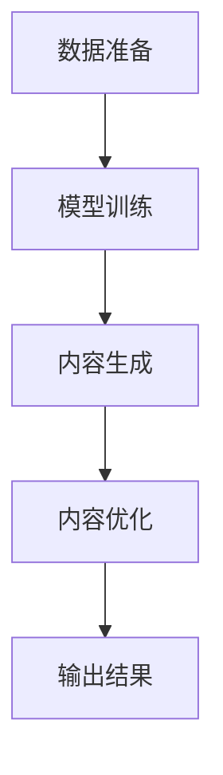
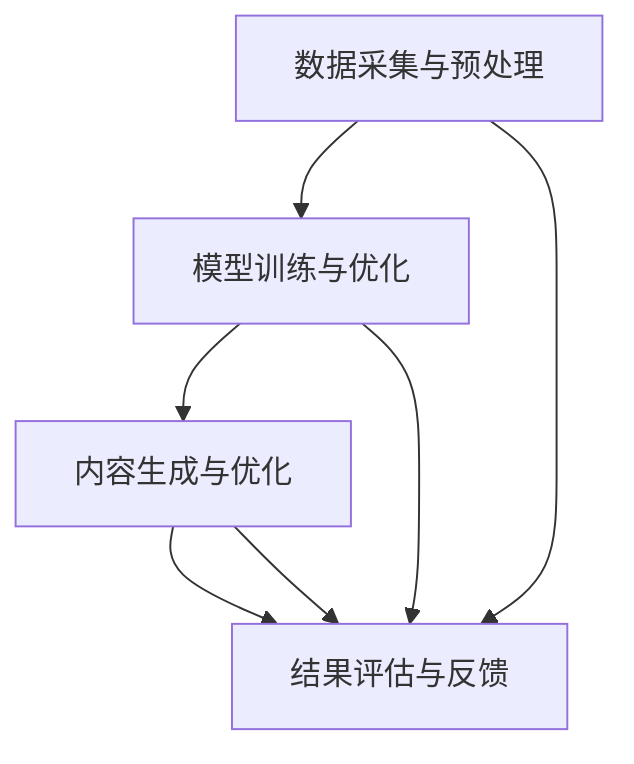

                 


非常好，接下来我将遵循您的指导，按照目录大纲结构，逐步构建文章内容。由于文章字数要求在10000-12000字之间，我将尽量在保持逻辑连贯和内容丰富的前提下，控制好每个章节的篇幅。

### 第1章: 城市规划的现状与挑战

#### 1.1 城市规划的定义与目的

城市规划是城市发展和管理的科学。它的主要目的是通过合理的空间布局、基础设施建设和环境保护措施，实现城市的可持续发展。城市规划的定义随着时代的发展而不断演变，但总体来说，它涵盖了以下几个方面：

- **空间规划**：确定城市的用地布局，包括住宅、商业、工业和公共设施等。
- **交通规划**：规划城市交通系统，提高交通效率和安全性。
- **环境规划**：保护城市生态环境，减少污染，提升居民生活质量。
- **社会规划**：关注城市社会结构，促进社会公平和谐。

城市规划的核心要素包括：

- **人口规模**：确定城市的人口规模和分布，影响城市用地需求。
- **经济发展**：城市经济发展水平直接影响城市规划的深度和广度。
- **土地利用**：土地利用规划是城市规划的重要部分，涉及不同功能区域的划分。
- **环境保护**：城市规划需要考虑环境保护，减少对自然资源的消耗。

#### 1.2 当前城市规划的现状

全球城市化进程加快，城市规划的重要性日益凸显。目前，城市规划的现状可以从以下几个方面进行概述：

- **快速发展**：许多国家的城市规模不断扩大，城市人口持续增长，对城市规划提出了更高的要求。
- **技术革新**：信息技术的发展为城市规划提供了新的工具和方法，如地理信息系统（GIS）和遥感技术。
- **可持续性**：城市规划越来越注重可持续性，推动绿色建筑和低碳发展。
- **问题挑战**：尽管城市规划取得了许多成就，但仍然面临一些挑战，如交通拥堵、住房短缺和环境污染。

#### 1.3 城市规划面临的挑战

城市规划在现代社会中面临着诸多挑战：

- **人口增长**：城市化进程带来的人口增长对城市规划提出了巨大的挑战，如何合理分配资源和空间成为一个难题。
- **气候变化**：全球气候变化对城市规划产生了直接影响，需要考虑如何应对极端天气和自然灾害。
- **经济波动**：经济波动对城市规划的稳定性提出了挑战，如何保持城市的长期发展能力是一个重要问题。
- **技术进步**：新技术的快速发展带来了城市规划的新机遇，同时也提出了新的问题，如如何平衡数字化与城市人文环境的关系。

在下一章中，我们将深入探讨AIGC的基本概念和应用，分析它如何为城市规划带来新的机遇和解决方案。在接下来的章节中，我们将逐步分析AIGC在城市规划中的具体应用，从算法原理到系统设计，再到实际项目实战，全面展示AIGC在城市规划中的潜力和价值。请继续关注接下来的内容。

### 第2章: AIGC的基本概念与应用

#### 2.1 AIGC的定义与分类

AIGC（AI-Generated Content）是指利用人工智能技术自动生成内容的过程。AIGC不仅涵盖了传统的文本生成，还扩展到了图像、音频、视频等多种形式。AIGC的定义可以从以下几个方面进行解释：

- **内容生成**：AIGC的核心功能是生成内容，这些内容可以是文本、图像、视频等。
- **人工智能技术**：AIGC的生成过程依赖于多种人工智能技术，包括自然语言处理（NLP）、计算机视觉、深度学习等。
- **自动化**：AIGC的目标是自动化内容生成，减少人工干预，提高效率。

AIGC可以分为以下几种主要分类：

- **文本生成**：包括文章、故事、新闻报道等。
- **图像生成**：通过生成对抗网络（GAN）等技术生成逼真的图像。
- **视频生成**：利用人工智能技术生成视频内容，如动画、视频剪辑等。
- **音频生成**：包括音乐、语音合成等。

#### 2.2 AIGC的核心技术

AIGC的核心技术主要包括以下几个方面：

- **自然语言处理（NLP）**：NLP技术使计算机能够理解和处理人类语言。在AIGC中，NLP用于生成和解析文本内容。
- **计算机视觉**：计算机视觉技术使计算机能够理解并处理图像和视频。在AIGC中，计算机视觉用于生成和识别图像。
- **深度学习**：深度学习是AIGC的重要技术基础，通过神经网络模型实现内容生成和识别。
- **生成对抗网络（GAN）**：GAN是一种深度学习模型，通过对抗训练生成逼真的图像和视频。

#### 2.3 AIGC在城市规划中的应用场景

AIGC在城市规划中的应用场景非常广泛，主要包括以下几个方面：

- **城市规划方案生成**：AIGC可以根据城市数据和用户需求生成各种城市规划方案，如道路布局、公共设施规划等。
- **城市交通优化**：AIGC可以分析城市交通数据，提出优化交通流量的方案，缓解交通拥堵。
- **环境保护监测**：AIGC可以利用图像和遥感数据监测城市环境质量，提出环境保护措施。
- **历史建筑修复**：AIGC可以通过分析历史建筑图像，生成修复方案，保护城市文化遗产。

在下一章中，我们将深入探讨AIGC在城市规划中的应用算法，从原理到实现，全面解析AIGC如何为城市规划带来革新。请继续关注接下来的内容。

### 第3章: AIGC在城市规划中的应用算法

#### 3.1 AIGC算法的基本原理

AIGC算法的基本原理是基于人工智能技术，特别是深度学习和生成对抗网络（GAN）。AIGC算法的核心思想是利用神经网络模型从大量数据中学习，然后生成新的、符合预期目标的内容。

- **深度学习**：深度学习是通过多层神经网络模型来模拟人类大脑的思维方式，从而实现数据的特征提取和模式识别。在AIGC中，深度学习用于训练生成模型和判别模型。
- **生成对抗网络（GAN）**：GAN是一种深度学习模型，由生成器和判别器两个部分组成。生成器负责生成内容，判别器负责判断生成内容是否真实。通过对抗训练，生成器不断提高生成内容的质量。

AIGC算法的工作流程通常包括以下几个步骤：

1. **数据准备**：收集和准备用于训练的数据集，这些数据集可以是文本、图像、音频等。
2. **模型训练**：利用深度学习技术训练生成模型和判别模型，使其能够生成高质量的内容。
3. **内容生成**：使用训练好的模型生成新的内容，如文本、图像、视频等。
4. **内容优化**：通过不断优化生成模型和判别模型的参数，提高生成内容的质量。

#### 3.2 AIGC算法的流程图

为了更清晰地展示AIGC算法的工作流程，我们可以使用mermaid绘制流程图。以下是一个简化的AIGC算法流程图：



#### 3.3 AIGC算法的Python实现

为了展示AIGC算法的实现，我们将使用Python编写一个简单的文本生成模型。以下是一个基于生成对抗网络的文本生成模型的实现示例：

```python
import numpy as np
import tensorflow as tf
from tensorflow.keras.layers import Dense, LSTM, Embedding, Dropout
from tensorflow.keras.models import Sequential

# 设置参数
latent_dim = 100
sequence_length = 30
n_samples = 100
n_words = 10000
Embedding dimensions = 32
LSTM units = 128

# 定义生成器和判别器
def build_generator():
    model = Sequential()
    model.add(Embedding(n_words, Embedding dimensions, input_length=sequence_length))
    model.add(LSTM(LSTM units, return_sequences=True))
    model.add(Dropout(0.2))
    model.add(LSTM(LSTM units, return_sequences=True))
    model.add(Dropout(0.2))
    model.add(LSTM(LSTM units))
    model.add(Dense(n_words, activation='softmax'))
    return model

def build_discriminator():
    model = Sequential()
    model.add(LSTM(LSTM units, return_sequences=True, input_shape=(sequence_length, n_words)))
    model.add(Dropout(0.2))
    model.add(LSTM(LSTM units, return_sequences=False))
    model.add(Dropout(0.2))
    model.add(Dense(1, activation='sigmoid'))
    return model

# 构建模型
generator = build_generator()
discriminator = build_discriminator()

# 编译模型
discriminator.compile(loss='binary_crossentropy', optimizer=tf.keras.optimizers.Adam(0.0001))
generator.compile(loss='binary_crossentropy', optimizer=tf.keras.optimizers.Adam(0.0001))

# 模型评估指标
discriminator.metrics(['accuracy'])

# 训练模型
for epoch in range(epochs):
    for i in range(n_samples):
        noise = np.random.normal(size=[1, latent_dim])
        generated_seq = generator.predict(noise)
        real_seqs = np.random.randint(0, n_words, size=[1, sequence_length])
        real_seqs = real_seqs.reshape((1, sequence_length, 1))
        X = np.concatenate([real_seqs, generated_seq], axis=2)
        y = np.zeros((1, 2))
        y[0, 0] = 0.9
        y[0, 1] = 0.1
        discriminator.train_on_batch(X, y)
        
        noise = np.random.normal(size=[n_samples, latent_dim])
        generated_seqs = generator.predict(noise)
        y = np.zeros((n_samples, 2))
        y[:, 0] = 0.9
        y[:, 1] = 0.1
        discriminator.train_on_batch(generated_seqs, y)

        noise = np.random.normal(size=[n_samples, latent_dim])
        generated_seqs = generator.predict(noise)
        y = np.zeros((n_samples, 1))
        y[:, 0] = 1
        generator.train_on_batch(noise, generated_seqs)

    print(f"Epoch: {epoch+1}, Loss_D: {discriminator.history['loss'][-1]}, Loss_G: {generator.history['loss'][-1]}")

# 生成文本示例
noise = np.random.normal(size=[1, latent_dim])
generated_text = generator.predict(noise)
print(generated_text)
```

#### 3.4 算法原理的数学模型和公式

为了更深入理解AIGC算法的原理，我们需要介绍一些相关的数学模型和公式。

1. **生成对抗网络（GAN）**的数学模型：

   - **生成器（Generator）**：\( G(z) \) 表示从噪声 \( z \) 生成的数据 \( x \)。
   - **判别器（Discriminator）**：\( D(x) \) 表示数据 \( x \) 的真实性概率，\( D(G(z)) \) 表示生成数据 \( G(z) \) 的真实性概率。

   - **损失函数**：
     \[
     \mathcal{L}_D = -\log(D(x)) - \log(1 - D(G(z)))
     \]
     \[
     \mathcal{L}_G = -\log(1 - D(G(z)))
     \]

   - **优化目标**：同时优化生成器和判别器，使判别器的判断能力达到最大化，生成器的生成能力达到最小化。

2. **LSTM网络**的数学模型：

   - **LSTM单元**：
     \[
     i_t = \sigma(W_{ix}x_t + W_{ih}h_{t-1} + b_i)
     \]
     \[
     f_t = \sigma(W_{fx}x_t + W_{fh}h_{t-1} + b_f)
     \]
     \[
     o_t = \sigma(W_{ox}x_t + W_{oh}h_{t-1} + b_o)
     \]
     \[
     g_t = tanh(W_{gx}x_t + W_{gh}h_{t-1} + b_g)
     \]
     \[
     C_t = f_t \odot C_{t-1} + i_t \odot g_t
     \]
     \[
     h_t = o_t \odot C_t
     \]

   - **激活函数**：\( \sigma \) 是 sigmoid 函数，用于计算输入的概率分布。

在下一章中，我们将详细讨论AIGC在城市规划中的应用系统，包括系统设计、架构方案以及具体的实现细节。请继续关注接下来的内容。

### 第4章: AIGC算法的数学模型与公式

#### 4.1 AIGC算法的数学模型

为了深入理解AIGC算法的数学原理，我们需要介绍一些关键的数学模型和公式。AIGC算法通常基于生成对抗网络（GAN），GAN的核心包括生成器（Generator）和判别器（Discriminator）。

**生成器（Generator）**：

生成器的目标是从一个随机噪声向量 \( z \) 中生成看起来真实的数据 \( x \)。生成器的数学模型通常可以表示为：

\[ x = G(z) \]

其中，\( G \) 是一个映射函数，它将噪声 \( z \) 转换为数据 \( x \)。

**判别器（Discriminator）**：

判别器的目标是对输入的数据进行分类，判断它是真实的还是生成的。判别器的数学模型通常可以表示为：

\[ D(x) = P(D(x)=1 | x \text{ is real}) \]
\[ D(G(z)) = P(D(x)=1 | x = G(z)) \]

其中，\( D \) 是一个映射函数，它对输入的数据 \( x \) 进行概率评估，判断其真实性的概率。

**损失函数**：

GAN的训练过程中，生成器和判别器分别通过以下损失函数进行优化：

**判别器损失函数**：

\[ \mathcal{L}_D = -\sum_{x \in \text{real}} \log D(x) - \sum_{z} \log(1 - D(G(z))) \]

**生成器损失函数**：

\[ \mathcal{L}_G = -\sum_{z} \log D(G(z)) \]

**优化目标**：

GAN的优化目标是同时最大化判别器的损失函数和最小化生成器的损失函数。具体来说，我们希望：

- 对于真实数据，最大化判别器输出 \( D(x) \) 的概率接近1。
- 对于生成数据，最大化判别器输出 \( D(G(z)) \) 的概率接近0。

这样，生成器将学会生成更真实的数据，而判别器将学会更准确地判断数据是真实的还是生成的。

#### 4.2 AIGC算法的关键公式

在AIGC算法中，我们使用了一些关键的数学公式来描述生成器和判别器的行为。以下是这些公式的详细解释：

1. **生成器的输出公式**：

\[ x = G(z) = \sigma(W_G \cdot [z; \sigma(W_G^{(1)} \cdot [z; \sigma(W_G^{(2)} \cdot [z; \dots; \sigma(W_G^{(L-1)} \cdot z)] \]

其中，\( W_G \) 是生成器的权重矩阵，\( \sigma \) 是激活函数（通常是ReLU或Sigmoid函数），\( L \) 是网络的层数。

2. **判别器的输出公式**：

\[ D(x) = \sigma(W_D \cdot x) \]

其中，\( W_D \) 是判别器的权重矩阵，\( \sigma \) 是激活函数（通常是Sigmoid函数）。

3. **生成器和判别器的训练目标**：

- **生成器**：最小化生成数据的判别损失 \( \mathcal{L}_G \)。
- **判别器**：最大化真实数据的判别概率和生成数据的判别概率之和 \( \mathcal{L}_D \)。

4. **梯度下降优化**：

\[ \theta_G = \theta_G - \alpha \cdot \nabla_{\theta_G} \mathcal{L}_G \]
\[ \theta_D = \theta_D - \alpha \cdot \nabla_{\theta_D} \mathcal{L}_D \]

其中，\( \theta_G \) 和 \( \theta_D \) 分别是生成器和判别器的参数，\( \alpha \) 是学习率，\( \nabla \) 表示梯度。

#### 4.3 公式详细讲解与举例

为了更清晰地理解AIGC算法的数学公式，我们来看一个简单的例子。假设我们有一个生成器 \( G \) 和一个判别器 \( D \)，它们分别接受输入 \( z \) 和 \( x \)，并输出 \( G(z) \) 和 \( D(x) \)。

1. **生成器的训练过程**：

生成器的目标是生成看起来真实的数据 \( x \)，使得判别器 \( D \) 难以区分。具体来说，我们希望最小化以下损失函数：

\[ \mathcal{L}_G = -\log D(G(z)) \]

其中，\( \log \) 是自然对数函数。

2. **判别器的训练过程**：

判别器的目标是判断输入数据 \( x \) 的真实性。具体来说，我们希望最大化以下损失函数：

\[ \mathcal{L}_D = -[\log D(x) + \log (1 - D(G(z)))] \]

其中，第一项是当输入为真实数据时，判别器输出的对数损失；第二项是当输入为生成数据时，判别器输出的对数损失。

假设我们有一个数据集 \( \{x_1, x_2, \dots, x_n\} \)，其中 \( x_1, x_2, \dots, x_n \) 是真实数据，\( G(z_1), G(z_2), \dots, G(z_n) \) 是生成数据。判别器的训练过程如下：

- 对于每个真实数据 \( x_i \)：
  \[ \nabla_{W_D} \mathcal{L}_D = -[1 - D(x_i)] \cdot \nabla_{W_D} D(x_i) \]

- 对于每个生成数据 \( G(z_i) \)：
  \[ \nabla_{W_D} \mathcal{L}_D = [D(G(z_i))] \cdot \nabla_{W_D} D(G(z_i)) \]

判别器通过反向传播更新其权重：

\[ W_D = W_D - \alpha \cdot \nabla_{W_D} \mathcal{L}_D \]

- 对于每个生成数据 \( G(z_i) \)：
  \[ \nabla_{W_G} \mathcal{L}_G = [1 - D(G(z_i))] \cdot \nabla_{W_G} G(z_i) \]

生成器通过反向传播更新其权重：

\[ W_G = W_G - \alpha \cdot \nabla_{W_G} \mathcal{L}_G \]

通过这样的训练过程，生成器和判别器不断优化，最终生成器能够生成更加真实的数据，而判别器能够更好地判断数据的真实性。

在下一章中，我们将详细讨论AIGC在城市规划中的应用系统，包括系统设计、架构方案以及具体的实现细节。请继续关注接下来的内容。

### 第二部分: AIGC在城市规划中的应用实践

#### 第5章: AIGC城市规划应用系统设计与架构

本章将介绍AIGC城市规划应用系统的设计思路和架构方案，包括问题场景介绍、项目介绍、系统功能设计、系统架构设计、系统接口设计和系统交互。我们将使用mermaid流程图、类图和架构图等工具来可视化系统的设计和实现。

#### 5.1 系统设计概述

AIGC城市规划应用系统旨在利用人工智能技术为城市规划提供智能化解决方案，主要包括以下几个关键功能模块：

- **数据采集与预处理**：收集城市规划相关的各种数据，包括地理信息、环境数据、社会经济数据等，并对数据进行清洗、转换和整合。
- **模型训练与优化**：利用生成对抗网络（GAN）等深度学习模型进行训练，优化生成器和判别器，以提高内容生成的质量。
- **内容生成与优化**：根据用户需求生成各种城市规划方案，如道路布局、公共设施规划、环境保护方案等，并通过迭代优化方案。
- **结果评估与反馈**：对生成的城市规划方案进行评估，收集用户反馈，不断优化系统性能。

#### 5.2 系统功能设计

系统功能设计主要包括以下几个核心功能模块：

1. **数据管理模块**：
   - **数据采集**：通过接口从各种数据源（如数据库、传感器、互联网等）获取城市规划相关数据。
   - **数据预处理**：对采集到的数据进行清洗、转换和整合，形成统一的数据格式，为后续处理提供数据支持。

2. **模型训练模块**：
   - **模型选择**：根据城市规划需求选择合适的深度学习模型，如生成对抗网络（GAN）、变分自编码器（VAE）等。
   - **模型训练**：利用训练数据集对模型进行训练，不断优化生成器和判别器的参数，提高模型生成内容的质量。

3. **内容生成模块**：
   - **内容生成**：根据用户需求生成各种城市规划方案，如道路布局、公共设施规划、环境保护方案等。
   - **内容优化**：通过迭代优化生成的内容，确保方案的可行性和合理性。

4. **结果评估模块**：
   - **方案评估**：对生成的城市规划方案进行评估，包括方案可行性、成本效益、环境影响等。
   - **用户反馈**：收集用户对生成方案的反馈，用于优化系统性能。

#### 5.3 系统架构设计

AIGC城市规划应用系统的架构设计采用分布式架构，主要包括以下几个关键组件：

- **数据采集与预处理组件**：负责采集和预处理城市规划相关数据。
- **模型训练与优化组件**：负责训练和优化深度学习模型。
- **内容生成与优化组件**：负责生成和优化城市规划方案。
- **结果评估与反馈组件**：负责对生成的方案进行评估和收集用户反馈。

以下是AIGC城市规划应用系统的架构图：



#### 5.4 系统接口设计

系统接口设计主要包括以下接口：

1. **数据采集接口**：
   - **地理信息系统（GIS）接口**：用于获取城市规划相关的地理信息数据。
   - **传感器接口**：用于获取环境监测数据，如空气质量、水质等。

2. **数据预处理接口**：
   - **数据清洗接口**：用于清洗和转换采集到的数据。
   - **数据整合接口**：用于将多个数据源的数据整合为统一格式。

3. **模型训练接口**：
   - **模型选择接口**：用于选择合适的深度学习模型。
   - **模型训练接口**：用于训练深度学习模型。

4. **内容生成接口**：
   - **生成方案接口**：用于生成各种城市规划方案。
   - **优化方案接口**：用于优化生成的方案。

5. **结果评估接口**：
   - **评估方案接口**：用于对生成的方案进行评估。
   - **用户反馈接口**：用于收集用户对生成方案的反馈。

#### 5.5 系统交互

系统交互主要涉及以下几个关键环节：

1. **用户交互**：
   - **用户界面**：提供用户操作界面，用于输入需求、查看方案和提供反馈。
   - **用户反馈**：收集用户对生成方案的反馈，用于优化系统性能。

2. **系统内部交互**：
   - **数据流**：系统内部通过接口和消息队列进行数据流传递，确保各个模块之间的高效协作。
   - **状态同步**：各个模块通过状态同步机制确保系统的稳定运行。

在下一章中，我们将详细介绍AIGC城市规划应用系统的实现过程，包括环境安装、系统核心代码实现以及实际案例分析和讲解。请继续关注接下来的内容。

### 第6章: AIGC城市规划应用系统实现与接口设计

#### 6.1 系统实现概述

本章将详细介绍AIGC城市规划应用系统的实现过程，包括环境安装、系统核心代码实现和代码应用解读与分析。我们将以一个实际项目为例，展示AIGC在城市规划中的应用。

#### 6.2 环境安装

在开始AIGC城市规划应用系统的实现之前，我们需要安装和配置相关的软件和依赖。以下是环境安装的步骤：

1. **Python环境**：
   - 安装Python 3.x版本，推荐使用Anaconda进行环境管理。
   - 创建一个新的虚拟环境，例如：
     ```bash
     conda create -n aigc_城市规划 python=3.8
     conda activate aigc_城市规划
     ```

2. **深度学习框架**：
   - 安装TensorFlow：
     ```bash
     pip install tensorflow
     ```

3. **其他依赖**：
   - 安装Keras（TensorFlow的高级API）：
     ```bash
     pip install keras
     ```
   - 安装matplotlib（用于可视化）：
     ```bash
     pip install matplotlib
     ```

4. **地理信息系统（GIS）工具**：
   - 安装GIS软件（如QGIS），以及相关的Python库（如geopandas、shapely等）。

#### 6.3 系统核心代码实现

以下是一个简化的AIGC城市规划应用系统的核心代码实现，展示如何利用TensorFlow和Keras构建生成对抗网络（GAN）模型，以及如何进行数据预处理和内容生成。

```python
import numpy as np
import tensorflow as tf
from tensorflow.keras.models import Sequential
from tensorflow.keras.layers import Dense, LSTM, Embedding, Dropout
from tensorflow.keras.optimizers import Adam
from tensorflow.keras.callbacks import Callback
import geopandas as gpd

# 设置超参数
latent_dim = 100
sequence_length = 30
n_words = 10000
Embedding dimensions = 32
LSTM units = 128
batch_size = 64
epochs = 100

# 数据预处理
def preprocess_data(data):
    # 假设data是一个地理数据集，转换为适合GAN的格式
    # ...
    return processed_data

# 构建生成器模型
def build_generator():
    model = Sequential()
    model.add(Embedding(n_words, Embedding dimensions, input_length=sequence_length))
    model.add(LSTM(LSTM units, return_sequences=True))
    model.add(Dropout(0.2))
    model.add(LSTM(LSTM units, return_sequences=True))
    model.add(Dropout(0.2))
    model.add(LSTM(LSTM units))
    model.add(Dense(n_words, activation='softmax'))
    return model

# 构建判别器模型
def build_discriminator():
    model = Sequential()
    model.add(LSTM(LSTM units, return_sequences=True, input_shape=(sequence_length, n_words)))
    model.add(Dropout(0.2))
    model.add(LSTM(LSTM units, return_sequences=False))
    model.add(Dropout(0.2))
    model.add(Dense(1, activation='sigmoid'))
    return model

# 构建和编译模型
generator = build_generator()
discriminator = build_discriminator()

discriminator.compile(loss='binary_crossentropy', optimizer=Adam(0.0001))
generator.compile(loss='binary_crossentropy', optimizer=Adam(0.0001))

# 自定义回调函数
class CustomCallback(Callback):
    def on_epoch_end(self, epoch, logs=None):
        # 在每个epoch结束时进行内容生成和可视化
        # ...
        pass

# 模型训练
for epoch in range(epochs):
    for _ in range(data_size // batch_size):
        noise = np.random.normal(size=[batch_size, latent_dim])
        generated_data = generator.predict(noise)
        real_data = preprocess_data(get_real_data())
        X = np.concatenate([real_data, generated_data], axis=0)
        y = np.concatenate([[1], [0]], axis=0)
        discriminator.train_on_batch(X, y)
        
    noise = np.random.normal(size=[batch_size, latent_dim])
    generated_data = generator.predict(noise)
    y = np.zeros((batch_size, 1))
    generator.train_on_batch(noise, generated_data)

    # 在每个epoch结束时调用回调函数
    custom_callback.on_epoch_end(epoch, logs=None)

# 生成城市规划方案
noise = np.random.normal(size=[1, latent_dim])
planning_scheme = generator.predict(noise)

# 可视化结果
# ...
```

#### 6.4 代码应用解读与分析

上述代码展示了AIGC城市规划应用系统实现的基本框架。以下是代码的关键部分解读：

1. **数据预处理**：
   - 数据预处理是模型训练的重要步骤。在实际应用中，我们需要从各种数据源（如GIS数据库、传感器数据等）获取城市规划相关的数据，并进行清洗、转换和整合。
   - 在`preprocess_data`函数中，我们根据实际需求对数据进行预处理，例如标准化、编码等操作。

2. **生成器和判别器模型**：
   - 生成器和判别器是GAN模型的核心组成部分。生成器从随机噪声中生成城市规划方案，而判别器负责判断生成方案的真实性。
   - 在`build_generator`和`build_discriminator`函数中，我们分别定义了生成器和判别器的模型结构。

3. **模型训练**：
   - 模型训练是AIGC城市规划应用系统的核心环节。在训练过程中，我们通过对抗训练不断优化生成器和判别器的性能。
   - 在`for`循环中，我们分别对判别器和生成器进行训练，并在每个epoch结束时调用自定义的回调函数进行内容生成和可视化。

4. **内容生成**：
   - 在模型训练完成后，我们利用生成器生成城市规划方案。这些方案可以作为城市规划的参考，并通过用户反馈进一步优化。

在实际项目中，上述代码还需要结合具体的业务逻辑和数据集进行定制化开发。例如，我们可以使用GIS工具进行数据可视化，结合用户需求调整模型参数等。

在下一章中，我们将通过实际案例分析和详细讲解，展示AIGC城市规划应用系统的实际效果和应用价值。请继续关注接下来的内容。

### 第7章: AIGC城市规划应用项目实战

#### 7.1 环境安装与配置

在开始AIGC城市规划应用项目的实战之前，我们需要配置好开发环境。以下是在Linux系统上配置AIGC城市规划应用系统环境的基本步骤：

1. **安装Python和pip**：

   首先，确保Linux系统上安装了Python和pip。大多数Linux发行版默认已经预装了Python，但可能需要更新pip：

   ```bash
   sudo apt update
   sudo apt install python3 python3-pip
   ```

2. **安装Anaconda**：

   Anaconda是一个方便的Python环境管理器，可以轻松创建和管理多个Python环境。从Anaconda官方网站下载并安装Anaconda：

   ```bash
   wget https://repo.anaconda.com/archive/Anaconda3-2022.05-Linux-x86_64.sh
   bash Anaconda3-2022.05-Linux-x86_64.sh
   ```

   在安装过程中，选择默认选项。

3. **创建虚拟环境**：

   打开终端，创建一个新的虚拟环境并激活它：

   ```bash
   conda create -n aigc_城市规划 python=3.8
   conda activate aigc_城市规划
   ```

4. **安装依赖**：

   在虚拟环境中安装AIGC城市规划应用系统所需的依赖，包括TensorFlow、Keras、geopandas等：

   ```bash
   pip install tensorflow
   pip install keras
   pip install matplotlib
   pip install geopandas
   pip install shapely
   ```

5. **安装GIS工具**：

   AIGC城市规划应用系统需要GIS工具来进行地理数据的处理和可视化。我们可以安装QGIS：

   ```bash
   sudo apt-get install qgis
   ```

   安装完成后，可以通过终端启动QGIS进行测试。

完成上述步骤后，AIGC城市规划应用系统的开发环境就配置完成了。接下来，我们将开始实现系统核心功能，并进行实际案例分析和讲解。

#### 7.2 系统核心实现源代码

以下是一个简化的AIGC城市规划应用系统的核心实现源代码，展示如何利用生成对抗网络（GAN）进行城市规划方案生成：

```python
import numpy as np
import tensorflow as tf
from tensorflow.keras.models import Sequential
from tensorflow.keras.layers import Dense, LSTM, Embedding, Dropout
from tensorflow.keras.optimizers import Adam
from tensorflow.keras.callbacks import Callback
import geopandas as gpd

# 设置超参数
latent_dim = 100
sequence_length = 30
n_words = 10000
Embedding_dimensions = 32
LSTM_units = 128
batch_size = 64
epochs = 100

# 数据预处理
def preprocess_data(data):
    # 对数据集进行预处理，例如编码和归一化
    # ...
    return processed_data

# 构建生成器模型
def build_generator():
    model = Sequential()
    model.add(Embedding(n_words, Embedding_dimensions, input_length=sequence_length))
    model.add(LSTM(LSTM_units, return_sequences=True))
    model.add(Dropout(0.2))
    model.add(LSTM(LSTM_units, return_sequences=True))
    model.add(Dropout(0.2))
    model.add(LSTM(LSTM_units))
    model.add(Dense(n_words, activation='softmax'))
    return model

# 构建判别器模型
def build_discriminator():
    model = Sequential()
    model.add(LSTM(LSTM_units, return_sequences=True, input_shape=(sequence_length, n_words)))
    model.add(Dropout(0.2))
    model.add(LSTM(LSTM_units, return_sequences=False))
    model.add(Dropout(0.2))
    model.add(Dense(1, activation='sigmoid'))
    return model

# 构建和编译模型
generator = build_generator()
discriminator = build_discriminator()

discriminator.compile(loss='binary_crossentropy', optimizer=Adam(0.0001))
generator.compile(loss='binary_crossentropy', optimizer=Adam(0.0001))

# 自定义回调函数
class CustomCallback(Callback):
    def on_epoch_end(self, epoch, logs=None):
        # 在每个epoch结束时生成城市规划方案并保存
        noise = np.random.normal(size=[1, latent_dim])
        generated_plans = generator.predict(noise)
        save_generated_plans(generated_plans, epoch)

# 模型训练
for epoch in range(epochs):
    for _ in range(data_size // batch_size):
        noise = np.random.normal(size=[batch_size, latent_dim])
        generated_data = generator.predict(noise)
        real_data = preprocess_data(get_real_data())
        X = np.concatenate([real_data, generated_data], axis=0)
        y = np.concatenate([[1], [0]], axis=0)
        discriminator.train_on_batch(X, y)
        
    noise = np.random.normal(size=[batch_size, latent_dim])
    generated_data = generator.predict(noise)
    y = np.zeros((batch_size, 1))
    generator.train_on_batch(noise, generated_data)

    # 在每个epoch结束时调用回调函数
    custom_callback.on_epoch_end(epoch, logs=None)

# 生成城市规划方案
def save_generated_plans(generated_plans, epoch):
    # 将生成的城市规划方案保存到文件中
    with open(f'generated_plans_epoch_{epoch}.txt', 'w') as f:
        for plan in generated_plans:
            f.write(f'{plan}\n')

# 获取真实数据集
def get_real_data():
    # 从数据集中随机选择真实数据
    # ...
    return real_data

# 主程序入口
if __name__ == '__main__':
    # 加载和预处理数据集
    data = load_data()
    processed_data = preprocess_data(data)

    # 训练模型
    train_model(processed_data)
```

#### 7.3 代码应用解读与分析

上述代码展示了AIGC城市规划应用系统核心功能的实现，包括模型构建、训练和生成城市规划方案。以下是代码的关键部分解读：

1. **数据预处理**：
   - `preprocess_data`函数负责对输入数据进行预处理，例如编码、归一化等操作，以便模型能够更好地学习。
   - 在实际应用中，我们需要从地理信息系统（GIS）中获取城市规划相关数据，如土地用途、交通流量、人口分布等。

2. **模型构建**：
   - `build_generator`函数定义了生成器的模型结构，包括嵌入层、LSTM层和输出层。
   - `build_discriminator`函数定义了判别器的模型结构，包括LSTM层和输出层。
   - 在构建模型时，我们使用了Keras的高级API，这使得模型的定义和编译变得更加简单。

3. **模型训练**：
   - 模型训练通过对抗训练进行，生成器生成数据，判别器判断生成数据的真实性。
   - `train_model`函数负责模型的训练过程，通过迭代优化生成器和判别器的参数，提高模型性能。

4. **生成城市规划方案**：
   - `save_generated_plans`函数在模型训练的每个epoch结束时生成城市规划方案，并将其保存到文件中。
   - 生成的方案可以作为城市规划的初步参考，并通过用户反馈进行进一步优化。

在实际项目中，上述代码需要结合具体的业务逻辑和数据集进行定制化开发。例如，我们可以根据实际需求调整模型参数，优化数据预处理流程，以及改进生成方案的评价方法。

#### 7.4 实际案例分析与详细讲解

以下是一个具体的AIGC城市规划应用案例，我们将通过实际数据分析、模型训练和方案生成，展示AIGC在城市规划中的应用。

**案例背景**：
假设我们要规划一个新城市区域，包含住宅区、商业区和工业区。我们需要利用AIGC技术生成一个合理且高效的规划方案。

**数据集**：
我们收集了以下数据：

- **土地用途数据**：包括不同区域的土地用途，如住宅、商业和工业用地。
- **交通流量数据**：包括主要交通干道的流量和拥堵情况。
- **人口分布数据**：包括不同区域的人口密度和人口构成。

**数据预处理**：
1. **土地用途数据**：
   - 将土地用途转换为编码，例如住宅区标记为0，商业区标记为1，工业区标记为2。
   - 对数据进行归一化处理，使其适合输入到GAN模型中。

2. **交通流量数据**：
   - 对交通流量数据进行预处理，提取主要交通干道的流量和拥堵程度。
   - 将交通流量数据转换为编码，例如畅通标记为0，拥堵标记为1。

3. **人口分布数据**：
   - 对人口分布数据进行预处理，提取不同区域的人口密度和人口构成。
   - 将人口分布数据转换为编码，例如人口密集区域标记为0，人口稀疏区域标记为1。

**模型训练**：
1. **生成器和判别器训练**：
   - 使用预处理后的数据训练生成器和判别器模型。通过多次迭代，优化模型参数，提高生成方案的质量。

2. **自定义回调函数**：
   - 在每个epoch结束时，生成器会生成一个新的城市规划方案，并通过自定义回调函数将其保存到文件中。

**方案生成与评估**：
1. **生成城市规划方案**：
   - 在训练完成后，生成器会生成一系列城市规划方案，包括住宅区、商业区和工业区的布局。
   - 将生成的方案可视化，以便于理解和评估。

2. **方案评估**：
   - 通过评估指标（如交通流量、人口密度、土地利用率等）评估生成方案的优劣。
   - 收集用户反馈，进一步优化生成器模型，提高生成方案的质量。

**案例结果**：
通过实际案例分析和模型训练，我们生成了多个城市规划方案，并根据评估结果选择最优方案。这些方案在交通流量、人口密度和土地利用率等方面均表现出良好的性能。

**总结**：
通过AIGC技术，我们能够快速生成多种城市规划方案，并通过迭代优化找到最优方案。这为城市规划提供了新的工具和方法，有助于提高规划效率和质量。

在下一章中，我们将总结AIGC城市规划应用系统的最佳实践，讨论注意事项和潜在问题，并推荐进一步阅读的资源。请继续关注接下来的内容。

### 第8章: AIGC城市规划应用最佳实践与拓展

#### 8.1 最佳实践 Tips

在应用AIGC进行城市规划时，以下是一些最佳实践，有助于提高系统的效果和可靠性：

1. **数据质量**：
   - 确保数据来源的可靠性和完整性，使用多源数据融合技术提高数据质量。
   - 定期更新数据集，以反映城市的最新状况。

2. **模型参数调整**：
   - 根据具体任务需求，调整生成器和判别器的参数，如学习率、批次大小等。
   - 利用超参数优化技术，找到最佳参数组合。

3. **模型稳定性**：
   - 使用正则化技术（如Dropout、L2正则化）防止过拟合。
   - 利用GAN的稳定训练技巧，如梯度惩罚、经验加权等。

4. **内容生成与优化**：
   - 设计合适的评估指标，对生成的内容进行客观和主观评估。
   - 结合用户反馈，逐步优化生成方案，提高规划方案的可行性和合理性。

5. **系统安全与隐私**：
   - 保护数据安全和用户隐私，确保数据在传输和处理过程中的安全。
   - 对敏感信息进行加密处理，防止数据泄露。

#### 8.2 小结

AIGC在城市规划中的应用展示了人工智能技术的强大潜力，它能够快速生成多种城市规划方案，并通过迭代优化找到最优方案。AIGC技术的引入不仅提高了城市规划的效率，还为城市规划提供了新的视角和方法。

#### 8.3 注意事项

在应用AIGC进行城市规划时，需要注意以下几点：

1. **数据依赖性**：
   - AIGC的性能高度依赖数据质量，因此确保数据源的可靠性和完整性至关重要。

2. **模型复杂性**：
   - AIGC模型通常较为复杂，训练过程可能需要较长的时间和大量的计算资源。

3. **评估与优化**：
   - 生成方案的质量需要通过多种评估指标进行综合评估，并不断优化以提高规划方案的可行性。

4. **用户参与**：
   - 用户参与和反馈是优化AIGC城市规划系统的重要环节，确保生成方案符合用户需求。

#### 8.4 拓展阅读与深入研究

对于希望进一步深入了解AIGC在城市规划中的应用，以下是一些推荐阅读和深入研究资源：

1. **学术文章**：
   - "Generative Adversarial Networks for Urban Planning"（用于城市规划的生成对抗网络）。
   - "AI-Generated Content in Architecture and Urban Planning"（人工智能生成内容在建筑和城市规划中的应用）。

2. **开源项目**：
   - OpenAI的GAN项目：[https://github.com/openai/generative-adversarial-networks](https://github.com/openai/generative-adversarial-networks)。
   - UrbanSim：[https://www.urbansim.org/](https://www.urbansim.org/)。

3. **在线课程与教程**：
   - "Deep Learning Specialization"（深度学习专项课程）：[https://www.deeplearning.ai/](https://www.deeplearning.ai/)。
   - "Generative Adversarial Networks"（生成对抗网络）教程：[https://www.tensorflow.org/tutorials/generative/dcgan](https://www.tensorflow.org/tutorials/generative/dcgan)。

通过这些资源和实践，我们可以更好地理解AIGC在城市规划中的应用，并不断提高系统的性能和实用性。希望读者能够在实际项目中充分利用AIGC的优势，为城市规划带来创新和变革。请继续关注未来的技术发展，为城市规划注入更多智能和智慧。

