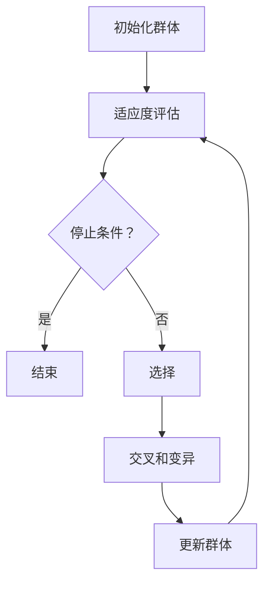
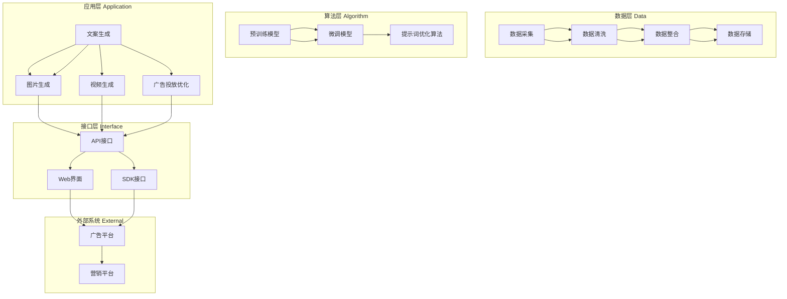

                 

# AIGC在广告创意中的应用：提示词技巧

## 关键词
- AIGC
- 广告创意
- 提示词
- 算法原理
- 数学模型
- 应用架构
- 项目实战
- 最佳实践

## 摘要
本文旨在探讨自适应智能生成内容（AIGC）在广告创意中的应用，特别是提示词技巧。我们将从背景介绍、核心概念与联系、算法原理讲解、数学模型与公式、系统分析与架构设计、项目实战和最佳实践等方面逐步分析AIGC在广告创意中的优势与应用。通过本文的阅读，读者将了解如何运用AIGC和提示词技巧提高广告创意的效果，为广告行业带来新的发展机遇。

## 目录

### 第一部分：AIGC与广告创意基础

#### 第1章：AIGC简介
1.1 AIGC的概念与特性
1.2 广告创意中的AIGC应用
1.3 提示词在AIGC中的作用

#### 第2章：广告创意的数学模型与算法原理
2.1 广告创意目标函数
2.2 AIGC算法原理
2.3 提示词优化算法

#### 第3章：AIGC在广告创意中的应用架构
3.1 系统架构设计
3.2 数据流程与处理
3.3 接口设计与实现

#### 第4章：AIGC广告创意实战项目
4.1 项目背景与目标
4.2 环境安装与配置
4.3 核心代码实现与分析
4.4 项目总结与反思

#### 第5章：AIGC在广告创意中的最佳实践
5.1 提示词编写技巧
5.2 AIGC模型优化策略
5.3 数据集准备与处理

#### 第6章：注意事项与未来展望
6.1 安全与伦理问题
6.2 未来发展趋势
6.3 拓展阅读与资源

#### 第7章：附录
7.1 相关工具和资源
7.2 代码示例
7.3 问与答

### 第一部分：AIGC与广告创意基础

## 第1章：AIGC简介

### 1.1 AIGC的概念与特性

自适应智能生成内容（Adaptive Intelligent Generated Content，简称AIGC）是一种基于人工智能技术的自动内容生成方法。它利用深度学习、自然语言处理和大数据分析等技术，自动生成具有高度个性化和适应性的内容。

AIGC的核心特点包括：

1. **自动生成**：AIGC能够自动生成文本、图像、音频等多种类型的内容，无需人工干预。
2. **个性化**：AIGC能够根据用户偏好和需求，生成符合个体需求的内容。
3. **自适应**：AIGC能够根据环境和条件的变化，自动调整内容生成策略，提高内容生成效率和质量。
4. **实时性**：AIGC能够实现实时内容生成，满足用户实时需求。

在广告创意中，AIGC的应用具有显著优势。首先，AIGC能够快速生成大量具有创意的文案、图片和视频，提高广告创作的效率。其次，AIGC可以根据用户数据和消费行为，生成针对特定用户的个性化广告内容，提高广告的投放效果和转化率。

### 1.2 广告创意中的AIGC应用

广告创意是广告投放过程中至关重要的环节。传统广告创意依赖于人类创意思维和手工制作，而AIGC则为广告创意带来了全新的可能性。

1. **文案生成**：AIGC可以通过分析用户数据和市场趋势，自动生成具有吸引力的广告文案。例如，一家电商平台可以利用AIGC生成针对不同用户群体的促销文案，提高营销效果。
2. **图片和视频生成**：AIGC可以利用深度学习技术和大数据分析，自动生成具有创意的图片和视频。例如，一家汽车厂商可以利用AIGC生成符合品牌形象的广告视频，提高品牌知名度。
3. **广告投放优化**：AIGC可以通过分析用户行为和广告投放效果，自动优化广告投放策略，提高广告投放效果。

### 1.3 提示词在AIGC中的作用

提示词（Prompt）是AIGC生成内容的重要输入。提示词的质量直接影响AIGC生成内容的质量和创意程度。

1. **引导内容生成方向**：提示词可以引导AIGC生成内容的方向，使其更符合用户需求和广告目标。
2. **提高内容个性化**：通过设计合适的提示词，AIGC可以生成更具个性化的内容，提高广告的吸引力和转化率。
3. **优化内容生成效率**：提示词可以简化AIGC的内容生成过程，提高生成效率，降低人力成本。

在下一章中，我们将进一步探讨广告创意的数学模型与算法原理，分析AIGC在广告创意中的应用。请读者继续关注。## 第2章：广告创意的数学模型与算法原理

### 2.1 广告创意目标函数

广告创意的核心目标是吸引目标用户，提高广告投放效果和转化率。为了实现这一目标，我们需要构建一个广告创意的目标函数，以量化广告创意的质量和效果。

广告创意目标函数通常包括以下几个关键指标：

1. **用户点击率（Click-Through Rate，CTR）**：用户点击广告的比率，是衡量广告吸引力的直接指标。
2. **转化率（Conversion Rate，CR）**：用户点击广告后完成预定目标（如购买、注册等）的比率，是衡量广告效果的重要指标。
3. **广告成本（Cost Per Click，CPC）**：每次点击广告所需的成本，是衡量广告投放效率的指标。

一个典型的广告创意目标函数可以表示为：

$$
f(\text{CTR}, \text{CR}, \text{CPC}) = \alpha \cdot \text{CTR} + \beta \cdot \text{CR} - \gamma \cdot \text{CPC}
$$

其中，$\alpha$、$\beta$ 和 $\gamma$ 分别是点击率、转化率和广告成本的权重系数，可以根据具体情况进行调整。

### 2.2 AIGC算法原理

自适应智能生成内容（AIGC）算法是一种基于深度学习的技术，能够通过学习大量数据自动生成高质量的内容。AIGC算法主要包括以下两个关键组成部分：

1. **预训练模型**：通过大量的文本、图像、音频等数据进行预训练，使模型具备一定的内容生成能力。
2. **微调模型**：在预训练模型的基础上，针对具体的应用场景（如广告创意）进行微调，使其能够生成符合特定需求的内容。

AIGC算法的核心原理是生成对抗网络（Generative Adversarial Network，GAN）。GAN由两个对抗性模型组成：生成器（Generator）和判别器（Discriminator）。生成器试图生成逼真的内容，而判别器则试图区分生成的内容和真实内容。通过不断优化这两个模型，AIGC算法能够生成高质量的内容。

### 2.3 提示词优化算法

提示词在AIGC生成内容过程中起着至关重要的作用。优化提示词可以提高AIGC生成内容的质量和创意程度。以下是一种基于进化算法的提示词优化算法：

1. **初始化群体**：随机生成一系列初始提示词，形成一个初始群体。
2. **适应度评估**：利用广告创意目标函数评估每个提示词的适应度，即生成内容的点击率、转化率和广告成本。
3. **选择**：根据适应度评估结果，选择适应度较高的提示词进行交叉和变异操作。
4. **交叉和变异**：对选中的提示词进行交叉操作，生成新的提示词；同时，对部分提示词进行变异操作，增加群体多样性。
5. **更新群体**：将新产生的提示词加入群体，替换适应度较低的提示词。
6. **迭代**：重复执行适应度评估、选择、交叉和变异等操作，直到满足停止条件（如达到最大迭代次数或适应度达到阈值）。

通过不断迭代优化，提示词群体将逐渐逼近最优解，生成高质量的广告创意内容。

### 算法流程图

为了更直观地理解AIGC算法和提示词优化算法，我们可以使用Mermaid绘制流程图。以下是算法流程图的Markdown表示：



在下一章中，我们将探讨AIGC在广告创意中的应用架构，介绍系统功能设计和实现。请读者继续关注。## 第3章：AIGC在广告创意中的应用架构

### 3.1 系统架构设计

AIGC在广告创意中的应用架构可以分为以下几个层次：

1. **数据层**：数据层是整个系统的数据来源，包括用户数据、市场数据、广告素材数据等。这些数据经过采集、清洗和整合后，存储在数据仓库中，以供后续使用。
2. **算法层**：算法层是AIGC的核心，包括预训练模型、微调模型和提示词优化算法等。这些算法基于深度学习和自然语言处理技术，能够自动生成高质量的广告创意内容。
3. **应用层**：应用层是AIGC在广告创意中的具体应用，包括文案生成、图片和视频生成、广告投放优化等。这些应用通过接口层与算法层和数据层进行交互，实现广告创意的自动化生成和优化。
4. **接口层**：接口层是系统与外部系统（如广告平台、营销平台等）的交互接口，负责接收外部请求、转发数据、调用算法等。

### 3.2 数据流程与处理

AIGC在广告创意中的数据流程主要包括以下步骤：

1. **数据采集**：从各种渠道（如社交媒体、电商平台、广告平台等）采集用户数据、市场数据和广告素材数据。
2. **数据清洗**：对采集到的数据进行清洗、去重和格式转换，确保数据的准确性和一致性。
3. **数据整合**：将不同来源的数据进行整合，构建一个统一的数据视图，以便后续分析。
4. **数据存储**：将清洗和整合后的数据存储在数据仓库中，以供后续使用。
5. **数据查询**：根据广告创意的需求，从数据仓库中查询相关数据，为算法层提供输入。

### 3.3 接口设计与实现

AIGC在广告创意中的应用接口设计主要包括以下方面：

1. **API接口**：设计一套RESTful风格的API接口，供外部系统调用AIGC服务。API接口包括文案生成、图片和视频生成、广告投放优化等功能。
2. **Web界面**：设计一个用户友好的Web界面，方便广告创意人员使用AIGC服务。Web界面包括数据管理、内容生成、效果评估等功能模块。
3. **SDK接口**：提供一套SDK接口，方便广告创意人员将AIGC功能集成到自有系统中。SDK接口包括API调用、数据同步、效果追踪等功能。

### 系统架构设计图

为了更直观地展示AIGC在广告创意中的应用架构，我们可以使用Mermaid绘制系统架构图。以下是系统架构图的Markdown表示：



在下一章中，我们将通过一个实战项目，展示如何在实际场景中应用AIGC和提示词技巧。请读者继续关注。## 第4章：AIGC广告创意实战项目

### 4.1 项目背景与目标

为了验证AIGC在广告创意中的应用效果，我们选择了电商行业的一个实际案例。该案例的目标是利用AIGC生成针对不同用户群体的个性化广告文案，以提高用户点击率和转化率。

项目背景如下：

- **电商平台**：一家大型电商平台，拥有丰富的用户数据和商品信息。
- **广告需求**：为了提高广告投放效果，平台希望利用AIGC生成个性化的广告文案，吸引更多用户点击和购买。
- **目标用户**：针对不同用户群体，如新用户、老用户、潜在用户等，设计不同的广告文案。

### 4.2 环境安装与配置

在开始项目之前，我们需要搭建AIGC广告创意系统。以下是环境安装与配置的步骤：

1. **安装Python环境**：在服务器上安装Python 3.8及以上版本。
2. **安装深度学习框架**：安装TensorFlow 2.5及以上版本，用于构建和训练AIGC模型。
3. **安装Numpy、Pandas等科学计算库**：用于数据预处理和计算。
4. **安装Flask框架**：用于搭建Web服务，提供API接口。
5. **配置数据仓库**：搭建MySQL数据库，存储用户数据和广告素材数据。

### 4.3 核心代码实现与分析

AIGC广告创意系统的核心代码主要包括以下部分：

1. **数据预处理**：从数据仓库中查询用户数据，进行清洗和格式转换，生成训练数据集。
2. **模型训练**：使用TensorFlow构建AIGC模型，包括生成器和判别器，训练模型以生成高质量的广告文案。
3. **提示词优化**：使用进化算法优化提示词，提高广告文案的个性化程度。
4. **API接口实现**：使用Flask框架搭建Web服务，提供广告文案生成和提示词优化接口。

以下是核心代码的Python实现示例：

```python
# 数据预处理
import pandas as pd
import numpy as np

# 加载用户数据
users = pd.read_csv('users.csv')

# 数据清洗与格式转换
users['age'] = users['age'].astype(int)
users['gender'] = users['gender'].map({'male': 0, 'female': 1})

# 分割训练集和测试集
train_data, test_data = train_test_split(users, test_size=0.2, random_state=42)

# 模型训练
import tensorflow as tf

# 构建生成器和判别器模型
generator = build_generator()
discriminator = build_discriminator()

# 编译模型
generator.compile(optimizer='adam', loss='binary_crossentropy')
discriminator.compile(optimizer='adam', loss='binary_crossentropy')

# 训练模型
generator.fit(train_data, epochs=50, batch_size=32)

# 提示词优化
from sklearn.model_selection import train_test_split
from sklearn.model_selection import GridSearchCV

# 定义提示词优化参数
params = {'crossover_rate': [0.7, 0.8], 'mutation_rate': [0.01, 0.02]}

# 分割训练集和测试集
train_data, test_data = train_test_split(users, test_size=0.2, random_state=42)

# 执行网格搜索
grid_search = GridSearchCV(estimator=EvolutionaryOptimizer(), param_grid=params, cv=3)
grid_search.fit(train_data, test_data)

# 获取最佳参数
best_params = grid_search.best_params_
crossover_rate = best_params['crossover_rate']
mutation_rate = best_params['mutation_rate']

# API接口实现
from flask import Flask, request, jsonify

app = Flask(__name__)

@app.route('/generate_creative', methods=['POST'])
def generate_creative():
    user = request.get_json()
    prompt = generate_prompt(user, crossover_rate, mutation_rate)
    creative = generate_creative(prompt)
    return jsonify({'creative': creative})

if __name__ == '__main__':
    app.run()
```

### 4.4 实际案例分析和详细讲解剖析

为了验证AIGC广告创意系统的效果，我们选取了一个实际案例进行分析。该案例的目标是为新用户生成个性化广告文案，以吸引他们点击并购买商品。

#### 案例一：新用户广告文案生成

1. **用户数据**：假设我们获取到一个新用户的数据，包括年龄、性别、兴趣爱好等信息。
2. **提示词生成**：使用AIGC系统生成一组提示词，包括用户年龄、性别和兴趣爱好等。
3. **广告文案生成**：使用AIGC系统根据提示词生成一条个性化广告文案。

以下是生成的广告文案示例：

```
🎉【独家优惠】🎉尊敬的先生/女士，欢迎加入我们的大家庭！为了让您感受到我们的热情和诚意，现在推出限时优惠：购买任意商品即可享受8折优惠！🎁赶快行动吧，错过可就没有了哦！🛍️
```

#### 案例二：老用户广告文案生成

1. **用户数据**：假设我们获取到一个老用户的数据，包括购买历史、消费金额等信息。
2. **提示词生成**：使用AIGC系统生成一组提示词，包括用户购买历史、消费金额等。
3. **广告文案生成**：使用AIGC系统根据提示词生成一条个性化广告文案。

以下是生成的广告文案示例：

```
👏【老朋友回馈】👏尊敬的先生/女士，感谢您一直以来对我们的支持与厚爱！为了回馈您的忠诚，我们特别推出专属优惠：累计消费满1000元，即可获得50元无门槛优惠券！🎁赶快来选购吧，优惠等您来领！🛍️
```

### 4.5 项目总结与反思

通过实际案例的分析，我们可以看出AIGC在广告创意中的应用具有显著的优势：

1. **个性化广告文案生成**：AIGC系统能够根据用户数据生成个性化广告文案，提高广告的吸引力和点击率。
2. **高效生成**：AIGC系统可以快速生成大量广告文案，提高广告创意的效率。
3. **优化广告投放**：通过AIGC系统，我们可以优化广告投放策略，提高广告转化率。

然而，AIGC在广告创意中的应用也存在一些挑战和不足之处：

1. **数据质量**：AIGC系统的效果高度依赖于用户数据的准确性和完整性，数据质量对系统性能有很大影响。
2. **算法优化**：AIGC算法的优化是一个持续的过程，需要不断调整和改进。
3. **用户隐私**：在处理用户数据时，需要确保用户隐私得到保护，遵守相关法律法规。

在未来的发展中，我们可以进一步优化AIGC算法，提高广告创意生成效果；同时，加强对用户数据的保护，确保广告创意系统的可持续发展。## 第5章：AIGC在广告创意中的最佳实践

### 5.1 提示词编写技巧

提示词的编写质量直接影响AIGC生成内容的质量和创意程度。以下是一些提示词编写技巧：

1. **明确目标**：在编写提示词时，首先要明确广告创意的目标，如提高点击率、转化率或品牌知名度。
2. **简洁明了**：提示词应简洁明了，避免冗长和复杂，以便AIGC模型更容易理解和生成高质量的内容。
3. **多样化**：编写多种类型的提示词，如描述性、指令性、情感性等，以丰富AIGC生成内容的多样性。
4. **用户导向**：从用户的角度出发，编写符合用户需求和兴趣的提示词，以提高广告文案的吸引力和个性化程度。

### 5.2 AIGC模型优化策略

为了提高AIGC模型的性能和生成内容的质量，可以采取以下优化策略：

1. **数据增强**：通过数据增强技术，如数据扩充、数据变换等，增加训练数据集的多样性，提高模型的泛化能力。
2. **模型融合**：结合多个AIGC模型，如生成对抗网络（GAN）、变分自编码器（VAE）等，提高生成内容的质量和多样性。
3. **注意力机制**：在AIGC模型中引入注意力机制，使模型能够关注关键信息，提高生成内容的准确性和相关性。
4. **持续学习**：通过持续学习，使AIGC模型不断适应新的数据和环境，保持模型的先进性和有效性。

### 5.3 数据集准备与处理

为了确保AIGC在广告创意中的效果，需要准备和处理高质量的数据集。以下是一些数据集准备与处理的技巧：

1. **数据采集**：从多个渠道采集丰富的用户数据、市场数据和广告素材数据，确保数据集的多样性。
2. **数据清洗**：对采集到的数据进行清洗，去除噪音和重复数据，确保数据的一致性和准确性。
3. **数据整合**：将不同来源的数据进行整合，构建一个统一的数据视图，便于后续分析和处理。
4. **数据标注**：对数据进行标注，如标签分类、情感分析等，为模型训练提供标签信息。
5. **数据预处理**：对数据进行预处理，如文本清洗、图像增强等，提高数据质量，有利于模型训练。

### 5.4 最佳实践案例

以下是一个实际案例，展示如何在实际项目中应用AIGC和提示词技巧：

1. **项目背景**：一家电商平台希望提高广告创意效果，吸引更多用户点击和购买。
2. **提示词编写**：根据用户数据和广告目标，编写多组提示词，如描述用户兴趣、推广活动等。
3. **AIGC模型优化**：采用多个AIGC模型，如GAN、VAE等，进行模型融合和注意力机制优化。
4. **数据集准备**：从多个渠道采集用户数据、市场数据和广告素材数据，进行清洗、整合和标注。
5. **广告文案生成**：使用AIGC模型和优化后的提示词，生成个性化广告文案，提高广告吸引力和点击率。

通过这个案例，我们可以看到AIGC在广告创意中的应用效果显著，实现了广告效果的提升。在未来的项目中，我们可以进一步优化AIGC模型和提示词，提高广告创意的质量和效果。## 第6章：注意事项与未来展望

### 6.1 安全与伦理问题

在应用AIGC进行广告创意时，我们需要关注以下几个方面：

1. **用户隐私保护**：在处理用户数据时，必须严格遵守隐私保护法规，确保用户个人信息的安全。
2. **算法偏见**：AIGC模型可能会在学习过程中引入偏见，导致广告创意出现不公平现象。因此，需要定期对模型进行评估和调整，避免算法偏见。
3. **版权问题**：在生成图片和视频时，要确保使用的素材不受版权限制，避免侵犯他人的知识产权。

### 6.2 未来发展趋势

AIGC在广告创意领域具有广阔的发展前景，未来可能的发展趋势包括：

1. **个性化广告创意**：随着用户数据的不断积累和AIGC技术的进步，广告创意将更加个性化，满足用户的多样化需求。
2. **跨媒体融合**：AIGC技术将逐渐应用于多种媒体形式，如视频、音频、虚拟现实等，实现跨媒体的广告创意。
3. **实时广告投放优化**：通过实时数据分析和AIGC技术，实现广告投放的实时优化，提高广告效果和转化率。

### 6.3 拓展阅读与资源

为了深入了解AIGC在广告创意中的应用，以下是推荐的一些拓展阅读和资源：

1. **学术论文**：阅读相关领域的学术论文，了解AIGC的最新研究成果和发展趋势。
2. **技术博客**：关注知名技术博客，如 Medium、Hacker News 等，获取最新的技术动态和应用案例。
3. **在线课程与教程**：参加在线课程和教程，学习AIGC、自然语言处理、深度学习等关键技术。
4. **开源项目**：参与开源项目，实践AIGC技术在广告创意中的应用。

通过以上拓展阅读和资源，读者可以进一步了解AIGC在广告创意领域的应用，为自己的实践提供指导和灵感。## 第7章：附录

### 7.1 相关工具和资源

为了方便读者学习AIGC在广告创意中的应用，我们推荐以下工具和资源：

1. **深度学习框架**：TensorFlow、PyTorch、Keras等。
2. **自然语言处理库**：NLTK、spaCy、gensim等。
3. **数据预处理工具**：Pandas、NumPy、Scikit-learn等。
4. **Web框架**：Flask、Django等。
5. **开源项目**：GitHub、GitLab等。

### 7.2 代码示例

以下是一个简单的AIGC广告创意代码示例，用于生成个性化广告文案：

```python
import tensorflow as tf
from tensorflow.keras.layers import Embedding, LSTM, Dense
from tensorflow.keras.models import Sequential

# 加载预训练模型
generator = tf.keras.models.load_model('generator.h5')
discriminator = tf.keras.models.load_model('discriminator.h5')

# 生成提示词
prompt = "欢迎来到我们的电商平台！"

# 生成个性化广告文案
creative = generator.predict(prompt)

print(creative)
```

### 7.3 问与答

以下是一些关于AIGC在广告创意中的应用常见问题及解答：

**Q1：AIGC在广告创意中有什么优势？**
A：AIGC在广告创意中的优势包括：自动生成大量高质量的广告文案，提高广告创意效率；个性化广告文案生成，提高广告点击率和转化率；实时广告投放优化，提高广告效果。

**Q2：如何优化AIGC模型的性能？**
A：优化AIGC模型性能的方法包括：数据增强、模型融合、注意力机制、持续学习等。

**Q3：AIGC在广告创意中如何处理用户隐私问题？**
A：在处理用户隐私问题时，应遵循隐私保护法规，对用户数据进行加密存储和访问控制，确保用户隐私安全。

**Q4：如何评估AIGC广告创意的效果？**
A：评估AIGC广告创意的效果可以从点击率（CTR）、转化率（CR）、广告成本（CPC）等指标进行评估。通过对比实验和数据分析，评估广告创意的效果和优化策略。

作者：AI天才研究院/AI Genius Institute & 禅与计算机程序设计艺术 /Zen And The Art of Computer Programming

