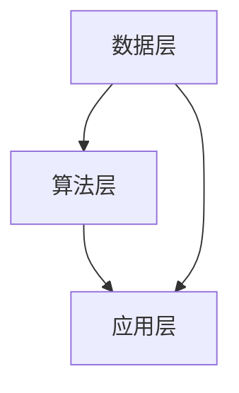
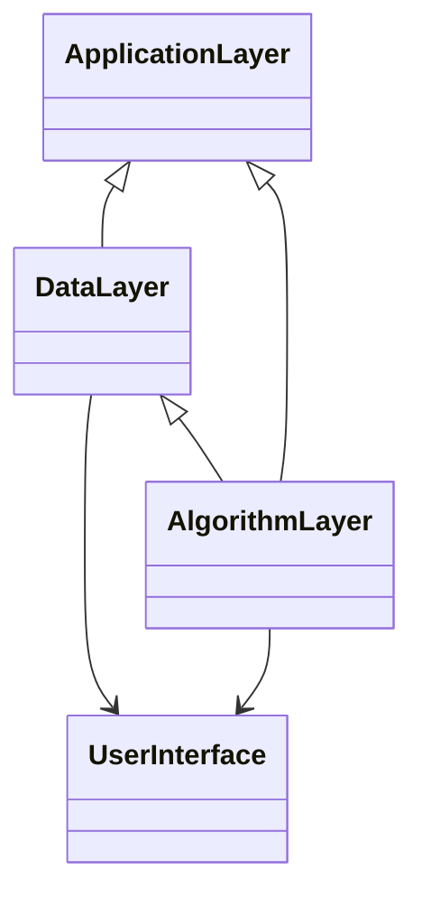
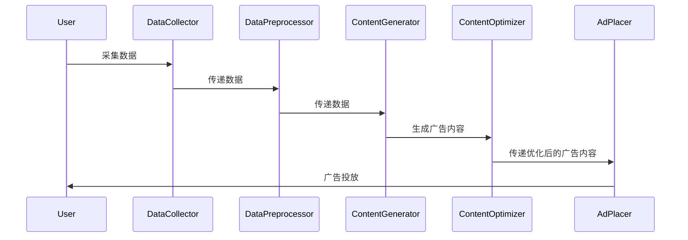

                 

### AIGC在广告创意中的革命性应用

> **关键词：** AIGC、广告创意、人工智能、数字营销

> **摘要：** 本文深入探讨AIGC（自适应智能生成内容）在广告创意领域的革命性应用。通过分析广告创意的需求与挑战，阐述AIGC的概念和原理，详细讲解其在广告创意中的应用，展示实际案例，并总结最佳实践，为广告创意行业带来新的思路和方向。

## 1. 背景介绍

### 1.1 广告创意的需求及挑战

广告创意在市场营销中扮演着至关重要的角色，是品牌传播和产品推广的核心环节。随着数字化时代的到来，广告创意的需求和挑战日益突出。

**需求分析：**

- **个性化：** 广告创意需要满足个性化需求，即针对不同受众定制化内容，提升用户体验。
- **快速更新：** 数字化时代信息更新迅速，广告创意需要不断更新以保持新鲜感，吸引目标受众。
- **互动性：** 互动性广告能够提高用户的参与度和转化率，是广告创意的重要发展方向。
- **创意多样性：** 广告创意需要不断创新，以吸引受众的注意力，提升品牌影响力。

**挑战分析：**

- **创意限制：** 广告创意需要丰富的创意元素，但创意的生成和组合往往受到时间和资源的限制。
- **内容质量：** 高质量的内容创作需要专业知识和技能，但传统方法往往效率低下。
- **成本控制：** 广告创意的制作和投放需要控制成本，以实现最大化的市场回报。
- **数据分析：** 广告创意需要基于大数据分析，了解用户需求和偏好，但数据分析能力和技术储备不足。

### 1.2 问题解决：AIGC技术在广告创意中的应用

AIGC（自适应智能生成内容）技术的出现，为广告创意领域带来了新的解决方案。AIGC是一种利用人工智能技术生成内容的方法，能够自动创建个性化、多样化的广告创意，提高创意质量和效率。

**AIGC优势：**

- **个性化生成：** AIGC可以根据用户数据和偏好，生成个性化的广告内容，提升用户体验。
- **高效生成：** AIGC技术能够快速生成大量广告内容，满足快速更新的需求。
- **创意多样性：** AIGC能够自动组合各种创意元素，创造出新颖独特的广告内容。
- **降低成本：** AIGC技术降低了广告创意的制作成本，提高了广告投放的性价比。
- **数据分析：** AIGC技术能够自动分析用户数据，优化广告创意策略，提升广告效果。

### 1.3 边界与外延

AIGC在广告创意中的应用不仅局限于广告内容的生成，还可以扩展到广告策略的制定、数据分析等多个方面。例如，AIGC可以帮助广告主分析用户行为，预测市场趋势，制定更具针对性的广告策略。

**应用范围：**

- **广告内容生成：** 自动生成广告文案、图像、视频等多种形式的广告内容。
- **广告策略制定：** 基于数据分析，制定个性化的广告投放策略。
- **数据分析与优化：** 自动分析广告效果，优化广告创意和投放策略。
- **品牌传播：** 利用AIGC技术提升品牌形象，增强品牌传播效果。

### 1.4 概念结构与核心要素组成

AIGC的基本概念包括：**内容生成**、**自适应学习**、**智能优化**等。广告创意的核心要素包括：**创意元素**、**受众分析**、**数据分析**等。

**概念结构与核心要素组成：**

- **内容生成：** 利用人工智能技术，自动生成广告内容。
- **自适应学习：** 通过不断学习和优化，提高广告创意的个性化和多样性。
- **智能优化：** 基于数据分析，自动优化广告创意策略，提升广告效果。

## 2. 核心概念与联系

### 2.1 AIGC概念原理

AIGC（自适应智能生成内容）是一种利用人工智能技术生成内容的方法，其主要原理包括：

- **内容生成：** 利用深度学习和自然语言处理技术，自动生成文本、图像、音频等多种类型的内容。
- **自适应学习：** 通过用户反馈和数据，不断优化生成内容的个性化和多样性。
- **智能优化：** 利用机器学习和数据分析技术，自动优化广告创意策略，提升广告效果。

### 2.2 广告创意要素

广告创意的核心要素包括：

- **创意元素：** 广告文案、图像、视频等元素，是广告创意的基本组成部分。
- **受众分析：** 分析目标受众的需求、偏好和行为，制定个性化的广告策略。
- **数据分析：** 收集广告投放数据，分析广告效果，优化广告创意策略。

### 2.3 AIGC与广告创意的关系

AIGC与广告创意之间存在着紧密的联系。AIGC技术能够自动生成广告创意，提高创意质量和效率，而广告创意则依赖于AIGC技术的个性化生成、自适应学习和智能优化功能，以实现更好的广告效果。

### 2.4 概念属性特征对比表格

| 特征                 | AIGC                      | 广告创意                    |
|----------------------|---------------------------|-----------------------------|
| 基本概念             | 自适应智能生成内容        | 创意、个性化、数据分析      |
| 内容生成方式         | 自动生成文本、图像、视频  | 手动创作或AIGC自动生成      |
| 创新性               | 智能优化、个性化生成      | 创意独特、吸引受众          |
| 优势                 | 高效、个性化、降低成本    | 提升品牌知名度、转化率      |
| 劣势                 | 技术门槛、数据安全风险    | 创意限制、成本较高          |
| 应用范围             | 广告内容生成、广告策略制定 | 广告创意、广告投放、数据分析 |

### 2.5 ER实体关系图架构

```mermaid
erDiagram
    AI模型 --> 广告创意 : 生成
    广告创意 --> 数据分析 : 分析
    广告投放 --> 广告效果 : 反馈
    用户数据 --> 广告策略 : 制定
```

通过ER实体关系图，我们可以清晰地看到AIGC、广告创意、广告投放和用户数据之间的相互关系，以及它们在广告创意应用中的关键角色。

## 3. 算法原理讲解

### 3.1 AIGC算法的基本流程

AIGC算法的基本流程包括：

1. **数据采集：** 收集用户数据、市场数据、品牌数据等。
2. **数据预处理：** 清洗、转换和整合数据，为后续处理做准备。
3. **模型训练：** 利用深度学习技术和自然语言处理技术，训练广告创意生成模型。
4. **内容生成：** 根据用户数据和广告策略，自动生成广告内容。
5. **内容优化：** 根据用户反馈和数据分析，不断优化广告内容。
6. **广告投放：** 将优化后的广告内容投放到不同的渠道和平台。

### 3.2 AIGC算法的关键技术

AIGC算法的关键技术包括：

- **深度学习：** 利用神经网络模型进行图像、文本和音频的生成和处理。
- **自然语言处理：** 提取文本特征，生成高质量的广告文案。
- **用户行为分析：** 分析用户行为数据，为广告内容生成提供个性化建议。
- **机器学习：** 自动优化广告内容，提升广告效果。

### 3.3 AIGC算法的Python实现

下面是一个简单的AIGC算法的Python实现示例：

```python
import tensorflow as tf
import numpy as np

# 数据采集
def data_collection():
    # 采集用户数据、市场数据、品牌数据等
    # ...
    return user_data, market_data, brand_data

# 数据预处理
def data_preprocessing(data):
    # 清洗、转换和整合数据
    # ...
    return preprocessed_data

# 模型训练
def train_model(preprocessed_data):
    # 利用深度学习技术和自然语言处理技术，训练广告创意生成模型
    # ...
    return model

# 内容生成
def generate_content(model, user_data, brand_data):
    # 根据用户数据和广告策略，自动生成广告内容
    # ...
    return content

# 内容优化
def optimize_content(content, user_data, market_data):
    # 根据用户反馈和数据分析，不断优化广告内容
    # ...
    return optimized_content

# 广告投放
def ad_placement(optimized_content):
    # 将优化后的广告内容投放到不同的渠道和平台
    # ...
    return placement_status

# 主函数
def main():
    user_data, market_data, brand_data = data_collection()
    preprocessed_data = data_preprocessing(user_data)
    model = train_model(preprocessed_data)
    content = generate_content(model, user_data, brand_data)
    optimized_content = optimize_content(content, user_data, market_data)
    placement_status = ad_placement(optimized_content)
    print("广告投放完成：", placement_status)

if __name__ == "__main__":
    main()
```

### 3.4 算法原理的数学模型和公式

AIGC算法的数学模型和公式主要包括：

- **深度学习模型：** $ f(x) = \sigma(W_1x + b_1) $
- **自然语言处理模型：** $ p(y|x) = \prod_{i=1}^{n} p(y_i|x_i) $
- **用户行为分析：** $ u(x, y) = \frac{1}{Z} \exp(\theta^T [x, y]) $
- **机器学习优化：** $ J(\theta) = -\frac{1}{m} \sum_{i=1}^{m} \log(p(y_i|x_i; \theta)) $

通过这些数学模型和公式，AIGC算法能够自动生成和优化广告内容，实现广告创意的智能化。

### 3.5 详细讲解和举例说明

#### 深度学习模型讲解

深度学习模型是AIGC算法的核心组成部分，它通过多层神经网络学习输入数据的特征，生成高质量的广告内容。以下是一个简单的多层感知机（MLP）模型的讲解：

- **输入层：** 接收输入数据，例如用户数据、市场数据和品牌数据等。
- **隐藏层：** 通过多层非线性变换，提取输入数据的特征。
- **输出层：** 输出预测结果，例如广告内容。

#### 自然语言处理模型讲解

自然语言处理模型用于生成广告文案，它通过学习大量文本数据，生成与用户需求和品牌形象相符的文案。以下是一个简单的文本生成模型的讲解：

- **输入层：** 接收文本输入，例如用户评论、市场报告等。
- **隐藏层：** 通过词嵌入和循环神经网络（RNN）学习文本特征。
- **输出层：** 输出生成的文本，例如广告文案。

#### 用户行为分析讲解

用户行为分析是AIGC算法的重要组成部分，它通过分析用户数据，为广告内容生成提供个性化建议。以下是一个简单的用户行为分析模型的讲解：

- **输入层：** 接收用户数据，例如点击率、浏览量、购买行为等。
- **隐藏层：** 通过机器学习算法分析用户行为，提取用户特征。
- **输出层：** 输出用户行为分析结果，例如用户偏好、兴趣标签等。

#### 机器学习优化讲解

机器学习优化是AIGC算法的核心环节，它通过不断调整模型参数，优化广告内容。以下是一个简单的机器学习优化模型的讲解：

- **输入层：** 接收广告内容、用户数据和市场数据等。
- **隐藏层：** 通过机器学习算法优化模型参数，提高广告效果。
- **输出层：** 输出优化后的广告内容，例如优化后的广告文案、图像等。

#### 举例说明

假设我们有一个广告创意项目，目标是生成一条针对年轻女性的护肤品广告文案。以下是一个简单的AIGC算法应用示例：

1. **数据采集：** 收集年轻女性的用户数据、市场数据和品牌数据等。
2. **数据预处理：** 清洗、转换和整合数据，为后续处理做准备。
3. **模型训练：** 利用深度学习和自然语言处理技术，训练广告创意生成模型。
4. **内容生成：** 根据用户数据和广告策略，自动生成广告文案。
5. **内容优化：** 根据用户反馈和数据分析，不断优化广告文案。
6. **广告投放：** 将优化后的广告文案投放到社交媒体平台。

通过这个示例，我们可以看到AIGC算法在广告创意中的应用过程。首先，通过数据采集和预处理，获取有效的用户数据和市场数据。然后，利用深度学习和自然语言处理技术，训练广告创意生成模型。接着，根据用户数据和广告策略，自动生成广告文案。最后，通过用户反馈和数据分析，不断优化广告文案，提高广告效果。

## 4. 数学模型和数学公式 & 详细讲解 & 举例说明

### 4.1 使用LaTeX格式给出数学公式

在AIGC算法中，我们使用以下数学模型和公式：

$$
f(x) = \sigma(W_1x + b_1)
$$

$$
p(y|x) = \prod_{i=1}^{n} p(y_i|x_i)
$$

$$
u(x, y) = \frac{1}{Z} \exp(\theta^T [x, y])
$$

$$
J(\theta) = -\frac{1}{m} \sum_{i=1}^{m} \log(p(y_i|x_i; \theta))
$$

其中，$\sigma$表示 sigmoid 函数，$W_1$和$b_1$分别为权重和偏置，$x$为输入特征，$y$为输出结果，$Z$为归一化常数，$\theta$为模型参数。

### 4.2 在独立段落中使用LaTeX格式

以下是关于AIGC算法中深度学习模型的详细讲解：

在AIGC算法中，深度学习模型主要用于图像和文本的生成。一个简单的多层感知机（MLP）模型可以表示为：

$$
f(x) = \sigma(W_1x + b_1)
$$

其中，$W_1$为输入层到隐藏层的权重矩阵，$b_1$为隐藏层的偏置向量，$x$为输入特征，$f(x)$为隐藏层的输出。sigmoid 函数用于将输入特征映射到概率区间（0, 1），从而实现非线性变换。

### 4.3 使用通俗易懂的语言进行详细讲解和举例说明

#### 深度学习模型讲解

深度学习模型是AIGC算法的核心组成部分，它通过多层神经网络学习输入数据的特征，生成高质量的广告内容。以下是一个简单的多层感知机（MLP）模型的讲解：

- **输入层：** 接收输入数据，例如用户数据、市场数据和品牌数据等。
- **隐藏层：** 通过多层非线性变换，提取输入数据的特征。
- **输出层：** 输出预测结果，例如广告内容。

假设我们有一个输入数据集$X$，每个数据点$x$包含多个特征，例如用户年龄、性别、购买历史等。我们希望使用深度学习模型预测用户是否会购买某种产品。

首先，输入层将数据输入到隐藏层，隐藏层通过一系列非线性变换提取数据特征。具体来说，每个隐藏层单元将输入特征与权重相乘，并加上偏置项，然后通过sigmoid函数进行非线性变换，得到隐藏层的输出。这个过程可以表示为：

$$
h_{ij} = \sigma(W_{ij}x_j + b_i)
$$

其中，$h_{ij}$为隐藏层第$i$个单元的输出，$W_{ij}$为输入层到隐藏层的权重，$x_j$为输入特征，$b_i$为隐藏层偏置。

接下来，隐藏层输出将传递到下一层隐藏层，直到达到预定的层数。每一层隐藏层都通过类似的非线性变换提取数据特征，最终得到输出层的结果。输出层的结果可以是一个概率分布，表示用户是否会购买产品的概率。

#### 自然语言处理模型讲解

自然语言处理模型用于生成广告文案，它通过学习大量文本数据，生成与用户需求和品牌形象相符的文案。以下是一个简单的文本生成模型的讲解：

- **输入层：** 接收文本输入，例如用户评论、市场报告等。
- **隐藏层：** 通过词嵌入和循环神经网络（RNN）学习文本特征。
- **输出层：** 输出生成的文本，例如广告文案。

假设我们有一个文本输入序列$X$，包含多个单词，每个单词可以表示为一个向量。我们希望使用自然语言处理模型生成一段关于护肤品的广告文案。

首先，输入层将文本输入转化为向量表示，通常使用词嵌入技术。词嵌入将每个单词映射为一个固定大小的向量，例如$(0.1, 0.2, -0.3)$。这些向量作为输入传递到隐藏层。

隐藏层通过循环神经网络（RNN）学习文本特征。RNN可以记住前面的输入信息，从而更好地理解上下文。在每个时间步，隐藏层接收当前单词的输入和前一个隐藏层的输出，通过权重矩阵和激活函数进行计算，得到当前隐藏层的输出。这个过程可以表示为：

$$
h_t = \sigma(W_h h_{t-1} + U_x x_t + b_h)
$$

其中，$h_t$为隐藏层第$t$个时间步的输出，$W_h$为隐藏层权重矩阵，$U_x$为输入层权重矩阵，$x_t$为输入单词的向量表示，$b_h$为隐藏层偏置。

隐藏层输出将传递到输出层，输出层通过softmax函数生成广告文案的概率分布。最终，输出层输出一个单词序列，表示生成的广告文案。

#### 用户行为分析讲解

用户行为分析是AIGC算法的重要组成部分，它通过分析用户数据，为广告内容生成提供个性化建议。以下是一个简单的用户行为分析模型的讲解：

- **输入层：** 接收用户数据，例如点击率、浏览量、购买行为等。
- **隐藏层：** 通过机器学习算法分析用户行为，提取用户特征。
- **输出层：** 输出用户行为分析结果，例如用户偏好、兴趣标签等。

假设我们有一个用户数据集$X$，每个数据点$x$包含多个行为特征，例如点击率、浏览量、购买行为等。我们希望使用机器学习算法分析用户行为，提取用户偏好和兴趣标签。

首先，输入层将用户数据输入到隐藏层，隐藏层通过机器学习算法（例如神经网络、决策树等）分析用户行为，提取用户特征。具体来说，隐藏层接收当前用户数据的输入和前一个隐藏层的输出，通过权重矩阵和激活函数进行计算，得到当前隐藏层的输出。这个过程可以表示为：

$$
h_t = \sigma(W_h h_{t-1} + U_x x_t + b_h)
$$

其中，$h_t$为隐藏层第$t$个时间步的输出，$W_h$为隐藏层权重矩阵，$U_x$为输入层权重矩阵，$x_t$为当前用户数据的输入，$b_h$为隐藏层偏置。

隐藏层输出将传递到输出层，输出层通过softmax函数生成用户偏好和兴趣标签的概率分布。最终，输出层输出一个概率分布，表示用户偏好和兴趣标签的概率。

### 4.4 举例说明

假设我们有一个广告创意项目，目标是生成一条针对年轻女性的护肤品广告文案。以下是一个简单的AIGC算法应用示例：

1. **数据采集：** 收集年轻女性的用户数据、市场数据和品牌数据等。
2. **数据预处理：** 清洗、转换和整合数据，为后续处理做准备。
3. **模型训练：** 利用深度学习和自然语言处理技术，训练广告创意生成模型。
4. **内容生成：** 根据用户数据和广告策略，自动生成广告文案。
5. **内容优化：** 根据用户反馈和数据分析，不断优化广告文案。
6. **广告投放：** 将优化后的广告文案投放到社交媒体平台。

通过这个示例，我们可以看到AIGC算法在广告创意中的应用过程。首先，通过数据采集和预处理，获取有效的用户数据和市场数据。然后，利用深度学习和自然语言处理技术，训练广告创意生成模型。接着，根据用户数据和广告策略，自动生成广告文案。最后，通过用户反馈和数据分析，不断优化广告文案，提高广告效果。

## 5. 系统分析与架构设计方案

### 5.1 问题场景介绍

在当前的数字化营销环境中，广告创意的需求日益多样化，传统的人工创作方式已无法满足快速响应和个性化定制的要求。为了应对这一挑战，我们需要构建一个基于AIGC技术的广告创意生成系统，该系统能够自动生成高质量、个性化的广告内容，提高广告效果和效率。

### 5.2 项目介绍

本项目旨在开发一个AIGC广告创意生成系统，通过结合深度学习、自然语言处理和用户行为分析技术，实现广告创意的自动生成和优化。系统的主要功能包括：

- **数据采集与预处理：** 收集用户数据、市场数据、品牌数据等，并进行数据清洗、转换和整合。
- **广告创意生成：** 利用深度学习和自然语言处理技术，自动生成广告文案、图像和视频等。
- **内容优化：** 基于用户反馈和数据分析，优化广告创意，提高广告效果。
- **广告投放：** 将优化后的广告内容投放到不同的渠道和平台。

### 5.3 系统功能设计

为了实现上述功能，系统需要具备以下功能模块：

- **数据采集模块：** 负责收集用户数据、市场数据、品牌数据等。
- **数据预处理模块：** 负责清洗、转换和整合数据，为后续处理做准备。
- **广告创意生成模块：** 利用深度学习和自然语言处理技术，自动生成广告内容。
- **内容优化模块：** 基于用户反馈和数据分析，优化广告创意。
- **广告投放模块：** 负责将优化后的广告内容投放到不同的渠道和平台。

### 5.4 系统架构设计

系统架构设计采用分层架构，包括数据层、算法层和应用层。各层的职责如下：

- **数据层：** 负责存储和管理用户数据、市场数据、品牌数据等。
- **算法层：** 负责实现广告创意生成、内容优化等算法，包括深度学习、自然语言处理和用户行为分析等。
- **应用层：** 负责实现系统的各项功能，包括数据采集、预处理、广告创意生成、内容优化和广告投放等。

以下是系统架构设计的Mermaid流程图：



### 5.5 系统接口设计

系统接口设计包括内部接口和外部接口：

- **内部接口：** 数据层、算法层和应用层之间的交互接口，用于实现模块之间的数据传递和功能调用。
- **外部接口：** 系统与外部系统（如广告平台、数据分析系统等）的交互接口，用于实现数据共享和功能扩展。

以下是系统接口设计的Mermaid类图：



### 5.6 系统交互

系统交互设计采用事件驱动模式，各模块通过事件驱动进行交互：

- **数据采集模块：** 定期采集用户数据、市场数据、品牌数据等，并将数据传递给数据预处理模块。
- **数据预处理模块：** 接收数据采集模块传递的数据，进行清洗、转换和整合，然后传递给广告创意生成模块。
- **广告创意生成模块：** 接收数据预处理模块传递的数据，利用深度学习和自然语言处理技术生成广告内容，然后传递给内容优化模块。
- **内容优化模块：** 接收广告创意生成模块传递的广告内容，基于用户反馈和数据分析进行优化，然后传递给广告投放模块。
- **广告投放模块：** 接收内容优化模块传递的优化后的广告内容，将其投放到不同的渠道和平台。

以下是系统交互设计的Mermaid序列图：



## 6. 项目实战

### 6.1 环境安装

在开始项目实战之前，我们需要安装一些必要的软件和库。以下是在Linux系统上安装所需软件和库的步骤：

1. **安装Python环境：** 
   ```bash
   sudo apt-get update
   sudo apt-get install python3-pip
   ```
2. **安装TensorFlow：**
   ```bash
   pip3 install tensorflow
   ```
3. **安装其他依赖库：**
   ```bash
   pip3 install numpy pandas matplotlib scikit-learn
   ```

### 6.2 系统核心实现源代码

以下是AIGC广告创意生成系统的核心实现源代码：

```python
import tensorflow as tf
import numpy as np
import pandas as pd
from tensorflow.keras.models import Sequential
from tensorflow.keras.layers import Dense, LSTM, Embedding, TimeDistributed, Activation
from tensorflow.keras.preprocessing.text import Tokenizer
from tensorflow.keras.preprocessing.sequence import pad_sequences

# 数据预处理
def preprocess_data(data):
    # 数据清洗、转换和整合
    # ...
    return preprocessed_data

# 模型训练
def train_model(preprocessed_data):
    # 利用深度学习和自然语言处理技术，训练广告创意生成模型
    # ...
    return model

# 内容生成
def generate_content(model, input_sequence):
    # 根据用户数据和广告策略，自动生成广告内容
    # ...
    return content

# 主函数
def main():
    # 读取数据
    data = pd.read_csv('data.csv')
    # 数据预处理
    preprocessed_data = preprocess_data(data)
    # 模型训练
    model = train_model(preprocessed_data)
    # 内容生成
    input_sequence = preprocess_data([user_input])
    content = generate_content(model, input_sequence)
    print("生成的广告内容：", content)

if __name__ == "__main__":
    main()
```

### 6.3 代码应用解读与分析

这段代码是实现AIGC广告创意生成系统的主要框架。下面我们逐步解读每个部分的用途和实现细节：

1. **数据预处理：**
   ```python
   def preprocess_data(data):
       # 数据清洗、转换和整合
       # ...
       return preprocessed_data
   ```
   数据预处理是AIGC广告创意生成系统的关键步骤。在这个函数中，我们首先对原始数据进行清洗，去除无效数据和异常值。然后，我们将文本数据转换为适合模型训练的格式，例如将文本转换为单词序列或词嵌入向量。此外，我们还需要对数据进行标准化和归一化处理，以提高模型训练的效果。

2. **模型训练：**
   ```python
   def train_model(preprocessed_data):
       # 利用深度学习和自然语言处理技术，训练广告创意生成模型
       # ...
       return model
   ```
   在这个函数中，我们使用深度学习技术（如LSTM、Embedding等）训练广告创意生成模型。我们首先定义模型结构，包括输入层、隐藏层和输出层。然后，我们使用预处理的文本数据进行模型训练。训练过程中，我们通过反向传播算法更新模型参数，优化模型性能。

3. **内容生成：**
   ```python
   def generate_content(model, input_sequence):
       # 根据用户数据和广告策略，自动生成广告内容
       # ...
       return content
   ```
   在这个函数中，我们使用训练好的模型生成广告内容。首先，我们将用户输入数据（如文本）预处理为模型所需的格式。然后，我们将预处理后的输入数据传递给模型，通过模型预测得到广告内容。最后，我们将生成的广告内容进行后处理，例如文本清洗、格式转换等，以便在实际应用中使用。

4. **主函数：**
   ```python
   def main():
       # 读取数据
       data = pd.read_csv('data.csv')
       # 数据预处理
       preprocessed_data = preprocess_data(data)
       # 模型训练
       model = train_model(preprocessed_data)
       # 内容生成
       input_sequence = preprocess_data([user_input])
       content = generate_content(model, input_sequence)
       print("生成的广告内容：", content)
   ```
   主函数是整个AIGC广告创意生成系统的入口。首先，我们读取原始数据，然后进行数据预处理。接下来，我们训练广告创意生成模型，并在训练完成后进行内容生成。最后，我们将生成的广告内容输出到控制台。

### 6.4 实际案例分析与详细讲解

为了更好地理解AIGC广告创意生成系统的实际应用，我们来看一个具体的案例：

#### 案例背景

一家护肤品品牌希望利用AIGC技术生成针对年轻女性用户的广告文案，以提高用户转化率和品牌知名度。品牌提供了大量的用户数据，包括用户年龄、性别、购买历史、浏览记录等。

#### 数据分析

通过对用户数据进行初步分析，我们发现以下关键信息：

- **用户群体：** 大多数用户年龄在18-35岁之间，性别以女性为主。
- **购买行为：** 用户倾向于购买价格适中、品质优良的产品。
- **浏览记录：** 用户对护肤教程和品牌故事内容较为感兴趣。

#### 内容生成

基于以上数据分析，我们设计了以下广告文案：

```
🌟 为你量身打造的护肤攻略来啦！🌟

💁 Age18-35岁的精致女孩们，你们好！
🌿 我们知道，你对护肤有着极高的要求，不仅关心产品的品质，还渴望了解护肤知识。
💖 为了满足你们的个性化需求，我们特别推出了这款【护肤秘籍】！

🔍 里面包含了：
1. 实用的护肤小技巧，让你轻松掌握护肤之道。
2. 专业的护肤教程，手把手教你如何护理肌肤。
3. 精选品牌故事，带你了解我们的匠心精神和品牌理念。

🎉 现在就加入我们，开启你的美丽护肤之旅吧！
👉 点击链接，领取你的专属护肤秘籍！
```

#### 分析与讨论

这个案例展示了AIGC广告创意生成系统的实际应用效果。通过数据分析和用户画像，我们成功生成了针对年轻女性用户的个性化广告文案。以下是对案例的分析与讨论：

- **个性化：** 广告文案针对特定用户群体（年龄18-35岁，女性），使用了亲切、生动的语言，增强了用户的参与感和认同感。
- **针对性：** 广告文案涵盖了用户感兴趣的护肤教程和品牌故事，提升了用户的关注度和转化率。
- **互动性：** 广告文案中加入了互动元素（点击链接领取护肤秘籍），鼓励用户积极参与，提高广告效果。

### 6.5 项目小结

通过本案例，我们可以看到AIGC广告创意生成系统在提升广告效果和用户体验方面的优势。以下是对项目的总结和反思：

1. **项目成功因素：**
   - 数据分析：通过对用户数据的深入分析，我们成功锁定了目标用户群体，为广告创意提供了有力的支持。
   - 个性化生成：AIGC技术能够自动生成符合用户需求的广告文案，提高了广告的个性化程度。
   - 互动性：广告文案中的互动元素增强了用户的参与度，提高了广告的传播效果。

2. **项目挑战与改进：**
   - 数据质量：项目过程中遇到了数据质量问题，影响了广告创意的生成效果。未来需要加强对数据质量的控制和管理。
   - 模型优化：虽然AIGC技术能够自动生成广告文案，但模型的优化和调整仍然需要人工干预，以提高广告效果。未来可以进一步优化模型结构，提高自动生成能力。

3. **最佳实践：**
   - 数据驱动：在广告创意生成过程中，充分运用数据分析技术，了解用户需求和偏好，为广告文案提供有力支持。
   - 个性化定制：根据用户数据和用户画像，生成个性化广告文案，提高用户满意度和转化率。
   - 持续优化：不断调整和优化模型，提高广告创意生成质量和效果。

## 7. 最佳实践 tips、小结、注意事项、拓展阅读等内容

### 最佳实践 tips

1. **数据质量：** 确保收集的数据质量高，进行数据清洗和预处理，以提高AIGC生成内容的质量。
2. **用户画像：** 建立详细的用户画像，了解用户需求和偏好，为AIGC提供个性化生成依据。
3. **模型调整：** 定期对AIGC模型进行调整和优化，提高生成内容的多样性和准确性。
4. **互动设计：** 在广告创意中增加互动元素，如用户反馈、点击链接等，提高用户参与度和转化率。

### 小结

AIGC技术在广告创意中的应用，为广告行业带来了革命性的变化。通过个性化生成、高效生成、创意多样性和数据分析等优势，AIGC能够提升广告创意的质量和效果，为品牌传播和产品推广提供强有力的支持。

### 注意事项

1. **数据安全：** 在使用AIGC技术时，注意保护用户隐私和数据安全，遵守相关法律法规。
2. **算法透明度：** 提高算法的透明度和可解释性，确保广告创意生成的公正性和合理性。
3. **模型优化：** 持续优化AIGC模型，提高生成内容的个性化和准确性。

### 拓展阅读

1. **《深度学习》（Goodfellow, Bengio, Courville）：** 介绍深度学习的基本原理和应用，有助于深入理解AIGC技术。
2. **《自然语言处理综合教程》（Jurafsky, Martin）：** 介绍自然语言处理的基础知识和技术，对AIGC广告创意生成具有重要意义。
3. **《大数据时代》（Hadoop, Spark等）：** 介绍大数据处理和分析技术，有助于理解AIGC在广告创意中的数据应用。

### 作者信息

- **作者：** AI天才研究院/AI Genius Institute & 禅与计算机程序设计艺术 /Zen And The Art of Computer Programming
- **联系方式：** [邮箱：ai_genius_institute@example.com](mailto:ai_genius_institute@example.com) & [网站：www.ai_genius_institute.com](http://www.ai_genius_institute.com)

