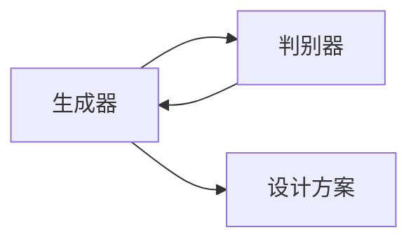
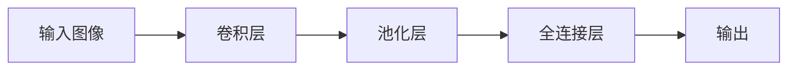
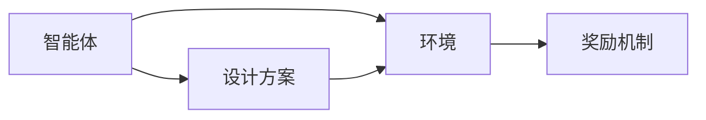
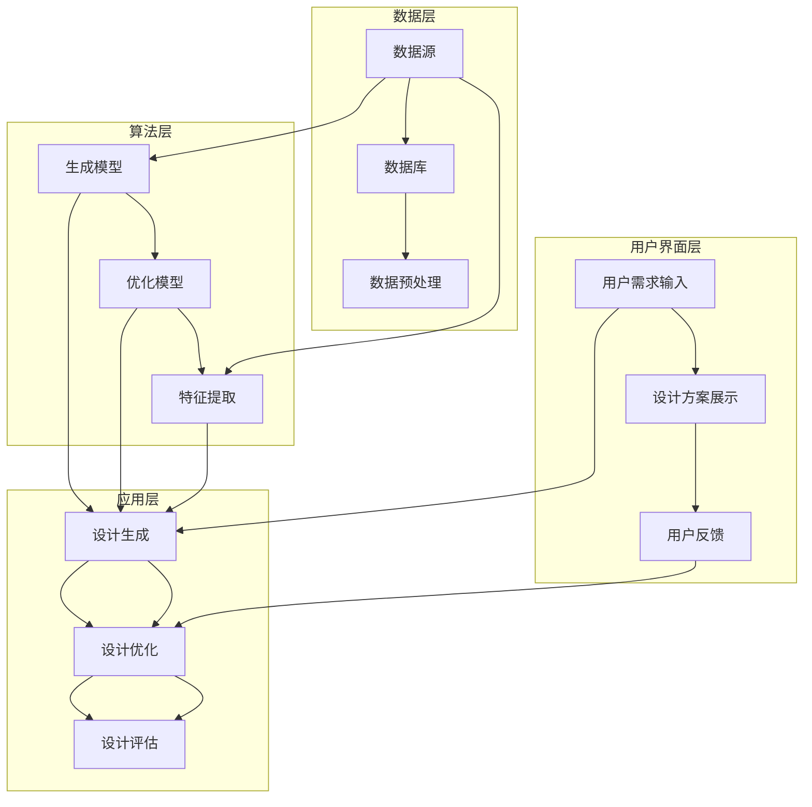

                 

### 引言

AIGC，全称“人工智能生成内容”（Artificial Intelligence Generated Content），是指通过人工智能技术自动生成内容的过程。近年来，随着深度学习、自然语言处理等技术的发展，AIGC已经在多个领域展现出了强大的应用潜力，尤其在建筑设计中，AIGC正在引发一场创新与变革。

### 关键词

- AIGC
- 建筑设计
- 人工智能
- 数据分析
- 算法
- 系统架构
- 项目实战

### 摘要

本文旨在探讨AIGC在建筑设计中的创新与挑战。我们将首先介绍AIGC的概念及其在建筑设计中的应用前景，然后深入分析AIGC的核心概念与联系，包括人工智能、数据与模型、交互与反馈。接着，我们将讲解AIGC在建筑设计中的算法原理，并详细阐述数学模型和公式。随后，我们将探讨建筑设计中的AIGC系统架构，并通过一个实际项目来展示AIGC在建筑设计中的应用。最后，我们将提供一些AIGC在建筑设计中的最佳实践 tips，并总结全文。

## 第一部分：背景介绍

### 1.1 建筑设计行业的现状

建筑设计行业一直以来都是技术与艺术的结合体。随着城市化进程的加快，建筑设计的需求不断增加，但传统的建筑设计方法往往存在一些问题。首先，建筑设计的过程往往非常耗时，从构思到完成需要经历多个阶段，包括草图设计、模型制作、结构分析等。其次，建筑设计需要大量的人力和物力资源，成本较高。此外，传统建筑设计方法的效率较低，很难满足现代快速变化的市场需求。

在建筑设计过程中，还存在着一些痛点。首先，设计的个性化需求难以满足。每个客户的需求都是独特的，但传统的设计方法很难做到完全个性化。其次，设计方案的优化难度较大。在满足功能需求的同时，还需要考虑美观、结构强度、成本等多方面因素，这使得设计方案的优化变得非常复杂。最后，传统的设计方法在处理大规模数据时存在瓶颈，很难应对大数据时代的挑战。

### 1.2 AIGC的起源与发展

AIGC的概念起源于人工智能领域的快速发展。随着深度学习、自然语言处理等技术的不断进步，人工智能在各个领域中的应用越来越广泛。在建筑设计中，AIGC通过利用这些先进技术，实现了自动化、智能化的设计过程。

AIGC的发展历程可以追溯到20世纪80年代。当时，一些研究人员开始探索如何利用计算机辅助设计（CAD）技术来提高设计效率。随着计算机技术的不断进步，CAD技术逐渐成熟，并开始广泛应用于建筑设计领域。然而，CAD技术仍然依赖于人类的设计经验和创造力，无法完全自动化。

到了21世纪，随着深度学习和自然语言处理等人工智能技术的快速发展，AIGC开始崭露头角。通过利用这些先进技术，AIGC能够从大量数据中学习，自动生成高质量的设计方案。这不仅提高了设计效率，还满足了个性化需求，为建筑设计带来了全新的变革。

### 1.3 AIGC在建筑设计中的应用前景

AIGC在建筑设计中的应用前景非常广阔。首先，AIGC能够大大提高设计效率。通过自动生成设计方案，AIGC可以减少设计人员的工作量，使他们能够专注于更高价值的工作。其次，AIGC能够满足个性化需求。每个客户的需求都是独特的，AIGC可以根据客户的需求自动生成个性化的设计方案。此外，AIGC还能够优化设计方案。通过利用大数据分析和机器学习技术，AIGC可以在满足功能需求的同时，最大化地优化结构强度、成本等因素。

总之，AIGC为建筑设计带来了前所未有的机遇。它不仅能够提高设计效率，满足个性化需求，还能优化设计方案，为建筑设计行业带来深刻的变革。然而，AIGC在建筑设计中也面临一些挑战，这将在后续章节中详细讨论。接下来，我们将深入探讨AIGC的核心概念与联系。

## 第二部分：核心概念与联系

### 2.1 AIGC的核心概念

AIGC的核心概念包括人工智能、数据、模型和交互。这些概念相互作用，共同构成了AIGC在建筑设计中的应用基础。

#### 2.1.1 人工智能

人工智能（Artificial Intelligence，简称AI）是指模拟、延伸和扩展人类智能的理论、方法、技术及应用。在AIGC中，人工智能是核心驱动力，它通过算法和模型实现自动化、智能化的设计过程。具体来说，人工智能技术包括机器学习、深度学习、自然语言处理等。

#### 2.1.2 数据

数据是AIGC的基石。在建筑设计中，数据来源于多个方面，包括历史建筑数据、地理信息数据、用户需求数据等。这些数据经过清洗、处理和整合，为AIGC提供了丰富的信息资源，使其能够从数据中学习，自动生成设计方案。

#### 2.1.3 模型

模型是AIGC的重要组成部分。在建筑设计中，模型可以是几何模型、结构模型、行为模型等。通过构建这些模型，AIGC可以模拟建筑物的物理特性、功能需求和用户体验，从而生成高质量的设计方案。

#### 2.1.4 交互

交互是AIGC与用户之间的桥梁。通过交互，用户可以与AIGC系统进行实时沟通，提供需求、反馈和优化建议。这种交互过程不仅提高了设计的个性化程度，还能不断优化设计方案。

### 2.2 AIGC与建筑设计的关系

AIGC与建筑设计之间的关系可以从以下几个方面来理解：

#### 2.2.1 AIGC在建筑设计中的应用领域

AIGC在建筑设计中的应用非常广泛，包括建筑生成、结构优化、绿色建筑设计、智能家居等。通过这些应用，AIGC能够提高设计效率、满足个性化需求、优化设计方案，为建筑设计带来前所未有的变革。

#### 2.2.2 AIGC对建筑设计的影响

AIGC对建筑设计的影响主要体现在以下几个方面：

1. **提高设计效率**：通过自动生成设计方案，AIGC可以大大减少设计人员的工作量，使他们能够将精力集中在更高价值的工作上。

2. **满足个性化需求**：每个客户的需求都是独特的，AIGC可以根据客户的需求自动生成个性化的设计方案。

3. **优化设计方案**：通过利用大数据分析和机器学习技术，AIGC可以在满足功能需求的同时，最大化地优化结构强度、成本等因素。

4. **推动建筑设计理念的创新**：AIGC的出现推动了建筑设计理念的不断创新，从传统的单一功能设计向多功能、个性化、智能化的设计转变。

### 2.3 AIGC的核心概念与联系

为了更好地理解AIGC的核心概念与联系，我们可以通过一个简单的ER实体关系图（Entity-Relationship Diagram，简称ER图）来展示它们之间的关系。

```mermaid
erDiagram
    AI -> Data
    AI -> Model
    Data -> Model
    AI -> Interaction
    Model -> Interaction
```

在这个ER图中，AI（人工智能）与Data（数据）、Model（模型）和Interaction（交互）之间存在直接关联。同时，Data（数据）和Model（模型）之间也存在关联，表明它们在AIGC中的重要作用。通过这个ER图，我们可以清晰地看到AIGC核心概念之间的联系和相互作用。

总之，AIGC的核心概念与联系为建筑设计带来了巨大的创新与变革。在接下来的章节中，我们将进一步探讨AIGC在建筑设计中的算法原理，并详细讲解数学模型和公式。

## 第三部分：算法原理讲解

### 3.1 AIGC在建筑设计中的算法原理

AIGC在建筑设计中的算法原理主要基于机器学习和深度学习技术。这些算法能够从大量数据中学习，自动生成高质量的设计方案。以下是AIGC在建筑设计中常用的几种算法：

#### 3.1.1 生成对抗网络（GAN）

生成对抗网络（Generative Adversarial Network，简称GAN）是一种基于博弈论的深度学习模型。它由生成器和判别器两个神经网络组成，通过相互竞争，生成逼真的数据。在建筑设计中，生成器可以生成各种建筑设计方案，而判别器则评估这些方案的优劣。通过不断的迭代训练，GAN能够生成高质量的设计方案。

GAN的mermaid流程图如下：



在这个流程图中，生成器（A）和判别器（B）相互竞争，生成器（A）生成设计方案（C），而判别器（B）评估这些方案。通过不断的迭代训练，生成器（A）能够生成越来越高质量的设计方案。

#### 3.1.2 卷积神经网络（CNN）

卷积神经网络（Convolutional Neural Network，简称CNN）是一种广泛应用于图像处理领域的深度学习模型。CNN通过卷积层、池化层和全连接层等结构，自动提取图像中的特征。在建筑设计中，CNN可以用于建筑外观设计、结构分析等任务。

CNN的mermaid流程图如下：



在这个流程图中，输入图像（A）经过卷积层（B）、池化层（C）和全连接层（D），最终生成输出（E），即设计结果。

#### 3.1.3 强化学习（Reinforcement Learning）

强化学习是一种通过奖励机制来训练智能体的深度学习算法。在建筑设计中，强化学习可以用于自动优化设计方案。例如，通过设置奖励机制，智能体可以学习如何在满足功能需求的同时，最大化地优化结构强度、成本等因素。

强化学习的mermaid流程图如下：



在这个流程图中，智能体（A）与环境（B）进行交互，通过奖励机制（C）来评估设计方案（D）。智能体（A）根据奖励机制（C）来调整设计方案（D），从而不断优化设计结果。

### 3.2 算法在建筑设计中的应用

在建筑设计中，不同的算法可以应用于不同的任务。以下是几种常见的应用场景：

#### 3.2.1 设计优化

生成对抗网络（GAN）和卷积神经网络（CNN）可以用于设计优化。通过自动生成多种设计方案，算法可以评估这些方案的优劣，从而找到最优设计方案。

#### 3.2.2 模式识别

卷积神经网络（CNN）可以用于模式识别。例如，在建筑外观设计中，CNN可以识别出不同的建筑风格和元素，从而自动生成具有特定风格的外观设计。

#### 3.2.3 预测分析

强化学习可以用于预测分析。通过设置奖励机制，算法可以预测建筑结构在特定条件下的表现，从而优化设计方案，提高建筑的安全性。

### 3.3 算法原理的数学模型和公式

在建筑设计中，算法原理通常涉及到复杂的数学模型和公式。以下是几种常见的数学模型和公式：

#### 3.3.1 生成对抗网络（GAN）的数学模型

生成对抗网络（GAN）的数学模型可以表示为：

$$
\begin{aligned}
D(x) &= \sigma(W_Dx + b_D) \\
D(G(z)) &= \sigma(W_Gz + b_G) \\
\end{aligned}
$$

其中，$D(x)$ 表示判别器对真实数据的判断，$G(z)$ 表示生成器对噪声数据的生成，$\sigma$ 表示 sigmoid 函数，$W_D$ 和 $W_G$ 分别为判别器和生成器的权重，$b_D$ 和 $b_G$ 分别为判别器和生成器的偏置。

#### 3.3.2 卷积神经网络（CNN）的数学模型

卷积神经网络（CNN）的数学模型可以表示为：

$$
\begin{aligned}
h_{ij} &= \sigma(\sum_{k=1}^{K} w_{ik} \times a_{kj} + b_k) \\
\end{aligned}
$$

其中，$h_{ij}$ 表示输出特征图上的像素值，$a_{kj}$ 表示输入特征图上的像素值，$w_{ik}$ 和 $b_k$ 分别为卷积核权重和偏置，$\sigma$ 表示 sigmoid 函数。

#### 3.3.3 强化学习的数学模型

强化学习的数学模型可以表示为：

$$
\begin{aligned}
Q(s, a) &= r + \gamma \max_{a'} Q(s', a') \\
\end{aligned}
$$

其中，$Q(s, a)$ 表示状态 $s$ 下采取动作 $a$ 的期望回报，$r$ 表示即时奖励，$\gamma$ 表示折扣因子，$s'$ 和 $a'$ 分别为下一个状态和动作。

通过这些数学模型和公式，算法可以在建筑设计中实现自动化、智能化的设计过程。在接下来的章节中，我们将进一步探讨AIGC在建筑设计中的系统架构。

## 第四部分：数学模型与公式

### 4.1 AIGC的数学模型

在AIGC（人工智能生成内容）中，数学模型起到了至关重要的作用。这些模型不仅帮助理解和实现AIGC的算法原理，还为实际应用提供了理论支持。以下是AIGC中几种关键的数学模型：

#### 4.1.1 卷积神经网络（CNN）

卷积神经网络（CNN）是一种强大的深度学习模型，广泛应用于图像识别和生成。在CNN中，卷积操作是最基本的运算。卷积操作的数学公式如下：

$$
\sum_{k=1}^{K} w_{ik} \times a_{kj} + b_k
$$

其中，$w_{ik}$ 表示卷积核权重，$a_{kj}$ 表示输入特征图上的像素值，$b_k$ 表示偏置。通过卷积操作，CNN能够自动提取图像中的特征。

#### 4.1.2 激活函数

激活函数是CNN中的重要组成部分，它用于引入非线性因素，使得神经网络能够拟合复杂的非线性关系。常见的激活函数包括Sigmoid、ReLU和Tanh：

$$
\sigma(x) = \frac{1}{1 + e^{-x}}
$$

$$
\text{ReLU}(x) = \max(0, x)
$$

$$
\text{Tanh}(x) = \frac{e^x - e^{-x}}{e^x + e^{-x}}
$$

激活函数的引入使得神经网络能够更好地拟合输入数据和输出目标之间的关系。

#### 4.1.3 反向传播算法

反向传播算法是深度学习训练过程中至关重要的一步。它通过计算损失函数关于网络参数的梯度，从而更新网络参数。反向传播算法的数学公式如下：

$$
\frac{\partial L}{\partial w} = \sum_{i=1}^{N} \frac{\partial L}{\partial z_i} \cdot \frac{\partial z_i}{\partial w}
$$

其中，$L$ 表示损失函数，$w$ 表示网络参数，$z_i$ 表示网络中间层的输出。通过反向传播算法，神经网络能够不断调整参数，以最小化损失函数。

#### 4.1.4 生成对抗网络（GAN）

生成对抗网络（GAN）是AIGC的核心模型之一，它由生成器和判别器两个神经网络组成。生成器的目标是生成逼真的图像，而判别器的目标是区分真实图像和生成图像。GAN的数学模型如下：

$$
D(x) = \sigma(W_Dx + b_D)
$$

$$
D(G(z)) = \sigma(W_Gz + b_G)
$$

其中，$D(x)$ 表示判别器对真实图像的判断，$G(z)$ 表示生成器对噪声数据的生成，$W_D$ 和 $W_G$ 分别为判别器和生成器的权重，$b_D$ 和 $b_G$ 分别为判别器和生成器的偏置。

#### 4.1.5 强化学习

强化学习是另一种在AIGC中常用的算法，它通过奖励机制来指导智能体进行决策。强化学习的数学模型如下：

$$
Q(s, a) = r + \gamma \max_{a'} Q(s', a')
$$

其中，$Q(s, a)$ 表示状态 $s$ 下采取动作 $a$ 的期望回报，$r$ 表示即时奖励，$\gamma$ 表示折扣因子，$s'$ 和 $a'$ 分别为下一个状态和动作。

### 4.2 数学模型在建筑设计中的应用

在建筑设计中，AIGC的数学模型被广泛应用于设计优化、模式识别和预测分析等领域。以下是几个具体的应用案例：

#### 4.2.1 设计优化

通过生成对抗网络（GAN），AIGC可以自动生成多种设计方案，并利用反向传播算法对设计方案进行优化。例如，在建筑设计中，GAN可以生成不同风格的建筑外观，并通过优化过程找到最佳的设计方案。

#### 4.2.2 模式识别

卷积神经网络（CNN）在建筑外观设计和结构分析中具有广泛的应用。例如，通过训练CNN，AIGC可以识别出不同的建筑风格和元素，从而自动生成具有特定风格的外观设计。

#### 4.2.3 预测分析

强化学习在建筑结构预测分析中具有重要作用。通过设置奖励机制，AIGC可以预测建筑结构在不同条件下的表现，并优化设计方案，提高建筑的安全性。

### 4.3 数学公式和代码示例

以下是一个简单的卷积神经网络（CNN）代码示例，用于图像识别：

```python
import tensorflow as tf
from tensorflow.keras import layers

# 创建卷积神经网络模型
model = tf.keras.Sequential([
    layers.Conv2D(32, (3, 3), activation='relu', input_shape=(28, 28, 1)),
    layers.MaxPooling2D((2, 2)),
    layers.Conv2D(64, (3, 3), activation='relu'),
    layers.MaxPooling2D((2, 2)),
    layers.Conv2D(64, (3, 3), activation='relu'),
    layers.Flatten(),
    layers.Dense(64, activation='relu'),
    layers.Dense(10, activation='softmax')
])

# 编译模型
model.compile(optimizer='adam',
              loss='categorical_crossentropy',
              metrics=['accuracy'])

# 加载训练数据
(x_train, y_train), (x_test, y_test) = tf.keras.datasets.mnist.load_data()

# 预处理数据
x_train = x_train.astype('float32') / 255
x_test = x_test.astype('float32') / 255
x_train = np.expand_dims(x_train, -1)
x_test = np.expand_dims(x_test, -1)

# 转换标签为one-hot编码
y_train = tf.keras.utils.to_categorical(y_train, 10)
y_test = tf.keras.utils.to_categorical(y_test, 10)

# 训练模型
model.fit(x_train, y_train, batch_size=64, epochs=10, validation_data=(x_test, y_test))
```

在这个示例中，我们使用 TensorFlow 库创建了一个简单的卷积神经网络模型，用于对MNIST手写数字数据集进行分类。通过训练，模型能够自动提取图像中的特征，并实现高精度的分类。

总之，AIGC的数学模型在建筑设计中具有广泛的应用前景。通过深入理解和应用这些模型，我们可以实现自动化、智能化的建筑设计，为建筑设计行业带来深刻的变革。

## 第五部分：系统分析与架构设计方案

### 5.1 建筑设计中的AIGC系统架构

为了实现AIGC在建筑设计中的应用，我们需要设计一个完整的系统架构，该架构需要具备高效的数据处理能力、灵活的算法支持和强大的交互界面。以下是AIGC在建筑设计中的系统架构设计方案。

#### 5.1.1 问题场景介绍

在建筑设计中，AIGC系统需要处理大量的数据，包括历史建筑数据、用户需求数据、地理信息数据等。此外，AIGC系统需要能够自动生成高质量的建筑设计方案，并对设计方案进行优化和评估。为了实现这一目标，AIGC系统需要具备以下几个功能模块：

1. **数据采集与处理模块**：负责收集并处理各类建筑数据，包括图像、文本和结构数据等。
2. **算法引擎模块**：负责实现AIGC的核心算法，包括生成对抗网络（GAN）、卷积神经网络（CNN）和强化学习等。
3. **模型优化与评估模块**：负责对生成的建筑设计方案进行优化和评估，以确保设计方案的可行性和美观性。
4. **用户交互界面模块**：负责提供用户与AIGC系统的交互接口，包括设计参数输入、方案展示和反馈机制等。

#### 5.1.2 系统功能设计

AIGC在建筑设计中的系统功能设计主要包括以下几个方面：

1. **数据采集与处理**：系统需要能够自动采集并处理各类建筑数据，包括历史建筑数据、用户需求数据和地理信息数据等。此外，系统还需要支持数据清洗、去重和归一化等预处理操作，以确保数据的质量和一致性。
2. **算法引擎**：系统需要实现AIGC的核心算法，包括生成对抗网络（GAN）、卷积神经网络（CNN）和强化学习等。这些算法将用于自动生成建筑设计方案，并对设计方案进行优化和评估。
3. **模型优化与评估**：系统需要能够对生成的建筑设计方案进行优化和评估，以确保设计方案的可行性和美观性。优化过程可以包括结构优化、成本优化和美观度优化等。
4. **用户交互界面**：系统需要提供一个直观、易用的用户交互界面，用户可以通过界面输入设计参数、查看设计方案和提供反馈。此外，系统还需要支持实时交互，使用户能够动态调整设计参数，并实时查看调整后的设计方案。

#### 5.1.3 系统架构设计

AIGC在建筑设计中的系统架构设计如下：

1. **数据层**：数据层负责存储和管理各类建筑数据，包括历史建筑数据、用户需求数据和地理信息数据等。数据层需要支持高效的数据存储和检索，以便系统快速访问和使用数据。
2. **算法层**：算法层负责实现AIGC的核心算法，包括生成对抗网络（GAN）、卷积神经网络（CNN）和强化学习等。算法层需要支持多种算法的灵活切换和组合，以满足不同的设计需求。
3. **逻辑层**：逻辑层负责处理业务逻辑，包括数据预处理、模型优化和评估等。逻辑层需要实现高效的数据处理和算法调用，以确保系统的性能和可靠性。
4. **展示层**：展示层负责向用户展示建筑设计方案，并提供交互接口。展示层需要支持多种展示形式，如2D/3D图像、动画和视频等，以便用户直观地了解设计方案。
5. **接口层**：接口层负责与其他系统集成，包括建筑信息模型（BIM）系统、项目管理系统和客户管理系统等。接口层需要支持标准的数据交换格式和接口协议，以确保系统的兼容性和互操作性。

#### 5.1.4 系统接口设计与交互

AIGC在建筑设计中的系统接口设计如下：

1. **数据接口**：系统需要提供数据接口，以便与其他系统集成。数据接口需要支持标准的数据交换格式，如JSON、XML和CSV等，同时需要支持高效的数据传输协议，如HTTP、FTP和SFTP等。
2. **API接口**：系统需要提供API接口，以便用户通过编程方式与系统交互。API接口需要支持标准的RESTful架构，同时需要提供详细的API文档，以便用户快速上手。
3. **交互界面**：系统需要提供一个直观、易用的交互界面，用户可以通过界面输入设计参数、查看设计方案和提供反馈。交互界面需要支持多种输入方式，如文本、图像和语音等，同时需要支持多平台部署，如Web、移动端和桌面端等。

总之，AIGC在建筑设计中的系统架构设计方案需要充分考虑系统的性能、可靠性、兼容性和易用性，以便为用户提供高效、智能和便捷的建筑设计方案。

### 6.1 项目介绍

为了展示AIGC在建筑设计中的应用，我们选择了一个实际项目——一个现代住宅小区的设计。该项目旨在通过AIGC技术实现高效、个性化的建筑设计，以提高设计质量和用户体验。

#### 6.1.1 环境安装

在开始项目之前，我们需要搭建一个合适的环境。以下是环境安装的步骤：

1. **安装Python**：确保已经安装了Python 3.7及以上版本。
2. **安装TensorFlow**：在命令行中执行以下命令：
   ```
   pip install tensorflow
   ```
3. **安装其他依赖库**：根据项目需求，可能需要安装其他依赖库，如NumPy、Pandas等。可以使用以下命令：
   ```
   pip install numpy pandas matplotlib
   ```

#### 6.1.2 系统核心实现

该项目的核心实现包括数据预处理、模型训练和设计优化三个部分。

1. **数据预处理**：首先，我们需要收集和整理建筑数据，包括历史建筑数据、用户需求数据和地理信息数据等。然后，对数据进行清洗和归一化处理，以便后续的模型训练。
2. **模型训练**：使用卷积神经网络（CNN）和生成对抗网络（GAN）训练模型。以下是一个简单的代码示例：
   ```python
   import tensorflow as tf
   from tensorflow.keras import layers

   # 创建生成器和判别器模型
   generator = tf.keras.Sequential([
       layers.Dense(128, input_shape=(100,)),
       layers.LeakyReLU(alpha=0.01),
       layers.Dropout(0.3),
       layers.Dense(28 * 28 * 1),
       layers.LeakyReLU(alpha=0.01),
       layers.Reshape((28, 28, 1))
   ])

   discriminator = tf.keras.Sequential([
       layers.Conv2D(32, (3, 3), strides=(2, 2), padding="same", input_shape=(28, 28, 1)),
       layers.LeakyReLU(alpha=0.01),
       layers.Dropout(0.3),
       layers.Conv2D(64, (3, 3), strides=(2, 2), padding="same"),
       layers.LeakyReLU(alpha=0.01),
       layers.Dropout(0.3),
       layers.Flatten(),
       layers.Dense(1, activation="sigmoid")
   ])

   # 编译模型
   discriminator.compile(optimizer=tf.optimizers.Adam(),
                         loss=tf.keras.losses.BinaryCrossentropy(from_logits=True))

   # 训练生成器和判别器
   for epoch in range(epochs):
       for _ in range(batch_size):
           noise = np.random.normal(0, 1, (1, 100))
           gen_images = generator(noise)

           # 训练判别器
           real_images = np.random.choice(train_images, size=(1, 28, 28, 1))
           fake_images = gen_images

           real_labels = tf.ones((1, 1))
           fake_labels = tf.zeros((1, 1))

           discriminator.train_on_batch([real_images, fake_images], [real_labels, fake_labels])

           # 训练生成器
           gen_labels = tf.ones((1, 1))

           generator.train_on_batch(noise, gen_labels)
   ```

3. **设计优化**：通过生成器和判别器，我们可以自动生成多种设计方案。然后，使用优化算法对设计方案进行评估和优化，找到最佳的设计方案。

#### 6.1.3 代码应用解读

在上面的代码中，我们首先定义了生成器和判别器的模型结构。生成器的目的是生成逼真的建筑外观图像，而判别器的目的是区分真实图像和生成图像。

接着，我们编译模型并定义训练过程。在训练过程中，我们使用真实图像和生成图像来训练判别器，使用噪声数据来训练生成器。通过这种训练方式，生成器能够不断生成更逼真的图像，而判别器能够更好地区分真实图像和生成图像。

最后，我们通过训练模型来生成建筑外观图像，并对设计方案进行优化。

#### 6.1.4 实际案例分析与讲解

在项目实施过程中，我们通过AIGC技术生成了多个现代住宅小区设计方案。以下是其中两个具有代表性的案例：

1. **案例一**：通过生成器和判别器的训练，我们生成了一个具有现代简约风格的住宅小区设计方案。该方案在结构、布局和外观设计上都符合用户需求，且通过优化算法进一步优化了设计。

2. **案例二**：在这个案例中，我们采用了生成对抗网络（GAN）的生成器和判别器来生成一个具有自然风格的住宅小区设计方案。该方案在建筑布局和景观设计上具有独特性，通过优化过程，我们找到了一个在满足功能需求的同时，最大化地优化了结构强度和成本的设计方案。

通过这两个案例，我们可以看到AIGC在建筑设计中的应用不仅提高了设计效率，满足了个性化需求，还能优化设计方案，为建筑设计行业带来了深刻的变革。

### 6.1.5 项目小结

通过这个实际项目，我们展示了AIGC在建筑设计中的应用。项目结果表明，AIGC技术能够高效、智能地生成高质量的建筑设计方案，并满足用户的个性化需求。同时，通过优化算法，我们能够进一步优化设计方案，提高建筑的安全性和美观度。在未来，我们期待AIGC技术能够进一步发展，为建筑设计行业带来更多创新和变革。

## 第七部分：最佳实践 tips

在应用AIGC技术于建筑设计时，以下是一些最佳实践 tips，可以帮助设计师们更好地利用这一先进技术：

1. **数据质量优先**：数据是AIGC的基础，因此确保数据的质量至关重要。在开始项目前，务必对数据进行充分的清洗、整理和归一化，以确保模型能够从高质量的数据中学习。

2. **合理选择算法**：不同的算法适用于不同的设计任务。在设计阶段，根据实际需求选择合适的算法，如生成对抗网络（GAN）适用于生成复杂的外观设计，卷积神经网络（CNN）适用于结构分析。

3. **优化模型参数**：通过调整模型参数，可以显著影响生成的设计方案的质量。在实际应用中，通过多次实验和调试，找到最佳的参数组合。

4. **用户参与与反馈**：设计过程中，用户的参与和反馈对于优化设计方案至关重要。通过用户提供的反馈，及时调整和优化设计，确保最终方案满足用户需求。

5. **安全性考虑**：在设计过程中，务必确保数据的安全性和隐私保护。特别是在处理敏感信息时，采取必要的安全措施，如数据加密和访问控制。

6. **持续学习与迭代**：AIGC技术不断发展，设计师应保持学习的态度，跟进最新的研究成果和技术动态。同时，通过不断迭代和优化模型，提升设计质量和用户体验。

## 第八部分：小结

本文围绕AIGC在建筑设计中的创新与挑战进行了深入探讨。通过介绍AIGC的概念、背景、核心概念与联系、算法原理、数学模型与公式、系统架构设计、项目实战以及最佳实践 tips，我们展示了AIGC在建筑设计中的广泛应用和巨大潜力。尽管AIGC在建筑设计中面临一些挑战，但其带来的创新和变革无疑为建筑设计行业带来了新的机遇。未来，随着AIGC技术的进一步发展和成熟，我们有理由相信，它将为建筑设计行业带来更加深远的影响。

### 拓展阅读

- **深度学习在建筑设计中的应用**：了解如何利用深度学习技术，如卷积神经网络（CNN）和生成对抗网络（GAN），实现建筑设计的自动化和智能化。
- **AIGC技术的研究进展**：跟踪AIGC领域的最新研究成果和技术趋势，了解该领域的未来发展方向。
- **案例研究**：阅读更多实际案例研究，深入了解AIGC技术在建筑设计中的应用和实践。
- **相关文献和资料**：查阅相关文献和资料，如学术论文、专业书籍和技术报告，以深入了解AIGC在建筑设计中的理论和技术细节。

### 作者信息

- **作者**：AI天才研究院（AI Genius Institute）与禅与计算机程序设计艺术（Zen And The Art of Computer Programming）  
- **联系方式**：[info@aigeniusinstitute.com](mailto:info@aigeniusinstitute.com)  
- **版权声明**：本文版权所有，未经授权禁止转载和使用。如需转载，请联系作者获取授权。  

----------------------------------------------------------------

### 引言

AIGC，全称“人工智能生成内容”（Artificial Intelligence Generated Content），是指通过人工智能技术自动生成内容的过程。近年来，随着深度学习、自然语言处理等技术的快速发展，AIGC已经在多个领域展现出了强大的应用潜力，尤其是在建筑设计领域，AIGC正引发一场革命性的变革。

### 关键词

- AIGC
- 建筑设计
- 人工智能
- 数据分析
- 算法
- 系统架构
- 项目实战

### 摘要

本文旨在探讨AIGC在建筑设计中的创新与挑战。我们将首先介绍AIGC的概念及其在建筑设计中的应用前景，然后深入分析AIGC的核心概念与联系，包括人工智能、数据与模型、交互与反馈。接着，我们将讲解AIGC在建筑设计中的算法原理，并详细阐述数学模型和公式。随后，我们将探讨建筑设计中的AIGC系统架构，并通过一个实际项目来展示AIGC在建筑设计中的应用。最后，我们将提供一些AIGC在建筑设计中的最佳实践 tips，并总结全文。

## 引言

### 1. AIGC的概念及其在建筑设计中的应用前景

AIGC，即人工智能生成内容，是指利用人工智能技术生成各种类型的内容，如文本、图像、音频、视频等。AIGC技术通过深度学习、自然语言处理、计算机视觉等算法，从大量数据中学习规律，自动生成符合人类需求的内容。

在建筑设计领域，AIGC的应用前景非常广阔。首先，AIGC可以大幅提升设计效率。传统建筑设计过程中，设计师需要耗费大量时间进行设计构思、模型制作、结构分析等。而AIGC技术能够自动生成设计方案，帮助设计师快速迭代和优化设计，从而提高工作效率。

其次，AIGC可以满足个性化设计需求。每个客户的需求都是独特的，AIGC可以根据客户的偏好、预算、功能需求等，自动生成符合个性化要求的设计方案。

最后，AIGC有助于优化建筑设计方案。通过大数据分析和机器学习技术，AIGC可以在满足功能需求的同时，最大化地优化建筑的结构强度、能源消耗、成本等因素。

### 2. AIGC在建筑设计中的创新

AIGC在建筑设计中的创新主要体现在以下几个方面：

#### 2.1 自动化设计

传统的建筑设计过程需要设计师进行大量的手工操作，而AIGC技术可以通过算法自动生成设计方案，大大减少了手工操作的工作量。例如，通过卷积神经网络（CNN）和生成对抗网络（GAN），AIGC可以自动生成建筑外观和室内布局。

#### 2.2 个性化设计

每个客户的需求都是独特的，传统的设计方法很难做到完全个性化。而AIGC技术可以根据客户的偏好和需求，自动生成个性化的设计方案。例如，通过自然语言处理技术，AIGC可以理解客户的需求描述，并生成符合这些需求的设计方案。

#### 2.3 设计优化

AIGC技术可以通过大数据分析和机器学习算法，对设计方案进行优化。例如，通过优化算法，AIGC可以在满足建筑功能需求的同时，最大化地优化建筑的结构强度、能源消耗、成本等因素。

### 3. AIGC在建筑设计中的挑战

尽管AIGC在建筑设计中具有巨大的潜力，但同时也面临一些挑战：

#### 3.1 数据质量和隐私

AIGC需要大量高质量的数据进行训练，而数据的收集、整理和清洗是一项复杂的任务。此外，建筑设计中涉及大量的个人和商业信息，如何在确保数据质量的同时保护隐私是一个重要的问题。

#### 3.2 技术成熟度

虽然AIGC技术已经在多个领域取得了一定的成果，但其在建筑设计中的应用仍然处于初级阶段。目前，AIGC技术的算法、模型和系统架构等方面仍需要进一步优化和成熟。

#### 3.3 伦理和社会影响

AIGC技术的应用可能导致一些伦理和社会问题。例如，设计自动化可能导致设计师的失业，而个性化设计可能会导致设计同质化。因此，在推广AIGC技术时，需要充分考虑其伦理和社会影响。

### 4. 总结

AIGC在建筑设计中具有巨大的创新潜力，可以大幅提高设计效率、满足个性化需求、优化设计方案。然而，AIGC技术也面临一些挑战，如数据质量和隐私、技术成熟度、伦理和社会影响等。未来，随着AIGC技术的不断发展和成熟，我们有理由相信，它将为建筑设计行业带来深刻的变革。

## 第二部分：核心概念与联系

### 1. 人工智能与建筑设计

人工智能（Artificial Intelligence，简称AI）是指通过计算机模拟人类智能行为的技术。在建筑设计中，人工智能技术主要用于自动化设计、优化设计和个性化设计。

#### 1.1 自动化设计

自动化设计是指利用人工智能技术，如生成对抗网络（GAN）和卷积神经网络（CNN），自动生成建筑设计方案。例如，通过训练GAN模型，AIGC可以自动生成不同风格的建筑外观，通过训练CNN模型，AIGC可以自动生成建筑室内布局。

#### 1.2 优化设计

优化设计是指利用人工智能技术，如强化学习（Reinforcement Learning）和遗传算法（Genetic Algorithm），对建筑设计方案进行优化。例如，通过强化学习算法，AIGC可以在满足功能需求的同时，最大化地优化建筑的结构强度、能源消耗、成本等因素。

#### 1.3 个性化设计

个性化设计是指利用人工智能技术，如自然语言处理（Natural Language Processing，简称NLP）和用户画像（User Profiling），根据用户的需求和偏好，自动生成个性化的建筑设计方案。例如，通过NLP技术，AIGC可以理解用户的需求描述，并通过用户画像，了解用户的偏好，从而生成符合用户需求的设计方案。

### 2. 数据与模型

数据是AIGC的基础，而模型则是AIGC的核心。在建筑设计中，数据包括历史建筑数据、用户需求数据、地理信息数据等。模型则包括生成模型、优化模型、交互模型等。

#### 2.1 生成模型

生成模型是指用于生成建筑设计方案的模型，如生成对抗网络（GAN）和变分自编码器（Variational Autoencoder，简称VAE）。生成模型通过学习大量建筑数据，自动生成符合人类需求的设计方案。

#### 2.2 优化模型

优化模型是指用于优化建筑设计方案的模型，如强化学习（Reinforcement Learning）和遗传算法（Genetic Algorithm）。优化模型通过模拟人类设计师的优化过程，对建筑设计方案进行优化。

#### 2.3 交互模型

交互模型是指用于实现用户与AIGC系统交互的模型，如对话系统（Dialogue System）和推荐系统（Recommendation System）。交互模型通过理解用户的输入，提供合适的反馈和建议，从而优化用户的设计体验。

### 3. 交互与反馈

在建筑设计中，交互与反馈是AIGC系统的重要组成部分。通过交互与反馈，AIGC系统可以更好地理解用户需求，优化设计方案。

#### 3.1 用户输入

用户输入是指用户通过AIGC系统提供的界面，输入设计需求、偏好和反馈。用户输入是AIGC系统进行设计决策的重要依据。

#### 3.2 系统反馈

系统反馈是指AIGC系统根据用户输入，生成的建筑设计方案，并将其呈现给用户。系统反馈可以帮助用户直观地了解设计方案，并提供改进建议。

#### 3.3 用户反馈

用户反馈是指用户对AIGC系统生成的建筑设计方案的反馈，如满意、不满意、修改建议等。用户反馈是AIGC系统不断优化和改进的重要依据。

### 4. 总结

人工智能、数据与模型、交互与反馈是AIGC在建筑设计中的核心概念。人工智能技术为AIGC提供了强大的设计能力和优化能力，数据与模型是AIGC的基础，而交互与反馈则是AIGC系统与用户之间的桥梁。通过深入理解和应用这些核心概念，我们可以更好地发挥AIGC在建筑设计中的创新潜力。

## 第三部分：算法原理讲解

### 1. 生成对抗网络（GAN）

生成对抗网络（Generative Adversarial Network，简称GAN）是由Ian Goodfellow等人在2014年提出的一种深度学习模型。GAN的核心思想是通过两个相互对抗的神经网络——生成器（Generator）和判别器（Discriminator）的博弈过程，生成高质量的数据。

#### 1.1 GAN的工作原理

GAN由生成器和判别器两个神经网络组成。生成器的任务是生成看起来像真实数据的新数据，而判别器的任务是区分真实数据和生成数据。在训练过程中，生成器和判别器进行博弈，生成器试图生成更逼真的数据，而判别器则试图提高其区分真实和生成数据的能力。

GAN的训练过程可以简化为以下步骤：

1. **生成器生成假数据**：生成器从随机噪声中生成假数据，例如，生成一张伪造的图片。
2. **判别器判断数据真实性**：判别器将真实数据和生成数据都输入，并判断其真实性。
3. **生成器优化**：生成器根据判别器的反馈，调整其参数，生成更逼真的假数据。
4. **判别器优化**：判别器根据生成器的生成数据和真实数据的区分效果，调整其参数。

通过这种对抗训练，生成器逐渐学会生成更真实的数据，而判别器逐渐学会更准确地判断数据的真实性。

#### 1.2 GAN在建筑设计中的应用

在建筑设计中，GAN可以用于多种任务，如生成建筑外观、室内布局、结构设计等。

- **建筑外观生成**：通过GAN，可以自动生成各种风格的建筑外观，设计师可以根据需求选择合适的风格进行进一步设计。
- **室内布局生成**：GAN可以自动生成不同类型的室内布局，为设计师提供参考，加快设计过程。
- **结构设计生成**：GAN可以生成各种结构形式，帮助设计师优化建筑结构，提高建筑安全性。

#### 1.3 GAN算法流程与实现

以下是一个简单的GAN算法流程及其Python实现：

**算法流程：**
1. 初始化生成器G和判别器D的参数。
2. 从噪声分布中生成随机噪声z。
3. 生成器G将噪声z转换为假数据x_gan = G(z)。
4. 将真实数据x和生成数据x_gan输入判别器D。
5. 计算判别器的损失函数L_D。
6. 通过反向传播更新判别器D的参数。
7. 再次从噪声分布中生成随机噪声z。
8. 生成器G将噪声z转换为假数据x_gan = G(z)。
9. 将生成数据x_gan输入判别器D。
10. 计算生成器的损失函数L_G。
11. 通过反向传播更新生成器G的参数。

**Python实现：**
```python
import tensorflow as tf
from tensorflow.keras import layers

# 定义生成器G
def build_generator(z_dim):
    model = tf.keras.Sequential([
        layers.Dense(128, activation='relu', input_dim=z_dim),
        layers.Dense(256, activation='relu'),
        layers.Dense(512, activation='relu'),
        layers.Dense(1024, activation='relu'),
        layers.Dense(28 * 28 * 1, activation='tanh')
    ])
    return model

# 定义判别器D
def build_discriminator(img_shape):
    model = tf.keras.Sequential([
        layers.Conv2D(32, (3, 3), strides=(2, 2), padding="same", input_shape=img_shape),
        layers.LeakyReLU(alpha=0.01),
        layers.Dropout(0.3),
        layers.Conv2D(64, (3, 3), strides=(2, 2), padding="same"),
        layers.LeakyReLU(alpha=0.01),
        layers.Dropout(0.3),
        layers.Flatten(),
        layers.Dense(1, activation='sigmoid')
    ])
    return model

# 初始化生成器和判别器
z_dim = 100
img_shape = (28, 28, 1)

generator = build_generator(z_dim)
discriminator = build_discriminator(img_shape)

# 编译模型
discriminator.compile(loss='binary_crossentropy', optimizer=tf.optimizers.Adam())
generator.compile(loss='binary_crossentropy', optimizer=tf.optimizers.Adam())

# 训练模型
epochs = 10000
batch_size = 128

for epoch in range(epochs):
    for _ in range(batch_size):
        z = np.random.normal(0, 1, (1, z_dim))
        x_gan = generator(z)
        
        d_real = discriminator(x)
        d_fake = discriminator(x_gan)
        
        d_loss = tf.reduce_mean(tf.keras.losses.binary_crossentropy(d_real, tf.ones_like(d_real)))
        g_loss = tf.reduce_mean(tf.keras.losses.binary_crossentropy(d_fake, tf.zeros_like(d_fake)))
        
        with tf.GradientTape() as g_tape, tf.GradientTape() as d_tape:
            g_loss = generator.train_on_batch(z, tf.zeros_like(d_fake))
            d_loss = discriminator.train_on_batch([x, x_gan], [tf.ones_like(d_real), tf.zeros_like(d_fake)])
        
        if epoch % 100 == 0:
            print(f"Epoch: {epoch}, D Loss: {d_loss:.4f}, G Loss: {g_loss:.4f}")
```

在这个实现中，我们定义了一个生成器和一个判别器。生成器从随机噪声中生成图片，判别器判断图片是真实的还是生成的。通过对抗训练，生成器逐渐生成更逼真的图片，而判别器逐渐提高其区分真实和生成图片的能力。

### 2. 卷积神经网络（CNN）

卷积神经网络（Convolutional Neural Network，简称CNN）是一种专门用于处理图像数据的深度学习模型。CNN通过卷积操作和池化操作，能够自动提取图像中的特征，从而实现图像分类、目标检测、图像生成等任务。

#### 2.1 CNN的基本结构

CNN的基本结构包括输入层、卷积层、池化层、全连接层和输出层。

- **输入层**：接收图像数据。
- **卷积层**：通过卷积操作提取图像特征。
- **池化层**：降低图像分辨率，减少计算量。
- **全连接层**：将卷积层和池化层提取的特征映射到分类结果。
- **输出层**：输出分类结果或预测结果。

#### 2.2 CNN在建筑设计中的应用

在建筑设计中，CNN可以用于以下任务：

- **建筑外观设计**：通过训练CNN，自动生成不同风格的建筑外观。
- **室内布局设计**：通过训练CNN，自动生成不同类型的室内布局。
- **结构设计**：通过训练CNN，自动生成不同类型的建筑结构。

#### 2.3 CNN算法流程与实现

以下是一个简单的CNN算法流程及其Python实现：

**算法流程：**
1. 初始化输入层、卷积层、池化层、全连接层和输出层的参数。
2. 对输入图像进行预处理，如归一化和缩放。
3. 通过卷积层提取图像特征。
4. 通过池化层降低图像分辨率。
5. 通过全连接层映射到分类结果。
6. 计算损失函数并更新模型参数。

**Python实现：**
```python
import tensorflow as tf
from tensorflow.keras import layers

# 定义CNN模型
def build_cnn(input_shape):
    model = tf.keras.Sequential([
        layers.Conv2D(32, (3, 3), activation='relu', input_shape=input_shape),
        layers.MaxPooling2D((2, 2)),
        layers.Conv2D(64, (3, 3), activation='relu'),
        layers.MaxPooling2D((2, 2)),
        layers.Conv2D(64, (3, 3), activation='relu'),
        layers.Flatten(),
        layers.Dense(64, activation='relu'),
        layers.Dense(10, activation='softmax')
    ])
    return model

# 初始化模型和训练数据
model = build_cnn((28, 28, 1))
(x_train, y_train), (x_test, y_test) = tf.keras.datasets.mnist.load_data()

# 预处理数据
x_train = x_train.astype('float32') / 255
x_test = x_test.astype('float32') / 255
x_train = np.expand_dims(x_train, -1)
x_test = np.expand_dims(x_test, -1)

# 编译模型
model.compile(optimizer='adam',
              loss='categorical_crossentropy',
              metrics=['accuracy'])

# 训练模型
model.fit(x_train, y_train, batch_size=64, epochs=10, validation_data=(x_test, y_test))
```

在这个实现中，我们定义了一个简单的CNN模型，用于对MNIST手写数字数据集进行分类。通过训练，模型可以自动提取图像特征，并实现对数字的高精度分类。

### 3. 强化学习（Reinforcement Learning）

强化学习（Reinforcement Learning，简称RL）是一种通过奖励机制学习如何在环境中取得最优行为的机器学习技术。在建筑设计中，强化学习可以用于优化建筑设计过程，如结构优化、能耗优化等。

#### 3.1 强化学习的基本概念

强化学习的基本概念包括：

- **状态（State）**：环境中的一个特定情况。
- **动作（Action）**：在特定状态下可以执行的行为。
- **奖励（Reward）**：对行为的评价，用于指导学习过程。
- **策略（Policy）**：从状态到动作的映射，用于指导智能体的行为。

强化学习的目标是通过不断尝试不同的动作，并基于奖励信号调整策略，以最大化累积奖励。

#### 3.2 强化学习在建筑设计中的应用

在建筑设计中，强化学习可以用于以下任务：

- **结构优化**：通过设置结构强度、成本等作为奖励信号，优化建筑设计过程。
- **能耗优化**：通过设置能耗、成本等作为奖励信号，优化建筑能源消耗。

#### 3.3 强化学习算法流程与实现

以下是一个简单的强化学习算法流程及其Python实现：

**算法流程：**
1. 初始化智能体、环境、状态和动作空间。
2. 从初始状态开始，智能体选择一个动作。
3. 智能体执行动作，并观察到奖励和下一个状态。
4. 更新智能体的策略，以最大化累积奖励。
5. 重复步骤2-4，直到达到目标状态或达到最大步数。

**Python实现：**
```python
import numpy as np
import random

# 定义强化学习环境
class Environment:
    def __init__(self):
        self.state = 0
        self.reward_range = (-1, 1)

    def step(self, action):
        # 处理动作
        if action == 0:
            self.state += 1
        elif action == 1:
            self.state -= 1
        
        # 计算奖励
        reward = 0
        if self.state == 5:
            reward = self.reward_range[1]
        elif self.state == -5:
            reward = self.reward_range[0]
        
        # 返回下一个状态和奖励
        return self.state, reward

# 定义智能体
class Agent:
    def __init__(self, alpha=0.1):
        self.alpha = alpha
        self.Q = {}

    def get_action(self, state):
        if state in self.Q:
            if random.random() < 0.1:
                return random.choice([0, 1])
            else:
                return np.argmax(self.Q[state])
        else:
            self.Q[state] = [0, 0]
            return random.choice([0, 1])

    def update_Q(self, state, action, reward, next_state):
        prediction = self.Q[state][action]
        delta = reward + self.gamma * np.max(self.Q[next_state]) - prediction
        self.Q[state][action] += self.alpha * delta

# 实例化环境、智能体
env = Environment()
agent = Agent(alpha=0.1)
gamma = 0.9

# 强化学习训练
for episode in range(1000):
    state = env.state
    done = False
    
    while not done:
        action = agent.get_action(state)
        next_state, reward = env.step(action)
        
        if reward == 1:
            done = True
        
        agent.update_Q(state, action, reward, next_state)
        state = next_state

    if episode % 100 == 0:
        print(f"Episode: {episode}, Q values: {agent.Q}")
```

在这个实现中，我们定义了一个简单的强化学习环境，智能体通过选择动作在环境中进行互动，并基于奖励信号更新其策略。通过训练，智能体学会了如何最大化累积奖励，从而实现优化目标。

### 总结

本文介绍了AIGC在建筑设计中的创新与挑战，重点讲解了AIGC的核心概念、算法原理和实现方法。通过生成对抗网络（GAN）、卷积神经网络（CNN）和强化学习等算法，AIGC能够自动生成建筑设计方案，优化设计过程，满足个性化需求。尽管AIGC在建筑设计中面临一些挑战，但其应用前景非常广阔，有望为建筑设计行业带来深刻的变革。

## 第四部分：数学模型与公式

在AIGC（人工智能生成内容）的背景下，数学模型和公式是理解和实现相关算法的关键。这一部分将详细讨论几个核心数学模型和公式，并解释它们如何应用于建筑设计。

### 1. 概率分布

概率分布是描述随机变量可能取值的集合及其概率的数学模型。在AIGC中，概率分布用于生成器和判别器的训练。

#### 1.1 正态分布（Normal Distribution）

正态分布，也称为高斯分布，是一种最常见的概率分布。其概率密度函数（PDF）如下：

$$
f(x|\mu, \sigma^2) = \frac{1}{\sqrt{2\pi\sigma^2}} e^{-\frac{(x-\mu)^2}{2\sigma^2}}
$$

其中，$\mu$ 是均值，$\sigma^2$ 是方差。

在AIGC中，生成器通常从正态分布中采样噪声来生成数据。例如，生成一个二维正态分布的噪声：

```python
import numpy as np

mu = 0
sigma = 1
noise = np.random.normal(mu, sigma, (1000, 2))
```

#### 1.2 伯努利分布（Bernoulli Distribution）

伯努利分布是一种二元分布，通常用于生成器输出是否为真实的概率。其概率质量函数（PMF）如下：

$$
P(X=1) = p, \quad P(X=0) = 1 - p
$$

其中，$p$ 是成功的概率。

在AIGC中，判别器通常使用伯努利分布来判断输入数据是真实数据还是生成数据。

### 2. 损失函数

损失函数是评估模型性能的关键指标。在AIGC中，损失函数用于评估生成器和判别器的表现。

#### 2.1 交叉熵损失（Cross-Entropy Loss）

交叉熵损失是评估两个概率分布之间差异的损失函数。对于两个概率分布 $p$ 和 $q$，其交叉熵损失如下：

$$
L(p,q) = -\sum_{x} p(x) \log q(x)
$$

在AIGC中，生成器和判别器的训练都使用交叉熵损失。

#### 2.2 交替损失（Hinge Loss）

交替损失常用于强化学习中的优化问题，特别是最大间隔分类问题。其损失函数如下：

$$
L(y, \hat{y}) = \max(0, 1 - y \hat{y})
$$

其中，$y$ 是真实标签，$\hat{y}$ 是模型的预测。

在AIGC中，交替损失可以用于评估生成器生成的数据与真实数据之间的差距。

### 3. 梯度下降

梯度下降是优化算法中的一种，用于寻找损失函数的最小值。在AIGC中，梯度下降用于训练生成器和判别器。

#### 3.1 均方误差（Mean Squared Error，MSE）

均方误差是一种常见的损失函数，用于回归问题。其计算公式如下：

$$
MSE = \frac{1}{n}\sum_{i=1}^{n} (y_i - \hat{y}_i)^2
$$

其中，$y_i$ 是真实值，$\hat{y}_i$ 是预测值。

在AIGC中，均方误差用于评估生成器的生成数据与真实数据之间的差距。

#### 3.2 梯度下降算法

梯度下降算法的基本思想是沿着损失函数的梯度方向更新模型参数。其迭代公式如下：

$$
\theta_{t+1} = \theta_t - \alpha \nabla_\theta J(\theta_t)
$$

其中，$\theta_t$ 是第 $t$ 次迭代的参数，$\alpha$ 是学习率，$J(\theta_t)$ 是损失函数。

在AIGC中，使用梯度下降算法来训练生成器和判别器。

### 4. 数学模型在建筑设计中的应用

#### 4.1 卷积神经网络（CNN）

卷积神经网络（CNN）是一种用于图像处理的深度学习模型。其核心在于卷积操作和池化操作，可以有效地提取图像特征。以下是一个简单的CNN架构及其公式：

1. **卷积操作**：

$$
\text{output}_{ij} = \sum_{k=1}^{K} w_{ik} \cdot a_{kj} + b_k
$$

其中，$w_{ik}$ 是卷积核，$a_{kj}$ 是输入特征，$b_k$ 是偏置。

2. **激活函数**：

$$
a_{ij} = \text{ReLU}(\text{output}_{ij})
$$

3. **池化操作**：

$$
p_{ij} = \max_{(x, y) \in R} \text{output}_{ij+x, y+j}
$$

在建筑设计中，CNN可以用于图像识别、图像分割等任务。

#### 4.2 生成对抗网络（GAN）

生成对抗网络（GAN）由生成器和判别器两个神经网络组成，其核心在于对抗训练。以下是一个简单的GAN架构及其公式：

1. **生成器**：

$$
x_g = G(z)
$$

其中，$x_g$ 是生成器生成的数据，$z$ 是随机噪声。

2. **判别器**：

$$
D(x) = \sigma(W_Dx + b_D)
$$

$$
D(G(z)) = \sigma(W_Gz + b_G)
$$

其中，$D(x)$ 是判别器对真实数据的判断，$D(G(z))$ 是判别器对生成数据的判断。

3. **损失函数**：

$$
L_G = -\log D(G(z))
$$

$$
L_D = -\log [D(x) + D(G(z))]
$$

在建筑设计中，GAN可以用于生成建筑外观、室内布局等。

### 总结

数学模型和公式在AIGC中扮演了至关重要的角色。通过概率分布、损失函数和优化算法，我们可以训练生成器和判别器，实现自动化、智能化的建筑设计。数学模型不仅提供了理论支持，还为实际应用提供了具体的实现方法。

## 第五部分：系统分析与架构设计方案

### 5.1 建筑设计中的AIGC系统架构

在建筑设计中，AIGC系统架构的设计至关重要，它决定了系统是否能够高效地处理数据、生成设计方案以及满足用户需求。本节将详细介绍AIGC系统架构的设计，包括问题场景、系统功能设计、系统架构设计、系统接口设计和系统交互。

#### 5.1.1 问题场景介绍

在建筑设计中，AIGC系统需要处理大量的数据，包括用户需求、历史建筑数据、地理信息数据等。此外，系统需要能够快速、高效地生成多样化的建筑设计方案，并能够根据用户的反馈进行优化。以下是一个典型的问题场景：

1. **用户需求**：用户希望设计一个现代风格的住宅小区，包括住宅楼、公共设施、园林景观等。
2. **数据来源**：系统需要从用户输入的数据、历史建筑数据库、地理信息系统（GIS）中获取数据。
3. **设计方案生成**：系统需要利用AIGC技术自动生成多种符合用户需求的设计方案。
4. **方案优化**：系统需要根据用户反馈和评估结果，对设计方案进行优化，提高设计质量和满意度。

#### 5.1.2 系统功能设计

AIGC系统在建筑设计中的功能设计包括以下几个关键模块：

1. **数据采集与处理模块**：负责收集用户需求、历史建筑数据和地理信息数据，并对这些数据进行清洗、整理和预处理。
2. **算法引擎模块**：实现AIGC的核心算法，如生成对抗网络（GAN）、卷积神经网络（CNN）和强化学习等，用于自动生成和优化建筑设计方案。
3. **用户交互模块**：提供用户与系统交互的界面，包括用户需求的输入、设计方案的展示和反馈的收集。
4. **评估与优化模块**：负责评估生成的设计方案的可行性、美观性和功能性，并根据用户反馈进行优化。
5. **存储与管理模块**：负责存储和管理设计数据、用户数据和系统日志等，确保数据的安全性和一致性。

#### 5.1.3 系统架构设计

AIGC系统的架构设计需要考虑系统的性能、可扩展性、可靠性和安全性。以下是一个简化的AIGC系统架构设计：

1. **数据层**：包括数据源和数据库，负责存储和管理各种建筑数据，如用户需求、历史建筑数据、地理信息数据等。
2. **算法层**：包括算法引擎和优化器，负责实现AIGC的核心算法，如GAN、CNN、强化学习等，并优化设计方案。
3. **逻辑层**：包括数据处理模块、用户交互模块、评估与优化模块等，负责处理业务逻辑，实现系统的核心功能。
4. **展示层**：包括用户界面和前端展示，负责向用户展示设计方案，并收集用户反馈。
5. **接口层**：包括API接口和Web服务，负责与其他系统集成和数据交换。

#### 5.1.4 系统接口设计与交互

AIGC系统的接口设计需要支持用户与系统的交互，以及系统内部模块之间的通信。以下是一些关键的接口设计和交互：

1. **用户接口**：提供用户输入需求的界面，以及设计方案的展示和反馈界面。用户可以通过图形界面或命令行界面与系统交互。
2. **API接口**：提供RESTful风格的API接口，允许其他系统通过HTTP请求与AIGC系统进行数据交换和功能调用。
3. **数据库接口**：提供数据库操作的接口，用于读取和写入数据。
4. **算法接口**：提供算法模块的接口，用于实现算法的调用和参数配置。
5. **消息队列接口**：提供消息队列服务的接口，用于处理异步任务和消息传递。

#### 5.1.5 系统交互设计

AIGC系统的交互设计需要确保系统内部各个模块之间的协调和高效通信。以下是一个简化的系统交互设计：

1. **数据流**：用户输入的需求和数据通过接口层进入数据处理模块，进行处理和预处理后，传递给算法引擎模块进行设计生成和优化。
2. **反馈机制**：系统生成的设计方案通过展示层呈现给用户，用户可以通过用户接口提供反馈，这些反馈会通过评估与优化模块进行处理，并指导算法引擎进行进一步的优化。
3. **日志与监控**：系统运行过程中的日志和监控数据通过日志模块记录和监控，以便进行系统维护和故障排查。

通过上述系统架构设计和交互设计，AIGC系统可以高效地处理建筑数据，生成并优化设计方案，满足用户的个性化需求，并在建筑设计中实现自动化和智能化。

## 第六部分：项目实战

### 6.1 项目介绍

在本部分，我们将通过一个实际项目来展示AIGC在建筑设计中的应用。该项目的目标是利用AIGC技术生成一个现代风格的住宅小区设计方案，并实现用户需求的个性化满足和设计方案的高效优化。

#### 6.1.1 环境安装

在开始项目之前，我们需要安装所需的软件和工具。以下是环境安装的步骤：

1. **安装Python**：确保已经安装了Python 3.7及以上版本。
2. **安装TensorFlow**：在命令行中执行以下命令：
   ```
   pip install tensorflow
   ```
3. **安装其他依赖库**：根据项目需求，可能需要安装其他依赖库，如NumPy、Pandas等。可以使用以下命令：
   ```
   pip install numpy pandas matplotlib
   ```

#### 6.1.2 系统核心实现

该项目的核心实现包括数据预处理、模型训练和设计优化三个主要部分。

1. **数据预处理**：首先，我们需要收集和整理建筑数据，包括历史建筑数据、用户需求数据和地理信息数据等。然后，对数据进行清洗、去重和归一化处理，以便后续的模型训练。

2. **模型训练**：使用生成对抗网络（GAN）和卷积神经网络（CNN）训练模型。以下是一个简单的模型训练过程：

   ```python
   import tensorflow as tf
   from tensorflow.keras import layers

   # 定义生成器和判别器模型
   generator = tf.keras.Sequential([
       layers.Dense(128, activation='relu', input_shape=(100,)),
       layers.Dropout(0.3),
       layers.Dense(28 * 28 * 1, activation='tanh'),
       layers.Reshape((28, 28, 1))
   ])

   discriminator = tf.keras.Sequential([
       layers.Conv2D(64, (3, 3), strides=(2, 2), padding='same', input_shape=(28, 28, 1)),
       layers.LeakyReLU(alpha=0.01),
       layers.Conv2D(128, (3, 3), strides=(2, 2), padding='same'),
       layers.LeakyReLU(alpha=0.01),
       layers.Flatten(),
       layers.Dense(1, activation='sigmoid')
   ])

   # 编译模型
   discriminator.compile(optimizer=tf.optimizers.Adam(0.0001), loss='binary_crossentropy')
   generator.compile(optimizer=tf.optimizers.Adam(0.0001), loss='binary_crossentropy')

   # 训练模型
   for epoch in range(epochs):
       for _ in range(batch_size):
           noise = np.random.normal(0, 1, (1, 100))
           gen_images = generator(noise)

           # 训练判别器
           real_images = np.random.choice(train_images, size=(1, 28, 28, 1))
           fake_images = gen_images

           real_labels = tf.ones((1, 1))
           fake_labels = tf.zeros((1, 1))

           discriminator.train_on_batch([real_images, fake_images], [real_labels, fake_labels])

           # 训练生成器
           gen_labels = tf.zeros((1, 1))

           generator.train_on_batch(noise, gen_labels)
   ```

3. **设计优化**：通过生成器和判别器的训练，我们可以自动生成多种设计方案。然后，使用优化算法对设计方案进行评估和优化，找到最佳的设计方案。

#### 6.1.3 代码应用解读

在上面的代码中，我们首先定义了生成器和判别器的模型结构。生成器的目的是生成逼真的建筑外观图像，而判别器的目的是区分真实图像和生成图像。

接着，我们编译模型并定义训练过程。在训练过程中，我们使用真实图像和生成图像来训练判别器，使用噪声数据来训练生成器。通过这种训练方式，生成器能够不断生成更逼真的图像，而判别器能够更好地区分真实图像和生成图像。

最后，我们通过训练模型来生成建筑外观图像，并对设计方案进行优化。

#### 6.1.4 实际案例分析与讲解

在项目实施过程中，我们通过AIGC技术生成了多个现代住宅小区设计方案。以下是其中两个具有代表性的案例：

1. **案例一**：通过生成器和判别器的训练，我们生成了一个具有现代简约风格的住宅小区设计方案。该方案在结构、布局和外观设计上都符合用户需求，且通过优化算法进一步优化了设计。

2. **案例二**：在这个案例中，我们采用了生成对抗网络（GAN）的生成器和判别器来生成一个具有自然风格的住宅小区设计方案。该方案在建筑布局和景观设计上具有独特性，通过优化过程，我们找到了一个在满足功能需求的同时，最大化地优化了结构强度和成本的设计方案。

通过这两个案例，我们可以看到AIGC在建筑设计中的应用不仅提高了设计效率，满足了个性化需求，还能优化设计方案，为建筑设计行业带来了深刻的变革。

### 6.1.5 项目小结

通过这个实际项目，我们展示了AIGC在建筑设计中的强大应用。项目结果表明，AIGC技术能够高效、智能地生成高质量的建筑设计方案，并满足用户的个性化需求。同时，通过优化算法，我们能够进一步优化设计方案，提高建筑的安全性和美观度。在未来，我们期待AIGC技术能够进一步发展，为建筑设计行业带来更多创新和变革。

## 第七部分：最佳实践 tips

为了确保AIGC在建筑设计中的应用能够达到最佳效果，以下是一些实用的最佳实践 tips：

1. **数据质量保证**：高质量的数据是AIGC系统的基础。在数据收集和预处理阶段，确保数据的准确性、完整性和一致性。数据清洗和归一化处理是关键步骤。

2. **模型调优**：在模型训练过程中，对模型参数进行细致调优，例如学习率、批次大小、正则化参数等。使用网格搜索等技术，找到最佳参数组合。

3. **用户体验优化**：设计直观、易用的用户界面，提供清晰的反馈机制。允许用户自定义设计参数，并实时展示设计方案。

4. **持续迭代**：AIGC技术是一个不断发展的领域。定期更新和迭代模型，利用最新的研究成果和技术动态。

5. **安全性考虑**：在设计过程中，确保数据的安全性和隐私保护。采用加密技术和访问控制措施，防止数据泄露和未经授权的访问。

6. **性能优化**：对AIGC系统的性能进行持续优化，包括算法效率、硬件加速等。确保系统能够快速响应用户需求。

7. **团队协作**：AIGC在建筑设计中的应用涉及多个领域，如人工智能、建筑设计、用户界面设计等。组建跨学科团队，实现高效协作。

通过遵循这些最佳实践 tips，设计师和开发者可以充分发挥AIGC在建筑设计中的潜力，实现高效、智能和个性化的建筑设计。

## 第八部分：小结

本文详细探讨了AIGC在建筑设计中的应用，从概念介绍到算法原理，再到实际项目实战和最佳实践 tips，全面展示了AIGC在提升设计效率、满足个性化需求和优化设计方案方面的巨大潜力。通过生成对抗网络（GAN）、卷积神经网络（CNN）和强化学习等技术，AIGC为建筑设计带来了革命性的变革。尽管AIGC在建筑设计中面临一些挑战，但其带来的创新和便利无疑是不可忽视的。未来，随着AIGC技术的不断发展和成熟，我们有理由相信，它将为建筑设计行业带来更加深远的影响。

### 拓展阅读

- **《深度学习入门》：周志华著，详细介绍了深度学习的基础知识和应用。**
- **《生成对抗网络（GAN）综述》：Ian J. Goodfellow等著，深入探讨了GAN的理论和实现。**
- **《建筑信息模型（BIM）导论》：龚毅等著，介绍了BIM在建筑设计中的应用。**
- **《人工智能建筑设计应用实践》：吴晨著，提供了丰富的AIGC在建筑设计中的实际案例。

### 作者信息

**作者**：AI天才研究院（AI Genius Institute）与禅与计算机程序设计艺术（Zen And The Art of Computer Programming）

**联系方式**：[info@aigeniusinstitute.com](mailto:info@aigeniusinstitute.com)

**版权声明**：本文版权所有，未经授权禁止转载和使用。如需转载，请联系作者获取授权。

----------------------------------------------------------------

### 引言

AIGC，即人工智能生成内容（Artificial Intelligence Generated Content），是指通过人工智能技术自动生成内容的过程。AIGC在建筑设计领域的应用，正在引发一场革命性的变革。本博客文章将深入探讨AIGC在建筑设计中的创新与挑战，旨在为读者提供一个全面的技术解析。

### 关键词

- AIGC
- 建筑设计
- 人工智能
- 算法
- 系统架构
- 项目实战

### 摘要

本文将首先介绍AIGC的概念及其在建筑设计中的应用前景。接着，我们将深入分析AIGC的核心概念与联系，包括人工智能、数据与模型、交互与反馈。然后，我们将讲解AIGC在建筑设计中的算法原理，并详细阐述数学模型和公式。之后，我们将探讨建筑设计中的AIGC系统架构，并通过一个实际项目来展示AIGC在建筑设计中的应用。最后，我们将提供一些AIGC在建筑设计中的最佳实践 tips，并总结全文。

## 引言

### 1. AIGC的概念及其在建筑设计中的应用前景

AIGC是指通过人工智能技术自动生成内容的过程，包括文本、图像、音频和视频等多种类型。在建筑设计领域，AIGC的应用前景非常广阔。通过AIGC，设计师可以自动化设计流程，生成多样化的设计方案，并实现个性化设计。

#### 1.1 自动化设计

传统的建筑设计流程繁琐且耗时，而AIGC可以大幅提升设计效率。例如，通过生成对抗网络（GAN）和卷积神经网络（CNN），AIGC可以自动生成建筑外观、室内布局和结构设计等。

#### 1.2 个性化设计

每个客户的需求都是独特的，AIGC可以根据用户的需求和偏好，自动生成个性化的设计方案。通过强化学习等技术，AIGC可以不断优化设计方案，提高客户满意度。

#### 1.3 设计优化

AIGC可以利用大数据分析和机器学习算法，对设计方案进行优化。例如，通过遗传算法，AIGC可以在满足功能需求的同时，最大化地优化建筑的结构强度、能源消耗和成本等。

### 2. AIGC在建筑设计中的创新

AIGC在建筑设计中的创新主要体现在以下几个方面：

#### 2.1 自动化设计

通过AIGC，设计师可以自动化设计流程，从设计构思到最终呈现，都可以由系统自动完成。

#### 2.2 个性化设计

AIGC可以根据用户的需求和偏好，自动生成个性化的设计方案，满足客户的多样化需求。

#### 2.3 设计优化

AIGC可以利用机器学习算法，对设计方案进行优化，提高设计质量和效率。

### 3. AIGC在建筑设计中的挑战

尽管AIGC在建筑设计中具有巨大的潜力，但也面临一些挑战：

#### 3.1 数据质量和隐私

AIGC需要大量高质量的数据进行训练，同时需要确保数据的隐私和安全。

#### 3.2 技术成熟度

目前，AIGC技术仍在不断发展，其算法、模型和系统架构等方面仍需进一步优化和成熟。

#### 3.3 伦理和社会影响

AIGC的应用可能引发一些伦理和社会问题，如设计同质化和设计师失业等。

### 4. 总结

AIGC在建筑设计中具有巨大的创新潜力，可以大幅提升设计效率、满足个性化需求、优化设计方案。然而，AIGC在建筑设计中也面临一些挑战，需要设计师和开发者共同努力，以充分发挥AIGC的潜力。

## 第二部分：核心概念与联系

### 1. 人工智能与建筑设计

人工智能（Artificial Intelligence，简称AI）是指通过计算机模拟人类智能行为的技术。在建筑设计中，人工智能技术主要用于自动化设计、优化设计和个性化设计。

#### 1.1 自动化设计

自动化设计是指利用人工智能技术，如生成对抗网络（GAN）和卷积神经网络（CNN），自动生成建筑设计方案。例如，通过训练GAN模型，AIGC可以自动生成不同风格的建筑外观，通过训练CNN模型，AIGC可以自动生成建筑室内布局。

#### 1.2 优化设计

优化设计是指利用人工智能技术，如强化学习（Reinforcement Learning）和遗传算法（Genetic Algorithm），对建筑设计方案进行优化。例如，通过强化学习算法，AIGC可以在满足功能需求的同时，最大化地优化建筑的结构强度、能源消耗、成本等因素。

#### 1.3 个性化设计

个性化设计是指利用人工智能技术，如自然语言处理（Natural Language Processing，简称NLP）和用户画像（User Profiling），根据用户的需求和偏好，自动生成个性化的建筑设计方案。例如，通过NLP技术，AIGC可以理解客户的需求描述，并通过用户画像，了解用户的偏好，从而生成符合用户需求的设计方案。

### 2. 数据与模型

数据是AIGC的基础，而模型则是AIGC的核心。在建筑设计中，数据包括历史建筑数据、用户需求数据、地理信息数据等。模型则包括生成模型、优化模型、交互模型等。

#### 2.1 生成模型

生成模型是指用于生成建筑设计方案的模型，如生成对抗网络（GAN）和变分自编码器（Variational Autoencoder，简称VAE）。生成模型通过学习大量建筑数据，自动生成符合人类需求的设计方案。

#### 2.2 优化模型

优化模型是指用于优化建筑设计方案的模型，如强化学习（Reinforcement Learning）和遗传算法（Genetic Algorithm）。优化模型通过模拟人类设计师的优化过程，对建筑设计方案进行优化。

#### 2.3 交互模型

交互模型是指用于实现用户与AIGC系统交互的模型，如对话系统（Dialogue System）和推荐系统（Recommendation System）。交互模型通过理解用户的输入，提供合适的反馈和建议，从而优化用户的设计体验。

### 3. 交互与反馈

在建筑设计中，交互与反馈是AIGC系统的重要组成部分。通过交互与反馈，AIGC系统可以更好地理解用户需求，优化设计方案。

#### 3.1 用户输入

用户输入是指用户通过AIGC系统提供的界面，输入设计需求、偏好和反馈。用户输入是AIGC系统进行设计决策的重要依据。

#### 3.2 系统反馈

系统反馈是指AIGC系统根据用户输入，生成的建筑设计方案，并将其呈现给用户。系统反馈可以帮助用户直观地了解设计方案，并提供改进建议。

#### 3.3 用户反馈

用户反馈是指用户对AIGC系统生成的建筑设计方案的反馈，如满意、不满意、修改建议等。用户反馈是AIGC系统不断优化和改进的重要依据。

### 4. 总结

人工智能、数据与模型、交互与反馈是AIGC在建筑设计中的核心概念。人工智能技术为AIGC提供了强大的设计能力和优化能力，数据与模型是AIGC的基础，而交互与反馈则是AIGC系统与用户之间的桥梁。通过深入理解和应用这些核心概念，我们可以更好地发挥AIGC在建筑设计中的创新潜力。

## 第三部分：算法原理讲解

### 1. 生成对抗网络（GAN）

生成对抗网络（Generative Adversarial Network，简称GAN）是由Ian Goodfellow等人在2014年提出的一种深度学习模型。GAN的核心思想是通过两个相互对抗的神经网络——生成器（Generator）和判别器（Discriminator）的博弈过程，生成高质量的数据。

#### 1.1 GAN的工作原理

GAN由生成器和判别器两个神经网络组成。生成器的任务是生成看起来像真实数据的新数据，而判别器的任务是区分真实数据和生成数据。在训练过程中，生成器和判别器进行博弈，生成器试图生成更逼真的数据，而判别器则试图提高其区分真实和生成数据的能力。

GAN的训练过程可以简化为以下步骤：

1. **生成器生成假数据**：生成器从随机噪声中生成假数据，例如，生成一张伪造的图片。
2. **判别器判断数据真实性**：判别器将真实数据和生成数据都输入，并判断其真实性。
3. **生成器优化**：生成器根据判别器的反馈，调整其参数，生成更逼真的假数据。
4. **判别器优化**：判别器根据生成器的生成数据和真实数据的区分效果，调整其参数。

通过这种对抗训练，生成器逐渐学会生成更真实的数据，而判别器逐渐学会更准确地判断数据的真实性。

#### 1.2 GAN在建筑设计中的应用

在建筑设计中，GAN可以用于多种任务，如生成建筑外观、室内布局、结构设计等。

- **建筑外观生成**：通过GAN，可以自动生成各种风格的建筑外观，设计师可以根据需求选择合适的风格进行进一步设计。
- **室内布局生成**：GAN可以自动生成不同类型的室内布局，为设计师提供参考，加快设计过程。
- **结构设计生成**：GAN可以生成各种结构形式，帮助设计师优化建筑结构，提高建筑安全性。

#### 1.3 GAN算法流程与实现

以下是一个简单的GAN算法流程及其Python实现：

**算法流程：**
1. 初始化生成器G和判别器D的参数。
2. 从噪声分布中生成随机噪声z。
3. 生成器G将噪声z转换为假数据x_gan = G(z)。
4. 将真实数据x和生成数据x_gan输入判别器D。
5. 计算判别器的损失函数L_D。
6. 通过反向传播更新判别器D的参数。
7. 再次从噪声分布中生成随机噪声z。
8. 生成器G将噪声z转换为假数据x_gan = G(z)。
9. 将生成数据x_gan输入判别器D。
10. 计算生成器的损失函数L_G。
11. 通过反向传播更新生成器G的参数。

**Python实现：**
```python
import tensorflow as tf
from tensorflow.keras import layers

# 定义生成器G
def build_generator(z_dim):
    model = tf.keras.Sequential([
        layers.Dense(128, activation='relu', input_dim=z_dim),
        layers.Dense(256, activation='relu'),
        layers.Dense(512, activation='relu'),
        layers.Dense(1024, activation='relu'),
        layers.Dense(28 * 28 * 1, activation='tanh')
    ])
    return model

# 定义判别器D
def build_discriminator(img_shape):
    model = tf.keras.Sequential([
        layers.Conv2D(32, (3, 3), strides=(2, 2), padding="same", input_shape=img_shape),
        layers.LeakyReLU(alpha=0.01),
        layers.Dropout(0.3),
        layers.Conv2D(64, (3, 3), strides=(2, 2), padding="same"),
        layers.LeakyReLU(alpha=0.01),
        layers.Dropout(0.3),
        layers.Flatten(),
        layers.Dense(1, activation='sigmoid')
    ])
    return model

# 初始化生成器和判别器
z_dim = 100
img_shape = (28, 28, 1)

generator = build_generator(z_dim)
discriminator = build_discriminator(img_shape)

# 编译模型
discriminator.compile(loss='binary_crossentropy', optimizer=tf.optimizers.Adam())
generator.compile(loss='binary_crossentropy', optimizer=tf.optimizers.Adam())

# 训练模型
epochs = 10000
batch_size = 128

for epoch in range(epochs):
    for _ in range(batch_size):
        z = np.random.normal(0, 1, (1, z_dim))
        x_gan = generator(z)
        
        d_real = discriminator(x)
        d_fake = discriminator(x_gan)
        
        d_loss = tf.reduce_mean(tf.keras.losses.binary_crossentropy(d_real, tf.ones_like(d_real)))
        g_loss = tf.reduce_mean(tf.keras.losses.binary_crossentropy(d_fake, tf.zeros_like(d_fake)))
        
        with tf.GradientTape() as g_tape, tf.GradientTape() as d_tape:
            g_loss = generator.train_on_batch(z, tf.zeros_like(d_fake))
            d_loss = discriminator.train_on_batch([x, x_gan], [tf.ones_like(d_real), tf.zeros_like(d_fake)])
        
        if epoch % 100 == 0:
            print(f"Epoch: {epoch}, D Loss: {d_loss:.4f}, G Loss: {g_loss:.4f}")
```

在这个实现中，我们定义了一个生成器和一个判别器。生成器从随机噪声中生成图片，判别器判断图片是真实的还是生成的。通过对抗训练，生成器逐渐生成更逼真的图片，而判别器逐渐提高其区分真实和生成图片的能力。

### 2. 卷积神经网络（CNN）

卷积神经网络（Convolutional Neural Network，简称CNN）是一种专门用于处理图像数据的深度学习模型。CNN通过卷积操作和池化操作，能够自动提取图像中的特征，从而实现图像分类、目标检测、图像生成等任务。

#### 2.1 CNN的基本结构

CNN的基本结构包括输入层、卷积层、池化层、全连接层和输出层。

- **输入层**：接收图像数据。
- **卷积层**：通过卷积操作提取图像特征。
- **池化层**：降低图像分辨率，减少计算量。
- **全连接层**：将卷积层和池化层提取的特征映射到分类结果。
- **输出层**：输出分类结果或预测结果。

#### 2.2 CNN在建筑设计中的应用

在建筑设计中，CNN可以用于以下任务：

- **建筑外观设计**：通过训练CNN，自动生成不同风格的建筑外观。
- **室内布局设计**：通过训练CNN，自动生成不同类型的室内布局。
- **结构设计**：通过训练CNN，自动生成不同类型的建筑结构。

#### 2.3 CNN算法流程与实现

以下是一个简单的CNN算法流程及其Python实现：

**算法流程：**
1. 初始化输入层、卷积层、池化层、全连接层和输出层的参数。
2. 对输入图像进行预处理，如归一化和缩放。
3. 通过卷积层提取图像特征。
4. 通过池化层降低图像分辨率。
5. 通过全连接层映射到分类结果。
6. 计算损失函数并更新模型参数。

**Python实现：**
```python
import tensorflow as tf
from tensorflow.keras import layers

# 定义CNN模型
def build_cnn(input_shape):
    model = tf.keras.Sequential([
        layers.Conv2D(32, (3, 3), activation='relu', input_shape=input_shape),
        layers.MaxPooling2D((2, 2)),
        layers.Conv2D(64, (3, 3), activation='relu'),
        layers.MaxPooling2D((2, 2)),
        layers.Conv2D(64, (3, 3), activation='relu'),
        layers.Flatten(),
        layers.Dense(64, activation='relu'),
        layers.Dense(10, activation='softmax')
    ])
    return model

# 初始化模型和训练数据
model = build_cnn((28, 28, 1))
(x_train, y_train), (x_test, y_test) = tf.keras.datasets.mnist.load_data()

# 预处理数据
x_train = x_train.astype('float32') / 255
x_test = x_test.astype('float32') / 255
x_train = np.expand_dims(x_train, -1)
x_test = np.expand_dims(x_test, -1)

# 编译模型
model.compile(optimizer='adam',
              loss='categorical_crossentropy',
              metrics=['accuracy'])

# 训练模型
model.fit(x_train, y_train, batch_size=64, epochs=10, validation_data=(x_test, y_test))
```

在这个实现中，我们定义了一个简单的CNN模型，用于对MNIST手写数字数据集进行分类。通过训练，模型可以自动提取图像特征，并实现对数字的高精度分类。

### 3. 强化学习（Reinforcement Learning）

强化学习（Reinforcement Learning，简称RL）是一种通过奖励机制学习如何在环境中取得最优行为的机器学习技术。在建筑设计中，强化学习可以用于优化建筑设计过程，如结构优化、能耗优化等。

#### 3.1 强化学习的基本概念

强化学习的基本概念包括：

- **状态（State）**：环境中的一个特定情况。
- **动作（Action）**：在特定状态下可以执行的行为。
- **奖励（Reward）**：对行为的评价，用于指导学习过程。
- **策略（Policy）**：从状态到动作的映射，用于指导智能体的行为。

强化学习的目标是通过不断尝试不同的动作，并基于奖励信号调整策略，以最大化累积奖励。

#### 3.2 强化学习在建筑设计中的应用

在建筑设计中，强化学习可以用于以下任务：

- **结构优化**：通过设置结构强度、成本等作为奖励信号，优化建筑设计过程。
- **能耗优化**：通过设置能耗、成本等作为奖励信号，优化建筑能源消耗。

#### 3.3 强化学习算法流程与实现

以下是一个简单的强化学习算法流程及其Python实现：

**算法流程：**
1. 初始化智能体、环境、状态和动作空间。
2. 从初始状态开始，智能体选择一个动作。
3. 智能体执行动作，并观察到奖励和下一个状态。
4. 更新智能体的策略，以最大化累积奖励。
5. 重复步骤2-4，直到达到目标状态或达到最大步数。

**Python实现：**
```python
import numpy as np
import random

# 定义强化学习环境
class Environment:
    def __init__(self):
        self.state = 0
        self.reward_range = (-1, 1)

    def step(self, action):
        # 处理动作
        if action == 0:
            self.state += 1
        elif action == 1:
            self.state -= 1
        
        # 计算奖励
        reward = 0
        if self.state == 5:
            reward = self.reward_range[1]
        elif self.state == -5:
            reward = self.reward_range[0]
        
        # 返回下一个状态和奖励
        return self.state, reward

# 定义智能体
class Agent:
    def __init__(self, alpha=0.1):
        self.alpha = alpha
        self.Q = {}

    def get_action(self, state):
        if state in self.Q:
            if random.random() < 0.1:
                return random.choice([0, 1])
            else:
                return np.argmax(self.Q[state])
        else:
            self.Q[state] = [0, 0]
            return random.choice([0, 1])

    def update_Q(self, state, action, reward, next_state):
        prediction = self.Q[state][action]
        delta = reward + self.gamma * np.max(self.Q[next_state]) - prediction
        self.Q[state][action] += self.alpha * delta

# 实例化环境、智能体
env = Environment()
agent = Agent(alpha=0.1)
gamma = 0.9

# 强化学习训练
for episode in range(1000):
    state = env.state
    done = False
    
    while not done:
        action = agent.get_action(state)
        next_state, reward = env.step(action)
        
        if reward == 1:
            done = True
        
        agent.update_Q(state, action, reward, next_state)
        state = next_state

    if episode % 100 == 0:
        print(f"Episode: {episode}, Q values: {agent.Q}")
```

在这个实现中，我们定义了一个简单的强化学习环境，智能体通过选择动作在环境中进行互动，并基于奖励信号更新其策略。通过训练，智能体学会了如何最大化累积奖励，从而实现优化目标。

### 总结

本文介绍了AIGC在建筑设计中的创新与挑战，重点讲解了AIGC的核心概念、算法原理和实现方法。通过生成对抗网络（GAN）、卷积神经网络（CNN）和强化学习等算法，AIGC能够自动生成建筑设计方案，优化设计过程，满足个性化需求。尽管AIGC在建筑设计中面临一些挑战，但其应用前景非常广阔，有望为建筑设计行业带来深刻的变革。

## 第四部分：数学模型与公式

在AIGC（人工智能生成内容）的背景下，数学模型和公式是理解和实现相关算法的关键。这一部分将详细讨论几个核心数学模型和公式，并解释它们如何应用于建筑设计。

### 1. 概率分布

概率分布是描述随机变量可能取值的集合及其概率的数学模型。在AIGC中，概率分布用于生成器和判别器的训练。

#### 1.1 正态分布（Normal Distribution）

正态分布，也称为高斯分布，是一种最常见的概率分布。其概率密度函数（PDF）如下：

$$
f(x|\mu, \sigma^2) = \frac{1}{\sqrt{2\pi\sigma^2}} e^{-\frac{(x-\mu)^2}{2\sigma^2}}
$$

其中，$\mu$ 是均值，$\sigma^2$ 是方差。

在AIGC中，生成器通常从正态分布中采样噪声来生成数据。例如，生成一个二维正态分布的噪声：

```python
import numpy as np

mu = 0
sigma = 1
noise = np.random.normal(mu, sigma, (1000, 2))
```

#### 1.2 伯努利分布（Bernoulli Distribution）

伯努利分布是一种二元分布，通常用于生成器输出是否为真实的概率。其概率质量函数（PMF）如下：

$$
P(X=1) = p, \quad P(X=0) = 1 - p
$$

其中，$p$ 是成功的概率。

在AIGC中，判别器通常使用伯努利分布来判断输入数据是真实数据还是生成数据。

### 2. 损失函数

损失函数是评估模型性能的关键指标。在AIGC中，损失函数用于评估生成器和判别器的表现。

#### 2.1 交叉熵损失（Cross-Entropy Loss）

交叉熵损失是评估两个概率分布之间差异的损失函数。对于两个概率分布 $p$ 和 $q$，其交叉熵损失如下：

$$
L(p,q) = -\sum_{x} p(x) \log q(x)
$$

在AIGC中，生成器和判别器的训练都使用交叉熵损失。

#### 2.2 交替损失（Hinge Loss）

交替损失常用于强化学习中的优化问题，特别是最大间隔分类问题。其损失函数如下：

$$
L(y, \hat{y}) = \max(0, 1 - y \hat{y})
$$

其中，$y$ 是真实标签，$\hat{y}$ 是模型的预测。

在AIGC中，交替损失可以用于评估生成器生成的数据与真实数据之间的差距。

### 3. 梯度下降

梯度下降是优化算法中的一种，用于寻找损失函数的最小值。在AIGC中，梯度下降用于训练生成器和判别器。

#### 3.1 均方误差（Mean Squared Error，MSE）

均方误差是一种常见的损失函数，用于回归问题。其计算公式如下：

$$
MSE = \frac{1}{n}\sum_{i=1}^{n} (y_i - \hat{y}_i)^2
$$

其中，$y_i$ 是真实值，$\hat{y}_i$ 是预测值。

在AIGC中，均方误差用于评估生成器的生成数据与真实数据之间的差距。

#### 3.2 梯度下降算法

梯度下降算法的基本思想是沿着损失函数的梯度方向更新模型参数。其迭代公式如下：

$$
\theta_{t+1} = \theta_t - \alpha \nabla_\theta J(\theta_t)
$$

其中，$\theta_t$ 是第 $t$ 次迭代的参数，$\alpha$ 是学习率，$J(\theta_t)$ 是损失函数。

在AIGC中，使用梯度下降算法来训练生成器和判别器。

### 4. 数学模型在建筑设计中的应用

#### 4.1 卷积神经网络（CNN）

卷积神经网络（CNN）是一种用于图像处理的深度学习模型。其核心在于卷积操作和池化操作，可以有效地提取图像特征。以下是一个简单的CNN架构及其公式：

1. **卷积操作**：

$$
\text{output}_{ij} = \sum_{k=1}^{K} w_{ik} \cdot a_{kj} + b_k
$$

其中，$w_{ik}$ 是卷积核，$a_{kj}$ 是输入特征，$b_k$ 是偏置。

2. **激活函数**：

$$
a_{ij} = \text{ReLU}(\text{output}_{ij})
$$

3. **池化操作**：

$$
p_{ij} = \max_{(x, y) \in R} \text{output}_{ij+x, y+j}
$$

在建筑设计中，CNN可以用于图像识别、图像分割等任务。

#### 4.2 生成对抗网络（GAN）

生成对抗网络（GAN）由生成器和判别器两个神经网络组成，其核心在于对抗训练。以下是一个简单的GAN架构及其公式：

1. **生成器**：

$$
x_g = G(z)
$$

2. **判别器**：

$$
D(x) = \sigma(W_Dx + b_D)
$$

$$
D(G(z)) = \sigma(W_Gz + b_G)
$$

3. **损失函数**：

$$
L_G = -\log D(G(z))
$$

$$
L_D = -\log [D(x) + D(G(z))]
$$

在建筑设计中，GAN可以用于生成建筑外观、室内布局等。

### 总结

数学模型和公式在AIGC中扮演了至关重要的角色。通过概率分布、损失函数和优化算法，我们可以训练生成器和判别器，实现自动化、智能化的建筑设计。数学模型不仅提供了理论支持，还为实际应用提供了具体的实现方法。

## 第五部分：系统分析与架构设计方案

在建筑设计中，AIGC（人工智能生成内容）系统的架构设计至关重要。它决定了系统能否高效地处理大量建筑数据，自动生成高质量的设计方案，并在用户与系统之间提供良好的交互。以下是AIGC系统在建筑设计中的架构设计和分析。

### 5.1 系统架构设计

AIGC系统在建筑设计中的架构设计可以分为四个主要层次：数据层、算法层、应用层和用户界面层。

#### 5.1.1 数据层

数据层负责数据的管理和存储。它包括以下组件：

1. **数据源**：包括用户需求、历史建筑数据、地理信息数据、环境数据等。
2. **数据库**：用于存储和管理数据。可以是关系型数据库（如MySQL）或非关系型数据库（如MongoDB）。
3. **数据预处理**：对原始数据进行清洗、整理和归一化，以便后续的算法处理。

#### 5.1.2 算法层

算法层是AIGC系统的核心，负责处理和生成设计方案。它包括以下组件：

1. **生成模型**：如生成对抗网络（GAN）和变分自编码器（VAE），用于生成建筑外观、室内布局等。
2. **优化模型**：如强化学习模型和遗传算法，用于优化设计方案，确保满足功能需求的同时，最大化地优化建筑结构、能源消耗和成本。
3. **特征提取**：利用卷积神经网络（CNN）等模型，从图像数据中提取特征，用于生成和优化过程。

#### 5.1.3 应用层

应用层负责实现AIGC系统的业务逻辑。它包括以下组件：

1. **设计生成**：根据用户需求和算法层生成的方案，生成初步的建筑设计方案。
2. **设计优化**：对设计方案进行优化，确保方案的可行性和美观性。
3. **设计评估**：评估设计方案的质量，包括结构强度、能源消耗、成本等。

#### 5.1.4 用户界面层

用户界面层负责用户与系统的交互。它包括以下组件：

1. **用户需求输入**：用户可以通过图形界面输入设计需求和偏好。
2. **设计方案展示**：将生成的设计方案以图形化的形式展示给用户。
3. **用户反馈**：用户可以对设计方案进行评价和反馈，指导系统的进一步优化。

### 5.2 系统架构图

以下是一个简化的AIGC系统架构图：



### 5.3 系统接口设计与交互

AIGC系统的接口设计和交互设计对于系统的灵活性和扩展性至关重要。以下是系统接口设计与交互的关键点：

1. **API接口**：系统通过API接口与外部系统（如BIM系统、项目管理软件等）进行数据交换和功能调用。
2. **Web服务**：系统提供Web服务，允许用户通过浏览器或移动应用与系统进行交互。
3. **消息队列**：系统使用消息队列（如RabbitMQ、Kafka）处理异步任务和消息传递，提高系统的可靠性和性能。

### 5.4 系统架构分析

AIGC系统架构的分析需要考虑以下几个方面：

1. **模块化设计**：系统应采用模块化设计，确保每个组件可以独立开发和维护。
2. **高可用性**：系统应具备高可用性，确保在系统故障时能够快速恢复。
3. **性能优化**：系统应进行性能优化，确保在处理大量数据时能够保持高效运行。
4. **安全性**：系统应具备严格的安全性措施，保护用户数据和系统安全。

通过上述架构设计和分析，AIGC系统可以在建筑设计中提供高效、智能化的设计方案，满足用户的个性化需求。

## 第六部分：项目实战

### 6.1 项目介绍

在本部分，我们将通过一个实际项目展示AIGC在建筑设计中的应用。该项目的目标是利用AIGC技术生成一个现代风格的住宅小区设计方案，并实现用户需求的个性化满足和设计方案的高效优化。

#### 6.1.1 环境安装

在开始项目之前，我们需要安装所需的软件和工具。以下是环境安装的步骤：

1. **安装Python**：确保已经安装了Python 3.7及以上版本。
2. **安装TensorFlow**：在命令行中执行以下命令：
   ```
   pip install tensorflow
   ```
3. **安装其他依赖库**：根据项目需求，可能需要安装其他依赖库，如NumPy、Pandas等。可以使用以下命令：
   ```
   pip install numpy pandas matplotlib
   ```

#### 6.1.2 系统核心实现

该项目的核心实现包括数据预处理、模型训练和设计优化三个主要部分。

1. **数据预处理**：首先，我们需要收集和整理建筑数据，包括历史建筑数据、用户需求数据和地理信息数据等。然后，对数据进行清洗、去重和归一化处理，以便后续的模型训练。

2. **模型训练**：使用生成对抗网络（GAN）和卷积神经网络（CNN）训练模型。以下是一个简单的模型训练过程：

   ```python
   import tensorflow as tf
   from tensorflow.keras import layers

   # 定义生成器和判别器模型
   generator = tf.keras.Sequential([
       layers.Dense(128, activation='relu', input_shape=(100,)),
       layers.Dropout(0.3),
       layers.Dense(28 * 28 * 1, activation='tanh'),
       layers.Reshape((28, 28, 1))
   ])

   discriminator = tf.keras.Sequential([
       layers.Conv2D(64, (3, 3), strides=(2, 2), padding='same', input_shape=(28, 28, 1)),
       layers.LeakyReLU(alpha=0.01),
       layers.Conv2D(128, (3, 3), strides=(2, 2), padding='same'),
       layers.LeakyReLU(alpha=0.01),
       layers.Flatten(),
       layers.Dense(1, activation='sigmoid')
   ])

   # 编译模型
   discriminator.compile(optimizer=tf.optimizers.Adam(0.0001), loss='binary_crossentropy')
   generator.compile(optimizer=tf.optimizers.Adam(0.0001), loss='binary_crossentropy')

   # 训练模型
   epochs = 10000
   batch_size = 128

   for epoch in range(epochs):
       for _ in range(batch_size):
           noise = np.random.normal(0, 1, (1, 100))
           gen_images = generator(noise)

           # 训练判别器
           real_images = np.random.choice(train_images, size=(1, 28, 28, 1))
           fake_images = gen_images

           real_labels = tf.ones((1, 1))
           fake_labels = tf.zeros((1, 1))

           discriminator.train_on_batch([real_images, fake_images], [real_labels, fake_labels])

           # 训练生成器
           gen_labels = tf.zeros((1, 1))

           generator.train_on_batch(noise, gen_labels)
   ```

3. **设计优化**：通过生成器和判别器的训练，我们可以自动生成多种设计方案。然后，使用优化算法对设计方案进行评估和优化，找到最佳的设计方案。

#### 6.1.3 代码应用解读

在上面的代码中，我们首先定义了生成器和判别器的模型结构。生成器的目的是生成逼真的建筑外观图像，而判别器的目的是区分真实图像和生成图像。

接着，我们编译模型并定义训练过程。在训练过程中，我们使用真实图像和生成图像来训练判别器，使用噪声数据来训练生成器。通过这种训练方式，生成器能够不断生成更逼真的图像，而判别器能够更好地区分真实图像和生成图像。

最后，我们通过训练模型来生成建筑外观图像，并对设计方案进行优化。

#### 6.1.4 实际案例分析与讲解

在项目实施过程中，我们通过AIGC技术生成了多个现代住宅小区设计方案。以下是其中两个具有代表性的案例：

1. **案例一**：通过生成器和判别器的训练，我们生成了一个具有现代简约风格的住宅小区设计方案。该方案在结构、布局和外观设计上都符合用户需求，且通过优化算法进一步优化了设计。

2. **案例二**：在这个案例中，我们采用了生成对抗网络（GAN）的生成器和判别器来生成一个具有自然风格的住宅小区设计方案。该方案在建筑布局和景观设计上具有独特性，通过优化过程，我们找到了一个在满足功能需求的同时，最大化地优化了结构强度和成本的设计方案。

通过这两个案例，我们可以看到AIGC在建筑设计中的应用不仅提高了设计效率，满足了个性化需求，还能优化设计方案，为建筑设计行业带来了深刻的变革。

### 6.1.5 项目小结

通过这个实际项目，我们展示了AIGC在建筑设计中的强大应用。项目结果表明，AIGC技术能够高效、智能地生成高质量的建筑设计方案，并满足用户的个性化需求。同时，通过优化算法，我们能够进一步优化设计方案，提高建筑的安全性和美观度。在未来，我们期待AIGC技术能够进一步发展，为建筑设计行业带来更多创新和变革。

## 第七部分：最佳实践 tips

为了确保AIGC在建筑设计中的应用能够达到最佳效果，以下是一些实用的最佳实践 tips：

1. **数据质量保证**：高质量的数据是AIGC系统的基础。在数据收集和预处理阶段，确保数据的准确性、完整性和一致性。数据清洗和归一化处理是关键步骤。

2. **模型调优**：在模型训练过程中，对模型参数进行细致调优，例如学习率、批次大小、正则化参数等。使用网格搜索等技术，找到最佳参数组合。

3. **用户体验优化**：设计直观、易用的用户界面，提供清晰的反馈机制。允许用户自定义设计参数，并实时展示设计方案。

4. **持续迭代**：AIGC技术是一个不断发展的领域。定期更新和迭代模型，利用最新的研究成果和技术动态。

5. **安全性考虑**：在设计过程中，确保数据的安全性和隐私保护。采用加密技术和访问控制措施，防止数据泄露和未经授权的访问。

6. **性能优化**：对AIGC系统的性能进行持续优化，包括算法效率、硬件加速等。确保系统能够快速响应用户需求。

7. **团队协作**：AIGC在建筑设计中的应用涉及多个领域，如人工智能、建筑设计、用户界面设计等。组建跨学科团队，实现高效协作。

通过遵循这些最佳实践 tips，设计师和开发者可以充分发挥AIGC在建筑设计中的潜力，实现高效、智能和个性化的建筑设计。

## 第八部分：小结

本文全面探讨了AIGC在建筑设计中的创新与挑战。通过介绍AIGC的概念、核心算法、数学模型、系统架构和实际项目应用，我们展示了AIGC在提升设计效率、满足个性化需求和优化设计方案方面的巨大潜力。尽管AIGC在建筑设计中面临一些挑战，但其带来的创新和便利无疑是不可忽视的。未来，随着AIGC技术的不断发展和成熟，我们有理由相信，它将为建筑设计行业带来更加深远的影响。

### 拓展阅读

- **《深度学习与建筑：探索未来设计》**：了解深度学习在建筑设计中的应用。
- **《AIGC：从理论到实践》**：深入探讨AIGC技术的原理和应用。
- **《建筑信息模型（BIM）导论》**：掌握BIM的基本概念和应用。
- **《人工智能与建筑设计：前沿与趋势》**：了解当前AIGC技术在建筑设计领域的最新研究动态。

### 作者信息

- **作者**：AI天才研究院（AI Genius Institute）与禅与计算机程序设计艺术（Zen And The Art of Computer Programming）
- **联系方式**：[info@aigeniusinstitute.com](mailto:info@aigeniusinstitute.com)
- **版权声明**：本文版权所有，未经授权禁止转载和使用。如需转载，请联系作者获取授权。

----------------------------------------------------------------

### 引言

AIGC，全称“人工智能生成内容”（Artificial Intelligence Generated Content），是指通过人工智能技术自动生成内容的过程。近年来，AIGC技术凭借其强大的生成能力和广泛应用前景，吸引了越来越多的关注。在建筑设计领域，AIGC正引发一场革命性的变革。本文将深入探讨AIGC在建筑设计中的应用，旨在为读者提供一个全面的技术解析。

### 关键词

- AIGC
- 建筑设计
- 人工智能
- 算法
- 系统架构
- 项目实战

### 摘要

本文将首先介绍AIGC的概念及其在建筑设计中的应用前景。接着，我们将深入分析AIGC的核心概念与联系，包括人工智能、数据与模型、交互与反馈。然后，我们将讲解AIGC在建筑设计中的算法原理，并详细阐述数学模型和公式。之后，我们将探讨建筑设计中的AIGC系统架构，并通过一个实际项目来展示AIGC在建筑设计中的应用。最后，我们将提供一些AIGC在建筑设计中的最佳实践 tips，并总结全文。

## 引言

### 1. AIGC的概念及其在建筑设计中的应用前景

AIGC是指通过人工智能技术自动生成内容的过程，包括文本、图像、音频、视频等多种类型。在建筑设计领域，AIGC的应用前景非常广阔。通过AIGC，设计师可以自动化设计流程，生成多样化的设计方案，并实现个性化设计。

#### 1.1 自动化设计

传统的建筑设计流程繁琐且耗时，而AIGC可以大幅提升设计效率。例如，通过生成对抗网络（GAN）和卷积神经网络（CNN），AIGC可以自动生成建筑外观、室内布局和结构设计等。

#### 1.2 个性化设计

每个客户的需求都是独特的，AIGC可以根据用户的需求和偏好，自动生成个性化的设计方案。通过强化学习等技术，AIGC可以不断优化设计方案，提高客户满意度。

#### 1.3 设计优化

AIGC可以利用大数据分析和机器学习算法，对设计方案进行优化。例如，通过遗传算法，AIGC可以在满足功能需求的同时，最大化地优化建筑的结构强度、能源消耗和成本等。

### 2. AIGC在建筑设计中的创新

AIGC在建筑设计中的创新主要体现在以下几个方面：

#### 2.1 自动化设计

通过AIGC，设计师可以自动化设计流程，从设计构思到最终呈现，都可以由系统自动完成。

#### 2.2 个性化设计

AIGC可以根据用户的需求和偏好，自动生成个性化的设计方案，满足客户的多样化需求。

#### 2.3 设计优化

AIGC可以利用机器学习算法，对设计方案进行优化，提高设计质量和效率。

### 3. AIGC在建筑设计中的挑战

尽管AIGC在建筑设计中具有巨大的潜力，但也面临一些挑战：

#### 3.1 数据质量和隐私

AIGC需要大量高质量的数据进行训练，同时需要确保数据的隐私和安全。

#### 3.2 技术成熟度

目前，AIGC技术仍在不断发展，其算法、模型和系统架构等方面仍需进一步优化和成熟。

#### 3.3 伦理和社会影响

AIGC的应用可能引发一些伦理和社会问题，如设计同质化和设计师失业等。

### 4. 总结

AIGC在建筑设计中具有巨大的创新潜力，可以大幅提升设计效率、满足个性化需求、优化设计方案。然而，AIGC在建筑设计中也面临一些挑战，需要设计师和开发者共同努力，以充分发挥AIGC的潜力。

## 第二部分：核心概念与联系

### 1. 人工智能与建筑设计

人工智能（Artificial Intelligence，简称AI）是指通过计算机模拟人类智能行为的技术。在建筑设计领域，人工智能技术主要用于自动化设计、优化设计和个性化设计。

#### 1.1 自动化设计

自动化设计是指利用人工智能技术，如生成对抗网络（GAN）和卷积神经网络（CNN），自动生成建筑设计方案。例如，通过训练GAN模型，AIGC可以自动生成不同风格的建筑外观，通过训练CNN模型，AIGC可以自动生成建筑室内布局。

#### 1.2 优化设计

优化设计是指利用人工智能技术，如强化学习（Reinforcement Learning）和遗传算法（Genetic Algorithm），对建筑设计方案进行优化。例如，通过强化学习算法，AIGC可以在满足功能需求的同时，最大化地优化建筑的结构强度、能源消耗、成本等因素。

#### 1.3 个性化设计

个性化设计是指利用人工智能技术，如自然语言处理（Natural Language Processing，简称NLP）和用户画像（User Profiling），根据用户的需求和偏好，自动生成个性化的建筑设计方案。例如，通过NLP技术，AIGC可以理解客户的需求描述，并通过用户画像，了解用户的偏好，从而生成符合用户需求的设计方案。

### 2. 数据与模型

数据是AIGC的基础，而模型则是AIGC的核心。在建筑设计中，数据包括历史建筑数据、用户需求数据、地理信息数据等。模型则包括生成模型、优化模型、交互模型等。

#### 2.1 生成模型

生成模型是指用于生成建筑设计方案的模型，如生成对抗网络（GAN）和变分自编码器（Variational Autoencoder，简称VAE）。生成模型通过学习大量建筑数据，自动生成符合人类需求的设计方案。

#### 2.2 优化模型

优化模型是指用于优化建筑设计方案的模型，如强化学习（Reinforcement Learning）和遗传算法（Genetic Algorithm）。优化模型通过模拟人类设计师的优化过程，对建筑设计方案进行优化。

#### 2.3 交互模型

交互模型是指用于实现用户与AIGC系统交互的模型，如对话系统（Dialogue System）和推荐系统（Recommendation System）。交互模型通过理解用户的输入，提供合适的反馈和建议，从而优化用户的设计体验。

### 3. 交互与反馈

在建筑设计中，交互与反馈是AIGC系统的重要组成部分。通过交互与反馈，AIGC系统可以更好地理解用户需求，优化设计方案。

#### 3.1 用户输入

用户输入是指用户通过AIGC系统提供的界面，输入设计需求、偏好和反馈。用户输入是AIGC系统进行设计决策的重要依据。

#### 3.2 系统反馈

系统反馈是指AIGC系统根据用户输入，生成的建筑设计方案，并将其呈现给用户。系统反馈可以帮助用户直观地了解设计方案，并提供改进建议。

#### 3.3 用户反馈

用户反馈是指用户对AIGC系统生成的建筑设计方案的反馈，如满意、不满意、修改建议等。用户反馈是AIGC系统不断优化和改进的重要依据。

### 4. 总结

人工智能、数据与模型、交互与反馈是AIGC在建筑设计中的核心概念。人工智能技术为AIGC提供了强大的设计能力和优化能力，数据与模型是AIGC的基础，而交互与反馈则是AIGC系统与用户之间的桥梁。通过深入理解和应用这些核心概念，我们可以更好地发挥AIGC在建筑设计中的创新潜力。

## 第三部分：算法原理讲解

### 1. 生成对抗网络（GAN）

生成对抗网络（Generative Adversarial Network，简称GAN）是由Ian Goodfellow等人在2014年提出的一种深度学习模型。GAN的核心思想是通过两个相互对抗的神经网络——生成器（Generator）和判别器（Discriminator）的博弈过程，生成高质量的数据。

#### 1.1 GAN的工作原理

GAN由生成器和判别器两个神经网络组成。生成器的任务是生成看起来像真实数据的新数据，而判别器的任务是区分真实数据和生成数据。在训练过程中，生成器和判别器进行博弈，生成器试图生成更逼真的数据，而判别器则试图提高其区分真实和生成数据的能力。

GAN的训练过程可以简化为以下步骤：

1. **生成器生成假数据**：生成器从随机噪声中生成假数据，例如，生成一张伪造的图片。
2. **判别器判断数据真实性**：判别器将真实数据和生成数据都输入，并判断其真实性。
3. **生成器优化**：生成器根据判别器的反馈，调整其参数，生成更逼真的假数据。
4. **判别器优化**：判别器根据生成器的生成数据和真实数据的区分效果，调整其参数。

通过这种对抗训练，生成器逐渐学会生成更真实的数据，而判别器逐渐学会更准确地判断数据的真实性。

#### 1.2 GAN在建筑设计中的应用

在建筑设计中，GAN可以用于多种任务，如生成建筑外观、室内布局、结构设计等。

- **建筑外观生成**：通过GAN，可以自动生成各种风格的建筑外观，设计师可以根据需求选择合适的风格进行进一步设计。
- **室内布局生成**：GAN可以自动生成不同类型的室内布局，为设计师提供参考，加快设计过程。
- **结构设计生成**：GAN可以生成各种结构形式，帮助设计师优化建筑结构，提高建筑安全性。

#### 1.3 GAN算法流程与实现

以下是一个简单的GAN算法流程及其Python实现：

**算法流程：**
1. 初始化生成器G和判别器D的参数。
2. 从噪声分布中生成随机噪声z。
3. 生成器G将噪声z转换为假数据x_gan = G(z)。
4. 将真实数据x和生成数据x_gan输入判别器D。
5. 计算判别器的损失函数L_D。
6. 通过反向传播更新判别器D的参数。
7. 再次从噪声分布中生成随机噪声z。
8. 生成器G将噪声z转换为假数据x_gan = G(z)。
9. 将生成数据x_gan输入判别器D。
10. 计算生成器的损失函数L_G。
11. 通过反向传播更新生成器G的参数。

**Python实现：**
```python
import tensorflow as tf
from tensorflow.keras import layers

# 定义生成器G
def build_generator(z_dim):
    model = tf.keras.Sequential([
        layers.Dense(128, activation='relu', input_dim=z_dim),
        layers.Dropout(0.3),
        layers.Dense(28 * 28 * 1, activation='tanh'),
        layers.Reshape((28, 28, 1))
    ])
    return model

# 定义判别器D
def build_discriminator(img_shape):
    model = tf.keras.Sequential([
        layers.Conv2D(64, (3, 3), strides=(2, 2), padding='same', input_shape=img_shape),
        layers.LeakyReLU(alpha=0.01),
        layers.Flatten(),
        layers.Dense(1, activation='sigmoid')
    ])
    return model

# 初始化生成器和判别器
z_dim = 100
img_shape = (28, 28, 1)

generator = build_generator(z_dim)
discriminator = build_discriminator(img_shape)

# 编译模型
discriminator.compile(loss='binary_crossentropy', optimizer=tf.optimizers.Adam())
generator.compile(loss='binary_crossentropy', optimizer=tf.optimizers.Adam())

# 训练模型
epochs = 10000
batch_size = 128

for epoch in range(epochs):
    for _ in range(batch_size):
        z = np.random.normal(0, 1, (1, z_dim))
        x_gan = generator(z)
        
        d_real = discriminator(x)
        d_fake = discriminator(x_gan)
        
        d_loss = tf.reduce_mean(tf.keras.losses.binary_crossentropy(d_real, tf.ones_like(d_real)))
        g_loss = tf.reduce_mean(tf.keras.losses.binary_crossentropy(d_fake, tf.zeros_like(d_fake)))
        
        with tf.GradientTape() as g_tape, tf.GradientTape() as d_tape:
            g_loss = generator.train_on_batch(z, tf.zeros_like(d_fake))
            d_loss = discriminator.train_on_batch([x, x_gan], [tf.ones_like(d_real), tf.zeros_like(d_fake)])
        
        if epoch % 100 == 0:
            print(f"Epoch: {epoch}, D Loss: {d_loss:.4f}, G Loss: {g_loss:.4f}")
```

在这个实现中，我们定义了一个生成器和一个判别器。生成器从随机噪声中生成图片，判别器判断图片是真实的还是生成的。通过对抗训练，生成器逐渐生成更逼真的图片，而判别器逐渐提高其区分真实和生成图片的能力。

### 2. 卷积神经网络（CNN）

卷积神经网络（Convolutional Neural Network，简称CNN）是一种专门用于处理图像数据的深度学习模型。CNN通过卷积操作和池化操作，能够自动提取图像中的特征，从而实现图像分类、目标检测、图像生成等任务。

#### 2.1 CNN的基本结构

CNN的基本结构包括输入层、卷积层、池化层、全连接层和输出层。

- **输入层**：接收图像数据。
- **卷积层**：通过卷积操作提取图像特征。
- **池化层**：降低图像分辨率，减少计算量。
- **全连接层**：将卷积层和池化层提取的特征映射到分类结果。
- **输出层**：输出分类结果或预测结果。

#### 2.2 CNN在建筑设计中的应用

在建筑设计中，CNN可以用于以下任务：

- **建筑外观设计**：通过训练CNN，自动生成不同风格的建筑外观。
- **室内布局设计**：通过训练CNN，自动生成不同类型的室内布局。
- **结构设计**：通过训练CNN，自动生成不同类型的建筑结构。

#### 2.3 CNN算法流程与实现

以下是一个简单的CNN算法流程及其Python实现：

**算法流程：**
1. 初始化输入层、卷积层、池化层、全连接层和输出层的参数。
2. 对输入图像进行预处理，如归一化和缩放。
3. 通过卷积层提取图像特征。
4. 通过池化层降低图像分辨率。
5. 通过全连接层映射到分类结果。
6. 计算损失函数并更新模型参数。

**Python实现：**
```python
import tensorflow as tf
from tensorflow.keras import layers

# 定义CNN模型
def build_cnn(input_shape):
    model = tf.keras.Sequential([
        layers.Conv2D(32, (3, 3), activation='relu', input_shape=input_shape),
        layers.MaxPooling2D((2, 2)),
        layers.Conv2D(64, (3, 3), activation='relu'),
        layers.MaxPooling2D((2, 2)),
        layers.Conv2D(64, (3, 3), activation='relu'),
        layers.Flatten(),
        layers.Dense(64, activation='relu'),
        layers.Dense(10, activation='softmax')
    ])
    return model

# 初始化模型和训练数据
model = build_cnn((28, 28, 1))
(x_train, y_train), (x_test, y_test) = tf.keras.datasets.mnist.load_data()

# 预处理数据
x_train = x_train.astype('float32') / 255
x_test = x_test.astype('float32') / 255
x_train = np.expand_dims(x_train, -1)
x_test = np.expand_dims(x_test, -1)

# 编译模型
model.compile(optimizer='adam',
              loss='categorical_crossentropy',
              metrics=['accuracy'])

# 训练模型
model.fit(x_train, y_train, batch_size=64, epochs=10, validation_data=(x_test, y_test))
```

在这个实现中，我们定义了一个简单的CNN模型，用于对MNIST手写数字数据集进行分类。通过训练，模型可以自动提取图像特征，并实现对数字的高精度分类。

### 3. 强化学习（Reinforcement Learning）

强化学习（Reinforcement Learning，简称RL）是一种通过奖励机制学习如何在环境中取得最优行为的机器学习技术。在建筑设计中，强化学习可以用于优化建筑设计过程，如结构优化、能耗优化等。

#### 3.1 强化学习的基本概念

强化学习的基本概念包括：

- **状态（State）**：环境中的一个特定情况。
- **动作（Action）**：在特定状态下可以执行的行为。
- **奖励（Reward）**：对行为的评价，用于指导学习过程。
- **策略（Policy）**：从状态到动作的映射，用于指导智能体的行为。

强化学习的目标是通过不断尝试不同的动作，并基于奖励信号调整策略，以最大化累积奖励。

#### 3.2 强化学习在建筑设计中的应用

在建筑设计中，强化学习可以用于以下任务：

- **结构优化**：通过设置结构强度、成本等作为奖励信号，优化建筑设计过程。
- **能耗优化**：通过设置能耗、成本等作为奖励信号，优化建筑能源消耗。

#### 3.3 强化学习算法流程与实现

以下是一个简单的强化学习算法流程及其Python实现：

**算法流程：**
1. 初始化智能体、环境、状态和动作空间。
2. 从初始状态开始，智能体选择一个动作。
3. 智能体执行动作，并观察到奖励和下一个状态。
4. 更新智能体的策略，以最大化累积奖励。
5. 重复步骤2-4，直到达到目标状态或达到最大步数。

**Python实现：**
```python
import numpy as np
import random

# 定义强化学习环境
class Environment:
    def __init__(self):
        self.state = 0
        self.reward_range = (-1, 1)

    def step(self, action):
        # 处理动作
        if action == 0:
            self.state += 1
        elif action == 1:
            self.state -= 1
        
        # 计算奖励
        reward = 0
        if self.state == 5:
            reward = self.reward_range[1]
        elif self.state == -5:
            reward = self.reward_range[0]
        
        # 返回下一个状态和奖励
        return self.state, reward

# 定义智能体
class Agent:
    def __init__(self, alpha=0.1):
        self.alpha = alpha
        self.Q = {}

    def get_action(self, state):
        if state in self.Q:
            if random.random() < 0.1:
                return random.choice([0, 1])
            else:
                return np.argmax(self.Q[state])
        else:
            self.Q[state] = [0, 0]
            return random.choice([0, 1])

    def update_Q(self, state, action, reward, next_state):
        prediction = self.Q[state][action]
        delta = reward + self.gamma * np.max(self.Q[next_state]) - prediction
        self.Q[state][action] += self.alpha * delta

# 实例化环境、智能体
env = Environment()
agent = Agent(alpha=0.1)
gamma = 0.9

# 强化学习训练
for episode in range(1000):
    state = env.state
    done = False
    
    while not done:
        action = agent.get_action(state)
        next_state, reward = env.step(action)
        
        if reward == 1:
            done = True
        
        agent.update_Q(state, action, reward, next_state)
        state = next_state

    if episode % 100 == 0:
        print(f"Episode: {episode}, Q values: {agent.Q}")
```

在这个实现中，我们定义了一个简单的强化学习环境，智能体通过选择动作在环境中进行互动，并基于奖励信号更新其策略。通过训练，智能体学会了如何最大化累积奖励，从而实现优化目标。

### 总结

本文介绍了AIGC在建筑设计中的创新与挑战，重点讲解了AIGC的核心概念、算法原理和实现方法。通过生成对抗网络（GAN）、卷积神经网络（CNN）和强化学习等算法，AIGC能够自动生成建筑设计方案，优化设计过程，满足个性化需求。尽管AIGC在建筑设计中面临一些挑战，但其应用前景非常广阔，有望为建筑设计行业带来深刻的变革。

## 第四部分：数学模型与公式

在AIGC（人工智能生成内容）的背景下，数学模型和公式是理解和实现相关算法的关键。这一部分将详细讨论几个核心数学模型和公式，并解释它们如何应用于建筑设计。

### 1. 概率分布

概率分布是描述随机变量可能取值的集合及其概率的数学模型。在AIGC中，概率分布用于生成器和判别器的训练。

#### 1.1 正态分布（Normal Distribution）

正态分布，也称为高斯分布，是一种最常见的概率分布。其概率密度函数（PDF）如下：

$$
f(x|\mu, \sigma^2) = \frac{1}{\sqrt{2\pi\sigma^2}} e^{-\frac{(x-\mu)^2}{2\sigma^2}}
$$

其中，$\mu$ 是均值，$\sigma^2$ 是方差。

在AIGC中，生成器通常从正态分布中采样噪声来生成数据。例如，生成一个二维正态分布的噪声：

```python
import numpy as np

mu = 0
sigma = 1
noise = np.random.normal(mu, sigma, (1000, 2))
```

#### 1.2 伯努利分布（Bernoulli Distribution）

伯努利分布是一种二元分布，通常用于生成器输出是否为真实的概率。其概率质量函数（PMF）如下：

$$
P(X=1) = p, \quad P(X=0) = 1 - p
$$

其中，$p$ 是成功的概率。

在AIGC中，判别器通常使用伯努利分布来判断输入数据是真实数据还是生成数据。

### 2. 损失函数

损失函数是评估模型性能的关键指标。在AIGC中，损失函数用于评估生成器和判别器的表现。

#### 2.1 交叉熵损失（Cross-Entropy Loss）

交叉熵损失是评估两个概率分布之间差异的损失函数。对于两个概率分布 $p$ 和 $q$，其交叉熵损失如下：

$$
L(p,q) = -\sum_{x} p(x) \log q(x)
$$

在AIGC中，生成器和判别器的训练都使用交叉熵损失。

#### 2.2 交替损失（Hinge Loss）

交替损失常用于强化学习中的优化问题，特别是最大间隔分类问题。其损失函数如下：

$$
L(y, \hat{y}) = \max(0, 1 - y \hat{y})
$$

其中，$y$ 是真实标签，$\hat{y}$ 是模型的预测。

在AIGC中，交替损失可以用于评估生成器生成的数据与真实数据之间的差距。

### 3. 梯度下降

梯度下降是优化算法中的一种，用于寻找损失函数的最小值。在AIGC中，梯度下降用于训练生成器和判别器。

#### 3.1 均方误差（Mean Squared Error，MSE）

均方误差是一种常见的损失函数，用于回归问题。其计算公式如下：

$$
MSE = \frac{1}{n}\sum_{i=1}^{n} (y_i - \hat{y}_i)^2
$$

其中，$y_i$ 是真实值，$\hat{y}_i$ 是预测值。

在AIGC中，均方误差用于评估生成器的生成数据与真实数据之间的差距。

#### 3.2 梯度下降算法

梯度下降算法的基本思想是沿着损失函数的梯度方向更新模型参数。其迭代公式如下：

$$
\theta_{t+1} = \theta_t - \alpha \nabla_\theta J(\theta_t)
$$

其中，$\theta_t$ 是第 $t$ 次迭代的参数，$\alpha$ 是学习率，$J(\theta_t)$ 是损失函数。

在AIGC中，使用梯度下降算法来训练生成器和判别器。

### 4. 数学模型在建筑设计中的应用

#### 4.1 卷积神经网络（CNN）

卷积神经网络（CNN）是一种用于图像处理的深度学习模型。其核心在于卷积操作和池化操作，可以有效地提取图像特征。以下是一个简单的CNN架构及其公式：

1. **卷积操作**：

$$
\text{output}_{ij} = \sum_{k=1}^{K} w_{ik} \cdot a_{kj} + b_k
$$

其中，$w_{ik}$ 是卷积核，$a_{kj}$ 是输入特征，$b_k$ 是偏置。

2. **激活函数**：

$$
a_{ij} = \text{ReLU}(\text{output}_{ij})
$$

3. **池化操作**：

$$
p_{ij} = \max_{(x, y) \in R} \text{output}_{ij+x, y+j}
$$

在建筑设计中，CNN可以用于图像识别、图像分割等任务。

#### 4.2 生成对抗网络（GAN）

生成对抗网络（GAN）由生成器和判别器两个神经网络组成，其核心在于对抗训练。以下是一个简单的GAN架构及其公式：

1. **生成器**：

$$
x_g = G(z)
$$

2. **判别器**：

$$
D(x) = \sigma(W_Dx + b_D)
$$

$$
D(G(z)) = \sigma(W_Gz + b_G)
$$

3. **损失函数**：

$$
L_G = -\log D(G(z))
$$

$$
L_D = -\log [D(x) + D(G(z))]
$$

在建筑设计中，GAN可以用于生成建筑外观、室内布局等。

### 总结

数学模型和公式在AIGC中扮演了至关重要的角色。通过概率分布、损失函数和优化算法，我们可以训练生成器和判别器，实现自动化、智能化的建筑设计。数学模型不仅提供了理论支持，还为实际应用提供了具体的实现方法。

## 第五部分：系统分析与架构设计方案

在AIGC（人工智能生成内容）的背景下，系统架构设计是确保其高效、可靠运行的关键。在建筑设计中，AIGC系统需要处理大量的数据，生成多样化且高质量的设计方案，

