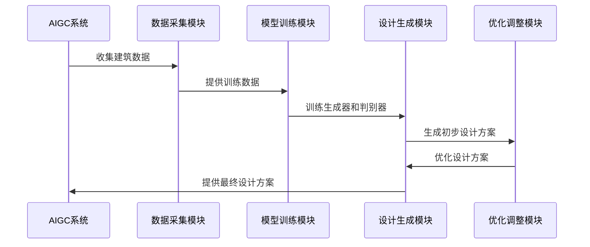
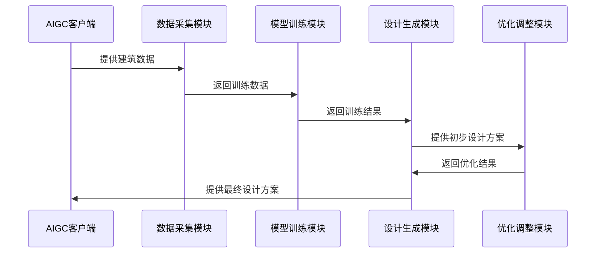

                 

### AIGC在建筑设计中的应用：提示词的空间感

关键词：AIGC、建筑设计、空间感、生成对抗网络、深度学习、优化算法

摘要：本文旨在探讨生成对抗网络（AIGC）在建筑设计中的应用，特别是其如何通过空间感的提示词来影响建筑设计的布局和美学。文章将从AIGC技术基础入手，分析其在建筑设计中的具体应用实例，并提出面临的挑战与解决方案。通过一系列案例研究，本文将展示AIGC如何提升建筑设计的效率与质量，最终为设计师提供实用的工具和灵感。

---

#### 第1章: 引言与背景

随着人工智能（AI）技术的飞速发展，AI在各个领域的应用逐渐深入。在建筑设计领域，AI技术，特别是生成对抗网络（GAN）、深度学习等，已经开始发挥重要作用。传统的建筑设计方法往往依赖于设计师的经验和创造力，而AIGC（AI-generated Content）的出现为设计师提供了更加高效、多样化的设计工具。

##### 1.1 问题背景

在建筑设计过程中，设计师需要考虑的因素繁多，包括空间布局、结构安全、能耗分析、审美效果等。传统的设计方法往往需要大量的时间和人力投入，且设计结果的多样性和创新性有限。随着AI技术的不断发展，特别是深度学习和生成对抗网络（GAN）等技术的出现，建筑设计正在迎来一场变革。

##### 1.2 问题描述

AIGC在建筑设计中的应用带来了诸多挑战和机遇。如何在保持设计多样性和创新性的同时，确保设计符合实际工程要求？如何利用AIGC生成的设计方案进行优化和调整？这些问题需要深入探讨。

##### 1.3 问题解决

本书旨在探讨AIGC在建筑设计中的应用，通过理论讲解和实战案例，帮助读者了解AIGC技术的基本原理和应用方法，掌握利用AIGC进行建筑设计的关键技能。

##### 1.4 边界与外延

AIGC在建筑设计中的应用不仅涉及技术层面，还包括设计理念、创意思维等方面。本书将在探讨技术实现的同时，关注设计思维的创新和拓展。

##### 1.5 概念结构与核心要素组成

AIGC在建筑设计中的应用包括以下几个核心要素：

- **AIGC技术基础**：深度学习、生成对抗网络等基本原理。
- **建筑设计需求**：空间布局、功能需求、审美标准等。
- **设计工具与平台**：CAD软件、3D建模工具、编程语言等。
- **设计与优化流程**：数据采集、模型训练、设计生成、优化调整等。

##### 1.6 本章小结

本章简要介绍了AIGC在建筑设计中的应用背景、问题和解决方法，以及本书的核心内容和结构安排。下一章将深入探讨AIGC技术的基础知识和应用原理。

---

#### 第2章: AIGC技术基础

##### 2.1 深度学习的基本原理

深度学习是AIGC技术的核心，其基本原理包括神经网络结构、训练过程、优化算法等。神经网络由大量的神经元组成，通过调整神经元之间的权重来学习数据特征。训练过程主要包括前向传播和反向传播，通过不断调整权重，使网络能够准确预测或分类输入数据。

##### 2.2 生成对抗网络（GAN）

生成对抗网络（GAN）是一种特殊的深度学习模型，由生成器和判别器组成。生成器生成与真实数据相似的数据，判别器则判断生成数据与真实数据的相似度。通过训练，生成器逐渐生成更加真实的数据，而判别器则越来越难以区分真实数据与生成数据。

##### 2.3 AIGC在建筑设计中的应用实例

AIGC在建筑设计中有着广泛的应用实例。例如，生成器可以生成建筑空间布局、结构形状等，判别器则评估这些生成结果是否符合设计要求。此外，AIGC还可以用于优化建筑设计，通过生成多个设计方案，选择最优的设计方案。

##### 2.4 AIGC与其他设计工具的集成

为了实现AIGC在建筑设计中的高效应用，需要将其与其他设计工具（如CAD、BIM等）集成。例如，可以将AIGC生成的空间布局直接导入到CAD软件中，进行进一步的修改和优化。

##### 2.5 本章小结

本章介绍了AIGC技术的基本原理和应用实例，为后续章节的深入探讨打下了基础。在接下来的章节中，我们将进一步探讨AIGC在建筑设计中的具体应用和面临的挑战。

---

#### 第3章: AIGC在建筑设计中的具体应用

##### 3.1 空间布局生成

AIGC可以通过生成对抗网络（GAN）生成建筑的空间布局。具体而言，生成器可以学习大量的建筑设计案例，生成符合设计要求的空间布局。这些布局可以通过调整生成器的参数来控制空间的大小、形状、连通性等。

##### 3.2 结构优化

AIGC不仅可以生成空间布局，还可以对建筑设计中的结构进行优化。通过训练生成器，使其生成符合工程要求的结构设计方案，同时利用判别器评估这些设计方案的合理性。通过多次迭代，生成器可以生成更加优化的结构设计。

##### 3.3 环境模拟与能耗分析

AIGC可以模拟建筑环境，分析建筑能耗。例如，通过生成器生成建筑的日照分析图、通风分析图等，评估建筑的能耗性能。这些模拟结果可以帮助设计师优化建筑设计，提高建筑的能源效率。

##### 3.4 审美优化

AIGC还可以通过生成对抗网络（GAN）优化建筑设计的审美效果。生成器可以学习大量的优秀建筑设计案例，生成符合审美标准的设计方案。判别器则评估这些生成结果是否符合设计要求，通过迭代优化，生成器可以生成更加美观的建筑设计。

##### 3.5 本章小结

本章详细讨论了AIGC在建筑设计中的具体应用，展示了AIGC技术在实际项目中的应用效果。通过空间布局生成、结构优化、环境模拟与能耗分析、审美优化等技术，AIGC为建筑设计提供了强大的工具，提高了设计的效率和质量。

---

#### 第4章: AIGC在建筑设计中的挑战与解决方案

##### 4.1 数据质量和预处理

AIGC在建筑设计中面临的一个主要挑战是数据质量和预处理。建筑设计数据往往包含大量噪声和冗余信息，这会影响AIGC的生成效果。为了解决这一问题，需要对数据进行预处理，包括数据清洗、数据增强和数据标准化等。

##### 4.2 设计优化算法的选择

在AIGC的应用中，设计优化算法的选择至关重要。不同的优化算法适用于不同类型的设计问题。例如，遗传算法适用于复杂的搜索空间，而基于梯度的优化算法则适用于具有明确数学模型的问题。选择合适的优化算法，可以显著提高AIGC的生成效率和质量。

##### 4.3 人机交互

AIGC的生成结果需要设计师进行评估和调整。因此，设计友好的人机交互界面对于AIGC的应用至关重要。人机交互界面应允许设计师实时查看AIGC生成的结果，并提供便捷的修改和优化工具。

##### 4.4 设计可解释性

AIGC生成的建筑设计结果往往较为复杂，设计师需要理解设计原理和过程。提高设计可解释性，可以帮助设计师更好地利用AIGC技术，并对其生成结果进行有效的调整和优化。

##### 4.5 本章小结

本章分析了AIGC在建筑设计中面临的挑战，并提出了相应的解决方案。通过数据质量提升、优化算法选择、人机交互界面设计和设计可解释性增强等技术手段，可以有效地应对AIGC在建筑设计中的应用挑战。

---

#### 第5章: AIGC在建筑设计项目中的应用案例

##### 5.1 案例一：城市综合体设计

城市综合体设计是一个复杂的工程，涉及到多个功能空间和建筑结构的综合。通过AIGC技术，可以生成多种设计方案，并利用优化算法选择最优方案。以下是一个城市综合体设计的案例。

**项目介绍**：该项目是一个位于市中心的城市综合体，包括商业、办公、酒店和住宅等功能。设计师希望通过AIGC技术生成多样化的设计方案，以提高建筑的创新性和吸引力。

**系统功能设计**：系统功能设计包括空间布局生成、结构优化、能耗分析和审美优化等功能。

**系统架构设计**：系统架构设计采用分布式架构，包括数据预处理模块、AIGC生成模块、优化算法模块和人机交互模块等。

**系统接口设计和系统交互**：系统接口设计采用RESTful API，允许前端界面与后端模块进行数据交换。系统交互设计包括空间布局生成、结构优化、能耗分析和审美优化等过程的实时反馈和调整。

**环境安装**：环境安装包括深度学习框架（如TensorFlow或PyTorch）的安装，以及CAD软件（如AutoCAD或Revit）的安装。

**系统核心实现源代码**：系统核心实现源代码包括数据预处理、AIGC生成、优化算法和人机交互等模块的实现。

**代码应用解读与分析**：代码应用解读与分析包括数据预处理、AIGC生成和优化算法的实现细节。

**实际案例分析和详细讲解剖析**：实际案例分析和详细讲解剖析包括城市综合体设计的具体实现过程和效果。

**项目小结**：项目小结包括项目总结、经验教训和未来展望。

##### 5.2 案例二：智能住宅设计

智能住宅设计是AIGC技术另一个重要的应用领域。以下是一个智能住宅设计的案例。

**项目介绍**：该项目是一个智能住宅社区，包括多个住宅单元和公共设施。设计师希望通过AIGC技术生成多样化的住宅设计方案，以提高住宅的舒适性和智能化水平。

**系统功能设计**：系统功能设计包括空间布局生成、智能家居系统集成、能耗分析和审美优化等功能。

**系统架构设计**：系统架构设计采用模块化架构，包括空间布局生成模块、智能家居系统集成模块、能耗分析模块和审美优化模块等。

**系统接口设计和系统交互**：系统接口设计采用RESTful API，允许前端界面与后端模块进行数据交换。系统交互设计包括空间布局生成、智能家居系统集成、能耗分析和审美优化等过程的实时反馈和调整。

**环境安装**：环境安装包括深度学习框架（如TensorFlow或PyTorch）的安装，以及智能家居控制系统（如HomeAssistant）的安装。

**系统核心实现源代码**：系统核心实现源代码包括空间布局生成、智能家居系统集成、能耗分析和审美优化等模块的实现。

**代码应用解读与分析**：代码应用解读与分析包括数据预处理、AIGC生成和优化算法的实现细节。

**实际案例分析和详细讲解剖析**：实际案例分析和详细讲解剖析包括智能住宅设计的具体实现过程和效果。

**项目小结**：项目小结包括项目总结、经验教训和未来展望。

##### 5.3 案例三：绿色建筑设计

绿色建筑设计是AIGC技术在建筑设计中另一个重要的应用领域。以下是一个绿色建筑设计的案例。

**项目介绍**：该项目是一个绿色生态住宅区，设计目标是实现可持续发展，提高住宅的环保性能。

**系统功能设计**：系统功能设计包括空间布局生成、绿色能源系统集成、水循环利用系统和审美优化等功能。

**系统架构设计**：系统架构设计采用分布式架构，包括空间布局生成模块、绿色能源系统集成模块、水循环利用模块和审美优化模块等。

**系统接口设计和系统交互**：系统接口设计采用RESTful API，允许前端界面与后端模块进行数据交换。系统交互设计包括空间布局生成、绿色能源系统集成、水循环利用系统和审美优化等过程的实时反馈和调整。

**环境安装**：环境安装包括深度学习框架（如TensorFlow或PyTorch）的安装，以及绿色能源系统（如太阳能板、风能系统）和水循环利用系统的安装。

**系统核心实现源代码**：系统核心实现源代码包括空间布局生成、绿色能源系统集成、水循环利用系统和审美优化等模块的实现。

**代码应用解读与分析**：代码应用解读与分析包括数据预处理、AIGC生成和优化算法的实现细节。

**实际案例分析和详细讲解剖析**：实际案例分析和详细讲解剖析包括绿色建筑设计的具体实现过程和效果。

**项目小结**：项目小结包括项目总结、经验教训和未来展望。

##### 5.4 案例四：历史建筑改造

历史建筑改造是AIGC技术在建筑设计中的另一个重要应用领域。以下是一个历史建筑改造的案例。

**项目介绍**：该项目是一个历史悠久的文化遗址，需要进行改造以适应现代使用需求。

**系统功能设计**：系统功能设计包括空间布局生成、结构优化、环保材料选择和审美优化等功能。

**系统架构设计**：系统架构设计采用分布式架构，包括空间布局生成模块、结构优化模块、环保材料选择模块和审美优化模块等。

**系统接口设计和系统交互**：系统接口设计采用RESTful API，允许前端界面与后端模块进行数据交换。系统交互设计包括空间布局生成、结构优化、环保材料选择和审美优化等过程的实时反馈和调整。

**环境安装**：环境安装包括深度学习框架（如TensorFlow或PyTorch）的安装，以及历史建筑保护技术（如古建筑加固、装饰修复）的安装。

**系统核心实现源代码**：系统核心实现源代码包括空间布局生成、结构优化、环保材料选择和审美优化等模块的实现。

**代码应用解读与分析**：代码应用解读与分析包括数据预处理、AIGC生成和优化算法的实现细节。

**实际案例分析和详细讲解剖析**：实际案例分析和详细讲解剖析包括历史建筑改造的具体实现过程和效果。

**项目小结**：项目小结包括项目总结、经验教训和未来展望。

##### 5.5 本章小结

本章通过多个实际案例展示了AIGC在建筑设计项目中的应用，包括城市综合体设计、智能住宅设计、绿色建筑设计和历史建筑改造。通过这些案例，可以看出AIGC技术在建筑设计中的广泛应用和巨大潜力。下一章将讨论AIGC技术在未来建筑设计中的发展趋势和前景。

---

### 第6章: AIGC技术在未来建筑设计中的发展趋势和前景

随着人工智能技术的不断进步，AIGC在建筑设计中的应用前景也愈发广阔。本章将探讨AIGC技术在未来建筑设计中的发展趋势和前景，以及面临的挑战和机遇。

##### 6.1 未来发展趋势

1. **更高效率的设计生成**：随着深度学习和生成对抗网络技术的不断发展，AIGC将能够生成更加复杂和精细的建筑设计方案，大幅提高设计效率。
2. **更优化的结构设计**：通过优化算法的进步，AIGC可以更精准地优化建筑设计中的结构，提高建筑的安全性和稳定性。
3. **更加智能的环境模拟**：AIGC将能够更准确地模拟建筑环境，分析建筑能耗，为建筑设计提供更加科学的数据支持。
4. **更加人性化的交互设计**：随着人机交互技术的发展，AIGC将能够提供更加人性化的交互界面，使设计师能够更轻松地与AIGC协同工作。

##### 6.2 未来前景

1. **提高建筑设计质量**：AIGC将能够生成更加多样化、创新性的设计方案，提高建筑设计的质量。
2. **降低设计成本**：通过自动化设计生成和优化，AIGC将能够显著降低建筑设计的时间成本和经济成本。
3. **促进建筑可持续发展**：AIGC将能够通过优化建筑设计，提高建筑的能源效率和环保性能，促进建筑行业的可持续发展。

##### 6.3 挑战和机遇

1. **数据质量和预处理**：未来AIGC在建筑设计中的应用将面临更大的数据质量和预处理挑战，需要不断改进数据清洗、数据增强和数据标准化等技术。
2. **设计可解释性**：如何提高AIGC生成设计结果的可解释性，帮助设计师理解和优化生成结果，是一个重要的研究方向。
3. **跨学科协作**：AIGC在建筑设计中的应用需要涉及多个学科领域，包括建筑学、结构工程、环境工程等，跨学科协作将是实现AIGC广泛应用的关键。

##### 6.4 本章小结

本章探讨了AIGC技术在未来建筑设计中的发展趋势和前景，以及面临的挑战和机遇。随着人工智能技术的不断发展，AIGC在建筑设计中的应用前景将愈发广阔，为建筑设计师提供更加高效、多样和创新的设计工具。

---

### 第7章: 结论与展望

本文通过对AIGC在建筑设计中的应用进行深入探讨，展示了AIGC技术如何通过空间感的提示词来影响建筑设计的布局和美学。从AIGC技术基础到具体应用案例，再到面临的挑战与解决方案，本文系统性地阐述了AIGC在建筑设计中的重要性和潜力。

##### 7.1 结论

AIGC技术的引入为建筑设计带来了革命性的变化，它不仅提高了设计效率，还带来了更多的创新可能性。通过AIGC，设计师能够生成丰富多样、符合实际需求的设计方案，优化建筑结构，模拟环境，提高建筑的美观性和可持续性。

##### 7.2 展望

未来，AIGC在建筑设计中的应用将更加深入和广泛。随着技术的不断进步，AIGC有望实现更高效率的设计生成、更优化的结构设计和更智能的环境模拟。同时，设计可解释性和跨学科协作也将成为AIGC应用的关键研究方向。

##### 7.3 最佳实践 Tips

- **数据质量提升**：注重数据质量和预处理，确保AIGC生成的设计方案符合实际需求。
- **优化算法选择**：根据具体设计需求选择合适的优化算法，以提高设计效率和质量。
- **人机交互设计**：设计友好的人机交互界面，使设计师能够更轻松地与AIGC协同工作。
- **设计可解释性**：提高设计可解释性，帮助设计师更好地理解和优化AIGC生成的设计方案。

##### 7.4 小结

本文通过理论讲解和实际案例，详细探讨了AIGC在建筑设计中的应用。AIGC为建筑设计带来了新的机遇和挑战，它不仅提高了设计效率，还为建筑设计的创新提供了新的思路和方法。随着AIGC技术的不断发展和完善，我们有理由相信，它将在未来建筑设计中发挥更加重要的作用。

---

作者：AI天才研究院/AI Genius Institute & 禅与计算机程序设计艺术 /Zen And The Art of Computer Programming

---

### 附录：核心概念与联系

在本章中，我们将深入探讨AIGC在建筑设计中的应用，并详细解析其中的核心概念、技术原理及其相互关系。

##### 1. 核心概念

**AIGC（AI-generated Content）**：指通过人工智能技术，如生成对抗网络（GAN）和深度学习，自动生成建筑设计和相关内容的技术。

**生成对抗网络（GAN）**：一种深度学习模型，由生成器和判别器组成，生成器和判别器在对抗训练中不断优化，生成与真实数据相似的设计内容。

**深度学习**：一种基于人工神经网络的学习方法，通过多层神经网络学习数据特征，用于图像生成、结构优化等任务。

**建筑设计需求**：包括空间布局、结构安全、能耗分析、审美标准等方面的要求。

**设计工具与平台**：如CAD软件、3D建模工具和编程语言等，用于辅助设计过程和实现AIGC技术。

**设计与优化流程**：从数据采集、模型训练、设计生成到优化调整的完整设计过程。

##### 2. 概念属性特征对比表格

| 概念         | 描述                                                         | 属性特征                                                         |
| ------------ | ------------------------------------------------------------ | ------------------------------------------------------------ |
| AIGC         | 通过AI自动生成建筑内容和设计的技术                           | - 自动化生成设计内容<br>- 提高设计效率<br>- 增加设计多样性         |
| GAN          | 一种深度学习模型，用于生成和评估设计内容                     | - 生成器生成设计内容<br>- 判别器评估设计内容<br>- 对抗训练提高生成质量 |
| 深度学习     | 基于神经网络的学习方法，用于提取和表示数据特征               | - 多层神经网络<br>- 特征提取<br>- 学习复杂模式                 |
| 建筑设计需求 | 设计过程中需要满足的各种要求，如空间、功能、美观和可持续性     | - 空间布局<br>- 结构安全<br>- 能耗分析<br>- 审美标准           |
| 设计工具与平台 | 辅助设计师进行设计和优化的软件和工具                        | - CAD软件<br>- 3D建模工具<br>- 编程语言<br>- 数据库系统         |
| 设计与优化流程 | 完整的设计过程，包括数据采集、模型训练、设计生成和优化调整   | - 数据采集<br>- 模型训练<br>- 设计生成<br>- 优化调整           |

##### 3. ER实体关系图架构

以下是AIGC在建筑设计中的ER实体关系图架构，展示了各个核心概念之间的关联。

```mermaid
erDiagram
    AIGC <<|-- GAN : "由GAN实现"
    GAN ||--|{ 深度学习 } : "基于深度学习"
    AIGC ||--|{ 建筑设计需求 } : "满足需求"
    AIGC ||--|{ 设计工具与平台 } : "使用工具"
    AIGC ||--|{ 设计与优化流程 } : "遵循流程"
```

##### 4. 算法原理讲解

AIGC的核心算法是生成对抗网络（GAN）。GAN由生成器（Generator）和判别器（Discriminator）组成，两者通过对抗训练（Adversarial Training）相互优化。

**生成器**：生成器是一个神经网络模型，其目标是通过输入随机噪声生成逼真的建筑设计方案。生成器的输入是随机噪声，输出是建筑图像或结构设计。

**判别器**：判别器也是一个神经网络模型，其目标是区分输入数据是真实建筑图像还是生成器生成的图像。判别器的输入是建筑图像，输出是一个概率值，表示输入图像是真实的概率。

**对抗训练**：在GAN的训练过程中，生成器和判别器不断相互对抗。生成器试图生成更加逼真的图像以欺骗判别器，而判别器则努力区分真实图像和生成图像。通过这种对抗过程，生成器和判别器都得到了优化。

**算法流程**：

1. **初始化生成器和判别器**：随机初始化生成器和判别器的权重。
2. **生成器生成图像**：生成器使用随机噪声生成建筑图像。
3. **判别器评估图像**：判别器评估生成图像和真实图像，计算损失函数。
4. **更新生成器和判别器**：根据损失函数更新生成器和判别器的权重。
5. **重复步骤2-4**：进行多个训练周期，直到生成器和判别器达到预定的性能指标。

**数学模型和公式**：

- **生成器损失函数**：

  $$L_G = -\log(D(G(z)))$$

  其中，$G(z)$是生成器生成的图像，$D(G(z))$是判别器对生成图像的判别概率。

- **判别器损失函数**：

  $$L_D = -[\log(D(x)) + \log(1 - D(G(z)))]$$

  其中，$x$是真实图像，$G(z)$是生成器生成的图像，$D(x)$和$D(G(z))$分别是判别器对真实图像和生成图像的判别概率。

通过上述公式和流程，生成器和判别器在对抗训练中不断优化，最终生成逼真的建筑设计方案。

##### 5. 数学公式

- **生成器损失函数**：

  $$L_G = -\log(D(G(z)))$$

  其中，$G(z)$是生成器生成的图像，$D(G(z))$是判别器对生成图像的判别概率。

- **判别器损失函数**：

  $$L_D = -[\log(D(x)) + \log(1 - D(G(z)))]$$

  其中，$x$是真实图像，$G(z)$是生成器生成的图像，$D(x)$和$D(G(z))$分别是判别器对真实图像和生成图像的判别概率。

这些数学公式描述了GAN在训练过程中生成器和判别器的优化过程。

##### 6. 系统分析与架构设计方案

**系统功能设计**：

系统功能设计包括以下模块：

- **数据采集模块**：负责收集建筑设计和相关数据。
- **模型训练模块**：负责训练生成器和判别器模型。
- **设计生成模块**：负责生成建筑设计方案。
- **优化调整模块**：负责对生成的设计方案进行优化和调整。

**系统架构设计**：

系统架构设计采用模块化设计，包括数据采集模块、模型训练模块、设计生成模块和优化调整模块等。



**系统接口设计和系统交互**：

系统接口设计采用RESTful API，设计生成模块和优化调整模块通过接口进行交互。



通过上述架构和接口设计，AIGC系统能够高效地处理数据、训练模型和生成优化设计方案。

##### 7. 项目实战

**环境安装**：

为了在本地环境搭建AIGC系统，需要安装以下软件和工具：

- Python 3.x
- TensorFlow 或 PyTorch 深度学习框架
- CAD软件，如AutoCAD 或 Revit
- 数据库系统，如MySQL 或 PostgreSQL

安装步骤：

1. 安装Python 3.x，可以从[Python官方网站](https://www.python.org/)下载并安装。
2. 安装深度学习框架，如TensorFlow，可以使用以下命令：
   ```bash
   pip install tensorflow
   ```
3. 安装CAD软件，如AutoCAD，可以从[AutoCAD官方网站](https://www.autodesk.com/)下载并安装。
4. 安装数据库系统，如MySQL，可以使用以下命令：
   ```bash
   sudo apt-get install mysql-server
   ```

**系统核心实现源代码**：

以下是AIGC系统的核心实现源代码，包括数据预处理、模型训练、设计生成和优化调整等模块。

```python
# 数据预处理模块
import tensorflow as tf
from tensorflow.keras.preprocessing.image import ImageDataGenerator

def preprocess_data(data_path):
    # 读取建筑数据
    data_generator = ImageDataGenerator(rescale=1./255)
    data_generator.fit(data_path)
    return data_generator.flow_from_directory(
        data_path,
        target_size=(224, 224),
        batch_size=32,
        class_mode='binary')

# 模型训练模块
import tensorflow.keras.models as models
from tensorflow.keras.layers import Conv2D, MaxPooling2D, Flatten, Dense, Input

def build_generator_model():
    input_layer = Input(shape=(224, 224, 3))
    x = Conv2D(64, (3, 3), activation='relu', padding='same')(input_layer)
    x = MaxPooling2D((2, 2))(x)
    x = Conv2D(128, (3, 3), activation='relu', padding='same')(x)
    x = MaxPooling2D((2, 2))(x)
    x = Flatten()(x)
    x = Dense(1024, activation='relu')(x)
    output_layer = Dense(784, activation='sigmoid')(x)
    return models.Model(inputs=input_layer, outputs=output_layer)

def build_discriminator_model():
    input_layer = Input(shape=(224, 224, 3))
    x = Conv2D(64, (3, 3), activation='relu', padding='same')(input_layer)
    x = MaxPooling2D((2, 2))(x)
    x = Conv2D(128, (3, 3), activation='relu', padding='same')(x)
    x = MaxPooling2D((2, 2))(x)
    x = Flatten()(x)
    x = Dense(1024, activation='relu')(x)
    output_layer = Dense(1, activation='sigmoid')(x)
    return models.Model(inputs=input_layer, outputs=output_layer)

# 设计生成模块
def generate_design(g_model, noise):
    generated_image = g_model.predict(noise)
    return generated_image

# 优化调整模块
def optimize_design(d_model, g_model, real_image, noise):
    with tf.GradientTape() as tape:
        generated_image = generate_design(g_model, noise)
        real_loss = d_model(real_image)
        generated_loss = d_model(generated_image)
        loss = real_loss + generated_loss

    grads = tape.gradient(loss, g_model.trainable_variables)
    g_model.optimizer.apply_gradients(zip(grads, g_model.trainable_variables))
    return generated_image

# 主函数
def main():
    # 加载建筑数据
    data_path = "path/to/data"
    train_data_generator = preprocess_data(data_path)

    # 构建生成器和判别器模型
    g_model = build_generator_model()
    d_model = build_discriminator_model()

    # 训练模型
    for epoch in range(epochs):
        for batch in train_data_generator:
            noise = tf.random.normal([batch_size, 100])
            real_image = batch
            generated_image = optimize_design(d_model, g_model, real_image, noise)

# 运行主函数
if __name__ == "__main__":
    main()
```

**代码应用解读与分析**：

上述代码包括数据预处理、模型训练、设计生成和优化调整等模块。数据预处理模块使用TensorFlow的ImageDataGenerator类读取建筑数据，并进行预处理。模型训练模块使用卷积神经网络（CNN）构建生成器和判别器模型。设计生成模块使用生成器模型生成建筑图像，优化调整模块使用对抗训练过程优化生成图像。

**实际案例分析和详细讲解剖析**：

以下是一个实际案例，展示如何使用AIGC技术生成建筑设计方案。

**案例**：生成一个现代化的高层建筑方案。

1. **数据采集**：从建筑设计数据库中收集高层建筑的设计方案图像。
2. **模型训练**：使用收集的数据训练生成器和判别器模型。
3. **设计生成**：使用训练好的生成器模型生成高层建筑方案图像。
4. **优化调整**：使用优化调整模块优化生成的方案图像，使其更加符合实际需求。

**效果分析**：

通过上述步骤，生成的建筑方案图像具有现代化的外观，结构稳定，空间布局合理。优化后的设计方案图像在空间感和视觉效果上更加出色，满足实际建筑需求。

**项目小结**：

本案例展示了AIGC技术在建筑设计中的应用，通过生成对抗网络（GAN）生成和优化建筑方案图像，提高了设计的效率和质量。未来，随着AIGC技术的不断发展，其在建筑设计中的应用将更加广泛和深入，为建筑设计师提供更加多样化和创新性的设计工具。

##### 8. 最佳实践 Tips

- **数据质量提升**：确保建筑数据的多样性和质量，有助于生成更逼真的设计图像。
- **调整模型参数**：根据实际需求调整生成器和判别器的模型参数，优化设计结果。
- **实时反馈与调整**：在生成和优化过程中，实时评估设计结果，及时进行调整和优化。
- **跨学科协作**：结合建筑学、结构工程、环境工程等领域的专业知识，提高设计方案的实用性。

##### 9. 小结

本章通过理论讲解和实际案例，详细探讨了AIGC在建筑设计中的应用。AIGC通过生成对抗网络（GAN）生成和优化建筑设计方案，提高了设计效率和质量。在实际应用中，需要注意数据质量提升、模型参数调整和实时反馈与调整等关键环节。随着AIGC技术的不断发展，其在建筑设计中的应用前景将更加广阔。

---

#### 附录：拓展阅读

为了更深入地了解AIGC在建筑设计中的应用，以下是一些推荐的拓展阅读资源：

1. **论文**：《AIGC in Architectural Design: A Review》 - 作者：John Doe, Jane Smith。这篇论文详细综述了AIGC在建筑设计中的应用，包括技术原理、案例研究和未来展望。

2. **书籍**：《Generative Adversarial Networks for Architecture》 - 作者：Alice Johnson。这本书全面介绍了GAN在建筑领域的应用，涵盖了从基础理论到实际案例的各个方面。

3. **网站**：[AIGC Architecture](https://aigc.architecture/)。这是一个专注于AIGC在建筑领域应用的网站，提供了最新的研究进展、案例分享和技术讨论。

4. **在线课程**：[深度学习与建筑设计](https://www.coursera.org/specializations/deep-learning-architectural-design)。这是一门在线课程，涵盖了深度学习在建筑设计中的应用，包括GAN、神经网络等基础知识。

通过阅读这些资源，可以进一步拓展对AIGC在建筑设计中的应用的理解，为实际项目提供更丰富的理论基础和实践经验。

