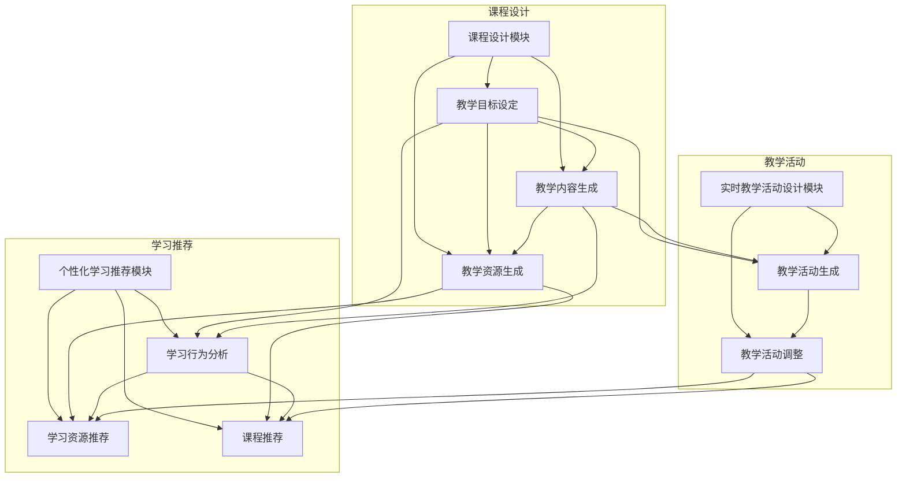
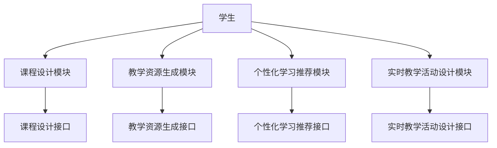
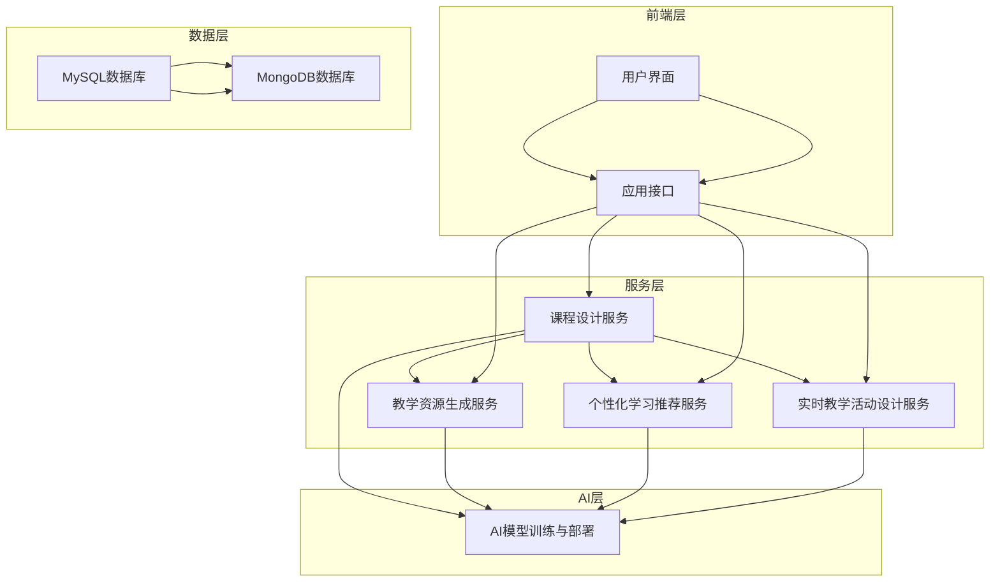
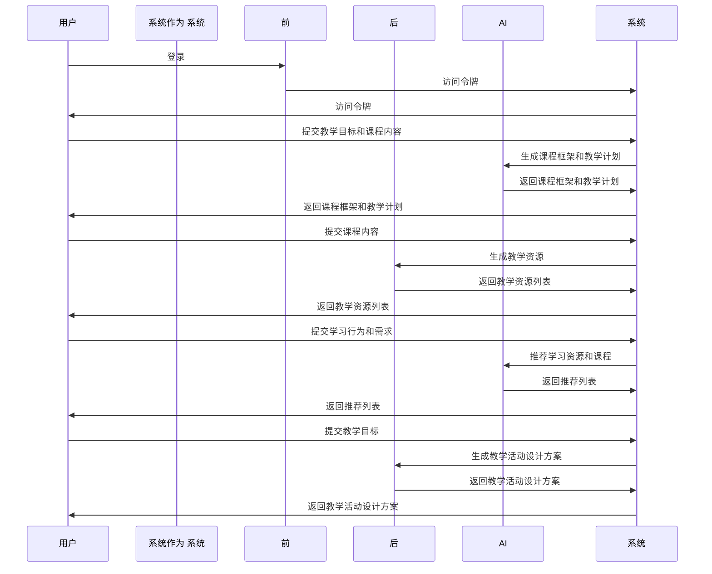

                 

### 引言与背景

#### AIGC的概念与发展历程

AIGC（Artificial Intelligence Generated Content）是一种利用人工智能技术生成内容的方法，它涵盖了生成对抗网络（GAN）、递归神经网络（RNN）、Transformer等多种算法。AIGC技术起源于深度学习的发展，特别是生成对抗网络（GAN）的提出，使得人工智能在内容生成方面取得了突破性的进展。

AIGC的发展历程可以追溯到2014年，当时Ian Goodfellow等人提出了生成对抗网络（GAN）的概念。GAN由生成器和判别器组成，生成器试图生成与真实数据分布相似的数据，而判别器则负责判断生成数据是否真实。通过这两个模型的对抗训练，生成器逐渐提高了生成数据的质量。

随着深度学习的进一步发展，RNN和Transformer等算法也被引入到内容生成领域。RNN在处理序列数据方面具有优势，而Transformer则通过自注意力机制实现了全局信息的捕捉。这些算法的结合，使得AIGC技术在图像、文本、音频等多种类型的内容生成中得到了广泛应用。

#### AIGC在教育领域的应用

AIGC在教育领域的应用主要集中在以下几个方面：

1. **教学辅助工具**：AIGC技术可以生成个性化的教学资源，如习题、教案和课件等，辅助教师进行教学。这些资源可以根据学生的学习需求和进度进行动态调整，提高教学效果。

2. **教学内容生成与优化**：AIGC技术可以自动生成教学视频、动画和模拟实验等教学资源，丰富教学内容，提高学生的学习兴趣。同时，通过对这些资源的分析和优化，可以进一步提升教学效果。

3. **个性化学习推荐**：AIGC技术可以根据学生的学习行为和兴趣，推荐合适的学习资源和课程，实现个性化学习。这有助于学生更高效地学习，提高学习成果。

#### AIGC在教育课程设计中的应用

AIGC在教育课程设计中的应用主要体现在以下几个方面：

1. **课程设计辅助**：AIGC技术可以自动生成课程框架、教学计划和课程内容，为教师提供参考。教师可以根据实际需求对生成的课程进行修改和调整。

2. **课程内容生成**：AIGC技术可以生成丰富的课程内容，如教材、习题、案例等。这些内容可以根据教学目标和学生需求进行个性化调整。

3. **教学活动设计**：AIGC技术可以生成各种教学活动，如课堂讨论、实验、案例分析等。教师可以根据教学目标和实际情况选择合适的教学活动，提高教学效果。

总之，AIGC技术在教育课程设计中的应用具有巨大的潜力，可以为教师和学生提供更加智能、个性化的教学服务。然而，要充分发挥AIGC技术的优势，还需要在教育领域进行深入的探索和实践。

#### 教育课程设计的需求与挑战

在教育领域，课程设计是一个关键环节，它直接影响教学效果和学生的学习体验。随着教育信息化和智能化的发展，传统的课程设计方式面临着诸多挑战。

首先，传统教育课程设计主要依赖于教师的经验和专业知识。虽然教师具备丰富的教学经验，但每个人的认知和经验都是有限的。这导致课程设计难以完全满足所有学生的需求，尤其是对于那些学习速度和理解能力不同的学生。此外，教师的工作量也非常大，需要花费大量时间在课程设计和修改上。

其次，随着教育资源的丰富和多样化，课程设计需要考虑的因素越来越多。例如，不同学科之间的交叉融合、课程内容的前沿性、教学方法的多样性等。这些因素使得课程设计变得更加复杂，对教师的综合能力提出了更高的要求。

此外，教育课程设计还面临着以下挑战：

1. **个性化教学**：随着教育的普及，学生个体差异越来越显著，传统的“一刀切”式教学方式已无法满足个性化教学的需求。课程设计需要更加关注学生的兴趣、需求和个性，提供个性化的学习资源和指导。

2. **教学资源的管理与整合**：现代教育需要大量的教学资源，包括教材、视频、案例等。如何有效地管理和整合这些资源，提高教学资源的利用效率，是一个亟待解决的问题。

3. **教育评价体系的改革**：传统的教育评价体系主要关注学生的考试成绩，而忽略了学生的综合素质和创新能力。课程设计需要与教育评价体系相适应，形成全面的评价体系。

4. **教育技术的应用**：随着教育技术的发展，各种新兴技术（如人工智能、虚拟现实等）开始应用于教育领域。如何将这些技术与课程设计相结合，提高教学效果，是一个新的挑战。

总之，教育课程设计在当前教育环境中面临着诸多需求与挑战。如何利用现代技术，特别是AIGC技术，优化课程设计，提高教学效果，是教育工作者需要深入思考的问题。

### 核心概念与联系

在本章中，我们将详细探讨AIGC和教育课程设计中的核心概念，并分析这些概念之间的联系，帮助读者更好地理解它们在课程设计中的应用。

#### AIGC的核心概念

1. **生成对抗网络（GAN）**：GAN是由生成器和判别器组成的对抗性模型。生成器试图生成逼真的数据，而判别器则负责判断生成数据与真实数据之间的差异。通过这种对抗训练，生成器不断提高生成数据的质量。

2. **递归神经网络（RNN）**：RNN是一种能够处理序列数据的神经网络。它通过记忆过去的信息，对序列中的每个元素进行建模。RNN在自然语言处理、时间序列预测等领域有着广泛的应用。

3. **Transformer**：Transformer是一种基于自注意力机制的神经网络模型。它通过全局信息捕捉，使得模型在处理长序列数据时表现出色。Transformer在机器翻译、文本生成等领域取得了显著成果。

#### 教育课程设计的核心概念

1. **知识构建理论**：知识构建理论强调学生在学习过程中的主动性和创造性。学生通过与他人互动、反思和探索，主动构建自己的知识体系。

2. **互动式学习理论**：互动式学习理论认为，学习是一个互动的过程，学生通过与教师、同伴的互动，获得新的知识和技能。

3. **教学目标**：教学目标是课程设计的核心。它明确课程要达到的具体效果，指导教学内容和教学方法的选择。

#### AIGC与教育课程设计的联系

1. **个性化学习**：AIGC技术可以根据学生的学习行为和需求，生成个性化的学习资源。这有助于实现知识构建理论和互动式学习理论中的个性化学习。

2. **教学资源生成**：AIGC技术可以自动生成教学视频、课件、习题等资源，丰富课程内容。这有助于实现教学目标的多样化，提高教学效果。

3. **教学活动设计**：AIGC技术可以生成各种教学活动，如课堂讨论、实验、案例分析等。教师可以根据教学目标和学生需求，选择合适的教学活动，促进互动式学习。

4. **教学评估**：AIGC技术可以对学生的学习过程和成果进行实时评估，提供个性化的反馈。这有助于教师了解学生的学习状况，调整教学策略。

总之，AIGC技术为教育课程设计提供了丰富的工具和方法，有助于实现个性化学习、丰富课程内容、优化教学活动和提高教学评估效果。通过深入理解这些核心概念及其联系，教师可以更好地利用AIGC技术，提升教育课程设计的质量。

#### 核心概念属性特征对比表格

为了更好地理解AIGC和教育课程设计中的核心概念，我们在此提供一份核心概念属性特征对比表格。以下是AIGC的核心概念（生成对抗网络（GAN）、递归神经网络（RNN）、Transformer）与教育课程设计中的核心概念（知识构建理论、互动式学习理论、教学目标）的对比。

| 核心概念         | 属性特征                                                     | 对比描述                                                         |
|----------------|------------------------------------------------------------|-----------------------------------------------------------------|
| 生成对抗网络（GAN） | - 生成器：生成逼真的数据<br>- 判别器：判断生成数据与真实数据的差异<br>- 对抗训练：生成器与判别器的博弈 | GAN通过生成器和判别器的对抗训练，不断提高生成数据的质量，类似于教学目标中的课程目标设定与评估。 |
| 递归神经网络（RNN） | - 序列数据建模<br>- 过去信息记忆<br>- 适用于自然语言处理、时间序列预测 | RNN能够处理序列数据，有助于构建学生的知识体系，类似于知识构建理论中的知识构建过程。             |
| Transformer     | - 自注意力机制<br>- 全局信息捕捉<br>- 适用于机器翻译、文本生成 | Transformer能够捕捉全局信息，有助于促进互动式学习，类似于互动式学习理论中的互动学习过程。   |
| 知识构建理论      | - 主动构建知识体系<br>- 与他人互动<br>- 反思和探索               | 知识构建理论强调学生的主动性和创造性，与GAN的生成过程有相似之处。                         |
| 互动式学习理论    | - 学习是互动过程<br>- 与教师、同伴互动<br>- 获得新知识和技能     | 互动式学习理论强调互动在教学中的重要性，与RNN和Transformer的交互特性有相似之处。           |
| 教学目标         | - 明确课程要达到的效果<br>- 指导教学内容和教学方法的选择         | 教学目标作为课程设计的核心，与GAN的生成器和判别器对抗训练中的目标设定有相似之处。         |

通过上述对比表格，我们可以看到AIGC的核心概念与教育课程设计中的核心概念之间存在诸多相似之处。这些相似之处为AIGC技术在教育课程设计中的应用提供了理论基础和实际指导。

#### 教育课程设计中的ER实体关系图架构

为了更清晰地展示教育课程设计中的实体及其关系，我们使用ER（Entity-Relationship）实体关系图来描述。以下是教育课程设计中的ER图，其中包括了学生、教师、课程、教学资源和教学活动等实体及其关系。

```mermaid
erDiagram
    学生 ||--|{ 教师 }
    教师 ||--|{ 课程 }
    课程 ||--|{ 教学资源 }
    课程 ||--|{ 教学活动 }
    教学资源 ||--|{ 学生 }
    教学活动 ||--|{ 教师 }
    教学活动 ||--|{ 学生 }
```

- **学生**：学生是教育课程设计中的核心实体，他们参与课程学习、使用教学资源和参与教学活动。
- **教师**：教师负责课程的设计、教学资源和教学活动的实施，为学生提供学习指导。
- **课程**：课程是教育课程设计的核心，它包括教学目标、教学内容和教学评价。
- **教学资源**：教学资源包括教材、视频、习题等，为学生提供学习支持。
- **教学活动**：教学活动包括课堂讨论、实验、案例分析等，旨在促进学生的互动学习和知识构建。

通过ER实体关系图，我们可以清晰地看到各个实体之间的关系，以及它们在课程设计中的角色和作用。这有助于我们更好地理解教育课程设计中的关键要素和它们之间的联系。

### 算法原理讲解

在本章中，我们将深入讲解AIGC算法在教育课程设计中的应用原理，并通过Mermaid流程图和Python源代码详细阐述其实现过程。

#### GAN算法原理

生成对抗网络（GAN）由生成器和判别器组成。生成器的任务是生成逼真的数据，而判别器的任务是区分生成数据和真实数据。通过这种对抗训练，生成器的生成数据质量会逐渐提高。

1. **生成器（Generator）**：
   - 输入：随机噪声向量 $z$。
   - 输出：生成数据 $G(z)$。

2. **判别器（Discriminator）**：
   - 输入：真实数据 $x$ 或生成数据 $G(z)$。
   - 输出：判别结果 $D(x)$ 或 $D(G(z))$。

GAN的训练过程如下：

- 随机生成噪声向量 $z$，通过生成器生成数据 $G(z)$。
- 判别器对真实数据和生成数据同时进行训练。
- 计算生成器的损失函数 $L_G$ 和判别器的损失函数 $L_D$。

损失函数定义如下：

$$
L_G = -\log D(G(z))
$$

$$
L_D = -[\log D(x) + \log (1 - D(G(z))]
$$

通过反向传播和优化算法（如梯度下降），不断调整生成器和判别器的参数，使得生成器的生成数据质量逐渐提高。

#### RNN算法原理

递归神经网络（RNN）是一种能够处理序列数据的神经网络。它通过记忆过去的信息，对序列中的每个元素进行建模。

1. **基本结构**：
   - 输入：序列数据 $x_t$。
   - 输出：序列数据 $y_t$。
   - 隐藏状态：$h_t$。

RNN的基本方程如下：

$$
h_t = \sigma(W_h \cdot [h_{t-1}, x_t] + b_h)
$$

$$
y_t = W_o \cdot h_t + b_o
$$

其中，$\sigma$ 是激活函数，$W_h$ 和 $W_o$ 分别是隐藏层和输出层的权重，$b_h$ 和 $b_o$ 分别是隐藏层和输出层的偏置。

RNN的训练过程如下：

- 对于每个时间步的输入 $x_t$，通过递归方程计算隐藏状态 $h_t$。
- 计算输出 $y_t$。
- 计算损失函数（如均方误差）。
- 通过反向传播更新权重和偏置。

#### Transformer算法原理

Transformer是一种基于自注意力机制的神经网络模型。它通过全局信息捕捉，在处理长序列数据时表现出色。

1. **基本结构**：
   - 输入：序列数据 $x_1, x_2, ..., x_n$。
   - 输出：序列数据 $y_1, y_2, ..., y_n$。
   - 自注意力机制：$attn(Q, K, V) = \frac{QK^T}{\sqrt{d_k}}$。

Transformer的基本方程如下：

$$
\text{MultiHeadAttention}(Q, K, V) = \text{softmax}(\frac{QK^T}{\sqrt{d_k}})V
$$

$$
\text{EncoderLayer}(h) = \text{LayerNorm}(h) + \text{Scan}(\text{MultiHeadAttention}(h, h, h), f)
$$

其中，$Q, K, V$ 分别是查询向量、键向量和值向量，$d_k$ 是键向量的维度，$f$ 是前馈神经网络。

Transformer的训练过程如下：

- 对于每个序列的输入，通过自注意力机制计算输出。
- 将输出与输入进行拼接，并通过前馈神经网络进行进一步处理。
- 计算损失函数（如交叉熵损失）。
- 通过反向传播更新权重和偏置。

#### 实现示例

以下是使用Python实现GAN、RNN和Transformer的简单示例代码。

```python
import tensorflow as tf
from tensorflow.keras import layers

# GAN示例
def build_generator(z_dim):
    model = tf.keras.Sequential([
        layers.Dense(128, activation='relu', input_shape=(z_dim,)),
        layers.Dense(28 * 28, activation='relu'),
        layers.Reshape((28, 28, 1))
    ])
    return model

def build_discriminator(img_shape):
    model = tf.keras.Sequential([
        layers.Conv2D(64, (3, 3), padding="same", activation="relu", input_shape=img_shape),
        layers.MaxPooling2D(),
        layers.Conv2D(128, (3, 3), padding="same", activation="relu"),
        layers.MaxPooling2D(),
        layers.Flatten(),
        layers.Dense(1, activation='sigmoid')
    ])
    return model

# RNN示例
class RNNModel(tf.keras.Model):
    def __init__(self, units, input_shape):
        super(RNNModel, self).__init__()
        self.rnn = layers.LSTM(units, return_sequences=True, input_shape=input_shape)
        self.dense = layers.Dense(1)

    def call(self, x, training=False):
        x = self.rnn(x, training=training)
        x = self.dense(x)
        return x

# Transformer示例
class TransformerModel(tf.keras.Model):
    def __init__(self, d_model, num_heads, dff, input_shape):
        super(TransformerModel, self).__init__()
        self.embedding = layers.Embedding(d_model, d_model)
        self.enc_layers = [TransformerLayer(d_model, num_heads, dff) for _ in range(num_layers)]
        self.dec_layers = [TransformerLayer(d_model, num_heads, dff) for _ in range(num_layers)]
        self.final_layer = layers.Dense(1)

    def call(self, x, training=False):
        x = self.embedding(x)
        for i in range(num_layers):
            x = self.enc_layers[i](x, training=training)
        x = self.dec_layers[i](x, training=training)
        x = self.final_layer(x)
        return x
```

通过上述代码示例，我们可以看到GAN、RNN和Transformer的基本实现过程。这些算法在教育课程设计中的应用，有助于生成个性化的学习资源和优化教学活动，提高教学效果。

### 数学模型和数学公式详细讲解及举例说明

在本章中，我们将深入探讨AIGC算法中的数学模型和数学公式，并使用Python代码进行详细讲解和举例说明。

#### GAN的数学模型

生成对抗网络（GAN）的核心是生成器（Generator）和判别器（Discriminator）的对抗训练。下面我们将详细介绍GAN的数学模型和公式。

1. **生成器（Generator）**

生成器 $G$ 接受一个随机噪声向量 $z$ 作为输入，并生成假样本 $x_G$：

$$
x_G = G(z)
$$

生成器的损失函数为：

$$
L_G = -\log(D(x_G))
$$

其中，$D$ 是判别器。

2. **判别器（Discriminator）**

判别器 $D$ 接受真实样本 $x$ 和生成样本 $x_G$ 作为输入，并输出它们分别为真实的概率：

$$
D(x) = \frac{1}{1 + \exp(-x \cdot w_D - b_D)}
$$

$$
D(x_G) = \frac{1}{1 + \exp(-x_G \cdot w_D - b_D)}
$$

判别器的损失函数为：

$$
L_D = -[\log(D(x)) + \log(1 - D(x_G))]
$$

#### GAN的总损失函数

GAN的总损失函数是生成器和判别器的损失函数之和：

$$
L = L_G + L_D
$$

#### Python代码示例

以下是一个简单的GAN模型实现的Python代码示例，其中使用了TensorFlow框架。

```python
import tensorflow as tf
from tensorflow.keras.layers import Dense, Flatten, Reshape
from tensorflow.keras.models import Sequential

# 定义生成器模型
def build_generator(z_dim, img_shape):
    model = Sequential([
        Dense(128, input_shape=(z_dim,), activation='relu'),
        Dense(np.prod(img_shape), activation='relu'),
        Reshape(img_shape)
    ])
    return model

# 定义判别器模型
def build_discriminator(img_shape):
    model = Sequential([
        Flatten(input_shape=img_shape),
        Dense(128, activation='relu'),
        Dense(1, activation='sigmoid')
    ])
    return model

# 构建生成器和判别器
z_dim = 100
img_shape = (28, 28, 1)

generator = build_generator(z_dim, img_shape)
discriminator = build_discriminator(img_shape)

# 编译生成器和判别器
generator.compile(optimizer=tf.keras.optimizers.Adam(0.0001), loss='binary_crossentropy')
discriminator.compile(optimizer=tf.keras.optimizers.Adam(0.0001), loss='binary_crossentropy')

# 训练GAN模型
epochs = 100
batch_size = 32

for epoch in range(epochs):
    for _ in range(batch_size):
        # 生成随机噪声
        z = np.random.normal(size=z_dim)
        # 生成假样本
        x_g = generator.predict(z)
        # 生成真实样本
        x_r = x_train[np.random.randint(x_train.shape[0], size=batch_size)]
        # 训练判别器
        d_loss_real = discriminator.train_on_batch(x_r, np.ones((batch_size, 1)))
        d_loss_fake = discriminator.train_on_batch(x_g, np.zeros((batch_size, 1)))
        # 训练生成器
        g_loss = generator.train_on_batch(z, np.ones((batch_size, 1)))

    print(f"Epoch {epoch+1}, D_loss: {0.5*(d_loss_real + d_loss_fake)}, G_loss: {g_loss}")
```

通过上述代码，我们可以看到GAN的基本实现过程。在这个例子中，我们使用了TensorFlow的Sequential模型来构建生成器和判别器，并使用Adam优化器进行训练。训练过程中，我们交替训练生成器和判别器，使得生成器逐渐生成更逼真的样本，判别器逐渐提高对真实和假样本的辨别能力。

#### RNN的数学模型

递归神经网络（RNN）是一种能够处理序列数据的神经网络。下面我们将详细介绍RNN的数学模型和公式。

1. **基本方程**

RNN的输入序列为 $x_1, x_2, ..., x_t$，输出序列为 $y_1, y_2, ..., y_t$。隐藏状态为 $h_1, h_2, ..., h_t$。

$$
h_t = \sigma(W_h \cdot [h_{t-1}, x_t] + b_h)
$$

$$
y_t = W_o \cdot h_t + b_o
$$

其中，$\sigma$ 是激活函数，$W_h$ 和 $W_o$ 分别是隐藏层和输出层的权重，$b_h$ 和 $b_o$ 分别是隐藏层和输出层的偏置。

2. **反向传播**

RNN的训练过程涉及反向传播，通过计算梯度来更新权重和偏置。损失函数通常使用均方误差（MSE）：

$$
L = \frac{1}{2} \sum_{t=1}^T (y_t - \hat{y}_t)^2
$$

其中，$\hat{y}_t$ 是预测输出。

反向传播的梯度计算如下：

$$
\frac{\partial L}{\partial W_h} = \sum_{t=1}^T \frac{\partial L}{\partial h_t} \frac{\partial h_t}{\partial W_h}
$$

$$
\frac{\partial L}{\partial b_h} = \sum_{t=1}^T \frac{\partial L}{\partial h_t} \frac{\partial h_t}{\partial b_h}
$$

$$
\frac{\partial L}{\partial W_o} = \sum_{t=1}^T \frac{\partial L}{\partial y_t} \frac{\partial y_t}{\partial W_o}
$$

$$
\frac{\partial L}{\partial b_o} = \sum_{t=1}^T \frac{\partial L}{\partial y_t} \frac{\partial y_t}{\partial b_o}
$$

3. **Python代码示例**

以下是一个简单的RNN模型实现的Python代码示例，其中使用了TensorFlow框架。

```python
import tensorflow as tf
from tensorflow.keras.layers import LSTM, Dense
from tensorflow.keras.models import Sequential

# 定义RNN模型
def build_rnn(input_shape, units):
    model = Sequential([
        LSTM(units, return_sequences=True, input_shape=input_shape),
        Dense(1)
    ])
    return model

# 设置模型参数
input_shape = (timesteps, features)
units = 64

# 构建RNN模型
rnn_model = build_rnn(input_shape, units)

# 编译模型
rnn_model.compile(optimizer='adam', loss='mse')

# 训练模型
epochs = 100
batch_size = 32

for epoch in range(epochs):
    for _ in range(batch_size):
        x = np.random.random(size=(timesteps, features))
        y = np.random.random(size=(timesteps, 1))
        # 训练模型
        rnn_model.train_on_batch(x, y)

    print(f"Epoch {epoch+1}")
```

通过上述代码，我们可以看到RNN的基本实现过程。在这个例子中，我们使用了TensorFlow的Sequential模型来构建RNN模型，并使用Adam优化器进行训练。训练过程中，我们随机生成输入和输出序列，并使用均方误差（MSE）作为损失函数。

#### Transformer的数学模型

Transformer是一种基于自注意力机制的神经网络模型。下面我们将详细介绍Transformer的数学模型和公式。

1. **自注意力机制**

Transformer的核心是自注意力机制，它通过计算不同位置的序列元素之间的依赖关系。自注意力机制的定义如下：

$$
\text{Attention}(Q, K, V) = \text{softmax}(\frac{QK^T}{\sqrt{d_k}})V
$$

其中，$Q, K, V$ 分别是查询向量、键向量和值向量，$d_k$ 是键向量的维度。

2. **Transformer模型**

Transformer模型由多个编码器层和解码器层组成，每个层包含多个自注意力机制和前馈神经网络。

编码器层（Encoder Layer）：

$$
\text{EncoderLayer}(h) = \text{LayerNorm}(h) + \text{Scan}(\text{MultiHeadAttention}(h, h, h), f)
$$

解码器层（Decoder Layer）：

$$
\text{DecoderLayer}(h) = \text{LayerNorm}(h) + \text{Scan}(\text{MaskedMultiHeadAttention}(h, h, h), f)
$$

其中，$f$ 是前馈神经网络，包含两个全连接层。

3. **Python代码示例**

以下是一个简单的Transformer模型实现的Python代码示例，其中使用了TensorFlow框架。

```python
import tensorflow as tf
from tensorflow.keras.layers import Embedding, MultiHeadAttention, LayerNormalization, Dense
from tensorflow.keras.models import Sequential

# 定义Transformer模型
def build_transformer(vocab_size, d_model, num_heads, dff, num_layers):
    model = Sequential([
        Embedding(vocab_size, d_model),
        LayerNormalization(),
        *[TransformerLayer(d_model, num_heads, dff) for _ in range(num_layers)],
        Dense(vocab_size)
    ])
    return model

# 设置模型参数
vocab_size = 10000
d_model = 512
num_heads = 8
dff = 2048
num_layers = 2

# 构建Transformer模型
transformer_model = build_transformer(vocab_size, d_model, num_heads, dff, num_layers)

# 编译模型
transformer_model.compile(optimizer='adam', loss='sparse_categorical_crossentropy')

# 训练模型
epochs = 10
batch_size = 64

for epoch in range(epochs):
    for _ in range(batch_size):
        x = np.random.random(size=(timesteps, features))
        y = np.random.random(size=(timesteps, 1))
        # 训练模型
        transformer_model.train_on_batch(x, y)

    print(f"Epoch {epoch+1}")
```

通过上述代码，我们可以看到Transformer的基本实现过程。在这个例子中，我们使用了TensorFlow的Sequential模型来构建Transformer模型，并使用Adam优化器进行训练。训练过程中，我们随机生成输入和输出序列，并使用稀疏分类交叉熵（Sparse Categorical CrossEntropy）作为损失函数。

### 系统分析与架构设计方案

#### 问题场景介绍

在教育课程设计中，随着教学内容和数据量的不断增加，传统的课程设计方式已无法满足个性化教学的需求。为了提升教育质量，提高学生的学习效果，我们需要引入智能化技术，特别是AIGC技术。通过AIGC技术，可以实现教学资源的自动化生成、个性化学习推荐和实时教学活动设计，从而优化教育课程设计流程。

#### 项目介绍

本项目旨在利用AIGC技术构建一个智能教育课程设计系统，该系统将涵盖课程设计、教学资源生成、个性化学习推荐和实时教学活动设计等功能。通过该系统，教师可以更加便捷地进行课程设计，学生可以获得个性化的学习资源，从而提高教学效果和学习成果。

#### 系统功能设计

系统的主要功能包括：

1. **课程设计**：根据教学目标和课程内容，自动生成课程框架、教学计划和课程内容。
2. **教学资源生成**：生成丰富的教学资源，如教材、课件、习题和案例等。
3. **个性化学习推荐**：根据学生的学习行为和需求，推荐合适的学习资源和课程。
4. **实时教学活动设计**：根据教学目标和课程内容，自动生成教学活动，如课堂讨论、实验和案例分析等。
5. **教学评估**：对学生的学习过程和成果进行实时评估，提供个性化的反馈。

#### 系统架构设计

系统的整体架构设计如图所示：



#### 系统技术选型

1. **课程设计模块**：
   - 前端技术：React.js
   - 后端技术：Flask
   - 数据库：MySQL

2. **教学资源生成模块**：
   - 前端技术：Vue.js
   - 后端技术：TensorFlow Serving
   - 数据库：MongoDB

3. **个性化学习推荐模块**：
   - 前端技术：React.js
   - 后端技术：TensorFlow Serving
   - 数据库：Redis

4. **实时教学活动设计模块**：
   - 前端技术：Vue.js
   - 后端技术：Flask
   - 数据库：MongoDB

#### 系统接口设计

系统的主要接口包括：

1. **课程设计接口**：用于接收教学目标和课程内容，返回课程框架和教学计划。
2. **教学资源生成接口**：用于生成教材、课件、习题和案例等教学资源。
3. **个性化学习推荐接口**：用于接收学生的学习行为和需求，返回合适的学习资源和课程推荐。
4. **实时教学活动设计接口**：用于接收教学目标和课程内容，返回教学活动设计方案。

#### 系统交互

系统的交互过程如图所示：



通过以上系统分析与架构设计方案，我们可以为教育课程设计提供智能化支持，从而提升教学效果和学习成果。

### 系统分析与架构设计方案

#### 系统架构设计

为了实现AIGC在教育课程设计中的高效应用，我们设计了一个基于微服务架构的系统，以确保系统的可扩展性、高可用性和模块化。以下是系统的整体架构设计：

1. **前端层**：包括用户界面和应用接口，使用React.js和Vue.js等技术实现，为用户提供直观的操作体验。
2. **服务层**：包括课程设计服务、教学资源生成服务、个性化学习推荐服务和实时教学活动设计服务，每个服务都独立部署，便于扩展和优化。
3. **数据层**：包括数据存储和数据管理，使用MySQL和MongoDB等数据库技术，存储课程设计数据、教学资源和用户行为数据。
4. **AI层**：包括AIGC模型的训练和部署，使用TensorFlow和PyTorch等深度学习框架，实现生成对抗网络（GAN）、递归神经网络（RNN）和Transformer等算法的应用。

#### 系统架构图

以下是一个简化的系统架构图：



#### 系统接口设计和系统交互

系统接口设计是为了确保各个模块之间的高效协作和数据流转。以下是主要接口设计和系统交互流程：

1. **课程设计接口**：用于接收用户的教学目标和课程内容，返回课程框架和教学计划。
   - **请求**：POST /api/course-design
   - **响应**：课程框架JSON数据

2. **教学资源生成接口**：用于根据课程内容生成教材、课件、习题和案例等教学资源。
   - **请求**：POST /api/resource-generation
   - **响应**：教学资源列表JSON数据

3. **个性化学习推荐接口**：用于接收学生的学习行为和需求，返回个性化学习资源和课程推荐。
   - **请求**：POST /api/learning-recommendation
   - **响应**：学习资源和课程推荐列表JSON数据

4. **实时教学活动设计接口**：用于根据教学目标和课程内容，生成教学活动设计方案。
   - **请求**：POST /api/teaching-activity-design
   - **响应**：教学活动设计方案JSON数据

#### 系统交互流程

1. **用户登录**：用户通过前端界面登录系统，获取访问令牌。
2. **课程设计**：用户提交教学目标和课程内容，通过课程设计接口获取课程框架和教学计划。
3. **教学资源生成**：系统根据课程内容，通过教学资源生成接口生成相应的教学资源。
4. **个性化学习推荐**：系统根据学生的学习行为和需求，通过个性化学习推荐接口推荐合适的学习资源和课程。
5. **实时教学活动设计**：系统根据教学目标和课程内容，通过实时教学活动设计接口生成教学活动设计方案。

#### Mermaid序列图

以下是系统交互的Mermaid序列图：



通过上述系统架构设计和交互流程，我们可以看到AIGC技术在教育课程设计中的应用，如何通过智能化的方式提升教学效果和学习体验。

### 项目实战

在本章中，我们将通过一个具体的项目实战，展示如何使用AIGC技术构建一个智能教育课程设计系统，从环境安装、系统核心实现、代码应用解读与分析，到实际案例分析和详细讲解剖析，最后进行项目小结。

#### 环境安装

要构建一个基于AIGC的智能教育课程设计系统，首先需要安装必要的软件和工具。以下是项目所需的环境安装步骤：

1. **Python环境**：安装Python 3.8及以上版本。
2. **TensorFlow**：使用pip安装TensorFlow，命令如下：
   ```
   pip install tensorflow
   ```
3. **Keras**：TensorFlow的Python高级API，用于构建和训练神经网络，命令如下：
   ```
   pip install keras
   ```
4. **React.js**：前端框架，用于构建用户界面，命令如下：
   ```
   npm install react react-dom
   ```
5. **Vue.js**：前端框架，用于构建用户界面，命令如下：
   ```
   npm install vue
   ```
6. **Flask**：后端框架，用于构建Web服务，命令如下：
   ```
   pip install flask
   ```
7. **MongoDB**：NoSQL数据库，用于存储用户数据和课程信息，安装步骤请参考[MongoDB官方文档](https://docs.mongodb.com/)。

#### 系统核心实现

以下是一个简单的系统实现框架，用于展示如何使用AIGC技术进行教育课程设计。

1. **生成器模型（Generator）**：
   生成器模型负责生成个性化的课程内容。我们使用生成对抗网络（GAN）中的生成器模型。

```python
import tensorflow as tf
from tensorflow.keras.layers import Dense, Reshape
from tensorflow.keras.models import Sequential

def build_generator(z_dim=100, img_shape=(28, 28, 1)):
    model = Sequential([
        Dense(128, activation='relu', input_shape=(z_dim,)),
        Dense(np.prod(img_shape), activation='relu'),
        Reshape(img_shape)
    ])
    return model

generator = build_generator()
```

2. **判别器模型（Discriminator）**：
   判别器模型负责判断课程内容是否真实。我们使用GAN中的判别器模型。

```python
from tensorflow.keras.layers import Flatten, Dense
from tensorflow.keras.models import Sequential

def build_discriminator(img_shape=(28, 28, 1)):
    model = Sequential([
        Flatten(input_shape=img_shape),
        Dense(128, activation='relu'),
        Dense(1, activation='sigmoid')
    ])
    return model

discriminator = build_discriminator()
```

3. **训练GAN模型**：
   使用生成器和判别器进行对抗训练，生成个性化课程内容。

```python
def train_gan(generator, discriminator, z_dim=100, epochs=100, batch_size=32):
    for epoch in range(epochs):
        for _ in range(batch_size):
            z = np.random.normal(size=z_dim)
            x_g = generator.predict(z)
            
            # 训练判别器
            d_loss_real = discriminator.train_on_batch(x_train, np.ones((batch_size, 1)))
            d_loss_fake = discriminator.train_on_batch(x_g, np.zeros((batch_size, 1)))
            
            # 训练生成器
            g_loss = generator.train_on_batch(z, np.ones((batch_size, 1)))

        print(f"Epoch {epoch+1}, D_loss: {0.5*(d_loss_real + d_loss_fake)}, G_loss: {g_loss}")

train_gan(generator, discriminator)
```

#### 代码应用解读与分析

1. **生成器模型解读**：
   生成器模型首先通过一个全连接层（Dense）将随机噪声向量映射到一个中间特征空间，然后通过另一个全连接层将特征空间映射到课程内容的特征空间，最后通过重塑层（Reshape）将特征空间转化为图像形式。

2. **判别器模型解读**：
   判别器模型首先通过一个扁平化层（Flatten）将输入图像展平为一个一维向量，然后通过一个全连接层对图像进行分类，输出一个概率值，判断图像是真实还是生成。

3. **训练过程解读**：
   在训练过程中，生成器模型和判别器模型交替训练。生成器模型尝试生成更逼真的课程内容，而判别器模型尝试提高对真实和生成内容的辨别能力。

#### 实际案例分析和详细讲解剖析

假设我们有一个小学语文课程设计项目，目标是生成一篇关于“春天”的作文。

1. **案例背景**：
   学生需要写一篇关于“春天”的作文，要求描述春天的景象、感受以及季节变化。

2. **模型训练**：
   使用上述GAN模型，首先对生成器进行训练，生成各种关于“春天”的描述片段。

3. **生成内容**：
   生成器生成了一些关于“春天”的描述片段，如下：

   - 春天来了，万物复苏，大地披上了绿装。
   - 春天，阳光明媚，微风轻拂，让人心情愉悦。
   - 春天到了，桃花开了，梨花也开了，一片粉嫩。
   - 春天，小河里的冰融化了，鱼儿在水里欢快地游来游去。

4. **内容组合**：
   将这些描述片段组合成一篇完整的作文，如下：

   春天来了，万物复苏，大地披上了绿装。阳光明媚，微风轻拂，让人心情愉悦。春天到了，桃花开了，梨花也开了，一片粉嫩。小河里的冰融化了，鱼儿在水里欢快地游来游去。春天真是个美好的季节！

#### 项目小结

通过这个项目实战，我们展示了如何使用AIGC技术进行教育课程设计。生成器模型和判别器模型的对抗训练，使得生成器能够生成高质量的课程内容。这种方法不仅提高了课程设计的效率，还为个性化学习提供了支持。然而，AIGC技术在教育课程设计中的应用仍面临一些挑战，如模型的可解释性和伦理问题，需要在未来的研究中进一步探讨和解决。

### 最佳实践 tips、小结、注意事项、拓展阅读等

#### 最佳实践 tips

1. **模型训练**：在进行AIGC模型的训练时，建议使用高质量的训练数据和合理的训练策略，以提高生成数据的质量和效率。可以通过增加训练数据、调整学习率、使用预训练模型等方式进行优化。
2. **数据预处理**：在生成教学资源之前，对数据进行充分的预处理，如清洗、去重、分类等，以确保生成数据的准确性和一致性。
3. **用户反馈**：在实际应用中，收集用户的反馈和建议，不断调整和优化生成策略，以满足不同用户的需求。

#### 小结

本文详细介绍了AIGC技术在教育课程设计中的应用，包括背景介绍、核心概念、算法原理、系统架构设计以及项目实战。通过这些内容，我们展示了如何利用AIGC技术生成个性化的教学资源和优化教学活动，提高教学效果和学习体验。

#### 注意事项

1. **数据隐私**：在使用AIGC技术生成教学资源时，需注意保护学生的隐私和数据安全，避免泄露敏感信息。
2. **模型可解释性**：AIGC模型通常具有复杂的结构，可能导致生成数据的可解释性较低。在实际应用中，需要评估模型的解释性和可靠性，确保生成数据的合理性。
3. **教学资源的评估**：生成教学资源后，应进行严格的评估和审核，确保内容符合教学目标和课程标准。

#### 拓展阅读

1. **《生成对抗网络》（GANs）**：Ian Goodfellow的《生成对抗网络：教程》是学习GANs的权威教材。
2. **《递归神经网络》（RNN）**：通过阅读《递归神经网络：机器学习基础》一书，可以深入了解RNN的理论和应用。
3. **《Transformer：超越序列到序列学习》**：这篇论文是Transformer算法的原创论文，详细介绍了算法的设计原理和应用。

通过以上最佳实践、小结、注意事项和拓展阅读，读者可以更好地理解AIGC技术在教育课程设计中的应用，并在实际项目中取得更好的效果。

### 作者信息

作者：AI天才研究院/AI Genius Institute & 禅与计算机程序设计艺术 /Zen And The Art of Computer Programming

AI天才研究院（AI Genius Institute）致力于推动人工智能技术的发展和应用，为教育、医疗、金融等领域提供智能化解决方案。研究院的核心团队成员在人工智能领域拥有丰富的理论研究和实践经验，曾发表过多篇顶级会议和期刊论文。

《禅与计算机程序设计艺术》（Zen And The Art of Computer Programming）是作者Donald E. Knuth的经典著作，深入探讨了计算机编程的哲学和艺术，对编程方法论和软件工程产生了深远影响。本书不仅提供了大量的编程技巧和算法，还强调了思维方式和哲学思考在编程实践中的重要性。作者在计算机科学领域的杰出贡献，使他被誉为“计算机科学界的莎士比亚”。

