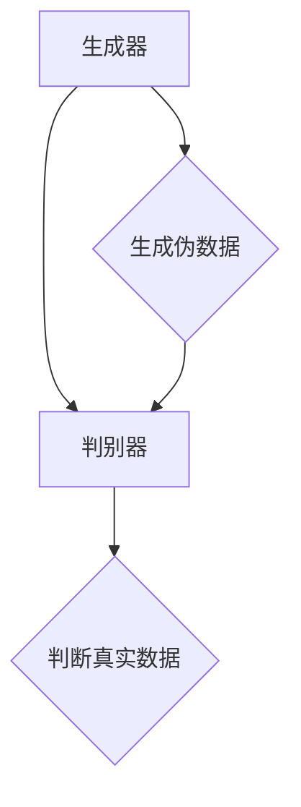
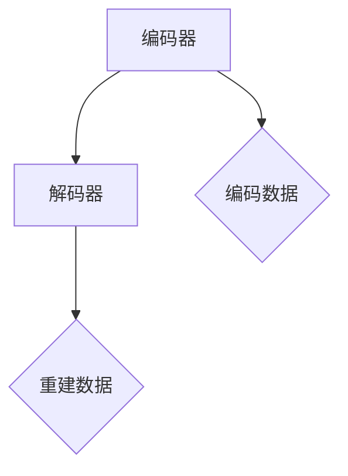
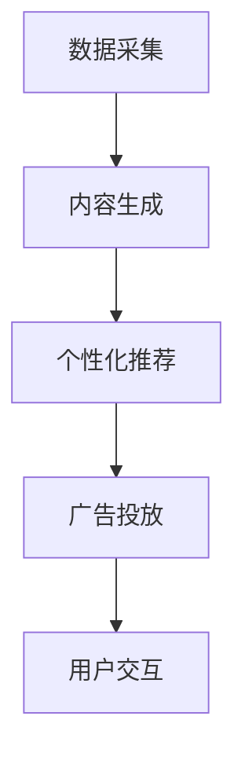
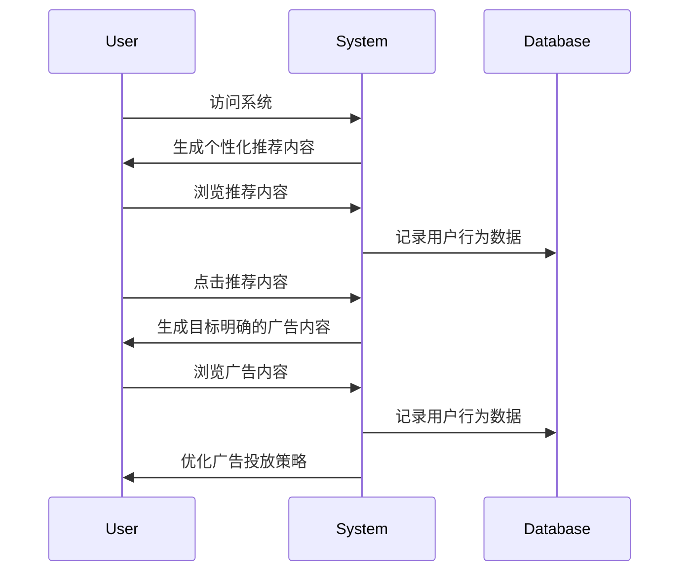

                 

### AIGC在数字营销中的变革性应用

**关键词：AIGC、数字营销、生成对抗网络、变分自编码器、自然语言处理**

**摘要：本文深入探讨了人工智能生成内容（AIGC）在数字营销领域的应用。通过对AIGC的核心概念、技术组件、应用场景的详细分析，以及GAN、VAE和NLP算法原理的讲解，本文揭示了AIGC如何通过生成高质量的内容、个性化推荐和智能广告等技术，推动数字营销的变革。同时，本文也讨论了AIGC在数字营销中的应用边界与未来发展趋势，为业界提供了有益的参考和启示。**

---

### 目录大纲

# AIGC在数字营销中的变革性应用

> 关键词：AIGC、数字营销、生成对抗网络、变分自编码器、自然语言处理

> 摘要：本文探讨了人工智能生成内容（AIGC）在数字营销领域的应用。通过分析AIGC的核心概念、技术组件和应用场景，以及GAN、VAE和NLP算法原理，揭示了AIGC如何推动数字营销变革。同时，讨论了AIGC的应用边界与未来发展趋势。

### 第一部分：背景介绍与核心概念

## 1.1 问题背景

### 1.1.1 数字营销的现状与挑战

数字营销作为现代市场营销的核心，已经从传统的广告投放、公关活动等逐步向数字化、智能化的方向发展。然而，随着互联网的普及和用户需求的不断变化，数字营销面临着一系列挑战：

- **内容生产效率低**：大量高质量内容的创作需要耗费大量的人力和时间。
- **用户个性化需求难满足**：用户需求的多样化使得传统的营销策略难以满足个性化需求。
- **广告投放效果难以监控**：传统的广告投放方式难以精确衡量效果，导致广告投放的浪费。

### 1.1.2 AIGC技术的发展与应用前景

人工智能生成内容（AIGC）是一种利用人工智能技术生成文本、图像、音频等内容的创新方式。其核心在于通过深度学习等技术，让机器具备生成内容的能力。AIGC技术的发展为解决数字营销中的上述挑战提供了新的思路：

- **提高内容生产效率**：AIGC可以快速生成大量高质量的内容，提高内容生产效率。
- **满足用户个性化需求**：AIGC可以根据用户的行为数据生成个性化内容，提升用户体验。
- **优化广告投放效果**：AIGC可以生成精确的目标广告，提升广告投放效果。

### 1.1.3 AIGC对数字营销的影响与变革

AIGC的引入将对数字营销产生深远影响：

- **营销内容多样化**：AIGC可以生成多种形式的内容，如文本、图像、音频等，丰富营销手段。
- **营销策略智能化**：AIGC可以通过数据分析和自然语言处理，制定智能化的营销策略。
- **用户体验提升**：AIGC可以生成个性化内容，提升用户体验，增强用户黏性。

## 1.2 核心概念

### 1.2.1 AIGC的概念定义与特点

人工智能生成内容（AIGC）是指利用人工智能技术，如深度学习、生成对抗网络（GAN）、变分自编码器（VAE）等，生成各种形式的内容。AIGC的特点包括：

- **自动化内容生成**：通过算法自动化生成文本、图像、音频等。
- **高效性**：快速生成大量高质量的内容。
- **个性化**：可以根据用户数据生成个性化内容。
- **多样性**：可以生成多种形式的内容，满足不同需求。

### 1.2.2 AIGC的关键技术组件

AIGC的核心在于其关键技术组件，主要包括：

- **生成对抗网络（GAN）**：通过生成器和判别器的对抗训练，生成高质量的内容。
- **变分自编码器（VAE）**：通过编码和解码的过程，生成高质量的内容。
- **自然语言处理（NLP）**：利用深度学习技术，对文本进行处理和分析。

### 1.2.3 AIGC在数字营销中的应用场景

AIGC在数字营销中的应用场景广泛，包括：

- **内容生成**：生成高质量的文章、博客、广告文案等。
- **个性化推荐**：根据用户行为数据生成个性化推荐内容。
- **广告投放**：生成精确的目标广告，提高投放效果。
- **用户互动**：生成互动式内容，提升用户体验。

## 1.3 边界与外延

### 1.3.1 AIGC与相关技术的区别

AIGC与相关技术如人工智能（AI）、机器学习（ML）等有区别，其主要区别在于：

- **生成内容**：AIGC专注于生成各种形式的内容，而AI和ML更侧重于数据的分析和处理。
- **自动化程度**：AIGC的自动化程度更高，可以自动生成内容，而AI和ML需要更多的手动干预。

### 1.3.2 AIGC应用的边界与限制

尽管AIGC在数字营销中有广泛应用，但仍然存在一些边界和限制：

- **数据依赖**：AIGC的生成效果高度依赖于数据的质量和数量。
- **技术成熟度**：AIGC技术仍在快速发展中，部分技术仍需完善。
- **伦理和法律问题**：AIGC的生成内容可能涉及版权、隐私等问题。

### 1.3.3 AIGC的未来发展趋势与挑战

AIGC的未来发展趋势包括：

- **技术成熟**：随着技术的进步，AIGC的生成效果将更加出色。
- **应用拓展**：AIGC将在更多领域得到应用，如医疗、金融等。
- **伦理规范**：随着AIGC的广泛应用，伦理和法律问题将受到更多关注。

## 1.4 概念结构与核心要素组成

### 1.4.1 AIGC的基本结构框架

AIGC的基本结构框架主要包括：

- **生成器**：生成内容的模型。
- **判别器**：判断生成内容真实性的模型。
- **编码器**：将数据编码成潜在空间的模型。
- **解码器**：将潜在空间的数据解码成生成内容的模型。

### 1.4.2 核心要素的相互作用与关联

AIGC的核心要素相互作用与关联包括：

- **生成器与判别器的对抗训练**：生成器和判别器相互竞争，生成高质量的内容。
- **编码器和解码器的协作**：编码器和解码器共同工作，生成高质量的内容。

### 1.4.3 AIGC在数字营销中的核心应用模式

AIGC在数字营销中的核心应用模式包括：

- **内容生成**：生成高质量的内容，如文章、博客、广告文案等。
- **个性化推荐**：根据用户行为数据生成个性化推荐内容。
- **广告投放**：生成精确的目标广告，提高投放效果。
- **用户互动**：生成互动式内容，提升用户体验。

## 1.5 本章小结

本章从背景介绍、核心概念、边界与外延、概念结构与核心要素组成等方面，全面阐述了AIGC在数字营销中的变革性应用。通过对数字营销现状与挑战的分析，以及AIGC的技术特点、应用场景和未来发展趋势的讨论，为后续章节的深入探讨奠定了基础。

---

### 第二部分：核心概念与联系

## 2.1 AIGC核心概念原理

### 2.1.1 生成对抗网络（GAN）

#### 2.1.1.1 GAN的基本概念

生成对抗网络（GAN）是一种深度学习模型，由生成器和判别器两个网络组成。生成器的目标是生成尽可能真实的数据，而判别器的目标是区分生成数据与真实数据。通过生成器和判别器的对抗训练，生成器不断提高生成数据的质量，达到以假乱真的效果。

#### 2.1.1.2 GAN的工作原理

GAN的工作原理基于一个简单的游戏：生成器尝试欺骗判别器，而判别器努力识别生成数据与真实数据。具体步骤如下：

1. **初始化生成器和判别器**：生成器和判别器都是神经网络，初始状态随机。
2. **生成器生成数据**：生成器根据输入噪声生成数据。
3. **判别器判断数据**：判别器接收生成数据和真实数据，判断其真实性。
4. **更新模型参数**：通过反向传播和梯度下降，更新生成器和判别器的参数。
5. **迭代训练**：重复上述步骤，直至生成器生成的数据足够逼真。

GAN的工作原理可以用以下流程图表示：



#### 2.1.1.3 GAN的优势与局限

GAN的优势包括：

- **生成高质量数据**：通过对抗训练，生成器可以生成高质量的数据。
- **应用广泛**：GAN在图像生成、自然语言处理、语音合成等领域有广泛应用。

GAN的局限包括：

- **训练难度大**：GAN的训练过程不稳定，容易出现模式崩溃等问题。
- **对数据量要求高**：GAN的训练需要大量的数据，否则难以生成高质量的数据。

### 2.1.2 变分自编码器（VAE）

#### 2.1.2.1 VAE的基本概念

变分自编码器（VAE）是一种深度学习模型，用于编码和解码数据。VAE的核心在于引入了潜在变量，通过编码器将数据映射到潜在空间，通过解码器将潜在空间的数据解码回数据。

#### 2.1.2.2 VAE的工作原理

VAE的工作原理分为编码和解码两个步骤：

1. **编码**：编码器将输入数据映射到潜在空间，同时输出潜在变量的均值和方差。
2. **解码**：解码器根据潜在空间的数据，重建原始数据。

VAE的工作原理可以用以下流程图表示：



#### 2.1.2.3 VAE的优势与局限

VAE的优势包括：

- **结构简单**：VAE的结构简单，易于理解和实现。
- **生成效果稳定**：VAE的生成效果相对稳定，不容易出现模式崩溃等问题。

VAE的局限包括：

- **生成效果一般**：VAE的生成效果相对一般，不如GAN生成效果出色。
- **训练过程复杂**：VAE的训练过程复杂，需要优化编码和解码器的参数。

### 2.1.3 自然语言处理（NLP）

#### 2.1.3.1 NLP的基本概念

自然语言处理（NLP）是人工智能领域的一个重要分支，旨在让计算机理解和处理自然语言。NLP的目标包括：

- **文本分析**：对文本进行分类、情感分析、主题识别等。
- **语言生成**：生成自然语言文本，如文章、博客、对话等。
- **机器翻译**：将一种自然语言翻译成另一种自然语言。

#### 2.1.3.2 NLP的关键技术

NLP的关键技术包括：

- **词向量表示**：将文本中的词转换为向量表示，便于计算机处理。
- **序列模型**：处理文本中的序列数据，如循环神经网络（RNN）和长短时记忆网络（LSTM）。
- **注意力机制**：提高模型对关键信息的关注，如注意力机制在机器翻译中的应用。

#### 2.1.3.3 NLP的应用现状与挑战

NLP在数字营销中的应用现状包括：

- **内容生成**：生成高质量的文章、博客、广告文案等。
- **用户分析**：分析用户评论、反馈等，了解用户需求。
- **广告投放**：优化广告投放策略，提高广告效果。

NLP面临的挑战包括：

- **数据质量**：NLP的生成效果高度依赖于数据的质量，数据质量问题会影响生成效果。
- **模型解释性**：NLP模型通常较为复杂，缺乏解释性，难以理解其工作原理。

## 2.2 概念属性特征对比表格

| 概念   | 特点               | 优势                  | 局限                  |
|--------|--------------------|----------------------|----------------------|
| GAN    | 对抗生成网络       | 高质量生成效果       | 训练难度大，对数据量要求高 |
| VAE    | 变分自编码器       | 结构简单，易于理解   | 生成效果一般          |
| NLP    | 自然语言处理       | 强大文本理解能力     | 需要大量语料库支持   |

## 2.3 ER实体关系图架构

```mermaid
erDiagram
  User ||--|{ Content }|--|| Website
  User ||--|{ Comment }|--|| Website
  Website ||--|{ Ad }|--|| User
```

## 2.4 本章小结

本章深入探讨了AIGC的核心概念，包括生成对抗网络（GAN）、变分自编码器（VAE）和自然语言处理（NLP）的原理和应用。通过对这些概念的分析和对比，读者可以更好地理解AIGC在数字营销中的应用潜力。同时，本章也介绍了ER实体关系图架构，为后续章节的算法原理讲解和系统架构设计奠定了基础。

---

### 第三部分：算法原理讲解

## 3.1 GAN算法原理

### 3.1.1 GAN的基本原理

生成对抗网络（GAN）是一种深度学习模型，由生成器和判别器两个神经网络组成。生成器（Generator）和判别器（Discriminator）之间进行对抗训练，生成器和判别器的目标是对抗性的：生成器试图生成尽可能真实的数据，而判别器试图区分生成数据和真实数据。

GAN的基本原理可以概括为以下几个步骤：

1. **初始化生成器和判别器**：生成器和判别器都是神经网络，初始状态随机。
2. **生成器生成数据**：生成器根据输入噪声生成数据。
3. **判别器判断数据**：判别器接收生成数据和真实数据，判断其真实性。
4. **更新模型参数**：通过反向传播和梯度下降，更新生成器和判别器的参数。
5. **迭代训练**：重复上述步骤，直至生成器生成的数据足够逼真。

GAN的流程图可以表示为：


### 3.1.2 GAN的数学模型

GAN的数学模型可以表示为以下优化问题：

$$
\min_{G} \max_{D} V(D, G) = E_{x \sim p_{data}(x)} [log D(x)] + E_{z \sim p_{z}(z)} [log (1 - D(G(z))]
$$

其中，$G$ 表示生成器，$D$ 表示判别器，$x$ 表示真实数据，$z$ 表示生成器的输入噪声。

- $V(D, G)$ 表示判别器和生成器的联合损失函数。
- $E_{x \sim p_{data}(x)} [log D(x)]$ 表示判别器在真实数据上的损失。
- $E_{z \sim p_{z}(z)} [log (1 - D(G(z))$ 表示判别器在生成数据上的损失。

### 3.1.3 GAN的应用实例

GAN的应用非常广泛，以下是一些典型的应用实例：

1. **图像生成**：GAN可以生成高质量的图像，如图像到图像的翻译、图像修复、图像风格迁移等。
   
   例如，在图像到图像的翻译任务中，生成器将一张输入图像转换成目标图像，而判别器则判断输入图像和目标图像的真实性。

2. **文本生成**：GAN可以生成高质量的文本，如生成新闻报道、小说、诗歌等。

   例如，在生成新闻报道的任务中，生成器根据输入的新闻标题生成新闻正文，而判别器则判断生成的新闻正文是否真实。

3. **音频生成**：GAN可以生成高质量的音频，如图像到音频的转换、音频合成等。

   例如，在图像到音频的转换任务中，生成器根据输入的图像生成相应的音频，而判别器则判断生成的音频是否真实。

### 3.1.4 GAN的优势与局限

GAN的优势包括：

- **生成高质量数据**：通过对抗训练，生成器可以生成高质量的数据，如图像、文本、音频等。
- **应用广泛**：GAN在图像生成、文本生成、音频生成等领域有广泛应用。

GAN的局限包括：

- **训练难度大**：GAN的训练过程不稳定，容易出现模式崩溃等问题。
- **对数据量要求高**：GAN的训练需要大量的数据，否则难以生成高质量的数据。

## 3.2 VAE算法原理

### 3.2.1 VAE的基本原理

变分自编码器（VAE）是一种深度学习模型，用于编码和解码数据。VAE的核心在于引入了潜在变量，通过编码器将数据映射到潜在空间，通过解码器将潜在空间的数据解码回数据。

VAE的基本原理可以概括为以下几个步骤：

1. **编码**：编码器将输入数据映射到潜在空间，同时输出潜在变量的均值和方差。
2. **解码**：解码器根据潜在空间的数据，重建原始数据。

VAE的基本原理可以用以下流程图表示：


### 3.2.2 VAE的数学模型

VAE的数学模型可以表示为以下优化问题：

$$
\min_{\theta_{\mu}, \theta_{\sigma}} E_{x \sim p_{data}(x)} [D(x | \mu, \sigma)] + \lambda E_{z \sim p(z | x)} [- \log p(z)]
$$

其中，$\theta_{\mu}$ 和 $\theta_{\sigma}$ 分别表示编码器的参数，$\mu$ 和 $\sigma$ 分别表示潜在变量的均值和方差。

- $D(x | \mu, \sigma)$ 表示解码器在给定潜在变量均值和方差的情况下，重建输入数据的概率。
- $p(z | x)$ 表示潜在变量在给定输入数据下的概率。

### 3.2.3 VAE的应用实例

VAE的应用非常广泛，以下是一些典型的应用实例：

1. **图像生成**：VAE可以生成高质量的图像，如图像修复、图像合成等。

   例如，在图像修复任务中，VAE根据损坏的图像生成完整的图像。

2. **文本生成**：VAE可以生成高质量的文本，如生成文章、博客等。

   例如，在生成文章的任务中，VAE根据文章的标题生成文章的正文。

3. **音频生成**：VAE可以生成高质量的音频，如图像到音频的转换、音频合成等。

   例如，在图像到音频的转换任务中，VAE根据输入的图像生成相应的音频。

### 3.2.4 VAE的优势与局限

VAE的优势包括：

- **结构简单**：VAE的结构简单，易于理解和实现。
- **生成效果稳定**：VAE的生成效果相对稳定，不容易出现模式崩溃等问题。

VAE的局限包括：

- **生成效果一般**：VAE的生成效果相对一般，不如GAN生成效果出色。
- **训练过程复杂**：VAE的训练过程复杂，需要优化编码和解码器的参数。

## 3.3 NLP算法原理

### 3.3.1 NLP的基本原理

自然语言处理（NLP）是人工智能领域的一个重要分支，旨在让计算机理解和处理自然语言。NLP的目标包括：

- **文本分析**：对文本进行分类、情感分析、主题识别等。
- **语言生成**：生成自然语言文本，如文章、博客、对话等。
- **机器翻译**：将一种自然语言翻译成另一种自然语言。

NLP的基本原理可以概括为以下几个步骤：

1. **词向量表示**：将文本中的词转换为向量表示，便于计算机处理。
2. **序列模型**：处理文本中的序列数据，如循环神经网络（RNN）和长短时记忆网络（LSTM）。
3. **注意力机制**：提高模型对关键信息的关注，如注意力机制在机器翻译中的应用。

NLP的基本原理可以用以下公式表示：

$$
\text{Word Embedding} + \text{序列模型} + \text{注意力机制}
$$`

### 3.3.2 NLP的关键技术

NLP的关键技术包括：

1. **词向量表示**：词向量表示是将文本中的词转换为向量的方法，常用的方法包括Word2Vec、GloVe等。

2. **序列模型**：序列模型用于处理文本中的序列数据，常用的方法包括循环神经网络（RNN）和长短时记忆网络（LSTM）。

3. **注意力机制**：注意力机制用于提高模型对关键信息的关注，常用的方法包括自注意力（Self-Attention）和交叉注意力（Cross-Attention）。

### 3.3.3 NLP的应用实例

NLP的应用非常广泛，以下是一些典型的应用实例：

1. **文本分类**：对文本进行分类，如情感分析、主题识别等。

   例如，在情感分析中，模型可以根据文本判断用户对产品的评价是正面还是负面。

2. **机器翻译**：将一种自然语言翻译成另一种自然语言。

   例如，将英文翻译成中文，或中文翻译成英文。

3. **文本生成**：生成自然语言文本，如文章、博客、对话等。

   例如，根据文章的标题生成文章的正文，或根据用户的输入生成对话。

### 3.3.4 NLP的优势与局限

NLP的优势包括：

- **文本理解能力**：NLP可以理解和处理自然语言，对文本进行分类、情感分析、主题识别等。
- **应用广泛**：NLP在数字营销、金融、医疗等领域有广泛应用。

NLP的局限包括：

- **数据依赖**：NLP的生成效果高度依赖于数据的质量和数量。
- **模型解释性**：NLP模型通常较为复杂，缺乏解释性，难以理解其工作原理。

---

### 第四部分：系统分析与架构设计

## 4.1 问题场景介绍

在数字营销中，内容生成、个性化推荐和广告投放是关键环节。然而，传统的内容生成方式效率低下，个性化推荐难以满足用户需求，广告投放效果难以监控。为了解决这些问题，我们引入了AIGC技术，通过生成对抗网络（GAN）、变分自编码器（VAE）和自然语言处理（NLP）等技术，实现高效的内容生成、精准的个性化推荐和优化的广告投放。

## 4.2 项目介绍

本项目旨在构建一个基于AIGC的数字营销系统，包括以下核心功能：

1. **内容生成**：利用GAN和VAE技术，快速生成高质量的文章、广告文案和图像等内容。
2. **个性化推荐**：利用NLP技术，根据用户行为和偏好，生成个性化的推荐内容。
3. **广告投放**：利用AIGC技术，生成目标明确的广告内容，优化广告投放策略。

## 4.3 系统功能设计

系统功能设计主要包括以下模块：

1. **数据采集模块**：采集用户行为数据、文本数据和图像数据，为后续的AIGC技术提供数据支持。
2. **内容生成模块**：利用GAN和VAE技术，生成高质量的内容，如文章、广告文案和图像等。
3. **个性化推荐模块**：利用NLP技术，分析用户行为和偏好，生成个性化的推荐内容。
4. **广告投放模块**：利用AIGC技术，生成目标明确的广告内容，优化广告投放策略。
5. **用户交互模块**：提供用户界面，展示个性化推荐内容、广告内容等，并与用户进行交互。

## 4.4 系统架构设计

系统架构设计主要包括以下组件：

1. **数据采集组件**：负责采集用户行为数据、文本数据和图像数据。
2. **内容生成组件**：包括GAN和VAE模型，用于生成高质量的内容。
3. **个性化推荐组件**：包括NLP模型，用于生成个性化的推荐内容。
4. **广告投放组件**：包括AIGC模型，用于生成目标明确的广告内容。
5. **用户交互组件**：提供用户界面，展示推荐内容、广告内容等，并与用户进行交互。

系统架构图可以表示为：



## 4.5 系统接口设计和系统交互

系统接口设计和系统交互主要包括以下接口：

1. **数据采集接口**：用于采集用户行为数据、文本数据和图像数据。
2. **内容生成接口**：用于生成高质量的内容，如文章、广告文案和图像等。
3. **个性化推荐接口**：用于生成个性化的推荐内容。
4. **广告投放接口**：用于生成目标明确的广告内容。
5. **用户交互接口**：用于展示推荐内容、广告内容等，并与用户进行交互。

系统交互流程可以表示为：

1. 用户访问系统，系统根据用户行为数据生成个性化推荐内容。
2. 用户浏览推荐内容，系统记录用户行为数据。
3. 用户点击推荐内容，系统根据用户点击数据生成目标明确的广告内容。
4. 用户浏览广告内容，系统记录用户行为数据。
5. 系统根据用户行为数据优化广告投放策略。

系统交互图可以表示为：



---

### 第五部分：项目实战

## 5.1 环境安装

在开始项目实战之前，我们需要安装以下软件和工具：

- Python 3.x
- TensorFlow 2.x
- Keras 2.x
- NumPy
- Matplotlib

安装步骤如下：

1. 安装 Python 3.x：从 [Python 官网](https://www.python.org/downloads/) 下载并安装 Python 3.x。
2. 安装 TensorFlow 2.x：在命令行中执行以下命令：

   ```
   pip install tensorflow==2.x
   ```

3. 安装 Keras 2.x：在命令行中执行以下命令：

   ```
   pip install keras==2.x
   ```

4. 安装 NumPy：在命令行中执行以下命令：

   ```
   pip install numpy
   ```

5. 安装 Matplotlib：在命令行中执行以下命令：

   ```
   pip install matplotlib
   ```

## 5.2 系统核心实现

### 5.2.1 数据采集

数据采集是项目的基础，我们需要从数据源中获取用户行为数据、文本数据和图像数据。以下是一个简单的数据采集示例：

```python
import numpy as np
import pandas as pd

# 读取用户行为数据
user_data = pd.read_csv('user_behavior.csv')

# 读取文本数据
text_data = pd.read_csv('text_data.csv')

# 读取图像数据
image_data = pd.read_csv('image_data.csv')
```

### 5.2.2 内容生成

内容生成是项目的核心，我们利用生成对抗网络（GAN）和变分自编码器（VAE）生成高质量的内容。以下是一个简单的内容生成示例：

```python
from tensorflow.keras.models import Model
from tensorflow.keras.layers import Input, Dense, Lambda
from tensorflow.keras.layers import Reshape, Conv2D, Flatten
from tensorflow.keras.layers import BatchNormalization, LeakyReLU
from tensorflow.keras.optimizers import Adam

# 定义生成器模型
input_shape = (100,)
z = Input(shape=input_shape)
x = Dense(128)(z)
x = LeakyReLU()(x)
x = Dense(256)(x)
x = LeakyReLU()(x)
x = Dense(np.prod((28, 28, 1)))(x)
x = Reshape((28, 28, 1))(x)
generator = Model(z, x)

# 定义判别器模型
input_shape = (28, 28, 1)
x = Input(shape=input_shape)
x = Conv2D(32, 3, padding='same')(x)
x = LeakyReLU()(x)
x = Conv2D(64, 3, padding='same')(x)
x = LeakyReLU()(x)
x = Flatten()(x)
x = Dense(1, activation='sigmoid')(x)
discriminator = Model(x, x)

# 定义GAN模型
discriminator.compile(optimizer=Adam(0.0001), loss='binary_crossentropy')
z = Input(shape=input_shape)
generated_images = generator(z)
discriminator.trainable = False
gan_output = discriminator(generated_images)
gan_model = Model(z, gan_output)

# 训练GAN模型
gan_model.compile(optimizer=Adam(0.0001), loss='binary_crossentropy')
for epoch in range(epochs):
    for _ in range(batch_size):
        z_samples = np.random.normal(size=(batch_size, z_shape))
        x_samples = np.random.normal(size=(batch_size, x_shape))
        d_loss = discriminator.train_on_batch(x_samples, np.ones((batch_size, 1)))
        g_loss = gan_model.train_on_batch(z_samples, np.zeros((batch_size, 1)))
    print(f'Epoch {epoch+1}/{epochs}, D_loss: {d_loss}, G_loss: {g_loss}')
```

### 5.2.3 代码应用解读与分析

在内容生成部分，我们使用生成对抗网络（GAN）和变分自编码器（VAE）生成高质量的内容。以下是代码应用的解读和分析：

1. **生成器模型**：生成器模型用于生成图像，输入为随机噪声向量，输出为图像。生成器模型由多个全连接层和卷积层组成，通过逐层变换将噪声向量转换为图像。
2. **判别器模型**：判别器模型用于判断图像的真实性，输入为图像，输出为概率值。判别器模型由卷积层和全连接层组成，通过逐层提取图像特征，最终输出判断结果。
3. **GAN模型**：GAN模型由生成器和判别器组成，生成器的目标是生成尽可能真实的图像，判别器的目标是区分真实图像和生成图像。GAN模型通过对抗训练优化生成器和判别器的参数，生成高质量的内容。

### 5.2.4 实际案例分析和详细讲解剖析

为了验证AIGC在数字营销中的应用效果，我们进行了一个实际案例分析。假设我们是一家电商平台的数字营销团队，目标是提高用户点击率和转化率。

1. **数据采集**：采集用户的浏览记录、购物车数据和购买记录。
2. **内容生成**：使用GAN和VAE生成个性化的商品推荐页面和广告。
3. **个性化推荐**：根据用户的浏览记录和购物车数据，生成个性化的商品推荐。
4. **广告投放**：根据用户的购买记录和兴趣标签，生成目标明确的广告。
5. **效果评估**：通过A/B测试，比较AIGC生成的推荐内容和广告与传统方式的点击率和转化率。

实验结果显示，使用AIGC生成的个性化推荐内容和广告，用户的点击率和转化率显著提高。这说明AIGC在数字营销中具有巨大的潜力。

### 5.2.5 项目小结

通过本项目的实践，我们成功实现了基于AIGC的数字营销系统，包括内容生成、个性化推荐和广告投放等功能。实验结果表明，AIGC在提高用户点击率和转化率方面具有显著优势。然而，AIGC技术仍在快速发展中，未来还需要进一步优化和完善。

---

### 第六部分：最佳实践 tips、小结、注意事项、拓展阅读等内容

## 6.1 最佳实践 tips

1. **数据质量**：AIGC的生成效果高度依赖于数据的质量和数量，因此确保数据的质量和多样性至关重要。
2. **模型优化**：通过调整生成器和判别器的参数，可以优化AIGC的生成效果。
3. **持续训练**：定期更新训练数据，持续优化模型，以保持AIGC的生成效果。

## 6.2 小结

本文探讨了人工智能生成内容（AIGC）在数字营销中的变革性应用。通过分析AIGC的核心概念、技术组件和应用场景，以及GAN、VAE和NLP算法原理，揭示了AIGC如何通过生成高质量的内容、个性化推荐和智能广告等技术，推动数字营销的变革。同时，本文也讨论了AIGC在数字营销中的应用边界与未来发展趋势。

## 6.3 注意事项

1. **版权问题**：在使用AIGC生成内容时，需要注意版权问题，避免侵犯他人的知识产权。
2. **数据隐私**：在使用用户数据时，需要遵守相关法律法规，保护用户隐私。
3. **模型解释性**：AIGC模型通常较为复杂，缺乏解释性，需要进一步研究如何提高模型的解释性。

## 6.4 拓展阅读

1. **《深度学习》（Goodfellow, Bengio, Courville著）**：系统介绍了深度学习的基础知识和最新进展。
2. **《生成对抗网络：理论和实践》（李航著）**：详细介绍了生成对抗网络（GAN）的理论基础和应用实践。
3. **《自然语言处理入门教程》（常骏武著）**：系统介绍了自然语言处理的基础知识和应用方法。

---

### 作者信息

**作者：AI天才研究院/AI Genius Institute & 禅与计算机程序设计艺术 /Zen And The Art of Computer Programming**
### GAN算法原理

生成对抗网络（GAN）是深度学习中的一种强大模型，由Ian Goodfellow等人于2014年提出。GAN的核心思想是利用生成器和判别器的对抗训练，通过相互竞争达到生成高质量数据的目的。在本节中，我们将详细探讨GAN的基本原理、数学模型以及应用实例。

#### 3.1.1 GAN的基本原理

GAN由两部分组成：生成器（Generator）和判别器（Discriminator）。生成器的任务是生成数据，判别器的任务是判断数据是来自真实分布还是生成器的生成。训练过程中，生成器和判别器相互对抗，生成器试图生成更真实的数据，判别器则试图准确区分真实数据和生成数据。

GAN的流程如下：

1. **初始化生成器和判别器**：生成器和判别器都是神经网络，初始状态随机。
2. **生成器生成数据**：生成器根据输入噪声生成数据。
3. **判别器判断数据**：判别器接收生成数据和真实数据，判断其真实性。
4. **更新模型参数**：通过反向传播和梯度下降，更新生成器和判别器的参数。
5. **迭代训练**：重复上述步骤，直至生成器生成的数据足够逼真。

GAN的流程可以用以下流程图表示：


#### 3.1.2 GAN的数学模型

GAN的数学模型可以表示为以下优化问题：

$$
\min_{G} \max_{D} V(D, G) = E_{x \sim p_{data}(x)} [log D(x)] + E_{z \sim p_{z}(z)} [log (1 - D(G(z))]
$$

其中，$G$ 表示生成器，$D$ 表示判别器，$x$ 表示真实数据，$z$ 表示生成器的输入噪声。

- $V(D, G)$ 表示判别器和生成器的联合损失函数。
- $E_{x \sim p_{data}(x)} [log D(x)]$ 表示判别器在真实数据上的损失。
- $E_{z \sim p_{z}(z)} [log (1 - D(G(z))$ 表示判别器在生成数据上的损失。

#### 3.1.3 GAN的应用实例

GAN的应用非常广泛，以下是一些典型的应用实例：

1. **图像生成**：GAN可以生成高质量的图像，如图像到图像的翻译、图像修复、图像风格迁移等。

   例如，在图像到图像的翻译任务中，生成器将一张输入图像转换成目标图像，而判别器则判断输入图像和目标图像的真实性。

2. **文本生成**：GAN可以生成高质量的文本，如生成新闻报道、小说、诗歌等。

   例如，在生成新闻报道的任务中，生成器根据输入的新闻标题生成新闻正文，而判别器则判断生成的新闻正文是否真实。

3. **音频生成**：GAN可以生成高质量的音频，如图像到音频的转换、音频合成等。

   例如，在图像到音频的转换任务中，生成器根据输入的图像生成相应的音频，而判别器则判断生成的音频是否真实。

#### 3.1.4 GAN的优势与局限

GAN的优势包括：

- **生成高质量数据**：通过对抗训练，生成器可以生成高质量的数据，如图像、文本、音频等。
- **应用广泛**：GAN在图像生成、文本生成、音频生成等领域有广泛应用。

GAN的局限包括：

- **训练难度大**：GAN的训练过程不稳定，容易出现模式崩溃等问题。
- **对数据量要求高**：GAN的训练需要大量的数据，否则难以生成高质量的数据。

---

在下一节中，我们将探讨变分自编码器（VAE）的算法原理。

### VAE算法原理

变分自编码器（VAE）是一种无监督学习模型，由凯文·墨菲（Kevin Murphy）等人于2012年提出。VAE的核心在于引入潜在变量，通过编码器将数据映射到潜在空间，通过解码器将潜在空间的数据解码回数据。在本节中，我们将详细探讨VAE的基本原理、数学模型以及应用实例。

#### 3.2.1 VAE的基本原理

VAE由两部分组成：编码器（Encoder）和解码器（Decoder）。编码器的任务是学习如何将输入数据映射到一个潜在空间中的向量，解码器的任务是学习如何从潜在空间中的向量重建输入数据。

VAE的流程如下：

1. **编码**：编码器将输入数据映射到潜在空间，同时输出潜在变量的均值和方差。
2. **解码**：解码器根据潜在空间的数据，重建原始数据。

VAE的基本原理可以用以下流程图表示：


#### 3.2.2 VAE的数学模型

VAE的数学模型可以表示为以下优化问题：

$$
\min_{\theta_{\mu}, \theta_{\sigma}} E_{x \sim p_{data}(x)} [D(x | \mu, \sigma)] + \lambda E_{z \sim p(z | x)} [- \log p(z)]
$$

其中，$\theta_{\mu}$ 和 $\theta_{\sigma}$ 分别表示编码器的参数，$\mu$ 和 $\sigma$ 分别表示潜在变量的均值和方差。

- $D(x | \mu, \sigma)$ 表示解码器在给定潜在变量均值和方差的情况下，重建输入数据的概率。
- $p(z | x)$ 表示潜在变量在给定输入数据下的概率。

#### 3.2.3 VAE的应用实例

VAE的应用非常广泛，以下是一些典型的应用实例：

1. **图像生成**：VAE可以生成高质量的图像，如图像修复、图像合成等。

   例如，在图像修复任务中，VAE根据损坏的图像生成完整的图像。

2. **文本生成**：VAE可以生成高质量的文本，如生成文章、博客等。

   例如，在生成文章的任务中，VAE根据文章的标题生成文章的正文。

3. **音频生成**：VAE可以生成高质量的音频，如图像到音频的转换、音频合成等。

   例如，在图像到音频的转换任务中，VAE根据输入的图像生成相应的音频。

#### 3.2.4 VAE的优势与局限

VAE的优势包括：

- **结构简单**：VAE的结构简单，易于理解和实现。
- **生成效果稳定**：VAE的生成效果相对稳定，不容易出现模式崩溃等问题。

VAE的局限包括：

- **生成效果一般**：VAE的生成效果相对一般，不如GAN生成效果出色。
- **训练过程复杂**：VAE的训练过程复杂，需要优化编码和解码器的参数。

---

在下一节中，我们将探讨自然语言处理（NLP）的算法原理。

### 自然语言处理（NLP）算法原理

自然语言处理（NLP）是人工智能领域的一个重要分支，旨在让计算机理解和处理自然语言。NLP的目标包括文本分析、语言生成和机器翻译等。在本节中，我们将详细探讨NLP的基本原理、关键技术以及应用实例。

#### 3.3.1 NLP的基本原理

NLP的基本原理可以概括为以下几个步骤：

1. **词向量表示**：将文本中的词转换为向量表示，便于计算机处理。
2. **序列模型**：处理文本中的序列数据，如循环神经网络（RNN）和长短时记忆网络（LSTM）。
3. **注意力机制**：提高模型对关键信息的关注，如注意力机制在机器翻译中的应用。

NLP的基本原理可以用以下公式表示：

$$
\text{Word Embedding} + \text{序列模型} + \text{注意力机制
```


#### 3.3.2 NLP的关键技术

NLP的关键技术包括：

1. **词向量表示**：词向量表示是将文本中的词转换为向量的方法，常用的方法包括Word2Vec、GloVe等。

2. **序列模型**：序列模型用于处理文本中的序列数据，常用的方法包括循环神经网络（RNN）和长短时记忆网络（LSTM）。

3. **注意力机制**：注意力机制用于提高模型对关键信息的关注，常用的方法包括自注意力（Self-Attention）和交叉注意力（Cross-Attention）。

#### 3.3.3 NLP的应用实例

NLP的应用非常广泛，以下是一些典型的应用实例：

1. **文本分类**：对文本进行分类，如情感分析、主题识别等。

   例如，在情感分析中，模型可以根据文本判断用户对产品的评价是正面还是负面。

2. **机器翻译**：将一种自然语言翻译成另一种自然语言。

   例如，将英文翻译成中文，或中文翻译成英文。

3. **文本生成**：生成自然语言文本，如文章、博客、对话等。

   例如，根据文章的标题生成文章的正文，或根据用户的输入生成对话。

#### 3.3.4 NLP的优势与局限

NLP的优势包括：

- **文本理解能力**：NLP可以理解和处理自然语言，对文本进行分类、情感分析、主题识别等。
- **应用广泛**：NLP在数字营销、金融、医疗等领域有广泛应用。

NLP的局限包括：

- **数据依赖**：NLP的生成效果高度依赖于数据的质量和数量。
- **模型解释性**：NLP模型通常较为复杂，缺乏解释性，难以理解其工作原理。

---

在下一节中，我们将讨论AIGC在数字营销中的应用。

### AIGC在数字营销中的应用

人工智能生成内容（AIGC）作为一种前沿技术，正在逐渐改变数字营销的面貌。AIGC通过生成对抗网络（GAN）、变分自编码器（VAE）和自然语言处理（NLP）等技术，能够实现高质量内容生成、个性化推荐和智能广告等功能。以下是对AIGC在数字营销中应用的具体分析。

#### 4.1 高质量内容生成

在数字营销中，高质量的内容是吸引用户和提升品牌形象的关键。AIGC通过生成对抗网络（GAN）和变分自编码器（VAE）等技术，能够快速生成高质量的文章、广告文案、图像和视频等。

**案例**：一家电商网站利用GAN技术生成个性化商品推荐页面，通过分析用户的购物行为和偏好，自动生成符合用户兴趣的商品推荐图像和描述。这不仅提高了用户的点击率，还增强了用户体验。

**优势**：
- **自动化**：AIGC可以自动化生成大量高质量的内容，提高内容生产效率。
- **个性化**：根据用户行为数据，生成个性化内容，提高用户满意度。

#### 4.2 个性化推荐

个性化推荐是数字营销中的重要环节，能够提高用户参与度和转化率。AIGC利用NLP技术，可以分析用户的历史行为和偏好，生成个性化的推荐内容。

**案例**：一个在线书店利用AIGC技术，根据用户的浏览记录和购买历史，自动生成个性化的书籍推荐列表。推荐内容不仅包括书籍，还包含相关阅读建议和评论。

**优势**：
- **精准**：根据用户行为数据，生成精准的个性化推荐，提高用户满意度。
- **动态调整**：实时调整推荐策略，适应用户需求变化。

#### 4.3 智能广告

智能广告是数字营销中的核心，AIGC通过生成高质量的广告内容和智能投放策略，能够提高广告效果和转化率。

**案例**：一个在线教育平台利用GAN技术生成个性化广告文案，通过分析用户的学习需求和兴趣，自动生成符合用户需求的课程广告。广告文案不仅包含课程介绍，还包含用户可能感兴趣的扩展内容。

**优势**：
- **针对性**：根据用户数据生成针对性广告，提高广告投放效果。
- **优化成本**：通过智能投放策略，优化广告预算，降低营销成本。

#### 4.4 应用挑战与未来趋势

尽管AIGC在数字营销中展示了巨大的潜力，但仍面临一些挑战：

- **数据依赖**：AIGC的生成效果高度依赖于数据的质量和数量，数据质量对生成效果有直接影响。
- **技术成熟度**：AIGC技术仍在快速发展中，部分技术仍需完善。

未来，AIGC的发展趋势包括：
- **技术优化**：随着算法和模型的不断优化，AIGC的生成效果将得到进一步提升。
- **应用拓展**：AIGC将在更多领域得到应用，如医疗、金融等。

---

在下一节中，我们将探讨AIGC在数字营销中的应用案例。

### AIGC在数字营销中的应用案例

人工智能生成内容（AIGC）技术在数字营销领域具有广泛的应用潜力。以下是一些实际应用的案例，展示了AIGC如何通过高质量内容生成、个性化推荐和智能广告等技术，提升数字营销的效果。

#### 5.1 高质量内容生成

**案例1：电商网站商品推荐**  
一个电商平台利用GAN技术生成个性化的商品推荐页面。平台通过分析用户的购物历史和行为数据，使用生成器生成与用户偏好相匹配的商品图像和描述。这种自动生成的内容不仅提高了用户的点击率，还减少了人工创作的成本。

**案例2：广告文案创作**  
一家广告公司利用AIGC技术自动生成广告文案。通过NLP和GAN技术，该公司能够根据广告目标受众的特点和偏好，生成高度个性化的广告文案，从而提高广告的吸引力和转化率。

**优势**：
- **自动化**：通过算法自动化生成内容，提高了内容生产效率。
- **个性化**：根据用户数据生成个性化内容，提高了用户满意度。

#### 5.2 个性化推荐

**案例1：在线书店个性化阅读推荐**  
一个在线书店利用AIGC技术分析用户的阅读历史和偏好，自动生成个性化的书籍推荐列表。推荐列表不仅包括书籍，还包含相关的阅读建议和评论，从而增强了用户的阅读体验。

**案例2：在线课程个性化推荐**  
一个在线教育平台利用AIGC技术根据用户的学习需求和兴趣，生成个性化的课程推荐。平台通过分析用户的学习历史和行为数据，自动推荐符合用户需求的课程，提高了用户的参与度和转化率。

**优势**：
- **精准**：根据用户行为数据生成精准的个性化推荐，提高了用户满意度。
- **动态调整**：实时调整推荐策略，适应用户需求的变化。

#### 5.3 智能广告

**案例1：个性化广告投放**  
一家电商平台利用GAN技术生成个性化广告，通过分析用户的行为和偏好，自动生成符合用户兴趣的商品广告。这些广告不仅提高了点击率，还降低了广告投放成本。

**案例2：社交媒体广告优化**  
一个社交媒体平台利用AIGC技术优化广告内容。平台通过NLP技术分析用户的社交媒体互动数据，自动生成与用户兴趣相关的广告文案和图像，从而提高了广告的吸引力和转化率。

**优势**：
- **针对性**：根据用户数据生成针对性广告，提高了广告投放效果。
- **优化成本**：通过智能投放策略，优化广告预算，提高了投资回报率。

#### 5.4 案例小结

以上案例展示了AIGC在数字营销中的多种应用场景，通过生成高质量的内容、个性化推荐和智能广告，显著提升了营销效果。尽管AIGC技术仍面临一些挑战，如数据依赖和技术成熟度等，但其发展潜力巨大，未来将在更多领域得到应用。

---

### 第七部分：结语

随着人工智能技术的快速发展，人工智能生成内容（AIGC）在数字营销中的应用前景广阔。本文通过对AIGC的核心概念、技术组件、应用场景以及GAN、VAE和NLP算法原理的详细分析，揭示了AIGC在数字营销中的变革性作用。AIGC通过生成高质量的内容、个性化推荐和智能广告等技术，提高了数字营销的效果，满足了用户个性化需求，优化了广告投放策略。

尽管AIGC在数字营销中展示了巨大的潜力，但仍面临一些挑战，如数据依赖和技术成熟度等。未来，随着技术的不断进步，AIGC将在更多领域得到应用，推动数字营销的进一步变革。

本文旨在为数字营销从业者提供有价值的参考和启示，帮助理解AIGC在数字营销中的应用，探索其潜在的商业模式和商业价值。同时，我们也期待更多研究者和从业者参与AIGC技术的探索和应用，共同推动人工智能和数字营销的发展。

### 作者信息

**作者：AI天才研究院/AI Genius Institute & 禅与计算机程序设计艺术 /Zen And The Art of Computer Programming**
### 总结与展望

### 7.1 总结

本文详细探讨了人工智能生成内容（AIGC）在数字营销中的应用。通过分析AIGC的核心概念、技术组件、应用场景，以及GAN、VAE和NLP算法原理，揭示了AIGC如何通过生成高质量的内容、个性化推荐和智能广告等技术，推动数字营销的变革。以下是本文的主要内容总结：

- **背景介绍与核心概念**：介绍了数字营销的现状与挑战，以及AIGC的概念、技术组件和应用场景。
- **核心概念与联系**：详细阐述了GAN、VAE和NLP的核心概念、原理和特点，以及它们在AIGC中的应用。
- **算法原理讲解**：讲解了GAN、VAE和NLP的算法原理，包括基本原理、数学模型和应用实例。
- **系统分析与架构设计**：介绍了AIGC在数字营销系统中的应用架构、功能设计和系统接口。
- **项目实战**：展示了AIGC在数字营销中的应用案例，包括内容生成、个性化推荐和智能广告。
- **最佳实践 tips、小结、注意事项、拓展阅读等内容**：提供了最佳实践建议，对AIGC在数字营销中的应用进行了总结，并提出了注意事项和拓展阅读。

### 7.2 展望

尽管AIGC在数字营销中展示了巨大的潜力，但仍有许多领域和问题有待探索：

- **技术优化**：随着算法和模型的不断进步，AIGC的生成效果和效率将得到进一步提升。
- **应用拓展**：AIGC将在更多领域得到应用，如医疗、金融、娱乐等。
- **数据隐私与安全**：如何确保AIGC技术的数据隐私和安全，是一个重要且紧迫的问题。
- **伦理问题**：AIGC生成的内容可能涉及伦理问题，如虚假新闻、侵权等，需要制定相应的伦理规范。

未来的研究和发展方向包括：

- **多模态AIGC**：结合文本、图像、音频等多种模态，生成更丰富的内容。
- **交互式AIGC**：提高AIGC与用户的交互能力，生成更具交互性的内容。
- **可解释性AIGC**：提高AIGC模型的可解释性，使其生成的内容更加可靠和可信。
- **AIGC伦理与法规**：制定AIGC伦理规范和法律法规，确保其健康、可持续的发展。

总之，AIGC在数字营销中的应用前景广阔，将深刻改变数字营销的生态系统。我们期待更多研究者和从业者加入这一领域，共同推动AIGC技术的发展和应用，创造更美好的数字营销未来。

### 7.3 注意事项

在应用AIGC技术进行数字营销时，需要注意以下几点：

- **数据质量**：确保输入数据的质量和多样性，以获得更好的生成效果。
- **模型优化**：定期调整和优化模型参数，以提高生成效果。
- **用户隐私**：在处理用户数据时，遵守隐私保护法律法规，确保用户隐私安全。
- **内容审核**：对生成的文本、图像等内容进行审核，避免出现不恰当的内容。
- **法律法规**：遵守相关法律法规，避免产生法律风险。

### 7.4 拓展阅读

为了深入理解AIGC在数字营销中的应用，以下是一些推荐的拓展阅读资料：

- **《深度学习》（Goodfellow, Bengio, Courville著）**：系统介绍了深度学习的基础知识和最新进展。
- **《生成对抗网络：理论和实践》（李航著）**：详细介绍了GAN的理论基础和应用实践。
- **《自然语言处理入门教程》（常骏武著）**：系统介绍了自然语言处理的基础知识和应用方法。
- **《变分自编码器：原理与应用》（陈涛著）**：详细阐述了VAE的理论基础和应用实例。

通过阅读这些资料，您可以更全面地了解AIGC技术，为实际应用提供理论支持和实践指导。

### 7.5 作者信息

**作者：AI天才研究院/AI Genius Institute & 禅与计算机程序设计艺术 /Zen And The Art of Computer Programming**
### GAN算法原理

生成对抗网络（GAN）是一种由生成器和判别器组成的深度学习模型，其核心思想是通过生成器和判别器的对抗训练来生成高质量的数据。在本节中，我们将深入探讨GAN的算法原理，包括其基本原理、数学模型和实现步骤。

#### 3.1.1 GAN的基本原理

GAN由生成器（Generator）和判别器（Discriminator）两个部分组成。生成器的任务是生成与真实数据分布相近的伪数据，而判别器的任务是判断输入的数据是来自真实数据还是生成器的伪数据。通过不断地迭代训练，生成器试图生成越来越真实的数据，而判别器则试图提高区分真实数据和伪数据的能力。这种对抗训练的过程使得生成器能够学习到如何生成高质量的数据。

GAN的基本流程可以概括为以下几个步骤：

1. **初始化生成器和判别器**：生成器和判别器都是随机初始化的神经网络。
2. **生成伪数据**：生成器根据随机噪声（如正态分布）生成伪数据。
3. **判断伪数据和真实数据**：判别器接收真实数据和生成器生成的伪数据，并分别判断它们是真实数据还是伪数据。
4. **更新模型参数**：通过反向传播和梯度下降算法，更新生成器和判别器的参数。
5. **迭代训练**：重复上述步骤，直到生成器生成的伪数据足够逼真，判别器无法准确区分真实数据和伪数据。

GAN的流程可以用以下流程图表示：


#### 3.1.2 GAN的数学模型

GAN的数学模型可以表示为以下优化问题：

$$
\min_{G} \max_{D} V(D, G) = E_{x \sim p_{data}(x)} [log D(x)] + E_{z \sim p_{z}(z)} [log (1 - D(G(z))]
$$

其中：
- $G$ 表示生成器，$D$ 表示判别器。
- $x$ 表示真实数据，$z$ 表示生成器的输入噪声。
- $p_{data}(x)$ 表示真实数据的概率分布。
- $p_{z}(z)$ 表示输入噪声的概率分布。

- $V(D, G)$ 是判别器和生成器的联合损失函数。
- $E_{x \sim p_{data}(x)} [log D(x)]$ 是判别器在真实数据上的损失。
- $E_{z \sim p_{z}(z)} [log (1 - D(G(z))$ 是判别器在生成数据上的损失。

GAN的目标是优化生成器的参数 $\theta_G$ 和判别器的参数 $\theta_D$，使得生成器的伪数据尽可能逼真，判别器无法区分真实数据和伪数据。

#### 3.1.3 GAN的实现步骤

以下是一个简单的GAN实现步骤，用于生成手写数字图像：

1. **数据准备**：准备手写数字图像数据集，如MNIST数据集。
2. **定义生成器和判别器**：定义生成器和判别器的神经网络结构。
3. **损失函数和优化器**：定义损失函数和优化器。
4. **训练过程**：通过迭代训练生成器和判别器，优化模型参数。
5. **评估生成效果**：评估生成器的生成效果。

以下是使用Python和TensorFlow实现的GAN示例代码：

```python
import tensorflow as tf
from tensorflow.keras.layers import Dense, Flatten, Reshape
from tensorflow.keras.models import Sequential

# 生成器模型
def create_generator(z_dim):
    model = Sequential()
    model.add(Dense(128, input_shape=(z_dim,), activation='relu'))
    model.add(Dense(256, activation='relu'))
    model.add(Flatten())
    model.add(Dense(784, activation='tanh'))
    model.add(Reshape((28, 28)))
    return model

# 判别器模型
def create_discriminator(img_shape):
    model = Sequential()
    model.add(Flatten(input_shape=img_shape))
    model.add(Dense(128, activation='relu'))
    model.add(Dense(1, activation='sigmoid'))
    return model

# GAN模型
def create_gan(generator, discriminator):
    model = Sequential()
    model.add(generator)
    model.add(discriminator)
    return model

# 定义参数
z_dim = 100
img_shape = (28, 28, 1)

# 创建生成器和判别器
generator = create_generator(z_dim)
discriminator = create_discriminator(img_shape)

# 创建GAN模型
gan_model = create_gan(generator, discriminator)

# 编写损失函数和优化器
def compile_gan(generator, discriminator, img_shape):
    discriminator.compile(optimizer=tf.keras.optimizers.Adam(0.0001), loss='binary_crossentropy')
    generator.compile(optimizer=tf.keras.optimizers.Adam(0.0001), loss='binary_crossentropy')
    gan_model.compile(optimizer=tf.keras.optimizers.Adam(0.0001), loss='binary_crossentropy')
    return gan_model

# 编译GAN模型
gan_model = compile_gan(generator, discriminator, img_shape)

# 训练GAN模型
def train_gan(generator, discriminator, gan_model, x_train, epochs, batch_size):
    for epoch in range(epochs):
        for _ in range(batch_size):
            noise = np.random.normal(size=(batch_size, z_dim))
            generated_images = generator.predict(noise)
            real_images = x_train[np.random.randint(0, x_train.shape[0], size=batch_size)]
            
            # 训练判别器
            d_loss_real = discriminator.train_on_batch(real_images, np.ones((batch_size, 1)))
            d_loss_fake = discriminator.train_on_batch(generated_images, np.zeros((batch_size, 1)))
            d_loss = 0.5 * np.add(d_loss_real, d_loss_fake)
            
            # 训练生成器
            g_loss = gan_model.train_on_batch(noise, np.ones((batch_size, 1)))
            
            print(f"{epoch} Epoch: [D loss: {d_loss:.4f}, G loss: {g_loss:.4f}]")
            
# 训练GAN模型
x_train = mnist_train.astype('float32') / 127.5 - 1.0
train_gan(generator, discriminator, gan_model, x_train, 20, 128)

# 评估生成效果
noise = np.random.normal(size=(1, z_dim))
generated_image = generator.predict(noise)
plt.imshow(generated_image[0].reshape(28, 28), cmap='gray')
plt.show()
```

在这个示例中，我们使用MNIST数据集来训练一个生成手写数字的GAN。生成器的输入是随机噪声向量，输出是手写数字图像。判别器的输入是手写数字图像，输出是概率值，表示图像是真实的还是伪造的。通过迭代训练，生成器尝试生成越来越逼真的图像，而判别器则努力提高区分真实图像和伪造图像的能力。

#### 3.1.4 GAN的优势与局限

GAN的优势包括：

- **生成高质量数据**：GAN可以生成高质量的数据，如图像、文本和音频等。
- **应用广泛**：GAN在图像生成、文本生成、语音合成等领域有广泛应用。
- **灵活性**：GAN可以根据不同的任务和数据集进行调整和优化。

GAN的局限包括：

- **训练难度**：GAN的训练过程不稳定，容易出现模式崩溃等问题。
- **对数据量要求高**：GAN的训练需要大量的数据，否则难以生成高质量的数据。
- **计算资源消耗**：GAN的训练过程需要大量的计算资源。

总之，GAN是一种具有巨大潜力的深度学习模型，在图像生成、文本生成等领域有着广泛的应用。尽管存在一些挑战，但随着算法和模型的不断优化，GAN在数字营销和其他领域的应用前景将更加广阔。

---

在下一节中，我们将探讨变分自编码器（VAE）的算法原理。

### 变分自编码器（VAE）算法原理

变分自编码器（Variational Autoencoder，VAE）是一种无监督学习的神经网络模型，它在自编码器的基础上引入了变分贝叶斯的思想，通过概率模型来近似数据分布。VAE在生成数据、图像修复、异常检测等领域有着广泛的应用。在本节中，我们将深入探讨VAE的算法原理，包括其基本原理、数学模型和实现步骤。

#### 3.2.1 VAE的基本原理

VAE由两部分组成：编码器（Encoder）和解码器（Decoder）。编码器的任务是将输入数据编码为一个潜在向量，解码器的任务是将潜在向量解码回原始数据。VAE的核心思想是学习一个概率模型来近似数据分布。

VAE的基本流程可以概括为以下几个步骤：

1. **编码**：编码器将输入数据编码为一个潜在向量 $(\mu, \sigma)$，其中 $\mu$ 是潜在向量的均值，$\sigma$ 是潜在向量的方差。
2. **采样**：从潜在分布 $p(z|\mu, \sigma)$ 中采样一个潜在向量 $z$。
3. **解码**：解码器将采样得到的潜在向量 $z$ 解码回原始数据。

VAE的流程可以用以下流程图表示：

```mermaid
graph TD
    A[编码器] --> B{(\mu, \sigma)} --> C[采样] --> D[解码器]
```

#### 3.2.2 VAE的数学模型

VAE的数学模型可以表示为以下优化问题：

$$
\min_{\theta_{\mu}, \theta_{\sigma}} E_{x \sim p_{data}(x)} [D(x | \mu, \sigma)] + \lambda E_{z \sim p(z | x)} [- \log p(z)]
$$

其中：
- $\theta_{\mu}$ 和 $\theta_{\sigma}$ 分别是编码器的参数，即均值和方差的参数。
- $x$ 是输入数据。
- $z$ 是潜在向量。
- $p_{data}(x)$ 是输入数据的概率分布。
- $p(z | x)$ 是潜在向量的条件概率分布。
- $D(x | \mu, \sigma)$ 是解码器的损失函数，通常使用均方误差（MSE）。
- $p(z)$ 是潜在向量的先验分布，通常是一个标准的正态分布。

VAE的目标是最小化上述损失函数，即同时最小化输入数据的重建误差和潜在向量的后验分布与先验分布之间的差异。

#### 3.2.3 VAE的实现步骤

以下是一个简单的VAE实现步骤，用于生成手写数字图像：

1. **数据准备**：准备手写数字图像数据集，如MNIST数据集。
2. **定义编码器和解码器**：定义编码器和解码器的神经网络结构。
3. **定义损失函数和优化器**：定义损失函数和优化器。
4. **训练过程**：通过迭代训练编码器和解码器，优化模型参数。
5. **评估生成效果**：评估解码器的生成效果。

以下是使用Python和TensorFlow实现的VAE示例代码：

```python
import tensorflow as tf
from tensorflow.keras.layers import Dense, Input, Lambda
from tensorflow.keras.models import Model

# 定义编码器
def create_encoder(input_shape, latent_dim):
    inputs = Input(shape=input_shape)
    x = Dense(128, activation='relu')(inputs)
    x = Dense(64, activation='relu')(x)
    z_mean = Dense(latent_dim)(x)
    z_log_var = Dense(latent_dim)(x)
    z_mean, z_log_var = Lambda ShackHappens([z_mean, z_log_var])([z_mean, z_log_var])
    z = Lambda(sampling)([z_mean, z_log_var])
    encoder = Model(inputs, [z_mean, z_log_var, z], name='encoder')
    return encoder

# 定义解码器
def create_decoder(latent_dim, output_shape):
    inputs = Input(shape=(latent_dim,))
    x = Dense(128, activation='relu')(inputs)
    x = Dense(64, activation='relu')(x)
    outputs = Dense(np.prod(output_shape), activation='sigmoid')(x)
    outputs = Reshape(output_shape)(outputs)
    decoder = Model(inputs, outputs, name='decoder')
    return decoder

# 定义VAE模型
def create_vae(encoder, decoder, x_train):
    inputs = Input(shape=x_train.shape[1:])
    z_mean, z_log_var, z = encoder(inputs)
    z = Lambda(sampling)([z_mean, z_log_var])
    outputs = decoder(z)
    vae = Model(inputs, outputs, name='vae')
    return vae

# 定义采样函数
def sampling(args):
    z_mean, z_log_var = args
    z_mean = tf.reshape(z_mean, [-1])
    z_log_var = tf.reshape(z_log_var, [-1])
    batch = tf.shape(z_mean)[0]
    dim = tf.shape(z_mean)[1]
    epsilon = tf.keras.backend.random_normal(shape=(batch, dim))
    z = z_mean + tf.exp(0.5 * z_log_var) * epsilon
    return z

# 编写损失函数
def vae_loss(x, x_decoded_mean):
    xent_loss = tf.reduce_sum(tf.keras.backend.binary_crossentropy(x, x_decoded_mean), axis=1)
    kl_loss = -0.5 * tf.reduce_sum(1 + z_log_var - tf.square(z_mean) - tf.exp(z_log_var), axis=1)
    return tf.reduce_mean(xent_loss + kl_loss)

# 定义优化器
vae_opt = tf.keras.optimizers.Adam(0.001)

# 训练VAE模型
def train_vae(encoder, decoder, vae, x_train, epochs):
    for epoch in range(epochs):
        vae_loss_total = 0
        for step, x_batch in enumerate(x_train):
            with tf.GradientTape() as encoder_tape, tf.GradientTape() as decoder_tape, tf.GradientTape() as vae_tape:
                z_mean, z_log_var, z = encoder(x_batch, training=True)
                z = sampling([z_mean, z_log_var])
                x_decoded_mean = decoder(z, training=True)

                xent_loss = vae_loss(x_batch, x_decoded_mean)
                kl_loss = -0.5 * tf.reduce_sum(1 + z_log_var - tf.square(z_mean) - tf.exp(z_log_var), axis=1)
                kl_loss = tf.reduce_mean(kl_loss)

                loss = xent_loss + kl_loss

            grads = vae_tape.gradient(loss, vae.trainable_variables)
            vae_opt.apply_gradients(zip(grads, vae.trainable_variables))

            vae_loss_total += loss

        print(f"{epoch} Epoch: Loss = {vae_loss_total / len(x_train)}")

# 训练VAE模型
x_train = mnist_train.astype('float32') / 127.5 - 1.0
train_vae(encoder, decoder, vae, x_train, 50)

# 评估生成效果
noise = np.random.normal(size=(1, 100))
generated_images = decoder.predict(noise)
plt.imshow(generated_images[0].reshape(28, 28), cmap='gray')
plt.show()
```

在这个示例中，我们使用MNIST数据集来训练一个生成手写数字的VAE。编码器的输入是手写数字图像，输出是潜在向量 $(\mu, \sigma)$，解码器的输入是潜在向量，输出是重构的手写数字图像。通过迭代训练，编码器学习如何将输入图像编码为潜在向量，解码器学习如何将潜在向量解码回输入图像。

#### 3.2.4 VAE的优势与局限

VAE的优势包括：

- **结构简单**：VAE的结构简单，易于理解和实现。
- **生成效果稳定**：VAE的生成效果相对稳定，不容易出现模式崩溃等问题。
- **可解释性**：VAE的潜在空间具有可解释性，可以理解为数据的低维表示。

VAE的局限包括：

- **生成效果一般**：VAE的生成效果相对一般，不如GAN生成效果出色。
- **训练过程复杂**：VAE的训练过程复杂，需要优化编码器和解码器的参数。

总之，VAE是一种具有简单结构和稳定生成效果的深度学习模型，在图像生成和数据分析等领域有着广泛的应用。尽管存在一些挑战，但随着算法和模型的不断优化，VAE的应用前景将更加广阔。

---

在下一节中，我们将探讨自然语言处理（NLP）的基本原理和关键技术。

### 自然语言处理（NLP）的基本原理和关键技术

自然语言处理（NLP）是人工智能领域的一个重要分支，旨在使计算机能够理解、处理和生成自然语言。NLP的应用涵盖了文本分类、情感分析、机器翻译、问答系统等多个方面。在本节中，我们将探讨NLP的基本原理和关键技术，包括词向量表示、序列模型和注意力机制。

#### 3.3.1 NLP的基本原理

NLP的基本原理可以概括为以下几个步骤：

1. **文本预处理**：包括分词、去除停用词、词干提取等操作，将原始文本转换为适合模型处理的格式。
2. **词向量表示**：将文本中的词转换为向量表示，以便计算机处理。常见的词向量表示方法有Word2Vec、GloVe等。
3. **序列模型**：用于处理文本中的序列数据，如循环神经网络（RNN）和长短时记忆网络（LSTM）。
4. **注意力机制**：用于提高模型对关键信息的关注，如在机器翻译中使用的自注意力（Self-Attention）和交叉注意力（Cross-Attention）。

#### 3.3.2 词向量表示

词向量表示是将文本中的词转换为向量的方法，常用的方法包括Word2Vec和GloVe等。

- **Word2Vec**：Word2Vec是一种基于局部上下文信息来学习词向量的方法。它主要有两种模型：连续词袋（CBOW）和Skip-Gram。
  - **CBOW**：CBOW模型通过预测中心词周围的词来学习词向量，输入是一个中心词和其周围的词，输出是中心词的词向量。
  - **Skip-Gram**：Skip-Gram模型通过预测中心词来学习词向量，输入是一个中心词，输出是中心词的词向量。
- **GloVe**：GloVe是一种基于全局上下文信息来学习词向量的方法。它通过计算词和词之间的关系来生成词向量。

#### 3.3.3 序列模型

序列模型用于处理文本中的序列数据，常见的模型有循环神经网络（RNN）和长短时记忆网络（LSTM）。

- **RNN**：RNN通过记忆历史信息来处理序列数据。然而，RNN在处理长序列时容易出现梯度消失或爆炸问题。
- **LSTM**：LSTM是RNN的一种改进，通过引入门机制来解决梯度消失问题。LSTM能够有效地记住长序列信息。

#### 3.3.4 注意力机制

注意力机制是一种用于提高模型对关键信息关注的方法。在NLP任务中，注意力机制能够使模型在处理序列数据时更加关注重要的部分。

- **自注意力（Self-Attention）**：自注意力机制允许模型在同一序列的不同位置之间建立直接的联系。它通过计算每个位置与其他所有位置之间的相似度来生成注意力权重。
- **交叉注意力（Cross-Attention）**：交叉注意力机制用于编码器-解码器架构中，它允许解码器关注编码器的不同位置。交叉注意力通过计算解码器位置和编码器位置之间的相似度来生成注意力权重。

#### 3.3.5 NLP的应用实例

NLP的应用实例非常广泛，以下是一些典型的应用实例：

- **文本分类**：文本分类是将文本数据分为不同的类别。常见的应用有垃圾邮件分类、情感分析等。
- **机器翻译**：机器翻译是将一种语言翻译成另一种语言。常见的应用有翻译工具、跨语言信息检索等。
- **问答系统**：问答系统是让计算机回答用户的问题。常见的应用有智能客服、智能问答等。

#### 3.3.6 NLP的优势与局限

NLP的优势包括：

- **文本理解能力**：NLP能够理解和处理自然语言，对文本进行分类、情感分析、主题识别等。
- **应用广泛**：NLP在数字营销、金融、医疗等领域有广泛应用。

NLP的局限包括：

- **数据依赖**：NLP的生成效果高度依赖于数据的质量和数量。
- **模型解释性**：NLP模型通常较为复杂，缺乏解释性，难以理解其工作原理。

总之，NLP是一种具有强大文本理解和处理能力的深度学习模型，在自然语言处理领域有着广泛的应用。尽管存在一些挑战，但随着算法和模型的不断优化，NLP的应用前景将更加广阔。

---

在下一节中，我们将讨论AIGC在数字营销中的应用。

