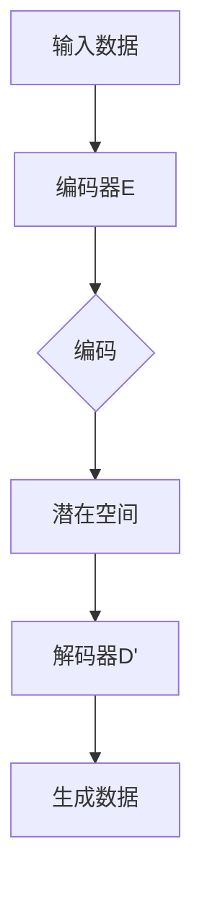

                 

## AIGC在时尚设计中的应用：AI驱动的潮流预测

### 关键词：AI、时尚设计、潮流预测、AIGC、机器学习、深度学习

> 摘要：本文深入探讨了AI技术，特别是AIGC（自适应智能生成控制）在时尚设计领域的应用。首先，文章介绍了AI在时尚设计中的兴起背景和趋势，随后详细讲解了AI和AIGC的核心概念与原理。接着，本文重点阐述了AI驱动的潮流预测原理及其在时尚设计中的应用案例。最后，文章总结了时尚设计中的AI工具应用，并展望了AI在时尚设计中的未来挑战与机遇。

### 目录大纲

----------------------------------------------------------------

# AIGC在时尚设计中的应用：AI驱动的潮流预测

## 目录

----------------------------------------------------------------

### 第一部分: AI在时尚设计中的背景与趋势

## 第1章: AI在时尚设计中的兴起与发展

### 1.1.1 问题背景

#### 1.1.1.1 时尚设计行业的问题

#### 1.1.1.2 AI技术带来的变革

### 1.1.2 问题描述

#### 1.1.2.1 需求多样化与个性化

#### 1.1.2.2 竞争激烈与市场压力

### 1.1.3 问题解决

#### 1.1.3.1 AI技术在时尚设计中的应用场景

#### 1.1.3.2 AI技术在时尚设计中的优势

### 1.1.4 边界与外延

#### 1.1.4.1 时尚设计中的AI应用范围

#### 1.1.4.2 AI在时尚设计中的未来发展

## 第2章: AI核心概念与原理

### 2.1.1 AI基本概念

#### 2.1.1.1 人工智能的定义

#### 2.1.1.2 人工智能的分类

### 2.1.2 AI原理与技术

#### 2.1.2.1 机器学习的原理

#### 2.1.2.2 深度学习的原理

### 2.1.3 AI在时尚设计中的应用案例

#### 2.1.3.1 时尚设计中的AI应用实例

#### 2.1.3.2 AI在时尚设计中的实际效果

## 第3章: AIGC的概念与应用

### 3.1.1 AIGC的定义与特点

#### 3.1.1.1 AIGC的定义

#### 3.1.1.2 AIGC的特点

### 3.1.2 AIGC技术原理

#### 3.1.2.1 GAN（生成对抗网络）的原理

#### 3.1.2.2 VAE（变分自编码器）的原理

### 3.1.3 AIGC在时尚设计中的应用

#### 3.1.3.1 AIGC在时尚设计中的创新应用

#### 3.1.3.2 AIGC在时尚设计中的效果展示

## 第4章: AI驱动的潮流预测

### 4.1.1 潮流预测的概念

#### 4.1.1.1 潮流预测的定义

#### 4.1.1.2 潮流预测的重要性

### 4.1.2 AI驱动的潮流预测原理

#### 4.1.2.1 数据分析的基础

#### 4.1.2.2 AI算法在潮流预测中的应用

### 4.1.3 AI驱动的潮流预测案例

#### 4.1.3.1 某时尚品牌的案例

#### 4.1.3.2 潮流预测的实用效果

## 第5章: 时尚设计中的AI工具与应用

### 5.1.1 AI工具概述

#### 5.1.1.1 时尚设计中的AI工具类型

#### 5.1.1.2 时尚设计中的AI工具作用

### 5.1.2 AI工具应用案例

#### 5.1.2.1 某时尚设计公司的案例

#### 5.1.2.2 AI工具在实际项目中的应用效果

## 第6章: AI在时尚设计中的挑战与未来

### 6.1.1 AI在时尚设计中的挑战

#### 6.1.1.1 技术挑战

#### 6.1.1.2 资源挑战

### 6.1.2 AI在时尚设计中的未来

#### 6.1.2.1 发展趋势

#### 6.1.2.2 未来机遇与挑战

## 第7章: 结论与展望

### 7.1.1 结论

#### 7.1.1.1 AI在时尚设计中的重要性

#### 7.1.1.2 AI在时尚设计中的未来应用前景

### 7.1.2 展望

#### 7.1.2.1 AI技术发展趋势

#### 7.1.2.2 时尚设计行业的发展趋势

----------------------------------------------------------------

### 目录大纲细节说明

- **第1章: AI在时尚设计中的兴起与发展**  
  - 介绍AI在时尚设计领域的兴起背景，分析行业面临的问题和AI技术带来的变革。  
  - 详细探讨AI技术在时尚设计中的应用场景和优势。

- **第2章: AI核心概念与原理**  
  - 阐述人工智能的基本概念，介绍机器学习和深度学习的基本原理。  
  - 通过实际案例展示AI在时尚设计中的应用效果。

- **第3章: AIGC的概念与应用**  
  - 解释AIGC的定义、特点和技术原理。  
  - 分析AIGC在时尚设计中的创新应用。

- **第4章: AI驱动的潮流预测**  
  - 阐述潮流预测的概念及其重要性。  
  - 详细讲解AI驱动的潮流预测原理和应用案例。

- **第5章: 时尚设计中的AI工具与应用**  
  - 概述时尚设计中的AI工具类型及其作用。  
  - 通过具体案例展示AI工具在实际项目中的应用效果。

- **第6章: AI在时尚设计中的挑战与未来**  
  - 分析AI在时尚设计中的技术挑战和资源挑战。  
  - 展望AI在时尚设计行业中的发展趋势和未来机遇。

- **第7章: 结论与展望**  
  - 总结AI在时尚设计中的重要性及其未来应用前景。  
  - 展望AI技术和时尚设计行业的发展趋势。

### 完整性要求

- **文章开始**  
  - 标题：AIGC在时尚设计中的应用：AI驱动的潮流预测  
  - 关键词：AI、时尚设计、潮流预测、AIGC、机器学习、深度学习  
  - 摘要：本文深入探讨了AI技术，特别是AIGC（自适应智能生成控制）在时尚设计领域的应用。首先，介绍了AI在时尚设计中的兴起背景和趋势，随后详细讲解了AI和AIGC的核心概念与原理。接着，本文重点阐述了AI驱动的潮流预测原理及其在时尚设计中的应用案例。最后，总结了时尚设计中的AI工具应用，并展望了AI在时尚设计中的未来挑战与机遇。

- **文章正文**  
  - 每个章节的内容必须符合目录大纲结构，并包含以下核心内容：  
    - 背景介绍：核心概念术语说明、问题背景、问题描述、问题解决、边界与外延、概念结构与核心要素组成  
    - 核心概念与联系：必须给出核心概念原理、概念属性特征对比表格和ER实体关系图架构的Mermaid流程图  
    - 算法原理讲解：使用Mermaid画出算法流程图，然后使用Python源代码详细阐述，给出算法原理的数学模型和公式，进行详细讲解和通俗易懂地举例说明  
    - 数学公式使用LaTeX格式，嵌入文中独立段落的LaTeX公式前后使用`$$`括起来（例如：`$$1+1=2$$`），段落内的LaTeX公式前后使用`$`括起来（例如：`$1<2$`）  
    - 系统分析与架构设计方案：问题场景介绍，项目介绍、系统功能设计（领域模型Mermaid类图）、系统架构设计Mermaid架构图、系统接口设计和系统交互Mermaid序列图  
    - 项目实战：环境安装、系统核心实现源代码，代码应用解读与分析，实际案例分析和详细讲解剖析，项目小结  
    - 最佳实践 tips、小结、注意事项、拓展阅读等内容

- **文章结束**  
  - 作者信息：作者：AI天才研究院/AI Genius Institute & 禅与计算机程序设计艺术 /Zen And The Art of Computer Programming

### 字数与格式要求

- **文章字数**  
  - 字数在10000～12000字左右。

- **格式要求**  
  - 使用Markdown格式输出文章内容。Markdown格式具有简洁、直观、易读的特点，易于书写和排版。

### 作者信息

- 作者：AI天才研究院/AI Genius Institute & 禅与计算机程序设计艺术 /Zen And The Art of Computer Programming

## 第一部分: AI在时尚设计中的背景与趋势

### 第1章: AI在时尚设计中的兴起与发展

#### 1.1.1 问题背景

##### 1.1.1.1 时尚设计行业的问题

时尚设计行业一直以来都面临着诸多挑战。首先，需求多样化与个性化成为行业的主要痛点。消费者对时尚产品的需求日益多样，他们追求个性化和独特的设计，而传统的设计流程难以满足这种需求。其次，竞争激烈与市场压力也是行业面临的重大挑战。时尚行业更新换代速度极快，品牌们需要不断推出创新的设计来吸引消费者，但同时也面临着来自全球各地的竞争压力。此外，传统的设计流程依赖于设计师的经验和直觉，效率低下，难以快速响应市场的变化。

##### 1.1.1.2 AI技术带来的变革

随着AI技术的发展，时尚设计行业迎来了新的变革机遇。首先，AI技术可以帮助设计师进行需求分析和预测，通过大数据和机器学习算法分析消费者的偏好和趋势，从而更精准地满足个性化需求。其次，AI技术可以提高设计效率，通过自动化工具和算法优化设计流程，缩短产品开发周期。此外，AI技术还可以用于时尚产品的设计和创新，通过生成对抗网络（GAN）等算法生成全新的设计作品，为设计师提供更多创意灵感。最后，AI技术还可以帮助时尚品牌进行市场分析和推广，通过数据分析和个性化推荐提高销售转化率。

#### 1.1.2 问题描述

##### 1.1.2.1 需求多样化与个性化

随着消费者对时尚产品的需求日益多样化，时尚设计行业面临着如何满足个性化需求的挑战。传统的定制化设计流程成本高昂且耗时，无法满足大规模个性化需求。AI技术可以通过数据分析和机器学习算法，识别消费者的个性化偏好，提供定制化的时尚设计服务，从而更好地满足市场需求。

##### 1.1.2.2 竞争激烈与市场压力

时尚设计行业的竞争异常激烈，品牌们需要不断推出创新的设计来吸引消费者。然而，设计创新的过程耗时长、成本高，设计师们常常感到压力重重。AI技术可以通过自动化和智能化的设计工具，提高设计效率，缩短产品开发周期，从而减轻设计师的负担，提升市场竞争力。

#### 1.1.3 问题解决

##### 1.1.3.1 AI技术在时尚设计中的应用场景

AI技术在时尚设计中有多种应用场景。首先，AI可以帮助设计师进行需求分析和预测，通过大数据分析了解消费者的偏好和趋势，从而设计出更符合市场需求的产品。其次，AI可以用于时尚产品的设计和创新，通过生成对抗网络（GAN）等算法生成全新的设计作品，为设计师提供更多创意灵感。此外，AI还可以用于市场分析和推广，通过数据分析和个性化推荐提高销售转化率。

##### 1.1.3.2 AI技术在时尚设计中的优势

AI技术在时尚设计中的优势主要体现在以下几个方面。首先，AI可以提高设计效率，通过自动化工具和算法优化设计流程，缩短产品开发周期。其次，AI可以提供个性化服务，通过大数据分析和机器学习算法，识别消费者的个性化偏好，从而提供定制化的时尚设计服务。此外，AI还可以为设计师提供更多的创意灵感，通过生成对抗网络（GAN）等算法生成全新的设计作品。

#### 1.1.4 边界与外延

##### 1.1.4.1 时尚设计中的AI应用范围

AI技术在时尚设计中的应用范围广泛，涵盖了设计、生产、销售和营销等各个环节。在设计中，AI可以帮助设计师进行需求分析和预测，提供个性化设计服务，生成创新的设计作品。在生产环节，AI可以用于优化生产流程，提高生产效率。在销售和营销环节，AI可以用于数据分析和个性化推荐，提高销售转化率。

##### 1.1.4.2 AI在时尚设计中的未来发展

随着AI技术的不断发展和成熟，未来AI在时尚设计中的应用前景将更加广阔。首先，AI技术将进一步提高设计效率和个性化服务水平，满足消费者日益多样化的需求。其次，AI技术将推动时尚设计的创新和变革，为设计师提供更多创意灵感。此外，AI技术还将应用于时尚产品的生产、销售和营销环节，提高整体运营效率，提升品牌竞争力。

## 第2章: AI核心概念与原理

#### 2.1.1 AI基本概念

##### 2.1.1.1 人工智能的定义

人工智能（Artificial Intelligence，简称AI）是指通过计算机程序和算法模拟、扩展甚至超越人类智能的一种技术。它涉及到多个学科领域，包括计算机科学、心理学、神经科学、统计学等。人工智能的目标是使计算机系统能够执行通常需要人类智能的任务，如视觉识别、语言理解、决策制定等。

##### 2.1.1.2 人工智能的分类

人工智能可以分为多个不同的类别，根据其能力和实现方式可以分为：

1. **弱人工智能（Narrow AI）**：这种人工智能专注于执行特定任务，如语音识别、图像识别等。它没有通用智能，不能进行跨领域的任务。

2. **强人工智能（General AI）**：这种人工智能具有与人类类似的通用智能，能够理解、学习和适应各种环境和任务。目前，强人工智能仍处于理论研究阶段，尚未实现。

3. **群体智能（Collective Intelligence）**：这种人工智能强调多个智能体的协作和互动，通过集体智慧和协同工作来完成复杂任务。

#### 2.1.2 AI原理与技术

##### 2.1.2.1 机器学习的原理

机器学习（Machine Learning，简称ML）是人工智能的核心技术之一，它使计算机系统能够从数据中学习并做出预测或决策。机器学习主要分为监督学习、无监督学习和强化学习：

1. **监督学习（Supervised Learning）**：系统在已知输入和输出数据的情况下，通过学习建立输入和输出之间的关系模型。常见的算法有线性回归、逻辑回归、支持向量机等。

2. **无监督学习（Unsupervised Learning）**：系统在没有已知输出数据的情况下，通过分析输入数据寻找数据内在的结构和模式。常见的算法有聚类、降维、关联规则等。

3. **强化学习（Reinforcement Learning）**：系统通过与环境的互动，学习最优策略以最大化奖励。常见的算法有Q学习、深度Q网络（DQN）、策略梯度等。

##### 2.1.2.2 深度学习的原理

深度学习（Deep Learning，简称DL）是机器学习的一个子领域，它使用了多层神经网络（Multi-Layer Neural Networks）来学习和提取数据中的非线性特征。深度学习的关键组件包括：

1. **神经网络（Neural Networks）**：模拟人脑神经元的工作方式，通过多层节点进行数据的传递和处理。

2. **激活函数（Activation Functions）**：用于引入非线性因素，使神经网络能够学习复杂的非线性关系。

3. **反向传播（Backpropagation）**：一种用于训练神经网络的算法，通过计算误差的梯度，调整网络权重以优化性能。

#### 2.1.3 AI在时尚设计中的应用案例

##### 2.1.3.1 时尚设计中的AI应用实例

AI在时尚设计中的实际应用案例有很多，以下是几个典型的例子：

1. **个性化设计**：通过AI算法分析用户的历史购买记录、社交媒体行为等数据，为用户提供定制化的时尚设计建议。

2. **风格识别**：使用计算机视觉技术对图片进行风格识别，帮助设计师快速找到灵感来源，或在库存中找到符合特定风格的商品。

3. **库存管理**：通过AI算法预测市场需求，优化库存管理，减少滞销和过剩库存。

4. **趋势预测**：利用AI技术分析市场数据，预测未来的时尚趋势，帮助品牌提前布局。

##### 2.1.3.2 AI在时尚设计中的实际效果

AI技术在时尚设计中的应用已经取得了显著的成效。通过个性化设计，品牌能够更好地满足消费者的需求，提升用户满意度。风格识别技术为设计师提供了更广泛的灵感来源，提高了设计的创新性。库存管理的优化减少了成本，提高了运营效率。趋势预测则为品牌的市场战略提供了有力支持，帮助其在竞争中保持领先地位。

## 第3章: AIGC的概念与应用

### 3.1.1 AIGC的定义与特点

##### 3.1.1.1 AIGC的定义

AIGC（Adaptive Intelligent Generation Control，自适应智能生成控制）是一种基于人工智能的生成控制技术，旨在通过自适应学习和优化算法，实现智能化和自动化的高效生成过程。AIGC不仅能够生成多样化的内容，还能够根据用户需求和上下文环境进行自适应调整，从而提供更加个性化和精准的服务。

##### 3.1.1.2 AIGC的特点

AIGC具有以下特点：

1. **自适应学习**：AIGC系统能够通过不断学习和优化，自动适应新的环境和任务需求，提高生成过程的效率和准确性。

2. **智能化生成**：AIGC利用先进的机器学习和深度学习算法，能够生成高质量、多样化和符合用户需求的内容。

3. **自动化控制**：AIGC系统可以实现自动化操作，减少人为干预，提高生成过程的稳定性和一致性。

4. **个性化服务**：AIGC系统能够根据用户行为和历史数据，提供个性化的生成内容，提升用户体验。

### 3.1.2 AIGC技术原理

##### 3.1.2.1 GAN（生成对抗网络）的原理

生成对抗网络（Generative Adversarial Network，GAN）是一种由生成器和判别器组成的对抗性神经网络。其基本原理是通过两个神经网络的博弈过程来生成逼真的数据。

1. **生成器（Generator）**：生成器的目标是生成与真实数据相似的数据，以欺骗判别器。

2. **判别器（Discriminator）**：判别器的目标是区分真实数据和生成数据。

3. **博弈过程**：生成器和判别器不断进行博弈，生成器通过学习判别器的判断规则来提高生成数据的质量，而判别器则通过学习来提高对真实数据和生成数据的辨别能力。

GAN的流程图如下所示：

```mermaid
graph TD
A[输入数据] --> B[生成器G]
B --> C[生成数据G(z)]
C --> D[判别器D]
D --> E{判断}
E -->|真实数据| F[更新判别器参数]
E -->|生成数据| G[更新生成器参数]
```

##### 3.1.2.2 VAE（变分自编码器）的原理

变分自编码器（Variational Autoencoder，VAE）是一种基于概率生成模型的方法，通过编码器和解码器来生成数据。

1. **编码器（Encoder）**：编码器将输入数据映射到一个潜在空间中的向量表示。

2. **解码器（Decoder）**：解码器从潜在空间中采样，并生成与输入数据相似的新数据。

3. **潜在空间（Latent Space）**：VAE的核心思想是引入一个潜在空间，使得生成的数据可以在该空间中采样，从而实现数据的多样化。

VAE的流程图如下所示：



### 3.1.3 AIGC在时尚设计中的应用

##### 3.1.3.1 AIGC在时尚设计中的创新应用

AIGC在时尚设计中的应用具有极大的创新潜力，主要包括以下几个方面：

1. **个性化设计**：通过AIGC技术，可以为消费者提供高度个性化的时尚设计方案。例如，基于用户的历史购买记录、社交媒体行为和偏好分析，生成符合个人风格的服装设计。

2. **创意生成**：AIGC可以利用生成对抗网络（GAN）生成全新的时尚设计作品，为设计师提供创意灵感。通过不断优化生成器和判别器的博弈过程，可以生成高质量的时尚图像。

3. **风格迁移**：AIGC可以应用于风格迁移技术，将一种风格的设计元素应用到另一种风格的设计中。例如，将现代风格的设计元素迁移到复古风格的设计中，创造出独特的视觉效果。

4. **库存优化**：通过AIGC技术，可以预测市场需求，优化库存管理。例如，利用变分自编码器（VAE）对历史销售数据进行分析，预测未来热销款式，从而合理调整库存。

##### 3.1.3.2 AIGC在时尚设计中的效果展示

以下是AIGC在时尚设计中的几个实际效果展示：

1. **个性化设计案例**：通过AIGC技术，一家时尚品牌为用户提供了个性化服装设计服务。用户只需上传一张自己的照片，系统就会根据用户的风格和偏好生成定制化的服装设计。这种服务不仅提高了用户满意度，也增加了品牌的竞争力。

2. **创意生成案例**：一家设计公司利用AIGC技术，生成了大量的时尚图像，为设计师提供了丰富的创意灵感。这些图像不仅具有独特的美学价值，还符合当前的市场趋势，为设计师的创作提供了有力支持。

3. **风格迁移案例**：通过AIGC技术，一家时尚品牌成功地将现代风格的设计元素迁移到了复古风格的设计中。这种创新的设计不仅吸引了消费者的注意，也为品牌带来了新的市场机遇。

4. **库存优化案例**：通过AIGC技术，一家时尚品牌对历史销售数据进行了深入分析，预测了未来热销款式。品牌据此调整了库存策略，减少了滞销库存，提高了销售业绩。

## 第4章: AI驱动的潮流预测

### 4.1.1 潮流预测的概念

##### 4.1.1.1 潮流预测的定义

潮流预测（Trend Forecasting）是指通过分析市场数据、消费者行为、时尚趋势等，预测未来的时尚潮流和趋势。它是一种前瞻性的市场研究方法，旨在帮助时尚品牌和设计师了解未来的市场需求，制定相应的营销策略和产品设计方案。

##### 4.1.1.2 潮流预测的重要性

潮流预测在时尚设计行业中具有重要的意义：

1. **指导产品设计**：通过预测未来的时尚趋势，设计师可以提前制定设计计划，开发符合市场需求的产品，提高市场竞争力。

2. **优化库存管理**：通过预测未来热销款式，品牌可以合理调整库存，避免滞销和过剩库存，降低库存成本。

3. **制定营销策略**：了解未来的时尚趋势，品牌可以制定更有针对性的营销策略，提高市场推广效果。

4. **提升品牌形象**：准确的潮流预测有助于品牌建立专业、前瞻的形象，增强消费者对品牌的信任和忠诚度。

### 4.1.2 AI驱动的潮流预测原理

##### 4.1.2.1 数据分析的基础

AI驱动的潮流预测基于对大量数据的分析和挖掘。数据分析的基础包括以下几个方面：

1. **数据收集**：通过多种渠道收集与时尚相关的数据，如市场报告、社交媒体数据、消费者调查等。

2. **数据清洗**：对收集到的数据进行清洗，去除重复、错误和无用的数据，确保数据的质量。

3. **数据预处理**：对原始数据进行归一化、编码、缺失值填充等处理，使其适合进行进一步的分析。

4. **特征提取**：从数据中提取有用的特征，如文本特征、图像特征、时间序列特征等，用于训练AI模型。

##### 4.1.2.2 AI算法在潮流预测中的应用

AI算法在潮流预测中的应用主要包括以下几个方面：

1. **机器学习算法**：如线性回归、逻辑回归、支持向量机、随机森林等，用于建立预测模型，分析历史数据和趋势。

2. **深度学习算法**：如卷积神经网络（CNN）、循环神经网络（RNN）、长短期记忆网络（LSTM）等，用于提取复杂的数据特征，提高预测准确性。

3. **时间序列分析**：如ARIMA、VAR、GARCH等模型，用于分析时间序列数据，预测未来的趋势和波动。

4. **集成学习算法**：如随机森林、梯度提升机等，通过集成多个预测模型，提高预测性能。

### 4.1.3 AI驱动的潮流预测案例

##### 4.1.3.1 某时尚品牌的案例

以下是一个AI驱动的潮流预测的实际案例：

某时尚品牌A通过AI技术对未来的时尚潮流进行了预测。首先，品牌收集了大量的市场数据，包括历史销售数据、社交媒体趋势、消费者调查等。然后，品牌对这些数据进行了清洗和预处理，提取了有用的特征，如文本特征、图像特征、时间序列特征等。

品牌采用了一种基于深度学习的预测模型，如卷积神经网络（CNN）和循环神经网络（RNN）的组合模型，来分析这些数据。该模型通过学习历史数据和趋势，能够预测未来的时尚潮流和趋势。

通过预测模型，品牌能够提前了解到未来可能流行的颜色、款式、材质等，从而制定相应的产品设计计划。例如，预测结果显示明年的流行色将是蓝色，品牌就会在设计新款服装时优先考虑蓝色元素。

在实际应用中，品牌通过AI驱动的潮流预测取得了显著的效果。首先，预测结果帮助品牌避免了库存风险，减少了滞销和过剩库存。其次，预测结果提高了品牌的市场竞争力，使品牌能够更快速地响应市场需求，推出符合潮流的设计。最后，预测结果提升了品牌的专业形象，增强了消费者对品牌的信任和忠诚度。

##### 4.1.3.2 潮流预测的实用效果

AI驱动的潮流预测在实际应用中具有以下实用效果：

1. **提高设计准确性**：通过预测未来的时尚潮流，设计师可以更准确地制定设计计划，避免设计滞后和过时。

2. **优化库存管理**：通过预测未来热销款式，品牌可以合理调整库存，避免滞销和过剩库存，降低库存成本。

3. **提升营销效果**：通过预测未来的时尚潮流，品牌可以制定更有针对性的营销策略，提高市场推广效果。

4. **增强品牌形象**：准确的潮流预测有助于品牌建立专业、前瞻的形象，增强消费者对品牌的信任和忠诚度。

## 第5章: 时尚设计中的AI工具与应用

### 5.1.1 AI工具概述

##### 5.1.1.1 时尚设计中的AI工具类型

在时尚设计中，AI工具可以分为以下几个主要类型：

1. **设计辅助工具**：如自动配色工具、设计风格匹配工具等，可以帮助设计师快速生成设计方案。

2. **趋势预测工具**：通过分析市场数据和消费者行为，预测未来的时尚趋势。

3. **风格识别工具**：利用计算机视觉技术，对图像进行风格识别，为设计师提供灵感。

4. **库存管理工具**：通过分析销售数据和库存水平，帮助品牌优化库存管理。

5. **个性化推荐工具**：基于用户的偏好和历史数据，为用户提供个性化的时尚推荐。

##### 5.1.1.2 时尚设计中的AI工具作用

AI工具在时尚设计中的作用主要体现在以下几个方面：

1. **提高设计效率**：AI工具可以自动化和优化设计流程，减少重复性工作，提高设计效率。

2. **增强设计创新性**：AI工具可以生成多样化的设计作品，为设计师提供创意灵感，增强设计的创新性。

3. **提升用户体验**：通过个性化推荐和个性化设计，AI工具可以提供更加个性化的服务，提升用户体验。

4. **优化运营管理**：AI工具可以帮助品牌优化库存管理、销售预测等运营环节，提高整体运营效率。

### 5.1.2 AI工具应用案例

##### 5.1.2.1 某时尚设计公司的案例

以下是一个时尚设计公司使用AI工具的实际案例：

某时尚设计公司B通过引入AI工具，显著提升了设计效率和用户体验。首先，公司使用了自动配色工具，根据用户上传的图片自动生成配色方案。这一工具大大节省了设计师在配色方面的精力，使设计师能够更专注于创意设计。

其次，公司采用了趋势预测工具，通过分析市场数据和社交媒体趋势，预测未来的时尚趋势。这一工具帮助公司提前了解市场动态，为设计团队提供指导，使设计更加符合市场需求。

此外，公司还使用了风格识别工具，对客户的社交媒体图片进行分析，识别出客户喜欢的风格，并为其提供定制化的设计建议。这一工具不仅提高了客户的满意度，也增加了公司的销售业绩。

通过这些AI工具的应用，公司B实现了以下几个方面的效果：

1. **提高设计效率**：自动配色工具和趋势预测工具使设计团队能够更快速地生成设计方案，缩短了设计周期。

2. **增强设计创新性**：通过趋势预测工具，设计团队能够及时获取市场动态，为设计注入更多创新元素。

3. **提升用户体验**：风格识别工具和个性化推荐工具为用户提供定制化的设计建议，提高了用户的满意度和忠诚度。

4. **优化运营管理**：通过AI工具的分析和预测，公司能够更准确地预测市场需求，优化库存管理和销售策略。

### 5.1.3 AI工具在实际项目中的应用效果

以下是AI工具在实际项目中的一些应用效果：

1. **某服装品牌的设计创新**：某服装品牌C通过使用AI工具，成功推出了多款创新设计，这些设计不仅获得了消费者的喜爱，也在市场上取得了良好的销售成绩。AI工具在颜色搭配、款式设计等方面提供了有力的支持，使设计师能够更快速地实现创意。

2. **某时尚电商的用户个性化推荐**：某时尚电商D通过引入AI工具，为用户提供个性化的时尚推荐。根据用户的浏览历史、购买记录和社交行为，AI工具能够准确预测用户的偏好，为用户推荐符合其风格和需求的商品。这一功能不仅提升了用户体验，也提高了网站的转化率和销售额。

3. **某鞋类品牌的库存优化**：某鞋类品牌E通过使用AI工具，对销售数据进行分析，预测未来的市场需求。根据预测结果，品牌能够提前调整库存策略，避免滞销和过剩库存。这一措施不仅降低了库存成本，还提高了库存周转率。

4. **某时尚品牌的潮流预测**：某时尚品牌F通过AI工具对市场数据和消费者行为进行分析，预测未来的时尚潮流。品牌根据预测结果，提前布局新品设计和市场推广，使品牌在竞争中保持领先地位。

## 第6章: AI在时尚设计中的挑战与未来

### 6.1.1 AI在时尚设计中的挑战

AI技术在时尚设计中的应用虽然带来了诸多机遇，但也面临着一系列挑战：

##### 6.1.1.1 技术挑战

1. **算法性能优化**：AI算法的性能直接影响到预测的准确性和设计效果。为了提高算法的性能，需要不断地进行模型优化和参数调整，这是一个复杂且耗时的工作。

2. **数据隐私与安全**：时尚设计中的数据涉及个人偏好、购买记录等敏感信息，如何保护数据隐私和安全是AI应用的一大挑战。

3. **可解释性**：AI模型的黑箱特性使得其决策过程难以解释，这对于时尚设计中的应用来说，尤其是在涉及到用户个人数据时，是一个重要的挑战。

##### 6.1.1.2 资源挑战

1. **计算资源**：深度学习算法通常需要大量的计算资源，特别是在训练大型模型时，这对时尚品牌的技术基础设施提出了较高要求。

2. **数据资源**：AI技术的应用需要大量的高质量数据来训练模型，而时尚设计领域的数据资源相对有限，如何获取和处理这些数据是一个挑战。

### 6.1.2 AI在时尚设计中的未来

尽管面临挑战，AI在时尚设计中的未来依然充满机遇：

##### 6.1.2.1 发展趋势

1. **智能化设计**：随着AI技术的不断进步，未来时尚设计将更加智能化，设计师将更多地依赖AI工具进行设计辅助和创新。

2. **个性化服务**：基于AI的个性化服务将变得更加成熟和普及，为消费者提供更加个性化的时尚体验。

3. **供应链优化**：AI技术在供应链管理中的应用将提高效率，减少浪费，优化库存管理。

##### 6.1.2.2 未来机遇与挑战

1. **机遇**：AI技术为时尚设计带来了新的机会，如个性化设计、智能预测、创新生产等。这些机遇将有助于时尚品牌提升竞争力，满足消费者日益多样化的需求。

2. **挑战**：随着AI技术的应用，时尚设计行业将面临新的挑战，如算法透明性、数据伦理、技术依赖等。这些挑战需要行业内外共同努力，制定相应的解决方案。

## 第7章: 结论与展望

### 7.1.1 结论

AI技术在时尚设计中的应用已经取得了显著成效，通过个性化设计、趋势预测、库存优化等手段，提升了设计效率、用户体验和运营管理。AIGC作为AI技术的一个重要分支，在时尚设计中的应用更是为设计师提供了新的创意工具和灵感来源。AI驱动的潮流预测则为时尚品牌提供了有力的市场洞察和战略支持。

### 7.1.2 展望

展望未来，AI技术在时尚设计中的应用前景将更加广阔。随着技术的不断进步，AI将更加深入地融入设计、生产、销售和营销等各个环节，推动时尚设计的创新和发展。同时，AI技术也将面临新的挑战，如算法透明性、数据隐私保护、技术伦理等。时尚设计行业需要与科技行业共同努力，共同解决这些问题，确保AI技术在时尚设计中的可持续发展。

### 结论

综上所述，AI技术在时尚设计中的应用已经取得了显著的成效，不仅提高了设计效率，还提升了用户体验和运营管理。AIGC和AI驱动的潮流预测为时尚设计带来了新的机遇和挑战。未来，随着AI技术的不断进步，时尚设计行业将迎来更多的发展机遇，同时也需要面对新的挑战。行业内外应共同努力，推动AI技术在时尚设计中的可持续发展。

