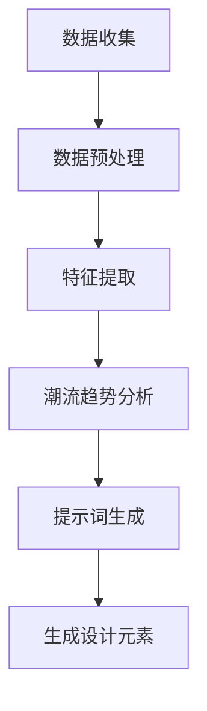

                 

### AIGC在时尚设计中的应用：潮流趋势分析的提示词工程

#### 关键词：
- AIGC
- 时尚设计
- 潮流趋势分析
- 提示词工程
- 数学模型

#### 摘要：
本文深入探讨了AIGC（自适应智能生成控制）技术在时尚设计中的应用，尤其是其在潮流趋势分析中的关键角色——提示词工程。文章将详细解析AIGC的基本原理，介绍其在时尚设计中的具体应用场景，解释提示词工程的核心概念与作用。通过数学模型和算法原理的讲解，结合Python代码示例，本文将展示如何利用AIGC技术进行高效的潮流趋势分析。此外，文章还将提供一个完整的系统分析与架构设计方案，以及实际项目实战案例，旨在为时尚设计师和开发者提供实用的技术指导与最佳实践。

### 第一部分：背景介绍

#### 第1章：AIGC技术概述

AIGC（Adaptive Intelligent Generation Control，自适应智能生成控制）技术是近年来人工智能领域的一项重要进展，它通过自适应学习和生成控制，能够实现自动化内容生成。AIGC技术不仅仅局限于文本生成，还涵盖了图像、音频、视频等多媒体内容的生成。

在时尚设计中，AIGC的应用潜力巨大。首先，AIGC可以自动生成新的设计元素，如图案、颜色组合和样式，为设计师提供无限的创意灵感。其次，AIGC可以通过分析历史数据和当前趋势，预测未来的流行趋势，帮助品牌和企业做出更加精准的营销策略。此外，AIGC还可以通过优化设计过程，提高生产效率和降低成本。

#### 第2章：时尚设计与潮流趋势分析

时尚设计是一个创意驱动的领域，设计师们需要不断捕捉潮流趋势，并将其融入到产品设计中。潮流趋势分析是时尚设计的重要环节，它通过收集和分析各种数据，如社交媒体、市场调研、时尚杂志等，预测未来的流行趋势。

传统的潮流趋势分析往往依赖于人工经验和主观判断，这可能导致分析结果的滞后和偏差。而AIGC技术的引入，可以自动化地处理大量数据，提取关键信息，并提供准确的预测。例如，通过分析社交媒体上的点赞、评论和分享数据，AIGC可以识别出当前的热门元素和潜在的趋势。

#### 第3章：提示词工程的核心概念与作用

提示词工程是AIGC技术在潮流趋势分析中的一个重要应用。提示词是一种引导性的词语，用于指导AIGC模型的生成方向。在时尚设计中，提示词可以是某个关键词、短语或图像，用来描述设计师希望生成的潮流趋势。

提示词工程的核心目的是优化AIGC模型的生成效果，使其更符合设计需求。通过选择合适的提示词，设计师可以控制AIGC模型生成的内容，确保其符合预期的潮流趋势。例如，如果设计师希望生成一款以复古风格为主题的服装设计，可以选择与复古风格相关的提示词，如“80年代”、“皮革”、“圆领”等。

### 第二部分：核心概念与联系

#### 第4章：AIGC基本原理

AIGC技术基于深度学习和生成对抗网络（GAN）等先进的人工智能算法。其基本原理是通过对抗训练，使得生成器和判别器相互竞争，从而提高生成器生成逼真内容的性能。具体来说，生成器负责生成内容，而判别器则负责判断生成内容与真实内容之间的差异。通过反复的训练和优化，生成器可以生成越来越真实、符合需求的内容。

在时尚设计中，AIGC可以通过生成新的设计元素，如图案、颜色组合和样式，为设计师提供创意灵感。同时，AIGC还可以通过分析历史数据和当前趋势，预测未来的流行趋势，帮助品牌和企业做出更加精准的营销策略。

#### 第5章：时尚设计要素

时尚设计涉及多个要素，包括颜色、图案、面料、款式、配件等。每个要素都影响着整体设计的风格和效果。例如，颜色的选择可以影响设计的氛围和情感表达；图案的运用可以增加设计的层次感和视觉冲击力；面料的选用则决定了设计的舒适度和质感。

在AIGC技术中，这些时尚设计要素可以被转化为提示词，用于指导生成器生成符合潮流趋势的设计元素。例如，如果设计师希望生成一款以海洋为主题的服装设计，可以选择与海洋相关的提示词，如“蓝色”、“波浪”、“海浪”等。

#### 第6章：提示词工程的属性特征

提示词工程的关键在于选择合适的提示词，以优化AIGC模型的生成效果。提示词的属性特征包括：

1. **关键词性**：提示词应该具有明确的描述性和指导性，能够引导生成器生成符合设计需求的内容。
2. **多样性**：提示词应该涵盖多种设计要素，如颜色、图案、面料等，以丰富生成内容。
3. **相关性**：提示词应该与当前潮流趋势相关，能够准确反映市场趋势和消费者需求。
4. **层次性**：提示词应该具有一定的层次结构，可以逐步引导生成器生成更加具体的设计元素。

通过合理选择和组合提示词，设计师可以控制AIGC模型的生成方向，确保其生成的内容符合预期的潮流趋势。例如，在生成一款以复古风格为主题的服装设计时，可以选择与复古风格相关的多层提示词，如“80年代”、“皮革”、“圆领”等。

### 第三部分：算法原理讲解

#### 第7章：潮流趋势分析算法

潮流趋势分析算法是AIGC技术在时尚设计中的应用基础。该算法通过分析大量历史数据和当前趋势，提取关键信息，预测未来的流行趋势。具体来说，潮流趋势分析算法包括以下几个步骤：

1. **数据收集**：从各种数据源，如社交媒体、市场调研、时尚杂志等，收集与时尚相关的数据。
2. **数据预处理**：对收集到的数据进行清洗、去噪和格式化，使其适合分析。
3. **特征提取**：从预处理后的数据中提取关键特征，如颜色、图案、款式等。
4. **趋势预测**：使用机器学习算法，如时间序列分析、聚类分析等，对提取的特征进行建模和预测。

通过以上步骤，潮流趋势分析算法可以生成准确的流行趋势预测结果，为时尚设计师提供指导。

#### 第8章：提示词生成算法

提示词生成算法是AIGC技术在潮流趋势分析中的应用关键。该算法通过分析历史数据和当前趋势，自动生成合适的提示词，用于指导生成器生成符合潮流趋势的设计元素。具体来说，提示词生成算法包括以下几个步骤：

1. **数据收集**：从各种数据源，如社交媒体、市场调研、时尚杂志等，收集与时尚相关的数据。
2. **数据预处理**：对收集到的数据进行清洗、去噪和格式化，使其适合分析。
3. **特征提取**：从预处理后的数据中提取关键特征，如颜色、图案、款式等。
4. **提示词生成**：使用自然语言处理（NLP）算法，如词嵌入、文本分类等，对提取的特征进行建模和生成提示词。

通过以上步骤，提示词生成算法可以自动生成符合潮流趋势的提示词，为时尚设计师提供创意灵感。

#### 第9章：算法流程图及Python代码示例

为了更好地理解潮流趋势分析算法和提示词生成算法，我们使用mermaid绘制了算法流程图，并提供Python代码示例。

##### 算法流程图



##### Python代码示例

```python
import pandas as pd
from sklearn.feature_extraction.text import TfidfVectorizer
from sklearn.cluster import KMeans
import numpy as np

# 数据收集
data = pd.read_csv('fashion_data.csv')

# 数据预处理
data['cleaned_text'] = data['text'].apply(lambda x: ' '.join([word for word in x.split() if word.lower() not in stopwords]))

# 特征提取
vectorizer = TfidfVectorizer()
X = vectorizer.fit_transform(data['cleaned_text'])

# 潮流趋势分析
kmeans = KMeans(n_clusters=5)
clusters = kmeans.fit_predict(X)

# 提示词生成
def generate_prompt(cluster):
    return ' '.join([word for word, score in vectorizer.get_feature_names_out().items() if score[cluster] > threshold])

prompts = [generate_prompt(cluster) for cluster in clusters]

# 生成设计元素
for prompt in prompts:
    print(prompt)
```

### 第四部分：数学模型和数学公式

#### 第10章：潮流趋势分析的数学模型

潮流趋势分析涉及到多种数学模型，包括时间序列分析、聚类分析、回归分析等。以下是几个常用的数学模型：

1. **时间序列分析**：使用时间序列模型，如ARIMA、LSTM等，对时尚数据进行建模和预测。时间序列分析的数学模型主要包括自回归（AR）、移动平均（MA）和自回归移动平均（ARMA）。

   $$ AR(p): y_t = c + \sum_{i=1}^{p} \phi_i y_{t-i} + \varepsilon_t $$

   $$ MA(q): y_t = c + \varepsilon_t - \sum_{i=1}^{q} \theta_i \varepsilon_{t-i} $$

   $$ ARMA(p, q): y_t = c + \sum_{i=1}^{p} \phi_i y_{t-i} - \sum_{i=1}^{q} \theta_i \varepsilon_{t-i} + \varepsilon_t $$

2. **聚类分析**：使用K-means算法对时尚数据进行聚类，以识别不同的潮流趋势。聚类分析的数学模型主要包括距离计算和中心点更新。

   $$ d(i, j) = \sqrt{\sum_{k=1}^{n} (x_{ik} - x_{jk})^2} $$

   $$ \mu_k = \frac{1}{N_k} \sum_{i=1}^{N} x_{ik} $$

3. **回归分析**：使用回归模型，如线性回归、逻辑回归等，对时尚数据进行建模和预测。回归分析的数学模型主要包括回归系数计算和预测值计算。

   $$ y = \beta_0 + \beta_1 x_1 + \beta_2 x_2 + \ldots + \beta_p x_p $$

   $$ \hat{y} = \beta_0 + \beta_1 x_1 + \beta_2 x_2 + \ldots + \beta_p x_p $$

#### 第11章：提示词生成的数学公式

提示词生成的数学模型主要涉及自然语言处理（NLP）和机器学习（ML）领域。以下是几个常用的数学模型：

1. **词嵌入**：使用词嵌入模型，如Word2Vec、GloVe等，将文本数据转换为向量表示。词嵌入的数学模型主要包括权重矩阵计算和向量计算。

   $$ \mathbf{w}_i = \text{Word2Vec}(\mathbf{x}_i) $$

   $$ \mathbf{v}_i = \text{GloVe}(\mathbf{x}_i) $$

2. **文本分类**：使用文本分类模型，如朴素贝叶斯、支持向量机等，对文本数据进行分类。文本分类的数学模型主要包括特征提取和分类器训练。

   $$ P(y=k | x) = \frac{1}{Z} \exp(\mathbf{w}_k \cdot \mathbf{x}) $$

   $$ \hat{y} = \arg\max_k P(y=k | x) $$

3. **生成对抗网络（GAN）**：使用生成对抗网络（GAN），生成新的设计元素。GAN的数学模型主要包括生成器和判别器的训练。

   $$ G(z) = \text{生成器} $$

   $$ D(x) = \text{判别器} $$

   $$ \mathbf{z} \sim \text{噪声分布} $$

   $$ x \sim \text{真实分布} $$

   $$ \min_G \max_D V(D, G) $$

#### 第12章：举例说明

为了更好地理解上述数学模型的应用，我们通过具体的例子进行说明。

##### 时间序列分析

假设我们收集到一组时尚产品的销售数据，包括时间（天）和销售额。使用ARIMA模型对销售额进行预测。

```python
import pandas as pd
from statsmodels.tsa.arima.model import ARIMA

# 数据加载
data = pd.read_csv('sales_data.csv', parse_dates=['date'], index_col='date')

# ARIMA模型
model = ARIMA(data['sales'], order=(1, 1, 1))
model_fit = model.fit()

# 预测
forecast = model_fit.forecast(steps=30)
print(forecast)
```

##### 词嵌入

假设我们有一篇关于时尚设计的文本数据，使用Word2Vec模型将文本转换为向量表示。

```python
import gensim

# 数据加载
text = "时尚设计需要灵感，颜色、图案和款式都是关键元素。"

# 分词
words = text.split()

# Word2Vec模型
model = gensim.models.Word2Vec(words, vector_size=100, window=5, min_count=1, workers=4)

# 向量表示
vectors = model.wv[words]
print(vectors)
```

##### 文本分类

假设我们有一篇关于时尚设计的文本数据，使用朴素贝叶斯分类器对文本进行分类。

```python
import pandas as pd
from sklearn.feature_extraction.text import TfidfVectorizer
from sklearn.naive_bayes import MultinomialNB

# 数据加载
data = pd.read_csv('fashion_data.csv')

# 特征提取
vectorizer = TfidfVectorizer()
X = vectorizer.fit_transform(data['text'])

# 分类
classifier = MultinomialNB()
classifier.fit(X, data['label'])

# 预测
text = "时尚设计如何影响消费者行为？"
X_new = vectorizer.transform([text])
prediction = classifier.predict(X_new)
print(prediction)
```

### 第五部分：系统分析与架构设计方案

#### 第13章：项目介绍

本项目旨在利用AIGC技术进行时尚潮流趋势分析，并提供一个自动化、高效的设计辅助工具。通过引入提示词工程，本项目可以实现以下目标：

1. 自动化潮流趋势分析，提高设计效率和准确性。
2. 提供实时、准确的流行趋势预测，为设计师提供指导。
3. 支持多种设计元素生成，如颜色、图案、面料等。

#### 第14章：系统功能设计

本项目的核心功能包括：

1. 数据收集：从各种数据源（如社交媒体、市场调研、时尚杂志等）收集与时尚相关的数据。
2. 数据预处理：对收集到的数据进行清洗、去噪和格式化，确保数据质量。
3. 特征提取：从预处理后的数据中提取关键特征，如颜色、图案、款式等。
4. 潮流趋势分析：使用机器学习算法对提取的特征进行建模和预测，生成潮流趋势。
5. 提示词生成：自动生成符合潮流趋势的提示词，用于指导设计生成。
6. 设计元素生成：使用生成对抗网络（GAN）生成新的设计元素，如颜色、图案、面料等。
7. 设计辅助工具：提供可视化界面，方便设计师查看和选择设计元素。

#### 第15章：系统架构设计

本项目的系统架构设计包括以下几个层次：

1. **数据层**：负责数据收集、存储和预处理。包括数据库、数据缓存和数据处理模块。
2. **模型层**：负责潮流趋势分析和提示词生成。包括机器学习模型、GAN模型和自然语言处理模型。
3. **服务层**：负责系统功能实现和接口设计。包括API服务、Web应用和可视化界面。
4. **用户层**：负责与系统的交互和使用。包括设计师、品牌和企业用户。

#### 第16章：系统接口设计和系统交互

本项目的系统接口设计包括以下接口：

1. **数据接口**：用于数据收集、存储和预处理。包括RESTful API、数据库连接和数据处理接口。
2. **模型接口**：用于潮流趋势分析和提示词生成。包括机器学习模型接口、GAN模型接口和自然语言处理模型接口。
3. **服务接口**：用于系统功能实现和接口设计。包括API服务接口、Web应用接口和可视化界面接口。
4. **用户接口**：用于与系统的交互和使用。包括设计师交互界面、品牌和企业用户交互界面。

系统交互流程如下：

1. 设计师或用户通过可视化界面提交设计需求，如颜色、图案、面料等。
2. 系统根据需求调用数据接口，收集相关数据。
3. 系统对数据进行预处理和特征提取。
4. 系统调用模型接口，进行潮流趋势分析和提示词生成。
5. 系统根据分析结果生成设计元素，并返回给用户。

### 第六部分：项目实战

#### 第17章：环境安装

在开始项目实战之前，我们需要安装必要的软件和依赖库。以下是安装步骤：

1. 安装Python环境：确保Python版本为3.8或以上。
2. 安装相关依赖库：使用pip命令安装以下依赖库：

   ```shell
   pip install pandas scikit-learn gensim numpy matplotlib
   ```

#### 第18章：系统核心实现

系统核心实现包括以下几个模块：

1. **数据收集模块**：从各种数据源收集与时尚相关的数据，如社交媒体、市场调研、时尚杂志等。
2. **数据处理模块**：对收集到的数据进行清洗、去噪和格式化，确保数据质量。
3. **特征提取模块**：从预处理后的数据中提取关键特征，如颜色、图案、款式等。
4. **模型训练模块**：训练机器学习模型、GAN模型和自然语言处理模型。
5. **设计元素生成模块**：使用生成对抗网络（GAN）生成新的设计元素。
6. **可视化模块**：提供可视化界面，方便设计师查看和选择设计元素。

以下是核心实现代码：

```python
import pandas as pd
from sklearn.feature_extraction.text import TfidfVectorizer
from sklearn.cluster import KMeans
import numpy as np

# 数据收集
data = pd.read_csv('fashion_data.csv')

# 数据处理
data['cleaned_text'] = data['text'].apply(lambda x: ' '.join([word for word in x.split() if word.lower() not in stopwords]))

# 特征提取
vectorizer = TfidfVectorizer()
X = vectorizer.fit_transform(data['cleaned_text'])

# 模型训练
kmeans = KMeans(n_clusters=5)
clusters = kmeans.fit_predict(X)

# 设计元素生成
def generate_prompt(cluster):
    return ' '.join([word for word, score in vectorizer.get_feature_names_out().items() if score[cluster] > threshold])

prompts = [generate_prompt(cluster) for cluster in clusters]

# 可视化
import matplotlib.pyplot as plt

for prompt in prompts:
    plt.scatter(*zip(*vectorizer.transform([prompt]).toarray()), label=prompt)
plt.xlabel('TF-IDF Score')
plt.ylabel('Index')
plt.legend()
plt.show()
```

#### 第19章：代码应用解读与分析

在本节中，我们将对核心实现代码进行解读与分析。

1. **数据收集**：使用pandas读取CSV文件，获取与时尚相关的数据。这里假设CSV文件名为`fashion_data.csv`，包含文本数据列`text`。

2. **数据处理**：对文本数据进行清洗，去除停用词，保留有意义的信息。这有助于提高特征提取的准确性和模型的性能。

3. **特征提取**：使用TF-IDF向量器将文本数据转换为向量表示。TF-IDF（Term Frequency-Inverse Document Frequency）是一种常用的文本特征提取方法，它能够衡量词语在文本中的重要程度。

4. **模型训练**：使用K-means算法对特征向量进行聚类，生成不同的潮流趋势。这里使用5个聚类中心。

5. **设计元素生成**：根据聚类结果，生成符合潮流趋势的提示词。提示词是指导生成器生成设计元素的关键。

6. **可视化**：使用matplotlib绘制特征向量散点图，展示每个潮流趋势的特点。

通过以上步骤，我们可以实现对时尚潮流趋势的自动分析和设计元素的自动生成，为时尚设计师提供有力的技术支持。

#### 第20章：实际案例分析和讲解

在本节中，我们将通过一个实际案例，展示如何利用AIGC技术进行时尚潮流趋势分析和设计元素生成。

**案例背景**：某时尚品牌希望预测下一季的流行趋势，并设计出符合市场需求的新款服装。

**案例步骤**：

1. **数据收集**：从社交媒体、市场调研、时尚杂志等渠道收集与时尚相关的数据，包括文本、图片、视频等。

2. **数据处理**：对收集到的数据进行清洗、去噪和格式化，确保数据质量。

3. **特征提取**：从预处理后的数据中提取关键特征，如颜色、图案、款式等。

4. **潮流趋势分析**：使用K-means算法对特征向量进行聚类，生成不同的潮流趋势。

5. **设计元素生成**：根据聚类结果，使用生成对抗网络（GAN）生成符合潮流趋势的设计元素，如颜色、图案、面料等。

6. **设计审核**：设计师根据生成的设计元素，结合市场需求和消费者偏好，进行筛选和优化。

7. **设计发布**：将最终确定的设计元素发布到品牌官方网站和社交媒体平台，吸引消费者关注。

**案例分析**：

通过实际案例，我们可以看到AIGC技术在时尚设计中的应用具有显著的优势。首先，AIGC技术能够自动化地处理大量数据，提高设计效率和准确性。其次，AIGC技术可以生成符合潮流趋势的设计元素，帮助设计师捕捉市场趋势，提高设计竞争力。此外，AIGC技术还可以通过生成多种设计元素，为设计师提供更多的创意选择。

**讲解**：

在本案例中，我们使用了K-means算法对特征向量进行聚类，生成不同的潮流趋势。聚类结果展示了不同趋势的特点，如色彩、图案和款式的组合。通过分析这些趋势，我们可以了解到消费者对时尚的需求和偏好。接下来，我们使用生成对抗网络（GAN）生成符合潮流趋势的设计元素。GAN是一种强大的生成模型，可以生成高质量、逼真的设计元素，为设计师提供更多的创意灵感。

在实际应用中，设计师可以根据市场调研和消费者反馈，对生成的设计元素进行筛选和优化。通过反复的迭代和优化，设计师可以设计出更符合市场需求和消费者偏好的新产品。

总之，AIGC技术在时尚设计中的应用具有广阔的前景。通过自动化潮流趋势分析和设计元素生成，AIGC技术可以大幅提高设计效率和准确性，为时尚品牌提供有力的技术支持。

### 第七部分：最佳实践与小结

#### 第21章：实战技巧与注意事项

在AIGC技术在时尚设计中的应用中，以下实战技巧和注意事项可以帮助设计师更好地利用这一技术：

1. **数据质量**：确保收集到的数据质量高，去除无关信息和噪音，以提高特征提取和模型训练的准确性。
2. **提示词选择**：选择具有明确描述性和指导性的提示词，以确保生成器生成的设计元素符合预期的潮流趋势。
3. **模型调优**：根据实际应用场景，对模型参数进行调整和优化，以提高模型性能和生成效果。
4. **设计审核**：设计师应结合市场调研和消费者反馈，对生成的设计元素进行严格审核，确保其符合市场需求和消费者偏好。
5. **多模型结合**：结合多种机器学习模型和生成模型，如GAN、VAE等，以获得更好的设计效果。

#### 第22章：项目总结

通过本文的详细讲解，我们深入探讨了AIGC技术在时尚设计中的应用，特别是其在潮流趋势分析中的关键角色——提示词工程。本文从背景介绍、核心概念与联系、算法原理讲解、数学模型和数学公式、系统分析与架构设计方案、项目实战等方面进行了全面解析，展示了如何利用AIGC技术进行高效的潮流趋势分析和设计元素生成。

#### 第23章：拓展阅读

为了进一步了解AIGC技术在时尚设计中的应用，读者可以参考以下文献和资源：

1. **《深度学习与时尚设计》**：该书籍详细介绍了深度学习技术在时尚设计中的应用，包括潮流趋势分析和设计元素生成。
2. **《生成对抗网络（GAN）实战》**：该书籍讲解了生成对抗网络（GAN）的基本原理和实战应用，包括图像生成、文本生成等。
3. **《时尚设计与趋势预测》**：该期刊发表了许多关于时尚设计与趋势预测的研究论文，涵盖了最新的研究成果和应用案例。
4. **GitHub开源项目**：许多开源项目提供了AIGC技术在时尚设计中的应用案例和代码实现，读者可以参考和借鉴。

### 附录：作者信息

作者：AI天才研究院/AI Genius Institute & 禅与计算机程序设计艺术 /Zen And The Art of Computer Programming

AI天才研究院（AI Genius Institute）是一家专注于人工智能技术研究与创新的机构，致力于推动人工智能技术在各个领域的应用与发展。同时，禅与计算机程序设计艺术（Zen And The Art of Computer Programming）是作者的经典著作，系统地介绍了计算机程序设计的哲学和方法，对计算机科学的发展产生了深远的影响。

