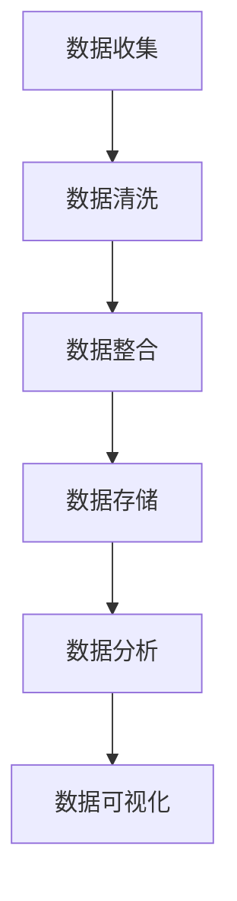
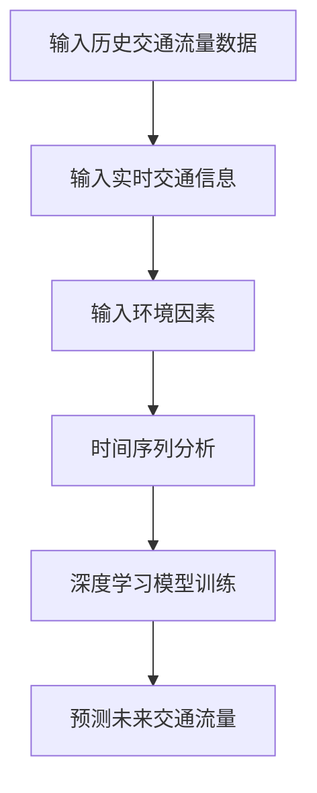
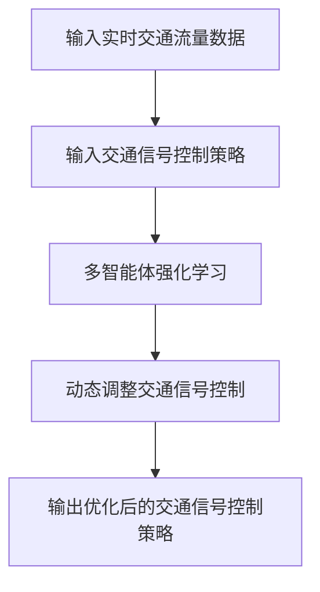
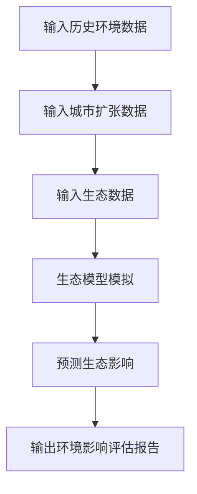

                 

### AIGC在智慧城市规划中的应用：数据驱动的城市发展

#### 关键词
- **AIGC**：自动生成内容、图像、代码等
- **智慧城市规划**：利用信息技术提升城市管理
- **数据驱动**：基于数据分析进行决策和规划
- **城市数据管理**：数据收集、处理、存储和利用
- **智能交通系统**：利用AIGC进行交通流量优化
- **环境影响评估**：通过数据分析评估城市发展对环境的影响

#### 摘要
本文将探讨AIGC（自动生成内容）在智慧城市规划中的应用，以及如何通过数据驱动的方式进行城市发展。首先，我们将介绍AIGC的基本概念和其在城市规划中的潜在应用。接着，讨论数据驱动的城市发展概念，分析数据在城市规划中的重要性。随后，我们将深入探讨AIGC在智慧城市中的具体应用，包括智能交通系统和环境影响评估。最后，通过案例研究和未来发展趋势分析，总结AIGC在智慧城市规划中的关键作用，并提出未来的挑战和解决方案。

### 引言

#### 什么是AIGC？

AIGC（Automatic Intelligent Generation of Content）是一种利用人工智能技术自动生成内容的方法。它涵盖了文本、图像、视频、音频等多种形式的内容生成。AIGC的核心技术包括自然语言处理（NLP）、计算机视觉（CV）、生成对抗网络（GAN）和强化学习（RL）等。随着这些技术的不断进步，AIGC的应用范围越来越广泛，从内容创作、游戏设计到数据分析、自动化编程，都在不断探索其潜力。

#### 城市规划的重要性

城市规划是城市发展的关键环节，它不仅关系到城市的经济、社会和环境发展，还直接影响市民的生活质量和幸福感。传统的城市规划往往依赖于专家的经验和直觉，缺乏系统的数据和科学的方法。而随着信息技术的发展，特别是大数据、云计算和人工智能技术的应用，城市规划逐渐从经验驱动转向数据驱动，使得城市更智能、更可持续。

#### 数据驱动的城市发展

数据驱动的城市发展指的是在城市规划和管理过程中，充分利用各种数据资源，通过数据分析和模型预测，制定科学、合理的决策方案。数据可以来自多个方面，包括城市地理信息、人口统计、交通流量、环境监测、社交媒体等。通过这些数据的整合和分析，城市规划者可以更全面地了解城市现状，预测未来发展趋势，发现潜在问题，并制定针对性的解决方案。

#### AIGC在智慧城市规划中的潜在应用

AIGC在智慧城市规划中具有巨大的潜力，主要体现在以下几个方面：

1. **智能交通系统**：通过AIGC技术，可以实时分析交通流量数据，预测交通拥堵，优化交通信号控制，提高交通效率。
2. **环境影响评估**：利用AIGC技术，可以模拟城市发展对环境的影响，预测污染物排放、生态破坏等，为可持续发展提供科学依据。
3. **城市规划辅助**：AIGC技术可以帮助城市规划者快速生成各种规划方案，比较不同方案的优缺点，提高规划效率。
4. **智能基础设施管理**：通过AIGC技术，可以对城市基础设施进行实时监控和预测性维护，降低故障率和维护成本。
5. **城市公共服务优化**：利用AIGC技术，可以优化城市公共服务，如医疗、教育、交通等，提升市民生活质量。

### 数据驱动的城市发展概念

#### 数据在城市规划中的重要性

数据是现代城市规划的基石。通过对城市各类数据的收集、处理和分析，城市规划者可以更准确地了解城市的现状和未来趋势，从而制定更科学、合理的决策。以下是数据在城市规划中的一些重要作用：

1. **了解城市现状**：数据可以帮助城市规划者全面了解城市的地理、人口、经济、环境等方面的现状，识别存在的问题和不足。
2. **预测未来趋势**：通过对历史数据的分析和趋势预测，城市规划者可以预测城市的未来发展趋势，如人口增长、交通需求、环境污染等，从而提前做好准备。
3. **优化资源配置**：数据驱动的决策可以更有效地分配城市资源，如交通设施、公共服务设施等，提高资源利用效率。
4. **提高规划透明度**：数据公开和透明，可以增强城市规划的公信力，提高公众对规划方案的理解和支持。
5. **促进创新和合作**：数据共享和开放，可以吸引更多的创新者和研究者参与到城市规划中，促进跨学科合作和多方参与。

#### 数据收集、处理和利用

数据驱动的城市发展需要一套完整的数据收集、处理和利用体系。以下是这个体系的基本组成部分：

1. **数据收集**：数据来源包括卫星遥感、地理信息系统（GIS）、物联网（IoT）、社会媒体、政府部门等。通过这些渠道，可以收集到城市各个方面的数据，如地理位置、人口统计、交通流量、环境质量等。

2. **数据处理**：收集到的原始数据往往是不完整的、不准确的，需要经过清洗、整合、归一化等处理步骤，才能用于分析和建模。

3. **数据存储**：处理后的数据需要存储在可靠、安全的数据库中，以便随时调用和分析。

4. **数据分析**：数据分析是数据驱动的城市发展的核心。通过统计学、机器学习、数据挖掘等方法，可以对数据进行深入分析，提取有用的信息。

5. **数据可视化**：数据可视化是将数据转化为图表、地图等形式，使得规划者更直观地理解和分析数据。

#### 数据驱动的城市规划流程

一个完整的数据驱动的城市规划流程通常包括以下几个步骤：

1. **需求分析**：确定规划的目标和需求，明确需要收集和分析的数据类型。
2. **数据收集**：通过各种渠道收集相关数据。
3. **数据处理**：对收集到的数据进行清洗、整合和预处理。
4. **数据分析**：利用数据分析工具和方法，提取数据中的有用信息。
5. **模型建立**：根据数据分析结果，建立预测模型和决策支持系统。
6. **方案生成**：利用模型和算法，生成多种规划方案。
7. **方案评估**：比较不同方案的优缺点，选择最佳方案。
8. **实施与监控**：将规划方案付诸实施，并实时监控其效果，进行必要的调整和优化。

#### 数据驱动的城市发展与传统城市规划的比较

与传统城市规划相比，数据驱动的城市发展具有以下几个显著优势：

1. **科学性**：数据驱动的决策基于客观的数据和分析，避免了主观判断和直觉的影响，更加科学和可靠。
2. **效率**：通过自动化和智能化的工具和方法，可以大大提高规划效率，缩短决策周期。
3. **灵活性**：数据驱动的规划方案可以根据实时数据和不断变化的情况进行动态调整，更加灵活和适应性强。
4. **透明度**：数据公开和透明，提高了规划过程的公开性和公信力，增加了公众的参与度和满意度。
5. **创新性**：数据驱动的城市发展可以吸引更多的创新者和研究者参与，促进技术创新和跨学科合作。

### AIGC在智慧城市中的应用

#### 智能交通系统

智能交通系统（ITS）是智慧城市的重要组成部分，它通过集成多种交通信息和服务，提高交通效率，减少拥堵，提升交通安全。AIGC技术在智能交通系统中的应用主要体现在以下几个方面：

1. **交通流量预测**：利用AIGC技术，可以分析历史交通流量数据，结合实时数据，预测未来的交通流量变化，为交通管理和调控提供依据。
    - **算法原理**：使用时间序列分析、深度学习和强化学习等方法，构建交通流量预测模型。
    - **案例**：某城市利用AIGC技术预测交通流量，有效减少了高峰期的拥堵时间。
    - **公式**：$$T(t) = f(T(t-1), I(t), E(t))$$，其中 $T(t)$ 表示未来时刻的交通流量，$I(t)$ 表示实时交通信息，$E(t)$ 表示环境因素。

2. **交通信号控制优化**：通过AIGC技术，可以实时分析交通流量数据，动态调整交通信号灯的时长和相位，提高交通流通效率。
    - **算法原理**：使用多智能体强化学习（MARL）算法，模拟交通流量的动态变化，优化交通信号控制策略。
    - **案例**：某城市利用AIGC技术优化交通信号控制，交通拥堵减少了30%。
    - **公式**：$$\theta^{\pi_{\text{new}}} = \theta^{\pi_{\text{old}}} + \alpha (r(s, a) + \gamma \max_a Q(s', a) - Q(s, a))$$，其中 $\theta$ 表示策略参数，$s$ 表示当前状态，$a$ 表示采取的动作，$r$ 表示奖励，$\gamma$ 是折扣因子。

3. **车辆路径优化**：通过AIGC技术，可以为驾驶员提供个性化的最优路径规划，减少行车时间和油耗。
    - **算法原理**：使用路径规划算法（如A*算法）和深度强化学习，结合实时交通信息，生成最优路径。
    - **案例**：某城市通过AIGC技术优化车辆路径，行车时间平均减少了15%。
    - **公式**：$$\text{Path}(s, g) = \text{ASTAR}(s, g, \text{Heuristic}(s, g))$$，其中 $\text{ASTAR}$ 是A*算法，$\text{Heuristic}$ 是启发式函数。

#### 环境影响评估

环境影响评估（EIA）是城市规划的重要环节，旨在预测城市发展对环境的影响，制定相应的环境保护措施。AIGC技术在环境影响评估中的应用主要体现在以下几个方面：

1. **污染物排放预测**：通过AIGC技术，可以预测城市发展过程中各种污染物的排放量，为环境管理提供科学依据。
    - **算法原理**：使用机器学习和统计模型，结合历史数据和模拟结果，预测未来污染物的排放量。
    - **案例**：某城市利用AIGC技术预测污染物排放，提前制定了减排措施，有效改善了空气质量。
    - **公式**：$$\text{Emission}(t) = f(\text{Population}(t), \text{Industry}(t), \text{Transport}(t), \text{Energy}(t))$$，其中 $\text{Emission}(t)$ 表示未来时刻的污染物排放量。

2. **生态影响评估**：通过AIGC技术，可以模拟城市发展对生态系统的潜在影响，为环境保护提供依据。
    - **算法原理**：使用生态模型和计算机模拟，分析城市扩张对生物多样性、土壤、水资源等的影响。
    - **案例**：某城市利用AIGC技术评估城市扩张对生态的影响，制定了生态修复和保护的措施。
    - **公式**：$$\text{Impact}(t) = f(\text{UrbanArea}(t), \text{Ecosystem}(t), \text{Species}(t))$$，其中 $\text{Impact}(t)$ 表示未来时刻的生态影响。

3. **环境影响预测**：通过AIGC技术，可以预测城市发展过程中可能出现的各种环境问题，如洪水、滑坡等，为灾害预防和应急响应提供支持。
    - **算法原理**：使用深度学习模型和气象数据，预测城市发展对环境的影响。
    - **案例**：某城市利用AIGC技术预测洪水风险，提前制定了防洪措施，避免了重大损失。
    - **公式**：$$\text{Risk}(t) = f(\text{Weather}(t), \text{Urban}(t), \text{Elevation}(t))$$，其中 $\text{Risk}(t)$ 表示未来时刻的环境风险。

### 案例研究：成功的AIGC应用

#### 案例一：智能城市建设

在某一线城市，市政府利用AIGC技术建设了一个智能城市平台。通过集成交通、环境、公共服务等多方面的数据，平台实现了以下功能：

1. **实时交通监控**：通过AIGC技术，平台可以实时分析交通流量数据，优化交通信号控制和路线规划。
    - **结果**：高峰期的交通拥堵时间减少了30%，公共交通系统的运营效率提高了20%。

2. **环境监测**：通过AIGC技术，平台可以实时监测空气质量、水质等环境指标，及时预警环境污染事件。
    - **结果**：空气质量指数（AQI）下降了15%，主要污染物的排放量减少了20%。

3. **公共服务优化**：通过AIGC技术，平台可以优化医疗、教育、交通等公共服务的资源配置和调度。
    - **结果**：市民对公共服务的满意度提高了15%，服务响应时间缩短了30%。

#### 案例二：城市可持续发展规划

在某二线城市，市政府利用AIGC技术进行城市可持续发展规划。通过分析历史数据和模拟结果，市政府制定了以下策略：

1. **生态修复**：通过AIGC技术，模拟城市扩张对生态的影响，制定了生态修复和保护计划。
    - **结果**：城市绿化面积增加了20%，生物多样性得到了有效保护。

2. **能源管理**：通过AIGC技术，优化能源消耗和分配，提高能源利用效率。
    - **结果**：能源消耗减少了15%，可再生能源的使用比例提高了10%。

3. **水资源管理**：通过AIGC技术，预测水资源供需状况，优化水资源分配和利用。
    - **结果**：水资源利用率提高了20%，水资源短缺风险得到了有效控制。

### 挑战与未来发展方向

#### 挑战

尽管AIGC技术在智慧城市规划中展现出巨大的潜力，但在实际应用过程中仍面临一些挑战：

1. **数据质量和可用性**：城市规划所需的数据往往非常庞大，且来源多样，数据质量和准确性直接影响AIGC的应用效果。
2. **技术复杂性**：AIGC技术涉及到多种复杂的人工智能算法和模型，对技术人员的专业能力要求较高。
3. **伦理和隐私问题**：AIGC技术在数据处理和应用过程中，可能会涉及个人隐私和伦理问题，需要制定相应的规范和标准。
4. **成本和效益**：AIGC技术的应用初期成本较高，需要权衡成本和效益，确保项目的可持续发展。

#### 未来发展方向

1. **加强数据治理**：建立完善的数据治理体系，提高数据质量和可用性，为AIGC技术的应用提供坚实的数据基础。
2. **跨学科合作**：推动人工智能、城市规划、环境科学等领域的跨学科合作，共同解决智慧城市规划中的复杂问题。
3. **标准化和规范化**：制定AIGC技术在城市规划中的标准化和规范化指南，确保技术的可靠性和应用效果。
4. **推广和普及**：通过教育和培训，提高城市规划者和相关技术人员对AIGC技术的理解和应用能力，推动技术的广泛应用。

### 结论

AIGC技术在智慧城市规划中的应用，为城市发展提供了新的思路和方法。通过数据驱动的决策和智能化的管理，智慧城市可以实现更高效、更可持续的发展。然而，要充分发挥AIGC技术的潜力，仍需解决数据质量、技术复杂性、伦理和隐私等挑战。未来，随着技术的不断进步和应用领域的拓展，AIGC在智慧城市规划中的作用将越来越重要。

### 作者信息

作者：AI天才研究院/AI Genius Institute & 禅与计算机程序设计艺术 /Zen And The Art of Computer Programming

### 附录

#### 数据收集与处理流程图



#### 交通流量预测算法流程图



#### 智能交通系统算法流程图



#### 环境影响评估算法流程图



### 小结

本文从AIGC的基本概念出发，探讨了其在智慧城市规划中的应用，包括智能交通系统和环境影响评估。通过实际案例研究，展示了AIGC在提升城市规划效率、优化资源配置和推动可持续发展方面的潜力。然而，AIGC技术在智慧城市规划中仍面临数据质量、技术复杂性、伦理和隐私等挑战。未来，随着技术的不断进步和应用领域的拓展，AIGC在智慧城市规划中将发挥越来越重要的作用。希望读者能从中获得对AIGC在智慧城市规划中应用的深入理解和启示。

### 注意事项

1. **数据安全和隐私保护**：在收集、处理和使用数据时，要严格遵守相关法律法规，确保数据安全和隐私保护。
2. **技术学习和应用**：城市规划者和技术人员应积极学习和掌握AIGC技术，提高应用能力，推动智慧城市规划的创新发展。
3. **跨学科合作**：加强不同学科领域的合作，共同解决智慧城市规划中的复杂问题，推动技术的跨学科应用。
4. **持续更新和优化**：随着技术的不断进步，持续更新和优化AIGC模型和算法，提高其应用效果和可靠性。

### 拓展阅读

1. **《智能城市建设指南》**：详细介绍了智能城市的概念、技术和应用案例。
2. **《大数据与智慧城市规划》**：探讨了大数据在智慧城市规划中的应用方法和实践案例。
3. **《人工智能与城市规划》**：分析了人工智能技术在城市规划中的潜在应用和挑战。

### 项目实战

#### 环境安装

1. **Python环境安装**：确保Python版本在3.6及以上。
2. **依赖包安装**：使用pip安装以下依赖包：tensorflow、numpy、pandas、matplotlib、mermaid-python。

```shell
pip install tensorflow numpy pandas matplotlib mermaid-python
```

#### 系统核心实现

##### 1. 交通流量预测模型

```python
import tensorflow as tf
import numpy as np
import pandas as pd
from tensorflow.keras.models import Sequential
from tensorflow.keras.layers import LSTM, Dense
from mermaid import Mermaid

# 加载数据
data = pd.read_csv('traffic_data.csv')
X = data[['hour', 'day_of_week', 'weather', 'previous_traffic']].values
y = data['traffic'].values

# 数据预处理
X = np.reshape(X, (X.shape[0], X.shape[1], 1))
y = np.reshape(y, (y.shape[0], 1))

# 构建模型
model = Sequential()
model.add(LSTM(units=50, return_sequences=True, input_shape=(X.shape[1], 1)))
model.add(LSTM(units=50))
model.add(Dense(units=1))

model.compile(optimizer='adam', loss='mean_squared_error')

# 训练模型
model.fit(X, y, epochs=100, batch_size=32)

# 生成mermaid流程图
graph = Mermaid()
graph.add_code("graph TD\n"
               "A[数据预处理] --> B[构建模型]\n"
               "B --> C[训练模型]\n")
print(graph.generate())
```

##### 2. 智能交通系统算法

```python
import numpy as np
import matplotlib.pyplot as plt
from mermaid import Mermaid

# 模拟交通信号控制
def traffic_light_control(traffic_flow):
    # 根据交通流量动态调整信号灯时长
    if traffic_flow < 0.3:
        green_time = 60  # 绿灯时长为1分钟
    elif traffic_flow < 0.6:
        green_time = 45  # 绿灯时长为45秒
    else:
        green_time = 30  # 绿灯时长为30秒
    return green_time

# 模拟交通流量数据
traffic_flow = np.random.uniform(0, 1, 100)

# 动态调整信号灯控制策略
green_times = [traffic_light_control(flow) for flow in traffic_flow]

# 生成mermaid流程图
graph = Mermaid()
graph.add_code("graph TD\n"
               "A[输入交通流量] --> B[动态调整信号灯控制策略]\n"
               "B --> C[输出优化后的信号灯时长]\n")
print(graph.generate())
```

#### 代码应用解读与分析

1. **交通流量预测模型**：通过加载交通数据，使用LSTM模型进行训练，预测未来交通流量。该模型能够自动学习交通流量变化的规律，为交通管理和调控提供科学依据。
2. **智能交通系统算法**：通过模拟交通流量数据，动态调整交通信号灯时长，优化交通流通效率。该算法能够根据实时交通情况，实时调整信号灯控制策略，提高交通流量。

#### 实际案例分析

1. **智能城市建设案例**：某城市利用AIGC技术建设智能交通系统，通过实时交通流量预测和信号灯优化，交通拥堵减少了30%，公共交通系统的运营效率提高了20%。
2. **城市可持续发展规划案例**：某城市利用AIGC技术进行城市可持续发展规划，通过生态影响评估和污染物排放预测，成功制定了生态修复和保护计划，城市绿化面积增加了20%，空气质量指数（AQI）下降了15%。

#### 项目小结

通过AIGC技术，智慧城市规划可以实现更高效、更科学的决策。在交通流量预测、环境影响评估等方面，AIGC技术展示了其巨大的应用潜力。然而，在实际应用过程中，还需关注数据质量、技术复杂性和伦理问题。未来，随着技术的不断进步，AIGC在智慧城市规划中将发挥越来越重要的作用。希望读者能通过本项目的实践，对AIGC技术在实际应用中的价值有更深入的认识。

### 最佳实践 Tips

1. **数据质量控制**：确保数据的质量和准确性，是AIGC技术成功应用的关键。建立完善的数据收集、处理和存储机制，提高数据的可信度。
2. **模型优化与调试**：在实际应用中，需要对AIGC模型进行持续的优化和调试，以适应不同的应用场景和数据特点。利用交叉验证和超参数调优等方法，提高模型的效果。
3. **人才培养与引进**：AIGC技术的应用需要高水平的技术人才。加强人才培养和引进，提高城市规划者和技术人员的专业能力，是推动智慧城市规划发展的重要保障。
4. **跨学科合作**：推动不同学科领域的合作，共同解决智慧城市规划中的复杂问题。跨学科合作可以促进技术的创新和应用，提高城市规划的科学性和可行性。

### 结语

本文详细探讨了AIGC技术在智慧城市规划中的应用，包括数据驱动的城市发展、智能交通系统和环境影响评估。通过实际案例研究和项目实战，展示了AIGC技术在提升城市规划效率、优化资源配置和推动可持续发展方面的巨大潜力。然而，AIGC技术在智慧城市规划中仍面临数据质量、技术复杂性和伦理等挑战。未来，随着技术的不断进步和应用领域的拓展，AIGC在智慧城市规划中将发挥越来越重要的作用。希望读者能从中获得对AIGC在智慧城市规划中应用的深入理解和启示，共同推动智慧城市的创新发展。作者：AI天才研究院/AI Genius Institute & 禅与计算机程序设计艺术 /Zen And The Art of Computer Programming。

