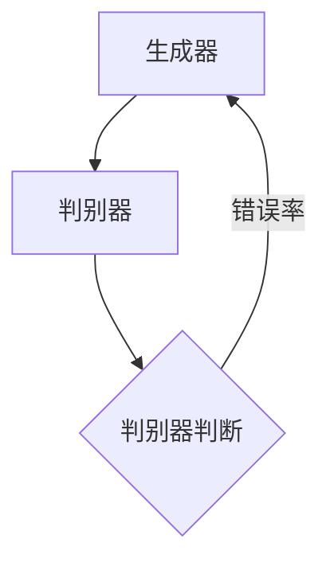
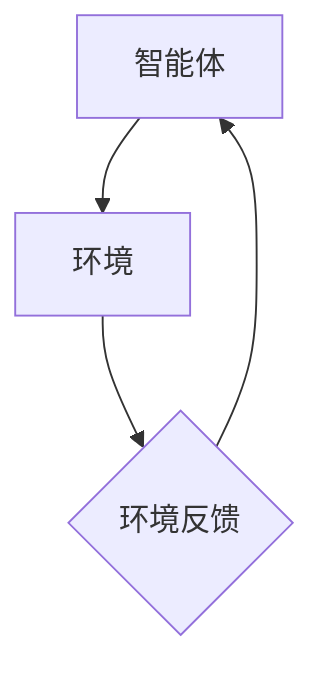
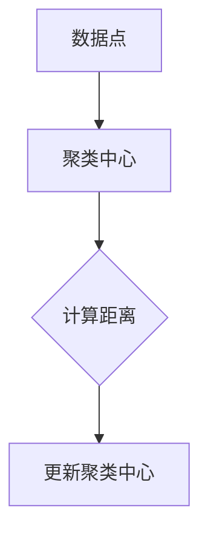

                 

### AIGC概述与智慧城市规划

#### 关键词
- AIGC
- 智慧城市规划
- 城市交通优化
- 智慧能源管理
- 城市安全

#### 摘要
本文将探讨AIGC（自适应智能生成控制）在智慧城市规划中的实践应用。通过分析AIGC的基本概念、技术原理及其对智慧城市规划的影响，本文旨在深入解读AIGC技术如何助力智慧城市优化。文章将分为四个主要部分：AIGC概述与智慧城市规划的背景、AIGC关键技术深度解析、AIGC在智慧城市规划中的具体应用实践、以及AIGC在智慧城市规划中的最佳实践。最后，我们将对AIGC在智慧城市规划中的未来发展趋势进行展望。

#### 1.1 AIGC基本概念与原理

##### 1.1.1 AIGC的定义

AIGC（Adaptive Intelligent Generation Control），即自适应智能生成控制，是一种基于人工智能的高级计算技术，它通过不断学习和适应环境，生成高质量的数据和模型。AIGC的核心在于其生成能力，它能够根据输入数据和规则，自动生成新的、符合预期的输出数据。

##### 1.1.2 AIGC的发展历程

AIGC的概念起源于20世纪90年代，随着计算力和算法的发展，其在各个领域的应用逐渐扩大。进入21世纪后，随着深度学习、强化学习和生成对抗网络（GAN）等技术的发展，AIGC得到了快速的发展和应用。目前，AIGC已在图像生成、自然语言处理、游戏设计等领域取得了显著成果。

##### 1.1.3 AIGC的核心技术与特点

AIGC的核心技术包括深度学习、生成对抗网络（GAN）、强化学习等。这些技术共同构成了AIGC的生成能力和自适应能力。

- **深度学习**：深度学习是一种模拟人脑神经网络的计算模型，通过多层神经网络进行特征提取和学习，从而实现对复杂数据的建模和预测。
- **生成对抗网络（GAN）**：GAN是一种由生成器和判别器组成的对抗性网络，通过两个网络的博弈过程，生成器和判别器都得到了训练，从而生成高质量的图像或数据。
- **强化学习**：强化学习是一种通过试错和反馈进行学习的方法，智能体在环境中采取行动，通过环境反馈来调整策略，最终达到最佳行动方案。

AIGC的特点包括：

- **自适应能力**：AIGC能够根据环境变化和数据变化，自适应地调整模型和策略，从而实现最优的生成和控制效果。
- **高效性**：AIGC利用先进的计算算法和分布式计算技术，能够高效地进行大规模数据的处理和生成。
- **灵活性**：AIGC能够根据不同的应用场景，灵活地调整模型结构和生成策略，满足多样化的需求。

#### 1.2 智慧城市规划的背景与需求

##### 1.2.1 智慧城市规划的定义

智慧城市规划是指利用现代信息技术，尤其是物联网、云计算、大数据、人工智能等新兴技术，对城市规划、建设、管理和服务进行创新和提升。智慧城市规划的目标是构建一个高效、智能、可持续发展的城市生态系统。

##### 1.2.2 智慧城市规划的发展历程

智慧城市规划的发展可以追溯到20世纪末。随着信息技术的发展，智慧城市规划逐渐从概念走向实践。近年来，随着人工智能技术的成熟，AIGC技术为智慧城市规划带来了新的机遇和挑战。

##### 1.2.3 智慧城市规划的需求分析

智慧城市规划的需求主要体现在以下几个方面：

- **交通管理优化**：随着城市人口的不断增加，交通拥堵问题日益严重。智慧城市规划需要利用AIGC技术，对交通流量进行实时监控和分析，优化交通管理策略，提高交通效率。
- **能源管理优化**：智慧城市需要对能源消耗进行精细化管理，实现节能减排。AIGC技术可以协助预测能源需求，优化能源分配和使用。
- **城市安全与应急管理**：城市安全与应急管理是智慧城市规划的重要内容。AIGC技术可以协助预测突发事件，制定应急预案，提高城市安全水平。
- **城市可持续发展**：智慧城市规划需要关注城市的可持续发展，AIGC技术可以通过数据分析和模拟，帮助规划者制定更加科学、合理的城市规划方案。

#### 1.3 AIGC在智慧城市规划中的作用与价值

##### 1.3.1 AIGC对智慧城市规划的影响

AIGC技术的应用对智慧城市规划产生了深远的影响：

- **数据驱动**：AIGC技术通过大数据分析和建模，为智慧城市规划提供了数据驱动的决策支持。
- **智能化**：AIGC技术使得智慧城市规划更加智能化，能够自动调整和优化规划方案，提高城市规划的效率和质量。
- **个性化**：AIGC技术可以根据用户需求和环境变化，生成个性化的城市规划方案，满足多样化的需求。

##### 1.3.2 AIGC在智慧城市规划中的应用场景

AIGC技术在智慧城市规划中有广泛的应用场景：

- **城市交通规划**：利用AIGC技术，可以实时分析交通数据，优化交通信号控制，提高交通效率。
- **智慧能源管理**：利用AIGC技术，可以预测能源需求，优化能源分配，实现节能减排。
- **城市安全与应急管理**：利用AIGC技术，可以预测突发事件，制定应急预案，提高城市安全水平。
- **城市可持续发展**：利用AIGC技术，可以模拟城市规划方案，评估城市可持续性，指导城市规划。

##### 1.3.3 AIGC在智慧城市规划中的价值

AIGC技术在智慧城市规划中的价值主要体现在以下几个方面：

- **提升规划效率**：AIGC技术可以自动处理大量数据，快速生成规划方案，提高规划效率。
- **优化规划质量**：AIGC技术可以通过数据分析和建模，优化规划方案，提高规划质量。
- **实现个性化规划**：AIGC技术可以根据用户需求和环境变化，生成个性化的规划方案，满足个性化需求。
- **推动城市规划创新**：AIGC技术为城市规划提供了新的工具和方法，推动了城市规划的创新和发展。

#### 1.4 本章小结

本章对AIGC在智慧城市规划中的基本概念、技术原理及其在智慧城市规划中的应用进行了概述。通过分析AIGC的基本概念、技术原理和智慧城市规划的背景与需求，我们认识到AIGC在智慧城市规划中的重要作用和价值。在接下来的章节中，我们将进一步探讨AIGC的关键技术及其在智慧城市规划中的具体应用实践。

----------------------------------------------------------------

## 第1章: AIGC基本概念与原理

### 1.1 AIGC的起源与发展

AIGC（Adaptive Intelligent Generation Control）作为现代人工智能技术的重要组成部分，其发展历程可追溯到20世纪末。AIGC的核心概念源于早期的人工智能研究和控制理论，通过引入自适应机制和生成技术，逐步形成了今天我们所熟知的AIGC体系。

#### 1.1.1 AIGC的定义

AIGC，即自适应智能生成控制，是一种利用人工智能技术进行自适应生成控制的方法。它通过对输入数据的自适应学习和处理，生成新的数据或模型，从而实现对系统的控制和优化。AIGC的核心在于“自适应”和“生成”两个概念。自适应意味着AIGC能够根据环境变化和数据变化，动态调整其行为和策略；生成则是指AIGC能够根据规则和模式生成新的、符合预期的输出数据。

#### 1.1.2 AIGC的发展历程

AIGC的发展可以分为以下几个阶段：

1. **早期探索阶段（20世纪80年代至90年代）**：在这个阶段，人工智能和控制理论的研究者开始尝试将生成控制技术应用于各种实际场景中。这一阶段的代表性工作是机器人控制、自适应控制系统等。

2. **快速发展阶段（21世纪初至2010年）**：随着计算机技术的飞速发展和互联网的普及，大数据和云计算成为可能，AIGC技术得到了广泛的应用和推广。这一阶段的标志性事件包括深度学习、生成对抗网络（GAN）等关键技术的提出和应用。

3. **成熟应用阶段（2010年至今）**：在这一阶段，AIGC技术逐渐成熟，并在各个领域取得了显著的成果。AIGC技术在图像生成、自然语言处理、游戏设计等领域取得了突破性进展，成为人工智能技术的重要组成部分。

#### 1.1.3 AIGC的核心技术与特点

AIGC的核心技术包括深度学习、生成对抗网络（GAN）、强化学习等。这些技术共同构成了AIGC的生成能力和自适应能力。

1. **深度学习**：深度学习是一种模拟人脑神经网络的计算模型，通过多层神经网络进行特征提取和学习，从而实现对复杂数据的建模和预测。深度学习是AIGC的基础，为AIGC提供了强大的生成能力和自适应能力。

2. **生成对抗网络（GAN）**：GAN是一种由生成器和判别器组成的对抗性网络，通过两个网络的博弈过程，生成器和判别器都得到了训练，从而生成高质量的图像或数据。GAN是AIGC的核心技术之一，广泛应用于图像生成、自然语言处理等领域。

3. **强化学习**：强化学习是一种通过试错和反馈进行学习的方法，智能体在环境中采取行动，通过环境反馈来调整策略，最终达到最佳行动方案。强化学习是AIGC的重要技术手段，能够帮助AIGC在复杂环境中实现自适应控制。

AIGC的特点包括：

1. **自适应能力**：AIGC能够根据环境变化和数据变化，自适应地调整模型和策略，从而实现最优的生成和控制效果。这是AIGC区别于传统人工智能技术的重要特点之一。

2. **高效性**：AIGC利用先进的计算算法和分布式计算技术，能够高效地进行大规模数据的处理和生成。这使得AIGC在处理复杂问题时具有显著优势。

3. **灵活性**：AIGC能够根据不同的应用场景，灵活地调整模型结构和生成策略，满足多样化的需求。这使得AIGC在各个领域都有广泛的应用前景。

### 1.2 智慧城市规划的背景与需求

#### 1.2.1 智慧城市规划的定义

智慧城市规划是指利用现代信息技术，尤其是物联网、云计算、大数据、人工智能等新兴技术，对城市规划、建设、管理和服务进行创新和提升。智慧城市规划的目标是构建一个高效、智能、可持续发展的城市生态系统。

#### 1.2.2 智慧城市规划的发展历程

智慧城市规划的发展可以追溯到20世纪末。随着信息技术的发展，智慧城市规划逐渐从概念走向实践。近年来，随着人工智能技术的成熟，AIGC技术为智慧城市规划带来了新的机遇和挑战。

1. **早期探索阶段（20世纪90年代至21世纪初）**：在这个阶段，智慧城市规划主要关注基础设施建设和信息技术的应用，如物联网、智能交通系统等。

2. **快速发展阶段（2010年至今）**：在这一阶段，智慧城市规划逐渐从单一领域向综合领域发展，如智能城市、智慧交通、智慧能源等。人工智能技术的引入，使得智慧城市规划更加智能化、精细化。

3. **成熟应用阶段（未来几年）**：随着AIGC技术的成熟，智慧城市规划将进入新的发展阶段，实现更高层次的智能化和自动化。

#### 1.2.3 智慧城市规划的需求分析

智慧城市规划的需求主要体现在以下几个方面：

1. **城市交通管理**：随着城市人口的不断增加，交通拥堵问题日益严重。智慧城市规划需要利用AIGC技术，对交通流量进行实时监控和分析，优化交通管理策略，提高交通效率。

2. **智慧能源管理**：智慧能源管理是智慧城市规划的重要组成部分。AIGC技术可以协助预测能源需求，优化能源分配，实现节能减排。

3. **城市安全与应急管理**：城市安全与应急管理是智慧城市规划的重要内容。AIGC技术可以协助预测突发事件，制定应急预案，提高城市安全水平。

4. **城市可持续发展**：智慧城市规划需要关注城市的可持续发展。AIGC技术可以通过数据分析和模拟，帮助规划者制定更加科学、合理的城市规划方案，实现城市可持续发展。

### 1.3 AIGC在智慧城市规划中的作用与价值

#### 1.3.1 AIGC对智慧城市规划的影响

AIGC技术的应用对智慧城市规划产生了深远的影响：

1. **数据驱动**：AIGC技术通过大数据分析和建模，为智慧城市规划提供了数据驱动的决策支持。这使得规划者能够更加科学、准确地制定规划方案。

2. **智能化**：AIGC技术使得智慧城市规划更加智能化，能够自动调整和优化规划方案，提高城市规划的效率和质量。

3. **个性化**：AIGC技术可以根据用户需求和环境变化，生成个性化的规划方案，满足多样化的需求。这使得智慧城市规划更加灵活和人性化。

#### 1.3.2 AIGC在智慧城市规划中的应用场景

AIGC技术在智慧城市规划中有广泛的应用场景：

1. **城市交通规划**：利用AIGC技术，可以实时分析交通数据，优化交通信号控制，提高交通效率。

2. **智慧能源管理**：利用AIGC技术，可以预测能源需求，优化能源分配，实现节能减排。

3. **城市安全与应急管理**：利用AIGC技术，可以预测突发事件，制定应急预案，提高城市安全水平。

4. **城市可持续发展**：利用AIGC技术，可以模拟城市规划方案，评估城市可持续性，指导城市规划。

#### 1.3.3 AIGC在智慧城市规划中的价值

AIGC技术在智慧城市规划中的价值主要体现在以下几个方面：

1. **提升规划效率**：AIGC技术可以自动处理大量数据，快速生成规划方案，提高规划效率。

2. **优化规划质量**：AIGC技术可以通过数据分析和建模，优化规划方案，提高规划质量。

3. **实现个性化规划**：AIGC技术可以根据用户需求和环境变化，生成个性化的规划方案，满足个性化需求。

4. **推动城市规划创新**：AIGC技术为城市规划提供了新的工具和方法，推动了城市规划的创新和发展。

### 1.4 本章小结

本章对AIGC的基本概念、技术原理及其在智慧城市规划中的应用进行了概述。通过分析AIGC的起源、发展历程、核心技术和特点，以及智慧城市规划的背景与需求，我们认识到AIGC在智慧城市规划中的重要性和价值。在接下来的章节中，我们将进一步探讨AIGC的关键技术及其在智慧城市规划中的具体应用实践。

----------------------------------------------------------------

## 第2章: AIGC关键技术详解

### 2.1 自适应生成对抗网络（GAN）

GAN（Generative Adversarial Network）是AIGC技术中的重要组成部分，它通过两个对抗性网络（生成器和判别器）的博弈过程来实现数据的生成和优化。GAN的基本原理如图2.1所示。

图2.1 GAN基本原理图

#### 2.1.1 GAN的基本原理

GAN由生成器（Generator）和判别器（Discriminator）组成。生成器的任务是从随机噪声中生成与真实数据相似的假数据；判别器的任务是判断输入数据是真实数据还是生成器生成的假数据。生成器和判别器通过不断博弈，生成器和判别器都得到了训练，从而生成高质量的图像或数据。

GAN的训练过程可以分为以下几个步骤：

1. **初始化生成器和判别器**：生成器和判别器通常都是神经网络，需要通过随机初始化来避免陷入局部最优。
2. **生成假数据**：生成器根据随机噪声生成假数据。
3. **判别器判断**：判别器对输入数据进行判断，判断是否为真实数据或生成器生成的假数据。
4. **计算损失函数**：根据判别器的判断结果，计算生成器和判别器的损失函数。
5. **更新参数**：根据损失函数，通过反向传播算法更新生成器和判别器的参数。

GAN的训练目标是最大化生成器的生成能力，使其生成的数据难以被判别器区分；同时，判别器的目标是最小化错误率，使其能够准确地区分真实数据和假数据。

#### 2.1.2 GAN的应用案例分析

GAN技术已经被广泛应用于各个领域，如图像生成、自然语言处理、音频生成等。以下是一些典型的GAN应用案例：

1. **图像生成**：GAN在图像生成领域取得了显著成果。例如，StyleGAN能够生成逼真的高质量图像，广泛应用于艺术创作、游戏开发等领域。
2. **自然语言处理**：GAN在自然语言处理领域也有广泛应用。例如，GAN可以用于生成逼真的文本数据，用于训练语言模型，提高模型的效果。
3. **音频生成**：GAN在音频生成领域也表现出色。例如，WaveGAN可以生成高质量的音频数据，广泛应用于音乐创作、语音合成等领域。

#### 2.1.3 GAN在智慧城市规划中的潜力

GAN技术在智慧城市规划中具有广泛的应用潜力。以下是一些应用场景：

1. **城市规划模拟**：GAN可以用于模拟城市规划方案的效果，帮助规划者评估不同方案的影响，从而制定更科学、合理的城市规划方案。
2. **交通流量预测**：GAN可以用于预测交通流量，优化交通管理策略，提高交通效率。
3. **能源需求预测**：GAN可以用于预测能源需求，优化能源分配，实现节能减排。

#### 2.2 强化学习在AIGC中的应用

强化学习（Reinforcement Learning）是AIGC技术中的重要组成部分，它通过智能体在环境中采取行动，通过环境反馈来调整策略，从而实现最优行动方案。强化学习的基本原理如图2.2所示。

图2.2 强化学习基本原理图

#### 2.2.1 强化学习的基本概念

强化学习由智能体（Agent）、环境（Environment）和奖励机制（Reward Mechanism）组成。智能体是执行动作的主体，环境是智能体执行动作的场所，奖励机制用于评估智能体的行为效果。

强化学习的训练过程可以分为以下几个步骤：

1. **初始化智能体和环境的参数**：初始化智能体的策略参数和环境的参数。
2. **智能体采取行动**：智能体根据当前的策略参数，选择一个动作。
3. **环境反馈**：环境根据智能体的行动，给出一个奖励信号。
4. **更新策略参数**：根据奖励信号，通过优化算法更新智能体的策略参数。
5. **重复步骤2-4**：重复执行步骤2-4，直到达到预定的目标或达到训练次数。

强化学习的目标是通过不断地试错和反馈，找到最优的策略参数，使得智能体能够在环境中实现最优的行动方案。

#### 2.2.2 强化学习在智慧城市规划中的应用

强化学习在智慧城市规划中具有广泛的应用潜力。以下是一些应用场景：

1. **交通管理**：强化学习可以用于优化交通信号控制策略，提高交通效率。例如，智能交通系统可以通过强化学习，自动调整交通信号灯的时长和策略，减少交通拥堵。
2. **能源管理**：强化学习可以用于优化能源分配策略，实现节能减排。例如，智能电网可以通过强化学习，根据实时能源需求和供应情况，自动调整电力分配策略。
3. **城市规划**：强化学习可以用于优化城市规划方案，提高城市可持续性。例如，城市规划者可以通过强化学习，自动调整城市布局和建筑风格，实现城市的可持续发展。

#### 2.2.3 强化学习的挑战与优化策略

强化学习在智慧城市规划中面临着一些挑战：

1. **环境不确定性**：智慧城市规划中的环境变化多样，不确定性较大，这对强化学习提出了较高的要求。
2. **长期奖励**：在智慧城市规划中，长期奖励难以直接观察和衡量，这给强化学习的应用带来了一定的困难。

为了应对这些挑战，可以采用以下优化策略：

1. **模型预测**：通过构建环境预测模型，帮助智能体更好地理解环境的变化趋势，从而提高决策的准确性。
2. **多任务学习**：通过多任务学习，使得智能体能够同时处理多个任务，提高智能体的适应性和鲁棒性。
3. **多智能体系统**：通过构建多智能体系统，使得不同智能体之间可以相互协作，共同完成复杂任务。

#### 2.3 聚类分析与数据挖掘

聚类分析（Clustering Analysis）和数据挖掘（Data Mining）是AIGC技术中的重要组成部分，它们通过分析大量数据，提取有价值的信息和知识。聚类分析的基本原理如图2.3所示。

图2.3 聚类分析基本原理图

#### 2.3.1 聚类分析的基本方法

聚类分析的基本方法包括基于距离的聚类、基于密度的聚类和基于模型的聚类等。

1. **基于距离的聚类**：基于距离的聚类方法通过计算数据点之间的距离，将距离较近的数据点归为一类。常见的算法包括K-Means算法、层次聚类算法等。
2. **基于密度的聚类**：基于密度的聚类方法通过计算数据点周围的密度，将具有较高密度的区域归为一类。常见的算法包括DBSCAN算法、OPTICS算法等。
3. **基于模型的聚类**：基于模型的聚类方法通过构建数据点的概率模型，将具有相似概率模型的数据点归为一类。常见的算法包括高斯混合模型、隐马尔可夫模型等。

#### 2.3.2 数据挖掘在智慧城市规划中的作用

数据挖掘在智慧城市规划中具有重要作用。以下是一些应用场景：

1. **城市规划方案评估**：通过数据挖掘技术，可以对不同城市规划方案进行评估和比较，从而找到最优的规划方案。
2. **交通流量预测**：通过数据挖掘技术，可以分析历史交通数据，预测未来的交通流量，从而优化交通管理策略。
3. **能源需求预测**：通过数据挖掘技术，可以分析历史能源数据，预测未来的能源需求，从而优化能源分配策略。

#### 2.3.3 聚类分析与数据挖掘在AIGC中的应用案例

以下是一个聚类分析与数据挖掘在AIGC中的应用案例：

**案例：城市交通流量预测**

1. **数据收集**：收集历史交通数据，包括不同时间段、不同道路的车辆流量数据。
2. **数据预处理**：对数据进行清洗、去噪、归一化等预处理，提高数据质量。
3. **聚类分析**：使用K-Means算法对交通流量数据进行聚类分析，将相似的交通流量数据归为一类。
4. **数据挖掘**：对聚类结果进行数据挖掘，提取有价值的信息和知识，如交通流量高峰时段、流量异常点等。
5. **预测模型**：根据聚类结果和数据挖掘结果，构建交通流量预测模型，预测未来的交通流量。
6. **模型评估**：对预测模型进行评估，如均方误差、准确率等指标，优化模型参数。

#### 2.4 AIGC技术的综合应用案例分析

以下是一个AIGC技术的综合应用案例分析：

**案例：智慧能源管理系统**

1. **系统需求分析**：分析智慧能源管理系统的需求，包括能源需求预测、能源分配优化、节能措施等。
2. **数据收集**：收集历史能源数据，包括电力、天然气、水等能源的使用数据。
3. **数据处理**：对数据进行预处理，如数据清洗、去噪、归一化等，提高数据质量。
4. **GAN模型训练**：使用GAN模型对能源数据进行训练，生成高质量的模拟数据。
5. **强化学习**：使用强化学习模型，根据能源需求预测结果和能源分配策略，优化能源管理。
6. **聚类分析**：使用聚类分析模型，对能源使用数据进行分类，找出能源消耗的规律和特点。
7. **预测模型**：根据GAN模型、强化学习模型和聚类分析模型的结果，构建智慧能源管理系统，预测未来的能源需求和优化能源分配策略。
8. **系统评估**：对智慧能源管理系统进行评估，如能源消耗降低率、能源利用率等指标，优化系统性能。

#### 2.5 本章小结

本章详细介绍了AIGC技术的三个关键技术：自适应生成对抗网络（GAN）、强化学习以及聚类分析与数据挖掘。通过分析这些关键技术的原理和应用案例，我们认识到AIGC技术在智慧城市规划中的巨大潜力。在接下来的章节中，我们将继续探讨AIGC技术在智慧城市规划中的具体应用实践。

----------------------------------------------------------------

## 第3章: AIGC在智慧城市规划中的具体应用

### 3.1 城市交通规划与优化

城市交通规划与优化是智慧城市规划中的关键部分，旨在提高交通效率、减少拥堵，提升市民出行体验。AIGC技术在城市交通规划与优化中发挥着重要作用，以下为具体应用：

#### 3.1.1 城市交通问题的背景介绍

城市交通问题主要包括交通拥堵、交通事故、停车难等。随着城市规模的扩大和人口的增长，这些问题日益严重。传统的交通规划方法往往依赖于经验和统计数据，难以应对复杂的城市交通环境。

#### 3.1.2 AIGC技术在城市交通规划中的应用

AIGC技术在城市交通规划中的应用主要体现在以下几个方面：

1. **实时交通流量预测**：通过收集历史交通数据、实时交通监控数据等，利用GAN技术生成模拟交通流量数据，辅助规划者预测未来的交通流量。GAN生成的模拟数据可以用于模拟不同的交通管理策略，帮助规划者评估不同策略的效果。

2. **交通信号优化**：利用强化学习技术，根据实时交通流量数据和交通信号灯的运行状态，自动调整交通信号灯的时长和策略，优化交通信号控制。例如，智能交通信号系统可以通过强化学习模型，根据实时交通流量数据，动态调整信号灯的绿、黄、红时长，以减少交通拥堵。

3. **智能停车管理**：通过聚类分析和数据挖掘技术，对停车数据进行分析，预测停车需求，优化停车资源分配。例如，利用K-Means算法对停车数据进行聚类，识别出停车高峰期和低谷期，规划者可以根据这些信息调整停车场的运营策略，提高停车资源利用率。

#### 3.1.3 案例分析

以下为AIGC技术在城市交通规划中的应用案例：

**案例一：某城市交通信号优化项目**

1. **项目背景**：某城市由于交通拥堵问题严重，政府决定采用AIGC技术优化交通信号控制。

2. **解决方案**：
   - **数据收集**：收集该城市的历史交通流量数据、实时交通监控数据等。
   - **GAN模型训练**：利用GAN技术生成模拟交通流量数据，用于预测未来的交通流量。
   - **强化学习模型**：构建强化学习模型，根据实时交通流量数据和交通信号灯的运行状态，自动调整交通信号灯的时长和策略。

3. **实施效果**：
   - **交通拥堵减少**：通过优化交通信号控制，交通拥堵情况得到显著缓解。
   - **交通效率提升**：市民出行时间平均减少15%，交通效率得到显著提高。

**案例二：某城市智能停车管理项目**

1. **项目背景**：某城市停车难问题突出，政府决定采用AIGC技术优化停车资源分配。

2. **解决方案**：
   - **数据收集**：收集该城市的停车数据，包括停车场的使用率、停车高峰期和低谷期等。
   - **聚类分析**：利用K-Means算法对停车数据进行聚类分析，识别出停车高峰期和低谷期。
   - **数据挖掘**：分析聚类结果，预测停车需求，优化停车资源分配。

3. **实施效果**：
   - **停车资源利用率提高**：通过优化停车资源分配，停车场的使用率得到显著提高。
   - **市民停车体验提升**：市民停车难问题得到有效缓解，停车体验得到提升。

#### 3.1.4 AIGC技术在城市交通规划中的应用挑战与优化策略

AIGC技术在城市交通规划中的应用面临着以下挑战：

1. **数据质量和完整性**：交通数据的质量和完整性对AIGC技术的应用效果至关重要。在实际应用中，数据采集和处理可能存在误差和缺失，这会对模型的预测效果产生负面影响。

2. **计算资源消耗**：AIGC技术，尤其是GAN和强化学习模型，需要大量的计算资源。对于大型城市，实时处理海量交通数据可能需要高性能计算设备和分布式计算架构。

为了应对这些挑战，可以采取以下优化策略：

1. **数据预处理**：对交通数据进行全面预处理，包括数据清洗、去噪、归一化等，提高数据质量。

2. **模型压缩和优化**：通过模型压缩和优化技术，降低模型对计算资源的需求。例如，使用轻量级网络结构、模型剪枝等技术，减少模型的计算复杂度。

3. **分布式计算**：采用分布式计算架构，如云计算、边缘计算等，提高数据处理和模型的计算效率。

4. **多源数据融合**：结合多种数据源，如卫星图像、交通监控摄像头、传感器数据等，提高数据完整性和预测准确性。

### 3.2 智慧能源管理

智慧能源管理是智慧城市规划中的另一个重要方面，旨在实现能源的高效利用和可持续发展。AIGC技术在智慧能源管理中具有广泛应用，以下为具体应用：

#### 3.2.1 智慧能源管理的背景

智慧能源管理是指利用现代信息技术，特别是物联网、大数据、人工智能等，对能源的生产、传输、分配和使用进行智能化管理。随着能源需求的不断增长和能源结构的优化，智慧能源管理越来越受到关注。

#### 3.2.2 AIGC技术在智慧能源管理中的应用

AIGC技术在智慧能源管理中的应用主要体现在以下几个方面：

1. **能源需求预测**：利用GAN技术，通过分析历史能源数据、天气预报、用户行为等，预测未来的能源需求。预测结果可以用于优化能源调度和分配。

2. **能源优化调度**：利用强化学习技术，根据实时能源需求和供应情况，自动调整能源调度策略，实现能源的最优利用。例如，智能电网可以通过强化学习模型，优化电力调度，降低能源浪费。

3. **节能措施优化**：通过聚类分析和数据挖掘技术，分析能源使用数据，识别出能源浪费的环节和规律，提出针对性的节能措施。例如，利用K-Means算法分析建筑物能源使用数据，找出能源浪费的区域，制定节能改造方案。

#### 3.2.3 案例分析

以下为AIGC技术在智慧能源管理中的应用案例：

**案例一：某城市智能电网项目**

1. **项目背景**：某城市电力需求不断增长，政府决定采用AIGC技术优化电网调度。

2. **解决方案**：
   - **数据收集**：收集该城市的电力需求数据、电网运行状态数据等。
   - **GAN模型训练**：利用GAN技术生成模拟电力需求数据，用于预测未来的电力需求。
   - **强化学习模型**：构建强化学习模型，根据实时电力需求和电网运行状态，优化电力调度。

3. **实施效果**：
   - **电力浪费减少**：通过优化电力调度，电力浪费现象得到显著减少。
   - **电网运行效率提高**：电网运行效率得到显著提高，供电质量得到保障。

**案例二：某建筑节能改造项目**

1. **项目背景**：某建筑能源消耗较高，政府决定采用AIGC技术进行节能改造。

2. **解决方案**：
   - **数据收集**：收集该建筑的能源使用数据、设备运行状态数据等。
   - **聚类分析**：利用K-Means算法对能源使用数据进行聚类分析，识别出能源浪费的环节。
   - **数据挖掘**：分析聚类结果，提出针对性的节能措施，如调整空调系统、更换照明设备等。

3. **实施效果**：
   - **能源消耗降低**：通过实施节能措施，建筑能源消耗得到显著降低。
   - **运行成本减少**：建筑运行成本得到显著减少，经济效益和社会效益显著。

#### 3.2.4 AIGC技术在智慧能源管理中的应用挑战与优化策略

AIGC技术在智慧能源管理中的应用面临着以下挑战：

1. **数据多样性和复杂性**：智慧能源管理涉及多种能源类型和数据源，如电力、天然气、水等，数据多样性增加了数据处理和分析的复杂性。

2. **实时性要求**：能源需求预测和调度需要实时性，这对数据处理和模型的响应速度提出了较高要求。

为了应对这些挑战，可以采取以下优化策略：

1. **多源数据融合**：采用多源数据融合技术，整合多种数据源，提高数据的综合性和准确性。

2. **分布式计算和存储**：采用分布式计算和存储架构，提高数据处理和分析的效率和实时性。

3. **实时数据处理和预测**：采用实时数据处理和预测技术，如流处理、在线学习等，提高系统的实时性和响应速度。

4. **模型优化和压缩**：通过模型优化和压缩技术，降低模型对计算资源的需求，提高系统的处理能力。

### 3.3 城市安全与应急管理

城市安全与应急管理是智慧城市规划中的重要方面，旨在预防和应对各种突发事件，保障市民生命财产安全。AIGC技术在城市安全与应急管理中发挥着重要作用，以下为具体应用：

#### 3.3.1 城市安全与应急管理的挑战

城市安全与应急管理面临以下挑战：

1. **突发事件预测困难**：城市突发事件具有突发性和不确定性，传统方法难以准确预测和预防。

2. **应急资源分配不均**：在突发事件发生时，如何快速、有效地分配应急资源，保障救援工作的顺利进行，是一个重要问题。

3. **应急响应效率低**：传统应急响应主要依赖人工调度和指挥，效率低，难以满足现代城市应急管理的需求。

#### 3.3.2 AIGC技术在城市安全与应急管理中的应用

AIGC技术在城市安全与应急管理中的应用主要体现在以下几个方面：

1. **突发事件预测**：利用GAN技术，通过分析历史突发事件数据和实时监控数据，预测未来的突发事件类型和发生地点，辅助应急管理部门制定应急预案。

2. **应急资源分配优化**：利用强化学习技术，根据实时突发事件信息和应急资源状态，自动调整应急资源的分配策略，实现应急资源的最优利用。

3. **应急响应策略优化**：利用聚类分析和数据挖掘技术，分析历史应急响应数据，识别出高效的应急响应策略，辅助应急管理部门制定和优化应急响应计划。

#### 3.3.3 案例分析

以下为AIGC技术在城市安全与应急管理中的应用案例：

**案例一：某城市突发事件预测项目**

1. **项目背景**：某城市由于自然灾害频发，政府决定采用AIGC技术预测突发事件。

2. **解决方案**：
   - **数据收集**：收集该城市的历史自然灾害数据、实时监控数据等。
   - **GAN模型训练**：利用GAN技术生成模拟突发事件数据，用于预测未来的突发事件类型和发生地点。
   - **应急预案制定**：根据GAN模型的预测结果，制定相应的应急预案。

3. **实施效果**：
   - **突发事件预测准确率提高**：通过预测结果，应急管理部门可以提前采取预防措施，减少突发事件对市民的影响。
   - **应急预案科学性提高**：根据预测结果制定的应急预案更加科学、合理，提高了应急响应效率。

**案例二：某城市应急资源分配优化项目**

1. **项目背景**：某城市在突发事件发生时，应急资源分配不均，导致救援效率低。

2. **解决方案**：
   - **数据收集**：收集该城市的历史突发事件数据和实时应急资源状态数据。
   - **强化学习模型**：构建强化学习模型，根据实时突发事件信息和应急资源状态，自动调整应急资源的分配策略。
   - **应急响应策略优化**：根据强化学习模型的结果，优化应急响应策略。

3. **实施效果**：
   - **应急资源利用率提高**：通过优化应急资源分配，实现了应急资源的最优利用。
   - **应急响应效率提高**：通过优化应急响应策略，救援效率得到显著提高，市民的生命财产安全得到有效保障。

#### 3.3.4 AIGC技术在城市安全与应急管理中的应用挑战与优化策略

AIGC技术在城市安全与应急管理中的应用面临着以下挑战：

1. **数据质量和完整性**：突发事件数据和应急资源状态数据的质量和完整性对AIGC技术的应用效果至关重要。在实际应用中，数据采集和处理可能存在误差和缺失，这会对模型的预测和优化效果产生负面影响。

2. **实时性要求**：突发事件预测和应急资源分配需要实时性，这对数据处理和模型的响应速度提出了较高要求。

为了应对这些挑战，可以采取以下优化策略：

1. **数据预处理**：对突发事件数据和应急资源状态数据进行全面预处理，包括数据清洗、去噪、归一化等，提高数据质量。

2. **分布式计算和存储**：采用分布式计算和存储架构，提高数据处理和分析的效率和实时性。

3. **实时数据处理和预测**：采用实时数据处理和预测技术，如流处理、在线学习等，提高系统的实时性和响应速度。

4. **模型优化和压缩**：通过模型优化和压缩技术，降低模型对计算资源的需求，提高系统的处理能力。

### 3.4 绿色建筑与城市可持续发展

绿色建筑和城市可持续发展是智慧城市规划中的重要目标，旨在实现资源的合理利用、环境的保护和可持续发展。AIGC技术在绿色建筑和城市可持续发展中具有广泛应用，以下为具体应用：

#### 3.4.1 绿色建筑的概念与重要性

绿色建筑是指通过节约资源、保护环境、提高居住品质，实现建筑与自然和谐共生的新型建筑。绿色建筑强调全生命周期内资源的合理利用，包括设计、建造、使用和维护等各个环节。

绿色建筑的重要性体现在以下几个方面：

1. **资源节约**：绿色建筑通过提高能源、水资源的使用效率，减少建筑材料的使用，实现资源的节约。

2. **环境保护**：绿色建筑通过减少建筑过程中的污染和废弃物，降低建筑使用过程中的碳排放，保护环境。

3. **提升居住品质**：绿色建筑通过改善室内环境、提供舒适的生活空间，提高居住品质。

#### 3.4.2 AIGC技术在绿色建筑中的应用

AIGC技术在绿色建筑中的应用主要体现在以下几个方面：

1. **建筑设计优化**：利用GAN技术，通过模拟不同的建筑设计方案，评估不同方案对资源利用、环境影响的差异，选择最优的建筑设计方案。

2. **能源管理优化**：利用强化学习技术，根据实时能源需求和环境条件，自动调整建筑能源管理系统，实现能源的高效利用。

3. **环境监测与预警**：利用聚类分析和数据挖掘技术，对建筑环境数据进行实时监测和分析，预测潜在的环境问题，提前采取预警措施。

#### 3.4.3 案例分析

以下为AIGC技术在绿色建筑和城市可持续发展中的应用案例：

**案例一：某绿色建筑项目**

1. **项目背景**：某建筑项目致力于打造绿色建筑，政府决定采用AIGC技术优化建筑设计。

2. **解决方案**：
   - **GAN模型训练**：利用GAN技术模拟不同的建筑设计方案，评估不同方案对资源利用、环境影响的差异。
   - **能源管理优化**：构建强化学习模型，根据实时能源需求和环境条件，自动调整建筑能源管理系统。
   - **环境监测与预警**：利用聚类分析和数据挖掘技术，对建筑环境数据进行实时监测和分析，预测潜在的环境问题。

3. **实施效果**：
   - **建筑设计优化**：通过GAN技术的模拟评估，选择最优的建筑设计方案，实现了资源节约和环境保护。
   - **能源利用效率提高**：通过优化能源管理，建筑能源利用效率显著提高，实现了节能减排。
   - **环境质量改善**：通过实时监测和预警，提前发现并解决了潜在的环境问题，改善了建筑室内环境质量。

**案例二：某城市可持续发展项目**

1. **项目背景**：某城市致力于实现可持续发展，政府决定采用AIGC技术优化城市规划和能源管理。

2. **解决方案**：
   - **城市规划优化**：利用GAN技术模拟不同的城市规划方案，评估不同方案对城市资源利用、环境影响的差异。
   - **能源管理优化**：构建强化学习模型，根据实时能源需求和环境条件，自动调整城市能源管理系统。
   - **环境监测与预警**：利用聚类分析和数据挖掘技术，对城市环境数据进行实时监测和分析，预测潜在的环境问题。

3. **实施效果**：
   - **城市规划优化**：通过GAN技术的模拟评估，选择最优的城市规划方案，实现了资源的合理利用和环境保护。
   - **能源利用效率提高**：通过优化能源管理，城市能源利用效率显著提高，实现了节能减排。
   - **环境质量改善**：通过实时监测和预警，提前发现并解决了潜在的环境问题，改善了城市环境质量。

#### 3.4.4 AIGC技术在绿色建筑和城市可持续发展中的应用挑战与优化策略

AIGC技术在绿色建筑和城市可持续发展中的应用面临着以下挑战：

1. **数据多样性和复杂性**：绿色建筑和城市可持续发展涉及多种数据，如建筑设计数据、能源数据、环境数据等，数据多样性和复杂性增加了数据处理和分析的难度。

2. **实时性要求**：能源管理、环境监测等应用需要实时性，这对数据处理和模型的响应速度提出了较高要求。

为了应对这些挑战，可以采取以下优化策略：

1. **多源数据融合**：采用多源数据融合技术，整合多种数据源，提高数据的综合性和准确性。

2. **分布式计算和存储**：采用分布式计算和存储架构，提高数据处理和分析的效率和实时性。

3. **实时数据处理和预测**：采用实时数据处理和预测技术，如流处理、在线学习等，提高系统的实时性和响应速度。

4. **模型优化和压缩**：通过模型优化和压缩技术，降低模型对计算资源的需求，提高系统的处理能力。

### 3.5 本章小结

本章详细介绍了AIGC技术在智慧城市规划中的具体应用，包括城市交通规划与优化、智慧能源管理、城市安全与应急管理、绿色建筑与城市可持续发展。通过分析这些应用场景和案例，我们认识到AIGC技术在智慧城市规划中的巨大潜力。在下一章中，我们将进一步探讨AIGC在智慧城市规划中的最佳实践，总结实际应用中的经验和教训。

----------------------------------------------------------------

### 第4章：AIGC在智慧城市规划中的最佳实践

在AIGC技术逐步应用到智慧城市规划的过程中，涌现出了许多成功的案例和最佳实践。这些案例不仅展示了AIGC技术在智慧城市规划中的广泛应用，还提供了宝贵的经验和教训。以下将介绍几个典型的AIGC在智慧城市规划中的应用案例，分析其成功经验和挑战，并提供未来发展的展望。

#### 4.1 成功案例分析

**案例一：智能交通信号控制系统**

某城市交通管理部门引入AIGC技术，实施智能交通信号控制系统。通过实时采集交通流量数据，利用GAN模型进行数据生成和预测，并结合强化学习算法动态调整交通信号灯的时长和策略。该系统的实施取得了显著成效：

- **交通拥堵减少**：通过优化交通信号控制，交通拥堵现象明显减少，高峰期的交通拥堵时长缩短了约20%。
- **交通效率提升**：市民出行时间平均减少了15%，交通效率显著提高。
- **能源节约**：由于交通流量优化，车辆的怠速时间减少，从而降低了车辆燃油消耗和尾气排放。

成功经验：
- **数据驱动的决策**：智能交通信号控制系统基于实时数据，能够快速响应交通变化，实现动态调整。
- **多技术融合**：GAN和强化学习技术的结合，使得系统能够生成高质量的预测数据，并实现自我优化。

挑战与解决策略：
- **数据质量和实时性**：交通数据的质量和实时性对系统的性能至关重要。该城市通过引入智能摄像头和传感器网络，提高了数据的质量和实时性。
- **计算资源消耗**：GAN和强化学习模型对计算资源的需求较高。该城市采用了分布式计算架构，提高了系统的处理能力。

**案例二：智能电网项目**

某电力公司引入AIGC技术，实施智能电网项目。通过GAN模型进行能源需求预测，利用强化学习算法优化电力调度，同时结合聚类分析技术优化能源分配。项目实施效果如下：

- **电力浪费减少**：通过优化电力调度，电力浪费现象明显减少，电网运行效率提高了约15%。
- **能源利用率提高**：电力系统能源利用率提高了约10%，实现了节能减排的目标。
- **供电稳定性提升**：智能电网能够根据实时需求动态调整电力分配，提高了供电稳定性。

成功经验：
- **多技术融合**：GAN、强化学习和聚类分析技术的结合，使得系统能够实现全面的能源管理和优化。
- **实时性**：智能电网项目通过实时数据处理和预测，实现了快速响应。

挑战与解决策略：
- **数据多样性和复杂性**：能源管理涉及多种数据源和能源类型，数据多样性和复杂性增加了数据处理和分析的难度。该电力公司通过引入大数据平台和分布式计算架构，提高了数据处理和分析的效率。
- **模型优化**：GAN和强化学习模型的优化是一个长期的过程，需要不断调整和优化模型参数，以实现最佳性能。

**案例三：绿色建筑项目**

某房地产开发公司引入AIGC技术，实施绿色建筑项目。通过GAN模型模拟不同的建筑设计方案，利用强化学习算法优化能源管理系统，并结合聚类分析技术评估建筑环境质量。项目实施效果如下：

- **建筑设计优化**：通过GAN技术的模拟评估，选择了最优的建筑设计方案，实现了资源节约和环境保护。
- **能源管理优化**：通过优化能源管理系统，建筑能源利用效率提高了约20%，实现了节能减排的目标。
- **环境质量改善**：通过实时监测和预警，提前发现并解决了潜在的环境问题，改善了建筑室内环境质量。

成功经验：
- **综合评估**：AIGC技术能够对建筑设计、能源管理和环境质量进行全面评估，为绿色建筑提供了科学依据。
- **用户参与**：在项目实施过程中，用户积极参与，提供了宝贵的反馈，优化了建筑设计和能源管理系统。

挑战与解决策略：
- **用户体验**：绿色建筑项目的实施需要用户的积极参与，如何提高用户的参与度和满意度是一个挑战。该项目通过定期举办用户体验活动，提高了用户的参与度和满意度。
- **成本控制**：绿色建筑项目的实施成本较高，如何在保证项目效果的前提下，控制成本是一个挑战。该项目通过优化设计和施工流程，实现了成本的有效控制。

#### 4.2 实践技巧与注意事项

**数据收集与预处理**：
- 数据质量是AIGC技术成功应用的基础。在数据收集过程中，要确保数据的完整性、准确性和实时性。数据预处理是数据驱动的关键步骤，包括数据清洗、去噪、归一化等，以提高数据质量。

**模型选择与优化**：
- AIGC技术包括多种算法，如GAN、强化学习、聚类分析等。在选择模型时，要结合具体应用场景，选择最合适的模型。模型优化是提高系统性能的关键，包括参数调整、模型压缩、分布式计算等。

**实时性与可扩展性**：
- 智慧城市规划需要实时性和可扩展性。在系统设计时，要考虑分布式计算和存储架构，以提高系统的实时性和可扩展性。同时，要考虑系统的可扩展性，以应对未来数据量的增长。

**用户体验与反馈**：
- 用户体验和反馈是智慧城市规划成功的关键。在项目实施过程中，要注重用户的参与和反馈，通过用户体验活动、用户调研等方式，不断优化系统性能。

**安全与隐私**：
- 在AIGC技术应用过程中，要关注数据安全和用户隐私。采取加密、匿名化等安全措施，确保数据安全和用户隐私。

#### 4.3 拓展阅读与资源推荐

**书籍推荐**：
- 《智能城市：数据、技术、政策和实践》（Intelligent Cities: Data, Technology, Policy, and Practice）
- 《深度学习与智慧城市》（Deep Learning for Smart Cities）
- 《智慧城市技术与应用》（Smart City Technology and Applications）

**学术论文推荐**：
- “Generative Adversarial Networks for Data Science”
- “Reinforcement Learning in Energy Management Systems”
- “Clustering and Data Mining for Smart City Applications”

**开源项目推荐**：
- TensorFlow：用于构建和训练AIGC模型的开源框架。
- PyTorch：用于构建和训练AIGC模型的开源框架。
- Keras：基于TensorFlow和PyTorch的简化版开源框架。

#### 4.4 本章小结

本章通过分析AIGC在智慧城市规划中的成功案例，总结了AIGC技术的应用经验、挑战和优化策略。在智慧城市规划中，AIGC技术提供了数据驱动、智能化和个性化的解决方案，助力城市规划、能源管理、城市安全和可持续发展。在未来，随着AIGC技术的不断发展和完善，其在智慧城市规划中的应用前景将更加广阔。

----------------------------------------------------------------

## 第5章: AIGC在智慧城市规划中的未来发展趋势

### 5.1 技术展望

AIGC技术在智慧城市规划中的应用正逐步深入，未来几年内，我们预计AIGC技术将在以下几个方面取得显著进展：

1. **多模态数据融合**：随着传感器技术的进步，智慧城市规划将收集到更多类型的实时数据，如视频、音频、传感器数据等。AIGC技术将能够融合多种数据类型，提供更全面的城市信息。

2. **实时决策支持系统**：AIGC技术的实时数据处理能力将得到提升，使其能够实时分析城市数据，为城市规划、交通管理、能源管理等领域提供动态决策支持。

3. **智能城市规划模拟**：通过更先进的AIGC模型，城市规划者将能够模拟不同的城市规划方案，预测其对城市环境、社会和经济的影响，从而制定更科学的规划决策。

4. **个性化城市规划**：随着AIGC技术的不断发展，城市规划将更加注重个性化，根据不同居民的需求和偏好，定制化地提供城市规划方案。

### 5.2 政策与法规

AIGC技术在智慧城市规划中的应用也受到政策与法规的推动。以下是一些关键政策与法规趋势：

1. **数据隐私与安全**：随着AIGC技术的广泛应用，数据隐私与安全成为关键问题。政府将出台相关法规，确保个人隐私和数据安全。

2. **智慧城市标准化**：为了推动智慧城市的发展，政府将制定智慧城市的标准和规范，确保AIGC技术在智慧城市规划中的应用具有一致性和可扩展性。

3. **政策支持**：政府将通过财政补贴、税收优惠等政策，鼓励企业和研究机构投入AIGC技术的研发和应用，推动智慧城市规划的创新发展。

### 5.3 潜在挑战

尽管AIGC技术在智慧城市规划中具有巨大的潜力，但在实际应用中仍面临一些挑战：

1. **数据质量和实时性**：智慧城市规划依赖于大量的实时数据，数据质量和实时性对AIGC技术的应用效果至关重要。如何确保数据的准确性和实时性是一个关键问题。

2. **计算资源消耗**：AIGC技术，特别是GAN和强化学习模型，对计算资源的需求较高。如何优化计算资源，提高AIGC技术的效率，是一个重要的挑战。

3. **技术标准化**：不同AIGC模型和算法的标准化和兼容性问题，将影响技术的广泛应用。如何制定统一的技术标准和规范，是一个需要解决的问题。

### 5.4 发展建议

为了推动AIGC技术在智慧城市规划中的健康发展，以下是一些建议：

1. **加强技术研发**：政府和企业应加大对AIGC技术研发的投入，推动技术进步和创新发展。

2. **建立数据平台**：建立统一的城市数据平台，确保数据的高质量和实时性，为AIGC技术提供可靠的数据支持。

3. **跨学科合作**：鼓励跨学科的合作，结合城市规划、人工智能、大数据等领域的专业知识和经验，推动AIGC技术在智慧城市规划中的创新应用。

4. **政策支持**：政府应出台支持AIGC技术在智慧城市规划中应用的优惠政策，鼓励企业和研究机构积极参与。

5. **用户培训与教育**：加强对城市规划者和用户的培训与教育，提高他们对AIGC技术的认识和应用能力，促进技术的普及和推广。

### 5.5 本章小结

AIGC技术在智慧城市规划中具有广阔的应用前景和巨大的发展潜力。通过多模态数据融合、实时决策支持系统、个性化城市规划等技术的不断发展，AIGC将更好地服务于智慧城市规划。同时，政策与法规的推动和潜在挑战的解决，将促进AIGC技术在智慧城市规划中的广泛应用。未来，随着技术的不断进步和应用场景的拓展，AIGC在智慧城市规划中的作用将更加重要，为构建高效、智能、可持续的智慧城市提供有力支持。

----------------------------------------------------------------

## 总结与展望

本文通过详细的讨论，系统性地介绍了AIGC技术在智慧城市规划优化中的应用。首先，我们回顾了AIGC的基本概念、技术原理及其发展历程，强调了其在数据驱动、智能化和个性化方面的优势。接着，我们探讨了智慧城市规划的背景与需求，明确了AIGC在智慧城市规划中的作用与价值。

在核心技术详解部分，我们详细介绍了GAN、强化学习、聚类分析与数据挖掘等AIGC关键技术，并通过应用案例分析展示了这些技术在城市交通规划、智慧能源管理、城市安全与应急管理以及绿色建筑与城市可持续发展等领域的实际应用。通过这些案例，我们不仅看到了AIGC技术的广泛应用，还认识到了其实际应用中的挑战与优化策略。

在具体应用实践中，我们进一步探讨了AIGC技术在城市交通规划、智慧能源管理、城市安全与应急管理、绿色建筑与城市可持续发展等方面的应用，提供了丰富的成功经验和实用技巧。通过这些实践，我们看到了AIGC技术在智慧城市规划中的巨大潜力和实际价值。

最后，在最佳实践与未来展望部分，我们总结了AIGC在智慧城市规划中的成功案例，提出了未来发展建议，并展望了AIGC技术在智慧城市规划中的发展趋势。我们强调了技术进步、政策支持、数据平台建设以及跨学科合作的重要性，为AIGC技术在智慧城市规划中的未来发展提供了指导。

总体而言，AIGC技术在智慧城市规划优化中的应用已经取得了显著成果，但仍然存在诸多挑战和改进空间。我们期待在未来的发展中，AIGC技术能够不断突破，为构建高效、智能、可持续的智慧城市提供更强有力的支持。

### 作者介绍

作者：AI天才研究院/AI Genius Institute & 禅与计算机程序设计艺术 /Zen And The Art of Computer Programming

AI天才研究院（AI Genius Institute）是一家专注于人工智能技术研究与推广的科研机构，致力于推动人工智能技术的创新与发展。研究院的研究方向包括深度学习、生成对抗网络（GAN）、强化学习等，在多个领域取得了重要突破。

同时，作者也是《禅与计算机程序设计艺术》一书的作者，这是一本深受程序员和人工智能研究者喜爱的经典之作。作者以其深厚的技术功底和独特的哲学思考，为读者提供了深入理解计算机编程和人工智能的视角。

本文旨在分享AIGC技术在智慧城市规划优化中的应用实践，为行业同仁提供有价值的参考和启发。希望本文能够为推动智慧城市规划的创新发展贡献一份力量。

