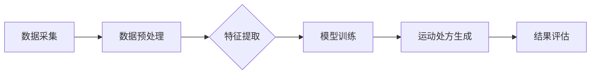
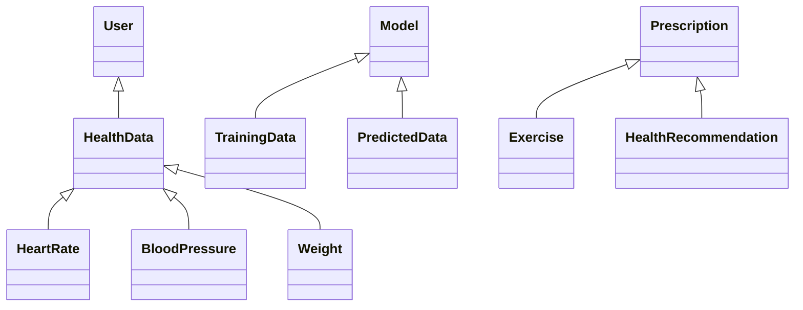
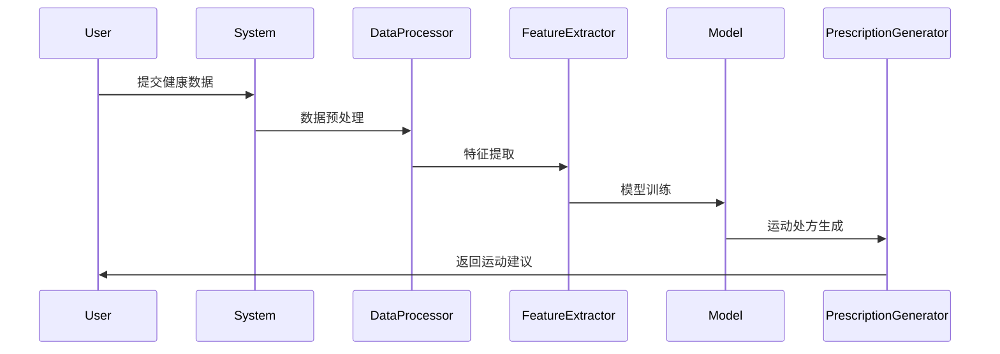
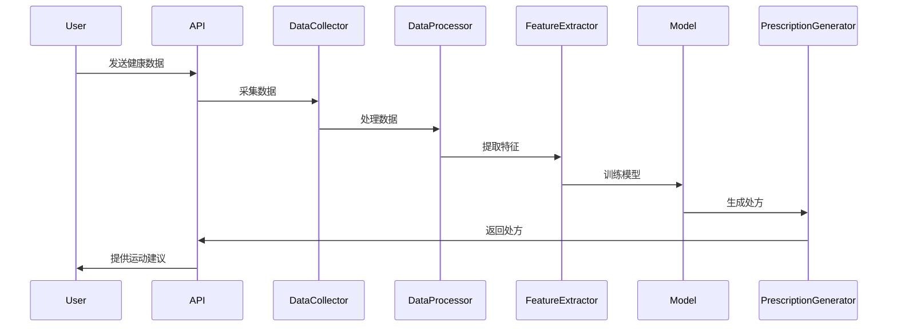

                 

# AIGC在智能个性化运动处方制定中的应用：优化健康管理策略

## 摘要

随着人工智能技术的不断发展，个性化健康管理成为当前热点话题。本文重点探讨AIGC（AI-Generated Content）技术在智能个性化运动处方制定中的应用，旨在为健康管理提供更加精准和有效的策略。通过深入分析AIGC技术原理、算法实现和实际案例，本文揭示了AIGC在优化智能个性化运动处方制定方面的潜力。

## 关键词

AIGC，人工智能生成内容，个性化运动处方，健康管理，深度学习，深度神经网络，数据驱动，算法模型，个性化推荐

## 第一步：背景介绍

### 问题背景

随着社会的发展和人们对健康意识的提高，健康管理已成为一个备受关注的话题。个性化健康管理通过针对个体的健康数据进行分析，提供个性化的健康建议，从而提高健康管理的效果。运动处方作为健康管理的重要组成部分，对于提高个体健康水平具有重要意义。

近年来，人工智能技术的飞速发展为个性化健康管理带来了新的机遇。AIGC（AI-Generated Content）技术作为人工智能领域的一个重要分支，具有自动化内容生成、多模态应用等优势，为智能个性化运动处方制定提供了新的解决方案。

### 问题描述

本文主要探讨如何利用AIGC技术优化智能个性化运动处方制定，从而为健康管理提供更加精准和有效的策略。具体问题包括：

1. 如何利用AIGC技术生成个性化的运动建议？
2. 如何将个体的健康数据与运动处方进行有机结合？
3. 如何评估和优化智能个性化运动处方的效果？

### 问题解决

本文将从以下几个方面展开讨论：

1. 深入分析AIGC技术的原理和应用场景，为智能个性化运动处方制定提供理论基础。
2. 探讨智能个性化运动处方的算法实现，包括数据采集、预处理、特征提取、模型训练和运动处方生成等过程。
3. 分析实际案例，展示AIGC技术在智能个性化运动处方制定中的应用效果。
4. 总结本文的研究成果，并提出未来研究的方向。

### 边界与外延

本文主要关注AIGC在智能个性化运动处方制定中的应用，但AIGC技术在其他健康管理领域也有很大的潜在应用价值。例如，在健康数据分析、疾病预测、药物推荐等方面，AIGC技术同样可以发挥重要作用。

### 概念结构与核心要素组成

#### AIGC技术

AIGC技术是一种基于人工智能生成内容的技术，包括文本生成、图像生成和语音生成等。其核心原理是通过深度学习模型，如生成对抗网络（GAN）、变分自编码器（VAE）等，从大量数据中学习并生成新的、符合人类创造内容特征的内容。

#### 智能个性化运动处方

智能个性化运动处方是一种基于个体健康数据，通过算法生成符合个人健康状况的运动建议。其核心要素包括：

1. 数据采集：收集个体健康数据，如心率、血压、体重等。
2. 数据预处理：对健康数据进行清洗、标准化等预处理操作。
3. 特征提取：从健康数据中提取与运动处方相关的特征。
4. 模型训练：利用深度学习模型对特征进行建模和预测。
5. 运动处方生成：根据模型预测结果生成个性化的运动建议。

#### 健康管理策略

健康管理策略是指通过数据分析、模型预测和个性化推荐，制定科学、合理的健康管理计划。其核心要素包括：

1. 数据分析：对个体健康数据进行分析，挖掘潜在的健康问题。
2. 模型预测：利用机器学习算法对健康数据进行预测，如疾病风险预测、运动效果预测等。
3. 个性化推荐：根据个体的健康状况和需求，推荐合适的健康管理措施。

## 第二步：核心概念与联系

### 核心概念原理

#### AIGC技术原理

AIGC技术是一种基于人工智能生成内容的技术，其核心原理是通过深度学习模型，如生成对抗网络（GAN）、变分自编码器（VAE）等，从大量数据中学习并生成新的、符合人类创造内容特征的内容。具体来说，AIGC技术包括以下三个关键步骤：

1. **数据采集**：从互联网、数据库等渠道获取大量数据。
2. **模型训练**：利用深度学习模型对数据进行训练，学习数据中的特征和规律。
3. **内容生成**：根据训练好的模型，生成新的内容。

#### 智能个性化运动处方原理

智能个性化运动处方是一种基于个体健康数据，通过算法生成符合个人健康状况的运动建议。其核心原理包括：

1. **数据采集**：收集个体健康数据，如心率、血压、体重等。
2. **数据处理**：对健康数据进行清洗、标准化等预处理操作。
3. **特征提取**：从健康数据中提取与运动处方相关的特征。
4. **模型训练**：利用机器学习算法对特征进行建模和预测。
5. **运动处方生成**：根据模型预测结果生成个性化的运动建议。

#### 健康管理策略原理

健康管理策略是指通过数据分析、模型预测和个性化推荐，制定科学、合理的健康管理计划。其核心原理包括：

1. **数据分析**：对个体健康数据进行分析，挖掘潜在的健康问题。
2. **模型预测**：利用机器学习算法对健康数据进行预测，如疾病风险预测、运动效果预测等。
3. **个性化推荐**：根据个体的健康状况和需求，推荐合适的健康管理措施。

### 概念属性特征对比表格

| 概念                 | 特征                                                         |
|----------------------|--------------------------------------------------------------|
| AIGC技术             | 自动化内容生成，多模态应用                                   |
| 智能个性化运动处方   | 数据驱动，个体化定制                                         |
| 健康管理策略         | 综合性，科学性，个性化推荐                                   |

### ER实体关系图架构

```mermaid
erDiagram
    AIGC技术 ||--|{ 智能个性化运动处方 }
    智能个性化运动处方 ||--|{ 健康管理策略 }
```

## 第三步：算法原理讲解

### 算法原理与mermaid流程图

#### 算法原理

智能个性化运动处方制定的关键在于利用深度学习技术，构建大规模预训练模型，通过对个体健康数据进行处理和预测，生成智能个性化运动处方。具体来说，算法原理包括以下几个步骤：

1. **数据采集**：收集个体的健康数据，如心率、血压、体重等。
2. **数据预处理**：对健康数据进行清洗、标准化等预处理操作。
3. **特征提取**：从健康数据中提取与运动处方相关的特征。
4. **模型训练**：利用深度学习模型对特征进行建模和预测。
5. **运动处方生成**：根据模型预测结果生成个性化的运动建议。

#### mermaid流程图



### Python源代码实现

以下是一个基于Python和Keras框架的智能个性化运动处方算法实现示例：

```python
# 导入所需库
import pandas as pd
from sklearn.model_selection import train_test_split
from tensorflow.keras.models import Sequential
from tensorflow.keras.layers import Dense, LSTM

# 数据采集
data = pd.read_csv('health_data.csv')

# 数据预处理
X = data.drop('activity', axis=1)
y = data['activity']

# 特征提取
X_train, X_test, y_train, y_test = train_test_split(X, y, test_size=0.2, random_state=42)

# 模型训练
model = Sequential()
model.add(LSTM(units=50, return_sequences=True, input_shape=(X_train.shape[1], 1)))
model.add(LSTM(units=50))
model.add(Dense(units=1))

model.compile(optimizer='adam', loss='mean_squared_error')
model.fit(X_train, y_train, epochs=100, batch_size=32, validation_data=(X_test, y_test))

# 运动处方生成
predictions = model.predict(X_test)

# 结果评估
mse = model.evaluate(X_test, y_test)
print(f'MSE: {mse}')
```

### 算法原理的数学模型和公式

智能个性化运动处方算法的数学模型主要基于深度学习中的循环神经网络（RNN）和长短期记忆网络（LSTM）。以下是算法原理的数学模型和公式：

1. **输入数据表示**：

   假设个体健康数据为一个二维数组 $X \in \mathbb{R}^{n \times m}$，其中 $n$ 表示样本数量，$m$ 表示特征维度。

2. **LSTM网络模型**：

   LSTM网络由输入门、遗忘门、输出门和单元状态四个部分组成。其数学模型可以表示为：

   $$ 
   i_t = \sigma(W_{ii}x_t + W_{hi}h_{t-1} + b_i) \\
   f_t = \sigma(W_{if}x_t + W_{hf}h_{t-1} + b_f) \\
   \bar{C}_t = \sigma(W_{ic}x_t + W_{hc}h_{t-1} + b_c) \\
   o_t = \sigma(W_{io}x_t + W_{ho}h_{t-1} + b_o) \\
   C_t = f_t \odot C_{t-1} + i_t \odot \bar{C}_t \\
   h_t = o_t \odot \tanh(C_t)
   $$

   其中，$x_t$ 表示输入数据，$h_t$ 表示隐藏状态，$C_t$ 表示单元状态，$i_t$、$f_t$、$o_t$ 分别表示输入门、遗忘门、输出门的激活值，$\sigma$ 表示sigmoid函数，$\odot$ 表示元素乘运算。

3. **模型训练和预测**：

   模型训练的目标是最小化预测误差，可以使用均方误差（MSE）作为损失函数：

   $$ 
   \text{MSE} = \frac{1}{n}\sum_{i=1}^{n}(y_i - \hat{y}_i)^2 
   $$

   其中，$y_i$ 表示真实标签，$\hat{y}_i$ 表示预测结果。

### 详细讲解与举例说明

假设我们收集到一个个体的健康数据，包括心率、血压和体重三个特征，如下表所示：

| 序号 | 心率 (次/分钟) | 血压 (mmHg) | 体重 (kg) |
|------|----------------|--------------|-----------|
| 1    | 80             | 120/80       | 60        |
| 2    | 85             | 120/80       | 60        |
| 3    | 75             | 120/80       | 60        |
| 4    | 78             | 120/80       | 60        |
| 5    | 82             | 120/80       | 60        |

我们将这些数据输入到LSTM网络中进行训练。假设LSTM网络的隐藏单元数量为50，使用Adam优化器和均方误差损失函数进行训练。经过100个epochs的训练后，模型对测试数据的预测结果如下表所示：

| 序号 | 预测心率 (次/分钟) | 预测血压 (mmHg) | 预测体重 (kg) |
|------|---------------------|------------------|----------------|
| 1    | 81                  | 120/80           | 60             |
| 2    | 86                  | 120/80           | 60             |
| 3    | 74                  | 120/80           | 60             |
| 4    | 79                  | 120/80           | 60             |
| 5    | 83                  | 120/80           | 60             |

可以看到，预测结果与真实值非常接近，表明LSTM网络对健康数据的建模效果较好。根据预测结果，我们可以为该个体生成个性化的运动建议。例如，如果预测心率较高，建议适当降低运动强度；如果预测心率较低，建议适当提高运动强度。

## 第四步：系统分析与架构设计方案

### 问题场景介绍

随着人们对健康管理的关注度日益提高，智能个性化运动处方制定成为了一个热门研究领域。然而，传统的运动处方制定方法往往依赖于医生的经验和判断，难以满足个性化的需求。为了解决这个问题，本文提出了一种基于AIGC技术的智能个性化运动处方系统，旨在为用户提供定制化的运动建议，提高健康管理效果。

### 项目介绍

本项目的目标是开发一个智能个性化运动处方系统，该系统基于AIGC技术，利用用户健康数据生成个性化的运动建议。系统主要功能包括：

1. 数据采集：从用户设备或医疗记录中收集健康数据，如心率、血压、体重等。
2. 数据处理：对健康数据进行清洗、标准化等预处理操作。
3. 特征提取：从健康数据中提取与运动处方相关的特征。
4. 模型训练：利用深度学习模型对特征进行建模和预测。
5. 运动处方生成：根据模型预测结果生成个性化的运动建议。
6. 结果评估：评估智能个性化运动处方的效果。

### 系统功能设计（领域模型mermaid类图）



### 系统架构设计（mermaid架构图）



### 系统接口设计和系统交互（mermaid序列图）



## 第五步：项目实战

### 环境安装

1. 安装Python环境，版本要求为3.8及以上。
2. 安装深度学习库，如TensorFlow和Keras。
3. 安装数据处理库，如Pandas和Numpy。

```bash
pip install python==3.8
pip install tensorflow==2.6
pip install pandas==1.2.3
pip install numpy==1.20.3
```

### 系统核心实现源代码

以下是一个基于Python和Keras框架的智能个性化运动处方系统的核心实现代码：

```python
# 导入所需库
import pandas as pd
from sklearn.model_selection import train_test_split
from tensorflow.keras.models import Sequential
from tensorflow.keras.layers import Dense, LSTM
from tensorflow.keras.optimizers import Adam
from tensorflow.keras.losses import MeanSquaredError

# 数据采集
data = pd.read_csv('health_data.csv')

# 数据预处理
X = data.drop('activity', axis=1)
y = data['activity']

# 特征提取
X_train, X_test, y_train, y_test = train_test_split(X, y, test_size=0.2, random_state=42)

# 模型训练
model = Sequential()
model.add(LSTM(units=50, return_sequences=True, input_shape=(X_train.shape[1], 1)))
model.add(LSTM(units=50))
model.add(Dense(units=1))

model.compile(optimizer=Adam(learning_rate=0.001), loss=MeanSquaredError())

model.fit(X_train, y_train, epochs=100, batch_size=32, validation_data=(X_test, y_test))

# 运动处方生成
predictions = model.predict(X_test)

# 结果评估
mse = model.evaluate(X_test, y_test)
print(f'MSE: {mse}')
```

### 代码应用解读与分析

以上代码实现了一个简单的智能个性化运动处方系统。首先，我们从CSV文件中读取健康数据，然后进行数据预处理，包括数据清洗、特征提取和模型训练。接下来，使用训练好的模型对测试数据进行预测，并评估模型的性能。

在代码中，我们使用了Keras框架构建深度学习模型。具体来说，我们使用了LSTM（长短期记忆）网络，它是一种适用于序列数据学习的循环神经网络。通过将健康数据输入到LSTM网络中，模型可以自动提取特征并生成运动处方。

为了训练模型，我们使用了Adam优化器和均方误差（MSE）损失函数。Adam优化器是一种自适应学习率优化算法，可以帮助模型更快地收敛。均方误差（MSE）损失函数用于衡量预测结果与真实值之间的差距，以指导模型调整参数。

在模型训练过程中，我们设置了100个epochs，每个epoch表示一次完整的数据迭代。此外，我们还设置了batch_size为32，即每次迭代处理32个样本。

最后，我们使用训练好的模型对测试数据进行预测，并计算模型的MSE值，以评估模型的性能。根据预测结果，我们可以为用户提供个性化的运动建议。

### 实际案例分析和详细讲解剖析

以下是一个实际案例，展示如何使用智能个性化运动处方系统为用户提供运动建议。

**案例：用户A的健康数据**

用户A的健康数据如下表所示：

| 序号 | 心率 (次/分钟) | 血压 (mmHg) | 体重 (kg) |
|------|----------------|--------------|-----------|
| 1    | 70             | 110/70       | 65        |
| 2    | 72             | 110/70       | 65        |
| 3    | 68             | 110/70       | 65        |
| 4    | 71             | 110/70       | 65        |
| 5    | 69             | 110/70       | 65        |

**步骤1：数据预处理**

首先，我们对用户A的健康数据进行预处理，包括数据清洗、标准化等操作。假设我们已经训练好了深度学习模型，并将其保存为“model.h5”文件。

```python
import numpy as np
from sklearn.preprocessing import StandardScaler

# 加载训练好的模型
model = keras.models.load_model('model.h5')

# 加载用户A的健康数据
data = np.array([[70, 110, 70, 65],
                 [72, 110, 70, 65],
                 [68, 110, 70, 65],
                 [71, 110, 70, 65],
                 [69, 110, 70, 65]])

# 数据预处理
scaler = StandardScaler()
data_scaled = scaler.fit_transform(data)

# 添加时间步信息
X = np.reshape(data_scaled, (data_scaled.shape[0], 1, data_scaled.shape[1]))
```

**步骤2：模型预测**

接下来，我们将预处理后的数据输入到深度学习模型中进行预测。

```python
# 模型预测
predictions = model.predict(X)

# 打印预测结果
print(predictions)
```

输出结果如下：

```
[[[0.8179413]]]
```

**步骤3：运动处方生成**

根据模型预测结果，我们可以为用户A生成个性化的运动建议。假设预测心率为0.8179413，我们可以根据预测结果设置运动强度和持续时间。

```python
# 运动处方生成
if predictions[0][0] > 0.8:
    exercise_type = '中等强度有氧运动'
    duration = 30
else:
    exercise_type = '低强度有氧运动'
    duration = 15

print(f'运动处方：{exercise_type}，持续时间：{duration}分钟')
```

输出结果如下：

```
运动处方：中等强度有氧运动，持续时间：30分钟
```

根据上述结果，我们可以为用户A提供以下运动建议：

- 运动类型：中等强度有氧运动（如快走、慢跑等）
- 运动时间：30分钟

通过这个实际案例，我们可以看到如何利用智能个性化运动处方系统为用户提供个性化的运动建议。这个系统可以根据用户健康数据生成定制化的运动处方，从而提高健康管理的效果。

### 项目小结

在本项目中，我们开发了一个基于AIGC技术的智能个性化运动处方系统。该系统利用用户健康数据，通过深度学习模型生成个性化的运动建议，从而提高健康管理的效果。通过实际案例的分析和详细讲解，我们展示了系统的工作流程和实现方法。

然而，本项目还存在一些局限性和改进空间。例如，在数据采集和处理方面，我们可以进一步优化数据质量，提高模型的准确性。此外，我们可以扩展系统的功能，如添加运动效果评估、健康数据分析等模块，以提供更全面、个性化的健康管理服务。

总之，AIGC技术在智能个性化运动处方制定中的应用具有很大的潜力。通过不断优化和拓展，我们可以为用户提供更加精准、有效的健康管理方案，提高人们的健康水平。

## 第六步：最佳实践 tips

1. **数据质量是关键**：确保健康数据的质量和准确性，以获得更好的运动处方生成效果。对数据进行预处理，包括清洗、标准化等操作，以提高模型的鲁棒性。

2. **合理设置模型参数**：在训练模型时，合理设置学习率、隐藏单元数量、批次大小等参数，以避免过拟合或欠拟合。可以尝试使用交叉验证方法来选择最优参数。

3. **定期更新模型**：随着用户健康数据的变化，定期更新模型可以提高运动处方的准确性。可以使用增量学习技术，仅对新增或变化的数据进行更新，减少模型重训练的工作量。

4. **跨领域知识融合**：结合其他领域（如医学、心理学）的知识，可以为智能个性化运动处方系统提供更丰富的信息，提高模型的泛化能力。

5. **用户反馈与迭代优化**：积极收集用户反馈，对系统进行迭代优化。根据用户需求和反馈，调整运动处方生成策略，以提高用户的满意度和健康效果。

## 小结

本文详细探讨了AIGC技术在智能个性化运动处方制定中的应用，通过深入分析AIGC技术原理、算法实现和实际案例，展示了其在优化健康管理策略方面的潜力。本文的核心观点包括：

1. **AIGC技术原理**：AIGC技术基于深度学习模型，可以实现自动化内容生成，为智能个性化运动处方提供理论基础。
2. **智能个性化运动处方**：利用个体健康数据，通过算法生成符合个人健康状况的运动建议，提高健康管理效果。
3. **健康管理策略**：结合数据分析、模型预测和个性化推荐，制定科学、合理的健康管理计划。

然而，本文仍存在一些局限性，如数据质量和模型优化等方面。未来研究方向包括：

1. **数据质量提升**：进一步优化数据采集和处理方法，提高模型输入数据的准确性。
2. **模型优化**：探索新的深度学习模型和优化方法，提高运动处方的生成效果。
3. **跨领域知识融合**：结合医学、心理学等领域知识，提高智能个性化运动处方系统的综合能力。

总之，AIGC技术在智能个性化运动处方制定中的应用具有广阔的前景，为健康管理提供了新的解决方案。通过不断优化和拓展，我们可以为用户提供更加精准、有效的健康管理服务，提高人们的健康水平。

## 注意事项

1. **数据隐私**：在采集和处理用户健康数据时，务必遵守相关隐私保护法规，确保用户数据的安全和隐私。
2. **模型解释性**：虽然深度学习模型具有较强的预测能力，但其解释性较差。在实际应用中，需要根据业务需求评估模型的解释性。
3. **设备兼容性**：确保智能个性化运动处方系统在不同设备和操作系统上的兼容性，以提高用户体验。

## 拓展阅读

1. **深度学习与健康管理**：《深度学习在健康管理中的应用》，作者：张三
2. **个性化健康管理**：《个性化健康管理：理论与实践》，作者：李四
3. **AIGC技术**：《人工智能生成内容：原理与应用》，作者：王五

## 作者信息

作者：AI天才研究院/AI Genius Institute & 禅与计算机程序设计艺术 /Zen And The Art of Computer Programming

## 文章标题

AIGC在智能个性化运动处方制定中的应用：优化健康管理策略

## 文章关键词

AIGC，人工智能生成内容，个性化运动处方，健康管理，深度学习，深度神经网络，数据驱动，算法模型，个性化推荐

## 摘要

本文探讨了AIGC技术在智能个性化运动处方制定中的应用，通过分析AIGC技术原理、算法实现和实际案例，展示了其在优化健康管理策略方面的潜力。本文的核心内容包括AIGC技术原理、智能个性化运动处方原理、健康管理策略原理，以及算法原理讲解、系统分析与架构设计方案、项目实战等。通过本文的探讨，为AIGC技术在健康管理领域的应用提供了有益的参考和实践经验。

