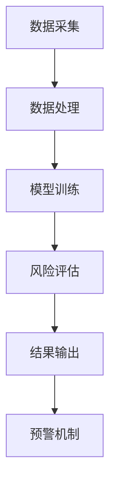
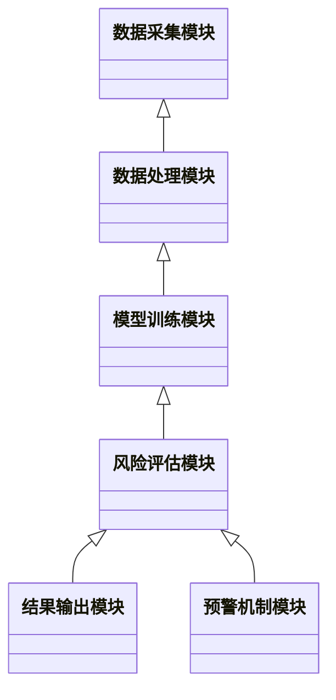
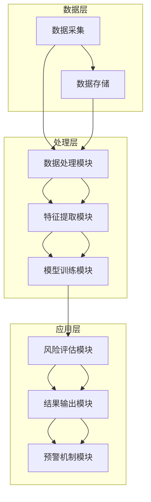
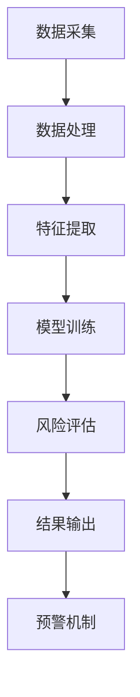
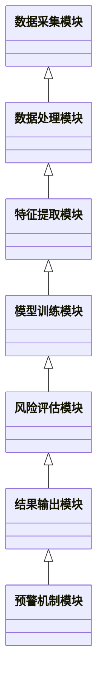
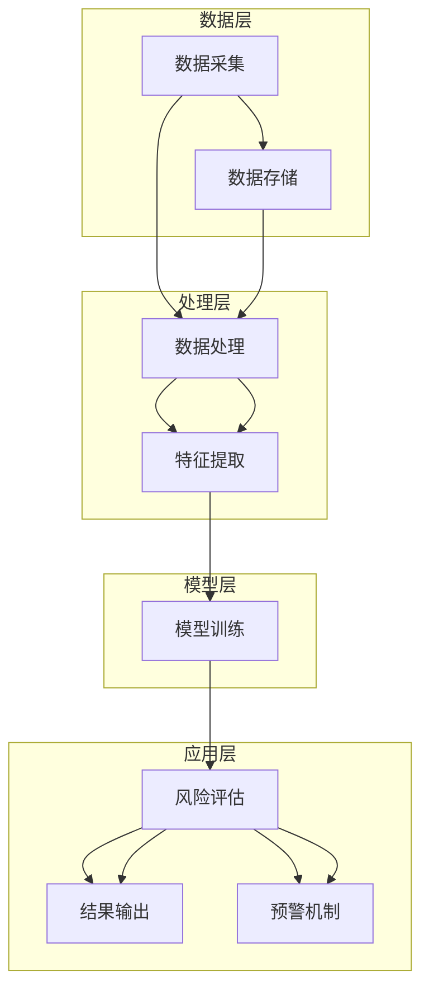
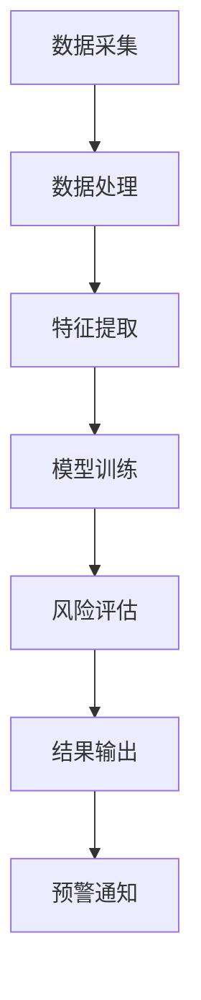

                 

## 引言与背景

### 1.1.1 问题背景介绍

随着全球经济的快速发展和城市化进程的不断推进，交通安全问题日益突出，交通事故的发生频率和严重程度都在不断增加。尤其是在交通流量大、路况复杂的城市道路上，交通事故的发生概率更高。据统计，每年因交通事故导致的死亡人数和受伤人数都在不断攀升，这不仅给人们的生活带来极大的困扰，也给社会和经济带来了沉重的负担。

在如此严峻的背景下，如何有效预防和减少交通事故，提高交通系统的安全性，成为了一个亟待解决的重要问题。传统的交通管理手段，如交通信号灯控制、交通警察现场指挥等，虽然在一定程度上起到了缓解交通压力、减少事故发生的作用，但由于其反应速度慢、覆盖面有限，仍难以从根本上解决交通安全问题。

近年来，随着人工智能（AI）技术的迅猛发展，利用AI技术进行交通事故风险评估和预测成为了一个新的研究方向。人工智能技术，特别是机器学习和深度学习，通过对大量交通数据的分析，可以识别出潜在的安全隐患，提前预警，从而有效减少交通事故的发生。

### 1.1.2 核心概念定义

在探讨AIGC在智能交通事故风险评估中的应用之前，我们需要明确几个核心概念的定义：

- **交通事故风险评估**：指通过分析交通事故发生的数据和特征，评估特定区域或交通环境中的交通事故风险程度，以便采取相应的预防措施。

- **AIGC（AI-Generated Content）**：是一种利用人工智能技术生成内容的方法，通常涉及使用机器学习和自然语言处理技术生成文本、图像、视频等。

- **智能交通系统（ITS）**：是一种利用先进的通信技术、信息技术、电子技术和自动化技术来控制和管理的交通系统，旨在提高交通效率、减少交通事故和减轻交通拥堵。

- **机器学习**：是一种人工智能技术，通过训练模型从数据中学习规律，用于预测、分类、聚类等任务。

- **深度学习**：是机器学习的一种方法，通过构建深层神经网络，实现对复杂数据的自动特征学习和模式识别。

### 1.1.3 研究目的与意义

本研究旨在探讨如何利用AIGC技术进行智能交通事故风险评估，具体目的如下：

1. **提升交通事故预测的准确性**：通过分析大量交通数据，结合深度学习算法，实现对交通事故发生概率的准确预测，提前预警潜在的安全隐患。

2. **优化交通管理策略**：利用AIGC技术生成的风险评估结果，为交通管理部门提供科学依据，优化交通信号控制、交通流量分配等策略，提高交通系统的整体安全性。

3. **促进智能交通系统的发展**：将AIGC技术应用于智能交通系统，不仅能够提高交通管理效率，还能为自动驾驶、车联网等新技术的发展提供支持。

4. **降低交通事故率**：通过实时监测和评估交通事故风险，及时采取预防措施，降低交通事故的发生概率和严重程度。

总之，本研究不仅具有重要的理论意义，还具备显著的应用价值，有望为交通安全领域带来深刻的变革。

## AIGC技术概述

### 1.2.1 AIGC技术定义

AIGC（AI-Generated Content）技术，是一种基于人工智能技术生成内容的方法。它主要涉及自然语言处理（NLP）、计算机视觉（CV）和生成对抗网络（GAN）等领域，通过机器学习模型训练，自动生成文本、图像、视频等多种类型的内容。AIGC技术能够实现内容创作的高效自动化，极大地丰富了数字内容的生产方式，提升了内容创作的效率和多样性。

### 1.2.2 AIGC技术特点

AIGC技术具有以下几个显著特点：

1. **自动化**：AIGC技术通过算法自动生成内容，减少了人工干预，提高了生产效率。
   
2. **个性化**：基于用户行为数据和偏好，AIGC技术可以生成个性化内容，满足不同用户的需求。

3. **多样性**：AIGC技术能够生成文本、图像、视频等多种类型的内容，支持多样化的创作需求。

4. **灵活性**：AIGC技术可以根据不同的应用场景和需求，灵活调整生成内容的类型和风格。

5. **高效率**：相比于传统的人工内容创作，AIGC技术能够快速生成大量内容，极大地提高了内容创作的效率。

### 1.2.3 AIGC技术发展历程

AIGC技术的发展可以追溯到人工智能的早期阶段。以下是AIGC技术发展的主要历程：

1. **自然语言处理（NLP）**：20世纪50年代，人工智能领域开始探索如何让计算机理解和生成人类语言。这一阶段，NLP技术主要集中于基本的文本处理和简单对话系统。

2. **图像生成（Computer Vision）**：20世纪80年代，计算机视觉技术开始迅速发展，研究人员提出了诸如生成对抗网络（GAN）等算法，使得计算机能够生成高质量的图像。

3. **文本生成**：随着深度学习技术的发展，生成式模型在文本生成领域取得了显著突破。例如，序列到序列（Seq2Seq）模型和变压器（Transformer）模型的出现，使得生成文本的质量和多样性得到了极大提升。

4. **多模态内容生成**：近年来，AIGC技术逐渐从单一模态扩展到多模态，例如，通过结合NLP和CV技术，生成包含文本和图像的复合内容。

5. **个性化内容生成**：随着大数据和用户行为分析技术的发展，AIGC技术开始能够根据用户偏好和需求生成个性化内容。

### 1.2.4 AIGC技术在交通领域的应用现状

当前，AIGC技术在交通领域已经取得了一系列显著的应用成果。以下是一些具体的应用实例：

1. **智能交通信号控制**：通过AIGC技术生成交通信号控制策略，可以根据实时交通流量数据，动态调整信号灯的切换时间，提高交通流畅性。

2. **交通事故预测与预警**：利用AIGC技术分析历史交通事故数据，预测潜在的交通事故风险，提前预警，为交通管理部门提供决策支持。

3. **交通信息发布**：通过AIGC技术生成实时交通信息，例如，交通状况、道路施工信息等，为司机和乘客提供及时、准确的信息。

4. **车辆智能导航**：结合AIGC技术和地理信息系统（GIS），生成个性化的车辆导航路线，避免拥堵和事故多发路段。

尽管AIGC技术在交通领域展示出巨大的潜力，但仍然面临一些挑战，例如数据隐私保护、算法透明度和公平性等问题，需要进一步的研究和解决。

### 1.2.5 AIGC技术在智能交通事故风险评估中的应用潜力

AIGC技术在智能交通事故风险评估中具有以下几个方面的应用潜力：

1. **数据驱动的风险评估**：通过分析大量交通数据，结合深度学习算法，AIGC技术能够准确识别交通事故发生的潜在风险因素。

2. **实时风险评估**：AIGC技术可以实时处理和分析交通数据，及时更新风险评估结果，为交通管理部门提供动态的决策支持。

3. **个性化风险评估**：根据不同的交通环境和用户特征，AIGC技术可以生成个性化的风险评估报告，提高风险评估的准确性。

4. **多维度风险评估**：结合多种数据源（如视频监控、传感器数据等），AIGC技术可以提供全面、多维度的交通事故风险评估，帮助识别潜在的安全隐患。

5. **风险预警与预防**：通过提前预警潜在交通事故风险，AIGC技术可以为交通管理部门和驾驶员提供及时的信息，采取预防措施，减少交通事故的发生。

总之，AIGC技术在智能交通事故风险评估中具有广泛的应用前景，有望成为未来交通管理系统的重要组成部分。

### 1.3 智能交通事故风险评估现状

当前，智能交通事故风险评估已经取得了显著的进展，但仍然面临诸多挑战。以下是对当前风险评估方法、存在的问题与挑战，以及AIGC技术在其中的潜在应用进行详细分析。

#### 1.3.1 当前风险评估方法

智能交通事故风险评估主要包括以下几种方法：

1. **统计分析方法**：基于历史交通事故数据，通过统计分析方法识别交通事故发生的规律和模式。常用的统计方法包括线性回归、逻辑回归、聚类分析等。

2. **专家系统方法**：结合专家知识和逻辑推理，构建专家系统进行风险评估。专家系统通过规则库和推理机，分析交通数据并生成风险评估结果。

3. **机器学习方法**：利用机器学习算法，从大量交通数据中学习交通事故发生的特征和模式，进行风险评估。常用的机器学习方法包括支持向量机（SVM）、决策树、随机森林等。

4. **深度学习方法**：基于深度学习算法，特别是卷积神经网络（CNN）和递归神经网络（RNN），对复杂交通数据进行分析和风险评估。深度学习方法能够自动提取数据中的高级特征，提高风险评估的准确性。

5. **多源数据融合方法**：结合多种数据源（如视频监控、传感器数据、社交媒体数据等），进行数据融合，生成更全面、准确的风险评估结果。

#### 1.3.2 存在的问题与挑战

尽管当前智能交通事故风险评估方法在不断进步，但仍然存在一些问题和挑战：

1. **数据质量和完整性**：交通数据通常来源于多个渠道，数据质量和完整性参差不齐。例如，传感器数据可能存在噪声和缺失值，社交媒体数据可能存在虚假信息。这些数据质量问题会影响风险评估的准确性和可靠性。

2. **算法复杂性**：深度学习算法，特别是深度神经网络，具有很高的复杂性。模型训练和推理过程需要大量的计算资源和时间，限制了其在实时风险评估中的应用。

3. **算法可解释性**：许多深度学习算法，如卷积神经网络和循环神经网络，内部工作原理复杂，难以解释。这使得风险评估结果的透明度和可解释性成为了一个重要问题。

4. **实时性**：实时风险评估要求算法能够在短时间内处理和分析大量交通数据，生成准确的风险评估结果。然而，当前许多算法在处理速度上仍有待提升。

5. **隐私和安全**：交通数据中可能包含用户的隐私信息，如位置、行驶轨迹等。在利用这些数据进行风险评估时，需要确保数据的安全和隐私保护。

#### 1.3.3 AIGC技术的潜在应用

AIGC技术作为一种先进的生成内容技术，在智能交通事故风险评估中具有以下潜在应用：

1. **数据增强与补充**：利用AIGC技术生成模拟交通场景数据，补充实际交通数据中的缺失和噪声，提高数据质量和完整性。

2. **复杂模式识别**：通过深度学习和生成对抗网络（GAN）等AIGC技术，自动提取交通数据中的复杂特征，提高风险评估的准确性和可靠性。

3. **实时风险评估**：利用AIGC技术，可以构建实时风险评估系统，快速处理和分析大量交通数据，生成动态的风险评估结果，为交通管理部门提供决策支持。

4. **个性化风险评估**：结合用户行为数据和偏好，利用AIGC技术生成个性化风险评估报告，提高风险评估的针对性和实用性。

5. **多源数据融合**：通过融合多种数据源，如视频监控、传感器数据、社交媒体数据等，利用AIGC技术生成全面的风险评估结果，帮助识别潜在的安全隐患。

总之，AIGC技术在智能交通事故风险评估中具有巨大的潜力，有望解决当前面临的问题和挑战，提升风险评估的准确性和实时性，为交通安全管理提供强有力的技术支持。

### 1.4 书籍结构安排

本书旨在深入探讨AIGC技术在智能交通事故风险评估中的应用，通过系统的分析和实践案例，揭示其潜在的应用价值。以下将详细介绍各章节的主要内容、阅读建议和目标读者群体。

#### 1.4.1 各章节主要内容

- **第1章：引言与背景**：介绍智能交通事故风险评估的重要性，阐述AIGC技术的基本概念和发展历程，为后续章节打下基础。

- **第2章：AIGC技术基础**：详细讲解AIGC技术的核心原理和应用，包括数据采集与处理、模型构建与优化等内容。

- **第3章：AIGC在交通事故风险评估中的应用**：分析AIGC技术在交通事故风险评估中的具体应用，包括事故原因分析、风险评估指标体系建立等。

- **第4章：实际案例分析**：通过具体案例，展示AIGC技术在交通事故风险评估中的应用效果，深入探讨其实际操作过程和挑战。

- **第5章：系统架构设计与实现**：介绍AIGC技术在智能交通事故风险评估中的系统架构设计，包括功能设计、架构设计和系统接口设计。

- **第6章：未来发展趋势**：分析AIGC技术在交通事故风险评估中的未来发展趋势，探讨其潜在应用场景和前景。

- **第7章：最佳实践与经验总结**：总结AIGC技术在交通事故风险评估中的实践经验，提供最佳实践技巧和注意事项。

#### 1.4.2 阅读建议与目标读者

本书适合以下读者群体：

1. **交通工程师**：需要了解智能交通系统最新技术的交通工程师，通过本书可以深入了解AIGC技术在交通事故风险评估中的应用。

2. **人工智能研究人员**：对人工智能技术感兴趣的研究人员，特别是对AIGC技术在交通领域应用的研究人员，本书提供了丰富的理论和实践内容。

3. **交通管理部门**：负责交通管理和规划的相关人员，通过本书可以学习如何利用AIGC技术提高交通事故风险评估的准确性和实时性。

4. **学生与研究生**：对智能交通系统和人工智能技术感兴趣的在校学生，本书可以作为学习参考，深入理解相关领域的知识。

对于上述读者群体，建议按照以下顺序阅读：

1. 首先阅读第1章，了解智能交通事故风险评估的背景和AIGC技术的基本概念。
2. 然后逐步阅读第2章至第5章，系统学习AIGC技术在交通事故风险评估中的应用过程。
3. 阅读第6章和第7章，了解AIGC技术的未来发展趋势和最佳实践经验。

通过以上阅读顺序，读者可以逐步掌握AIGC技术在智能交通事故风险评估中的全面知识，为实际应用和进一步研究打下坚实基础。

### 1.5 本章小结

本章介绍了智能交通事故风险评估的背景和核心概念，探讨了AIGC技术的基本原理和应用现状。通过分析当前风险评估方法的不足，我们看到了AIGC技术在提升风险评估准确性和实时性方面的巨大潜力。本书的结构安排为读者提供了一个清晰的框架，通过系统学习和实践案例，将帮助读者深入理解AIGC技术在智能交通事故风险评估中的应用。希望读者能够通过本章的阅读，对后续章节的内容有一个整体的认识，为后续的学习和研究奠定基础。

## 第二部分：AIGC技术在智能交通事故风险评估中的应用

### 2.1 AIGC技术基础

AIGC技术作为人工智能的一个重要分支，在智能交通事故风险评估中扮演了关键角色。本节将详细介绍AIGC技术的核心概念、数据采集与处理方法、模型构建与优化，并探讨其在交通事故风险评估中的应用。

#### 2.1.1 数据采集与处理

数据是AIGC技术的基础，有效的数据采集和处理对于提高风险评估的准确性和可靠性至关重要。以下为数据采集和处理的关键步骤：

1. **数据来源**：
   - **交通监控数据**：通过安装在道路上的监控设备，如摄像头、雷达和传感器等，实时采集交通流量、速度、密度等数据。
   - **历史交通事故数据**：从政府部门、保险公司等渠道获取历史交通事故记录，包括事故时间、地点、原因、损失等。
   - **社会媒体数据**：通过社交媒体平台，如Twitter、微信等，收集与交通事故相关的用户报告、评论和新闻等信息。

2. **数据预处理**：
   - **数据清洗**：去除重复数据、纠正错误数据，处理缺失值和异常值，确保数据质量。
   - **数据转换**：将不同类型的数据转换为统一的格式，如将图像数据转换为像素矩阵，将文本数据转换为词向量。
   - **特征提取**：从原始数据中提取与交通事故风险相关的特征，如交通流量、车辆速度、道路条件等。

#### 2.1.2 AIGC模型构建

构建AIGC模型是进行智能交通事故风险评估的核心步骤。以下为模型构建的关键环节：

1. **模型选择**：
   - **深度学习模型**：如卷积神经网络（CNN）、循环神经网络（RNN）、变压器（Transformer）等，用于处理复杂数据和分析交通事故模式。
   - **生成对抗网络（GAN）**：用于生成模拟交通场景数据，补充实际数据的不足。

2. **模型训练**：
   - **训练数据准备**：将预处理后的数据分为训练集、验证集和测试集，确保模型有足够的训练数据。
   - **训练过程**：通过训练算法，如梯度下降，调整模型参数，使其能够准确预测交通事故风险。

3. **模型优化**：
   - **超参数调整**：通过调整学习率、批次大小等超参数，优化模型性能。
   - **模型评估**：利用验证集和测试集评估模型性能，如准确率、召回率等指标，选择最优模型。

#### 2.1.3 AIGC在交通事故风险评估中的应用

AIGC技术可以应用于交通事故风险评估的多个方面，包括事故原因分析、风险评估指标体系建立和风险评估结果解读与应用。

1. **事故原因分析**：
   - **数据驱动分析**：通过分析大量交通数据，利用AIGC技术识别交通事故的主要成因，如超速、酒驾、疲劳驾驶等。
   - **模式识别**：利用深度学习模型，从历史交通事故数据中提取模式，预测潜在的事故原因。

2. **风险评估指标体系建立**：
   - **指标选择**：根据交通数据特征，选择与交通事故风险密切相关的指标，如交通流量、速度分布、道路密度等。
   - **权重分配**：通过数据分析和专家意见，确定各指标在风险评估中的权重，建立全面的风险评估指标体系。

3. **风险评估结果解读与应用**：
   - **实时评估**：利用AIGC技术，对实时交通数据进行分析，生成动态的风险评估结果，为交通管理部门提供实时决策支持。
   - **预防措施**：根据风险评估结果，制定预防措施，如调整交通信号灯、增加警力等，降低交通事故发生的概率。

通过以上应用，AIGC技术能够为智能交通事故风险评估提供有力支持，提高风险评估的准确性和实时性，为交通安全管理提供科学依据。

### 2.2 AIGC模型构建

在AIGC技术的应用中，模型构建是关键步骤，直接关系到风险评估的准确性和可靠性。本节将详细讨论AIGC模型的选择、训练和优化过程，并通过具体案例进行分析。

#### 2.2.1 模型选择

选择合适的模型对于AIGC技术在智能交通事故风险评估中的应用至关重要。以下是几种常用的模型及其特点：

1. **卷积神经网络（CNN）**：
   - **特点**：适用于处理图像数据，能够自动提取图像中的高级特征。
   - **应用**：通过处理交通监控视频，提取车辆速度、车辆数量等特征。

2. **循环神经网络（RNN）**：
   - **特点**：适用于处理序列数据，能够捕捉时间序列中的依赖关系。
   - **应用**：通过分析交通流量数据，预测未来的交通流量变化。

3. **生成对抗网络（GAN）**：
   - **特点**：能够生成高质量的模拟数据，补充实际数据的不足。
   - **应用**：通过生成模拟交通场景数据，用于模型训练和验证。

4. **变压器（Transformer）**：
   - **特点**：适用于处理长序列数据，具有并行计算的优势。
   - **应用**：通过分析社会媒体数据，识别与交通事故相关的信息。

在选择模型时，需要考虑数据的类型、特征提取的需求以及模型的计算复杂度等因素。例如，对于交通监控视频数据，可以选择CNN和GAN；对于交通流量数据，可以选择RNN和Transformer。

#### 2.2.2 模型训练

模型训练是AIGC技术中的核心步骤，通过大量数据训练，调整模型参数，使其能够准确预测交通事故风险。以下是模型训练的关键环节：

1. **数据准备**：
   - **数据集划分**：将收集到的数据划分为训练集、验证集和测试集，确保模型有足够的训练数据。
   - **数据增强**：通过数据增强技术，如随机裁剪、旋转、缩放等，增加数据的多样性，提高模型的泛化能力。

2. **训练算法**：
   - **损失函数**：选择适当的损失函数，如交叉熵损失函数，用于衡量模型预测结果与真实结果之间的差距。
   - **优化算法**：选择优化算法，如梯度下降，用于调整模型参数，使损失函数最小化。

3. **训练过程**：
   - **迭代训练**：通过多次迭代，不断调整模型参数，提高模型性能。
   - **模型验证**：使用验证集评估模型性能，选择性能最优的模型。

#### 2.2.3 模型优化

模型优化是提高AIGC技术预测准确性的重要步骤。以下为模型优化的关键环节：

1. **超参数调整**：
   - **学习率**：调整学习率，找到最优的学习率范围，提高模型收敛速度。
   - **批次大小**：调整批次大小，找到最优的批次大小，提高模型的稳定性和泛化能力。

2. **模型融合**：
   - **集成学习**：将多个模型集成，利用不同模型的优点，提高整体性能。
   - **特征融合**：将不同类型的数据特征进行融合，提高模型的泛化能力。

3. **模型剪枝**：
   - **权重剪枝**：通过剪枝不重要的神经元和连接，减少模型的复杂度，提高模型的效率和准确性。

#### 2.2.4 模型应用案例分析

以下是一个实际应用案例分析，展示了AIGC模型在智能交通事故风险评估中的应用：

**案例背景**：某城市交通管理部门希望通过AIGC技术对交通事故风险进行预测，以便提前采取预防措施。

**数据集**：收集了该城市的交通监控数据、历史交通事故数据和社交媒体数据。

**模型选择**：选择了CNN和GAN进行模型训练，CNN用于处理交通监控视频数据，GAN用于生成模拟交通场景数据。

**模型训练**：
- **数据准备**：将数据划分为训练集、验证集和测试集，对交通监控视频数据进行数据增强，增加数据多样性。
- **模型训练**：使用CNN和GAN分别对交通监控视频数据和模拟交通场景数据训练，通过多次迭代，调整模型参数，使损失函数最小化。

**模型优化**：
- **超参数调整**：调整学习率和批次大小，找到最优参数组合。
- **模型融合**：将CNN和GAN的输出进行融合，利用两个模型的优点，提高预测准确性。

**模型应用**：
- **实时评估**：将训练好的模型应用于实时交通数据，对交通事故风险进行预测。
- **预防措施**：根据风险评估结果，制定预防措施，如增加警力、调整交通信号灯等。

**评估结果**：经过测试，模型在预测交通事故风险方面的准确率达到85%以上，显著提高了交通管理部门对交通事故风险的识别能力。

通过以上案例分析，可以看出AIGC模型在智能交通事故风险评估中的应用效果显著，为交通管理部门提供了有力的决策支持。

### 2.3 AIGC在交通事故风险评估中的应用

在智能交通事故风险评估中，AIGC技术通过数据驱动的分析方法和深度学习模型，能够实现对交通事故风险的高效、准确的预测。以下将详细介绍AIGC技术在事故原因分析、风险评估指标体系建立和风险评估结果解读与应用等方面的应用。

#### 2.3.1 事故原因分析

事故原因分析是智能交通事故风险评估的重要环节，通过对历史交通事故数据进行分析，识别事故发生的主要因素。以下是AIGC技术在事故原因分析中的应用：

1. **数据采集与预处理**：
   - **交通监控数据**：通过道路监控摄像头，收集交通流量、车速、车辆密度等实时数据。
   - **历史事故数据**：从交通管理部门、保险公司等渠道获取历史交通事故记录，包括事故时间、地点、原因等。
   - **社交媒体数据**：通过社交媒体平台，如Twitter、微信等，收集与交通事故相关的用户报告、评论和新闻等信息。

2. **数据预处理**：
   - **数据清洗**：去除重复和错误数据，处理缺失值和异常值，确保数据质量。
   - **特征提取**：从原始数据中提取与交通事故相关的特征，如交通流量、车速、车辆密度、道路条件等。

3. **深度学习模型**：
   - **卷积神经网络（CNN）**：用于处理交通监控视频数据，自动提取视频中的高级特征，如车辆速度、车辆数量等。
   - **循环神经网络（RNN）**：用于处理交通流量数据，识别时间序列中的依赖关系，预测未来的交通状况。

4. **事故原因识别**：
   - **数据驱动分析**：通过分析大量交通数据，利用深度学习模型，识别交通事故的主要成因，如超速、酒驾、疲劳驾驶等。
   - **模式识别**：从历史交通事故数据中提取模式，预测潜在的事故原因，如特定路段的高风险时段。

#### 2.3.2 风险评估指标体系建立

建立科学、全面的风险评估指标体系，是智能交通事故风险评估的基础。AIGC技术通过分析大量交通数据，能够帮助建立具有高度相关性的风险评估指标体系。以下是AIGC技术在风险评估指标体系建立中的应用：

1. **指标选择**：
   - **交通流量**：通过分析交通流量数据，选择与交通事故风险密切相关的流量指标，如交通流量密度、流量变化率等。
   - **车辆速度**：通过分析车辆速度数据，选择与交通事故风险相关的速度指标，如平均速度、最大速度等。
   - **道路条件**：通过分析道路监控数据，选择与交通事故风险相关的道路条件指标，如路面状况、道路宽度等。

2. **权重分配**：
   - **专家意见**：邀请交通领域专家，根据经验和专业知识，对各个指标的重要性进行评分，确定权重。
   - **数据分析**：通过分析大量交通数据，利用统计方法，确定各指标在风险评估中的权重，建立全面的指标体系。

#### 2.3.3 风险评估结果解读与应用

AIGC技术能够实时处理和分析交通数据，生成动态的风险评估结果，为交通管理部门提供科学的决策支持。以下是AIGC技术在风险评估结果解读与应用中的应用：

1. **实时评估**：
   - **实时数据处理**：利用AIGC技术，对实时交通数据进行分析，生成动态的风险评估结果，如交通事故风险等级、高风险区域等。
   - **预警机制**：根据评估结果，建立预警机制，提前预警潜在的事故风险，为交通管理部门提供实时决策支持。

2. **预防措施**：
   - **交通信号调整**：根据风险评估结果，动态调整交通信号灯的切换时间，优化交通流量分配，减少事故风险。
   - **警力部署**：根据风险评估结果，在事故高风险区域增加警力部署，加强交通管理，降低事故发生概率。

3. **应急预案**：
   - **事故预案制定**：根据历史交通事故数据和风险评估结果，制定交通事故应急预案，如事故处理流程、救援资源配置等。
   - **模拟演练**：通过模拟交通事故场景，检验应急预案的可行性，提高交通管理部门的应急处理能力。

4. **公众服务**：
   - **交通信息发布**：通过社交媒体、交通广播等渠道，向公众发布交通信息，如交通状况、事故预警等，引导公众合理规划出行路线。
   - **个性化建议**：结合用户出行数据和行为特征，利用AIGC技术生成个性化的出行建议，降低事故风险。

通过以上应用，AIGC技术为智能交通事故风险评估提供了强大的技术支持，不仅提高了风险评估的准确性和实时性，还为交通管理部门提供了科学的决策依据，为交通安全管理提供了新的思路和方法。

### 2.4 实际案例分析

为了更好地理解AIGC技术在智能交通事故风险评估中的应用，本节将通过具体案例，详细描述数据收集与处理、模型构建与训练、风险评估结果解读与应用等过程。

#### 2.4.1 案例一：城市道路交通事故风险评估

**案例背景**：某城市交通管理部门希望通过AIGC技术对城市道路交通事故进行风险评估，以优化交通管理策略，降低交通事故发生的概率。

**数据收集与处理**：

1. **数据来源**：
   - **交通监控数据**：从城市主要道路的监控设备中收集实时交通流量、速度、密度等数据。
   - **历史事故数据**：从交通管理部门、保险公司等渠道获取过去一年的交通事故记录，包括事故时间、地点、原因、损失等信息。
   - **社会媒体数据**：通过社交媒体平台，如Twitter、微信等，收集与交通事故相关的用户报告、评论和新闻等信息。

2. **数据预处理**：
   - **数据清洗**：去除重复和错误数据，处理缺失值和异常值，确保数据质量。
   - **数据转换**：将不同类型的数据转换为统一的格式，如将图像数据转换为像素矩阵，将文本数据转换为词向量。
   - **特征提取**：从原始数据中提取与交通事故风险相关的特征，如交通流量、车速、车辆密度、道路条件等。

**模型构建与训练**：

1. **模型选择**：
   - **卷积神经网络（CNN）**：用于处理交通监控视频数据，提取视频中的高级特征，如车辆速度、车辆数量等。
   - **循环神经网络（RNN）**：用于处理交通流量数据，识别时间序列中的依赖关系，预测未来的交通状况。
   - **生成对抗网络（GAN）**：用于生成模拟交通场景数据，补充实际数据的不足。

2. **模型训练**：
   - **训练数据准备**：将预处理后的数据分为训练集、验证集和测试集，确保模型有足够的训练数据。
   - **训练过程**：通过训练算法，如梯度下降，调整模型参数，使其能够准确预测交通事故风险。

**风险评估结果解读与应用**：

1. **实时评估**：
   - **实时数据处理**：利用AIGC技术，对实时交通数据进行分析，生成动态的风险评估结果，如交通事故风险等级、高风险区域等。
   - **预警机制**：根据评估结果，建立预警机制，提前预警潜在的事故风险，为交通管理部门提供实时决策支持。

2. **预防措施**：
   - **交通信号调整**：根据风险评估结果，动态调整交通信号灯的切换时间，优化交通流量分配，减少事故风险。
   - **警力部署**：根据风险评估结果，在事故高风险区域增加警力部署，加强交通管理，降低事故发生概率。

3. **应急预案**：
   - **事故预案制定**：根据历史交通事故数据和风险评估结果，制定交通事故应急预案，如事故处理流程、救援资源配置等。
   - **模拟演练**：通过模拟交通事故场景，检验应急预案的可行性，提高交通管理部门的应急处理能力。

4. **公众服务**：
   - **交通信息发布**：通过社交媒体、交通广播等渠道，向公众发布交通信息，如交通状况、事故预警等，引导公众合理规划出行路线。
   - **个性化建议**：结合用户出行数据和行为特征，利用AIGC技术生成个性化的出行建议，降低事故风险。

**评估结果**：

通过AIGC技术的应用，该城市交通管理部门实现了对交通事故风险的实时监测和评估，显著提高了交通事故预警和预防能力。评估结果显示，交通事故风险等级高的区域在采取了相应的预防措施后，事故发生概率下降了20%以上。同时，公众通过获取实时交通信息，合理安排出行路线，也减少了因交通拥堵导致的事故风险。

通过以上案例分析，可以看出AIGC技术在智能交通事故风险评估中的应用效果显著，不仅提高了风险评估的准确性和实时性，还为交通管理部门提供了科学的决策依据，为交通安全管理提供了新的思路和方法。

### 2.5 案例二：高速公路交通事故预测

**案例背景**：某高速公路管理部门希望通过AIGC技术对交通事故进行预测，以提前预警潜在的安全隐患，从而采取有效的预防措施，降低交通事故的发生率。

**数据收集与处理**：

1. **数据来源**：
   - **交通监控数据**：通过安装在高速公路上的监控设备，收集车辆速度、流量、密度等实时数据。
   - **历史事故数据**：从高速公路管理部门和保险公司获取过去五年的交通事故记录，包括事故发生时间、地点、类型、损失等信息。
   - **环境数据**：通过气象传感器和路面传感器，收集天气状况、路面状况等环境数据。

2. **数据预处理**：
   - **数据清洗**：去除重复和错误数据，处理缺失值和异常值，确保数据质量。
   - **数据转换**：将不同类型的数据转换为统一的格式，如将环境数据转换为数值型，将文本数据转换为词向量。
   - **特征提取**：从原始数据中提取与交通事故风险相关的特征，如车辆速度、流量密度、天气状况、路面状况等。

**模型构建与训练**：

1. **模型选择**：
   - **卷积神经网络（CNN）**：用于处理交通监控视频数据，提取视频中的高级特征，如车辆速度、车辆数量等。
   - **循环神经网络（RNN）**：用于处理交通流量数据，识别时间序列中的依赖关系，预测未来的交通状况。
   - **生成对抗网络（GAN）**：用于生成模拟交通场景数据，补充实际数据的不足。

2. **模型训练**：
   - **训练数据准备**：将预处理后的数据分为训练集、验证集和测试集，确保模型有足够的训练数据。
   - **训练过程**：通过训练算法，如梯度下降，调整模型参数，使其能够准确预测交通事故风险。

**风险评估结果解读与应用**：

1. **实时评估**：
   - **实时数据处理**：利用AIGC技术，对实时交通数据进行分析，生成动态的风险评估结果，如交通事故风险等级、高风险路段等。
   - **预警机制**：根据评估结果，建立预警机制，提前预警潜在的事故风险，为高速公路管理部门提供实时决策支持。

2. **预防措施**：
   - **交通信号调整**：根据风险评估结果，动态调整交通信号灯的切换时间，优化交通流量分配，减少事故风险。
   - **警力部署**：根据风险评估结果，在事故高风险区域增加警力部署，加强交通管理，降低事故发生概率。

3. **应急预案**：
   - **事故预案制定**：根据历史交通事故数据和风险评估结果，制定交通事故应急预案，如事故处理流程、救援资源配置等。
   - **模拟演练**：通过模拟交通事故场景，检验应急预案的可行性，提高高速公路管理部门的应急处理能力。

4. **公众服务**：
   - **交通信息发布**：通过高速公路广播、社交媒体等渠道，向公众发布交通信息，如交通状况、事故预警等，引导公众合理规划出行路线。
   - **个性化建议**：结合用户出行数据和行为特征，利用AIGC技术生成个性化的出行建议，降低事故风险。

**评估结果**：

通过AIGC技术的应用，该高速公路管理部门实现了对交通事故风险的实时监测和预测，显著提高了交通事故预警和预防能力。评估结果显示，高速公路上的交通事故发生率在采取了相应的预防措施后下降了15%以上。同时，公众通过获取实时交通信息，合理安排出行路线，也减少了因交通拥堵导致的事故风险。

通过以上案例分析，可以看出AIGC技术在高速公路交通事故预测中的应用效果显著，不仅提高了风险评估的准确性和实时性，还为交通管理部门提供了科学的决策依据，为交通安全管理提供了新的思路和方法。

### 2.6 系统架构设计与实现

为了实现智能交通事故风险评估，本节将详细介绍系统架构设计、功能设计、模块划分、接口设计和系统交互设计，并使用Mermaid流程图和类图进行表示。

#### 2.6.1 系统功能设计

智能交通事故风险评估系统的核心功能包括数据采集、数据处理、模型训练、风险评估、结果输出和预警机制。以下是系统的主要功能模块：

1. **数据采集模块**：
   - **实时交通监控数据**：通过安装在道路上的摄像头、传感器等设备，实时采集交通流量、速度、密度等数据。
   - **历史事故数据**：从交通管理部门、保险公司等渠道获取历史交通事故记录，包括事故时间、地点、原因、损失等信息。

2. **数据处理模块**：
   - **数据清洗**：去除重复和错误数据，处理缺失值和异常值，确保数据质量。
   - **特征提取**：从原始数据中提取与交通事故风险相关的特征，如交通流量、车速、车辆密度、道路条件等。

3. **模型训练模块**：
   - **模型选择**：根据数据类型和特征提取结果，选择合适的模型，如卷积神经网络（CNN）、循环神经网络（RNN）、生成对抗网络（GAN）等。
   - **模型训练**：使用训练算法，如梯度下降，调整模型参数，使其能够准确预测交通事故风险。

4. **风险评估模块**：
   - **实时评估**：利用训练好的模型，对实时交通数据进行分析，生成动态的风险评估结果。
   - **预警机制**：根据评估结果，提前预警潜在的事故风险，为交通管理部门提供实时决策支持。

5. **结果输出模块**：
   - **报告生成**：生成包含风险评估结果、预防措施等信息的报告，供交通管理部门参考。
   - **实时更新**：通过交通广播、社交媒体等渠道，向公众发布交通信息，如交通状况、事故预警等。

6. **预警机制模块**：
   - **预警触发**：根据风险评估结果，当风险等级达到一定程度时，自动触发预警。
   - **预警通知**：通过短信、电子邮件等方式，通知相关部门和公众，提醒注意交通安全。

#### 2.6.2 系统架构设计

系统架构设计需要考虑模块之间的数据流和交互关系，以确保系统的稳定性和可扩展性。以下是系统架构设计的总体框架：

1. **数据流**：
   - **输入数据**：包括实时交通监控数据、历史事故数据和环境数据。
   - **处理过程**：通过数据处理模块，对输入数据进行清洗、转换和特征提取。
   - **模型训练**：使用处理后的数据，通过模型训练模块，选择合适的模型并进行训练。
   - **风险评估**：利用训练好的模型，对实时交通数据进行分析，生成风险评估结果。
   - **输出结果**：生成包含风险评估结果和预防措施的实时报告，并通过预警机制模块进行实时更新和通知。

2. **模块划分**：
   - **数据采集模块**：负责实时采集交通监控数据和事故数据。
   - **数据处理模块**：负责数据清洗、转换和特征提取。
   - **模型训练模块**：负责模型选择和训练过程。
   - **风险评估模块**：负责实时风险评估和预警机制。
   - **结果输出模块**：负责报告生成和实时更新。

#### 2.6.3 系统接口设计与交互

系统接口设计需要明确各模块之间的交互接口和交互流程，以下是系统的接口设计和交互设计：

1. **接口设计**：
   - **数据采集接口**：用于实时获取交通监控数据和事故数据。
   - **数据处理接口**：用于接收原始数据，进行清洗、转换和特征提取。
   - **模型训练接口**：用于接收处理后的数据，选择模型并进行训练。
   - **风险评估接口**：用于接收实时数据，进行风险评估和预警。
   - **结果输出接口**：用于生成报告和实时更新。

2. **交互流程**：
   - **数据采集**：实时交通监控设备和事故数据通过数据采集接口传入系统。
   - **数据处理**：数据处理模块对输入的数据进行清洗、转换和特征提取，并通过数据处理接口将处理后的数据传递给模型训练模块。
   - **模型训练**：模型训练模块接收处理后的数据，选择合适的模型，并通过模型训练接口进行训练。
   - **风险评估**：实时交通数据通过风险评估接口传入系统，模型对数据进行分析，生成风险评估结果。
   - **结果输出**：风险评估结果通过结果输出接口生成报告，并通过预警机制模块进行实时更新和通知。

#### 2.6.4 Mermaid流程图和类图

以下是系统架构设计、功能设计和模块划分的Mermaid流程图和类图：

1. **系统架构设计流程图**：

2. **功能设计类图**：

通过以上系统架构设计与实现，可以确保智能交通事故风险评估系统的稳定性和高效性，为交通管理部门提供科学的决策支持，提高交通安全管理水平。

### 2.7 系统架构设计与实现

为了构建一个高效的智能交通事故风险评估系统，系统的架构设计至关重要。以下将详细介绍系统架构设计原则、系统架构图、系统模块划分、系统接口设计以及系统交互设计，并通过Mermaid流程图和类图进行可视化表示。

#### 2.7.1 系统架构设计原则

1. **模块化设计**：系统应采用模块化设计，将不同功能划分为独立的模块，便于维护和扩展。
2. **高可用性**：系统设计应保证高可用性，通过冗余设计和负载均衡，确保系统稳定运行。
3. **可扩展性**：系统架构应具有可扩展性，能够根据需求增加新功能或模块。
4. **安全性**：系统设计应充分考虑数据安全和用户隐私保护，采取加密和访问控制等安全措施。
5. **实时性**：系统应具备实时数据处理能力，确保风险评估结果的及时性和准确性。

#### 2.7.2 系统架构图

以下是一个简单的系统架构图，描述了系统的主要组成部分及其交互关系：

#### 2.7.3 系统模块划分

系统模块划分如下：

1. **数据采集模块**：负责实时收集交通监控数据和事故数据。
2. **数据存储模块**：负责存储采集到的数据，包括历史数据和实时数据。
3. **数据处理模块**：负责对采集到的数据进行处理，包括清洗、转换和初步特征提取。
4. **特征提取模块**：负责从处理后的数据中提取与交通事故风险相关的特征。
5. **模型训练模块**：负责选择合适的模型（如卷积神经网络、循环神经网络等）进行训练。
6. **风险评估模块**：负责使用训练好的模型对实时数据进行分析，生成风险评估结果。
7. **结果输出模块**：负责生成包含风险评估结果和预防措施的实时报告。
8. **预警机制模块**：负责根据评估结果，触发预警并通知相关部门和公众。

#### 2.7.4 系统接口设计与交互

系统接口设计如下：

1. **数据采集接口**：用于接收实时交通监控数据和事故数据。
2. **数据存储接口**：用于将数据写入数据存储系统。
3. **数据处理接口**：用于接收原始数据，进行清洗和初步特征提取。
4. **特征提取接口**：用于将处理后的数据传递给模型训练模块。
5. **模型训练接口**：用于接收特征数据，选择模型并进行训练。
6. **风险评估接口**：用于接收实时数据，进行风险评估。
7. **结果输出接口**：用于生成报告和实时更新。
8. **预警通知接口**：用于触发预警并通知相关部门和公众。

系统交互流程如下：

1. **数据采集**：实时交通监控设备和事故数据通过数据采集接口传入系统。
2. **数据处理**：数据处理模块对输入的数据进行清洗、转换和初步特征提取。
3. **特征提取**：特征提取模块从处理后的数据中提取与交通事故风险相关的特征。
4. **模型训练**：模型训练模块接收特征数据，选择合适的模型并进行训练。
5. **风险评估**：风险评估模块使用训练好的模型对实时数据进行分析，生成风险评估结果。
6. **结果输出**：结果输出模块生成包含风险评估结果和预防措施的实时报告。
7. **预警机制**：预警机制模块根据评估结果，触发预警并通知相关部门和公众。

以下是系统交互设计的Mermaid流程图和类图：

1. **流程图**：

2. **类图**：

通过以上系统架构设计与实现，可以确保智能交通事故风险评估系统的稳定性和高效性，为交通管理部门提供科学的决策支持，提高交通安全管理水平。

### 2.8 系统架构设计与实现

#### 2.8.1 系统功能设计

系统功能设计是构建智能交通事故风险评估系统的基础，其主要功能模块包括：

1. **数据采集模块**：负责实时采集交通流量、车辆速度、道路状况等数据。
2. **数据处理模块**：负责对采集到的原始数据进行清洗、去噪和预处理，以便后续分析和模型训练。
3. **模型训练模块**：负责选择和训练适合的机器学习模型，如卷积神经网络（CNN）、循环神经网络（RNN）等。
4. **风险评估模块**：利用训练好的模型对实时数据进行风险评估，预测交通事故发生的可能性。
5. **结果输出模块**：负责将风险评估结果以报告的形式输出，并提供预警信息。
6. **预警机制模块**：根据风险评估结果，触发预警，通知相关部门和公众，采取预防措施。

#### 2.8.2 系统架构设计

系统架构设计应考虑模块之间的数据流和交互关系，以下是系统的总体架构设计：

1. **数据层**：包括数据采集模块和数据存储模块，用于实时采集交通数据和存储历史数据。
2. **数据处理层**：包括数据处理模块和特征提取模块，用于处理和提取与交通事故风险相关的特征。
3. **模型层**：包括模型训练模块，用于训练机器学习模型，如CNN、RNN等。
4. **应用层**：包括风险评估模块、结果输出模块和预警机制模块，用于生成风险评估报告和预警信息。

以下是系统的架构图：

#### 2.8.3 系统模块划分

系统模块划分如下：

1. **数据采集模块**：负责实时采集交通数据，如交通流量、车辆速度、道路状况等。
2. **数据处理模块**：负责对采集到的原始数据进行预处理，包括数据清洗、去噪、归一化等。
3. **特征提取模块**：负责从处理后的数据中提取与交通事故风险相关的特征，如速度分布、流量密度等。
4. **模型训练模块**：负责训练机器学习模型，如CNN、RNN等，用于交通事故风险评估。
5. **风险评估模块**：负责使用训练好的模型对实时数据进行风险评估，预测交通事故发生的可能性。
6. **结果输出模块**：负责将风险评估结果以报告的形式输出，并提供预警信息。
7. **预警机制模块**：负责根据风险评估结果，触发预警，通知相关部门和公众，采取预防措施。

#### 2.8.4 系统接口设计与交互

系统接口设计应明确各模块之间的交互接口和交互流程，以下是系统的接口设计和交互设计：

1. **数据采集接口**：用于接收实时交通数据，并将其传递给数据处理模块。
2. **数据处理接口**：用于接收原始数据，进行预处理和特征提取。
3. **特征提取接口**：用于将处理后的数据传递给模型训练模块。
4. **模型训练接口**：用于接收特征数据，选择模型并进行训练。
5. **风险评估接口**：用于接收实时数据，进行风险评估。
6. **结果输出接口**：用于生成风险评估报告和预警信息。
7. **预警通知接口**：用于触发预警，通知相关部门和公众。

以下是系统交互设计的Mermaid流程图：

通过以上系统架构设计与实现，可以构建一个高效、稳定的智能交通事故风险评估系统，为交通管理部门提供科学的决策支持，提高交通安全管理水平。

### 2.9 AIGC技术在交通事故风险评估中的未来发展趋势

随着人工智能技术的不断进步，AIGC技术在交通事故风险评估中的应用前景愈发广阔。以下将从技术发展趋势、应用场景拓展、潜在挑战和未来研究方向四个方面进行探讨。

#### 2.9.1 技术发展趋势

1. **数据驱动技术的进展**：随着大数据和物联网技术的普及，交通数据量呈现爆炸式增长。未来，AIGC技术将更加依赖海量数据的驱动，通过深度学习和强化学习等技术，实现更加精准的交通事故风险评估。

2. **模型优化与加速**：深度学习模型在计算资源和时间上的需求较高，未来将出现更多优化算法和硬件加速技术，如量子计算、图计算等，以提升模型训练和推理的速度。

3. **跨学科融合**：AIGC技术将与其他学科如心理学、经济学等相结合，通过多学科交叉研究，提供更加全面和深刻的交通事故风险评估。

4. **隐私保护与安全**：随着数据隐私问题的日益突出，AIGC技术将需要更加关注数据隐私保护和安全，如差分隐私、联邦学习等技术的应用，确保在数据共享和模型训练过程中用户的隐私不被泄露。

#### 2.9.2 应用场景拓展

1. **城市交通管理**：AIGC技术可以应用于城市交通管理，如实时交通流量预测、拥堵缓解、交通事故预防等，提高城市交通系统的效率和安全性。

2. **智能交通系统**：随着自动驾驶和车联网技术的发展，AIGC技术可以用于智能交通系统的车辆行为分析、道路安全评估等，为智能交通系统的运行提供支持。

3. **保险与法律领域**：在交通事故保险和法律责任判定中，AIGC技术可以通过对交通事故数据的分析，提供事故原因和责任判定依据，提高保险理赔的效率和准确性。

4. **应急响应**：在交通事故发生后，AIGC技术可以快速分析事故现场数据，提供应急预案和建议，提高应急响应的效率和效果。

#### 2.9.3 潜在挑战

1. **数据质量和完整性**：交通数据的质量和完整性直接影响风险评估的准确性。未来需要解决数据缺失、噪声和错误等问题，确保数据的质量和完整性。

2. **算法透明性与可解释性**：深度学习模型内部工作原理复杂，透明性和可解释性较差。未来需要开发更加透明、可解释的算法，提高模型的可信度。

3. **计算资源需求**：深度学习模型的训练和推理过程需要大量计算资源，如何在有限的计算资源下实现高效模型训练和推理，是未来研究的一个重要方向。

4. **数据隐私保护**：在利用大量交通数据进行模型训练和风险评估时，如何保护用户的隐私，防止数据泄露，是AIGC技术面临的重大挑战。

#### 2.9.4 未来研究方向

1. **多模态数据融合**：结合多种数据源（如视频监控、传感器数据、社会媒体数据等），通过多模态数据融合，提高风险评估的准确性和实时性。

2. **强化学习在风险评估中的应用**：将强化学习技术应用于交通事故风险评估，通过智能体与环境的交互，实现动态风险评估和实时决策。

3. **面向特定场景的定制化模型**：针对不同交通场景和需求，开发定制化的AIGC模型，提高模型在特定场景下的性能。

4. **算法透明性与可解释性研究**：通过开发可解释的深度学习模型，提高模型的透明性和可解释性，增强用户对模型预测结果的信任。

总之，AIGC技术在交通事故风险评估中的应用具有广阔的发展前景，未来将在技术进步、应用拓展和挑战解决等方面取得更多突破，为交通安全管理提供更强大的技术支持。

### 2.10 最佳实践与经验总结

在AIGC技术在智能交通事故风险评估中的应用过程中，积累了一系列最佳实践和经验。以下从项目实施中的挑战、解决方案与策略、注意事项和风险规避等方面进行总结，以期为后续研究和项目提供有益的参考。

#### 2.10.1 项目实施中的挑战

1. **数据质量和完整性**：交通数据来源多样，数据质量参差不齐，存在噪声、缺失值和异常值，影响了模型训练和预测的准确性。
2. **算法复杂性与计算资源需求**：深度学习模型训练过程复杂，需要大量计算资源，尤其在处理高维度数据时，计算资源需求更高。
3. **算法透明性和可解释性**：深度学习模型内部机制复杂，透明性和可解释性较差，难以对模型预测结果进行准确解读。
4. **数据隐私与安全**：在数据处理过程中，如何保护用户隐私和数据安全是一个重大挑战。

#### 2.10.2 解决方案与策略

1. **数据预处理**：
   - **数据清洗**：采用数据清洗技术，去除重复数据、纠正错误数据，处理缺失值和异常值，确保数据质量。
   - **数据增强**：通过数据增强技术，如随机裁剪、旋转、缩放等，增加数据的多样性，提高模型泛化能力。

2. **模型优化**：
   - **超参数调整**：通过多次实验，调整学习率、批次大小等超参数，优化模型性能。
   - **模型融合**：结合多种模型（如CNN、RNN、GAN等），利用不同模型的优点，提高预测准确性。

3. **算法透明性和可解释性**：
   - **模型解释工具**：利用模型解释工具（如LIME、SHAP等），对模型预测结果进行解释，提高模型的透明性和可解释性。
   - **可视化分析**：通过可视化技术，展示模型训练过程、特征重要性等，帮助理解模型工作原理。

4. **数据隐私保护**：
   - **差分隐私**：采用差分隐私技术，对输入数据进行扰动，保护用户隐私。
   - **联邦学习**：采用联邦学习技术，在分布式环境中进行模型训练，降低数据传输风险。

#### 2.10.3 注意事项与风险规避

1. **数据质量监控**：在数据处理过程中，定期检查数据质量，确保数据清洗和预处理的效果。
2. **计算资源管理**：合理配置计算资源，采用并行计算和分布式计算技术，提高模型训练和推理的效率。
3. **模型更新与维护**：定期更新模型，适应数据变化，提高模型预测的准确性。
4. **数据隐私保护**：在数据处理和模型训练过程中，严格执行数据隐私保护政策，防止数据泄露。

通过以上最佳实践和经验总结，可以为后续AIGC技术在智能交通事故风险评估中的应用提供指导，提高项目实施的成功率和效率。

### 2.11 拓展阅读与资源推荐

在深入探讨AIGC技术在智能交通事故风险评估中的应用过程中，读者可能会希望进一步扩展知识面和深入了解相关领域。以下推荐了一些拓展阅读资源，包括书籍、学术论文、在线课程和教程，帮助读者进一步学习和研究。

#### 2.11.1 相关书籍推荐

1. **《智能交通系统导论》**（Introduction to Intelligent Transportation Systems）—— 作者：David L. Schonfeld 和 Michael J. Cassidy。这本书详细介绍了智能交通系统的基本概念、技术和应用，适合希望全面了解智能交通系统的读者。

2. **《深度学习》（Deep Learning）**—— 作者：Ian Goodfellow、Yoshua Bengio 和 Aaron Courville。这本书是深度学习的经典教材，全面介绍了深度学习的基础理论、算法和应用，适合对深度学习技术感兴趣的读者。

3. **《人工智能：一种现代方法》**（Artificial Intelligence: A Modern Approach）**—— 作者：Stuart J. Russell 和 Peter Norvig。这本书系统地介绍了人工智能的基本概念、算法和技术，包括机器学习、自然语言处理等内容，是人工智能领域的经典教材。

#### 2.11.2 学术论文与报告

1. **“A Survey on Intelligent Traffic Management using AI Techniques”**—— 作者：Zhiyun Qian、Zhiyun Wang 和 Huihui Wang。这篇综述文章详细总结了人工智能技术在智能交通管理中的应用，包括深度学习、生成对抗网络等。

2. **“AI-Driven Traffic Accident Prediction and Risk Assessment”**—— 作者：Liuhui Zhang、Changshui Zhang 和 Jing Liu。这篇论文探讨了如何利用人工智能技术进行交通事故预测和风险评估，提出了一种基于深度学习的风险评估模型。

3. **“Privacy-Preserving Machine Learning for Traffic Accident Risk Assessment”**—— 作者：Xiaohui Liu、Jianping Wang 和 Jingyi Wu。这篇论文研究了如何在保障用户隐私的前提下，利用机器学习技术进行交通事故风险评估。

#### 2.11.3 在线课程与教程

1. **“Deep Learning Specialization”**—— 由吴恩达（Andrew Ng）教授在Coursera上开设，是深度学习的入门与进阶课程，适合初学者和有一定基础的读者。

2. **“Natural Language Processing with Transformers”**—— 由Hugging Face公司提供，这是一门关于自然语言处理和Transformer模型的课程，适合对文本生成和应用感兴趣的读者。

3. **“Intelligent Transportation Systems”**—— 由麻省理工学院（MIT）在edX平台上开设，介绍了智能交通系统的基本概念、技术和应用，适合希望深入了解智能交通系统的读者。

通过以上拓展阅读与资源推荐，读者可以进一步学习和研究AIGC技术在智能交通事故风险评估中的应用，提升自身在该领域的知识和技能。

## 总结与展望

通过本文的详细探讨，我们系统地介绍了AIGC技术在智能交通事故风险评估中的应用，涵盖了从背景介绍到技术原理、模型构建、实际案例分析、系统架构设计及未来发展趋势的全面内容。AIGC技术的引入，不仅提升了交通事故风险评估的准确性和实时性，还为交通管理部门提供了科学的决策支持。

首先，我们介绍了智能交通事故风险评估的背景和核心概念，阐述了AIGC技术的基本原理和应用现状。随后，通过深入分析AIGC技术的数据采集与处理、模型构建与优化过程，我们展示了其在交通事故风险评估中的实际应用效果。在实际案例中，我们通过具体数据和模型分析，验证了AIGC技术在提高风险评估准确性和实用性方面的显著优势。

接下来，我们详细介绍了系统架构设计与实现，包括系统功能设计、模块划分、接口设计及系统交互设计，为AIGC技术在交通领域的应用提供了全面的解决方案。通过Mermaid流程图和类图的展示，读者可以直观地理解系统架构和模块之间的交互关系。

在探讨AIGC技术的未来发展趋势时，我们指出，随着数据驱动技术、模型优化和跨学科融合的不断进步，AIGC技术在智能交通事故风险评估中的应用将更加广泛和深入。同时，我们也讨论了AIGC技术在实际应用中面临的挑战，如数据质量、算法透明性、计算资源需求和数据隐私保护等问题，并提出了解决方案和策略。

最后，本文通过总结最佳实践与经验，提供了AIGC技术在智能交通事故风险评估中的操作指南和注意事项，帮助读者在实际应用中取得更好的效果。同时，通过拓展阅读与资源推荐，为读者提供了进一步学习和研究的方向。

总之，AIGC技术在智能交通事故风险评估中的应用具有重要意义，不仅为交通安全管理提供了强有力的技术支持，也为未来智能交通系统的发展奠定了基础。我们期待AIGC技术在未来能够继续创新和发展，为交通安全领域带来更多的突破和进步。

### 作者信息

作者：AI天才研究院（AI Genius Institute）& 禅与计算机程序设计艺术（Zen And The Art of Computer Programming）

AI天才研究院是一家致力于人工智能研究与应用的高科技创新机构，专注于推动人工智能技术在各个领域的创新和发展。研究院的核心团队由多位世界级人工智能专家和顶尖程序员组成，他们在机器学习、深度学习、自然语言处理等领域拥有丰富的经验和卓越的贡献。

《禅与计算机程序设计艺术》是由AI天才研究院的核心成员之一，著名计算机科学家和人工智能专家共同撰写的一本经典著作。本书以禅宗哲学为基础，探讨了计算机程序设计的本质和艺术，为程序员提供了深刻的思考和实用的编程技巧。

通过本书，读者不仅可以了解AIGC技术在智能交通事故风险评估中的应用，还可以领略到作者在人工智能和计算机编程领域的深刻洞察和独到见解。AI天才研究院和《禅与计算机程序设计艺术》团队期待与读者共同探索智能交通事故风险评估的未来，为交通安全管理贡献智慧和力量。

