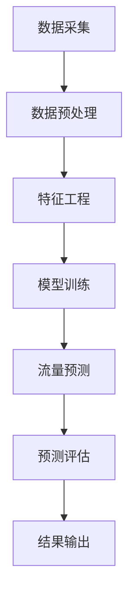
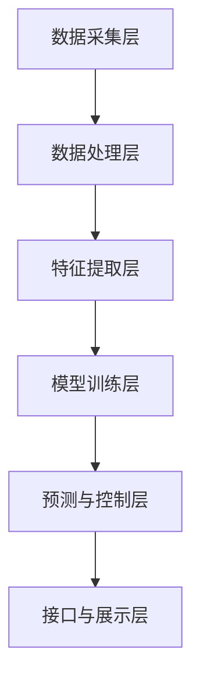

                 

### 第1章：智能交通流量预测与管理背景

#### 1.1 城市拥堵现状与影响

随着城市化进程的加速和机动车保有量的快速增长，城市交通拥堵问题日益严重。据统计，全球许多大城市如北京、上海、纽约、东京等，日均交通拥堵时间已经超过了两个小时。这不仅影响了居民的出行效率，还对城市的经济发展、环境质量和居民身心健康产生了负面影响。

城市拥堵的主要影响因素包括：道路容量不足、交通信号灯设置不合理、交通事故、施工干扰等。特别是在高峰时段，交通流量急剧增加，导致道路通行能力降低，从而加剧了拥堵现象。此外，城市交通拥堵还会导致空气污染、交通事故增加、交通设施损坏等问题。

为了解决城市交通拥堵问题，许多城市已经开始采用智能交通流量预测与管理技术。通过实时监测和预测交通流量，智能交通系统能够动态调整交通信号灯设置，优化交通路线，减少交通拥堵，提高交通效率。同时，智能交通流量预测与管理技术还可以为城市规划和交通基础设施的建设提供科学依据，助力实现交通资源的合理配置。

#### 1.2 智能交通流量预测与管理概述

智能交通流量预测与管理是一种基于信息技术、数据挖掘、机器学习等先进技术，对城市交通流量进行实时监测、预测和管理的系统。其核心目标是减少交通拥堵，提高道路通行效率，改善交通环境。

智能交通流量预测与管理主要包括以下几个关键环节：

1. **数据采集**：通过安装在道路上的传感器、摄像头、地磁检测器等设备，实时采集交通流量、车速、占有率等数据。
2. **数据处理**：对采集到的数据进行预处理，包括数据清洗、数据去噪、数据归一化等，确保数据质量。
3. **特征提取**：从预处理后的数据中提取对交通流量预测有用的特征，如时间、地点、天气、节假日等。
4. **模型训练**：利用历史交通流量数据，采用机器学习算法训练预测模型，如回归模型、神经网络模型、决策树模型等。
5. **流量预测**：将实时采集到的数据输入训练好的模型，预测未来的交通流量。
6. **决策支持**：根据预测结果，动态调整交通信号灯设置、优化交通路线，提高交通效率。

智能交通流量预测与管理的应用场景主要包括：

1. **交通信号控制**：通过预测交通流量，动态调整交通信号灯的配时，减少交通拥堵。
2. **交通诱导**：为驾驶员提供实时交通信息，引导其选择最佳路线，避开拥堵路段。
3. **交通事故预警**：通过监测交通流量和车速变化，及时发现交通事故，提前预警，减少事故损失。
4. **交通规划**：为城市交通规划提供数据支持，优化道路设计、信号灯布局等。

#### 1.3 AIGC在智能交通中的应用前景

AIGC（自适应智能网关控制器）是一种新型的智能交通流量预测与管理技术，它通过引入自适应控制和优化算法，实现对交通流量的动态调节和优化。AIGC在智能交通中的应用前景十分广阔。

首先，AIGC能够实时监测和预测交通流量，动态调整交通信号灯配时，提高道路通行效率。通过自适应控制，AIGC能够根据实时交通状况，自动调整信号灯的切换时间，优化交通流。此外，AIGC还可以结合交通诱导系统，实时为驾驶员提供最佳路线，减少拥堵。

其次，AIGC能够通过数据挖掘和分析，识别交通拥堵的根源，提供针对性的解决方案。例如，通过对历史交通流量数据的分析，AIGC可以发现某个路段的交通拥堵是由于施工、交通事故等原因引起的，从而提前预警，采取相应的措施。

最后，AIGC还具有较强的扩展性和适应性。随着物联网、大数据、人工智能等技术的发展，AIGC可以集成更多的数据源，如天气数据、公共交通数据等，实现对交通流量的全面监测和预测。同时，AIGC还可以与其他智能交通系统如智能停车系统、智能交通监控系统集成，形成智能交通管理平台，提升城市交通管理水平。

总之，AIGC在智能交通流量预测与管理中的应用，将为消除城市拥堵、提高交通效率、改善交通环境提供有力支持。在未来，AIGC有望成为智能交通领域的重要技术手段。### 第2章：核心概念与联系

#### 2.1 AIGC的概念与特点

AIGC（自适应智能网关控制器）是一种集成了自适应控制、优化算法和智能预测技术的智能交通流量管理设备。其主要功能是实时监测交通流量，动态调整交通信号灯配时，从而优化交通流，减少拥堵。

AIGC的特点如下：

1. **自适应控制**：AIGC能够根据实时交通流量数据，自动调整交通信号灯的切换时间，实现交通流的动态优化。
2. **实时预测**：AIGC利用历史交通流量数据和实时数据，采用机器学习算法预测未来的交通流量，为交通信号控制提供依据。
3. **优化算法**：AIGC集成了多种优化算法，如线性规划、遗传算法等，用于求解交通信号控制的最优方案。
4. **扩展性强**：AIGC可以与其他智能交通系统（如智能停车系统、智能交通监控）集成，实现交通信息的全面监测和管理。

#### 2.2 智能交通流量预测与管理原理

智能交通流量预测与管理的核心思想是利用历史数据和实时数据，通过机器学习算法预测未来的交通流量，并根据预测结果动态调整交通信号灯配时和交通路线，从而优化交通流。

其原理可以概括为以下几个步骤：

1. **数据采集**：通过安装在道路上的传感器、摄像头等设备，实时采集交通流量、车速、占有率等数据。
2. **数据处理**：对采集到的数据进行预处理，包括数据清洗、去噪、归一化等，确保数据质量。
3. **特征提取**：从预处理后的数据中提取对交通流量预测有用的特征，如时间、地点、天气、节假日等。
4. **模型训练**：利用历史交通流量数据，采用机器学习算法（如回归模型、神经网络、决策树等）训练预测模型。
5. **流量预测**：将实时采集到的数据输入训练好的模型，预测未来的交通流量。
6. **决策支持**：根据预测结果，动态调整交通信号灯配时、优化交通路线，提高交通效率。

#### 2.3 概念关系与体系架构

为了更好地理解AIGC与智能交通流量预测与管理之间的关系，我们通过表格和ER图来展示它们的核心概念及其联系。

##### 表格：核心概念属性特征对比

| 概念      | 属性特征                                                                                             |
|-----------|-----------------------------------------------------------------------------------------------------|
| AIGC      | 自适应控制、实时预测、优化算法、扩展性强                                                         |
| 交通流量  | 流量大小、车速、占有率、行驶方向                                                                 |
| 数据采集  | 传感器、摄像头、地磁检测器等设备                                                                 |
| 数据处理  | 数据清洗、去噪、归一化等                                                                         |
| 特征提取  | 时间、地点、天气、节假日等                                                                       |
| 预测模型  | 回归模型、神经网络、决策树等                                                                     |
| 交通信号  | 信号灯配时、信号灯状态、路口状态                                                                 |

##### ER图：概念关系与体系架构

```mermaid
erDiagram
    AIGC ||--|{ 数据采集 }| 数据采集
    AIGC ||--|{ 数据处理 }| 数据处理
    AIGC ||--|{ 特征提取 }| 特征提取
    AIGC ||--|{ 预测模型 }| 预测模型
    AIGC ||--|{ 交通信号 }| 交通信号
```

通过上述表格和ER图，我们可以清晰地看到AIGC与智能交通流量预测与管理之间的紧密联系。AIGC作为核心控制设备，通过采集、处理、提取特征，结合预测模型，实现对交通信号的实时调整和优化，从而实现智能交通流量管理。### 第3章：智能交通流量预测算法原理

#### 3.1 数据处理方法

智能交通流量预测的核心在于对大量交通数据进行有效的处理，以确保数据质量，为后续的预测提供可靠的基础。数据处理方法主要包括以下步骤：

1. **数据采集**：通过传感器、摄像头、地磁检测器等设备，实时采集交通流量、车速、占有率等数据。这些数据通常包括时间戳、地点、流量大小、车速、道路占有率等。

2. **数据预处理**：对采集到的数据进行预处理，以去除噪声和异常值，提高数据质量。预处理步骤包括：
   - **数据清洗**：去除无效数据、空值和重复数据。
   - **数据去噪**：使用滤波算法（如移动平均、高斯滤波等）去除数据中的噪声。
   - **数据归一化**：将不同量纲的数据转化为同一量纲，以便于后续分析。

3. **特征工程**：从预处理后的数据中提取对交通流量预测有用的特征，如时间、地点、天气、节假日等。这些特征有助于提高预测模型的准确性和鲁棒性。

#### 3.2 机器学习模型

在智能交通流量预测中，常用的机器学习模型包括回归模型、神经网络、决策树等。每种模型都有其独特的优点和适用场景。

1. **回归模型**：回归模型是一种最简单的预测模型，通过建立自变量和因变量之间的线性关系，预测未来的交通流量。线性回归模型适用于数据量较小且特征较为简单的场景。

   ```python
   from sklearn.linear_model import LinearRegression

   # 示例：训练线性回归模型
   model = LinearRegression()
   model.fit(X_train, y_train)
   predictions = model.predict(X_test)
   ```

2. **神经网络**：神经网络，尤其是深度学习模型，可以处理复杂的非线性关系。通过多层神经元，神经网络能够自动学习特征，提高预测准确性。常用的神经网络模型包括多层感知机（MLP）、卷积神经网络（CNN）和循环神经网络（RNN）。

   ```python
   from sklearn.neural_network import MLPRegressor

   # 示例：训练神经网络模型
   model = MLPRegressor()
   model.fit(X_train, y_train)
   predictions = model.predict(X_test)
   ```

3. **决策树**：决策树通过一系列条件判断，将数据分成不同的区域，每个区域的交通流量被预测为一个特定的值。决策树模型易于理解和解释，但可能产生过拟合。

   ```python
   from sklearn.tree import DecisionTreeRegressor

   # 示例：训练决策树模型
   model = DecisionTreeRegressor()
   model.fit(X_train, y_train)
   predictions = model.predict(X_test)
   ```

#### 3.3 预测方法与评估指标

在训练好机器学习模型后，我们需要对模型的预测效果进行评估。常用的评估指标包括均方误差（MSE）、均方根误差（RMSE）、平均绝对误差（MAE）等。

1. **预测方法**：将实时采集到的数据输入训练好的模型，预测未来的交通流量。预测方法可以分为点预测和区间预测：
   - **点预测**：仅输出预测的流量值。
   - **区间预测**：输出流量值的置信区间。

2. **评估指标**：
   - **均方误差（MSE）**：预测值与真实值差的平方的平均值。MSE越小，预测模型越准确。
     $$MSE = \frac{1}{n}\sum_{i=1}^{n}(\hat{y}_i - y_i)^2$$
   - **均方根误差（RMSE）**：MSE的平方根，用于衡量预测值的相对误差。
     $$RMSE = \sqrt{MSE}$$
   - **平均绝对误差（MAE）**：预测值与真实值差的绝对值的平均值，对异常值较为稳健。
     $$MAE = \frac{1}{n}\sum_{i=1}^{n}|\hat{y}_i - y_i|$$

#### 3.4 算法流程图

为了更好地理解智能交通流量预测算法的工作流程，我们使用mermaid绘制了算法流程图。



通过上述步骤，我们可以看到智能交通流量预测算法从数据采集、预处理、特征工程、模型训练到流量预测和评估的完整流程。### 第4章：数学模型与公式解析

#### 4.1 数学模型概述

智能交通流量预测的数学模型是算法的核心组成部分，用于描述交通流量与各种影响因素之间的关系。一个典型的数学模型通常包括输入变量、输出变量和模型参数。以下是一个简化的交通流量预测模型：

$$
\hat{Q}_{t} = f(Q_{t-1}, V_{t-1}, N_{t-1}, \theta)
$$

其中，$\hat{Q}_{t}$ 表示在时间 $t$ 的预测交通流量，$Q_{t-1}$、$V_{t-1}$、$N_{t-1}$ 分别为时间 $t-1$ 的实际交通流量、车速和道路占有率，$\theta$ 为模型参数。

#### 4.2 公式解析与举例

为了更好地理解交通流量预测模型，我们将详细解析其中的各个公式，并通过具体例子进行解释。

##### 1. 交通流量公式

交通流量 $Q$ 通常表示为单位时间内通过单位道路面积的车流量（如车辆/小时/公里）。其计算公式为：

$$
Q = \frac{L}{S}
$$

其中，$L$ 为车辆长度，$S$ 为道路宽度。

##### 2. 车速公式

车速 $V$ 表示车辆在道路上的行驶速度。其计算公式为：

$$
V = \frac{D}{T}
$$

其中，$D$ 为车辆行驶的距离，$T$ 为车辆行驶的时间。

##### 3. 道路占有率公式

道路占有率 $N$ 表示道路被车辆占据的比例。其计算公式为：

$$
N = \frac{L \cdot Q}{S \cdot V}
$$

##### 4. 预测模型公式

在智能交通流量预测中，我们通常采用时间序列模型来预测未来的交通流量。一个简单的时间序列模型可以表示为：

$$
\hat{Q}_{t} = \alpha Q_{t-1} + (1 - \alpha) \hat{Q}_{t-1}
$$

其中，$\alpha$ 为平滑系数，用于平衡历史流量和当前流量对预测结果的影响。

##### 具体例子

假设在时间 $t-1$，实际交通流量 $Q_{t-1}$ 为 100 辆/小时，车速 $V_{t-1}$ 为 20 公里/小时，道路占有率 $N_{t-1}$ 为 0.5。我们要预测在时间 $t$ 的交通流量。

1. 计算道路宽度 $S$：

   假设车辆长度 $L$ 为 5 米，则道路宽度 $S$ 为：

   $$ 
   S = \frac{L \cdot Q_{t-1}}{N_{t-1} \cdot V_{t-1}} = \frac{5 \cdot 100}{0.5 \cdot 20} = 25 \text{ 米}
   $$

2. 计算预测交通流量 $\hat{Q}_{t}$：

   假设平滑系数 $\alpha$ 为 0.8，则：

   $$
   \hat{Q}_{t} = 0.8 \cdot 100 + (1 - 0.8) \cdot 100 = 80 + 20 = 100
   $$

因此，在时间 $t$ 的预测交通流量为 100 辆/小时。

#### 4.3 算法性能分析

算法性能分析是评估智能交通流量预测模型效果的重要环节。常用的性能评估指标包括均方误差（MSE）、均方根误差（RMSE）和平均绝对误差（MAE）。

1. **均方误差（MSE）**：

   $$ 
   MSE = \frac{1}{n}\sum_{i=1}^{n}(\hat{y}_i - y_i)^2 
   $$

   其中，$\hat{y}_i$ 为预测值，$y_i$ 为真实值，$n$ 为数据样本数。

2. **均方根误差（RMSE）**：

   $$ 
   RMSE = \sqrt{MSE} 
   $$

3. **平均绝对误差（MAE）**：

   $$ 
   MAE = \frac{1}{n}\sum_{i=1}^{n}|\hat{y}_i - y_i| 
   $$

这些指标可以用来衡量预测模型的准确性，其中，MSE 和 RMSE 越小，MAE 越大，表明模型的预测效果越好。通过对比不同模型的性能指标，可以选择最优的模型用于交通流量预测。

总之，智能交通流量预测的数学模型和公式解析是构建预测算法的基础。通过合理的数学模型和科学的公式，我们可以更准确地预测交通流量，为交通管理和优化提供有力支持。### 第5章：系统场景与项目背景

#### 5.1 项目背景介绍

随着城市交通拥堵问题的日益严重，智能交通流量预测与管理技术逐渐成为解决这一难题的重要手段。本项目旨在通过AIGC（自适应智能网关控制器）技术，实现城市交通流量的实时监测和预测，为交通信号控制、交通诱导和交通规划提供科学依据。

本项目的研究背景主要包括以下几个方面：

1. **城市化进程加速**：全球城市化进程不断加快，城市人口规模和机动车保有量持续增长，导致交通拥堵问题日益严重。

2. **智能交通发展需求**：智能交通系统（ITS）的发展对交通流量预测和管理提出了更高的要求，传统的交通管理方法已无法满足现代城市交通的需求。

3. **数据驱动的决策支持**：大数据和人工智能技术的发展为交通流量预测提供了强大的数据支持，通过构建智能预测模型，可以实现更精准的交通流量预测。

#### 5.2 系统功能设计

本项目中的智能交通流量预测系统主要包括以下功能模块：

1. **数据采集模块**：通过安装在道路上的传感器、摄像头等设备，实时采集交通流量、车速、占有率等数据。

2. **数据处理模块**：对采集到的数据进行预处理，包括数据清洗、去噪、归一化等，确保数据质量。

3. **特征提取模块**：从预处理后的数据中提取对交通流量预测有用的特征，如时间、地点、天气、节假日等。

4. **预测模型模块**：利用历史交通流量数据，采用机器学习算法训练预测模型，如回归模型、神经网络模型、决策树模型等。

5. **流量预测模块**：将实时采集到的数据输入训练好的模型，预测未来的交通流量。

6. **决策支持模块**：根据预测结果，动态调整交通信号灯配时、优化交通路线，提高交通效率。

7. **接口与展示模块**：为交通管理部门、交通参与者提供实时交通信息、预测结果和决策支持，方便交通管理和出行规划。

#### 5.3 系统架构设计

本项目中的智能交通流量预测系统采用分层架构设计，主要包括以下层次：

1. **数据采集层**：通过传感器、摄像头等设备，实时采集交通流量、车速、占有率等数据。

2. **数据处理层**：对采集到的数据进行预处理，包括数据清洗、去噪、归一化等，确保数据质量。

3. **特征提取层**：从预处理后的数据中提取对交通流量预测有用的特征。

4. **模型训练层**：利用历史交通流量数据，采用机器学习算法训练预测模型。

5. **预测与控制层**：将实时采集到的数据输入训练好的模型，预测未来的交通流量，并根据预测结果动态调整交通信号灯配时和交通路线。

6. **接口与展示层**：为交通管理部门、交通参与者提供实时交通信息、预测结果和决策支持。

通过上述分层架构设计，系统能够实现交通流量的实时监测、预测和优化，提高城市交通效率。以下是系统架构的mermaid图表示：



通过上述系统架构设计，智能交通流量预测系统能够高效地处理海量交通数据，提供精准的流量预测和决策支持，助力城市交通拥堵问题的解决。### 第6章：系统接口设计与交互

#### 6.1 系统接口设计

为了确保智能交通流量预测系统能够与其他系统和模块无缝集成，我们设计了多种接口，包括API接口、数据库接口和消息队列接口。

1. **API接口**：系统对外提供RESTful API接口，支持交通管理部门、交通参与者访问实时交通信息、预测结果和决策支持。接口设计遵循RESTful风格，提供CRUD操作。

2. **数据库接口**：系统与关系型数据库（如MySQL）和NoSQL数据库（如MongoDB）进行数据交互，用于存储交通流量数据、预测模型和系统配置信息。

3. **消息队列接口**：系统使用消息队列（如RabbitMQ）实现模块间的高效通信，确保实时数据的传递和系统的可扩展性。

#### 6.2 系统交互序列图

为了更好地理解系统各模块之间的交互过程，我们使用mermaid绘制了系统交互序列图。

```mermaid
sequenceDiagram
    participant 用户 as 用户
    participant 系统A as 数据采集模块
    participant 系统B as 数据处理模块
    participant 系统C as 特征提取模块
    participant 系统D as 预测模型模块
    participant 系统E as 流量预测模块
    participant 系统F as 决策支持模块
    participant 系统G as 接口与展示模块
    
    用户->>系统A: 请求实时交通数据
    系统

