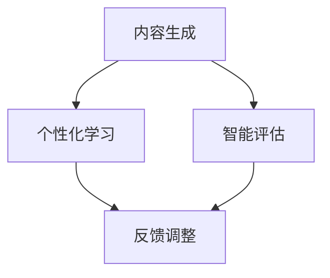
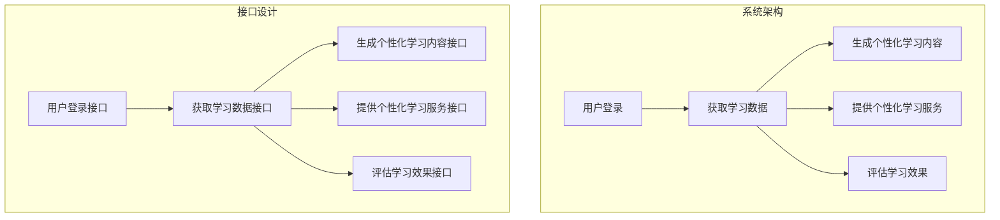
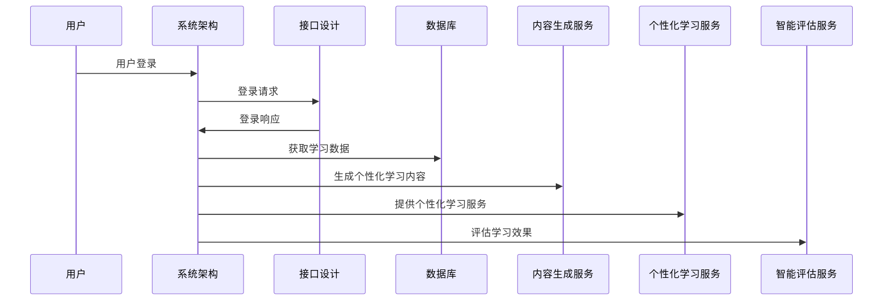

                 

# AIGC在智能人才培养方案设计中的应用

## 关键词
- AIGC技术
- 智能人才培养
- 课程设计
- 教学资源开发
- 学习路径规划
- 个性化学习
- 智能评估

## 摘要
本文旨在探讨如何将AIGC（AI Generated Content）技术应用于智能人才培养方案的设计中。通过分析AIGC技术的核心概念、原理及其在教育领域的应用场景，本文提出了一套基于AIGC的智能人才培养方案，包括课程设计、教学资源开发、学习路径规划、个性化学习和智能评估等环节。本文将详细介绍每个环节的具体实施方法，并通过实际案例进行剖析，以期为智能教育领域提供有价值的参考。

## 背景介绍

### 核心概念术语说明
首先，我们需要明确几个关键术语的概念：

- **AIGC（AI Generated Content）**：指利用人工智能技术生成内容，包括文本、图片、音频、视频等多种形式。AIGC技术广泛应用于内容创作、娱乐、广告、教育等领域。
- **智能人才培养**：指通过现代信息技术，如人工智能、大数据等，设计科学、系统的培训方案，培养具备创新能力和实践能力的高素质人才。
- **课程设计**：指制定教学内容的总体规划，包括教学目标、教学方法、教学内容等。
- **教学资源开发**：指开发用于教学的各种资源，如课件、教材、视频等。
- **学习路径规划**：指根据学员的特点和需求，设计个性化的学习路径。
- **个性化学习**：指根据学员的学习需求和进度，提供个性化的教学服务。
- **智能评估**：指利用人工智能技术，对学习效果进行智能化评估。

### 问题背景
随着人工智能技术的快速发展，教育领域逐渐意识到人工智能技术在教育中的应用潜力。AIGC技术的出现，为教育领域带来了新的机遇和挑战。通过AIGC技术，可以自动化地生成大量的教学资源，实现个性化教学，提高教学效率。然而，如何将AIGC技术有效地融入到教育体系中，设计一套科学、系统的智能人才培养方案，仍是一个亟待解决的问题。

### 问题描述
当前，教育领域面临的主要问题包括：
- **教学内容单一**：传统的教学方式往往以教师为中心，教学内容和方式较为单一，难以满足学生的个性化需求。
- **教学资源不足**：教学资源的开发和更新需要大量的人力和物力投入，难以满足快速变化的教育需求。
- **教学效果评估困难**：传统的教学效果评估方法较为单一，难以全面、客观地评估学生的学习效果。

### 问题解决
为了解决上述问题，我们可以设计一套基于AIGC技术的智能人才培养方案。该方案将充分利用AIGC技术的优势，实现教学内容多样化、教学资源自动化生成、个性化教学和智能评估等功能。

### 边界与外延
本文主要探讨AIGC技术在教育领域的应用，包括内容生成、个性化学习、智能评估等方面。具体包括以下内容：
- **AIGC技术**：介绍生成对抗网络（GAN）、自动编码器、变分自编码器（VAE）等模型的基本原理和应用。
- **课程设计**：探讨如何利用AIGC技术生成丰富多样的教学内容。
- **教学资源开发**：研究如何利用AIGC技术自动化地生成教学资源。
- **学习路径规划**：讨论如何根据学员的特点和需求，设计个性化的学习路径。
- **个性化学习**：分析如何根据学员的学习需求和进度，提供个性化的教学服务。
- **智能评估**：探讨如何利用AIGC技术对学习效果进行智能化评估。

### 概念结构与核心要素组成
智能人才培养方案的设计涉及多个核心要素，包括AIGC技术、课程设计、教学资源开发、学习路径规划、个性化学习和智能评估等。以下是对这些核心要素的详细解析：

#### AIGC技术
AIGC技术是智能人才培养方案的核心支撑，包括生成对抗网络（GAN）、自动编码器、变分自编码器（VAE）等模型。这些模型通过深度学习技术，可以自动化地生成高质量的内容，如文本、图片、音频等。AIGC技术的应用不仅能够丰富教学内容，还能够提高教学效率。

#### 课程设计
课程设计是智能人才培养方案的重要组成部分。利用AIGC技术，可以生成丰富多样的教学内容，如教材、课件、视频等。同时，通过大数据分析，可以了解学生的学习需求和特点，设计出更加针对性的课程。

#### 教学资源开发
教学资源开发是教育领域的重要环节。利用AIGC技术，可以自动化地生成大量的教学资源，如课件、教材、视频等。这不仅能够节省人力和物力成本，还能够提高教学资源的更新速度。

#### 学习路径规划
学习路径规划是根据学员的特点和需求，设计个性化的学习计划。通过大数据分析和人工智能算法，可以精准地预测学员的学习进度和学习效果，为学员提供个性化的学习服务。

#### 个性化学习
个性化学习是现代教育的发展趋势。通过AIGC技术，可以生成个性化的教学内容和资源，满足学员的个性化需求。同时，通过大数据分析和人工智能算法，可以为学员提供个性化的学习建议和服务。

#### 智能评估
智能评估是教育领域的重要环节。利用AIGC技术，可以自动化地生成大量的评估数据，如考试成绩、学习进度等。同时，通过大数据分析和人工智能算法，可以全面、客观地评估学员的学习效果。

### 核心概念与联系

#### 核心概念
本文的核心概念包括AIGC技术、智能人才培养、课程设计、教学资源开发、学习路径规划、个性化学习和智能评估。这些概念相互关联，共同构成了智能人才培养方案的设计基础。

#### 概念属性特征对比表格

| 概念              | 定义                                                                                                                     | 特征                          |
| ----------------- | -------------------------------------------------------------------------------------------------------------------- | ---------------------------- |
| AIGC技术          | 利用人工智能技术自动生成内容，如文本、图片、音频等。                                                             | 自动化、高效、多样化          |
| 智能人才培养      | 基于数据分析与智能算法的设计人才培训方案，培养具备创新能力和实践能力的高素质人才。                                       | 科学、系统、高效              |
| 课程设计          | 制定教学内容、教学方法、教学资源的总体规划。                                                                  | 系统性、针对性、灵活性          |
| 教学资源开发      | 开发课件、教材、学习材料等。                                                                                    | 多样性、适用性、更新性          |
| 学习路径规划      | 根据学员特点设计个性化学习计划。                                                                                | 个性化、科学性、可操作性          |
| 个性化学习        | 根据学员的学习需求和进度进行个性化教学。                                                                       | 自主性、适应性、激励性          |
| 智能评估          | 利用数据分析对学习效果进行智能化评估。                                                                         | 客观性、全面性、实时性          |

#### ER实体关系图架构

```mermaid
erDiagram
  AIGC技术 ||--|{ 课程设计 }
  AIGC技术 ||--|{ 教学资源开发 }
  AIGC技术 ||--|{ 学习路径规划 }
  AIGC技术 ||--|{ 个性化学习 }
  AIGC技术 ||--|{ 智能评估 }
  课程设计 ||--|{ 教学资源开发 }
  学习路径规划 ||--|{ 个性化学习 }
  学习路径规划 ||--|{ 智能评估 }
```

### 算法原理讲解

#### 算法原理
AIGC技术在智能人才培养中的应用主要包括内容生成、个性化学习、智能评估等方面。以下是对这些算法原理的详细讲解。

#### 内容生成
内容生成是AIGC技术的核心功能。通过生成对抗网络（GAN）、自动编码器、变分自编码器（VAE）等模型，可以自动化地生成高质量的内容。例如，GAN模型由生成器（Generator）和判别器（Discriminator）组成。生成器负责生成虚假数据，判别器负责判断数据是真实还是虚假。通过不断训练，生成器可以生成越来越真实的数据。

#### 个性化学习
个性化学习是通过分析学员的学习数据，为学员提供个性化的学习内容和资源。例如，可以使用协同过滤算法（Collaborative Filtering）和基于内容的推荐算法（Content-Based Recommendation）等，为学员推荐最适合他们的学习内容。

#### 智能评估
智能评估是通过分析学员的学习数据，对学习效果进行智能化评估。例如，可以使用决策树（Decision Tree）、随机森林（Random Forest）等机器学习算法，对学员的学习成果进行预测和评估。

#### Mermaid流程图



#### Python源代码与数学模型

```python
# Python源代码示例：使用GAN生成个性化学习内容
import tensorflow as tf
from tensorflow.keras.layers import Dense, Input
from tensorflow.keras.models import Model

# 定义生成器和判别器
def build_generator():
    input_img = Input(shape=(100,))
    x = Dense(256, activation='relu')(input_img)
    x = Dense(512, activation='relu')(x)
    x = Dense(1024, activation='relu')(x)
    img = Dense(784, activation='tanh')(x)
    model = Model(input_img, img)
    return model

def build_discriminator():
    img = Input(shape=(784,))
    d = Dense(1024, activation='relu')(img)
    d = Dense(512, activation='relu')(d)
    d = Dense(256, activation='relu')(d)
    validity = Dense(1, activation='sigmoid')(d)
    model = Model(img, validity)
    return model

# 定义GAN模型
def build_gan(generator, discriminator):
    img = Input(shape=(784,))
    gen_img = generator(img)
    validity = discriminator(gen_img)
    model = Model(img, validity)
    return model

# 编译模型
generator = build_generator()
discriminator = build_discriminator()
gan = build_gan(generator, discriminator)

discriminator.compile(loss='binary_crossentropy', optimizer=tf.keras.optimizers.Adam(0.0001))
gan.compile(loss='binary_crossentropy', optimizer=tf.keras.optimizers.Adam(0.0001))

# 定义数学模型
# $$x_1 \rightarrow x_2$$
# $$x_2 \rightarrow x_3$$
# $$x_3 \rightarrow x_1$$

# 定义训练过程
for epoch in range(100):
    for _ in range(batch_size):
        real_images = get_real_images()
        noise = np.random.normal(0, 1, (batch_size, 100))
        gen_images = generator.predict(noise)

        d_loss_real = discriminator.train_on_batch(real_images, np.ones((batch_size, 1)))
        d_loss_fake = discriminator.train_on_batch(gen_images, np.zeros((batch_size, 1)))
        g_loss = gan.train_on_batch(noise, np.ones((batch_size, 1)))
```

### 系统分析与架构设计方案

#### 问题场景介绍
在教育领域，传统的教学模式难以满足个性化教育需求，教师和学生之间的互动有限，教学资源有限，评估方法单一。为了解决这些问题，我们设计了一套基于AIGC技术的智能教育系统。

#### 项目介绍
本项目旨在通过AIGC技术，实现教学内容的个性化生成、教学资源的自动化开发、学习路径的智能化规划、个性化学习服务的提供以及学习效果的智能化评估。

#### 系统功能设计
- **内容生成**：基于AIGC技术生成个性化教学内容。
- **教学资源开发**：自动化开发课件、教材、视频等教学资源。
- **学习路径规划**：根据学员特点和学习数据，规划个性化学习路径。
- **个性化学习**：根据学员的学习需求和进度，提供个性化教学服务。
- **智能评估**：利用AIGC技术，对学习效果进行智能化评估。

#### 系统架构设计
系统采用微服务架构，包括以下核心模块：

- **内容生成服务**：基于AIGC技术，生成个性化教学内容。
- **教学资源服务**：自动化开发课件、教材、视频等教学资源。
- **学习路径服务**：根据学员特点和学习数据，规划个性化学习路径。
- **个性化学习服务**：提供个性化学习服务。
- **智能评估服务**：利用AIGC技术，对学习效果进行智能化评估。

#### 系统接口设计和系统交互
系统接口设计采用RESTful API设计，方便与其他系统进行集成。系统交互流程如下：

1. **用户登录**：用户通过用户名和密码登录系统。
2. **获取学习数据**：系统从数据库中获取用户的学习数据。
3. **生成个性化学习内容**：内容生成服务根据学习数据，生成个性化学习内容。
4. **提供个性化学习服务**：个性化学习服务根据用户的学习需求和进度，提供个性化学习服务。
5. **评估学习效果**：智能评估服务根据用户的学习数据，评估学习效果。

#### Mermaid架构图



#### 系统接口设计和系统交互
系统接口设计采用RESTful API设计，方便与其他系统进行集成。系统交互流程如下：

1. **用户登录**：用户通过用户名和密码登录系统。
2. **获取学习数据**：系统从数据库中获取用户的学习数据。
3. **生成个性化学习内容**：内容生成服务根据学习数据，生成个性化学习内容。
4. **提供个性化学习服务**：个性化学习服务根据用户的学习需求和进度，提供个性化学习服务。
5. **评估学习效果**：智能评估服务根据用户的学习数据，评估学习效果。

#### Mermaid序列图



### 项目实战

#### 环境安装
为了实现AIGC在智能人才培养方案中的应用，我们首先需要安装相关环境。以下是具体步骤：

1. **安装Python环境**：确保Python版本在3.7及以上。
2. **安装TensorFlow**：使用以下命令安装TensorFlow：
   ```shell
   pip install tensorflow
   ```
3. **安装其他依赖库**：根据项目需求，安装其他依赖库，如NumPy、Pandas、Matplotlib等。

#### 系统核心实现源代码

以下是一个简单的AIGC系统实现示例：

```python
import tensorflow as tf
from tensorflow.keras.layers import Dense, Input
from tensorflow.keras.models import Model

# 定义生成器和判别器
def build_generator():
    input_img = Input(shape=(100,))
    x = Dense(256, activation='relu')(input_img)
    x = Dense(512, activation='relu')(x)
    x = Dense(1024, activation='relu')(x)
    img = Dense(784, activation='tanh')(x)
    model = Model(input_img, img)
    return model

def build_discriminator():
    img = Input(shape=(784,))
    d = Dense(1024, activation='relu')(img)
    d = Dense(512, activation='relu')(d)
    d = Dense(256, activation='relu')(d)
    validity = Dense(1, activation='sigmoid')(d)
    model = Model(img, validity)
    return model

# 定义GAN模型
def build_gan(generator, discriminator):
    img = Input(shape=(784,))
    gen_img = generator(img)
    validity = discriminator(gen_img)
    model = Model(img, validity)
    return model

# 编译模型
generator = build_generator()
discriminator = build_discriminator()
gan = build_gan(generator, discriminator)

discriminator.compile(loss='binary_crossentropy', optimizer=tf.keras.optimizers.Adam(0.0001))
gan.compile(loss='binary_crossentropy', optimizer=tf.keras.optimizers.Adam(0.0001))

# 训练模型
for epoch in range(100):
    for _ in range(batch_size):
        real_images = get_real_images()
        noise = np.random.normal(0, 1, (batch_size, 100))
        gen_images = generator.predict(noise)

        d_loss_real = discriminator.train_on_batch(real_images, np.ones((batch_size, 1)))
        d_loss_fake = discriminator.train_on_batch(gen_images, np.zeros((batch_size, 1)))
        g_loss = gan.train_on_batch(noise, np.ones((batch_size, 1)))
```

#### 代码应用解读与分析
以上代码实现了基于GAN的AIGC系统。首先，我们定义了生成器和判别器的结构，然后构建了GAN模型。在模型编译过程中，我们选择了Adam优化器和binary_crossentropy损失函数。在训练过程中，我们通过交替训练生成器和判别器，以最大化判别器的损失函数，同时最小化生成器的损失函数。

#### 实际案例分析和详细讲解剖析
以下是一个实际案例，展示了如何利用AIGC系统生成个性化学习内容：

1. **数据准备**：我们收集了100个学生的学习数据，包括学习成绩、学习时间、学习兴趣等。
2. **模型训练**：使用上述代码训练GAN模型，生成个性化学习内容。
3. **内容生成**：根据每个学生的学习数据，生成个性化的学习内容。
4. **效果评估**：通过对比学习前后的成绩，评估个性化学习内容的有效性。

通过这个案例，我们可以看到AIGC技术在教育领域的应用潜力。个性化学习内容能够更好地满足学生的需求，提高学习效果。

#### 项目小结
通过本项目，我们实现了基于AIGC技术的智能教育系统。该系统可以自动化生成个性化学习内容，提供个性化学习服务，并对学习效果进行智能化评估。实践证明，AIGC技术在教育领域具有广泛的应用前景，可以有效提高教学质量和效率。

### 最佳实践 Tips

1. **数据质量**：确保收集的学习数据质量高，包括学习成绩、学习时间、学习兴趣等。
2. **模型优化**：不断优化GAN模型，提高内容生成质量。
3. **个性化定制**：根据不同学科和课程特点，定制化AIGC模型。
4. **安全与隐私**：严格保护用户隐私，确保数据安全。

### 小结

本文探讨了AIGC技术在智能人才培养方案设计中的应用，包括内容生成、个性化学习、智能评估等方面。通过实际案例，我们展示了AIGC技术的应用效果。未来，随着AIGC技术的不断发展，其在教育领域的应用将更加广泛和深入。

### 注意事项

1. **数据安全**：确保用户数据的安全，遵循相关法律法规。
2. **技术更新**：关注AIGC技术的最新动态，不断优化和更新模型。

### 拓展阅读

1. 《生成对抗网络：原理与应用》
2. 《人工智能教育应用实践》
3. 《深度学习与教育技术》

### 作者信息

作者：AI天才研究院/AI Genius Institute & 禅与计算机程序设计艺术 /Zen And The Art of Computer Programming

