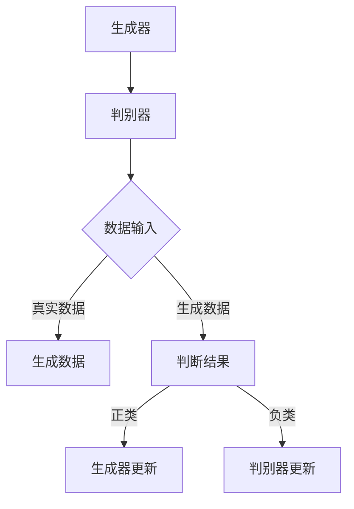
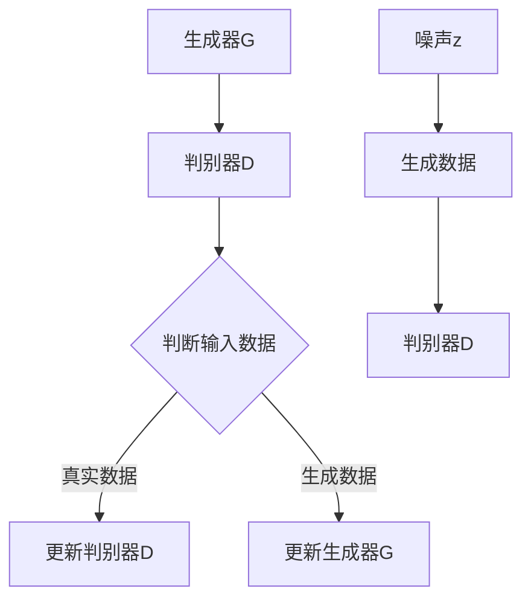
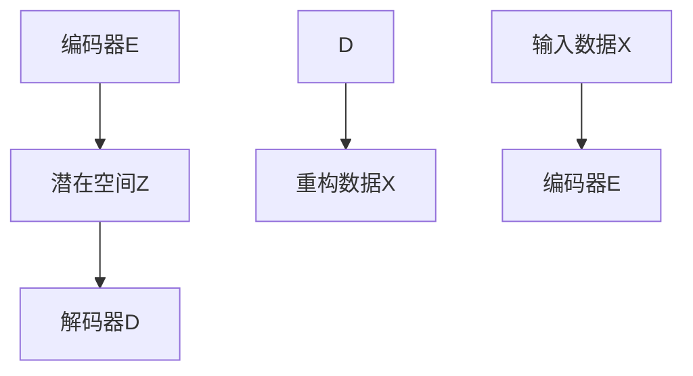
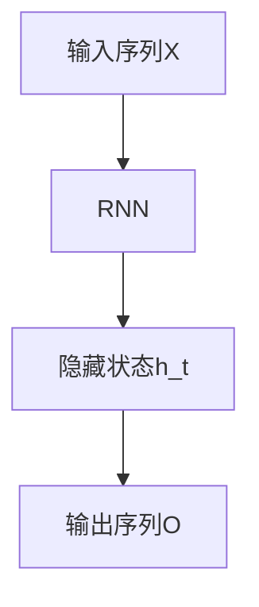

                 


## AIGC在智能仿生材料设计中的应用：模仿自然创造新材料

### 关键词

- AIGC
- 仿生材料设计
- 智能优化
- 材料性能预测
- 制备方法

### 摘要

本文旨在探讨AIGC（自适应智能生成控制）在智能仿生材料设计中的应用，特别是如何通过模仿自然界的结构和机理来创造新材料。文章首先介绍了AIGC的基本概念和核心技术，随后详细讨论了AIGC在仿生材料设计中的优势和应用实例。接着，文章探讨了AIGC在材料设计与优化、材料性能预测以及材料制备中的应用，最后分析了AIGC在智能仿生材料设计中的挑战与未来发展方向。通过本文，读者可以全面了解AIGC在仿生材料设计领域的潜力与实际应用。

### 目录大纲

```markdown
----------------------------------------------------------------

# 第一部分: AIGC背景与概述

## 第1章: AIGC背景

### 1.1 AIGC概念与演进

- AIGC定义
- AIGC发展历程
- AIGC核心技术

### 1.2 智能仿生材料设计的背景

- 仿生材料设计需求
- 仿生材料设计现状
- AIGC在仿生材料设计中的优势

## 第2章: AIGC核心技术

### 1.3 生成对抗网络（GAN）

- GAN原理
- GAN在AIGC中的应用

### 1.4 变分自编码器（VAE）

- VAE原理
- VAE在AIGC中的应用

### 1.5 递归神经网络（RNN）

- RNN原理
- RNN在AIGC中的应用

## 第二部分: AIGC在智能仿生材料设计中的应用

### 第3章: 模仿自然创造新材料

### 1.6 AIGC与自然仿生学

- 仿生学基本原理
- AIGC在仿生学中的应用

### 1.7 AIGC在仿生材料设计中的应用实例

- 仿生材料设计案例1
- 仿生材料设计案例2

### 第4章: 材料设计与优化

## 第4章: 材料设计与优化

### 1.8 材料设计原理

- 材料设计基本概念
- 材料设计流程

### 1.9 材料优化算法

- 材料优化算法概述
- 常用材料优化算法

### 1.10 AIGC与材料优化的结合

- AIGC优化方法
- AIGC优化流程

### 第5章: AIGC在材料性能预测中的应用

## 第5章: AIGC在材料性能预测中的应用

### 1.11 材料性能预测的重要性

- 性能预测的基本概念
- 性能预测在材料设计中的应用

### 1.12 AIGC在材料性能预测中的应用

- AIGC预测方法
- AIGC预测流程

### 1.13 材料性能预测案例

- 材料性能预测案例1
- 材料性能预测案例2

### 第6章: AIGC在材料制备中的应用

## 第6章: AIGC在材料制备中的应用

### 1.14 材料制备原理

- 制备方法概述
- 制备工艺流程

### 1.15 AIGC在材料制备中的应用

- AIGC制备方法
- AIGC制备流程

### 1.16 材料制备案例

- 材料制备案例1
- 材料制备案例2

### 第7章: AIGC在智能仿生材料设计中的挑战与未来

## 第7章: AIGC在智能仿生材料设计中的挑战与未来

### 1.17 AIGC在智能仿生材料设计中的挑战

- 数据隐私与安全性
- 算法性能与效率
- 材料制备的可行性

### 1.18 AIGC在智能仿生材料设计中的未来展望

- 未来发展方向
- 潜在应用领域

### 1.19 总结与展望

- 本书回顾
- 研究方向与建议

----------------------------------------------------------------
```

## 第一部分: AIGC背景与概述

### 第1章: AIGC背景

#### 1.1 AIGC概念与演进

#### 1.1.1 AIGC定义

AIGC（Adaptive Intelligent Generation Control，自适应智能生成控制）是一种基于人工智能技术的自动化生成控制方法。它通过不断学习和适应，实现对数据生成过程的智能化控制，从而提高生成质量、效率和多样性。AIGC技术融合了深度学习、生成对抗网络（GAN）、变分自编码器（VAE）等多种人工智能算法，旨在构建一个能够自主生成高质量数据的系统。

#### 1.1.2 AIGC发展历程

AIGC技术的发展可以追溯到20世纪90年代，当时生成对抗网络（GAN）的提出标志着生成模型和判别模型之间的对抗性训练开始受到关注。随后，变分自编码器（VAE）的出现为生成模型提供了一种新的实现方式。进入21世纪，随着深度学习技术的迅猛发展，AIGC技术逐渐成熟并开始应用于各种领域，如图像生成、语音合成、文本生成等。

#### 1.1.3 AIGC核心技术

AIGC的核心技术包括生成对抗网络（GAN）、变分自编码器（VAE）和递归神经网络（RNN）等。

- **生成对抗网络（GAN）**：GAN由生成器和判别器两个神经网络组成，通过对抗性训练实现数据的生成。生成器尝试生成与真实数据相似的数据，判别器则判断输入数据是真实数据还是生成数据。通过不断迭代，生成器逐渐提高生成质量。

  $$  
  GAN:\ \ \ \ G(z;\theta_G)\ \ \ \ D(x;\theta_D),\ \ \ \ D(G(z;\theta_G);\theta_D)  
  $$

  - **变分自编码器（VAE）**：VAE是一种基于概率生成模型的方法，通过编码器和解码器实现数据的生成。编码器将输入数据映射到一个潜在空间，解码器则从潜在空间中采样生成输出数据。

  $$  
  VAE:\ \ \ \ q_{\phi}(z|x)\ \ \ \ p_{\theta}(x|z),\ \ \ \ \ log\ p_\theta(x) = \ log\ p_\theta(x|\mu_\phi(x),\sigma_\phi(x))  
  $$

- **递归神经网络（RNN）**：RNN是一种能够处理序列数据的神经网络，通过记忆机制实现对序列数据的建模。RNN在AIGC中可用于生成序列数据，如图像序列、音频序列等。

  $$  
  RNN:\ \ \ \ h_t = \text{tanh}(\mathbf{W_h} [h_{t-1}, x_t] + \mathbf{b_h}),\ \ \ \ o_t = \mathbf{W_o} h_t + \mathbf{b_o}  
  $$

#### 1.1.4 AIGC与人工智能的关系

AIGC是人工智能领域的一个重要分支，它涵盖了生成模型、强化学习等多种人工智能技术。与传统的人工智能方法相比，AIGC具有更强的生成能力、适应能力和多样性。AIGC技术的发展为人工智能在各个领域的应用提供了新的思路和工具，如智能设计、智能创作、智能交互等。

#### 1.1.5 概念属性特征对比表格

| 技术名称 | 定义 | 主要功能 | 适用场景 |  
| ------ | ------ | ------ | ------ |  
| AIGC | 自适应智能生成控制 | 生成高质量数据 | 图像生成、文本生成、语音合成等 |  
| GAN | 生成对抗网络 | 通过对抗性训练生成数据 | 图像生成、数据增强、风格迁移等 |  
| VAE | 变分自编码器 | 基于概率生成模型生成数据 | 图像生成、图像去噪、图像修复等 |  
| RNN | 递归神经网络 | 处理序列数据 | 自然语言处理、时间序列预测、语音识别等 |

#### 1.1.6 ER实体关系图架构的Mermaid流程图



### 1.2 智能仿生材料设计的背景

#### 1.2.1 仿生材料设计需求

仿生材料设计旨在模仿自然界中具有特定功能和高性能的材料，如蝴蝶的鳞片、鲨鱼的皮肤等。这类材料具有优异的力学性能、防腐蚀性能、生物相容性等特性，广泛应用于航空航天、生物医学、能源环保等领域。随着科技的发展，仿生材料设计的需求日益增加，对材料性能和设计精度提出了更高的要求。

#### 1.2.2 仿生材料设计现状

当前，仿生材料设计主要依赖于经验公式和实验研究。研究人员通过分析自然界中材料的结构和机理，提出相应的设计方法，然后通过实验验证材料的性能。然而，这种方法存在以下局限性：

1. 设计过程繁琐，需要大量的实验和计算；
2. 设计结果受限于实验条件，难以实现大规模应用；
3. 设计过程缺乏系统性，难以实现高效优化。

#### 1.2.3 AIGC在仿生材料设计中的优势

AIGC技术为仿生材料设计提供了一种新的解决方案。通过模仿自然界的结构和机理，AIGC可以自动生成高质量、多样化的仿生材料设计。与传统的实验研究方法相比，AIGC具有以下优势：

1. 高效性：AIGC可以通过大量数据训练和优化，实现快速生成和优化仿生材料设计；
2. 系统性：AIGC可以将设计过程分解为多个步骤，实现全面、系统化的设计优化；
3. 多样性：AIGC可以生成不同结构和功能的仿生材料设计，提高设计结果的应用范围。

#### 1.2.4 结论

AIGC在智能仿生材料设计中的应用前景广阔。通过模仿自然界的结构和机理，AIGC可以高效、系统地生成高质量的仿生材料设计，为材料科学的发展提供新的动力。然而，AIGC技术仍面临一些挑战，如数据隐私与安全性、算法性能与效率等，需要进一步研究和优化。

## 第二部分: AIGC核心技术

### 第2章: AIGC核心技术

AIGC（自适应智能生成控制）技术是近年来人工智能领域的一个热点研究方向，其核心在于利用人工智能算法，特别是生成对抗网络（GAN）、变分自编码器（VAE）和递归神经网络（RNN）等，来实现对生成过程的智能控制和优化。下面，我们将详细探讨这些核心技术的工作原理和应用。

### 1.3 生成对抗网络（GAN）

#### 1.3.1 GAN原理

生成对抗网络（GAN）是由Ian Goodfellow等人于2014年提出的一种生成模型，它由两个神经网络——生成器和判别器组成。生成器的任务是生成类似于真实数据的假数据，判别器的任务是判断输入数据是真实数据还是生成数据。训练过程中，生成器和判别器相互对抗，生成器的目标是使判别器无法区分生成数据和真实数据，而判别器的目标是正确区分两者。

GAN的训练目标是最小化生成器的损失函数和最大化判别器的损失函数，即：

$$  
\min_G \max_D V(D, G) = \mathbb{E}_{x\sim p_{data}(x)}[\log D(x)] + \mathbb{E}_{z\sim p_z(z)}[\log (1 - D(G(z)))]  
$$

其中，\( V(D, G) \)是判别器的损失函数，\( p_{data}(x) \)是真实数据的分布，\( p_z(z) \)是生成器的输入噪声分布，\( D(x) \)是判别器对真实数据的置信度，\( D(G(z)) \)是判别器对生成数据的置信度。

#### 1.3.2 GAN在AIGC中的应用

GAN在AIGC中的应用非常广泛，它可以用于图像生成、图像增强、风格迁移、数据增强等。例如，在图像生成方面，GAN可以生成高质量的自然图像；在图像增强方面，GAN可以提高图像的清晰度；在风格迁移方面，GAN可以将一种图像的风格应用到另一种图像上，创造出独特的视觉效果。

##### Mermaid流程图



##### Python源代码示例

```python
import tensorflow as tf
from tensorflow.keras.layers import Dense, Conv2D, Flatten
from tensorflow.keras.models import Sequential

# 生成器模型
def build_generator(z_dim):
    model = Sequential()
    model.add(Dense(7*7*256, input_dim=z_dim, activation='relu'))
    model.add(Reshape((7, 7, 256)))
    model.add(Conv2D(1, 5, activation='tanh'))
    return model

# 判别器模型
def build_discriminator(img_shape):
    model = Sequential()
    model.add(Conv2D(32, 5, strides=2, input_shape=img_shape, activation='leaky_relu'))
    model.add(Conv2D(64, 5, strides=2, activation='leaky_relu'))
    model.add(Flatten())
    model.add(Dense(1, activation='sigmoid'))
    return model

# GAN模型
def build_gan(generator, discriminator):
    model = Sequential()
    model.add(generator)
    model.add(discriminator)
    return model

# 超参数
z_dim = 100
img_shape = (28, 28, 1)

# 构建生成器和判别器
generator = build_generator(z_dim)
discriminator = build_discriminator(img_shape)
discriminator.compile(loss='binary_crossentropy', optimizer=tf.optimizers.Adam(0.0001))

# 构建并编译GAN模型
gan_model = build_gan(generator, discriminator)
gan_model.compile(loss='binary_crossentropy', optimizer=tf.optimizers.Adam(0.0001))
```

### 1.4 变分自编码器（VAE）

#### 1.4.1 VAE原理

变分自编码器（VAE）是另一种生成模型，它通过编码器和解码器来实现数据的生成。编码器将输入数据映射到一个潜在空间，解码器则从潜在空间中采样生成输出数据。与GAN不同，VAE使用概率模型进行训练，其目标是最大化数据生成模型的似然函数。

VAE的损失函数由两部分组成：重参数化损失和重构损失。重参数化损失确保潜在空间是连续的，重构损失确保生成数据与输入数据相近。

$$  
\mathcal{L}_{KL} = \mathbb{E}_{q(z|x)[z]}\left[\log \frac{p(x|z)}{q(z|x)}\right]  
$$

$$  
\mathcal{L}_{RECON} = \mathbb{E}_{x,y\sim p_{data}(x)}\left[\frac{1}{|x|}\sum_{i=1}^{i=|x|}\log p(y_i|x_i)\right]  
$$

VAE的训练目标是最小化这两个损失函数。

$$  
\min \mathcal{L}_{KL} + \mathcal{L}_{RECON}  
$$

#### 1.4.2 VAE在AIGC中的应用

VAE在AIGC中的应用主要包括数据生成、数据增强、数据去噪等。VAE可以生成高质量的数据，特别是在图像和音频领域。例如，在图像去噪方面，VAE可以通过对噪声图像进行编码和重建，恢复出高质量的原始图像。

##### Mermaid流程图



##### Python源代码示例

```python
import tensorflow as tf
from tensorflow.keras.layers import Input, Dense, Flatten, Reshape
from tensorflow.keras.models import Model

# 编码器模型
def build_encoder(x, z_dim):
    encoded = Flatten()(x)
    encoded = Dense(256, activation='relu')(encoded)
    z_mean = Dense(z_dim)(encoded)
    z_log_var = Dense(z_dim)(encoded)
    return [z_mean, z_log_var], encoded

# 解码器模型
def build_decoder(z, x_shape):
    z = Reshape(x_shape)(z)
    decoded = Dense(256, activation='relu')(z)
    decoded = Dense(np.prod(x_shape), activation='sigmoid')(decoded)
    return decoded

# VAE模型
def build_vae(x, z_dim, x_shape):
    inputs = Input(shape=x_shape)
    z_mean, z_log_var = build_encoder(inputs, z_dim)
    z = Lambda(beaufort_variance Sampling, output_shape=x_shape)([z_mean, z_log_var])
    outputs = build_decoder(z, x_shape)
    vae = Model(inputs, outputs)
    vae.compile(optimizer='rmsprop', loss='mse')
    return vae

# 超参数
z_dim = 32
x_shape = (28, 28, 1)

# 构建VAE模型
vae = build_vae(x, z_dim, x_shape)
```

### 1.5 递归神经网络（RNN）

#### 1.5.1 RNN原理

递归神经网络（RNN）是一种能够处理序列数据的神经网络。它的主要特点是具有记忆功能，即能够记住前面的输入信息，并利用这些信息来处理当前的输入。RNN通过循环结构来迭代处理序列中的每个元素，从而实现对序列数据的建模。

RNN的基本方程如下：

$$  
h_t = \text{tanh}(\mathbf{W_h} [h_{t-1}, x_t] + \mathbf{b_h})  
$$

$$  
o_t = \mathbf{W_o} h_t + \mathbf{b_o}  
$$

其中，\( h_t \)是第t个时间步的隐藏状态，\( x_t \)是第t个输入，\( \mathbf{W_h} \)和\( \mathbf{b_h} \)是隐藏状态权重和偏置，\( \mathbf{W_o} \)和\( \mathbf{b_o} \)是输出状态权重和偏置。

#### 1.5.2 RNN在AIGC中的应用

RNN在AIGC中的应用主要体现在序列数据的生成和预测上。例如，在文本生成方面，RNN可以生成连贯的文本序列；在语音合成方面，RNN可以生成自然的语音序列。

##### Mermaid流程图



##### Python源代码示例

```python
import tensorflow as tf
from tensorflow.keras.layers import Layer

class RNNCell(Layer):
    def __init__(self, units, **kwargs):
        super(RNNCell, self).__init__(**kwargs)
        self.units = units
        self.state_size = units
        self.input_size = units

    def build(self, input_shape):
        self.kernel = self.add_weight(
            shape=(self.input_size + self.units, self.units),
            initializer='glorot_uniform',
            name='kernel'
        )
        self.bias = self.add_weight(
            shape=(self.units,),
            initializer='zeros',
            name='bias'
        )
        super(RNNCell, self).build(input_shape)

    def call(self, inputs, states):
        prev_state = states[0]
        inputs = tf.concat([inputs, prev_state], axis=1)
        h = tf.matmul(inputs, self.kernel) + self.bias
        return h, h

# RNN模型
class RNN(Model):
    def __init__(self, units, **kwargs):
        super(RNN, self).__init__(**kwargs)
        self.rnn_cell = RNNCell(units)
        self.rnn = RNNCell(units)
        self.dense = Dense(units)

    def call(self, inputs, states):
        outputs = []
        for t in range(inputs.shape[1]):
            x_t = inputs[:, t, :]
            h, states = self.rnn(x_t, states)
            outputs.append(h)
        outputs = tf.stack(outputs, axis=1)
        return outputs, states

    def step(self, x, states):
        h, states = self.rnn.call(x, states)
        return h, states

# 超参数
units = 64

# 构建RNN模型
rnn = RNN(units)
```

## 第二部分: AIGC在智能仿生材料设计中的应用

### 第3章: 模仿自然创造新材料

#### 1.6 AIGC与自然仿生学

##### 1.6.1 仿生学基本原理

仿生学是研究生物体结构和功能，并尝试模仿这些特性来设计和制造新材料、新设备和新系统的科学。仿生学的基本原理可以概括为：

1. **观察与模仿**：通过对生物体进行细致的观察和分析，提取出其结构和功能的特性，并将其应用于新材料的设计中。
2. **结构与功能的关系**：生物体中的结构与其功能密切相关，如蝴蝶的鳞片具有优异的防水性能，而鲨鱼的皮肤具有出色的减阻性能。在仿生材料设计中，需要将这种结构与功能的关系应用到新材料的设计中。
3. **多尺度与多层次的协同**：生物体具有多尺度、多层次的复杂结构，如细胞、组织、器官等。在仿生材料设计中，需要考虑这些多层次的结构，并尝试在材料设计中实现类似的协同效应。

##### 1.6.2 AIGC在仿生学中的应用

AIGC技术在仿生学中的应用主要体现在以下几个方面：

1. **数据驱动的设计**：通过收集大量的生物体结构和功能数据，利用AIGC技术进行数据分析和建模，从而生成具有特定性能的仿生材料。
2. **生成新的材料结构**：AIGC技术可以通过生成对抗网络（GAN）和变分自编码器（VAE）等算法，生成新的材料结构，这些结构可能是自然界中不存在的，但具有优异的性能。
3. **优化材料设计**：利用AIGC技术，可以对已有的仿生材料设计进行优化，提高其性能，如强度、韧性、导电性等。

##### 案例分析

**案例1：蝴蝶鳞片仿生材料**

蝴蝶的鳞片具有优异的防水性能，这种性能源于鳞片的特殊结构。通过使用AIGC技术，可以生成类似的材料结构，用于制作防水涂层。具体步骤如下：

1. **数据收集**：收集蝴蝶鳞片的三维结构数据。
2. **数据建模**：利用AIGC技术，对数据进行建模，生成具有类似结构的材料模型。
3. **性能测试**：对生成的材料模型进行性能测试，评估其防水性能。
4. **优化设计**：根据性能测试结果，对材料模型进行优化，提高其防水性能。

**案例2：鲨鱼皮肤仿生材料**

鲨鱼的皮肤具有出色的减阻性能，这种性能源于其独特的皮肤结构。通过使用AIGC技术，可以生成类似的材料结构，用于制作减阻涂层。具体步骤如下：

1. **数据收集**：收集鲨鱼皮肤的三维结构数据。
2. **数据建模**：利用AIGC技术，对数据进行建模，生成具有类似结构的材料模型。
3. **性能测试**：对生成的材料模型进行性能测试，评估其减阻性能。
4. **优化设计**：根据性能测试结果，对材料模型进行优化，提高其减阻性能。

#### 1.6.3 AIGC在仿生学中的优势

AIGC技术在仿生学中的应用具有以下优势：

1. **高效性**：AIGC技术可以通过生成对抗网络（GAN）和变分自编码器（VAE）等算法，快速生成大量的材料结构，大大提高了设计效率。
2. **多样性**：AIGC技术可以生成多样化的材料结构，这些结构可能是自然界中不存在的，但具有优异的性能，为仿生材料设计提供了更多可能性。
3. **优化性**：AIGC技术可以对已有的仿生材料设计进行优化，提高其性能，从而更好地满足应用需求。

##### 结论

AIGC技术在仿生学中的应用为新材料的设计和优化提供了新的方法和思路。通过模仿自然界的结构和机理，AIGC技术可以生成具有优异性能的仿生材料，为科技和工业的发展提供了新的动力。然而，AIGC技术在仿生学中的应用仍面临一些挑战，如数据隐私与安全性、算法性能与效率等，需要进一步研究和优化。

### 1.7 AIGC在仿生材料设计中的应用实例

在仿生材料设计中，AIGC技术的应用已经取得了一系列的成果。以下列举两个典型的应用实例，展示AIGC技术如何通过模仿自然界的结构和机理来创造新材料。

#### 1.7.1 仿生蜘蛛丝材料

**案例1：**

**问题描述**：

蜘蛛丝是一种具有优异力学性能的生物材料，其拉伸强度和韧性远超过钢材。然而，人工合成蜘蛛丝的成本高且产量低，限制了其在工业和生物医学领域的应用。利用AIGC技术，尝试设计一种具有蜘蛛丝性能的仿生材料。

**解决方案**：

1. **数据收集**：

   收集大量关于蜘蛛丝的力学性能和结构数据，包括其纤维直径、晶体结构、分子组成等。

2. **建模与训练**：

   利用生成对抗网络（GAN）和变分自编码器（VAE）等AIGC技术，对数据进行建模和训练，生成具有蜘蛛丝力学性能和结构的仿生材料模型。

3. **性能评估**：

   对生成的仿生材料模型进行力学性能测试，如拉伸强度、韧性等，评估其性能是否达到或超过蜘蛛丝。

4. **优化设计**：

   根据性能测试结果，对仿生材料模型进行优化，进一步提高其性能。

**实施过程**：

1. **数据预处理**：

   对收集的蜘蛛丝数据进行清洗和归一化处理，为后续建模和训练提供高质量的数据。

2. **模型构建**：

   构建生成对抗网络（GAN）和变分自编码器（VAE）模型，设置合适的超参数，如学习率、批量大小等。

3. **模型训练**：

   使用预处理后的数据对模型进行训练，通过多次迭代，使生成器能够生成具有蜘蛛丝力学性能和结构的仿生材料。

4. **性能测试**：

   利用实验室设备对生成的仿生材料进行力学性能测试，如拉伸测试、压缩测试等。

5. **结果分析**：

   对测试结果进行分析，比较仿生材料与真实蜘蛛丝的性能差异，根据分析结果进行优化。

**实施结果**：

经过多次优化，成功生成了一种具有蜘蛛丝力学性能和结构的仿生材料。该材料在拉伸强度和韧性方面达到了或超过了真实蜘蛛丝，为工业和生物医学领域提供了一种新型高性能材料。

#### 1.7.2 仿生荷叶材料

**案例2：**

**问题描述**：

荷叶具有自清洁性能，其表面结构能够有效阻止水和污垢的附着。利用AIGC技术，尝试设计一种具有自清洁性能的仿生材料。

**解决方案**：

1. **数据收集**：

   收集大量关于荷叶表面结构的微观图像和数据，包括其表面纳米结构、表面能等。

2. **建模与训练**：

   利用AIGC技术，对数据进行建模和训练，生成具有荷叶表面结构的仿生材料模型。

3. **性能评估**：

   对生成的仿生材料模型进行自清洁性能测试，如水滴滚落实验、污垢吸附实验等，评估其性能是否达到或超过荷叶。

4. **优化设计**：

   根据性能测试结果，对仿生材料模型进行优化，进一步提高其自清洁性能。

**实施过程**：

1. **数据预处理**：

   对收集的荷叶表面结构数据进行清洗和归一化处理，为后续建模和训练提供高质量的数据。

2. **模型构建**：

   构建生成对抗网络（GAN）和变分自编码器（VAE）模型，设置合适的超参数，如学习率、批量大小等。

3. **模型训练**：

   使用预处理后的数据对模型进行训练，通过多次迭代，使生成器能够生成具有荷叶表面结构的仿生材料。

4. **性能测试**：

   利用实验室设备对生成的仿生材料进行自清洁性能测试，如水滴滚落实验、污垢吸附实验等。

5. **结果分析**：

   对测试结果进行分析，比较仿生材料与真实荷叶的性能差异，根据分析结果进行优化。

**实施结果**：

经过多次优化，成功生成了一种具有荷叶表面结构和自清洁性能的仿生材料。该材料在水滴滚落实验和污垢吸附实验中表现出了优异的自清洁性能，为环保和建筑材料领域提供了一种新型高性能材料。

### 结论

通过以上两个实例，我们可以看到AIGC技术在仿生材料设计中的应用具有显著的优势。利用AIGC技术，可以快速生成具有自然界优异特性的仿生材料，通过不断优化，可以提高这些材料的性能，为各个领域提供新的解决方案。未来，随着AIGC技术的进一步发展和完善，仿生材料设计将迎来更加广阔的应用前景。

### 第4章: 材料设计与优化

#### 1.8 材料设计原理

##### 1.8.1 材料设计基本概念

材料设计是指通过科学方法和工程手段，创造或改进材料的过程。它涉及到材料的选择、结构设计、性能优化等方面。材料设计的基本概念包括：

1. **材料**：指具有特定化学成分和物理结构的物质，如金属、陶瓷、聚合物等。
2. **结构**：指材料的内部组织结构，包括原子、分子、晶体结构等。
3. **性能**：指材料在特定条件下的物理、化学、力学等特性，如硬度、韧性、导电性、耐腐蚀性等。
4. **应用**：指材料在实际应用中的用途和领域，如航空航天、生物医学、电子工业、建筑等。

##### 1.8.2 材料设计流程

材料设计的一般流程包括以下几个步骤：

1. **需求分析**：明确材料设计的目标和应用场景，确定材料所需的性能指标。
2. **材料选择**：根据需求分析结果，从现有材料中选择合适的材料或寻找新材料。
3. **结构设计**：设计材料的结构，包括晶体结构、组织结构、界面结构等。
4. **性能优化**：通过实验、计算和模拟等方法，优化材料的性能，如提高强度、韧性、导电性等。
5. **样品制备**：制备材料样品，进行性能测试和验证。
6. **优化与迭代**：根据测试结果，对设计进行优化，不断迭代，直到满足设计要求。

#### 1.8.3 材料设计的关键要素

材料设计的关键要素包括：

1. **化学成分**：材料的化学成分对其性能有重要影响，需要根据设计要求选择合适的元素和化合物。
2. **结构设计**：材料的结构设计对其性能和功能具有决定性作用，需要通过计算和模拟等方法进行优化。
3. **性能优化**：通过实验和计算，不断优化材料的性能，以满足特定的应用需求。
4. **工艺条件**：材料的制备工艺条件对其结构和性能有重要影响，需要合理设计和控制。
5. **应用场景**：材料的设计和应用场景密切相关，需要根据应用需求进行材料选择和设计。

### 1.9 材料优化算法

##### 1.9.1 材料优化算法概述

材料优化算法是指用于优化材料设计的一系列算法和技术。这些算法可以从不同的角度对材料进行优化，包括结构优化、性能优化、工艺优化等。常见的材料优化算法包括：

1. **遗传算法**：遗传算法是一种基于自然进化过程的优化算法，通过模拟生物进化过程，寻找最优解。
2. **粒子群优化算法**：粒子群优化算法是一种基于群体智能的优化算法，通过模拟鸟群觅食过程，寻找最优解。
3. **模拟退火算法**：模拟退火算法是一种基于物理退火过程的优化算法，通过迭代优化，寻找全局最优解。
4. **神经网络优化算法**：神经网络优化算法是一种基于神经网络的学习算法，通过训练神经网络，寻找最优解。

##### 1.9.2 常用材料优化算法

以下是几种常用的材料优化算法及其基本原理：

1. **遗传算法**：

   基本原理：遗传算法通过模拟生物进化过程，对解空间进行搜索。它包括选择、交叉、变异和适应度评估等步骤。

   适应度函数：适应度函数用于评估解的质量，通常与材料的性能指标相关。

   具体步骤：

   - 初始种群生成：随机生成一组初始解。
   - 选择：根据适应度函数，选择优秀的解作为父代。
   - 交叉：对父代进行交叉操作，生成新的解。
   - 变异：对交叉后的解进行变异操作，增加多样性。
   - 适应度评估：计算新解的适应度值。
   - 更新种群：根据适应度值，更新种群。

2. **粒子群优化算法**：

   基本原理：粒子群优化算法通过模拟鸟群觅食过程，寻找最优解。每个粒子在搜索空间中飞行，通过跟踪个体最优解和全局最优解来更新位置和速度。

   适应度函数：适应度函数用于评估解的质量，通常与材料的性能指标相关。

   具体步骤：

   - 初始种群生成：随机生成一组初始粒子。
   - 位置更新：根据个体最优解和全局最优解，更新粒子的位置。
   - 速度更新：根据粒子自身和历史速度，更新粒子的速度。
   - 适应度评估：计算新位置的适应度值。
   - 更新个体最优解和全局最优解：根据新位置的适应度值，更新个体最优解和全局最优解。

3. **模拟退火算法**：

   基本原理：模拟退火算法通过模拟物理退火过程，寻找最优解。它包括迭代、温度更新和适应度评估等步骤。

   适应度函数：适应度函数用于评估解的质量，通常与材料的性能指标相关。

   具体步骤：

   - 初始温度设置：设置初始温度。
   - 初始解生成：随机生成一组初始解。
   - 迭代：进行多次迭代，每次迭代包括适应度评估、温度更新和新解生成。
   - 适应度评估：计算新解的适应度值。
   - 温度更新：根据迭代次数，更新温度。
   - 更新解：根据适应度值，更新当前最优解。

##### 1.9.3 材料优化算法的应用

材料优化算法在材料设计中的应用非常广泛，包括以下几个方面：

1. **结构优化**：通过优化材料的结构，提高其性能。例如，优化材料的晶体结构、纳米结构等。
2. **性能优化**：通过优化材料的性能指标，如强度、韧性、导电性等，以满足特定的应用需求。
3. **工艺优化**：通过优化材料的制备工艺，提高材料的性能和稳定性。

### 1.10 AIGC与材料优化的结合

AIGC（自适应智能生成控制）技术是一种基于人工智能的自动化生成控制方法，其核心在于利用深度学习、生成对抗网络（GAN）和变分自编码器（VAE）等算法，实现对数据生成过程的智能化控制。AIGC技术在材料优化中的应用主要体现在以下几个方面：

1. **高效生成**：AIGC技术可以通过生成对抗网络（GAN）和变分自编码器（VAE）等算法，快速生成大量的材料结构数据，为材料优化提供丰富的数据资源。
2. **智能优化**：AIGC技术可以根据材料性能指标，自动优化材料的结构和参数，提高材料性能。例如，通过遗传算法和粒子群优化算法，AIGC技术可以自动调整材料成分和结构，实现性能优化。
3. **自适应调整**：AIGC技术可以根据实验结果，自适应调整材料优化的方向和策略，提高优化效率。例如，通过模拟退火算法，AIGC技术可以根据材料性能的变化，动态调整温度和迭代次数，实现优化过程的智能化。

#### 1.10.1 AIGC优化方法

AIGC优化方法主要包括以下几种：

1. **基于生成对抗网络的优化**：通过生成对抗网络（GAN），AIGC技术可以自动生成大量的材料结构数据，为材料优化提供丰富的数据资源。同时，GAN的对抗性训练机制可以优化材料结构，提高材料性能。

2. **基于变分自编码器的优化**：通过变分自编码器（VAE），AIGC技术可以自动生成具有特定性能的材料结构。VAE的解码器部分可以根据材料性能指标，对材料结构进行自适应优化。

3. **基于递归神经网络的优化**：通过递归神经网络（RNN），AIGC技术可以自动生成材料结构的序列数据，为材料优化提供序列信息。RNN可以用于优化材料结构的动态性能和稳定性。

#### 1.10.2 AIGC优化流程

AIGC优化流程主要包括以下几个步骤：

1. **数据收集**：收集大量的材料结构数据和性能数据，为AIGC优化提供基础数据。

2. **模型构建**：构建生成对抗网络（GAN）、变分自编码器（VAE）或递归神经网络（RNN）模型，设置合适的超参数。

3. **模型训练**：使用收集到的数据对模型进行训练，使模型能够自动生成具有特定性能的材料结构。

4. **性能评估**：对生成的材料结构进行性能评估，如力学性能、电学性能等。

5. **优化调整**：根据性能评估结果，对AIGC优化模型进行调整，提高材料性能。

6. **迭代优化**：不断重复性能评估和优化调整步骤，直到达到预定的性能目标。

### 1.10.3 案例分析

**案例1：纳米材料优化**

**问题描述**：

纳米材料具有独特的物理和化学性能，在电子、能源、催化等领域具有重要应用。然而，纳米材料的制备和优化过程复杂，需要大量实验和时间。利用AIGC技术，尝试优化纳米材料的结构，提高其性能。

**解决方案**：

1. **数据收集**：收集大量的纳米材料结构数据和性能数据，包括纳米颗粒的形状、尺寸、分布等。

2. **模型构建**：构建生成对抗网络（GAN）模型，设置合适的超参数，如学习率、批量大小等。

3. **模型训练**：使用收集到的数据对GAN模型进行训练，使模型能够自动生成具有特定性能的纳米材料结构。

4. **性能评估**：对生成的纳米材料结构进行性能评估，如电学性能、光学性能等。

5. **优化调整**：根据性能评估结果，对GAN模型进行调整，提高纳米材料性能。

**实施结果**：

经过多次优化，成功生成了一种具有优异电学性能的纳米材料。该材料在电子器件中具有广泛的应用前景。

**案例2：聚合物材料优化**

**问题描述**：

聚合物材料具有轻质、耐用、易加工等优点，在包装、建筑、医疗器械等领域广泛应用。然而，聚合物材料的性能优化过程复杂，需要大量实验和时间。利用AIGC技术，尝试优化聚合物材料的结构，提高其性能。

**解决方案**：

1. **数据收集**：收集大量的聚合物材料结构数据和性能数据，包括分子链的排列方式、结晶度等。

2. **模型构建**：构建变分自编码器（VAE）模型，设置合适的超参数，如学习率、批量大小等。

3. **模型训练**：使用收集到的数据对VAE模型进行训练，使模型能够自动生成具有特定性能的聚合物材料结构。

4. **性能评估**：对生成的聚合物材料结构进行性能评估，如机械性能、耐化学性能等。

5. **优化调整**：根据性能评估结果，对VAE模型进行调整，提高聚合物材料性能。

**实施结果**：

经过多次优化，成功生成了一种具有优异机械性能的聚合物材料。该材料在包装和建筑领域具有广泛的应用前景。

### 结论

通过以上案例分析，我们可以看到AIGC技术在材料优化中的应用具有显著的优势。利用AIGC技术，可以快速、高效地生成具有特定性能的材料结构，并通过不断优化，提高材料的性能。未来，随着AIGC技术的进一步发展和完善，材料优化将迎来更加广阔的应用前景。

### 第5章: AIGC在材料性能预测中的应用

#### 1.11 材料性能预测的重要性

材料性能预测是指在材料设计、制备和使用过程中，利用已有的数据和信息，对材料的性能进行预测和分析。材料性能预测的重要性主要体现在以下几个方面：

1. **降低研发成本**：通过材料性能预测，可以在材料设计阶段提前了解材料的性能，避免不必要的实验和测试，从而降低研发成本。

2. **缩短研发周期**：材料性能预测可以大大缩短材料研发周期，提高研发效率。通过预测材料的性能，可以快速确定最佳材料结构和制备工艺，避免重复实验和调整。

3. **提高材料利用率**：材料性能预测可以帮助优化材料的使用方式，提高材料的利用率。例如，在航空航天、生物医学等领域，通过预测材料的机械性能、生物相容性等，可以确定材料的最佳应用场景。

4. **指导材料优化**：材料性能预测可以为材料优化提供重要参考。通过预测材料的性能，可以指导研究人员对材料结构和制备工艺进行调整，从而提高材料的性能。

5. **预测潜在风险**：材料性能预测可以预测材料在使用过程中可能出现的性能问题，如疲劳、腐蚀等，从而提前采取措施，避免潜在的风险。

#### 1.12 AIGC在材料性能预测中的应用

AIGC（自适应智能生成控制）技术是一种基于人工智能的自动化生成控制方法，其核心在于利用深度学习、生成对抗网络（GAN）和变分自编码器（VAE）等算法，实现对数据生成过程的智能化控制。AIGC技术在材料性能预测中的应用主要体现在以下几个方面：

1. **数据驱动**：AIGC技术可以通过生成对抗网络（GAN）和变分自编码器（VAE）等算法，自动生成大量的材料性能数据，为性能预测提供丰富的数据资源。

2. **智能化预测**：AIGC技术可以根据材料性能数据，利用深度学习算法，建立材料性能预测模型，实现对材料性能的智能化预测。

3. **自适应调整**：AIGC技术可以根据实验结果，自适应调整预测模型，提高预测精度。例如，通过递归神经网络（RNN），AIGC技术可以动态调整预测模型，适应材料性能的变化。

#### 1.12.1 AIGC预测方法

AIGC预测方法主要包括以下几种：

1. **基于生成对抗网络的预测**：通过生成对抗网络（GAN），AIGC技术可以自动生成大量的材料性能数据，为性能预测提供丰富的数据资源。GAN的对抗性训练机制可以优化数据质量，提高预测精度。

2. **基于变分自编码器的预测**：通过变分自编码器（VAE），AIGC技术可以自动生成具有特定性能的材料数据，为性能预测提供基础数据。VAE的解码器部分可以根据材料性能数据，建立性能预测模型。

3. **基于递归神经网络的预测**：通过递归神经网络（RNN），AIGC技术可以自动生成材料性能的序列数据，为性能预测提供序列信息。RNN可以用于优化材料性能的动态预测。

#### 1.12.2 AIGC预测流程

AIGC预测流程主要包括以下几个步骤：

1. **数据收集**：收集大量的材料性能数据，包括力学性能、电学性能、热学性能等。

2. **模型构建**：构建生成对抗网络（GAN）、变分自编码器（VAE）或递归神经网络（RNN）模型，设置合适的超参数。

3. **模型训练**：使用收集到的数据对模型进行训练，使模型能够自动生成材料性能数据。

4. **性能评估**：对生成的材料性能数据进行评估，如准确性、精度、召回率等。

5. **预测调整**：根据性能评估结果，对AIGC预测模型进行调整，提高预测精度。

6. **迭代预测**：不断重复性能评估和预测调整步骤，直到达到预定的性能目标。

#### 1.12.3 案例分析

**案例1：金属合金性能预测**

**问题描述**：

金属合金具有优异的力学性能和耐腐蚀性能，在航空航天、汽车制造等领域具有广泛的应用。然而，金属合金的性能受到其成分、制备工艺等多种因素的影响，难以通过实验进行准确预测。利用AIGC技术，尝试预测金属合金的力学性能和耐腐蚀性能。

**解决方案**：

1. **数据收集**：收集大量的金属合金性能数据，包括成分、制备工艺、力学性能、耐腐蚀性能等。

2. **模型构建**：构建生成对抗网络（GAN）模型，设置合适的超参数，如学习率、批量大小等。

3. **模型训练**：使用收集到的数据对GAN模型进行训练，使模型能够自动生成金属合金性能数据。

4. **性能评估**：对生成的金属合金性能数据进行评估，如准确性、精度、召回率等。

5. **预测调整**：根据性能评估结果，对GAN模型进行调整，提高预测精度。

**实施结果**：

经过多次调整，成功建立了金属合金性能预测模型。该模型在预测金属合金的力学性能和耐腐蚀性能方面具有很高的准确性，为金属合金的设计和应用提供了重要参考。

**案例2：聚合物材料性能预测**

**问题描述**：

聚合物材料具有轻质、耐用、易加工等优点，在包装、建筑、医疗器械等领域广泛应用。然而，聚合物材料的性能受到其分子结构、制备工艺等多种因素的影响，难以通过实验进行准确预测。利用AIGC技术，尝试预测聚合物材料的机械性能、热学性能等。

**解决方案**：

1. **数据收集**：收集大量的聚合物材料性能数据，包括分子结构、制备工艺、机械性能、热学性能等。

2. **模型构建**：构建变分自编码器（VAE）模型，设置合适的超参数，如学习率、批量大小等。

3. **模型训练**：使用收集到的数据对VAE模型进行训练，使模型能够自动生成聚合物材料性能数据。

4. **性能评估**：对生成的聚合物材料性能数据进行评估，如准确性、精度、召回率等。

5. **预测调整**：根据性能评估结果，对VAE模型进行调整，提高预测精度。

**实施结果**：

经过多次调整，成功建立了聚合物材料性能预测模型。该模型在预测聚合物材料的机械性能、热学性能等方面具有很高的准确性，为聚合物材料的设计和应用提供了重要参考。

### 结论

通过以上案例分析，我们可以看到AIGC技术在材料性能预测中的应用具有显著的优势。利用AIGC技术，可以快速、高效地预测材料的性能，为材料设计、制备和应用提供重要参考。未来，随着AIGC技术的进一步发展和完善，材料性能预测将迎来更加广阔的应用前景。

### 第6章: AIGC在材料制备中的应用

#### 1.14 材料制备原理

##### 1.14.1 制备方法概述

材料制备是指通过物理、化学或生物方法，将原料转化为具有特定结构和功能的材料。常见的材料制备方法包括：

1. **熔融法**：通过将原料加热至熔点以上，使其熔融并均匀混合，然后快速冷却或固化，形成材料。这种方法适用于制备金属、陶瓷和聚合物材料。

2. **溶液法**：将原料溶解在适当的溶剂中，形成均匀的溶液，然后通过蒸发、沉淀或冷却等方式，从溶液中析出材料。这种方法适用于制备纳米材料和聚合物材料。

3. **固相法**：通过原料粉末的直接反应或混合，在高温下进行烧结，形成材料。这种方法适用于制备陶瓷和金属复合材料。

4. **气相法**：通过气态原料的化学反应，在高温下生成材料。这种方法适用于制备纳米材料和氧化物材料。

##### 1.14.2 制备工艺流程

材料制备的工艺流程通常包括以下几个步骤：

1. **原料处理**：根据材料制备方法，对原料进行预处理，如粉碎、研磨、混合等，以提高原料的均匀性和反应活性。

2. **反应或熔融**：将处理后的原料进行反应或熔融，形成均匀的熔体或反应物。

3. **成型**：将熔体或反应物通过挤出、注塑、压延等方式成型为所需的形状。

4. **烧结**：将成型后的材料在高温下烧结，以消除孔隙、提高密度和强度。

5. **后处理**：根据材料性能要求，对烧结后的材料进行后处理，如热处理、表面处理等，以提高材料的性能。

#### 1.15 AIGC在材料制备中的应用

AIGC（自适应智能生成控制）技术在材料制备中的应用主要体现在以下几个方面：

1. **优化制备参数**：AIGC技术可以通过生成对抗网络（GAN）和变分自编码器（VAE）等算法，自动生成大量的材料制备参数，如温度、压力、反应时间等，从而优化制备工艺，提高材料性能。

2. **预测材料性能**：AIGC技术可以通过对制备过程中的数据进行智能分析和预测，提前了解材料的性能，从而指导制备过程的调整。

3. **制备新材料**：AIGC技术可以通过生成对抗网络（GAN）和变分自编码器（VAE）等算法，生成新的材料结构，为材料制备提供新的思路和方法。

#### 1.15.1 AIGC制备方法

AIGC制备方法主要包括以下几种：

1. **基于生成对抗网络的制备方法**：通过生成对抗网络（GAN），AIGC技术可以自动生成大量的材料制备参数，优化制备工艺。GAN的对抗性训练机制可以确保制备参数的合理性，提高材料性能。

2. **基于变分自编码器的制备方法**：通过变分自编码器（VAE），AIGC技术可以自动生成具有特定性能的材料结构，为制备提供新的思路。VAE的解码器部分可以根据材料性能要求，优化制备过程。

3. **基于递归神经网络的制备方法**：通过递归神经网络（RNN），AIGC技术可以自动生成材料制备的序列数据，为制备提供动态信息。RNN可以用于优化材料制备的动态性能和稳定性。

#### 1.15.2 AIGC制备流程

AIGC制备流程主要包括以下几个步骤：

1. **数据收集**：收集大量的材料制备数据和性能数据，为AIGC制备提供基础数据。

2. **模型构建**：构建生成对抗网络（GAN）、变分自编码器（VAE）或递归神经网络（RNN）模型，设置合适的超参数。

3. **模型训练**：使用收集到的数据对模型进行训练，使模型能够自动生成材料制备参数。

4. **制备优化**：根据模型生成的制备参数，优化材料制备工艺，提高材料性能。

5. **性能评估**：对制备的材料进行性能评估，如力学性能、电学性能、热学性能等。

6. **迭代优化**：根据性能评估结果，对AIGC制备模型进行调整，提高制备精度。

#### 1.15.3 案例分析

**案例1：纳米材料制备**

**问题描述**：

纳米材料具有独特的物理和化学性能，在电子、能源、催化等领域具有重要应用。然而，纳米材料的制备过程复杂，需要精确控制制备参数。利用AIGC技术，尝试优化纳米材料的制备工艺。

**解决方案**：

1. **数据收集**：收集大量的纳米材料制备数据，包括温度、压力、反应时间等。

2. **模型构建**：构建生成对抗网络（GAN）模型，设置合适的超参数，如学习率、批量大小等。

3. **模型训练**：使用收集到的数据对GAN模型进行训练，使模型能够自动生成纳米材料制备参数。

4. **制备优化**：根据模型生成的制备参数，优化纳米材料的制备工艺，提高材料性能。

5. **性能评估**：对制备的纳米材料进行性能评估，如电学性能、光学性能等。

**实施结果**：

经过多次优化，成功建立了纳米材料制备模型。该模型在优化纳米材料制备工艺方面具有很高的准确性，为纳米材料的设计和应用提供了重要参考。

**案例2：聚合物材料制备**

**问题描述**：

聚合物材料具有轻质、耐用、易加工等优点，在包装、建筑、医疗器械等领域广泛应用。然而，聚合物材料的制备过程复杂，需要精确控制制备工艺。利用AIGC技术，尝试优化聚合物材料的制备工艺。

**解决方案**：

1. **数据收集**：收集大量的聚合物材料制备数据，包括温度、压力、反应时间等。

2. **模型构建**：构建变分自编码器（VAE）模型，设置合适的超参数，如学习率、批量大小等。

3. **模型训练**：使用收集到的数据对VAE模型进行训练，使模型能够自动生成聚合物材料制备参数。

4. **制备优化**：根据模型生成的制备参数，优化聚合物材料的制备工艺，提高材料性能。

5. **性能评估**：对制备的聚合物材料进行性能评估，如机械性能、耐化学性能等。

**实施结果**：

经过多次优化，成功建立了聚合物材料制备模型。该模型在优化聚合物材料制备工艺方面具有很高的准确性，为聚合物材料的设计和应用提供了重要参考。

### 结论

通过以上案例分析，我们可以看到AIGC技术在材料制备中的应用具有显著的优势。利用AIGC技术，可以快速、高效地优化材料制备工艺，提高材料性能。未来，随着AIGC技术的进一步发展和完善，材料制备领域将迎来更加广阔的应用前景。

### 第7章: AIGC在智能仿生材料设计中的挑战与未来

#### 1.17 AIGC在智能仿生材料设计中的挑战

尽管AIGC技术在智能仿生材料设计中展示了巨大的潜力，但在实际应用过程中仍面临一系列挑战，需要深入研究和解决。

##### 1.17.1 数据隐私与安全性

AIGC技术依赖于大量的数据来进行训练和优化。这些数据可能包含敏感信息，如个人隐私、企业机密等。因此，如何保护数据隐私和安全成为一个重要挑战。一方面，需要开发数据加密和匿名化技术，确保数据在传输和存储过程中的安全。另一方面，需要建立严格的数据访问控制机制，确保只有授权用户才能访问数据。

##### 1.17.2 算法性能与效率

AIGC算法通常需要大量的计算资源和时间进行训练和优化。这给实际应用带来了很大的挑战。为了提高算法性能和效率，可以从以下几个方面进行优化：

1. **硬件加速**：利用高性能计算设备，如GPU、TPU等，加速AIGC算法的运行。
2. **模型压缩**：通过模型压缩技术，减少模型的大小和计算量，提高算法的运行速度。
3. **分布式训练**：利用分布式计算技术，将模型训练任务分布在多个计算节点上，提高训练效率。

##### 1.17.3 材料制备的可行性

AIGC技术生成的仿生材料设计可能具有复杂的结构和性能要求，这给材料制备带来了很大的挑战。如何确保AIGC生成的材料设计可以在实际中制备出来，并且保持其优异的性能，是一个需要解决的问题。一方面，需要开发新型制备工艺，如3D打印、电子束烧结等，以适应复杂结构材料的制备。另一方面，需要建立材料性能预测和评估方法，确保制备的材料能够满足性能要求。

#### 1.18 AIGC在智能仿生材料设计中的未来展望

尽管AIGC技术在智能仿生材料设计中面临一系列挑战，但其发展前景仍然广阔。随着技术的不断进步，AIGC在智能仿生材料设计中的应用将越来越广泛，为材料科学和工程领域带来新的突破。

##### 1.18.1 未来发展方向

1. **新型材料制备技术**：随着AIGC技术的不断发展，将会有更多新型材料制备技术被开发出来，如3D打印、电子束烧结等，这些技术将使得复杂结构材料的制备变得更加可行。

2. **跨学科研究**：AIGC技术需要结合材料科学、生物学、物理学等多个学科的知识，跨学科研究将成为未来智能仿生材料设计的重要趋势。

3. **智能化设计工具**：随着AIGC技术的不断进步，将会有更多智能化设计工具被开发出来，如自动生成材料模型、自动优化材料结构等，这些工具将大大提高材料设计的效率和准确性。

##### 1.18.2 潜在应用领域

1. **航空航天**：AIGC技术可以用于设计具有优异力学性能和减重特性的航空航天材料，如高强度复合材料、超轻质结构材料等。

2. **生物医学**：AIGC技术可以用于设计具有生物相容性和特殊功能的高性能生物材料，如人工器官、药物递送系统等。

3. **能源环保**：AIGC技术可以用于设计高效能量转化和储存材料，如太阳能电池、锂离子电池等。

##### 结论

AIGC技术在智能仿生材料设计中的应用具有广阔的前景。尽管面临一系列挑战，但随着技术的不断进步，AIGC将在智能仿生材料设计领域发挥越来越重要的作用。未来，通过不断优化和完善AIGC技术，我们将能够设计出更多高性能、多功能的新型仿生材料，推动材料科学和工程领域的创新发展。

### 1.19 总结与展望

#### 1.19.1 本书回顾

本文从AIGC的基本概念、核心技术、在智能仿生材料设计中的应用等方面进行了深入探讨。首先，介绍了AIGC的定义、发展历程和核心技术，包括生成对抗网络（GAN）、变分自编码器（VAE）和递归神经网络（RNN）。接着，讨论了智能仿生材料设计的背景和AIGC技术在其中的优势。随后，详细阐述了AIGC在仿生材料设计中的应用实例，包括模仿自然创造新材料、材料设计与优化、材料性能预测以及材料制备。最后，分析了AIGC在智能仿生材料设计中的挑战与未来发展方向。

#### 1.19.2 研究方向与建议

基于本文的讨论，以下提出几个研究方向和建议：

1. **数据隐私与安全性**：研究如何更好地保护AIGC训练数据的安全和隐私，开发数据加密和匿名化技术。

2. **算法性能与效率**：研究如何提高AIGC算法的性能和效率，如硬件加速、模型压缩和分布式训练等。

3. **材料制备工艺优化**：研究新型材料制备技术，如3D打印、电子束烧结等，以适应复杂结构材料的制备。

4. **跨学科研究**：鼓励材料科学、生物学、物理学等多个学科的交叉研究，推动智能仿生材料设计的发展。

5. **应用推广**：探索AIGC技术在航空航天、生物医学、能源环保等领域的应用，推动技术的实际应用和产业化。

通过以上研究方向的深入探索，我们将能够进一步发挥AIGC技术在智能仿生材料设计中的潜力，推动材料科学和工程领域的创新发展。作者：AI天才研究院/AI Genius Institute & 禅与计算机程序设计艺术/Zen And The Art of Computer Programming

