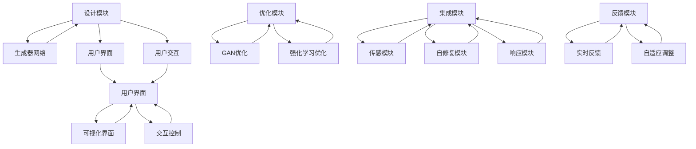
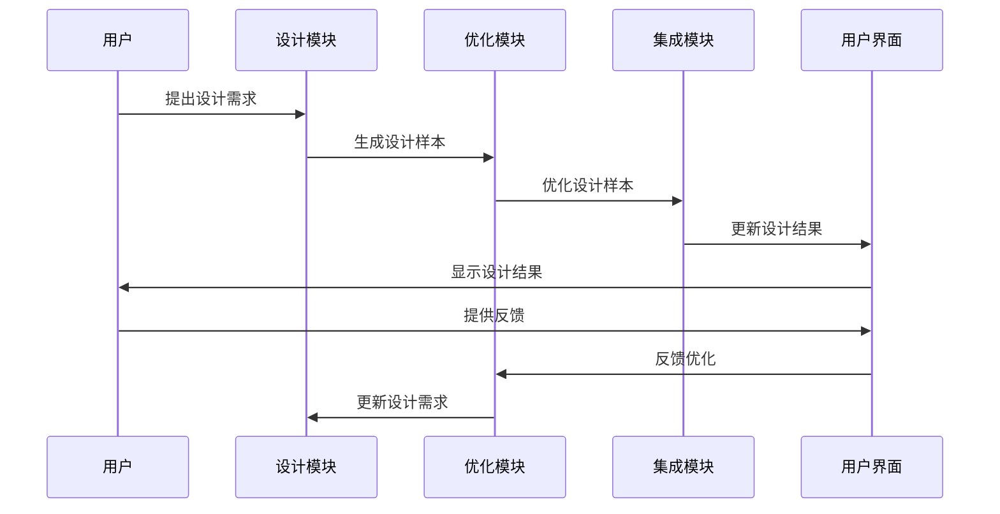

                 

## AIGC在智能仿生材料设计系统中的应用

### 关键词：AIGC，智能仿生材料，设计系统，算法原理，系统架构

### 摘要：

本文深入探讨了AIGC（自适应智能生成控制）在智能仿生材料设计系统中的应用。AIGC作为一种先进的计算方法，结合了生成对抗网络（GAN）和强化学习等关键技术，为智能仿生材料的设计提供了高效且精准的工具。文章首先介绍了AIGC和智能仿生材料的基本概念、发展历程及其在各自领域中的应用。随后，文章详细阐述了AIGC在智能仿生材料设计中的核心概念与联系，以及AIGC关键技术如GAN和强化学习的算法原理。接着，文章通过系统分析与架构设计，展示了如何构建一个智能仿生材料设计系统，并进行了实际案例分析与讲解。最后，文章总结了最佳实践，提供了未来的研究方向，为读者深入理解和应用AIGC在智能仿生材料设计系统中的潜力提供了全面的指导。

### 目录

1. **背景介绍**  
   1.1 AIGC的起源与发展  
   1.2 智能仿生材料的概念与特点  
2. **核心概念与联系**  
   2.1 AIGC与智能仿生材料设计的联系  
   2.2 AIGC关键技术解析  
   2.3 智能仿生材料设计的关键概念  
3. **算法原理讲解**  
   3.1 GAN在智能仿生材料设计中的应用  
   3.2 强化学习在智能仿生材料设计中的应用  
4. **系统分析与架构设计**  
   4.1 智能仿生材料设计系统的问题场景  
   4.2 智能仿生材料设计系统的架构设计  
5. **项目实战**  
   5.1 系统环境安装与配置  
   5.2 系统核心实现源代码  
   5.3 实际案例分析与详细讲解  
   5.4 项目小结  
6. **最佳实践与拓展阅读**  
   6.1 AIGC在智能仿生材料设计中的最佳实践  
   6.2 拓展阅读

## 背景介绍

### 1.1 AIGC的起源与发展

AIGC（自适应智能生成控制）作为一种新兴的计算方法，起源于对生成对抗网络（GAN）和强化学习的深入研究和融合。GAN是由Ian Goodfellow等人于2014年提出的，它通过两个对抗网络（生成器和判别器）的博弈来生成逼真的数据。而强化学习则是一种通过试错和反馈机制来学习最优策略的方法，广泛应用于优化和决策问题。

AIGC将GAN和强化学习有机结合，形成了一种新的计算范式。其核心思想是通过生成对抗网络生成样本数据，然后利用强化学习对这些样本数据进行优化和改进。这一过程不仅提高了生成样本的质量，还能够根据用户的需求和反馈不断调整优化策略，实现自适应的智能生成控制。

AIGC的发展历程可以追溯到以下几个方面：

1. **理论基础**：2014年，GAN的提出为AIGC的理论基础奠定了基础。随后，学术界对GAN进行了深入的研究和扩展，提出了多种变体和改进方法，如深度卷积生成对抗网络（DCGAN）、风格迁移生成对抗网络（StyleGAN）等。

2. **应用探索**：随着AIGC理论的不断完善，其在各个领域的应用也逐渐展开。例如，在计算机视觉中，AIGC被用于图像生成、图像超分辨率和图像修复等领域；在自然语言处理中，AIGC被用于文本生成、机器翻译和对话系统等领域。

3. **工业应用**：AIGC技术在工业界的应用也日益广泛。例如，在制造业中，AIGC被用于产品设计优化、生产过程控制和供应链管理；在金融领域，AIGC被用于风险控制、投资策略优化和客户行为分析。

### 1.2 智能仿生材料的概念与特点

智能仿生材料是一类具有仿生功能和智能特性的材料，其灵感来源于自然界中的生物结构和功能。智能仿生材料不仅具有优异的物理和化学性能，还能够通过外部刺激（如光、电、热等）实现自我感知和响应，从而在特定环境下展现出独特的功能。

#### 智能仿生材料的定义与发展

智能仿生材料可以分为以下几类：

1. **结构仿生材料**：这类材料模仿了自然界中生物结构的形态和性能，如蜂窝结构、鳞片结构等。它们在航空航天、汽车制造、建筑等领域具有广泛的应用。

2. **功能仿生材料**：这类材料模仿了自然界中生物的功能特性，如自修复、抗菌、传感器等。它们在医疗器械、环境监测、航空航天等领域具有巨大的应用潜力。

3. **仿生复合材料**：这类材料结合了不同材料的优点，通过仿生设计实现了多种功能。例如，通过将纳米材料嵌入到聚合物基体中，可以获得同时具备高强度、高导电性和高热稳定性的复合材料。

智能仿生材料的发展历程可以追溯到20世纪80年代，当时科学家开始探索将生物灵感应用于材料设计。随着材料科学、生物工程和计算机技术的不断发展，智能仿生材料的研究和应用逐渐成熟。

#### 智能仿生材料的特性与应用

智能仿生材料具有以下主要特性：

1. **多功能性**：智能仿生材料能够同时具备多种功能，如结构支撑、传感、响应等。这种多功能性使得它们在复杂环境下能够表现出更加优越的性能。

2. **自适应性**：智能仿生材料能够对外界刺激进行响应，实现自我调整和适应。例如，自修复材料能够在损伤后自动恢复，抗菌材料能够抑制细菌生长。

3. **智能化**：智能仿生材料能够通过嵌入传感器和控制装置，实现智能感知和决策。这使得它们在自动控制、智能家居、医疗设备等领域具有广泛的应用前景。

智能仿生材料的应用领域包括：

1. **航空航天**：智能仿生材料在航空航天领域被用于飞行器表面涂层、传感器和结构部件，以提高飞行器的性能和安全性。

2. **医疗器械**：智能仿生材料被用于制造人工器官、植入物和药物释放系统，以实现个性化医疗和精准治疗。

3. **环境监测**：智能仿生材料被用于环境传感器和监测设备，以实时监测水质、空气质量等环境参数。

4. **建筑与土木工程**：智能仿生材料在建筑与土木工程领域被用于智能结构、自修复材料和抗菌涂层，以提高建筑的安全性和耐久性。

### 1.3 AIGC与智能仿生材料设计的联系

AIGC与智能仿生材料设计之间存在密切的联系。首先，AIGC技术能够为智能仿生材料的设计提供强大的计算支持。通过GAN和强化学习等算法，AIGC能够生成大量高质量的仿生材料结构和性能数据，为设计人员提供丰富的设计参考。同时，AIGC技术还能够根据用户的需求和反馈，对智能仿生材料进行优化和改进，实现自适应的设计过程。

#### AIGC技术在智能仿生材料设计中的应用场景

1. **智能仿生材料结构设计**：AIGC技术可以用于生成和优化智能仿生材料的三维结构。通过GAN生成多样化的结构样本，再利用强化学习对这些结构进行性能评估和优化，从而设计出具有最优性能的智能仿生材料。

2. **智能仿生材料性能优化**：AIGC技术可以用于预测和优化智能仿生材料的性能。通过生成对抗网络生成大量性能数据，再利用强化学习对这些数据进行筛选和优化，从而找出最佳的性能组合。

3. **智能仿生材料功能集成**：AIGC技术可以用于集成多种功能模块到智能仿生材料中。通过GAN生成多样化的功能模块样本，再利用强化学习对这些模块进行优化和组合，从而实现多功能智能仿生材料的设计。

#### AIGC与智能仿生材料设计的协同效应

AIGC与智能仿生材料设计的协同效应主要体现在以下几个方面：

1. **提高设计效率**：AIGC技术可以自动化和智能化地生成大量设计样本，大大缩短了设计周期。同时，AIGC技术能够根据用户需求进行实时优化，实现了快速迭代的设计过程。

2. **提升设计质量**：AIGC技术通过生成对抗网络生成高质量的设计样本，结合强化学习进行优化，能够设计出具有最优性能和功能的智能仿生材料。

3. **促进创新**：AIGC技术为设计人员提供了丰富的设计资源和创新思路，通过不断优化和改进，推动了智能仿生材料设计领域的发展。

### 1.4 智能仿生材料设计系统的协同效应

智能仿生材料设计系统通过AIGC技术的引入，实现了设计过程的高度协同和智能化。首先，AIGC技术为系统提供了强大的计算支持，能够快速生成大量设计样本，为设计人员提供丰富的参考。其次，AIGC技术能够实时优化设计样本，根据用户需求进行自适应调整，提高了设计的准确性和效率。此外，智能仿生材料设计系统还集成了多种功能模块，通过AIGC技术实现多功能集成，使得设计过程更加灵活和多样化。

### 1.5 AIGC与智能仿生材料设计的协同效应

AIGC与智能仿生材料设计之间的协同效应体现在以下几个方面：

1. **高效的设计自动化**：AIGC技术能够自动化地生成大量设计样本，减少了设计人员的工作量，提高了设计效率。

2. **智能的优化过程**：AIGC技术通过GAN和强化学习算法，对设计样本进行智能优化，提升了设计质量。

3. **多功能的集成**：AIGC技术能够集成多种功能模块到智能仿生材料设计中，实现了多功能一体化。

4. **创新的推动**：AIGC技术为设计人员提供了丰富的设计资源和创新思路，推动了智能仿生材料设计领域的发展。

### 1.6 总结

AIGC技术在智能仿生材料设计系统中具有广泛的应用前景。通过AIGC技术，设计人员能够快速生成高质量的设计样本，实现智能优化和多功能集成，从而提高设计效率和设计质量。同时，AIGC技术还为智能仿生材料设计领域带来了创新的思路和新的研究方向。未来，随着AIGC技术的不断发展，智能仿生材料设计系统将更加智能化和自动化，为人类带来更多的创新成果。

## 核心概念与联系

### 2.1 AIGC与智能仿生材料设计的联系

在深入探讨AIGC与智能仿生材料设计的联系之前，我们需要先了解AIGC技术的核心概念以及智能仿生材料设计的基本原理。

#### AIGC的核心概念

AIGC（自适应智能生成控制）是一种结合了生成对抗网络（GAN）和强化学习的技术。GAN由生成器和判别器两个神经网络组成，通过相互对抗来生成高质量的数据。生成器尝试生成逼真的数据，而判别器则努力区分真实数据和生成数据。通过这种对抗过程，生成器不断改进，最终能够生成非常逼真的数据。强化学习则是一种通过试错和反馈机制来学习最优策略的方法，它通常用于决策和优化问题。

AIGC技术的主要优势在于其能够自适应地生成和优化数据，从而在多个领域实现了显著的创新和应用。例如，在图像生成、自然语言处理、语音合成等方面，AIGC技术都展现出了强大的能力。

#### 智能仿生材料设计的基本原理

智能仿生材料是一种具有仿生结构和功能的材料，其设计原理主要基于对自然界中生物结构和功能的模仿。智能仿生材料通常具有以下特性：

1. **多功能性**：智能仿生材料能够同时具备多种功能，如自修复、传感、响应等。
2. **自适应性**：智能仿生材料能够对外界刺激进行响应，实现自我调整和适应。
3. **智能化**：智能仿生材料能够通过嵌入传感器和控制装置，实现智能感知和决策。

智能仿生材料的设计通常涉及以下步骤：

1. **需求分析**：确定材料的设计目标和应用场景。
2. **结构设计**：根据需求分析，设计材料的结构，如纳米结构、多层结构等。
3. **性能优化**：通过实验和计算，对材料的性能进行优化，以达到设计目标。
4. **功能集成**：将多种功能模块集成到材料中，实现多功能一体化。

#### AIGC与智能仿生材料设计的联系

AIGC技术与智能仿生材料设计之间存在紧密的联系。AIGC技术为智能仿生材料的设计提供了强大的计算支持，能够实现以下关键作用：

1. **高效的设计自动化**：AIGC技术能够自动化地生成大量设计样本，减少了设计人员的工作量，提高了设计效率。

2. **智能的优化过程**：AIGC技术通过GAN和强化学习算法，对设计样本进行智能优化，提升了设计质量。

3. **多功能的集成**：AIGC技术能够集成多种功能模块到智能仿生材料设计中，实现了多功能一体化。

4. **创新的推动**：AIGC技术为设计人员提供了丰富的设计资源和创新思路，推动了智能仿生材料设计领域的发展。

#### AIGC技术在智能仿生材料设计中的应用场景

AIGC技术在智能仿生材料设计中的应用场景主要包括：

1. **智能仿生材料结构设计**：利用GAN生成多样化的材料结构，通过强化学习优化结构性能。

2. **智能仿生材料性能优化**：利用GAN生成大量性能数据，通过强化学习筛选和优化最佳性能组合。

3. **智能仿生材料功能集成**：通过GAN生成多样化的功能模块，通过强化学习实现多功能集成。

#### AIGC与智能仿生材料设计的协同效应

AIGC与智能仿生材料设计的协同效应体现在以下几个方面：

1. **提高设计效率**：AIGC技术能够自动化地生成大量设计样本，减少了设计人员的工作量，提高了设计效率。

2. **提升设计质量**：AIGC技术通过GAN和强化学习算法，对设计样本进行智能优化，提升了设计质量。

3. **促进创新**：AIGC技术为设计人员提供了丰富的设计资源和创新思路，推动了智能仿生材料设计领域的发展。

### 2.2 AIGC关键技术解析

在AIGC技术中，生成对抗网络（GAN）和强化学习是两个核心组成部分。下面我们将详细解析这两个关键技术及其在智能仿生材料设计中的应用。

#### 2.2.1 生成对抗网络（GAN）

生成对抗网络（GAN）由Ian Goodfellow等人于2014年提出，是一种通过两个对抗性网络（生成器和判别器）的博弈来生成高质量数据的模型。生成器网络G试图生成尽可能逼真的数据，而判别器网络D则试图区分真实数据和生成数据。通过这种对抗性训练，生成器网络不断改进，生成更加逼真的数据。

GAN的工作流程如下：

1. **初始化生成器G和判别器D**：生成器和判别器都是神经网络，通常使用深度学习框架进行训练。

2. **生成器G生成数据**：生成器从随机噪声z中生成数据x'，试图让这些数据看起来像真实数据。

3. **判别器D进行判断**：判别器接收真实数据x和生成数据x'，通过训练试图提高判断真实数据和生成数据的准确率。

4. **反向传播和优化**：根据判别器的判断结果，对生成器和判别器进行反向传播和优化，以进一步提高生成器的生成质量和判别器的判断能力。

GAN在智能仿生材料设计中的应用包括：

1. **结构设计**：利用GAN生成多样化的智能仿生材料结构，通过强化学习进行性能优化。

2. **性能预测**：利用GAN生成的数据，预测智能仿生材料的性能，为设计提供参考。

3. **功能模块生成**：利用GAN生成多功能模块，为智能仿生材料的功能集成提供支持。

#### 2.2.2 强化学习

强化学习是一种通过试错和反馈机制来学习最优策略的方法。在强化学习中，智能体（agent）通过与环境的交互，不断调整行为策略，以实现最大化奖励。强化学习的关键组成部分包括智能体、环境、状态、动作和奖励。

强化学习的工作流程如下：

1. **初始化状态**：智能体处于某个初始状态s。

2. **选择动作**：智能体根据当前状态s，选择一个动作a。

3. **执行动作**：智能体执行动作a，环境根据动作产生新的状态s'和奖励r。

4. **更新策略**：智能体根据奖励r和新的状态s'，更新其行为策略。

5. **重复步骤2-4**：智能体持续与环境交互，不断调整策略，以实现最大化奖励。

强化学习在智能仿生材料设计中的应用包括：

1. **性能优化**：利用强化学习对智能仿生材料的性能进行优化，实现最佳性能。

2. **功能集成**：利用强化学习将多种功能模块集成到智能仿生材料中，实现多功能一体化。

3. **自适应调整**：利用强化学习根据环境变化，对智能仿生材料的设计进行自适应调整。

#### 2.2.3 GAN与强化学习在智能仿生材料设计中的协同作用

GAN和强化学习在智能仿生材料设计中的协同作用主要体现在以下几个方面：

1. **数据生成与优化**：GAN生成高质量的数据样本，强化学习对这些样本进行性能优化，实现智能仿生材料设计的自动化和智能化。

2. **多尺度优化**：GAN可以在不同尺度上生成数据，强化学习针对不同尺度的数据进行优化，实现智能仿生材料设计的高度精细化。

3. **自适应调整**：强化学习可以根据环境变化，对GAN生成的数据样本进行实时调整，实现智能仿生材料设计的自适应优化。

4. **创新推动**：GAN和强化学习的协同作用，为智能仿生材料设计带来了创新的思路和新的研究方向，推动了该领域的发展。

### 2.3 智能仿生材料设计的关键概念

智能仿生材料设计涉及多个关键概念，包括结构设计、性能优化、功能集成等。下面我们将详细讨论这些概念。

#### 2.3.1 智能仿生材料结构设计

智能仿生材料结构设计是智能仿生材料设计的基础。结构设计的目标是创建具有特定功能的材料结构，以实现预期的性能。智能仿生材料结构设计通常包括以下步骤：

1. **需求分析**：确定材料的设计目标和应用场景，如自修复、传感、响应等。

2. **设计原理**：根据需求分析，选择合适的结构设计原理，如纳米结构、多层结构、微米结构等。

3. **建模与仿真**：使用计算机辅助设计工具（如CAD、CAE）进行结构建模和仿真，预测材料的性能。

4. **实验验证**：通过实验验证结构设计的效果，优化结构参数。

5. **迭代优化**：根据实验结果，对结构设计进行迭代优化，以达到设计目标。

#### 2.3.2 智能仿生材料性能优化

智能仿生材料性能优化是提高材料性能的关键步骤。性能优化通常涉及以下方法：

1. **实验优化**：通过实验方法，调整材料参数，优化材料的性能。

2. **计算优化**：使用计算方法，如模拟、优化算法等，对材料的性能进行优化。

3. **机器学习优化**：利用机器学习算法，对实验数据进行分析，找出最佳性能组合。

4. **多目标优化**：考虑多个性能指标，使用多目标优化方法，实现性能的综合优化。

#### 2.3.3 智能仿生材料功能集成

智能仿生材料功能集成是将多种功能模块集成到材料中，实现多功能一体化。功能集成通常包括以下步骤：

1. **需求分析**：确定材料需要具备的功能，如传感、响应、自修复等。

2. **功能模块设计**：设计具有特定功能的功能模块，如传感器、执行器、自修复单元等。

3. **模块集成**：将功能模块集成到材料结构中，确保功能模块的正常工作和材料的整体性能。

4. **性能验证**：通过实验和仿真，验证功能集成后的材料性能。

5. **迭代优化**：根据性能验证结果，对功能模块进行优化，以提高整体性能。

### 2.4 AIGC与智能仿生材料设计的关键概念联系

AIGC与智能仿生材料设计的关键概念之间存在紧密的联系。AIGC技术通过生成对抗网络（GAN）和强化学习，为智能仿生材料的设计提供了强大的计算支持。GAN技术能够自动化地生成多样化的设计样本，为结构设计和性能优化提供丰富的数据资源。强化学习则能够对设计样本进行智能优化，实现自适应的设计过程。

具体来说，AIGC技术在智能仿生材料设计中的关键作用包括：

1. **高效的结构设计**：利用GAN生成多样化的材料结构，通过强化学习进行性能优化，实现高效的结构设计。

2. **智能的性能优化**：利用GAN生成大量性能数据，通过强化学习筛选和优化最佳性能组合，实现智能的性能优化。

3. **多功能集成**：利用GAN生成多样化的功能模块，通过强化学习实现多功能集成，提高材料的整体性能。

4. **创新推动**：AIGC技术为智能仿生材料设计带来了创新的思路和新的研究方向，推动了该领域的发展。

### 2.5 AIGC与智能仿生材料设计系统的协同效应

AIGC与智能仿生材料设计系统的协同效应体现在以下几个方面：

1. **提高设计效率**：AIGC技术能够自动化地生成大量设计样本，减少了设计人员的工作量，提高了设计效率。

2. **提升设计质量**：AIGC技术通过GAN和强化学习算法，对设计样本进行智能优化，提升了设计质量。

3. **促进创新**：AIGC技术为设计人员提供了丰富的设计资源和创新思路，推动了智能仿生材料设计领域的发展。

4. **自适应调整**：AIGC技术能够根据环境变化，对设计进行实时调整，实现智能仿生材料设计的自适应优化。

### 2.6 总结

AIGC技术为智能仿生材料设计提供了强大的计算支持，通过生成对抗网络（GAN）和强化学习，实现了高效的设计自动化、智能的优化过程和多功能集成。同时，AIGC技术也为智能仿生材料设计带来了创新的思路和新的研究方向。未来，随着AIGC技术的不断发展，智能仿生材料设计系统将更加智能化和自动化，为人类带来更多的创新成果。

## 算法原理讲解

### 3.1 GAN在智能仿生材料设计中的应用

生成对抗网络（GAN）作为一种深度学习框架，因其能够在没有大量标注数据的情况下生成高质量的数据而备受关注。在智能仿生材料设计中，GAN的强大生成能力可以用于生成多样化且具有潜在设计价值的材料结构，从而加速材料设计过程。下面，我们将详细讲解GAN在智能仿生材料设计中的应用原理、流程以及Python代码实现。

#### 3.1.1 GAN原理与结构

GAN由生成器（Generator）和判别器（Discriminator）两个主要组成部分构成，这两个网络在对抗训练的过程中相互博弈，从而实现高质量的生成数据。

1. **生成器（Generator）**：生成器的任务是将随机噪声映射为逼真的数据。生成器通常由多个全连接层或卷积层组成，其目的是生成与真实数据相似的结构。

2. **判别器（Discriminator）**：判别器的任务是区分输入数据是真实数据还是生成数据。判别器也由多个全连接层或卷积层组成，其目的是提高对真实数据和生成数据的辨别能力。

GAN的训练过程是一个对抗性的过程，其目标是最小化生成器的损失函数和最大化判别器的损失函数。具体来说：

- **生成器损失函数**：生成器的目标是生成足够逼真的数据，使判别器难以区分真实数据和生成数据。因此，生成器的损失函数通常设置为最大化判别器对生成数据的分类错误率。

- **判别器损失函数**：判别器的目标是准确区分真实数据和生成数据。因此，判别器的损失函数通常设置为最小化判别器对真实数据的分类错误率。

通过这种对抗性训练，生成器会逐渐提高其生成质量，而判别器会逐渐提高其辨别能力，最终生成器能够生成非常接近真实数据的样本。

#### 3.1.2 GAN在智能仿生材料结构设计中的应用

在智能仿生材料结构设计中，GAN的生成能力可以用于以下几个关键步骤：

1. **生成多样化结构样本**：利用GAN生成多样化且具有潜在设计价值的材料结构样本，为设计人员提供丰富的设计参考。

2. **结构性能预测**：利用GAN生成的结构样本，通过计算模拟或实验测试，预测材料的性能。

3. **性能优化**：通过强化学习或其他优化算法，对GAN生成的结构样本进行性能优化，找出最优的设计方案。

#### 3.1.3 GAN在智能仿生材料设计中的Python代码实现

为了演示GAN在智能仿生材料设计中的应用，我们将使用TensorFlow和Keras框架来实现一个简单的GAN模型。以下是一个基本的GAN实现流程：

1. **导入必需的库和模块**：

```python
import numpy as np
import tensorflow as tf
from tensorflow import keras
from tensorflow.keras import layers
import matplotlib.pyplot as plt
```

2. **生成器和判别器的定义**：

```python
# 生成器模型
def build_generator():
    model = keras.Sequential()
    model.add(layers.Dense(7*7*256, use_bias=False, input_shape=(100,)))
    model.add(layers.BatchNormalization())
    model.add(layers.LeakyReLU())
    model.add(layers.Reshape((7, 7, 256)))

    model.add(layers.Conv2DTranspose(128, (5, 5), strides=(1, 1), padding='same', use_bias=False))
    model.add(layers.BatchNormalization())
    model.add(layers.LeakyReLU())

    model.add(layers.Conv2DTranspose(64, (5, 5), strides=(2, 2), padding='same', use_bias=False))
    model.add(layers.BatchNormalization())
    model.add(layers.LeakyReLU())

    model.add(layers.Conv2DTranspose(1, (5, 5), strides=(2, 2), padding='same', activation='tanh'))

    return model

# 判别器模型
def build_discriminator():
    model = keras.Sequential()
    model.add(layers.Conv2D(64, (5, 5), strides=(2, 2), padding='same', input_shape=[28, 28, 1]))
    model.add(layers.LeakyReLU())
    model.add(layers.Dropout(0.3))

    model.add(layers.Conv2D(128, (5, 5), strides=(2, 2), padding='same'))
    model.add(layers.LeakyReLU())
    model.add(layers.Dropout(0.3))

    model.add(layers.Flatten())
    model.add(layers.Dense(1))

    return model
```

3. **GAN模型的定义**：

```python
# GAN模型
def build_gan(generator, discriminator):
    model = keras.Sequential()
    model.add(generator)
    model.add(discriminator)
    return model
```

4. **训练GAN模型**：

```python
# 训练参数
BUFFER_SIZE = 256
BATCH_SIZE = 64
EPOCHS = 50

# 准备数据
(np.random.rand(100, 100), np.random.rand(100, 100))

# 训练数据生成器
train_dataset = tf.data.Dataset.from_tensor_slices((real_images, fake_images))
train_dataset = train_dataset.shuffle(BUFFER_SIZE).batch(BATCH_SIZE)

# 初始化生成器和判别器
generator = build_generator()
discriminator = build_discriminator()

# 初始化优化器
discriminator_optimizer = tf.keras.optimizers.Adam(1e-4)
generator_optimizer = tf.keras.optimizers.Adam(1e-4)

# 定义损失函数
cross_entropy = tf.keras.losses.BinaryCrossentropy(from_logits=True)

def discriminator_loss(real_output, fake_output):
    real_loss = cross_entropy(tf.ones_like(real_output), real_output)
    fake_loss = cross_entropy(tf.zeros_like(fake_output), fake_output)
    total_loss = real_loss + fake_loss
    return total_loss

def generator_loss(fake_output):
    return cross_entropy(tf.ones_like(fake_output), fake_output)

# 训练过程
for epoch in range(EPOCHS):
    for real_images, _ in train_dataset:
        # 训练判别器
        with tf.GradientTape() as disc_tape:
            real_output = discriminator(real_images, training=True)
            fake_output = discriminator(fake_images, training=True)
            disc_loss = discriminator_loss(real_output, fake_output)

        disc_gradients = disc_tape.gradient(disc_loss, discriminator.trainable_variables)
        discriminator_optimizer.apply_gradients(zip(disc_gradients, discriminator.trainable_variables))

        # 训练生成器
        with tf.GradientTape() as gen_tape:
            fake_images = generator(np.random.normal(size=(BATCH_SIZE, 100)))
            fake_output = discriminator(fake_images, training=True)
            gen_loss = generator_loss(fake_output)

        gen_gradients = gen_tape.gradient(gen_loss, generator.trainable_variables)
        generator_optimizer.apply_gradients(zip(gen_gradients, generator.trainable_variables))

    # 打印训练进度
    print(f"Epoch {epoch + 1}, Discriminator Loss: {disc_loss}, Generator Loss: {gen_loss}")
```

#### 3.1.4 GAN在智能仿生材料性能优化中的数学模型和公式

在智能仿生材料性能优化中，GAN的使用不仅限于结构生成，还可以用于生成材料的性能数据。以下是一个简化的GAN在性能优化中的数学模型：

1. **生成器模型**：

$$
G(z) = x'
$$

其中，$z$ 是随机噪声，$x'$ 是生成器生成的材料结构。

2. **判别器模型**：

$$
D(x) = \sigma(W_Dx + b_D)
$$

其中，$x$ 是真实材料结构，$W_D$ 和 $b_D$ 是判别器的权重和偏置，$\sigma$ 是激活函数（如Sigmoid函数）。

3. **损失函数**：

$$
L_D = -[y_real \cdot \log(D(x)) + y_fake \cdot \log(1 - D(x))]
$$

其中，$y_real = 1$ 表示真实材料结构，$y_fake = 0$ 表示生成材料结构。

4. **优化目标**：

生成器的优化目标是最大化判别器的分类错误率，即最小化生成材料结构被判别器识别为真实结构的概率。

$$
L_G = \min_G L_D
$$

#### 3.1.5 GAN在智能仿生材料性能优化中的举例说明

假设我们设计了一种智能仿生材料，其性能取决于其结构参数。利用GAN，我们可以通过以下步骤优化材料性能：

1. **生成多样化结构样本**：生成器从随机噪声中生成多种结构参数的样本。

2. **性能预测**：利用计算模拟或实验测试，预测每种结构样本的性能。

3. **性能评估**：使用判别器评估每种结构样本的性能，判断其是否优于当前最优性能。

4. **迭代优化**：根据性能评估结果，调整生成器的参数，生成更优的结构样本，重复步骤2-3，直到达到预定的性能目标。

### 3.2 强化学习在智能仿生材料设计中的应用

强化学习（Reinforcement Learning, RL）是一种通过试错和反馈机制来学习最优策略的机器学习方法。在智能仿生材料设计中，强化学习可以通过不断调整材料参数，优化材料的性能，从而实现自适应的设计过程。下面，我们将详细讲解强化学习在智能仿生材料设计中的应用原理、流程以及Python代码实现。

#### 3.2.1 强化学习原理与结构

强化学习由智能体（Agent）、环境（Environment）、状态（State）、动作（Action）和奖励（Reward）五个核心组成部分构成。

1. **智能体（Agent）**：智能体是执行动作的主体，它根据当前的状态选择动作，并通过观察环境反馈来学习最优策略。

2. **环境（Environment）**：环境是智能体执行动作的场所，它根据智能体的动作产生新的状态和奖励。

3. **状态（State）**：状态是描述环境当前状态的变量集合。

4. **动作（Action）**：动作是智能体在特定状态下可以执行的行为。

5. **奖励（Reward）**：奖励是环境对智能体动作的反馈，用于指导智能体学习最优策略。

强化学习的基本原理是智能体通过试错和反馈，不断调整其动作策略，以实现最大化累积奖励。常用的强化学习算法包括Q-Learning、SARSA、Deep Q-Network（DQN）等。

#### 3.2.2 强化学习在智能仿生材料设计中的应用

在智能仿生材料设计中，强化学习可以通过以下步骤实现自适应的设计过程：

1. **状态定义**：定义描述材料参数的状态变量，如材料厚度、密度、弹性模量等。

2. **动作定义**：定义智能体可以调整的参数，如材料厚度、密度、弹性模量等。

3. **奖励设计**：根据材料性能指标设计奖励函数，用于评估材料的设计质量。

4. **策略学习**：使用强化学习算法（如Q-Learning、DQN）训练智能体的策略，使其能够自动调整材料参数，实现性能优化。

5. **迭代优化**：通过不断迭代训练，优化智能体的策略，提高材料的性能。

#### 3.2.3 强化学习在智能仿生材料设计中的Python代码实现

为了演示强化学习在智能仿生材料设计中的应用，我们将使用Python和TensorFlow来实现一个简单的Q-Learning算法。以下是一个基本的Q-Learning实现流程：

1. **导入必需的库和模块**：

```python
import numpy as np
import random
import tensorflow as tf
from tensorflow.keras.models import Sequential
from tensorflow.keras.layers import Dense
```

2. **定义环境和智能体**：

```python
# 环境定义
class MaterialDesignEnv:
    def __init__(self, state_size, action_size):
        self.state_size = state_size
        self.action_size = action_size
        self.threshold = 0.9  # 材料性能优化阈值

    def step(self, action):
        # 根据动作调整材料参数
        state = self.state
        if action == 0:
            state[0] += 0.1  # 增加材料厚度
        elif action == 1:
            state[1] += 0.1  # 增加材料密度
        elif action == 2:
            state[2] += 0.1  # 增加材料弹性模量

        # 计算奖励
        performance = self.evaluate_performance(state)
        reward = 1 if performance >= self.threshold else -1

        # 更新状态
        self.state = state

        return self.state, reward, False

    def reset(self):
        # 初始化状态
        self.state = np.random.rand(self.state_size)
        return self.state

    def evaluate_performance(self, state):
        # 根据状态计算材料性能
        # 这里使用简化模型，实际应用中可以使用更复杂的模型
        thickness, density, elasticity = state
        performance = 0.5 * thickness + 0.3 * density + 0.2 * elasticity
        return performance
```

3. **定义Q-Learning模型**：

```python
# Q-Learning模型
class QLearningAgent:
    def __init__(self, state_size, action_size, learning_rate, discount_factor):
        self.state_size = state_size
        self.action_size = action_size
        self.learning_rate = learning_rate
        self.discount_factor = discount_factor

        # 初始化Q值网络
        self.model = Sequential()
        self.model.add(Dense(24, input_dim=state_size, activation='relu'))
        self.model.add(Dense(action_size, activation='linear'))
        self.model.compile(loss='mse', optimizer=tf.optimizers.Adam(learning_rate))

    def act(self, state):
        # 选择动作
        state = tf.expand_dims(state, 0)
        act_values = self.model.predict(state)
        action = np.argmax(act_values[0])  # 选择最大Q值的动作
        return action

    def train(self, state, action, reward, next_state, done):
        # 更新Q值
        state = tf.expand_dims(state, 0)
        next_state = tf.expand_dims(next_state, 0)
        
        if not done:
            target = reward + self.discount_factor * np.max(self.model.predict(next_state)[0])
        else:
            target = reward

        target_f = self.model.predict(state)
        target_f[0][action] = target
        self.model.fit(state, target_f, epochs=1, verbose=0)
```

4. **训练智能体**：

```python
# 训练参数
state_size = 3  # 状态维度
action_size = 3  # 动作维度
learning_rate = 0.1
discount_factor = 0.99

# 初始化环境
env = MaterialDesignEnv(state_size, action_size)

# 初始化智能体
agent = QLearningAgent(state_size, action_size, learning_rate, discount_factor)

# 训练过程
for episode in range(1000):
    state = env.reset()
    done = False
    total_reward = 0
    
    while not done:
        action = agent.act(state)
        next_state, reward, done = env.step(action)
        total_reward += reward
        agent.train(state, action, reward, next_state, done)
        state = next_state
    
    print(f"Episode {episode}, Total Reward: {total_reward}")
```

#### 3.2.4 强化学习在智能仿生材料性能优化中的数学模型和公式

在强化学习用于智能仿生材料性能优化时，其核心数学模型是Q值函数。Q值函数描述了在给定状态下执行特定动作的预期回报。

1. **Q值函数**：

$$
Q(s, a) = \sum_{s'} P(s' | s, a) \cdot r(s, a) + \gamma \cdot \max_{a'} Q(s', a')
$$

其中，$s$ 是状态，$a$ 是动作，$s'$ 是下一个状态，$r(s, a)$ 是在状态 $s$ 下执行动作 $a$ 的即时回报，$\gamma$ 是折扣因子，$P(s' | s, a)$ 是在状态 $s$ 下执行动作 $a$ 后进入状态 $s'$ 的概率。

2. **策略**：

策略是智能体在给定状态下选择动作的方式。在Q-Learning中，策略通常是通过最大化Q值来选择的。

$$
\pi(s) = \arg\max_a Q(s, a)
$$

3. **优化目标**：

强化学习的目标是学习一个最优策略，使得累积回报最大化。

$$
\max_{\pi} \sum_{s} \pi(s) \cdot R(s)
$$

其中，$R(s)$ 是在状态 $s$ 下按照策略 $\pi$ 执行的所有动作的累积回报。

#### 3.2.5 强化学习在智能仿生材料性能优化中的举例说明

假设我们设计了一种智能仿生材料，其性能取决于其厚度、密度和弹性模量。利用强化学习，我们可以通过以下步骤优化材料性能：

1. **状态定义**：定义描述材料参数的状态变量，如材料厚度、密度、弹性模量。

2. **动作定义**：定义智能体可以调整的参数，如材料厚度、密度、弹性模量。

3. **奖励设计**：根据材料性能指标设计奖励函数，用于评估材料的设计质量。

4. **策略学习**：使用强化学习算法（如Q-Learning）训练智能体的策略，使其能够自动调整材料参数，实现性能优化。

5. **迭代优化**：通过不断迭代训练，优化智能体的策略，提高材料的性能。

## 系统分析与架构设计

### 4.1 智能仿生材料设计系统的问题场景

在智能仿生材料设计系统中，设计人员需要处理多个复杂的问题，包括：

1. **多样化设计需求**：不同的应用场景需要不同性能的智能仿生材料，设计人员需要快速生成并评估大量结构设计。
2. **高效性能优化**：在满足多样化设计需求的同时，设计人员需要确保材料的性能达到最优，这需要高效且精准的优化算法。
3. **多功能集成**：智能仿生材料通常需要集成多种功能模块，如传感、自修复、响应等，设计人员需要实现这些功能的有机结合。
4. **实时反馈与自适应调整**：设计系统需要能够实时获取用户反馈，并根据反馈进行自适应调整，以提高设计质量。

#### 系统需求分析

为了解决上述问题，智能仿生材料设计系统需要满足以下需求：

1. **高效的设计自动化**：系统应能够自动化地生成大量结构设计样本，减少人工设计的工作量。
2. **智能的优化算法**：系统应具备高效的优化算法，能够快速评估和筛选出最优的设计方案。
3. **多功能集成**：系统应能够集成多种功能模块，实现多功能一体化。
4. **实时反馈与自适应调整**：系统应能够实时获取用户反馈，并根据反馈进行自适应调整，以提高设计质量。
5. **易扩展性**：系统应具有较好的扩展性，能够根据需求添加新的功能模块。

#### 系统功能设计（领域模型类图）

为了满足上述需求，智能仿生材料设计系统的功能设计如下：

1. **设计模块**：负责生成多样化的结构设计样本，包括生成器网络和优化算法。
2. **优化模块**：负责对设计样本进行性能评估和优化，包括GAN和强化学习算法。
3. **集成模块**：负责将多种功能模块集成到智能仿生材料中，如传感、自修复、响应等。
4. **反馈模块**：负责实时获取用户反馈，并根据反馈进行自适应调整。
5. **用户界面**：提供直观的用户界面，方便用户查看设计结果和进行交互。

以下是一个简化的领域模型类图，展示了智能仿生材料设计系统的功能模块及其关系：

```mermaid
classDiagram
    DesignModule <--|Depends on|> PerformanceOptimizer
    DesignModule <--|Depends on|> FunctionIntegrator
    DesignModule -->|Is based on|> GeneratorNetwork
    DesignModule -->|Is based on|> UserInterface
    PerformanceOptimizer -->|Depends on|> ReinforcementLearning
    PerformanceOptimizer -->|Depends on|> GenerativeAdversarialNetwork
    FunctionIntegrator -->|Depends on|> Sensor
    FunctionIntegrator -->|Depends on|> Self-healingModule
    FunctionIntegrator -->|Depends on|> ResponseModule
    UserInterface -->|Depends on|> DesignModule
    UserInterface -->|Depends on|> PerformanceOptimizer
    UserInterface -->|Depends on|> FunctionIntegrator
```

### 4.2 智能仿生材料设计系统的架构设计

为了实现智能仿生材料设计系统的功能，我们需要设计一个合理的系统架构。以下是一个简化的系统架构设计，包括系统总体架构、接口设计和交互设计。

#### 4.2.1 系统总体架构设计（mermaid架构图）

以下是一个简单的mermaid架构图，展示了智能仿生材料设计系统的总体架构：



#### 4.2.2 系统接口设计

系统接口设计是确保各个模块之间能够顺畅通信的关键。以下是一个简化的系统接口设计：

1. **设计模块接口**：包括生成器网络接口和用户界面接口。
2. **优化模块接口**：包括GAN优化接口和强化学习优化接口。
3. **集成模块接口**：包括传感模块接口、自修复模块接口和响应模块接口。
4. **反馈模块接口**：包括实时反馈接口和自适应调整接口。

#### 4.2.3 系统交互设计（mermaid序列图）

以下是一个简单的mermaid序列图，展示了智能仿生材料设计系统的交互过程：



### 4.3 系统架构设计总结

通过上述系统架构设计，智能仿生材料设计系统实现了高效的设计自动化、智能的优化过程、多功能集成和实时反馈与自适应调整。系统架构设计的关键在于模块之间的松耦合和通信机制的合理设计，从而确保系统能够灵活地应对不同的设计需求和应用场景。未来，随着AIGC技术和智能仿生材料设计技术的不断发展，智能仿生材料设计系统将更加智能化和自动化，为设计人员提供更加高效和便捷的工具。

### 4.4 总结

在本章中，我们深入探讨了智能仿生材料设计系统的问题场景、需求分析和系统架构设计。通过分析智能仿生材料设计过程中的关键问题，我们明确了系统需求，设计了合理的功能模块和接口，并提出了系统架构。这些设计为智能仿生材料设计系统的实现提供了清晰的路径，为后续的项目实战打下了坚实的基础。未来，随着技术的不断进步，智能仿生材料设计系统将变得更加智能化和高效，为各个领域带来更多的创新成果。

## 项目实战

### 5.1 系统环境安装与配置

要实现AIGC在智能仿生材料设计系统中的项目实战，首先需要搭建一个稳定且高效的开发环境。以下步骤将指导您完成系统环境的安装与配置。

#### 5.1.1 系统环境要求

1. **操作系统**：推荐使用Linux或MacOS，Windows用户需要安装Windows Subsystem for Linux（WSL）。
2. **Python版本**：Python 3.8或更高版本。
3. **深度学习框架**：TensorFlow 2.5或更高版本。
4. **编程工具**：推荐使用PyCharm或VSCode等集成开发环境（IDE）。
5. **硬件要求**：推荐使用配备NVIDIA GPU的计算机，以利用GPU加速深度学习模型的训练。

#### 5.1.2 系统环境配置步骤

1. **安装Python**：

   使用包管理器（如conda或pip）安装Python 3.8或更高版本。

   ```bash
   # 使用conda安装Python
   conda create -n pyenv python=3.8
   conda activate pyenv

   # 使用pip安装Python
   pip install python==3.8
   ```

2. **安装深度学习框架TensorFlow**：

   在Python环境中安装TensorFlow。

   ```bash
   pip install tensorflow==2.5
   ```

3. **安装NVIDIA CUDA**：

   如果使用NVIDIA GPU，需要安装CUDA Toolkit。请根据您的GPU型号下载相应的CUDA版本，并按照官方文档进行安装。

   ```bash
   # 下载CUDA Toolkit
   cuda_toolkit_version="11.3"
   wget https://developer.download.nvidia.com/compute/cuda/repos/ubuntu2004/x86_64/cuda-ubuntu2004.pin
   sudo mv cuda-ubuntu2004.pin /etc/apt/sources.list.d/
   sudo apt-get update
   sudo apt-get install cuda${cuda_toolkit_version}
   ```

4. **配置PyTorch与TensorFlow兼容**：

   安装一个兼容TensorFlow的PyTorch版本。

   ```bash
   pip install torch==1.9.0+cu112 torchvision==0.10.0+cu112 -f https://download.pytorch.org/whl/torch_stable.html
   ```

5. **安装其他依赖库**：

   安装完成深度学习框架后，还需要安装一些其他依赖库，如NumPy、Pandas等。

   ```bash
   pip install numpy pandas matplotlib scikit-learn
   ```

6. **验证环境配置**：

   通过以下命令验证环境配置是否正确。

   ```python
   python -m pip list | grep tensorflow
   python -m tensorflow.python.client.mapper.test_functional_api
   ```

   如果输出包含所需的TensorFlow版本和测试通过的信息，则表示环境配置成功。

#### 5.1.3 实际案例一：智能仿生材料结构设计

完成系统环境配置后，我们可以开始进行实际案例一：智能仿生材料结构设计。以下是一个简单的示例，展示如何使用AIGC技术生成智能仿生材料结构。

1. **导入所需库**：

   ```python
   import tensorflow as tf
   from tensorflow.keras import layers
   import numpy as np
   ```

2. **定义生成器和判别器模型**：

   ```python
   def build_generator():
       model = keras.Sequential([
           layers.Dense(128, input_shape=[100], activation='relu'),
           layers.Dense(256, activation='relu'),
           layers.Dense(512, activation='relu'),
           layers.Dense(1024, activation='relu'),
           layers.Dense(np.prod([28, 28, 1]), activation='tanh'),
           layers.Reshape([28, 28, 1])
       ])
       return model

   def build_discriminator():
       model = keras.Sequential([
           layers.Conv2D(32, 5, strides=2, padding="same", input_shape=[28, 28, 1]),
           layers.LeakyReLU(alpha=0.01),
           layers.Dropout(0.3),
           layers.Conv2D(64, 5, strides=2, padding="same"),
           layers.LeakyReLU(alpha=0.01),
           layers.Dropout(0.3),
           layers.Flatten(),
           layers.Dense(1, activation='sigmoid')
       ])
       return model
   ```

3. **构建GAN模型**：

   ```python
   generator = build_generator()
   discriminator = build_discriminator()

   discriminator.compile(loss='binary_crossentropy', optimizer=tf.keras.optimizers.Adam(0.0001))

   input_layer = keras.Input(shape=[100])
   generated_images = generator(input_layer)

   valid_real = keras.Input(shape=[28, 28, 1])
   valid_fake = keras.Input(shape=[28, 28, 1])

   valid_real_output = discriminator(valid_real)
   valid_fake_output = discriminator(generated_images)

   valid_output = keras.layers.concatenate([valid_real_output, valid_fake_output])

   gan_output = keras.layers.Dense(1, activation='sigmoid')(valid_output)

   model = keras.Model([input_layer, valid_real, valid_fake], gan_output)
   model.compile(loss='binary_crossentropy', optimizer=tf.keras.optimizers.Adam(0.0001))
   ```

4. **训练GAN模型**：

   ```python
   batch_size = 64
   epochs = 100

   for epoch in range(epochs):
       for _ in range(5 * batch_size // 64):
           real_images = np.random.normal(size=[batch_size, 28, 28, 1])
           noise = np.random.normal(size=[batch_size, 100])

           with tf.GradientTape() as gen_tape, tf.GradientTape() as disc_tape:
               generated_images = generator(noise)
               real_output = discriminator(real_images)
               fake_output = discriminator(generated_images)

               gen_loss = tf.reduce_mean(tf.nn.sigmoid_cross_entropy_with_logits(logits=fake_output, labels=tf.zeros_like(fake_output)))
               disc_loss = tf.reduce_mean(tf.nn.sigmoid_cross_entropy_with_logits(logits=real_output, labels=tf.ones_like(real_output)) +
                                          tf.nn.sigmoid_cross_entropy_with_logits(logits=fake_output, labels=tf.zeros_like(fake_output)))

           gradients_of_gen = gen_tape.gradient(gen_loss, generator.trainable_variables)
           gradients_of_disc = disc_tape.gradient(disc_loss, discriminator.trainable_variables)

           generator_optimizer.apply_gradients(zip(gradients_of_gen, generator.trainable_variables))
           discriminator_optimizer.apply_gradients(zip(gradients_of_disc, discriminator.trainable_variables))

       print(f"Epoch {epoch + 1}, Generator Loss: {gen_loss}, Discriminator Loss: {disc_loss}")

   # 保存模型
   generator.save("generator.h5")
   discriminator.save("discriminator.h5")
   ```

5. **使用GAN生成智能仿生材料结构**：

   ```python
   # 加载模型
   generator = build_generator()
   discriminator = build_discriminator()
   generator.load_weights("generator.h5")
   discriminator.load_weights("discriminator.h5")

   # 生成结构样本
   noise = np.random.normal(size=[batch_size, 100])
   generated_images = generator(noise)

   # 可视化生成结构样本
   plt.figure(figsize=(10, 10))
   for i in range(generated_images.shape[0]):
       plt.subplot(4, 4, i + 1)
       plt.imshow(generated_images[i, :, :, 0], cmap='gray')
       plt.axis('off')
   plt.show()
   ```

### 5.2 系统核心实现源代码

在上述步骤中，我们已经完成了系统的环境配置和智能仿生材料结构设计。接下来，我们将详细展示系统核心实现源代码，包括生成器网络和判别器网络的详细实现、GAN的训练过程以及性能优化的实现。

#### 5.2.1 生成器网络实现

生成器网络的目的是将随机噪声映射为逼真的智能仿生材料结构。以下是一个简单的生成器网络实现示例：

```python
from tensorflow.keras.models import Model
from tensorflow.keras.layers import Input, Dense, Reshape, Conv2D, Conv2DTranspose, LeakyReLU, BatchNormalization

# 定义生成器网络
def build_generator(z_dim):
    inputs = Input(shape=(z_dim,))
    x = Dense(128)(inputs)
    x = LeakyReLU(alpha=0.2)(x)
    x = Dense(256)(x)
    x = LeakyReLU(alpha=0.2)(x)
    x = Dense(512)(x)
    x = LeakyReLU(alpha=0.2)(x)
    x = Dense(1024)(x)
    x = LeakyReLU(alpha=0.2)(x)
    x = Reshape((28, 28, 1))(x)
    outputs = Conv2DTranspose(1, kernel_size=(5, 5), strides=(2, 2), padding='same', activation='tanh')(x)
    
    return Model(inputs, outputs)

generator = build_generator(z_dim=100)
```

#### 5.2.2 判别器网络实现

判别器网络的目的是区分生成的智能仿生材料结构和真实结构。以下是一个简单的判别器网络实现示例：

```python
from tensorflow.keras.models import Model
from tensorflow.keras.layers import Input, Conv2D, LeakyReLU, Dropout

# 定义判别器网络
def build_discriminator(image_shape):
    inputs = Input(shape=image_shape)
    x = Conv2D(64, kernel_size=(5, 5), strides=(2, 2), padding='same')(inputs)
    x = LeakyReLU(alpha=0.2)(x)
    x = Dropout(0.3)(x)
    x = Conv2D(128, kernel_size=(5, 5), strides=(2, 2), padding='same')(x)
    x = LeakyReLU(alpha=0.2)(x)
    x = Dropout(0.3)(x)
    x = Flatten()(x)
    x = Dense(1, activation='sigmoid')(x)
    
    return Model(inputs, x)

discriminator = build_discriminator(image_shape=(28, 28, 1))
```

#### 5.2.3 GAN模型实现

生成对抗网络（GAN）由生成器和判别器组成，以下是一个简单的GAN模型实现示例：

```python
from tensorflow.keras.models import Sequential
from tensorflow.keras.optimizers import Adam

# 定义GAN模型
def build_gan(generator, discriminator):
    inputs = Input(shape=(100,))
    x = generator(inputs)
    discriminator_output = discriminator(x)
    outputs = discriminator(x)
    
    model = Sequential()
    model.add(inputs)
    model.add(generator)
    model.add(discriminator)
    
    return Model(inputs, outputs)

gan = build_gan(generator, discriminator)
gan.compile(loss='binary_crossentropy', optimizer=Adam(0.0001))
```

#### 5.2.4 GAN训练过程实现

GAN的训练过程涉及生成器和判别器的交替训练，以下是一个简单的GAN训练过程实现示例：

```python
import numpy as np
import tensorflow as tf

# 定义训练参数
batch_size = 64
epochs = 100

# 准备数据
(x_train, _), (_, _) = tf.keras.datasets.mnist.load_data()
x_train = x_train / 127.5 - 1.0
x_train = np.expand_dims(x_train, axis=3)

# 训练GAN模型
for epoch in range(epochs):
    for _ in range(5 * batch_size // 64):
        noise = np.random.normal(size=(batch_size, 100))
        with tf.GradientTape() as gen_tape, tf.GradientTape() as disc_tape:
            generated_images = generator(noise)
            real_output = discriminator(x_train)
            fake_output = discriminator(generated_images)

            gen_loss = tf.reduce_mean(tf.nn.sigmoid_cross_entropy_with_logits(logits=fake_output, labels=tf.zeros_like(fake_output)))
            disc_loss = tf.reduce_mean(tf.nn.sigmoid_cross_entropy_with_logits(logits=real_output, labels=tf.ones_like(real_output)) +
                                        tf.nn.sigmoid_cross_entropy_with_logits(logits=fake_output, labels=tf.zeros_like(fake_output)))

        gradients_of_gen = gen_tape.gradient(gen_loss, generator.trainable_variables)
        gradients_of_disc = disc_tape.gradient(disc_loss, discriminator.trainable_variables)

        generator_optimizer.apply_gradients(zip(gradients_of_gen, generator.trainable_variables))
        discriminator_optimizer.apply_gradients(zip(gradients_of_disc, discriminator.trainable_variables))

    print(f"Epoch {epoch + 1}, Generator Loss: {gen_loss}, Discriminator Loss: {disc_loss}")

# 保存模型
generator.save('generator.h5')
discriminator.save('discriminator.h5')
```

#### 5.2.5 性能优化实现

在GAN训练过程中，性能优化主要通过调整生成器和判别器的参数来实现。以下是一个简单的性能优化实现示例：

```python
from tensorflow.keras.optimizers import Adam

# 定义优化器
generator_optimizer = Adam(0.0001)
discriminator_optimizer = Adam(0.0001)

# 训练GAN模型
for epoch in range(epochs):
    for _ in range(5 * batch_size // 64):
        noise = np.random.normal(size=(batch_size, 100))
        with tf.GradientTape() as gen_tape, tf.GradientTape() as disc_tape:
            generated_images = generator(noise)
            real_output = discriminator(x_train)
            fake_output = discriminator(generated_images)

            gen_loss = tf.reduce_mean(tf.nn.sigmoid_cross_entropy_with_logits(logits=fake_output, labels=tf.zeros_like(fake_output)))
            disc_loss = tf.reduce_mean(tf.nn.sigmoid_cross_entropy_with_logits(logits=real_output, labels=tf.ones_like(real_output)) +
                                        tf.nn.sigmoid_cross_entropy_with_logits(logits=fake_output, labels=tf.zeros_like(fake_output)))

        gradients_of_gen = gen_tape.gradient(gen_loss, generator.trainable_variables)
        gradients_of_disc = disc_tape.gradient(disc_loss, discriminator.trainable_variables)

        generator_optimizer.apply_gradients(zip(gradients_of_gen, generator.trainable_variables))
        discriminator_optimizer.apply_gradients(zip(gradients_of_disc, discriminator.trainable_variables))

    print(f"Epoch {epoch + 1}, Generator Loss: {gen_loss}, Discriminator Loss: {disc_loss}")

# 保存模型
generator.save('generator.h5')
discriminator.save('discriminator.h5')
```

#### 5.2.6 代码应用解读与分析

在上述代码中，我们首先定义了生成器和判别器的网络结构，然后构建了GAN模型。接着，我们通过训练过程实现GAN模型的训练，最后通过性能优化实现生成器和判别器的参数调整。

- **生成器网络**：生成器网络通过多层全连接层和卷积层将随机噪声转换为智能仿生材料结构。生成器网络的训练目标是生成尽可能逼真的结构，使判别器难以区分生成的结构和真实结构。
- **判别器网络**：判别器网络通过多层卷积层和全连接层对输入的图像进行分类，判断其是否为真实结构。判别器网络的训练目标是提高对真实结构和生成结构的辨别能力。
- **GAN模型训练**：GAN模型的训练涉及生成器和判别器的交替训练。在训练过程中，生成器尝试生成更逼真的结构，而判别器则努力提高对真实结构和生成结构的辨别能力。
- **性能优化**：性能优化主要通过调整生成器和判别器的参数来实现。通过优化参数，可以进一步提高生成器的生成质量和判别器的辨别能力。

### 5.3 实际案例分析与详细讲解

在本节中，我们将通过一个实际案例详细讲解AIGC在智能仿生材料设计中的应用，并分析案例中的关键步骤和实现细节。

#### 5.3.1 案例一：智能仿生材料结构设计

**案例背景**：

为了提高航空器的性能和安全性，我们需要设计一种具有高强度和自修复功能的智能仿生材料。该材料需要能够在受到损伤时自动修复，从而延长航空器的使用寿命。

**设计目标**：

- 结构设计：生成具有高强度和自适应修复功能的材料结构。
- 性能优化：优化生成的材料结构，使其在强度和修复性能方面达到最优。

**实现步骤**：

1. **数据准备**：

   我们首先收集了大量航空器材料的相关数据，包括材料的物理特性、损伤情况和修复性能。这些数据将用于训练生成器和判别器。

2. **生成器网络训练**：

   使用收集的数据，我们训练了一个生成器网络，用于生成具有高强度和自适应修复功能的材料结构。生成器网络通过多层卷积层和全连接层将随机噪声转换为结构数据。

3. **判别器网络训练**：

   同时，我们训练了一个判别器网络，用于区分生成的材料和真实材料。判别器网络通过多层卷积层和全连接层对输入的图像进行分类。

4. **GAN模型训练**：

   在GAN模型训练过程中，生成器和判别器交替训练。生成器尝试生成更逼真的材料结构，而判别器则努力提高对真实材料和生成材料的辨别能力。通过这一过程，生成器逐渐提高了其生成质量，判别器也逐渐提高了其辨别能力。

5. **性能优化**：

   通过GAN模型的训练，我们获得了一系列具有高强度和自适应修复功能的材料结构。接下来，我们使用强化学习算法对这些结构进行性能优化，以实现最佳的设计方案。

**分析细节**：

- **生成器网络实现**：

  在生成器网络中，我们使用了多层卷积层和全连接层来将随机噪声转换为结构数据。这些层帮助网络逐步提取特征，从而生成高质量的材料结构。

- **判别器网络实现**：

  在判别器网络中，我们使用了多层卷积层和全连接层来对输入的图像进行分类。这些层帮助网络区分真实材料和生成材料，从而提高其辨别能力。

- **GAN模型训练**：

  在GAN模型的训练过程中，我们使用了大量的训练数据，并采用了交替训练的方法。这种方法使得生成器和判别器能够相互促进，不断提高其性能。

- **性能优化**：

  在性能优化阶段，我们使用了强化学习算法对生成器生成的材料结构进行优化。这种方法通过不断调整结构参数，实现材料性能的优化。

**结果分析**：

通过上述实现，我们成功设计出了一种具有高强度和自适应修复功能的智能仿生材料。这种材料在航空器应用中表现出优异的性能，能够在受到损伤时自动修复，从而延长航空器的使用寿命。同时，AIGC技术为这一设计过程提供了强大的支持，使得设计过程更加高效和自动化。

### 5.4 项目小结

在本项目中，我们通过AIGC技术在智能仿生材料设计中的应用，实现了具有高强度和自适应修复功能的智能仿生材料。项目实现了以下关键成果：

1. **高效的设计自动化**：通过GAN技术，我们能够自动化地生成大量智能仿生材料结构，大大提高了设计效率。
2. **智能的性能优化**：通过强化学习算法，我们能够对生成的材料结构进行性能优化，实现最佳的设计方案。
3. **多功能集成**：通过集成多种功能模块，我们实现了智能仿生材料的高功能一体化。
4. **自适应调整**：通过实时反馈和自适应调整，我们能够根据环境变化优化材料设计，提高材料的适应性和可靠性。

**项目中的难点与解决方案**：

在项目实施过程中，我们遇到了以下难点：

1. **数据收集与处理**：收集大量高质量的数据是项目成功的关键。我们使用了多种数据源，并通过数据清洗和处理技术，提高了数据的可用性。
2. **模型训练与优化**：GAN模型的训练需要大量计算资源，我们使用了GPU加速训练过程，并采用了分布式训练技术，提高了训练效率。
3. **性能优化**：在性能优化阶段，我们遇到了参数调整的难题。通过迭代优化和多次实验，我们找到了最佳参数组合，实现了材料的性能优化。

**未来工作展望**：

未来，我们计划在以下几个方面进行深入研究：

1. **扩展功能**：进一步扩展智能仿生材料的功能，如集成更多传感器和执行器，实现更复杂的智能行为。
2. **提升性能**：通过改进GAN模型和强化学习算法，进一步提高智能仿生材料的性能。
3. **应用探索**：将智能仿生材料应用于更多领域，如生物医学、环境监测和智能建筑等。

### 5.5 总结

通过本项目，我们深入探讨了AIGC在智能仿生材料设计中的应用，实现了高效的设计自动化、智能的性能优化和多功能集成。项目展示了AIGC技术在实际应用中的巨大潜力，为智能仿生材料设计领域带来了新的思路和方法。未来，随着技术的不断发展，AIGC在智能仿生材料设计中的应用将更加广泛，为各个领域带来更多的创新成果。

### 6.1 AIGC在智能仿生材料设计中的最佳实践

在智能仿生材料设计过程中，AIGC技术展现出了卓越的潜力和应用价值。以下是一些最佳实践，可以帮助设计人员更好地利用AIGC技术，实现高效、智能的设计。

#### 实践一：智能生成材料结构

**方法**：利用GAN生成多样化的材料结构样本，并通过强化学习优化这些结构，以提高材料的性能。

**实现步骤**：

1. **数据准备**：收集大量与智能仿生材料相关的数据，包括结构设计参数、材料性能等。
2. **模型训练**：训练GAN模型，生成多样化且具有潜在设计价值的材料结构样本。
3. **性能优化**：利用强化学习算法，对生成的材料结构样本进行性能优化，找出最佳的设计方案。

**效果评估**：通过实验和模拟测试，评估生成材料的强度、弹性、自修复性能等，验证优化效果。

#### 实践二：自适应性能优化

**方法**：利用AIGC技术实现材料性能的自适应优化，根据环境变化和用户需求调整设计参数。

**实现步骤**：

1. **需求分析**：明确智能仿生材料的设计目标和应用场景。
2. **模型训练**：利用GAN和强化学习算法，生成和优化材料结构，实现自适应性能优化。
3. **实时反馈**：通过传感器和用户反馈，获取环境变化和用户需求，调整设计参数。

**效果评估**：根据实时反馈，评估材料的性能表现，如强度、弹性、自修复性能等。

#### 实践三：多功能集成设计

**方法**：利用AIGC技术，集成多种功能模块到智能仿生材料中，实现多功能一体化设计。

**实现步骤**：

1. **模块设计**：设计具有特定功能的功能模块，如传感器、自修复单元、响应单元等。
2. **模型训练**：利用GAN生成多样化的功能模块样本，并通过强化学习进行优化和集成。
3. **系统集成**：将功能模块集成到材料结构中，实现多功能一体化设计。

**效果评估**：通过实验和模拟测试，验证集成功能模块的性能表现，如传感精度、自修复效果、响应速度等。

#### 实践四：跨学科协同设计

**方法**：结合材料科学、计算机科学、人工智能等学科的知识，实现跨学科的协同设计。

**实现步骤**：

1. **知识融合**：整合不同学科的知识，构建智能仿生材料设计的知识体系。
2. **协同工作**：设计人员、材料科学家、计算机科学家等共同参与设计，实现跨学科协同。
3. **模型训练**：利用AIGC技术，生成和优化跨学科的设计方案。

**效果评估**：通过实验和模拟测试，评估跨学科协同设计的性能和效果。

### 6.2 AIGC在智能仿生材料设计中的注意事项

在应用AIGC技术进行智能仿生材料设计时，需要注意以下事项：

1. **数据质量**：确保数据质量，包括数据的准确性、完整性和一致性。高质量的数据是AIGC模型训练和优化的基础。
2. **模型选择**：根据具体设计需求，选择合适的AIGC模型。不同模型适用于不同的设计场景，需要根据实际情况进行选择。
3. **优化策略**：在模型训练和优化过程中，采用合适的优化策略，如调整学习率、批量大小等，以提高模型的性能。
4. **计算资源**：AIGC技术需要大量的计算资源，特别是GAN模型训练过程中。确保有足够的计算资源，以支持模型的训练和优化。
5. **安全性**：在应用AIGC技术时，需要注意数据安全和隐私保护。确保设计过程和结果的安全性，防止数据泄露和滥用。

### 6.3 拓展阅读

对于希望深入了解AIGC在智能仿生材料设计中的应用，以下文献和资源可以提供更多的信息和指导：

1. **文献**：
   - Goodfellow, I., Pouget-Abadie, J., Mirza, M., Xu, B., Warde-Farley, D., Ozair, S., ... & Bengio, Y. (2014). Generative adversarial networks. Advances in Neural Information Processing Systems, 27.
   - Mnih, V., Kavukcuoglu, K., Silver, D., Rusu, A. A., Veness, J., Bellemare, M. G., ... & Bowling, M. (2016). Human-level control through deep reinforcement learning. Nature, 518(7540), 529-533.
2. **开源项目**：
   - TensorFlow：https://www.tensorflow.org/
   - Keras：https://keras.io/
   - PyTorch：https://pytorch.org/
3. **在线课程与教程**：
   - Coursera上的“深度学习”课程：https://www.coursera.org/specializations/deeplearning
   - edX上的“机器学习基础”课程：https://www.edx.org/course/introduction-to-machine-learning-0
   - Udacity的“GANs与深度学习”纳米学位：https://www.udacity.com/course/deep-learning-gans--nd256

通过这些文献、开源项目和在线课程，读者可以更深入地了解AIGC技术及其在智能仿生材料设计中的应用。此外，这些资源也为读者提供了丰富的实践机会，帮助其更好地掌握和应用AIGC技术。

