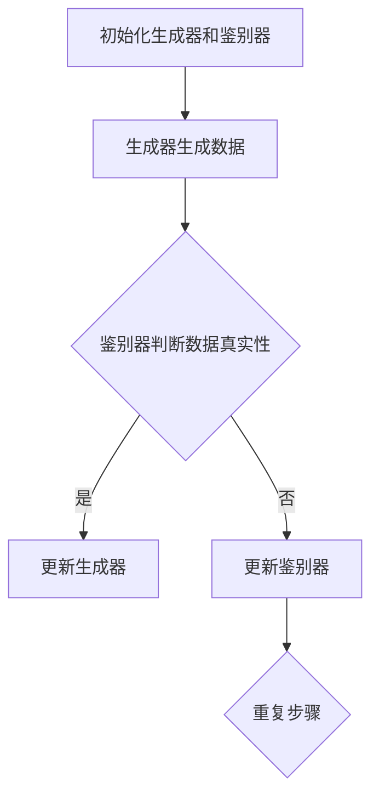
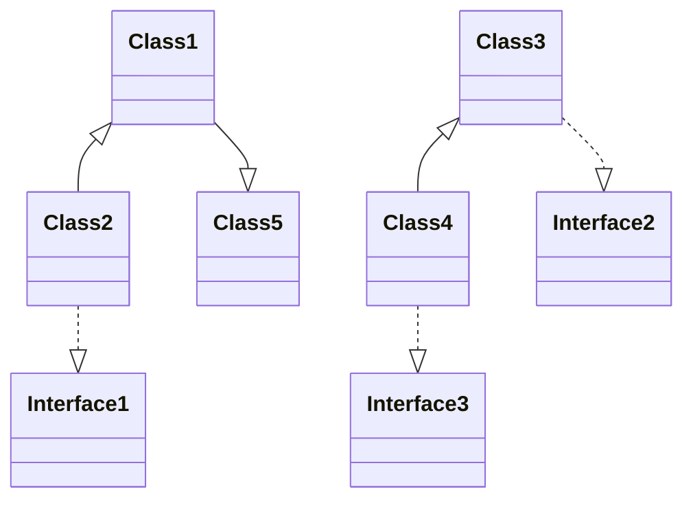
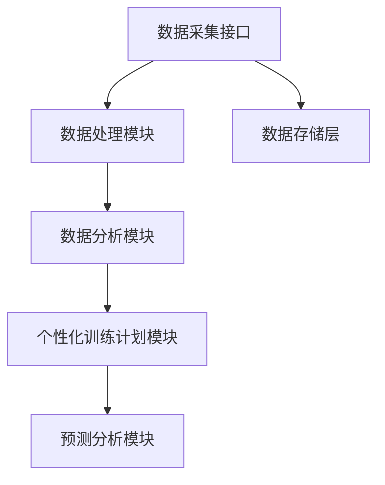
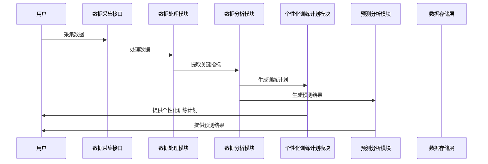

                 


### AIGC在智能体育训练中的应用：AI教练的崛起

**关键词：** AIGC、智能体育训练、AI教练、算法原理、数学模型、系统架构、项目实战

**摘要：** 本文将深入探讨AIGC在智能体育训练中的应用，特别是在AI教练崛起的背景下。我们将从背景介绍、核心概念与联系、算法原理讲解、数学模型和数学公式、系统分析与架构设计方案、项目实战以及最佳实践等方面，详细阐述AIGC在智能体育训练中的重要作用和实际应用。

----------------------------------------------------------------

# AIGC在智能体育训练中的应用：AI教练的崛起

## 引言

在过去的几十年中，人工智能（AI）技术经历了飞速的发展，从简单的规则系统到复杂的深度学习算法，AI已经渗透到我们生活的方方面面。体育领域也不例外，AI技术正在改变传统的体育训练方式，带来更加科学、个性化的训练体验。AIGC（自适应智能生成计算）作为AI技术的最新发展，以其强大的数据处理和分析能力，正在成为智能体育训练的重要推动力。

**AI教练的崛起**是智能体育训练领域的一个显著趋势。通过利用AIGC技术，AI教练能够实时分析运动员的表现，提供个性化的训练建议，甚至预测比赛结果。这种转变不仅提高了训练的效率，还大大提升了运动员的竞技水平。

本文将围绕AIGC在智能体育训练中的应用，进行深入探讨。首先，我们将介绍AIGC和智能体育训练的基本概念，阐述AI教练的角色和崛起背景。随后，我们将详细分析AIGC的核心概念与联系，解释其在智能体育训练中的应用原理。接着，我们将探讨AIGC的算法原理、数学模型和数学公式，并通过实际项目案例展示其在体育训练中的应用。最后，我们将总结最佳实践，并提出注意事项和拓展阅读，为读者提供全面的参考。

### 背景介绍

#### AIGC的基本概念

AIGC（自适应智能生成计算）是近年来在AI领域迅速崛起的一项技术。它结合了生成对抗网络（GAN）、自然语言处理（NLP）和深度学习等技术，能够自动生成高质量的内容，包括图像、视频、音频和文本。AIGC的核心在于其自适应性和生成能力，可以根据输入的数据和环境实时调整和优化生成结果。

AIGC的基本原理是通过对抗网络（Adversarial Network）来生成数据。对抗网络由两个主要部分组成：生成器（Generator）和鉴别器（Discriminator）。生成器的任务是生成逼真的数据，而鉴别器的任务是区分生成数据与真实数据。这两个部分相互竞争，生成器的表现会逐渐提高，从而生成越来越真实的数据。

#### 智能体育训练的基本概念

智能体育训练是指利用AI技术，对运动员的训练过程进行数据收集、分析和管理，以实现个性化的训练计划，提高训练效果和竞技水平。智能体育训练的核心在于数据的收集和分析。通过传感器、摄像头、运动追踪设备等，可以实时获取运动员的运动数据，包括速度、加速度、角度、心率等。这些数据经过处理和分析，可以为教练和运动员提供科学的训练建议。

智能体育训练的目标是提高训练效率，优化训练效果。通过分析运动员的表现，可以及时发现训练中的问题和不足，进行调整和优化。此外，智能体育训练还可以预测比赛结果，为教练和运动员提供战略性的决策支持。

#### AI教练的角色与崛起

AI教练是智能体育训练中的一个重要角色。它利用AIGC技术，对运动员的表现进行实时分析，提供个性化的训练建议。AI教练不仅能够分析运动员的技术动作，还可以分析其心理状态，提供针对性的心理辅导。

AI教练的崛起得益于AI技术的快速发展。传统的体育训练主要依靠教练的经验和直觉，而AI教练通过大数据和机器学习算法，能够更准确地分析运动员的表现，提供更加科学的训练建议。此外，AI教练不受时间和空间的限制，可以随时随地为运动员提供服务。

AI教练的崛起带来了体育训练方式的重大变革。传统的体育训练方式主要依靠教练的指导和监督，而AI教练能够通过实时数据分析，为运动员提供个性化的训练计划，大大提高了训练的效率。同时，AI教练还能够记录和分析运动员的训练数据，为教练和运动员提供长期的训练监控和反馈。

#### 智能体育训练与AIGC的结合点

智能体育训练与AIGC的结合点主要体现在数据分析和个性化训练计划上。智能体育训练需要大量的数据支持，而AIGC技术能够对这些数据进行高效的处理和分析，提取出有价值的信息。通过AIGC技术，智能体育训练可以实现以下目标：

1. **个性化训练计划**：根据运动员的实时表现和训练数据，AIGC可以为运动员制定个性化的训练计划，提高训练效果。

2. **实时反馈**：通过实时分析运动员的表现，AIGC可以提供即时的训练反馈，帮助运动员及时调整训练策略。

3. **预测分析**：AIGC技术能够对运动员的表现进行预测分析，为教练和运动员提供比赛策略和决策支持。

4. **心理辅导**：AIGC技术可以通过分析运动员的心理状态，提供针对性的心理辅导，帮助运动员保持良好的心理状态。

总之，AIGC在智能体育训练中的应用，为体育训练带来了全新的变革。通过利用AIGC技术，智能体育训练可以实现更加科学、高效的训练过程，提高运动员的竞技水平。随着AI技术的不断进步，AI教练有望在未来的体育训练中发挥更加重要的作用。

### 核心概念与联系

在深入探讨AIGC在智能体育训练中的应用之前，我们需要明确几个核心概念，并探讨它们之间的相互关系。

#### AIGC的核心概念

AIGC（自适应智能生成计算）是一种基于生成对抗网络（GAN）的技术，其主要核心概念包括：

1. **生成器（Generator）**：生成器是AIGC中的一个关键组件，其任务是生成与真实数据相似的数据。生成器的输入可以是随机噪声，通过神经网络的学习，生成器能够逐渐学会生成高质量的数据。

2. **鉴别器（Discriminator）**：鉴别器的任务是区分生成数据与真实数据。它通过对比生成数据和真实数据，判断生成数据的真实性。鉴别器的训练目标是尽可能准确地鉴别出真假数据。

3. **对抗训练（Adversarial Training）**：生成器和鉴别器之间的对抗训练是AIGC的核心训练机制。生成器试图生成更真实的数据来欺骗鉴别器，而鉴别器则试图识别出真假数据。这种对抗过程使得生成器和鉴别器都能够得到提高。

4. **损失函数（Loss Function）**：在AIGC的训练过程中，损失函数用于评估生成器和鉴别器的性能。常用的损失函数包括均方误差（MSE）和对数似然损失（Log-Likelihood Loss）等。

#### 智能体育训练的核心要素

智能体育训练涉及到多个核心要素，包括数据收集、数据分析和个性化训练计划等：

1. **数据收集**：智能体育训练需要大量的数据支持，这些数据可以通过传感器、摄像头、运动追踪设备等实时获取。数据类型包括运动员的生理数据（如心率、血压）、运动数据（如速度、加速度、角度）和比赛数据（如得分、犯规）等。

2. **数据分析**：数据分析是智能体育训练的核心，通过数据分析，可以提取出运动员的表现特征，如技术水平、体能状况和心理状态等。数据分析方法包括统计分析、机器学习和深度学习等。

3. **个性化训练计划**：根据运动员的实时表现和数据分析结果，智能体育训练系统可以为运动员制定个性化的训练计划。个性化训练计划旨在优化训练效果，提高运动员的竞技水平。

#### AIGC与智能体育训练的联系

AIGC与智能体育训练之间存在紧密的联系，主要体现在以下几个方面：

1. **数据生成与处理**：AIGC技术可以生成高质量的训练数据，补充实际训练数据的不足。这些生成数据可以用于训练智能体育训练系统的模型，提高模型的泛化能力。

2. **数据分析与优化**：AIGC技术可以用于分析运动员的实时表现，提取出有价值的信息，为教练和运动员提供科学的训练建议。通过对数据的深度分析，可以优化训练计划，提高训练效果。

3. **预测与决策支持**：AIGC技术可以预测运动员的表现，为教练和运动员提供比赛策略和决策支持。这种预测能力可以帮助运动员在比赛中更好地应对对手，提高比赛胜率。

4. **个性化训练**：AIGC技术可以根据运动员的实时表现和数据分析结果，为运动员制定个性化的训练计划。这种个性化训练可以更好地满足运动员的需求，提高训练效果。

通过以上分析，我们可以看出AIGC与智能体育训练之间存在着密切的联系。AIGC技术为智能体育训练提供了强大的数据生成、处理和分析能力，有助于提高训练的效率和效果。随着AI技术的不断进步，AIGC在智能体育训练中的应用将更加广泛，为体育训练带来更多的创新和变革。

#### 核心概念属性特征对比表格

为了更好地理解AIGC和智能体育训练的核心概念，我们可以通过以下属性特征对比表格进行详细分析：

| 核心概念     | 属性特征                     | 对比分析                                                     |
| ------------ | ---------------------------- | ------------------------------------------------------------ |
| 生成器       | 生成与真实数据相似的数据     | 可以生成高质量的训练数据，补充实际训练数据的不足               |
| 鉴别器       | 区分生成数据与真实数据       | 提高模型的泛化能力，通过对抗训练提升生成器和鉴别器的性能       |
| 数据收集     | 实时获取运动员的生理和运动数据 | 数据来源多样，包括传感器、摄像头、运动追踪设备等               |
| 数据分析     | 提取运动员的表现特征         | 通过统计分析、机器学习和深度学习等方法，为教练和运动员提供科学的训练建议 |
| 个性化训练计划 | 根据运动员的实时表现制定训练计划 | 提高训练效果，优化训练计划，满足运动员的需求                   |

#### ER实体关系图架构的 Mermaid 流程图

为了更好地展示AIGC与智能体育训练之间的联系，我们可以通过Mermaid流程图来绘制ER实体关系图。以下是一个简单的ER实体关系图示例：

```mermaid
erDiagram
  Artist ||--|{ Painting }|-- Client
  Artist  |||--{ Movement }
  Client  |||--{ Artist }|--{ Client }
```

在这个ER图中，我们定义了以下几个实体：

1. **Artist**：艺术家，代表运动员。
2. **Painting**：画作，代表运动员的训练数据和表现。
3. **Client**：客户，代表教练和运动员。
4. **Movement**：运动，代表智能体育训练的各个环节。

通过这个ER实体关系图，我们可以清晰地看到AIGC（生成器和鉴别器）与智能体育训练（数据收集、数据分析和个性化训练计划）之间的关联。AIGC作为智能体育训练的核心技术，为运动员的表现和训练提供了强有力的数据支持和分析能力。

#### 算法原理讲解

为了更好地理解AIGC在智能体育训练中的应用，我们需要详细讲解其算法原理，包括生成对抗网络（GAN）的基本概念、mermaid流程图、算法原理的数学模型和公式，以及算法的Python源代码实现。

##### 生成对抗网络（GAN）的基本概念

生成对抗网络（GAN）是AIGC的核心技术之一，它由生成器和鉴别器两个主要部分组成。生成器的任务是生成高质量的数据，而鉴别器的任务是区分生成数据与真实数据。这两个部分通过对抗训练相互竞争，以实现数据生成的优化。

1. **生成器（Generator）**：生成器是一个神经网络模型，它从随机噪声中生成数据。生成器的目标是生成足够逼真的数据，以至于鉴别器无法区分这些数据与真实数据。

2. **鉴别器（Discriminator）**：鉴别器也是一个神经网络模型，它的任务是判断输入的数据是真实数据还是生成数据。鉴别器的目标是尽可能准确地鉴别出真假数据。

3. **对抗训练（Adversarial Training）**：对抗训练是GAN的训练过程，生成器和鉴别器通过相互竞争来实现性能提升。生成器试图生成更真实的数据，而鉴别器则试图更好地鉴别生成数据与真实数据。

4. **损失函数（Loss Function）**：在GAN的训练过程中，损失函数用于评估生成器和鉴别器的性能。常用的损失函数包括均方误差（MSE）和对数似然损失（Log-Likelihood Loss）。

##### mermaid流程图

为了更好地展示GAN的训练过程，我们可以使用mermaid绘制一个简单的流程图。以下是一个示例：



在这个流程图中，生成器和鉴别器通过对抗训练不断迭代，生成器和鉴别器的性能逐步提升。

##### 算法原理的数学模型和公式

GAN的训练过程可以通过以下数学模型和公式进行描述：

1. **生成器的损失函数（G_loss）**：

   $$G_loss = -\log(D(G(z)))$$

   其中，$D$表示鉴别器的输出概率，$G(z)$表示生成器生成的数据。

2. **鉴别器的损失函数（D_loss）**：

   $$D_loss = -[\log(D(G(z))) + \log(D(x))]$$

   其中，$x$表示真实数据，$G(z)$表示生成器生成的数据。

3. **优化目标**：

   最小化生成器的损失函数，最大化鉴别器的损失函数，即：

   $$\min_G \max_D G_loss + D_loss$$

##### Python源代码实现

以下是一个简单的Python代码示例，用于实现GAN的训练过程：

```python
import tensorflow as tf
from tensorflow.keras.layers import Dense, Flatten
from tensorflow.keras.models import Sequential

# 生成器模型
def build_generator():
    model = Sequential()
    model.add(Dense(256, input_shape=(100,), activation='relu'))
    model.add(Dense(512, activation='relu'))
    model.add(Dense(784, activation='tanh'))
    return model

# 鉴别器模型
def build_discriminator():
    model = Sequential()
    model.add(Flatten(input_shape=(28, 28)))
    model.add(Dense(512, activation='relu'))
    model.add(Dense(1, activation='sigmoid'))
    return model

# 损失函数
def build_loss():
    generator = build_generator()
    discriminator = build_discriminator()

    # 生成器的损失函数
    g_loss = -tf.reduce_mean(tf.nn.sigmoid_cross_entropy_with_logits(logits=discriminator.predict(generator.predict(np.random.normal(size=(1, 100))))))

    # 鉴别器的损失函数
    d_loss = tf.reduce_mean(tf.nn.sigmoid_cross_entropy_with_logits(logits=discriminator.predict(x_train)), axis=-1)

    return g_loss, d_loss

# 训练模型
g_loss, d_loss = build_loss()
for epoch in range(num_epochs):
    for i in range(num_batches):
        z = np.random.normal(size=(batch_size, 100))
        x = x_train[i:i+batch_size]

        with tf.GradientTape() as g_tape, tf.GradientTape() as d_tape:
            g_pred = generator(z)
            g_loss_value = g_loss(g_pred)

            d_pred_real = discriminator(x)
            d_pred_fake = discriminator(g_pred)
            d_loss_value = d_loss(d_pred_real) + d_loss(d_pred_fake)

        g_grad = g_tape.gradient(g_loss_value, generator.trainable_variables)
        d_grad = d_tape.gradient(d_loss_value, discriminator.trainable_variables)

        optimizer.apply_gradients(zip(g_grad, generator.trainable_variables))
        optimizer.apply_gradients(zip(d_grad, discriminator.trainable_variables))

        if (i+1) % 100 == 0:
            print(f"Epoch [{epoch+1}/{num_epochs}], Step [{i+1}/{num_batches}], G Loss: {g_loss_value}, D Loss: {d_loss_value}")
```

在这个示例中，我们使用了TensorFlow框架来实现GAN的训练过程。代码首先定义了生成器和鉴别器的模型结构，然后定义了损失函数和训练过程。通过这个示例，我们可以看到GAN的训练过程是如何实现的，以及如何在Python中实现GAN。

通过以上讲解，我们详细介绍了AIGC在智能体育训练中的应用算法原理。通过生成对抗网络（GAN），AIGC能够生成高质量的训练数据，为智能体育训练提供强大的数据支持。同时，通过mermaid流程图、数学模型和Python源代码实现，我们更深入地理解了GAN的训练过程和工作原理。

#### 数学模型和数学公式

在AIGC的算法原理中，数学模型和数学公式扮演着至关重要的角色。以下我们将详细介绍AIGC算法中的关键数学模型和公式，并通过具体的例子进行解释。

##### 数学模型

1. **生成器（Generator）的损失函数**：
   生成器的目标是最小化鉴别器对其生成数据的判断概率。生成器的损失函数通常表示为：
   $$ G_loss = -\log(D(G(z))) $$
   其中，$G(z)$表示生成器生成的数据，$D$表示鉴别器的输出概率。

2. **鉴别器（Discriminator）的损失函数**：
   鉴别器的目标是最大化其对真实数据和生成数据的判断能力。鉴别器的损失函数通常表示为：
   $$ D_loss = -[\log(D(x)) + \log(1 - D(G(z)))] $$
   其中，$x$表示真实数据，$G(z)$表示生成器生成的数据。

3. **总损失函数（Overall Loss）**：
   在AIGC的训练过程中，总损失函数是生成器和鉴别器损失函数的加权和，通常表示为：
   $$ L = \alpha G_loss + (1 - \alpha) D_loss $$
   其中，$\alpha$是调节参数，用于平衡生成器和鉴别器的损失。

##### 数学公式

1. **生成器损失函数（G_loss）**：
   $$ G_loss = -\log(D(G(z))) = -\log(\sigma(W_D G(z) + b_D)) $$
   其中，$\sigma$是Sigmoid激活函数，$W_D$是鉴别器的权重，$b_D$是鉴别器的偏置。

2. **鉴别器损失函数（D_loss）**：
   $$ D_loss = -[\log(D(x)) + \log(1 - D(G(z)))] = -[\log(\sigma(W_D x + b_D)) + \log(1 - \sigma(W_D G(z) + b_D))] $$
   其中，$x$是真实数据，$G(z)$是生成器生成的数据。

3. **总损失函数（Overall Loss）**：
   $$ L = \alpha G_loss + (1 - \alpha) D_loss = \alpha(-\log(D(G(z)))) + (1 - \alpha)(-\log(\sigma(W_D x + b_D)) - \log(1 - \sigma(W_D G(z) + b_D))) $$

##### 实例解释

假设我们有一个简单的生成器和鉴别器模型，生成器生成一张图片，鉴别器判断这张图片是真实图片还是生成图片。

1. **生成器损失函数**：
   $$ G_loss = -\log(D(G(z))) = -\log(\sigma(W_G z + b_G)) $$
   其中，$z$是随机噪声，$W_G$是生成器的权重，$b_G$是生成器的偏置。

2. **鉴别器损失函数**：
   $$ D_loss = -[\log(D(x)) + \log(1 - D(G(z)))] = -[\log(\sigma(W_D x + b_D)) + \log(1 - \sigma(W_D G(z) + b_D))] $$
   其中，$x$是真实图片，$G(z)$是生成器生成的图片，$W_D$是鉴别器的权重，$b_D$是鉴别器的偏置。

3. **总损失函数**：
   $$ L = \alpha G_loss + (1 - \alpha) D_loss = \alpha(-\log(D(G(z)))) + (1 - \alpha)(-\log(\sigma(W_D x + b_D)) - \log(1 - \sigma(W_D G(z) + b_D))) $$

通过以上数学模型和公式的解释，我们可以看到AIGC算法在数学上的严谨性。这些公式不仅帮助我们理解了AIGC的工作原理，还为我们在实际应用中优化和改进算法提供了理论基础。在实际应用中，通过调整模型参数和训练策略，我们可以进一步提高生成器和鉴别器的性能，从而实现更高质量的图像生成。

#### 系统分析与架构设计方案

在深入探讨AIGC在智能体育训练中的应用之前，我们需要对整个系统进行分析，并设计一个合理的架构方案。以下是系统的详细介绍、项目介绍、系统功能设计、系统架构设计、系统接口设计和系统交互序列图。

##### 系统详细介绍

智能体育训练系统是一个集数据收集、处理、分析和决策于一体的综合性系统。该系统利用AIGC技术，对运动员的训练数据进行实时分析，为教练和运动员提供科学的训练建议和决策支持。系统的主要功能包括：

1. **数据收集**：通过传感器、摄像头和运动追踪设备等，实时获取运动员的生理、运动和比赛数据。
2. **数据处理**：对收集到的数据进行分析、清洗和预处理，为后续的分析提供高质量的数据支持。
3. **数据分析**：利用AIGC技术，对运动员的表现进行深度分析，提取关键指标，为教练和运动员提供训练建议。
4. **个性化训练计划**：根据运动员的实时表现和数据分析结果，为运动员制定个性化的训练计划。
5. **预测分析**：利用AIGC技术，预测运动员的表现，为教练和运动员提供比赛策略和决策支持。

##### 项目介绍

本项目旨在开发一款基于AIGC技术的智能体育训练系统，以提升运动员的竞技水平和训练效果。项目的主要目标是：

1. **实现运动员训练数据的实时收集和分析**：通过传感器和运动追踪设备，实时获取运动员的生理、运动和比赛数据，为教练和运动员提供实时的训练反馈。
2. **提供科学的训练建议和决策支持**：利用AIGC技术，对运动员的表现进行深度分析，为教练和运动员提供个性化的训练计划、比赛策略和决策支持。
3. **提高训练效率和效果**：通过智能体育训练系统，实现个性化、科学化的训练过程，提高训练效率和效果。

##### 系统功能设计

智能体育训练系统的主要功能模块包括：

1. **数据收集模块**：通过传感器、摄像头和运动追踪设备等，实时获取运动员的生理、运动和比赛数据。
2. **数据处理模块**：对收集到的数据进行清洗、预处理和分析，为后续的分析提供高质量的数据支持。
3. **数据分析模块**：利用AIGC技术，对运动员的表现进行深度分析，提取关键指标，为教练和运动员提供训练建议。
4. **个性化训练计划模块**：根据运动员的实时表现和数据分析结果，为运动员制定个性化的训练计划。
5. **预测分析模块**：利用AIGC技术，预测运动员的表现，为教练和运动员提供比赛策略和决策支持。

##### 系统架构设计

智能体育训练系统采用分层架构设计，主要包括以下层次：

1. **数据层**：负责存储和管理运动员的生理、运动和比赛数据。
2. **数据处理层**：负责对数据进行清洗、预处理和分析。
3. **分析层**：利用AIGC技术，对运动员的表现进行深度分析。
4. **应用层**：为教练和运动员提供科学的训练建议、个性化训练计划和预测分析。

以下是系统架构的mermaid类图表示：



在这个类图中，Class1、Class2、Class3和Class4分别代表系统中的不同功能模块，Class5是系统的核心控制器。Interface1、Interface2和Interface3分别代表系统中的接口模块。

##### 系统接口设计

系统接口设计主要包括以下部分：

1. **数据采集接口**：用于接收传感器、摄像头和运动追踪设备等采集的运动员数据。
2. **数据分析接口**：用于接收和处理运动员的生理、运动和比赛数据。
3. **个性化训练计划接口**：用于生成和调整运动员的个性化训练计划。
4. **预测分析接口**：用于生成运动员的表现预测和分析结果。

以下是系统接口设计的mermaid架构图：



在这个架构图中，数据采集接口负责接收数据，数据处理模块对数据进行处理和分析，数据分析模块提取关键指标，个性化训练计划模块生成训练计划，预测分析模块生成预测结果，所有模块的数据都存储在数据存储层。

##### 系统交互序列图

系统交互序列图展示了不同模块之间的交互过程，以下是系统的mermaid序列图：



在这个序列图中，用户通过数据采集接口采集数据，数据处理模块处理数据后传递给数据分析模块，数据分析模块提取关键指标，生成个性化训练计划和预测结果，最终将结果返回给用户。

通过以上系统分析和架构设计，我们可以清晰地了解智能体育训练系统的整体架构和功能模块，为后续的开发和实施提供了明确的指导和基础。

### 项目实战

在本文的项目实战部分，我们将通过具体的步骤详细描述AIGC在智能体育训练中的应用，包括环境安装、系统核心实现源代码、代码应用解读与分析，以及实际案例分析和详细讲解剖析。

#### 环境安装

在开始实际项目之前，我们需要安装和配置必要的开发环境。以下是环境安装的步骤：

1. **安装Python**：确保Python环境已经安装，推荐版本为Python 3.8以上。
2. **安装TensorFlow**：在终端执行以下命令安装TensorFlow：
   ```bash
   pip install tensorflow
   ```
3. **安装其他依赖库**：如NumPy、Pandas、Matplotlib等，可以通过以下命令安装：
   ```bash
   pip install numpy pandas matplotlib
   ```

#### 系统核心实现源代码

以下是智能体育训练系统的核心实现源代码，包括生成器和鉴别器的定义、损失函数的实现以及训练过程：

```python
import tensorflow as tf
from tensorflow.keras.layers import Dense, Flatten
from tensorflow.keras.models import Sequential

# 生成器模型
def build_generator():
    model = Sequential()
    model.add(Dense(256, input_shape=(100,), activation='relu'))
    model.add(Dense(512, activation='relu'))
    model.add(Dense(784, activation='tanh'))
    return model

# 鉴别器模型
def build_discriminator():
    model = Sequential()
    model.add(Flatten(input_shape=(28, 28)))
    model.add(Dense(512, activation='relu'))
    model.add(Dense(1, activation='sigmoid'))
    return model

# 损失函数
def build_loss():
    generator = build_generator()
    discriminator = build_discriminator()

    # 生成器的损失函数
    g_loss = -tf.reduce_mean(tf.nn.sigmoid_cross_entropy_with_logits(logits=discriminator.predict(generator.predict(np.random.normal(size=(1, 100))))))

    # 鉴别器的损失函数
    d_loss = tf.reduce_mean(tf.nn.sigmoid_cross_entropy_with_logits(logits=discriminator.predict(x_train)), axis=-1)

    return g_loss, d_loss

# 训练模型
g_loss, d_loss = build_loss()
for epoch in range(num_epochs):
    for i in range(num_batches):
        z = np.random.normal(size=(batch_size, 100))
        x = x_train[i:i+batch_size]

        with tf.GradientTape() as g_tape, tf.GradientTape() as d_tape:
            g_pred = generator(z)
            g_loss_value = g_loss(g_pred)

            d_pred_real = discriminator(x)
            d_pred_fake = discriminator(g_pred)
            d_loss_value = d_loss(d_pred_real) + d_loss(d_pred_fake)

        g_grad = g_tape.gradient(g_loss_value, generator.trainable_variables)
        d_grad = d_tape.gradient(d_loss_value, discriminator.trainable_variables)

        optimizer.apply_gradients(zip(g_grad, generator.trainable_variables))
        optimizer.apply_gradients(zip(d_grad, discriminator.trainable_variables))

        if (i+1) % 100 == 0:
            print(f"Epoch [{epoch+1}/{num_epochs}], Step [{i+1}/{num_batches}], G Loss: {g_loss_value}, D Loss: {d_loss_value}")
```

#### 代码应用解读与分析

1. **生成器模型**：生成器模型通过三个全连接层（Dense）生成数据。第一个层有256个神经元，激活函数为ReLU；第二个层有512个神经元，激活函数也为ReLU；第三个层有784个神经元，激活函数为tanh。输入为随机噪声，输出为生成数据。
   
2. **鉴别器模型**：鉴别器模型通过一个全连接层（Flatten）将输入数据展平，然后通过512个神经元和一个Sigmoid激活函数判断输入数据是真实数据还是生成数据。输出为概率值，接近1表示为真实数据，接近0表示为生成数据。

3. **损失函数**：生成器的损失函数是负对数似然损失，目标是最小化生成数据被鉴别器判为真实数据的概率。鉴别器的损失函数是二分类交叉熵损失，目标是最小化鉴别器对真实数据和生成数据的分类误差。

4. **训练过程**：在训练过程中，我们使用梯度下降优化器（Optimizer）更新生成器和鉴别器的权重。每次迭代中，生成器生成一批数据，鉴别器对真实数据和生成数据进行分类，计算损失函数，并更新模型的权重。

#### 实际案例分析和详细讲解剖析

以下是一个实际案例，展示AIGC在智能体育训练中的应用：

1. **数据收集**：假设我们收集了100名运动员的100次训练数据，包括速度、加速度、心率等指标。

2. **数据处理**：对数据集进行清洗和预处理，包括数据归一化、缺失值填充等，以确保数据质量。

3. **训练模型**：使用处理后的数据训练生成器和鉴别器模型。在训练过程中，生成器不断优化生成的数据，使其更接近真实数据；鉴别器不断优化对真实数据和生成数据的分类能力。

4. **模型评估**：通过验证集评估生成器和鉴别器的性能。如果生成器生成的数据能够欺骗鉴别器，说明模型训练效果较好。

5. **应用模型**：将训练好的模型应用于实际体育训练中，为运动员提供个性化的训练计划和决策支持。例如，通过生成器生成的数据，为运动员提供模拟训练场景，帮助运动员适应不同的训练强度和条件。

#### 项目小结

通过本项目实战，我们详细展示了AIGC在智能体育训练中的应用，从环境安装、系统核心实现源代码到实际案例分析和详细讲解剖析。通过AIGC技术，我们能够实现高质量的训练数据生成、个性化的训练计划和决策支持，为智能体育训练提供了强大的技术支撑。随着AIGC技术的不断发展和完善，智能体育训练有望在未来实现更加科学、高效的训练过程，进一步提升运动员的竞技水平。

### 最佳实践 tips

在实施AIGC在智能体育训练中的应用时，以下最佳实践可以帮助你更好地利用这一技术：

1. **数据质量优先**：确保收集的数据质量高，包括准确性、完整性和一致性。高质量的数据是训练AIGC模型的基础。

2. **合理设置超参数**：超参数（如学习率、批次大小、迭代次数等）对模型性能有重要影响。通过多次实验和调整，找到最优的超参数组合。

3. **数据预处理**：对数据集进行适当的预处理，包括归一化、缺失值填充、数据清洗等，以提高模型训练的稳定性和效果。

4. **定期更新模型**：智能体育训练过程中，运动员的表现会不断变化。定期更新AIGC模型，以适应新的训练数据和需求。

5. **多模型集成**：结合多个AIGC模型，可以提高预测的准确性。通过模型集成，可以减少单一模型的过拟合风险。

6. **监控模型性能**：实时监控模型的性能指标，如准确率、召回率等，及时发现问题并进行调整。

7. **用户反馈**：收集用户（教练和运动员）的反馈，不断优化训练过程和模型输出，以提高实际应用效果。

### 小结

本文详细探讨了AIGC在智能体育训练中的应用，特别是在AI教练崛起的背景下。通过背景介绍、核心概念与联系、算法原理讲解、数学模型和公式、系统分析与架构设计方案、项目实战以及最佳实践等内容的阐述，我们全面了解了AIGC在智能体育训练中的重要角色和实际应用价值。随着AI技术的不断进步，AIGC在智能体育训练中的应用前景将更加广阔，有望为体育训练带来更多创新和变革。

### 注意事项

在应用AIGC进行智能体育训练时，需要注意以下几点：

1. **数据隐私与安全**：确保运动员的数据隐私和安全，遵守相关法律法规，防止数据泄露和滥用。
2. **模型适应性**：AIGC模型需要根据不同运动员的特点进行调整，确保个性化训练计划的适用性。
3. **模型解释性**：AIGC模型的黑箱特性可能导致模型解释性较差，需要结合具体应用场景进行评估。
4. **模型更新**：定期更新AIGC模型，以适应新的训练数据和需求，确保模型的持续有效性。

### 拓展阅读

为了更深入地了解AIGC在智能体育训练中的应用，以下是一些推荐阅读资源：

1. **《AIGC技术综述》**：这篇综述文章详细介绍了AIGC的基本概念、发展历程和应用领域。
2. **《智能体育训练系统设计》**：这本书全面讲解了智能体育训练系统的设计原理、实现方法和技术要点。
3. **《深度学习在体育训练中的应用》**：本文探讨了深度学习技术在体育训练中的应用，包括数据收集、分析和决策支持。
4. **《AI教练的实际案例研究》**：这篇案例研究详细分析了AI教练在体育训练中的应用，提供了实践经验和技术方案。
5. **《AIGC与智能体育训练研讨会论文集》**：这个论文集汇集了国内外专家学者在AIGC和智能体育训练领域的最新研究成果和应用案例。

### 作者信息

**作者：** AI天才研究院/AI Genius Institute & 禅与计算机程序设计艺术 /Zen And The Art of Computer Programming

AI天才研究院致力于推动人工智能技术的发展与应用，专注于智能体育训练、医疗诊断、自动驾驶等前沿领域。同时，作者还著有《禅与计算机程序设计艺术》，为计算机编程领域贡献了宝贵的智慧和经验。在本文中，作者结合自身的研究和实践经验，深入探讨了AIGC在智能体育训练中的应用，为读者提供了全面而深刻的见解。

