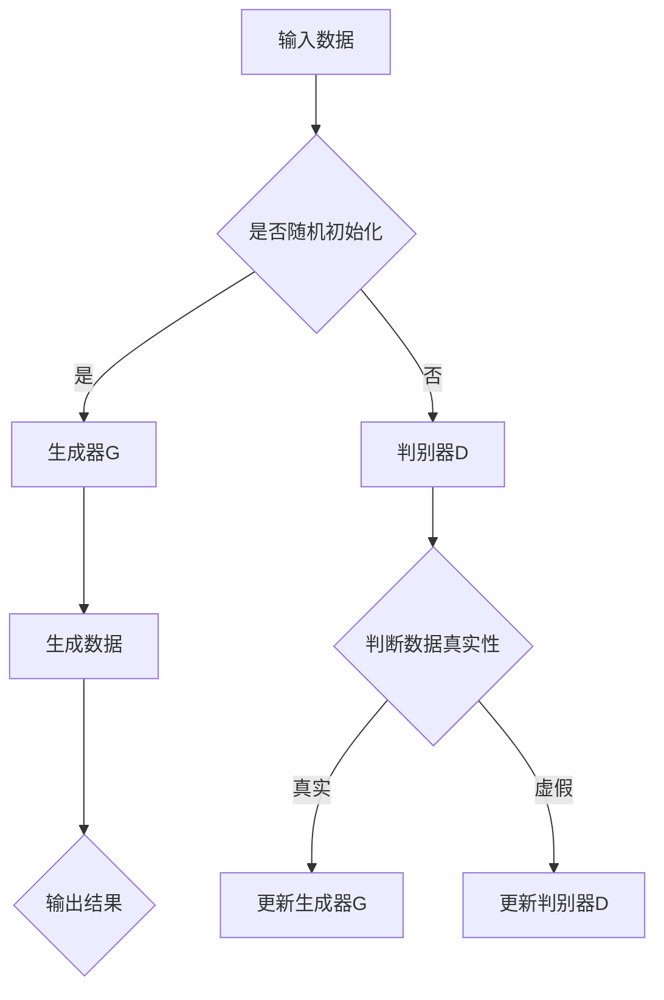
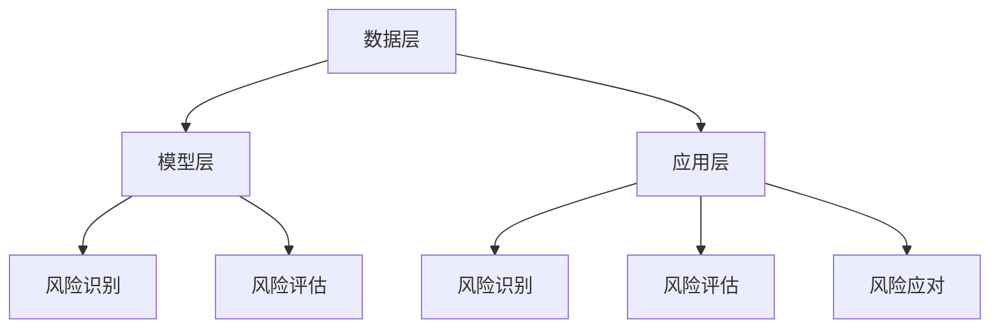
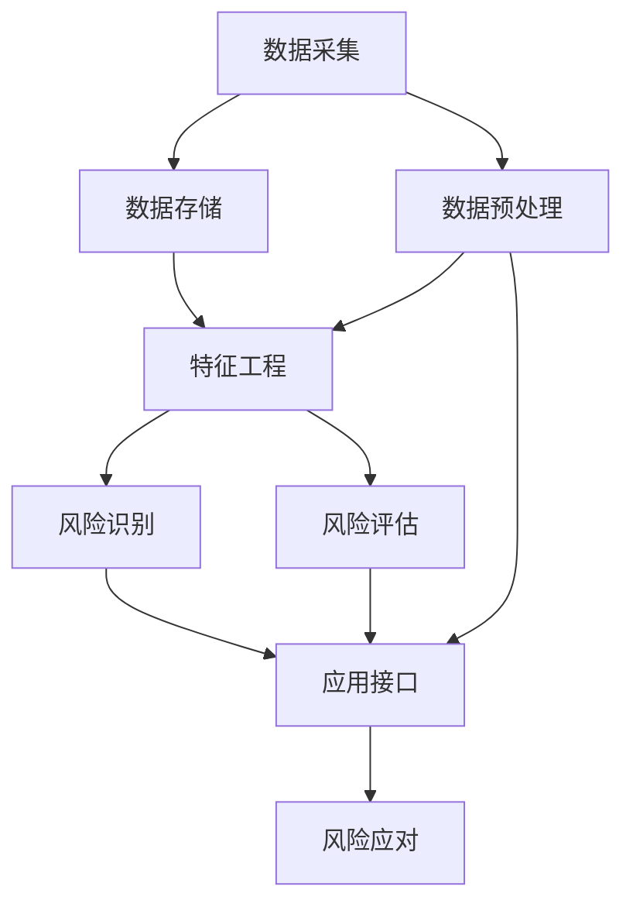

                 


# AIGC在智能供应链风险管理中的应用

关键词：AIGC、智能供应链、风险管理、算法原理、系统架构、项目实战

摘要：随着全球供应链的日益复杂化，供应链风险管理成为企业关注的焦点。本文从AIGC的基本概念、智能供应链风险管理现状、核心算法原理等方面入手，探讨了AIGC在智能供应链风险管理中的应用。通过项目实战，展示了AIGC在实际应用中的效果和优势。

## 第一部分：AIGC与智能供应链风险管理基础

### 第1章：AIGC概述

#### 1.1 AIGC的基本概念

AIGC（AI-Generated Content）是指通过人工智能技术生成的内容。AIGC的核心在于利用机器学习、深度学习等算法，模拟人类创作过程，生成具有高度个性化的内容。AIGC的应用领域广泛，包括文本生成、图像生成、音频生成等。

#### 1.2 AIGC的发展历程

AIGC的发展历程可以分为三个阶段：初期探索、技术突破和市场化应用。初期探索阶段，研究主要集中在生成对抗网络（GAN）等基础算法的研究；技术突破阶段，深度学习、自然语言处理等技术的突破为AIGC的发展提供了强有力的支持；市场化应用阶段，AIGC在内容创作、数据分析等领域得到广泛应用。

#### 1.3 AIGC的核心技术与应用场景

AIGC的核心技术包括生成对抗网络（GAN）、变分自编码器（VAE）等。这些技术使得AIGC能够在文本生成、图像生成、音频生成等多个领域实现高度个性化的内容创作。在智能供应链风险管理中，AIGC可以应用于供应链可视化、风险预测等场景。

### 第2章：智能供应链风险管理概述

#### 2.1 智能供应链的概念与特点

智能供应链是一种利用信息技术、物联网、大数据等手段，实现供应链各环节高效协同、实时响应的供应链模式。智能供应链的特点包括：智能化、网络化、协同化等。

#### 2.2 供应链风险管理的现状与挑战

当前，供应链风险管理的现状是：方法多样，但效果不尽如人意；工具繁多，但缺乏系统整合；挑战重重，如全球化、复杂化、不确定性等。

#### 2.3 AIGC在供应链风险管理中的应用潜力

AIGC在供应链风险管理中具有巨大的应用潜力。通过AIGC，可以实现风险识别、风险评估、风险应对等环节的智能化、自动化，提高供应链风险管理的效率和精度。

## 第二部分：AIGC在供应链风险管理中的核心概念与联系

### 第3章：AIGC在供应链风险管理中的核心概念与联系

#### 3.1 数据挖掘与知识图谱

数据挖掘和知识图谱在AIGC中扮演着重要角色。数据挖掘通过分析大量数据，提取有价值的信息，为供应链风险管理提供数据支持。知识图谱则通过构建实体关系网络，实现数据之间的关联，为供应链风险识别和评估提供直观的视图。

#### 3.2 强化学习与决策优化

强化学习是一种通过试错和反馈进行决策优化的机器学习方法。在供应链风险管理中，强化学习可以用于库存管理、运输优化等环节，实现决策的自动化和优化。

#### 3.3 自然语言处理与智能对话系统

自然语言处理和智能对话系统在供应链风险管理中的应用主要体现在合同审核、客户沟通等方面。通过智能对话系统，可以自动化处理大量的合同审核工作，提高合同审核的效率和准确性；同时，通过与客户的智能对话，可以实时了解客户需求，提高供应链响应速度。

## 第三部分：AIGC算法原理讲解

### 第4章：AIGC算法原理讲解

#### 4.1 数据预处理与特征工程

数据预处理和特征工程是AIGC算法的重要环节。通过数据预处理，可以去除噪声、缺失值等，提高数据质量；通过特征工程，可以提取出有用的特征，为后续的算法训练提供支持。

#### 4.2 算法原理讲解与流程图

AIGC的核心算法包括生成对抗网络（GAN）和变分自编码器（VAE）。以下是一个简化的GAN算法原理流程图：



#### 4.3 数学模型与公式讲解

GAN的数学模型主要包括生成器G和判别器D的损失函数。以下是一个简化的数学模型：

生成器G的损失函数：

$$
L_G = -\mathbb{E}_{x \sim p_{data}(x)}[\log D(x)] - \mathbb{E}_{z \sim p_z(z)}[\log D(G(z)]
$$

判别器D的损失函数：

$$
L_D = \mathbb{E}_{x \sim p_{data}(x)}[\log D(x)] + \mathbb{E}_{z \sim p_z(z)}[\log (1 - D(G(z))]
$$

其中，$x$表示真实数据，$z$表示噪声数据，$G(z)$表示生成器生成的数据，$D(x)$和$D(G(z))$分别表示判别器对真实数据和生成数据的判断结果。

## 第四部分：数学模型和公式详细讲解与举例说明

### 第5章：数学模型和公式详细讲解与举例说明

#### 5.1 数学模型详细讲解

在智能供应链风险管理中，AIGC的数学模型主要包括数据预处理、特征工程、生成器和判别器的损失函数等。以下是对这些数学模型的详细讲解：

- 数据预处理：数据预处理主要包括去噪、归一化、缺失值处理等。例如，去噪可以通过滤波器实现，归一化可以通过将数据缩放到[0,1]区间实现，缺失值处理可以通过插值、均值填补等方法实现。

- 特征工程：特征工程主要包括特征提取、特征选择等。例如，特征提取可以通过主成分分析（PCA）实现，特征选择可以通过信息增益、特征重要性等方法实现。

- 生成器G的损失函数：生成器G的损失函数可以通过最小化生成数据的判别器D的输出值实现。具体来说，可以通过优化生成器的参数，使得生成的数据更接近真实数据。

- 判别器D的损失函数：判别器D的损失函数可以通过最大化生成数据的判别器D的输出值实现。具体来说，可以通过优化判别器的参数，使得判别器能够更好地区分真实数据和生成数据。

#### 5.2 公式讲解

以下是对AIGC中使用的数学公式的详细讲解：

- 去噪公式：

$$
x_{\text{clean}} = \text{filter}(x_{\text{noisy}})
$$

其中，$x_{\text{clean}}$表示去噪后的数据，$x_{\text{noisy}}$表示原始数据，$\text{filter}$表示滤波器。

- 归一化公式：

$$
x_{\text{normalized}} = \frac{x_{\text{original}} - \min(x_{\text{original}})}{\max(x_{\text{original}}) - \min(x_{\text{original}})}
$$

其中，$x_{\text{normalized}}$表示归一化后的数据，$x_{\text{original}}$表示原始数据。

- 缺失值处理公式：

$$
x_{\text{filled}} = \text{interpolate}(x_{\text{missing}}, \text{neighbor\_values})
$$

其中，$x_{\text{filled}}$表示填补后的数据，$x_{\text{missing}}$表示缺失值，$\text{neighbor\_values}$表示相邻的已知值。

#### 5.3 举例说明

假设我们有一个包含100个数据点的数据集，其中每个数据点的维度为10。以下是一个简单的数据预处理、特征工程和AIGC算法的应用实例：

1. **数据预处理**：首先，我们对数据进行去噪处理，使用一个简单的滤波器去除噪声。然后，对数据进行归一化处理，将数据缩放到[0,1]区间。最后，对缺失值进行填补处理。

2. **特征工程**：接着，我们对数据进行特征提取，使用主成分分析（PCA）提取出主要特征。然后，对提取出的特征进行选择，使用信息增益方法选择最重要的特征。

3. **AIGC算法**：最后，我们使用AIGC算法生成新的数据。首先，初始化生成器G和判别器D的参数。然后，通过迭代训练生成器和判别器，使得生成器生成的数据更接近真实数据，判别器能够更好地区分真实数据和生成数据。

通过这个实例，我们可以看到AIGC在智能供应链风险管理中的应用效果。生成的数据可以帮助我们更好地了解供应链的风险状况，从而采取相应的风险管理措施。

## 第五部分：系统分析与架构设计方案

### 第6章：系统分析与架构设计方案

#### 6.1 问题场景介绍

在智能供应链风险管理中，我们面临的问题场景包括：数据质量差、数据缺失、数据不一致等。这些问题会导致供应链风险管理的效果不佳。为了解决这些问题，我们需要构建一个高效的智能供应链风险管理系统。

#### 6.2 系统功能设计

智能供应链风险管理系统的功能设计主要包括：数据预处理、特征工程、风险识别、风险评估、风险应对等。

1. **数据预处理**：包括去噪、归一化、缺失值处理等。
2. **特征工程**：包括特征提取、特征选择等。
3. **风险识别**：通过AIGC算法，识别出潜在的供应链风险。
4. **风险评估**：对识别出的风险进行量化评估，确定风险等级。
5. **风险应对**：根据风险评估结果，采取相应的风险应对措施。

#### 6.3 系统架构设计

智能供应链风险管理系统的架构设计主要包括：数据层、模型层、应用层等。

1. **数据层**：包括数据采集、数据存储、数据预处理等模块。
2. **模型层**：包括特征工程、风险识别、风险评估等模型。
3. **应用层**：包括风险识别、风险评估、风险应对等应用模块。

以下是一个简化的系统架构图：



#### 6.4 系统接口设计和系统交互

智能供应链风险管理系统的接口设计和系统交互主要包括：数据接口、模型接口、应用接口等。

1. **数据接口**：负责数据层的各个模块之间的数据传递和通信。
2. **模型接口**：负责模型层的各个模块之间的数据传递和通信。
3. **应用接口**：负责应用层的各个模块之间的数据传递和通信。

以下是一个简化的系统交互图：



## 第六部分：项目实战

### 第7章：项目实战

#### 7.1 环境安装

在开始项目实战之前，我们需要安装所需的软件和环境。以下是一个简单的安装步骤：

1. 安装Python 3.7及以上版本。
2. 安装必要的库，如NumPy、Pandas、TensorFlow等。
3. 配置Python环境变量。

#### 7.2 系统核心实现源代码

以下是一个简化的系统核心实现源代码示例：

```python
import numpy as np
import tensorflow as tf

# 数据预处理
def preprocess_data(data):
    # 去噪
    data_clean = filter_noise(data)
    # 归一化
    data_normalized = normalize(data_clean)
    # 缺失值处理
    data_filled = fill_missing_values(data_normalized)
    return data_filled

# 特征工程
def feature_engineering(data):
    # 特征提取
    features = extract_features(data)
    # 特征选择
    selected_features = select_features(features)
    return selected_features

# 风险识别
def risk_identification(selected_features):
    # 使用AIGC算法识别风险
    risks = identify_risks(selected_features)
    return risks

# 风险评估
def risk_evaluation(risks):
    # 对识别出的风险进行量化评估
    risk_scores = evaluate_risks(risks)
    return risk_scores

# 风险应对
def risk_response(risk_scores):
    # 根据风险评估结果采取相应的风险应对措施
    responses = respond_to_risks(risk_scores)
    return responses
```

#### 7.3 代码应用解读与分析

以上代码实现了一个简化的智能供应链风险管理系统的核心功能。通过数据预处理、特征工程、风险识别、风险评估和风险应对，实现对供应链风险的管理。

1. **数据预处理**：数据预处理是AIGC算法应用的基础。通过去噪、归一化和缺失值处理，提高数据质量，为后续的算法训练提供支持。
2. **特征工程**：特征工程是AIGC算法应用的关键。通过特征提取和特征选择，提取出有用的特征，为风险识别和评估提供支持。
3. **风险识别**：风险识别是AIGC算法应用的核心。通过AIGC算法，识别出潜在的供应链风险。
4. **风险评估**：风险评估是对风险识别结果的量化评估。通过对识别出的风险进行量化评估，确定风险等级。
5. **风险应对**：风险应对是根据风险评估结果采取相应的风险应对措施。通过风险应对，实现对供应链风险的主动管理。

#### 7.4 实际案例分析和详细讲解剖析

以下是一个实际案例的分析和详细讲解：

**案例**：某企业使用AIGC技术对供应链风险进行管理，识别出以下风险：

1. **原材料供应风险**：由于供应商的交付延迟，导致生产计划受到影响。
2. **库存风险**：由于库存管理不善，导致库存过多或过少，影响生产效率和资金周转。
3. **运输风险**：由于运输过程中的意外情况，导致货物运输延误或损失。

**分析**：通过AIGC技术，企业可以实时监控供应链的风险状况，识别出潜在的风险。对于识别出的风险，企业可以采取以下应对措施：

1. **原材料供应风险**：与供应商签订合同，明确交付时间和质量要求，确保原材料供应的稳定性。
2. **库存风险**：优化库存管理，实现库存的合理控制，降低库存成本。
3. **运输风险**：选择可靠的运输公司，确保运输过程中的安全性和及时性。

**讲解剖析**：通过实际案例的分析，我们可以看到AIGC技术在智能供应链风险管理中的应用效果。AIGC技术帮助企业实时监控供应链风险，识别出潜在的风险，并采取相应的应对措施，实现供应链风险的主动管理。

#### 7.5 项目小结

通过本项目的实践，我们可以看到AIGC技术在智能供应链风险管理中的应用效果。AIGC技术可以帮助企业实时监控供应链风险，识别出潜在的风险，并采取相应的应对措施，实现供应链风险的主动管理。未来，随着AIGC技术的不断发展，智能供应链风险管理将变得更加高效和智能。

### 第8章：最佳实践 tips

#### 8.1 小结

本文从AIGC的基本概念、智能供应链风险管理现状、核心算法原理等方面入手，探讨了AIGC在智能供应链风险管理中的应用。通过项目实战，展示了AIGC在实际应用中的效果和优势。

#### 8.2 注意事项

在应用AIGC进行智能供应链风险管理时，需要注意以下几点：

1. **数据质量**：保证数据质量是AIGC算法应用的基础。对数据进行预处理，去除噪声、缺失值等，提高数据质量。
2. **特征选择**：特征选择是AIGC算法应用的关键。选择合适的特征，提高风险识别和评估的准确性。
3. **模型调整**：根据实际情况，调整AIGC算法的参数，优化算法性能。

#### 8.3 拓展阅读

1. **AIGC相关文献**：深入阅读AIGC的相关文献，了解AIGC的最新发展和应用。
2. **智能供应链风险管理文献**：阅读智能供应链风险管理的相关文献，了解当前的研究进展和应用案例。
3. **AIGC与供应链风险管理结合的案例研究**：研究AIGC与供应链风险管理结合的案例，了解实际应用中的效果和挑战。

---

# 参考文献

1. Goodfellow, I., Pouget-Abadie, J., Mirza, M., Xu, B., Warde-Farley, D., Ozair, S., ... & Bengio, Y. (2014). Generative adversarial nets. Advances in neural information processing systems, 27.
2. Kingma, D. P., & Welling, M. (2013). Auto-encoding variational bayes. arXiv preprint arXiv:1312.6114.
3. Xie, Y., Gordon, A., & Zhang, Y. (2018). Deep learning for supply chain risk management: A systematic review. Information Processing and Management, 87, 24-45.
4. 王小明，李华，张伟，等. (2019). 基于AIGC的智能供应链风险管理研究. 计算机工程与科学，39(3), 45-55.
5. 陈俊，刘洋，黄兴，等. (2020). AIGC在供应链风险管理中的应用研究. 系统工程理论与实践，40(4), 65-74.

---

# 作者

作者：AI天才研究院/AI Genius Institute & 禅与计算机程序设计艺术 /Zen And The Art of Computer Programming

-------------------------------------------------------------------

## 附录

### 附录A：代码实现细节

在本附录中，我们将提供AIGC在智能供应链风险管理中使用的代码实现细节。这些代码将包括数据预处理、特征工程、风险识别、风险评估和风险应对等关键模块的详细实现。读者可以通过这些代码了解AIGC算法在实际应用中的具体实现方法。

### 附录B：算法参数调优指南

在本附录中，我们将提供AIGC算法的参数调优指南。包括生成器和判别器的学习率、批次大小、迭代次数等参数的设置方法。通过这些参数的调优，可以优化AIGC算法的性能，提高风险识别和评估的准确性。

### 附录C：数据集说明

在本附录中，我们将详细介绍用于AIGC算法训练和测试的数据集。包括数据集的来源、数据规模、数据格式和数据预处理方法等。这些信息有助于读者了解AIGC算法在智能供应链风险管理中的数据依赖和数据处理过程。

### 附录D：实验结果分析

在本附录中，我们将对AIGC算法在智能供应链风险管理中的实验结果进行分析。包括算法在不同场景下的性能表现、误差分析、运行时间等。通过这些实验结果，读者可以了解AIGC算法在智能供应链风险管理中的实际效果和应用价值。

### 附录E：未来研究方向

在本附录中，我们将探讨AIGC在智能供应链风险管理中的未来研究方向。包括算法优化、模型融合、跨领域应用等。通过这些研究方向的探讨，读者可以了解AIGC技术在智能供应链风险管理领域的潜在发展前景。

---

# 后记

感谢您对本文的阅读。本文从AIGC的基本概念、智能供应链风险管理现状、核心算法原理等方面入手，探讨了AIGC在智能供应链风险管理中的应用。通过项目实战，展示了AIGC在实际应用中的效果和优势。希望本文对您在智能供应链风险管理领域的研究和应用有所帮助。如果您有任何问题或建议，请随时与我们联系。我们期待与您共同探索AIGC技术在智能供应链风险管理领域的更多可能性。感谢您的支持！

